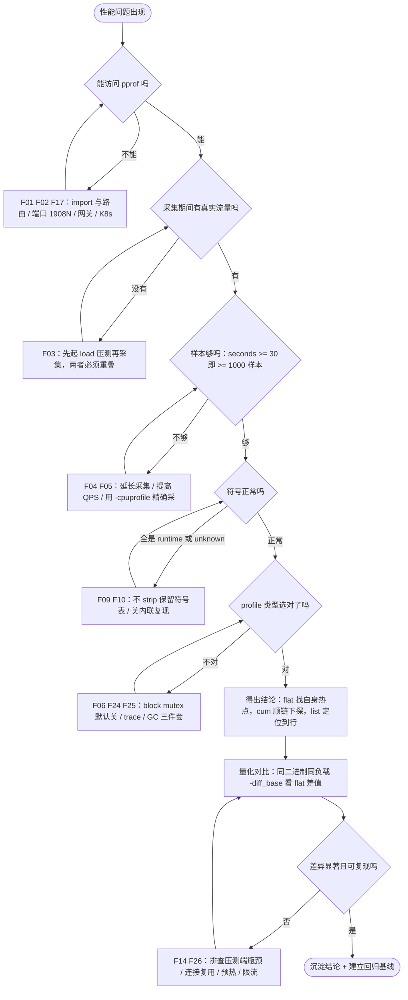
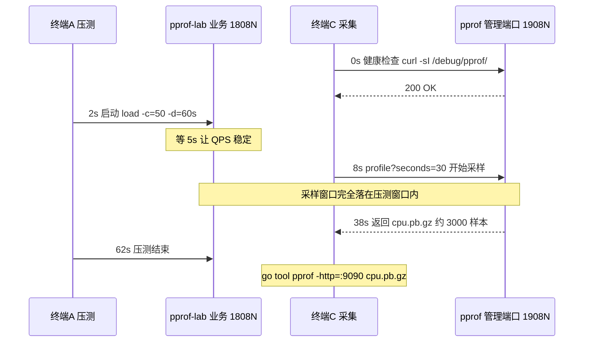

# 05 · 常见问题排查手册

> 属于「架构师修炼」· 19 pprof 实战 · 第 5 篇：pprof 使用中的坑与排查手册
> 上一篇：[04 goroutine 与锁阻塞实战](./04-goroutine与锁阻塞实战)｜下一篇：[06 生产环境 pprof 实践](./06-生产环境pprof实践)｜栏目总览：[架构师修炼](../)

> **这篇解决什么问题**：前四篇讲「正确的姿势」，这一篇讲「姿势之外的所有意外」。第一次用 pprof，90% 的时间不是花在分析上，而是花在四件事上——**抓不到数据、图里全是 runtime、block profile 是空的、改完指标没动**。
> 本篇是**字典**：27 条 FAQ（F01~F27）统一按「现象 → 原因 → 解决 → 验证」四段式排列。遇到问题先查「30 秒定位表」，再跳编号复制命令。目标只有一个：**省下你三个晚上的试错**。

**阅读约定**：`1808N` / `1908N` 指本栏目样例的**业务端口** / **pprof 管理端口**（= 业务端口 + 1000，如 L01 → 18081 / 19081）；代码在 `code/architect/pprof-lab`（module `gocampus/perf/pprof-lab`，go 1.22，仅标准库），`-fix=true` 启动修复实现用于前后对比；命令默认已 `cd code/architect/pprof-lab`。

---

## 一、30 秒定位表

先看症状，再跳编号；带链接的表示还需要配套篇章的机制说明。

| 症状（你会说的话） | 最可能的 FAQ | 顺带看 |
| --- | --- | --- |
| pprof 页面打不开：404 / connection refused | **F01**、F02、F17 | [06 生产环境实践](./06-生产环境pprof实践) |
| 页面能开，`go tool pprof` 却报 404 / 格式无法识别 | **F02**、F08 | — |
| CPU profile 几乎是空的，只剩 `runtime.*` | **F03**、F04 | [02 CPU 火焰图](./02-CPU火焰图实战) |
| 火焰图全是 `runtime.*` 或 `<unknown>`，看不到我的函数 | **F09**、F10、F13 | [02 CPU 火焰图](./02-CPU火焰图实战) |
| block / mutex profile 永远是空的 | **F06** | [04 goroutine 与锁阻塞实战](./04-goroutine与锁阻塞实战) |
| 内存只涨不降，heap profile 里找不到可疑函数 | **F05**、F25 | [03 内存与 GC 实战](./03-内存与GC实战) |
| P99 在抖，但 CPU 不高、火焰图很"散" | **F12**、F24、F06 | [04](./04-goroutine与锁阻塞实战)、[06](./06-生产环境pprof实践) |
| 优化做完了，压测数字对不上 / 没变化 | **F14**、F26 | [07 实战案例集](./07-实战案例集) |
| 采集本身把服务拖慢，不敢在生产采 | **F20**、F21、F22 | [06 生产环境 pprof 实践](./06-生产环境pprof实践) |
| 容器 / K8s 里够不着 pprof 端口 | **F17**、F18 | [K8s · 故障排查与生产实践](/k8s-code教程/13-故障排查与生产实践) |
| `runtime/trace` 抓下来了，完全看不懂 | **F24** | [06 生产环境 pprof 实践](./06-生产环境pprof实践) |
| `go tool pprof` 直接报 `go: no such tool "pprof"` | **F27** | [02 CPU 火焰图](./02-CPU火焰图实战) |

**一句话心法**：**能访问 → 有流量 → 够时长 → 有符号 → 选对类型 → 再谈结论**。顺序错了，后面全是白工。

### 1.1 profile 类型与默认开关

这张表决定了 80% 的「为什么是空的」——默认不开的，必须改代码并重启。

| profile | 端点 | 默认开启 | 采样 / 触发机制 | 最擅长回答 |
| --- | --- | --- | --- | --- |
| CPU | `/debug/pprof/profile?seconds=30` | 按需（请求即启动） | 100Hz `SIGPROF` 定时采样调用栈 | 谁在烧 CPU |
| heap | `/debug/pprof/heap` | ✅ | `MemProfileRate = 512KiB` 平均采样 | 谁在分配 / 谁在持有 |
| allocs | `/debug/pprof/allocs` | ✅ | 同上（累计分配视角） | 分配总量热点 |
| goroutine | `/debug/pprof/goroutine` | ✅ | 读取时抓取全部 goroutine 栈 | 泄漏 / 卡在哪 |
| threadcreate | `/debug/pprof/threadcreate` | ✅ | 读取时抓取创建线程的栈 | 线程暴涨（CGO） |
| **block** | `/debug/pprof/block` | ❌ **默认关闭** | `SetBlockProfileRate(0)`；按**阻塞时长**采样事件 | 谁被阻塞、等了多久 |
| **mutex** | `/debug/pprof/mutex` | ❌ **默认关闭** | `SetMutexProfileFraction(0)`；按**次数**采样竞争事件 | 哪把锁在争 |
| trace | `/debug/pprof/trace?seconds=5` | 按需 | 全事件跟踪（不是采样） | 时间去哪了、谁被谁阻塞 |

### 1.2 采集开销与采样率

| profile | 采样机制 | 默认值 | 开销量级 | 生产建议 |
| --- | --- | --- | --- | --- |
| CPU | 每 10ms 信号 + 栈回溯 | 固定 100Hz | **约 1%~5%**（栈越深越贵） | 30s 一次够用，别采 300s |
| heap | 每分配约 512KiB 记一次 | `MemProfileRate=512*1024` | 常驻 ~1%~2%，读取时短暂停顿 | 保持默认；查漏时连续两次做差 |
| heap（调小 rate） | 每 1B~1KiB 记一次 | `MemProfileRate=1` | **CPU/内存可达数倍** | ❌ 只用于本地复现 |
| goroutine | 全量栈快照 | 无 | 与 goroutine 数成正比 | 数万级 goroutine 时别高频抓 |
| block | 阻塞事件计时采样 | `rate=0`（关） | rate 越小越贵 | `rate=10000` 起步 |
| mutex | 竞争事件计数采样 | `fraction=0`（关） | fraction 越小越贵 | `fraction=100~1000` 起步 |
| trace | 全事件记录 | 无 | **最高**，且缓冲区常驻内存 | 3~5s，低谷期，灰度一台 |

### 1.3 常见误判对照

| 你看到的 | 常见误判 | 真相 | 该做什么 |
| --- | --- | --- | --- |
| `top -cum` 第一行是 `runtime.goexit` | 「程序全耗在 runtime 里」 | 那是调用栈的根 | 往下找第一处**自己的代码**（F13） |
| `flat` 最大的那个函数 | 「瓶颈源头就是它」 | `flat` 只是它**自身**的耗时 | 配合 `cum` 判断是否在"帮别人背锅"（F11） |
| heap 的 `inuse_space` 很大 | 「内存泄漏了」 | 可能只是高水位常驻 | 看多次快照的**斜率**（F05、[03](./03-内存与GC实战)） |
| goroutine 数与 `/api/task/count` 不一致 | 「泄漏了 / 计数写错了」 | 采样时刻不同，runtime 自身也占 goroutine | 用 `?debug=2` 数栈（F07） |
| `gcBgMarkWorker` 占 CPU 很高 | 「GC 是根因」 | GC 是**结果**，分配才是根因 | 去看 alloc profile（F25、[03](./03-内存与GC实战)） |
| 火焰图很散、每层都很窄 | 「没有瓶颈」 | 典型的扇出 / 抖动形态 | `top -cum` + trace（F12、F24） |
| `-diff_base` 结果全是负值 | 「工具坏了」 | 负值 = 新版这里**变少了**（好事） | 按 flat 差值排序（F14） |
| 压测 QPS 上不去 | 「服务到极限了」 | 可能是压测端 / 连接复用 / 限流 | 先看压测进程自己的 CPU（F26） |

---

## 二、A 组 · 抓不到数据（采样与采集类）

### F01 · `/debug/pprof/` 404 或 connection refused

**现象**：浏览器 404，或 `curl` 直接 `Connection refused`；业务接口一切正常。
**原因**：① 没有引入 `net/http/pprof`（空导入或显式注册）；② 注册到了 `http.DefaultServeMux`，而业务用了自己的 mux；③ 查错端口（业务 `1808N` / pprof `1908N`）；④ 只监听 `127.0.0.1`，容器外访问不到。
**解决**：先确认端口在听，再确认 handler 被注册。

```bash
ss -ltnp | grep -E '1808|1908'   # macOS: lsof -nP -iTCP -sTCP:LISTEN | grep -E '1808|1908'
curl -sI http://127.0.0.1:19081/debug/pprof/ | head -3   # 结尾斜杠不能少
```
```go
// 本栏目样例 internal/labkit 的做法：业务 mux 与 pprof mux 分离，pprof 跑独立管理端口
mux := http.NewServeMux()
mux.HandleFunc("/debug/pprof/", pprof.Index) // heap/goroutine/allocs/block/mutex 走子树匹配
mux.HandleFunc("/debug/pprof/profile", pprof.Profile)
mux.HandleFunc("/debug/pprof/trace", pprof.Trace) // cmdline / symbol 同理
// http.ListenAndServe("127.0.0.1:19081", mux)
// 另一种常见写法：import _ "net/http/pprof" 后 http.ListenAndServe("127.0.0.1:19081", nil)
```

**验证**：`curl -s -o /dev/null -w '%{http_code}\n' http://127.0.0.1:19081/debug/pprof/` 输出 `200`，页面上能看到 `profile`、`heap`、`goroutine`、`block`、`mutex` 链接。

---

### F02 · `go tool pprof` 报 `server response: 404` / `unrecognized profile format`

**现象**：pprof 报 404；或下载成功但解析报 `unrecognized profile format`。
**原因**：① URL 少了 `/debug/pprof/`，或 `?seconds=30` 没加引号被 shell 吃掉；② 打到网关/HTTPS 入口，路径被 rewrite 或返回登录页；③ 走了代理，返回一段 HTML 错误页被当成 profile。
**解决**：**先验证内容类型，再喂给 pprof**。

```bash
URL='http://127.0.0.1:19081/debug/pprof/profile?seconds=30'
curl -sS -D- -o /dev/null --max-time 40 "$URL" | grep -i '^content-type'
# 期望：Content-Type: application/octet-stream；若是 text/html 说明被网关/代理改写了
curl -sS --max-time 40 "$URL" | head -c 200 | cat -v   # 看开头是不是 HTML
go tool pprof -http=:9090 "$URL"                        # 直连确认后再交给 pprof
```

**验证**：`curl -sS -o /tmp/cpu.pb.gz "$URL" && file /tmp/cpu.pb.gz` 含 `gzip compressed data`；`go tool pprof -top -nodecount=5 /tmp/cpu.pb.gz` 能打印函数名。

---

### F03 · CPU profile 采出来几乎是空的，只有 `runtime.*`

**现象**：火焰图很短，`top` 只有 `runtime.mcall`、`runtime.gopark`，业务函数总占比个位数。
**原因**：① **采集期间没有流量**——采样采的是"正在运行的代码"，没请求就只能采到空闲的调度器；② `seconds` 太短：100Hz 下 10s 只有约 1000 样本，5% 的热点只有 50 个样本。**经验规则：样本 ≥ 1000 才好下结论**，实践直接采 30s（≈3000 样本）。
**解决**：**压测与采集必须重叠**，且先起流量再采样。

```bash
# 终端 A：起样例（业务 18081 / pprof 19081）
go run ./cmd/l01-cpu-hotspot -addr=127.0.0.1:18081 -pprof-addr=127.0.0.1:19081
# 终端 B：先起压测，跑 60s 覆盖采集窗口
go run ./cmd/load -url='http://127.0.0.1:18081/api/render?n=2000' -c=50 -d=60s
# 终端 C：等压测稳定 5s 后，采集 30s
go tool pprof -http=:9090 'http://127.0.0.1:19081/debug/pprof/profile?seconds=30'
```

**验证**：`top` 顶部的 `Total samples` 应 ≈ `seconds × 100`；前 10 名里出现 `gocampus/perf/pprof-lab/...` 或 `encoding/json` 即采到位。

---

### F04 · 短函数 / 低频路径在 CPU profile 里看不到

**现象**：确定某段代码被频繁调用，火焰图里完全没有它，或占比明显偏低。
**原因**：CPU profile 是 **100Hz 定时采样**（每 10ms 一次）：一个只跑 50µs 的函数被采样撞上的概率约 0.5%，总占比 < 1% 的路径天然采不到。这是统计特性，不是 bug。
**解决**：三条替代路线。

```bash
# ① 提高 QPS / 延长时长，让"占比"变大（最贴近线上真实情况）
go run ./cmd/load -url='http://127.0.0.1:18081/api/render?n=2000' -c=200 -d=120s
# ② benchmark 精确采集：无网络噪声、样本密度高（样例里是 Bug / Fix 一对）
go test -run=^$ -bench='BenchmarkRender' -benchtime=30s -cpuprofile=cpu.out ./cmd/l01-cpu-hotspot
go tool pprof -http=:9090 cpu.out
```

```go
import "runtime/trace"
// ③ 埋点式定位：trace.WithRegion 给可疑阶段打标签，在 trace 里按 region 看耗时
trace.WithRegion(ctx, "render-encode", func() { encode(w, payload) })
```

**验证**：benchmark 的 `-cpuprofile` 里该函数占比应明显高于线上 profile；若只在 benchmark 里能看到，说明它在真实负载下确实不是瓶颈——**benchmark 结论不能直接当线上结论**。

---

### F05 · heap profile 里看不到我怀疑的函数

**现象**：明知某处分配大，`inuse_space` 里却找不到它。
**原因**：heap 默认 **`MemProfileRate = 512 * 1024`**（平均每分配 512KiB 记一次），小对象、低频分配、被内联到调用方的分配都会漏；且 heap 是**快照**，对象已回收就不会出现在 `inuse_*`（要看 `alloc_*`）。
**解决**：临时调小采样率复现，**代价必须写进注释**。

```go
func init() {
	// 仅本地复现：近似全量记录分配，CPU/内存开销可达数倍，生产严禁
	runtime.MemProfileRate = 1
}
```
```bash
GODEBUG=memprofilerate=1 go run ./cmd/l02-alloc-gc   # 采完立刻去掉
# 三个视角：持有 / 累计分配 / 分配次数
go tool pprof -sample_index=inuse_space -top -nodecount=20 'http://127.0.0.1:19082/debug/pprof/heap'
go tool pprof -sample_index=alloc_space -top -nodecount=20 'http://127.0.0.1:19082/debug/pprof/heap'
```

**验证**：调小 rate 后目标函数出现在 `alloc_space` 里，说明它确实在分配（只是被采样漏掉）；若依然没有，说明怀疑错了，转 [03 内存与 GC 实战](./03-内存与GC实战) 的三类泄漏判别。

---

### F06 · block / mutex profile 永远是空的

**现象**：`/debug/pprof/mutex`、`/debug/pprof/block` 抓下来是空的，或只有一两行。
**原因**：**这两个 profile 默认关闭**（`SetBlockProfileRate(0)`、`SetMutexProfileFraction(0)`），空结果**无法证明没有竞争**；而且它**必须在业务代码里开启并重启进程**，从外部打不开。
**解决**：在 `main` 开头开启，采样率做成 flag 便于生产调整。

```go
// 样例 internal/labkit 在启动时就用下面的方式打开（实验室取全量，便于复现）
runtime.SetBlockProfileRate(1)     // 0 = 关闭（默认）；1 = 记录全部阻塞事件
runtime.SetMutexProfileFraction(1) // 0 = 关闭（默认）；1 = 记录全部竞争事件

// 生产建议把采样率做成 flag 并按需调低（示例）：
// runtime.SetBlockProfileRate(10000)   // ≈ 每阻塞 10µs 采样一次
// runtime.SetMutexProfileFraction(100) // 每 100 次竞争记一次
```
```bash
go run ./cmd/l04-lock-contention -pprof-addr=127.0.0.1:19084
go run ./cmd/load -url='http://127.0.0.1:18084/api/counter?k=hot' -c=100 -d=30s
go tool pprof -http=:9090 'http://127.0.0.1:19084/debug/pprof/mutex'
```

**注意**：block 是累计型 profile，`?seconds=` 在部分版本不生效，抓到的是"自进程启动以来"的数据——**改完配置务必重启**，否则看到的是旧配置下的零结果。
**验证**：`curl -s 'http://127.0.0.1:19084/debug/pprof/mutex?debug=1' | head -20` 非空；`-top` 里出现 `sync.(*Mutex).Lock` 且 `contentions` > 0。可用 `-fix=true` 前后各采一次做对照。

---

### F07 · goroutine 数与 `/api/task/count`、`runtime.NumGoroutine()` 对不上

**现象**：pprof 显示 1200 个、`/api/task/count` 说 300 个、`runtime.NumGoroutine()` 又是 1215。
**原因**：三个数字本就不该相等——① **采样时刻不同**；② `?debug=1` 是**聚合视图**，相同栈合并成一行带计数，数行数会少算；③ runtime 自身也有 goroutine（GC worker、netpoller、scavenger、finalizer）；④ 业务计数通常只算"任务 goroutine"，不含每连接的读写 goroutine。
**解决**：统一口径，同一时刻取两种视图对比。

```bash
curl -s 'http://127.0.0.1:19083/debug/pprof/goroutine?debug=1' | head -40   # 形态
curl -s 'http://127.0.0.1:19083/debug/pprof/goroutine?debug=2' | grep -c '^goroutine '  # 数量最准
curl -s 'http://127.0.0.1:18083/api/task/count'; echo                        # 业务计数
```

**验证**：间隔 30s 连采三次构造**斜率**：`debug=2` 的计数单调上涨而业务计数持平 → 确认泄漏（L03 典型：Ticker 未停、无退出信号）。斜率一致才叫"对得上"，单点相等没有意义。

---

### F08 · 下载到的 profile 是 gzip 却打不开

**现象**：`curl ... > cpu.pb.gz` 后 `gunzip` 报错，或 `go tool pprof` 报格式错误；`file` 明明说是 gzip。
**原因**：① `curl` 没加 `-o`，二进制直接刷到终端被重绘破坏（最常见）；② 经过网关/代理被转码（多包了一层编码）；③ 重定向与 `--compressed` 组合不当。
**解决**：**永远用 `-o` 落盘**，用 `--compressed` 让 curl 处理编码层。

```bash
curl -sS --compressed --max-time 40 \
  -o cpu.pb.gz 'http://127.0.0.1:19081/debug/pprof/profile?seconds=30'
file cpu.pb.gz     # 期望 gzip compressed data
ls -l cpu.pb.gz    # 30s CPU profile 通常 20KB~2MB
go tool pprof -top -nodecount=3 cpu.pb.gz
```

**验证**：`file` 输出含 `gzip compressed data` 且 `-top` 能打印函数表；若 `file` 说是 `HTML document` / `ASCII text`，回到 F02 查网关。

---

## 三、B 组 · 图看不懂（符号、内联、视图类）

### F09 · 火焰图只有 `runtime.*` 或 `<unknown>`

**现象**：图能画出来，但全是 `runtime.mallocgc` 之类，自己的函数名一个都没有，甚至出现裸地址和 `<unknown>`。
**原因**：二进制被 **strip**——`go build -ldflags="-s -w"` 去掉符号表与 DWARF，pprof 无法把地址映射回函数名；其次是**跑的程序和手上那份二进制不是同一个**（交叉编译、容器里另一个架构/版本）。
**解决**：生产镜像**保留符号表**（多几 MB 换可定位性，绝对划算）；已 strip 的用远端符号化。

```bash
go build -ldflags="-s -w" -o app ./cmd/l01-cpu-hotspot   # ❌ 会毁掉火焰图
go build -o app ./cmd/l01-cpu-hotspot                    # ✅ 保留符号 + 构建信息
go version -m app | head -5
# 已 strip：请求目标进程提供符号（需 /debug/pprof/symbol 可达）
go tool pprof -symbolize=remote -http=:9090 'http://127.0.0.1:19081/debug/pprof/profile?seconds=30'
# 或把同一份二进制喂给 pprof，profile 从远端拉
go tool pprof -http=:9090 ./app 'http://127.0.0.1:19081/debug/pprof/profile?seconds=30'
```

**验证**：`go tool nm ./app | grep -c 'pprof-lab'` 大于 0 说明有符号；火焰图里出现 `gocampus/perf/pprof-lab/...` 全路径函数名。

---

### F10 · 函数被内联后消失或行号错乱

**现象**：写了 `encodeJSON()` 并调用几十万次，火焰图里没有它，时间都在调用方头上；`list` 的行号对不上源码。
**原因**：Go 会把小函数**内联**，内联后没有独立栈帧，采样只能归到调用者；行号偏差多来自优化重排（`-N` 关闭优化即可对齐）。
**解决**：定位阶段关内联/关优化；**验证阶段必须用生产构建**，不要拿调试构建的性能数字当结论。

```bash
go build -gcflags='-m' ./cmd/l01-cpu-hotspot 2>&1 | grep -i 'can inline' | head -20
go run -gcflags='all=-l' ./cmd/l01-cpu-hotspot        # 只关内联，性能损失小
go run -gcflags='all=-N -l' ./cmd/l01-cpu-hotspot     # 全关优化：行号最准，明显变慢
```

**验证**：关内联后目标函数作为**独立节点**出现；`go tool pprof -list='.*encodeJSON'` 的逐行耗时与源码行号一致。记住：内联丢失的是**名字**，不丢失**时间**——总耗时归属不会凭空消失。

---

### F11 · `flat` 和 `cum` 看反了导致改错地方

**现象**：盯着 `flat` 最大的函数改了半天没效果；或只改 `cum` 最高的顶层函数（它只是入口，改不动）。
**原因**：`flat` = 该函数**自身**执行耗时；`cum` = 该函数**及其所有子调用**的累计耗时。顶层函数 `cum` 必然很高，这不是信息。
**一行判定**：**宽而平（自身占比大）→ 看 `flat`，就是它**；**宽而深（子树大、自身小）→ 顺 `cum` 往下走，直到 `flat` 开始变大的那一层**。

```bash
go tool pprof -top -nodecount=20 cpu.pb.gz          # 按 flat 排序（默认）
go tool pprof -top -cum -nodecount=20 cpu.pb.gz     # 按 cum 排序，看调用链总账
go tool pprof -peek='serialize' cpu.pb.gz           # 某个函数的上游/下游
go tool pprof -list='render' cpu.pb.gz              # 定位到行
```

**验证**：改完后 `flat` 下降的函数正是你改的那个；若只有 `cum` 动、`flat` 没动，说明你改的是它的下游，需重新确认因果链。

---

### F12 · 火焰图很"散"、每个函数都很窄

**现象**：几百个函数宽度都差不多，找不到"又宽又红"的热点。
**原因**：典型的**扇出 / 抖动**形态：① 调用栈种类多（参数分支多、反射与序列化路径分散）；② GC 与调度穿插在各层（`runtime.gcBgMarkWorker`、`runtime.mcall` 遍布）；③ 真正瓶颈不在 CPU，而在阻塞/IO，CPU 只是顺带抖一下。
**解决**：换视图，别硬看火焰图。

```bash
go tool pprof -top -cum -nodecount=30 cpu.pb.gz      # 找共同祖先
go tool pprof -traces cpu.pb.gz | head -60           # 看最典型的几条完整栈
GODEBUG=gctrace=1 go run ./cmd/l02-alloc-gc 2>&1 | head -20   # 确认是不是 GC 在抖
go tool pprof -http=:9090 'http://127.0.0.1:19085/debug/pprof/block'  # 不是 CPU 问题就查阻塞
```

**验证**：`top -cum` 能把散的形态收拢成 2~3 个主要祖先；`gctrace` 若显示 `gc 30 @12.5s 3%: ...`（占比 > 10%）则确认 GC CPU 主导，转 [03 内存与 GC 实战](./03-内存与GC实战)。

---

### F13 · `top -cum` 第一行是 `runtime.goexit` / `runtime.main`

**现象**：`top -cum` 排名第一是 `runtime.goexit` 或 `runtime.main`，占比接近 100%。
**原因**：这是**调用栈的根**，所有 goroutine 的栈都挂在它下面，100% 完全正常，但它不提供任何信息。
**解决**：顺着往下看**第一处属于自己模块的代码**，那就是该接手分析的位置。

```bash
go tool pprof -top -cum -nodecount=50 cpu.pb.gz | grep -m5 'pprof-lab'
go tool pprof -focus='pprof-lab' -top -nodecount=20 cpu.pb.gz   # 只看自己模块及其下游
go tool pprof cpu.pb.gz   # 交互模式：top -cum → list render → peek encoding/json.Marshal
```

**验证**：`focus='pprof-lab'` 的占比 × 总样本数 = "这次有多少 CPU 真正花在业务上"，这个数字在面试里非常能打。

---

### F14 · `-diff_base` 对比报 `incompatible` / 结果全是负值

**现象**：`-diff_base` 报 `incompatible`；或能跑但数字全负，看着像工具坏了。
**原因**：① **base 与 new 必须来自同一份二进制、同一工作负载、同一采集时长**——换过构建（尤其改过 `-gcflags`）、换过压测参数、时长差一倍，样本类型与周期就不匹配；② **负值是正确的**：新版本在这个函数上花的 CPU **变少了**。
**解决**：固定变量采集，按 flat 差值排序看收益。

```bash
go run ./cmd/l01-cpu-hotspot -pprof-addr=127.0.0.1:19081
curl -sS --compressed -o before.pb.gz 'http://127.0.0.1:19081/debug/pprof/profile?seconds=30'
go run ./cmd/l01-cpu-hotspot -fix=true -pprof-addr=127.0.0.1:19081
curl -sS --compressed -o after.pb.gz  'http://127.0.0.1:19081/debug/pprof/profile?seconds=30'
go tool pprof -top -diff_base=before.pb.gz -nodecount=20 after.pb.gz   # 负值 = 新版更省
go tool pprof -http=:9090 -diff_base=before.pb.gz after.pb.gz
```

**验证**：diff 报告里最大的**负值**应正对应你改动的函数；再用压测的 QPS/P99 交叉验证，profile 说省多少、压测说快多少，方向必须一致。

---

### F15 · Graph 视图里的 `(inline)`、虚线边、红色节点

**现象**：图里有些节点带 `(inline)`，有些边是虚线，节点颜色深浅不一，不确定是不是出错。
**原因**：这些全是正常的语义标注。

| 元素 | 含义 | 你该做什么 |
| --- | --- | --- |
| `(inline)` / `(partial-inline)` | 该帧是被**内联**展开的调用 | 想让它独立成节点就按 F10 关内联复现 |
| **虚线边** | 递归调用（或权重极小被裁剪的边） | 判断递归能否转迭代，别无脑优化 |
| **红色节点** | 该节点 `cum` 占比高，越红越高 | 点开看 `flat` 明细再决定改谁 |
| 灰色/缺失节点 | 占比低于 `-nodefraction`（默认 0.5%）被裁掉 | 用 `-nodefraction=0.001` 才显示 |

**解决**：需要看全图时调整裁剪阈值。

```bash
go tool pprof -http=:9090 -nodefraction=0.001 cpu.pb.gz
go tool pprof -dot -nodefraction=0.002 cpu.pb.gz > graph.dot   # -dot 导出 DOT（要图用 -svg/-pdf/-web）
```

**验证**：节点颜色与 `top` 的 `cum` 排位一致；对任一节点执行 `list` 能看到源码行（否则回到 F09 查符号）。

---

### F16 · 采样标签用不上 / `-tags` 不生效

**现象**：代码里加了 `pprof.Labels`，但 `-tags`、`-tagfocus` 没反应，报 `no tags`。
**原因**：① **只有支持 label 的 profile 才带标签**——CPU 与 heap 支持，block/mutex/goroutine 不支持；② 必须用 `pprof.Do` 包住实际执行的代码，只 `SetGoroutineLabels` 不会传播到采样点；③ 标签有额外开销（每次设置会拷贝 label map），热点路径滥用会明显变慢。
**解决**：用 `pprof.Do` 划定作用域，按业务维度（接口、阶段、租户）打标。

```go
import "runtime/pprof"

func handleRender(w http.ResponseWriter, r *http.Request) {
	ctx := pprof.WithLabels(r.Context(), pprof.Labels("stage", "render"))
	pprof.Do(ctx, pprof.Labels("stage", "render"), func(ctx context.Context) {
		payload := build(ctx) // 这段的 CPU 样本会带上 stage=render
		encode(w, payload)
	})
}
```
```bash
go tool pprof -tags -top -nodecount=10 cpu.pb.gz                  # 列出 profile 中的标签维度
go tool pprof -tagfocus='stage=render' -top -nodecount=15 cpu.pb.gz   # 只看某个标签
go tool pprof -tagignore='stage=cache' -top -nodecount=15 cpu.pb.gz   # 排除某个标签
```

**验证**：`-tags` 能列出 `stage` 及其取值；`-tagfocus` 后的样本总数明显小于全量（说明过滤生效）。两者都无输出时，先确认抓的是 CPU 或 heap profile——block/mutex 一定没有标签（F06）。

---

## 四、C 组 · 环境与工具类

### F17 · 容器 / K8s 里 pprof 访问不到

**现象**：本机可用，进 K8s 就 `connection refused` 或超时，`port-forward` 也说连不上。
**原因**（按排查顺序）：① pprof 只绑 `127.0.0.1`，跨容器访问不到；② 容器端口未映射/未 `EXPOSE`；③ Service 只暴露业务端口（`1808N`），pprof 端口（`1908N`）不在 Service 里——**这其实是正确做法**；④ NetworkPolicy 拦截；⑤ Sidecar（service mesh）接管流量导致端口不转发。
**解决**：**从 Pod 内开始验，逐层往外**，不要一上来就折腾 Service / Ingress。

```bash
kubectl -n prod get pod -l app=pprof-lab -o wide
kubectl -n prod exec -it deploy/pprof-lab -- sh -c \
  'wget -qO- http://127.0.0.1:19081/debug/pprof/ | head -5'      # ① Pod 内自测
kubectl -n prod exec -it deploy/pprof-lab -- sh -c \
  'netstat -ltnp 2>/dev/null | grep 1908'                        # ② 看监听地址
kubectl -n prod port-forward deploy/pprof-lab 19081:19081        # ③ 本地转发（生产标准姿势）
go tool pprof -http=:9090 'http://127.0.0.1:19081/debug/pprof/profile?seconds=30'
```

**验证**：Pod 内 `wget` 返回 200；`port-forward` 后本地 `curl -sI http://127.0.0.1:19081/debug/pprof/` 返回 200。完整链路见 [K8s Code 教程 · 13 故障排查与生产实践](/k8s-code教程/13-故障排查与生产实践)。

---

### F18 · `go tool pprof` 与目标程序 Go 版本不一致导致解析异常

**现象**：profile 能下下来，但解析报错、样本类型缺失，或个别视图打不开。
**原因**：profile 是 protobuf，其 sample type 与 period 语义随 Go 版本演进，跨版本解析在部分视图上会异常；生产容器里通常**没有 go 工具链**，无法在容器内分析。
**解决**：统一工具链；容器无工具链时，**本地采远程 profile**（采集与分析分离）。

```bash
go version                        # 本地工具链
go version -m ./app | head -3     # 目标二进制记录的构建版本（含 vcs 信息）
curl -sS --compressed --max-time 40 -o cpu.pb.gz \
  'http://127.0.0.1:19081/debug/pprof/profile?seconds=30'
go tool pprof -http=:9090 cpu.pb.gz
go tool pprof -http=:9090 ./app cpu.pb.gz   # 镜像被 strip 时，把同一份二进制一起带上
```

**验证**：`go version -m ./app` 的 `go1.22.x` 与本地 `go version` 的 major.minor 一致；profile 顶部能正常显示 `Type` / `Duration` / `Total samples` 而不报错。

---

### F19 · macOS / Linux 上 `go tool pprof -http` 打不开浏览器

**现象**：命令跑起来没报错，浏览器就是不弹；或远程服务器上根本没有 GUI。
**原因**：① 无头环境（SSH/容器）没有默认浏览器；② 浏览器命令缺失（Linux 缺 `xdg-open`）；③ 端口绑定范围问题——`-http=127.0.0.1:9090` 只绑回环，`-http=:9090` 绑所有网卡。
**解决**：加 `-no_browser`（等价写法 `--no_browser`）后手动访问；远程用 `:9090` + SSH 隧道。

```bash
go tool pprof -http=127.0.0.1:9090 -no_browser cpu.pb.gz   # 手动开 http://127.0.0.1:9090/ui/
PPROF_BROWSER=/usr/bin/open go tool pprof -http=:9090 cpu.pb.gz   # 指定浏览器（macOS）
go tool pprof -http=:9090 -no_browser cpu.pb.gz    # 服务器上绑所有网卡
ssh -L 9090:127.0.0.1:9090 user@server             # 本地建隧道，再开 http://127.0.0.1:9090/ui/
```

**验证**：`curl -sI http://127.0.0.1:9090/ui/ | head -1` 返回 `200`，说明服务已起、问题只在浏览器；隧道下浏览器能打开 `/ui/`。

---

### F20 · 采集时业务明显变慢 / 内存涨

**现象**：一采 profile，QPS 掉、P99 抬升，采完恢复；或采集期间 RSS 上涨。
**原因**：采集不是免费的。**CPU profile** 每 10ms 一次信号 + 栈回溯，占 **约 1%~5%**（栈越深越贵）；**heap** 分配期开销小，但**读取时要短暂停顿**（写快照）；**block/mutex** 采样率开得越高，事件路径记账越多；**trace** 全事件记录，开销最高且缓冲区常驻内存。
**解决**：生产采集四条约束缺一不可——**低采样率 + 短时窗 + 低谷期 + 灰度一台**。

```bash
curl -sS 'http://127.0.0.1:19084/debug/pprof/block?seconds=300'   # ❌ 反例：全量采样 + 300s
# ✅ 正例：启动时把采样率调低（SetBlockProfileRate(10000) / SetMutexProfileFraction(100)），只采 30s
curl -sS --max-time 40 -o cpu.pb.gz 'http://10.0.3.17:19081/debug/pprof/profile?seconds=30'
```

**验证**：采集前后 QPS 差值应 **< 5%**；超过就缩短 `seconds`、降采样率或改到低谷期。生产完整方案见 [06 生产环境 pprof 实践](./06-生产环境pprof实践)。

---

### F21 · `curl` 一次性把自己打挂

**现象**：为了"看得更准"跑了 `/debug/pprof/profile?seconds=300` 然后忘了；服务被长时间占着，甚至几个并发请求把管理端口压满。
**原因**：CPU profile **同一时刻只能有一个在跑**，并发的第二个请求会**排队等待**；每次长采集都占一个连接和一个 goroutine 并持续采样。管理端口通常没有限流，几个 `curl` 就能挤掉健康检查。
**解决**：给命令加**硬性时长上限**。

```bash
timeout 45 curl -sS --compressed --max-time 40 \
  -o cpu.pb.gz 'http://127.0.0.1:19081/debug/pprof/profile?seconds=30'
timeout 15 curl -sS --max-time 10 -o trace.out \
  'http://127.0.0.1:19081/debug/pprof/trace?seconds=5'   # trace 更贵，控制在 3~5s
```

**规范上限**：CPU ≤ 60s；trace ≤ 5s；block/mutex 抓取瞬间完成，但采样率必须已在启动时配好。
**验证**：采集结束后管理端口立即恢复响应，且采集期间健康检查仍返回 200。

---

### F22 · pprof 端口暴露公网 / 被扫描

**现象**：安全扫描报告 `/debug/pprof/` 可达；更糟的是有人用 `?seconds=300` 反复打，形成**低成本 DoS**（该端点没有认证与限流）。
**原因**：管理端口和业务端口一样绑了 `0.0.0.0` 并挂在同一个 Ingress/安全组下。历史上多起 Go 服务信息泄露都始于暴露的 pprof：`/debug/pprof/cmdline` 能读到**命令行参数**，堆采样里能捞到**业务数据**。
**解决**：三条对策同时做。

```bash
go run ./cmd/l01-cpu-hotspot -pprof-addr=127.0.0.1:19081   # ① 独立管理端口，只绑本机/内网
# ② 网关层拒绝（Nginx）：location ^~ /debug/ { deny all; return 404; }
# ③ 安全组只放行跳板机与监控网段
```

**验证**：从公网 `curl -sI http://<公网IP>:19081/debug/pprof/` 应**超时或被拒绝**，内网/跳板机可达；网关访问日志中不再出现 `/debug/` 的 200。生产落地方案见 [06 生产环境 pprof 实践](./06-生产环境pprof实践)。

---

### F23 · `go test -bench` 里不知道怎么采

**现象**：想给某个函数做精确 profile，只知道 `go test -bench`，不知道怎么产出 profile 文件。
**原因**：`go test` 本身支持 profile 生成，不需要自己写 HTTP 端点；只是参数容易记混，且很多人忘了 `-run=^$`（导致普通单测也被跑一遍）。
**解决**：

```bash
go test -run=^$ -bench=. -benchmem -benchtime=10s \
  -cpuprofile=cpu.out -memprofile=mem.out ./...
go tool pprof -http=:9090 cpu.out
go tool pprof -http=:9091 mem.out
```
```go
var sink []byte // 结果写进 sink，避免被编译器优化掉

func BenchmarkRender(b *testing.B) {
	b.ReportAllocs()
	payload := buildPayload(2000) // 准备阶段放循环外
	b.ResetTimer()
	for i := 0; i < b.N; i++ {
		sink = render(payload)
	}
}
```

**bench 与线上的关键差异**：无网络、无锁竞争（基本单 goroutine）、缓存全热、无其他租户干扰。所以 bench 适合**定位函数级热点**，不适合下"线上瓶颈在哪"的结论；**锁竞争**用 `-cpu=1,4,8`（`ns/op` 随 `-cpu` 恶化即竞争）或抓线上 block/mutex（F06）；**下游 IO 等待**则在 bench 里根本不会出现，只能靠线上 `goroutine?debug=2` 的 `[IO wait]` 栈、`runtime/trace` 的 Network/Syscall blocking 视图与下游客户端指标（见 F06、F24）。
**验证**：`benchmem` 的 `ns/op`、`B/op`、`allocs/op` 与 profile 结论一致（`alloc_space` 最大者应对应 `B/op` 的主要来源）；若 `ns/op` 随 `-cpu` 急剧恶化，说明瓶颈在竞争而非计算。

---

### F24 · `runtime/trace` 抓了但看不出来

**现象**：`go tool trace trace.out` 打开一片密密麻麻的色块，完全不知道看什么。
**原因**：trace 与 pprof **分工不同**——pprof 回答"谁消耗了多少资源"，trace 回答"时间去哪了、谁被谁阻塞"。用 pprof 的思维看 trace 必然迷路。
**解决**：只按视图清单逐项看，别试图读完整个时间线。

```bash
timeout 15 curl -sS --max-time 10 -o trace.out \
  'http://127.0.0.1:19081/debug/pprof/trace?seconds=5'
go tool trace trace.out    # 输出本地 URL，浏览器访问
go tool trace -pprof=sched trace.out > sched.pb.gz   # 转成 pprof，用熟悉的视图看调度
go tool pprof -top -nodecount=20 sched.pb.gz
```

| 视图 | 回答什么问题 | 典型特征 |
| --- | --- | --- |
| View trace | 时间线上的 G/P/M 分布与 GC 停顿位置 | 大片空隙 = 没排上 CPU |
| **Goroutine analysis** | 哪个函数产生的 goroutine 阻塞最久 | 按阻塞总时长排序 |
| **Scheduler latency profile** | goroutine 就绪到运行等了多久 | P99 高 = CPU 抢不到 |
| **Network blocking profile** | 网络读写阻塞占比 | 下游慢的信号 |
| **Syscall blocking profile** | 系统调用阻塞占比 | 文件/日志写盘慢 |
| User-defined tasks/regions | 自己埋的 region 耗时 | `trace.WithRegion` 划分阶段 |

**验证**：Goroutine analysis 里"阻塞最久的函数"应与 block profile 结论互相印证；若 Scheduler latency P99 远大于服务自身 P99，瓶颈是 **CPU 不足/被限流**而非业务代码（见 F26）。

---

### F25 · GC 相关问题不知道该看哪个

**现象**：怀疑 GC 有问题，但不知道该用 `gctrace`、`runtime/metrics` 还是 heap profile。
**原因**：三者粒度不同——**每次 GC 的节奏** / **长期指标曲线与分位数** / **谁在分配**。
**一句判据**：想知道"**多久 GC 一次、每次停多久**" → `GODEBUG=gctrace=1`；想知道"**长期趋势、接告警**" → `runtime/metrics`；想知道"**谁把堆撑起来的**" → `alloc_space` / `inuse_space` profile。
**解决**：

```bash
GODEBUG=gctrace=1 go run ./cmd/l02-alloc-gc 2>&1 | head -30   # 逐次 GC 日志（短时排查）
```
```go
import "runtime/metrics"

samples := []metrics.Sample{ // 长期观测：交给 Prometheus / 日志
	{Name: "/gc/heap/live:bytes"},
	{Name: "/gc/heap/goal:bytes"},
	{Name: "/gc/cycles/total:gc-cycles"},
	{Name: "/sched/latencies:seconds"},
}
metrics.Read(samples)
```

**验证**：`gctrace` 行形如 `gc 12 @3.48s 5%: 0.5+2.1+0.3 ms clock ...`，`5%` 是 GC 占用的 CPU 比例，持续 > 10% 说明分配太猛；无流量时 `/gc/heap/live:bytes` 仍单调上涨才是泄漏。完整判别见 [03 内存与 GC 实战](./03-内存与GC实战)（本篇不重复）。

---

### F26 · 优化验证没效果 / 数字对不上

**现象**：profile 显示热点已被干掉，压测 QPS/P99 却毫无变化，甚至更差。
**原因**：五个经典"假验证"干扰源。

| 干扰源 | 检查方式 |
| --- | --- |
| **压测客户端成为瓶颈** | 压测机上 `top`，看 `cmd/load` 自身是否已 100% CPU |
| **连接复用差** | 对比 `-c=5` 与 `-c=50` 的 QPS，差距过大说明连接/池没复用 |
| **预热不足** | GC 阈值、连接池、热数据都要预热，丢头 10s 数据 |
| **容器 CPU limit 被限流** | 看 `nr_throttled` / `throttled_usec`；CPU 未满但延迟高多半是被限流 |
| **机器频率漂移 / 他人负载** | 固定机器，记录 load average，别在别人编译时压测 |

**解决**：先让压测本身可信，再谈优化。

```bash
pidstat -p "$(pgrep -f 'cmd/load')" 1 5   # ① 压测端自身 CPU（macOS: top -l 1 -o cpu | head）
cat /sys/fs/cgroup/cpu.stat               # ② 容器限流：throttled_usec 持续增长 = 被限流
for i in 1 2 3; do                        # ③ 同机、同并发、同时长，跑三轮取中位数
  go run ./cmd/load -url='http://127.0.0.1:18081/api/render?n=2000' -c=50 -d=30s
done
```

**可复现清单**：固定并发（`-c`）→ 固定时长（`-d`）→ 同一台机器 → 同一 URL 与参数 → 丢弃预热段 → 重复 3 次取中位数 → 同时记录 QPS / P50 / P95 / P99 / 错误数（`cmd/load` 已输出）。
**验证**：`before` 与 `after` 的中位数 QPS 差异 > 5% 且方向与 profile diff（F14）一致，才算优化有效；否则先修压测。

---

### F27 · `go tool pprof` 报 `go: no such tool "pprof"`

**现象**：Go 装得好好的、代码也跑着，但一敲 `go tool pprof` 就报错；`go tool` 不带参数列出来的名字里也没有 `pprof`（只有 asm / cgo / compile / cover / fix / link / preprofile / vet）。

**原因**：**不是 Go 移除了 pprof**。从 Go 1.26 起，`pprof` / `trace` / `nm` / `objdump` 这些工具**不再预编译**进 `$GOROOT/pkg/tool`，而是由 `go tool` 在首次调用时**按需从 `$GOROOT/src/cmd/pprof` 源码构建**（源码在，只是在等你去构建它）。所以 `go tool` 列出的名字只是"当前已存在"的工具，不代表能力清单。

于是这个报错通常只有两个真实成因：

| 成因 | 判据 | 修法 |
| --- | --- | --- |
| **`GOCACHE` 不可写**（最常见，容器 / CI / 受限沙箱里高发） | `go env GOCACHE` 指到只读目录或已满的盘；此时 `go tool pprof` 会直接报 `no such tool`，甚至不提示缓存问题 | 换成可写目录：`GOCACHE=$(mktemp -d) go tool pprof ...`，或修好该目录权限 |
| **Go 安装不完整 / 被裁剪** | `ls "$(go env GOROOT)/src/cmd/pprof"` 为空或不存在 | 重装官方发行版（或用下一行的独立二进制方案） |

**解决**：按顺序试这三条。

```bash
# ① 先确认源码在不在（在 → 说明是构建/缓存问题，不是安装问题）
ls "$(go env GOROOT)/src/cmd/pprof" | head

# ② 最常见修法：换个可写的构建缓存，立即可用
GOCACHE=$(mktemp -d) go tool pprof -http=:9090 'http://127.0.0.1:19081/debug/pprof/profile?seconds=30'

# ③ 需要一个能到处拷的独立二进制（需要网络）
go install github.com/google/pprof@latest
"$(go env GOPATH)/bin/pprof" -http=:9090 'http://127.0.0.1:19081/debug/pprof/profile?seconds=30'
```

**验证**：`GOCACHE=$(mktemp -d) go tool -n pprof` 应打印出一个 pprof 可执行文件路径而不是报错；之后所有 `go tool pprof` 命令与本手册其余章节**完全一致**（参数不变，不需要改写）。

> **面试/工程点**：这类"工具突然不可用"的问题，排查顺序永远是 **① 环境（缓存/权限/磁盘）→ ② 安装完整性 → ③ 替代安装**，而不是先怀疑工具本身被删了。CI 里跑 profile 分析时把 `GOCACHE` 指到工作目录，就是这个原因。

---

## 五、排障清单（按顺序做）

**顺序不可跳**：每一步都以前一步成立为前提。跳过"确认有流量"直接看火焰图，只会得出"程序很闲"的荒谬结论。



**正确的采集时序**：压测与采样必须重叠，且先有流量再采样。



---

## 六、命令速查

| 目的 | 命令 |
| --- | --- |
| 看有哪些 profile | `curl -sI http://127.0.0.1:19081/debug/pprof/` |
| 采 CPU 30s | `curl -sS --compressed --max-time 40 -o cpu.pb.gz 'http://127.0.0.1:19081/debug/pprof/profile?seconds=30'` |
| 采堆 / goroutine / block / mutex | `curl -sS -o heap.pb.gz '…:19081/debug/pprof/heap'`、`…:19083/debug/pprof/goroutine?debug=2`、`…:19085/debug/pprof/block`、`…:19084/debug/pprof/mutex` |
| 采 trace 5s | `timeout 15 curl -sS --max-time 10 -o trace.out 'http://127.0.0.1:19081/debug/pprof/trace?seconds=5'` |
| 看火焰图 / 自身热点 / 调用链总账 | `go tool pprof -http=127.0.0.1:9090 -no_browser cpu.pb.gz`、`-top -nodecount=20`、`-top -cum -nodecount=20` |
| 定位到行 / 看完整栈 / 只看自己模块 | `-list='render'`、`-traces \| head -60`、`-focus='pprof-lab'` |
| 前后对比 | `go tool pprof -top -diff_base=before.pb.gz -nodecount=20 after.pb.gz` |
| benchmark 采集 | `go test -run=^$ -bench=. -benchmem -cpuprofile=cpu.out -memprofile=mem.out ./...` |
| 看 GC 节奏 | `GODEBUG=gctrace=1 go run ./cmd/l02-alloc-gc` |

---

## 面试追问链（带答案）

**Q1：为什么 CPU profile 开箱即用，block / mutex profile 必须手动开？**
A：CPU profile 由 runtime 用固定频率的 `SIGPROF` 定时采样，成本恒定且与业务路径无关；block/mutex 要在**每个阻塞/竞争事件**的路径上记账，默认关闭（`SetBlockProfileRate(0)`、`SetMutexProfileFraction(0)`）才能对不需要它的程序零开销。

**Q2：为什么 `import _ "net/http/pprof"` 必须用空导入？**
A：这个包的 `init()` 会把 `/debug/pprof/` 系列 handler 注册进 `http.DefaultServeMux`，我们只要副作用、不用它的导出符号，所以用空导入。

**Q3：为什么生产二进制不能加 `-ldflags="-s -w"`？**
A：`-s -w` 去掉符号表与 DWARF，pprof 无法把采样地址映射回函数名，火焰图只剩 `runtime.*` 和 `<unknown>`，可定位性归零——多几 MB 换可排障性非常划算。

**Q4：`flat` 和 `cum` 分别回答什么问题？**
A：`flat` 是"这个函数**自己**烧了多少 CPU"，`cum` 是"这条调用链**总共**烧了多少"；宽而平看 `flat` 改它，宽而深顺 `cum` 往下找到 `flat` 开始变大的那一层。

**Q5：内联会让 profile 结论失真吗？**
A：会让"名字"失真但不会让"时间"失真：被内联的函数没有独立栈帧，采样归到调用方，所以定位可疑小函数时用 `-gcflags='all=-N -l'` 复现一次再下结论。

**Q6：block profile 是空的，能说明没有锁竞争吗？**
A：不能。默认采样率是 0（等于关闭），空结果只说明"开关没开"，必须先 `runtime.SetBlockProfileRate(1)` 并重启进程再判断。

**Q7：heap profile 里找不到我怀疑的函数，能证明它没泄漏吗？**
A：不能。`MemProfileRate` 默认 512KiB 平均采样会漏掉小对象与低频分配；泄漏判定要看**多次快照 `inuse_space` 的斜率**，而不是单点的有无。

**Q8：pprof 和 `runtime/trace` 的边界在哪？**
A：pprof 回答"**谁消耗了多少资源**"（CPU、内存、阻塞、锁），trace 回答"**时间去哪了、谁被谁阻塞**"（调度延迟、GC 停顿分布、goroutine 阻塞时长）——前者做归因，后者看时序。

---

## 自测清单

- [ ] 能说清 pprof 管理端口（`1908N`）与业务端口（`1808N`）为什么要分离。
- [ ] 能用 `curl -sI` 在 30 秒内判定"打不开"是网络问题还是路由/端口问题（F01、F02）。
- [ ] 记得采集必须与压测**重叠**，并知道 `seconds >= 30`（≈3000 样本）的经验规则（F03）。
- [ ] 知道短函数采不到的根因是 100Hz 采样，能说出三条替代方案（F04）。
- [ ] 记得 block / mutex 默认关闭，能写出两行开启代码与生产建议采样率（F06）。
- [ ] 能解释 goroutine 数与业务计数不一致的三个原因，并用 `?debug=2` 数栈（F07）。
- [ ] 知道 `curl` 必须 `-o` 落盘并 `file` 验证，会用 `--compressed --max-time` 规范采集（F08、F21）。
- [ ] 知道生产二进制不能 strip，能用 `-symbolize=remote` 或"二进制 + 远端 profile"救回符号（F09）。
- [ ] 能用一个判据区分 `flat` 与 `cum` 的使用场景，并说出 `list` 如何定位到行（F11、F13）。
- [ ] 能解释 `-diff_base` 负值的含义，并说出对比的三条前提（F14）。
- [ ] 知道只有 CPU/heap 支持 label，能写出 `pprof.Do` + `-tagfocus` 的组合用法（F16）。
- [ ] 能在 K8s 里按"Pod 内自测 → `port-forward`"的顺序采集，而不是去改 Service（F17）。
- [ ] 能说出生产采集的四条约束：低采样率、短时窗、低谷期、灰度一台（F20）。
- [ ] 能说出 pprof 端口暴露的三条对策，并解释为什么它是低成本 DoS 面（F22）。
- [ ] 能给出"可复现压测"清单，并在压测机上先确认压测端自身不是瓶颈（F26）。

---

## 相关篇章

| 篇章 | 关系 |
| --- | --- |
| [01 观测体系与 pprof 原理](./01-观测体系与pprof原理) | 采样机制与 profile 格式的原理，本篇的机制底座 |
| [02 CPU 火焰图实战](./02-CPU火焰图实战) | F09~F15 的正面教程：火焰图怎么读、热点怎么定位 |
| [03 内存与 GC 实战](./03-内存与GC实战) | F05、F25 的展开：泄漏判别、逃逸分析、`sync.Pool`、`GOGC` |
| [04 goroutine 与锁阻塞实战](./04-goroutine与锁阻塞实战) | F06、F07、F12 的展开：泄漏形态、block/mutex 判读 |
| [06 生产环境 pprof 实践](./06-生产环境pprof实践) | F17、F20、F21、F22 的生产落地方案 |
| [07 实战案例集](./07-实战案例集) · [08 面试题与追问链](./08-面试题与追问链) | 把本篇的排查过程写成 7 个可讲的案例；追问链完整版 |
| [K8s Code 教程 · 13 故障排查与生产实践](/k8s-code教程/13-故障排查与生产实践) | 容器内排障与资源限制的完整链路 |
| [架构师修炼 · 13 容量规划压测与故障演练](../13-容量规划压测与故障演练) | F26 的上位方法：压测模型、拐点与容量水位 |
