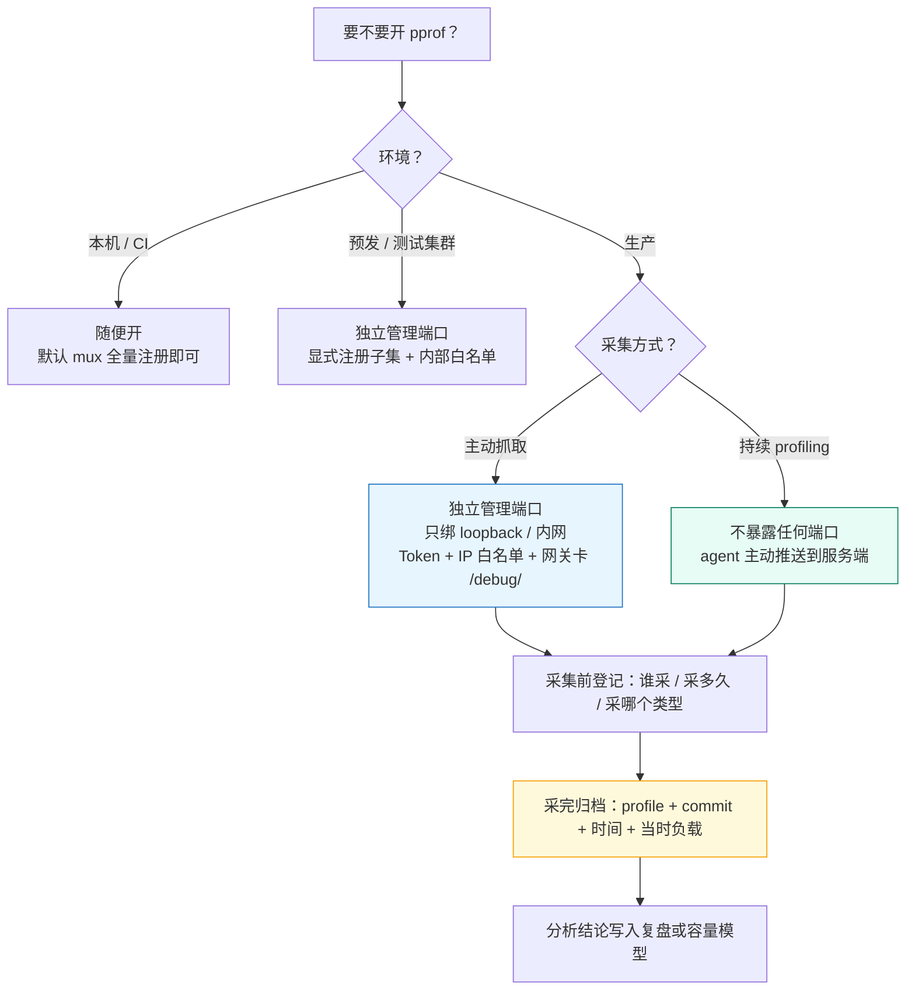
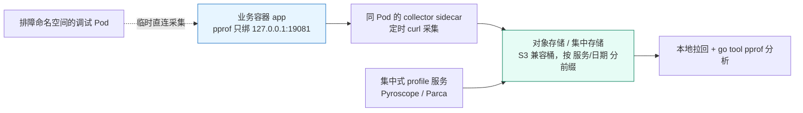
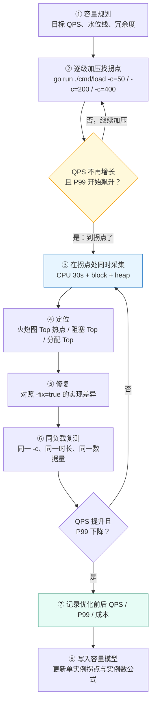
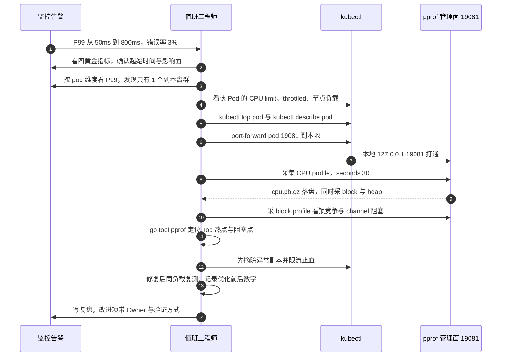

# 06 · 生产环境 pprof 实践：安全、开销与持续化

> 属于「架构师修炼」· 19 pprof 实战 · 第 6 篇：生产环境的 pprof 安全、开销与持续化
> 上一篇：[05 常见问题排查手册](./05-常见问题排查手册)｜下一篇：[07 实战案例集](./07-实战案例集)｜栏目总览：[架构师修炼](../)

> **这篇解决什么问题**：本机采 profile 只是 `curl` 一下，线上采 profile 要回答四个问题——**① 怎么开才不会被公网扫到**；**② 开销到底多大、能不能长期开**；**③ 容器/K8s 里没有 go 工具链怎么采**；**④ 故障过去之后还能不能拿到当时的现场**。这一篇给可以直接照抄的管理面代码、自己量开销的对照实验方法、K8s 采集路径、持续 profiling 的取舍，以及一次 P99 劣化的 5 分钟排障 SOP。
>
> 前置：[01 观测体系与 pprof 原理](./01-观测体系与pprof原理)、[02 CPU 火焰图实战](./02-CPU火焰图实战)、[03 内存与 GC 实战](./03-内存与GC实战)、[04 goroutine 与锁阻塞实战](./04-goroutine与锁阻塞实战)。实验样例见 `code/architect/pprof-lab`（`L01`~`L07`，业务端口 `1808N`、pprof 管理端口 `1908N`）。

**一句话结论**：**本机随便开，线上必须设计**——pprof 不进公网、采集有上限、每次留证据、结论绑版本。做不到这四条，你采到的不是数据，是一个待爆的安全事故。

---

## 一、三条铁律：把「随手 curl」变成「受控操作」

### 1.1 本机与线上的差别

| 维度 | 本机 / 开发环境 | 生产环境 |
| --- | --- | --- |
| 暴露面 | 只有你自己 | 公网扫描器 24 小时扫 `/debug/pprof/`，被采到就是信息泄露 + DoS |
| 采集影响 | 只影响你自己 | 影响真实用户；CPU profile 抢占采样、heap 读取短暂 STW |
| 采集时长 | 想采多久采多久 | 必须有时长与带宽上限，否则单次采集变成事故 |
| 事后追溯 | 复现一次就行 | 现场已经过去，**没提前布置就再也拿不到** |
| 版本与权限 | 就是当前代码，无权限概念 | 线上可能是 3 天前的 commit，profile 必须绑版本；谁能采、放哪、谁审阅都要有规矩 |

### 1.2 三条铁律

**铁律一：pprof 永远不进公网。** 独立管理端口 + 只绑 `127.0.0.1` 或内网网卡 + 网关拦掉 `/debug/`。三层都要有，因为前两层都可能被人配错，第三层是兜底。

**铁律二：采集必须有上限。** 谁在采、采多久、采完自动停。CPU profile 默认 30s、最长不超过 60s；同一实例同一时刻只允许一个采集任务。没有上限的采集等于一次自伤。

**铁律三：每次采集要留证据。** 时间点、当时的负载（QPS / 并发 / 是否有压测）、二进制版本或 git commit、profile 文件归档路径——**四个信息缺一个，结论就不可复现**。建议把这四项直接编码进文件名：`render-3f9a21c-20250612-101500.cpu.pb.gz`（服务-commit-时间戳-类型）。



---

## 二、安全暴露的正确姿势

### 2.1 暴露方式对照表（先看这张，再决定怎么写代码）

| 暴露方式 | 实际暴露面 | 便捷度 | 安全度 | 适用环境 |
| --- | --- | --- | --- | --- |
| `import _ "net/http/pprof"` + 挂在业务 mux/DefaultServeMux | 全部端点（含 `cmdline`、`trace`、`symbol`），与业务同端口 | ★★★★★ | ★ | **仅本机**。带上线等于在公网挂了一个「任意人可触发 STW + 读命令行参数」的接口 |
| 显式注册子集（只开 heap/goroutine/profile）到业务 mux | 只开的三个端点，仍与业务同端口 | ★★★★ | ★★ | 内网单机、临时排障；必须配合网关 `deny /debug/` |
| 独立管理端口 + 显式注册 + Token/IP 白名单 | 独立端口，只绑 loopback/内网 | ★★★ | ★★★★ | **生产默认形态** |
| 独立管理端口 + 只绑 loopback + `kubectl port-forward` | 不出 Pod 网络，连集群内其他 Pod 都连不上 | ★★ | ★★★★★ | K8s 生产、安全要求高的团队 |
| 持续 profiling（agent 主动推送，不监听端口） | 无入站端口 | ★★★ | ★★★★★ | 多服务多副本、需要事后回溯 |

> **面试点**：为什么 `import _ "net/http/pprof"` 危险？因为它通过 `init()` 把 handler **注册到 `http.DefaultServeMux`**，只要你的业务服务用了 `http.DefaultServeMux`（`http.ListenAndServe` 的第二参传 `nil` 就是），它就自动上线了，很多人根本不知道自己开过。

### 2.2 生产形态的管理面（可直接用）

业务 `:18081` 与管理面 `:19081` 分端口，管理面只绑 loopback，只显式注册三个 profile。下面这段是**生产形态示例**（不属于 `code/architect/pprof-lab` 的冻结样例，是给业务服务加管理面时照抄的模板）：

```go
// cmd/pprofadmin/main.go —— 生产形态的 pprof 管理面（只开 heap / goroutine / profile）
package main

import (
	"log"
	"net/http"
	"net/http/pprof" // ★ 具名引用：拿到 Handler，同时它的 init 仍会注册 DefaultServeMux，但本服务从不监听 DefaultServeMux
	"os"
	"runtime"
	"time"
)

func main() {
	// ① block/mutex 采样默认是关闭的，必须显式打开，且采样率不要拉满
	runtime.SetBlockProfileRate(10000)   // 单位 ns：约每 10ms 的阻塞事件记一次；填 1 表示全采样，开销极大
	runtime.SetMutexProfileFraction(100) // 每 100 次锁竞争记一次；填 1 表示全采样，开销极大

	mux := http.NewServeMux()
	// ② 只注册需要的三个端点，不做全量暴露
	mux.Handle("GET /debug/pprof/heap", auth(pprof.Handler("heap")))
	mux.Handle("GET /debug/pprof/goroutine", auth(pprof.Handler("goroutine")))
	mux.Handle("GET /debug/pprof/profile", auth(pprof.Profile)) // CPU profile，?seconds=N 控制时长
	mux.Handle("GET /debug/pprof/", auth(pprof.Index))          // 索引页：只列出上面注册过的

	srv := &http.Server{
		Addr:              envOr("PPROF_ADDR", "127.0.0.1:19081"), // ③ 只绑 loopback / 内网网卡
		Handler:           mux,
		ReadHeaderTimeout: 5 * time.Second,
		ReadTimeout:       10 * time.Second, // 请求本身很小，可以收紧
		WriteTimeout:      0,                // ★ 关键：CPU profile 会占住连接 30~60s，写超时会把采集掐断成半截文件
		IdleTimeout:       120 * time.Second,
	}
	log.Printf("pprof admin listening on %s", srv.Addr)
	log.Fatal(srv.ListenAndServe())
}

func envOr(k, def string) string {
	if v := os.Getenv(k); v != "" {
		return v
	}
	return def
}
```

鉴权中间件（源 IP 白名单 + Bearer Token，常量时间比较）：

```go
// cmd/pprofadmin/auth.go —— 两道门：内网 IP 白名单 + Token
func auth(h http.Handler) http.Handler {
	return http.HandlerFunc(func(w http.ResponseWriter, r *http.Request) {
		if !internalIP(r.RemoteAddr) { // 第一道：只允许 loopback 与私网地址
			http.Error(w, "forbidden", http.StatusForbidden)
			return
		}
		token := os.Getenv("PPROF_TOKEN")
		want := "Bearer " + token
		if token == "" || subtle.ConstantTimeCompare([]byte(r.Header.Get("Authorization")), []byte(want)) != 1 {
			http.Error(w, "unauthorized", http.StatusUnauthorized) // 第二道：常量时间比较，避免时序侧信道
			return
		}
		h.ServeHTTP(w, r)
	})
}

func internalIP(remoteAddr string) bool {
	host, _, err := net.SplitHostPort(remoteAddr)
	if err != nil {
		return false
	}
	ip := net.ParseIP(host)
	return ip != nil && (ip.IsLoopback() || ip.IsPrivate())
}
```

```bash
# 启动与验证：管理面绑定 127.0.0.1，只有本机（或 port-forward）能访问
PPROF_TOKEN=$(head -c 24 /dev/urandom | base64) go run ./cmd/pprofadmin
curl -sS -H "Authorization: Bearer $PPROF_TOKEN" http://127.0.0.1:19081/debug/pprof/ | head
# 直接打业务端口应当 404 —— 这证明 pprof 没有挂在业务 mux 上
curl -s -o /dev/null -w '%{http_code}\n' http://127.0.0.1:18081/debug/pprof/heap
```

**三个必须理解的取舍**：

1. **`WriteTimeout = 0`**：CPU profile 是「握手后挂住连接、边采边写」的长请求。设成 5s 会让 30s 的采集在 5s 时被切断，拿到一个只有 5s 数据、结尾不完整的文件。做法是**管理面单独设 `WriteTimeout=0`（或 ≥ 采集时长 + 10s）**，业务面照旧设 5~10s——不要为了 pprof 把业务面的超时也放开。
2. **不注册 `Cmdline` / `Symbol` / `Trace`**：`Cmdline` 会把启动参数（可能含密钥）暴露出去；`Trace` 开销最大且生产几乎不用。代价是不开 `Symbol` 时远程符号化会失败——那就**本地用同一 commit 的二进制符号化**（`go tool pprof -http=:8081 ./bin/render cpu.pb.gz`），这正好是「结论必须绑版本」的另一个理由。
3. **默认全量注册的 `net/http/pprof` 无法「部分取消」**：它的 `init()` 一定注册到 `DefaultServeMux`。所以要么用自定义 mux 显式注册（推荐），要么保证业务服务从不监听 `DefaultServeMux`。

### 2.3 反向代理层的拦截（兜底，必须有）

```nginx
# ① 网关层无条件拦掉所有 /debug/，即使应用侧误开了也打不进来
location ~ ^/debug/ { deny all; return 403; }

# ② 管理面走独立 server，只对本机/内网 listen，且只允许私网段
server {
    listen 127.0.0.1:6060;          # 不对公网 listen
    location /debug/pprof/ {
        allow 10.0.0.0/8;           # 只允许内网
        allow 172.16.0.0/12;
        deny  all;
        proxy_pass         http://pprof_admin_upstream;
        proxy_read_timeout 120s;    # ★ 必须大于 profile 采集秒数，否则网关先超时给你一个 502
        proxy_buffering    off;     # profile 是流式下载，别让网关缓存住
    }
}
```

```yaml
# ③ K8s 侧再收一层：管理端口只对排障命名空间开放，未列出的来源默认拒绝
apiVersion: networking.k8s.io/v1
kind: NetworkPolicy
metadata: { name: render-allow, namespace: prod }
spec:
  podSelector: { matchLabels: { app: render } }
  policyTypes: ["Ingress"]
  ingress:
    - from: [{ namespaceSelector: { matchLabels: { name: gateway } } }]
      ports: [{ protocol: TCP, port: 18081 }]      # 业务端口：只允许网关命名空间
    - from: [{ namespaceSelector: { matchLabels: { name: debug } } }]
      ports: [{ protocol: TCP, port: 19081 }]      # 管理端口：只允许排障命名空间
```

**四层防御的顺序**：容器只绑 loopback → 应用内 IP 白名单 + Token → 网关 `deny /debug/` → NetworkPolicy 限制来源。**任何一层单独使用都不够**，因为运维配置会漂移；四层叠起来，误配一层不会直接裸奔。

---

## 三、开销实测方法论：自己量，不要抄数字

### 3.1 常见采集类型的默认状态与开销来源

| 采集类型 | 默认是否开启 | 主要开销来源 | 常见数量级 | 生产建议 |
| --- | --- | --- | --- | --- |
| **CPU profile** | 按需（只有请求 `/profile` 时才启动采样） | 内核定时器（约 100Hz）触发信号 + 每次回溯整个调用栈；**栈越深越贵** | 1%~5% | 一轮 30s，同一实例两次采集间隔 ≥ 10min；不要在发布窗口采 |
| **heap（`alloc_objects`/`alloc_space`）** | `MemProfileRate` 默认 512KB，**常开** | 每次内存分配按 1/512KB 概率记录调用栈 → 分配路径变慢；**读取快照时短暂 STW** | 常开 1%~3%；把 rate 调到 4KB 可到 10%+ | 保持默认 512KB，甚至可放宽到 4MB；只在排查时读快照 |
| **goroutine** | 常开（本质是 dump 所有栈） | 读取时遍历全部 goroutine | 数万 goroutine 时几百 ms 一次 | goroutine 数 > 10 万时不要高频抓 |
| **block（`SetBlockProfileRate`）** | **默认关闭**（rate=0） | 每个阻塞事件按 rate 概率记录栈 | rate=1 可 > 10% | 临时开，用较大 rate（如 10000ns），排障完记得关 |
| **mutex（`SetMutexProfileFraction`）** | **默认关闭**（fraction=0） | 每次锁竞争按 1/n 概率记录栈 | fraction=1 可 10%+ | 同上，锁竞争不严重时用 fraction=100 |
| **trace（`/debug/pprof/trace`）** | 按需 | 记录全部调度/GC/syscall 事件 | 10%~20%+ | 只短时用（≤ 5s），生产默认不开放 |

> **不要抄别人的数字**：上面给的是「数量级」，不是「你的服务的数字」。栈深度、采样率、goroutine 数量、CPU 核数都会改变结果。**面试里说「我实测过，我们的服务上 CPU profile 开销约 2%」比说「书上是 5%」高一个档次**——因为它证明你会做实验。

### 3.2 对照实验设计：怎么量出你自己的开销

核心是**同二进制、同机器、同负载，只差「采不采」**：

| 步骤 | 操作 | 目的 |
| --- | --- | --- |
| ① 基线 | 不启动任何采集，压测 60s，记录 QPS/P50/P99/错误数（同机器、同二进制、同 `-c`，只是不执行 curl） | 得到对照组 |
| ② 干扰组 | 同一二进制重启，压测进行到第 30s 时开始采 30s CPU profile | 得到实验组 |
| ③ 比较窗口 | **只比较两个实验里相同的稳定窗口**（例如第 15~55s），不要拿冷启动阶段比 | 排除 JIT 式预热、连接建立等噪声 |
| ④ 计算 | `开销 = (基线QPS − 实验QPS) / 基线QPS`；同时看 P99 变化 | 用相对值，不用绝对值 |
| ⑤ 重复 | 每组至少跑 3 次取中位数 | 单次结果不可信 |
| ⑥ 记录 | 把「采样率、栈深特征、goroutine 数、开销」写进文档 | 结论可复现 |

```bash
# 干扰组：先起服务（业务 :18081，管理面 :19081），再跑压测
cd code/architect/pprof-lab
go run ./cmd/l01-cpu-hotspot &
go run ./cmd/load -url=http://127.0.0.1:18081/api/render?n=2000 -c=50 -d=60s

# 另开一个终端：压测到第 30s 时开始采集
curl -sS -m 45 -H "Authorization: Bearer $PPROF_TOKEN" \
  "http://127.0.0.1:19081/debug/pprof/profile?seconds=30" -o before.cpu.pb.gz
ls -l before.cpu.pb.gz   # 单位 KB 级说明栈不深；MB 级说明调用栈深或活跃 goroutine 多
```

**基线组怎么跑**：同一台机器、同一二进制、同一 `-c=50`，**不执行任何 curl 采集命令**，其余完全一致；把「基线 QPS」取成同一个采集窗口内的 QPS（压测器会输出 QPS / P50 / P95 / P99 / 错误数），窗口对齐后误差更小。

**什么时候不该采**：① **流量高峰期不采**（大促、热点事件），哪怕只有 2% 开销也可能把水位推到告警线；② **同一实例不并发采多个 profile**（CPU profile 与 trace 同时跑，开销叠加）；③ **采集前先看 CPU 水位**，> 60% 时先扩容或限流；④ **别长期把 `MemProfileRate` 调小**排查内存泄漏，那是在「为了看得清而把系统拖慢」，改成临时调、采完立刻恢复。

---

## 四、K8s / 容器环境实践

### 4.1 三种采集路径对比

| 路径 | 命令要点 | 安全度 | 前提 | 适用 |
| --- | --- | --- | --- | --- |
| **`kubectl port-forward` 到本地** | `port-forward pod/x 19081:19081`，本地 curl | ★★★★★ | 你的角色有 `pods/portforward` 权限 | **首选**，profile 文件不出集群 |
| **`kubectl exec` 容器内 curl + `kubectl cp`** | 容器内落盘 → `cp` 出来 → 立刻删除 | ★★★★ | 容器内有 curl/wget（或 bash 的 `/dev/tcp`） | 容器无 go 工具链、只能容器内发请求时 |
| **Sidecar / 集中采集 agent 推送** | 应用只暴露 loopback，agent 定时拉并推到对象存储 | ★★★★★ | 需要部署 agent（见第五节） | 多服务、需要事后回溯 |

### 4.2 最安全：port-forward 到本地

```bash
# ① 先按 pod 维度找到可疑副本（不要全量扫）
kubectl -n prod top pod -l app=render --containers
# PromQL：histogram_quantile(0.99, sum(rate(http_request_duration_seconds_bucket{app="render"}[5m])) by (le, pod))

# ② 把问题 Pod 的管理端口映射到本地（注意是 pod/xxx，不是 svc/xxx）
kubectl -n prod port-forward pod/render-7f8d9c-abcde 19081:19081 &

# ③ 本地采集，然后用本地的 go 工具链分析（符号化用的是同一 commit 的二进制）
curl -sS -m 45 -H "Authorization: Bearer $PPROF_TOKEN" \
  "http://127.0.0.1:19081/debug/pprof/profile?seconds=30" -o pod-render-7f8d9c.cpu.pb.gz
go tool pprof -http=:8081 ./bin/render pod-render-7f8d9c.cpu.pb.gz
```

### 4.3 容器里没有 go 工具链：容器内落盘再拷出来

```bash
# ① 在容器内发请求并落盘（管理面只绑 loopback 也能被容器内进程访问到）
kubectl -n prod exec render-7f8d9c-abcde -- sh -c \
  'curl -sS -m 45 "http://127.0.0.1:19081/debug/pprof/profile?seconds=30" -o /tmp/cpu.pb.gz; ls -l /tmp/cpu.pb.gz'

# ② 拷到本地
kubectl -n prod cp render-7f8d9c-abcde:/tmp/cpu.pb.gz ./pod-render-7f8d9c.cpu.pb.gz

# ③ 立刻清理：容器可写层通常很小，别把 Pod 撑爆
kubectl -n prod exec render-7f8d9c-abcde -- rm -f /tmp/cpu.pb.gz
```

> **为什么这是「正确做法」**：生产镜像不该带 `go` 工具链（几百 MB 体积 + 供应链风险）。所以**采集与分析必须分离**——容器只负责产生 profile 文件，分析在你本地用同一 commit 编译的二进制做。文件命名里带 commit 就是为了这一步能对上（见第七节）。

### 4.4 Sidecar / 集中采集形态



profile 文件是典型的「写一次、读很少、按时间检索」的数据，非常适合放对象存储：按 `服务名/日期/实例/类型` 分前缀，配生命周期策略自动转低频或过期删除。选型与成本核算见 [为什么需要对象存储](/后端技术栈强化/09-object-storage/为什么需要对象存储)，用 Go 写入见 [S3 API 与 Go 实战](/后端技术栈强化/09-object-storage/S3-API与Go实战)。

### 4.5 CPU limit 与火焰图：最容易看错的一类问题

容器 CPU 被 throttle 时会出现一个反直觉现象：**火焰图看起来「没有热点」，但服务就是慢**。原因是被限流的线程根本没机会跑，采样器自然采不到它——**慢在「等待被调度」，不是慢在「执行」**。

```bash
# 看 limit/requests，以及 throttled 比例
kubectl -n prod get pod render-7f8d9c-abcde -o jsonpath='{.spec.containers[0].resources}{"\n"}'
# PromQL：sum(rate(container_cpu_cfs_throttled_periods_total{pod="render-7f8d9c-abcde"}[5m]))
#        / sum(rate(container_cpu_cfs_periods_total{pod="render-7f8d9c-abcde"}[5m]))
# > 10% 基本可以判定：延迟问题的主因是 CPU 配额，不是代码热点
```

| 观察 | 结论 | 动作 |
| --- | --- | --- |
| throttled < 5%，火焰图有明确热点 | 真实的代码热点 | 按火焰图优化（[02 CPU 火焰图实战](./02-CPU火焰图实战)） |
| throttled > 10%，火焰图平坦无明显热点 | **CPU 配额不足** | 提 limit / 加副本；同时查是否有 GC、锁竞争背景消耗 |
| throttled 高，且 goroutine 数持续上涨 | 突发并发 + 配额紧张 | 先限流（[12 限流熔断降级与背压](/架构师修炼/12-限流熔断降级与背压)）再扩容 |
| `GOMAXPROCS` 远大于 limit（如 limit=2 核但 GOMAXPROCS=16） | Go 1.22 不会自动识别 CPU limit，16 个 P 在 2 核上抢 | 显式设 `GOMAXPROCS` = limit 取整，或用 automaxprocs 类方案自动对齐 |

### 4.6 多副本场景：只采有问题的那一个

全量扫副本有三个坏处：采到一堆健康数据、把整体开销乘以副本数、真正的问题副本被稀释。正确顺序是：

1. **先分维度看指标**：按 `pod` 维度的 P99/P50/错误率找出离群副本（通常 1 个或 1 个可用区的副本）。只有部分副本异常时，优先怀疑**节点差异**（同节点资源争抢、宿主机负载、NUMA）与**流量分布不均**，而不是代码。
2. **只对离群副本采 profile**，并同时采一个健康副本做对照——**profile 的对照价值 > 单个 profile 本身**。
3. 结论落到「是代码问题（所有副本都该改）」还是「是环境问题（换节点/提配额）」，两条路的处置完全不同。

---

## 五、持续 profiling：解决「事后回溯」

### 5.1 一次性抓取 vs 持续 profiling

| 维度 | 一次性抓取（人工 curl） | 持续 profiling |
| --- | --- | --- |
| 触发时机 | 人发现异常后手动触发 | 7×24 自动，按频率滚动采集 |
| 故障现场 | **故障当下不在场就永远拿不到**；等告警响起来往往已经错过拐点 | 能回看「故障发生那一刻」的 profile，可直接 diff 前后 |
| 开销 | 只在采集时有开销，平时为 0 | 常驻 1%~3%（可配采样率与采集间隔） |
| 存储与能力 | 人工归档，常常丢失；会 curl + 会读火焰图即可 | 集中存储、按时间检索可对比；还要有检索/diff 工具链与权限体系 |
| 适用 | **所有团队都应该会**；单机/小规模足够 | 多服务多副本、SRE 成熟度高的团队 |

> **核心差异一句话**：一次性抓取解决「现在慢，我要看为什么」；持续 profiling 解决「**刚才慢了一下又好了，我要回到那个时刻**」。后者才是绝大多数线上性能问题的真实形态——**抖动型劣化**。

### 5.2 两个开源方案的定位

| 方案 | 采集形态 | 存储 | 部署成本 | 适合 |
| --- | --- | --- | --- | --- |
| **Grafana Pyroscope** | ① SDK 模式：应用内嵌 Go SDK，配置服务端地址后**主动推送** profile（也可拉取）；② agent 模式：由 Alloy 等组件定时抓 `/debug/pprof/*` | 自带存储，可对接对象存储 | 中：要改代码接 SDK，或部署 agent | 已用 Grafana 技术栈、想和应用指标联动 |
| **Parca** | **eBPF 采集**：在内核侧按栈采样，应用**不需要改代码、不需要开 pprof 端口** | 对象存储（S3 兼容） | 中高：需要节点级权限与内核版本支持 | 不想动应用代码、多语言混合、强调「无侵入」 |

两者都能回答「故障时刻的 profile 长什么样」，区别是**要不要在应用里塞东西**：SDK 推送更精确（能拿到 Go 运行时语义），eBPF 更省事但受内核与符号表限制。

### 5.3 单机 / 小规模：cron + 对象存储就够了

**不是必须装一个持续 profiling 平台。** 一个脚本 + 一条 crontab 就能覆盖 90% 的事后回溯需求：

```bash
# /opt/pprof/collect.sh —— 定时采集 + 命名带时间戳与 commit + 保留 7 天
#!/usr/bin/env bash
set -euo pipefail
TS=$(date +%Y%m%d-%H%M%S); OUT=/data/pprof; mkdir -p "$OUT"
curl -sS -m 45 -H "Authorization: Bearer ${PPROF_TOKEN}" \
  "http://127.0.0.1:19081/debug/pprof/profile?seconds=30" -o "$OUT/render-${COMMIT}-${TS}.cpu.pb.gz"
find "$OUT" -name '*.pb.gz' -mtime +7 -delete
# crontab：每小时 1 次（错开整点，避免所有服务同时采）
# 17 * * * * COMMIT=$(cat /etc/render-commit) PPROF_TOKEN_FILE=... /opt/pprof/collect.sh >> /var/log/pprof.log 2>&1
```

### 5.4 采样频率与存储成本：先算再开

**估算方法（三行公式）**：单文件大小 = 实测一次 profile 的 `ls -l` 结果（不要猜，curl 一次就知道）；日增/实例 = 单文件大小 × 每天采集次数；总容量 = 日增/实例 × 实例数 × 保留天数。

| 项 | 量级估算 | 说明 |
| --- | --- | --- |
| 单次 30s CPU profile（gzip 后） | **100KB ~ 1MB** | 与调用栈深度、活跃 goroutine 数、采样到的函数数量强相关；空闲服务往往只有几十 KB |
| 每小时 1 次、单实例 | ≈ **12MB/天**（按 500KB 估） | 24 次 × 500KB；**只采代表副本**（不要全量扫副本）能直接省 90% |
| 保留 7 天 | ≈ **84MB** | 单实例，对象存储成本可忽略 |
| 100 服务 × 5 副本 × 每小时 1 次 × 保留 30 天 | ≈ **18GB/月**（按 500KB 估） | 必须配生命周期策略：7 天热存 → 30 天转低频 → 过期删除 |

> 注意最后一行只是**同一个数量级的粗略下界**：真实环境里调用栈更深、服务更忙，单文件可能到 2~5MB，容量会涨 5~10 倍。所以**先对 1 个核心服务试跑一周，用真实文件大小反推全量成本**，再决定要不要扩到全部服务——这也是 [13 容量规划压测与故障演练](/架构师修炼/13-容量规划压测与故障演练) 里「先量再规划」的同一套逻辑。

---

## 六、与压测 / 容量规划联动的工作流

**压测与采集必须同时进行**——这是本篇最容易被忽略、也最能在面试里加分的一句：单独压测只能得到一条「QPS 上不去」的曲线，单独采 profile 只能得到一张「此刻谁在耗 CPU」的火焰图，**只有把两者叠在同一时间轴上，才能把「拐点」和「具体代码」连起来**。



**逐级加压 + 同时采集的可复制流程**：

```bash
# 终端 1：起被测服务（业务 :18081，管理面 :19081）
cd code/architect/pprof-lab
go run ./cmd/l01-cpu-hotspot

# 终端 2：逐级加压 —— 50 / 200 / 400 并发，各记录 QPS 与 P50/P95/P99
# 400 并发若出现「QPS 不涨而 P99 猛涨」，这里就是拐点
go run ./cmd/load -url=http://127.0.0.1:18081/api/render?n=2000 -c=50 -d=20s
go run ./cmd/load -url=http://127.0.0.1:18081/api/render?n=2000 -c=200 -d=20s
go run ./cmd/load -url=http://127.0.0.1:18081/api/render?n=2000 -c=400 -d=20s

# 终端 3：在压测「正在跑」的时候采集（这是关键：边压边采）
curl -sS -m 45 "http://127.0.0.1:19081/debug/pprof/profile?seconds=30" -o hot.cpu.pb.gz
curl -sS      "http://127.0.0.1:19081/debug/pprof/block"     -o hot.block.pb.gz
curl -sS      "http://127.0.0.1:19081/debug/pprof/heap"      -o hot.heap.pb.gz

# 用同一负载复测修复实现（-fix=true），对比 QPS / P99 / 错误数
go run ./cmd/l01-cpu-hotspot -fix=true
go run ./cmd/load -url=http://127.0.0.1:18081/api/render?n=2000 -c=200 -d=20s
```

**「压测与采集同时进行」的具体含义**：

| 反模式 | 后果 | 正确做法 |
| --- | --- | --- |
| 先压测、结束后再采 profile | 采到的是**空载状态**，火焰图里只有后台 GC 和监控 goroutine | 采集命令与压测命令**时间窗重叠**，采集要覆盖稳定高负载段 |
| 压测 20s，采集 30s | 后 10s 是空载，profile 被稀释 | 采集时长 ≤ 压测时长，或在压测中途启动采集 |
| 只采 CPU，不采 block/heap | 锁竞争、GC 造成的延迟问题看不到 | CPU + block + heap 三件套一起采（`L02`/`L04`/`L05` 分别暴露不同问题） |
| 前后复测用不同并发/时长 | 数字不可比，等于没测 | 锁死 `-c`、`-d`、数据量、机器 |

结果按「优化前 / 优化后」成对记录，直接进容量模型：

| 指标 | 优化前 | 优化后 | 变化 |
| --- | --- | --- | --- |
| 单实例 QPS / P99 | 1,800 / 320ms | 3,600 / 90ms | QPS +100%，P99 −72% |
| 单实例内存 | 1.2GB | 480MB | −60%，可下调 limit 提部署密度 |
| 扩容后的成本 | 20 副本 | 10 副本 | 直接省一半机器 |

---

## 七、变更与发布纪律：结论必须绑版本

### 7.1 让二进制自带 commit

```bash
# 编译时写入 VCS 信息（仓库需是 git 工作区，且是干净状态）
cd code/architect/pprof-lab
go build -buildvcs=true -o bin/render ./cmd/l01-cpu-hotspot
go version -m bin/render | grep -E 'mod|vcs'   # 看到 vcs.revision=xxxx 即为成功
```

```go
// 启动日志打印版本：让「profile 文件」和「代码版本」能对上
var version = "dev"

func main() {
	if bi, ok := debug.ReadBuildInfo(); ok {
		for _, s := range bi.Settings { // 读取 -buildvcs 写入的 VCS 信息
			if s.Key == "vcs.revision" && len(s.Value) >= 12 {
				version = s.Value[:12]
			}
		}
	}
	log.Printf("l01-cpu-hotspot start version=%s go=%s pid=%d addr=%s",
		version, runtime.Version(), os.Getpid(), *addr)
	// ... 后续启动逻辑
}
```

**为什么必须这么做**：profile 里的函数名和行号要落到具体代码上；如果不知道线上跑的是哪个 commit，你的「优化后复测」和「优化前基线」可能根本不是同一份代码，结论直接失真。

### 7.2 性能优化的验收清单（五项全过才算完）

| 项 | 通过标准 | 证据 |
| --- | --- | --- |
| 功能测试 | 全量单测 + 关键链路回归通过 | CI 绿灯 |
| 压测对比有数字 | 同负载、同数据量、同机器下 QPS/P99 有提升 | 优化前后两份压测输出 |
| 无内存增长 | soak 8h，RSS 与 `heap_inuse` 曲线平稳，无单调上涨 | heap profile 前后对照 + 监控曲线 |
| 错误率不变 | 优化后错误率 ≤ 优化前 | 监控面板 + 压测器输出 |
| 可回滚 | 二进制/配置回滚 < 5 分钟，且**演练过** | 回滚演练记录 |

**发布纪律三条**：

1. **一次只改一个变量**：优化分层做（先改序列化、再改锁），否则数字归因不清。
2. **上线带开关**：把风险最大的优化放在 feature flag 后面，线上异常可以单独关掉它而不用整体回滚。
3. **回滚也要有数字**：回滚后指标是否恢复，是判断「这次改动是不是根因」的最强证据。

复盘与改进项的沉淀方式，沿用 [14 备份恢复与故障复盘](/架构师修炼/14-备份恢复与故障复盘) 的六段模板。

---

## 八、一次真实的线上排障剧本（SOP）

### 8.1 现象

某渲染服务：**P99 从 50ms 劣化到 800ms，错误率从 0.1% 升到 3%**，QPS 没有明显变化，容器的 CPU 使用率 70%（未打满），无发布记录。

### 8.2 前 5 分钟要做的 6 件事

| # | 动作 | 看什么 | 判断价值 |
| --- | --- | --- | --- |
| ① | 看大盘四黄金指标 | 延迟/流量/错误/饱和度，确认**起始时间点**与影响面 | 定位「第一次异常发生在什么时候」，是找变更线索的锚点 |
| ② | 按 `pod` 维度看 P99 与错误率 | 是**全部副本**劣化还是**单个副本** | 全副本 → 代码/依赖；单副本 → 节点/环境/流量分布 |
| ③ | 看下游依赖 | DB 慢查询、Redis 延迟、Kafka lag、第三方接口耗时 | 排除「不是我的问题」的那一半可能 |
| ④ | 看 GC 与 goroutine 数 | `go_gc_duration_seconds`、GC 次数/频率、goroutine 数量曲线 | 频率上升 + goroutine 上涨 → 分配过多或泄漏（`L02`/`L03`/`L06` 对应三种形态） |
| ⑤ | 采一次 CPU + block profile | 火焰图 Top 热点、阻塞 Top | 拿到「此刻在烧什么」的直接证据 |
| ⑥ | 必要时先限流/降级 | 单接口限流、非核心功能降级、摘除异常副本 | **先止血再找因**：3% 错误率还在扩大时，业务损失优先于技术好奇心 |



### 8.3 采集命令（照着敲）

```bash
# ① 找到离群副本并建立通道
kubectl -n prod top pod -l app=render --containers
kubectl -n prod port-forward pod/render-7f8d9c-abcde 19081:19081 &

# ② 采 CPU（30s）+ block + heap，三份一起拿
curl -sS -m 45 "http://127.0.0.1:19081/debug/pprof/profile?seconds=30" -o inc.cpu.pb.gz
curl -sS      "http://127.0.0.1:19081/debug/pprof/block"     -o inc.block.pb.gz
curl -sS      "http://127.0.0.1:19081/debug/pprof/heap"      -o inc.heap.pb.gz

# ③ 用本地同 commit 的二进制分析（容器里不需要 go 工具链）
go tool pprof -http=:8081 ./bin/render inc.cpu.pb.gz
go tool pprof -http=:8082 ./bin/render inc.block.pb.gz
```


### 8.4 结论可能的分类

| 火焰图/指标特征 | 最可能的根因 | 对应实验样例 | 处置 |
| --- | --- | --- | --- |
| 火焰图某段 CPU 高且全是序列化/反射 | 代码热点 | `L01`（反射 + JSON + 字符串拼接） | 手写编码 / `strings.Builder` / 避免反射 |
| GC 频率与 CPU 双升，`alloc_space` Top 是热点路径 | 分配过多 | `L02`（每请求 MB 级分配） | `sync.Pool` + 复用 `bytes.Buffer` |
| goroutine 数单调上涨、堆栈都卡在同一处 | goroutine 泄漏 | `L03`（Ticker 未停、无退出信号） | `context` 退出 + `WaitGroup` 收敛 |
| block profile 的 contention Top 集中在同一把锁 | 锁竞争 | `L04`（全局 mutex） | 分片锁 + `atomic` |
| block profile 显示大量 channel 阻塞 | 无缓冲 channel 串行化 | `L05` | 有缓冲 channel + worker pool |
| `heap_inuse` 只涨不降，`inuse_space` Top 是全局 map | 内存滞留 | `L06`（全局 map 长期持有） | LRU + TTL + 显式释放 |
| `syscall`/`write` 占比高，火焰图零散 | IO 次数过多 | `L07`（逐行 `Fprintf`） | `bufio.Writer` + 预分配 + 批量写 |
| 火焰图平坦、throttled > 10% | CPU 配额不足 | — | 提 limit / 加副本 / 对齐 `GOMAXPROCS` |
| Top 全在下游调用（DB/HTTP client） | 依赖劣化 | — | 转下游排查，本服务只加超时与熔断 |
| heap 与 CPU 都稳定、只有 P99 抖 | 长尾（GC、调度、网络重传） | — | 看 P99.9 与 GC pause 分布，做长尾专项优化 |

### 8.5 复盘模板（六段，呼应 [14 篇](/架构师修炼/14-备份恢复与故障复盘)）

| 段 | 内容 | 本例填写示例 |
| --- | --- | --- |
| ① 时间线 | 精确到分钟 | 14:02 首次 P99 异常 → 14:05 告警 → 14:08 port-forward 采集 → 14:20 定位到热点 → 14:35 摘副本 + 限流 → 14:50 恢复 |
| ② 影响面 | 用户数/请求数/金额 | 影响 12 分钟，失败请求 8.6 万，无数据不一致 |
| ③ 根因 | 技术根因 + 流程根因 | 技术：热点路径每请求 MB 级分配导致 GC 频率升 5 倍；流程：该路径没有长期 profile 数据，只能靠临时采集，定位多花 10 分钟 |
| ④ 处置过程 | 含弯路 | 先怀疑下游 DB（无效）→ 再看 throttled（正常）→ 采 profile 定位到分配热点（有效） |
| ⑤ 改进项 | Owner + Deadline + 验证方式 | ① 引入 `sync.Pool`（Owner：A，3 日内，压测对比 P99）；② 加「GC 频率」P1 告警（Owner：SRE，3 日内，用故障注入验证）；③ 核心服务开定时采集归档（Owner：B，7 日内，一周后核对归档存在） |
| ⑥ 可复用检查项 | 变成其他服务的巡检项 | 所有高频路径必须检查每请求分配量；每季度做一次「不预告」的性能故障演练 |

---

## 九、把 profile 写进项目经历

面试官对「我优化了性能」这句话的默认反应是怀疑。让他相信的唯一方式是**数字 + 方法**。两段可以直接改写的模板：

**模板 A（热点优化型）**：

> 在渲染服务上用**量化方式**做了一次性能优化：先用自建 Go 压测器逐级加压（50/200/400 并发）找到单实例拐点，在拐点处采集 30s CPU profile，定位到热点是「反射序列化 + 无预分配的字符串拼接」；改成手写编码 + `strings.Builder` 后同负载复测，**QPS 从 1,800 提升到 3,600，P99 从 320ms 降到 90ms，单实例内存从 1.2GB 降到 480MB**，集群副本数从 20 降到 10。

**模板 B（泄漏/抖动治理型）**：

> 某个异步任务服务出现「跑几小时后 P99 抖动、偶发 OOM」：我用 goroutine profile 确认 **goroutine 数 6 小时从 2,000 涨到 12 万**（Ticker 未停止、缺少退出信号），用 heap profile 确认全局 map 长期持有对象；改成 `context` 退出 + `WaitGroup` 收敛 + LRU/TTL 缓存后，**goroutine 稳定在 2,000 以内，heap inuse 从 3GB 降到 600MB，soak 8 小时 P99 稳定在 40ms**。

**必须能解释到每一步**（面试官一定会追问的六问）：

| 追问 | 你要能答的 |
| --- | --- |
| 拐点怎么找的？ | 逐级加压，QPS 不再涨而 P99 飙升的那一档 |
| 采集有没有影响线上？ | 有，实测约 X%（对照组实验得出），所以限制在 30s 且避开高峰 |
| 怎么保证采集时负载是高的？ | 压测与采集时间窗重叠，先起压测再从另一个终端采 |
| 线上怎么安全采的、怎么和代码对上？ | 独立管理端口只绑 loopback + Token/IP 白名单 + 网关卡 `/debug/`，`port-forward` 到本地采；二进制带 `-buildvcs` 的 commit，文件名含 commit，用同一 commit 符号化 |
| 怎么证明优化有效？ | 同机器、同并发、同时长、同数据量前后各压一轮，五项验收清单全过 |

---

## 面试追问链（带答案）

1. **「线上怎么安全地开 pprof？」** → 一句话答：**pprof 不进公网**——业务与管理面分端口，管理面只绑 `127.0.0.1` 或内网、显式注册子集而不是 `import _` 全量注册、加 Token 与 IP 白名单，网关层再 `deny /debug/` 兜底，优先用 `kubectl port-forward` 采，profile 文件不出集群。

2. **「`import _ "net/http/pprof"` 有什么问题？」** → 一句话答：它通过 `init()` 把 handler 注册到 **`http.DefaultServeMux`**，任何用了默认 mux 的服务都会连带把 `cmdline`、`trace` 等全部端点暴露出去，既泄露启动参数又能被任意人触发高开销采集。

3. **「pprof 的开销有多大，能常开吗？」** → 一句话答：**CPU profile 要按需采，heap 采样是常开但要保持默认 512KB 的 `MemProfileRate`，block/mutex 默认关闭、要用大 rate 临时开**——CPU profile 常见量级 1%~5%，但这是「数量级」不是「我的数字」，我们的服务是自己用对照组压测（同负载采与不采）量出来的。

4. **「采 profile 会不会把线上搞挂？」** → 一句话答：会，原因是**没有上限**——CPU profile 会占住连接几十秒（所以管理面 `WriteTimeout` 要设 0 或放宽）、heap 快照有短暂 STW、block/mutex 采样率拉满可到 10%+；因此要做三件事：限时长（≤60s）、限并发（同实例同时只采一个）、避高峰期，并且用网关超时和 `proxy_read_timeout` 配套放宽。

5. **「K8s 里怎么采，容器没有 go 工具链怎么办？」** → 一句话答：**采集与分析分离**——`kubectl port-forward` 到本地采最好；必须在容器内采时用 `kubectl exec ... curl` 落到 `/tmp` 再 `kubectl cp` 拷出来并立刻删除，分析永远在本地用**同一 commit 编译的二进制**做符号化。

6. **「火焰图看着没热点但服务就是慢，为什么？」** → 一句话答：八成是 **CPU 被 limit 限流（throttled）**——线程压根没机会跑，采样器自然采不到；先看 `container_cpu_cfs_throttled_periods_total / container_cpu_cfs_periods_total` 是否 > 10%，并注意 Go 1.22 不会自动识别 cgroup CPU limit，`GOMAXPROCS` 要手动对齐。

7. **「持续 profiling 一定要上 Pyroscope / Parca 吗？」** → 一句话答：不是必须——它解决的是「**故障过去之后回溯当时的 profile**」；多服务多副本、SRE 成熟度高时上 Pyroscope（SDK 推送）或 Parca（eBPF 无侵入）更省事，单机/小规模用「cron 定时 curl + 名字带时间戳与 commit + 保留 7 天 + 归档到对象存储」就够了。

8. **「优化完怎么证明有效、怎么保证不出事？」** → 一句话答：**同负载前后各压一轮拿到 QPS/P99/错误数的成对数字**，再过五项验收清单（功能测试过、压测对比有数字、soak 无内存增长、错误率不变、可回滚），并且 profile 结论要绑版本（`-buildvcs` 让二进制带 commit）。

---

## 自测清单

- [ ] 能背出三条铁律：pprof 不进公网、采集有上限、每次留证据
- [ ] 能说出五种暴露方式，并按「便捷 → 安全」排序，说明各自适用环境
- [ ] 能解释为什么 `import _ "net/http/pprof"` 会意外暴露全部端点
- [ ] 能写出「独立管理端口 + 显式注册 heap/goroutine/profile + Token/IP 白名单」的管理面代码
- [ ] 能解释管理面 `WriteTimeout` 为什么要设 0 或放宽，而业务面为什么不跟着放开
- [ ] 能说出不注册 `Cmdline` / `Symbol` / `Trace` 的收益与代价
- [ ] 能设计「采与不采」的对照组实验，并说出为什么只比较相同的稳定窗口、为什么要跑 3 次取中位数
- [ ] 能默写六种采集类型的默认开关状态与主要开销来源
- [ ] 能说出 `kubectl port-forward` 与 `kubectl exec + kubectl cp` 两条采集路径的差别，以及为什么要在容器内采完立刻删除临时文件
- [ ] 能解释「火焰图没热点但就是慢」与 CPU throttled、`GOMAXPROCS` 的关系
- [ ] 能说出多副本场景为什么只采离群副本，以及「采一个健康副本做对照」的价值
- [ ] 能说清一次性抓取与持续 profiling 的核心差别（抖动型劣化的回溯）
- [ ] 能算出「每 30s 一次、每小时 1 次、保留 7 天」的存储量级，并说出三项降本手段
- [ ] 能画出「找拐点 → 拐点处采集 → 定位 → 修复 → 同负载复测 → 写入容量模型」的工作流，并强调压测与采集必须同时进行
- [ ] 能用五项验收清单和两段简历模板，把一个 pprof 优化案例讲到每一步都能被追问

> **下一篇**：[07 实战案例集](./07-实战案例集) —— 把 `L01`~`L07` 七个样例从「现象 → 采集 → 火焰图 → 修复 → 复测数字」完整走一遍，每一类问题都给出可复述的排障话术。
