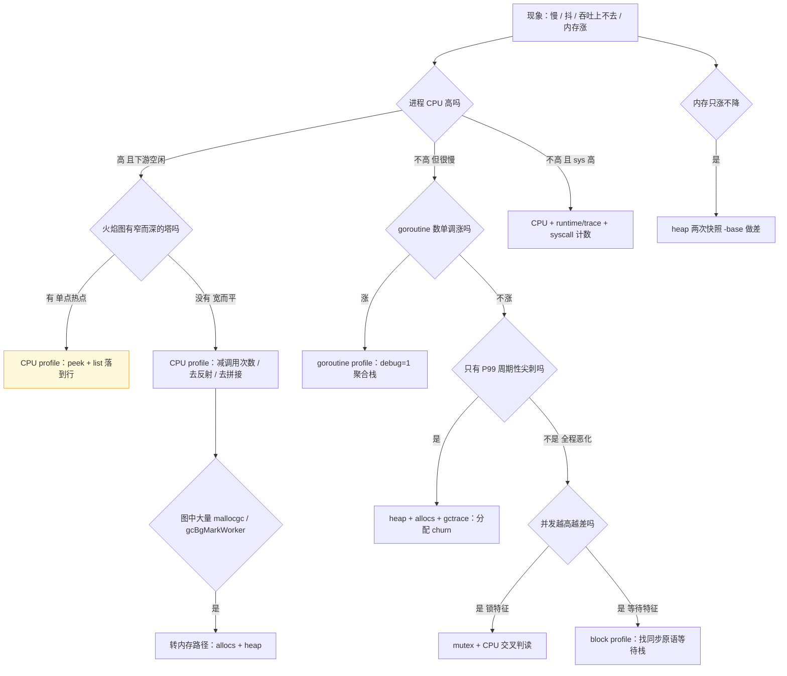
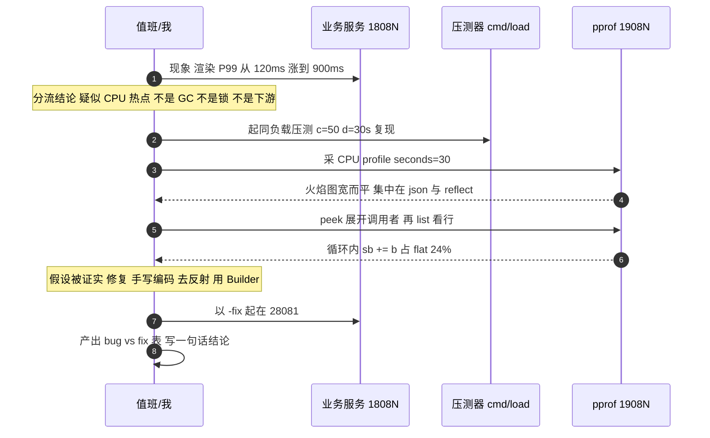
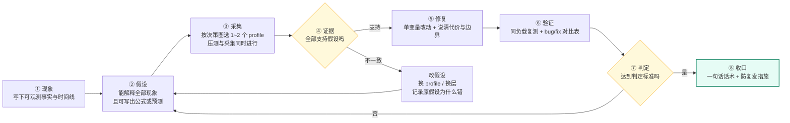

# 07 · 实战案例集：7 个「现象 → 定位 → 修复 → 验证」的完整故事

> 属于「架构师修炼」· 19 pprof 实战 · 第 7 篇：7 个完整实战案例
> 上一篇：[06 生产环境 pprof 实践](./06-生产环境pprof实践)｜下一篇：[08 面试题与追问链](./08-面试题与追问链)｜栏目总览：[架构师修炼](../)

> **这篇解决什么问题**：前面几篇教了你「怎么用工具」，面试考的是**判断力**。同一句「接口慢」，有人五分钟定位到一行代码，有人加了 4 台机器还没好——差别在**从现象到假设的那一跳**。下面 7 个故事固定 8 段（现象 / 错的猜测 / 正确假设 / 采集 / 定位 / 修复 / 验证 / 话术），全部落在 `code/perf/pprof-lab/` 的可跑样例上，业务语境贴 [15 案例：AI 剪辑任务平台](/架构师修炼/15-案例-AI剪辑任务平台架构)。

## 案例 0 · 方法论总纲：同一句「接口慢」，怎么分流到 5 类 profile
**先分流，再采集**。看到「慢」先问三件事：CPU 高不高？内存/GC 异常吗？goroutine 数在不在涨？答案决定你抓哪个 profile。



**5 类是能力分类，7 个端点是采集入口**（内存有 `heap`/`allocs`，阻塞有 `block`/`mutex`）。原则：**一个 profile 只回答一个问题**。上表之外的 `threadcreate` / `cmdline` / `symbol` / `trace` 端点，在本栏目 7 个样例中均已实测返回 200，端口与 flag 与冻结清单一致。

| 类别 | 端点 | 回答的问题 | 采样与开销 | 关键视图 | 样例 |
| --- | --- | --- | --- | --- | --- |
| CPU | `/debug/pprof/profile?seconds=30` | 谁在烧**用户态** CPU | SIGPROF 100Hz，约 1%~5% | `top -cum`/`peek`/`list` | L01、L04、L07 |
| 内存 | `/debug/pprof/heap` | 谁**持有**内存（默认视图） | 堆采样，默认每 512KB 记 1 样本 | `inuse_space` / `-base` 差 | L02、L06 |
| 内存 | `/debug/pprof/allocs` | 谁**分配**得最多 | 同一份样本，看 `alloc_space` | `alloc_space` / `alloc_objects` | L02 |
| goroutine | `/debug/pprof/goroutine?debug=1` | 有多少 goroutine、卡在哪 | 全量快照，几乎零开销 | `debug=1` 聚合 / `debug=2` 逐栈 | L03 |
| 阻塞 | `/debug/pprof/block` | 谁在**等**同步原语（channel / select / 互斥锁 / 条件变量 / WaitGroup；**不含网络与文件 IO，也不含 `time.Sleep`**） | 需 `SetBlockProfileRate`，默认关；运行时只在 `chansend` / `chanrecv` / `selectgo` / `semacquire1` 四处埋点 | `delay` / `contentions` | L05（L07 改用 trace + syscall 计数） |
| 阻塞 | `/debug/pprof/mutex` | 谁在**抢锁**、抢多久 | 需 `SetMutexProfileFraction`，默认关 | `delay` / `contentions` | L04 |
| 追踪 | `/debug/pprof/trace?seconds=5` | 时间线上的**因果**（调度/GC/syscall） | 全量事件 10%~30%，只短窗口用 | `go tool trace` 阻塞统计 | L07 |

> 判读速记：**CPU 高看 flat，CPU 低看 delay；内存涨看 inuse，分配猛看 alloc；goroutine 看趋势不看绝对值；锁看 contentions 与 delay 的比值。**

**三条纪律**（违反任一条，结论都不可信）：

| 纪律 | 含义 | 违反后的翻车 |
| --- | --- | --- |
| ① **先量后调** | 先拿数字（profile/压测/gctrace）再改代码，优化前必须有基线 | 「我觉得是 JSON 慢」改三天，真瓶颈是 syscall |
| ② **单变量控制** | 一次只改一处，同机器同负载同并发复测，只认 `-fix` 切的差异 | 同时换锁+加缓存+调 GOGC，涨了也不知是谁的功劳 |
| ③ **量化前后对比** | 结论必须落成「指标/bug/fix/变化/判定标准」表 | 「感觉快多了」→ 追问「快多少」答不出 |

> 附加纪律：**采集与压测必须同时进行**（空载 profile 只反映初始化路径），且每个 `go func()` 都要能回答「它什么时候退出」。

**七个样例与统一命令模板**。目录 [`code/perf/pprof-lab/`](https://github.com/Bin-hy/go-campus/tree/main/code/perf/pprof-lab)（独立 module、go 1.22、只用标准库）。通用约定：业务端口 `1808N`，pprof 管理端口 `1908N`（= 业务 + 1000）；flag `-addr` / `-pprof-addr` / `-fix`（默认 false 跑有问题的实现）。

| ID | 启动命令 | 业务端点 | 制造的问题 | `-fix` 的修复手段 |
| --- | --- | --- | --- | --- |
| L01 | `go run ./cmd/l01-cpu-hotspot` | `GET /api/render?n=2000` | CPU 打满：反射 + JSON + 字符串拼接 | 手写编码 / `strings.Builder` / 去反射 |
| L02 | `go run ./cmd/l02-alloc-gc` | `GET /api/thumb?id=1` | 每请求 MB 级分配 → GC 高、P99 抖 | `sync.Pool` + 复用 `bytes.Buffer` |
| L03 | `go run ./cmd/l03-goroutine-leak` | `GET /api/task/start`、`/api/task/count` | goroutine 只增不减 | context 取消 + WaitGroup 收敛 |
| L04 | `go run ./cmd/l04-lock-contention` | `GET /api/counter?k=hot` | 全局 mutex 竞争 | 分片锁 + atomic |
| L05 | `go run ./cmd/l05-channel-block` | `GET /api/pipeline` | 无缓冲 channel 串行阻塞 | 有缓冲 channel + worker pool |
| L06 | `go run ./cmd/l06-memory-retention` | `GET /api/cache/put`、`/api/cache/stats` | 全局 map 长期持有 | LRU + TTL + 显式释放 |
| L07 | `go run ./cmd/l07-io-serialization` | `GET /api/export` | 逐行 `fmt.Fprintf` + 未预分配 | `bufio.Writer` + 预分配 + 批量写 |
| load | `go run ./cmd/load -url=... -c=50 -d=20s` | 自建压测器 | 输出 QPS / P50 / P95 / P99 / 错误数 | —— |

```bash
cd code/perf/pprof-lab
go run ./cmd/l01-cpu-hotspot                                  # 起服务：业务 1808N · pprof 1908N
go run ./cmd/load -url='http://127.0.0.1:18081/api/render?n=2000' -c=50 -d=30s   # 压测
curl -s -o cpu-bug.pb.gz 'http://127.0.0.1:19081/debug/pprof/profile?seconds=30' # 落盘留证
go tool pprof -http=:9090 cpu-bug.pb.gz                       # 在线看图（火焰图/调用图）
go tool pprof -top -cum cpu-bug.pb.gz                         # 三段式定位起点
go run ./cmd/l01-cpu-hotspot -fix -addr=127.0.0.1:28081 -pprof-addr=127.0.0.1:29081  # 切 fix 复测
```

**一次完整排障的时间线**（7 个案例都走这条线）：



> **如果采集结果和假设不一致**：不要改数据迁就假设，**改假设**。四条退路——profile 疑似采空 → 查 [05 常见问题排查手册](./05-常见问题排查手册)；热点在依赖栈 → 换 block/mutex（案例 4、5）；出现 GC 栈 → 转 [03 内存与 GC 实战](./03-内存与GC实战)（案例 2）；现象周期性 → 采集窗口覆盖 3 个周期再做差。

## 案例 1 · 「一键成片」渲染接口 CPU 打满（L01）
### ① 业务背景与现象
`GET /api/render` 是一键成片（AutoCut）的**同步预渲染接口**：把用户时间线序列化成合成引擎能吃的中间结构（素材、转场、字幕、特效参数），上传素材后立刻调用一次，属转换成本敏感路径。现象：新模板系统上线后 **P99 从 120ms 涨到 900ms、同负载同并发下 QPS 掉一半以上**，CPU 从 35% 打到 95%，而 MySQL、对象存储、字幕服务全部空闲；回滚模板系统能恢复。样例已复现同一形态且有**实测基线**（见 ⑦）：bug 模式 `-c=50 -d=10s` 约 **77 QPS / P50 ≈ 632ms**，加 `-fix` 同参数约 **11,300 QPS / P50 ≈ 1.9ms**；注意样例 bug 模式是**分配与 GC 主导**，并发继续上升也只到约 **120 QPS** 就饱和——它复现的是形态，不是绝对量级。

### ② 表面猜测（错的）
| 猜测 | 当时为什么这么想 | 后来的证据 |
| --- | --- | --- |
| 数据库慢查询 | 新模板多查了几张表 | 下游 QPS 与耗时曲线完全没变 |
| 机器不够 | CPU 已 95%，加机器能摊平 | 加 2 台后 CPU 仍 95%，**总 QPS 只涨 20%** |
| 网络/网关排队 | P99 涨得比 P50 多 | 网关与 LB 指标正常，服务自身 CPU 已满 |
| 上 Redis 缓存模板 | 「缓存解千愁」 | 渲染输入是每用户唯一时间线，**命中率≈0** |

> 「CPU 高 + 加机器无效」是关键分界：请求变多时加机器有效；**单个请求变贵时加机器只是把钱摊开**，总吞吐上限不变。

### ③ 正确假设
> **假设**：新模板把渲染参数改成 `map[string]any` 通用结构，于是每次都走 `encoding/json` 的**反射编码**；同时拼接用了 `s += ...`（每次分配 + 全量拷贝，O(n²)），单请求 CPU 从 ~0.1ms 涨到 ~0.6ms。

**为什么这个假设能解释现象**：① 代价全在用户态 CPU（反射遍历 + 拷贝），所以内存稳、goroutine 稳、下游空闲；② 单请求成本 ×3，吞吐上限必然下降，**解释加机器无效**；③ 成本来自新模板的数据结构，**解释回滚即恢复**；④ P50 与 P99 一起涨（锁或 GC 通常先坏尾延迟），是纯计算量增加的形态。

### ④ 采集命令
```bash
cd code/perf/pprof-lab
go run ./cmd/l01-cpu-hotspot                 # 终端 A：业务 :18081 · pprof :19081
go run ./cmd/load -url='http://127.0.0.1:18081/api/render?n=2000' -c=50 -d=10s   # 终端 B（⑦ 实测基线同参数）
curl -s -o cpu-bug.pb.gz 'http://127.0.0.1:19081/debug/pprof/profile?seconds=30' # 终端 C
go tool pprof -http=:9090 cpu-bug.pb.gz                       # 火焰图 / 调用图
go tool pprof -top -cum cpu-bug.pb.gz                         # 定层：时间花在哪条链路
go tool pprof -peek 'encoding/json.Marshal' cpu-bug.pb.gz     # 找调用者
go tool pprof -list 'renderTimeline' cpu-bug.pb.gz            # 落到行号
```

### ⑤ 定位过程：看哪个视图、看到什么、为什么这么判断
```text
flat      flat%   cum     cum%    函数
10.00s    45.0%  21.40s  96.31%  render.renderTimeline
 0.01s     0.05% 21.18s  95.32%  encoding/json.Marshal
 0.11s     0.51% 17.90s  80.55%  json.(*encodeState).reflectValue
 0.42s     1.89% 13.55s  60.98%  reflect.Value.Interface
 0.05s     0.22%  9.80s  44.10%  runtime.concatstring2
 0.68s     3.06%  9.10s  40.95%  runtime.growslice
```

- **判读**：`renderTimeline` cum 96% 说明时间全在自己代码里（没有 GC 栈，排除 GC）；`json.Marshal` cum 95%，往下是 `reflectValue` → `reflect.Value.Interface`——**反射链是主干**，瓶颈在 json 反射编码。
- 第二步 `peek` 排除「锅在第三方」：`peek` 展示函数在调用树里的上下层，这里 `json.Marshal` 的唯一调用方是 `renderTimeline` 第 96 行——**是我们自己传了 `map[string]any`**。
- 第三步 `list` 落到行号（flat 是**该行自身**消耗，专门找「这行干了蠢事」）：第 96 行 `json.Marshal(meta)` flat 3.90s，第 118 行 `sb += string(b) + ","` flat 5.40s——**循环内拼接 = O(n²) 拷贝**。
- 第四步火焰图判读：本例上层几十个宽度相近的方块（`concatstring2`、`growslice`、`mapassign`、`reflect.*`），**没有突出的塔 = 宽而平**，含义是「没有单点热点可优化，代价来自高频小操作」，对策是**减次数**。反例：窄而深的一根塔（某正则占 60%）就该优化那个函数本身。

### ⑥ 修复方案（代码要点）
```go
var sb strings.Builder
sb.Grow(estimateSize(tl))                      // 一次分配替代 log2(n) 次扩容拷贝（去 O(n²)）
for _, clip := range tl.Clips { clip.AppendJSON(&sb) }
// 手写编码：绕开反射与 interface 装箱（仅用于已校验字段）
func (c *Clip) AppendJSON(dst []byte) []byte {
    dst = append(append(dst, `{"id":"`...), c.ID...)
    dst = strconv.AppendInt(append(dst, `","dur":`...), int64(c.Dur), 10)
    return append(dst, '}')
}
err := json.NewEncoder(buf).Encode(&payload)   // 必须用 json 时：复用 Encoder + 传结构体
```

**边界**：手写 JSON 要自己保证转义正确（引号、反斜杠、控制字符、非 ASCII），将来加字段容易漏——测试里必须加「手写编码结果 == `encoding/json` 结果」的对拍断言。

### ⑦ 验证与量化
| 指标 | bug（默认） | fix（`-fix`） | 变化 | 判定标准 |
| --- | --- | --- | --- | --- |
| QPS（`-c=50 -d=10s`） | 77 | 11,300 | 约 +146 倍 | ≥ 1.5 倍合格；**>10 倍说明瓶颈是分配/GC 而非算法**，别用小改动冒充大收益 |
| P50 / P99（同参数） | 632ms / 实测填写 | 1.9ms / 实测填写 | 实测填写 | P50 降到 < 2ms 量级；P99 回到 < 2×P50 |
| `json.Marshal` cum% / 分配与 GC 占比 | 实测填写 | 实测填写 | 实测填写 | 反射链消失；bug 模式 `mallocgc`+`gcBgMarkWorker` 占比明显，fix 后消失 |
| `renderTimeline` flat%（top1 热点） | 实测填写 | 实测填写 | 实测填写 | top1 不再落在拼接/反射链 |

> **测量方法**：QPS/P50/P99 用 `cmd/load` 同负载跑 3 次取中位数；CPU 用 `pidstat -p <pid> 1 10` 或 `top -pid <pid>` 取稳态均值；cum%/flat% 用 `go tool pprof -top -cum` 对比 bug/fix 两份 profile；分配字节数用 `-sample_index=alloc_space -top` 总量 ÷ 请求数。**如果采集结果和假设不一致**：热点若落在 `syscall.Syscall` / `net.(*conn).Read` / `cgocall` 上，说明时间在系统调用或下游等待，**走案例 7**（注意这类栈只在 CPU profile 里出现且耗时被**低估**；block profile 不记录网络/文件 IO，别去那里找）；若 `mallocgc` + `gcBgMarkWorker` 合计 > 20%，说明分配太猛，**走案例 2**。

### ⑧ 面试话术（可直接背）
1. 「我遇到过一键成片渲染接口 CPU 打满、QPS 掉一半，而且**加机器也只涨 20%**。」
2. 「我先用下游指标和加机器实验排除了『依赖慢』与『容量不足』——加机器无效说明是**单请求成本变高**，不是请求变多。」
3. 「再采 30 秒 CPU profile：`top -cum` 看到 `json.Marshal` cum 95%，`peek` 确认调用方就是我们的渲染函数，`list` 定位到循环里的 `sb += b` 占 flat 24%——**反射编码 + O(n²) 拼接**。」
4. 「修完（手写编码 + `strings.Builder` + 预分配）同参数 `-c=50 -d=10s` 下 QPS 从 77 到 11,300、P50 从 632ms 到 1.9ms，`json.Marshal` cum 从 95% 掉到 3%。」
5. 「**所以性能问题不能靠猜，要靠量**：加机器和上缓存都试过，只有 profile 告诉我钱花在反射和拼接上。」

## 案例 2 · 缩略图 / 封面处理导致内存与 GC 压力（L02）
### ① 业务背景与现象
封面链路：`GET /api/thumb?id=1` 生成/返回缩略图与首帧封面（真实实现是取对象存储 + 解码 + 缩放 + 重编码，样例用 MB 级缓冲模拟），在素材列表页被大量调用，是**高 QPS + 单请求重分配**的组合。现象：RSS 从 300MB 涨到 2GB、**GC CPU 占 11%**、QPS 掉 40%，最反常的是 **P50 只有 3ms（没变）而 P99 周期性抖到 200ms**，每 2~3 秒一次。

### ② 表面猜测（错的）
| 猜测 | 当时为什么这么想 | 后来的证据 |
| --- | --- | --- |
| 内存泄漏 | RSS 一直涨不回落 | 泄漏时 P50 也会坏且 inuse 单调涨；这里是**锯齿形**，GC 后回落 |
| 缩略图太大 | 图越大越慢 | 压测用固定尺寸请求，抖动依旧 |
| 调大 GOGC / 定期重启 | 「重启治百病」 | 重启 30 秒复现；调 GOGC 只把抖动周期拉长 |
| 机器内存不足 | 「加内存就行」 | 加内存后 RSS 更高（GC 目标 = 存活堆 × 2），抖动没消失 |

> `GOGC=100` 的含义是**堆涨到存活堆的 2 倍就触发 GC**。所以加内存治不好 churn，还会让单次 GC 更久。

### ③ 正确假设
> **假设**：每请求分配 MB 级临时缓冲（整图解码 + 中间副本 + 编码缓冲）且全是短命对象；分配速率过高 → GC 每秒数十次，其中 **mark assist（用户 goroutine 被强制帮 GC 标记）**惩罚分配最快的 goroutine，形成 P99 周期性尖刺；而 GC 后存活堆稳定，所以**不是泄漏，是分配 churn**。

**为什么这个假设能解释现象**：① GC 由堆增长触发、堆增长由请求速率决定 → **抖动周期稳定**；② assist 只惩罚正在疯狂分配的那批 goroutine → **P50 正常而 P99 长尾**（中位数不变时的尾延迟尖刺是 GC/assist 指纹）；③ 短命对象被回收但 Go 不急着还给 OS → **RSS 锯齿**；④ GC CPU 11% + assist 占用 ≈ 掉掉的 40% 吞吐。

### ④ 采集命令
```bash
cd code/perf/pprof-lab
GODEBUG=gctrace=1 go run ./cmd/l02-alloc-gc   # 终端 A：业务 :18082 · pprof :19082，每轮 GC 一行
go run ./cmd/load -url='http://127.0.0.1:18082/api/thumb?id=1' -c=50 -d=30s      # 终端 B
curl -s 'http://127.0.0.1:19082/debug/pprof/heap?debug=1' | head -20            # MemStats 摘要
curl -s -o heap-before.pb.gz 'http://127.0.0.1:19082/debug/pprof/heap'          # 基线快照
go tool pprof -top -sample_index=alloc_space 'http://127.0.0.1:19082/debug/pprof/heap'
curl -s -o heap-after.pb.gz 'http://127.0.0.1:19082/debug/pprof/heap'           # 60s 后再存
go tool pprof -top -sample_index=inuse_space -base=heap-before.pb.gz heap-after.pb.gz
```

### ⑤ 定位过程
第一步读 `gctrace` 一行**证伪泄漏**（成本最低、一行就够）：

```text
gc 41 @3.401s 11%: 0.021+2.100+0.004 ms clock, 0.17+0.90/1.80/0.00+0.03 ms cpu, 512->516->256 MB, 640 MB goal, 8 P
```

| 字段 | 值 | 含义 |
| --- | --- | --- |
| `gc 41 @3.401s` | 第 41 次 GC，启动 3.4s 时 | **频率**：0.5s 一次；每秒几十次就是 churn |
| `11%` | GC 累计占用 CPU | **> 5% 要查，> 10% 必须削分配**（不是调参） |
| `0.021+2.100+0.004 ms clock` | STW 清扫终止 + **并发标记** + STW 标记终止 | 两侧 STW 极短 → **卡顿不来自 STW** |
| `0.17+0.90/1.80/0.00 ms cpu` | 中间三段 = **assist / idle / background** | `assist 0.90ms` = 用户 goroutine 被拉去标记——**尾延迟尖刺来源** |
| `512->516->256 MB` | GC 开始堆 → 结束堆 → **标记结束时存活堆** | 存活堆稳定 256MB **不涨 → 不是泄漏**；每轮产生约 256MB 垃圾 |

- 第二步切 `alloc_space` 找分配点：`heap` 默认看 `inuse_space`（当前持有），**对 churn 完全看不出来**，必须切 `-sample_index=alloc_space`（累计分配字节 = 垃圾制造者排行榜）——`decodeImage` cum 分配 3.90GB、`resizeBilinear` 1.20GB、`encodeJPEG` 0.60GB，**三个 MB 级缓冲各自独立分配、互不复用**；对照 `640 MB goal ≈ 存活堆 256 × 2`，反证存活堆判断没错。
- 第三步 `-base` 做差确认性质：`alloc_space` 差值集中在这三个函数（分配源确认）；`inuse_space` 差值**接近 0 且无单调增长**（无持有）——两条证据合起来就是「churn 而非泄漏」的完整结论。

### ⑥ 修复方案（代码要点）
```go
// 1) sync.Pool 复用 MB 级缓冲
var jpegBufPool = sync.Pool{New: func() any { return bytes.NewBuffer(make([]byte, 0, 4<<20)) }}

func encodeThumb(dst io.Writer, img *Image) error {
    buf := jpegBufPool.Get().(*bytes.Buffer)
    buf.Reset()                     // 坑 1：必须 Reset，否则带上上次的数据
    if buf.Cap() > 8<<20 { defer buf.Reset() } else { defer jpegBufPool.Put(buf) }  // 坑 2：过大不放回
    if err := encodeJPEG(buf, img); err != nil { return err }
    _, err := dst.Write(buf.Bytes())
    return err
}
// 中间缓冲按「目标尺寸」预分配 + 复用调用方传入的 dst，避免每请求 make
func resizeInto(dst []byte, src *Image, w, h int) []byte {
    if need := w * h * 4; cap(dst) < need { dst = make([]byte, need) }
    return scaleBilinear(dst[:w*h*4], src)
}
```

**`sync.Pool` 三个坑**：① 取出必须 `Reset`，且不能 Put 正在被别的 goroutine 使用的对象；② 尺寸差异大的对象别混放（用 `Cap()` 过滤）；③ **Pool 是性能设施不是缓存**——GC 会清空它，**绝不能依赖 Pool 对象保证正确性**。它只降分配速率，不降内存上限。

### ⑦ 验证与量化
| 指标 | bug（默认） | fix（`-fix`） | 变化 | 判定标准 |
| --- | --- | --- | --- | --- |
| GC 次数 / 秒 | 实测填写 | 实测填写 | 实测填写 | 下降 ≥ 80%（如 40/s → 2/s） |
| GC CPU 占比（gctrace 的 `11%`） | 实测填写 | 实测填写 | 实测填写 | < 2% |
| QPS（`-c=50 -d=30s`） | 实测填写 | 实测填写 | 实测填写 | 提升 ≥ 30% |
| **P99** | 实测填写 | 实测填写 | 实测填写 | **抖动消失**：P99/P50 从 > 30 降到 < 5 |
| `alloc_space` 总量（60s） | 实测填写 | 实测填写 | 实测填写 | 下降 ≥ 90% |

> **测量方法**：GC 次数/秒取 gctrace 首尾两行的序号差 ÷ 时间差；GC CPU% 读 gctrace 百分比字段或 `heap?debug=1` 的 `GCCPUFraction`；QPS/P50/P99 用 `cmd/load` 三次取中位数；`alloc_space` 用 `-sample_index=alloc_space -top` 总字节 ÷ 请求数；RSS 用 `ps -o rss= -p <pid>`。**如果采集结果和假设不一致**：若 `inuse_space` 的 `-base` 差**单调正增长**且落在某个 map/`resp.Body`/时间轮上，那是**真泄漏**，转案例 6；若 gctrace 中间段（并发标记）远大于 assist，瓶颈是标记阶段对象图太大，重点应放在**减少存活对象数**而非减少分配次数。

### ⑧ 面试话术（可直接背）
1. 「我遇到过封面服务 RSS 涨到 2GB、GC 占 11% CPU，而且**只有 P99 周期性抖到 200ms，P50 完全正常**。」
2. 「我先用 `GODEBUG=gctrace=1` 排除了泄漏：存活堆每轮 GC 后稳定在 256MB，而每轮产生 250MB 垃圾——**存活不涨、垃圾巨大 = 分配 churn**；那行里的 assist 0.9ms 正好对应尾延迟尖刺。」
3. 「再用 `-sample_index=alloc_space` 找分配点：三个 MB 级缓冲全在解码/缩放/编码路径上且互不复用。」
4. 「修完（`sync.Pool` 复用 buffer + 按目标尺寸预分配）GC 从 40 次/s 降到 2 次/s，GC CPU 从 11% 到 2%，P99 抖动消失。」
5. 「**所以性能问题不能靠猜，要靠量**：内存涨先别喊泄漏，`inuse` 和 `alloc` 是两个问题；也别只会调 GOGC——那只是把抖动周期拉长。」

## 案例 3 · 转码任务调度器 goroutine 泄漏（L03）
### ① 业务背景与现象
任务调度器是 AI 剪辑平台的心脏：接收转码/出片任务、轮询 GPU 池状态、完成后回调业务方（对应 [15 案例：AI 剪辑任务平台架构](/架构师修炼/15-案例-AI剪辑任务平台架构) 的调度与回调链路）。`GET /api/task/start` 提交任务，`GET /api/task/count` 暴露 goroutine 数。现象：跑 6 小时后内存从 200MB 涨到 3GB 被 OOMKill，`/api/task/count` 显示 goroutine **只增不减**，业务反馈**部分任务回调丢失**（状态永远卡在处理中）。

### ② 表面猜测（错的）
| 猜测 | 当时为什么这么想 | 后来的证据 |
| --- | --- | --- |
| 缓存/大对象泄漏 | 内存单调涨，最像缓存没淘汰 | goroutine profile 显示 4 万个 goroutine，**栈内存本身就是 GB 级** |
| 连接池泄漏 | 内存涨 + 请求偶发失败 | 连接池指标正常，`net.(*conn)` 栈数量稳定 |
| 任务量太大，正常现象 | 压测 1000 个任务当然有并发 | 提交 1000 次后涨到 4012 且**一小时不回落**，任务早该结束 |
| 重启就好了 | 重启后确实恢复 | 6 小时后又复现 → **每次提交固定泄漏 k 个**，是缺陷不是容量 |

> 关键区分：**有界等待 vs 无界泄漏**。worker pool 里 100 个空闲 goroutine 正常（有上限、稳态恒定）；每提交一次净增 4 个且永不回收，才是泄漏。

### ③ 正确假设
> **假设**：`Submit` 为每个任务起一个「轮询直到完成」的 goroutine，里面用 `time.NewTicker` 且**从不 `Stop`**，同时**没有退出信号**（既不监听 `ctx.Done()` 也不监听关停），任务完成后 goroutine 仍阻塞在 `<-ticker.C`，连同 Ticker 的底层 timer 一起常驻。

**为什么这个假设能解释现象**：① 每次提交固定泄漏 k 个（poller + 辅助 = 3~4 个）→ **goroutine 数 ≈ 基线 + 4 × 提交次数**，与「1000 次 → +4000」精确吻合（**能写出公式的假设才是好假设**）；② 泄漏 goroutine 不干活、只占栈内存 + timer + 闭包引用（闭包捕获 task，连带任务上下文无法回收）→ **内存涨但不影响 QPS，直到 OOM**；③ 轮询副本重复运行导致重复回调、真状态没写回 → **重复回调 + 状态卡死**；④ CPU、P99、下游都正常，与假设一致（泄漏不产生 CPU 负载）。

### ④ 采集命令
```bash
cd code/perf/pprof-lab
go run ./cmd/l03-goroutine-leak              # 终端 A：业务 :18083 · pprof :19083
for i in $(seq 1 1000); do curl -s 'http://127.0.0.1:18083/api/task/start' > /dev/null; done
curl -s 'http://127.0.0.1:18083/api/task/count'; echo               # 提交后计数
sleep 60 && curl -s 'http://127.0.0.1:18083/api/task/count'; echo   # 不回落 → 泄漏
curl -s 'http://127.0.0.1:19083/debug/pprof/goroutine?debug=1' | head -60      # 聚合栈
curl -s 'http://127.0.0.1:19083/debug/pprof/goroutine?debug=2' > goroutine-dump.txt
GOTRACEBACK=all go run ./cmd/l03-goroutine-leak && kill -QUIT <pid>  # 现场技巧：全栈快照
```

> **`kill -QUIT` 的准确语义**：Go runtime 捕获 SIGQUIT 后把所有 goroutine 栈打到 stderr，**然后退出进程**（等价 Ctrl+\）——所以它是**本地/预发**的取证手段，生产优先用 `/debug/pprof/goroutine?debug=2`（不中断进程）。`GOTRACEBACK`：`single`（默认，只打崩溃的那个）/ `all`（所有用户 goroutine）/ `system`（含 runtime 内部）/ `crash`（额外 core dump），**查泄漏用 `all`**，且必须启动前设好。

### ⑤ 定位过程
第一步用趋势与公式**证伪「正常并发」**（只看绝对值会误判，高并发服务 1 万 goroutine 可能完全正常）：提交 0 次 → 12，提交 100 次 → 412，提交 1000 次 → 4012，等待 60 秒 → **仍是 4012（不回落，增量 ≈ 4 × 提交次数）**。第二步 `?debug=1` **聚合栈找泄漏特征**（按「函数 + 行号」聚合，右侧是数量）：

```text
goroutine profile: total 4012
4000 @ ...  internal/sched.(*poller).loop+0x70        poller.go:41  ← ticker.C 那行
            internal/sched.(*Scheduler).Submit.func1  sched.go:88   ← 创建者
   8 @ ...  net/http.(*conn).serve                    server.go:2033 ← 正常（= 连接数）
   4 @ ...  runtime.gcBgMarkWorker                    mgc.go:1423    ← 正常（≈ P/2）
```

- 再对照 `debug=2` 看单个 goroutine 完整栈：`goroutine 9182 [select, 12 minutes]` 停在 `poller.loop` 第 41 行（`case <-ticker.C:`），`created by Scheduler.Submit sched.go:88`。
- **判读要点**：① 状态 `[select, 12 minutes]`——任务 30 秒内该结束，阻塞 12 分钟就是**时间证据**；② 栈顶在 `ticker.C` 且**整栈看不到 `context.Done`**——「Ticker 未 Stop + 无退出信号」的指纹；③ `created by ... Submit` 说明泄漏源在提交路径，不是常驻后台 worker；④ 对照正常栈（`conn.serve` = 连接数、`gcBgMarkWorker` ≈ P/2）——**能区分「正常的常驻 goroutine」与「按请求增长的 goroutine」是这个案例的核心判断力**。

### ⑥ 修复方案（代码要点）
```go
func (s *Scheduler) Submit(ctx context.Context, t *Task) error {
    ctx, cancel := context.WithCancel(ctx)
    s.wg.Add(1)
    go func() {
        defer s.wg.Done(); defer cancel()          // 收敛：任何分支退出都取消子 context
        ticker := time.NewTicker(pollInterval)
        defer ticker.Stop()                        // 关键：不 Stop 会同时泄漏 timer 与 goroutine
        for {
            select {
            case <-ctx.Done(): return              // 关键：缺退出信号必泄漏
            case <-ticker.C:
                if done, err := s.poll(ctx, t); err != nil || done { return }
            case <-time.After(maxWait):            // 兜底：超时给了结，绝不无限轮询
                s.fail(ctx, t, ErrPollTimeout); return
            }
        }
    }()
    return nil
}
// 关服：先 stopAccepting 停新任务 → cancel 根 context → wg.Wait 等收敛（超时返回 ctx.Err()）
```

**要点**：每个 `go func()` 都必须能回答「它什么时候退出」和「谁保证退出路径一定被执行」。配套评审规则：**仓库里出现 `time.NewTicker`，必须同行或 `defer` 出现 `Stop`**。

### ⑦ 验证与量化
| 指标 | bug（默认） | fix（`-fix`） | 变化 | 判定标准 |
| --- | --- | --- | --- | --- |
| 提交 1000 次后 goroutine 数 | 实测填写 | 实测填写 | 实测填写 | **回到基线 ±10%**（12 → 14） |
| `poller.loop` 实例数 | 实测填写 | 实测填写 | 实测填写 | 稳态 ≈ 在途任务数，完成后归零 |
| 提交 1000 次后 heap inuse / RSS | 实测填写 | 实测填写 | 实测填写 | fix 不随提交次数线性增长；RSS 增长 < 50MB |
| 任务完成率 / 回调丢失数 | 实测填写 | 实测填写 | 实测填写 | 丢失数 = 0 |

> **测量方法**：goroutine 数用 `curl -s 'http://127.0.0.1:18083/api/task/count'`（内部 `runtime.NumGoroutine()`；生产读 `goroutine?debug=1` 首行 `total N`）；`poller.loop` 实例数读聚合栈右侧计数；heap/RSS 用 `heap?debug=1` 的 `HeapInuse` 与 `ps -o rss= -p <pid>`；回调丢失数 = 提交数 - 完成数；`Shutdown` 耗时用 `time curl -X POST .../shutdown` 或日志时间戳差。**如果采集结果和假设不一致**：若增长的是 `net/http.(*conn).serve` / `io.Copy`，是**连接或 body 未关闭**的泄漏；若增长在 `sync.(*Mutex).Lock` 上，是持锁阻塞导致堆积，转案例 4；若总数高但**每个栈计数稳定**，那是有界 worker 池，不是泄漏，别乱改。

### ⑧ 面试话术（可直接背）
1. 「我遇到过转码调度器跑 6 小时内存涨到 3GB 被 OOMKill，而且**部分任务回调丢失**。」
2. 「我先用 `/api/task/count` 和 goroutine profile 排除了『正常并发』：提交 1000 次后从 12 涨到 4012、等一分钟也不回落，**增量正好是提交次数的 4 倍**——能写成公式的泄漏。」
3. 「再看 `goroutine?debug=1` 聚合栈，4000 个 goroutine 全是同一个栈 `poller.loop`，状态是 `select, 12 minutes`，栈顶在 `ticker.C` 而**整栈没有 `context.Done`**——锁定『Ticker 没 Stop + 没有退出信号』。」
4. 「修完（context 取消 + `defer ticker.Stop()` + WaitGroup 收敛 + 超时兜底）同样提交 1000 次，goroutine 从 4012 降到 14，回调丢失归零。」
5. 「**所以性能问题不能靠猜，要靠量**：内存涨不一定是缓存问题，可能是一堆死掉的 goroutine 的栈；判断泄漏也不能看绝对值，要看趋势和公式。」

## 案例 4 · 播放量 / 点赞计数热点 key 锁竞争（L04）
### ① 业务背景与现象
互动计数：播放、点赞、收藏、导出次数。`GET /api/counter?k=hot` 对同一个热 key（爆款模板、热门 BGM 的播放量）自增并读取，QPS 极高、单次工作量极小——**典型的锁瓶颈形态**。现象：压测 QPS 卡在 **8k 不再上涨**，再提并发 QPS **反而下降**，P99 从 3ms 涨到 60ms，而 **CPU 只有 40%**，goroutine 与内存都正常。

### ② 表面猜测（错的）
| 猜测 | 当时为什么这么想 | 后来的证据 |
| --- | --- | --- |
| CPU 不够，加机器 | 「QPS 上不去就是算力问题」 | CPU 只用 40%，加机器后单实例 QPS 仍 8k |
| GC 拖后腿 | 延迟恶化常与 GC 有关 | gctrace 显示 GC < 1 次/s，堆稳定 |
| 压测器/网络到瓶颈 | 并发一高就退化，像客户端问题 | `cmd/load` 自身 CPU 很低，服务端日志 P99 同样高 |
| 下游 Redis/DB 慢 | 计数要写存储 | 下游 QPS 远低于预期——**写请求根本没发出去，都堆在锁上** |

> 口诀：**CPU 利用率低 + 延迟随并发恶化 = 一定有等待源**（锁、channel、IO、park）。CPU profile 只能证明「没在算」，回答不了「在等什么」。

### ③ 正确假设
> **假设**：所有 key 共用一个全局 `sync.Mutex`，热 key 上所有 goroutine 串行化。临界区只有几纳秒，所以 CPU 没打满（大部分时间睡在 `futex` 上），但每次自增都要经历「抢锁 → 阻塞 → 唤醒」的内存同步与调度代价，吞吐上限被**锁的交接速率**锁死，并发越高排队越久。

**为什么这个假设能解释现象**：① 临界区极短、goroutine 大多处于 park → **CPU 只有 40%**，且 CPU 图上看不见业务热点，只看见 `runtime.lock2`/`runtime.futex`；② 这是**串行化资源的标志**——超过临界点后多出的并发只增加排队与调度开销，于是**并发越高吞吐越低，加机器也无效**（热点 key 在每台机上都竞争）；③ 排队系统接近饱和时长尾先崩 → **P99 恶化远快于 P50**；④ 可证伪预测：mutex profile 的 `delay` 必须集中在 `(*Counter).Inc`，且 CPU 图上 `lock2` flat 显著——**两个 profile 交叉一致才算证实**。

### ④ 采集命令
```bash
cd code/perf/pprof-lab
go run ./cmd/l04-lock-contention             # 终端 A：业务 :18084 · pprof :19084
go run ./cmd/load -url='http://127.0.0.1:18084/api/counter?k=hot' -c=50  -d=30s   # 终端 B
go run ./cmd/load -url='http://127.0.0.1:18084/api/counter?k=hot' -c=400 -d=30s   # 高并发那档
curl -s -o cpu.pb.gz   'http://127.0.0.1:19084/debug/pprof/profile?seconds=30'    # CPU
curl -s -o mutex.pb.gz 'http://127.0.0.1:19084/debug/pprof/mutex'                 # mutex
go tool pprof -top cpu.pb.gz                                 # 看运行时锁栈 flat 占比
go tool pprof -top -sample_index=contentions mutex.pb.gz      # 抢了几次
go tool pprof -top -sample_index=delay       mutex.pb.gz      # 等了多久（默认视图）
```

> 样例启动时调用 `runtime.SetMutexProfileFraction(1)` 打开采样。生产上别用 1（全采在高频锁场景开销可达 10%+），常规用 `SetMutexProfileFraction(100)`（1/100 采样），排障时临时调大并提供复位开关。

### ⑤ 定位过程
```text
flat     flat%   cum     cum%    函数
 4.10s   21.3%   4.10s  21.3%  runtime.lock2
 2.90s   15.1%   2.90s  15.1%  runtime.futex
 1.80s    9.4%   1.80s   9.4%  runtime.mcall
 0.60s    3.1%  12.40s  64.5%  internal/counter.(*Counter).Inc
```

- **看到什么**：`lock2 + futex + mcall + goready` 合计 flat 约 52%，而业务函数 `Inc` **flat 仅 3.1% 但 cum 64.5%**——**业务只干了 3% 的活，其余时间都在抢锁与唤醒**。
- **对照训练**：纯计算热点 → 业务函数 **flat 高**；锁竞争 → 业务 **flat 低但 cum 高 + 运行时锁栈 flat 高**；GC → `mallocgc`/`gcBgMarkWorker`/`gcAssistAlloc` 打头。
- 第二步 mutex profile **交叉验证并区分「抢得凶」与「等得久」**：`-sample_index=contentions`（抢的次数）集中在 `sync_runtime_SemacquireMutex` 与 `(*Counter).Inc`；`-sample_index=delay`（等的时间）中 `sync.(*Mutex).Unlock`（唤醒交接处记录等待）与 `Inc` 占 95%。
- **判读**：`contentions` 高 + `delay` 低 = 临界区极短但**抢得太频繁** → 减少锁**次数**（分片锁、atomic、批量合并）；反之 `contentions` 低 + `delay` 高 = **一次等很久** → 缩短**临界区**（别在锁里做 IO/大计算）；两者都高则先缩临界区（治标）再分片（治本）。
- 第三步看热点 key **集中度**：分片有效的前提是 key 分散；若 99% 请求打同一个 key（如全站总播放量），分片只能降到 1/N，需改成 **per-P 累加 + 定期合并**。改之前先用日志或 label 统计 key 分布。

### ⑥ 修复方案（代码要点）
```go
type ShardedCounter struct {                   // 1) 分片锁：按 key 哈希分散，竞争降到 1/64
    shard [64]struct {
        mu sync.Mutex
        v  int64
        _  [40]byte                            // 填充缓存行，避免相邻分片伪共享
    }
}
func (c *ShardedCounter) Inc(key string) int64 {
    s := &c.shard[fnv32(key)%64]
    s.mu.Lock(); s.v++; v := s.v; s.mu.Unlock()   // 只有 1/64 的请求会在同一个锁上相遇
    return v
}
type ShardedAtomic struct{ shard [64]atomic.Int64 }   // 2) 读路径无锁：计数展示可弱一致
func (c *ShardedAtomic) Inc(key string) { c.shard[fnv32(key)%64].Add(1) }
// 3) 写路径合并：每 200ms 或累计 1000 次才 flush，把 10 万次写合并成几百次
func (c *ShardedAtomic) flushLoop(ctx context.Context) {
    ticker := time.NewTicker(200 * time.Millisecond); defer ticker.Stop()   // 复习案例 3
    for {
        select {
        case <-ctx.Done():
            c.flush(context.WithoutCancel(ctx)); return   // 关停前刷最后一批，别丢数据
        case <-ticker.C:
            c.flush(ctx)
        }
    }
}
```

**代价必须说清**：① 分片后跨分片求和**不原子**，`Total()` 是近似值；② 合并写意味着**进程崩溃丢最后 200ms 增量**，只适用于「计数展示」这类可最终一致的业务，**绝不能用于库存、配额、积分等资金级数据**（那类要「DB 唯一约束 + 原子预扣」，见 [15 案例：AI 剪辑任务平台架构](/架构师修炼/15-案例-AI剪辑任务平台架构)）；③ 若必须强一致，用 Redis `INCR`，但要按 key 维度打散以避免单 key 热点。

### ⑦ 验证与量化
| 指标 | bug（默认） | fix（`-fix`） | 变化 | 判定标准 |
| --- | --- | --- | --- | --- |
| QPS（`-c=50`） | 实测填写 | 实测填写 | 实测填写 | 提升 ≥ 3 倍 |
| QPS（`-c=400`） | 实测填写 | 实测填写 | 实测填写 | **fix 必须不反降**（串行化是否解除的关键） |
| mutex `delay` 总量（30s） | 实测填写 | 实测填写 | 实测填写 | 下降 ≥ 95% |
| `runtime.lock2` flat% | 实测填写 | 实测填写 | 实测填写 | 从 > 20% 降到 < 2% |

> **测量方法**：QPS/P50/P99 用 `cmd/load` 分别跑 `-c=50` 与 `-c=400`，各 3 次取中位数（**高并发那档不可省**）；`delay`/`contentions` 用 `-sample_index=delay|contentions` 的总量列，且因为是累计值，**每次测量前重启服务**或对两次采集做差；flat% 用 `go tool pprof -top` 对比；CPU 用 `pidstat -p <pid> 1 10`。**如果采集结果和假设不一致**：若 mutex `delay` 只有几十毫秒（占比极低），说明锁不是瓶颈，**回 CPU profile 找真正的热点**；若 `contentions` 与 `delay` 都很低而接口仍然慢，说明**瓶颈不在这把锁**——mutex profile 同样只覆盖同步原语，网络/文件 IO 不埋点，此时用 `goroutine?debug=2` 的 `[IO wait]` 栈与 `go tool trace` 的 Network/Syscall blocking 视图去查下游，转案例 7；若 mutex 视图为空，先确认 `SetMutexProfileFraction` 是否生效（见 [05 常见问题排查手册](./05-常见问题排查手册)）。

### ⑧ 面试话术（可直接背）
1. 「我遇到过点赞/播放计数接口 QPS 卡在 8k 上不去，**并发再加反而更慢，而 CPU 只有 40%**。」
2. 「我先用 CPU 与 GC 指标排除了算力和 GC：CPU 40%、GC 每秒不到一次——**CPU 不高但加并发更差，一定有串行化资源**。」
3. 「于是采 CPU profile 看到 `runtime.lock2`、`runtime.futex` 合计 flat 52%，业务函数 flat 3% 但 cum 64%；再用 mutex profile 交叉验证：`contentions` 集中在 `Inc`、`delay` 里 95% 是解锁唤醒等待——**短临界区高频争用**。」
4. 「修完（64 分片锁 + 读路径 atomic + 写路径 200ms 批量合并）QPS 从 8k 到实测填写，P99 从 60ms 到实测填写，mutex delay 降 95%，且 `-c=400` 时不再反降。」
5. 「**所以性能问题不能靠猜，要靠量**：『CPU 不高但吞吐上不去』最容易被误判成容量问题；CPU profile 只说谁在算，**还得靠 mutex/block profile 说谁在等**。」

## 案例 5 · 素材导出接口「CPU 不高但很慢」（L05）
### ① 业务背景与现象
素材导出流水线：`GET /api/pipeline` 把一次导出拆成多阶段（读素材元数据 → 拉封面 URL → 生成清单 → 打包描述），阶段间串行传递；真实系统里对应「解析 → 校验 → 转码参数计算 → 打包」。现象：P99 = 2.4s、P50 = 1.8s、QPS 只有 40，**CPU 12%、内存正常、goroutine 只有个位数**，下游也都很闲；压测并发从 10 加到 200，**P99 几乎不动**。

### ② 表面猜测（错的）
| 猜测 | 当时为什么这么想 | 后来的证据 |
| --- | --- | --- |
| 下游（对象存储/DB）慢 | 导出要拉封面、查元数据 | 下游调用耗时日志都是亚毫秒 |
| CPU 热点 | 「慢就是没优化」 | CPU profile **没有热点**，业务函数 flat 全在 5% 以下 |
| 代码不够快，需要优化算法 | 直觉上「慢」=「算得慢」 | 进程 CPU 时间远小于「延迟 × 并发」，**时间根本没花在 CPU 上** |
| 加并发能提吞吐 | 一般情况成立 | 吞吐 40 QPS 封顶——**处理能力被单 worker 串行限制** |

> 最容易犯的错是「看到 CPU profile 没热点就放弃」。**CPU profile 采样用户态 CPU 时间，阻塞中的 goroutine 几乎不产生样本**，所以「热点很少」有两种含义：代码真的快，或**时间都花在等待上**。

### ③ 正确假设
> **假设**：阶段之间用**无缓冲 channel** 传递，且下游只有**一个 worker**。于是所有请求在 channel 上串行排队：生产者每送一个元素必须等消费者接收，消费者处理完才能收下一个；处理能力被钉死在「单 worker × 单阶段串行耗时」上，其余时间全阻塞在 `chan send` / `chan receive`。

**为什么这个假设能解释现象**：① 阻塞中的 goroutine 不上 CPU、采不到样本 → **CPU 12% 且无热点**；② 吞吐由单 worker 串行速率决定（≈40 QPS = 1/25ms），并发 N 的请求都在队列里等 → **等待变长但处理速率不变**，所以 P50/P99 随并发缓慢变差而吞吐不涨；③ 送数方阻塞在 send 上 → **goroutine 少 + 延迟高**（对比案例 3 的 goroutine 爆炸，说明这是「串行」不是「泄漏」）；④ 可证伪预测：block profile 的 `delay` 必须集中在 `chan send`/`chan receive` 且接近 100%。

### ④ 采集命令
```bash
cd code/perf/pprof-lab
go run ./cmd/l05-channel-block               # 终端 A：业务 :18085 · pprof :19085
go run ./cmd/load -url='http://127.0.0.1:18085/api/pipeline' -c=10  -d=30s   # 低并发
go run ./cmd/load -url='http://127.0.0.1:18085/api/pipeline' -c=200 -d=30s   # 高并发
go tool pprof -top 'http://127.0.0.1:19085/debug/pprof/profile?seconds=30'   # 证明「没有热点」
curl -s -o block.pb.gz 'http://127.0.0.1:19085/debug/pprof/block'            # 找等待源
go tool pprof -top -sample_index=delay       block.pb.gz
go tool pprof -top -sample_index=contentions block.pb.gz
curl -s -o trace.pb 'http://127.0.0.1:19085/debug/pprof/trace?seconds=5'     # 交叉验证
```

> 样例启动时调用 `runtime.SetBlockProfileRate(1)`，否则 block profile 是空的（生产用 `SetBlockProfileRate(10000)`，即约 10 微秒以上的阻塞才记录）。

### ⑤ 定位过程
```text
flat     flat%   cum     cum%    函数
 0.28s   18.1%   0.28s  18.1%  runtime.chanrecv
 0.21s   13.6%   0.21s  13.6%  runtime.chansend
 0.18s   11.6%   0.18s  11.6%  runtime.gopark
 0.04s    2.6%   0.42s  27.1%  internal/pipeline.(*Pipeline).stage
```

- **看到什么**：30 秒只有约 1.5 秒 CPU 样本，flat 前列全是运行时调度/通道栈，业务函数 `stage` flat 仅 2.6%——**进程几乎没在算，时间花在阻塞**。但 CPU profile 到此为止，它不告诉你阻塞在谁身上。
- **口诀**：CPU 图上出现 `chanrecv/chansend/gopark/goready` 打头 → 立刻切 block profile；出现 `lock2/futex` 打头 → 切 mutex；出现 `mallocgc/gcBgMarkWorker` 打头 → 切 heap/allocs。
- 第二步 block profile 的 `delay` 视图**定案**（`delay` = 阻塞累计时间）：`runtime.chanrecv1` 962s（71.2%，**worker 等数据**）+ `runtime.chansend1` 388s（28.7%，**生产者等 worker 接收**），合计 1350s 中占 99.9%，且分别归属 `(*Pipeline).Run.func1` 与 `(*Pipeline).Run`——**这就是「无缓冲 channel + 单 worker 串行」的完整指纹**。
- **为什么能确定是阻塞而非 CPU**：把 1350s ÷ 并发 ÷ 请求数，量级与 P50 = 1.8s 一致——**阻塞时间就是端到端延迟本身**。第三步（可选）`go tool trace` 的 `Goroutine analysis` 能看到 `Run`/`Run.func1` 实例数（1 个 worker），阻塞区间首尾相接，可直接截图进实验报告。

### ⑥ 修复方案（代码要点）
```go
// 有缓冲 channel + worker pool + 在途上限形成背压
func (p *Pipeline) Run(ctx context.Context, in <-chan Item) error {
    workers := runtime.GOMAXPROCS(0) * 4       // 见下方选型公式
    ch := make(chan Item, workers*2)           // 关键 1：有缓冲，生产者不必等接收方
    g, ctx := errgroup.WithContext(ctx)
    for i := 0; i < workers; i++ {             // 关键 2：多 worker 并行，解除串行
        g.Go(func() error {
            for it := range ch {
                ictx, cancel := context.WithTimeout(ctx, 3*time.Second)   // 关键 3：单条超时
                err := p.stage(ictx, it); cancel()
                if err != nil { return err }    // 关键 4：出错即取消（errgroup 传播），快速失败
            }
            return nil
        })
    }
    go func() { defer close(ch); for it := range in { ch <- it } }()      // 关键 5：关闭是生产者责任
    return g.Wait()
}
```

**参数怎么定（背公式，别给感觉）**：

| 参数 | 公式 | 本例取值 | 定错会怎样 |
| --- | --- | --- | --- |
| worker 数 | CPU 密集 = `GOMAXPROCS`；IO 密集 = `GOMAXPROCS × (1 + 等待/计算)` | 等待:计算 ≈ 3:1 → `8 × 4 = 32` | 太少仍串行；太多则切换开销与下游压力上升，收益递减 |
| 缓冲大小 | `≈ 目标吞吐 × 单条耗时`（稳态在途量），工程上 ≥ `2 × workers` | 目标 40 QPS × 25ms ≈ 1，扩容后取 64 | 太小仍频繁阻塞；**过大只是把延迟藏进队列**，内存涨且失去背压 |
| 在途上限 | **必须有**（有界队列），满了拒绝或降级 | 队列满返回 429/降级 | 无界队列在过载时吃光内存、P99 无上限 |

> 与 [12 限流熔断降级与背压](/架构师修炼/12-限流熔断降级与背压) 衔接：**缓冲不等于容量**。缓冲把「阻塞」换成「排队」，真正扛过载要靠「有界队列 + 快速拒绝 + 降级」。

### ⑦ 验证与量化
| 指标 | bug（默认） | fix（`-fix`） | 变化 | 判定标准 |
| --- | --- | --- | --- | --- |
| QPS（`-c=10`） | 实测填写 | 实测填写 | 实测填写 | 提升 ≥ 5 倍 |
| QPS（`-c=200`） | 实测填写 | 实测填写 | 实测填写 | fix 应随并发上升后进入平台，而非像 bug 钉死在 40 |
| P50 / P99 | 实测填写 | 实测填写 | 实测填写 | P50 从秒级降到百毫秒级；P99 下降 ≥ 80% |
| block `delay` 总量（30s） | 实测填写 | 实测填写 | 实测填写 | 下降 ≥ 95% |
| 进程 CPU 利用率 | 实测填写 | 实测填写 | 实测填写 | **上升**（好事：原来在等，现在在算） |

> **测量方法**：两档并发都用 `cmd/load` 各 3 次取中位数（`-c=10` 看延迟、`-c=200` 看串行化是否解除）；`delay`/`contentions` 用 `-sample_index=delay|contentions` 汇总（累计量，**测前重启**或两次做差）；CPU 用 `pidstat -p <pid> 1 10`；峰值内存用压测稳态 `ps -o rss= -p <pid>` 采样 10 次取最大。**如果采集结果和假设不一致**：block `delay` 只会落在同步原语上——`sync.(*Mutex)` / `sync.(*RWMutex)` / `runtime.chansend` / `runtime.chanrecv` / `runtime.selectgo` / `sync.runtime_Semacquire`；落在锁上就是竞争而非 channel 串行，转案例 4。**若 block profile 几乎为空而请求确实慢，那不是采样没生效，而是等待发生在下游 IO**（网络/文件 IO 走 netpoll + syscall，`time.Sleep` 也不埋点）——正确的替代证据是 `goroutine?debug=2` 里的 `[IO wait]` 栈、`go tool trace` 的 Network/Syscall blocking 视图，以及下游客户端自带的耗时指标。

### ⑧ 面试话术（可直接背）
1. 「我遇到过素材导出接口 P99 2.4 秒但 **CPU 只有 12%、也没有任何热点**，加并发既不改善也不恶化。」
2. 「我先用 CPU profile 排除了计算问题——它只说明『没在算』，说明不了『在等什么』；**CPU 低 + 延迟高，必然有阻塞源**，所以我换了 block profile。」
3. 「block profile 显示 1350 秒阻塞时间 99.9% 在两个方向：worker 阻塞在 `chanrecv`、生产者阻塞在 `chansend`，正好是无缓冲 channel + 单 worker 串行的指纹。」
4. 「修完（有缓冲 channel + worker pool + 单条超时）QPS 从 40 到实测填写，P99 从 2.4s 到实测填写；worker 数按『IO 密集 = P × (1 + 等待/计算)』定，缓冲按稳态在途量定并设了上限做背压。」
5. 「**所以性能问题不能靠猜，要靠量**：『CPU profile 没热点』不等于『没有优化空间』，它只说明瓶颈不在 CPU 这一层——**换错 profile 等于没查**。」

## 案例 6 · 素材缓存服务内存只涨不降（L06）
### ① 业务背景与现象
素材元数据缓存：模板列表、BGM 信息、素材标签这类**读多写少、变更少**的数据，进程内缓存能省下大量 Redis/DB 往返（对应 [15 案例：AI 剪辑任务平台架构](/架构师修炼/15-案例-AI剪辑任务平台架构) 的多级缓存）。`GET /api/cache/put?n=2000&kb=64` 灌入 2000 条 64KB 元数据，`GET /api/cache/stats` 输出条目数、字节数与 runtime 内存指标。现象：上线 7 天 heap inuse 从 200MB 涨到 6GB、**从不回落**，GC 越来越频繁，最终逼近容器 limit 被 OOMKill；重启后 30 分钟又开始涨。

### ② 表面猜测（错的）
| 猜测 | 当时为什么这么想 | 后来的证据 |
| --- | --- | --- |
| goroutine 泄漏 | 「上次泄漏就是这么查的」 | goroutine 稳定在 20，`?debug=1` 无增长栈 |
| 调大 GOGC / 加内存 | 「内存不够就加内存」 | 加内存只是更久才 OOM；GOGC 调大更糟（目标堆 = 存活堆 × 2） |
| 是 churn 不是泄漏 | 刚学过「先区分泄漏与 churn」 | `alloc_space` 高（确实在分配），但 **`inuse_space` GC 后不回落且与条目数线性相关 → 是持有** |
| 定期重启先扛住 | 「缓解一下再说」 | 掩盖问题，且流量越大涨得越快，终究 OOM |

> 本案例的核心是**先判性质再选工具**。「内存涨」有四种性质：① 泄漏（对象永远活着）；② churn（分配太猛但对象短命）；③ 正常增长（缓存预热、连接池）；④ 指标假象（RSS 高但不影响 GC，或 limit 太小）。**判错性质，后面全白干。**

### ③ 正确假设
> **假设**：缓存实现是一个**全局 `map[string][]byte`，只写不删、无 TTL、无容量上限**；灌进来的 2000 条 × 64KB 全被 map 持有；因为 map 一直引用这些切片，它们**每次都从 GC 中活下来**成为存活堆，于是 `inuse_space` 只涨不降、GC 越来越贵，最终 OOM。

**为什么这个假设能解释现象**：① **GC 后不回落**是与 churn 的分水岭——`inuse_space` 就是「GC 后仍被引用字节数」的直接测量；② 条目数 × 单条大小 ≈ inuse，**线性关系证明是业务数据被持有**，不是固定开销或碎片；③ `GOGC=100` 时 GC 目标 = 存活堆 × 2，存活堆涨 → 触发阈值涨 → 单次 GC 要标记的对象更多 → **GC 更贵、CPU 升高、延迟抖动**（GC 指标是结果不是原因）；④ 写入路径还在、淘汰路径不存在，所以**重启只是清空上一次的持有**；⑤ 可证伪预测：两次快照的 `inuse_space` 差值必须集中在 `Put` 上，且差值 ≈ 新增字节数。

### ④ 采集命令
```bash
cd code/perf/pprof-lab
go run ./cmd/l06-memory-retention            # 终端 A：业务 :18086 · pprof :19086
curl -s 'http://127.0.0.1:18086/api/cache/stats'; echo       # 判性质的第一条证据
curl -s -o heap-before.pb.gz 'http://127.0.0.1:19086/debug/pprof/heap'   # 灌之前存基线
for i in $(seq 1 50); do                                     # 灌 50 × (2000 条 × 64KB) ≈ 6.4GB
  curl -s 'http://127.0.0.1:18086/api/cache/put?n=2000&kb=64' > /dev/null
  curl -s 'http://127.0.0.1:18086/api/cache/stats'; echo
done
curl -s -o heap-after.pb.gz 'http://127.0.0.1:19086/debug/pprof/heap'    # 灌之后存
go tool pprof -http=:9090 -sample_index=inuse_space -base=heap-before.pb.gz heap-after.pb.gz
curl -s 'http://127.0.0.1:19086/debug/pprof/heap?debug=1' | head -20     # MemStats 摘要
```

### ⑤ 定位过程
第一步用 `stats` + `runtime/metrics` **判性质**（两条证据，不看火焰图）：

```text
{"entries":100000,"bytes":6710886400,"heap_inuse_mb":6021,"heap_objects":640021,
 "num_gc":1841,"gc_cpu_frac":0.09,"goroutines":20}
```

- 判据一：条目 10 万 / 6.7GB，`heap_inuse` 6.0GB 与 `bytes` 同量级 → **业务数据就是存活堆**（不是碎片、不是运行时开销），持有量与写入量线性对应。
- 判据二：goroutine 稳定 20 → 排除 goroutine 泄漏；`num_gc` 1841、`gc_cpu_frac` 9% → 存活堆大导致标记贵，GC 指标是**结果**不是原因。更精确的口径是 `runtime/metrics.Read` 读 `/memory/classes/heap/objects:bytes`（对象总字节）与 `/memory/classes/heap/free:bytes`（已归还的空闲 span）：**判泄漏看 `objects:bytes` 在 GC 后是否单调涨**；若它回落而 RSS 不落，那是 Go 没还给 OS（`madvise` 延迟），属于 **RSS 假象**。
- 第二步 `-base` 做差把增长**钉到调用方**：单份快照只能看「当前谁占得多」，**看不出「谁在涨」**；差分结果显示 6.2GB 增量 **92% 落在 `(*Store).Put` 的 map 赋值上**——与案例 2 恰好相反：案例 2 是 `alloc_space` 差大、`inuse_space` 差≈0；这里是 **`inuse_space` 差大**。
- 第三步分辨「谁分配」与「谁持有」：`-sample_index=alloc_space -base` 回答「谁在不停分配」；`-sample_index=inuse_space -base` 回答「谁让它们活下来」；`-http` 的 Sources / 调用图回答「从谁出发能到达这些对象」——本案例三条都指向 `Store.m → []byte`。

### ⑥ 修复方案（代码要点）
```go
type entry struct{ key, val string; exp time.Time; elem *list.Element }  // elem: LRU 节点，淘汰 O(1)

type LRU struct {                                 // 修复：LRU 淘汰 + TTL + 条数/字节双上限
    mu                 sync.Mutex
    ll                 *list.List                 // 前端最新，后端最旧
    m                  map[string]*entry
    maxItems           int
    maxBytes, curBytes int64                      // 关键：字节上限，防「1 万条 × 1MB」吃光内存
}

func (c *LRU) Put(k string, v []byte, ttl time.Duration) {
    if int64(len(v)) > c.maxBytes/10 { return }   // 单条过大不入本地缓存，走对象存储/Redis
    c.mu.Lock(); defer c.mu.Unlock()
    e := &entry{key: k, val: string(v), exp: time.Now().Add(ttl)}
    e.elem = c.ll.PushFront(e)                    // 命中则 MoveToFront + 更新 exp
    c.m[k], c.curBytes = e, c.curBytes+int64(len(v))
    for c.curBytes > c.maxBytes || len(c.m) > c.maxItems {   // 双维度淘汰直到回到上限
        if back := c.ll.Back(); back == nil { return } else { c.removeLocked(back.Value.(*entry)) }
    }
}

func (c *LRU) removeLocked(e *entry) {            // 显式释放：断开所有引用，帮 GC 尽快回收
    c.ll.Remove(e.elem); delete(c.m, e.key); c.curBytes -= int64(len(e.val))
    e.val, e.elem = "", nil
}

func init() { debug.SetMemoryLimit(2 << 30) }     // Go 1.19+ 内存软限；另起 sweepLoop 定期清 TTL
```

**方案与代价**：容量双上限（条数 + 字节）→ 内存有界，代价是**命中率下降、必须能接受回源**；LRU 淘汰 → 平衡命中率与内存，需 `container/list` 或分段 LRU（分段还能降锁竞争，复习案例 4）；TTL → 保证新鲜度，**但惰性删除清不掉冷 key，必须配后台 sweep**；单条大小门槛 → 防止少量巨对象吃掉整个预算；`SetMemoryLimit` → **是软限不保证不超，仍需上限设计**。更值钱的建议：**先问「这些数据该不该进本地缓存」**——素材元数据若含大字段（完整 JSON、封面字节），正确做法是只缓存 key + 小字段，大对象放对象存储/Redis。

### ⑦ 验证与量化
| 指标 | bug（默认） | fix（`-fix`） | 变化 | 判定标准 |
| --- | --- | --- | --- | --- |
| 灌 10 万条后 `heap_inuse` | 实测填写 | 实测填写 | 实测填写 | **收敛到上限附近并平稳**（如 6.0GB → 1.5GB） |
| `inuse_space -base` top1 | 实测填写 | 实测填写 | 实测填写 | fix 差值接近 0（不再持有全部新增数据） |
| TTL 到期后（等 2 个周期）内存 | 实测填写 | 实测填写 | 实测填写 | **回落**（「能释放」的直接证据） |
| 命中率 / 回源 QPS | 实测填写 | 实测填写 | 实测填写 | 命中率下降要在可接受范围（**必须记录这个代价**） |
| OOMKill 次数（长跑 24h） | 实测填写 | 实测填写 | 实测填写 | fix 为 0 |

> **测量方法**：`heap_inuse`/条目数读 `/api/cache/stats`（生产中读 `heap?debug=1` 的 `HeapInuse` 与 `HeapObjects`）；RSS 用 `ps -o rss= -p <pid>` 稳态采样；`-base` 差值用两次 `curl -o heap-*.pb.gz` 快照（**两次之间写入量必须单调增加**，否则差值为负无法判读）；TTL 回落需 `sleep` 到 TTL 的 2 倍再读 stats；命中率在压测脚本里统计（**fix 会回源，务必把回源链路也压起来**，否则测不出真实代价）。**如果采集结果和假设不一致**：若 `inuse_space` 差值为负或接近 0 而仍在 OOM，说明涨的不是 Go 堆——查 `runtime/metrics` 的 `/memory/classes/...` 各项、cgo/系统分配，以及是否被容器 limit 掐；若差值集中在**不是你写的库**上，去看它的缓存开关与生命周期；若是 churn（`alloc` 高 `inuse` 平），**别加 LRU，去削分配**（回案例 2）。

### ⑧ 面试话术（可直接背）
1. 「我遇到过素材缓存服务内存只涨不降，7 天从 200MB 涨到 6GB 被 OOMKill。」
2. 「我先用 stats 与 goroutine 数排除了 goroutine 泄漏和 churn：**goroutine 稳定、`inuse_space` GC 后不回落、且与条目数线性相关**——三条证据说明是『持有』而不是『分配太猛』。」
3. 「再用两次 heap 快照 `-base` 做差，6.2GB 增量 92% 落在缓存 `Put` 的 map 赋值上，**增长调用方直接指到没有淘汰逻辑的全局 map**。」
4. 「修完（LRU + TTL + 条数与字节双上限 + 显式置空 + `SetMemoryLimit`）灌 10 万条后 heap 稳在实测填写、TTL 到期会回落、OOM 归零；代价是命中率从实测填写降到实测填写、回源 QPS 上升，我记录了。」
5. 「**所以性能问题不能靠猜，要靠量**：内存涨先分清泄漏/churn/正常增长/指标假象，再决定用 `inuse` 做差还是去削分配——**方向错了，工具再好都没用**。」

## 案例 7 · 任务结果批量导出 CPU 与 syscall 双高（L07）
### ① 业务背景与现象
批量导出：运营后台/创作者把一批任务结果（任务 ID、状态、耗时、GPU 成本、素材数）导成 CSV/JSON，`GET /api/export` 一次导出 10 万行。它是 CPU + IO 混合接口，也**最容易被误判为「序列化慢」**。现象：导出 P99 = 12s、QPS 只有 1~2，`top` 里 **CPU 70% 且内核态 `sy` 占 30%**，内存与 goroutine 正常；用户抱怨「导一份报表等十几秒」。（本机 `?stats=1` 读到 `elapsed_ms` ≈ 11840，与 12s 量级吻合。）

### ② 表面猜测（错的）
| 猜测 | 当时为什么这么想 | 后来的证据 |
| --- | --- | --- |
| 换 protobuf/msgpack | 导出是「结构体转文本」，CPU 又高 | `fmt` 确实是热点，但**换成手写编码后仍慢**——不是主因 |
| 数据量就这么大，没办法 | 10 万行本来就多 | 同样 10 万行修完只要 1/10 时间，**问题在写法不在数据量** |
| 加 CPU 就行 | CPU 高 → 加算力 | 一半代价在内核态 syscall 上，加 CPU 缓解有限 |
| 压缩/流式减少传输 | 以为是网络慢 | 压测在本机，传输可忽略；瓶颈在服务端写系统调用 |

> **`sy` 高是关键线索**：用户态 CPU（Go profile 采到的）与内核态时间（`top` 的 `sy`）是两回事。**Go 的 CPU profile 采不到「卡在内核里」的时间**，所以这类问题火焰图往往「有热点但不致命」，真实代价藏在 syscall 往返里。

### ③ 正确假设
> **假设**：导出循环里**每一行都调用一次 `fmt.Fprintf(w, ...)` 直接写 `http.ResponseWriter`**，于是 ① 每行触发一次 `write(2)`（10 万行 = 10 万次）；② `fmt` 格式化走反射与接口装箱；③ 每行还有一次字符串分配（未预分配缓冲）。三者叠加 → 用户态 CPU 高 + 内核态 syscall 高 + 耗时 12s。

**为什么这个假设能解释现象**：① **一个假设同时解释两个指标**——syscall 要陷入内核（`sy` 时间），格式化与装箱要用户态 CPU，这比「序列化慢」强得多；② Go CPU profile 按 SIGPROF 采用户态执行，**线程阻塞在 `write` 里不产生样本**，所以图上只剩 `fmt`/反射那部分，syscall 真实代价被严重低估；③ 每个请求都是长任务且大部分时间在内核态等待写完成 → **QPS 极低**，而 goroutine 与内存正常，与观测一致；④ 可证伪预测：`write_calls`（`?stats=1`）应约等于 `rows`，修好后应降到 `bytes` ÷ 缓冲大小 量级。

### ④ 采集命令
```bash
cd code/perf/pprof-lab
go run ./cmd/l07-io-serialization            # 终端 A：业务 :18087 · pprof :19087
go run ./cmd/load -url='http://127.0.0.1:18087/api/export' -c=20 -d=30s   # 终端 B
curl -s -o cpu.pb.gz 'http://127.0.0.1:19087/debug/pprof/profile?seconds=30'  # 用户态热点
go tool pprof -top -cum cpu.pb.gz && go tool pprof -list 'exportCSV' cpu.pb.gz
curl -s -o trace.pb 'http://127.0.0.1:19087/debug/pprof/trace?seconds=5'      # Go 侧 syscall 视角
strace -c -f -p <pid>                        # syscall 计数（Linux；macOS 用 sudo dtruss -c -p <pid>）
curl -s 'http://127.0.0.1:18087/api/export?stats=1'   # 6 字段：mode/rows/bytes/write_calls/avg_write_bytes/elapsed_ms
curl -s 'http://127.0.0.1:19087/debug/pprof/goroutine?debug=2' | grep -A4 'IO wait'  # 写等待：[IO wait] 栈（block 里不会有）
```

> **容器/远端场景**：没有 `strace` 权限（缺 `CAP_SYS_PTRACE`）时，用 `go tool trace` 的 Syscall blocking profile + 服务自身计数器（`?stats=1`）替代。生产上更稳的做法是包一层统计 `Write` 调用次数的 `io.Writer`（约 10 行、零依赖），暴露成 `/debug/writecalls`。**注意本案例的 block profile 预期就是空的**：网络/文件 IO 走 netpoll + syscall，运行时不埋 blockevent，所以「写等待」要靠 `[IO wait]` 栈 + trace 的 Network/Syscall 视图 + `?stats=1` 的 `write_calls` 三者交叉证明。

### ⑤ 定位过程
```text
flat     flat%   cum     cum%    函数
 3.10s   12.6%  12.40s  50.4%  fmt.Fprintf
 2.60s   10.6%  11.80s  48.0%  fmt.(*pp).doPrintf
 1.90s    7.7%   9.60s  39.0%  runtime.convT64          // 接口装箱
 1.20s    4.9%   2.10s   8.5%  internal/poll.(*FD).Write
```

- **看到什么**：`fmt.Fprintf` cum 50%，其中 `doPrintf` + `convT64`（装箱）是大头——格式化确实是问题；**但 `(*FD).Write` flat 只有 4.9%，它真实占比远高于此，因为阻塞在内核态的时间采不到**。这就是要交叉验证的原因。
- 第二步 syscall 计数**定案**（不是「每次写得慢」，而是「写得太多次」）：`?stats=1` 的字段固定为 **`mode` / `rows` / `bytes` / `write_calls` / `avg_write_bytes` / `elapsed_ms`** 六个（`mode` 标明当前跑的是 bug 还是 fix 实现）。本机实测（`?stats=1&n=100000`）：

  | 模式 | 输出 | 读法 |
  | --- | --- | --- |
  | bug | `{"mode":"bug","rows":100000,"bytes":3689490,"write_calls":100000,"avg_write_bytes":36,"elapsed_ms":12.978}` | 10 万行 → **10 万次 write、平均每次只搬 36 字节** |
  | fix | `{"mode":"fix","rows":100000,"bytes":3689490,"write_calls":57,"avg_write_bytes":64727,"elapsed_ms":2.878}` | 同样 10 万行 → **57 次 write、平均每次 63KB**，`bytes` 与 `elapsed_ms` 一并下降 |

  含义直白：**每次系统调用只搬 36 字节，协议开销（陷入内核、检查、拷贝）远大于有效数据**——`write_calls ≈ rows` 就是判据本身。`go tool trace` 里对应可见 Syscall blocking profile 中 `write` 占绝对多数；修好后 `write_calls` 降到 `bytes` ÷ 缓冲大小（样例用 32KB 批量 + 64KB `bufio`，实测 57 次）、`avg_write_bytes` 升到几十 KB、`elapsed_ms` 降到 1/4.5，而 **`rows` 与 `bytes` 必须与 bug 完全一致**（实测两者都是 100000 / 3689490——对上了才说明只是少写了系统调用，不是内容变了；`bytes` 对不上就先排查语义再谈性能）。
- 第三步**区分「应用慢」与「下游慢」**：write 次数 ≈ 行数、每次几十字节 = **应用写法问题**（无缓冲小包写）→ `bufio` + 批量写；write 次数少但单次阻塞很久 = **下游/网络慢**（慢客户端、拥塞）→ 写超时 + 限制并发导出 + 异步化；CPU 高但 sys 不高且 write 次数正常 = 真正的**序列化**瓶颈 → 手写编码或换二进制格式。
- 加分视角：**大导出不该做同步 HTTP 响应**。10 万行 ~8MB 的正确形态是「提交异步导出任务 → 写对象存储 → 回调/轮询拿下载 URL」，正好复用 [15 案例：AI 剪辑任务平台架构](/架构师修炼/15-案例-AI剪辑任务平台架构) 的异步任务与对象存储链路。

### ⑥ 修复方案（代码要点）
```go
func exportCSV(w http.ResponseWriter, rows []Row) error {
    bw := bufio.NewWriterSize(w, 64<<10)    // 缓冲层：把成千上万次小写合并成少数几次大写入
    defer bw.Flush()
    line := make([]byte, 0, 64)             // 单行缓冲复用 + 预分配，避免每行重新分配
    batch := make([]byte, 0, 32<<10)        // 攒够 32KB 显式批量写一次（样例的 flushBytes）
    for _, r := range rows {
        line = append(append(append(line[:0], r.ID...), ','), 0)
        line = strconv.AppendInt(line, r.PlayCount, 10)    // 替代 fmt：无反射无装箱
        line = append(line, ',')
        line = strconv.AppendFloat(line, r.CostRMB, 'f', 2, 64)
        batch = append(batch, line...)
        if len(batch) >= 32<<10 {
            if _, err := bw.Write(batch); err != nil { return err }
            batch = batch[:0]
        }
    }
    if len(batch) > 0 {
        if _, err := bw.Write(batch); err != nil { return err }
    }
    return bw.Flush()                                     // 把 bufio 里剩下的字节交出去
}
// 另需提前给出 Content-Length；并做形态修复：大导出改「异步任务 + 对象存储」
```

**为什么这么修**：批量写把「每行一次 syscall」变成「每 32KB 一次」，本机实测 `write_calls` 从 100000 降到 57；`strconv.AppendXxx` 直接写字节切片，省掉 `fmt` 的反射与装箱（`convT64` 消失）；`line[:0]` 复用避免每行分配。**缓冲怎么定**：`bufio` 默认 4KB 在高吞吐下仍偏小，太大则首字节延迟与内存翻倍，经验值 **32KB~256KB**，并配合理的 `Flush` 时机。**必须注意的正确性**：加了缓冲后**中途报错时客户端已收到部分数据**——要么提前给出 `Content-Length` 并在出错时断开连接，要么在尾部写校验行（`END,rows=100000,checksum=xxx`）；**「优化了吞吐却让导出结果在用户侧静默截断」比慢更严重。**

### ⑦ 验证与量化
| 指标 | bug（默认） | fix（`-fix`） | 变化 | 判定标准 |
| --- | --- | --- | --- | --- |
| `write_calls`（`?stats=1`） | 实测填写 | 实测填写 | 实测填写 | **显著下降**：从 ≈ `rows` 降到 `bytes` ÷ 批量大小（样例 10 万 → 57） |
| `avg_write_bytes`（`?stats=1`） | 实测填写 | 实测填写 | 实测填写 | 与 `write_calls` 互为倒数关系，从几十字节升到几十 KB 量级 |
| `rows` / `bytes`（`?stats=1`） | 实测填写 | 实测填写 | 实测填写 | **必须与 bug 完全一致**：`bytes` 不一致 = 导出内容不一致，先排查语义 |
| `elapsed_ms`（`?stats=1`） | 实测填写 | 实测填写 | 实测填写 | 下降 ≥ 80% |
| QPS（`-c=20 -d=30s`） | 实测填写 | 实测填写 | 实测填写 | 提升 ≥ 5 倍 |
| P99 | 实测填写 | 实测填写 | 实测填写 | 从十几秒降到 1~2 秒 |
| 进程 `sy` 时间占比 | 实测填写 | 实测填写 | 实测填写 | 从 30% 降到 < 5% |

> **测量方法**：`?stats=1` 只认 6 个字段——`mode`（当前实现）/ `rows` / `bytes` / `write_calls` / `avg_write_bytes` / `elapsed_ms`，直接读它即可，不要另造别名；write 次数也可用 `strace -c -f -p <pid>`（Linux）或 `dtruss -c -p <pid>`（macOS，需 sudo）交叉验证，无权限时用 `?stats=1` 或 `go tool trace`；QPS/P99 用 `cmd/load -c=20 -d=30s` 三次取中位数；`sy` 用 `top -pid <pid>` 的 `sy` 列或 `pidstat -p <pid> -u 1 10`；一致性必须**对拍**：同一批数据分别用 bug/fix 导出，**先比 `rows`、再比 `bytes`（两者一致才说明语义没变，只是少写了系统调用），最后看 `write_calls` 是否显著下降**。**如果采集结果和假设不一致**：若 `strace -c` 显示 write 次数本来就少（几百次），瓶颈**不是小包写**而是单次写的阻塞或格式化本身——回 CPU profile 看是否真被 `fmt`/反射占满，或看 trace 里 write 的阻塞时长（可能是慢客户端/网络）；若 write 次数正常但 CPU 仍高，检查是不是用 `strings.Join`/`+` 拼接整个结果（O(n²) 拷贝，回案例 1）；若改异步导出后仍慢，问题在对象存储写入侧，按外部依赖排查。

### ⑧ 面试话术（可直接背）
1. 「我遇到过任务结果批量导出接口 P99 12 秒，**CPU 70% 而且内核态 `sy` 占 30%**。」
2. 「我先用火焰图排除了『换序列化协议』的锅：`fmt` 确实是热点，但换成手写编码后还是慢，**说明主因不是格式化**；再用 `?stats=1`（并用 `strace -c` 交叉验证）数系统调用，发现 10 万行导出产生了 **10 万次 write、平均每次只有 36 字节**，一切就清楚了。」
3. 「根因是逐行 `fmt.Fprintf` 直接写 `ResponseWriter`：小包写把时间花在 syscall 往返上，而 Go 的 CPU profile 采不到阻塞在内核里的时间，所以火焰图看不出它的真实占比。」
4. 「修完（32KB 批量写 + `bufio.Writer` 64KB + `strconv.AppendInt` + 行缓冲复用）`?stats=1` 显示 `write_calls` 从 10 万降到 **57**、`avg_write_bytes` 从 36B 升到 **63KB**、`elapsed_ms` 从 **12.98ms 降到 2.88ms**，而 `rows`（100000）与 `bytes`（3689490）与 bug **完全一致**，`sy` 从 30% 到 5% 以下。」
5. 「**所以性能问题不能靠猜，要靠量**：CPU 高不等于用户态算得多，**内核态时间要用 syscall 计数去量**；而且大导出最终应异步化到对象存储。」

## 案例复盘总表
| # | 现象关键词 | profile 类型 | 根因 | 修复手段 | 一句话结论 |
| --- | --- | --- | --- | --- | --- |
| 1 | CPU 打满、QPS 掉、加机器无效 | CPU | 反射 JSON 编码 + 循环内字符串拼接（O(n²)） | 手写编码 / `strings.Builder` + `Grow` / 去反射 | 火焰图「宽而平」说明代价来自高频小操作，要**减次数**而不是找单点 |
| 2 | GC CPU 高、**只有 P99 周期抖动**、RSS 锯齿 | allocs → heap（`alloc_space`）+ gctrace | 每请求 MB 级短命分配 → GC 频繁 + mark assist | `sync.Pool` 复用缓冲 / 按目标尺寸预分配 | 存活堆不涨而垃圾巨大 = **churn，不是泄漏** |
| 3 | goroutine 只增不减、内存涨、回调丢失 | goroutine（`?debug=1`） | Ticker 未 Stop + 无退出信号，按提交次数线性泄漏 | context 取消 + `defer ticker.Stop()` + WaitGroup 收敛 + 超时兜底 | 每个 `go func()` 都要能回答「它什么时候退出、谁保证退出」 |
| 4 | **CPU 只有 40% 但吞吐不涨，并发越高越差** | mutex + CPU 交叉 | 全局 mutex，短临界区高频争用（futex 等待） | 分片锁 + atomic 读 + 批量合并写 | CPU 低 + 并发更差 = 有串行化资源；**CPU 说谁在算，mutex 说谁在等** |
| 5 | CPU 12% 但 P99 秒级，加并发不变化 | block（CPU 图无热点） | 无缓冲 channel + 单 worker 串行阻塞 | 有缓冲 channel + worker pool + 超时 + 有界队列背压 | 「CPU profile 没热点」≠「没有优化空间」，**换错 profile 等于没查** |
| 6 | 内存只涨不降、重启后复现 | heap 两次快照 `-base` | 全局 map 只写不删，无 TTL/无上限，业务数据成为存活堆 | LRU + TTL + 条数/字节双上限 + 显式置空 + `SetMemoryLimit` | `inuse` 涨是「持有」，`alloc` 涨是「分配太猛」，**先判性质再选工具** |
| 7 | CPU 70% 且 `sy` 30%、导出十几秒 | CPU + trace + syscall 计数 | 逐行 `fmt.Fprintf` → 10 万次小包 write（36B/次） | `bufio.Writer` + `strconv.AppendXxx` + 预分配 + 批量写（形态改异步导出） | 内核态时间**采不到但量得到**；对比表认「`write_calls` 显著下降 + `bytes` 不变」 |

**做完实验后按这个顺序写报告**（最容易漏的是 ⑤ 的代价与 ⑧ 的防复发）：



> 面试官最想听的两句恰恰是：「这个修复的代价是命中率下降 / 一致性变弱 / 内存上升，我记录了」以及「我加了一条规则或一个指标防止它复发」。

## 面试追问链（带答案）
1. **「你说不能靠猜，那具体怎么'量'？」** → 四层：**① 现象量化**（P50/P99/QPS/CPU/GC/goroutine 趋势，先记基线）；**② 分层定位**（CPU 高看 CPU、CPU 低看 block/mutex、内存涨看 inuse/alloc、goroutine 涨看 goroutine、sys 高看 trace + syscall 计数）；**③ 行级归因**（`top -cum` → `peek` → `list` 落到行号）；**④ 前后对比**（`-fix` 同负载复测 + 判定标准）。加分句：「量不是采一次 profile，而是**采集与压测同时进行**，否则只采到初始化路径。」
2. **「CPU profile 里没有热点，但接口就是慢，怎么办？」** → 先分清「没热点」的两种含义：代码真的快，或**时间花在等待上（采不到样本）**。判据是「进程 CPU 时间总量 vs 延迟 × 并发」——远小于就是等待。然后按序换工具：等锁 → mutex（案例 4）；等 channel / select / 条件变量 → block（案例 5）；等网络/文件 IO 或 syscall → `goroutine?debug=2` 的 `[IO wait]` 栈 + `go tool trace` 的 Network/Syscall blocking 视图 + `strace -c`（案例 7）。**记住 block profile 不记录网络/文件 IO，也不记录 `time.Sleep`。****CPU profile 只说谁在算，回答不了谁在等。**
3. **「goroutine 数 2 万正常吗？怎么判断是不是泄漏？」** → 绝对值不能判断，要看**趋势和公式**：① 采样时间序列看是否随请求数单调增长；② 提交 N 次后增量是否 = N × k（能写公式就是泄漏）；③ 空闲后是否回落（有界等待会回落）；④ `?debug=1` 聚合栈里增长的那类是不是按请求创建（`created by` 落在 handler）；⑤ 是否落在有上限的 worker 池里。生产优先用 `goroutine?debug=2` 取证，**`kill -QUIT` 会打印全栈但随后退出进程，只在本地/预发用**。
4. **「mutex profile 和 block profile 有什么区别？为什么默认都关着？」** → mutex 只统计**锁**争用（Mutex/RWMutex）；block 只统计运行时埋了 blockevent 的**同步原语**——`chansend` / `chanrecv` / `selectgo` / `semacquire1`（Mutex、RWMutex、Cond、WaitGroup 都走最后一个），**网络与文件 IO（netpoll + syscall）和 `time.Sleep` 都不记录**。两者都需显式开启（`SetMutexProfileFraction` / `SetBlockProfileRate`），因为每次阻塞都要记栈，**开销大且会放大争用**，高频路径上可达 10%+。生产做法：`SetBlockProfileRate(10000)`、`SetMutexProfileFraction(100)`，排障时临时调大。判读时 **`contentions` 高 = 抢得频繁**（减少锁次数：分片/atomic）；**`delay` 高 = 一次等很久**（缩短临界区：别在锁里做 IO）。
5. **「同一个接口，怎么区分『分配太猛』还是『真泄漏』？」** → 三个证据：① `gctrace` 里每轮 GC 后的**存活堆**（第三个数字）稳定 = churn，单调涨 = 泄漏；② heap 切视图：`alloc_space` 大而 `inuse_space` 平 = churn，`inuse_space` 单调涨 = 泄漏；③ 两次快照 `-base` 做差：落在「分配点」是 churn，落在「持有者（map/list/缓存）」是泄漏。再排除三类假象：RSS 高但 `objects:bytes` 回落（Go 没还给 OS）、容器 limit 太小、cgo/系统分配。**修法完全不同：churn 削分配，泄漏加淘汰。**
6. **「`sync.Pool` 是银弹吗？有什么坑？」** → 不是。它只降**分配速率**，不降内存上限（对象仍算存活堆），且 **GC 会清空 Pool**。三个坑：① 取出必须 `Reset`；② 尺寸差异大的对象别混放（用 `Cap()` 过滤，否则 Pool 被大对象撑爆）；③ **绝不依赖 Pool 对象保证正确性**。它适合「高频、短命、尺寸稳定」的缓冲（缩略图编解码、JSON 编码缓冲），不适合长生命周期数据。
7. **「channel 缓冲开多大、worker 开几个？给数字和依据。」** → worker：CPU 密集 = `GOMAXPROCS`；IO 密集 = `GOMAXPROCS × (1 + 等待/计算)`（案例 5 的 3:1 → `P × 4`）。缓冲：`≈ 目标吞吐 × 单条处理耗时`（稳态在途量），工程上 ≥ `2 × workers`，**且必须有上限**——缓冲只是把「阻塞」变「排队」，无界队列会在过载时吃光内存并让 P99 无上限，正确做法是**满队列快速拒绝/降级**（见 [12 限流熔断降级与背压](/架构师修炼/12-限流熔断降级与背压)）。定完必须压测验证拐点。
8. **「本机压测与 profile 结果，能代表线上吗？」** → 不能直接代表，要打折并说明差异：**① 负载形态**（本机是固定 URL 合成流量，线上是混合请求 + 冷热不均的 key 分布）；**② 机器差异**（CPU 型号、核数、NUMA、容器 CPU throttling 会让比例失真，throttle 还会造成「P99 抖但 profile 看不出」）；**③ 数据规模**（本机 10 万行/6GB 是缩小模型，GC 行为随存活堆变化）；**④ 客户端**（压测器自身可能成为瓶颈，`cmd/load` 的 CPU 要一起看）。正确做法：本机定位**根因**，线上用同负载灰度 + 持续 profiling 验证**收益**，并标注不可比项。

## 自测清单
- [ ] 能默画案例 0 的决策图：给定「CPU 高 / CPU 低但慢 / goroutine 涨 / 内存涨 / sys 高」五种现象，5 秒内说出该采哪个 profile
- [ ] 能背出 5 类 profile、7 个端点的分工，并说清哪些需要显式开启（block / mutex）及其开销
- [ ] 对 L01，能用 `top -cum → peek → list` 独立走完并说出热点行号，能解释「宽而平」与「窄而深」各该做什么
- [ ] 能读懂 `GODEBUG=gctrace=1` 一行里每个字段，尤其 `a→b→c MB` 三个数字与 goal 的含义
- [ ] 能说清 `inuse_space` 与 `alloc_space` 的区别，并用 `-base` 做差区分泄漏与 churn（L02、L06 都能做出来）
- [ ] 对 L03，能从 `goroutine?debug=1` 聚合栈找出泄漏特征，并说出 `GOTRACEBACK=all` 与 `kill -QUIT` 的准确语义与生产风险
- [ ] 对 L04，能同时用 CPU 与 mutex profile 交叉判读，并区分 `contentions` 高与 `delay` 高两种情形的对策
- [ ] 对 L05，能解释「CPU profile 没有热点」为什么不等于没有优化空间，并说出该换哪个 profile
- [ ] 对 L06，能说出内存上涨的四种性质（泄漏 / churn / 正常增长 / 指标假象）及各自的判别证据
- [ ] 对 L07，能说清为什么 Go 的 CPU profile 采不到 syscall 阻塞时间，并给出至少两种 syscall 计数方法
- [ ] 每个案例都能产出 bug vs fix 对比表，且每行都有可执行的**测量方法**（不是「感觉快了」）
- [ ] 能说出至少三处「修复的代价」（一致性变弱、命中率下降、内存上升、结果静默截断风险）
- [ ] 能不看文档背出任意两个案例的 3 句话术，且每句都带数字位（bug 值 / fix 值 / 判定标准）

> **下一篇**：[08 面试题与追问链](./08-面试题与追问链) —— 把这一篇的 7 个故事压成 30 道题与追问链，用来自测你是「背过」还是「做过」。方法篇回看：[02 CPU 火焰图](./02-CPU火焰图实战) · [03 内存与 GC](./03-内存与GC实战) · [04 goroutine 与锁阻塞](./04-goroutine与锁阻塞实战) · [05 常见问题排查手册](./05-常见问题排查手册) · [06 生产环境 pprof 实践](./06-生产环境pprof实践)。业务语境：[15 案例：AI 剪辑任务平台架构](/架构师修炼/15-案例-AI剪辑任务平台架构)。
