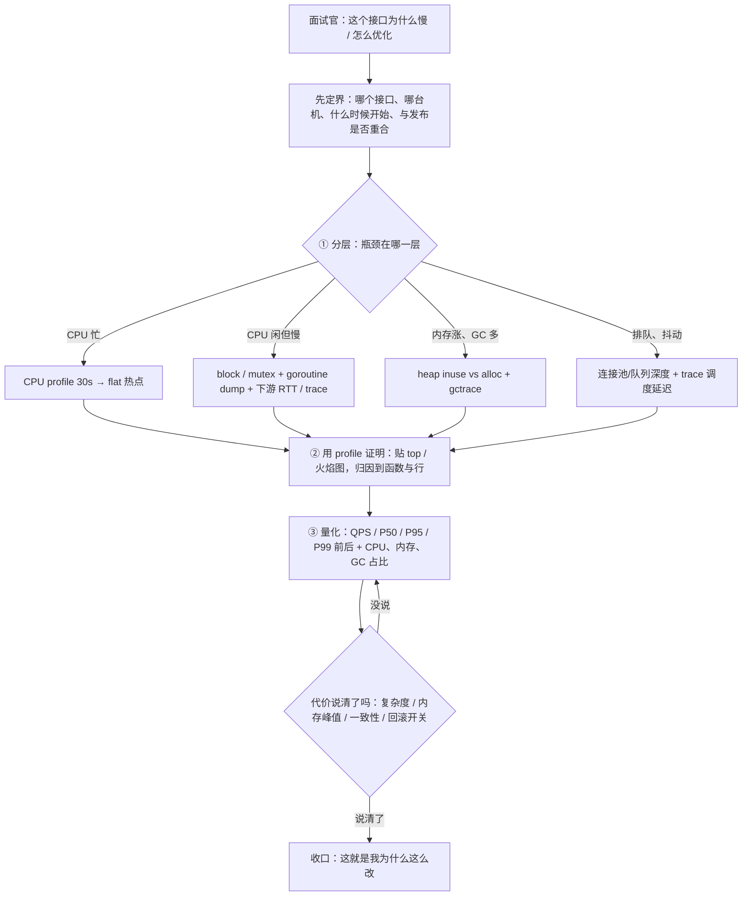
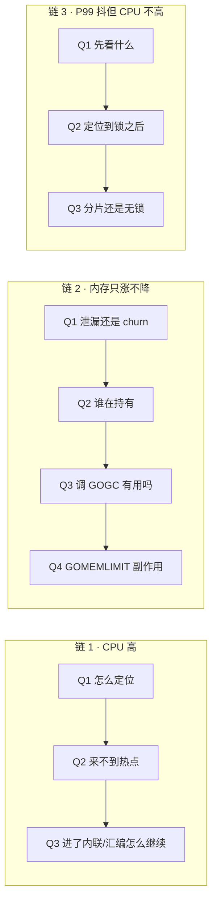

# 19-8 · pprof 面试题库与追问链

> 属于「架构师修炼」· 19 pprof 实战 · 第 8 篇：pprof 面试题库与追问链
> 上一篇：[07 实战案例集](./07-实战案例集)｜栏目总览：[架构师修炼](../)｜下一篇：无（本栏目收口篇）

> **这篇解决什么问题**：前 7 篇已经把「原理 → CPU → 内存/GC → goroutine/锁 → 排查手册 → 生产实践 → 案例」讲完了，但面试现场只有 40 分钟，面试官不会等你回忆章节，他只会问："这个接口为什么慢？"这一篇把整栏压缩成 **1 张答题总纲 + 30 道题（参考答案 / 扣分点 / 追问方向）+ 10 条追问链 + 10 条默写命令 + 1 张自测评分表**。用法：先自测 → 按评分表定位缺口 → 回读对应篇章 → 二刷默写清单。

> **本栏实验样例**（端口约定：业务 `1808N`、pprof `1908N`，N 为篇章编号）：`code/perf/pprof-lab`（L01 CPU 热点 18081/19081、L02 分配与 GC 18082/19082、L03 goroutine 泄漏 18083/19083、L04 锁竞争 18084/19084、L05 channel 阻塞 18085/19085、L06 内存驻留 18086/19086、L07 IO 与序列化 18087/19087，另含自建压测器 `./cmd/load`）。开启了 `-fix` 即运行修复实现，用于 A/B 对比。

---

## 一、答题总纲：三段式（分层 → 证明 → 量化）



**三段式回答模板**（任何性能题都按这三段开口，第一句就是结论）：

| 段 | 你说什么（可直接照读） | 面试官听到什么 | 常见翻车 |
| --- | --- | --- | --- |
| ① 先分层 | 「我先定界：是全部接口还是单个接口、什么时候开始、和发布有没有重合；然后判断瓶颈在 CPU / 内存 GC / 锁阻塞 / 下游等待这四层里的哪一层」 | 有排查框架，不莽 | 上来就说「加缓存试试」 |
| ② 用哪个 profile 证明 | 「CPU 忙看 cpu profile 的 flat；CPU 闲看 block/mutex + goroutine dump；内存看 heap 的 inuse 与 alloc 对比；抖动看 trace 里的 GC pause 与调度延迟」 | **知道用数据说话** | 只报工具名，不报"我要看的指标" |
| ③ 量化收益与代价 | 「改完 P99 从 800ms 到 120ms、单实例拐点从 8k 到 9.6k，代价是新增一个 Pool、对象必须 Reset、代码 +180 行，带开关可回滚」 | **会算量（A3）、会给代价（A4）** | 只说"快了很多" |

**面试官真正想听的是"你怎么确定"，而不是"你用了什么工具"**：

| 减分说法 | 加分说法（同一件事） |
| --- | --- |
| 「我用 pprof 看了火焰图」 | 「我抓了 30s CPU profile，`json.Marshal` 与 `reflect` 合计 42% flat，再 `-list` 归因到 `renderFrame` 的 3 行」 |
| 「内存有点高，我调了 GOGC」 | 「`heap?gc=1` 两次采样 delta 显示 `map[string]*Frame` 净增 480MB，是缓存无上限；调 GOGC 只会让 OOM 来得晚一点」 |
| 「加机器就好了」 | 「拐点 8k 的成因是 GC 占比 28% + 全局锁 delay，前者加机器有效、后者加机器无效，所以先拆锁再加机器」 |
| 「我优化了 20%」 | 「同机同参数 3 轮中位数，QPS +20%、P99 -35%、单位请求 CPU -18%，灰度 10% 真实流量同向」 |

### 30 题索引（含考查点与对应篇章）

| # | 题目 | 组 | 关键考点 | 复习 |
| --- | --- | --- | --- | --- |
| 1 | pprof 有哪些 profile 类型，各自回答什么问题 | A 基础 | profile → 问题映射 | [./01](./01-观测体系与pprof原理) |
| 2 | CPU profile 采样原理与精度限制 | A 基础 | SIGPROF 100Hz、只算 on-CPU | [./01](./01-观测体系与pprof原理)、[./02](./02-CPU火焰图实战) |
| 3 | 火焰图怎么读，flat 与 cum | A 基础 | 宽度=样本占比 | [./02](./02-CPU火焰图实战) |
| 4 | heap 为什么是采样的，MemProfileRate | A 基础 | 512KB 采样与估计值 | [./03](./03-内存与GC实战) |
| 5 | inuse_space 与 alloc_space 何时用 | A 基础 | 占用 vs 速率 | [./03](./03-内存与GC实战) |
| 6 | block / mutex 默认开吗，开销多大 | A 基础 | 默认关闭、需代码开启 | [./04](./04-goroutine与锁阻塞实战) |
| 7 | P99 从 50ms 涨到 800ms 怎么查 | B 定位 | 六步法 | [./05](./05-常见问题排查手册) |
| 8 | CPU 打满但下游空闲说明什么 | B 定位 | 本进程 CPU 归因 | [./02](./02-CPU火焰图实战) |
| 9 | CPU 不高但接口很慢怎么办 | B 定位 | off-CPU 等待 | [./04](./04-goroutine与锁阻塞实战) |
| 10 | 内存只涨不降：泄漏还是 churn | B 定位 | inuse 台阶 vs alloc 速率 | [./03](./03-内存与GC实战) |
| 11 | goroutine 泄漏定位与预防 | B 定位 | 栈聚合 + 退出路径 | [./04](./04-goroutine与锁阻塞实战) |
| 12 | 锁竞争怎么看、怎么优化 | B 定位 | delay / contentions | [./04](./04-goroutine与锁阻塞实战) |
| 13 | 火焰图全是 runtime.* 怎么办 | B 定位 | 先分类再转工具 | [./02](./02-CPU火焰图实战) |
| 14 | 压测优化后数字对不上怎么验证 | B 定位 | 压测可信度 | [./07](./07-实战案例集) |
| 15 | 减少分配的手段与代价 | C 优化 | Pool / 预分配 / 去反射 | [./03](./03-内存与GC实战) |
| 16 | sync.Pool 正确用法与坑 | C 优化 | GC 清空、必须 Reset | [./03](./03-内存与GC实战) |
| 17 | GOGC 与 GOMEMLIMIT 怎么选 | C 优化 | 相对目标 vs 软上限 | [./06](./06-生产环境pprof实践) |
| 18 | 分片锁 / atomic / sync.Map / channel | C 优化 | 热路径少共享 | [./04](./04-goroutine与锁阻塞实战) |
| 19 | 锁的临界区该怎么写 | C 优化 | 别把 IO 放进去 | [./04](./04-goroutine与锁阻塞实战) |
| 20 | 为什么先减少分配再谈调 GC | C 优化 | 工作量守恒 | [./03](./03-内存与GC实战) |
| 21 | 生产怎么安全开 pprof | D 生产 | 三条铁律 | [./06](./06-生产环境pprof实践) |
| 22 | pprof 开销多大、怎么自测 | D 生产 | A/B 压测量化 | [./06](./06-生产环境pprof实践) |
| 23 | 持续 profiling 与没有它怎么兜底 | D 生产 | 事故后回溯 | [./06](./06-生产环境pprof实践) |
| 24 | 容器 / K8s 里怎么采 profile | D 生产 | port-forward、debug 容器 | [./06](./06-生产环境pprof实践) |
| 25 | 怎么保证结论可复现、可回滚 | D 生产 | 单变量 + 开关 | [./07](./07-实战案例集) |
| 26 | `-ldflags="-s -w"` 后全是 unknown | E 陷阱 | 符号化机制 | [./06](./06-生产环境pprof实践) |
| 27 | 内联导致函数消失怎么办 | E 陷阱 | 归因到调用者 | [./02](./02-CPU火焰图实战) |
| 28 | GOTRACEBACK=all 与 SIGQUIT | E 陷阱 | 全栈 dump 会退出 | [./05](./05-常见问题排查手册) |
| 29 | FreeOSMemory 能不能定期调 | E 陷阱 | 改指标不改问题 | [./03](./03-内存与GC实战) |
| 30 | 第二个版本"优化了"反而更慢 | E 陷阱 | 缓存/原子/Pool 命中率 | [./07](./07-实战案例集) |

---

## 二、A 组：基础与原理（6 题）

### A1 ｜ pprof 有哪些 profile 类型，各自回答什么问题

**参考答案**
- **cpu**（`/debug/pprof/profile?seconds=30`）：只统计 on-CPU 时间，回答「CPU 时间花在哪些函数上」，默认 100Hz。
- **heap / allocs**（`/debug/pprof/heap`）：按分配采样，回答「内存被谁占着（inuse）」和「谁在疯狂分配（alloc）」。
- **goroutine**（`?debug=2`）：所有 goroutine 的栈，回答「谁卡住了、谁泄漏了」。
- **block**：同步原语上的阻塞（channel、Mutex、WaitGroup、Cond），回答「时间花在等谁」；**默认关闭**。
- **mutex**：锁竞争持有者，回答「哪把锁在被抢、谁浪费最多时间」；**默认关闭**。
- **threadcreate**：回答「OS 线程为什么一直涨」（通常是 cgo 或阻塞 syscall）。
- **trace**：不是采样而是事件时间线（调度、GC、syscall、block），回答「延迟落在哪一段时间上」。
- 收口：**profile 不是"看谁慢"，而是"回答一个具体问题"**——先有假设，再选 profile。

**常见错误**：把 profile 清单当八股背完就停，说不出「CPU 闲但慢该用哪个」。正确做法是先给问题 → 再给 profile 的映射。
**追问方向**：① 没有 HTTP 端点（批处理/CLI 程序）怎么采？→ `runtime/pprof.StartCPUProfile` 写文件、`pprof.Lookup` + `WriteTo`；② 同一个 profile 里 cpu 有没有可能看不到真正的慢？→ 会，见 A2 与 B3。

### A2 ｜ CPU profile 的采样原理与精度限制

**参考答案**
- 原理：runtime 用基于 `SIGPROF` 的周期定时器（Linux 上 per-thread 定时器），默认 **100Hz**，信号处理里抓当前 goroutine 的调用栈，逐个累加样本。
- 精度：30s 抓取 ≈ 3000 个样本，单样本代表 10ms CPU 时间；统计误差量级约 `1/√n`（3000 样本 ≈ 2%），所以**小于 3% 的差异不能当结论**。
- **只统计 on-CPU**：等锁、等 channel、等网络、等 DB、sleep 都不产生样本（这些时间在火焰图上"不存在"）→ 这正是"CPU 不高但接口慢"必须换 block/trace 的原因。
- 采样粒度：一次执行不足采样间隔的短函数，只能靠"高频调用累积"被采到；因此看**总占比**，不要纠结单次耗时。
- 可以提高采样率：`runtime.SetCPUProfileRate(1000)`（需先关闭 profiling 才能改），代价是信号与抓栈开销上升。
- 容器里 CPU 被 throttle（CFS 限流）时，profile 只反映真正跑在 CPU 上的时间，**throttle 本身要去查 cgroup 指标**。

**常见错误**：「pprof 能看到每个函数的精确耗时」——它是估计值，且只看 on-CPU；也不能看出 GC 以外的等待。
**追问方向**：① 3000 个样本够吗？→ 取决于热点占比，1% 的热点在 30s 里约 30 个样本，噪声很大，要拉长到 5~10 分钟或提高频率；② 采样中断本身有开销吗？→ 有，100Hz 下通常 <1~2%（见 D2）。

### A3 ｜ 火焰图怎么读，flat 与 cum 的区别

**参考答案**
- 横轴宽度 = 该调用栈命中的样本占比（**相对量，不是绝对耗时**）；纵向是调用栈深度，越靠上是越靠近根的调用者。
- **flat（self）** = 函数自身指令的耗时，用来找"热点本体"；**cum（cumulative）** = 含全部子调用，用来找"归因路径"。
- 读图顺序：先 `top -cum` 找贡献最大的入口分支，再 `top`（默认 flat）找自身热点，最后在火焰图上找"最宽的叶子帧"。
- 叶子全是 `runtime.*` 不代表没有归因：`runtime.mallocgc` 变宽说明分配多、`futex`/`chanrecv` 说明阻塞多、`gcBgMarkWorker`/`scanobject` 说明 GC 忙——**要看它的父节点是谁调用出来的**。
- 常用操作：`-focus=`/`-ignore=`/`-peek=` 过滤、`-list FuncName` 看到行（行级归因）、`-disasm` 看指令、`-diff_base` 对比两版。
- 陷阱：同一函数可能出现在多条栈里，别只看其中一条；被内联的短函数会被算进调用者（见 A2/E2）。

**常见错误**：把火焰图当"耗时排行榜"，看到某个函数宽就说"它最慢"——宽度是"被采样到的 CPU 时间占比"。
**追问方向**：① 火焰图是倒过来的 icicle 图有什么区别？→ 只是方向，归因读法一样（自下而上追调用者）；② 为什么火焰图里没有"等 DB 的 800ms"？→ on-CPU 采样看不到，要用 trace 或下游指标。

### A4 ｜ heap profile 为什么是采样的，MemProfileRate 影响什么

**参考答案**
- `runtime.MemProfileRate` 默认 **512KB**：平均每分配 512KB 记录一次分配点（按概率采样，报告值按概率倒数缩放成**估计值**）。
- 为什么采样：每次分配都抓调用栈会让程序没法用；采样把开销压到约 1~3%。
- 影响：分配总量小的进程样本极少 → 几十 MB 堆上的差异可能全是噪声；此时用 `alloc_objects`、`?seconds=N` 拿 delta、或在测试环境临时把采样率调到 1。
- 调整方式：`GODEBUG=memprofilerate=1`（这是**唯一**与采样率相关的 GODEBUG 开关），或代码里 `runtime.MemProfileRate = 1`——必须尽早设置，因为工具假设采样率全程恒定。
- 代价：`MemProfileRate=1` 时开销可达几十倍，只能短时间在非生产环境用。
- 报告值是估计值：比较两份 profile 时看数量级差异（几十 %），不要解释个位数波动。

**常见错误**：把 heap 当成"精确字节数统计"；在生产把采样率调成 1 长期跑。
**追问方向**：① 为什么 `?gc=1`？→ 先触发一次 GC 再采样，排除垃圾干扰，得到干净的在用堆；② block/mutex 也有采样率吗？→ 有，但只能通过 `runtime.SetBlockProfileRate` / `SetMutexProfileFraction` 设置，**没有对应的 GODEBUG**（见 A6）。

### A5 ｜ inuse_space 和 alloc_space 什么时候分别用

**参考答案**
- **inuse_space**：采样时刻仍然存活的对象，回答「谁占着内存」——用于查泄漏、查缓存/大对象常驻。配 `?gc=1` 先回收垃圾，读数才干净。
- **alloc_space**：进程启动至今的累计分配量，回答「谁在制造 GC 压力」——用于查 churn，与 GC CPU 高、P99 抖动直接相关。
- 判据：**inuse 平稳 + alloc 巨大 → 优化分配次数**（Pool、复用、预分配、去反射）；**inuse 台阶式上升 → 找持有者**（map/slice/缓存/goroutine）。
- `inuse_objects` / `alloc_objects` 看对象数量：判断是"少数大对象"还是"小对象海"，前者改结构，后者上 Pool。
- 泄漏排查用 delta：两次采样（或 `?seconds=60`）配合 `-base` 相减，只看净增长的类型与分配点。

**常见错误**：只看 inuse 就下结论"没内存问题"，漏掉 alloc 巨大导致的 GC CPU 高与延迟抖动。
**追问方向**：① 两个 profile 相减会不会有采样噪声？→ 会，所以看数量级与多次复现；② inuse 高但 RSS 更高怎么解释？→ Go 未归还 OS 的页、CGO/mmap、页缓存，见 D4/E4。

### A6 ｜ block 与 mutex profile 默认关闭吗，怎么开，开销多大

**参考答案**
- **默认都关闭**：`SetBlockProfileRate(0)`、`SetMutexProfileFraction(0)`；所以 `/debug/pprof/block` 常常返回空 profile——这是"命令没错但没数据"的第一大原因。
- 开启（只能靠代码，没有 GODEBUG 开关）：
  ```go
  runtime.SetBlockProfileRate(10000)   // 平均每阻塞 10000ns 采一次；1 表示全采
  runtime.SetMutexProfileFraction(1)   // 全采竞争事件；n>1 时平均采 1/n
  ```
- 开销：全采（rate=1 / fraction=1）时每个事件都抓栈，高竞争场景可到 10%+ CPU，且 profile 数据本身占内存；生产必须"排查时开、用完关"。
- block 覆盖：channel 收发与 select、Mutex/RWMutex 阻塞、WaitGroup.Wait、Cond.Wait；注意 **`time.Sleep` 不计入 block profile**。
- 读数：block 看 `delay`（阻塞总时长，ns）与 `count`；mutex 看 `contentions`（竞争次数）与 `delay`（等待总时长）。
- 使用时机：CPU 不高但 P99 抖、火焰图出现 `futex`/`semacquire`/`chanrecv`，或压测 QPS 上不去时。

**常见错误**：`curl .../block` 看到空文件就说"没有阻塞问题"——其实是没开启采样。
**追问方向**：① 两者区别？→ block 记"等待者"，mutex 记"持锁导致竞争的持有者"，P99 问题两者一起看；② rate 取多少合适？→ 先 10000（10µs）抓到粗轮廓，再降到 1 精确定位。

---

## 三、B 组：定位方法（8 题）

### B1 ｜ 线上 P99 从 50ms 涨到 800ms，你怎么排查（完整六步）

**参考答案**
1. **定界**：哪个接口/哪个机群/什么时候开始/是否与发布或流量变化重合；拉五张图——QPS、P50/P95/P99、错误率、CPU、内存与 goroutine 数、GC 指标。结论是"全局突变"还是"局部渐变"。
2. **分层**：先看下游（DB/Redis/RPC 的 P99、连接池 WaitDuration、DNS），排除"不是本进程的锅"；再看本进程 CPU 使用率是否饱和。
3. **CPU 忙就抓 CPU**：`go tool pprof -http=:19080 "http://127.0.0.1:19081/debug/pprof/profile?seconds=30"`，看 flat 热点并 `-list` 归因到行。
4. **CPU 不忙就查内存与 GC**：`-sample_index=inuse_space`/`alloc_space` 两份对比 + `GODEBUG=gctrace=1`，看 GC 占 CPU 比例、GC 周期、堆增长与是否逼近 GOMEMLIMIT。
5. **再查阻塞与并发**：`curl -s "http://127.0.0.1:19083/debug/pprof/goroutine?debug=2"` 找卡住位置；打开 block/mutex 采样看 delay；用 `trace` 看 GC pause 与调度延迟落在时间线的哪里。
6. **对比与验证**：与上一版 profile 做 `-base` diff，找"新增的热点/新增的分配"；修完用压测器复现（`go run ./cmd/load -url=http://127.0.0.1:18081/api/render?n=2000 -c=50 -d=20s`），再看灰度真实流量，最后写下回滚开关。

> 顺序核心：**先定界、再分层、后深入**。一上来就抓 CPU profile 是新手做法，容易在"CPU 不忙"的场景白跑一轮。
**常见错误**：跳过定界直接调参（调 GOGC）；只测一次不对比发布前后。
**追问方向**：① 如果只有部分实例慢？→ 先按 pod 维度对比（数据分片、缓存命中、宿主机争抢），再看该实例特有的 goroutine/heap；② 如果 P50 正常只有 P99 慢？→ 典型是排队/GC/锁尾延迟，查队列深度、批量大小、`sched/latencies`。

### B2 ｜ CPU 打满但下游空闲说明什么

**参考答案**
- 说明瓶颈就在本进程 CPU：不是 IO 等待，也不是下游容量问题——方向明确，可以放心做本进程优化。
- 火焰图给三类归因：① **业务热点**（JSON/反射/正则/加解密/字符串拼接/大量拷贝）② **GC 相关**（`mallocgc`、`gcAssistAlloc`、`gcBgMarkWorker`、`scanobject`）指向分配过多，转 `alloc_space` ③ **运行时开销**（`futex`/`semacquire` 锁争用、调度、cgo、syscall）。
- 先算"单位请求 CPU = CPU 核时 / QPS"：如果 QPS 没涨而 CPU 涨，就是这个比值变差，能直接定位到引入它的那一次发布。
- 别忽略环境因素：容器里 `GOMAXPROCS` 默认按宿主机核数（超卖 → 上下文切换暴涨）与 CPU limit 节流，都会表现为"CPU 打满但 QPS 不涨"。
- 收口要落到决策：**是"每请求成本高"（改代码）还是"请求量太大"（扩容/限流）**，两者的动作完全不同（见第七节 G1）。

**常见错误**：「CPU 打满就是代码写得差」——也可能是 GC、锁、throttle，必须分类后再下结论。
**追问方向**：① 怎么区分 GC 忙和业务忙？→ CPU profile 里 `runtime.gc*`/`mallocgc` 占比 + `gctrace` 的 GC CPU 百分比互证；② 加机器能不能解决？→ 线性瓶颈能，全局锁/单 key 热点不能。

### B3 ｜ CPU 不高但接口很慢，怎么办

**参考答案**
- 结论先行：瓶颈在 **off-CPU（等待）**，CPU profile 一定看不出，要换工具；判据是 `wall time − on-CPU time = 等待时间`。
- 逐项排查：① 锁与 channel（block/mutex profile，goroutine dump 里大量 `semacquire`/`chan receive`）② 下游 RTT 与连接池排队（DB `WaitCount/WaitDuration`、HTTP 连接复用与 MaxIdleConns）③ GC STW/辅助标记（trace、gctrace）④ 调度延迟（GOMAXPROCS 偏小、goroutine 过载、cgo 阻塞线程）⑤ 自己的 worker pool 太小或队列积压 ⑥ DNS/TLS 握手/时钟/限流排队。
- 工具分工：`/debug/pprof/block` 看"等在哪"，`trace` 看"这段时间线上在干什么"，goroutine dump 看"有多少人在等"。
- 修复方向：调连接池与并发闸门、批量化、异步化、缩小锁临界区、给下游加超时而不是无限等。
- 注意：这类问题常被误判成"机器不够"，实际上加机器只是把排队摊薄，不改等待结构。

**常见错误**：反复抓 CPU profile 找不到热点，就断言"pprof 没用"。
**追问方向**：① 怎么量化"等了多少"？→ block profile 的 delay 总和 / 请求数 ≈ 每请求等待时间；② 等待是下游造成的怎么证明？→ 拿下游 P99 与连接池等待时间与自身 P99 对齐。

### B4 ｜ 内存只涨不降，怎么区分泄漏和 churn

**参考答案**
- 先把定义说清：**泄漏** = 对象仍可达、GC 收不掉；**churn** = 短命对象多、GC 收得掉但收得频繁。
- 判据：① 强制 GC 后 inuse 是否回落：`heap?gc=1` 间隔采样，inuse 呈**台阶式上升** → 泄漏；呈锯齿、峰值高但能回落 → churn ② `alloc_space` 巨大而 `inuse_space` 平稳 → churn ③ RSS 不降但 inuse 平稳 → 可能是未归还 OS 的页（scavenger 会慢慢还，看 `(scav)` 与 `runtime/metrics`）。
- 泄漏的常见持有者：全局 map/slice（L06）、goroutine 泄漏（每个 goroutine 2KB 栈起，且闭包引用大对象）、无上限缓存、未停的 `time.Ticker`、未关闭的 body/conn、finalizer。
- 定位手段：两次 heap 采样 `-base` 相减，看净增长的类型与分配点；`inuse_objects` 增长指向"小对象海/goroutine"；goroutine 数与 heap 同步上涨 → 先查 goroutine。
- 预防：所有缓存有容量与 TTL、所有 goroutine 有退出路径、常驻结构设上限、定期 delta heap 巡检 + 告警。

**常见错误**：只截一张堆快照就断定泄漏；或者把 churn 当泄漏去调 GOGC。
**追问方向**：① 怎么证明是"缓存无上限"？→ delta 里增长集中在 `map[string]*Frame` 的 `mapassign` 分配点，且 `inuse_objects` 单调增；② 泄漏一定会 OOM 吗？→ 不一定，先表现为 GC 更频繁、CPU 升高、P99 抖动。

### B5 ｜ goroutine 泄漏怎么定位与预防

**参考答案**
- 发现：`curl -s "http://127.0.0.1:19083/debug/pprof/goroutine?debug=1" | head -1` 看总数（台阶式上升就是泄漏），同时盯 heap/RSS 与调度开销。
- 定位：`curl -s "http://127.0.0.1:19083/debug/pprof/goroutine?debug=2"` 拿全栈，或用 pprof 的 goroutine profile 按栈聚合（`-peek`/`traces`）看数量最多的那几条栈；关键词 `chan receive`、`select`、`semacquire`、`IO wait`。
- 典型根因：Ticker/Timer 未 Stop、channel 无接收者导致发送方永久阻塞（L05）、context 没传进 goroutine、WaitGroup 漏 Done、退出信号永远不满足（L03）、循环里 `go` 但循环条件不变。
- 预防：每个 `go` 都要能回答"它什么时候退出"；统一用 `context` + `errgroup` 收敛；Ticker/Timer/Conn 一律 `defer Stop/Close`；用 `pprof.SetGoroutineLabels` 打标签便于聚合；把 goroutine 数做成监控指标并设阈值告警。
- 加分：Go 1.26 起有实验性的 `goroutineleak` profile（`GOEXPERIMENT=goroutineleakprofile`）能直接列出"再也不会被唤醒"的 goroutine；本站实验样例（go 1.22）只能用栈聚合 + 时序判断。

**常见错误**：只说"用 `runtime.NumGoroutine` 看"就停——它能发现，不能定位。
**追问方向**：① 泄漏的 goroutine 为什么会让内存涨？→ 栈内存 + 闭包捕获的对象仍然可达；② 怎么防回归？→ 压测脚本里加"结束前后 goroutine 数差 < N"的断言。

### B6 ｜ 锁竞争怎么看，怎么优化

**参考答案**
- 看：先开 `runtime.SetMutexProfileFraction(1)`，再 `go tool pprof -http=:19080 -sample_index=delay "http://127.0.0.1:19084/debug/pprof/mutex"`；`contentions` 告诉你谁在被抢，`delay` 告诉谁最浪费时间。block profile 里的 `sync.(*Mutex).Lock` 是同一件事的另一面。
- 优化清单（按代价从低到高）：① 缩小临界区（把 IO/序列化/日志挪出去）② 分片锁（按 key hash 到 2^k 个 shard）③ `atomic`（标量计数、CAS 指针替换）④ `RWMutex`（读多写少，但有写饥饿与 RLock 原子开销）⑤ copy-on-write / `atomic.Value` 快照（读无锁，写复制全量）⑥ 本地聚合 + 定时合并（读到的是近似值）⑦ 干脆不共享：改成 per-request / per-worker 结构。
- 分片数取 2 的幂且 ≥ 4×CPU 核数；分片带来"读全量不精确"和内存放大，必须在回答里说明。
- 验收：mutex delay 下降 + P99 下降 + QPS 上升，三者同向才算优化成功。

**常见错误**：一看到锁竞争就换 `sync.Map` 或 channel——两者在高频写或热路径上通常更慢（见 C4）。
**追问方向**：① 分片后怎么取总数？→ 遍历所有分片求和（或维护一个 atomic 总量），代价是读取有开销/近似；② 为什么临界区变短收益是大数量级？→ 见 C5 的吞吐上限推算。

### B7 ｜ 火焰图上全是 runtime.* 怎么办

**参考答案**
- 先分类再决策：`mallocgc`/`gcAssistAlloc`/`gcBgMarkWorker`/`scanobject` → GC 与分配问题，转 `alloc_space`；`futex`/`semacquire`/`chanrecv`/`selectgo` → 阻塞/锁，转 block+mutex+goroutine dump；`runtime.mcall`/`gogo`/`schedule` → 调度开销与 goroutine 过载；`memmove`/`memclr` → 大块拷贝（序列化、切片复制）；`syscall`/`cgo` → IO 或外部调用。
- 关键动作：用 `-focus` 过滤出业务子树，或者反过来在火焰图上找 runtime 帧的**父节点**——父节点才是根因所在。
- 例子：`runtime.mallocgc` 的父节点是 `encoding/json.Marshal` 与 `reflect.*`，结论是"反射 + JSON 分配过多"，优化点是手写编码（L01 的 `-fix`），而不是去调 GC。
- 一句话结论：**runtime 出现在顶上不是"Go 的问题"，而是"你的代码在让它干活"**。

**常见错误**：看到 `runtime.*` 就说"这是 Go 运行时开销，没法优化"。
**追问方向**：① GC 占比高到什么程度算异常？→ 经验阈值：GC CPU 占比超过 10~20% 就值得专项优化（视延迟敏感度）；② 怎么快速确认是分配多还是存活多？→ alloc_space 与 inuse_space 对比。

### B8 ｜ 压测优化后数字对不上，怎么验证压测本身可信

**参考答案**
- 常见不可信来源：压测机自身打满（CPU/网卡/端口/文件描述符）、客户端与服务端同机互抢、连接不复用（每次新建 TCP/TLS）、数据量太小或被缓存命中率掩盖、只跑一次取平均、未预热、触发限流或降级、日志级别与 GC 参数不同。
- 可信四件套：① 先确认客户端不是瓶颈（压测机 CPU < 70%，用 `-c` 逐步升到拐点）② 固定输入与数据规模、预热 10s 再计数 ③ 至少 3 轮取中位数，同时看 QPS / P50 / P95 / P99 / 错误数（压测器已输出这五项）④ 服务端同步采 profile 佐证"分配/CPU 真的少了"。
- 统一命令示例：`go run ./cmd/load -url=http://127.0.0.1:18081/api/render?n=2000 -c=50 -d=20s`。
- 微基准用 `benchstat` 判断显著性：`go test -run=^$ -bench=. -benchmem -count=10 | tee new.txt`，再 `benchstat old.txt new.txt`，避免把 3% 噪声当收益。
- 结论要带上下文：**同机、同参数、同数据、几轮、什么分位数、是否同向变化**，缺一项都可能被追问翻车。

**常见错误**：报"QPS 提升 3 倍"但说不出客户端是否打满、P99 是否同向、跑了几轮。
**追问方向**：① 压测提升 20% 但生产看只有 5% 怎么解释？→ 数据分布与缓存命中率不同、生产有下游与限流、生产负载未到拐点；② 怎么让结论更可信？→ 灰度 + A/B + 生产侧 profile 对比（见 D5）。

---

## 四、C 组：优化手段（6 题）

### C1 ｜ 减少分配的手段有哪些，各自代价

**参考答案**

| 手段 | 做法 | 收益 | 代价 / 坑 |
| --- | --- | --- | --- |
| 预分配 | `make([]T, 0, n)`、`buf.Grow(n)` | 消除多次扩容与拷贝 | 估大了浪费内存，估小了没效果 |
| Builder | `strings.Builder` 替代 `+=` | 字符串拼接从 O(n²) 到 O(n) | 只能追加、不能回读 |
| 去 fmt | `strconv.AppendInt` / `AppendFloat` | 去掉接口装箱与反射 | 代码略啰嗦 |
| 去反射 | 手写编解码、缓存 `reflect` 结果 | 常有 30%~70% CPU 下降 | 维护成本、易漏字段 |
| 复用缓冲 | `sync.Pool` + `Reset` | `alloc_objects` 大幅下降 | 并发安全与状态串味（见 C2） |
| 消除逃逸 | `go build -gcflags=-m` 定位并改值传递 | 减少堆分配与 GC 扫描 | 过度追求可变可读性差 |
| 批量 | 一次 IO/一次锁处理一批 | 摊薄固定开销 | 尾延迟变差（见 E5） |
| 减少转换 | 用 `bytes` API 而非 `[]byte↔string` | 少一次拷贝 | `unsafe` 方案有正确性风险 |

- 通用代价三条：**可读性、并发安全（复用 = 共享可变状态）、内存峰值（预分配/池会抬高 RSS）**。
- 判断入口永远是 `alloc_space` 的 top 与 `-list` 归因，而不是"看到 fmt 就改"。

**常见错误**：把"减少分配"当成"写得更底层"，一上来就 `unsafe`，收益没量到先引入 bug。
**追问方向**：① 怎么证明减少了？→ `alloc_objects`/`alloc_space` 前后对比 + `mallocgc` 在 CPU profile 中的占比；② 值传递一定更好吗？→ 小结构体是，大结构体会多一次拷贝，要按逃逸分析结果决定。

### C2 ｜ sync.Pool 的正确用法与坑

**参考答案**
- 正确用法：只放"无状态、可重置"的临时缓冲（`bytes.Buffer`、`[]byte`、编码器）；`Get` 后一律 `Reset`/`buf[:0]`；用完 `defer Put`；放回前清掉对大对象的引用；`Get` 可能拿到脏对象，这是契约不是 bug。
- 坑 1：**GC 会清空池**（Go 1.13+ 用 victim cache 让对象多活一轮 GC），所以 Pool 不是缓存，命中率会周期性掉到 0——不要用它存"贵到必须命中"的东西。
- 坑 2：**不 Reset 会数据串味**（可能变成安全漏洞）；带 `Close()`/状态机的对象（连接、`gzip.Writer` 之类）不能放。
- 坑 3：池是 per-P 的（本地队列 + 共享队列），跨 goroutine 复用会退化；长生命周期 goroutine 各自持有一个对象往往比池更好。
- 坑 4：池里放巨型对象时，内存峰值 = 最坏并发 × 对象大小，反而更容易 OOM。
- 验证：`alloc_objects` 下降 + `mallocgc` 占比下降 + QPS/P99 真的变好；命中率低时会更慢（E5）。

**常见错误**：把 Pool 当缓存/连接池用；`Put` 前不清理导致下一次 `Get` 读到上次的数据。
**追问方向**：① Pool 和 `freeList`（自建链表）怎么选？→ 需要跨 goroutine 共享用 Pool，`per-P`/`per-goroutine` 场景自建更可控；② 怎么测命中率？→ 自定义计数器包一层 Get/Put，或对比 `alloc_objects` 的理论值。

### C3 ｜ GOGC 与 GOMEMLIMIT 怎么选，什么时候不该调参

**参考答案**
- `GOGC`：**相对**目标——堆增长到上次 GC 后存活堆的 `(1+GOGC/100)` 倍就触发 GC，默认 100。调大 → GC 次数少、CPU 低、RSS 高；调小反之。
- `GOMEMLIMIT`（Go 1.19+）：Go 运行时管理内存的**软上限**（不含 CGO/mmap/二进制），接近上限时更频繁 GC 并更积极归还 OS；即使 `GOGC=off` 它也生效。
- 组合建议：容器里设 `GOMEMLIMIT ≈ cgroup limit 的 80%~90%`（给非 Go 内存留余量），CPU 紧张时可 `GOGC=200~400` 换内存；两者一起调才有意义。
- 风险：limit 逼近存活堆 → GC 疯狂触发（thrashing）：CPU 100%、延迟恶化，甚至照样 OOM；所以设值前要看存活堆趋势与 GC 周期数。
- **不该调参的情况**：热点是反射/序列化/锁/分配量本身（先减少分配，见 C6）；没有内存上限就把 GOGC 调大（OOM 风险）；想用 `GOGC=off` "提升性能"；指望全局参数解决某个接口的尾延迟。

**常见错误**：「内存高就调 GOGC」——GOGC 是折中旋钮，不是修复手段；也不能替代对 inuse 增长原因的定位。
**追问方向**：① GOGC 和 GOMEMLIMIT 冲突吗？→ 不冲突，runtime 取更激进的一方；② 怎么观测是否生效？→ `runtime/metrics` 的 `/gc/cycles/total`、`/memory/classes/heap/objects:bytes` 与 GC CPU 占比。

### C4 ｜ 分片锁 / atomic / sync.Map / channel 各自适用场景与代价

**参考答案**

| 方案 | 适合 | 不适合 | 代价 |
| --- | --- | --- | --- |
| 分片锁 | 热点 key 计数、分片映射（L04） | 需要全局一致遍历 | 内存 × 分片数、聚合读不精确 |
| `atomic` | 单标量计数、指针快照替换 | 多字段一致性操作 | 高竞争下 CAS 自旋白烧 CPU |
| `sync.Map` | 读多写少、key 集合基本固定（配置/注册表） | 写多、需要遍历与 len | 双图结构，写会溢出加锁 |
| `RWMutex`/COW | 读极多写极少 | 写频繁 | 写饥饿；COW 写要复制全量 |
| `channel` | 解耦、背压、所有权转移（L05） | 热路径纯计数/同步 | 锁 + 队列 + 调度开销，吞吐低 |

- 判断顺序：先问"能不能不共享"（改成 per-request/per-worker），再问"能不能只更新一个标量"（atomic），最后才考虑"换一种锁"。
- 一句话结论：**热路径上要减少共享，而不是换把更快的锁**。

**常见错误**：把 `sync.Map` 当"并发安全 map 的默认答案"；用 channel 做计数器。
**追问方向**：① 分片锁数量怎么定？→ 2 的幂、≥4×核数，并用 profiling 验证 delay 是否下降；② 无锁一定更快吗？→ 不一定，见 E5 的原子操作变多。

### C5 ｜ 锁的临界区该怎么写（不要把 IO 和序列化放进去）

**参考答案**
- 铁律：临界区只保留"访问共享状态且必须原子"的那几行；IO、日志、序列化、`time.Now()` 批量取值、下游调用一律挪到锁外。
- 反例：锁内 `json.Marshal`、锁内写文件/DB、锁内打日志、锁内发 RPC——此时 delay ≈ 下游 RTT × 并发，锁直接变成串行瓶颈。
- 常用写法：① 快照式（锁内只更新/读取指针）② 先算后锁（把耗时的构造放到锁外）③ 无锁读 + 原子替换（配置、路由表用 `atomic.Value`）④ 统一加锁顺序防死锁 ⑤ 不在持锁时回调可能再次加锁的函数。
- 量化：临界区从 200µs 缩到 2µs，同一把锁的吞吐上限从约 5k/s 提到约 500k/s（1/临界区），delay 与 contentions 同步下降。
- 验收标准：mutex profile 的 delay 下降、P99 下降、QPS 上升——三者同向才算成功。

**常见错误**：只在锁内"少写几行"而不移动真正耗时的操作；用更细的锁包住同样的慢操作。
**追问方向**：① 读多写少要不要换 RWMutex？→ 先看临界区长度与写频率，写频繁时 RWMutex 可能更差；② 无锁读到的旧值能接受吗？→ 按数据分级回答（配置/路由可接受，资金类不可）。

### C6 ｜ 为什么"先减少分配再谈调 GC"

**参考答案**
- GC 的工作量由**存活对象数**与**分配速率**决定：分配少了，GC 触发次数少、每次要 mark 的对象也少，CPU 与 P99 抖动同时下降。
- 调参只是把同样的工作量搬到不同频率上（总量守恒）：`GOGC` 调大减少 GC 次数，但每次 mark 的堆更大、assist 峰值更高，延迟反而可能更抖。
- 数字感：把每请求 1MB 降到 64KB（L02 的 Pool 复用），GC 次数可降一个数量级，CPU profile 里 `gcBgMarkWorker`/`mallocgc` 占比同步下降——比把 GOGC 从 100 调到 200 更可靠。
- 正确顺序：① `alloc_space` 找分配点 ② 消掉大头（序列化/反射/重复构造/Pool）③ 再看 inuse 是否还有增长 ④ 最后才用 GOGC/GOMEMLIMIT 做内存-CPU 折中 ⑤ 全程用 P99 + GC 占比双指标验证。
- 反面警示：调大 GOGC 掩盖泄漏，只是把"慢"换成"OOM"，后者更严重。

**常见错误**：把 GC 调参当成性能优化的第一手段；只用"GC 次数变少"证明有效，不报 CPU 与 P99。
**追问方向**：① 减少分配后 GOGC 还要不要调？→ 可以再调，但收益是二阶的，要先量化当前 GC 占比；② 怎么知道分配点在哪？→ `alloc_space` top + `-list` 行级归因。

---

## 五、D 组：生产与工程（5 题）

### D1 ｜ 生产怎么安全地开 pprof（三条铁律 + 具体做法）

**参考答案**
- **铁律 1：不暴露公网。** 业务端口 `1808N` 不注册 pprof，pprof 只监听独立端口 `1908N` 且尽量绑 `127.0.0.1`；K8s 里用独立 containerPort、不建对外 Service/Ingress，需要时 `kubectl port-forward`。`/debug/pprof` 会泄漏函数名、源码路径、命令行参数，还能被用来反复触发 CPU profile 做 DoS。
- **铁律 2：要鉴权与限流。** `net/http/pprof` 自带 handler 没有鉴权，必须自己 `mux` + BasicAuth/mTLS 或走内网网关白名单；对 profile 端点做并发上限（CPU profile 是全局状态，同一时刻只能一个人抓）与限流。
- **铁律 3：按需、短窗口、默认关。** 默认不注册或用构建标签/配置开关；单次抓取 ≤30s；block/mutex 采样只在排查窗口打开，用完 `SetBlockProfileRate(0)` / `SetMutexProfileFraction(0)` 关掉。
- 补充做法：debug server 单独 goroutine 启动（不复用业务 mux）；记录"谁在什么时候抓了什么"（审计）；profile 文件与二进制 build id 一起归档，便于复核。

**常见错误**：把 `/debug/pprof` 挂在对外网关后面就上线；认为"内网就是安全的"。
**追问方向**：① 为什么 CPU profile 只能一个人抓？→ 它是进程级唯一状态，同时抓会互相干扰与报错；② 怎么防止被当攻击面？→ 独立端口 + 网络策略 + 鉴权 + 限流 + 不入对外 LB。

### D2 ｜ pprof 的开销有多大，怎么自己测

**参考答案**
- 量级（经验值，必须能说"我怎么测的"）：CPU profile 100Hz ≈ <1%~2% CPU；heap 采样（512KB）≈ 1%~3%（分配极密集时更高）；`MemProfileRate=1` 可达几十倍；block rate=1 在高阻塞场景 10%+；mutex fraction=1 在高竞争场景 5%~20% 且占内存；`trace` 比 profile 更重，建议 ≤5s。
- 自测方法：同机、同镜像、同压测参数，分别"开 pprof 端点"与"不开"各跑 ≥3 轮，对比 QPS/P50/P95/P99 与服务端 CPU；`go run ./cmd/load -url=http://127.0.0.1:18081/api/render?n=2000 -c=50 -d=20s`。
- 注意：只抓 profile 不消费它也有开销（尤其是 block/mutex 全采），所以"端点开着"与"正在抓取"要分开测。
- 结论句式（可直接背）：**"我压测对比开/关各 3 轮，QPS 变化在噪声内、P99 上升 <2%，所以 CPU/heap 按需开是安全的；但 block 全采时我测到 8% CPU，所以只在排查窗口开。"**

**常见错误**：说"pprof 开销可以忽略"却拿不出测量方法；把"抓取时的开销"与"采样开启后的开销"混为一谈。
**追问方向**：① 生产能不能长期开着 CPU profile？→ 不能，CPU profile 是全局独占且需要主动停止；② 怎么把开销压到最低？→ 降频率（采样率/采集间隔）、缩短窗口、只在需要的实例上开。

### D3 ｜ 持续 profiling 解决什么问题，没有它怎么兜底

**参考答案**
- 解决的问题：**事后无法复现的问题**——3 小时前开始的内存增长、偶发慢请求、只在高峰期出现的抖动；出事时现场已经消失，只有历史 profile 才能回溯。
- 做法：低频率连续采集（如每 5 分钟采一次 heap/goroutine、每 30s 采 10s CPU），按 service/version/pod 打标签集中存储（Pyroscope/Parca/Cloud Profiler 一类），支持"版本间火焰图 diff"与"某实例某时段的堆增长"。
- 没有它时的兜底三件套：① 定时快照落盘并保留 N 小时（heap + goroutine，成本低）② 慢请求/超时自动触发抓取（P99 超阈值就抓 30s CPU 与 goroutine dump 存盘）③ 指标时序（goroutine 数、GC 次数与占比、RSS/inuse、block delay）作为事后回溯的证据链。
- 连续采集命令（可直接执行）：
  ```bash
  for i in $(seq -w 1 120); do
    curl -s -o /tmp/heap-$i.pb.gz "http://127.0.0.1:19082/debug/pprof/heap?gc=1"
    curl -s -o /tmp/goro-$i.txt  "http://127.0.0.1:19082/debug/pprof/goroutine?debug=1"
    sleep 30
  done
  ```
- 判断标准：有持续 profiling，才能回答"这次上线后分配速率变化了多少""哪个版本引入了新热点"。

**常见错误**：认为"出事再抓 profile 就行"——多数线上问题（泄漏、慢请求）现场不会等你。
**追问方向**：① 存储成本怎么控？→ 降频、压缩、按版本/实例采样、保留窗口滚动删除；② 怎么保证低开销？→ 只在部分实例采集并分层（1% 采样），避免全量扫栈。

### D4 ｜ 容器 / K8s 里怎么采 profile

**参考答案**
- 首选 port-forward：pprof 只监听 Pod 内端口时，本地 `kubectl port-forward pod/<pod> 19081:19081`，再 `go tool pprof -http=:19080 "http://127.0.0.1:19081/debug/pprof/profile?seconds=30"`（kubectl 在 Pod netns 内发起连接，所以绑 `127.0.0.1` 也能通）。
- 没有 port-forward 权限：`kubectl debug -it <pod> --image=curlimages/curl --target=<container> -- sh`，在容器网络里 `wget -O /tmp/cpu.pb.gz "http://127.0.0.1:19081/debug/pprof/profile?seconds=30"`，再 `kubectl cp` 出来分析；或者让边车/agent 采集。
- 容器特有坑：① `GOMAXPROCS` 默认按宿主机核数 → 线程超卖，配 `automaxprocs` 或显式设置；② CPU 被 CFS 节流，profile 看不到，要查 `container_cpu_cfs_throttled_seconds_total`；③ RSS 与 Go 内存指标口径不同（未归还页、CGO、mmap）；④ 内存 limit 必须配 `GOMEMLIMIT`，否则是 OOMKilled 而不是 GC 变积极；⑤ 多副本要按 pod 分别采（热点往往只在某台）；⑥ 镜像 strip 过 → 用同 build id 的带符号二进制反查（E1）。

**常见错误**：在镜像里 `curl localhost:19081` 之外没有任何采集路径，出事时进不去容器。
**追问方向**：① Pod 里没有 curl/wget 怎么办？→ `kubectl debug` 临时容器，或用 node 上的 agent/`nsenter`；② 为什么照着宿主机核数设 GOMAXPROCS 会变慢？→ 上下文切换与节流，线程数远超可用 CPU 配额。

### D5 ｜ 怎么保证性能优化的结论可复现、可回滚

**参考答案**
- 可复现：固定环境（同规格、同数据量、同参数、同 Go 版本、同 GOGC/GOMEMLIMIT）+ 预热 + ≥3 轮取中位数 + `benchstat` 判显著性；把 profile 工件、命令行、二进制 build id、压测输出一起归档，说清"这个数是在什么条件下得到的"。
- 单变量：一次只改一个优化点，一个 PR 一件事，配套 benchmark/回归测试；否则无法归因是谁起了作用。
- 可回滚：优化走开关/配置或版本灰度，明确回滚判据（P99、错误率、内存、GC 占比超阈值即回滚），避免引入不可回滚的持久化格式变更。
- 落地验证：压测收益 → 灰度/真实流量确认 → 保留同组 profile 对比 → 记录"收益在什么条件下成立、什么条件下失效"（缓存命中率低、数据分布变化时会失效）。
- 汇报模板：结论（P99 800ms→120ms）→ 证据（火焰图前后、alloc_space 降 94%）→ 代价（新增 Pool + Reset 约束，代码 +180 行）→ 风险与回滚（开关 + 灰度 + 观测）。

**常见错误**：只给"优化后更快"的结论，不问"在哪种负载下成立"；没有回滚开关就全量上线。
**追问方向**：① 压测 20% 但生产只有 5% 怎么办？→ 先对齐条件，再在生产侧采 profile 找差异；② 怎么防止优化被后续改动破坏？→ 基准测试 + 关键指标告警进 CI。

---

## 六、E 组：场景与陷阱（5 题，面试官挖坑区）

### E1 ｜ `go build -ldflags="-s -w"` 之后火焰图为什么全是 unknown

**参考答案**
- **先把两条路径分开，再回答。** 工程结论与 [05 篇 F09](./05-常见问题排查手册) 一致：**生产不要 strip，symbolization 要有符号来源**；但被追问"为什么"时要答得住机制——`-s` 是"disable symbol table"（并隐含 `-w`）、`-w` 关掉 DWARF，而 Go 的函数名与行号在 `.gopclntab` 里**不会**被它们去掉（panic 栈照样有名字），并且**从活进程抓的 profile 里已经内嵌了 `Function.Name / Filename / buildID`**。所以"加了 `-s -w` 就全是 unknown"这句话本身不严谨：它成立与否，取决于你是"profile 自带符号"还是"靠本地二进制按地址反查"。
- 真正会 unknown 的情况：① 采集器只拿到地址（perf/eBPF/外部 agent 不做内嵌符号化），需要本地用二进制反查 —— 此刻 strip 掉的符号表与 DWARF 就让名字和行号都丢了；② 反查用的二进制与线上不是同一次构建（build id 不一致），地址对不上；③ CGO/汇编符号依赖符号表；④ 不同 Go 版本或 `-trimpath` 重建导致行号偏移。
- 正确解法：① 生产镜像可以 strip，但**保留同 build id 的带符号二进制**归档（`go tool buildid ./app` 对齐；或用 `objcopy --only-keep-debug` 分离 debug 文件）② 直接对活进程抓取时用 `-symbolize=remote`（通过 `/debug/pprof/symbol` 让目标进程解析地址）③ 只加 `-w` 不加 `-s`（保留符号表）④ 排查时用同 commit 参数重建一份二进制。
- 追问 1「怎么确认二进制匹配？」→ `go tool buildid ./app` 比对，`go version -m ./app` 看 Go 版本与 vcs 信息。
- 追问 2「行号为什么可能丢？」→ pclntab 里的行号仍在、`-list` 反汇编可用，但依赖 DWARF 的调试器（gdb/dlv）会退化成只能看函数级。

**常见错误**：直接答"因为 strip 掉了符号，所以重建一份带符号的就行"——没有区分"活进程内嵌符号化"与"地址反查"两条路径，也答不出 build id 一致性。
**追问方向**：① 那为什么有些公司非要留 debug 二进制？→ 外部采样器与离线分析依赖本地反查；② 怎么做到镜像小又不丢可观测性？→ 分离 debug 文件 + 构建产物归档 + `-symbolize=remote`。

### E2 ｜ 内联导致函数消失怎么办

**参考答案**
- 现象：小函数被内联后，采样归因到调用者，火焰图上"看不到它"（或只作为 inline 帧出现）；`go build -gcflags=-m` 会打印 `can inline` / `inlining call to ...`。
- 处理：① 先看调用者的行级归因（`-list Caller`、`-peek`），Go 在 pclntab 里记录了 inline 树，pprof 通常能展开 inline 帧，未必真的消失 ② 需要精确函数级时用 `-gcflags='all=-l'` 关闭内联、或临时加 `//go:noinline`，重编一份**仅用于观测**的二进制 ③ 用 `-disasm`/`objdump` 看真实指令与调用关系。
- 关键纪律：**观测构建与生产构建分离**——绝不为了看火焰图在生产长期关闭内联。
- 追问 1「关掉内联后热点变了吗？」→ 会变（内联消除调用开销、影响逃逸分析），所以只用它确认"归因"，收益数字必须回到生产构建上测。
- 追问 2「inline 帧为什么有时显示有时不显示？」→ 与工具版本和编译选项有关；`-N`/`-l` 关闭优化后会改变栈形态，`runtime.Callers` 的 skip 计算也可能受影响。

**常见错误**：为了"看清函数"在生产关内联，然后把观测构建的数字当收益上报。
**追问方向**：① 汇编函数怎么归因？→ `-disasm` + `perf` 硬件事件，或把汇编段用 `//go:noescape`/包装函数隔离出来单独测；② 内联是好事还是坏事？→ 通常是好事，别为了观测牺牲它。

### E3 ｜ GOTRACEBACK=all 与 SIGQUIT 有什么用

**参考答案**
- `kill -QUIT <pid>`（等价 Ctrl+\）：运行时会打印 goroutine 栈然后 **`exit(2)` —— 进程会退出**。它是"不改代码就能拿全栈 dump"的手段（L03 查 goroutine 泄漏常用），但只能用于本地/测试，或"本来就准备重启"的现场。
- 详细程度由 `GOTRACEBACK` 控制：默认 `single`（只打当前 goroutine、省略 runtime 内部帧）→ `all`（含所有用户 goroutine）→ `system`（再加 runtime 内部 goroutine 与帧，排查调度/GC 类卡死）→ `crash`（SIGABRT + core dump）。也可在运行时 `debug.SetTraceback("all")` 提升。
- 生产里正确的非破坏性做法：`curl -s "http://127.0.0.1:19083/debug/pprof/goroutine?debug=2"`——同样是全栈，但进程不退出。
- 追问 1「怎么判断是死锁？」→ 全栈里所有 goroutine 都停在 `semacquire`/`chan receive`/`select` 且互相等待；runtime 只在**全部** goroutine 都卡住时才报 `all goroutines are asleep - deadlock!`，业务死锁往往只有一部分卡住，所以必须自己看栈。
- 追问 2「生产能用 SIGQUIT 吗？」→ 不能当常规手段（会杀进程）；可以先摘流量/下线实例再抓，或直接走 pprof 端点。

**常见错误**：在生产直接 `kill -QUIT` 排查——一次操作就是一次故障；也答不出 `single/all/system` 的区别。
**追问方向**：① 死锁与"慢"怎么区分？→ 看栈是否单调不变、goroutine 数是否只增不减；② `system` 什么时候用？→ 怀疑 runtime 内部（调度、GC、netpoll）卡住时。

### E4 ｜ runtime/debug.FreeOSMemory() 能不能定期调

**参考答案**
- 它做什么：强制一轮完整 GC + 让 runtime 把空闲页归还 OS（scavenge），RSS 立刻下降。
- 为什么不能定期调：① 打断正常 GC 节奏，制造 CPU 尖峰与 P99 抖动 ② 归还后马上又要分配 → 重新向 OS 申请（page fault、syscall），总成本更高 ③ 它不解决"内存为什么涨"，只是让 RSS 曲线好看——**典型的改指标不改问题**。
- 正确做法：① 用 `GOMEMLIMIT` 让 runtime 自动在接近上限时更积极回收与归还 ② 一次性大任务（批量导出、离线计算）结束后调用一次，或用短生命周期进程处理 ③ 排查"RSS 高"时先区分 Go 堆（inuse）与未归还页（`runtime/metrics` 的 `/memory/classes/...`），很多"泄漏"其实是 scavenger 节奏 + 页缓存。
- 追问 1「它和 `runtime.GC()` 区别？」→ `runtime.GC()` 只回收不归还 OS；`FreeOSMemory` = GC + 归还，更贵。
- 追问 2「容器里 RSS 高会 OOMKill 怎么办？」→ 设 `GOMEMLIMIT` 并留余量，监控 working set 而不是只看 Go heap，必要时降缓存容量或调小 GOGC。

**常见错误**：定时器里每 5 分钟 `FreeOSMemory` 一次，声称"解决了内存泄漏"。
**追问方向**：① 为什么归还了还会涨？→ 分配继续发生，页又被拿回来；② 有什么场景它是对的？→ 批量任务结束、内存敏感的单次作业、发布后主动归还。

### E5 ｜ 为什么第二个版本"优化了"反而更慢

**参考答案**
- 四类真实原因：① **缓存友好性变差**（连续数组改成 map/指针链表/接口切片 → cache miss 上升、GC 扫描对象变多）② **锁粒度变细导致原子操作变多**（分片 + 每条记录 CAS 在高并发下变成缓存行争用，甚至 false sharing，比一次 Lock 更慢）③ **Pool 命中率低**（GC 清空、per-P 隔离、对象大小不一 → 每次 Get 落空还要重建 + Reset，反而更慢）④ **批量变大抬高尾延迟**（吞吐变好但 P99 变差，对延迟敏感的服务就是负收益）。
- 还有：优化破坏了内联/逃逸分析（拆包、加接口、加闭包）、预分配过大导致内存峰值与 mark 成本上升、串行改并发后下游成为新瓶颈（更多 goroutine 在排队）。
- 怎么诊断：同一负载下看 **P99 与单位请求 CPU**，不是只看 QPS；用 `-base` 做火焰图 diff，看新引入的 `runtime.*`（`futex`、`mallocgc`、`gcBgMarkWorker`）是否变宽；给 Pool 加命中率计数器。
- 决策原则：一次只改一个变量；把"吞吐优先"与"延迟优先"分开评估；P99 变差时退回或用开关分场景启用（只对批量接口开）。
- 追问 1「怎么判断 Pool 划不划算？」→ 命中率 + `mallocgc` 占比 + `alloc_objects` 下降幅度 + Reset 成本；命中率低于约 70% 时通常不划算。
- 追问 2「批量多大合适？」→ 用 P99 预算反推（如预算 200ms、单条处理 2ms、下游 RTT 5ms），做参数扫描而不是拍一个数。

**常见错误**：用"平均值变快了"证明优化成功；把三个改动一起上，事后无法归因。
**追问方向**：① 分片锁为什么会更慢？→ 原子操作与缓存行同步次数增加、聚合读变贵；② 怎么避免这类翻车？→ 先量化再改、单变量、双指标（吞吐 + 尾延迟）验收。

---

## 七、架构层面高阶题（3 题）

### G1 ｜ QPS 拐点 8k、业务峰值 9k，先优化代码还是先加机器

**判据表**

| 判据 | 先加机器 | 先优化代码 |
| --- | --- | --- |
| 瓶颈性质 | CPU/内存等**可水平摊薄**的资源饱和 | 全局锁、单 key 热点、单分片、单主库等**串行部分**（Amdahl：串行段决定上限） |
| 单位请求 CPU | 与上一版持平（说明是量的问题） | 明显变差（说明是代码退化） |
| 时间与确定性 | 峰值就在眼前（小时级）、`9k/8k` 只差 12.5%，扩容当天可完成且可回滚 | 有排期空间，且优化能把拐点抬到 13k 以上 |
| 收益上限 | 拐点后 P99 已指数上升（排队效应），扩容是唯一立刻见效的手段 | 优化收益可量化（每请求 CPU −40% → 拐点 ×1.6） |
| 代价 | 钱 + 容量管理成本，可随时缩容 | 2 人周 + 回归风险 + 复杂度维护成本 |

**推荐答法**：「短期先加机器保命（12.5% 的缺口、可回滚、当天生效），同时花 30 分钟抓一次 profile 判定瓶颈类别：如果是全局锁/单 key 热点，加机器不解决，必须改代码（分片锁、本地缓存）；如果是序列化/分配类的 CPU 热点，就排期优化并给出量化目标。**判据不是"哪个更快"，而是"瓶颈是否可水平摊薄，以及时间窗口有多宽"**。」这就是 [01 QPS 分级与架构演进地图](/架构师修炼/01-QPS分级与架构演进地图) 里"触发指标驱动演进"的用法，也对应 [02 单体架构的极限与分层](/架构师修炼/02-单体架构的极限与分层) 中"单体的极限来自共享资源"。

### G2 ｜ 缓存 / 序列化 / GC 三个优化里只能做一个，怎么排优先级

**排序逻辑：收益上限 × 确定性 ÷ 代价。**
- 先看数据：读火焰图与 `alloc_space`，谁是 CPU/分配的大头；**优化的收益上限不会超过该部分占比**（占 15% 的东西优化到 0 也只有 15%）。
- 常规排序：① **序列化**（常占 20%~50% CPU，纯本地改动、无一致性风险、可逐接口灰度）② **缓存**（可能带来数量级收益，但收益取决于命中率与数据分布，还引入一致性、内存、失效与雪崩风险——若目标是"降下游压力/抬 QPS 上限"，它才是第一位）③ **GC 调参**（只是内存-CPU 折中，收益二阶且有 OOM/抖动反噬）。
- 若三者收益相近，按**可回滚性与确定性**排：序列化 > 缓存 > GC；缓存必须在有明确命中率数据之后再做。
- 只能是"一个"时的交付方式：给预期收益区间、验证方式（压测 + 灰度指标）、时间成本、回滚开关，并把未选的两项写成后续待办与触发条件。这正对应 [02 单体架构的极限与分层](/架构师修炼/02-单体架构的极限与分层) 里"缓存是分层结构的一部分，不是提速补丁"。

### G3 ｜ 你优化了 20% 但引入复杂度的维护成本，怎么向 leader 汇报

**四段式汇报模板。**
1. **结论**：P99 800ms → 120ms，单实例拐点 8k → 9.6k（+20%），预计可推迟扩容一个季度，按当前机器成本折算每月省 X。
2. **证据**：火焰图前后对比、`alloc_space` 下降 94%、压测 3 轮中位数、灰度 10% 真实流量 P99 同向。
3. **代价（必须主动说）**：新增约 180 行 + 1 个自研 Pool；1 条必须遵守的约束（对象必须 `Reset`）；新人理解成本、2 个易错点、多了一个需要监控的命中率指标。
4. **选项与建议**：A 保持（收益随流量放大，推荐）；B 回滚（若 QPS 增长 <10%，收益不足）；C 折中（只对最热接口启用 + 开关控制）。同时把约束写进 README 与代码注释，并补单测防止被后续改动破坏。
收口句：**「我优化的是'每请求成本'这个随流量累积的量，复杂度是一次性成本，但必须显式标价并准备好开关和回滚」**——这正是 A4「会给代价」的用法。

---

## 八、五段可直接背诵的回答（每题组一段）

> 结构永远是：**先结论 → 再证据 → 最后代价**。下面每段 60~120 字，口语化，背下来即可用。

1. **A 组（原理）**：「pprof 里 cpu 只统计 on-CPU 的采样，默认 100Hz，30 秒大概三千个样本，所以它能告诉我 CPU 花在哪，但看不到等锁等 IO 的时间；heap 是按 512KB 采样出来的估计值，`inuse_space` 看谁占着内存、`alloc_space` 看谁在制造 GC 压力；block 和 mutex 默认是关的，得用 `SetBlockProfileRate` 和 `SetMutexProfileFraction` 打开，全采时开销能到 10%，所以我只在排查窗口开。」

2. **B 组（定位）**：「P99 从 50 涨到 800，我先定界——是全站还是单个接口、和发布有没有重合；再看是不是下游的锅。CPU 忙我就抓 30 秒 CPU profile 看 flat 热点并归因到行；CPU 不忙我就查 GC 占比和 block、mutex 的 delay，再用 goroutine dump 看谁在等。找到根因改完必须用同一套压测参数复现，再看灰度真实流量，最后留回滚开关。」

3. **C 组（优化）**：「我不会先去调 GOGC，因为 GC 的工作量是由分配速率和存活对象决定的，调参只是换个频率，总量不变。我会先用 `alloc_space` 找出分配大头——通常是 JSON、反射和字符串拼接——用复用缓冲、`strings.Builder`、手写编码把它降下来，GC 次数自然掉一个数量级；GOGC 和 GOMEMLIMIT 留到最后做内存和 CPU 的折中。」

4. **D 组（生产）**：「生产开 pprof 我守三条：不暴露公网——业务 1808N 上不注册，pprof 只在 1908N 且走 `port-forward`；必须有鉴权和限流，因为 pprof 自带 handler 没有鉴权；按需开、抓取不超过 30 秒、默认关闭。开销我自己测过：开和关各压 3 轮，QPS 在噪声内、P99 上升不到 2%，但 block 全采能到 8% CPU，所以那是排查窗口才开的开关。」

5. **E 组（陷阱）**：「如果面试官说加了 `-s -w` 火焰图就全是 unknown，我会先纠正：`-s` 去符号表、`-w` 去 DWARF，但 Go 的函数名在 pclntab 里，活进程抓的 profile 也内嵌了函数名，所以通常还能显示。真正会 unknown 的是外部采样器只拿到地址、需要用二进制反查，或者反查用的二进制 build id 对不上；解法是留一份同 build id 的带符号二进制，或者用 `-symbolize=remote`。」

---

## 九、自测评分表

### 9.1 四档标准（每题按档打分）

| 档位 | 判定标准 | 分值 |
| --- | --- | --- |
| 能说清机制 | 能讲清原理与边界（采样原理、默认开关、inuse/alloc 语义、flat/cum），并说出"它回答不了什么" | 1 分 |
| 能给命令 | 能当场写出可执行命令（含端口、参数、`-sample_index`、`?gc=1`、`--base`），而不是"用 pprof 看一下" | 1 分 |
| 能给数字 | 能给出量级（100Hz、512KB 采样、30s≈3000 样本、GC 占比阈值、开销百分比、优化前后 P99） | 1 分 |
| 能给代价 | 能说出该手段的代价与失效条件（Pool 被 GC 清空、分片读不精确、缓存一致性、调参 OOM 风险） | 1 分 |

### 9.2 30 题打分网格（每题 4 档，逐格打勾）

| 组 | 机制 | 命令 | 数字 | 代价 |
| --- | --- | --- | --- | --- |
| A（A1~A6） | ☐ A1 ☐ A2 ☐ A3 ☐ A4 ☐ A5 ☐ A6 | ☐ ☐ ☐ ☐ ☐ ☐ | ☐ ☐ ☐ ☐ ☐ ☐ | ☐ ☐ ☐ ☐ ☐ ☐ |
| B（B1~B8） | ☐ B1 ☐ B2 ☐ B3 ☐ B4 ☐ B5 ☐ B6 ☐ B7 ☐ B8 | ☐ ☐ ☐ ☐ ☐ ☐ ☐ ☐ | ☐ ☐ ☐ ☐ ☐ ☐ ☐ ☐ | ☐ ☐ ☐ ☐ ☐ ☐ ☐ ☐ |
| C（C1~C6） | ☐ C1 ☐ C2 ☐ C3 ☐ C4 ☐ C5 ☐ C6 | ☐ ☐ ☐ ☐ ☐ ☐ | ☐ ☐ ☐ ☐ ☐ ☐ | ☐ ☐ ☐ ☐ ☐ ☐ |
| D（D1~D5） | ☐ D1 ☐ D2 ☐ D3 ☐ D4 ☐ D5 | ☐ ☐ ☐ ☐ ☐ | ☐ ☐ ☐ ☐ ☐ | ☐ ☐ ☐ ☐ ☐ |
| E（E1~E5） | ☐ E1 ☐ E2 ☐ E3 ☐ E4 ☐ E5 | ☐ ☐ ☐ ☐ ☐ | ☐ ☐ ☐ ☐ ☐ | ☐ ☐ ☐ ☐ ☐ |

### 9.3 判定标准与复习路径

| 判定 | 标准 | 说明 | 下一步 |
| --- | --- | --- | --- |
| 及格 | 能答 20 题（机制档基本齐全） | 常规实习面试可过，但深挖容易露怯 | 补 B 组定位方法与 D 组的"开销自测" |
| 良好 | 25 题且**每答必带命令** | 能主导排查过程，面试官会认为你真上手过 | 补 E 组陷阱与 C 组代价，练追问链 |
| 优秀 | 全部 30 题 + 能默写第十节 10 条命令 | 可以直接讲"我定位过什么、用什么证明、代价是什么" | 打磨高阶题与汇报模板（第七、八节） |

| 缺口 | 回读 |
| --- | --- |
| 机制讲不清（A 组） | [01 观测体系与 pprof 原理](./01-观测体系与pprof原理) |
| 火焰图读不懂、CPU 题答不深 | [02 CPU 火焰图实战](./02-CPU火焰图实战) |
| 内存/GC 题含糊（A4、A5、B4、C2、C3） | [03 内存与 GC 实战](./03-内存与GC实战) |
| goroutine/锁题没底（A6、B5、B6、C4、C5） | [04 goroutine 与锁阻塞实战](./04-goroutine与锁阻塞实战) |
| 定位步骤零散（B1、B3、B8） | [05 常见问题排查手册](./05-常见问题排查手册) |
| 生产安全、开销、容器、持续 profiling（D 组） | [06 生产环境 pprof 实践](./06-生产环境pprof实践) |
| 案例讲不成故事（B8、E5、G3） | [07 实战案例集](./07-实战案例集) |
| 架构层决策（G1、G2） | [01 QPS 分级与架构演进地图](/架构师修炼/01-QPS分级与架构演进地图)、[02 单体架构的极限与分层](/架构师修炼/02-单体架构的极限与分层) |

---

## 十、默写清单：10 条必须当场写出的命令

| # | 场景 | 命令 | 关键点 |
| --- | --- | --- | --- |
| 1 | CPU 热点 | `go tool pprof -http=:19080 "http://127.0.0.1:19081/debug/pprof/profile?seconds=30"` | 30s ≈ 3000 样本；加 `-list 函数名` 看行 |
| 2 | 内存占用 | `go tool pprof -http=:19080 -sample_index=inuse_space "http://127.0.0.1:19082/debug/pprof/heap?gc=1"` | `?gc=1` 先 GC，读数才是在用堆 |
| 3 | 分配速率 | `go tool pprof -http=:19080 -sample_index=alloc_space "http://127.0.0.1:19082/debug/pprof/heap"` | 查 churn 与 GC 压力的入口 |
| 4 | 泄漏 delta | `go tool pprof -http=:19080 -base /tmp/heap-t0.pb.gz /tmp/heap-t1.pb.gz` | 只看净增长；或用 `heap?seconds=60` |
| 5 | goroutine 泄漏 | `curl -s "http://127.0.0.1:19083/debug/pprof/goroutine?debug=2" \| head -60` | `debug=1` 看总数，`debug=2` 看全栈 |
| 6 | 阻塞等待 | `go tool pprof -http=:19080 -sample_index=delay "http://127.0.0.1:19084/debug/pprof/block"` | 需先 `SetBlockProfileRate(10000)`，否则空 |
| 7 | 锁竞争 | `go tool pprof -http=:19080 -sample_index=contentions "http://127.0.0.1:19084/debug/pprof/mutex"` | 需先 `SetMutexProfileFraction(1)`；delay 看时间 |
| 8 | 调度与 GC 时间线 | `curl -o /tmp/trace.out "http://127.0.0.1:19081/debug/pprof/trace?seconds=5" && go tool trace /tmp/trace.out` | trace 很重，≤5s |
| 9 | 微基准对比 | `go test -run=^$ -bench=. -benchmem -count=10 \| tee new.txt && benchstat old.txt new.txt` | `-count≥10` + benchstat 判显著性 |
| 10 | 容器内采集 / 连续采集 | `kubectl port-forward pod/<pod> 19081:19081` 后本地跑第 1 条；连续采集见 D3 的 `for` 循环 | pprof 端口不对外暴露；采集要留档 |

---

## 面试追问链（带答案）

> 追问链是面试的主战场：Q1 你能答，Q2 就开始筛人，Q3 决定你能否进下一轮。下面 10 条把前 7 篇的核心串成"层层深入"的路径，每条只给要点，展开在对应篇章。



**链 1 ｜ CPU 高怎么查**
- Q1「怎么定位 CPU 高」→ 先算 CPU/QPS 确认是"每请求成本"还是"量太大"；抓 30s CPU profile 看 flat，`-list` 归因到行，分类到业务热点 / GC / 运行时开销（[02](./02-CPU火焰图实战)）。
- Q2「采不到热点怎么办」→ 拉长窗口或提高采样率（样本不足）；换到高负载时段或压测环境复现（L01 用 `./cmd/load`）；改用 `alloc_space` 看是否 GC 伪装成 CPU；用 block/mutex 看是否阻塞被误判。
- Q3「换成汇编/内联之后怎么继续定位」→ `-disasm` 看真实指令、`perf` 抓硬件事件、`-gcflags='all=-l'` 观测构建确认归因、`-list` 行级归因（见本文 E2）。

**链 2 ｜ 内存只涨不降**
- Q1「怎么区分泄漏与 churn」→ `heap?gc=1` 看 inuse 是台阶还是锯齿；`alloc_space` 大而 inuse 平稳即 churn（[03](./03-内存与GC实战)）。
- Q2「怎么找到谁在持有」→ 两次 heap 采样 `-base` 相减看净增长类型与分配点；`inuse_objects` 增长指向 goroutine/小对象海；同步看 goroutine 数（L06）。
- Q3「调 GOGC 有用吗」→ 只对 churn 有一点点用（减少 GC 次数但每次更贵），对泄漏完全无用，只会把 OOM 推后。
- Q4「GOMEMLIMIT 会带来什么问题」→ 逼近存活堆时 GC thrashing：CPU 打满、延迟恶化、仍可能 OOM；所以要先看存活堆趋势再设值。

**链 3 ｜ P99 抖但 CPU 不高**
- Q1「先看什么」→ 先确认 `wall − on-CPU` 是等待；看 goroutine 数、连接池 `WaitDuration`、GC 占比与 block/mutex delay（[05](./05-常见问题排查手册)）。
- Q2「定位到锁之后」→ 先缩短临界区（把 IO/序列化挪出去），量化 delay 与 contentions 下降（见本文 C5）。
- Q3「分片锁还是无锁」→ 先看不共享能不能解决；分片（代价：读不精确、内存）→ atomic（只适合标量）→ COW（写复制全量）；并用 P99 验证而不是只看平均（L04）。

**链 4 ｜ goroutine 泄漏**
- Q1「怎么发现」→ `goroutine?debug=1` 首行总数呈台阶上升，heap 与调度开销同步涨。
- Q2「怎么定位到那一行」→ `debug=2` 全栈或用 goroutine profile 按栈聚合，找数量最多的那几条栈（`chan receive`/`semacquire`/`select`）。
- Q3「怎么预防与防回归」→ 每个 `go` 都要有退出路径、`context` + `errgroup` 收敛、`defer Stop/Close`、goroutine 数做指标、压测脚本加"前后差 < N"断言（L03）。

**链 5 ｜ 锁竞争**
- Q1「怎么知道有竞争」→ mutex profile 的 `contentions`/`delay`，block profile 的 `Mutex.Lock` delay，火焰图 `futex` 变宽。
- Q2「临界区里该放什么」→ 只放必须原子的几行；反例是锁内序列化、日志、IO、RPC。
- Q3「分片锁有什么副作用」→ 内存 × 分片数、整体读不精确、聚合成本、可能引入新的原子开销（见本文 C4）。

**链 6 ｜ GC CPU 高**
- Q1「怎么确认是 GC」→ CPU profile 里 `gcBgMarkWorker`/`mallocgc`/`scanobject` 占比 + `GODEBUG=gctrace=1` 的 GC CPU 百分比互证（[03](./03-内存与GC实战)）。
- Q2「减少分配的手段」→ Pool 复用、预分配、Builder、去 fmt/反射、消除逃逸、批量（见本文 C1）。
- Q3「`sync.Pool` 有什么坑」→ GC 会清空（不是缓存）、必须 Reset、不能放有状态对象、per-P 命中率问题（L02 的 `-fix`）。

**链 7 ｜ 火焰图全是 runtime.\***
- Q1「怎么读」→ 分类：分配类（`mallocgc`）→ GC/分配；阻塞类（`futex`/`chanrecv`）→ 锁与 channel；调度类（`schedule`/`mcall`）→ goroutine 过载。
- Q2「归因到 GC 之后」→ 转 `alloc_space`，找到具体分配点改成复用/去反射，再用 gctrace 验证 GC 次数下降。
- Q3「归因到锁/channel 之后」→ 打开 block/mutex 采样看 delay，再改临界区或改通信模型（L04/L05）。

**链 8 ｜ 压测数字对不上**
- Q1「压测本身可信吗」→ 客户端是否打满、连接是否复用、是否预热、几轮、看哪些分位数（见本文 B8）。
- Q2「怎么判断显著性」→ `-count≥10` + `benchstat`，别把 2~3% 噪声当收益。
- Q3「生产没复现怎么解释」→ 数据分布与缓存命中率不同、生产有下游与限流、生产没到拐点；用灰度 + 生产侧 profile 对比回答。

**链 9 ｜ 生产安全与开销**
- Q1「生产怎么开 pprof」→ 三条铁律：不暴露公网、鉴权限流、按需短窗口（见本文 D1）。
- Q2「开销多大」→ 给自测方法（开关各 3 轮 A/B）与量级数字（CPU <1~2%、heap 1~3%、block 全采 10%+）。
- Q3「持续 profiling 与兜底」→ 解决"事后无法复现"；没有它就用定时快照 + 慢请求自动抓取 + 指标时序三件套（见本文 D3）。

**链 10 ｜ 优化后反而更慢**
- Q1「为什么会更慢」→ 缓存友好性、原子操作变多、Pool 命中率低、批量抬高尾延迟（见本文 E5）。
- Q2「怎么诊断」→ 看 P99 与单位请求 CPU，做 `-base` 火焰图 diff，给 Pool 加命中率计数。
- Q3「怎么决策」→ 一次只改一个变量；P99 变差就退回或用开关分场景启用；把"收益成立条件"写进结论（见本文 D5）。

---

## 自测清单

- [ ] 能默写「分层 → 用哪个 profile 证明 → 量化收益与代价」三段式，并在 30 秒内开口
- [ ] 30 题索引表逐题自测，按四档打分，机制/命令/数字/代价四档都过 25 题以上
- [ ] 能不看笔记写出第十节的 10 条命令（含端口、`-sample_index`、`?gc=1`、`-base`）
- [ ] 能说清 CPU profile 只统计 on-CPU，并解释"CPU 不高但慢"该换哪个工具
- [ ] 能区分 `inuse_space` 与 `alloc_space`，并给出泄漏 vs churn 的判据
- [ ] 记得 block/mutex 默认关闭，能写出开启代码与两条读数指标（delay / contentions）
- [ ] 能背出 P99 退化排查六步，且第一步是定界而不是抓 profile
- [ ] 能讲清 `sync.Pool` 的三个坑（GC 清空、必须 Reset、不能放有状态对象）
- [ ] 能给出 GOGC 与 GOMEMLIMIT 的选型建议，并说出不该调参的两种情形
- [ ] 能说出生产开 pprof 的三条铁律与开销自测方法（带数字）
- [ ] 能纠正"`-s -w` 导致火焰图 unknown"这个前提，并给出真正的原因与解法
- [ ] 能解释 SIGQUIT 会退出进程，并给出生产里的非破坏性替代（`goroutine?debug=2`）
- [ ] 能针对"QPS 拐点 8k、峰值 9k"给出判据与决策，而不是直接答"加机器"
- [ ] 能按"结论 → 证据 → 代价 → 建议"汇报一次优化，并说清回滚开关
- [ ] 10 条追问链每条的 Q3 都能接住（不卡壳超过 10 秒）

> **最后一句**：性能题的答案从来不是"我知道 pprof 怎么用"，而是「**我先分层定位、用 profile 证明、给出量化收益与代价，并留下可复现与可回滚的路径**」。前 7 篇教你怎么测，这一篇教你怎么把它讲成一次可被信任的工程决策。
