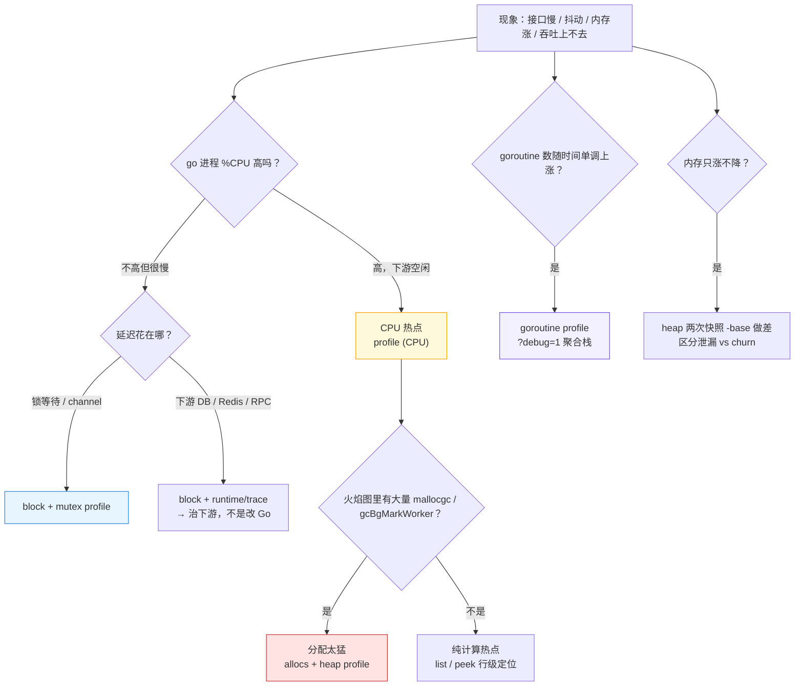
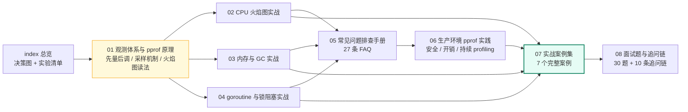
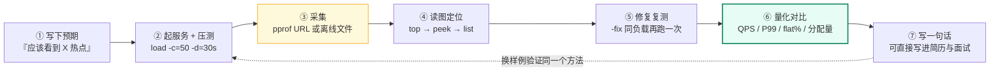

# 19 · pprof 实战：从火焰图到架构决策

> 属于「架构师修炼」· 19 pprof 实战 · 总览
> 上级栏目：[架构师修炼](../)　前置：[02 单体架构的极限与分层](../02-单体架构的极限与分层)　配套实验：[18 实验手册 E01](../18-实验手册-Go落地实验)

> **这个子栏目解决什么问题**：`[架构师修炼 02](../02-单体架构的极限与分层)` 告诉你「单机有四个天花板：CPU / 连接数 / 内存与 GC / 锁」，但只给了四个命令。**真正到了线上，你会卡在更具体的地方**：`go tool pprof` 打不开、抓到的 profile 全是 `runtime.*`、火焰图看不出热点、内存只涨不降分不清是泄漏还是分配太猛、P99 抖得厉害但 CPU 只有 30%。这一栏把 pprof 从「四个命令」变成一套**可复用的定位能力**：8 篇文档 + 8 个可跑实验（`code/architect/pprof-lab/`），每个实验都能亲手造出问题、看到火焰图差异、再用 `-fix` 验证修复收益，并且每个结论都配一句能直接背的面试话术。

---

## 一、三个真实场景：为什么架构师必须会 pprof

面试里问「你做过性能优化吗」，答「用过 pprof」是不够的。面试官想听的是**你怎么确定**。下面三个场景是本栏目全部内容的出发点：

| 场景 | 错误的第一反应 | 正确动作 | 你会因此省下什么 |
| --- | --- | --- | --- |
| 接口 P99 从 50ms 涨到 800ms | 「加机器 / 上 Redis」 | 先分层定位：CPU / 分配与 GC / 锁与阻塞 / 下游等待，五类 profile 各管一段 | 少买 5 台机器，少引入 1 个中间件 |
| 内存曲线只涨不降，深夜 OOM | 「调大内存 / 定期重启」 | 用 `heap` 两次快照做差，区分**真泄漏**与**分配 churn** | OOM 复现与一次线上故障 |
| QPS 压到 8k 就不再涨，P99 起飞 | 「Go 不行 / 换语言」 | 压测与采集同时进行，在拐点上采 CPU + block，找到真正的瓶颈层 | 一次错误的技术选型决策 |

一句话：**性能优化不是「会不会用工具」，而是「能不能把现象归因到具体的层，并用数字证明」**——这正是架构师能力阶梯 A3（会算量）+ A4（会给代价）的落点。

---

## 二、这个子栏目和别处有什么不同

| 已有内容 | 回答的问题 | 本栏目（19 pprof 实战）的不同 |
| --- | --- | --- |
| [第一阶段 · Go 并发编程详解](/第一阶段-知识详解/Go并发编程详解) | GMP、channel、锁的**语法与原理** | 不重复原理：直接问「goroutine 从 200 涨到 20000，这 5000 个栈长什么样、怎么定位」 |
| [架构师修炼 02](../02-单体架构的极限与分层) | 单机的**四个天花板与算量** | 02 给四个天花板与四个命令；本栏目把每个天花板展开成**一条可复现的定位链路** |
| [架构师修炼 13](../13-容量规划压测与故障演练) | 容量模型、压测、演练**方法论** | 本栏目提供压测与采集**同时进行**的具体操作（`code/architect/pprof-lab/cmd/load` 自带压测器） |
| [架构师修炼 18](../18-实验手册-Go落地实验) E01 | 压测找拐点的**一个实验** | 本栏目把 E01 展开成 8 个实验：CPU / 分配与 GC / goroutine 泄漏 / 锁竞争 / channel 阻塞 / 内存滞留 / IO 与 syscall |
| [路线专题 04 简历项目改造](/路线专题/04-简历项目改造与面试实战) | 简历里怎么写性能优化 | 本栏目提供**可量化的证据链**（bug vs fix 对比表），让简历上的数字站得住 |

> 一句话区分：**别人教你「pprof 是什么」，本栏目教你「拿到一条什么现象，下一步敲哪条命令、看哪个视图、得出什么结论、怎么证明改对了」。**

---

## 三、观测决策图：一句话现象，分流到五类 profile

本栏目所有篇章都围绕这张决策图展开——**先分流，再采集**，不要一上来就 `go tool pprof -http`。



| 现象关键词 | 第一个该抓的 profile | 对应篇章 | 对应实验 |
| --- | --- | --- | --- |
| CPU 打满、QPS 上不去 | `profile`（CPU） | [02](./02-CPU火焰图实战) | L01 |
| GC 频繁、P99 周期性抖动 | `allocs` → `heap` | [03](./03-内存与GC实战) | L02 |
| 内存只涨不降 | `heap`（两次快照做差） | [03](./03-内存与GC实战) | L06 |
| goroutine 数单调上涨 | `goroutine?debug=1` | [04](./04-goroutine与锁阻塞实战) | L03 |
| QPS 上不去但 CPU 不高 | `mutex` + `block` | [04](./04-goroutine与锁阻塞实战) | L04 |
| 延迟随并发线性恶化 | `block` | [04](./04-goroutine与锁阻塞实战) | L05 |
| CPU 与 syscall 双高 | `profile` + `runtime/trace` | [02](./02-CPU火焰图实战) | L07 |
| 采集本身出问题（打不开 / 空 / 全 unknown） | —— | [05](./05-常见问题排查手册) | 全部 |

---

## 四、学习路径：8 篇的依赖关系



| 篇 | 内容 | 你能得到 | 配套实验 |
| --- | --- | --- | --- |
| [01 观测体系与 pprof 原理](./01-观测体系与pprof原理) | metrics / expvar / trace / pprof 全景，profile 类型总表，CPU 采样原理，heap 采样与四个视图，火焰图读法 | 遇到任何现象都知道**该抓哪个 profile**，不会白采半天 | 全部（先读这篇再动手） |
| [02 CPU 火焰图实战](./02-CPU火焰图实战) | `top` / `top -cum` / `peek` / `list` / `traces`，火焰图判读，8 类 CPU 热点成因对照，`-base` 对比 | 把「CPU 高」定位到**具体某一行代码** | L01、L07 |
| [03 内存与 GC 实战](./03-内存与GC实战) | `inuse_space` vs `alloc_space`，三类泄漏判别，逃逸分析，`sync.Pool`，`GOGC` / `GOMEMLIMIT` | 分清**泄漏**与**分配太猛**，知道先削分配再谈调参 | L02、L06 |
| [04 goroutine 与锁阻塞实战](./04-goroutine与锁阻塞实战) | goroutine 泄漏 6 种形态，block / mutex profile 开启与判读，锁优化手段对照，死锁定位 | 解决「CPU 不高但吞吐上不去 / P99 抖」这类最难查的问题 | L03、L04、L05 |
| [05 常见问题排查手册](./05-常见问题排查手册) | 27 条 FAQ：抓不到数据、火焰图看不懂、容器访问不了、生产开销、压测不可信…… | **省下三个晚上的试错**，遇到问题当字典查 | 全部 |
| [06 生产环境 pprof 实践](./06-生产环境pprof实践) | 三条铁律、安全暴露的 Go 代码、开销实测方法、K8s 采集、持续 profiling 的三档方案、排障 SOP | 能说出「**我在线上采过 profile**」而不是只在本机玩过 | L01、L02 |
| [07 实战案例集](./07-实战案例集) | 7 个完整案例（AI 剪辑业务语境）：现象 → 假设 → 采集 → 定位 → 修复 → 验证 → 话术 | 一整套**可以直接讲 8 分钟**的排障故事 | L01–L07 |
| [08 面试题与追问链](./08-面试题与追问链) | 30 道题 + 常见错误回答 + 10 条追问链 + 评分表 + 命令默写清单 | 合上文档就能自测，知道自己是「背过」还是「做过」 | 全部（收口自测） |

**建议节奏：每天 1 篇 + 1 个实验**。读 01 建立框架 → 02/03/04 各配 1~2 个实验做透 → 05 当手册随查 → 06 做一次「模拟线上采集」→ 07 把实验记录改写成案例 → 08 收口自测。

---

## 五、实验清单：`code/architect/pprof-lab/`

所有实验都在 [`code/architect/pprof-lab/`](https://github.com/Bin-hy/go-campus/tree/main/code/architect/pprof-lab)：**独立 Go module、零第三方依赖、只用标准库**，`go run` 直接跑，不需要 Docker、不需要 wrk（自带压测器 `cmd/load`）。

**通用约定（记住这两条就不会敲错命令）**：

```text
业务端口 1808N      pprof 管理端口 1908N（= 业务端口 + 1000）
-addr      业务监听地址（默认 127.0.0.1:1808N）
-pprof-addr 管理端口（默认 127.0.0.1:1908N，生产只绑内网）
-fix       默认 false 跑「有问题」的实现，加 -fix 跑「已修复」的实现 → 直接对比
```

| ID | 制造的问题 | 启动 | 业务端点 | 该抓哪个 profile | 对应篇章 |
| --- | --- | --- | --- | --- | --- |
| L01 | CPU 打满：反射 + JSON 序列化 + 字符串拼接 | `go run ./cmd/l01-cpu-hotspot` | `GET /api/render?n=2000` · :18081 / :19081 | `profile` | [02](./02-CPU火焰图实战) |
| L02 | 每请求 MB 级分配 → GC CPU 高、P99 抖 | `go run ./cmd/l02-alloc-gc` | `GET /api/thumb?id=1` · :18082 / :19082 | `allocs` → `heap` | [03](./03-内存与GC实战) |
| L03 | goroutine 只增不减（Ticker 未停、无退出信号） | `go run ./cmd/l03-goroutine-leak` | `GET /api/task/start`、`GET /api/task/count` · :18083 / :19083 | `goroutine` | [04](./04-goroutine与锁阻塞实战) |
| L04 | 全局 mutex 竞争 | `go run ./cmd/l04-lock-contention` | `GET /api/counter?k=hot` · :18084 / :19084 | `mutex` + `profile` | [04](./04-goroutine与锁阻塞实战) |
| L05 | 无缓冲 channel 串行阻塞 | `go run ./cmd/l05-channel-block` | `GET /api/pipeline` · :18085 / :19085 | `block` | [04](./04-goroutine与锁阻塞实战) |
| L06 | 全局 map 长期持有 → heap 只涨不降 | `go run ./cmd/l06-memory-retention` | `GET /api/cache/put`、`GET /api/cache/stats` · :18086 / :19086 | `heap`（两次做差） | [03](./03-内存与GC实战) |
| L07 | 逐行 `fmt.Fprintf` + 未预分配 | `go run ./cmd/l07-io-serialization` | `GET /api/export` · :18087 / :19087 | `profile` + `runtime/trace` | [02](./02-CPU火焰图实战) |
| load | 自建压测器（不依赖 wrk） | `go run ./cmd/load -url='http://127.0.0.1:18081/api/render?n=2000' -c=50 -d=20s` | 输出 QPS / P50 / P95 / P99 / 错误数 | —— | 全部 |

---

## 六、统一打法：每个实验都走同一条五步闭环



> **最关键的是第 ① 和第 ⑥ 步**：没有预期，你就会「看图说话」；没有前后对比，你的结论就没有证据。**面试官最容易识破的，就是只有结论没有测量的人。**

---

## 七、与架构学习的关联映射

本栏目不是孤立专题：**它就是「架构师修炼」里所有性能相关结论的取证工具**。下表说明每篇架构文档的哪个结论，用本栏目的哪一篇+哪个实验来验证：

| 架构学习文档 | 其中的结论 / 场景 | 用本栏目验证 | 实验 | 可写进简历的说法 |
| --- | --- | --- | --- | --- |
| [02 单体架构的极限与分层](../02-单体架构的极限与分层) | 四个天花板之首 **CPU**；「先 pprof 削热点，再谈加机器」 | 全部，尤其 [02 CPU](./02-CPU火焰图实战) | L01、L04、L07 | 「单机压测拐点 8k，火焰图定位到序列化占 46% flat，优化后同负载 P99 降 X%」 |
| [02 单体架构的极限与分层](../02-单体架构的极限与分层) | **内存与 GC**：`GC CPU 占比 > 10% = 分配太猛` | [03 内存与 GC](./03-内存与GC实战) | L02、L06 | 「每请求分配从 2MB 降到 12KB，GC 次数从 40 次/s 降到 2 次/s」 |
| [02 单体架构的极限与分层](../02-单体架构的极限与分层) | **锁**：`WaitDuration/WaitCount > 10ms` 说明池/锁在等 | [04 goroutine 与锁](./04-goroutine与锁阻塞实战) | L04、L05 | 「mutex profile 显示热点 key 争抢占 71%，改分片锁后 QPS 从 A 到 B」 |
| [01 QPS 分级与架构演进地图](../01-QPS分级与架构演进地图) | 坎 1 的手段「复用对象池、减少序列化、pprof 定位热点」 | [02](./02-CPU火焰图实战) · [03](./03-内存与GC实战) | L01、L02 | 「把坎 1 的优化做完，单机承载从 3k 提到 8k，延后了引入缓存的时点」 |
| [12 限流熔断降级与背压](../12-限流熔断降级与背压) | 阻塞传导：队列满时该**拒绝**而不是无限等待 | [04](./04-goroutine与锁阻塞实战) | L05 | 「block profile 发现时间全花在 channel 阻塞上，加缓冲 + worker pool 并引入队列上限拒绝」 |
| [13 容量规划压测与故障演练](../13-容量规划压测与故障演练) | 压测找拐点、容量水位 | [06 生产环境实践](./06-生产环境pprof实践) | L01、L02 | 「压测与采集同时进行，在拐点处定位瓶颈层，得到每实例 6.5k 的容量系数」 |
| [14 备份恢复与故障复盘](../14-备份恢复与故障复盘) | 复盘模板：现象 / 影响 / 时间线 / 根因 / 动作 | [06](./06-生产环境pprof实践) · [07 案例集](./07-实战案例集) | 全部 | 「按 SOP 在 5 分钟内完成分层定位，复盘产出 3 条防复发措施」 |
| [15 案例：AI 剪辑任务平台](../15-案例-AI剪辑任务平台架构) | GenAI 任务编排、回调风暴、成本控制 | [07 案例集](./07-实战案例集) | L01–L07 | 「任务平台的渲染与导出链路做过 7 类性能问题定位」 |
| [17 面试：白板架构设计与追问链](../17-面试-白板架构设计与追问链) | 追问「你怎么知道瓶颈在这」 | [08 面试题与追问链](./08-面试题与追问链) | 全部 | 「追问链演练：从现象到 profile 到量化收益」 |
| [18 实验手册 E01](../18-实验手册-Go落地实验) | 压测找拐点（单一实验） | 本栏目是 E01 的展开版 | L01–L07 | 「E01 的完整版：8 个样例、7 个案例、27 条 FAQ」 |
| [后端技术栈强化 · 分布式](/后端技术栈强化/08-distributed/网络通信与降级方案) | 超时、重试、降级 | [06](./06-生产环境pprof实践) | L07 | 「用 trace + block 区分『应用慢』与『下游慢』，避免改错层」 |
| [K8s Code 教程 · 故障排查](/k8s-code教程/13-故障排查与生产实践) | 容器内排障、资源限制 | [06](./06-生产环境pprof实践) | L01、L02 | 「在 K8s 里通过 port-forward 采集生产 profile，并识别 CPU throttle 假象」 |
| [路线专题 04 简历项目改造](/路线专题/04-简历项目改造与面试实战) | pprof 五步排查、简历话术 | [07](./07-实战案例集) · [08](./08-面试题与追问链) | L03–L06 | 「goroutine 泄漏复现 → 定位 → 修复 → 验证，全套记录在工作区实验报告里」 |

**反向阅读顺序也成立**：如果你先做完了本栏目的实验，再回读 `02 单体架构的极限与分层`，会发现那篇里每一个「结论」现在都有了对应的命令行与观测证据。

---

## 八、里程碑验收（做到才算过关）

| 里程碑 | 验收动作 | 主要篇 |
| --- | --- | --- |
| **P1 会选 profile** | 给出 8 种现象（CPU 满 / GC 抖 / 内存涨 / goroutine 涨 / QPS 上不去 / 延迟随并发恶化 / syscall 高 / 采集失败），5 秒内说出该抓哪个 profile 与对应命令 | [01](./01-观测体系与pprof原理) · [05](./05-常见问题排查手册) |
| **P2 会定位到行** | 对 L01 与 L04，能用 `top -cum → peek → list` 说出热点函数与所在行，并能解释为什么不是别处 | [02](./02-CPU火焰图实战) · [04](./04-goroutine与锁阻塞实战) |
| **P3 会区分泄漏与 churn** | 对 L02 与 L06，能只用 profile + `runtime/metrics` 给出判断，并说明依据 | [03](./03-内存与GC实战) |
| **P4 会量化收益** | 每个实验都能产出 bug vs fix 对比表（QPS / P99 / 分配量 / 热点 flat% / goroutine 数），并用同负载复测证明 | [07](./07-实战案例集) |
| **P5 会安全采集** | 能在「只绑内网的独立管理端口 + 显式注册子集 + 采集时长上限」的前提下采一次线上 profile，并说明开销与回滚方式 | [06](./06-生产环境pprof实践) |
| **P6 会答题** | 30 题里能答对 25 题以上，且每一题都能给出**命令 + 数字 + 代价**，而不是只给结论 | [08](./08-面试题与追问链) |

---

## 九、怎么用这个栏目

```text
01 观测体系 ············ 建立框架（半天）
   │
   ├── 02 CPU ──实验 L01 / L07
   ├── 03 内存 GC ──实验 L02 / L06
   └── 04 goroutine 与锁 ──实验 L03 / L04 / L05
              │
05 常见问题手册 ········ 边做实验边查（当字典，不背）
              │
06 生产实践 ············ 模拟一次线上采集 + 排障 SOP
              │
07 案例集 ·············· 把实验记录改写成 7 个案例
              │
08 面试题 ·············· 合上文档自测 + 默写 10 条命令
```

**三条纪律**（本栏目所有内容都服务于它们）：

1. **先量后调**：没有 profile 就不改代码。凭直觉优化，九成会把时间花在不是瓶颈的地方。
2. **单变量控制**：一次只改一处，同负载复测。同时改三处，收益说不清是谁带来的。
3. **量化收益与代价**：优化完了要给数字（QPS / P99 / 内存 / CPU），也要说清代价（可维护性、复杂度、内存占用）——这是 A4 级「会选型」的证明。

::: tip 给面试的一句话
面试官问「你怎么做性能优化」，不要回答「我会用 pprof」。直接说：**「我先看现象把它归到四层里的哪一层——CPU、分配与 GC、锁与阻塞、下游等待；然后选对应的 profile 取证，定位到具体函数甚至某一行；改完用同一个负载复测，给出 QPS、P99、分配量的前后数字；最后说清这个改动的代价。**」——这句话本身就证明你做过，而不是背过。
:::

---

## 十、相关链接

- 上级栏目总览：[架构师修炼](../)（A1~A5 能力阶梯、QPS 六道坎、里程碑 M1~M6）
- 直接前置：[02 单体架构的极限与分层](../02-单体架构的极限与分层)（四个天花板与算量）
- 配套实验环境：[18 实验手册：Go 落地实验](../18-实验手册-Go落地实验)（分布式实验；本栏目是其 E01 的展开）
- 压测与容量：[13 容量规划压测与故障演练](../13-容量规划压测与故障演练)
- 业务案例：[15 案例：AI 剪辑任务平台架构](../15-案例-AI剪辑任务平台架构)
- 简历与话术：[路线专题 04 简历项目改造与面试实战](/路线专题/04-简历项目改造与面试实战)
- 代码实验包：[`code/architect/pprof-lab/`](https://github.com/Bin-hy/go-campus/tree/main/code/architect/pprof-lab)
