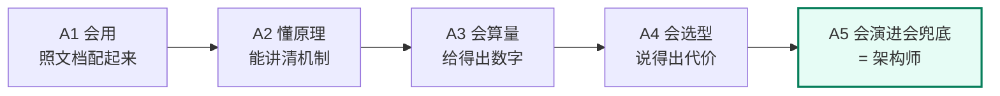
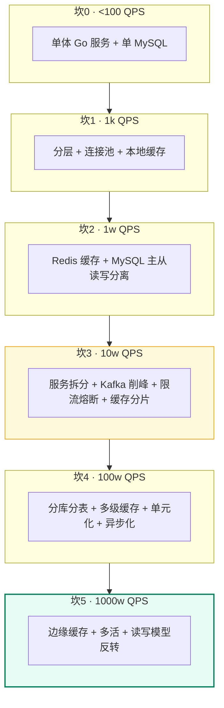

# 架构师修炼：从单体到百万 QPS

> 一个专门练「**架构判断力**」的栏目。不教组件是什么（那是[后端技术栈强化](/后端技术栈强化/)的活），只教三件事：
> **① 同一个业务，QPS 差 10 倍，架构差一个数量级 —— 什么时候该演进、演进成什么样；**
> **② 一致性在真实系统里到底怎么落地 —— Redis / MySQL / Kafka / etcd 的同步机制、参数与代价；**
> **③ 每个组件挂了怎么办 —— 故障边界、降级路径、对账兜底。**

## 这个栏目和别处有什么不同

| 栏目 | 回答的问题 | 典型提问 |
| --- | --- | --- |
| [后端技术栈强化](/后端技术栈强化/)（S1–S10） | **组件是什么、原理是什么** | 「Redis 的 skiplist 为什么这么设计」 |
| [分布式系统面试详解](/第二阶段-知识详解/分布式系统面试详解) | **理论是什么** | 「CAP 怎么理解，Raft 怎么选主」 |
| **架构师修炼（本栏目）** | **我该选哪个、什么时候换、挂了怎么办** | 「1 万 QPS 和 100 万 QPS，MySQL 主从方案有什么不同」 |

> 一句话区分：**S1–S10 教你"零件"，本栏目教你"装配图纸 + 施工规范 + 竣工验收"。**

---

## 一、架构师能力阶梯（A1 → A5）

面试官判断你「是背过还是做过」，看的是你在哪一级。每一级都有**可验证的行为**，不是感觉。

| 级别 | 名字 | 可验证行为 | 典型失败信号 |
| --- | --- | --- | --- |
| **A1** | 会用 | 能按文档把 Redis/Kafka/MySQL 主从跑起来 | 「配了就行」 |
| **A2** | 懂原理 | 能说清 binlog/复制缓冲/ISR 的机制 | 只会背结论，问「为什么」就断 |
| **A3** | **会算量** | 能估出单机容量、连接数、内存、QPS 上限，**给出数字** | 「应该能扛住吧」 |
| **A4** | **会选型** | 同一个问题能给 3 个方案，并说清各自的代价与适用边界 | 「大厂都用 XX」（无边界意识） |
| **A5** | **会演进与兜底** | 能画出 0→10 万 QPS 的演进路径，说清每一步的触发指标、迁移方案、回滚方案、数据一致性兜底 | 只会设计终态，不会**迁移** |

**本栏目的验收标准就是 A3 + A4 + A5**。每篇末尾的「面试追问链」和「自测清单」都按这个标准设计。



---

## 二、六道坎：QPS 每上十倍，架构换一次形态

这是本栏目的**主线骨架**。所有篇章都是这六道坎的展开。

| 坎 | 量级 | 第一个撑不住的组件 | 新增的架构手段 | 对应篇章 |
| --- | --- | --- | --- | --- |
| 0 | **< 100 QPS** | —— | 单体 + 单库，先跑通业务 | [02](./02-单体架构的极限与分层) |
| 1 | **~1,000 QPS** | 单机 CPU/GC/锁 | 垂直分层、连接池、本地缓存、静态化 | [02](./02-单体架构的极限与分层) |
| 2 | **~10,000 QPS** | **MySQL 读** | 读写分离、Redis 缓存、慢查询治理 | [03](./03-MySQL主从与读写分离落地) · [04](./04-Redis高可用与缓存体系落地) |
| 3 | **~100,000 QPS** | **MySQL 写 + 热点** | 服务拆分、MQ 削峰、缓存分片、限流熔断 | [05](./05-Kafka削峰与可靠投递落地) · [12](./12-限流熔断降级与背压) |
| 4 | **~1,000,000 QPS** | 单库容量 + 单机房 | 分库分表、多级缓存、异步化、单元化 | [06](./06-分库分表与在线迁移双写) · [07](./07-多活容灾与全球化架构) |
| 5 | **~10,000,000 QPS** | 全局热点 + 跨地域延迟 | 边缘计算、读写模型反转、预计算、就近接入 | [07](./07-多活容灾与全球化架构) · [16](./16-案例-Feed与社区互动架构) |



> **最重要的一句话**：**架构不是一步到位的，是被 QPS 推着走的**。面试里说「我直接上分库分表 + 多活」，等于说「我不会算成本」。正确姿势是：**先算量 → 找到第一个瓶颈 → 只解决它 → 说清触发下一个坎的指标**。

---

## 三、学习地图

### A · 方法论（先建判断力，2 篇）

| 篇 | 内容 | 你能得到 |
| --- | --- | --- |
| [00 架构师思维与设计方法论](./00-架构师思维与设计方法论) | 五步设计法、量级估算公式、方案对比矩阵、白板答题模板 | 拿到任何场景都能**开口有条理** |
| [01 QPS 分级与架构演进地图](./01-QPS分级与架构演进地图) | 六道坎的量化标准、同一件事在 6 个量级下的做法对照 | 一眼判断「这题该按几万 QPS 答」 |

### B · 演进六阶段（真实落地，6 篇）

| 篇 | 内容 | 落地物 |
| --- | --- | --- |
| [02 单体架构的极限与分层](./02-单体架构的极限与分层) | 单机到底能扛多少（CPU/连接/GC/锁四项算量）、垂直分层与边界 | 压测方法 + Go 侧优化清单 |
| [03 MySQL 主从与读写分离落地](./03-MySQL主从与读写分离落地) | binlog 三种格式、GTID、半同步、并行复制、**主从延迟治理**、切换方案 | my.cnf 参数 + 延迟监控 SQL |
| [04 Redis 高可用与缓存体系落地](./04-Redis高可用与缓存体系落地) | 主从 PSYNC/repl-backlog、哨兵 vs Cluster、槽迁移、脑裂与丢写 | 哨兵/Cluster 配置 + 丢写兜底 |
| [05 Kafka 削峰与可靠投递落地](./05-Kafka削峰与可靠投递落地) | ISR/HW/LEO、acks 与 min.insync、幂等生产者、事务、rebalance、积压处置 | producer/consumer 参数 + 积压预案 |
| [06 分库分表与在线迁移双写](./06-分库分表与在线迁移双写) | 什么 QPS 才该拆、分片键选型、全局 ID、**不停机双写迁移六步法** | 迁移脚本流程 + 校验 SQL |
| [07 多活容灾与全球化架构](./07-多活容灾与全球化架构) | 同城双活/异地多活、单元化、流量调度、数据冲突（LWW/CRDT） | RTO/RPO 拆解 + 切流演练 |

### C · 一致性专题（面试重灾区，4 篇）

| 篇 | 内容 | 你能回答 |
| --- | --- | --- |
| [08 缓存与 DB 一致性落地](./08-缓存与DB一致性落地) | Cache Aside / 延迟双删 / binlog 订阅，**每种方案的失败窗口与兜底** | 「缓存和 DB 不一致了怎么办」 |
| [09 分布式事务与最终一致落地](./09-分布式事务与最终一致落地) | 2PC/TCC/Saga/本地消息表/Seata，选型矩阵与代价 | 「跨服务转账怎么保证不丢钱」 |
| [10 etcd 与 Raft 选主租约落地](./10-etcd与Raft选主租约落地) | Lease、Watch、Revision、MVCC、选主实现、**脑裂与 fencing** | 「主节点假死怎么防止双写」 |
| [11 幂等去重与 Exactly-Once](./11-幂等去重与ExactlyOnce) | 幂等键设计、去重表、Kafka 端到端 exactly-once 的真实边界 | 「消息重复消费怎么保证不重复扣款」 |

### D · 稳定性与工程落地（3 篇）

| 篇 | 内容 |
| --- | --- |
| [12 限流熔断降级与背压](./12-限流熔断降级与背压) | 令牌桶/漏桶/滑动窗口、自适应限流（BBR）、熔断状态机、Go 落地 |
| [13 容量规划压测与故障演练](./13-容量规划压测与故障演练) | 容量模型、全链路压测、影子库、Chaos 演练剧本 |
| [14 备份恢复与故障复盘](./14-备份恢复与故障复盘) | 备份策略、RPO/RTO、故障复盘模板、SLO 与错误预算 |

### E · 综合实战（4 篇）

| 篇 | 内容 |
| --- | --- |
| [15 案例：AI 剪辑任务平台架构](./15-案例-AI剪辑任务平台架构) | 贴合目标岗位：GenAI 任务编排、GPU 队列、对象存储、幂等、限流、成本控制 |
| [16 案例：Feed 与社区互动架构](./16-案例-Feed与社区互动架构) | 读扩散 vs 写扩散、点赞计数、排行榜、热点 key |
| [17 面试：白板架构设计与追问链](./17-面试-白板架构设计与追问链) | 白板答题模板 + 6 道高频题的标准拆解 + 追问链演练 |
| [18 实验手册：Go 落地实验](./18-实验手册-Go落地实验) | 14 个可跑的实验（主从延迟、etcd 选主、Kafka 幂等、Redis 分布式锁…） |

### F · 性能调优实战（子栏目，9 篇）

| 篇 | 内容 |
| --- | --- |
| [19 pprof 实战：从火焰图到架构决策](./19-pprof实战/) | **把「四个天花板」变成可复用的定位能力**：观测决策图、CPU 火焰图、内存与 GC、goroutine 与锁阻塞、27 条常见问题手册、生产环境安全采集、7 个完整案例、30 道面试题；配 8 个可跑实验（`code/perf/pprof-lab/`，零依赖、自带压测器，`-fix` 直接对比修复前后） |

---

## 四、每篇的统一结构（怎么读最高效）


**建议每天 1 篇 + 1 个实验**：先读第 ② 节的表格建立结论，再看 ③④ 理解落地，最后**合上文档**用 ⑥ 的追问链自测。做不出就回读。

---

## 五、里程碑验收（做到才算过关）

| 里程碑 | 验收动作 | 对应篇 |
| --- | --- | --- |
| **M1 会算量** | 给定「日活 100 万、人均 20 次请求、峰值系数 3」，5 分钟内算出峰值 QPS、所需实例数、DB 连接数、缓存内存 | [00](./00-架构师思维与设计方法论) · [01](./01-QPS分级与架构演进地图) |
| **M2 会定位瓶颈** | 给定「P99 从 50ms 涨到 800ms」，能列出 6 条排查路径并排出优先级；能说清该抓哪个 profile 并给出命令 | [02](./02-单体架构的极限与分层) · [13](./13-容量规划压测与故障演练) · [19 pprof 实战](./19-pprof实战/) |
| **M3 会讲组件落地** | 能说清 MySQL 半同步、Redis 哨兵切换、Kafka acks=all、etcd Lease 各自**丢数据的窗口在哪** | [03](./03-MySQL主从与读写分离落地) · [04](./04-Redis高可用与缓存体系落地) · [05](./05-Kafka削峰与可靠投递落地) · [10](./10-etcd与Raft选主租约落地) |
| **M4 会给一致性方案** | 给「订单 + 库存 + 积分」跨服务链路，选出事务方案并写出补偿与对账逻辑 | [08](./08-缓存与DB一致性落地) · [09](./09-分布式事务与最终一致落地) · [11](./11-幂等去重与ExactlyOnce) |
| **M5 会画演进路径** | 白板画出 0 → 10 万 QPS 的 5 步演进，每步给触发指标、迁移方案、回滚方案 | [06](./06-分库分表与在线迁移双写) · [17](./17-面试-白板架构设计与追问链) |
| **M6 会兜底** | 对任意方案能立刻说出「这个组件挂了 → 现象 → 降级 → 一致性边界」 | 全部（每篇都有「故障与一致性边界」） |

---

## 六、和现有学习内容怎么衔接

```text
后端技术栈强化 S1 MySQL / S2 Redis / S3 Kafka / S8 分布式（原理）
                    │
                    ▼
        架构师修炼（本栏目：演进 + 落地 + 兜底）
                    │
                    ├──→ 17 白板面试实战 ──→ 面试
                    ├──→ 18 Go 实验手册 ──→ 项目/简历（可写进项目经历的硬核点）
                    └──→ 19 pprof 实战 ──→ 「瓶颈定位」的取证能力（8 个可跑实验 + 7 个案例）
```

- **前置**：至少过完 S1 MySQL、S2 Redis、S3 Kafka。没学过也能读，但遇到「为什么」需要回查原理篇（每篇都给好了链接）。
- **配合**：[K8s Code 教程](/k8s-code教程/) 解决「部署与编排」，本栏目解决「架构与数据」；[19 pprof 实战](./19-pprof实战/) 解决「**怎么证明瓶颈在这一层**」——02 篇的四个天花板、12 篇的背压、13 篇的压测拐点，都在那一栏里配了可跑的取证实验。
- **产出**：[18 实验手册](./18-实验手册-Go落地实验)里的实验可以直接变成简历上的项目经历——**「我用 Go 实现了带主从切换与对账兜底的订单链路，并压测验证了 X 万 QPS 下的丢数据窗口为零」**，比「熟悉 Redis」强一百倍；[19 pprof 实战](./19-pprof实战/)的实验则给你**可量化的性能数字**（QPS / P99 / 分配量前后对比），这是简历上「性能优化」四个字唯一站得住脚的证据。

::: tip 给面试的一句话
面试官问「你懂分布式吗」，不要背 CAP。直接说：**「我会先算这个业务峰值多少 QPS，第一个瓶颈在哪，再决定要不要上这些组件——不然就是拿复杂度换虚荣心。」** 这句话本身就是 A3+A4 的证明。
:::
