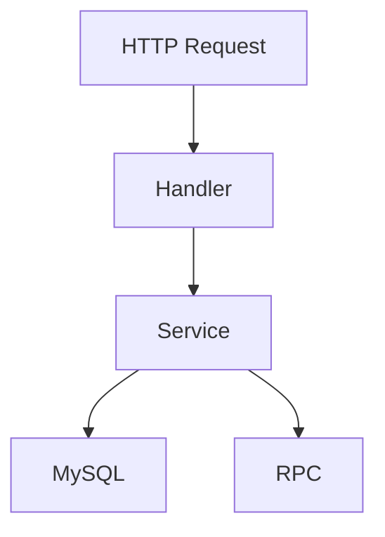
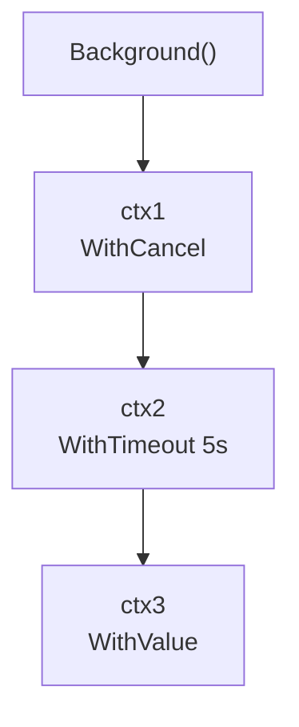
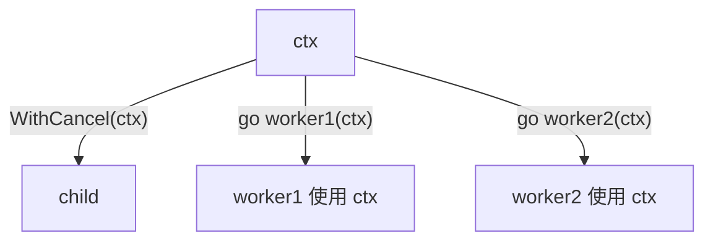
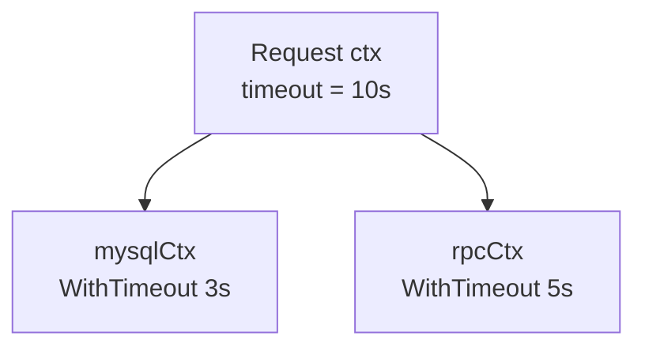
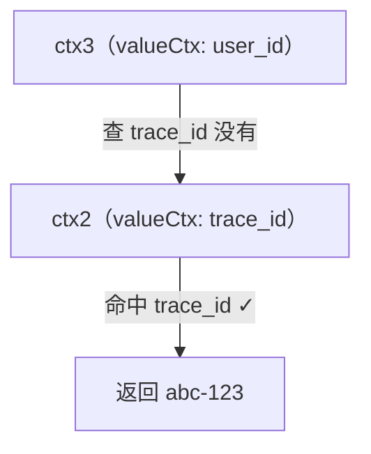
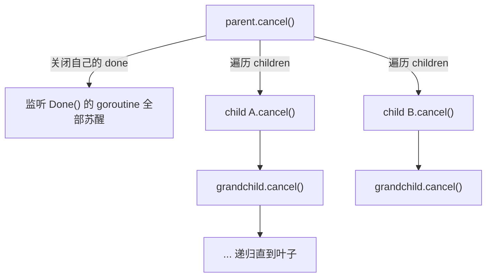

# Go Context 详解

> 配套练习：[Context 超时控制](/习题集和答案/phase1/07_context/01_timeout_http/)、
> [可取消任务](/习题集和答案/phase1/07_context/02_cancelable_task/)、
> [值传递与链路追踪](/习题集和答案/phase1/07_context/03_trace_propagation/)。
> 建议先阅读[知识点总览 · 2.4 Context 详解](/第一阶段-知识点详解#24-context-详解)建立框架，再对照本文深入源码与易错点。

---

## 一、Context 到底解决什么问题？

Context 解决的三个问题：

```text
Context
├── 取消传播（cancel propagation）
├── Deadline / Timeout（超时控制）
└── 请求级数据传递（跨切面元数据）
```

以一个 HTTP 请求的调用链为例：



如果用户中途断开连接，我们希望**整条调用链**都能感知并停止：MySQL 查询、RPC 调用、后台 goroutine 全部收手，而不是各自继续跑完再发现没人要结果。

在没有 context 之前，这需要手写一套"done channel + 逐层传递 + 逐层检查"的机制，每个库自己发明一套，无法互通。**context 的价值就是把这套生命周期管理标准化**：谁都能创建、谁都能监听、取消自动沿树传播。

---

## 二、Context 不是"继承"，是一棵树

### 2.1 父子关系来自 `WithXXX(parent)`

```go
root := context.Background()

ctx1, _ := context.WithCancel(root)
ctx2, _ := context.WithTimeout(ctx1, 5*time.Second)
ctx3 := context.WithValue(ctx2, key, value)
```



**不是**所有 Context 都直接来自 `Background()`。每一次 `WithXXX(parent)` 都以 parent 为基准创建一个 child，于是形成一棵 **Context Tree**。这棵树才是 context 语义的真正载体。

### 2.2 goroutine 是 Context 的"使用者"，不是 child

```go
go worker1(ctx)
go worker2(ctx)
go worker3(ctx)
```

三个 goroutine 用的是**同一个 Context 值**，它们之间**不会**产生这种结构：

```text
ctx
├── worker1   ← ❌ 错误理解
├── worker2
└── worker3
```

Context 的 child 只由 `WithXXX` 产生：

```go
child, cancel := context.WithCancel(ctx) // 这才是真正的 child
```



> **一句话：goroutine 监听 ctx.Done()，但 goroutine 本身不会出现在 ctx 的 children 里。** 把"使用同一个 ctx 的 goroutine"和"WithXXX 创建的 child ctx"混为一谈，是初学者最常见的误解。

---

## 三、为什么要基于父 Context 创建子 Context？

**核心原因：子 Context 继承父的约束，同时可以叠加自己的约束。**



```go
mysqlCtx, cancel1 := context.WithTimeout(ctx, 3*time.Second)
rpcCtx, cancel2 := context.WithTimeout(ctx, 5*time.Second)
```

- mysqlCtx：父的 10s 约束 **+** 自己的 3s 限制；
- rpcCtx：父的 10s 约束 **+** 自己的 5s 限制；
- 两个子之间互不影响，但**都受父约束**：父 10s 一到，两个子同时取消。

**为什么父真的能"约束"子？** 不是 Context 有什么魔法继承，而是创建 child 时 context 包**主动建立了父子关系**：child 会被注册进 parent 的 `children` 集合（详见第五节）。

---

## 四、核心数据结构：四种 Context 的实现

Context 对外只是接口：

```go
type Context interface {
    Deadline() (deadline time.Time, ok bool)
    Done() <-chan struct{}
    Err() error
    Value(key any) any
}
```

标准库里对应四类实现：

| 类型 | 由谁创建 | 能力 |
| ---- | ------- | ---- |
| `emptyCtx` | `Background()` / `TODO()` | 根：永不取消、无 deadline、Value 返回 nil |
| `cancelCtx` | `WithCancel` / `WithCancelCause` | 主动取消 + 取消传播 |
| `timerCtx` | `WithTimeout` / `WithDeadline`（及 Cause 版本） | 在 cancelCtx 基础上增加 deadline |
| `valueCtx` | `WithValue` | 在父基础上挂一个 key-value |

`timerCtx` 是"内嵌 cancelCtx + timer + deadline"：

```go
type timerCtx struct {
    cancelCtx                    // 取消能力直接复用
    timer    *time.Timer         // 到点自动触发取消
    deadline time.Time
}

type cancelCtx struct {
    Context                       // 内嵌父 context
    mu       sync.Mutex
    done     atomic.Value         // <-chan struct{}，惰性创建
    children map[canceler]struct{} // 子 context 集合
    err      error
}
```

### 4.1 `children map[canceler]struct{}` 是什么？

这是一个 **Set**：保存所有"可以被取消的子 Context"。

**为什么 key 用内部的 `canceler` 接口，而不是 `Context`？**

因为公开的 `Context` 接口**没有 `cancel()` 方法**——外部使用者只能 `Done()` 监听，不能主动取消别人。取消是内部机制，所以 context 包定义了一个内部接口：

```go
type canceler interface {
    cancel(removeFromParent bool, err, cause error)
    Done() <-chan struct{}
}
```

只有实现了 `cancel()` 的 `cancelCtx` / `timerCtx` 才能成为别人的 child（`valueCtx`、`emptyCtx` 不行，它们没有取消能力）。

**为什么 value 是 `struct{}`？** 因为只需要记录"child 在不在"：

```go
children[child] = struct{}{} // child 是我的子
delete(children, child)      // 解除父子关系
```

`struct{}` 不占内存，是 Go 标准 Set 写法。

### 4.2 `valueCtx`：一层一层往上找

```go
type valueCtx struct {
    Context          // 内嵌父
    key, val any
}

func (c *valueCtx) Value(key any) any {
    if c.key == key {
        return c.val
    }
    return c.Context.Value(key) // 没有就继续问父
}
```



所以 Value 查找是**沿父链向上逐层询问**（O(深度)），不是"复制继承"。**子能读父的值，父读不到子的值**——这是 03_trace_propagation 练习的考点。

---

## 五、取消传播的源码核心（重点）

你总结末尾点名的两个函数，就是 context 取消机制的真正核心：**`propagateCancel`（建立关系）** 和 **`cancelCtx.cancel`（执行传播）**。

### 5.1 `propagateCancel`：创建 child 时建立父子关系

`WithCancel` / `WithTimeout` 内部都会调用它。逻辑分三种情况：

```go
func propagateCancel(parent Context, child canceler) {
    done := parent.Done()
    if done == nil {
        return // ① 父永远不会被取消（Background/TODO/WithoutCancel）→ 不建立传播
    }

    select {
    case <-done:
        child.cancel(false, parent.Err(), nil) // ② 父已取消 → 立即取消 child
        return
    default:
    }

    if p, ok := parentCancelCtx(parent); ok {
        // ③a 父是标准 cancelCtx/timerCtx → 把 child 注册进父的 children
        p.mu.Lock()
        if p.err != nil {
            child.cancel(false, p.err, nil) // 父刚被取消
        } else {
            if p.children == nil {
                p.children = make(map[canceler]struct{})
            }
            p.children[child] = struct{}{}
        }
        p.mu.Unlock()
    } else {
        // ③b 父是自定义 Context（非标准实现）→ 开 goroutine 监听父的 Done
        go func() {
            select {
            case <-parent.Done():
                child.cancel(false, parent.Err(), nil)
            case <-child.Done(): // 子先结束，退出监听，防泄漏
            }
        }()
    }
}
```

**三种情况对应三种父：**

| 父的类型 | 处理方式 | 代价 |
| ------- | ------- | ---- |
| 永不取消（`done == nil`） | 不注册、不监听 | 零开销 |
| 标准 cancelCtx / timerCtx | 注册进 `children` map | 零额外 goroutine |
| 自定义 Context | 起一个 goroutine 监听父 Done | 每个 child 一个 goroutine（所以标准实现优先） |

> 面试点：为什么 **③b** 要 `case <-child.Done():`？因为如果子先于父结束而不退出监听 goroutine，这个 goroutine 就会一直挂在父的 Done 上——**goroutine 泄漏**。

### 5.2 `cancelCtx.cancel`：取消信号如何沿树传播

```go
func (c *cancelCtx) cancel(removeFromParent bool, err, cause error) {
    c.mu.Lock()
    if c.err != nil {
        c.mu.Unlock()
        return // 幂等：已经被取消过就不再处理
    }
    c.err = err
    if c.done == nil {
        c.done = closedchan // Done() 从未被调用过：直接复用共享的已关闭 channel
    } else {
        close(c.done)       // 通知所有监听者
    }

    for child := range c.children {
        child.cancel(false, err, cause) // 递归传播给每个子
    }
    c.children = nil                    // 清空，解除引用
    c.mu.Unlock()

    if removeFromParent {
        removeChild(c.Context, c)       // 把自己从父的 children 里摘除
    }
}
```



**cancel 的三个关键性质：**

1. **幂等**：`c.err != nil` 直接返回，多次 cancel 安全；
2. **原子**：加锁后先置 err、再关 done、再传播 children——监听者醒来时看到的 Err() 一定是准确的；
3. **双向解除**：child 取消后把自己从 parent 的 children 中删除（防止 parent 已取消的 child 被重复 cancel、防止内存泄漏）。

`Done()` 返回的 channel 是**惰性创建**的（首次调用时才 `sync.Once` 创建）。如果 cancel 先于任何 `Done()` 调用发生，`done` 还是 nil，cancel 直接把它指向共享的 `closedchan`，保证"先取消、后监听"也能立刻收到关闭信号。

---

## 六、`WithTimeout` / `WithDeadline`：约束如何"收紧"

### 6.1 二者区别

```go
ctx, cancel := context.WithTimeout(parent, 5*time.Second) // 相对时间：从现在起 5s
ctx, cancel := context.WithDeadline(parent, time.Now().Add(5*time.Second)) // 绝对时间点
```

`WithTimeout` 内部就是 `WithDeadline(parent, time.Now().Add(timeout))`——**一个包一个 API 表面，底层同一套 timerCtx 机制**。

### 6.2 子约束不能突破父约束（实现细节）

你总结里的 `min(父, 子)` 理解是对的，但 Go 的实现更聪明：**如果父的 deadline 更早，子根本不会创建 timer**。

```go
// context.WithDeadline 内部（简化）
if cur, ok := parent.Deadline(); ok && cur.Before(d) {
    // 父的截止时间更早 → 子不可能活到自己的 deadline
    return WithCancel(parent) // 退化成普通取消，不设 timer
}
```

```text
父 deadline = 3s，子 deadline = 10s
→ 子实际截止 = 3s（父先到，父取消 → 子跟着取消）
→ 子自己的 timer 是多余的，直接不创建
```

所以把 Context 理解成"**一套逐级收紧的生命周期约束**"：可以叠加更严的约束，但**永远无法放宽**父的约束。

### 6.3 为什么必须 `defer cancel()`？

```go
ctx, cancel := context.WithTimeout(parent, 5*time.Second)
defer cancel() // 函数退出时主动取消，提前结束 timer
```

不 defer 的两个后果：

1. **timer 泄漏**：`WithTimeout` 创建的 `time.Timer` 在到期前不会被 GC 回收（与 `time.After` 同理）。函数提前返回时若没 cancel，timer 继续挂着直到 5s 后触发；
2. **child 泄漏**：ctx 如果不取消，注册在父 children 里的这个 cancelCtx 不会被移除，父长期持有对它的引用。

> 规律：**`WithXXX` 返回了 cancel，就一定要在某处调用它**——通常就是 `defer cancel()`。Go 官方文档原话：如果函数返回时这个 context 还要传给别的 goroutine 使用，就不要 defer；否则务必 defer。

---

## 七、`WithValue`：请求级数据传递

### 7.1 正确与错误用法

```go
// ✅ 请求级 / 跨切面元数据：trace_id、request_id、认证信息
ctx = context.WithValue(ctx, traceIDKey, "abc-123")

// ❌ 当万能参数容器用：Context 变成 map[string]interface{}
ctx = context.WithValue(ctx, "db", db)
ctx = context.WithValue(ctx, "user", userObject)
ctx = context.WithValue(ctx, "config", config)
```

**面试答法：** "WithValue 用于 cross-cutting concerns（跨切面关注点）——trace_id、request_id 等请求级元数据。业务参数应该通过函数参数显式传递：Value 是 `any` 类型，编译期无法检查，隐式依赖会让代码不可维护。"

### 7.2 key 的三个铁律

1. **必须可比较**：`WithValue` 内部会做 `c.key == key` 比较，传不可比较类型（slice、map、func）直接 panic；
2. **不要用内置类型当 key**：不同包可能用同一个 `"user"` 字符串当 key，互相覆盖。用**自定义类型**（`type traceIDKey string`），包内私有，天然隔离；
3. **获取时做类型断言**：`v, ok := ctx.Value(key).(string)`，取不到返回零值而不是 panic。

```go
type traceIDKey struct{} // 空 struct 类型本身即 key，最干净的写法

ctx = context.WithValue(ctx, traceIDKey{}, "abc-123")
traceID, _ := ctx.Value(traceIDKey{}).(string)
```

### 7.3 Value 查找沿父链向上

子能读父的值，父读不到子的值；查找是**逐层询问**而非复制（见 4.2 的 mermaid 图）。这正好对应 03_trace_propagation 练习的考点。

---

## 八、其余 API：`WithCancelCause` / `WithoutCancel` / `TODO`

| API | 版本 | 语义 |
| --- | ---- | ---- |
| `WithCancelCause` | Go 1.20 | cancel 时可携带原因，`ctx.Cause()` 读取消原因 |
| `WithTimeoutCause` / `WithDeadlineCause` | Go 1.21 | 超时/截止时可指定原因 |
| `WithoutCancel` | Go 1.21 | **切断取消传播**：新 ctx 保留 Value，但 Done() 返回 nil、无 deadline |
| `TODO()` | 一直 | 语义明确的占位：代码还没想好用哪个 ctx，先占位 |
| `Background()` | 一直 | 真正的根：任何链路的最顶端 |

```go
// WithoutCancel 场景：后台任务不应被请求取消
ctx, cancel := context.WithCancel(requestCtx)
defer cancel()

bg := context.WithoutCancel(ctx) // 请求取消了，bg 不受影响（但 Value 仍能读到）
go doBackgroundWork(bg)
```

**Background vs TODO 的区别**：语义上 TODO 表示"占位，待替换"，Background 表示"这就是根"。二者实现相同（都是 emptyCtx），区分是为了可读性。

---

## 九、最佳实践清单（面试常考）

| 规则 | 说明 |
| ---- | ---- |
| **ctx 必须是函数第一个参数** | 命名约定为 `ctx`，放最前面 |
| **不要存进 struct 字段** | context 的生命周期应跟随调用，而不是跟随对象；存 struct 会让对象持有过期 ctx（唯一例外：标准库 http.Request 这种自带 ctx 的请求对象） |
| **返回了 cancel 就要调用** | 通常 `defer cancel()`；ctx 要传给子 goroutine 时，由谁创建谁负责最终取消 |
| **不传 nil context** | 拿不准就用 `context.TODO()`，传 nil 会在 `WithXXX` 时 panic |
| **不把 context 存到全局/闭包** | 同理，生命周期要跟随调用链 |
| **业务参数走函数参数** | context 只放跨切面元数据（见第七节） |
| **key 用自定义类型** | 见 7.2 三条铁律 |
| **子 goroutine 由谁取消** | 约定：创建 ctx 的 goroutine 负责 cancel；子 goroutine 只能监听，不该反过来 cancel 父（会造成未定义行为） |

---

## 十、面试速答

**Q1：context 为什么设计成接口而不是 struct？**
答：接口允许用户实现自定义 Context（虽然极少需要），也让 Background/TODO/WithXXX 返回的不同实现可以统一赋值给 `Context` 变量；标准实现之间通过内部 `canceler` 接口协作。

**Q2：父 context 取消后，子 context 会怎样？**
答：创建子时 `propagateCancel` 已把子注册进父的 `children`；父 `cancel()` 时遍历 children 递归调用子 `cancel()`，子再传播给孙子，形成树状级联取消。所有监听子 `Done()` 的 goroutine 都会被唤醒。

**Q3：为什么 `WithValue` 查找要向父链上找？**
答：valueCtx 只保存一个 key-value 和自己的父；查不到就委托父查，本质是链表式查询。这样创建子 ctx 是 O(1) 的（不用复制整棵树的 value），代价是查询 O(深度)。

**Q4：Done() 的 channel 为什么惰性创建？**
答：大多数 context 从创建到销毁可能没人调用 Done()（比如只用 WithValue 的场景）。惰性创建省掉了一次 channel 分配；若 cancel 先发生，done 直接复用共享的已关闭 channel，保证"先取消后监听"也能立即收到信号。

**Q5：context 如何帮助避免 goroutine 泄漏？**
答：goroutine 里 `select { case <-ctx.Done(): return; default: ... }` 定期检查取消；取消信号沿树传播到所有子任务，配合 `defer cancel()` 保证父级退出时子任务也能退出，而不是阻塞在 channel 上永久挂起。

**Q6：WithValue 传 string key 有什么风险？**
答：不同包可能撞 key 互相覆盖；且类型不安全。官方文档明确建议用自定义类型；空 struct 类型（`type key struct{}`）是最干净的写法。

---

## 十一、一句话记住 Context

> **Context 是一棵"请求生命周期树"：子 Context 从父 Context 继承取消、Deadline 和 Value，并只能在此基础上收紧约束；父取消时，取消信号沿 children 集合递归传播，goroutine 只是通过 `Done()` 感知变化，并不参与树的结构。**

### 速查卡

| # | 结论 |
| - | ---- |
| ① | goroutine 是 ctx 的使用者，不是 child；child 只由 `WithXXX(parent)` 产生 |
| ② | 父子关系靠 `propagateCancel` 注册进 `children map[canceler]struct{}`，父取消递归遍历 children |
| ③ | `cancelCtx.cancel` 幂等：先置 err → 关 done → 递归 cancel children → 从父的 children 摘除自己 |
| ④ | 子约束不能突破父约束：父 deadline 更早时子不创建 timer，直接退化为 `WithCancel` |
| ⑤ | `WithTimeout` 内部就是 `WithDeadline(time.Now().Add(d))`，一套 timerCtx 机制 |
| ⑥ | `Value` 查找沿父链逐层询问（O(深度)）；key 用自定义类型，业务参数走函数参数 |
| ⑦ | 返回了 cancel 就要调用（通常 `defer cancel()`），否则 timer 泄漏 + child 泄漏 |
