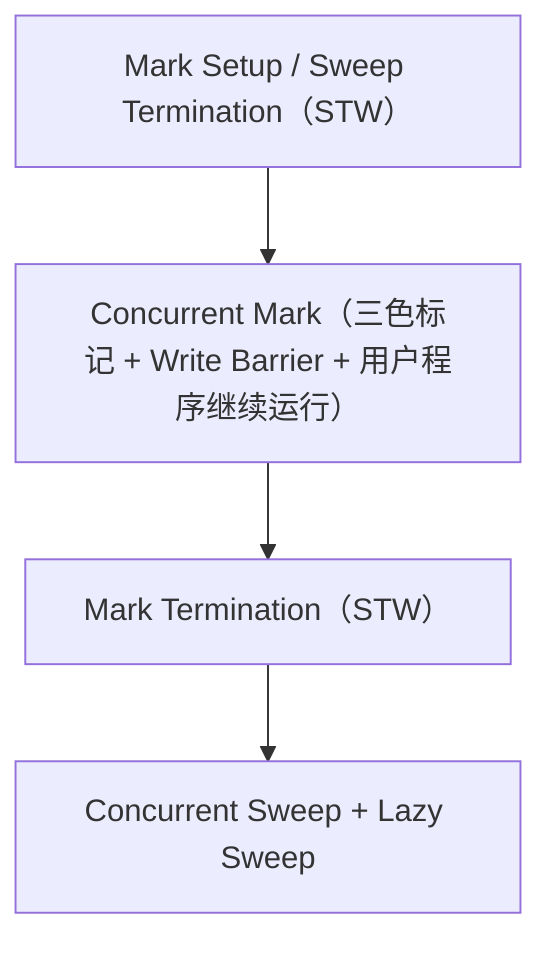
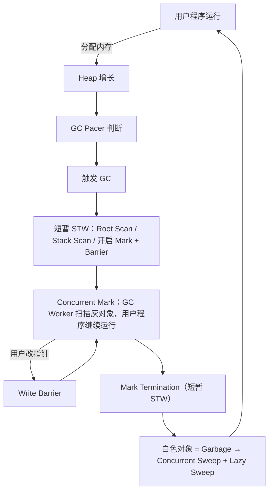

# Go GC 详解（三色标记 / 写屏障 / 混合写屏障 / GC 触发与调优）

> 本专题整理自一次学习对话，是 Go GC 的深入讲解。总览版见[第一阶段知识点总览](/第一阶段-知识点详解)「五、垃圾回收 GC」。
> 配套基础：逃逸分析（为什么很多短命对象不进堆）见 [Go 函数调用与栈详解](/第一阶段-知识详解/Go函数调用与栈详解)，堆分配器见 [Go 内存分配详解](/第一阶段-知识详解/Go内存分配详解)。

---

## 零、整体定位与一句话记忆

Go 的 GC 是：

```text
并发（Concurrent） + 三色标记（Tri-color Marking） + 混合写屏障（Hybrid Write Barrier）
+ 非分代（Non-generational） + 非移动 / 非压缩（Non-moving / Non-compacting）
```

核心目标：

> **从 GC Roots 出发，找到所有仍然可达的对象，剩下不可达的对象就是垃圾。**

一句话记忆：

```text
Go GC
= Roots 找存活对象
  → 三色标记
  → 并发执行
  → 写屏障防止漏标
  → 混合写屏障避免重新扫描所有栈
  → 白色对象成为垃圾
  → Concurrent / Lazy Sweep 回收
```

---

## 一、三色标记法

三种状态：

```text
白色：未确认存活
灰色：已确认存活，但还没扫描它引用的对象
黑色：已确认存活，并且它引用的对象已经扫描完成
```

状态转换：

```text
白色 →（被发现）→ 灰色 →（扫描完成）→ 黑色
```

扫描例子：

```text
Root → A → B
        └→ C
```

1. 初始：A/B/C 全白
2. 扫描 Root：A → 灰
3. 扫描 A：B 白→灰，C 白→灰，A 灰→黑
4. 继续：B 灰→黑，C 灰→黑
5. 灰色队列为空后：**黑色 = 存活，白色 = 不可达，可以回收**

---

## 二、为什么并发标记会产生漏标

如果 GC 期间完全 STW，对象引用不会变化，扫描是安全的。但 Go 为了降低 STW，**GC 标记与用户程序并发执行**，用户程序可能修改对象引用。

经典漏标场景：

```text
A（黑）────→ B（白）     C（灰）────→ B（白）
```

此时用户程序执行：A 新增 → B，C 删除 → B。结果：

```text
A（黑）────→ B（白）     C（灰）   ← C 到 B 的引用已删除
```

问题：
- A 已经是黑色，不会重新扫描
- C 原本指向 B 的引用被删除
- B 可能永远不会被扫描 → **B 保持白色，被 GC 错误当作垃圾回收（漏标）**

### 三色不变式

核心目标：**不能让一个真正可达的对象，在 GC 结束时仍然保持白色。**

经典强三色不变式：

> **黑色对象不能直接指向白色对象。**

否则黑色对象已扫描完成，却指向未发现的白色对象，就可能漏标。

---

## 三、写屏障

**写屏障 = 程序修改指针时，同时通知 GC。**

```go
obj.ptr = newObj
```

逻辑上变成：

```text
Write Barrier（处理 GC 标记关系）
    ↓
obj.ptr = newObj
```

目的：用户程序修改对象引用时，GC 仍能正确找到存活对象，避免漏标。

### 两种经典写屏障

**1. Dijkstra 插入写屏障** —— 关注"新写进去的对象"：

```text
A.ptr = B   →   shade(B); A.ptr = B（B 标灰）
```

防止"黑色 → 白色"这种危险关系产生。

**2. Yuasa 删除写屏障** —— 关注"被覆盖掉的旧指针"：

```text
A → Old，执行 A.ptr = New   →   shade(Old); A.ptr = New（旧引用对象标灰）
```

核心思想：**GC 开始时可达的对象，不应因为并发期间删除引用而导致漏标。**

---

## 四、Go 的混合写屏障（Go 1.8+）

概念上可以理解为「删除写屏障 + 插入写屏障」：

```go
old := *slot
shade(old) // 删除屏障思想
shade(new) // 插入屏障思想
*slot = new
```

> ⚠️ 这只是**理解模型**，不代表 Go runtime 每次指针赋值都严格无条件执行两次 shade——真实 runtime 有优化和具体条件。

### 混合写屏障最大的价值

重点不是"新旧值都标灰"，而是：

> **避免在 Mark Termination 阶段重新 STW 扫描所有 goroutine 栈。**

**旧方案的问题：** 并发标记期间 goroutine 栈上的指针可能变化，无法完全保证栈引用关系不变，所以 Mark 结束时需要 STW 重新扫描所有 goroutine 栈。

**Go 1.8 之后：**

```text
GC 开始
  → STW：扫描 Roots + goroutine stacks
  → 开启混合写屏障
  → Concurrent Mark（并发标记）
  → 无需在 Mark Termination 时重新扫描所有栈
```

显著降低 STW 延迟。

### 关于"栈全部标黑"的准确理解

不能机械地说"GC 开始时栈上的所有对象全部变成黑色"。更准确的理解：

> **GC 在标记开始阶段扫描 goroutine 栈和其他 Roots，建立初始标记工作；结合混合写屏障保证后续引用变化不会导致漏标，因此不需要在标记结束阶段重新扫描所有 goroutine 栈。**

面试表述：

> "Go 在 GC 开始阶段扫描所有 goroutine 栈，并通过混合写屏障保证标记期间引用变化的正确性，从而避免 Mark Termination 时重新 STW 扫描所有栈。"

---

## 五、Go GC 完整流程（四个阶段）



### 各阶段做什么

**1. GC 开始阶段（短暂 STW）：**

```text
停止用户 goroutine
  → 完成必要状态转换
  → 扫描 GC Roots（全局变量、goroutine 栈、寄存器中的指针、runtime 内部 Root）
  → 建立初始标记工作
  → 开启写屏障
  → 恢复用户程序
```

**2. Concurrent Mark：** GC Worker 不断「取一个灰色对象 → 扫描它的引用 → 白色变灰色 → 当前对象变黑色」。用户 goroutine 与 GC Worker 并发运行，用户修改堆对象指针时由写屏障避免漏标。

**3. Mark Termination（短暂 STW）：** 灰色对象基本处理完成后，完成最后的标记工作和状态切换。

> 不要死记 STW 固定 10~30μs。实际时间受 goroutine 数量、Root 数量、堆大小、CPU、P 数量、工作负载等因素影响。

**4. Sweep：** 标记完成后黑色 = 存活、白色 = 垃圾，扫描 span 回收白色对象。Sweep 是**并发 Sweep + 惰性 Sweep**：

```text
后台慢慢 Sweep
同时：如果分配器需要某个还没 Sweep 的 Span → 先 Sweep 再分配
```

---

## 六、GC 触发机制

### 1. GOGC（默认 100）

粗略理解：上轮 GC 后 Live Heap = 100MB，Heap Goal ≈ 200MB，即堆增长约 100% 后触发。

但实际不是简单的 `live × (1 + GOGC/100)`，因为 runtime 还会考虑 **GC Pacer、GOMEMLIMIT、GC 工作进度、内存分配速度**。

> 更准确地说：**GOGC 控制基于 live heap 的 GC 增长目标。**

### 2. 长时间没有 GC

如果很长时间没有 GC，runtime 会**周期性触发 GC**，避免垃圾长期不回收。（常见资料说约 2 分钟，理解重点是：runtime 不会允许 GC 无限期不发生。）

### 3. 手动触发

```go
runtime.GC()
```

一般业务代码不要频繁调用，否则 GC 次数 ↑、CPU 消耗 ↑、吞吐 ↓。

---

## 七、GOMEMLIMIT（Go 1.19+）

```bash
GOMEMLIMIT=1GiB
```

它是 **Soft Memory Limit（软限制）**，不是硬限制：

> runtime 根据这个内存目标调整 GC pacing，让 Go runtime 的内存使用尽量保持在限制附近。

容器示例：Container Memory = 1GiB，可设 GOMEMLIMIT ≈ 700~800MiB，给 goroutine stack、runtime metadata、native memory 等其他开销留余量。

> 具体比例要根据实际服务调整，不是固定 70% 或 80%。

---

## 八、GOGC 与 GOMEMLIMIT 的关系

```text
GOGC        = 正常情况下允许 Heap 增长多少
GOMEMLIMIT  = 接近内存压力时的总约束
```

例如 `GOGC=100` + `GOMEMLIMIT=800MiB`：

- 正常：按照 GOGC 的节奏 GC
- 接近 800MiB：GC 更频繁、更积极，Heap 增长受到更多限制

### GOGC=off + GOMEMLIMIT 的含义

```bash
GOGC=off
GOMEMLIMIT=1GiB
```

**不等于完全关闭 GC**，而是：

> 关闭常规的 GOGC 百分比增长目标，但 runtime 仍可以在内存限制等条件下进行 GC。

适用于明确的内存预算 + 希望减少常规 GC 的场景，一般业务不要随便设置。

---

## 九、GC Pacer 与 GC Assist

### GC Pacer

不要简单理解成"Heap 到阈值就开始 GC"。Go 有 **GC Pacer**，核心目标是平衡：

```text
程序分配内存速度  vs  GC 标记速度
```

runtime 希望**在 Heap 达到 GC Goal 之前，GC 尽量完成**，所以会动态调节工作量。如果程序分配太快，runtime 会增加 GC 工作。

### GC Assist

```go
for {
    x := make([]byte, 1024) // 疯狂分配
}
```

如果 Mutator 分配速度 > GC Worker 标记速度，GC 追不上。于是 runtime 的应对是：

```text
你想继续分配？ → 先帮 GC 做一部分工作 → 再继续分配
```

这就是 **GC Assist（辅助标记）**。

整体 GC Worker 组成：

```text
Dedicated GC Worker + Fractional Worker + Idle Worker + GC Assist
```

---

## 十、为什么 Go 不采用分代 GC

分代 GC 基于**弱分代假说**（大部分对象很快死亡）：Young Generation 频繁回收，Old Generation 较少回收。

Go 没采用的主要原因（三点）：

**1. 很多短命对象直接在栈上。** 通过逃逸分析，不逃逸的对象栈分配、函数结束栈帧自然失效，根本不需要进入 GC。Go 已经通过逃逸分析减少了大量短生命周期对象进入堆。

**2. 分代 GC 会增加复杂性。** 需要处理 Old → Young 的跨代引用，通常需要 Remembered Set / Card Table / 额外 Write Barrier，增加 runtime 复杂度、内存开销、写入开销。

**3. Go 选择了另一条路线：** 并发标记 + 极短 STW + 简单的 GC 模型。

> 正确理解：**这是 runtime 设计取舍**——Go 通过并发 GC、逃逸分析和较低 STW 延迟选择了非分代 GC 的路线，不能说"Go 的方案一定更先进"。

---

## 十一、完整心智模型



---

## 十二、面试最终版本

**问：讲一下 Go 的 GC。**

> "Go 使用的是以并发三色标记为核心的非分代、非移动 GC。GC 从 Roots 出发，把对象分为白、灰、黑三种状态：白色表示还未确认存活，灰色表示已经发现但还没有扫描其引用，黑色表示对象及其引用都已经扫描完成。最终没有被标记到的白色对象就是垃圾。
>
> 因为 Go 的 GC 标记阶段和用户 goroutine 并发执行，所以程序可能在标记过程中修改对象引用，从而导致漏标。为了保证并发标记的正确性，Go 使用写屏障。
>
> Go 1.8 之后采用混合写屏障，它结合插入和删除写屏障的思想，并配合 GC 开始阶段对 goroutine 栈的扫描，避免了旧方案在标记结束阶段重新 STW 扫描所有 goroutine 栈，从而降低 STW 延迟。
>
> 整个 GC 周期大致包括 GC 开始时的短暂 STW、并发标记、Mark Termination 的短暂 STW，以及后续的并发和惰性清扫。GC 的触发主要受到 GOGC、GOMEMLIMIT、runtime 的周期性触发和 runtime.GC 等影响。同时 Go 还有 GC Pacer 和 GC Assist，用来保证 GC 能够跟上程序的内存分配速度。"

---

## 十三、下一步学习衔接（源码级）

继续学习 runtime，建议顺着源码执行链路理解：

```text
GC Trigger → gcStart() → GC Pacer → gcBgMarkWorker → gcMarkWorker
→ Write Barrier / wbBuf → GC Assist → gcMarkTermination → sweepone()
```

这条链路串起来，就能从"面试级 Go GC"进入"runtime 源码级 Go GC"。
