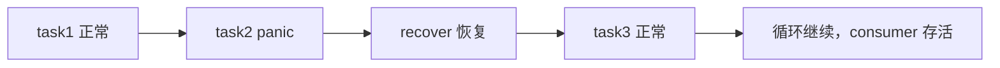
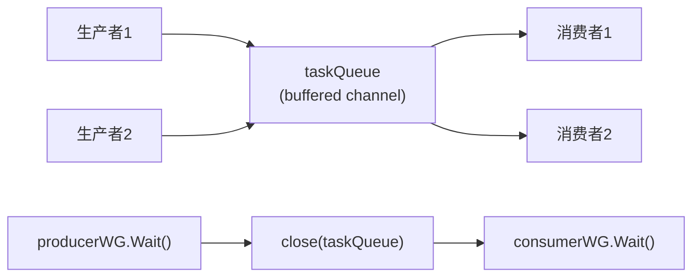
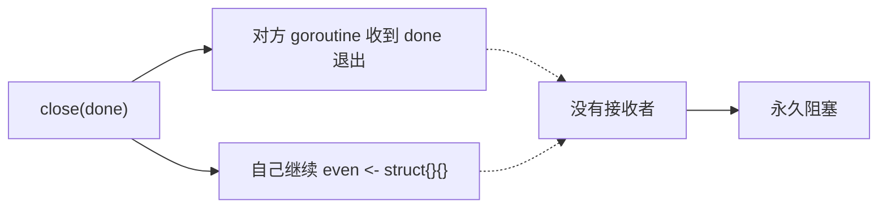
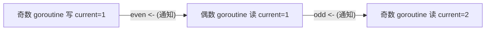
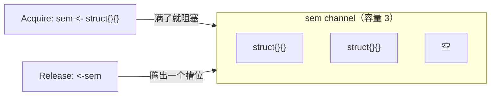
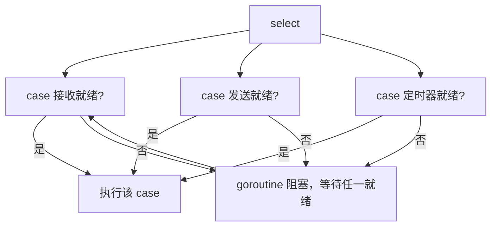
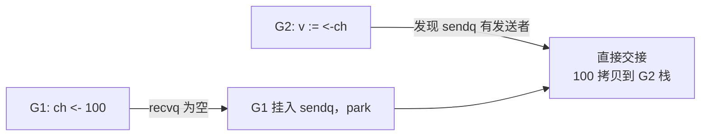

# Go 并发编程 · Channel 问答集

> 配套练习：[生产者-消费者](/习题集和答案/phase1/05_channel/01_producer_consumer/)、
> [超时读取](/习题集和答案/phase1/05_channel/02_timeout_read/)、
> [交替打印奇偶数](/习题集和答案/phase1/05_channel/03_odd_even_print/)、
> [信号量](/习题集和答案/phase1/05_channel/04_semaphore/)。
> 本文是学习这些练习时高频踩坑点的问答整理，建议先独立完成练习再对照本文。

---

## 一、生产者-消费者：`defer recover()` 的作用域

### Q1：为什么 `defer recover()` 不能直接写在 `for` 循环体里？

**错误写法：**

```go
for task := range taskQueue {
    defer recover()  // ❌ defer 是函数级的，不是循环迭代级的
    task()
}
```

**原因：**

`defer` 注册的调用在**所在函数返回时**才执行，而不是"每次循环迭代结束时"执行。

- 第一个 task panic 时，`recover()` 还没有执行（函数还在运行），panic 直接穿透到 consumer goroutine 外层，整个 goroutine 崩溃；
- 就算循环正常跑完，注册的所有 defer 也会在函数返回时按 **LIFO（后进先出）** 一次性执行，语义完全不对；
- 更隐蔽的问题是：`defer` 的参数在**注册时**求值，`defer recover()` 里的 `recover()` 是延迟调用的（无参数，无立即求值问题），但 `defer fmt.Println(recover())` 这类写法中 `recover()` 会在注册时立即求值为 `nil`——这是另一个经典陷阱。

**正确写法：给每个 task 建立独立函数作用域：**

```go
for task := range taskQueue {
    func() {
        defer func() {
            if r := recover(); r != nil {
                log.Printf("task panic: %v", r) // 可拿到 panic 值做记录
            }
        }()
        task()
    }()
}
```

**效果：**



一个 task panic 只影响它自己，不会让消费者 goroutine 退出、也不会让整个流水线中断。

**扩展：`defer recover()` 到底有没有效？**

语法上合法，且确实能恢复 panic——因为 `recover` 本身是被 defer 的函数，满足"recover 必须由被 defer 的函数直接调用"的条件。但几乎没有人这样写，原因：

- 可读性差，容易误读成"注册时求值"；
- 拿不到 panic 值做日志，无法排查问题。

规范写法永远是 `defer func() { recover() }()`。面试被问到，能说出"`recover` 只有由被 defer 的函数直接调用才有效"就是加分项。

### Q2：为什么关闭 `taskQueue` 的必须是生产者，而且是"所有生产者都结束后"？

```go
producerWG.Wait()   // 所有生产者生产完毕
close(taskQueue)    // 通知消费者：不会再有数据了
consumerWG.Wait()   // 消费者 drain 完剩余任务后退出
```

**原则：谁生产数据，谁负责关闭。**

- 消费者如果关闭队列，正在发送的生产者会 `panic: send on closed channel`；
- 只要还有生产者没结束，就不能 close——否则某个生产者发送时直接 panic；
- 关闭本身是**通知机制**：`for task := range taskQueue` 在 channel 关闭且排空后自然退出，消费者不需要知道"什么时候"关，只需要知道"关了之后循环会结束"。



> 问：为什么要两个 WaitGroup？
>
> 答：`producerWG` 保证"生产完成才 close"，`consumerWG` 保证"close 后消费者把队列里的任务全部处理完"。缺了第一个会过早 close（发送 panic），缺了第二个会提前返回（任务没处理完）。

---

## 二、超时读取：`ReadMultipleWithTimeout` 的三个坑

### Q3：为什么"已经读够了 n 个"还会多读一个值？

**错误写法：**

```go
for {
    select {
    case v := <-ch:
        if count < n {
            result = append(result, v)
            count++
        } else {
            return result // ❌ 走到这里时，select 已经取出了第 n+1 个值
        }
    case <-t:
        return result
    }
}
```

**原因：** `select` 的 case **一旦被选中，接收操作就已经执行完毕**。当 `count == n` 时，`select` 仍然会阻塞等待（如果 channel 暂时没数据），然后取出第 n+1 个值，最后才发现不需要它。这个值被白白丢弃，还白白等待了一段时间。

**正确写法：读够就退出循环，不再进入 select：**

```go
result := make([]int, 0, n)
timer := time.NewTimer(timeout)
defer timer.Stop()

for i := 0; i < n; i++ {   // 最多读 n 次，读够即停
    select {
    case v := <-ch:
        result = append(result, v)
    case <-timer.C:
        return result       // 超时，返回已读到的
    }
}
return result
```

核心教训：**"读完就停"用 `for i < n` 表达，不要在循环体内用 `if` 去"补救"多读的值。**

### Q4：`time.After` 为什么不能放在循环里？

**错误写法：**

```go
for {
    select {
    case v := <-ch:
    case <-time.After(timeout): // ❌ 每次循环都新建一个 timer
    }
}
```

**两个问题：**

1. **语义错误**：`time.After` 放在循环里，表示"每次等待都重置 timeout"，整个函数可能远超过 timeout 才返回。题目要求的是"整个读取过程最多等 timeout"。
2. **资源问题**：每次循环创建的新 timer，在**触发之前**不会被回收（Go 1.23 之前 `time.After` 的 timer 无法被 GC 提前清理）。循环次数多时，会产生大量未触发、未停止的 timer 堆积。

**正确写法：`time.NewTimer` 提出来，用完 `Stop`：**

```go
timer := time.NewTimer(timeout)
defer timer.Stop()

for i := 0; i < n; i++ {
    select {
    case v := <-ch:
        result = append(result, v)
    case <-timer.C:
        return result
    }
}
```

> 面试延伸：`time.After(d)` 的底层就是 `time.NewTimer(d)`，只是不给你句柄去 `Stop`。所以"一次性 select"可以用 `After`，"循环里反复 select"必须用 `NewTimer + Stop`。

### Q5：channel 关闭后，`v := <-ch` 读到什么？

channel 关闭后，接收操作**立即返回零值 + `ok == false`**。如果不判断，会把这个零值当成有效数据 append 进去：

```go
case v := <-ch: // ❌ ch 已关闭时 v == 0（int 的零值），被当成真实数据
    result = append(result, v)
```

**健壮写法：**

```go
case v, ok := <-ch:
    if !ok {
        return result // channel 关闭，返回已读到的值
    }
    result = append(result, v)
```

> 注：本练习的测试场景不会提前关闭 `ch`，参考答案里也没处理 `ok`。但面试时主动写出 `v, ok := <-ch` 是加分项——它表明你清楚"关闭后收到零值"这个语义。

### Q6（补充）：`FirstResult` 的 goroutine 泄漏问题

**错误写法（solution.go 早期版本）：**

```go
FirstCome := make(chan struct{}) // 无缓冲
res := make(chan int)            // 无缓冲
for _, v := range fns {
    go func(fn func() int) {
        res <- fn()
        FirstCome <- struct{}{}
    }(v)
}
return <-res // 第一个结果返回后，其余 goroutine 阻塞在 res <- fn() 上 → 泄漏
```

第一个结果一旦被取走，**不再有任何接收者**，其余 goroutine 全部永久阻塞在 `res <- fn()`（以及 `FirstCome <- ...`）上。

**改进：用容量足够的 buffered channel，让所有结果都能写进去、goroutine 正常退出：**

```go
ch := make(chan int, len(fns)) // 每个结果都有一个槽位
for _, fn := range fns {
    go func(f func() int) {
        ch <- f()
    }(fn)
}
return <-ch
```

即使只取第一个结果，其余 goroutine 也能把结果写入 buffer 后正常退出——**不泄漏**。

---

## 三、交替打印奇偶数：`close(done)` 与 goroutine 生命周期

### Q7：`close(done)` 之后，还能往别的 channel 发送吗？

**错误写法（你最早版本的结构）：**

```go
if current == n {
    close(done)
    even <- struct{}{} // ❌ 可能永久阻塞
}
```

**为什么危险：**

`close(done)` 会让对方 goroutine 通过 `<-done` 退出。**一旦对方退出，它就不再接收 `even`**，此时你的 `even <- struct{}{}` 找不到接收者：



**原则：**

1. **close 之后立即退出**——close 是"最后一次通知"，通知完不要再依赖任何 channel 接收方；
2. 关闭的语义是"不再有数据"，不是"暂停一下"。

### Q8：为什么 `done` 只能有一个 goroutine 负责 close？

**错误写法：**

```go
// 奇数 goroutine
if current == n {
    close(done)
}
// 偶数 goroutine
if current == n {
    close(done) // ❌ 两处都可能执行 close
}
```

**后果：** 两个 goroutine 竞态下可能先后执行 `close(done)`，第二次触发 `panic: close of closed channel`。

> 本例中 `current` 严格递增、且两个 goroutine 通过 channel 交替，实际只有一个能走到 `current == n`——但"把关闭逻辑分散在两处"本身就是坏味道。**关闭责任必须唯一**：谁打印最后一个数谁关，或者由主 goroutine 用 `wg.Wait()` 统一收尾。

**推荐结构（answer.go 的做法）：** 每个 goroutine 只在自己的循环里固定执行 `for i := 1; i <= n; i += 2`，谁打印最后一个数（`i+1 > n`）谁就负责 `close(done)`，另一路因为循环条件直接结束，**不存在第二处 close**：

```go
go func() {
    for i := 1; i <= n; i += 2 {
        <-oddTurn
        ch <- i
        if i+1 <= n {
            evenTurn <- struct{}{}
        } else {
            close(done) // 只有"打印最后一个数"的 goroutine 会执行这里
        }
    }
}()
```

### Q9：这里的 Mutex 真的可以不要吗？

**可以不要，但保留也不会错。**

两个 goroutine 通过 `odd → even → odd → even` 的 channel 收发形成了严格的**交替关系**，channel 的发送/接收构成 **happens-before** 链：



- 写入 `result / current` 的 goroutine 在任何时刻**只有一个**（单一写者）；
- channel 同步已经保证了内存可见性（发送 happens-before 接收）。

所以 Mutex 是**冗余的**。面试表述："channel 的收发本身构成同步点，交替执行下数据访问是单写者，无需额外加锁；加锁是无害的过度防御。"

---

## 四、信号量：buffered channel 实现 Semaphore

### Q10：为什么 `sem <- struct{}{}` 是 Acquire、`<-sem` 是 Release？

```go
type Semaphore struct {
    sem chan struct{} // buffered channel
}

func NewSemaphore(n int) *Semaphore {
    return &Semaphore{sem: make(chan struct{}, n)} // 容量 = 许可数
}

func (s *Semaphore) Acquire() { s.sem <- struct{}{} } // 拿一个槽位，满了就阻塞
func (s *Semaphore) Release() { <-s.sem }             // 还一个槽位
func (s *Semaphore) Available() int { return cap(s.sem) - len(s.sem) }
```

buffered channel 的**容量**就是"最多能装多少个 `struct{}{}`"，正好对应信号量的许可数：



- 满时 `sem <- struct{}{}` 阻塞 → 即"无许可则等待"；
- `struct{}{}` 零开销（空结构体不占内存），是经典的占位写法；
- `Available()` 用 `cap - len`，注意 `len(sem)` 的读取本身并发安全吗？——chan 的 `len/cap` 是内置函数，对 channel 是原子读取，可用。

### Q11：`select` 里 `case s.sem <- struct{}{}:` 是什么语义？

**它不是 if 条件，而是"等待发送操作变得可以执行"。**

`select` 可以监听三种通信：

```go
select {
case v := <-ch:        // ① 接收就绪：ch 有数据 / 已关闭 / 有发送者
case ch <- v:          // ② 发送就绪：buffer 有空位 / 有接收者在等
case <-timer.C:        // ③ 定时器就绪
}
```



所以 `TryAcquire` 的这段代码，语义是"**一直等到能发送（拿到许可）或超时**"：

```go
select {
case s.sem <- struct{}{}:
    return true
case <-time.After(timeout):
    return false
}
```

### Q12：`TryAcquire` 里的 `for` 循环到底冗不冗余？（重点）

**结论：在你贴的这个实现里，`for` 是冗余的，但无害。**

```go
t := time.After(timeout)

for { // 两个 case 都直接 return，不会进入第二轮
    select {
    case s.sem <- struct{}{}:
        return true
    case <-t:
        return false
    }
}
```

`select` 第一次执行时，要么发送成功 → `return true`，要么超时 → `return false`，**两种结果都直接返回**，`for` 没有第二轮执行机会。去掉 `for` 语义完全不变——这正是参考答案（answer.go）的写法。

**为什么你之前"去掉 for 后测试失败"？** 通常是因为去掉 `for` 时顺手把结构改成了"非阻塞尝试"（加了 `default` 分支），或者测试场景是并发抢占、依赖循环重试。本题测试（如 `TestSemaphore_TryAcquire_Released`：50ms 后释放，200ms 超时）用**单次 select 就能通过**，因为 select 会阻塞等待 50ms 直到发送成功。

**三种"获取许可"语义要分清：**

| 语义 | 写法 | 说明 |
| ---- | ---- | ---- |
| 非阻塞尝试一次 | `select { case ch <- struct{}{}: return true; default: return false }` | 拿不到立刻返回，不等待 |
| 阻塞等待，成功或超时 | 单次 `select { case ch <- struct{}{}: ...; case <-timer.C: ... }` | 本练习 `TryAcquire` 的语义 |
| 循环重试抢占 | `for { select { ... } if 过了 deadline { return false } }` | 一般配合短超时或 default，用于"反复尝试" |

> 判断 for 是否必要的口诀：**看 select 的每个 case 是否都会在单轮内 `return`/`break`。** 如果某个 case 执行完还要继续下一轮（比如 `default` 里什么都没做、或需要持续监听多个事件），for 才必要；如果所有 case 都终结本轮，for 就是冗余的。

---

## 五、channel 底层：`hchan`、`sendq/recvq`、直接交接

### Q13：`hchan` 里两组指针有什么区别？

```go
type hchan struct {
    qcount   uint           // 缓冲区中元素个数
    dataqsiz uint           // 缓冲区容量（make 的第二个参数）
    buf      unsafe.Pointer // 环形缓冲区
    sendx    uint           // 下一个写入位置
    recvx    uint           // 下一个读取位置
    recvq    waitq          // 等待【接收】的 goroutine 队列
    sendq    waitq          // 等待【发送】的 goroutine 队列
    closed   uint32
    lock     mutex          // 保护上述所有字段
}
```

**最容易混淆的两组概念：**

| 概念 | 作用 | 存放内容 |
| ---- | ---- | -------- |
| `buf` / `sendx` / `recvx` | **数据本身**：环形缓冲区的存储与读写位置 | 元素值 |
| `sendq` / `recvq` | **等待者**：因操作暂时无法完成而挂起的 goroutine | sudog（goroutine 包装） |

`sendx` / `recvx` 配合形成环形队列：

```text
buf:  [  ][10][  ][20]    dataqsiz = 4
       ↑        ↑
     sendx     recvx     ← sendx 写、recvx 读，到达末尾回绕到 0
```

### Q14：无缓冲 channel 为什么叫"直接交接"？

无缓冲 channel 没有 `buf`。发送方出现时：

- 若此时**已有接收者在 `recvq` 等待**，发送方直接把值拷贝到接收者的栈上，**不经过 buffer**，然后唤醒接收者——这就是"直接交接（direct handoff）"；
- 若没有接收者，发送方自己挂入 `sendq` 等待。



有缓冲 channel 在"发送时 recvq 非空"时同样会走直接交接（跳过 buffer 少一次拷贝），这是 Go 的优化。

### Q15：`sendq` 会不会无限增长？（重点）

**不会因为"一个 goroutine 反复尝试发送"而增长。**

当发送无法完成时，发送 goroutine 会**被 park（挂起）**，不再运行：

```text
发送失败 → 包装成 sudog 挂入 sendq → gopark() 让出 M → 不再占用 CPU
```

一个 goroutine 被 park 后就**不会继续执行**，也就不可能"再次入队"。`sendq` 的长度 = **当前同时等待发送的 goroutine 数量**，只有真正有大量 goroutine 并发等待发送时才会变长：

```text
sendq
├── G1（已 park）
├── G2（已 park）
├── G3（已 park）
└── ...
```

所以 `select` 里循环尝试 `s.sem <- struct{}{}` 不会让 sendq 无限增长——sendq 是"等待发送的 goroutine 队列"，不是"发送尝试记录表"。**阻塞是 park，不是忙等。**

---

## 六、速查卡：本次必须记住的结论

| # | 结论 |
| - | ---- |
| ① | `select` 不是 if：`case ch <- v:` 表示"等待发送操作可以完成"，会阻塞等待 |
| ② | channel 阻塞不是忙等：无法完成时 goroutine 被 park，不占 CPU，事件发生后由 runtime 唤醒 |
| ③ | `sendq/recvq` 是等待中的 goroutine；`sendx/recvx` 是 buffer 读写位置——两组概念别混淆 |
| ④ | buffered channel 可实现信号量：`sem <- struct{}{}` 获取、`<-sem` 释放、`cap-len` 查可用 |
| ⑤ | `defer recover()` 绑定函数调用而非循环迭代；每个 task 用匿名函数包一层独立作用域 |
| ⑥ | `close` 与 goroutine 生命周期要协调：close 后立即退出、关闭责任唯一、close 前确保对方还在收 |
