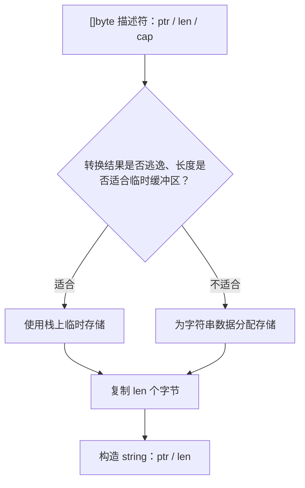
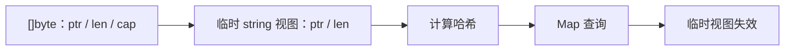
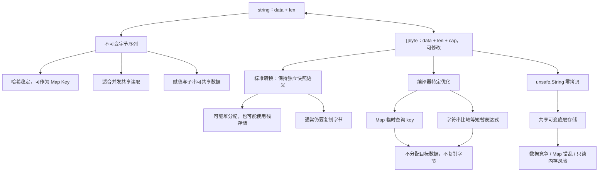

# 第一阶段知识详解：String 与字节切片

> 本文围绕 Go Runtime 中 `string` 与 `[]byte` 的底层表示、标准转换、编译器优化和 `unsafe` 零拷贝建立完整知识链，重点区分“没有堆分配”和“没有数据拷贝”。

::: info 版本范围
本文以项目使用的 **Go 1.22** 为主。`string` 的语言语义长期稳定，但 runtime 函数、编译器优化规则和特殊小对象路径都属于实现细节，可能随 Go 版本变化。`unsafe.String`、`unsafe.StringData` 和 `unsafe.SliceData` 从 Go 1.20 开始提供。
:::

## 阅读路线

1. 先理解 `string` 是一个只读字节序列的描述符。
2. 再区分标准转换的语言语义、runtime 的常规实现与编译器优化。
3. 最后理解 `unsafe` 零拷贝的约束，以及它为什么容易制造数据竞争和 Map 错乱。

关联内容：

- [第一阶段知识点总览](/第一阶段-知识点详解)
- [第一阶段学习计划](/学习计划安排/第一阶段-Go语言深入)
- [Slice、Map 与内存布局](/第一阶段-知识详解/Slice-Map与内存布局)
- [Interface 底层原理](/第一阶段-知识详解/Interface底层原理)

---

## 一、`string` 的底层结构

### 1. `string` 不是字符数组

在 runtime 层面，可以把一个字符串值理解为由数据指针和字节长度组成的描述符：

```go
type stringStruct struct {
    str unsafe.Pointer // 指向字符串数据
    len int            // 字节数
}
```

在常见 64 位平台上，这两个字段通常各占 8 字节，因此字符串描述符通常是 16 字节。赋值或传参时复制的是描述符，不是整段字符串数据。

```text
string header
+----------+
| data ptr | ------> h e l l o
+----------+
| len = 5  |
+----------+
```

这只是帮助理解的 runtime 模型，不应依赖字段名或用 `reflect.StringHeader` 手工构造字符串。空字符串的数据指针也没有需要依赖的固定值。

### 2. `len` 统计字节，不统计字符

Go 源码通常使用 UTF-8，但 `string` 本身只是只读字节序列，不保证内容一定是合法 UTF-8：

```go
s := "你好"

fmt.Println(len(s))         // 6：UTF-8 字节数
fmt.Println(len([]rune(s))) // 2：Unicode 码点数
```

要区分三个概念：

| 概念 | 示例 `"你好"` | Go 中的常用方式 |
|------|---------------|-----------------|
| 字节（byte） | 6 | `len(s)`、`s[i]` |
| Unicode 码点（rune） | 2 | `for range s`、`[]rune(s)` |
| 用户感知字符 | 通常 2，但不总等于 rune 数 | 需要 Unicode grapheme cluster 库 |

`for range s` 会按 UTF-8 解码 rune；遇到非法 UTF-8 字节时会产生 `utf8.RuneError`，并按规则前进。

---

## 二、为什么 `string` 不可变

“不可变”是指 Go 没有提供通过字符串值修改其底层字节的安全操作。它不代表字符串变量不能被重新赋值：

```go
s := "hello"
s = "world" // 合法：替换整个描述符，并未修改 "hello" 的字节
```

### 1. 共享只读数据

字符串赋值只复制描述符，截取子串时当前实现也通常可以共享原字符串数据：

```go
s := "hello world"
prefix := s[:5]
```

```text
s.data ------> h e l l o   w o r l d
               ^
prefix.data ---+
```

因为安全代码无法通过 `prefix` 修改共享字节，所以不需要防御性复制。

::: warning 子串可能保留大对象
一个很短的子串可能让整个大字符串的底层存储继续存活。需要长期保存小片段时，可根据内存占用实测考虑 `strings.Clone(part)`，主动得到独立副本。
:::

### 2. 哈希值稳定，适合作为 Map Key

Map 会根据 key 的内容计算哈希并放入对应位置。如果一个已插入的字符串 key 能在原地变成其他内容，它的新哈希可能不再对应原来的位置，Map 的查找不变量就会被破坏。

不可变性让字符串内容和哈希保持稳定，因此 `string` 是可比较类型，也可以安全地作为 Map Key。

### 3. 底层字节可以被多个读取者共享

多个 goroutine 只读同一份字符串数据不需要为了数据本身加锁。不过要注意：

- 并发读取同一字符串内容是安全的；
- 一个 goroutine 读取变量 `s`、另一个 goroutine 同时给同一个变量 `s` 赋值，仍然是数据竞争；
- 通过 `unsafe` 建立可变别名后并发读写底层字节，也会产生数据竞争。

所以更准确的说法是：**不可变数据天然适合并发共享读取，但变量本身的并发访问仍要遵守 Go 内存模型。**

---

## 三、标准转换的语义：结果不能保留可观察的可变别名

### 1. `string` 转 `[]byte`

```go
s := "hello"
b := []byte(s)
b[0] = 'H'

fmt.Println(s) // hello
fmt.Println(b) // [72 101 108 108 111]
```

`[]byte` 必须可以安全修改，同时不能改变原字符串。因此从语言语义看，转换结果需要一份独立、可写的字节序列。

### 2. `[]byte` 转 `string`

```go
b := []byte("hello")
s := string(b)
b[0] = 'H'

fmt.Println(s) // hello
fmt.Println(b) // [72 101 108 108 111]
```

转换得到的字符串必须表现为转换时内容的不可变快照。之后修改 `b`，不能影响 `s`。

### 3. “标准转换会复制”与编译器优化并不矛盾

通常可以把标准转换记成“分配目标存储并复制字节”，但这是语义模型，不等于每次都必须发生堆分配。只要程序观察不到差异，编译器可以：

- 把目标存储放在栈上，避免堆分配但仍复制数据；
- 在特定临时表达式中直接复用源数据，连复制也省掉；
- 删除只用于求长度等操作的无效转换。

因此性能讨论必须分别回答两个问题：

1. 是否发生了堆分配（allocation）？
2. 是否复制了字节（copy）？

“`0 allocs/op`”不自动等于“零拷贝”。

---

## 四、普通 `[]byte` 转 `string` 如何执行

对需要真实、独立字符串结果的转换，Go 编译器通常生成对 runtime 转换逻辑的调用。Go 1.22 中常见的入口是：

```text
runtime.slicebytetostring
```

概念流程如下：



runtime 实现还可能针对空字符串、单字节字符串等情况走特殊路径。这些属于版本相关的实现细节，不应写进依赖其行为的业务代码。

### 什么时候一定需要保留独立结果

```go
func freeze(b []byte) string {
    return string(b)
}
```

返回后的字符串仍要存在，而调用方还可能修改 `b`。编译器必须维持二者互不影响的语义，不能让返回字符串直接引用一块仍可由 `b` 修改的存储。

“结果不逃逸”也只说明它可能不需要放到堆上，并不自动证明可以省略字节复制。

---

## 五、编译器何时可以省掉复制

### 1. Map 查询中的临时 key

```go
func find(m map[string]int, b []byte) int {
    return m[string(b)]
}
```

这里的临时字符串只在本次查询期间参与哈希和 key 比较，不会被 Map 保存。编译器可以让临时字符串描述符直接引用 `b` 的数据，省去目标字节存储和复制。



要区分查询和写入：

```go
_ = m[string(b)] // 查询：可走临时零拷贝优化
m[string(b)] = 1 // 插入：Map 要长期保存 key，必须保持不可变快照语义
```

`delete(m, string(b))` 与查询类似，也只临时使用 key；具体是否优化仍以目标 Go 版本的编译结果为准。

### 2. 字符串比较

```go
if string(b) == "hello" {
    // ...
}
```

比较只需在表达式执行期间读取 `b`。编译器可以构造临时只读字符串视图，再完成长度和字节比较，无需生成独立字符串数据。

### 3. 其他特定表达式

编译器还可能对 `switch` 条件、某些字符串拼接和嵌套在可比较 Map Key 中的转换做专门处理。正确记忆方式不是“临时且不逃逸就一定零拷贝”，而是：

> 标准语义必须保持；只有编译器能证明临时别名不会被保存或修改，并且实现了对应优化规则时，才会省掉复制。

### 4. `range` 的方向很容易记反

下面的写法不应当作 `[]byte → string` 的经典零拷贝案例：

```go
for range string(b) {
    // 当前编译器并没有把它列为该方向的临时零拷贝特例
}
```

当前编译器明确处理的是反方向：

```go
for i, c := range []byte(s) {
    _, _ = i, c
}
```

因为 `range` 只读取这个临时 `[]byte`，编译器可以让它复用不可变字符串的存储，而不会暴露给循环体进行元素写入。不要把这种优化推广到一般的 `b := []byte(s)`；后者必须返回可修改的字节切片。

### 5. 优化不是语言规范承诺

能否命中优化会受 Go 版本、表达式形态、内联和逃逸分析影响。性能敏感时应实测：

```bash
go test -bench=. -benchmem
go test -gcflags='-m=2' ./...
```

`-benchmem` 能观察堆分配次数，但若还关心是否发生字节复制，需要结合基准规模、CPU profile 或生成的汇编判断，不能只看 `allocs/op`。

---

## 六、`unsafe` 零拷贝

### 1. Go 1.20+ 的显式写法

如果调用方能严格保证底层字节在字符串存活期间绝不修改，可以使用：

```go
func bytesToStringUnsafe(b []byte) string {
    return unsafe.String(unsafe.SliceData(b), len(b))
}
```

它构造一个引用同一底层数组的字符串值，不为字符串数据分配新存储，也不复制字节：

```text
[]byte header                     string header
+----------+                      +----------+
| data ptr | -----+          +--- | data ptr |
+----------+      |          |    +----------+
| len      |      +----------+    | len      |
+----------+                        +----------+
| cap      |               共享同一段字节
+----------+
```

Go 1.20 以前常见的写法是：

```go
func bytesToStringLegacy(b []byte) string {
    return *(*string)(unsafe.Pointer(&b))
}
```

它利用 Slice Header 的前两个字段与 String Header 形似这一事实重新解释内存。新代码应优先使用 `unsafe.String` 和 `unsafe.SliceData`：意图更明确，也不必手写或假设 Header 的字段布局。

### 2. 最大风险：字符串仍有可变别名

```go
b := []byte("hello")
s := bytesToStringUnsafe(b)
b[0] = 'H'

fmt.Println(s) // 可能观察到 Hello
```

这违反了安全 Go 代码对字符串不可变性的预期。若一个 goroutine 读 `s`，另一个 goroutine 同时改 `b`，还会产生数据竞争。

### 3. 用作 Map Key 会破坏 Map 不变量

```go
b := []byte("hello")
s := bytesToStringUnsafe(b)
m := map[string]int{s: 1}

b[0] = 'H' // 已存入 Map 的 key 内容被原地改变
```

Map 插入时按 `"hello"` 的哈希选择位置，之后 key 的内容却变成了 `"Hello"`。新内容的哈希可能指向另一位置，导致查找失败或出现更难解释的行为。

**零拷贝字符串绝不能在底层字节仍可能变化时作为需要长期保存的 Map Key。**

### 4. 反向零拷贝更加危险

技术上可以把字符串数据暴露成 Slice 视图：

```go
func stringToBytesUnsafe(s string) []byte {
    return unsafe.Slice(unsafe.StringData(s), len(s))
}
```

但返回类型是可写的 `[]byte`，类型系统无法表达“只读 Slice”。若调用方写入它：

- 字符串字面量可能位于只读内存，写入可能直接崩溃；
- 堆上字符串也会被非法修改；
- 所有共享该字符串数据的值都可能被影响。

所以除非边界极小、契约清晰且有充分测试，不应向普通业务代码暴露这种 API。

### 5. 生命周期风险应该怎样准确理解

下面的代码不会仅仅因为局部变量 `b` 离开作用域就必然产生悬空指针：

```go
func makeString() string {
    b := []byte("hello")
    return unsafe.String(unsafe.SliceData(b), len(b))
}
```

编译器和 GC 会让被返回字符串引用的 Go 底层对象保持存活，逃逸分析也可能把相关存储移到堆上。真正容易造成悬空引用的是绕过 Go 对象生命周期管理，例如：

- 把指针转成 `uintptr` 保存，之后再转回来；
- 引用已经由 C 代码释放的内存；
- 引用已经解除映射的 `mmap` 区域；
- 手工伪造 `reflect.StringHeader` 或 `reflect.SliceHeader`。

`unsafe` 的核心责任是：底层存储必须在所有视图使用期间有效，并且必须满足只读约束。不要用“局部变量离开作用域就悬空”来解释 Go 管理的正常对象。

---

## 七、编译器优化与手写 `unsafe` 的区别

| 维度 | 编译器临时转换优化 | 手写 `unsafe` 零拷贝 |
|------|--------------------|----------------------|
| 语义安全 | 编译器保证与标准转换一致 | 调用方自行保证 |
| 底层数据 | 仅在已证明安全的短暂期间复用 | 可能长期共享 |
| 字符串描述符 | 可能只构造临时视图或被进一步消除 | 显式构造字符串值 |
| 可变别名 | 不会泄漏到可观察范围 | 很容易被保留 |
| 版本稳定性 | 优化可能随编译器版本变化 | API 存在，但正确性约束长期由调用方承担 |
| 推荐程度 | 优先依赖并通过基准验证 | 只用于证据充分的热点路径 |

最实用的工程策略通常是：先写安全、直接的代码，让编译器优化临时表达式；只有 profile 证明转换是瓶颈，并且所有权和只读生命周期都能被严格约束时，才考虑封装 `unsafe`。

---

## 八、知识体系图



---

## 九、面试答法

### 30 秒版本

> Go 的 `string` 可以理解为由数据指针和字节长度组成的不可变字节序列，`len` 返回字节数。`string` 和 `[]byte` 的标准转换必须保持独立快照语义，因此通常需要复制，但不一定发生堆分配。编译器对 Map 临时查询 key、字符串比较等特定表达式可以构造短暂只读视图，从而避免分配和复制。Go 1.20+ 也能用 `unsafe.String` 和 `unsafe.SliceData` 手写零拷贝，但必须保证底层字节在字符串存活期间不被修改且内存持续有效，否则会导致数据竞争、Map key 失效等问题。

### 常见追问

**问：`0 allocs/op` 是否代表零拷贝？**

不是。数据可能复制到了栈上的临时缓冲区，只是没有进入堆。

**问：`string(b)` 是否只要不逃逸就一定零拷贝？**

不是。不逃逸主要帮助避免堆分配；能否省掉复制还需要命中特定编译器优化并满足别名安全。

**问：为什么 `m[string(b)]` 可以优化？**

查询只在表达式期间读取 key，Map 不会保存这个临时 key，编译器可以直接基于 `b` 的字节计算哈希并比较。

**问：为什么生产环境慎用 `unsafe`？**

因为类型系统无法再替你保证字符串只读和内存所有权。调用方一旦修改共享字节，字符串内容、哈希结果和并发安全假设都会失效。
