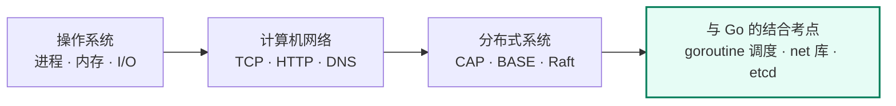

# 第二阶段：计算机基础 — 面试级知识点详解

> 本篇是第二阶段的总览入口。三篇专题按「操作系统 → 计算机网络 → 分布式系统」递进，每篇都按"原理 → 关键机制 → 高频面试题速查 → 与 Go 的结合考点"组织。

## 专题索引

| 专题 | 覆盖内容 | 面试权重 |
| --- | --- | --- |
| [操作系统面试详解](/第二阶段-知识详解/操作系统面试详解) | 进程与线程、内存管理、进程同步与互斥、文件系统与 I/O、进程间通信（IPC）、OS + Go 结合考点 | ⭐⭐⭐ |
| [计算机网络面试详解](/第二阶段-知识详解/计算机网络面试详解) | 网络分层模型、TCP 三次握手 / 四次挥手 / 可靠传输、TCP vs UDP、HTTP/HTTPS、DNS、"从输入 URL 到页面显示"、网络 + Go 结合考点 | ⭐⭐⭐ |
| [分布式系统面试详解](/第二阶段-知识详解/分布式系统面试详解) | 分布式系统基础、CAP 理论、BASE 理论、Raft 算法详解、考点凝练一页纸 | ⭐⭐⭐ |

> 三篇末尾都有**高频面试问题速查**与**推荐学习顺序**，考前可直接跳转该节。

---

## 建议学习顺序

1. **先操作系统**：进程/线程与内存管理是理解 goroutine 与 GC 的前置；同步互斥对应 `sync` 包。
2. **再计算机网络**：TCP 可靠传输与 HTTP/HTTPS 是后端面试的绝对高频，也是 SSE / gRPC 的基础。
3. **最后分布式系统**：CAP/BASE 是判断力，Raft 是手写选主与 etcd 面试题的地基。
4. **随时回看"与 Go 结合考点"**：把背诵的结论落到具体标准库与项目上，是拉开差距的地方。

---

## 配套资源

| 类型 | 入口 |
| --- | --- |
| 阶段计划 | [第二阶段：计算机基础强化](/学习计划安排/第二阶段-计算机基础强化) |
| 算法练习 | [第二阶段 25 道练习](/习题集和答案/phase2/)（配合[练习指南](/练习指南)） |
| 组件深入 | [后端技术栈强化](/后端技术栈强化/)（MySQL / Redis / Kafka / 分布式 / Milvus） |
| 架构进阶 | [架构师修炼](/架构师修炼/)（Raft 选主、限流熔断、多活容灾落地） |
