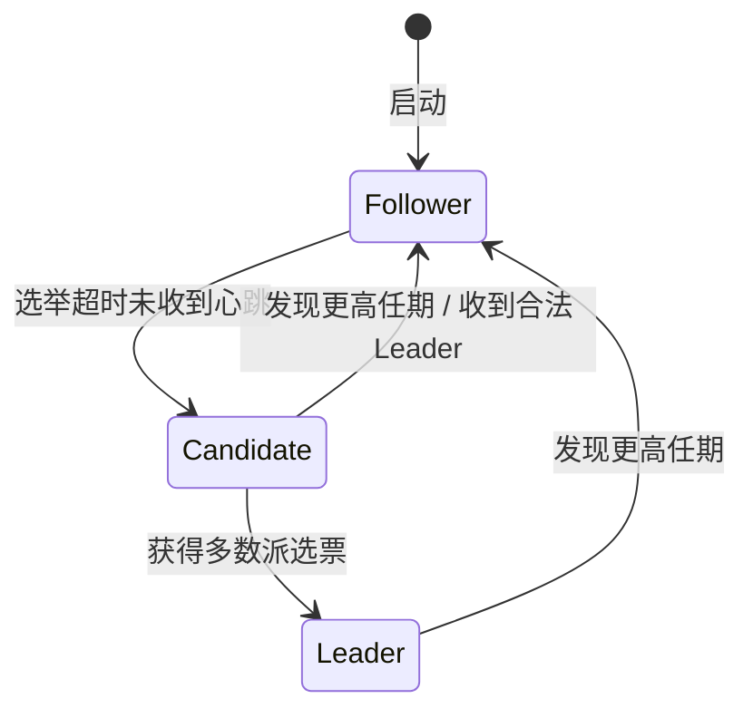
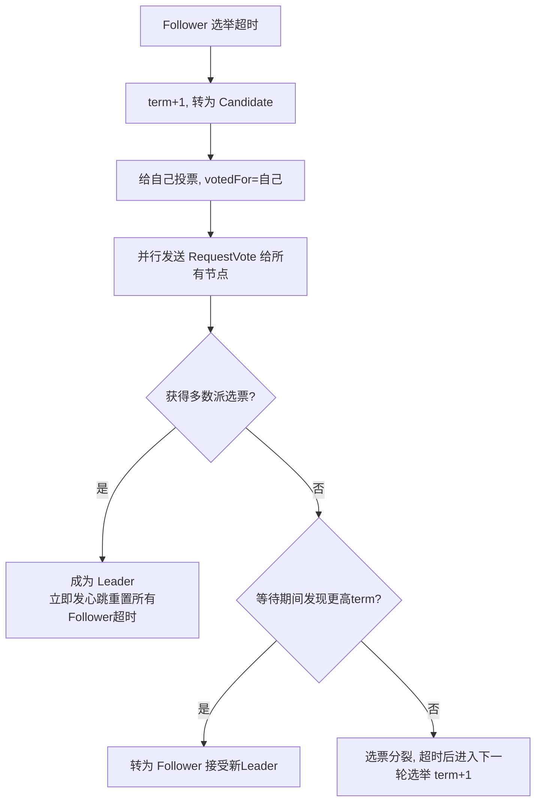
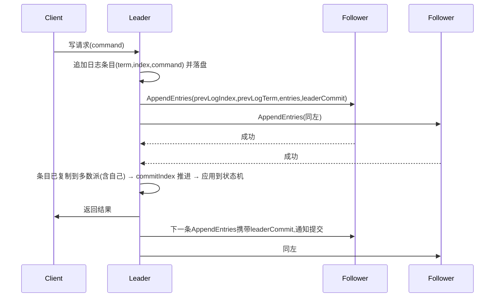

# 第二阶段知识详解：分布式系统面试详解

> 本文覆盖字节跳动后端面试中分布式系统的高频考点：**CAP 理论、BASE 理论、Raft 共识算法**。每个知识点包含**原理详解**和**面试背诵版**两部分，先理解再记忆，末尾附**考点凝练一页纸**与**高频问题速查**。

::: tip 字节面试特点
分布式面试的核心是「**权衡（trade-off）**」：不问定义，问"你这个系统是 CP 还是 AP？为什么？""最终一致怎么落地？"。Raft 是重灾区，会追问到选举细节、提交规则、脑裂场景、成员变更。
:::

::: info 延伸阅读
本文为考点背诵版；工程深度版（协议细节、etcd/Go 实现、故障排查）见后端技术栈强化 [S8 分布式理论](/后端技术栈强化/08-distributed/CAP与BASE理论)。
:::

---

## 一、分布式系统基础

### 1.1 分布式系统要解决什么问题

分布式系统是**多个自治节点通过网络协作**，对外表现为单一系统的形态。与单机相比，它引入三类本质问题：

| 问题 | 具体表现 |
|------|---------|
| **无全局时钟** | 节点间无法精确对齐时间，事件排序不能依赖物理时钟 |
| **节点独立故障** | 任何节点都可能崩溃、失联、被分区，且无法预先知道 |
| **消息不确定性** | 消息可能丢失、重复、乱序、延迟无上界 |

由此引出两个核心设计目标：**一致性**（各副本数据最终/立即一致）与**可用性**（请求总能得到响应）。二者在故障下相互矛盾——这正是 CAP 理论要回答的问题。

### 1.2 一致性模型（为 CAP 的 C 做铺垫）

一致性有强弱之分，面试必须先说清楚"你说的 C 是哪一种"：

| 模型 | 强度 | 含义 | 典型实现 |
|------|------|------|---------|
| 线性一致性 | 最强 | 所有操作像在**单一时间点**原子发生，顺序与真实时间一致 | 多数派共识（Raft/etcd、ZooKeeper、单机数据库） |
| 顺序一致性 | 强 | 存在一个全局顺序，各进程看到顺序一致，但可与真实时间不一致 | 部分分布式内存系统 |
| 因果一致性 | 中 | 有因果关系的操作按因果序可见 | 部分 NoSQL |
| 读己之写 | 中 | 自己写的一定能读到 | 会话一致性 |
| 最终一致性 | 弱 | 无新写入后，副本经过一段时间收敛一致 | 异步复制系统（DNS、Cassandra、MySQL 异步主从） |

::: warning 关键考点
**CAP 中的 C 专指线性一致性**。很多"CAP 三选二"的争论，根源是把 C 理解成了弱一致性——弱一致性在分区时也未必能保证 C，CAP 讨论的是一致性的**最严格形态**。
:::

### 1.3 复制状态机（为 Raft 做铺垫）

**复制状态机（Replicated State Machine，RSM）** 是共识算法的统一抽象：所有节点从**相同的初始状态**出发，按**相同顺序**执行**相同的命令日志**，最终得到**相同的状态**。

```
客户端命令 → 日志条目(term, index, command) → 各副本按序执行 → 状态机状态一致
```

因此**共识问题被归结为"让所有节点的日志一致"**：只要日志一致，状态机必然一致。Raft 就是解决"日志一致"问题的算法。这个抽象必须在回答"Raft 解决什么问题"时先说清楚。

---

## 二、CAP 理论

### 2.1 定义（原理详解）

CAP 是 Brewer 提出的猜想，后被证明。它断言：分布式系统在以下三个性质中**最多同时满足两个**：

| 字母 | 性质 | 精确定义 |
|------|------|---------|
| **C** | Consistency（一致性） | **线性一致性**：读请求返回最近一次写入的值，所有节点在任何时刻看到相同数据（一个系统从外部看像单机一样） |
| **A** | Availability（可用性） | 每个请求都能在**有限时间内**收到**非错误**响应（注意：响应不要求是最新数据，只要不是错误） |
| **P** | Partition tolerance（分区容错性） | **网络分区**（节点间消息丢失、失联）发生时，系统仍能继续运行并对外提供 C 或 A 的服务 |

### 2.2 为什么三者不可兼得（证明思路）

面试要求能画出证明思路。假设系统发生了**网络分区**，节点被分成两组 G1、G2（两组间无法通信，组内正常）：

1. 客户端向 G1 写入 `x = 1`，G1 内部确认写入成功。
2. 由于分区，G2 无法收到该写入。
3. 此时客户端向 G2 发起读 `x`：
   - 若系统保证 **C**：G2 必须返回最新值 `1`，但它做不到（没收到写），只能**拒绝响应**或阻塞 → **牺牲 A**。
   - 若系统保证 **A**：G2 必须返回响应，只能返回旧值 `0`（或自己分区前的值）→ 两个分区数据不一致 → **牺牲 C**。

结论：**只要分区存在，C 和 A 不可兼得**。而**网络分区是分布式系统的必然事件**（P 无法回避，你必须明确分区时的行为），所以真实世界的选择只有两种：**CP（分区时保一致、牺牲可用）** 或 **AP（分区时保可用、牺牲一致）**。

### 2.3 常见误区（高频追问）

- ❌ "CAP 是三个里随便选两个" —— **P 是必选项**，不是可选项；真实网络必然分区，不能选"CA"（没有 P 意味着不允许分区，这在分布式系统中不成立）。**CA 只存在于单机或容忍分区不发生的假设下。**
- ❌ "CAP 的 C 是最终一致性" —— C 是线性一致性；最终一致性属于 BASE 范畴，不在 CAP 的讨论框架内。
- ❌ "分区时 CP 系统完全不可用" —— CP 系统在分区时仍服务**多数派一侧**（少数派拒绝服务）；多数派一侧依旧可用。
- ❌ "CAP 决定了平时行为" —— **CAP 只规定分区发生时的取舍**。无分区时，CP 系统（如多数派）也能提供完整读写；分区是例外场景，不是常态。
- ❌ "整个系统只能选一个" —— 可以按数据/模块粒度选择：核心强一致数据走 CP 组件，非核心可降级数据走 AP 组件。

### 2.4 PACELC 扩展（加分项）

CAP 只覆盖了**分区时**的行为。PACELC 补上了**无分区时**的权衡：

> **P**artition 发生时 → 在 **A**vailability 与 **C**onsistency 之间选；
> 否则（**E**lse）→ 在 **L**atency（延迟）与 **C**onsistency 之间选。

例如：多数派强一致系统（etcd）在无分区时，每次写也要等多数派确认，**用延迟换一致性**；异步复制系统（MySQL 异步主从）无分区时写很快，**用一致性换低延迟**。

### 2.5 典型系统选型（考点）

| 类型 | 代表 | 分区时行为 | 适用场景 |
|------|------|-----------|---------|
| **CP** | ZooKeeper、etcd、HBase、TiDB、MongoDB（默认） | 少数派拒绝读写 | 分布式锁、选主、配置、强一致存储 |
| **AP** | Eureka、Cassandra、DynamoDB、CouchDB、Nacos（AP 模式） | 两侧各自服务，数据可能短暂不一致 | 服务发现、缓存、非核心业务 |
| 混合 | Redis Cluster | 主从异步复制：主挂切换可能丢数据（偏 AP）；同步复制则 CP | 缓存（容忍丢失） |

**注册中心选型是必考题**：服务发现本质是"读到过期列表还能接受，但**注册中心全挂则所有服务不可用**"，所以生产上常选 **AP**（如 Eureka）；而 etcd 强一致（Raft）用于**分布式锁、配置下发、选主**这类必须精确的场景。

#### 面试背诵版

> CAP 理论：分布式系统在一致性（线性一致性）、可用性（有限时间内返回非错误响应）、分区容错性（分区时继续运行）中最多同时满足两个。由于网络分区不可避免，P 是必选的，实际只有 CP 与 AP 二选一。证明思路：分区发生后，向一侧写、向另一侧读，保 C 则另一侧必须拒绝响应（牺牲 A），保 A 则返回旧值（牺牲 C）。CAP 只约束分区时刻的行为，且 C 指线性一致性，不含最终一致性。PACELC 扩展补充了无分区时"延迟与一致性"的权衡：多数派用延迟换一致，异步复制用一致换低延迟。典型选型：ZooKeeper/etcd 是 CP（锁、选主、配置），Eureka 是 AP（服务发现），Redis Cluster 异步复制偏 AP。

---

## 三、BASE 理论

### 3.1 定义（原理详解）

BASE 是**对 CAP 中 AP 路线的工程化总结**，由 eBay 提出，全称：

| 字母 | 含义 | 精确定义 |
|------|------|---------|
| **BA** | Basically Available（基本可用） | 故障/分区时允许**部分降级**：响应时间增加、非核心功能关闭（降级）、流量削峰（限流），但**系统整体仍可用**，而不是完全不可用 |
| **S** | Soft state（软状态） | 允许系统存在**中间状态**，各副本数据可以在一段时间内不一致，状态"软"而不要求实时一致 |
| **E** | Eventually consistent（最终一致） | **在没有新写入的前提下**，经过一段时间的传播/补偿，所有副本最终收敛到一致状态 |

### 3.2 BASE vs ACID（必考对比）

| 维度 | ACID | BASE |
|------|------|------|
| 面向 | 单机/强一致数据库事务 | 分布式系统 |
| 一致性 | 强一致（事务提交即生效） | 最终一致 |
| 可用性 | 优先一致性，故障时可能拒绝 | 优先可用性，允许短暂不一致 |
| 思想 | 悲观：先保证正确再谈性能 | 乐观：先保证可用，再靠补偿收敛 |
| 典型 | MySQL InnoDB、PostgreSQL | 分布式缓存、消息队列、异步复制系统 |

一句话：**ACID 是"一致性优先"，BASE 是"可用性优先"**；BASE 不是 ACID 的替代，而是不同一致性需求下的不同策略。

### 3.3 最终一致性的工程实现手段（高频落地考点）

最终一致不能停留在口号，面试要能说出**用什么机制收敛**：

1. **异步复制 + 消息队列重试**：写主库后发 MQ，消费端异步同步到从库/其他系统，失败进**死信队列**重试。
2. **本地消息表 + MQ（事务消息）**：业务与消息同库事务提交，消息表保证不丢，再异步投递，解决"业务成功但消息没发出去"。
3. **对账 / 定时补偿**：定期扫描两侧数据差异，补发或回滚（对账任务、补偿任务）。
4. **重试 + 幂等**：任何异步同步都必须配合幂等键（唯一键/状态机），防止重复执行副作用。
5. **分布式事务模式（Saga/TCC）**：Saga 用补偿事务保证最终一致；TCC（Try-Confirm-Cancel）用预留-确认-取消三段式。
6. **缓存一致性场景**：Cache Aside + 延迟双删 / binlog 订阅（如 Canal）同步缓存。

### 3.4 适用边界（防追问）

- ✅ BASE 适用：通知、计数、Feed 流、榜单、缓存、日志类**可容忍短暂不一致**的业务。
- ❌ 不适用：**余额、库存扣减、订单支付**等强一致场景——这些仍需要 ACID/CP 级保证，只能用分布式事务（TCC/Saga）而非"放任不一致"。

#### 面试背诵版

> BASE 理论是对 CAP 中 AP 路线的总结：基本可用（故障时降级但不整体不可用）、软状态（允许中间不一致）、最终一致（无新写入后副本最终收敛）。与 ACID 对比：ACID 强一致、悲观、一致性优先；BASE 弱一致、乐观、可用性优先，靠补偿收敛。最终一致的工程手段：异步复制 + MQ 重试、本地消息表 + 事务消息、对账补偿、重试配幂等、Saga/TCC。适用于通知、计数、缓存等可容忍短暂不一致的业务；余额、库存、支付等强一致场景仍需要 ACID/分布式事务。

---

## 四、Raft 算法详解（重点）

### 4.1 定位：解决复制状态机的一致性问题

Raft 是 **Diego Ongaro 在 2013 年提出的一致性算法**，目标是解决 Paxos 的两大痛点：**难以理解、难以实现**。它的设计原则是**可分解 + 可理解**：把共识问题拆成三个相对独立的子问题：

| 子问题 | 解决什么 |
|--------|---------|
| **Leader 选举（Leader Election）** | 集群中始终只有一个节点对外提供写入 |
| **日志复制（Log Replication）** | Leader 把日志复制到所有节点并保证一致性 |
| **安全性（Safety）** | 保证不会出现"已提交日志丢失"等错误 |

Raft 采用**强领导者模型（Strong Leader）**：所有写请求都路由到 Leader，Leader 决定日志顺序，Follower 被动复制。相比 Paxos 的对称结构，强领导者大幅简化了并发控制。

### 4.2 节点角色与状态（必背）

每个节点在任意时刻处于三种角色之一：



**任期（Term）**：单调递增的**逻辑时钟**，每次选举发起时 +1。每个任期最多一个 Leader（可能没有，如选票分裂）。任期贯穿所有 RPC 和日志条目——**任何 RPC 都携带 term，接收方发现 term 比自己大则立即转为 Follower 并更新任期**，这是 Raft 保证"旧 Leader 不能继续发号施令"的机制。

每个节点需要维护两类状态：

| 状态类型 | 变量 | 说明 |
|---------|------|------|
| **持久化状态**（必须落盘） | `currentTerm` | 当前任期，防止过期投票 |
| | `votedFor` | 本任期投给了谁，**每任期最多一票**（防脑裂核心） |
| | `log[]` | 日志条目（含 term 和 index），必须持久化防丢失 |
| **易失状态** | `commitIndex` | 已确认提交（可安全应用）的最大日志 index |
| | `lastApplied` | 已应用到状态机的最大日志 index |

Leader 额外维护：
- `nextIndex[]`：发给每个 Follower 的下一条日志 index（初始为 leader 最后一条 +1）。
- `matchIndex[]`：每个 Follower 已复制到的最高 index。

### 4.3 两类 RPC（背参数）

| RPC | 方向 | 关键参数 | 触发时机 |
|-----|------|---------|---------|
| **RequestVote** | Candidate → 所有节点 | `term`、`candidateId`、`lastLogIndex`、`lastLogTerm` | 发起选举 |
| **AppendEntries** | Leader → Follower | `term`、`leaderId`、`prevLogIndex`、`prevLogTerm`、`entries[]`、`leaderCommit` | 日志复制 + 心跳（entries 为空即心跳） |

工程上还有 **InstallSnapshot**（快照传输），用于日志差距过大的 Follower 追赶。

### 4.4 Leader 选举（最高频考点）

**触发条件**：Follower 在**选举超时（election timeout，论文建议 150~300ms 随机）**内未收到 Leader 的心跳/AppendEntries。

**流程**：



**投票规则（三条铁律）**：

1. **任期检查**：`RequestVote.term < currentTerm` 直接拒绝；`>=` 则接受（并同步任期）。
2. **每任期一票**：`votedFor` 非空且不是自己则拒绝——保证同一任期不会选出两个 Leader（多数派互斥的前提）。
3. **日志新旧检查（选举限制）**：候选人的日志必须**至少和自己一样新**才投票。比较规则：`lastLogTerm` 大者更新；term 相同则 `lastLogIndex` 大者更新。

**为什么需要随机选举超时**：多个 Candidate 同时发起选举会**选票分裂（split vote）**，谁也拿不到多数。随机化使各节点超时错开，几乎总有一个先发起并获胜，系统快速收敛。

**防脑裂（关键）**：为什么分区不会出现两个 Leader？
- 同一任期每节点只能投一票 → 一个任期最多一个 Leader 获得多数；
- 旧 Leader 所在分区若**不足多数**，其 AppendEntries 永远无法被多数确认 → 无法提交新日志，即使"以为"自己是 Leader 也无法造成已提交日志分叉；
- 新 Leader 必须获得**多数派**选票，多数派之间必有交集，冲突日志会在复制阶段被覆盖（见 4.6）。

**工程扩展 Pre-Vote（加分）**：网络分区恢复时，被分区的节点 term 可能落后很多，一旦恢复会以高 term 发起选举，打断新 Leader 正常工作。Pre-Vote：候选人在真正 +1 前先"预投票"，确认自己可能与多数派通信且日志不比对方旧，才正式发起选举，避免 term 暴涨和可用性抖动（etcd 默认开启）。

### 4.5 日志复制（流程与提交规则）

**写入流程**：



**一致性检查（Log Matching 的保证）**：Follower 收到 AppendEntries 后，先检查 `prevLogIndex` 处本地日志的 **term 是否等于 `prevLogTerm`**：
- 匹配 → 追加/覆盖后续 entries，返回成功；
- 不匹配 → **拒绝**，Leader 将 `nextIndex` 递减回退，找到共同前缀后从该点开始覆盖（工程优化：Follower 可返回冲突 term 及其首个 index，Leader 一次性回退到该 term 之前，避免逐条回退）。

**覆盖规则**：Leader **从不删除或覆盖自己的日志**（只追加）；Follower 上与 Leader 冲突的条目会被覆盖——因为只有 Leader 的日志才能决定提交。

**提交规则（最易错的考点）**：

> 一个日志条目被提交，当且仅当：**它被复制到了多数派节点，且它是 Leader 当前任期的条目**（或更精确：Leader 只有在自己任期内有条目被提交后，之前任期的条目才连带提交）。

**为什么旧 Leader 的日志不能直接提交**（面试必问）：

场景（5 节点集群 A/B/C/D/E）：任期 3 的 Leader 把条目 `x`（term 2）复制到了 A、B、C（多数派），但**尚未提交任何自己任期的条目**就崩溃。此时 `x` 算提交吗？——**不算**。任期 4/5 的新 Leader 可能由 D、E 等**不含 `x`** 的节点组成的另一个多数派选出——选举限制只保证新 Leader 日志"不旧于投票者"（可以是**更长但缺 `x`** 的日志），**不保证包含已复制但未提交的条目**。若此刻提交 `x`，新 Leader 的日志里根本没有 `x`，状态机就会分叉。**正确做法**：新 Leader 先提交自己任期的一条日志（空日志或业务日志），自己任期条目一旦提交，之前所有条目**连带提交**，之后才返回旧条目的执行结果。

### 4.6 安全性（Safety）：Raft 正确性的五条性质

Raft 论文通过五个性质证明安全性，面试至少能说出前两条 + Leader Completeness 的证明思路：

| 性质 | 内容 |
|------|------|
| **Election Safety** | 每个任期最多一个 Leader（每任期一票 + 多数派互斥） |
| **Leader Append-Only** | Leader 从不删除/覆盖自己的日志，只追加 |
| **Log Matching** | 若两个节点日志在 index i 的 term 相同，则 [1, i] 完全相同（由一致性检查保证） |
| **Leader Completeness** | **已提交的日志一定存在于未来所有 Leader 的日志中**（选举限制保证） |
| **State Machine Safety** | 若节点在 index i 应用了日志，其他节点不会在 index i 应用不同日志（由前四条推出） |

**Leader Completeness 证明思路（矛盾法，背下来）**：
假设任期 T 的 Leader B 当选，但缺少某条已提交的日志 `e`（提交于任期 T' < T）。`e` 已提交意味着它存在于某个多数派 R₁；B 当选意味着它获得了多数派 R₂ 的选票。两个多数派**必有交集**——存在节点 X 同时在 R₁ 和 R₂ 中：X 的日志里有 `e`，且 X 投票给了 B。X 投票的前提是 **B 的日志不旧于 X**（选举限制），而 `e` 在 X 中位于比 B 更靠前或相同的 index……推导下去，B 的日志必然也包含 `e`，矛盾。故已提交日志不会丢失。

### 4.7 成员变更（Cluster Membership Changes）

**问题**：直接"切换配置"是危险的。假设旧配置多数派为 {A, B}，新配置多数派为 {C, D}，切换瞬间两个多数派不相交，可能出现**两个 Leader 同时提交不同日志**。

**两种标准方案**：

1. **联合共识（Joint Consensus，论文方案）**：配置从 `C_old` 过渡到 `C_new` 时，先进入联合配置 `C_old ∪ C_new`，**日志需要旧配置多数派 + 新配置多数派同时确认才提交**，提交后再切换到纯 `C_new`。保证两个多数派必有交集。
2. **单节点变更（Single-Server Changes，etcd 采用）**：**一次只增/减一个节点**，则"旧配置多数派"与"新配置多数派"必然有交集（因为只差一个节点，两个多数派不可能不相交）。实现简单，是工程事实标准。

**新节点加入注意**：新节点日志为空，直接参与投票会拖慢选举/提交（它总是拒绝 AppendEntries 直到追上）。正确流程：**先以无投票权身份追赶日志**（log catching up），追上后再正式加入配置。

### 4.8 快照与日志压缩（Log Compaction）

日志无限增长会耗尽存储、拖慢回放。Raft 用**快照（Snapshot）**压缩：

- Leader 定期对**状态机状态**做快照，附上 `lastIncludedIndex` / `lastIncludedTerm`（快照最后包含的日志位置），之后该位置之前的日志可删除。
- 落后的 Follower 通过 **InstallSnapshot RPC** 直接获得快照追赶，避免逐条传日志。
- 收到快照的节点：若本地日志有更早的冲突条目，丢弃之；应用快照后 `lastApplied` 推进到 `lastIncludedIndex`。
- 快照不携带全部日志，因此 **Follower 不能通过快照校验"新日志的连续性"**——这是与 AppendEntries 的边界，设计时需注意。

### 4.9 线性一致读（读路径优化）

Raft 默认**读也走日志**（与写同路径），保证线性一致但吞吐低。工程上三种读方案：

| 方案 | 做法 | 代价/假设 |
|------|------|----------|
| 走日志读 | 读请求作为日志条目提交后再本地执行 | 最简单，吞吐低（一次读一次 fsync + 多数派） |
| **ReadIndex** | Leader 先与多数派确认自己仍是 Leader（一次心跳），记录 `commitIndex`，等本地 `commitIndex` 追平后本地读 | 无 fsync，延迟≈一轮 RTT，etcd 默认 |
| **Lease 读** | Leader 在**选举超时内**（租约内）无需每次确认，直接本地读 | 依赖**时钟同步**假设，省掉 RTT，极端时钟漂移下可能读到过期值 |

### 4.10 Raft vs Paxos（必背对比）

| 维度 | Paxos | Raft |
|------|-------|------|
| 理解成本 | 高，multi-paxos 无统一规范，各实现细节不同 | 低，分解为选举/复制/安全三个子问题 |
| 领导者 | 无强领导者，对称式（更复杂） | **强领导者**，所有写走 Leader，并发控制简单 |
| 成员变更 | 论文未完整定义 | 联合共识 / 单节点变更，明确可实现 |
| 工程事实 | 理论奠基（Chubby、Zab 变体） | **工程标准**：etcd、Consul、TiKV、MongoDB（Raft 副本集）、CockroachDB |
| 结论 | 学术正确 | **工程正确 + 可实现**，面试直接答"工程上选 Raft" |

### 4.11 工程应用与 Go 实现要点（etcd）

- **etcd 的 etcd-raft 库**是 Raft 论文的 Go 参考实现，K8s 用它持久化全部集群状态（选主、配置、服务发现元数据）。etcd 本身是 **CP 系统**（多数派确认写）。
- **库与应用的解耦**：etcd-raft 把网络、存储、状态机完全交给应用。核心接口：`raft.Node`（`Propose` 提交提案、`Tick` 驱动选举超时）、`Ready` 结构体（一次返回 `HardState`（term/vote/commit）、`Entries`（待落盘日志）、`Messages`（待发送 RPC）、`Snapshot`（待存储快照）、`CommittedEntries`（可应用日志））。应用循环：**取 Ready → 落盘 → 发消息 → 应用 committed → 调用 `Advance()`**。
- **持久化顺序铁律**：**先落盘、后发送**。若先把消息发给别人但自己没落盘，崩溃重启后日志缺失，会造成"已承诺却丢失"。所有 term/vote/log 必须先 fsync 再对外确认。
- **性能要点**：批量追加 + **组提交（group commit，一次 fsync 落多条）**提升吞吐；对 Follower 流水线/并行复制降低延迟；吞吐受 fsync 频率限制，延迟受**多数派中最慢节点**限制。
- **参数**：心跳间隔（如 100ms）应显著小于选举超时（如 150~300ms 随机），否则 Leader 频繁被误判失联。
- **测试**：用 etcd-raft 的 `MemoryStorage` + `Node` 写单测，模拟选举、日志复制、节点重启、分区恢复；生产级验证可参考 Jepsen 故障注入思路（kill -9、网络分区、时钟跳变）。
- **Go 面试关联**：分布式锁选主（Redis SETNX vs etcd Lease + Raft）、服务注册发现（etcd 强一致 vs Eureka AP）、K8s 的 etcd 高可用（三节点多数派）。

#### 面试背诵版（Raft）

> Raft 是解决复制状态机一致性的算法，把共识拆为三个子问题：Leader 选举、日志复制、安全性，采用强领导者模型。节点有 Leader/Follower/Candidate 三态，任期是单调递增的逻辑时钟。选举：Follower 在随机选举超时（150~300ms）内未收到心跳就 term+1 发起选举；投票规则是任期不小于自己、每任期一票、候选人日志必须足够新（比较 lastLogTerm/lastLogIndex）；随机超时避免选票分裂。日志复制：Leader 追加日志后并行 AppendEntries，Follower 校验 prevLogIndex/prevLogTerm 不匹配则拒绝，Leader 回退找共同前缀再覆盖；条目复制到多数派且属于 Leader 当前任期才提交，旧任期条目必须等新任期条目提交后连带提交——这是防止已提交日志丢失的关键。安全性五性质：每任期最多一个 Leader、Leader 只追加、日志匹配、已提交日志必在将来 Leader 中（选举限制保证）、状态机安全。成员变更用单节点变更（etcd）或联合共识，避免两个多数派不相交。日志用快照压缩，落后节点用 InstallSnapshot 追赶。线性一致读三种方案：走日志、ReadIndex（多数派确认后本地读）、Lease 读（依赖时钟）。工程上 etcd 用 etcd-raft 库，铁律是先落盘后发送，性能靠批量 + 组提交。

---

## 五、考点凝练一页纸（速查）

| 考点 | 一句话答案 |
|------|-----------|
| CAP 三选二？ | 分区必然存在，P 必选；分区时 CP 与 AP 二选一 |
| CAP 的 C 是什么？ | 线性一致性，不是最终一致性 |
| CP vs AP 怎么选？ | 强一致数据（锁/选主/配置）选 CP；可容忍短暂不一致（发现/缓存）选 AP |
| PACELC？ | 分区时 A/C 二选一；无分区时 L/C 二选一（多数派用延迟换一致） |
| BASE 三要素？ | 基本可用、软状态、最终一致；AP 路线的工程总结 |
| 最终一致怎么落地？ | 异步复制+重试、本地消息表+事务消息、对账补偿、重试配幂等、Saga/TCC |
| Raft 解决什么？ | 复制状态机的日志一致问题 |
| Raft 三个子问题？ | 选举、日志复制、安全性 |
| 为什么随机选举超时？ | 避免选票分裂 |
| 投票三规则？ | 任期不落后、每任期一票、日志足够新（lastLogTerm,lastLogIndex） |
| 日志提交条件？ | 复制到多数派 **且属于 Leader 当前任期** |
| 为什么旧任期条目不能直接提交？ | 新 Leader 可能不含该条目，直接提交会导致状态机分叉 |
| 一致性检查？ | AppendEntries 带 prevLogIndex/prevLogTerm，不匹配拒绝，Leader 回退 |
| 防脑裂机制？ | 每任期一票 + 多数派交集 + 旧 Leader 无法提交新日志 |
| 成员变更方案？ | 单节点变更（一次一个）或联合共识（旧多数+新多数） |
| 日志无限增长？ | 快照 + InstallSnapshot 追赶 |
| 线性一致读？ | 走日志 / ReadIndex / Lease（依赖时钟） |
| Raft vs Paxos？ | Paxos 难实现，Raft 可理解、强领导者、工程标准（etcd/TiKV/MongoDB） |
| Raft 持久化铁律？ | 先落盘后发送，防止重启后"已承诺丢失" |
| etcd 是什么？ | Raft 实现的强一致 KV，K8s 的存储底座，CP 系统 |

---

## 六、高频面试问题速查

### Q1: 什么是复制状态机？共识算法解决什么问题？
所有节点按相同顺序执行相同日志 → 状态一致。共识 = 保证日志一致（复制状态机的日志复制问题），典型算法 Raft/Paxos。

### Q2: Raft 怎么保证只有一个 Leader？（脑裂）
每任期一票 + 多数派选票互斥；旧 Leader 分区后不足多数，无法提交新日志。

### Q3: Raft 选举中投票给谁？
任期 >= 自己、本任期未投票、候选人日志不比自己的旧（lastLogTerm 大，或相同 term 下 lastLogIndex 大）。

### Q4: 日志什么时候算提交？为什么旧任期条目要等新任期条目？
复制到多数派且是当前任期条目。旧任期条目可能不在新 Leader 日志中，直接提交会状态机分叉；当前任期条目一旦提交，之前的条目连带提交。

### Q5: Follower 日志和 Leader 冲突怎么办？
AppendEntries 一致性检查失败 → 拒绝 → Leader 回退 nextIndex（优化：按冲突 term 批量回退）→ 找到共同前缀 → 覆盖后续冲突条目。

### Q6: 网络分区下 Raft 表现？
多数派侧继续选举并提交，少数派侧无法获得多数，旧 Leader 心跳超时进入选举但永远选不上；恢复后少数派日志被新 Leader 覆盖，数据以多数派为准（CP 行为）。

### Q7: 集群加一个节点有什么坑？
新节点日志为空，直接投票会拖慢集群；先无投票权追赶日志，追上后再加入配置。配置变更一次只动一个节点。

### Q8: etcd 为什么是 CP？注册中心为什么常选 AP？
etcd 多数派确认写，分区时少数派拒绝服务 = CP，用于锁/配置/选主；服务发现容忍读到过期列表但不容忍整体不可用，故选 AP（Eureka）。

### Q9: 你负责的系统里怎么用 CAP 做决策？
按数据粒度分：强一致（订单状态、余额）走 CP/分布式事务；可容忍（Feed、计数、缓存）走 AP/最终一致（异步复制 + 重试 + 幂等 + 对账）。

### Q10: Raft 和 Paxos 你选哪个？为什么？
Raft。工程可实现性：强领导者简化并发、成员变更明确、可理解易维护；Paxos 理论正确但 multi-paxos 无统一规范、实现易错。事实标准：etcd/Consul/TiKV/MongoDB 均用 Raft 或变体。
