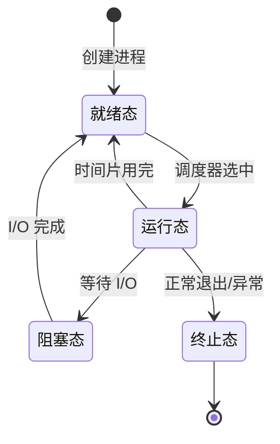
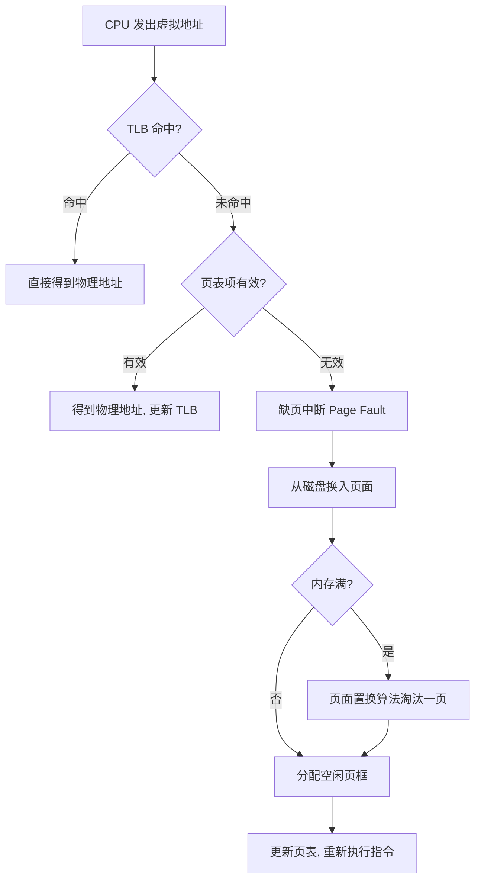
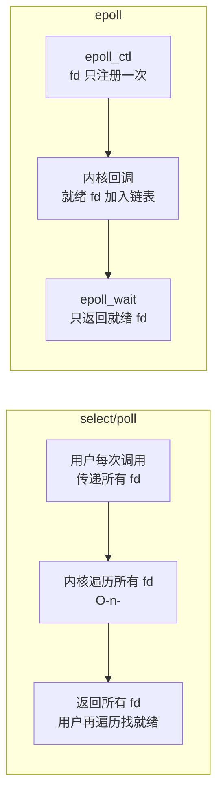
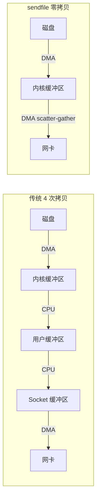

# 第二阶段知识详解：操作系统面试详解

> 本文覆盖字节跳动后端面试中操作系统的高频考点。每个知识点包含**原理详解**和**面试背诵版**两部分，先理解再记忆。

::: tip 字节面试特点
字节操作系统面试偏重「理解 + 场景应用」，不满足于背定义。常见追问模式：
- "XXX 的原理是什么？"→ 答完后追问 "为什么要这样设计？"
- "实际场景中会遇到什么问题？"→ 追问 "怎么解决？"
:::

---

## 一、进程与线程

### 1.1 进程 vs 线程 vs 协程

#### 原理详解

| 维度 | 进程 | 线程 | 协程（goroutine） |
|------|------|------|------------------|
| 定义 | 资源分配的最小单位 | CPU 调度的最小单位 | 用户态轻量级线程 |
| 内存 | 独立地址空间 | 共享进程地址空间 | 共享线程栈（极小初始栈） |
| 切换开销 | 最大（切页表、TLB 失效） | 中等（切寄存器、栈指针） | 最小（用户态切换，无系统调用） |
| 通信方式 | IPC（管道/共享内存/信号/socket） | 共享内存 + 同步原语 | channel / 共享内存 |
| 崩溃影响 | 不影响其他进程 | 一个线程崩溃 → 整个进程崩溃 | panic 可 recover，不影响其他 goroutine |
| 创建开销 | ~ms 级 | ~μs 级 | ~ns 级（goroutine 初始栈 2KB） |

**为什么需要线程？**
- 进程切换太重（切换页表导致 TLB 全部失效）
- 同一任务的多个子任务需要共享数据，用进程 IPC 开销大

**为什么需要协程（goroutine）？**
- 线程在 Linux 下仍是内核对象，创建/切换需要系统调用
- 高并发场景下（10 万+ 连接）创建等量线程不现实（每个线程默认 8MB 栈）
- goroutine 初始栈仅 2KB，由 Go runtime 在用户态调度（GMP 模型）

#### 面试背诵版

> **进程是资源分配的最小单位，线程是 CPU 调度的最小单位。** 进程拥有独立地址空间，线程共享进程的地址空间但有独立的栈和寄存器。线程切换不需要切换页表，开销远小于进程切换。Go 的 goroutine 是用户态协程，初始栈只有 2KB，通过 GMP 模型由 runtime 在用户态调度，切换不需要系统调用，可以轻松创建百万级并发。

---

### 1.2 进程状态与转换

#### 原理详解



**僵尸进程 vs 孤儿进程**

| | 僵尸进程 | 孤儿进程 |
|---|---|---|
| 定义 | 子进程已终止，但父进程未 `wait()` 回收其 PCB | 父进程先于子进程终止 |
| 危害 | 占用 PID 和进程表项，积累可能耗尽 PID | 无害，被 init(PID=1) 收养 |
| 解决 | 父进程调用 `wait()`/`waitpid()` 或注册 `SIGCHLD` 处理 | 无需处理 |

#### 面试背诵版

> 进程有五种基本状态：创建、就绪、运行、阻塞、终止。就绪态的进程被调度器选中后进入运行态；运行中遇到 I/O 进入阻塞态；I/O 完成后回到就绪态。**僵尸进程**是子进程退出但父进程未 wait 回收导致 PCB 残留，解决方法是父进程注册 SIGCHLD 信号处理或调用 waitpid。**孤儿进程**是父进程先退出，子进程被 init 进程收养，不会造成资源泄漏。

---

### 1.3 进程调度算法

#### 原理详解

| 算法 | 特点 | 适用场景 |
|------|------|---------|
| FCFS（先来先服务） | 简单，但短作业等待时间长 | 批处理 |
| SJF（短作业优先） | 平均等待最短，但可能饿死长作业 | 已知运行时间的批处理 |
| RR（时间片轮转） | 公平，响应快，时间片太小则切换开销大 | 分时系统 |
| 优先级调度 | 重要任务优先，可能饿死低优先级 | 实时系统 |
| 多级反馈队列 | 综合以上优点，Linux CFS 基于此思想 | 通用操作系统 |

**Linux CFS（完全公平调度器）核心思想：**
- 每个进程维护一个 `vruntime`（虚拟运行时间）
- 调度器总是选择 `vruntime` 最小的进程运行
- 高优先级进程的 vruntime 增长慢 → 获得更多 CPU 时间
- 用红黑树维护就绪队列，选择最左节点 → O(1)

#### 面试背诵版

> Linux 使用 **CFS（完全公平调度器）**，核心思想是跟踪每个进程的虚拟运行时间 vruntime，总是选择 vruntime 最小的进程运行。高优先级的进程 vruntime 增长更慢，因此获得更多 CPU 时间。就绪队列用红黑树维护，选最左节点是 O(1) 操作。对于实时进程，Linux 使用 SCHED_FIFO 和 SCHED_RR 策略，优先级高于普通进程。

---

## 二、内存管理

### 2.1 虚拟内存

#### 原理详解

**为什么需要虚拟内存？**

没有虚拟内存时的问题：
1. 多个进程直接访问物理内存 → 互相覆盖
2. 内存碎片严重 → 无法分配连续大块
3. 程序必须感知物理内存大小

虚拟内存解决的核心问题：
- **隔离**：每个进程有独立的虚拟地址空间
- **按需加载**：不需要一次性把程序全部加载到内存
- **超售**：所有进程虚拟内存总和可以超过物理内存

**地址翻译流程：**



#### 面试背诵版

> **虚拟内存**通过页表把虚拟地址映射到物理地址，实现进程地址空间隔离、按需加载和内存超售。CPU 访问内存时先查 TLB（快表），命中则直接得到物理地址；未命中则查页表；如果页面不在物理内存（页表项无效），触发缺页中断，由 OS 从磁盘换入页面。TLB 是关键性能组件——进程切换时 TLB 需要刷新（这就是进程切换比线程切换慢的核心原因）。

---

### 2.2 页面置换算法

#### 原理详解

| 算法 | 思想 | 特点 |
|------|------|------|
| OPT（最优） | 淘汰未来最久不使用的页 | 理论最优，不可实现（需要预知未来） |
| FIFO | 淘汰最早进入的页 | 简单但有 Belady 异常（增加页框反而更多缺页） |
| LRU（最近最少使用） | 淘汰最近最久未访问的页 | 性能好，但精确实现需要硬件支持 |
| Clock（时钟） | LRU 近似，用访问位 + 循环指针 | Linux 实际使用的方案基础 |
| LFU（最不经常使用） | 淘汰访问次数最少的页 | 对突发访问不友好 |

**Linux 实际方案：双链表 LRU（Active/Inactive）**
- Active list：最近被访问过的页面
- Inactive list：候选淘汰页面
- 页面首次加载进入 Inactive；再次访问提升到 Active
- 淘汰从 Inactive 尾部开始

#### 面试背诵版

> 常见页面置换算法：**OPT**（理论最优，不可实现）、**FIFO**（简单但有 Belady 异常）、**LRU**（淘汰最近最久未使用的页，性能好但精确实现代价高）、**Clock**（LRU 近似，用访问位实现）。Linux 实际使用双链表近似 LRU：Active 和 Inactive 两个链表，页面首次进入 Inactive，再次访问提升到 Active，淘汰从 Inactive 尾部开始。

---

### 2.3 用户态与内核态

#### 原理详解

| | 用户态 | 内核态 |
|---|---|---|
| 权限 | 只能访问用户空间（低 3GB / 低 128TB） | 可以访问所有内存和硬件 |
| 指令 | 不能执行特权指令 | 可以执行所有指令 |
| 切换触发 | 系统调用 / 中断 / 异常 | 返回用户程序 |

**系统调用的开销：**
1. 保存用户态寄存器到内核栈
2. 切换到内核态（修改 CPU 特权级）
3. 执行内核代码
4. 恢复寄存器，切回用户态

这就是为什么 goroutine 切换比线程切换快——goroutine 切换不需要进入内核态。

#### 面试背诵版

> 用户态只能访问受限的地址空间和非特权指令；内核态可以访问所有硬件资源。用户态到内核态的切换通过**系统调用、中断、异常**三种方式触发。系统调用的开销包括：保存/恢复寄存器、切换特权级、可能导致 cache/TLB 污染。这也是为什么 Go 的 goroutine（纯用户态切换）比 OS 线程（需要系统调用）快得多。

---

## 三、进程同步与互斥

### 3.1 死锁

#### 原理详解

**死锁四个必要条件（缺一不可）：**
1. **互斥**：资源同一时刻只能被一个进程持有
2. **持有并等待**：进程持有至少一个资源，同时等待其他资源
3. **不可剥夺**：资源只能由持有者主动释放
4. **循环等待**：存在进程的循环等待链

**破解死锁：**
- 破坏互斥 → 不现实（有些资源天然互斥）
- 破坏持有并等待 → 一次性申请所有资源
- 破坏不可剥夺 → 申请不到时释放已有资源（trylock）
- 破坏循环等待 → **资源有序分配**（最常用：按固定顺序加锁）

**实际编程中避免死锁的策略：**
```go
// 错误：A 锁了 mu1 等 mu2，B 锁了 mu2 等 mu1
go func() { mu1.Lock(); mu2.Lock() }()
go func() { mu2.Lock(); mu1.Lock() }()

// 正确：所有 goroutine 按相同顺序加锁
go func() { mu1.Lock(); mu2.Lock() }()
go func() { mu1.Lock(); mu2.Lock() }()
```

#### 面试背诵版

> 死锁需要四个条件同时成立：互斥、持有并等待、不可剥夺、循环等待。实际开发中最常用的预防方式是**破坏循环等待——规定加锁顺序**。检测死锁可以用资源分配图（检测是否有环）。Go 中可以用 `go vet` 检测部分锁问题，也可以通过 `sync.Mutex` 的 trylock（Go 1.18+ `TryLock()`）来避免死等。

---

### 3.2 同步原语

#### 原理详解

| 原语 | 本质 | Go 对应 |
|------|------|---------|
| 互斥锁（Mutex） | 二元信号量，保护临界区 | `sync.Mutex` |
| 读写锁 | 读共享、写互斥 | `sync.RWMutex` |
| 信号量（Semaphore） | 计数器，控制并发数量 | `make(chan struct{}, N)` |
| 条件变量（Cond） | 等待某个条件成立时被唤醒 | `sync.Cond` |
| 自旋锁（Spinlock） | 忙等待，不让出 CPU | Go runtime 内部使用 |

**Mutex vs Spinlock 选择：**
- 临界区很短（几条指令）→ 自旋锁（避免上下文切换）
- 临界区较长 / 可能阻塞 → 互斥锁（让出 CPU）

#### 面试背诵版

> **互斥锁**通过阻塞等待保护临界区；**自旋锁**通过忙等待避免上下文切换，适用于临界区极短的场景。**读写锁**允许多个读者并发，但写者独占。Go 的 `sync.Mutex` 实现了两阶段：先自旋一段时间（乐观），如果拿不到锁再进入阻塞（悲观），兼顾短临界区和长等待的场景。Go 没有暴露信号量，但可以用带缓冲 channel 模拟。

---

## 四、文件系统与 I/O

### 4.1 I/O 模型（重点）

#### 原理详解

| 模型 | 特点 | 对应系统调用 |
|------|------|-------------|
| 阻塞 I/O | 进程阻塞直到数据就绪 | `read()` |
| 非阻塞 I/O | 立即返回，需要轮询 | `read()` + O_NONBLOCK |
| I/O 多路复用 | 一个线程监控多个 fd | `select`/`poll`/`epoll` |
| 信号驱动 I/O | 数据就绪时内核发信号 | `SIGIO` |
| 异步 I/O | 内核完成全部操作后通知 | `io_uring` / AIO |

**select vs poll vs epoll：**

| | select | poll | epoll |
|---|---|---|---|
| fd 数量限制 | 1024（FD_SETSIZE） | 无限制 | 无限制 |
| 数据结构 | fd_set（位图） | pollfd 数组 | 红黑树 + 就绪链表 |
| 每次调用传递 fd | 是（内核态拷贝） | 是 | 否（fd 注册到内核） |
| 时间复杂度 | O(n) 遍历所有 fd | O(n) | O(1) 只返回就绪 fd |
| 触发模式 | 水平触发 | 水平触发 | 水平触发 + 边缘触发 |

**epoll 为什么快？**



核心优势：
1. fd 只需注册一次（`epoll_ctl`），不需要每次系统调用都传递
2. 内核用回调函数把就绪 fd 加入就绪链表，不需要遍历
3. `epoll_wait` 只返回就绪的 fd，用户不需要遍历全部

**Go 的 netpoller 就是基于 epoll（Linux）/ kqueue（macOS）实现的。**

#### 面试背诵版

> Linux 的 5 种 I/O 模型：阻塞、非阻塞、I/O 多路复用、信号驱动、异步 I/O。**epoll** 是 Linux 高并发网络的核心，相比 select/poll 的优势：1）fd 只注册一次，不需每次调用都拷贝；2）内核通过回调把就绪 fd 加入链表，不需 O(n) 遍历；3）只返回就绪 fd。epoll 有水平触发（LT，默认，不处理就一直通知）和边缘触发（ET，只通知一次，必须一次读完）两种模式。Go 的 net 包底层用 netpoller 封装了 epoll，goroutine 看起来是阻塞读写，实际是被 runtime 挂起等待 epoll 事件。

---

### 4.2 零拷贝（Zero Copy）

#### 原理详解

**传统文件发送 vs 零拷贝对比：**



数据完全不经过用户态 → 零拷贝。

**应用场景：** Nginx 静态文件、Kafka 消息投递、Go 的 `io.Copy` + `*net.TCPConn`。

#### 面试背诵版

> **零拷贝**指数据不经过用户态缓冲区直接在内核中完成传输。Linux 通过 `sendfile` 系统调用实现：数据从磁盘 DMA 到内核缓冲区，然后直接 DMA 到网卡，避免了两次 CPU 拷贝和两次用户态-内核态切换。Kafka 高吞吐和 Nginx 高性能静态文件服务都依赖零拷贝。

---

## 五、进程间通信（IPC）

### 原理详解

| 方式 | 特点 | 适用场景 |
|------|------|---------|
| 管道（Pipe） | 半双工，有亲缘关系的进程 | 父子进程简单通信 |
| 命名管道（FIFO） | 无需亲缘关系，基于文件系统 | 无关进程通信 |
| 消息队列 | 内核维护的消息链表 | 格式化数据传递 |
| 共享内存 | 最快，映射同一块物理内存 | 大量数据高速交换 |
| 信号量 | 计数器，用于同步 | 控制共享资源访问 |
| Socket | 可跨网络 | 分布式系统、网络通信 |

**共享内存为什么最快？**
- 不需要系统调用来传输数据
- 数据不经过内核
- 直接读写，和访问本进程内存一样快
- 但需要额外的同步机制（信号量/互斥锁）

### 面试背诵版

> Linux 进程间通信有六种方式：管道、命名管道、消息队列、共享内存、信号量、Socket。**共享内存是最快的 IPC 方式**，因为数据不需要在内核和用户空间之间拷贝，但需要配合信号量或互斥锁来同步。Socket 是唯一可以跨机器的 IPC 方式。实际开发中，同机通信优先考虑 Unix Domain Socket（比 TCP Socket 少了协议栈开销）。

---

## 六、高频面试问题速查

### Q1: 进程和线程的区别？
> 进程是资源分配的最小单位，有独立地址空间；线程是调度的最小单位，共享进程地址空间。线程切换不需要切换页表，开销远小于进程。

### Q2: 什么是虚拟内存？为什么需要？
> 虚拟内存是 OS 对物理内存的抽象，每个进程拥有独立的虚拟地址空间。通过页表映射到物理内存。作用：进程隔离、按需加载、内存超售。

### Q3: 缺页中断的处理过程？
> CPU 访问页表发现页面不在物理内存 → 触发缺页中断 → OS 找到空闲页框（或用页面置换算法淘汰一页）→ 从磁盘读入页面 → 更新页表 → 重新执行引起缺页的指令。

### Q4: 什么是上下文切换？开销在哪？
> 保存当前进程/线程的 CPU 状态（寄存器、PC、栈指针）到 PCB/TCB，恢复目标进程/线程的状态。开销：直接成本（保存恢复寄存器）+ 间接成本（TLB 失效、cache 变冷、pipeline 冲刷）。

### Q5: 用户态和内核态的区别？怎么切换？
> 用户态只能执行非特权指令，访问用户空间；内核态可以执行所有指令，访问全部内存。通过系统调用（主动）、中断（被动）、异常（被动）进入内核态。

### Q6: 什么是死锁？怎么避免？
> 两个以上进程互相持有对方需要的资源而永久等待。四个条件：互斥、持有并等待、不可剥夺、循环等待。最常用的预防方法：规定加锁顺序（破坏循环等待）。

### Q7: epoll 和 select 的区别？为什么 epoll 更快？
> select 每次调用都要把 fd 集合拷贝到内核、返回后 O(n) 遍历找就绪 fd、最多监控 1024 个 fd。epoll 的 fd 只注册一次、内核用回调把就绪 fd 加入链表、只返回就绪 fd 给用户空间。

### Q8: fork() 之后子进程和父进程共享什么？
> fork 后子进程获得父进程地址空间的**写时复制（COW）副本**。在任一方写入之前，页表指向相同物理页（共享）；写入时才真正复制该页。文件描述符也是共享的（引用计数+1）。

---

## 七、操作系统 + Go 结合考点

| 考点 | 字节面试常见问法 |
|------|---------------|
| GMP 调度模型 | "Go 的调度器和 OS 调度器有什么关系？" |
| goroutine 栈增长 | "goroutine 栈怎么扩容？和线程栈有什么区别？" |
| GC STW | "GC 暂停时 goroutine 在干嘛？" |
| epoll + netpoller | "Go 网络 I/O 为什么看起来是同步的？" |
| mmap | "Go 的大内存分配走什么系统调用？" |
| 信号处理 | "Go 程序怎么优雅退出？SIGTERM 怎么处理？" |

---

## 推荐学习顺序

1. 进程线程基础 → 虚拟内存 → 页面置换 → 同步互斥（第 1 周）
2. I/O 模型 → epoll → 零拷贝 → IPC（第 2 周）
3. Go + OS 结合考点 → 高频问题反复背诵（第 3 周）

---

## 参考资源

- [带你通过字节跳动面试——操作系统复习（腾讯云）](https://cloud.tencent.com/developer/article/1730779)
- [面试字节，被操作系统问挂了（知乎）](https://zhuanlan.zhihu.com/p/541717336)
- [操作系统大厂面试高频知识点图解](https://hengxin666.github.io/HXLoLi/docs/%E9%9D%A2%E8%AF%95/%E6%93%8D%E4%BD%9C%E7%B3%BB%E7%BB%9F%E9%9D%A2%E8%AF%95%E7%9F%A5%E8%AF%86%E7%82%B9%E5%9B%BE%E8%A7%A3)
- [JavaGuide - 操作系统基础问题（GitHub）](https://github.com/Snailclimb/JavaGuide/blob/HEAD/docs/cs-basics/operating-system/operating-system-basic-questions-02.md)
