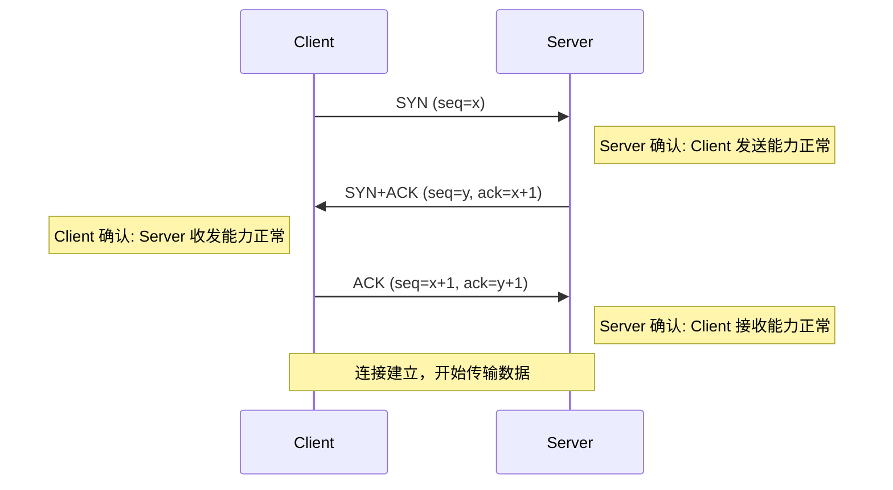
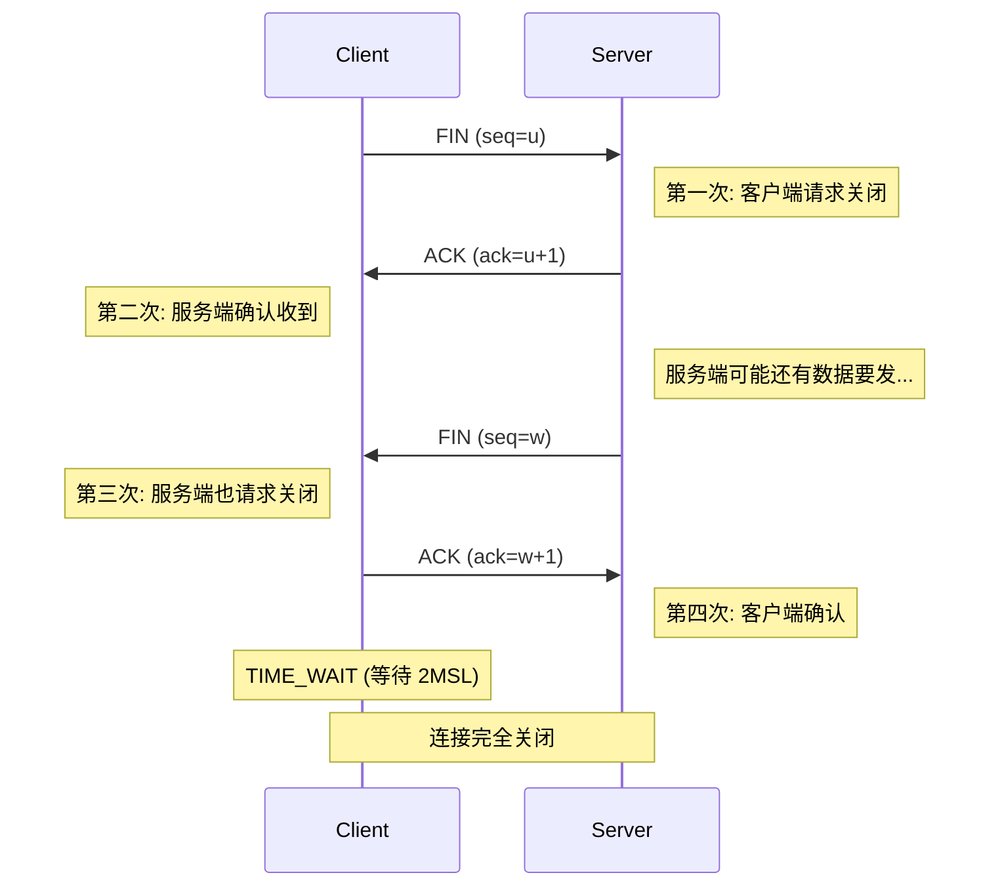
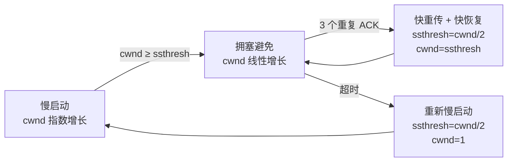
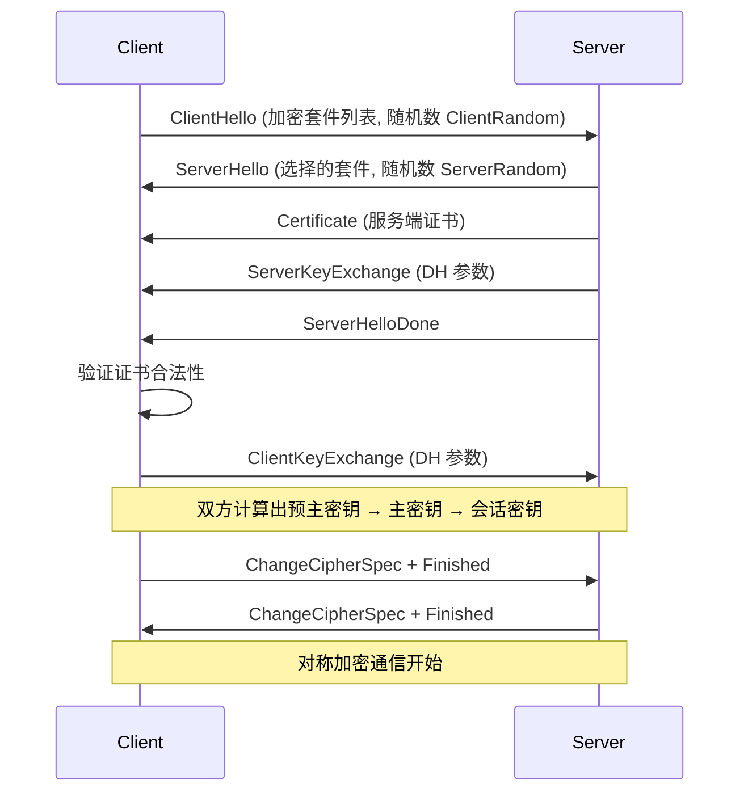
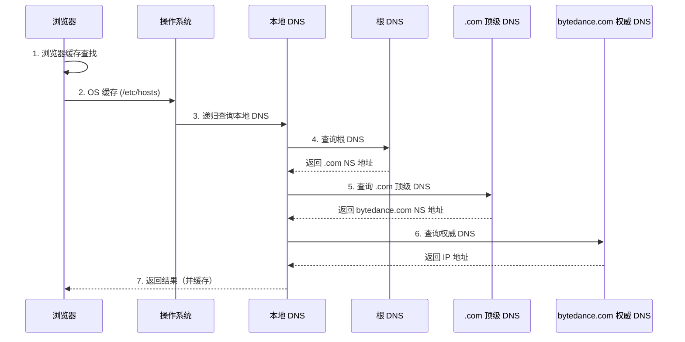
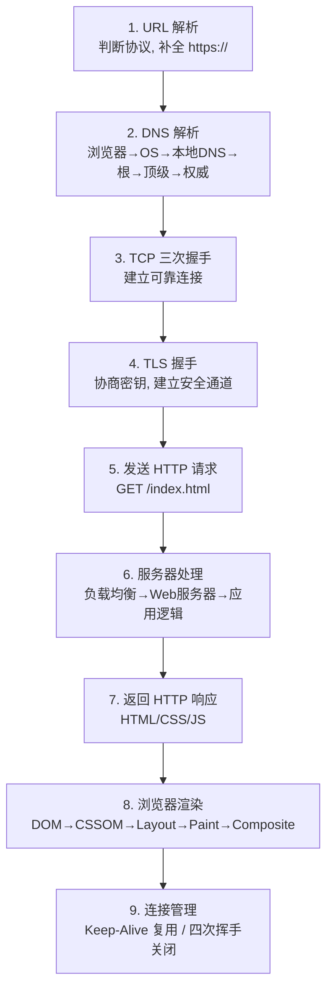

# 第二阶段知识详解：计算机网络面试详解

> 本文覆盖字节跳动后端面试中计算机网络的高频考点。每个知识点包含**原理详解**和**面试背诵版**两部分。

::: tip 字节网络面试特点
字节网络面试最爱问的三个方向：
1. TCP 连接管理（三次握手、四次挥手、为什么不是两次/三次）
2. TCP 可靠传输机制（滑动窗口、拥塞控制）
3. HTTP/HTTPS（TLS 握手、HTTP/2 多路复用、HTTP/3 QUIC）

追问模式：先问概念 → 追问"为什么这样设计" → 再问"实际遇到过什么问题"
:::

---

## 一、网络分层模型

### 原理详解

| OSI 七层 | TCP/IP 四层 | 核心协议 | 作用 |
|---------|------------|---------|------|
| 应用层 | 应用层 | HTTP, DNS, MQTT, gRPC | 提供应用服务 |
| 表示层 | ↑ | TLS/SSL | 加密、编码 |
| 会话层 | ↑ | — | 会话管理 |
| 传输层 | 传输层 | TCP, UDP | 端到端可靠/不可靠传输 |
| 网络层 | 网络层 | IP, ICMP, ARP | 路由寻址 |
| 数据链路层 | 网络接口层 | Ethernet, WiFi | 相邻节点数据帧传输 |
| 物理层 | ↑ | — | 比特流传输 |

**面试中实际按 TCP/IP 四层模型回答即可。**

### 面试背诵版

> 网络分层的目的是**解耦**——每一层只关心自己的职责，通过接口与相邻层交互。实际工程中用 TCP/IP 四层模型：应用层（HTTP/DNS）、传输层（TCP/UDP）、网络层（IP）、网络接口层（以太网）。数据发送时逐层封装（加头部），接收时逐层解封装。

---

## 二、TCP 三次握手（最高频）

### 原理详解



**为什么是三次？不是两次？不是四次？**

**不能两次的原因：**
- 两次握手 = 服务端收到 SYN 就认为连接建立
- 问题：客户端一个**已失效的旧 SYN**（网络延迟重传）到达服务端
- 服务端以为是新连接，分配资源等待数据 → 但客户端不会发数据 → 资源浪费
- 第三次 ACK 让服务端确认"客户端确实还活着且想建立连接"

**不需要四次的原因：**
- 三次已经足够：第三次 ACK 确认了双方都知道对方的初始序列号
- 本质上三次握手完成了两件事：
  1. 双方确认彼此的发送和接收能力正常
  2. 交换初始序列号（ISN）

**每次握手的目的：**

| 次数 | 确认了什么 |
|------|-----------|
| 第 1 次（Client→Server） | Server 确认：Client 的发送能力正常 |
| 第 2 次（Server→Client） | Client 确认：Server 的发送和接收能力都正常 |
| 第 3 次（Client→Server） | Server 确认：Client 的接收能力正常 |

### 面试背诵版

> TCP 三次握手：①Client 发 SYN(seq=x)；②Server 回 SYN+ACK(seq=y, ack=x+1)；③Client 发 ACK(ack=y+1)。**为什么不能两次**：两次握手无法防止已失效的旧 SYN 报文建立错误连接——服务端收到旧 SYN 就分配资源，但客户端不会响应，造成资源浪费。第三次 ACK 让服务端确认客户端确实还活着。**为什么不需要四次**：三次已经足够让双方确认彼此的收发能力正常，并完成初始序列号交换。

---

## 三、TCP 四次挥手

### 原理详解



**为什么是四次？不能三次吗？**

- 关闭连接是**双向**的：A 关了不代表 B 也关了
- 第二次 ACK 后，Server 可能还有数据没发完（半关闭状态）
- Server 数据发完后才发 FIN → 所以 ACK 和 FIN 不能合并
- 特殊情况：如果 Server 没有数据要发，ACK 和 FIN 可以合并 → 变成"三次挥手"（延迟确认机制）

**TIME_WAIT 为什么要等 2MSL？**
1. **确保最后一个 ACK 到达**：如果丢了，Server 会重发 FIN，Client 需要能重新 ACK
2. **让旧连接的报文在网络中消失**：防止新连接收到旧连接的残留报文

**TIME_WAIT 过多的问题与解决：**
- 问题：每个 TIME_WAIT 占用一个端口（默认等 60s），高并发短连接场景端口耗尽
- 解决：
  - `tcp_tw_reuse`：允许复用 TIME_WAIT 连接（安全，只对客户端有效）
  - 使用长连接（HTTP Keep-Alive）减少频繁建连
  - 服务端让客户端主动断连（谁主动关谁 TIME_WAIT）

### 面试背诵版

> TCP 四次挥手：①主动方发 FIN；②被动方回 ACK（此时可继续发数据）；③被动方发完数据后发 FIN；④主动方回 ACK 并进入 TIME_WAIT。**为什么不能三次**：被动方收到 FIN 时可能还有数据没发完，ACK 和 FIN 不能合并（除非没有待发数据）。**TIME_WAIT 等 2MSL** 的原因：①确保最后的 ACK 能到达（丢了对方会重发 FIN）；②让旧报文在网络中过期消失。高并发场景下 TIME_WAIT 过多会端口耗尽，可通过 `tcp_tw_reuse`、长连接来缓解。

---

## 四、TCP 可靠传输机制

### 4.1 滑动窗口

#### 原理详解

TCP 用**滑动窗口**实现流量控制：

```text
发送方窗口：
已确认 | 已发送未确认 | 可发送 | 不可发送
───────┼─────────────┼───────┼─────────
       │◄── 发送窗口 ──►│
```

- **发送窗口大小** = min(接收方通告窗口 rwnd, 拥塞窗口 cwnd)
- 接收方通过 ACK 中的 Window 字段告知自己还能接收多少数据
- 窗口为 0 时发送方停止发送（死锁问题通过探测报文解决）

#### 面试背诵版

> TCP 通过**滑动窗口**实现流量控制。发送方维护一个发送窗口，大小等于 min(rwnd, cwnd)。接收方在 ACK 中携带 Window 字段告知剩余接收能力。窗口内的数据可以连续发送而不必逐个等待确认，大幅提高了吞吐量。如果接收方窗口为 0，发送方启动持续计时器，定期发送探测报文，防止死锁。

---

### 4.2 拥塞控制（重点）

#### 原理详解

TCP 拥塞控制四个阶段：



| 阶段 | 规则 | 触发条件 |
|------|------|---------|
| 慢启动 | cwnd 每 RTT 翻倍 | 连接建立初期 |
| 拥塞避免 | cwnd 每 RTT +1 MSS | cwnd ≥ ssthresh |
| 快重传 | 收到 3 个重复 ACK 立即重传 | 丢包但网络没彻底拥塞 |
| 快恢复 | ssthresh = cwnd/2, cwnd = ssthresh + 3 | 配合快重传 |

**超时 vs 三次重复 ACK 的处理差异：**
- 超时（严重拥塞）：ssthresh = cwnd/2，cwnd = 1，重新慢启动
- 三次重复 ACK（轻度丢包）：ssthresh = cwnd/2，cwnd = ssthresh（快恢复，不从 1 开始）

**现代拥塞控制算法：**
- Reno：经典，快恢复快重传
- Cubic：Linux 默认，cwnd 增长函数是三次方
- BBR（Google）：不依赖丢包，基于带宽和 RTT 估计 → 字节跳动大量使用

#### 面试背诵版

> TCP 拥塞控制四个阶段：**慢启动**（cwnd 指数增长到 ssthresh）→ **拥塞避免**（cwnd 线性增长）→ 丢包时：收到 3 个重复 ACK 触发**快重传+快恢复**（cwnd 减半继续），超时则 cwnd 重置为 1 重新慢启动。Linux 默认用 Cubic 算法（cwnd 增长是三次方曲线）。Google 的 BBR 算法不依赖丢包信号，而是主动探测瓶颈带宽和最小 RTT，字节跳动在内部广泛使用 BBR 来优化长距离传输。

---

## 五、TCP vs UDP

### 原理详解

| 维度 | TCP | UDP |
|------|-----|-----|
| 连接 | 面向连接（三次握手） | 无连接 |
| 可靠性 | 可靠（重传、确认、排序） | 不可靠 |
| 顺序 | 保证有序 | 不保证 |
| 流量控制 | 有（滑动窗口） | 无 |
| 拥塞控制 | 有 | 无 |
| 头部开销 | 20 字节 | 8 字节 |
| 传输模式 | 字节流 | 数据报 |
| 适用场景 | 文件传输、HTTP、数据库 | 视频直播、DNS、游戏、QUIC |

**为什么视频直播用 UDP？**
- 实时性要求高，丢一帧可以接受，等重传不可接受
- TCP 的拥塞控制会降低发送速率 → 卡顿
- 应用层可以自己做选择性重传（如关键帧重传、非关键帧丢弃）

**字节跳动相关：** 抖音/TikTok 的实时推流大量使用基于 UDP 的私有协议。

### 面试背诵版

> TCP 是面向连接、可靠的字节流协议，保证有序且不丢包，适合文件传输和 HTTP。UDP 是无连接、不可靠的数据报协议，头部只有 8 字节，适合实时性要求高的场景（直播、游戏、DNS）。选择依据：**需要可靠性选 TCP，需要实时性选 UDP**。现代趋势是在 UDP 上自建可靠性（如 QUIC = UDP + 可靠传输 + 加密 + 多路复用）。

---

## 六、HTTP/HTTPS

### 6.1 HTTP 版本演进

#### 原理详解

| 版本 | 核心改进 | 问题 |
|------|---------|------|
| HTTP/1.0 | 每次请求建一个 TCP 连接 | 频繁建连开销大 |
| HTTP/1.1 | Keep-Alive 长连接、管线化 | 队头阻塞（响应必须按序返回） |
| HTTP/2 | 二进制分帧、多路复用、头部压缩、服务端推送 | TCP 层队头阻塞（丢一个包阻塞所有流） |
| HTTP/3 | 基于 QUIC（UDP）、无队头阻塞、0-RTT 建连 | 部署复杂、中间件支持不完善 |

**HTTP/2 多路复用原理：**
```text
单一 TCP 连接
┌─────────────────────────────────┐
│  Stream 1: GET /index.html      │
│  Stream 2: GET /style.css       │  ← 并行，不互相阻塞
│  Stream 3: GET /app.js          │
└─────────────────────────────────┘
```

把请求/响应拆成帧（Frame），不同 Stream 的帧可以交错发送。

**HTTP/3 为什么用 UDP？**
- TCP 层丢包导致所有 Stream 阻塞（TCP 保证有序，一个包丢了后面全等）
- QUIC 在 UDP 上实现了独立的 Stream，丢包只影响对应 Stream
- QUIC 内建 TLS 1.3，0-RTT 恢复连接

#### 面试背诵版

> HTTP/1.1 通过 Keep-Alive 复用连接但仍有队头阻塞。**HTTP/2** 在单一 TCP 连接上实现多路复用（多个 Stream 并行传输），通过二进制分帧和头部压缩（HPACK）提升性能。但 TCP 层的丢包仍会阻塞所有 Stream。**HTTP/3** 基于 QUIC（UDP），每个 Stream 独立，丢包只影响对应 Stream，且内建 TLS 1.3 支持 0-RTT 恢复。字节跳动的 CDN 和短视频分发已大规模使用 QUIC/HTTP3。

---

### 6.2 HTTPS 与 TLS 握手

#### 原理详解

**HTTPS = HTTP + TLS**

TLS 1.2 握手流程（2-RTT）：



**TLS 1.3 握手（1-RTT，更快更安全）：**
- 合并了多个步骤，只需 1 个 RTT
- 去掉了不安全的加密套件（RSA 密钥交换）
- 只支持前向安全的密钥交换（ECDHE）
- 支持 0-RTT 恢复（有重放风险，需应用层幂等）

**对称加密 vs 非对称加密：**

| | 对称加密 | 非对称加密 |
|---|---|---|
| 速度 | 快（AES: ~GB/s） | 慢（RSA: ~MB/s） |
| 密钥 | 加解密同一把 | 公钥加密，私钥解密 |
| 用途 | 数据传输 | 密钥协商、签名 |

**HTTPS 为什么同时用两种？**
- 非对称加密用来安全地协商对称密钥
- 数据传输用对称加密（性能）
- 相当于：非对称加密解决"密钥分发"问题，对称加密解决"高效传输"问题

#### 面试背诵版

> HTTPS 在 HTTP 和 TCP 之间加了 TLS 层。TLS 握手过程：①Client 发送支持的加密套件和随机数；②Server 回复选择的套件、证书、公钥参数；③双方通过 ECDHE 算法协商出对称密钥；④后续用对称加密通信。**为什么同时用对称和非对称加密**：非对称加密慢但能安全交换密钥；对称加密快用于实际数据传输。TLS 1.3 只需 1-RTT（甚至 0-RTT 恢复），去掉了所有不安全的套件，只保留前向安全的 ECDHE。

---

## 七、DNS 解析

### 原理详解

**DNS 解析完整流程：**



**递归查询 vs 迭代查询：**
- 客户端 → 本地 DNS：**递归**（本地 DNS 负责查到底）
- 本地 DNS → 各级 DNS：**迭代**（各级只返回下一步该问谁）

**DNS 用 TCP 还是 UDP？**
- 默认用 UDP（快，53 端口）
- 响应超过 512 字节时切换到 TCP（区域传输也用 TCP）

### 面试背诵版

> DNS 解析流程：浏览器缓存 → OS 缓存 → 本地 DNS（递归查询）→ 根 DNS → 顶级域 DNS → 权威 DNS → 返回 IP。客户端到本地 DNS 是递归查询（本地 DNS 全权负责），本地 DNS 到各级 DNS 是迭代查询。默认使用 UDP 协议（端口 53），响应超过 512 字节时改用 TCP。

---

## 八、经典面试题："从输入 URL 到页面显示"

### 完整流程



### 面试背诵版（精简版，覆盖网络部分）

> ①**DNS 解析**：逐级查询浏览器缓存、OS 缓存、本地 DNS、根/顶级/权威 DNS，得到 IP 地址。②**TCP 三次握手**建立连接。③**TLS 握手**（HTTPS）协商对称密钥。④**发送 HTTP 请求**，服务器处理后返回响应。⑤浏览器解析 HTML、加载资源、渲染页面。⑥后续请求复用同一连接（HTTP/2 多路复用），最后四次挥手关闭。

---

## 九、其他高频考点

### 9.1 Cookie / Session / Token

| | Cookie | Session | JWT Token |
|---|---|---|---|
| 存储位置 | 客户端浏览器 | 服务端（内存/Redis） | 客户端 |
| 安全性 | 容易被篡改/窃取 | 相对安全 | 签名防篡改 |
| 跨域 | 受同源策略限制 | 依赖 Cookie 传 SessionID | 可放 Header，不受同源限制 |
| 服务端压力 | 无 | 有（存储 Session 数据） | 无（无状态） |
| 适用场景 | 记住登录状态 | 传统 Web 应用 | 分布式系统、API 认证 |

### 9.2 GET vs POST

| | GET | POST |
|---|---|---|
| 语义 | 获取资源（幂等） | 创建/修改资源（非幂等） |
| 参数位置 | URL 查询字符串 | 请求体 |
| 长度限制 | 浏览器有 URL 长度限制（~2KB-8KB） | 理论无限制 |
| 缓存 | 可被浏览器缓存 | 默认不缓存 |
| 安全性 | 参数暴露在 URL | 参数在 body 中（仍需 HTTPS） |

### 9.3 HTTP 状态码

| 范围 | 含义 | 常见 |
|------|------|------|
| 2xx | 成功 | 200 OK, 201 Created, 204 No Content |
| 3xx | 重定向 | 301 永久, 302 临时, 304 未修改（缓存有效） |
| 4xx | 客户端错误 | 400 参数错误, 401 未认证, 403 禁止, 404 未找到 |
| 5xx | 服务端错误 | 500 内部错误, 502 网关错误, 503 服务不可用, 504 网关超时 |

---

## 十、高频面试问题速查

### Q1: TCP 和 UDP 的区别？
> TCP 面向连接、可靠、有序、字节流、有流量控制和拥塞控制，头部 20 字节。UDP 无连接、不可靠、数据报、头部 8 字节。需要可靠性选 TCP，需要实时性选 UDP。

### Q2: 为什么 TCP 握手是三次？
> 防止已失效的旧 SYN 报文建立错误连接。三次握手让双方确认彼此的收发能力正常，并安全交换初始序列号。两次不够（无法防止旧报文），四次不必要。

### Q3: 为什么挥手是四次？
> 因为 TCP 是全双工的，关闭是双向独立的。被动方收到 FIN 后可能还有数据没发完，所以 ACK 和 FIN 要分开发。

### Q4: TIME_WAIT 的作用？为什么是 2MSL？
> ①确保最后一个 ACK 能到达对方（丢了对方会重发 FIN）；②让本连接的旧报文在网络中消失，防止影响新连接。2MSL 是报文最大生存时间的两倍，保证一个来回都能覆盖。

### Q5: TCP 怎么保证可靠传输？
> 五个机制：①序列号和确认号；②超时重传；③滑动窗口（流量控制）；④拥塞控制（慢启动、拥塞避免、快重传、快恢复）；⑤校验和。

### Q6: HTTPS 比 HTTP 安全在哪？
> HTTPS 在 TCP 之上加了 TLS 层，提供三个安全保障：①加密（防窃听）；②认证（防冒充，通过证书验证服务器身份）；③完整性（防篡改，通过 MAC 校验）。

### Q7: HTTP/2 的改进？
> ①二进制分帧（解析更高效）；②多路复用（单连接并行多个请求）；③头部压缩（HPACK）；④服务端推送。解决了 HTTP/1.1 的队头阻塞问题，但 TCP 层仍有队头阻塞。

### Q8: HTTP/3 为什么用 UDP？
> TCP 层丢包会阻塞所有 Stream（因为 TCP 保证有序）。QUIC 基于 UDP 实现了独立的 Stream，丢包只影响对应 Stream。同时 QUIC 内建 TLS 1.3，支持 0-RTT 恢复。

### Q9: TCP 粘包问题是什么？怎么解决？
> TCP 是字节流，没有消息边界，接收方可能一次收到多个或部分消息。解决方法：①定长消息；②特殊分隔符（\r\n）；③消息头声明长度（最常用：Length + Body 格式）。

### Q10: 什么是 SYN Flood？怎么防？
> 攻击者发大量伪造源 IP 的 SYN 包，服务端为每个半连接分配资源，队列满后拒绝正常连接。防御：①SYN Cookie（不保存半连接状态，用加密 Cookie 验证）；②增大半连接队列；③缩短 SYN_RECV 超时。

---

## 十一、网络 + Go 结合考点

| 考点 | 字节面试常见问法 |
|------|---------------|
| net/http 底层 | "Go 的 HTTP Server 是怎么处理并发的？" → 每个连接一个 goroutine |
| TCP 长连接管理 | "如何实现连接池？超时怎么处理？" |
| gRPC vs HTTP | "为什么微服务用 gRPC？和 HTTP/2 什么关系？" → gRPC 基于 HTTP/2 |
| DNS 解析 | "Go 的 net.Resolver 是怎么工作的？CGO vs Pure Go?" |
| 零拷贝 | "Go 怎么实现 sendfile？" → `io.Copy` + `*net.TCPConn` |
| WebSocket | "WebSocket 和 HTTP 的关系？" → HTTP Upgrade 升级 |

---

## 推荐学习顺序

1. TCP 三次握手 / 四次挥手 / 可靠传输 → 必须先掌握（第 1 周）
2. HTTP/HTTPS / TLS / DNS → 应用层高频（第 2 周）
3. TCP vs UDP / 拥塞控制 / epoll → 进阶深入（第 3 周）
4. "输入 URL 到页面显示" → 串联所有知识的终极问题（第 4 周复习）

---

## 参考资源

- [小林 coding - 计算机网络面试题](https://xiaolincoding.com/interview/network.html)
- [35 张图解 TCP 三次握手和四次挥手（小林 coding）](https://www.cnblogs.com/xiaolincoding/p/12638546.html)
- [字节跳动面试题：为什么三次握手（腾讯云）](https://developer.cloud.tencent.com/article/2489159)
- [TCP 为什么需要四次挥手（面试大师）](https://mianshidashi.cn/interview-questions/bytedance/backend-development/bytedance-networking-tcp-43dec691)
- [某大厂跳动面试：计算机网络问题解析（博客园）](https://www.cnblogs.com/gccbuaa/p/19191245)
- [万字长文速通 TCP/HTTP/DNS（SegmentFault）](https://segmentfault.com/a/1190000047353234)
- [TCP/IP & Network Programming Deep Dive 2025](https://www.youngju.dev/blog/culture/2026-04-14-tcp-ip-network-programming-socket-http3-guide-2025.en)
