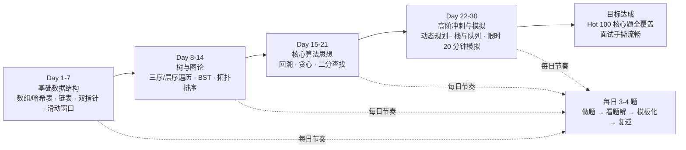
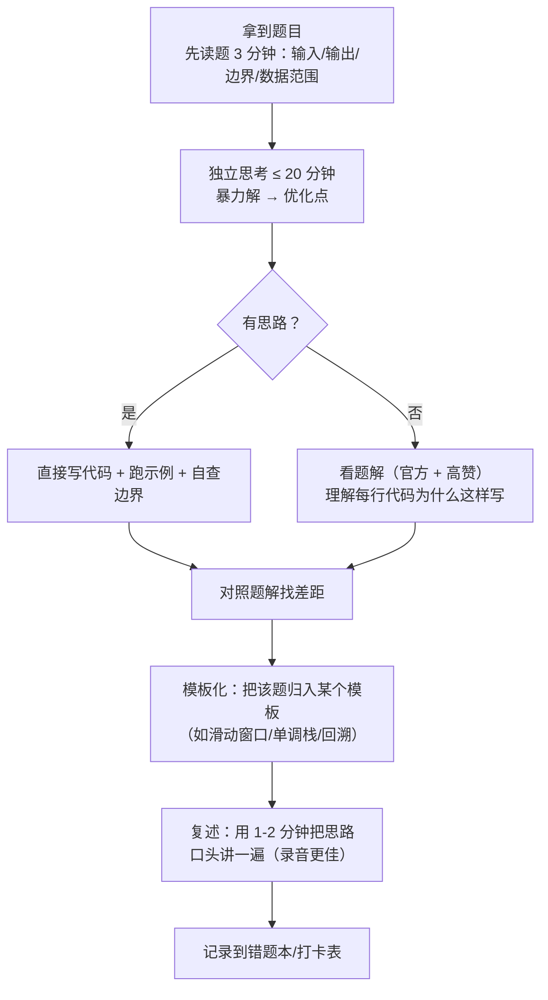
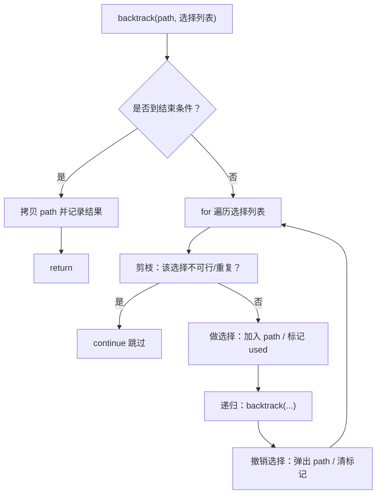
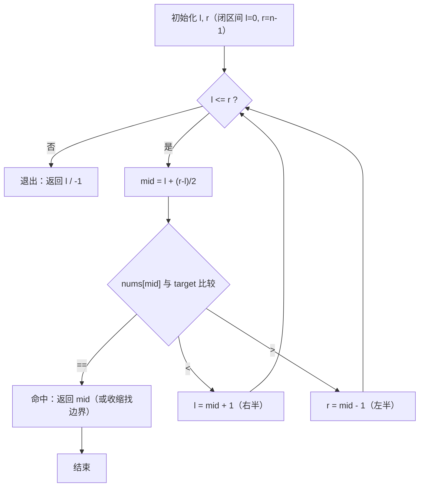
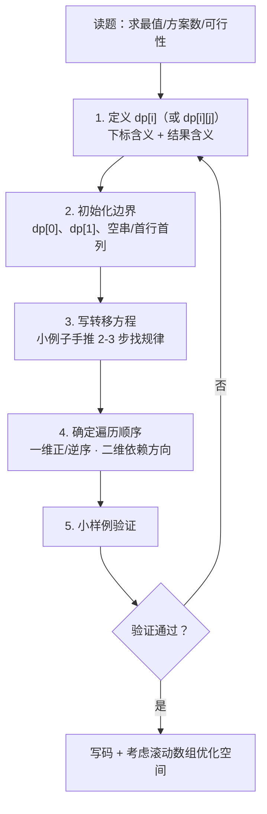

# 算法专项训练（Day 1-30）

> 本文是「路线专题」第一篇，对应 [30 天冲刺训练营计划全景](./index) 中的**算法专项训练主线**，贯穿全周期 30 天。
> 目标岗位：字节跳动剪映 CapCut **Agent 开发实习生（AI 剪辑）**（职位 ID：A80542，深圳/广州，日常实习）。
> 语言固定 **Go**：所有题目一律用 Go 手写，任何题目不得用其他语言"作弊"——面试官让手撕的也是 Go。

## 一、总体目标与路线图

### 1.1 训练营总体目标

| 维度 | 目标 |
|------|------|
| 题量覆盖 | 30 天完成 **104 道** LeetCode Hot 100 核心题（每日固定 3-4 道） |
| 核心标签 | 数组、哈希表、链表、双指针、滑动窗口、树、图论、回溯、贪心、二分、动态规划、栈与队列 |
| 手撕能力 | 高频模板（反转链表 / 滑动窗口 / 层序遍历 / 拓扑排序 / 回溯 / 二分 / 单调栈 / DP / 堆）**闭眼默写** |
| 面试目标 | 面试手撕流畅：2 分钟讲思路 → 15 分钟写码 → 3 分钟自查，20 分钟内搞定一道中等题 |
| 工程素养 | 每题附带复杂度分析（时间 + 空间），能回答"为什么是这个复杂度" |

### 1.2 四阶段路线图



### 1.3 每日固定节奏（雷打不动）

| 时段 | 内容 | 时长 |
|------|------|------|
| 早晨 | 复习错题本 + 默写 1 个模板（如反转链表、层序遍历） | 20 分钟 |
| 白天/晚上 | 完成当天 3-4 道题（第一遍独立做，卡 20 分钟就看题解） | 2-3 小时 |
| 收尾 | 模板化沉淀 + 错题本记录 + 费曼复述（用语音/文字把思路讲一遍） | 30 分钟 |

> **纪律铁律**：宁可每题吃透，不可一天刷 10 题走马观花。每道题必须能独立在白纸上（无 IDE 补全、无自动 import）写出来。

## 二、刷题方法论

### 2.1 五遍刷题法（核心方法论）

一道题不是"做一遍"就算完成，而是按下面五遍节奏反复过：


| 遍次 | 时间点 | 要求 | 产出 |
|------|--------|------|------|
| 第 1 遍 | 当天 | 先独立想 20 分钟，想不出看题解，**看懂后合上书自己写一遍** | 提交 AC |
| 第 2 遍 | 隔天 | 不看题解重写，卡住即记入错题本 | 错题本条目 |
| 第 3 遍 | 一周后 | 限时 25 分钟，重点检查边界条件（空输入、单元素、溢出） | 通过/再次记错题 |
| 第 4 遍 | 阶段末/考前 | 错题本全量重刷，同类题横向对比 | 总结出套路 |
| 第 5 遍 | 面试前 1-3 天 | 只默写模板代码 + 口头讲思路和复杂度 | 形成肌肉记忆 |

### 2.2 错题本模板（强烈建议用 Notion / 飞书表格）

| 日期 | 题号 | 题名 | 错误原因 | 正解思路（一句话） | 复刷结果 |
|------|------|------|----------|--------------------|----------|
| （填写） | 3 | 无重复字符的最长子串 | 忘了收缩窗口的时机 | 右指针扩展，遇重复就收缩左指针直到窗口合法 | 第 2 遍 AC / 第 3 遍 15 分钟 |
| （填写） | 146 | LRU 缓存 | 双向链表节点删除逻辑写错 | 哈希表定位 + 双向链表维护访问序，get/put 均 O(1) | … |

> **错误原因分类**（写具体，别写"不会"）：① 思路错误（没想对算法）② 边界漏判（空/单元素/溢出）③ 语法错误（Go 特有：map 零值、切片共享底层数组、range 值拷贝）④ 超时（复杂度不够优）⑤ 代码书写错误（笔误/下标越界）。

### 2.3 复杂度分析习惯（每题必答三问）

1. **时间复杂度**：最坏情况是多少？能否优化（如 O(n²) → O(n)）？
2. **空间复杂度**：额外开了多少空间？能否原地（in-place）？
3. **为什么**：例如"为什么滑动窗口是 O(n)？"——因为左右指针各最多移动 n 次。

> 面试中"先讲思路 → 再写代码 → 最后主动报复杂度"是最稳妥的节奏，本训练营所有阶段验收都按此标准。

### 2.4 每日做题流程：做题 → 看题解 → 模板化 → 复述



## 三、Day 1-7：基础数据结构（数组/哈希表、链表、双指针、滑动窗口）

> 本阶段目标：把 Go 最常用的四种"底层武器"练到肌肉记忆——slice/map 惯用法、链表指针操作、双指针、滑动窗口模板。

### 3.1 数组 / 哈希表：Go 语法要点与模板

**必须掌握的知识点：**

- **slice 底层结构**：`type slice struct { ptr unsafe.Pointer; len int; cap int }`，切片是"三字段头"（指针 + 长度 + 容量），作为函数参数是**值传递头、共享底层数组**。
- **make 与字面量**：`make([]int, 5)` 长度为 5、容量为 5；`make([]int, 0, 10)` 长度为 0、容量为 10（预分配避免扩容）。
- **append 扩容机制**（Go 1.18+）：旧容量 < 256 时**翻倍**；>= 256 时约 **1.25 倍**增长（`newcap += (newcap + 3*threshold)/4`），最终按内存分配大小向上取整。扩容必然**拷贝全部元素**（O(n)），所以高频 append 一定要预分配容量。
- **切片截取共享底层数组**：`s2 := s1[1:3]` 后改 `s2[0]` 会改到 `s1`；`append` 未扩容时同样共享，扩容后断开关联——这是 Go 刷题最常见的隐性 bug。
- **map 零值陷阱**：`var m map[string]int` 是 `nil`，**读**返回零值、**写**直接 panic（`assignment to entry in nil map`），必须先 `make`。
- **map 取值 ok 惯用法**：`v, ok := m[k]`，用 `ok` 判断 key 是否存在（值本身可能恰为零值，不能靠 `v != 0` 判断）。
- **range 遍历注意**：`for i, v := range nums` 中 `v` 是**副本**，修改 `v` 不影响原数组；要修改元素必须用下标 `nums[i] = ...`。range map 的遍历顺序**随机**，不可依赖。
- **map 并发不安全**：并发读写直接 `fatal error: concurrent map read and map write`，刷题单协程无所谓，但面试八股要会答（sync.Mutex / sync.Map）。

**模板一：make + append + 预分配**
```go
// 预分配容量避免扩容：已知结果大小 n 时用 make([]int, 0, n)
func build(n int) []int {
    res := make([]int, 0, n) // cap = n，append 全程不扩容，O(n) 而不是摊还
    for i := 0; i < n; i++ {
        res = append(res, i)
    }
    return res
}

// 直接按长度创建 + 下标赋值（更快，推荐）
func build2(n int) []int {
    res := make([]int, n)
    for i := 0; i < n; i++ {
        res[i] = i
    }
    return res
}
```

**模板二：map 计数 / 去重 / 查重三件套**
```go
// 计数：统计字符/元素出现次数
func count(nums []int) map[int]int {
    cnt := make(map[int]int)
    for _, v := range nums {
        cnt[v]++
    }
    return cnt
}

// 去重：map 当 set 用
func unique(nums []int) []int {
    seen := make(map[int]bool)
    res := make([]int, 0, len(nums))
    for _, v := range nums {
        if seen[v] {
            continue
        }
        seen[v] = true
        res = append(res, v)
    }
    return res
}

// 查重：一遍遍历查"补数"，两数之和的通用骨架
func findComplement(nums []int, target int) []int {
    idx := make(map[int]int) // 值 -> 下标
    for i, v := range nums {
        if j, ok := idx[target-v]; ok {
            return []int{j, i}
        }
        idx[v] = i
    }
    return nil
}
```

**复杂度速记**：数组随机访问 O(1)、插入/删除 O(n)；哈希表平均 O(1)（最坏 O(n)，Go 用链地址法 + 负载因子 > 6.5 翻倍扩容）。

### 3.2 链表：Go 语法要点与模板

**必须掌握的知识点：**

- **定义**：链表节点是**结构体 + 指针**，Go 无 class，指针字段默认为 `nil`（天然就是链表结尾，无需额外终止符）。
- **哑节点（dummy head）**：`dummy := &ListNode{Next: head}`，统一处理"头节点也要删除/头节点是答案"的情况，避免大量 if 特判——**链表题 80% 靠哑节点化简**。
- **指针操作顺序**：改链时先保存后继 `next := cur.Next`，防止断链后丢失。
- **快慢指针**：判环（快 2 步慢 1 步）、找中点（快到末尾时慢在中点）、找倒数第 N 个（快先走 N 步）。
- **递归反转**：理解"先递归反转后面的，再把当前节点接到新链表末尾"，注意 `head.Next.Next = head` 的含义。
- **nil 判空**：遍历条件统一 `for cur != nil`；递归出口 `head == nil || head.Next == nil`。

**模板：节点定义 + 哑节点 + 反转（迭代/递归）**
```go
// 节点定义（LeetCode 全局已有，本地练习需自写）
type ListNode struct {
    Val  int
    Next *ListNode
}

// 从数组建链表（本地调试用）
func buildList(nums []int) *ListNode {
    dummy := &ListNode{}
    cur := dummy
    for _, v := range nums {
        cur.Next = &ListNode{Val: v}
        cur = cur.Next
    }
    return dummy.Next
}

// 206 反转链表：迭代三指针（prev / cur / next）
func reverseList(head *ListNode) *ListNode {
    var prev *ListNode
    cur := head
    for cur != nil {
        next := cur.Next // ① 保存后继，防止断链
        cur.Next = prev  // ② 反转指针
        prev = cur       // ③ 三者后移
        cur = next
    }
    return prev
}

// 206 反转链表：递归写法（面试爱问"递归版怎么写"）
func reverseListRec(head *ListNode) *ListNode {
    if head == nil || head.Next == nil {
        return head
    }
    newHead := reverseListRec(head.Next)
    head.Next.Next = head // 把 head 接到新链表末尾
    head.Next = nil       // 断开旧指向
    return newHead
}
```

**模板：哑节点 + 删除节点 + 快慢指针**
```go
// 19 删除链表的倒数第 N 个结点：哑节点 + 快指针先走 N 步
func removeNthFromEnd(head *ListNode, n int) *ListNode {
    dummy := &ListNode{Next: head} // 哑节点：统一删除头节点的情况
    fast, slow := dummy, dummy
    for i := 0; i < n; i++ {
        fast = fast.Next // 快指针先走 n 步
    }
    for fast.Next != nil { // 快指针到末尾时，慢指针停在待删节点的前一个
        fast = fast.Next
        slow = slow.Next
    }
    slow.Next = slow.Next.Next // 删除目标节点
    return dummy.Next
}

// 141 环形链表：快慢指针，快走 2 慢走 1，相遇即有环
func hasCycle(head *ListNode) bool {
    slow, fast := head, head
    for fast != nil && fast.Next != nil {
        slow = slow.Next
        fast = fast.Next.Next
        if slow == fast {
            return true
        }
    }
    return false
}
```

**复杂度速记**：链表访问 O(n)、已知位置插入/删除 O(1)；反转链表时间 O(n) 空间 O(1)（迭代）/ O(n) 栈深（递归）。

### 3.3 双指针 / 滑动窗口：Go 通用模板

**必须掌握的知识点：**

- **双指针三兄弟**：① 左右指针（相向而行，如盛水容器、三数之和）② 快慢指针（同向而行，如移动零、环形链表）③ 滑动窗口（快慢指针变体，窗口内维护"满足条件"的连续区间）。
- **滑动窗口适用条件**：题目求**连续子数组/子串**的某个最值，且窗口收缩具有**单调性**（窗口变大条件变宽松/变严格），不满足单调性（如包含负数）时不能直接用。
- **窗口收缩时机**：求"最长"——不满足条件时收缩；求"最短"——满足条件时收缩（边收缩边记录）。
- **Go 字符串注意**：`s[i]` 取到的是 **byte**（ASCII）；涉及中文/emoji 要按 rune 处理（`[]rune(s)`）。

**模板：滑动窗口通用骨架（以 3 无重复字符的最长子串为例）**
```go
// 通用骨架：right 扩大窗口 → 不满足条件则收缩 left → 更新答案
func lengthOfLongestSubstring(s string) int {
    window := make(map[byte]int) // 窗口内字符 -> 出现次数
    left, right := 0, 0
    ans := 0
    for right < len(s) {
        c := s[right]
        window[c]++
        right++ // ① 扩大窗口
        for window[c] > 1 { // ② 收缩条件：窗口内有重复字符
            d := s[left]
            window[d]--
            left++ // ③ 缩小窗口（对应字符出窗）
        }
        if right-left > ans { // ④ 更新答案：当前窗口合法
            ans = right - left
        }
    }
    return ans
}

// 76 最小覆盖子串：need/have 计数法（"最短"题型：满足条件就收缩）
func minWindow(s string, t string) string {
    need := make(map[byte]int)
    for i := 0; i < len(t); i++ {
        need[t[i]]++
    }
    window := make(map[byte]int)
    left, right, have, needCnt := 0, 0, 0, len(need)
    start, minLen := 0, len(s)+1
    for right < len(s) {
        c := s[right]
        if need[c] > 0 {
            window[c]++
            if window[c] == need[c] {
                have++ // 某个字符凑齐了
            }
        }
        right++
        for have == needCnt { // 满足条件：收缩左边界找最短
            if right-left < minLen {
                minLen = right - left
                start = left
            }
            d := s[left]
            if need[d] > 0 {
                if window[d] == need[d] {
                    have--
                }
                window[d]--
            }
            left++
        }
    }
    if minLen == len(s)+1 {
        return ""
    }
    return s[start : start+minLen]
}
```

**模板：左右指针（相向双指针，以 11 盛最多水的容器为例）**
```go
// 11 盛最多水的容器：短板向内移动（向内移动长板只会更差）
func maxArea(height []int) int {
    left, right := 0, len(height)-1
    ans := 0
    for left < right {
        area := min(height[left], height[right]) * (right - left)
        ans = max(ans, area)
        if height[left] < height[right] {
            left++ // 移动较矮的一边，才有可能变大
        } else {
            right--
        }
    }
    return ans
}

// Go 1.21+ 内置 min/max；老版本需手写
func min(a, b int) int { if a < b { return a }; return b }
func max(a, b int) int { if a > b { return a }; return b }
```

**复杂度速记**：滑动窗口时间 O(n)（左右指针各移动 n 次）、空间 O(字符集大小)；相向双指针 O(n)。

### 3.4 每日题目分配（Day 1-7）

#### Day 1：数组 + 哈希表

| 题号 | 题名 | 难度 | 标签 | 核心思路（一句话） |
|------|------|------|------|--------------------|
| 1 | [两数之和](https://leetcode.cn/problems/two-sum/) | 简单 | 哈希表 | 一遍遍历，map 存"值→下标"，查 `target-v` 是否存在 |
| 49 | [字母异位词分组](https://leetcode.cn/problems/group-anagrams/) | 中等 | 哈希表 | 每个字符串排序后作为 key（或 26 字母计数序列作 key）分组 |
| 128 | [最长连续序列](https://leetcode.cn/problems/longest-consecutive-sequence/) | 中等 | 哈希集合 | 先去重，只从"起点"（`num-1` 不在集合中）向后数，O(n) |
| 41 | [缺失的第一个正数](https://leetcode.cn/problems/first-missing-positive/) | 困难 | 原地哈希 | 把 `nums[i]` 放到下标 `nums[i]-1` 处（值在 [1,n] 内才交换），再扫描找缺失 |

#### Day 2：哈希进阶（前缀和 + 滑动窗口）

| 题号 | 题名 | 难度 | 标签 | 核心思路（一句话） |
|------|------|------|------|--------------------|
| 283 | [移动零](https://leetcode.cn/problems/move-zeroes/) | 简单 | 双指针 | 快慢指针：快指针找非零，慢指针指向待覆盖位置 |
| 53 | [最大子数组和](https://leetcode.cn/problems/maximum-subarray/) | 中等 | DP/贪心 | `dp[i]=max(nums[i], dp[i-1]+nums[i])`，可滚动变量优化 O(1) 空间 |
| 238 | [除自身以外数组的乘积](https://leetcode.cn/problems/product-of-array-except-self/) | 中等 | 前缀积 | 先算左侧乘积数组，再从右往左乘右侧乘积，注意不能用除法 |
| 76 | [最小覆盖子串](https://leetcode.cn/problems/minimum-window-substring/) | 困难 | 滑动窗口 | need/have 计数法：满足条件就收缩，见 3.3 模板 |


#### Day 3：链表基础

| 题号 | 题名 | 难度 | 标签 | 核心思路（一句话） |
|------|------|------|------|--------------------|
| 206 | [反转链表](https://leetcode.cn/problems/reverse-linked-list/) | 简单 | 链表 | 迭代三指针 / 递归，两者都要能手写 |
| 21 | [合并两个有序链表](https://leetcode.cn/problems/merge-two-sorted-lists/) | 简单 | 链表 | 哑节点 + 双指针归并，谁小接谁 |
| 141 | [环形链表](https://leetcode.cn/problems/linked-list-cycle/) | 简单 | 快慢指针 | 快 2 慢 1，相遇即有环 |
| 2 | [两数相加](https://leetcode.cn/problems/add-two-numbers/) | 中等 | 链表 | 哑节点 + 逐位相加 + 进位，最后别忘了残余进位 |

#### Day 4：链表进阶

| 题号 | 题名 | 难度 | 标签 | 核心思路（一句话） |
|------|------|------|------|--------------------|
| 19 | [删除链表的倒数第 N 个结点](https://leetcode.cn/problems/remove-nth-node-from-end-of-list/) | 中等 | 链表 + 双指针 | 哑节点 + 快指针先走 N 步，再同步走到末尾 |
| 160 | [相交链表](https://leetcode.cn/problems/intersection-of-two-linked-lists/) | 简单 | 双指针 | 两个指针分别走完自己再走对方链，相遇点即交点（无交点则同到 nil） |
| 138 | [随机链表的复制](https://leetcode.cn/problems/copy-list-with-random-pointer/) | 中等 | 哈希表 | 第一遍建"旧→新"映射，第二遍补 next/random 指针 |
| 25 | [K 个一组翻转链表](https://leetcode.cn/problems/reverse-nodes-in-k-group/) | 困难 | 链表 + 递归 | 先找到第 K 个节点做下一组头，区间内迭代反转，递归连接 |

> **思路要点（25）**：`reverseKGroup` 递归：① 找到第 k 个节点 `b`（不足 k 个直接返回 head）；② 反转 `[head, b)` 区间（注意是左闭右开，反转后 `b` 就是下一组的头）；③ `head.Next = reverseKGroup(b, k)` 连接。核心是"先确定下一组边界，再反转当前组"。

#### Day 5：双指针入门

| 题号 | 题名 | 难度 | 标签 | 核心思路（一句话） |
|------|------|------|------|--------------------|
| 11 | [盛最多水的容器](https://leetcode.cn/problems/container-with-most-water/) | 中等 | 左右指针 | 短板向内移动，O(n) |
| 15 | [三数之和](https://leetcode.cn/problems/3sum/) | 中等 | 排序 + 双指针 | 排序后固定第一个数，后两个数双指针收缩，注意跳过重复元素 |
| 234 | [回文链表](https://leetcode.cn/problems/palindrome-linked-list/) | 简单 | 快慢指针 | 快慢指针找中点 + 反转后半段 + 逐一比较 |
| 42 | [接雨水](https://leetcode.cn/problems/trapping-rain-water/) | 困难 | 双指针/单调栈 | 每根柱子能接的水 = min(左边最高, 右边最高) - 自身高度 |

> **思路要点（42 双指针版）**：左右各维护一个"已见最大高度" `leftMax`/`rightMax`。哪边最大高度小，就处理哪边的柱子（因为它的接水量由较矮的一侧决定）：`leftMax < rightMax` 时 `ans += leftMax - height[left]`，然后左移；反之处理右边。O(n) 时间、O(1) 空间。单调栈版是"按行接水"，遇到右边界高于栈顶时弹栈结算，也要掌握。

#### Day 6：滑动窗口进阶

| 题号 | 题名 | 难度 | 标签 | 核心思路（一句话） |
|------|------|------|------|--------------------|
| 3 | [无重复字符的最长子串](https://leetcode.cn/problems/longest-substring-without-repeating-characters/) | 中等 | 滑动窗口 | map 计数，遇重复收缩 left，见 3.3 模板 |
| 438 | [找到字符串中所有字母异位词](https://leetcode.cn/problems/find-all-anagrams-in-a-string/) | 中等 | 固定窗口 | 窗口长度固定为 len(p)，26 字母计数数组比较即可 |
| 239 | [滑动窗口最大值](https://leetcode.cn/problems/sliding-window-maximum/) | 困难 | 单调队列 | 单调递减双端队列存下标，队首即当前窗口最大值 |
| 560 | [和为 K 的子数组](https://leetcode.cn/problems/subarray-sum-equals-k/) | 中等 | 前缀和 + 哈希 | `pre[j]-pre[i-1]==k`，map 记录前缀和出现次数，一边累加一边查 |

> **思路要点（560）**：前缀和数组 `pre[i]` 表示前 i 个元素之和，则子数组 `(j,i]` 的和为 `pre[i]-pre[j]`。要求等于 k，即找 `pre[j] == pre[i]-k` 出现过多少次——所以一边遍历一边把前缀和塞进 map 计数。注意先查 map 再更新 map（避免把当前前缀和算进去）。

> **思路要点（239）**：用 Go 的 slice 手写双端队列（`deque := []int{}` 存下标），维护**队首到队尾单调递减**：新元素入队前，先把队尾所有小于它的元素弹出（它们永远不可能成为窗口最大值）；窗口滑出时，若队首下标 == left 则弹出队首。每次窗口队首就是最大值，总复杂度 O(n)。

#### Day 7：链表综合 + 哈希（本周收官，重点）

| 题号 | 题名 | 难度 | 标签 | 核心思路（一句话） |
|------|------|------|------|--------------------|
| 146 | [LRU 缓存](https://leetcode.cn/problems/lru-cache/) | 中等 | 哈希 + 双向链表 | get/put 均 O(1)：map 定位节点，双向链表维护访问顺序 |
| 148 | [排序链表](https://leetcode.cn/problems/sort-list/) | 中等 | 归并排序 | 快慢指针找中点拆分，递归归并，O(n log n) |
| 23 | [合并 K 个升序链表](https://leetcode.cn/problems/merge-k-sorted-lists/) | 困难 | 优先队列 | 小顶堆存各链表头，每次弹出最小并续接，O(n log k) |
| 75 | [颜色分类](https://leetcode.cn/problems/sort-colors/) | 中等 | 三指针 | 荷兰国旗问题：0 放左、2 放右、1 中间，一遍遍历 |

> **思路要点（146 LRU，面试超高频，必须能手写）**：
> - 数据结构：`map[int]*Node` + 双向链表（带 dummy head 和 dummy tail，**哨兵节点**避免头尾特判）。
> - get：map 命中 → 把节点移到链表头部 → 返回；未命中返回 -1。
> - put：key 存在则更新值并移到头部；不存在则新建节点插头部，若超容量则删除**尾部节点**（最久未使用）并同步删 map。
> - 双向链表节点要同时存 key 和 val（删除尾部时需要通过节点的 key 删 map）。
> - Go 实现注意：节点用 `*Node` 指针，`prev`/`next` 操作时先改新节点的 prev/next 再改邻居的指针，顺序错会丢链。

### 3.5 阶段验收标准（Day 1-7 结束时自测）

- [ ] **10 分钟内**默写：反转链表（迭代 + 递归）、滑动窗口通用模板、LRU 缓存完整实现。
- [ ] 20 分钟内独立 AC：从 Day1-7 中随机抽 4 道（含 1 道 42/76/239 级别的题）。
- [ ] 能口头回答：slice 扩容规则、map 零值行为、为什么 `range` 里改 `v` 无效、哑节点解决了什么问题。
- [ ] 错题本已建立，至少 10 条记录，每条含"错误原因"分类。

## 四、Day 8-14：树与图论（二叉树遍历、BST、拓扑排序）

> 本阶段目标：树题是面试手撕的"主战场"，要求递归/迭代两套写法都熟；图论重点掌握 DFS/BFS 模板与拓扑排序。

### 4.1 Go 树模板

**必须掌握的知识点：**

- **节点定义**：`TreeNode` 结构体（Val + Left + Right），nil 即空树。
- **递归三序**：前序（根左右）、中序（左根右）、后序（左右根）——递归写法只需调整 append 的位置，必须闭眼能写。
- **迭代遍历**：用显式栈模拟递归，中序迭代是"一路向左压栈 → 弹出访问 → 转向右"三步曲；前序迭代可以"先右后左压栈"（后进先出）。
- **层序遍历**：队列（Go 用 slice 模拟），**每层先记 size** 再一次性出队，是层序变体题（右视图、锯齿遍历、最大宽度）的基础。
- **BST 性质**：左子树所有节点 < 根 < 右子树所有节点；**中序遍历结果是升序序列**——验证 BST、找第 K 小都靠它。
- **Go 细节**：递归闭包需先声明再赋值（`var dfs func(...)` 再 `dfs = func(...)`），否则函数体内无法自引用；层序队列出队用 `queue = queue[1:]`（头部弹出），注意这会产生底层数组复制开销，追求性能可用下标指针。

**模板一：节点定义 + 递归三序**
```go
type TreeNode struct {
    Val   int
    Left  *TreeNode
    Right *TreeNode
}

func preorder(root *TreeNode, res *[]int) { // 前序：根左右
    if root == nil {
        return
    }
    *res = append(*res, root.Val)
    preorder(root.Left, res)
    preorder(root.Right, res)
}

func inorder(root *TreeNode, res *[]int) { // 中序：左根右
    if root == nil {
        return
    }
    inorder(root.Left, res)
    *res = append(*res, root.Val)
    inorder(root.Right, res)
}

func postorder(root *TreeNode, res *[]int) { // 后序：左右根
    if root == nil {
        return
    }
    postorder(root.Left, res)
    postorder(root.Right, res)
    *res = append(*res, root.Val)
}
```

**模板二：中序迭代（显式栈，面试高频手撕）**
```go
func inorderTraversal(root *TreeNode) []int {
    res := make([]int, 0)
    stack := make([]*TreeNode, 0)
    cur := root
    for cur != nil || len(stack) > 0 {
        for cur != nil {          // ① 一路向左压栈
            stack = append(stack, cur)
            cur = cur.Left
        }
        cur = stack[len(stack)-1] // ② 弹出访问
        stack = stack[:len(stack)-1]
        res = append(res, cur.Val)
        cur = cur.Right           // ③ 转向右子树
    }
    return res
}
```

**模板三：层序遍历（BFS 队列）**
```go
func levelOrder(root *TreeNode) [][]int {
    res := make([][]int, 0)
    if root == nil {
        return res
    }
    queue := []*TreeNode{root}
    for len(queue) > 0 {
        size := len(queue) // 关键：先记本层大小
        level := make([]int, 0, size)
        for i := 0; i < size; i++ {
            node := queue[0]
            queue = queue[1:] // 出队
            level = append(level, node.Val)
            if node.Left != nil {
                queue = append(queue, node.Left)
            }
            if node.Right != nil {
                queue = append(queue, node.Right)
            }
        }
        res = append(res, level)
    }
    return res
}
```

**模板四：BST 验证（中序升序 or 上下界递归，二选一必会）**
```go
// 98 验证二叉搜索树：中序遍历严格递增
func isValidBST(root *TreeNode) bool {
    var prev *int // nil 表示还没有前驱
    var dfs func(node *TreeNode) bool
    dfs = func(node *TreeNode) bool {
        if node == nil {
            return true
        }
        if !dfs(node.Left) {
            return false
        }
        if prev != nil && node.Val <= *prev {
            return false // 必须严格递增
        }
        prev = &node.Val
        return dfs(node.Right)
    }
    return dfs(root)
}
```

**复杂度速记**：三序/层序遍历时间 O(n)、空间 O(n)（递归栈深/队列宽）；BST 查找/插入 O(h)（h 为树高，平衡时为 O(log n)，退化为链表时 O(n)）。

### 4.2 图遍历与拓扑排序模板

**必须掌握的知识点：**

- **图的两种存法**：邻接矩阵（稠密图）、邻接表 `[][]int`（稀疏图，Go 刷题默认选它）。
- **DFS（递归 + 标记）**：注意先标记再递归（防死循环）；网格题用**方向数组** `dirs := [4][2]int{ {-1,0}, {1,0}, {0,-1}, {0,1} }`（完整模板见下方「模板一」）。
- **BFS（队列 + 分层）**：适合求最短步数、多源扩散（腐烂橘子、01 矩阵）。
- **拓扑排序（Kahn 算法）**：入度表 + 队列，处理"先修课/依赖顺序"问题，**能判断有向图是否有环**（出队数 == 节点数则无环）。
- **环检测替代法**：DFS 三色标记（0 未访问 / 1 访问中 / 2 已完成），访问中遇到访问中即有环。

**模板一：网格 DFS（200 岛屿数量，沉没法）**
```go
func numIslands(grid [][]byte) int {
    dirs := [4][2]int{{-1, 0}, {1, 0}, {0, -1}, {0, 1}}
    m, n := len(grid), len(grid[0])
    var dfs func(i, j int)
    dfs = func(i, j int) {
        if i < 0 || i >= m || j < 0 || j >= n || grid[i][j] != '1' {
            return
        }
        grid[i][j] = '0' // 沉没：标记已访问（原地标记，省 visited 数组）
        for _, d := range dirs {
            dfs(i+d[0], j+d[1])
        }
    }
    ans := 0
    for i := 0; i < m; i++ {
        for j := 0; j < n; j++ {
            if grid[i][j] == '1' {
                ans++
                dfs(i, j)
            }
        }
    }
    return ans
}
```

**模板二：拓扑排序 Kahn（207 课程表）**
```go
func canFinish(numCourses int, prerequisites [][]int) bool {
    indegree := make([]int, numCourses)
    graph := make([][]int, numCourses) // 邻接表：graph[先修课] = 后继课程列表
    for _, p := range prerequisites {
        a, b := p[0], p[1] // b 是 a 的先修课：b -> a
        graph[b] = append(graph[b], a)
        indegree[a]++
    }
    queue := make([]int, 0)
    for i := 0; i < numCourses; i++ {
        if indegree[i] == 0 {
            queue = append(queue, i) // 入度为 0 的节点先入队
        }
    }
    cnt := 0
    for len(queue) > 0 {
        u := queue[0]
        queue = queue[1:]
        cnt++
        for _, v := range graph[u] {
            indegree[v]--
            if indegree[v] == 0 {
                queue = append(queue, v)
            }
        }
    }
    return cnt == numCourses // 全部出队 => 无环 => 可以学完
}
```

### 4.3 每日题目分配（Day 8-14）

#### Day 8：遍历与递归

| 题号 | 题名 | 难度 | 标签 | 核心思路（一句话） |
|------|------|------|------|--------------------|
| 94 | [二叉树的中序遍历](https://leetcode.cn/problems/binary-tree-inorder-traversal/) | 简单 | 遍历 | 递归/迭代都要会，迭代见 4.1 模板二 |
| 144 | [二叉树的前序遍历](https://leetcode.cn/problems/binary-tree-preorder-traversal/) | 简单 | 遍历 | 根左右；迭代可用"先右后左压栈" |
| 104 | [二叉树的最大深度](https://leetcode.cn/problems/maximum-depth-of-binary-tree/) | 简单 | 递归 | `max(左深, 右深) + 1` |
| 102 | [二叉树的层序遍历](https://leetcode.cn/problems/binary-tree-level-order-traversal/) | 中等 | BFS | 队列 + 每层记 size，见 4.1 模板三 |

#### Day 9：递归进阶

| 题号 | 题名 | 难度 | 标签 | 核心思路（一句话） |
|------|------|------|------|--------------------|
| 101 | [对称二叉树](https://leetcode.cn/problems/symmetric-tree/) | 简单 | 递归 | 比较 `left.Left` 与 `right.Right`、`left.Right` 与 `right.Left` 是否镜像相等 |
| 543 | [二叉树的直径](https://leetcode.cn/problems/diameter-of-binary-tree/) | 简单 | 后序 | 每个节点求左右深度之和，全局取最大 |
| 199 | [二叉树的右视图](https://leetcode.cn/problems/binary-tree-right-side-view/) | 中等 | BFS | 层序遍历取每层最后一个节点 |
| 226 | [翻转二叉树](https://leetcode.cn/problems/invert-binary-tree/) | 简单 | 递归 | 交换左右孩子后递归，Homebrew 作者面试题 |

#### Day 10：BST 专题

| 题号 | 题名 | 难度 | 标签 | 核心思路（一句话） |
|------|------|------|------|--------------------|
| 98 | [验证二叉搜索树](https://leetcode.cn/problems/validate-binary-search-tree/) | 中等 | BST | 中序严格递增 / 递归传上下界，见 4.1 模板四 |
| 230 | [二叉搜索树中第 K 小的元素](https://leetcode.cn/problems/kth-smallest-element-in-a-bst/) | 中等 | BST | 中序遍历第 K 个节点 |
| 108 | [将有序数组转换为二叉搜索树](https://leetcode.cn/problems/convert-sorted-array-to-binary-search-tree/) | 简单 | BST + 递归 | 每次取中点作根，递归建左右子树（高度平衡） |
| 114 | [二叉树展开为链表](https://leetcode.cn/problems/flatten-binary-tree-to-linked-list/) | 中等 | 前序/前驱 | 先序遍历顺序改造：左子树的最右节点接到右子树前 |

#### Day 11：构造与路径

| 题号 | 题名 | 难度 | 标签 | 核心思路（一句话） |
|------|------|------|------|--------------------|
| 105 | [从前序与中序遍历序列构造二叉树](https://leetcode.cn/problems/construct-binary-tree-from-preorder-and-inorder-traversal/) | 中等 | 递归 + 哈希 | 前序第一个是根，中序按根切分左右，哈希表加速定位根 |
| 437 | [路径总和 III](https://leetcode.cn/problems/path-sum-iii/) | 中等 | 前缀和 + 回溯 | 树上前缀和：`当前前缀和 - target` 出现的次数累加，回溯时撤销 |
| 236 | [二叉树的最近公共祖先](https://leetcode.cn/problems/lowest-common-ancestor-of-a-binary-tree/) | 中等 | 递归 | 后序：左右子树分别找，两边都有则当前节点是 LCA |
| 124 | [二叉树中的最大路径和](https://leetcode.cn/problems/binary-tree-maximum-path-sum/) | 困难 | 后序 + DP | 返回单边最大贡献，全局记录"过当前节点的最大路径和"（可拐弯） |

> **思路要点（124）**：后序遍历中，对每个节点计算"以它为拐点的最大路径和" = `node.Val + max(左贡献, 0) + max(右贡献, 0)`（贡献为负就丢弃，取 0），全局取 max；向上返回时只能返回**单边**最大贡献 `node.Val + max(左, 右, 0)`——因为路径不能同时走两个方向向上延伸。这是"树形 DP"的经典入门题。

#### Day 12：图入门

| 题号 | 题名 | 难度 | 标签 | 核心思路（一句话） |
|------|------|------|------|--------------------|
| 200 | [岛屿数量](https://leetcode.cn/problems/number-of-islands/) | 中等 | 图 DFS | 沉没法，见 4.2 模板一 |
| 994 | [腐烂的橘子](https://leetcode.cn/problems/rotting-oranges/) | 中等 | 多源 BFS | 先把所有烂橘子入队，按分钟分层扩散，最后检查是否还有好橘子 |
| 207 | [课程表](https://leetcode.cn/problems/course-schedule/) | 中等 | 拓扑排序 | Kahn 算法判环，见 4.2 模板二 |
| 208 | [实现 Trie 前缀树](https://leetcode.cn/problems/implement-trie-prefix-tree/) | 中等 | 字典树 | 每个节点 26 个子节点数组（或 map）+ isEnd 标记 |

#### Day 13：树综合补强（补充安排）

| 题号 | 题名 | 难度 | 标签 | 核心思路（一句话） |
|------|------|------|------|--------------------|
| 110 | [平衡二叉树](https://leetcode.cn/problems/balanced-binary-tree/) | 简单 | 后序 | 后序求高度，任一节点左右高度差 > 1 即不平衡（-1 哨兵） |
| 235 | [二叉搜索树的最近公共祖先](https://leetcode.cn/problems/lowest-common-ancestor-of-a-binary-search-tree/) | 中等 | BST | 利用 BST 性质：两节点都小于 root 走左，都大于走右，否则 root 即 LCA |
| 572 | [另一棵树的子树](https://leetcode.cn/problems/subtree-of-another-tree/) | 简单 | 递归 | 对每个节点判断 isSameTree（先判断根，再递归左右） |
| 662 | [二叉树最大宽度](https://leetcode.cn/problems/maximum-width-of-binary-tree/) | 中等 | 层序 + 编号 | 层序遍历给节点编号 2i、2i+1，每层最右编号减最左编号 + 1 |

#### Day 14：图论综合 + 阶段自测（补充安排）

| 题号 | 题名 | 难度 | 标签 | 核心思路（一句话） |
|------|------|------|------|--------------------|
| 130 | [被围绕的区域](https://leetcode.cn/problems/surrounded-regions/) | 中等 | 边界 DFS | 从四条边界的 O 出发 DFS 标记，剩下未标记的 O 全部翻成 X |
| 542 | [01 矩阵](https://leetcode.cn/problems/01-matrix/) | 中等 | 多源 BFS | 所有 0 入队做多源 BFS，逐层扩散填充距离 |
| 695 | [岛屿的最大面积](https://leetcode.cn/problems/max-area-of-island/) | 中等 | DFS | 沉没法变体，DFS 返回值即面积，全局取 max |

- **阶段自测**：从 Day 8-13 题目中随机抽 3 道，限时 20 分钟/题；另加 10 分钟默写"中序迭代 + 层序 + 拓扑排序"三个模板。

### 4.4 八股文要点（树与图）

- **递归 vs 迭代**：递归代码简洁、符合思维，但每层调用都要压栈（栈深 = 树高），树退化成链表时递归会**栈溢出**；迭代用显式栈/队列，空间可控，但不直观。面试答法：功能等价，递归靠系统栈、迭代自己管理栈，实际工程中深树优先迭代。
- **树题时间复杂度怎么算**：遍历类每节点访问一次 → O(n)；带路径/回溯的题看每条路径 → O(n²) 甚至指数；平衡树操作 → O(log n)。回答套路："每层的工作量 × 层数"或"每个节点访问次数 × 单次成本"。
- **为什么 BST 中序遍历有序**：BST 定义保证"左 < 根 < 右"，中序的顺序是"左子树 → 根 → 右子树"，对任意节点递归成立，故整体严格升序。
- **拓扑排序的应用场景**：编译依赖、课程先修、任务调度、检测循环依赖（如 Go 模块依赖图、CI 流水线 DAG）。
- **DFS vs BFS 怎么选**：求"路径/连通性/所有解"用 DFS（配合回溯）；求"最短步数/最小层数/最近"用 BFS（层数即距离）；网格题中两者都常用，BFS 空间可能更大（队列存一层）。

### 4.5 阶段验收标准（Day 8-14 结束时自测）

- [ ] **10 分钟内默写**：中序迭代、层序遍历（带 size 技巧）、Kahn 拓扑排序。
- [ ] 20 分钟内独立 AC：随机抽 4 道（含 1 道 105/124/208 级别）。
- [ ] 能口头回答：递归与迭代区别、树题复杂度分析套路、BST 中序有序的原因、拓扑排序判环原理。

## 五、Day 15-21：核心算法思想（回溯、贪心、二分查找）

> 本阶段目标：三大"算法思想"是中等题的主力，回溯模板 + 二分模板必须做到肌肉记忆，贪心要能讲清"为什么这样贪是对的"。

### 5.1 回溯：选择 → 递归 → 撤销

**必须掌握的知识点：**

- **回溯 = DFS + 状态撤销**：所有"求所有组合/排列/子集/路径/棋盘"题都是回溯。
- **三个要素**：① 路径（已做的选择）② 选择列表（还能选什么）③ 结束条件（何时记录答案）。
- **两种去重手段**：`used []bool`（排列题：同一元素不重复用）与 `startIndex`（组合/子集题：从 `i+1` 开始避免回头重复）。
- **Go 最大坑点：结果拷贝**——`append(result, path)` 存的是**引用**，path 后续被修改会污染结果，必须 `copy` 到新切片再存！
- **剪枝**：在 for 循环内提前 `continue` 跳过不可能的分支（如组合总和：已超 target 就跳过），剪枝是回溯题能否 AC 的关键。
- **切片 append 注意**：`path = append(path, v)` 若容量不够会**扩容换底层数组**，此时之前的引用拷贝不受影响，但最好始终用"拷贝后再存结果"的写法。

**模板一：排列（used 数组）—— 46 全排列**
```go
var res [][]int

func permute(nums []int) [][]int {
    res = nil
    used := make([]bool, len(nums))
    backtrack(nums, used, []int{})
    return res
}

func backtrack(nums []int, used []bool, path []int) {
    if len(path) == len(nums) { // 结束条件：选满了
        tmp := make([]int, len(path))
        copy(tmp, path) // 必须拷贝！path 是共享引用
        res = append(res, tmp)
        return
    }
    for i := 0; i < len(nums); i++ {
        if used[i] {
            continue
        }
        // 做选择
        used[i] = true
        path = append(path, nums[i])
        // 递归
        backtrack(nums, used, path)
        // 撤销选择
        used[i] = false
        path = path[:len(path)-1]
    }
}
```

**模板二：组合/子集（startIndex）—— 78 子集**
```go
var subsetsRes [][]int

func subsets(nums []int) [][]int {
    subsetsRes = nil
    backtrackSub(nums, 0, []int{})
    return subsetsRes
}

func backtrackSub(nums []int, start int, path []int) {
    tmp := make([]int, len(path))
    copy(tmp, path)
    subsetsRes = append(subsetsRes, tmp) // 每个节点都记录（子集题）
    for i := start; i < len(nums); i++ {
        path = append(path, nums[i])
        backtrackSub(nums, i+1, path) // 从 i+1 开始：保证组合不回头、不重复
        path = path[:len(path)-1]
    }
}
```

**回溯通用流程图：**



### 5.2 贪心：局部最优 → 全局最优

**必须掌握的知识点：**

- **贪心的本质**：每一步都选当前看起来最优的，期望局部最优累积成全局最优——**需要证明**（或至少能说服自己）：反证法/交换论证是常见证明手段。
- **与 DP 的区别（高频八股）**：贪心是"当前决策不依赖未来的选择"，一旦做出不再回头；DP 是"当前决策依赖子问题的最优解"，需要枚举所有状态。判据：**能否证明"短视选择不会错过全局最优"**，能则贪心，不能则 DP。
- **常见套路**：区间类（按端点排序后贪心合并/计数，如 452、763）；跳跃类（维护最远可达边界，如 55/45）；分配类（排序 + 局部最优，如 135 两遍扫描、406 先排序再插入）；"买卖股票"类（维护历史最低价，如 121）。
- **验证手法**：先写暴力/小样例手推，确认贪心策略在反例上不翻车，再上代码。

**模板：跳跃游戏（55，最远可达边界）**
```go
func canJump(nums []int) bool {
    maxReach := 0 // 当前能跳到的最远下标
    for i := 0; i <= maxReach && i < len(nums); i++ {
        if i+nums[i] > maxReach {
            maxReach = i + nums[i] // 贪心：能跳多远跳多远
        }
        if maxReach >= len(nums)-1 {
            return true
        }
    }
    return false
}
```

### 5.3 二分查找：模板与开闭区间

**必须掌握的知识点：**

- **二分适用条件**：**单调性**（数组有序，或答案值域有单调可判定性）。数据规模 10⁵+ 且要 O(log n) 时优先想到二分。
- **闭区间 [l, r] 模板**：`for l <= r`，`l = mid+1` / `r = mid-1`，退出时 `l` 是第一个不满足条件的位置。
- **开区间 [l, r) 模板**：`for l < r`，`mid := l + (r-l)/2`，`l = mid+1` 或 `r = mid`——注意死循环风险（mid 取左中位时配合 `l = mid+1`）。
- **防溢出**：`mid := l + (r-l)/2`，不要写 `(l+r)/2`。
- **二分答案**：当"直接搜数组"不行但"给定一个答案 x 能否满足（check(x) 单调）"时可以二分答案——典型如 875 爱吃香蕉的珂珂、410 分割数组的最大值。
- **四种变形**：找精确值 / 找第一个 >= target（下界）/ 找最后一个 <= target（上界）/ 找旋转数组中的极值。

**模板一：闭区间标准二分（35 搜索插入位置）**
```go
func searchInsert(nums []int, target int) int {
    l, r := 0, len(nums)-1
    for l <= r {
        mid := l + (r-l)/2 // 防溢出
        if nums[mid] < target {
            l = mid + 1
        } else {
            r = mid - 1
        }
    }
    return l // 插入位置：第一个 >= target 的下标
}
```

**模板二：找左右边界（34，两次二分）**
```go
func searchRange(nums []int, target int) []int {
    if len(nums) == 0 {
        return []int{-1, -1}
    }
    // 左边界：第一个 >= target
    l, r := 0, len(nums)-1
    for l <= r {
        mid := l + (r-l)/2
        if nums[mid] < target {
            l = mid + 1
        } else {
            r = mid - 1
        }
    }
    left := l
    // 右边界：最后一个 <= target
    l, r = 0, len(nums)-1
    for l <= r {
        mid := l + (r-l)/2
        if nums[mid] <= target {
            l = mid + 1
        } else {
            r = mid - 1
        }
    }
    right := r
    if left > right || left >= len(nums) || nums[left] != target {
        return []int{-1, -1}
    }
    return []int{left, right}
}
```

**二分流程图：**



### 5.4 每日题目分配（Day 15-21）

#### Day 15：回溯入门

| 题号 | 题名 | 难度 | 标签 | 核心思路（一句话） |
|------|------|------|------|--------------------|
| 46 | [全排列](https://leetcode.cn/problems/permutations/) | 中等 | 回溯 | used 数组去重，见 5.1 模板一 |
| 78 | [子集](https://leetcode.cn/problems/subsets/) | 中等 | 回溯 | startIndex，每个节点都记录，见 5.1 模板二 |
| 17 | [电话号码的字母组合](https://leetcode.cn/problems/letter-combinations-of-a-phone-number/) | 中等 | 回溯 | 数字→字母映射表，index 参数逐位选择 |
| 39 | [组合总和](https://leetcode.cn/problems/combination-sum/) | 中等 | 回溯 | startIndex 但**可以重复选同一元素**（递归传 i 而不是 i+1），和超了剪枝 |

#### Day 16：回溯进阶

| 题号 | 题名 | 难度 | 标签 | 核心思路（一句话） |
|------|------|------|------|--------------------|
| 22 | [括号生成](https://leetcode.cn/problems/generate-parentheses/) | 中等 | 回溯 + 剪枝 | 左右括号计数：右括号数 > 左括号数即剪枝，长度 2n 时记录 |
| 79 | [单词搜索](https://leetcode.cn/problems/word-search/) | 中等 | 网格回溯 | DFS + 方向数组，访问过的格子标记后撤销，注意回溯恢复 |
| 131 | [分割回文串](https://leetcode.cn/problems/palindrome-partitioning/) | 中等 | 回溯 | startIndex 切分，`isPalindrome` 判断后继续递归后半段 |
| 51 | [N 皇后](https://leetcode.cn/problems/n-queens/) | 困难 | 回溯 | 按行放皇后，列/主对角（row-col）/副对角（row+col）三个集合判冲突 |

#### Day 17：贪心入门

| 题号 | 题名 | 难度 | 标签 | 核心思路（一句话） |
|------|------|------|------|--------------------|
| 55 | [跳跃游戏](https://leetcode.cn/problems/jump-game/) | 中等 | 贪心 | 维护最远可达边界，见 5.2 模板 |
| 45 | [跳跃游戏 II](https://leetcode.cn/problems/jump-game-ii/) | 中等 | 贪心 | BFS 分层思想：维护"当前边界"与"下一跳最远"，跨过边界步数 +1 |
| 763 | [划分字母区间](https://leetcode.cn/problems/partition-labels/) | 中等 | 贪心 | 先记录每个字母最后出现位置，扫描时扩展区间右端 |
| 121 | [买卖股票的最佳时机](https://leetcode.cn/problems/best-time-to-buy-and-sell-stock/) | 简单 | 贪心 | 遍历中维护历史最低价，`max(profit, price-minPrice)` |

#### Day 18：贪心进阶

| 题号 | 题名 | 难度 | 标签 | 核心思路（一句话） |
|------|------|------|------|--------------------|
| 135 | [分发糖果](https://leetcode.cn/problems/candy/) | 困难 | 贪心 | 两遍扫描：左到右保证"右大左小"，右到左保证"左大右小"，取 max |
| 134 | [加油站](https://leetcode.cn/problems/gas-station/) | 中等 | 贪心 | 总油 < 总耗必无解；从"累计净油最小点的下一个站"出发必有解 |
| 406 | [根据身高重建队列](https://leetcode.cn/problems/queue-reconstruction-by-height/) | 中等 | 排序 + 插入 | 按身高降序、k 升序排序，再按 k 依次插入（高个子先排，低个子插前面不影响） |
| 452 | [用最少数量的箭引爆气球](https://leetcode.cn/problems/minimum-number-of-arrows-to-burst-balloons/) | 中等 | 区间贪心 | 按右端点排序，重叠区间共享一箭，不重叠就新射一箭 |

#### Day 19：二分入门

| 题号 | 题名 | 难度 | 标签 | 核心思路（一句话） |
|------|------|------|------|--------------------|
| 33 | [搜索旋转排序数组](https://leetcode.cn/problems/search-in-rotated-sorted-array/) | 中等 | 二分 | 先判断 mid 落在"左升序段"还是"右升序段"，再决定去哪边找 |
| 34 | [在排序数组中查找元素的第一个和最后一个位置](https://leetcode.cn/problems/find-first-and-last-position-of-element-in-sorted-array/) | 中等 | 二分边界 | 两次二分找左右边界，见 5.3 模板二 |
| 35 | [搜索插入位置](https://leetcode.cn/problems/search-insert-position/) | 简单 | 二分 | 标准闭区间模板，返回 l，见 5.3 模板一 |
| 153 | [寻找旋转排序数组中的最小值](https://leetcode.cn/problems/find-minimum-in-rotated-sorted-array/) | 中等 | 二分 | 与 `nums[r]` 比较：`nums[mid] > nums[r]` 说明最小在右半，否则在左半 |

#### Day 20：二分进阶

| 题号 | 题名 | 难度 | 标签 | 核心思路（一句话） |
|------|------|------|------|--------------------|
| 74 | [搜索二维矩阵](https://leetcode.cn/problems/search-a-2d-matrix/) | 中等 | 二分 | 把 m×n 矩阵映射成一维下标 `mid/n, mid%n` 二分 |
| 162 | [寻找峰值](https://leetcode.cn/problems/find-peak-element/) | 中等 | 二分 | 比较 `nums[mid]` 与 `nums[mid+1]`：上升则峰值在右，下降则在左（含边界负无穷） |
| 4 | [寻找两个正序数组的中位数](https://leetcode.cn/problems/median-of-two-sorted-arrays/) | 困难 | 二分（困难） | 二分较短的数组找划分点，使左半最大值 <= 右半最小值 |

> **思路要点（4，Hot 100 压轴二分题）**：在**较短的数组**上二分划分点 `i`，另一个数组划分点 `j = (m+n+1)/2 - i`。满足 `nums1[i-1] <= nums2[j]` 且 `nums2[j-1] <= nums1[i]` 即找到正确划分；左半最大值与右半最小值拼出中位数（奇数取左半最大，偶数取两者平均）。所有下标计算必须小心越界（用 -∞/+∞ 哨兵）。

#### Day 21：阶段性综合自测

- 从 Day 15-20 的题目中**随机抽 4 道**（含 1 道回溯、1 道贪心、1 道二分、1 道混合），**每道限时 20 分钟**。
- 流程：先讲思路 2 分钟 → 编码 15 分钟 → 自查 3 分钟；每题记录耗时与卡点。
- 附加：默写回溯通用模板 + 二分闭区间模板（10 分钟）。

### 5.5 阶段验收标准（Day 15-21 结束时自测）

- [ ] **10 分钟内默写**：回溯模板（used 与 startIndex 两种变体）、二分模板（闭区间 + 边界查找）。
- [ ] 能**口头讲清楚贪心与 DP 的区别**，并举出 55（贪心）与 53（DP）各自为什么不能用对方。
- [ ] 20 分钟内独立 AC：随机抽 4 道，含 1 道 51 N 皇后 / 4 中位数级别。
- [ ] 能说出回溯去重的两种手段分别解决什么问题。

## 六、Day 22-30：高阶冲刺与模拟（动态规划、栈与队列、限时模拟）

> 本阶段目标：DP 是 Hot 100 占比最高的标签，必须建立"五步法"肌肉记忆；栈与队列补充单调栈和堆两个高频模板；最后 3 天进入全真模拟节奏。

### 6.1 动态规划：五步法 + Go 模板

**必须掌握的知识点：**

- **DP 五步法**（做题固定按此流程走）：
  1. **定义**：`dp[i]` 表示什么（明确下标含义、结果维度）；
  2. **初始化**：边界值（`dp[0]`、`dp[1]`、空串/空数组情形）；
  3. **转移方程**：`dp[i]` 怎么由前面的状态推出（核心，写不出的题先画小例子找规律）；
  4. **遍历顺序**：一维正序/逆序（01 背包一维要逆序防重复取）、二维先行后列/先列后行（看依赖方向）；
  5. **举例验证**：手工跑 1-2 个小样例，确认递推正确再写码。
- **一维 vs 二维 DP**：一维（爬楼梯、打家劫舍、零钱兑换、最长递增子序列）；二维（不同路径、最小路径和、编辑距离、最长公共子序列）——二维 dp 表通常可**滚动数组/两行优化**空间。
- **背包问题三兄弟**：01 背包（每件取一次，一维逆序遍历）、完全背包（无限取，一维正序遍历）、分组/多重背包（面试低频，了解即可）。416 是 01 背包、322/279 是完全背包。
- **区间 DP 与字符串 DP**：5 最长回文子串（中心扩展或 DP）、647 回文子串、72 编辑距离（增删改三种转移）、1143 最长公共子序列。
- **Go 细节**：二维 dp 用 `make([][]int, m)` + 逐行 `make([]int, n)`；取最大最小值时先想好初值（求最大给 0 或 -∞，求最小给大数如 `math.MaxInt`）；Go 1.21+ 可用内置 `min/max`，老版本手写。

**模板一：一维 DP（70 爬楼梯 + 198 打家劫舍）**
```go
// 70 爬楼梯：dp[i] = dp[i-1] + dp[i-2]
func climbStairs(n int) int {
    if n <= 2 {
        return n
    }
    dp := make([]int, n+1)
    dp[1], dp[2] = 1, 2
    for i := 3; i <= n; i++ {
        dp[i] = dp[i-1] + dp[i-2]
    }
    return dp[n]
}

// 198 打家劫舍：dp[i] = max(dp[i-1], dp[i-2]+nums[i])
// 语义：前 i 家能偷到的最大金额 = 不偷第 i 家 / 偷第 i 家（则跳过第 i-1 家）
func rob(nums []int) int {
    n := len(nums)
    if n == 0 {
        return 0
    }
    if n == 1 {
        return nums[0]
    }
    dp := make([]int, n)
    dp[0] = nums[0]
    dp[1] = max(nums[0], nums[1])
    for i := 2; i < n; i++ {
        dp[i] = max(dp[i-1], dp[i-2]+nums[i])
    }
    return dp[n-1]
}
```

**模板二：二维 DP（62 不同路径 + 72 编辑距离）**
```go
// 62 不同路径：dp[i][j] = dp[i-1][j] + dp[i][j-1]
func uniquePaths(m int, n int) int {
    dp := make([][]int, m)
    for i := range dp {
        dp[i] = make([]int, n)
        dp[i][0] = 1 // 第一列只能向下
    }
    for j := 0; j < n; j++ {
        dp[0][j] = 1 // 第一行只能向右
    }
    for i := 1; i < m; i++ {
        for j := 1; j < n; j++ {
            dp[i][j] = dp[i-1][j] + dp[i][j-1]
        }
    }
    return dp[m-1][n-1]
}

// 72 编辑距离：dp[i][j] = word1[:i] 变成 word2[:j] 的最少操作数
func minDistance(word1 string, word2 string) int {
    m, n := len(word1), len(word2)
    dp := make([][]int, m+1)
    for i := range dp {
        dp[i] = make([]int, n+1)
        dp[i][0] = i // 删除 i 次
    }
    for j := 0; j <= n; j++ {
        dp[0][j] = j // 插入 j 次
    }
    for i := 1; i <= m; i++ {
        for j := 1; j <= n; j++ {
            if word1[i-1] == word2[j-1] {
                dp[i][j] = dp[i-1][j-1] // 字符相同：不用操作
            } else {
                // 三种操作取最小：删除 word1[i-1] / 插入 / 替换
                dp[i][j] = 1 + min(dp[i-1][j], dp[i][j-1], dp[i-1][j-1])
            }
        }
    }
    return dp[m][n]
}
```

**DP 五步法流程图：**



### 6.2 栈与队列：单调栈 + container/heap

**必须掌握的知识点：**

- **单调栈**：栈内元素保持单调（递增/递减），典型场景"找下一个更大/更小元素"（739 每日温度、84 柱状图最大矩形、42 接雨水）。栈内存**下标**而不是值（便于算距离）。
- **单调栈维护规则（找下一个更大）**：新元素比栈顶大 → 弹出栈顶并结算（栈顶的下一个更大元素就是新元素）→ 直到栈顶更大 → 入栈。栈内从底到顶**单调递减**。
- **container/heap**：Go 没有内置泛型堆，需要实现 `heap.Interface`（5 个方法：`Len/Less/Swap/Push/Pop`）。`Less` 决定堆序：`h[i] < h[j]` 是小顶堆，`h[i] > h[j]` 是大顶堆。
- **heap 使用**：`heap.Init(h)` 建堆、`heap.Push(h, x)`、`heap.Pop(h)`（**必须走 heap 包方法**，直接 append 不保证堆序）。
- **TopK 套路**：求第 K 大/前 K 高频 → 维护大小为 K 的小顶堆（堆顶是第 K 大），比堆顶大的才入堆，O(n log k)。
- **container/list**（双向链表）：`list.New()`、`PushFront/PushBack/Front/Back/Remove`——146 LRU 手写时也可用它，但面试更推荐手写节点。

**模板一：单调栈（739 每日温度）**
```go
// 找每个元素右边第一个比它大的元素的距离
func dailyTemperatures(temperatures []int) []int {
    n := len(temperatures)
    ans := make([]int, n)
    stack := make([]int, 0) // 单调递减栈，存下标
    for i := 0; i < n; i++ {
        for len(stack) > 0 && temperatures[i] > temperatures[stack[len(stack)-1]] {
            j := stack[len(stack)-1] // 栈顶的下一个更大元素就是 i
            stack = stack[:len(stack)-1]
            ans[j] = i - j
        }
        stack = append(stack, i)
    }
    return ans // 栈里剩下的元素右边没有更大值，保持 0
}
```

**模板二：container/heap 小顶堆 / 大顶堆（215 第 K 个最大元素）**
```go
import "container/heap"

// 小顶堆：实现 heap.Interface 五个方法
type minHeap []int

func (h minHeap) Len() int           { return len(h) }
func (h minHeap) Less(i, j int) bool { return h[i] < h[j] } // 小顶堆：父 < 子
func (h minHeap) Swap(i, j int)      { h[i], h[j] = h[j], h[i] }
func (h *minHeap) Push(x any)        { *h = append(*h, x.(int)) } // any = interface{}
func (h *minHeap) Pop() any {
    old := *h
    n := len(old)
    x := old[n-1]
    *h = old[:n-1]
    return x
}

// 大顶堆：只需把 Less 改成 h[i] > h[j]
type maxHeap []int

func (h maxHeap) Less(i, j int) bool { return h[i] > h[j] }
// Len / Swap / Push / Pop 与小顶堆完全相同（可复制粘贴）

// 215：维护大小为 k 的小顶堆，堆顶即第 k 大
func findKthLargest(nums []int, k int) int {
    h := &minHeap{}
    heap.Init(h)
    for _, v := range nums {
        heap.Push(h, v)
        if h.Len() > k {
            heap.Pop(h) // 弹出最小的，堆里始终是前 k 大
        }
    }
    return (*h)[0]
}
```

> **堆八股**：为什么 TopK 用堆不用排序？——堆 O(n log k)、排序 O(n log n)，k << n 时堆更优；且堆支持**在线增量**（数据流场景，如 295 数据流中位数）。

### 6.3 每日题目分配（Day 22-30）

#### Day 22：DP 入门

| 题号 | 题名 | 难度 | 标签 | 核心思路（一句话） |
|------|------|------|------|--------------------|
| 70 | [爬楼梯](https://leetcode.cn/problems/climbing-stairs/) | 简单 | 一维 DP | `dp[i]=dp[i-1]+dp[i-2]`，见 6.1 模板一 |
| 198 | [打家劫舍](https://leetcode.cn/problems/house-robber/) | 中等 | 一维 DP | `dp[i]=max(dp[i-1], dp[i-2]+nums[i])`，见 6.1 模板一 |
| 62 | [不同路径](https://leetcode.cn/problems/unique-paths/) | 中等 | 二维 DP | `dp[i][j]=dp[i-1][j]+dp[i][j-1]`，见 6.1 模板二 |
| 64 | [最小路径和](https://leetcode.cn/problems/minimum-path-sum/) | 中等 | 二维 DP | `dp[i][j]=min(dp[i-1][j], dp[i][j-1])+grid[i][j]`，首行首列先累加 |

#### Day 23：DP 进阶

| 题号 | 题名 | 难度 | 标签 | 核心思路（一句话） |
|------|------|------|------|--------------------|
| 322 | [零钱兑换](https://leetcode.cn/problems/coin-change/) | 中等 | 完全背包 | `dp[i]=min(dp[i-coin]+1)`，dp[0]=0，其余初始化为大数 |
| 300 | [最长递增子序列](https://leetcode.cn/problems/longest-increasing-subsequence/) | 中等 | DP/二分 | `dp[i]=max(dp[j]+1)` O(n²)，进阶：贪心 + 二分 O(n log n) |
| 152 | [乘积最大子数组](https://leetcode.cn/problems/maximum-product-subarray/) | 中等 | DP | 同时维护**最大与最小**乘积（负负得正），两者都随当前元素更新 |
| 139 | [单词拆分](https://leetcode.cn/problems/word-break/) | 中等 | DP | `dp[i]` 前 i 个字符可拆分：枚举 j，`dp[j] && dict 含 s[j:i]` |

> **思路要点（152）**：乘积与加法的最大区别是"负负得正"——当前元素为负数时，之前的最小乘积反而能变成最大。所以维护 `maxProd` 与 `minProd` 两个状态：遇到 `nums[i]` 时，新 max = `max(nums[i], maxProd*nums[i], minProd*nums[i])`，min 同理取三者最小。Go 手写三数取 max/min 或嵌套内置函数。

#### Day 24：DP 背包与字符串

| 题号 | 题名 | 难度 | 标签 | 核心思路（一句话） |
|------|------|------|------|--------------------|
| 416 | [分割等和子集](https://leetcode.cn/problems/partition-equal-subset-sum/) | 中等 | 01 背包 | 目标和 `sum/2`，`dp[j]=dp[j] || dp[j-num]`，**一维逆序遍历** |
| 279 | [完全平方数](https://leetcode.cn/problems/perfect-squares/) | 中等 | 完全背包 | `dp[i]=min(dp[i-j*j]+1)`，完全平方数作物品无限取 |
| 72 | [编辑距离](https://leetcode.cn/problems/edit-distance/) | 中等 | 二维 DP | 三种操作取最小，见 6.1 模板二 |
| 5 | [最长回文子串](https://leetcode.cn/problems/longest-palindromic-substring/) | 中等 | 中心扩展/DP | 中心扩展：每个位置（含两字符间隙）向两边扩散；或区间 DP |

#### Day 25：DP 困难 + 回文（补充安排）

| 题号 | 题名 | 难度 | 标签 | 核心思路（一句话） |
|------|------|------|------|--------------------|
| 32 | [最长有效括号](https://leetcode.cn/problems/longest-valid-parentheses/) | 困难 | 栈/DP | 栈存**下标**（-1 打底），匹配时弹出并结算长度；DP 转移按 `s[i-1]` 分情况 |
| 647 | [回文子串](https://leetcode.cn/problems/palindromic-substrings/) | 中等 | 中心扩展 | 中心扩展：2n-1 个中心向两边扩散计数 |
| 1143 | [最长公共子序列](https://leetcode.cn/problems/longest-common-subsequence/) | 中等 | 二维 DP | 字符相同 `dp[i-1][j-1]+1`，不同 `max(dp[i-1][j], dp[i][j-1])` |

#### Day 26：栈与队列（含双堆）

| 题号 | 题名 | 难度 | 标签 | 核心思路（一句话） |
|------|------|------|------|--------------------|
| 20 | [有效的括号](https://leetcode.cn/problems/valid-parentheses/) | 简单 | 栈 | 左括号入栈，右括号比对栈顶，注意栈空与结尾栈非空 |
| 739 | [每日温度](https://leetcode.cn/problems/daily-temperatures/) | 中等 | 单调栈 | 见 6.2 模板一 |
| 394 | [字符串解码](https://leetcode.cn/problems/decode-string/) | 中等 | 双栈/递归 | 数字栈 + 字符串栈，遇 `[` 入栈遇 `]` 弹栈拼接 |
| 295 | [数据流的中位数](https://leetcode.cn/problems/find-median-from-data-stream/) | 困难 | 双堆 | 大顶堆存左半、小顶堆存右半，平衡两堆大小，堆顶即中位数候选 |

#### Day 27：单调栈 + 堆

| 题号 | 题名 | 难度 | 标签 | 核心思路（一句话） |
|------|------|------|------|--------------------|
| 84 | [柱状图中最大的矩形](https://leetcode.cn/problems/largest-rectangle-in-histogram/) | 困难 | 单调栈 | 单调递增栈找左右第一个更矮的柱子，**首尾加 0 哨兵**简化边界 |
| 215 | [数组中的第 K 个最大元素](https://leetcode.cn/problems/kth-largest-element-in-an-array/) | 中等 | 堆/快选 | 小顶堆维护前 K 大，见 6.2 模板二 |
| 347 | [前 K 个高频元素](https://leetcode.cn/problems/top-k-frequent-elements/) | 中等 | 哈希 + 堆 | 哈希计数后，小顶堆按频率淘汰 |
| 155 | [最小栈](https://leetcode.cn/problems/min-stack/) | 中等 | 辅助栈 | 辅助栈同步压入"当前最小值"，getMin O(1) |

> **思路要点（84）**：对每根柱子，它能组成的最大矩形 = `height[i] × (右边界 - 左边界 - 1)`，其中左右边界是"第一个比它矮的柱子"。单调**递增**栈恰好能同时求出左右边界：弹出时，栈内下一个元素是左边界，当前新元素是右边界。**技巧**：`heights` 首尾各补一个 0，避免最后栈内残留与空栈特判。

#### Day 28-30：冲刺模拟（Hot 100 三轮刷法）

| 轮次 | 时间 | 内容 | 要求 |
|------|------|------|------|
| 第一轮 | Day 28 | 全量快速过 Hot 100 清单（见附录 7.1），每道题 1 分钟说出思路即可 | 查漏补缺，标出遗忘题 |
| 第二轮 | Day 29 | 错题本全量重刷 + 第一轮标出的遗忘题 | 每道题限时 20 分钟 |
| 第三轮 | Day 30 | 随机抽题限时模拟，每日 1 道新题 + 错题重刷 | 完全按面试节奏（见 6.4） |

**Day 28-30 每日推荐新题（补充安排，全部在 Hot 100 内）：**

| 题号 | 题名 | 难度 | 标签 | 核心思路（一句话） |
|------|------|------|------|--------------------|
| 169 | [多数元素](https://leetcode.cn/problems/majority-element/) | 简单 | 摩尔投票 | 候选 + 计数抵消，O(n)/O(1)，Hot 100 高频 |
| 287 | [寻找重复数](https://leetcode.cn/problems/find-the-duplicate-number/) | 中等 | 快慢指针 | 下标当链表值域快慢指针找环入口，或二分值域 |
| 10 | [正则表达式匹配](https://leetcode.cn/problems/regular-expression-matching/) | 困难 | DP（困难） | 二维 DP 处理 `*` 匹配零次/多次，注意 `.*` 通配任意 |

### 6.4 限时 20 分钟模拟规则（Day 28-30 严格执行）


| 阶段 | 用时 | 动作 | 红线 |
|------|------|------|------|
| 讲思路 | 2 分钟 | 说清算法、数据结构、时间/空间复杂度 | 不许摸键盘 |
| 编码 | 15 分钟 | 完整写出可运行 Go 代码（无 IDE 补全） | 超时即失败 |
| 自查 | 3 分钟 | 手跑示例、检查空输入/单元素/溢出/边界 | 必须口头说"这里我检查过" |
| 复盘 | 每题后 | 记录：耗时、卡点（卡在哪 5 分钟没动）、错因 | 卡点 > 10 分钟直接看题解并记错题 |

> **模拟纪律**：每天至少完整走 1 次该流程；Day 30 目标——**中等难度题 20 分钟内 AC 率达到 80%**。

### 6.5 阶段验收标准（Day 22-30 结束时自测）

- [ ] 能**独立完成 20 分钟内一道中等难度题**（讲思路 → 编码 → 自查全流程）。
- [ ] **10 分钟内默写**：DP 五步法模板（一维 + 二维各一）、单调栈模板、container/heap 小顶堆与大顶堆完整实现。
- [ ] 能口头回答：01 背包为什么一维要逆序、完全背包为什么正序；TopK 为什么用堆；贪心与 DP 的区分。
- [ ] 冲刺三轮全部完成，错题本清零率 >= 90%。

## 七、附录

### 7.1 Hot 100 高频题清单总表

> 频率标注：★★★ 必背高频（面试概率极高，须能默写模板）；★★ 高频；★ 次高频/选做。按训练阶段分组，覆盖本训练营全部题目（104 道）。

**Day 1-7（数组 / 哈希 / 链表 / 双指针 / 滑动窗口，28 道）**

| 题号 | 题名 | 难度 | 标签 | 频率 |
|------|------|------|------|------|
| 1 | [两数之和](https://leetcode.cn/problems/two-sum/) | 简单 | 哈希表 | ★★★ |
| 49 | [字母异位词分组](https://leetcode.cn/problems/group-anagrams/) | 中等 | 哈希表 | ★★★ |
| 128 | [最长连续序列](https://leetcode.cn/problems/longest-consecutive-sequence/) | 中等 | 哈希集合 | ★★★ |
| 283 | [移动零](https://leetcode.cn/problems/move-zeroes/) | 简单 | 双指针 | ★★★ |
| 560 | [和为 K 的子数组](https://leetcode.cn/problems/subarray-sum-equals-k/) | 中等 | 前缀和 | ★★★ |
| 53 | [最大子数组和](https://leetcode.cn/problems/maximum-subarray/) | 中等 | DP | ★★★ |
| 238 | [除自身以外数组的乘积](https://leetcode.cn/problems/product-of-array-except-self/) | 中等 | 前缀积 | ★★ |
| 41 | [缺失的第一个正数](https://leetcode.cn/problems/first-missing-positive/) | 困难 | 原地哈希 | ★★ |
| 206 | [反转链表](https://leetcode.cn/problems/reverse-linked-list/) | 简单 | 链表 | ★★★ |
| 21 | [合并两个有序链表](https://leetcode.cn/problems/merge-two-sorted-lists/) | 简单 | 链表 | ★★★ |
| 141 | [环形链表](https://leetcode.cn/problems/linked-list-cycle/) | 简单 | 快慢指针 | ★★★ |
| 160 | [相交链表](https://leetcode.cn/problems/intersection-of-two-linked-lists/) | 简单 | 双指针 | ★★★ |
| 19 | [删除链表的倒数第 N 个结点](https://leetcode.cn/problems/remove-nth-node-from-end-of-list/) | 中等 | 双指针 | ★★★ |
| 234 | [回文链表](https://leetcode.cn/problems/palindrome-linked-list/) | 简单 | 快慢指针 | ★★ |
| 2 | [两数相加](https://leetcode.cn/problems/add-two-numbers/) | 中等 | 链表 | ★★★ |
| 25 | [K 个一组翻转链表](https://leetcode.cn/problems/reverse-nodes-in-k-group/) | 困难 | 链表 | ★★ |
| 11 | [盛最多水的容器](https://leetcode.cn/problems/container-with-most-water/) | 中等 | 双指针 | ★★★ |
| 15 | [三数之和](https://leetcode.cn/problems/3sum/) | 中等 | 排序 + 双指针 | ★★★ |
| 75 | [颜色分类](https://leetcode.cn/problems/sort-colors/) | 中等 | 三指针 | ★★ |
| 42 | [接雨水](https://leetcode.cn/problems/trapping-rain-water/) | 困难 | 双指针/单调栈 | ★★★ |
| 3 | [无重复字符的最长子串](https://leetcode.cn/problems/longest-substring-without-repeating-characters/) | 中等 | 滑动窗口 | ★★★ |
| 438 | [找到字符串中所有字母异位词](https://leetcode.cn/problems/find-all-anagrams-in-a-string/) | 中等 | 滑动窗口 | ★★ |
| 76 | [最小覆盖子串](https://leetcode.cn/problems/minimum-window-substring/) | 困难 | 滑动窗口 | ★★★ |
| 239 | [滑动窗口最大值](https://leetcode.cn/problems/sliding-window-maximum/) | 困难 | 单调队列 | ★★★ |
| 146 | [LRU 缓存](https://leetcode.cn/problems/lru-cache/) | 中等 | 哈希 + 链表 | ★★★ |
| 138 | [随机链表的复制](https://leetcode.cn/problems/copy-list-with-random-pointer/) | 中等 | 哈希表 | ★★ |
| 148 | [排序链表](https://leetcode.cn/problems/sort-list/) | 中等 | 归并排序 | ★★ |
| 23 | [合并 K 个升序链表](https://leetcode.cn/problems/merge-k-sorted-lists/) | 困难 | 优先队列 | ★★★ |

**Day 8-14（树与图，27 道）**

| 题号 | 题名 | 难度 | 标签 | 频率 |
|------|------|------|------|------|
| 94 | [二叉树的中序遍历](https://leetcode.cn/problems/binary-tree-inorder-traversal/) | 简单 | 遍历 | ★★★ |
| 144 | [二叉树的前序遍历](https://leetcode.cn/problems/binary-tree-preorder-traversal/) | 简单 | 遍历 | ★★★ |
| 104 | [二叉树的最大深度](https://leetcode.cn/problems/maximum-depth-of-binary-tree/) | 简单 | 递归 | ★★★ |
| 226 | [翻转二叉树](https://leetcode.cn/problems/invert-binary-tree/) | 简单 | 递归 | ★★★ |
| 101 | [对称二叉树](https://leetcode.cn/problems/symmetric-tree/) | 简单 | 递归 | ★★★ |
| 543 | [二叉树的直径](https://leetcode.cn/problems/diameter-of-binary-tree/) | 简单 | 后序 | ★★ |
| 102 | [二叉树的层序遍历](https://leetcode.cn/problems/binary-tree-level-order-traversal/) | 中等 | BFS | ★★★ |
| 199 | [二叉树的右视图](https://leetcode.cn/problems/binary-tree-right-side-view/) | 中等 | BFS | ★★★ |
| 98 | [验证二叉搜索树](https://leetcode.cn/problems/validate-binary-search-tree/) | 中等 | BST | ★★★ |
| 230 | [二叉搜索树中第 K 小的元素](https://leetcode.cn/problems/kth-smallest-element-in-a-bst/) | 中等 | BST | ★★ |
| 108 | [将有序数组转换为二叉搜索树](https://leetcode.cn/problems/convert-sorted-array-to-binary-search-tree/) | 简单 | BST | ★★ |
| 114 | [二叉树展开为链表](https://leetcode.cn/problems/flatten-binary-tree-to-linked-list/) | 中等 | 前序 | ★★ |
| 105 | [从前序与中序遍历序列构造二叉树](https://leetcode.cn/problems/construct-binary-tree-from-preorder-and-inorder-traversal/) | 中等 | 递归 + 哈希 | ★★★ |
| 437 | [路径总和 III](https://leetcode.cn/problems/path-sum-iii/) | 中等 | 前缀和 | ★★ |
| 236 | [二叉树的最近公共祖先](https://leetcode.cn/problems/lowest-common-ancestor-of-a-binary-tree/) | 中等 | 递归 | ★★★ |
| 124 | [二叉树中的最大路径和](https://leetcode.cn/problems/binary-tree-maximum-path-sum/) | 困难 | 后序 DP | ★★★ |
| 200 | [岛屿数量](https://leetcode.cn/problems/number-of-islands/) | 中等 | 图 DFS | ★★★ |
| 994 | [腐烂的橘子](https://leetcode.cn/problems/rotting-oranges/) | 中等 | 多源 BFS | ★★★ |
| 207 | [课程表](https://leetcode.cn/problems/course-schedule/) | 中等 | 拓扑排序 | ★★★ |
| 208 | [实现 Trie 前缀树](https://leetcode.cn/problems/implement-trie-prefix-tree/) | 中等 | 字典树 | ★★ |
| 110 | [平衡二叉树](https://leetcode.cn/problems/balanced-binary-tree/) | 简单 | 后序 | ★★ |
| 235 | [二叉搜索树的最近公共祖先](https://leetcode.cn/problems/lowest-common-ancestor-of-a-binary-search-tree/) | 中等 | BST | ★★ |
| 572 | [另一棵树的子树](https://leetcode.cn/problems/subtree-of-another-tree/) | 简单 | 递归 | ★★ |
| 662 | [二叉树最大宽度](https://leetcode.cn/problems/maximum-width-of-binary-tree/) | 中等 | 层序 + 编号 | ★ |
| 130 | [被围绕的区域](https://leetcode.cn/problems/surrounded-regions/) | 中等 | 边界 DFS | ★★ |
| 542 | [01 矩阵](https://leetcode.cn/problems/01-matrix/) | 中等 | 多源 BFS | ★★ |
| 695 | [岛屿的最大面积](https://leetcode.cn/problems/max-area-of-island/) | 中等 | DFS | ★★ |

**Day 15-21（回溯 / 贪心 / 二分，23 道）**

| 题号 | 题名 | 难度 | 标签 | 频率 |
|------|------|------|------|------|
| 46 | [全排列](https://leetcode.cn/problems/permutations/) | 中等 | 回溯 | ★★★ |
| 78 | [子集](https://leetcode.cn/problems/subsets/) | 中等 | 回溯 | ★★★ |
| 17 | [电话号码的字母组合](https://leetcode.cn/problems/letter-combinations-of-a-phone-number/) | 中等 | 回溯 | ★★★ |
| 39 | [组合总和](https://leetcode.cn/problems/combination-sum/) | 中等 | 回溯 | ★★★ |
| 22 | [括号生成](https://leetcode.cn/problems/generate-parentheses/) | 中等 | 回溯 | ★★★ |
| 79 | [单词搜索](https://leetcode.cn/problems/word-search/) | 中等 | 网格回溯 | ★★ |
| 131 | [分割回文串](https://leetcode.cn/problems/palindrome-partitioning/) | 中等 | 回溯 | ★★ |
| 51 | [N 皇后](https://leetcode.cn/problems/n-queens/) | 困难 | 回溯 | ★★ |
| 55 | [跳跃游戏](https://leetcode.cn/problems/jump-game/) | 中等 | 贪心 | ★★★ |
| 45 | [跳跃游戏 II](https://leetcode.cn/problems/jump-game-ii/) | 中等 | 贪心 | ★★ |
| 763 | [划分字母区间](https://leetcode.cn/problems/partition-labels/) | 中等 | 贪心 | ★★ |
| 121 | [买卖股票的最佳时机](https://leetcode.cn/problems/best-time-to-buy-and-sell-stock/) | 简单 | 贪心 | ★★★ |
| 135 | [分发糖果](https://leetcode.cn/problems/candy/) | 困难 | 贪心 | ★★ |
| 134 | [加油站](https://leetcode.cn/problems/gas-station/) | 中等 | 贪心 | ★★ |
| 406 | [根据身高重建队列](https://leetcode.cn/problems/queue-reconstruction-by-height/) | 中等 | 排序 + 插入 | ★★ |
| 452 | [用最少数量的箭引爆气球](https://leetcode.cn/problems/minimum-number-of-arrows-to-burst-balloons/) | 中等 | 区间贪心 | ★★ |
| 33 | [搜索旋转排序数组](https://leetcode.cn/problems/search-in-rotated-sorted-array/) | 中等 | 二分 | ★★★ |
| 34 | [在排序数组中查找元素的第一个和最后一个位置](https://leetcode.cn/problems/find-first-and-last-position-of-element-in-sorted-array/) | 中等 | 二分边界 | ★★★ |
| 35 | [搜索插入位置](https://leetcode.cn/problems/search-insert-position/) | 简单 | 二分 | ★★★ |
| 153 | [寻找旋转排序数组中的最小值](https://leetcode.cn/problems/find-minimum-in-rotated-sorted-array/) | 中等 | 二分 | ★★ |
| 74 | [搜索二维矩阵](https://leetcode.cn/problems/search-a-2d-matrix/) | 中等 | 二分 | ★★★ |
| 162 | [寻找峰值](https://leetcode.cn/problems/find-peak-element/) | 中等 | 二分 | ★★ |
| 4 | [寻找两个正序数组的中位数](https://leetcode.cn/problems/median-of-two-sorted-arrays/) | 困难 | 二分 | ★★★ |

**Day 22-30（DP / 栈与队列 / 冲刺，26 道）**

| 题号 | 题名 | 难度 | 标签 | 频率 |
|------|------|------|------|------|
| 70 | [爬楼梯](https://leetcode.cn/problems/climbing-stairs/) | 简单 | 一维 DP | ★★★ |
| 198 | [打家劫舍](https://leetcode.cn/problems/house-robber/) | 中等 | 一维 DP | ★★★ |
| 62 | [不同路径](https://leetcode.cn/problems/unique-paths/) | 中等 | 二维 DP | ★★★ |
| 64 | [最小路径和](https://leetcode.cn/problems/minimum-path-sum/) | 中等 | 二维 DP | ★★★ |
| 322 | [零钱兑换](https://leetcode.cn/problems/coin-change/) | 中等 | 完全背包 | ★★★ |
| 300 | [最长递增子序列](https://leetcode.cn/problems/longest-increasing-subsequence/) | 中等 | DP/二分 | ★★★ |
| 152 | [乘积最大子数组](https://leetcode.cn/problems/maximum-product-subarray/) | 中等 | DP | ★★ |
| 139 | [单词拆分](https://leetcode.cn/problems/word-break/) | 中等 | DP | ★★ |
| 416 | [分割等和子集](https://leetcode.cn/problems/partition-equal-subset-sum/) | 中等 | 01 背包 | ★★ |
| 279 | [完全平方数](https://leetcode.cn/problems/perfect-squares/) | 中等 | 完全背包 | ★★ |
| 72 | [编辑距离](https://leetcode.cn/problems/edit-distance/) | 中等 | 二维 DP | ★★★ |
| 5 | [最长回文子串](https://leetcode.cn/problems/longest-palindromic-substring/) | 中等 | 中心扩展 | ★★★ |
| 32 | [最长有效括号](https://leetcode.cn/problems/longest-valid-parentheses/) | 困难 | 栈/DP | ★★★ |
| 647 | [回文子串](https://leetcode.cn/problems/palindromic-substrings/) | 中等 | 中心扩展 | ★★ |
| 1143 | [最长公共子序列](https://leetcode.cn/problems/longest-common-subsequence/) | 中等 | 二维 DP | ★★ |
| 20 | [有效的括号](https://leetcode.cn/problems/valid-parentheses/) | 简单 | 栈 | ★★★ |
| 155 | [最小栈](https://leetcode.cn/problems/min-stack/) | 中等 | 辅助栈 | ★★★ |
| 739 | [每日温度](https://leetcode.cn/problems/daily-temperatures/) | 中等 | 单调栈 | ★★★ |
| 394 | [字符串解码](https://leetcode.cn/problems/decode-string/) | 中等 | 双栈 | ★★★ |
| 84 | [柱状图中最大的矩形](https://leetcode.cn/problems/largest-rectangle-in-histogram/) | 困难 | 单调栈 | ★★★ |
| 215 | [数组中的第 K 个最大元素](https://leetcode.cn/problems/kth-largest-element-in-an-array/) | 中等 | 堆/快选 | ★★★ |
| 347 | [前 K 个高频元素](https://leetcode.cn/problems/top-k-frequent-elements/) | 中等 | 哈希 + 堆 | ★★★ |
| 295 | [数据流的中位数](https://leetcode.cn/problems/find-median-from-data-stream/) | 困难 | 双堆 | ★★ |
| 169 | [多数元素](https://leetcode.cn/problems/majority-element/) | 简单 | 摩尔投票 | ★★★ |
| 287 | [寻找重复数](https://leetcode.cn/problems/find-the-duplicate-number/) | 中等 | 快慢指针 | ★★ |
| 10 | [正则表达式匹配](https://leetcode.cn/problems/regular-expression-matching/) | 困难 | DP | ★★ |

### 7.2 Go 刷题常用标准库速查表

| 包 | API | 一行用法示例 | 说明 |
|----|-----|--------------|------|
| sort | `sort.Ints(s)` | `sort.Ints(nums)` | 升序排序 int 切片，原地修改 |
| sort | `sort.Slice(s, less)` | `sort.Slice(p, func(i,j int) bool { return p[i].h > p[j].h })` | 自定义排序（如 406 身高降序） |
| sort | `sort.Search(n, f)` | `i := sort.Search(len(a), func(i int) bool { return a[i] >= target })` | 二分找第一个满足 f 的下标，等价于手写二分下界 |
| sort | `sort.SearchInts(a, x)` | `i := sort.SearchInts(a, x)` | 特化版：int 切片找第一个 >= x |
| container/heap | `heap.Init/Push/Pop` | `heap.Init(h); heap.Push(h, v); heap.Pop(h)` | 优先队列，需实现 5 方法接口，见 6.2 模板二 |
| container/list | `list.New()` | `l := list.New(); l.PushFront(x); e := l.Front(); l.Remove(e)` | 双向链表（LRU 可选用） |
| strconv | `strconv.Atoi(s)` | `n, err := strconv.Atoi("42")` | 字符串 → int（err 必须处理） |
| strconv | `strconv.Itoa(n)` | `s := strconv.Itoa(42)` | int → 字符串 |
| strconv | `strconv.ParseInt(s, 10, 64)` | `n, _ := strconv.ParseInt("101", 2, 64)` | 指定进制解析（2/8/10/16） |
| strings | `strings.Split(s, sep)` | `parts := strings.Split("a,b,c", ",")` | 按分隔符切分 |
| strings | `strings.Join(ss, sep)` | `s := strings.Join([]string{"a","b"}, "+")` | 拼接（比循环 += 高效） |
| strings | `strings.Builder` | `var b strings.Builder; b.WriteByte(c); s := b.String()` | 高效拼字符串（O(n)，循环 += 是 O(n²)） |
| strings | `strings.TrimSpace(s)` | `s := strings.TrimSpace(" hi ")` | 去首尾空白 |
| strings | `strings.Repeat(s, n)` | `strings.Repeat("ab", 3)` | 重复字符串 |
| strings | `strings.Count(s, sub)` | `strings.Count("ababa", "ab")` | 统计非重叠出现次数 |
| math/bits | `bits.OnesCount(x)` | `bits.OnesCount(uint(5))` | 二进制 1 的个数（位运算题利器） |
| math/bits | `bits.Len(x)` | `bits.Len(uint(16))` | 表示 x 需要的二进制位数 |
| math/bits | `bits.TrailingZeros(x)` | `bits.TrailingZeros(uint(8))` | 末尾 0 的个数（x & -x 的 log2） |
| math | `math.Max/Min(x, y)` | `m := math.Max(float64(a), float64(b))` | 注意参数是 float64，int 需转换或手写 |
| fmt | `fmt.Sprintf` | `key := fmt.Sprintf("%d_%d", i, j)` | 格式化字符串做 map key |
| 内置 | `min/max`（Go 1.21+） | `m := min(a, b, c)` | 支持多参数，int/float 均可 |

> **刷题效率小贴士**：LeetCode 编辑器支持自动 import，但面试手撕环境不一定有，务必**自己记住 `import` 行**：`"sort"`、`"container/heap"`、`"strconv"`、`"strings"`、`"math"`、`"math/bits"`。

### 7.3 常见时间复杂度速查表

| 数据结构/操作 | 平均时间 | 最坏时间 | 说明 |
|----------------|----------|----------|------|
| 数组随机访问 | O(1) | O(1) | 下标寻址 |
| 数组插入/删除 | O(n) | O(n) | 需要搬移元素 |
| slice append（扩容） | 摊还 O(1) | O(n) | 扩容时整体拷贝 |
| 哈希表（map） | O(1) | O(n) | 哈希冲突退化为链 |
| 链表访问/查找 | O(n) | O(n) | 必须从头遍历 |
| 链表头插/头删 | O(1) | O(1) | 有头指针时 |
| 平衡 BST / 二叉堆 | O(log n) | O(log n) | 插入/删除/查找 |
| 普通 BST（退化） | O(log n) | O(n) | 退化成链表 |
| 快速排序 | O(n log n) | O(n²) | 最坏是已排序 + 差基准 |
| 归并排序 / 堆排序 | O(n log n) | O(n log n) | 稳定（归并）/ 不稳定（堆） |
| 二叉树遍历（DFS/BFS） | O(n) | O(n) | 每节点访问一次 |
| 图遍历（DFS/BFS） | O(V+E) | O(V+E) | V 顶点数 E 边数 |
| 回溯（全排列） | O(n!) | O(n!) | 排列数级 |
| 回溯（子集/组合） | O(2^n) | O(2^n) | 子集数级 |
| 动态规划 | O(状态数 × 转移成本) | — | 关键在压缩状态数 |
| 单调栈 / 滑动窗口 | O(n) | O(n) | 每个元素进出一次 |

### 7.4 30 天每日打卡模板

> 每天睡前填写，周日（Day 7/14/21/28）额外写本周复盘（3 行：本周收获 / 本周坑 / 下周重点）。

| Day | 日期 | 完成题目（题号） | 错题 | 总耗时 | 心情/备注 |
|-----|------|------------------|------|--------|-----------|
| Day 1 | （填写） | 1、49、128、283 | | | |
| Day 2 | | 560、53、238、41 | | | |
| Day 3 | | 206、21、141、160 | | | |
| Day 4 | | 19、234、2、25 | | | |
| Day 5 | | 11、15、75、42 | | | |
| Day 6 | | 3、438、76、239 | | | |
| Day 7 | | 146、138、148、23 | | | |
| Day 8 | | 94、144、104、226 | | | |
| Day 9 | | 101、543、102、199 | | | |
| Day 10 | | 98、230、108、114 | | | |
| Day 11 | | 105、437、236、124 | | | |
| Day 12 | | 200、994、207、208 | | | |
| Day 13 | | 110、235、572、662 | | | |
| Day 14 | | 130、542、695 + 自测 3 题 | | | |
| Day 15 | | 46、78、17、39 | | | |
| Day 16 | | 22、79、131、51 | | | |
| Day 17 | | 55、45、763、121 | | | |
| Day 18 | | 135、134、406、452 | | | |
| Day 19 | | 33、34、35、153 | | | |
| Day 20 | | 74、162、4 | | | |
| Day 21 | | 自测：随机抽 4 题限时 | | | |
| Day 22 | | 70、198、62、64 | | | |
| Day 23 | | 322、300、152、139 | | | |
| Day 24 | | 416、279、72、5 | | | |
| Day 25 | | 32、647、1143 | | | |
| Day 26 | | 20、155、739、394 | | | |
| Day 27 | | 84、215、347、295 | | | |
| Day 28 | | 169 + 错题重刷（第一轮全过清单） | | | |
| Day 29 | | 287 + 错题重刷（第二轮错题重做） | | | |
| Day 30 | | 10 + 错题重刷（第三轮限时模拟） | | | |

## 八、30 天结束能力自测清单

> 面试前 1 天逐项打勾，任何一项打不了勾都说明需要回炉对应阶段。

- [ ] 1. 能在 10 分钟内默写全部高频模板：反转链表、滑动窗口、层序遍历、中序迭代、Kahn 拓扑排序、回溯、二分、单调栈、container/heap 小顶堆/大顶堆、DP 五步法。
- [ ] 2. 能在 20 分钟内独立 AC 一道 Hot 100 中等题（讲思路 → 编码 → 自查全流程）。
- [ ] 3. 能对任意一道做过的题说出时间复杂度与空间复杂度，并解释为什么。
- [ ] 4. 能口头区分：贪心 vs DP、DFS vs BFS、递归 vs 迭代、01 背包 vs 完全背包。
- [ ] 5. 能解释 Go 语法坑点：slice 扩容与共享底层数组、map 零值与 ok 惯用法、range 值拷贝、结构体指针接收者、heap.Interface 为什么 Push/Pop 用指针接收者。
- [ ] 6. 错题本累计 >= 30 条，冲刺阶段复刷通过率 >= 90%。
- [ ] 7. 能不看题解写出 146 LRU 缓存、76 最小覆盖子串、42 接雨水、4 两数中位数、25 K 个一组翻转的完整代码。
- [ ] 8. 能在 2 分钟内用语言描述一道题"暴力解 → 优化 → 最终解"的演进过程。
- [ ] 9. 对树、图、DP 三类题目能各举 3 道"看到题就知道用什么套路"的代表题。
- [ ] 10. 完成至少 3 次完整限时模拟（20 分钟/题），记录每次耗时与卡点，且最后一次模拟达到"中等题 20 分钟 AC"。

> **给面试当天的最后一句话**：算法手撕不是背题，而是展示"思考过程"。哪怕没写出最优解，也要大声说出暴力解和优化方向——字节面试官更看重思路与沟通，其次才是 AC。
