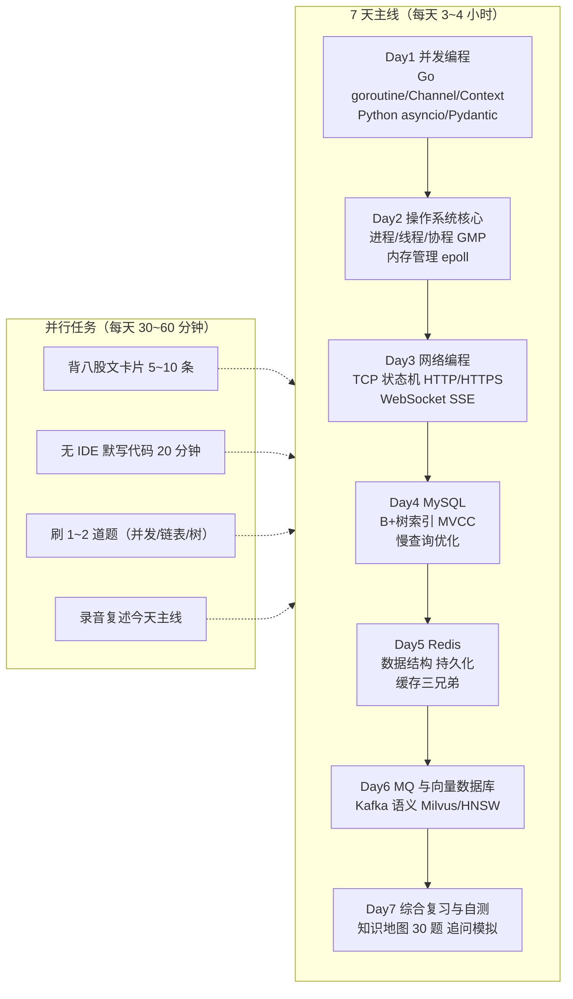
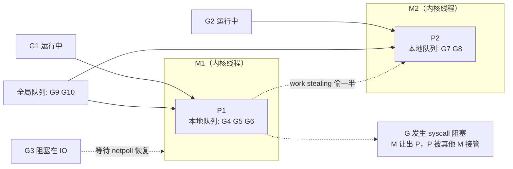
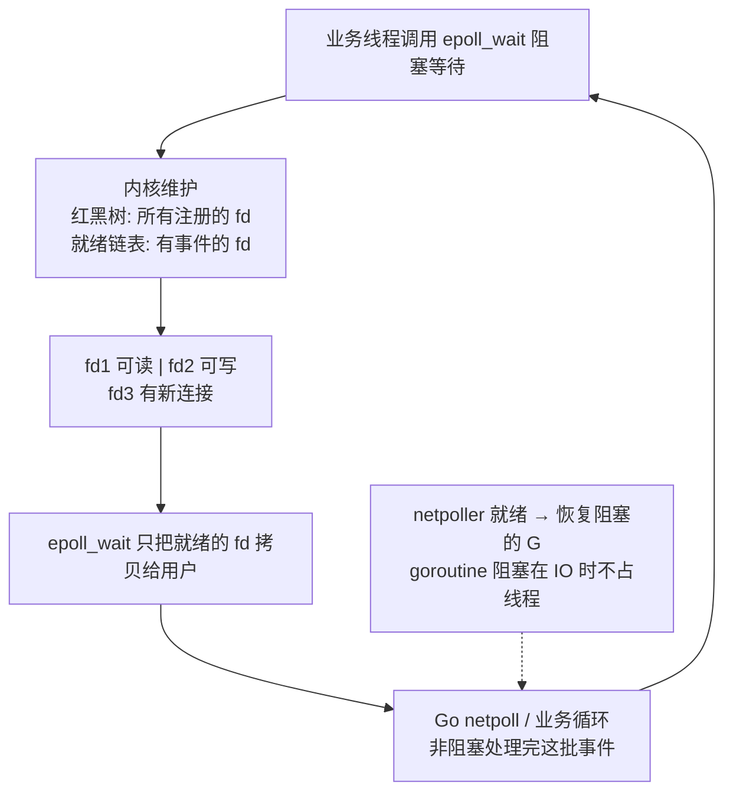
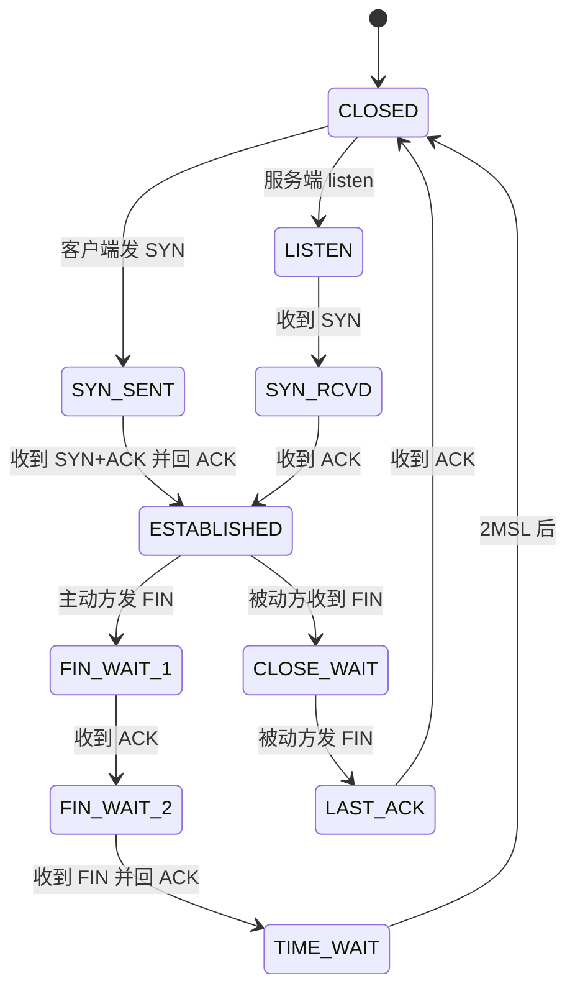
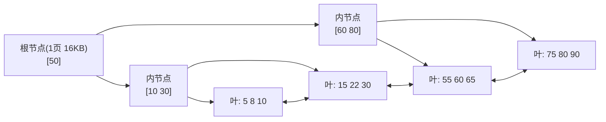
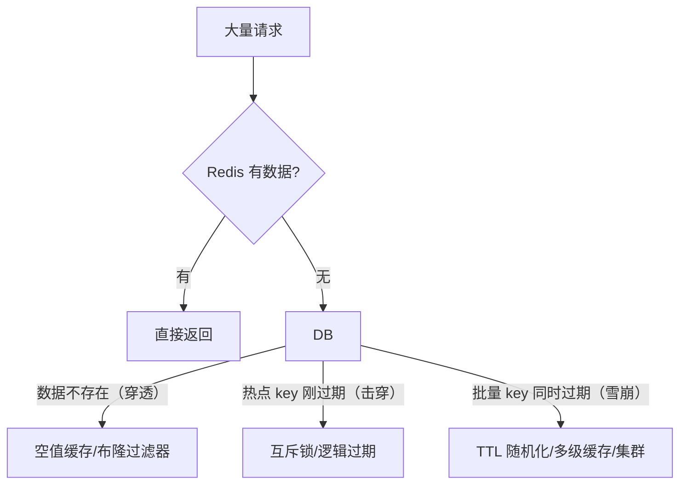
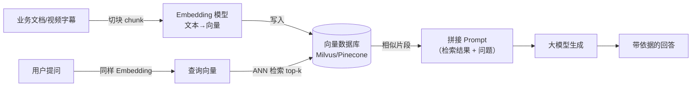
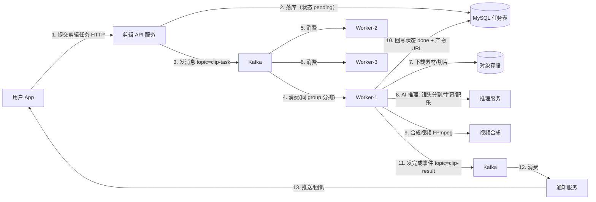

# 后端与计算机基础夯实（Day 1-7）

> **定位**：面向字节跳动剪映 CapCut「Agent 开发实习生（AI 剪辑）」（职位 ID：A80542，深圳/广州）的基础盘专项训练。岗位要求"深入理解数据结构、算法和操作系统知识"，本专题把 **并发编程、操作系统、网络、MySQL、Redis、MQ 与向量数据库** 七块全部压到 7 天，语言以 **Go** 为主线、**Python**（asyncio/Pydantic）作面试对照。
>
> **配套资料**：本专题是浓缩训练营，每个主题在文档站都有完整详解，学完当天主题后务必跳转精读对应链接。

## 总体目标（7 天结束后可交付的能力）

1. 用 Go 写出**并发正确**的代码：goroutine + channel + Context + sync 原语；能用 Python asyncio 写出等价逻辑，并讲清两种模型的差异（抢占式 vs 协作式）；
2. 口头讲透 **GMP、Go 内存分配、GC 三色标记、epoll**，并能手写一个基于 epoll 的 Go TCP 服务；
3. 能手写 **SSE 流式服务端 + 客户端**（AI 剪辑的流式输出刚需），讲清 TCP 状态机、HTTP/HTTPS/TLS 全流程；
4. 能对 5 条慢 SQL 做 explain 分析并给出优化前后写法，讲清 B+ 树、MVCC、隔离级别；
5. 用 go-redis 解决**缓存穿透/击穿/雪崩**，讲清 RDB/AOF、缓存与数据库一致性、大 key/热 key；
6. 能画出并解释"AI 剪辑任务"异步链路（用户提交 → MQ → worker → 回调），讲清 Kafka 语义与向量检索（HNSW/IVF）原理；
7. 通过 30 道自测题 + 面试追问模拟，形成**一条能连贯复述 15 分钟的面试主线**。

## 7 天学习路线图



---

## Day 1：并发编程双语言对照

### 1.1 今日知识点清单

| 知识点 | 掌握程度 | 对应小节 |
| --- | --- | --- |
| goroutine 启动与生命周期 | 默写级 | 1.2 |
| channel 有缓冲/无缓冲/close/range/select | 默写级（含 nil channel 语义） | 1.2 |
| sync.WaitGroup / Mutex / RWMutex / Once | 默写级（defer 解锁） | 1.3 |
| Context 的 WithCancel/WithTimeout/WithValue 与父子传播 | 默写级 | 1.4 |
| Python asyncio 事件循环、async/await、create_task/gather | 能写出等价逻辑 | 1.5 |
| Pydantic BaseModel/Field/类型转换 | 能写出校验模型 | 1.6 |
| 八股文：goroutine 泄漏、channel vs mutex、Context 传值 | 能口头 1 分钟讲清 | 1.7 |
| 实战：fan-in/fan-out 并发任务池 | 能独立写完并讲清 | 1.8 |

### 1.2 Go：goroutine 与 channel（语法细节到能默写）

**goroutine 最小模型**：`go f()` 启动一个由 runtime 调度的协程，栈初始约 2KB、可动态扩缩，创建成本微秒级。

```go
package main

import (
	"fmt"
	"sync"
	"time"
)

func worker(id int, wg *sync.WaitGroup) {
	defer wg.Done() // 语法细节：Done 必须 defer，保证任何路径都减计数
	fmt.Printf("worker %d 开始\n", id)
	time.Sleep(100 * time.Millisecond)
	fmt.Printf("worker %d 结束\n", id)
}

func main() {
	var wg sync.WaitGroup
	for i := 1; i <= 3; i++ {
		wg.Add(1) // 语法细节：Add 必须在 go 语句之前调用，避免计数竞态
		go worker(i, &wg)
	}
	wg.Wait() // 阻塞直到计数归零；WaitGroup 不可复制，必须传指针
	fmt.Println("全部完成")
}
```

**channel 语法细节（面试最爱考）**：

```go
package main

import "fmt"

func main() {
	// 无缓冲 channel：同步通信。发送方阻塞直到有接收方就绪，接收方反之
	ch := make(chan int)
	go func() { ch <- 42 }() // 发送
	v := <-ch                // 接收
	fmt.Println(v)

	// 有缓冲 channel：容量 2。未满时发送不阻塞；满时发送阻塞；空时接收阻塞
	buf := make(chan int, 2)
	buf <- 1
	buf <- 2
	fmt.Println(<-buf, <-buf)

	// close + range：发送方负责 close，接收方 range 遍历到关闭自动退出
	nums := make(chan int, 3)
	go func() {
		for i := 0; i < 3; i++ {
			nums <- i
		}
		close(nums) // 语法细节：close 只能由发送方做；向已关闭的 channel 发送会 panic
	}()
	for n := range nums { // 语法细节：range channel 不返回 ok，关闭即结束
		fmt.Println(n)
	}
}
```

**select + 超时（防 goroutine 泄漏的标准姿势）**：

```go
package main

import (
	"fmt"
	"time"
)

func main() {
	ch := make(chan int)
	go func() {
		time.Sleep(2 * time.Second)
		ch <- 1
	}()

	select {
	case v := <-ch:
		fmt.Println("收到:", v)
	case <-time.After(1 * time.Second):
		fmt.Println("超时，走降级逻辑")
	}
	// 语法细节：select 多个 case 同时就绪时随机选一个（保证公平）；
	// case 里读 nil channel 会永远阻塞，可用作"禁用某个分支"
}
```

**channel 操作一览表（必背）**：

| 操作 | 未关闭 | 已关闭 | nil |
| --- | --- | --- | --- |
| 发送 `ch <- v` | 阻塞或成功（看缓冲） | **panic** | 永久阻塞 |
| 接收 `<-ch` | 阻塞或成功 | 立即返回零值（用 `v, ok := <-ch` 判 ok=false） | 永久阻塞 |
| `close(ch)` | 成功 | **panic**（重复关闭） | panic |
| `range ch` | 阻塞迭代 | 正常结束 | 永不结束 |

### 1.3 Go：sync 同步原语（defer 解锁是铁律）

```go
package main

import (
	"fmt"
	"sync"
)

var (
	mu   sync.Mutex
	once sync.Once
	n    int
)

// Mutex：保护临界区。语法细节：Lock 后必须 defer Unlock，否则 panic/死锁或锁泄漏
func increment() {
	mu.Lock()
	defer mu.Unlock() // 即使函数中途 return 或 panic，也会解锁
	n++
}

// RWMutex：读多写少场景。读锁可并发，写锁独占
var (
	rw   sync.RWMutex
	data = map[string]string{}
)

func read(k string) string {
	rw.RLock() // 多个 reader 可同时持有
	defer rw.RUnlock()
	return data[k]
}

func write(k, v string) {
	rw.Lock() // writer 独占，与所有 reader 互斥
	defer rw.Unlock()
	data[k] = v
}

// Once：只执行一次（懒加载单例、初始化全局配置）
var conf *Config

type Config struct{ Addr string }

func getConfig() *Config {
	once.Do(func() { // 并发安全，只会执行一次；Go 1.21+ 可用 sync.OnceValue
		conf = &Config{Addr: "127.0.0.1:6379"}
	})
	return conf
}

func main() {
	for i := 0; i < 100; i++ {
		go increment()
	}
	_ = getConfig()
	_ = getConfig()
	fmt.Println("n =", n, "conf =", getConfig().Addr)
}
```

> **语法细节**：`sync.Mutex` / `sync.WaitGroup` / `sync.Once` **不可复制**（复制后是两个独立的锁），所以要么传指针，要么定义在结构体里用指针接收者。`defer` 是后进先出（LIFO），多个 `defer mu.Unlock()` 嵌套时注意顺序。

### 1.4 Go：Context（上下文控制，AI 后端天天用）

三个构造函数 + 一条传播链，完整可运行：

```go
package main

import (
	"context"
	"fmt"
	"time"
)

type traceIDKey struct{} // 语法细节：Value 的 key 必须用自定义类型，禁止用 string，避免包间冲突

func main() {
	// 1) WithCancel：手动取消
	parent, cancel := context.WithCancel(context.Background())
	defer cancel() // 语法细节：不 cancel 会泄漏定时器/监听协程

	// 2) WithTimeout：到时自动取消，同时继承 parent 的取消
	child, _ := context.WithTimeout(parent, 2*time.Second)

	// 3) WithValue：传只读的请求级元数据（traceID、userID）
	ctxV := context.WithValue(parent, traceIDKey{}, "trace-abc-123")
	fmt.Println("traceID =", ctxV.Value(traceIDKey{}).(string))

	// 父子传播：parent 被 cancel，所有派生 ctx 的 Done 都会关闭
	go func() {
		<-parent.Done()
		fmt.Println("parent 被取消:", parent.Err()) // context canceled
	}()
	go func() {
		<-child.Done()
		fmt.Println("child 也收到取消:", child.Err()) // 继承 parent 的 cause
	}()

	time.Sleep(50 * time.Millisecond)
	cancel() // 主动取消 → 整棵派生树级联取消
	time.Sleep(50 * time.Millisecond)
}
```

**生产代码中的标准用法**（HTTP 请求级超时，贯穿整条调用链）：

```go
http.HandlerFunc(func(w http.ResponseWriter, r *http.Request) {
	ctx, cancel := context.WithTimeout(r.Context(), 3*time.Second) // 从请求 ctx 派生
	defer cancel()
	// 下游所有调用（DB、Redis、下游 HTTP）都传 ctx：
	// rdb.Get(ctx, key)；db.QueryContext(ctx, sql)；client.Do(req.WithContext(ctx))
	// 超时一到，整条链路的阻塞调用全部返回 ctx.Err()
})
```

> **铁律**：`context.Background()` 只能做根；`context.TODO()` 表示还没想好用哪个；`WithValue` 只放请求级只读数据，**禁止**拿 Context 传可选参数（那是函数参数的事）。

### 1.5 Python 对照：asyncio（面试对比必答）

```python
import asyncio

async def fetch(url: str) -> str:
    await asyncio.sleep(0.1)  # 模拟 IO；语法细节：异步函数里必须 await 才能让出
    return f"data from {url}"

async def main() -> None:
    # create_task：立即把协程调度进事件循环，不阻塞当前协程
    t1 = asyncio.create_task(fetch("a.com"))
    t2 = asyncio.create_task(fetch("b.com"))
    # gather：并发等待全部任务，等价于 Go 的 errgroup/WaitGroup
    results = await asyncio.gather(t1, t2, return_exceptions=True)
    print(results)

if __name__ == "__main__":
    asyncio.run(main())  # 语法细节：asyncio.run 会创建事件循环并负责关闭
```

**Go goroutine vs Python asyncio 对比表（面试重点）**：

| 维度 | Go goroutine | Python asyncio |
| --- | --- | --- |
| 调度者 | Go runtime（GMP，**抢占式**） | asyncio 事件循环（**协作式**，单线程） |
| 让出时机 | 阻塞 syscall/IO 自动让出（netpoller），无需显式声明 | 必须 `await` 才让出；阻塞调用会卡死整个事件循环 |
| 多核利用 | GOMAXPROCS 个线程真并行 | 默认单线程；多核需多进程（ProcessPool） |
| 创建成本 | ~2KB 栈起步，百万级 goroutine 常见 | 协程对象轻量，但受单线程事件循环吞吐上限约束 |
| 通信 | channel / 共享内存 + 锁 | await / Future / asyncio.Queue |
| 数据竞争防护 | 编译器 + go race detector | 单线程天然少竞争，但跨任务共享状态仍需小心 |
| 适用场景 | 高并发后端、IO + 计算混合 | IO 密集脚本、异步 Web 框架（FastAPI 底层） |

> **一句话回答**：Go 是"多线程 + 抢占式调度"，Python asyncio 是"单线程事件循环 + 协作式调度"；Go 里你可以写同步风格代码而 IO 不阻塞线程，asyncio 里必须处处 `await`，一旦某处同步阻塞，整个进程的事件循环都会停摆。

### 1.6 Python 对照：Pydantic 数据校验（Agent 入参校验刚需）

```python
from pydantic import BaseModel, Field, field_validator

class ClipTask(BaseModel):
    task_id: str = Field(min_length=1, max_length=64)   # 长度校验
    duration: int = Field(gt=0, le=600)                  # 数值范围（秒）
    tags: list[str] = Field(default_factory=list)        # 语法细节：可变默认值必须 default_factory
    title: str | None = None                             # 可选字段

    @field_validator("task_id")
    @classmethod
    def no_space(cls, v: str) -> str:                    # 自定义校验器
        if " " in v:
            raise ValueError("task_id 不能包含空格")
        return v

class Rate(BaseModel):
    rate: float

# 类型转换：字符串 "3.5" 自动转 float；int 自动转 str 等
r = Rate(rate="3.5")
assert r.rate == 3.5

t = ClipTask(task_id="t-1", duration=10)
print(t.model_dump())  # {'task_id': 't-1', 'duration': 10, 'tags': [], 'title': None}
```

**Pydantic vs Go struct + json tag 对比表**：

| 维度 | Pydantic v2（Python） | Go struct + encoding/json |
| --- | --- | --- |
| 校验时机 | 构造对象时**自动校验** | 默认不校验，需手写或引入 validator 库 |
| 类型转换 | 自动（"3.5"→float、字符串数字→int） | 不转换，类型不匹配直接 Unmarshal 报错 |
| 必填与零值 | 缺字段即校验失败 | 缺字段是零值，无法区分"没传"与"传了 0"，需指针 `*int` |
| 字段别名 | 直接是字段名 | `json:"snake_case"` tag |
| 错误信息 | 结构化 errors（字段 + 原因） | 手动拼接或自定义 |
| 生态 | 自带 FastAPI 集成 | 需手写 HTTP 层 |

### 1.7 八股文要点（Day 1）

1. **goroutine 泄漏的 5 个场景**：
   - 从 channel 读，但永远没有生产者，且没超时/取消；
   - 向 channel 写，但缓冲满且没有消费者；
   - `context.WithCancel` 后忘记 `cancel()`（定时器/监听协程泄漏）；
   - goroutine 里做无限循环却没退出条件；
   - HTTP/DB 调用没设超时，下游挂起导致调用方协程永久阻塞。
   - **排查**：`go tool pprof` 看 goroutine 数量暴涨、`go.uber.org/goleak` 在测试里检测泄漏。
2. **channel vs mutex 怎么选**：channel 用于**传递所有权/消息流**（任务队列、事件通知、流水线）；mutex 用于**保护共享状态**（计数器、缓存、配置）。Go 谚语"不要通过共享内存来通信，而要通过通信来共享内存"，但临界区数据该加锁还是加锁，channel 不是锁的替代品。
3. **Context 传值 vs 超时**：传值只用于 traceID/userID 这类**只读请求级元数据**；超时/取消用于**控制调用链生命周期**，防止级联阻塞。两者职责完全不同，面试时分开讲。

### 1.8 实战练习：Go 并发任务池（fan-out / fan-in）

> **📁 配套代码练习**：[code/route/01_concurrency/01_worker_pool](/习题集和答案/route/01_concurrency/01_worker_pool/)（README 含题目与测试：完成 `solution.go` 后 `cd code/route && go test ./01_concurrency/01_worker_pool -v`，参考答案折叠在页面底部）

**题目**：6 个任务 → 3 个 worker 并发处理 → 汇总结果。必须同时体现 fan-out（分发）、fan-in（合并）、channel 关闭语义。

```go
package main

import (
	"fmt"
	"sync"
)

func main() {
	jobs := []int{1, 2, 3, 4, 5, 6}
	in := make(chan int)  // 任务输入
	out := make(chan int) // 结果输出

	var wg sync.WaitGroup

	// fan-out：3 个 worker 并发消费 in
	for w := 0; w < 3; w++ {
		wg.Add(1)
		go func(id int) {
			defer wg.Done()
			for j := range in { // 退出条件 = in 被 close
				out <- j * j // 计算结果
			}
		}(w)
	}

	// fan-in 收尾：所有 worker 结束后才允许关闭 out
	go func() {
		wg.Wait()
		close(out) // 语法细节：out 由多个 goroutine 写，必须等全部写完再 close，否则发送 panic
	}()

	// 生产者：发完任务后 close(in)，worker 的 range 才能退出
	go func() {
		for _, j := range jobs {
			in <- j
		}
		close(in)
	}()

	for v := range out { // 主 goroutine 收结果
		fmt.Println(v)
	}
}
```

**验收标准**：
- [ ] 代码能编译运行，输出 1,4,9,16,25,36（顺序不要求）；
- [ ] 能讲出：为什么 `close(in)` 由生产者做、`close(out)` 必须等 `wg.Wait()`；
- [ ] 能指出如果把 `in` 换成 nil channel 会怎样（永久阻塞、死锁）；
- [ ] 追问：如何加超时/取消？（引入 `context.WithTimeout` + `select` 监听 `ctx.Done()`）；
- [ ] 进阶：用 `golang.org/x/sync/errgroup` 重写，说出它和 WaitGroup 的差异（错误传播 + ctx 取消）。

---

## Day 2：操作系统核心

### 2.1 今日知识点清单

| 知识点 | 掌握程度 | 对应小节 |
| --- | --- | --- |
| 进程/线程/协程区别与切换成本 | 默写级（对比表） | 2.2 |
| GMP 模型、调度流程、work stealing | 能画图 + 讲 2 分钟 | 2.3 |
| 虚拟内存、页表、缺页中断、堆栈 | 概念 + 好处 3 条 | 2.4 |
| Go 内存分配 mcache/mcentral/mheap、GC 三色标记 | 概念级 | 2.4 |
| IO 模型演进、epoll 三 API、LT/ET | 默写级 | 2.5 |
| 八股文：epoll 为什么快、切换成本、虚拟内存好处 | 1 分钟讲清 | 2.6 |
| 实战：Go 手写 epoll TCP 服务 | 能在 Linux 跑通 | 2.7 |

### 2.2 进程 / 线程 / 协程

| 维度 | 进程 | 线程 | 协程（goroutine） |
| --- | --- | --- | --- |
| 调度者 | 内核 | 内核 | 用户态（Go runtime） |
| 切换开销 | 最高（几十 µs，涉及页表切换、TLB 失效） | 中（几 µs，内核栈切换） | 极低（几百 ns，寄存器级保存） |
| 地址空间 | 各自独立虚拟地址空间 | 共享进程地址空间、独立栈 | 共享地址空间、独立小栈（2KB 起步可扩） |
| 通信 | IPC（管道/消息队列/共享内存） | 共享内存 + 锁 | channel / 锁 |
| 崩溃影响 | 互不影响 | 线程崩 → 整个进程挂 | panic 不 recover → 整个进程挂 |
| 创建成本 | 高（fork + 页表复制） | 中 | 微秒级 |

**协程与线程池的关系**（高频追问）：线程池是"复用内核线程、避免频繁创建销毁"；协程是"在用户态模拟调度，把内核线程的上下文切换降到寄存器级"。Go 的做法是 **M 个内核线程（≈GOMAXPROCS）上调度 N 个 goroutine**——协程解决的是切换成本，线程池解决的是创建成本，两者不冲突，Go 里实际是"线程池 + 协程调度"双拼。

### 2.3 GMP 模型（关联：[Go GMP 调度详解](/第一阶段-知识详解/Go GMP 调度详解)、[Go 并发编程详解](/第一阶段-知识详解/Go并发编程详解)）

**三要素**：
- **G（goroutine）**：协程本体，含栈、程序计数器、状态（_Grunnable/_Grunning/_Gwaiting 等）；
- **P（processor）**：处理器，持有**本地可运行队列**（runq，约 256 个槽）和 g0 栈；数量 = `GOMAXPROCS`，是"调度上下文"；
- **M（machine）**：内核线程，真正执行 G 的载体；M 必须绑定 P 才能执行 G；阻塞时 M 与 P 解绑，P 可被其他 M 接管。

**调度流程**：新建 G → 放入当前 P 的本地队列（满了放全局队列）→ M 从本地队列取 G 执行 → 本地空则按优先级从全局队列取，或**偷取**（work stealing）其他 P 队列一半的 G → 遇到 syscall 阻塞：G 被挂起、M 让出 P、P 被其他 M 接管（避免线程闲置）→ Go 1.14+ 支持**异步抢占**（sysmon 每 10ms 检查，防止 G 死循环饿死其他 G）。



**为什么 Go 并发性能好**（背这 4 条）：① 用户态调度，切换成本比内核线程低 1~2 个数量级；② 栈按需增长（2KB 起步），百万级并发成为可能；③ netpoller 把 IO 阻塞变成协程挂起，不占线程；④ work stealing + 抢占式调度，负载均衡且没有饿死。

### 2.4 内存管理

**虚拟内存**：每个进程有独立虚拟地址空间（如 64 位下 128TB 用户空间），通过**页表**映射到物理内存。好处 3 条（面试必答）：
1. **隔离**：进程间互不干扰，一个进程崩溃不影响其他；
2. **按需分配（惰性）**：只在实际访问时才分配物理页（缺页中断触发），内存利用率高；
3. **共享与简化**：共享库只需一份物理页映射到多个进程；链接器不用关心物理地址。

**页表与缺页中断**：现代 CPU 用 4~5 级页表，配合 **TLB**（页表缓存）加速；访问未映射/未在内存的页 → **缺页中断** → 内核处理（分配物理页 / 从磁盘换入）→ 更新页表 → 重新执行指令。

**堆与栈**：栈向下生长、由编译器自动分配回收（函数调用帧），栈溢出会 SIGSEGV；堆向上生长、需要 GC 或手动管理，容易产生碎片。

**Go 内存分配（概念级，关联 [Go 内存分配详解](/第一阶段-知识详解/Go内存分配详解)）**：
- **mcache**：每个 P 绑定一个，本地小对象分配**无锁**（按 size class 分 67 类左右）；
- **mcentral**：全局 span 缓存，mcache 不够时从这取，需锁；
- **mheap**：堆本体，大对象（>32KB）直接从这里分配，向 OS 申请内存；
- **逃逸分析**：变量不逃逸就在栈上分配，逃逸（被外部引用/闭包捕获）才上堆。

**GC 三色标记（概念级，关联 [Go GC 详解](/第一阶段-知识详解/Go GC 详解)）**：白（未被标记）、灰（已标记但子对象未扫）、黑（已扫完）；从根对象出发 → 标灰 → 扫子对象变黑 → 增量 + 并发执行，配合**写屏障**保证并发期间不漏标、不错标，最后清掉白色对象。

### 2.5 IO 多路复用（关联：[操作系统面试详解](/第二阶段-知识详解/操作系统面试详解)）

**演进**：阻塞 IO（每连接一线程，C10K 崩）→ 非阻塞 IO（read 返回 EAGAIN，需轮询，CPU 空转）→ `select`（fd 集合上限 1024、每次全量遍历、内核到用户拷贝）→ `poll`（链表无上限，仍全量遍历）→ **epoll**（事件驱动，O(1) 就绪通知）。

**epoll 三个 API**：
- `epoll_create(size)`：创建 epoll 实例（内核维护红黑树 + 就绪链表）；
- `epoll_ctl(epfd, op, fd, event)`：注册/修改/删除监听 fd（op 为 ADD/MOD/DEL）；
- `epoll_wait(epfd, events, timeout)`：阻塞等待就绪事件，只返回就绪的 fd（**避免全量遍历**）。

**LT（水平触发）vs ET（边缘触发）**：LT 是默认，只要缓冲区还有数据就持续通知（安全、简单）；ET 只在状态变化（无→有）时通知一次，必须一次把数据读干净（通常配非阻塞 + 循环读，否则漏数据）。Netty、Go netpoll 这类高性能框架偏爱 ET 或自己管理读循环。



**为什么 epoll 快**：① 内核只通知**就绪**的 fd，不遍历全部 fd；② 就绪事件通过链表组织，通知 O(1)；③ 用户态无需重复拷贝整个 fd 集合；④ 可配 ET + 非阻塞，事件驱动一次处理大量连接。

**Go netpoll**：runtime 把 epoll（Linux）/kqueue（macOS）/IOCP（Windows）封装成网络轮询器——G 阻塞在 IO 时被挂起（不占 M），netpoll 有事件就绪后把 G 重新放回 runq。这就是"goroutine 写网络代码像同步、实际是异步"的秘密。

### 2.6 八股文要点（Day 2）

1. **epoll 为什么快**：事件驱动、就绪链表、O(1) 通知、避免全量遍历与拷贝（见 2.5）。
2. **进程/线程/协程切换成本**：进程（页表 + TLB + 内核栈，几十 µs）> 线程（内核栈，几 µs）> 协程（寄存器级，几百 ns）。协程本质是"用户态把线程切换成本再降一个量级"。
3. **虚拟内存的好处**：隔离、按需分配、共享库、简化链接与加载。
4. **补充**：GOMAXPROCS 不是越大越好（本地队列 + 锁竞争 + 缓存一致性），IO 密集可 >CPU 数，计算密集 =CPU 数。

### 2.7 实战练习：Go 手写 epoll TCP 服务

> **📁 配套代码练习**：[code/route/02_io_multiplexing/01_event_loop](/习题集和答案/route/02_io_multiplexing/01_event_loop/)（跨平台可测的事件循环练习：注册 → 就绪 → 分发，LT / ET 触发语义；真实 syscall 版见下方代码）

用标准库 `syscall` 直接调 epoll（Linux 环境运行；macOS 可改用 kqueue 思路相同）：

```go
package main

import (
	"fmt"
	"net"
	"os"
	"syscall"
)

func must(err error) {
	if err != nil {
		fmt.Fprintln(os.Stderr, err)
		os.Exit(1)
	}
}

func main() {
	// 1) socket + 非阻塞（SOCK_NONBLOCK：ET 语义要求非阻塞）
	fd, err := syscall.Socket(syscall.AF_INET, syscall.SOCK_STREAM|syscall.SOCK_NONBLOCK, 0)
	must(err)
	defer syscall.Close(fd)

	// 2) bind + listen
	addr := syscall.SockaddrInet4{Port: 9000}
	copy(addr.Addr[:], net.ParseIP("127.0.0.1").To4())
	must(syscall.Bind(fd, &addr))
	must(syscall.Listen(fd, 128))

	// 3) epoll_create
	epfd, err := syscall.EpollCreate1(0)
	must(err)
	defer syscall.Close(epfd)

	// 4) epoll_ctl：注册监听 fd，关注可读事件（默认 LT）
	must(syscall.EpollCtl(epfd, syscall.EPOLL_CTL_ADD, fd, &syscall.EpollEvent{
		Events: syscall.EPOLLIN,
		Fd:     int32(fd),
	}))

	events := make([]syscall.EpollEvent, 64)
	for {
		// 5) epoll_wait：阻塞等待就绪事件（timeout=-1 永久等待）
		n, err := syscall.EpollWait(epfd, events, -1)
		must(err)
		for i := 0; i < n; i++ {
			if int(events[i].Fd) == fd {
				// 新连接：非阻塞 accept，循环清空连接队列
				for {
					cfd, _, err := syscall.Accept(fd)
					if err == syscall.EAGAIN { // 队列空了
						break
					}
					must(err)
					// 真实项目：把 cfd 设为非阻塞 + EPOLL_CTL_ADD 进 epoll
					fmt.Println("新连接:", cfd)
					syscall.Close(cfd) // 演示：直接关闭
				}
			} else {
				fmt.Println("可读 fd:", events[i].Fd) // 业务读事件
			}
		}
	}
}
```

**验收标准**：
- [ ] 代码在 Linux 上编译运行（`go run`），`nc 127.0.0.1 9000` 能触发"新连接"日志；
- [ ] 能指出 `EAGAIN` 的作用（非阻塞下的"暂时没数据"），并解释为什么必须处理它；
- [ ] 能口头对比：把 Events 加 `| syscall.EPOLLET` 变 ET 后要注意什么（必须循环读到 EAGAIN）；
- [ ] 能讲出 Go netpoll 与手写 epoll 的关系（netpoll 就是 runtime 里帮你封装好的 epoll 循环）。

---

## Day 3：网络编程

### 3.1 今日知识点清单

| 知识点 | 掌握程度 | 对应小节 |
| --- | --- | --- |
| TCP 状态机、三次握手/四次挥手、TIME_WAIT | 能画状态图 + 讲原因 | 3.2 |
| HTTP 报文/方法/状态码、HTTP/1.1/2/3 | 默写级 | 3.3 |
| HTTPS/TLS 握手、证书链、对称/非对称 | 能画握手流程 | 3.3 |
| WebSocket 握手与帧格式、SSE 对比 | 概念 + 对比表 | 3.4 |
| SSE 流式输出（text/event-stream） | 能默写 Go 完整代码 | 3.5 |
| 八股文：粘包、TIME_WAIT 过多、SSE 断线重连 | 1 分钟讲清 | 3.6 |
| 实战：SSE 服务端 + 客户端 | 能跑通 + curl 验证 | 3.7 |

### 3.2 TCP 状态机（关联：[计算机网络面试详解](/第二阶段-知识详解/计算机网络面试详解)）

**三次握手**：Client SYN（SYN_SENT）→ Server 回 SYN+ACK（SYN_RCVD）→ Client 回 ACK（双方 ESTABLISHED）。作用：确认双方收发能力 + 交换初始序号（ISN）。
**四次挥手**：主动方 FIN（FIN_WAIT_1）→ 被动方 ACK（主动方 FIN_WAIT_2，被动方 CLOSE_WAIT）→ 被动方 FIN（主动方 TIME_WAIT，被动方 LAST_ACK）→ 主动方 ACK（被动方 CLOSED）。因为是**半关闭**：被动方收到 FIN 后可能还有数据要发，所以 ACK 和 FIN 分开发。



**11 种状态**：CLOSED、LISTEN、SYN_SENT、SYN_RCVD、ESTABLISHED、FIN_WAIT_1、FIN_WAIT_2、CLOSE_WAIT、LAST_ACK、TIME_WAIT、CLOSING（双方同时 close）。

**TIME_WAIT 为什么等 2MSL**（必背）：① 保证最后一个 ACK 能到达（若丢失，对方会重发 FIN，我方需能再回 ACK）；② 让旧连接的报文在网络中消亡（MSL=报文最大生存时间），防止污染新连接。代价：2MSL 约 60s 内端口被占用。
**CLOSE_WAIT 堆积排查**：CLOSE_WAIT 是"对方已关闭，我方没调 close"——典型原因是业务代码忘关连接/连接池泄漏。排查命令：`ss -tan | awk '{print $1}' | sort | uniq -c` 看 CLOSE_WAIT 数量，再查日志里未关闭的句柄。

**粘包问题**：TCP 是字节流，没有消息边界，多个消息可能粘在一起。解决三件套：**定长报文 / 分隔符（如 \n）/ 长度前缀**（最常用：4 字节大端长度 + body）。

```go
// 长度前缀编码示例（Go 序列化/反序列化消息）
func encode(msg []byte) []byte {
	b := make([]byte, 4+len(msg))
	binary.BigEndian.PutUint32(b[:4], uint32(len(msg))) // 4 字节长度
	copy(b[4:], msg)
	return b
}

func decode(reader *bufio.Reader) ([]byte, error) {
	lenBuf := make([]byte, 4)
	if _, err := io.ReadFull(reader, lenBuf); err != nil { // 读满 4 字节
		return nil, err
	}
	n := binary.BigEndian.Uint32(lenBuf)
	body := make([]byte, n)
	_, err := io.ReadFull(reader, body) // 读满 n 字节才是完整一条
	return body, err
}
```

### 3.3 HTTP / HTTPS

**报文结构**：请求行 `方法 路径 版本` / 状态行 `版本 状态码 短语` + 首部 + 空行 + body。
**常见方法**：GET（读，幂等）、POST（写）、PUT（整体替换，幂等）、PATCH（局部更新）、DELETE、HEAD、OPTIONS（预检）。
**状态码速记表**：

| 区间 | 含义 | 常考 |
| --- | --- | --- |
| 1xx | 信息 | 100 Continue、101 Switching Protocols（WebSocket） |
| 2xx | 成功 | 200、201 Created、204 No Content |
| 3xx | 重定向 | 301 永久、302 临时、304 Not Modified（协商缓存） |
| 4xx | 客户端错 | 400、401 未认证、403 禁止、404、408 超时、429 限流 |
| 5xx | 服务端错 | 500、502 Bad Gateway、503 不可用、504 网关超时 |

**HTTP/1.1**：默认 keep-alive 持久连接，复用 TCP 减少握手；队头阻塞（同一连接请求必须串行）。
**HTTP/2**：二进制分帧、**多路复用**（一个连接多个 stream 并发）、HPACK 头部压缩、服务端推送。仍有 TCP 层队头阻塞。
**HTTP/3**：基于 UDP 的 **QUIC**，独立流无队头阻塞、0-RTT 建连、连接迁移。

**HTTPS = HTTP + TLS**。对称加密（AES）快，用于加密业务数据；非对称加密（RSA/ECDHE）慢，用于安全交换会话密钥。**TLS 1.2 握手**：ClientHello（随机数+支持的加密套件）→ ServerHello + 证书 + ServerKeyExchange → 客户端验证证书链、生成 pre-master secret 用服务器公钥加密发送 → 双方各自算出相同的会话密钥 → 切换加密通信。**TLS 1.3**：握手压缩到 1-RTT（去掉 RSA 密钥交换、简化密码套件），支持 0-RTT 会话恢复。
**证书链**：叶子证书（域名）← 中间 CA ← 根 CA（浏览器内置）。客户端验证：① 沿链找到受信任根；② 检查有效期；③ 检查域名匹配；④ 检查吊销状态（OCSP）。

### 3.4 WebSocket

**握手（Upgrade）**：客户端发普通 HTTP 请求，带 `Connection: Upgrade`、`Upgrade: websocket`、`Sec-WebSocket-Key`（随机 base64）；服务端回 `101 Switching Protocols` + `Sec-WebSocket-Accept = base64(SHA1(key + "258EAFA5-E914-47DA-95CA-C5AB0DC85B11"))`。之后连接升级为全双工帧协议。
**帧格式概念**：FIN（最后一帧）+ opcode（1=text、2=binary、8=close、9=ping、10=pong）+ MASK（客户端发必须掩码）+ payload length + payload。

**SSE vs WebSocket 对比表**：

| 维度 | SSE（Server-Sent Events） | WebSocket |
| --- | --- | --- |
| 方向 | **单向**（服务端 → 客户端） | 双向全双工 |
| 协议 | 纯 HTTP（text/event-stream） | Upgrade 后的独立帧协议 |
| 数据格式 | 纯文本（UTF-8） | 文本 + 二进制 |
| 自动重连 | **内置**（EventSource 自动重连 + Last-Event-ID 续传） | 需自己实现 |
| 代理/负载均衡 | 友好（普通 HTTP 长响应） | 需网关支持长连接 |
| 适用场景 | LLM 流式输出、进度推送、通知 | 聊天、游戏、协同编辑 |

### 3.5 SSE 流式输出（AI 剪辑/LLM 应用刚需）

**协议要点**：`Content-Type: text/event-stream`；每条消息以 `\n\n` 结尾；字段 `data:`（内容，可多行拼接）、`id:`（事件 ID，配合 Last-Event-ID 断点续传）、`event:`（自定义事件名）、`retry:`（重连间隔毫秒）。

**Go 服务端完整可运行代码**：

```go
package main

import (
	"encoding/json"
	"fmt"
	"log"
	"net/http"
	"time"
)

// SSE 服务端：模拟 LLM 逐 token 流式输出
func sseHandler(w http.ResponseWriter, r *http.Request) {
	// 1) 三个关键响应头
	w.Header().Set("Content-Type", "text/event-stream")
	w.Header().Set("Cache-Control", "no-cache")
	w.Header().Set("Connection", "keep-alive")

	// 2) 拿到 Flusher（关键：必须能主动刷新，否则数据积压在缓冲里）
	flusher, ok := w.(http.Flusher)
	if !ok {
		http.Error(w, "当前响应不支持流式", http.StatusInternalServerError)
		return
	}

	// 3) 模拟 LLM 逐 token 输出
	tokens := []string{"你好", "，", "我是", "AI", "剪辑", "助手"}
	for i, tk := range tokens {
		select {
		case <-r.Context().Done(): // 客户端断开 → 优雅退出
			log.Println("客户端断开连接")
			return
		default:
		}
		msg, _ := json.Marshal(map[string]any{"index": i, "delta": tk})
		// 语法细节：每条事件以空行 \n\n 结尾，id/event/data 各占一行
		fmt.Fprintf(w, "id: %d\nevent: message\ndata: %s\n\n", i, msg)
		flusher.Flush() // 语法细节：写完一条必须 Flush，否则不会推给客户端
		time.Sleep(200 * time.Millisecond) // 模拟生成耗时
	}
	// 4) 结束事件
	fmt.Fprintf(w, "event: done\ndata: [DONE]\n\n")
	flusher.Flush()
}

func main() {
	http.HandleFunc("/v1/stream", sseHandler)
	log.Println("SSE server on :8080")
	log.Fatal(http.ListenAndServe(":8080", nil))
}
```

**验证**：`curl -N http://127.0.0.1:8080/v1/stream` 应看到逐条 `data:` 输出（`-N` 关闭缓冲）。

**SSE 客户端（Go）**：

```go
package main

import (
	"bufio"
	"fmt"
	"net/http"
)

func main() {
	resp, err := http.Get("http://127.0.0.1:8080/v1/stream")
	if err != nil {
		panic(err)
	}
	defer resp.Body.Close()

	reader := bufio.NewReader(resp.Body)
	for {
		line, err := reader.ReadString('\n')
		if err != nil { // EOF：服务端结束（或连接断开）
			break
		}
		if line == "\n" { // 空行 = 一条事件结束
			fmt.Println("--- 事件分隔 ---")
			continue
		}
		fmt.Print(line) // data: {...} / event: done
	}
}
```

**LLM 应用场景**：一键成片生成进度、逐 token 输出、审核结果回推、任务状态推送。AI 剪辑的"生成中 → 结果"体验全靠它。

### 3.6 八股文要点（Day 3）

1. **粘包与解决**：TCP 字节流无边界 → 定长 / 分隔符 / 长度前缀；解码必须读满（`io.ReadFull`）。
2. **TIME_WAIT 过多**：短连接高并发（压测、网关）导致；对策：长连接复用、调 `net.ipv4.tcp_tw_reuse`（注意安全语义）、客户端端口池、服务端尽量做被动关闭方。
3. **HTTP 与 WebSocket 区别**：HTTP 请求-响应、短/半持久、单向；WS 升级后全双工、帧协议、适合实时双向。
4. **SSE 断线重连**：EventSource 自动重连；服务端发 `id:` + 客户端回传 `Last-Event-ID` 实现断点续传；`retry:` 控制重连间隔。

### 3.7 实战练习：SSE 服务端 + 客户端

> **📁 配套代码练习**：[code/route/03_network/01_sse_server](/习题集和答案/route/03_network/01_sse_server/)、[code/route/03_network/02_sse_client](/习题集和答案/route/03_network/02_sse_client/)（服务端：写出 `data:` 事件并 Flush；客户端：解析流、`[DONE]`、ctx 取消）

**验收标准**：
- [ ] 3.5 的服务端代码能运行，`curl -N` 看到 6 条 message + 1 条 done；
- [ ] Go 客户端能完整读完所有事件并打印；
- [ ] 客户端中途断开（Ctrl+C），服务端日志打印"客户端断开"（验证 `r.Context().Done()`）；
- [ ] 能讲出：如果去掉 `Flush()` 会发生什么（数据全部积压，客户端一条都收不到，直到连接关闭才一次性吐出）；
- [ ] 追问：如何让 SSE 支持"断线续传"？（服务端记录并发送 `id:`，客户端重连带 `Last-Event-ID`）；
- [ ] 进阶：把上面的 SSE 封装成"任务进度推送"接口（任务 ID → 进度 0-100%）。

---

## Day 4：MySQL

### 4.1 今日知识点清单

| 知识点 | 掌握程度 | 对应小节 |
| --- | --- | --- |
| B+ 树为什么赢、聚簇/非聚簇、回表、覆盖索引、最左前缀 | 能画图 + 讲清 | 4.2 |
| 四种隔离级别、脏读/不可重复读/幻读 | 默写级 | 4.3 |
| MVCC（undo log + ReadView）、快照读 vs 当前读 | 能讲 2 分钟 | 4.3 |
| explain 关键字段、索引失效场景、深翻页 | 默写级 | 4.4 |
| 八股文 + 5 条慢 SQL 实战 | 能现场优化 | 4.5 / 4.6 |

### 4.2 B+ 树索引（关联：[存储引擎与B+树](/后端技术栈强化/01-mysql/存储引擎与B+树)）

**为什么是 B+ 树（vs B 树 / 哈希 / 红黑树）**：
- **vs B 树**：B+ 树非叶子节点**只存 key + 指针**（不存数据），一页 16KB 能装上千个 key → 扇出大 → 树矮（3~4 层）→ 查询 IO 次数少（3~4 次磁盘 IO）；且叶子节点**有序链表**，范围查询只需顺序遍历叶子；
- **vs 哈希**：哈希等值查询 O(1)，但无法范围查询、无法排序、无最左前缀；
- **vs 红黑树**：二叉结构树高 log₂N，节点小扇出低，是内存结构，不适合磁盘 IO（每次下探一次随机 IO）。



**聚簇索引 vs 非聚簇索引**：InnoDB 表按主键聚簇——**聚簇索引**（主键索引）叶子存**整行数据**；**二级索引**（普通索引）叶子存**主键值**。通过二级索引查数据要拿主键再去聚簇索引查一次 = **回表**。
**覆盖索引**：查询的列全部在某个二级索引里（如 `SELECT id, name FROM t WHERE name='x'` 且 (name,id) 有索引）→ 不需要回表，Extra 显示 `Using index`。
**最左前缀原则**：联合索引 (a,b,c) 能命中 a / a,b / a,b,c；**不能**跳过 a 直接 b 或 c；a 是范围查询后 b 失效。建索引时把**等值列放前、范围列放后、选择性高的放前**。

### 4.3 事务隔离级别与 MVCC（关联：[事务与MVCC](/后端技术栈强化/01-mysql/事务与MVCC)）

**四种隔离级别**：

| 隔离级别 | 脏读 | 不可重复读 | 幻读 | 实现 |
| --- | --- | --- | --- | --- |
| 读未提交 | 可能 | 可能 | 可能 | 无 |
| 读已提交 | 无 | 可能 | 可能 | 每条语句新 ReadView |
| 可重复读（**InnoDB 默认**） | 无 | 无 | 基本解决（next-key 锁） | 首次读生成 ReadView 复用 |
| 串行化 | 无 | 无 | 无 | 全部加锁 |

- **脏读**：读到别的**事务未提交**的数据；
- **不可重复读**：同一事务两次读同一条记录，结果不同（别的已提交事务改了它）；
- **幻读**：同一事务两次范围查询，行数不同（别的已提交事务**插入/删除**了行）。

**MVCC 原理**：每行隐藏字段 `trx_id`（最近修改该行的事务 ID）、`roll_pointer`（指向 **undo log** 中的旧版本链）。**ReadView** 记录：`m_ids`（活跃事务列表）、`min_trx_id`、`max_trx_id`、`creator_trx_id`。可见性规则：
- `trx_id < min_trx_id`：已提交 → 可见；
- `trx_id ∈ m_ids`：未提交 → 不可见，沿 undo 链找上一版本；
- `trx_id >= max_trx_id`：将来事务 → 不可见。

**快照读 vs 当前读**：普通 `SELECT` 是快照读（走 MVCC，不加锁）；`SELECT ... FOR UPDATE / LOCK IN SHARE MODE / UPDATE / DELETE` 是当前读（读最新版本 + 加锁）。**可重复读下幻读**：快照读靠 ReadView 看不到新行；当前读靠 **next-key 锁**（记录锁 + 间隙锁）锁住范围防止插入。

### 4.4 SQL 慢查询优化（关联：[索引与SQL优化](/后端技术栈强化/01-mysql/索引与SQL优化)）

**explain 关键字段**：

| 字段 | 含义 | 判断标准 |
| --- | --- | --- |
| type | 访问类型 | 好→坏：system > const > eq_ref > ref > range > index > **ALL**；目标是 range 及以上，避免 ALL 全表扫 |
| key | 实际使用的索引 | NULL = 没走索引，危险 |
| rows | 预估扫描行数 | 越小越好，和实际相差过大说明统计信息旧 |
| Extra | 额外信息 | `Using index`（覆盖索引，最好）、`Using where`（正常）、`Using filesort`（需优化排序）、`Using temporary`（临时表，要避免） |

**索引失效场景（必背）**：① `LIKE '%xx'` 左模糊；② 对索引列做函数或运算（`LEFT(name,1)`、`age+1`）；③ 隐式类型转换（字符串列 = 数字）；④ 联合索引不满足最左前缀；⑤ OR 连接非索引列；⑥ 优化器判断回表成本高而放弃。
**慢查询日志**：`slow_query_log=ON`、`long_query_time=1`（秒）；`mysqldumpslow -s t /var/log/mysql/slow.log` 分析。
**深翻页优化**：`LIMIT 100000, 20` 会扫前面 10 万行——改**游标分页**（`WHERE id > 上一页最大id ORDER BY id LIMIT 20`）或**延迟关联**（先查 id 再 JOIN 取全行）。
**大表加索引**：`ALTER TABLE ... ADD INDEX` 会锁表，用 `pt-online-schema-change` / `gh-ost` 在线变更（拷贝 + 追增量 + 切换），或新建表 + 双写。

### 4.5 八股文要点（Day 4）

1. **回表 / 覆盖索引**：二级索引 → 主键 → 聚簇索引；覆盖索引免回表；
2. **最左前缀**：联合索引 (a,b,c) 支持 a / a,b / a,b,c，跳过 a 全失效；
3. **可重复读为什么还能防幻读**：快照读靠 MVCC ReadView，当前读靠 next-key 锁；
4. **快照读 vs 当前读**：是否加锁、读版本、是否触发幻读场景；
5. **深翻页**：`limit 100000,10` 的坑与游标/延迟关联解法。

### 4.6 实战练习：5 条慢 SQL 优化（优化前后写法）

> **📁 配套代码练习**：[code/route/04_sql/01_slow_query](/习题集和答案/route/04_sql/01_slow_query/)（纯 SQL 练习：`exercises.sql` 待填，答案在 `answer/answer.sql`，explain 自测）

> 表结构：`users(id, name, email, age, created_at)`、`orders(id, user_id, amount, status, created_at)`，orders 上已有 `idx_user(user_id)`。

**慢 SQL 1（排序没用索引）**
```sql
-- 优化前：status 无索引配合排序 → Using filesort
SELECT * FROM orders WHERE status = 1 ORDER BY created_at DESC LIMIT 10;
-- 优化后：建联合索引 (status, created_at)，索引即有序，免 filesort
ALTER TABLE orders ADD INDEX idx_status_ctime (status, created_at);
```

**慢 SQL 2（左模糊，索引失效）**
```sql
-- 优化前：% 开头无法用索引，全表扫
SELECT * FROM users WHERE name LIKE '%张%';
-- 优化后：改前缀匹配（可用索引）；再不行上全文索引/ES
SELECT * FROM users WHERE name LIKE '张%';
```

**慢 SQL 3（隐式类型转换）**
```sql
-- 优化前：user_id 是 BIGINT，条件写字符串 → 类型转换索引失效
SELECT * FROM orders WHERE user_id = '12345';
-- 优化后：传数值类型
SELECT * FROM orders WHERE user_id = 12345;
```

**慢 SQL 4（大范围 + 回表多）**
```sql
-- 优化前：半年范围扫描 + SELECT * 大量回表
SELECT * FROM orders WHERE created_at BETWEEN '2024-01-01' AND '2024-06-30';
-- 优化后：覆盖索引 + 只取必要列；统计类需求拆聚合表
SELECT id, amount FROM orders
WHERE created_at BETWEEN '2024-01-01' AND '2024-06-30';
-- 建 (created_at, amount) 联合索引，Extra 显示 Using index
```

**慢 SQL 5（深翻页）**
```sql
-- 优化前：LIMIT 100000, 20 要扫 10 万行
SELECT * FROM orders ORDER BY id LIMIT 100000, 20;
-- 优化后：游标分页（记住上一页最后一个 id），扫描量降到 20
SELECT * FROM orders WHERE id > 100020 ORDER BY id LIMIT 20;
```

**验收标准**：
- [ ] 能对每条 SQL 用 explain 解释"优化前 type/rows/Extra 差在哪、优化后好在哪"；
- [ ] 能背出索引失效 6 类场景并各举一例；
- [ ] 能讲出深翻页的两种优化（游标、延迟关联）及适用边界；
- [ ] 追问：为什么左模糊 `%张%` 用不了索引？（B+ 树有序，前缀未知无法定位起始位置）。

---

## Day 5：Redis

### 5.1 今日知识点清单

| 知识点 | 掌握程度 | 对应小节 |
| --- | --- | --- |
| 5 种数据结构 + 底层（SDS/quicklist/listpack/skiplist） | 能讲底层 + 场景表 | 5.2 |
| go-redis 基本操作 | 能默写 | 5.2 |
| RDB vs AOF、混合持久化 | 对比表默写 | 5.3 |
| 缓存穿透/击穿/雪崩 | 能画图 + 讲解法 | 5.4 |
| 一致性、大 key/热 key | 1 分钟讲清 | 5.5 |
| 实战：互斥锁防击穿 | 能默写 | 5.6 |

### 5.2 常用数据结构与底层（关联：[数据结构底层](/后端技术栈强化/02-redis/数据结构底层)）

| 结构 | 底层实现（7.x） | 典型场景 | 常用命令 |
| --- | --- | --- | --- |
| string | SDS（简单动态字符串） | 缓存、计数器、分布式锁 | SET/GET/INCR/SETNX/EXPIRE |
| list | quicklist（压缩链表组合） | 消息队列、时间线 | LPUSH/RPOP/BRPOP/LRANGE |
| hash | listpack / hashtable | 对象缓存（用户、任务详情） | HSET/HGET/HGETALL |
| set | intset / hashtable | 去重、标签、共同好友 | SADD/SISMEMBER/SINTER |
| zset | listpack / **skiplist + hashtable** | 排行榜、延迟队列 | ZADD/ZRANGE/ZSCORE |

**底层概念**：SDS 带 `len` 字段（O(1) 长度、二进制安全、预分配减少 realloc）；listpack/ziplist 是连续内存紧凑结构（元素少时省内存）；**跳表**是多层有序链表，平均 O(logN) 查找 + 天然支持范围查询，实现比红黑树简单，用于 zset 排序。

**go-redis 示例代码**：

```go
package main

import (
	"context"
	"fmt"
	"time"

	"github.com/redis/go-redis/v9"
)

func main() {
	rdb := redis.NewClient(&redis.Options{
		Addr:     "127.0.0.1:6379",
		Password: "",
		DB:       0,
	})
	ctx := context.Background()

	// string：缓存 + TTL
	rdb.Set(ctx, "key", "value", 10*time.Second)
	v, err := rdb.Get(ctx, "key").Result()
	fmt.Println(v, err)

	// zset：排行榜（分数降序取前 2）
	rdb.ZAdd(ctx, "rank",
		redis.Z{Score: 100, Member: "user1"},
		redis.Z{Score: 90, Member: "user2"})
	top, _ := rdb.ZRevRangeWithScores(ctx, "rank", 0, 1).Result()
	fmt.Println(top)

	// SETNX：分布式锁（原子：只有 key 不存在才设置成功）
	ok, err := rdb.SetNX(ctx, "lock:clip", "owner-1", 10*time.Second).Result()
	fmt.Println("加锁成功:", ok, err)
}
```

### 5.3 持久化：RDB vs AOF（关联：[持久化与高可用](/后端技术栈强化/02-redis/持久化与高可用)）

| 维度 | RDB（快照） | AOF（追加日志） |
| --- | --- | --- |
| 原理 | 定期把内存全量快照成二进制文件 | 追加记录每条写命令 |
| 触发 | save / bgsave / 自动策略 | always / everysec（默认）/ no |
| 恢复速度 | 快（直接加载快照） | 慢（重放命令） |
| 数据丢失 | 最后一次快照之后的全丢 | everysec 最多丢 1s，always 不丢 |
| 文件大小 | 小 | 大（可 AOF rewrite 压缩） |
| 适用 | 缓存、可容忍丢失 | 对数据完整性要求高的业务 |

**混合持久化（4.0+）**：`aof-use-rdb-preamble yes`——AOF rewrite 后文件 = **RDB 头（快速加载） + AOF 增量（少丢数据）**，是生产首选。选择建议：Redis 只当缓存（可丢）→ RDB 或混合；Redis 存重要数据 → 混合持久化 + 主从。

### 5.4 缓存穿透 / 击穿 / 雪崩（关联：[缓存问题与一致性](/后端技术栈强化/02-redis/缓存问题与一致性)）

| 问题 | 现象 | 根因 | 解决手段 |
| --- | --- | --- | --- |
| **穿透** | 请求**不存在的 key** 全部打到 DB | 恶意/随机 key、空结果没缓存 | ① 空值缓存（TTL 短）② 布隆过滤器前置拦截 ③ 参数校验 |
| **击穿** | **单个热点 key** 过期瞬间，大量请求打到 DB | 热点 key 过期 | ① 互斥锁重建 ② 逻辑过期（value 里带过期时间，异步刷新）③ 永不过期 + 后台更新 |
| **雪崩** | **大量 key 同时过期** 或 Redis 宕机，DB 被打爆 | 批量设置相同 TTL / 宕机 | ① TTL 加随机值 ② 集群高可用（主从+哨兵/Cluster）③ 多级缓存（本地 + Redis） |



### 5.5 八股文要点（Day 5）

1. **缓存与数据库一致性（Cache Aside）**：读：先查缓存，miss 则查 DB 回填；写：**先更新 DB，再删缓存**（不是更新缓存——并发写会让缓存值乱序）。删除失败怎么办：**延迟双删**（先删缓存 → 更新 DB → 延迟再删一次）或**订阅 binlog**（Canal 监听 DB 变更删缓存），最终一致。
2. **大 key 问题**：单值大（>10KB）或集合元素多（>1 万）→ 阻塞（大对象拷贝/删除阻塞）、慢查询、内存不均。处理：拆分、压缩、渐进式删除（`hscan` + `hdel`）。
3. **热 key 问题**：单 key 超高 QPS → 单节点打满。处理：本地缓存（多级）、多副本、热点 key 加后缀散列到多个 key。
4. **补充**：Redis 单线程为什么快——纯内存 + IO 多路复用（epoll 事件循环）+ 避免锁竞争；但 6.0 起多线程只用于 IO 读写，命令执行仍单线程。

### 5.6 实战练习：go-redis 实现带互斥锁的缓存重建（防击穿）

> **📁 配套代码练习**：[code/route/05_redis_cache/01_cache_breakdown](/习题集和答案/route/05_redis_cache/01_cache_breakdown/)（用 `Cache` 接口抽象 Redis，离线可测：20 并发下 loader 只调用 1 次；生产用下方 go-redis 写法）

```go
package main

import (
	"context"
	"errors"
	"fmt"
	"time"

	"github.com/redis/go-redis/v9"
)

var rdb = redis.NewClient(&redis.Options{Addr: "127.0.0.1:6379"})

// 模拟查询 DB（实际是 SQL）
func loadFromDB(ctx context.Context, key string) (string, error) {
	time.Sleep(50 * time.Millisecond) // 慢查询
	return "db-data-" + key, nil
}

// 防击穿：缓存 miss 时只有拿到锁的请求重建，其余请求自旋等缓存
func getWithMutex(ctx context.Context, key string) (string, error) {
	// 1) 先查缓存
	if v, err := rdb.Get(ctx, key).Result(); err == nil {
		return v, nil
	}

	lockKey := "lock:" + key
	// 2) SetNX 原子加锁；随机 value + TTL 防止持有者崩溃导致死锁
	ok, err := rdb.SetNX(ctx, lockKey, time.Now().UnixNano(), 5*time.Second).Result()
	if err != nil {
		return "", err
	}

	if ok { // 3) 拿到锁：负责重建缓存
		defer rdb.Del(ctx, lockKey) // 语法细节：defer 保证释放锁
		val, err := loadFromDB(ctx, key)
		if err != nil {
			return "", err
		}
		rdb.Set(ctx, key, val, 30*time.Second)
		return val, nil
	}

	// 4) 没拿到锁：限次自旋等缓存
	for i := 0; i < 5; i++ {
		time.Sleep(50 * time.Millisecond)
		if v, err := rdb.Get(ctx, key).Result(); err == nil {
			return v, nil
		}
	}
	return "", errors.New("缓存重建超时")
}

func main() {
	ctx := context.Background()
	for i := 0; i < 20; i++ { // 模拟 20 个并发请求同一个热点 key
		go func() {
			v, err := getWithMutex(ctx, "hot:clip")
			fmt.Println(v, err)
		}()
	}
	time.Sleep(3 * time.Second)
}
```

**进阶（必须会讲）**：释放锁要防"删了别人的锁"——用 Lua 脚本做"先比较 value 再删除"：

```lua
-- 释放锁：只有持有者（value 匹配）才能删
if redis.call("get", KEYS[1]) == ARGV[1] then
    return redis.call("del", KEYS[1])
else
    return 0
end
```

**验收标准**：
- [ ] 代码运行：20 个并发请求中 DB 只被访问 1 次（打印 loadFromDB 次数验证）；
- [ ] 能讲出为什么用 SETNX 而不是"先 GET 再 SET"（原子性）；
- [ ] 能讲出锁 TTL 的意义（防死锁）与风险（业务没跑完锁先过期 → 双重建，可用 watchdog 续期）；
- [ ] 追问：和"逻辑过期"方案比，互斥锁的优缺点？（锁：实现简单、DB 压力小，但有一瞬阻塞；逻辑过期：无阻塞但数据可能短暂旧）。

---

## Day 6：MQ 与向量数据库

### 6.1 今日知识点清单

| 知识点 | 掌握程度 | 对应小节 |
| --- | --- | --- |
| 为什么用 MQ、主流 MQ 对比 | 对比表默写 | 6.2 |
| Kafka 核心概念（partition/offset/group/ack/顺序性） | 能讲 2 分钟 | 6.2 |
| Embedding、相似度度量、ANN/HNSW/IVF | 能画检索流程 | 6.3 |
| Milvus / Pinecone 架构、RAG 流程 | 概念 + mermaid | 6.3 |
| 八股文：不丢/不重/有序、向量检索为什么快 | 1 分钟讲清 | 6.4 |
| 实战：AI 剪辑任务异步流程（架构图 + Go 伪代码） | 能画能讲 | 6.5 |

### 6.2 消息队列（关联：[架构与存储](/后端技术栈强化/03-kafka/架构与存储)、[生产消费语义](/后端技术栈强化/03-kafka/生产消费语义)）

**为什么用 MQ**：① **异步解耦**：发送方不等待下游处理，上下游独立演进；② **削峰填谷**：瞬时流量先进队列，worker 按能力消费；③ 数据分发/广播。代价：多一跳延迟、一致性变复杂（需最终一致）、组件运维成本。

**主流 MQ 对比**：

| 维度 | Kafka | RabbitMQ | RocketMQ |
| --- | --- | --- | --- |
| 模型 | 分区日志（append-only） | 交换机 + 队列 | 主题 + 队列 |
| 吞吐 | 最高（百万 msg/s） | 万级 | 十万级 |
| 顺序性 | 分区内有序 | 单队列有序 | 队列内有序 |
| 消费语义 | 至少一次（默认）/ 精确一次（幂等+事务） | at-most / at-least | 支持 |
| 适用 | 大数据管道、日志、流处理、事件驱动 | 业务消息、复杂路由 | 电商交易、金融 |

**Kafka 核心概念（必背）**：
- **topic**：逻辑分类；**partition**：物理分片，每个分区是**有序追加的日志文件**，分区数决定并行度；
- **offset**：分区内消息的递增序号，消费者提交 offset 记录消费位置；
- **consumer group**：组内每个分区**只能被一个消费者**消费（并行度 = 分区数）；组内新增消费者触发 rebalance 重新分配；
- **ack 语义**：`acks=0`（不等确认，可能丢）、`acks=1`（leader 确认）、`acks=all`（ISR 全部确认，最安全）；
- **不丢消息三板斧**：生产者 `acks=all` + 重试；broker `min.insync.replicas` + 副本；消费者**手动提交 offset**（处理成功才 commit）；
- **顺序性**：单分区 + 同一 key 哈希到同一分区（`partitioner` 按 key 路由）+ 组内单消费者串行消费；
- **为什么快**：顺序写磁盘、页缓存（写不进磁盘先写内存）、零拷贝 sendfile（磁盘 → socket 直传）、批量打包。

### 6.3 向量数据库

**Embedding（向量化）**：文本/图像/音频 → 高维稠密向量（如 1024/1536 维），语义相近的对象向量距离近。AI 剪辑场景：视频帧、字幕、镜头描述都 Embedding 后入向量库，供语义检索。

**相似度度量（3 个都要会）**：
- **余弦相似度**：只看方向角度，适合文本语义（`cos = dot / (|a||b|)`，越大越相似）；
- **欧式距离（L2）**：几何距离，越小越相似，对向量长度敏感；
- **内积（点积）**：越大越相似，归一化后与余弦等价，适合精确匹配/个性化场景。

**KNN vs ANN**：精确 KNN 要全量扫描 O(N·D)，海量数据扛不住；**ANN（近似最近邻）**牺牲极小精度换数量级速度。两大索引流派：
- **HNSW（分层可导航小世界图）**：多层图，上层稀疏"长跳"快速接近目标区域，下层密集精细搜索，贪心 + 回溯；内存索引，**召回率与速度最好**，Milvus 默认主力；
- **IVF（倒排文件）**：先用 K-means 把向量聚成 N 个簇，查询先定位最近的几个簇再在簇内暴力搜索；内存/磁盘兼顾，可配 PQ 量化压缩向量。

**Milvus 与 Pinecone**：Milvus 是开源分布式向量数据库，**存储/索引/查询分离**（消息队列 + 对象存储 + 查询节点），支持标量字段 + 向量混合过滤；Pinecone 是全托管云服务，免运维、按量付费，适合快速上线。
**RAG 流程**（向量数据库在其中的作用 = 语义记忆）：



**标量检索 vs 向量检索**：

| 维度 | 标量检索（MySQL） | 向量检索（Milvus） |
| --- | --- | --- |
| 匹配方式 | 精确等值/范围（B+ 树/倒排） | 语义相似（距离度量） |
| 查询 | `WHERE title = '剪辑'` | `检索与"酷炫转场"最相似` |
| 索引 | B+ 树 | HNSW / IVF / PQ |
| 无法做到 | 语义相似、图像相似 | ——（故两者常组合：标量过滤 + 向量召回） |

### 6.4 八股文要点（Day 6）

1. **MQ 不丢消息**：生产者（acks=all + 重试）→ broker（副本 ISR + 刷盘）→ 消费者（手动提交 offset + 幂等消费）。
2. **不重复消费**：网络重试/offset 未提交会重复投递 → 消费端**幂等**：唯一键 + 去重表 / 数据库唯一约束 / Redis SETNX。
3. **顺序性**：单分区 + 按业务 key 哈希路由 + 串行消费；代价是并行度下降，权衡讲清楚。
4. **向量检索为什么快**：ANN 索引剪枝——HNSW 图跳跃把 O(N) 全量扫降到接近 O(logN) 级别，IVF 先聚类定位再小范围精确搜索；相比全量暴力扫描是数量级差距。
5. **标量 vs 向量**：精确匹配 vs 语义相似，两者互补（先标量粗过滤、再向量精召回）。

### 6.5 实战练习：设计"AI 剪辑任务"异步流程

> **📁 配套代码练习**：[code/route/06_async_pipeline/01_task_pipeline](/习题集和答案/route/06_async_pipeline/01_task_pipeline/)（内存版任务管道：提交 → 队列 → 多 worker 消费 → 失败重试 → 结果事件，模拟 Kafka 语义）

**架构图**：



**Go 伪代码（kafka-go）**：

```go
package main

import (
	"context"
	"encoding/json"
	"fmt"
	"log"
	"time"

	"github.com/segmentio/kafka-go"
)

type ClipTask struct {
	TaskID  string         `json:"task_id"`
	UserID  string         `json:"user_id"`
	VideoID string         `json:"video_id"`
	Params  map[string]any `json:"params"` // 剪辑参数：字幕/转场/BGM
}

// ---------- Producer：用户提交任务 ----------
func submit(ctx context.Context, task ClipTask) error {
	w := &kafka.Writer{
		Addr:         kafka.TCP("127.0.0.1:9092"),
		Topic:        "clip-task",
		Balancer:     &kafka.Hash{},        // 按 key 哈希路由 → 同一任务进同一分区 → 有序
		RequiredAcks: kafka.RequireAll,     // acks=all：不丢消息的关键配置
	}
	defer w.Close()
	body, _ := json.Marshal(task)
	return w.WriteMessages(ctx, kafka.Message{
		Key:   []byte(task.TaskID), // 同一 TaskID 保证分区内顺序
		Value: body,
	})
}

// ---------- Consumer：Worker 消费 ----------
func worker(ctx context.Context) {
	r := kafka.NewReader(kafka.ReaderConfig{
		Brokers:  []string{"127.0.0.1:9092"},
		Topic:    "clip-task",
		GroupID:  "clip-worker-group", // 同一 group：分区被组内消费者分摊
		MinBytes: 1,
		MaxBytes: 10e6,
	})
	defer r.Close()

	for {
		m, err := r.FetchMessage(ctx) // 阻塞拉取
		if err != nil {
			return // ctx 取消或集群不可用
		}
		var task ClipTask
		_ = json.Unmarshal(m.Value, &task)
		log.Printf("开始处理任务 %s @ %v", task.TaskID, time.Now())

		// 1. 更新 MySQL：pending → processing
		// 2. 从对象存储下载素材、切片
		// 3. 调推理服务：镜头分割 / 智能字幕 / BGM 匹配
		// 4. FFmpeg 合成成片，上传对象存储
		// 5. 回写 MySQL：processing → done + 产物 URL
		process(task)

		// 手动提交 offset：处理成功才提交 → 崩溃后从未提交处重放（至少一次）
		if err := r.CommitMessages(ctx, m); err != nil {
			log.Println("offset 提交失败:", err)
		}
	}
}

func process(task ClipTask) { fmt.Println("处理中:", task.TaskID) }
```

**验收标准**：
- [ ] 能对着架构图完整讲出 13 步流程，标注每步的组件与数据；
- [ ] 能讲出：为什么并行度 = 分区数？（一个分区只能被组内一个消费者消费）；
- [ ] 能讲出三处"不丢消息"配置（acks=all、ISR、手动提交 offset）；
- [ ] 追问：worker 处理到一半崩溃，任务会不会丢？（不会丢，offset 未提交会重放 → 靠**幂等**去重）；
- [ ] 追问：任务有先后依赖（先分割后合成）怎么保证顺序？（单分区 + key 路由 + 串行，或拆成多阶段 topic）；
- [ ] 进阶：asynq 方案（Go 延迟任务队列）与 Kafka 的适用区别（短任务/重试友好 vs 高吞吐流式）。

---

## Day 7：综合复习与自测

### 7.1 7 天知识地图

```mermaid
flowchart TD
    Root["后端与计算机基础（Day 1-7）"]
    Root --> L1["Day1 并发编程"]
    Root --> L2["Day2 操作系统"]
    Root --> L3["Day3 网络"]
    Root --> L4["Day4 MySQL"]
    Root --> L5["Day5 Redis"]
    Root --> L6["Day6 MQ/向量库"]
    Root --> L7["Day7 综合自测"]

    L1 --> L1a["goroutine/channel/Context"]
    L1 --> L1b["sync: WaitGroup/Mutex/Once"]
    L1 --> L1c["asyncio/Pydantic 对照"]
    L2 --> L2a["进程/线程/协程"]
    L2 --> L2b["GMP 调度"]
    L2 --> L2c["内存分配/GC 三色"]
    L2 --> L2d["epoll 与 Go netpoll"]
    L3 --> L3a["TCP 状态机"]
    L3 --> L3b["HTTP/1.1/2/3 + TLS"]
    L3 --> L3c["WebSocket vs SSE"]
    L3 --> L3d["SSE 流式代码"]
    L4 --> L4a["B+树/回表/覆盖索引"]
    L4 --> L4b["隔离级别/MVCC"]
    L4 --> L4c["explain 与慢 SQL"]
    L5 --> L5a["5 大结构 + 底层"]
    L5 --> L5b["RDB/AOF/混合"]
    L5 --> L5c["穿透/击穿/雪崩"]
    L6 --> L6a["Kafka partition/offset/group"]
    L6 --> L6b["不丢/不重/有序"]
    L6 --> L6c["HNSW/IVF/向量检索"]
    L6 --> L6d["AI 剪辑异步链路"]
    L7 --> L7a["30 道自测题"]
    L7 --> L7b["面试追问模拟"]
    L7 --> L7c["复盘模板"]
```



> 分布式理论兜底（CAP/BASE/Raft，etcd 强一致关联 S4 注册中心与 S7 K8s）：[分布式系统面试详解](/第二阶段-知识详解/分布式系统面试详解) ｜ 工程深度版：[S8 分布式理论](/后端技术栈强化/08-distributed/CAP与BASE理论)

### 7.2 30 道自测题（每题 1-2 行参考答案要点）

**A 组：语言（8 题）**
1. goroutine 与线程的区别？→ 用户态调度、~2KB 栈、抢占式、切换几百 ns。
2. 无缓冲 channel 的发送会发生什么？→ 阻塞直到接收方就绪；nil channel 永久阻塞（select 中可用以禁用分支）。
3. 如何安全地关闭 channel？→ 只在发送方 close；不重复 close（panic）；接收方用 `v, ok := <-ch` 或 range 判断。
4. select 同时多个 case 就绪怎么选？→ 随机选一个（保证公平），不是顺序。
5. Context 超时/取消如何传播？→ 派生 ctx 继承父级 Done；父 cancel 则整棵子树级联取消，Err() 返回原因。
6. 说三个 goroutine 泄漏场景？→ 阻塞读无生产者、缓冲满写阻塞、WithCancel 忘 cancel。
7. Python asyncio 与 Go 并发关键差异？→ 协作式单线程事件循环 vs 抢占式多线程调度；asyncio 必须 await，Go 自动让出。
8. Pydantic 与 Go json 校验差异？→ Pydantic 构造时自动校验+类型转换；Go 默认不校验需手写/validator。

**B 组：操作系统（8 题）**
9. 进程/线程/协程切换成本排序？→ 进程（页表+TLB）> 线程（内核栈）> 协程（寄存器级）。
10. GMP 里 P 的作用？→ 持有本地 runq 与调度上下文，数量=GOMAXPROCS，P 与 M 绑定才能执行 G。
11. work stealing 是什么？→ P 本地队列空时从其他 P 偷取一半 G，负载均衡。
12. 虚拟内存三大好处？→ 隔离、按需分配（缺页）、共享库。
13. 缺页中断流程？→ MMU 缺页 → 内核分配物理页/换入 → 更新页表 → 重新执行指令。
14. 三色标记的白/灰/黑？→ 未扫描/待扫描子对象/已扫描完；配合写屏障并发执行。
15. epoll 三个系统调用？→ epoll_create / epoll_ctl / epoll_wait。
16. LT 与 ET 区别？→ LT 有数据就通知；ET 只在状态变化通知一次，需非阻塞循环读。

**C 组：网络（7 题）**
17. 三次握手各状态？→ SYN_SENT → SYN_RCVD → ESTABLISHED（确认双方收发 + 交换 ISN）。
18. 为什么挥手要四次？→ 半关闭：被动方 ACK 与 FIN 分开发。
19. TIME_WAIT 为什么等 2MSL？→ 保证最后 ACK 可达 + 让旧报文消亡。
20. CLOSE_WAIT 堆积怎么排查？→ 对端已关闭我方没 close；`ss -tan` 统计，查连接泄漏。
21. 粘包怎么解决？→ 定长/分隔符/长度前缀；解码用 ReadFull 读满。
22. HTTPS 对称/非对称怎么配合？→ 非对称交换会话密钥，对称加密业务数据。
23. SSE 与 WebSocket 区别？→ 单向 vs 双向、纯文本 vs 文本+二进制、SSE 内置自动重连。

**D 组：存储（7 题）**
24. 为什么 InnoDB 用 B+ 树？→ 扇出大树矮（3-4 层 IO）、叶子有序链表支持范围查询、非叶子不存数据。
25. 覆盖索引？→ 查询列全在索引内，免回表，Extra=Using index。
26. RR 下幻读怎么解决？→ 快照读靠 ReadView；当前读靠 next-key 锁（记录锁+间隙锁）。
27. explain 的 type 排序？→ const > eq_ref > ref > range > index > ALL，避免 ALL。
28. 缓存穿透解决？→ 空值缓存 + 布隆过滤器 + 参数校验。
29. 击穿与雪崩区别？→ 单热点 key 过期 vs 大量 key 同时过期/宕机。
30. Kafka 如何保证顺序？→ 单分区 + key 哈希路由 + 串行消费。

### 7.3 面试官追问场景模拟（练到能自然接住）

**场景 1：epoll 追问链**
> 你：我说说 epoll 的三个 API 和 LT/ET……
> 面试官：ET 下你漏读数据怎么办？→ 答：必须非阻塞 + 循环读到 EAGAIN，或切回 LT。
> 追问：Go 的 netpoll 是怎么用 epoll 的？→ 答：runtime 把 epoll 封装成网络轮询器，G 阻塞 IO 时挂起，netpoll 就绪后放回 runq。
> 追问：那阻塞在 IO 的 goroutine 会占线程吗？→ 答：不占，M 被释放去执行其他 G。
> 追问：Kafka 的"零拷贝"和 epoll 有关系吗？→ 答：没关系，零拷贝是 sendfile 避免内核/用户态拷贝；但 Kafka 网络层也用 IO 多路复用。

**场景 2：GMP 追问链**
> 你：G 阻塞在 syscall 时……
> 追问：P 会被谁接管？→ 答：M 与 P 解绑，其他空闲 M 绑定该 P 继续执行队列里的 G。
> 追问：work stealing 偷多少？→ 答：偷目标 P 本地队列一半的 G（近似）。
> 追问：GOMAXPROCS 设多少合适？→ 答：计算密集 = CPU 核数；IO 密集可适当超过；太大反而增加锁竞争和调度开销。

**场景 3：缓存三兄弟追问链**
> 你：击穿用互斥锁……
> 追问：锁过期了怎么办？→ 答：锁 TTL 要大于重建耗时，或用 watchdog 续期（Redisson 思路）。
> 追问：删锁怎么防止删错？→ 答：value 存唯一标识，Lua 脚本先比较再删。
> 追问：为什么不用"更新缓存"而用"删缓存"？→ 答：并发写会乱序；删缓存让下次读 miss 再回填，保证最终一致。

**场景 4：MQ 追问链**
> 你：acks=all 保证不丢……
> 追问：消费者崩溃，消息会不会丢？→ 答：不会，offset 未提交会重放。
> 追问：重放会重复消费怎么办？→ 答：消费端幂等（唯一键/去重表）。
> 追问：要顺序消费但又想高并发？→ 答：分区维度并行（不同 key 不同分区并行，同 key 同分区串行），trade-off 讲清楚。

**场景 5：MVCC 追问链**
> 你：RR 下快照读……
> 追问：ReadView 什么时候生成？→ 答：RR 第一次快照读生成并复用；RC 每条语句重新生成。
> 追问：当前读和快照读冲突吗？→ 答：当前读加锁可能阻塞；幻读主要出现在当前读，靠 next-key 锁。

### 7.4 复盘模板（每天/每周填写）

| 薄弱点（写具体知识点） | 根因（为什么不会/记不住） | 补强动作（具体到动作） | 验证方式（怎么算过了） |
| --- | --- | --- | --- |
| 例：select 与 nil channel | 只背概念没写代码 | 默写 3 个 channel 场景代码 + 用 goleak 验证无泄漏 | 10 分钟内无报错写完并跑通 |
| 例：TIME_WAIT 2MSL | 原因记混 | 画状态机图 + 讲给同学听一遍 | 能不看资料讲 2 分钟 |
| | | | |

### 7.5 验收标准（7 天结束时）

- [ ] 能**不看资料**连贯讲 15 分钟主线：并发模型（GMP/goroutine/Context）→ 操作系统（epoll/netpoll）→ 网络（TCP/HTTP/SSE）→ 存储（MySQL/Redis）→ 消息与检索（Kafka/向量库）；
- [ ] 能现场默写 3 段代码：fan-in/fan-out 任务池、SSE 服务端、互斥锁防击穿；
- [ ] 30 道自测题 25 题以上**能答出要点**（错题进 7.4 复盘表）；
- [ ] 5 条慢 SQL 能在 15 分钟内给出优化前后写法 + explain 解释；
- [ ] 能画出 AI 剪辑任务异步链路图并标注每个环节的可靠性设计（不丢/不重/有序）；
- [ ] 面试追问链（5 个场景）能自然接住 3 个以上，接不住的立即补强。

---

> **下一步**：进入下一专题前，用 [学习计划安排-总体规划](/学习计划安排/总体规划) 对照进度；面试前重刷 [第一阶段-知识点详解](/第一阶段-知识点详解) 与各阶段面试题集，把本专题的代码全部重写一遍（默写是唯一有效的复习方式）。
