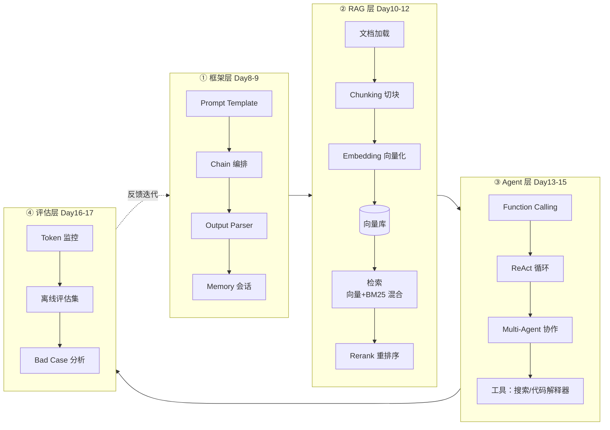
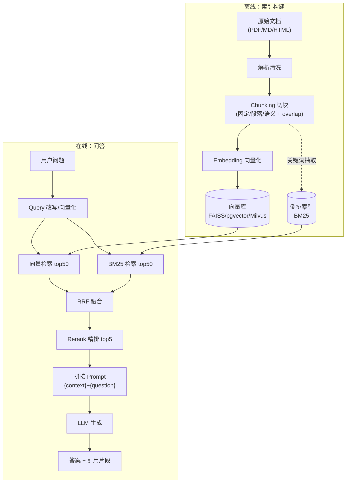
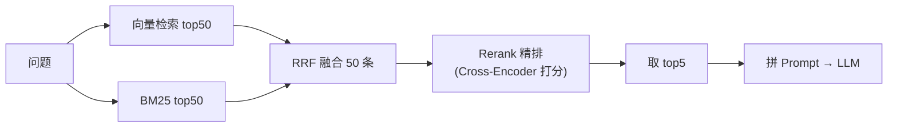
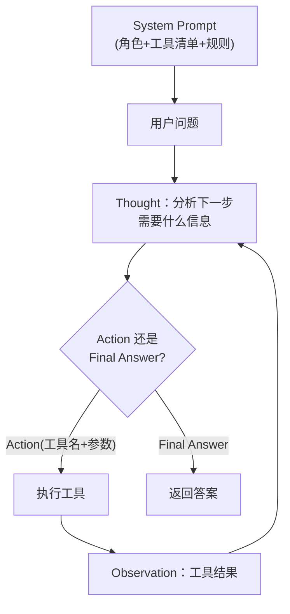
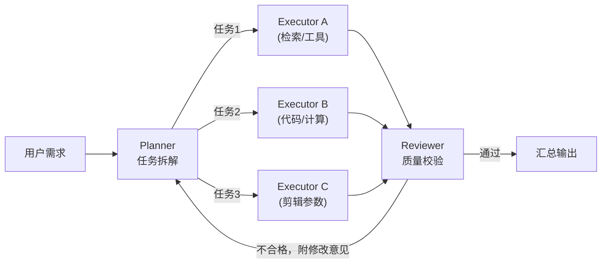
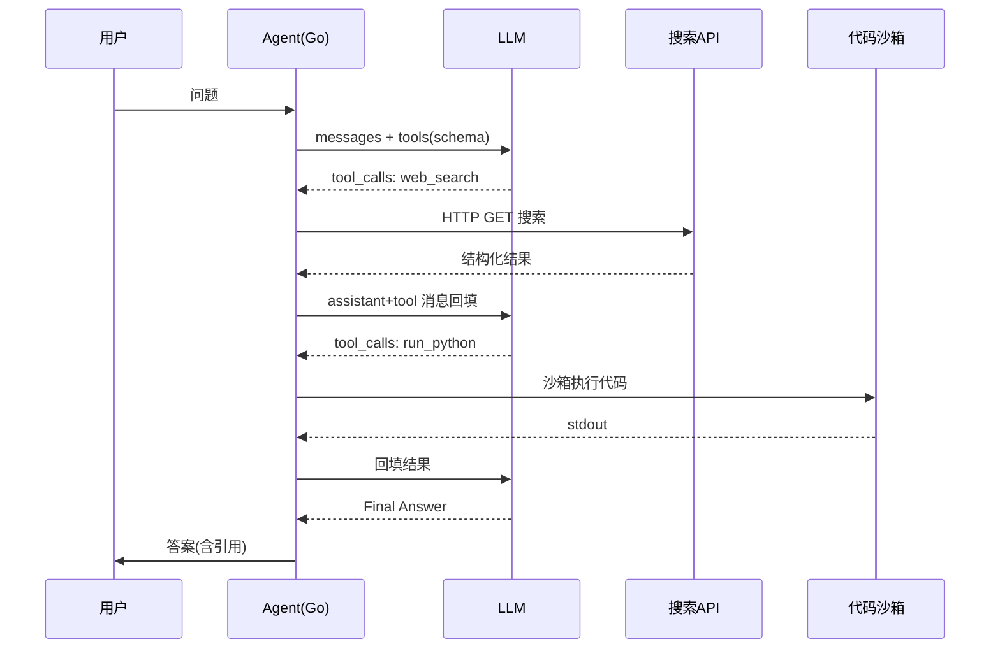
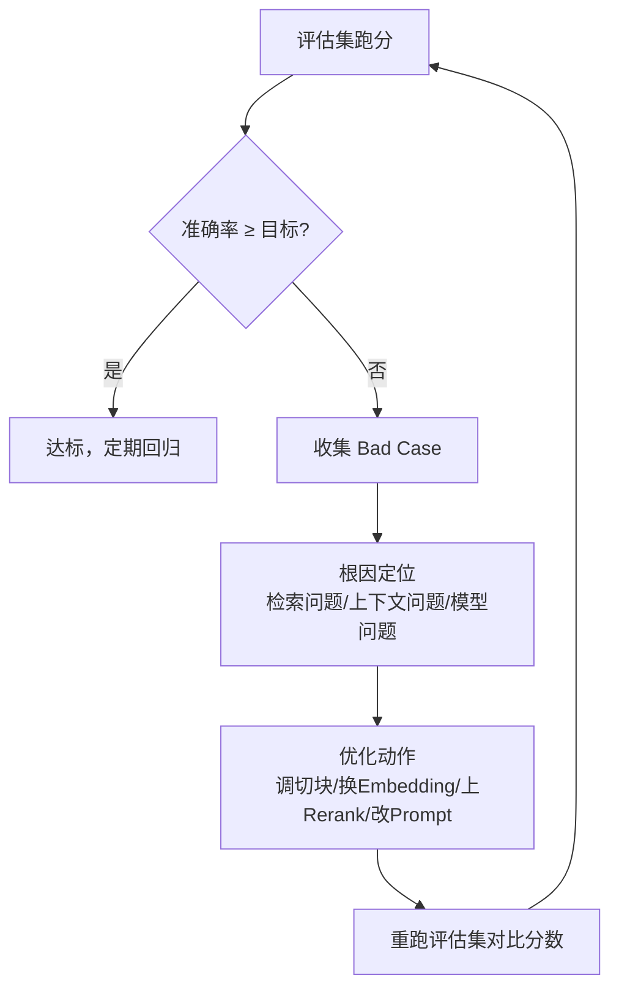
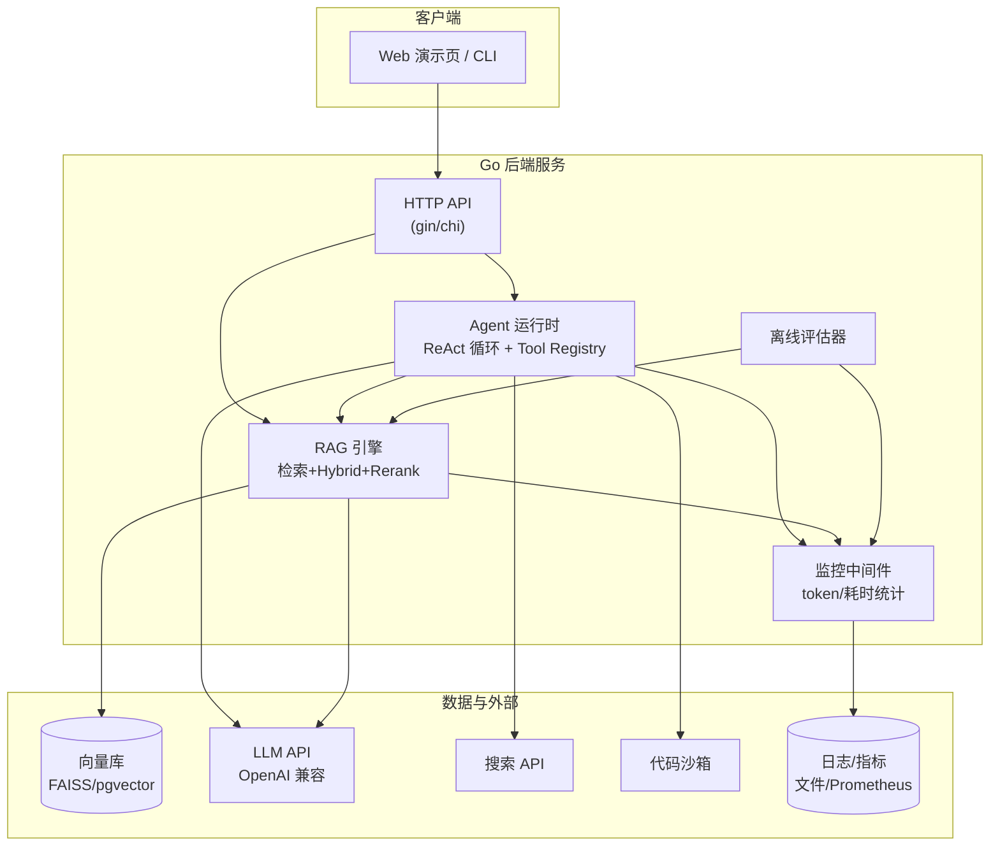

# 大模型与 Agent 核心能力构建（Day 8-17）

> 目标岗位：字节跳动剪映 CapCut「Agent 开发实习生（AI 剪辑）」（职位 ID：A80542，深圳/广州）。
> 核心语言 **Go**，框架概念用 Python 的 LangChain/LlamaIndex 理解，落地全部给 Go 对照。
> 前置依赖：已掌握基础 LLM API 调用（见「学习计划安排/第三阶段-AI应用开发基础.md」）。

## 总体目标

用 **10 天**从零构建一个**可演示的「本地知识库问答 + Agent 工具调用」系统**，四段主线：

1. **框架（Day 8-9）**：理解 LangChain/LlamaIndex 的核心抽象（Prompt Template / Chain / Output Parser / Retriever），并能用 Go 手写最小等价实现。
2. **RAG（Day 10-12）**：跑通「加载 → 切块 → 向量化 → 检索 → 生成」全链路，并完成 Chunking、Embedding 选型、Hybrid Search、Rerank 四层优化。
3. **Agent（Day 13-15）**：掌握 Function Calling、ReAct 范式、Multi-Agent 协作，落地「搜索 + 代码解释器」两个真实工具。
4. **评估（Day 16-17）**：建立 Token 成本监控与离线评估体系，整合成可演示项目并讲出 STAR 面试故事。

完成标准：面试时能**边画架构图边讲**全链路原理，并有一个带量化指标的 Go 演示项目。

## 全景图



---

# Day 8：LLM 应用框架入门

## 本日目标

理解 LangChain 六大核心抽象，能用 Python 跑通最小示例，并能在 Go 里**手写**一个等价的最小 Chain（面试会考「框架的本质是什么」）。

## 必须掌握的知识点

LangChain 的核心抽象可以压缩成一句话：**「把 LLM 调用包装成可组合的模块，用统一接口串成流水线」**。六大抽象：

| 抽象 | 作用 | 类比 |
|------|------|------|
| Prompt Template | 带变量的提示词模板，运行时填充 | 函数参数 |
| Chain | 把「模板 → 模型 → 解析」串成管道 | 管道符 `\|` |
| Output Parser | 把模型自由文本解析成结构化数据 | 反序列化 |
| Memory | 跨轮保存/注入对话历史 | 全局变量 |
| Retriever | 从向量库取相关文档片段 | 数据库查询 |
| Callback/LCEL | 监控、流式、组合 | 中间件 |

### 1. Prompt Template（Python，可运行）

```python
from langchain_core.prompts import PromptTemplate

# 定义模板：变量用 {} 占位，运行时 format 填充
prompt = PromptTemplate.from_template(
    "你是一位{role}。请用{language}回答下面的问题：\n{question}"
)

# 渲染出最终字符串
text = prompt.format(role="Go 后端专家", language="中文", question="goroutine 和线程的区别？")
print(text)
# 输出：你是一位Go后端专家。请用中文回答下面的问题：
#       goroutine 和线程的区别？
```

**关键语法**：`PromptTemplate.from_template` 支持 `{var}` 占位、`.format(**kwargs)` 填充、`.partial()` 预填固定变量（如 system 常量）。变量缺失会抛 `KeyError`，这是「模板即契约」的体现。

### 2. Chain：LLMChain / SequentialChain（Python）

LangChain 新版本推荐 LCEL（`|` 管道语法），本质还是 Chain：

```python
from langchain_core.prompts import PromptTemplate
from langchain_openai import ChatOpenAI

llm = ChatOpenAI(model="gpt-4o-mini", temperature=0)  # temperature=0 保证稳定

# 单步 Chain：Prompt Template | LLM
chain1 = prompt | llm
resp = chain1.invoke({"role": "Go 后端专家", "language": "中文", "question": "什么是 context.Context？"})
print(resp.content)  # 注意：resp 是 AIMessage 对象，取 .content

# 多步 SequentialChain：第一步的输出喂给第二步
title_prompt = PromptTemplate.from_template("为《{topic}》写一个 20 字以内的标题")
outline_prompt = PromptTemplate.from_template("根据标题《{title}》，输出一份 3 点大纲")

chain2 = (
    title_prompt
    | llm
    | (lambda msg: msg.content)   # 中间转换：AIMessage → 纯字符串
    | outline_prompt
    | llm
)
print(chain2.invoke({"topic": "Go 并发模型"}).content)
```

**关键语法**：LCEL 中每一步必须「输出类型匹配下一步的输入类型」。`llm` 输出 `AIMessage`，所以喂给下一个 `PromptTemplate` 前要用 `(lambda msg: msg.content)` 转成字符串——这是新手最常见的报错点。

### 3. Output Parser（Python）

```python
from langchain_core.output_parsers import CommaSeparatedListOutputParser
from langchain_core.prompts import PromptTemplate

parser = CommaSeparatedListOutputParser()

# 关键：parser 会生成"格式指令"文本，必须拼进 prompt，模型才知道怎么输出
format_instructions = parser.get_format_instructions()
print(format_instructions)
# Your response should be a list of comma separated values, eg: `foo, bar, baz`

prompt = PromptTemplate.from_template(
    "列出 5 个 Go Web 框架。\n请只输出列表。\n{format_instructions}"
)
chain = prompt | llm | parser          # 输出自动解析成 list
result = chain.invoke({"format_instructions": format_instructions})
print(result)  # ['gin', 'echo', 'fiber', 'chi', 'iris']
```

同理还有 `JsonOutputParser`（输出 JSON）、`PydanticOutputParser`（按 Pydantic 模型校验），原理都是**「把格式要求写进 prompt + 把输出反序列化」**——这个本质很重要，Go 侧没有框架也要自己实现这两步。

### 4. Memory（Python）

```python
from langchain_core.chat_history import InMemoryChatMessageHistory
from langchain_core.messages import HumanMessage, AIMessage, SystemMessage

history = InMemoryChatMessageHistory()
history.add_message(SystemMessage(content="你是一个乐于助人的助手"))
history.add_user_message("我叫小明，我在学 Go。")
history.add_ai_message("你好小明！加油学 Go，它是并发利器。")
history.add_user_message("我叫什么名字？我学的什么语言？")

# 记忆的本质：把历史消息拼进 messages 数组一起发给模型
messages = history.messages
print([f"{m.type}: {m.content}" for m in messages])
```

**面试关键**：Memory 不是模型自带的记忆，是**应用层把历史拼进上下文**。所以有「上下文窗口满了怎么办」→ 滑动窗口/摘要压缩/向量记忆三件套。

### 5. Retriever（Python）

```python
from langchain_community.document_loaders import TextLoader
from langchain_text_splitters import RecursiveCharacterTextSplitter
from langchain_openai import OpenAIEmbeddings
from langchain_community.vectorstores import FAISS

# 加载 + 切块
loader = TextLoader("docs/go-concurrency.md")
docs = loader.load()
splitter = RecursiveCharacterTextSplitter(chunk_size=500, chunk_overlap=50)
chunks = splitter.split_documents(docs)

# 向量化 + 存 FAISS（本地文件向量库，无需服务）
vectorstore = FAISS.from_documents(chunks, OpenAIEmbeddings())

# 转成 Retriever 并检索
retriever = vectorstore.as_retriever(search_kwargs={"k": 4})
hits = retriever.invoke("Go 的 channel 有什么用？")
for h in hits:
    print(h.page_content[:100])
```

## LlamaIndex 定位对比（数据框架 vs 编排框架）

| 维度 | LangChain | LlamaIndex |
|------|-----------|------------|
| 定位 | 通用 LLM 应用**编排框架**（Chain/Agent/Tool） | 专注**数据接入与索引**的框架（文档 → 可检索索引） |
| 核心抽象 | Chain、Agent、Tool、Memory | Document、Node、Index、Retriever、QueryEngine |
| 强项 | Agent 编排、工具调用、多框架整合 | 数据加载器（LlamaHub）、索引结构（树/图/关键词）、RAG 流水线 |
| 上手曲线 | 较陡，抽象多 | 较平，RAG 场景开箱即用 |
| RAG 场景选谁 | 需要 Agent + RAG 混合时 | 纯知识库问答优先 |
| 面试结论 | **都用过/至少理解**：RAG 场景两者都能做，LangChain 生态更广，LlamaIndex 数据管线更顺 | |

> 关联阅读：/phase3/docs-rag/学习笔记.md、/phase3/docs-rag/项目设计.md 有基于这两类框架的落地笔记。

## Go 侧落地（岗位核心）

### A. OpenAI 兼容接口调用（不依赖任何框架，纯 net/http）

```go
package main

import (
	"bytes"
	"context"
	"encoding/json"
	"fmt"
	"io"
	"net/http"
	"os"
	"time"
)

// ---- 数据结构：对齐 OpenAI chat/completions 协议 ----

// ChatMessage 消息：role 取 system / user / assistant / tool
type ChatMessage struct {
	Role    string `json:"role"`
	Content string `json:"content"`
}

// ChatRequest 请求体（省略可选字段如 stream/frequency_penalty）
type ChatRequest struct {
	Model       string        `json:"model"`
	Messages    []ChatMessage `json:"messages"`
	Temperature float64       `json:"temperature,omitempty"`
	MaxTokens   int           `json:"max_tokens,omitempty"`
}

// Usage token 用量（Day16 成本监控的数据源）
type Usage struct {
	PromptTokens     int `json:"prompt_tokens"`
	CompletionTokens int `json:"completion_tokens"`
	TotalTokens      int `json:"total_tokens"`
}

// ChatResponse 只取需要的字段
type ChatResponse struct {
	Choices []struct {
		Message struct {
			Content string `json:"content"`
		} `json:"message"`
		FinishReason string `json:"finish_reason"`
	} `json:"choices"`
	Usage Usage `json:"usage"`
}

// ---- 核心调用函数 ----

// ChatCompletion 调 OpenAI 兼容接口（openai / 通义 / 豆包 / deepseek 都兼容）
func ChatCompletion(ctx context.Context, apiKey, baseURL, model string, messages []ChatMessage) (string, Usage, error) {
	body, _ := json.Marshal(ChatRequest{
		Model:       model,
		Messages:    messages,
		Temperature: 0.7,
	})
	// 注意：baseURL 以 /v1 结尾，接口路径拼 /chat/completions
	req, _ := http.NewRequestWithContext(ctx, http.MethodPost, baseURL+"/chat/completions", bytes.NewReader(body))
	req.Header.Set("Content-Type", "application/json")
	req.Header.Set("Authorization", "Bearer "+apiKey)

	client := &http.Client{Timeout: 60 * time.Second} // 必须设超时，LLM 可能很慢
	resp, err := client.Do(req)
	if err != nil {
		return "", Usage{}, err
	}
	defer resp.Body.Close()

	if resp.StatusCode != http.StatusOK {
		data, _ := io.ReadAll(resp.Body)
		return "", Usage{}, fmt.Errorf("LLM API 错误 status=%d body=%s", resp.StatusCode, data)
	}
	var out ChatResponse
	if err := json.NewDecoder(resp.Body).Decode(&out); err != nil {
		return "", Usage{}, err
	}
	if len(out.Choices) == 0 {
		return "", Usage{}, fmt.Errorf("choices 为空，模型可能被截断")
	}
	return out.Choices[0].Message.Content, out.Usage, nil
}

func main() {
	apiKey := os.Getenv("LLM_API_KEY")
	// 国内示例：通义千问 baseURL=https://dashscope.aliyuncs.com/compatible-mode/v1
	messages := []ChatMessage{
		{Role: "system", Content: "你是一位 Go 语言专家，回答要简洁。"},
		{Role: "user", Content: "解释 goroutine 和线程的区别。"},
	}
	answer, usage, err := ChatCompletion(context.Background(), apiKey,
		"https://api.openai.com/v1", "gpt-4o-mini", messages)
	if err != nil {
		panic(err)
	}
	fmt.Println(answer)
	fmt.Printf("tokens: prompt=%d completion=%d total=%d\n",
		usage.PromptTokens, usage.CompletionTokens, usage.TotalTokens)
}
```

**语法要点**：`context.WithTimeout` 或 `http.Client.Timeout` 二选一必须有；`omitempty` 控制可选字段；`json:"-"` 排除字段；国内各家都实现了 OpenAI 兼容端点，**同一份代码换 baseURL + apiKey 即可切换供应商**——这是 Go 落地最大的红利。

### B. langchaingo 简介

- 仓库：`github.com/tmc/langchaingo`，LangChain 的 Go 移植，抽象基本对齐（`llms`、`chains`、`prompts`、`embeddings`、`vectorstores`）。
- 适用：快速验证概念；但**面试与生产更推荐自己封装**（依赖少、可控、能讲清原理）。
- 示例：

```go
import (
	"context"
	"os"

	"github.com/tmc/langchaingo/llms"
	"github.com/tmc/langchaingo/llms/openai"
)

func main() {
	llm, err := openai.New(
		openai.WithModel("qwen-plus"),
		openai.WithBaseURL("https://dashscope.aliyuncs.com/compatible-mode/v1"),
		openai.WithToken(os.Getenv("DASHSCOPE_API_KEY")),
	)
	if err != nil {
		panic(err)
	}
	answer, err := llm.Call(context.Background(), "用一句话解释 ReAct 范式",
		llms.WithTemperature(0.7), llms.WithMaxTokens(200))
	if err != nil {
		panic(err)
	}
	println(answer)
}
```

### C. 自研 Chain 的最小实现（面试可手写）

**核心思想**：Chain = 一个接收 `input`、返回 `output` 的函数，可组合。用 Go 接口表达：

```go
package chain

import "context"

// Chain 是所有可串联处理单元的抽象。
// 约定：input 是共享的键值对（类似请求上下文），
// 每个 Chain 从 input 读参数、往 input 写结果。
type Chain interface {
	Call(ctx context.Context, input map[string]any) (string, error)
}

// LLMClient 抽象 LLM 调用，方便替换供应商与做监控包装（Day16 用到）
type LLMClient interface {
	Complete(ctx context.Context, prompt string) (string, error)
}
```

```go
// PromptChain：把 input 渲染进 {{var}} 模板
type PromptChain struct {
	Template string
}

var varRe = regexp.MustCompile(`\{\{(\w+)\}\}`)

func (p PromptChain) Call(ctx context.Context, input map[string]any) (string, error) {
	out := varRe.ReplaceAllStringFunc(p.Template, func(m string) string {
		key := varRe.FindStringSubmatch(m)[1]
		if v, ok := input[key]; ok {
			return fmt.Sprint(v)
		}
		return m // 变量缺失时保留原文，便于调试
	})
	input["prompt"] = out // 写入共享状态
	return out, nil
}

// LLMChain：调 LLM，结果写入 input["output"]
type LLMChain struct {
	Client LLMClient
}

func (c LLMChain) Call(ctx context.Context, input map[string]any) (string, error) {
	prompt, _ := input["prompt"].(string)
	out, err := c.Client.Complete(ctx, prompt)
	if err != nil {
		return "", err
	}
	input["output"] = out
	return out, nil
}

// SequentialChain：顺序执行子链，前一个的输出喂给后一个
type SequentialChain struct {
	Chains []Chain
}

func (s SequentialChain) Call(ctx context.Context, input map[string]any) (string, error) {
	for _, c := range s.Chains {
		if _, err := c.Call(ctx, input); err != nil {
			return "", fmt.Errorf("chain 执行失败: %w", err)
		}
	}
	out, _ := input["output"].(string)
	return out, nil
}

// 使用示例：模板 → LLM 两条链串起来
func Example() {
	promptChain := PromptChain{Template: "你是Go专家。问题：{{question}}"}

	// 内联一个简单 LLM 实现（生产用真实 client）
	llmChain := LLMChain{Client: fakeLLM{}}

	pipe := SequentialChain{Chains: []Chain{promptChain, llmChain}}
	input := map[string]any{"question": "什么是 defer？"}
	result, err := pipe.Call(context.Background(), input)
	if err != nil {
		panic(err)
	}
	println(result)
}
```

> 关联阅读：/phase3/pi-harness/LLM抽象层.md（LLM 客户端抽象怎么做）、/phase3/pi-harness/工程化落地.md（接口分层）、/后端技术栈强化/06-agent-backend/系统设计与串联.md。

## 八股文要点

**Q1：为什么需要 Prompt Template？直接拼字符串不行吗？**
答：① 模板把「提示词结构」与「运行时数据」解耦，变量集中管理、可复用；② 天然防注入——用户输入作为变量注入，而不是当作指令拼接进提示词；③ 与 Output Parser 配合形成「输入输出契约」，便于测试与版本管理。直接拼字符串在参数多、多语言、多模板场景会失控。

**Q2：为什么需要 Output Parser？**
答：LLM 输出是自由文本，不可靠。Output Parser 解决：① 结构化（转 JSON/列表），让下游程序能消费；② 校验（字段缺失、类型错误可重试）；③ 格式纠错（解析失败触发重新生成）。本质 = 「格式指令写进 prompt + 输出反序列化 + 失败重试」。

**Q3：LangChain 与直接调 API 的区别？**
答：直接调 API 每次都要手写请求体、解析响应、拼历史、管异常；LangChain 把这些封装成可组合的模块（Template/Chain/Parser/Memory/Retriever），提供统一接口（`.invoke()`）和组合能力（LCEL 管道）。代价是抽象多、学习曲线陡、黑盒难排查。**面试加分回答**：所以生产环境我倾向轻量自研（Go 接口化封装），框架本质就是「接口 + 组合 + 约定」，理解了原理自己也能写。

## 实战练习

1. 用 Python LangChain 跑通「模板 → LLM → Parser」三步链，输入一个问题，输出一个 Go 框架列表（Python 列表）。
2. 用 Go 手写 `PromptChain + LLMChain + SequentialChain`，实现同样功能，替换真实 API。
3. 对比：同一个问题，直接调 API vs 走 Chain，代码量差多少？

## 验收标准

- [ ] 能讲清 LangChain 六大抽象各自解决什么问题（面试 3 分钟版）。
- [ ] Python 侧三步链可运行并输出正确列表。
- [ ] Go 侧自研 Chain 编译通过、可替换供应商（换 baseURL 即可）。
- [ ] 能回答三个八股文要点中的任意一个。

---

# Day 9：Prompt Engineering 与知识库问答第一步

## 本日目标

掌握 Prompt 设计方法论，并跑通一条**不做检索优化**的最小知识库问答链路（先通后优）。

## 必须掌握的知识点

### 1. 三种消息角色与职责

| 角色 | 职责 | 使用要点 |
|------|------|----------|
| system | 设定全局行为、人格、约束（最高优先级指令） | 常驻，写清「你是谁、能做什么、不能做什么、输出格式」 |
| user | 用户真实输入 | 可变，来自业务 |
| assistant | 模型回复；多轮对话回填历史 | 拼接历史时按时间序交替出现 |

### 2. 提示词设计方法论

| 技巧 | 说明 | 示例要点 |
|------|------|----------|
| Few-shot（少样本） | 给 2-3 个「输入→输出」示例，让模型模仿格式 | 「例如：问：x 答：y」 |
| CoT（思维链） | 让模型先推理再回答，提升复杂问题准确率 | 「请一步步思考」/ 要求输出推理过程 |
| 结构化输出 | 用 JSON mode 或格式指令约束输出 | `response_format={"type":"json_object"}` |
| 模板变量 | `{context}` `{question}` 等占位符 | RAG 拼接的标准姿势 |

Few-shot + CoT 示例（Python）：

```python
from langchain_core.prompts import ChatPromptTemplate

prompt = ChatPromptTemplate.from_messages([
    ("system", "你是技术问答助手，先用一句话推理，再给结论。"),
    ("human", "问题：什么是 goroutine？\n推理：\n结论："),
    ("ai", "推理：goroutine 是 Go 调度器管理的轻量级执行单元。\n结论：可以把它理解为用户态线程，开销远小于系统线程。"),
    ("human", "问题：{question}\n推理：\n结论："),
])
messages = prompt.format_messages(question="什么是 channel？")
# 再把 messages 传给 llm.invoke()
```

JSON mode（OpenAI 风格，Python）：

```python
from langchain_openai import ChatOpenAI

llm = ChatOpenAI(model="gpt-4o-mini", temperature=0)
# 请求层开启 JSON 输出
resp = llm.invoke(
    "把下面内容解析成 JSON：goroutine 是轻量级线程。",
    response_format={"type": "json_object"},  # 强制 JSON
)
print(resp.content)  # {"concept": "goroutine", "summary": "轻量级线程"}
```

## 搭建最小知识库问答链路

链路：**加载文档 → 切块 → 向量化 → 存向量库 → 检索 → 拼接 Prompt → LLM 回答**。

### Python 实现路径（可运行骨架）

```python
# mini_rag.py：最小 RAG 链路，先跑通，不做优化
from langchain_community.document_loaders import DirectoryLoader, TextLoader
from langchain_text_splitters import RecursiveCharacterTextSplitter
from langchain_openai import OpenAIEmbeddings, ChatOpenAI
from langchain_community.vectorstores import FAISS
from langchain_core.prompts import PromptTemplate

# 1. 加载：读取 docs/ 下所有 .md
loader = DirectoryLoader("docs/", glob="**/*.md", loader_cls=TextLoader)
docs = loader.load()

# 2. 切块：500 字符/块，重叠 50
splitter = RecursiveCharacterTextSplitter(chunk_size=500, chunk_overlap=50)
chunks = splitter.split_documents(docs)

# 3. 向量化 + 4. 存库（FAISS 本地文件，免部署）
vectorstore = FAISS.from_documents(chunks, OpenAIEmbeddings())
vectorstore.save_local("faiss_index")          # 持久化
# vectorstore = FAISS.load_local("faiss_index", OpenAIEmbeddings())  # 下次直接加载

# 5. 检索：取最相关的 4 个片段
retriever = vectorstore.as_retriever(search_kwargs={"k": 4})
hits = retriever.invoke("goroutine 和线程有什么区别？")

# 6. 拼接 Prompt：{context} {question} 模板
rag_prompt = PromptTemplate.from_template(
"""你是一个知识库问答助手。只能依据【资料】回答，资料中没有的内容，请回答"资料中未找到"。

【资料】
{context}

【问题】
{question}

请用中文回答："""
)
context = "\n\n".join(f"[片段{i+1}] {d.page_content}" for i, d in enumerate(hits))
final_prompt = rag_prompt.format(context=context, question="goroutine 和线程有什么区别？")

# 7. LLM 回答（temperature=0：知识问答要确定性）
llm = ChatOpenAI(model="gpt-4o-mini", temperature=0)
answer = llm.invoke(final_prompt).content
print(answer)
```

### Go 实现路径（代码骨架，向量库接口化）

```go
package rag

import (
	"context"
	"fmt"
	"strings"
)

// Chunk 一个检索单元
type Chunk struct {
	ID      string
	Content string
	Meta    map[string]string
}

// VectorStore 抽象向量库：FAISS / Milvus / pgvector 都可实现
type VectorStore interface {
	Search(ctx context.Context, query string, topK int) ([]Chunk, error)
}

// BuildPrompt 拼接 {context}+{question}，对应 Python 的 rag_prompt.format
func BuildPrompt(question string, hits []Chunk) string {
	var sb strings.Builder
	sb.WriteString("你是一个知识库问答助手。只能依据【资料】回答，资料中没有的内容，请回答\"资料中未找到\"。\n\n【资料】\n")
	for i, h := range hits {
		fmt.Fprintf(&sb, "[片段%d] %s\n\n", i+1, h.Content)
	}
	fmt.Fprintf(&sb, "【问题】\n%s\n\n请用中文回答：", question)
	return sb.String()
}

// RunRAG 检索 → 拼 Prompt → 调 LLM（LLMClient 见 Day8）
func RunRAG(ctx context.Context, store VectorStore, llm LLMClient, question string) (string, error) {
	hits, err := store.Search(ctx, question, 4)
	if err != nil {
		return "", fmt.Errorf("检索失败: %w", err)
	}
	if len(hits) == 0 {
		return "资料库中没有相关内容。", nil // 兜底：空检索不能进 LLM
	}
	prompt := BuildPrompt(question, hits)
	answer, err := llm.Complete(ctx, prompt)
	if err != nil {
		return "", fmt.Errorf("生成失败: %w", err)
	}
	return answer, nil
}
```

**Go 侧落地注意**：向量库选型——FAISS（纯本地、适合演示）、pgvector（Postgres 插件，生产常用）、Milvus（独立服务、大厂标配）。面试说「接口抽象 + 可替换」即可，不必在演示里真的部署 Milvus。

## 八股文要点

**Q1：RAG 为什么优于「把资料全塞进 Prompt」？**
答：① 上下文窗口有限——文档一大就放不下；② 成本——token 按量计费，全量塞入每轮都付全量钱；③ 噪音——无关内容会干扰模型、降低准确率；④ 可更新性——文档更新只需重建索引，不用改模型；⑤ 幻觉——RAG 让回答有「引用依据」，降低编造概率。**纯塞上下文的极限**：单文档几千字以内、必须全部相关时勉强可用。

**Q2：幻觉（Hallucination）是怎么来的？**
答：① 模型本质是「预测下一个 token」，训练目标不是「查证事实」；② 训练数据被压缩成参数，细节必然丢失/过时；③ 检索不到相关内容时模型倾向「编一个合理的」；④ Prompt 诱导（要求"详细回答"）会增加编造概率；⑤ 切块质量差、检索到无关片段时会「一本正经胡说」。**缓解**：RAG + 强制引用 + 「不知道就直说」指令 + 评估兜底。

## 实战练习

1. 准备 5 篇本地 Markdown 文档（比如 Go 语言知识点），内容至少含 10 个可查证的事实点。
2. 用 Python **或** Go 自选实现最小问答链路，问 5 个「文档内事实」问题 + 2 个「文档外」问题。
3. 记录每个问题的回答原文，比对文档事实是否正确。

## 验收标准

- [ ] 链路七步能讲清楚，且每一步对应一个代码函数。
- [ ] 5 个文档内问题至少答对 4 个；文档外问题应回复「资料中未找到」而不是编造。
- [ ] 能回答「RAG vs 纯塞上下文」和「幻觉来源」两个八股问题。

---

# Day 10-11：RAG 深度优化（Chunking 与 Embedding 选型）

## 本日目标

解决最小链路暴露出的两大问题：**检索不到**（切块太粗/太细）与 **检索不准**（Embedding 选型与相似度度量）。用实验数据说话。

## 必须掌握的知识点

### 1. 文档切片（Chunking）

三种基础策略：

| 策略 | 做法 | 优点 | 缺点 | 适用 |
|------|------|------|------|------|
| 固定长度 | 按字符数硬切 | 简单可控、实现成本低 | 切断语义/段落 | 英文技术文档、初期跑通 |
| 按段落 | 以 `\n\n` 等自然边界切 | 保留语义完整性 | 段落过长时仍需二次切 | 结构化 Markdown |
| 按语义 | 按句子/主题嵌入后聚类或按标题层级切 | 语义最完整 | 复杂、慢、成本高 | 长文档、强语义场景 |

**Chunk Overlap（重叠）**：切块时保留前后 50-100 字符重叠，避免「关键句恰好被切在边界上」导致检索丢信息。**核心权衡**：chunk 越大 → 上下文信息越全但噪音越多、检索粒度粗；chunk 越小 → 检索精准但单块信息量不足。经验起点：**500-800 字符 + 10% 重叠**。

> 13 种分块策略完整版见：/phase3/docs-rag/Rag的13种分块策略.md（含 RAPTOR、Multi-representation 等进阶方案）。

Python 两种切法（可运行）：

```python
def chunk_by_fixed(text: str, size: int = 500, overlap: int = 50) -> list[str]:
    """固定长度切块 + 重叠"""
    chunks = []
    start = 0
    while start < len(text):
        chunks.append(text[start:start + size])
        start += size - overlap
    return chunks

def chunk_by_paragraph(text: str, max_chars: int = 500) -> list[str]:
    """按段落切分，超长段落再内部拆"""
    paragraphs = [p.strip() for p in text.split("\n\n") if p.strip()]
    chunks, current = [], ""
    for p in paragraphs:
        if len(p) > max_chars:                     # 超长段落按句子二次切
            if current:
                chunks.append(current)
                current = ""
            chunks.extend(chunk_by_fixed(p, max_chars, 50))
        elif len(current) + len(p) > max_chars:
            chunks.append(current)
            current = p
        else:
            current = f"{current}\n\n{p}".strip()
    if current:
        chunks.append(current)
    return chunks
```

Go 固定长度切块（注意中文用 rune，不能按 byte 切）：

```go
// ChunkByFixed 固定长度切块 + 重叠。中文必须转 []rune 按字符切。
func ChunkByFixed(text string, size, overlap int) []string {
	runes := []rune(text)
	if size <= 0 || size-overlap <= 0 {
		return []string{text}
	}
	var chunks []string
	for start := 0; start < len(runes); start += size - overlap {
		end := start + size
		if end > len(runes) {
			end = len(runes)
		}
		chunks = append(chunks, string(runes[start:end]))
		if end == len(runes) {
			break
		}
	}
	return chunks
}
```

**切块对检索质量的影响实验**（本日必做）：同一份文档分别用 200/500/1000 字符切块，记录同一问题的检索命中情况。预期结论：过小的块检索到但上下文不足，过大的块含大量无关内容拉低相关性。

### 2. Embedding 选型

| 模型 | 维度 | 最大输入 | 中文效果 | 成本 | 适用 |
|------|------|----------|----------|------|------|
| text-embedding-3-small (OpenAI) | 1536（可降维） | 8191 token | 良好 | ~$0.02/百万 token | 通用、便宜 |
| text-embedding-3-large (OpenAI) | 3072 | 8191 token | 良好 | ~$0.13/百万 token | 精度优先 |
| bge-large-zh-v1.5 (BAAI) | 1024 | 512 token | **优（中文专长）** | 开源可自部署 | 中文知识库 |
| bge-m3 (BAAI) | 1024 | 8192 | 优，支持多语言+稀疏向量 | 开源 | 混合检索 |
| M3E (moka-ai) | 768 | 512 | 优 | 开源 | 中文、轻量 |
| text-embedding-v2/v3（通义） | 1536/1024 | 2048 | 优 | 约 0.0005-0.0007 元/千 token | 国内合规 |
| doubao-embedding（豆包） | 2048 | 4096 | 优 | 约 0.0005 元/千 token | 字节系生态 |

**选型三问**：① 中文占比高不高（中文多选 BGE/M3E/国内模型）；② 数据量级（百万级以下 API 划算，百万级以上考虑自部署开源）；③ 上线合规（国内业务优先国内模型）。

### 3. 相似度度量

- **余弦相似度**（cosine）：`cos(A,B) = A·B / (|A||B|)`，只关心方向不关心长度，**最常用**。
- **点积**（dot product）：向量已归一化时 = 余弦，更快。
- **欧氏距离**（L2）：数值敏感，向量库默认可能用 L2，注意一致性。
- 工程技巧：向量入库前归一化，之后点积 = 余弦，兼顾精度与速度。

### 4. 混合检索（Hybrid Search）

- **向量检索**：语义相似，但同义词/专有名词/精确匹配弱。
- **BM25（关键词）**：精确词匹配强（TF-IDF 进阶），但无语义。
- **混合**：两个检索器并行召回 → RRF（Reciprocal Rank Fusion）融合排名 → 取 top-k。

```python
def rrf_fusion(vector_hits, bm25_hits, k=60):
    """RRF 倒数排名融合：只看排名不看分数，避免两套分数不可比。
    每个文档得分 = Σ 1/(k + rank)，rank 从 1 开始。"""
    scores = {}
    for rank, doc in enumerate(vector_hits + bm25_hits, start=1):
        scores[doc.id] = scores.get(doc.id, 0) + 1.0 / (k + rank)
    return sorted(scores.items(), key=lambda x: -x[1])
```

## RAG 完整流水线图



## 八股文要点

**Q1：chunk 大小怎么定？**
答：没有唯一答案，取决于「文档粒度 + 检索单元 + 上下文窗口」。经验法：默认 500-800 字符、10-15% 重叠；技术文档按章节、代码按函数块、长文按语义。**必须做消融实验**（200/500/1000 对比命中率），用数据定，不拍脑袋。

**Q2：Embedding 模型怎么选？**
答：看四件事——① 语言（中文场景避开纯英文优化模型）；② 维度（越高信息量越大但存储/计算成本越高）；③ 输入长度上限（文档片段超过上限会被截断）；④ 成本与合规（开源自部署 vs API）。没有"最好"，只有"最适合你的语料"。

**Q3：相似度阈值怎么设？**
答：先看分数分布——用一批已知相关/无关的 query-doc 对画出分数直方图，在两类分布的交界处取阈值（通常 0.5-0.8 之间，取决于模型与归一化方式）。阈值过低放进来大量噪音，过高会漏召回。**检索命中但答错 = 阈值问题；检索不到 = 切块/embedding 问题**，先定位再调参。

## 实战练习

1. 选一份 3000 字以上中文长文档，分别用「固定 200 / 固定 500 / 按段落」三种策略切块。
2. 对 10 个问题分别用三种切块结果做检索，统计「正确片段是否在 top-3」。
3. 对比两个 Embedding 模型（如 bge 系 vs OpenAI）在同一批问题上的命中率。
4. 实现 Hybrid Search（向量 + BM25 + RRF），对比纯向量检索命中率。

## 验收标准

- [ ] 三种切块策略各有代码实现，且实验数据记录在表格里（能说出哪种策略胜出、为什么）。
- [ ] 能对比至少两个 Embedding 模型并给出命中率数据。
- [ ] RRF 融合代码可运行，混合检索 ≥ 纯向量检索的命中率。
- [ ] 三个八股文要点能结合自己的实验数据回答。

---

# Day 12：RAG 进阶 —— Rerank 重排序

## 本日目标

解决「召回 50 个片段但真正相关的只有 3 个」的问题：用 Rerank 把**召回（粗）**和**精排（细）**分开，两阶段检索。

## 必须掌握的知识点

### 1. 为什么需要 Rerank

- 向量检索是「快而粗」：用向量相似度筛掉大部分无关内容（召回阶段），但排序质量不够。
- Embedding 只用一次相似度计算，**query 和 doc 是分开编码的**，细节交互（哪个词匹配了）丢失。
- Rerank 用更强的模型对「query 与每个候选文档拼接」精细打分，把最相关的顶到前面。

**典型配置：召回 50 → 精排 5**。Rerank 只作用于小集合，所以成本可控。

### 2. Bi-Encoder vs Cross-Encoder

| 维度 | Bi-Encoder（Embedding 检索） | Cross-Encoder（Rerank） |
|------|------------------------------|--------------------------|
| 编码方式 | query、doc 分别独立编码成向量 | query 和 doc **拼接后一起编码** |
| 交互 | 无交互，最后算向量相似度 | 全程 token 级交互，捕捉精确匹配 |
| 速度 | 快（可预计算索引、百万级） | 慢（每个候选都要过一遍模型） |
| 精度 | 语义召回够用，细节排序不足 | **显著更准** |
| 用途 | 第一阶段召回 | 第二阶段精排小集合 |

### 3. 主流 Rerank 模型

| 模型 | 特点 | 使用方式 |
|------|------|----------|
| BAAI/bge-reranker-v2-m3 | 开源、中文好、多语言 | FlagEmbedding 库或独立服务 |
| BAAI/bge-reranker-base/large | 经典版本、轻量 | FlagEmbedding |
| Cohere Rerank | API 服务、多语言 | HTTP API |
| 通义/豆包 rerank | 国内 API 化 | 各云厂商端点 |

## 两阶段检索架构图



## 实现

### Python（FlagEmbedding / BGE reranker，可运行）

```bash
# 安装（模型会自动下载到本地）
pip install FlagEmbedding
```

```python
from FlagEmbedding import FlagReranker

# 加载 BGE reranker（Cross-Encoder）
reranker = FlagReranker("BAAI/bge-reranker-v2-m3", use_fp16=True)

# query 与每个候选文档组成 pair，一次算分
query = "goroutine 和线程的区别"
candidates = [
    "goroutine 是 Go 的轻量级执行单元，由 Go 运行时调度。",
    "Java 的线程由操作系统调度，创建成本较高。",
    "本篇介绍 Go 的包管理与模块机制。",          # 明显无关
    "线程切换需要内核态，goroutine 切换在用户态完成。",
]
pairs = [[query, doc] for doc in candidates]
scores = reranker.compute_score(pairs, normalize=True)  # normalize=True 输出 0~1

# 按分数从高到低取 top2
ranked = sorted(zip(candidates, scores), key=lambda x: -x[1])[:2]
for doc, score in ranked:
    print(f"{score:.3f}\t{doc}")
```

### Go（HTTP 调用 rerank 服务）

Rerank 模型一般以独立服务部署（FastAPI 封装或云厂商 API），Go 侧只需 HTTP 调用：

```go
package rerank

import (
	"bytes"
	"context"
	"encoding/json"
	"fmt"
	"io"
	"net/http"
	"time"
)

// ReRankRequest 对齐 Cohere / 各兼容厂商的 rerank 协议
type ReRankRequest struct {
	Model     string   `json:"model"`
	Query     string   `json:"query"`
	Documents []string `json:"documents"`
	TopN      int      `json:"top_n,omitempty"`
}

type ReRankResult struct {
	Index          int     `json:"index"`
	RelevanceScore float64 `json:"relevance_score"`
	Text           string  `json:"text"`
}

type ReRankResponse struct {
	Results []ReRankResult `json:"results"`
}

// ReRank 对候选文档精排，返回分数降序的 topN
func ReRank(ctx context.Context, endpoint, apiKey, model, query string, docs []string, topN int) ([]ReRankResult, error) {
	body, _ := json.Marshal(ReRankRequest{
		Model: model, Query: query, Documents: docs, TopN: topN,
	})
	req, _ := http.NewRequestWithContext(ctx, http.MethodPost, endpoint, bytes.NewReader(body))
	req.Header.Set("Content-Type", "application/json")
	req.Header.Set("Authorization", "Bearer "+apiKey)

	client := &http.Client{Timeout: 10 * time.Second} // rerank 单批调用要设超时
	resp, err := client.Do(req)
	if err != nil {
		return nil, err
	}
	defer resp.Body.Close()
	if resp.StatusCode != http.StatusOK {
		data, _ := io.ReadAll(resp.Body)
		return nil, fmt.Errorf("rerank 服务错误 status=%d body=%s", resp.StatusCode, data)
	}
	var out ReRankResponse
	if err := json.NewDecoder(resp.Body).Decode(&out); err != nil {
		return nil, err
	}
	return out.Results, nil
}

// TwoStageRetrieve 两阶段检索：向量召回 50 → rerank 精排 5
func TwoStageRetrieve(ctx context.Context, store VectorStore, rerankerURL, query string, topK int) ([]Chunk, error) {
	// 阶段1：向量检索召回 50
	hits, err := store.Search(ctx, query, 50)
	if err != nil {
		return nil, err
	}
	docs := make([]string, len(hits))
	for i, h := range hits {
		docs[i] = h.Content
	}
	// 阶段2：rerank 精排 top5（TopN 传 topK）
	results, err := ReRank(ctx, rerankerURL, "", "bge-reranker-v2-m3", query, docs, topK)
	if err != nil {
		return nil, err
	}
	// 按 rerank 分数重排原 chunks
	ranked := make([]Chunk, 0, len(results))
	for _, r := range results {
		ranked = append(ranked, hits[r.Index])
	}
	return ranked, nil
}
```

## 检索不准的 Bad Case 分析模板

| 问题（用户原话） | 现象 | 根因分析 | 优化动作 |
|------------------|------|----------|----------|
| 「goroutine 和线程的区别」 | 答非所问，引用了无关片段 | 召回 top1 是噪声，向量相似度排序不精确 | 上 Rerank 精排；或提高 top-k 召回量再精排 |
| 「channel 的缓冲怎么设」 | 回答来自别的主题 | 切块把缓冲内容与主题分离 | 改按段落/章节切块，加 overlap |
| 「错误处理和 panic」 | 检索到但答案不完整 | 相关片段分散在多个块 | 增大 chunk 或引入「父子块」检索（父块进上下文） |
| 专业名词（如「RRF」） | 检索不到 | Embedding 对缩写不敏感 | 混合检索加 BM25；或加同义词扩展 |

> 完整优化策略树见：/phase3/docs-rag/落地化的RAG系统优化策略.md（从索引、检索、生成三层排查）。

## 八股文要点

**Q1：Rerank 与 Embedding 检索的区别？**
答：Embedding 检索是 Bi-Encoder——query 和 doc 分开编码，一次算相似度，快但「理解粒度」粗，适合百万级召回；Rerank 是 Cross-Encoder——query 与每个 doc 拼接后联合编码，token 级交互捕捉精确匹配，精度高但慢，只能用于小集合精排。**一句话：检索负责快、宽，Rerank 负责准、精。**

**Q2：什么时候必须上 Rerank？**
答：① 知识库规模大、召回 top-k 里噪声多；② 问题需要精确细节（数字、条款、代码）而不是泛语义；③ 评估发现「检索命中但排序不对」（正确片段不在 top-3）；④ 业务对准确率要求高（客服、法务、医疗）。小规模演示项目可不加，但面试要能说出「两阶段检索」的设计。

## 实战练习

1. 准备 30 个候选片段（含 10 个噪声片段），对 10 个问题分别做「仅向量检索 top3」和「向量 top50 + rerank top3」。
2. 统计两组方案的「正确率」（正确答案是否进入最终上下文）与平均耗时。
3. 用 Bad Case 模板记录 3 个失败案例，各给出一个优化动作。

## 验收标准

- [ ] 两阶段检索代码可运行（Python 或 Go 任一实现，另一条路径给出骨架）。
- [ ] 对比数据表：有 Rerank 准确率明显高于无 Rerank（记录数字）。
- [ ] 能画出「召回 50 → 精排 5 → LLM」架构图并讲解每一步。
- [ ] Bad Case 表至少 3 行，每行根因与优化动作自洽。

---

# Day 13-14：Agent 核心范式

## 本日目标

从「单轮问答」升级到「多步推理 + 工具调用」：掌握 Function Calling、ReAct 循环、Multi-Agent 协作，并能用 Go 实现带工具注册与分发的 Agent 骨架。

## 必须掌握的知识点

### 1. Function Calling（工具调用）

**原理**：不是模型真的执行代码，而是模型**输出一个结构化的「工具调用请求」JSON**，应用层拿到后自己执行工具，再把结果回传给模型继续推理。

请求时把工具 schema 随 messages 一起发给模型：

```json
{
  "model": "gpt-4o-mini",
  "messages": [
    {"role": "system", "content": "你可以使用工具来回答问题。"},
    {"role": "user", "content": "北京今天多少度？"}
  ],
  "tools": [
    {
      "type": "function",
      "function": {
        "name": "get_weather",
        "description": "查询指定城市的实时天气。当用户询问天气时使用。",
        "parameters": {
          "type": "object",
          "properties": {
            "city": {"type": "string", "description": "城市名，如 北京"}
          },
          "required": ["city"]
        }
      }
    }
  ],
  "tool_choice": "auto"
}
```

模型响应里出现 `tool_calls`（而不是直接给答案）：

```json
{
  "choices": [{
    "message": {
      "content": null,
      "tool_calls": [{
        "id": "call_abc123",
        "type": "function",
        "function": {
          "name": "get_weather",
          "arguments": "{\"city\": \"北京\"}"
        }
      }]
    }
  }]
}
```

**回传约定**：把 assistant 消息（含 tool_calls）和 tool 消息（含执行结果，`tool_call_id` 必须对应）追加进 messages 再继续调用：

```json
[
  {"role": "system", "content": "你可以使用工具来回答问题。"},
  {"role": "user", "content": "北京今天多少度？"},
  {"role": "assistant", "content": null, "tool_calls": [{"id": "call_abc123", "type": "function", "function": {"name": "get_weather", "arguments": "{\"city\":\"北京\"}"}}]},
  {"role": "tool", "tool_call_id": "call_abc123", "content": "北京 25°C 晴"}
]
```

### 2. Go 实现工具注册与调用（完整代码）

```go
package agent

import (
	"context"
	"encoding/json"
	"fmt"
	"sync"
)

// Tool 定义：一个可被 Agent 调用的工具
type Tool interface {
	Name() string
	Description() string
	// ParametersSchema 返回 OpenAI 格式的 parameters（JSON Schema 子集）
	ParametersSchema() map[string]any
	// Execute 执行工具；argsJSON 是模型给出的参数 JSON（如 {"query":"..."}）
	Execute(ctx context.Context, argsJSON string) (string, error)
}

// Registry 工具注册表：并发安全
type Registry struct {
	mu    sync.RWMutex
	tools map[string]Tool
}

func NewRegistry() *Registry {
	return &Registry{tools: make(map[string]Tool)}
}

func (r *Registry) Register(t Tool) {
	r.mu.Lock()
	defer r.mu.Unlock()
	r.tools[t.Name()] = t
}

// Schemas 生成发给模型的 tools 数组（OpenAI 协议）
func (r *Registry) Schemas() []map[string]any {
	r.mu.RLock()
	defer r.mu.RUnlock()
	out := make([]map[string]any, 0, len(r.tools))
	for _, t := range r.tools {
		out = append(out, map[string]any{
			"type": "function",
			"function": map[string]any{
				"name":        t.Name(),
				"description": t.Description(),
				"parameters":  t.ParametersSchema(),
			},
		})
	}
	return out
}

// Dispatch 按名字分发执行。参数先做 JSON 校验再调用，防止模型输出坏 JSON
func (r *Registry) Dispatch(ctx context.Context, name, argsJSON string) (string, error) {
	r.mu.RLock()
	t, ok := r.tools[name]
	r.mu.RUnlock()
	if !ok {
		return "", fmt.Errorf("未知工具: %s（已注册: %v）", name, r.Names())
	}
	// 校验参数是可解析的 JSON 对象
	var args map[string]any
	if err := json.Unmarshal([]byte(argsJSON), &args); err != nil {
		return "", fmt.Errorf("工具 %s 参数不是合法 JSON: %w", name, err)
	}
	return t.Execute(ctx, argsJSON)
}

func (r *Registry) Names() []string {
	r.mu.RLock()
	defer r.mu.RUnlock()
	names := make([]string, 0, len(r.tools))
	for n := range r.tools {
		names = append(names, n)
	}
	return names
}
```

一个具体工具（搜索，Day15 会实现真实版，这里演示结构）：

```go
// SearchTool 实现 Tool 接口
type SearchTool struct{}

func (SearchTool) Name() string        { return "web_search" }
func (SearchTool) Description() string { return "搜索互联网获取实时信息，返回标题与摘要列表。" }
func (SearchTool) ParametersSchema() map[string]any {
	return map[string]any{
		"type": "object",
		"properties": map[string]any{
			"query": map[string]any{"type": "string", "description": "搜索关键词"},
			"top_k": map[string]any{"type": "integer", "description": "返回条数，默认5"},
		},
		"required": []string{"query"},
	}
}

func (SearchTool) Execute(ctx context.Context, argsJSON string) (string, error) {
	var args struct {
		Query string `json:"query"`
		TopK  int    `json:"top_k"`
	}
	if err := json.Unmarshal([]byte(argsJSON), &args); err != nil {
		return "", err
	}
	if args.TopK == 0 {
		args.TopK = 5
	}
	return searchWeb(ctx, args.Query, args.TopK) // 见 Day15
}
```

### 3. ReAct 范式（Reasoning + Acting）

**核心循环**：模型交替输出 **Thought（思考）→ Action（行动：调工具）→ Observation（观察工具结果）**，直到有足够信息输出 **Final Answer**。



**与纯 Function Calling 的区别**：Function Calling 只是「模型输出工具调用 JSON」这一协议层能力；ReAct 是**推理策略**——用 Thought 显式规划步骤、决定何时结束。实践中二者结合：**Function Calling 提供工具调用的结构化协议，ReAct 提供多步推理循环**。

### 4. Go 实现 ReAct 循环（骨架）

```go
// ToolCall 模型返回的工具调用
type ToolCall struct {
	ID        string
	Name      string
	Arguments string
}

// LLMReply 抽象模型回复（真实实现解析 chat/completions 响应）
type LLMReply struct {
	Content   string
	ToolCalls []ToolCall
}

// reactSystemPrompt：ReAct 的核心是告诉模型"怎么想、怎么行动、何时结束"
const reactSystemPrompt = `你是一个能使用工具的智能助手。
每次回复要么输出 Thought + Action，要么输出 Final Answer。
- 当需要工具信息时：输出 Thought（你的分析），然后调用工具。
- 当信息足够时：直接输出 Final Answer: <答案>。
规则：最多调用 {max_rounds} 轮工具；不要编造工具结果。`

// RunReAct ReAct 循环：Thought → Action → Observation → ...
func RunReAct(ctx context.Context, llm LLMClient, tools *Registry, question string, maxRounds int) (string, error) {
	var history []ChatMessage
	history = append(history, ChatMessage{Role: "system", Content: reactSystemPrompt})
	history = append(history, ChatMessage{Role: "user", Content: question})

	for round := 0; round < maxRounds; round++ {
		// 1. 请求模型（带工具 schema）
		reply, err := llm.Chat(ctx, history, tools.Schemas())
		if err != nil {
			return "", err
		}
		// 2. 没有工具调用 → 这就是最终答案，循环终止
		if len(reply.ToolCalls) == 0 {
			return reply.Content, nil
		}
		// 3. 有工具调用：先回填 assistant 消息，再逐个执行并回填 tool 消息
		history = append(history, ChatMessage{Role: "assistant", Content: reply.Content, ToolCalls: reply.ToolCalls})
		for _, tc := range reply.ToolCalls {
			result, err := tools.Dispatch(ctx, tc.Name, tc.Arguments)
			if err != nil {
				result = "工具调用失败: " + err.Error() // 错误也要回传，让模型自己调整
			}
			history = append(history, ChatMessage{Role: "tool", ToolCallID: tc.ID, Content: result})
		}
	}
	// 4. 轮数耗尽仍未结束 → 报错而不是硬编答案
	return "", fmt.Errorf("超过最大轮数 %d，Agent 未能收敛", maxRounds)
}
```

### 5. Multi-Agent 协作

**角色拆分**（以「AI 剪辑脚本生成」为例）：

| 角色 | 职责 | 输入 | 输出 |
|------|------|------|------|
| Planner（规划者） | 把大任务拆成有序子任务 | 用户需求 | 任务列表 |
| Executor（执行者） | 逐个执行子任务（可调用工具） | 单个子任务 | 子任务结果 |
| Reviewer（审查者） | 校验结果质量，不合格打回 | 子任务结果 | 通过/修改意见 |

**协作架构图**：



**消息传递与共享状态**：Go 中可以用 `channel` 做任务队列、`sync.Map`/加锁 map 做共享状态；Python 中可用队列（queue）或 LangGraph 的 StateGraph。

Go 骨架（channel 传递任务）：

```go
// Task 子任务
type Task struct {
	ID      string
	Content string
	Result  string
	Error   string
}

// Planner 拆任务并送入队列
func Planner(ctx context.Context, req string, tasks chan<- Task) {
	taskList := splitIntoSubtasks(req) // 内部可调 LLM 做拆分
	for i, t := range taskList {
		select {
		case tasks <- Task{ID: fmt.Sprintf("T%d", i), Content: t}:
		case <-ctx.Done():
			return
		}
	}
	close(tasks) // 拆完关闭，Executor 才能退出
}

// Executor 消费任务并执行（可调工具）
func Executor(ctx context.Context, tasks <-chan Task, results chan<- Task, tools *Registry) {
	for task := range tasks {
		out, err := RunReAct(ctx, llm, tools, task.Content, 5)
		task.Result, task.Error = out, errText(err)
		select {
		case results <- task:
		case <-ctx.Done():
			return
		}
	}
}

// RunMultiAgent 串联三角色。生产环境建议每个角色独立 LLM 调用 + 超时控制
func RunMultiAgent(ctx context.Context, req string) ([]Task, error) {
	tasks := make(chan Task, 10)
	results := make(chan Task, 10)

	go Planner(ctx, req, tasks)
	go Executor(ctx, tasks, results, NewRegistry()) // 可启动多个 Executor 并发消费

	// Reviewer 在收到结果后校验；这里简化为收集
	var all []Task
	for t := range results {
		all = append(all, t)
	}
	return all, nil
}
```

> 关联阅读：/phase3/agent-harness/项目设计.md（一个完整 Agent 系统的模块划分）、/phase3/pi-harness/核心机制.md（Agent Loop 状态管理）、/phase3/pi-harness/Go落地与面试.md（pi → Go 的完整对照表）。

## 八股文要点

**Q1：Agent 与 Chain 的区别？**
答：Chain 是**确定性的固定流程**——执行顺序写死在代码里（模板→模型→解析）；Agent 是**模型自主决策流程**——每一步「下一步做什么」由模型根据 Thought 决定，可调工具、可循环、可改路径。类比：Chain 是流水线作业，Agent 是带自主权的员工。**面试延伸**：Agent 引入的不确定性要靠「最大轮数、token 上限、工具白名单」约束。

**Q2：工具调用的安全与校验？**
答：① 参数白名单与 JSON Schema 校验（防模型输出恶意/畸形参数）；② 工具白名单——只暴露必要工具，搜索/代码执行等高危工具加权限；③ 代码执行必须沙箱（容器/受限进程）+ 超时 + 资源限制；④ 结果长度截断（防工具返回巨量内容撑爆上下文）；⑤ 审计日志（谁在何时调了什么工具）。**面试加分**：提「输入校验 → 执行隔离 → 输出截断 → 全程审计」四层。

**Q3：Agent 循环如何终止？**
答：三个硬性终止条件——① 模型输出 Final Answer（无 tool_calls）；② 达到最大轮数上限（ReAct 通常 5-10 轮）；③ 达到 token/上下文上限或总耗时超时。还要处理异常终止：工具连续报错 N 次、上下文接近窗口时主动截断并给兜底答案。**目的：把"可能无限循环"变成"有界可回收"。**

## 实战练习

1. 用 Go 实现 `Registry + 两个工具`（如 `get_time`、`web_search` 的假实现）。
2. 实现 ReAct 循环，问一个「需要先搜索再回答」的问题，观察 Thought/Action/Observation 三轮输出。
3. 故意让工具抛错，验证「错误回传 → 模型调整 → 重试」路径。
4. （可选）用 channel 实现 Planner → 2 个 Executor → Reviewer 的最小多 Agent 链路。

## 验收标准

- [ ] 能徒手画出 ReAct 流程图和 Multi-Agent 协作图。
- [ ] Go 代码编译通过；ReAct 循环能完成一次「搜索→回答」并打印完整轨迹。
- [ ] 工具调用失败时循环不崩溃，模型能基于错误信息调整。
- [ ] 三个八股文要点能结合自己代码回答。

---

# Day 15：工具调用落地 —— 搜索与代码解释器

## 本日目标

把 Day 13-14 的骨架填上两个**真实工具**：搜索（外部 API）与代码解释器（沙箱执行），并补齐异常处理与重试。

## 必须掌握的知识点

### 1. 搜索工具

**链路**：用户/Agent 生成 query → 调用搜索 API（SerpAPI / 博查 Bocha / 自建搜索）→ 解析结果 → **结构化输出给 LLM**（只喂标题+摘要+链接，不喂 HTML）。

**注意点**：① 去重（同一来源多条结果合并）；② 时效（声明搜索时间，让模型知道信息新鲜度）；③ 来源引用（保留 link，让答案可溯源，同时降低幻觉）；④ 结果截断（最多给 top5-10，防上下文膨胀）。

Python（SerpAPI 示例，可运行）：

```python
import json
import requests

def web_search(query: str, top_k: int = 5) -> str:
    """搜索并返回结构化 JSON 字符串，方便 LLM 阅读"""
    params = {
        "q": query,
        "engine": "google",
        "api_key": "YOUR_SERPAPI_KEY",
        "num": top_k,
    }
    resp = requests.get("https://serpapi.com/search", params=params, timeout=10)
    resp.raise_for_status()
    data = resp.json()

    items = []
    seen = set()
    for r in data.get("organic_results", [])[:top_k]:
        link = r.get("link", "")
        if link in seen:              # 1. 去重
            continue
        seen.add(link)
        items.append({                # 2. 只保留结构化字段
            "title": r.get("title", ""),
            "link": link,
            "snippet": r.get("snippet", ""),
        })
    return json.dumps(items, ensure_ascii=False, indent=2)  # 3. JSON 输出
```

### 2. 代码解释器工具

**沙箱要求**：① 进程隔离（容器或受限进程组）；② 超时（防止死循环）；③ 资源限制（内存/CPU/磁盘）；④ 禁网络、禁写宿主文件。

Go 实现 `exec.CommandContext` 带超时的代码解释器（可运行）：

```go
package sandbox

import (
	"bytes"
	"context"
	"fmt"
	"os"
	"os/exec"
	"syscall"
	"time"
)

// RunPython 沙箱执行 Python 代码：超时 + 独立进程组 + 最小环境
func RunPython(ctx context.Context, code string, timeout time.Duration) (string, error) {
	// 1. 超时控制：ctx 过期会杀死进程
	ctx, cancel := context.WithTimeout(ctx, timeout)
	defer cancel()

	// 2. 写入临时文件（避免 -c 传参的转义与长度问题）
	tmp, err := os.CreateTemp("", "sandbox-*.py")
	if err != nil {
		return "", err
	}
	defer os.Remove(tmp.Name())
	if _, err := tmp.WriteString(code); err != nil {
		return "", err
	}
	if err := tmp.Close(); err != nil {
		return "", err
	}

	// 3. 受限执行：-I 隔离模式（忽略用户环境变量）
	cmd := exec.CommandContext(ctx, "python3", "-I", tmp.Name())
	cmd.Dir = "/tmp/sandbox" // 隔离工作目录
	cmd.Env = []string{      // 最小环境，不继承 PATH/HOME 等
		"PATH=/usr/local/bin:/usr/bin:/bin",
		"HOME=/tmp/sandbox",
		"PYTHONPATH=",
	}
	// 4. 独立进程组：超时 kill 时能把子进程一起杀掉
	cmd.SysProcAttr = &syscall.SysProcAttr{Setpgid: true}

	var stdout, stderr bytes.Buffer
	cmd.Stdout = &stdout
	cmd.Stderr = &stderr

	err = cmd.Run()
	// 5. 区分「超时被杀」与「正常执行出错」
	if ctx.Err() == context.DeadlineExceeded {
		return "", fmt.Errorf("执行超时（%v），已终止进程", timeout)
	}
	if err != nil {
		return "", fmt.Errorf("执行失败: %v\nstderr: %s", err, stderr.String())
	}
	return stdout.String(), nil
}
```

调用方式（作为 Tool 接入 Registry，见 Day13）：

```go
// CodeInterpreterTool 把代码解释器包装成 Agent 工具
type CodeInterpreterTool struct{ Timeout time.Duration }

func (CodeInterpreterTool) Name() string        { return "run_python" }
func (CodeInterpreterTool) Description() string { return "执行 Python 代码并返回 stdout。用于计算、数据处理。注意：无网络。" }
func (CodeInterpreterTool) ParametersSchema() map[string]any {
	return map[string]any{
		"type": "object",
		"properties": map[string]any{
			"code": map[string]any{"type": "string", "description": "要执行的 Python 代码"},
		},
		"required": []string{"code"},
	}
}
func (t CodeInterpreterTool) Execute(ctx context.Context, argsJSON string) (string, error) {
	var args struct {
		Code string `json:"code"`
	}
	if err := json.Unmarshal([]byte(argsJSON), &args); err != nil {
		return "", err
	}
	return RunPython(ctx, args.Code, t.Timeout)
}
```

**生产提示**：这只是演示级沙箱。生产必须用 **Docker 容器**（`docker run --network=none --memory=256m --cpus=1 --pids-limit=64`）或云沙箱服务。面试时说「容器隔离 + 资源限额 + 超时 kill + 网络禁用」即可。

### 3. 工具异常处理与重试策略

| 异常类型 | 处理方式 |
|----------|----------|
| 网络/5xx（搜索 API 挂了） | 指数退避重试（0.5s→1s→2s→4s，最多 3 次） |
| 429 限流 | 重试 + 尊重 Retry-After 头 |
| 4xx 参数错误 | **不重试**，回传错误让模型改参数 |
| 超时 | 杀死进程/请求，回传「超时」让模型换思路 |
| 工具结果过大 | 截断（如 4000 字符）再回传 |
| 连续失败 | 累计失败 N 次后终止循环，给兜底答案 |

Go 通用重试函数：

```go
// CallWithRetry 带指数退避的重试：只对可重试错误重试
func CallWithRetry(ctx context.Context, maxRetries int, fn func(ctx context.Context) (string, error)) (string, error) {
	backoff := 500 * time.Millisecond
	var lastErr error
	for i := 0; i <= maxRetries; i++ {
		out, err := fn(ctx)
		if err == nil {
			return out, nil
		}
		lastErr = err
		if !isRetryable(err) {
			return "", err // 4xx 参数错误：重试无意义
		}
		select {
		case <-time.After(backoff):
		case <-ctx.Done():
			return "", ctx.Err()
		}
		backoff *= 2 // 指数退避
	}
	return "", fmt.Errorf("重试 %d 次仍失败: %w", maxRetries, lastErr)
}

func isRetryable(err error) bool {
	var apiErr *APIError // 自定义错误类型：带 StatusCode
	if errors.As(err, &apiErr) {
		return apiErr.StatusCode == 429 || apiErr.StatusCode >= 500
	}
	return true // 网络错误等视为可重试
}
```

## Agent 调用工具时序图



## 实战练习

1. 注册 `web_search` 与 `run_python` 两个工具到 Registry，用 ReAct 循环问：「搜索 Go 最新版本号，并用代码计算今天距离 Go 1.0 发布（2012-03-28）多少天」。
2. 给代码解释器输入一个死循环 `while True: pass`，验证超时机制生效（记录耗时与报错）。
3. 手动模拟搜索 API 返回 500，验证重试函数按 0.5s/1s/2s 退避。

## 验收标准

- [ ] 两个工具都能被 ReAct 循环真实调用，完整轨迹（Thought/Action/Observation/Final）可打印。
- [ ] 死循环代码在设定超时内被杀掉，进程组无残留。
- [ ] 重试日志显示指数退避时间序列；4xx 不重试。
- [ ] 能画出工具调用时序图并讲解消息回填协议（tool_call_id 对应关系）。

---

# Day 16：Token 消耗监控与评估体系

## 本日目标

给系统装上「仪表盘」：精确计量 token 成本、中间件式监控、离线评估集跑分 + Bad Case 闭环。

## 必须掌握的知识点

### 1. Token 计量与成本核算

**usage 字段**（每次 chat/completions 响应都带）：

```json
"usage": {
  "prompt_tokens": 1240,       // 输入：system+历史+本次输入
  "completion_tokens": 380,    // 输出
  "total_tokens": 1620
}
```

**成本核算表**（示例单价，以官方定价为准）：

| 模型 | 输入单价 | 输出单价 | 一次问答成本（1.2k 输入 + 0.4k 输出） |
|------|----------|----------|----------------------------------------|
| gpt-4o-mini | $0.15/百万 token | $0.60/百万 token | 0.15×1.2 + 0.6×0.4 = **$0.00042** |
| gpt-4o | $2.50/百万 token | $10/百万 token | 2.5×1.2 + 10×0.4 = **$0.007** |
| deepseek-chat | ¥1/百万 token（缓存未命中） | ¥2/百万 token | 1×1.2 + 2×0.4 = **¥0.002** |
| doubao-pro-32k | ¥0.8/千 token | ¥2/千 token | 0.8×1.2 + 2×0.4 = **¥1.76**（注意计价单位） |

> 计价单位各家不同（每千 token / 每百万 token），核算前先对齐单位；缓存命中价通常低 10 倍，命中率也是优化点。

**按维度核算**：

| 维度 | 计算方式 | 用途 |
|------|----------|------|
| 单次请求 | prompt_tokens + completion_tokens | 单接口成本 |
| 单会话 | Σ 每轮请求 token | 会话级成本（对话越长越贵） |
| 单工具调用 | 工具调用前后两次 LLM 调用的 token 差 | 评估工具必要性 |
| 单用户/日 | 会话成本 × 会话数 | 预算控制 |

### 2. 监控实现（Go 中间件式统计）

**设计**：包装 LLM Client（装饰器模式），不改业务代码，统计每次调用的 token 与耗时：

```go
package monitor

import (
	"context"
	"sync"
	"time"
)

// CallRecord 单次调用记录
type CallRecord struct {
	Model            string    `json:"model"`
	PromptTokens     int       `json:"prompt_tokens"`
	CompletionTokens int       `json:"completion_tokens"`
	TotalTokens      int       `json:"total_tokens"`
	DurationMs       int64     `json:"duration_ms"`
	Err              string    `json:"err,omitempty"`
	ToolName         string    `json:"tool_name,omitempty"`
	Timestamp        time.Time `json:"timestamp"`
}

// ModelStat 按模型聚合
type ModelStat struct {
	Calls          int64
	TotalTokens    int64
	TotalDurationMs int64
	MaxTokens      int64
}

// MonitoringClient 装饰器：包装 LLMClient，统计每次调用
type MonitoringClient struct {
	inner   LLMClient
	mu      sync.Mutex
	stats   map[string]*ModelStat
	records []CallRecord
	maxRec  int // 明细保留条数（内存保护）
}

func NewMonitoringClient(inner LLMClient, maxRecords int) *MonitoringClient {
	return &MonitoringClient{inner: inner, stats: map[string]*ModelStat{}, maxRec: maxRecords}
}

func (m *MonitoringClient) Complete(ctx context.Context, prompt string) (string, error) {
	start := time.Now()
	out, err := m.inner.Complete(ctx, prompt)
	dur := time.Since(start).Milliseconds()

	rec := CallRecord{Model: "gpt-4o-mini", DurationMs: dur, Timestamp: time.Now()}
	if err != nil {
		rec.Err = err.Error()
	}
	// 真实实现里 inner 应通过 WithUsage 回调暴露 usage；这里演示聚合逻辑
	rec.PromptTokens, rec.CompletionTokens = estimateTokens(prompt, out)
	rec.TotalTokens = rec.PromptTokens + rec.CompletionTokens

	m.mu.Lock()
	st, ok := m.stats[rec.Model]
	if !ok {
		st = &ModelStat{}
		m.stats[rec.Model] = st
	}
	st.Calls++
	st.TotalTokens += int64(rec.TotalTokens)
	st.TotalDurationMs += rec.DurationMs
	if int64(rec.TotalTokens) > st.MaxTokens {
		st.MaxTokens = int64(rec.TotalTokens)
	}
	m.records = append(m.records, rec)
	if len(m.records) > m.maxRec {
		m.records = m.records[len(m.records)-m.maxRec:]
	}
	m.mu.Unlock()
	return out, err
}

// Metrics 输出 Prometheus 文本格式（生产用 client_golang 注册指标）
func (m *MonitoringClient) Metrics() string {
	m.mu.Lock()
	defer m.mu.Unlock()
	var sb strings.Builder
	for model, st := range m.stats {
		fmt.Fprintf(&sb, "llm_calls_total{model=%q} %d\n", model, st.Calls)
		fmt.Fprintf(&sb, "llm_tokens_total{model=%q} %d\n", model, st.TotalTokens)
		fmt.Fprintf(&sb, "llm_duration_ms_sum{model=%q} %d\n", model, st.TotalDurationMs)
		fmt.Fprintf(&sb, "llm_duration_ms_count{model=%q} %d\n", model, st.Calls)
	}
	return sb.String()
}

func estimateTokens(prompt, out string) (int, int) {
	// 简化估算：中文约 1.5-2 token/字。真实环境从 usage 字段拿精确值
	return len([]rune(prompt)) + 100, len([]rune(out)) + 50
}
```

> 生产提示：真正的 token 数必须解析响应里的 `usage` 字段（Day8 的 `ChatResponse.Usage` 已经留好字段）；Prometheus 指标用 `github.com/prometheus/client_golang` 注册 Counter/Histogram。

**日志记录模板**：

| 字段 | 示例 | 用途 |
|------|------|------|
| request_id | 6f2a… | 链路追踪 |
| timestamp | 2025-08-20 14:03:22 | 时序分析 |
| model | gpt-4o-mini | 成本归属 |
| prompt_tokens / completion_tokens | 1240 / 380 | 成本计算 |
| duration_ms | 812 | 延迟分析 |
| tool_name | web_search | 工具成本分摊 |
| user_query | 北京天气 | 业务视角 |
| err | "" | 失败率统计 |
| total_cost | $0.00042 | 直接成本 |

### 3. 评估体系

**离线评估集**：30-100 条 `(question, ground_truth)` 对。golden 答案来源：人工编写或「高配模型 + 人工校对」。

**核心指标**：

| 指标 | 定义 | 计算方式 |
|------|------|----------|
| 准确率（Accuracy） | 答案与 golden 语义一致的比例 | LLM-as-Judge 或人工打分 |
| 命中率（Recall@k） | 正确片段是否被检索进 top-k | 检索阶段可单独测 |
| 延迟 p95 | 95% 请求在多少毫秒内完成 | 从监控数据算分位 |
| 成本/次 | 单次问答平均成本 | Σtoken×单价 / 请求数 |
| 无答案率 | 应答出但答「未找到」的比例 | 越低越好（检索问题信号） |

**Bad Case 分析闭环**：



**根因定位速查**：

| 现象 | 优先排查 | 对应动作 |
|------|----------|----------|
| 答案错但检索片段对 | Prompt/模型 | 改模板、加 few-shot、换模型 |
| 检索片段不对 | 切块/Embedding/阈值 | 换切块策略、换 embedding、上 rerank |
| 检索不到 | 索引/文档 | 检查文档解析、重建索引、Hybrid Search |
| 答「未找到」但库里其实有 | 召回不足 | 调 top-k、降阈值、加多路召回 |

> 关联阅读：/phase3/docs-rag/落地化的RAG系统优化策略.md（完整优化决策树）、/phase3/docs-rag/多模态文档处理逻辑.md（PDF/图片类文档的解析与评估难点）。

## 八股文要点

**Q1：Agent 成本失控怎么防？**
答：四板斧——① **缓存**：相同/相似 query 命中缓存（语义缓存 + 精确缓存），直接复用答案；② **压缩历史**：会话超过窗口时，把早期对话摘要成几句话（摘要再进上下文）；③ **限制轮数**：Agent 循环设最大轮数（5-10），工具结果截断；④ **预算硬上限**：按会话/用户设 token 与金额上限，超限降级到便宜模型或直接拒绝。**面试延伸**：模型分层——简单问题走便宜小模型，复杂问题才走大模型。

**Q2：怎么衡量 RAG 效果好？**
答：分两层——① **检索层**：命中率 Recall@k（正确片段是否进 top-k），单独测，隔离「检索问题」与「生成问题」；② **生成层**：答案准确率（对 golden 集用 LLM-as-Judge 或人工打分）。再加工程指标：延迟 p95、成本/次、无答案率。**核心方法论**：先定位层（检索 or 生成）再优化，用同一评估集前后对比分数，杜绝「感觉变好了」。

## 实战练习

1. 给 Day 9 的知识库问答加一个 `MonitoringClient` 包装（Go），打印每次调用的 token 与耗时。
2. 编写 10 条 `(question, golden_answer)` 评估集（基于你的 5 篇文档）。
3. 写一个 `evaluate.py`/`evaluate.go`：跑 10 条评估 → 输出准确率、平均延迟、总成本、Bad Case 列表。
4. 挑 2 个 Bad Case 做根因定位 + 优化动作，重跑对比。

## 验收标准

- [ ] 监控中间件输出 Prometheus 风格指标文本，且不改业务代码（装饰器模式）。
- [ ] 评估脚本输出：准确率 / 命中率 / p95 延迟 / 成本/次 四项数字。
- [ ] 至少 2 个 Bad Case 完成「根因 → 动作 → 重跑对比」闭环（记录前后分数）。
- [ ] 两个八股文要点能结合自己的监控数据回答。

---

# Day 17：项目整合与复盘

## 本日目标

把 Day 8-16 所有模块整合成一个**可演示项目**，并用 STAR 法则把项目讲成一个面试故事。

## 端到端架构图



**部署拓扑（本地演示版）**：

| 组件 | 形态 | 说明 |
|------|------|------|
| Go 服务 | 本机进程 | 单二进制，`go run main.go` |
| 向量库 | FAISS 本地文件 / pgvector | 免部署优先 FAISS |
| Embedding + LLM | 云 API（OpenAI 兼容） | 只存 key 在 `.env` |
| 搜索 API | SerpAPI/博查 | 仅 Agent 工具调用时用 |
| 代码沙箱 | 本机受限进程 | 演示够用，生产换 Docker |

## 10 道自测题（含参考答案要点）

1. **LangChain 的六大抽象是什么？Go 里如何最小复刻？**
   → Prompt Template / Chain / Output Parser / Memory / Retriever / Callback。Go：`Chain interface{ Call(ctx, input) }` + PromptChain/LLMChain/SequentialChain 组合。

2. **RAG 为什么比「全量塞上下文」好？**
   → 窗口限制、成本、噪音、可更新性、可引用溯源、降幻觉（详见 Day9）。

3. **chunk 大小怎么定？重叠的作用？**
   → 500-800 字符起点 + 消融实验；overlap 防止关键句被切在边界（Day10）。

4. **Embedding 模型怎么选？中文场景推荐什么？**
   → 语言/维度/输入上限/成本合规四问；中文推荐 bge-m3、M3E、国内云模型（Day10 表）。

5. **向量检索和 BM25 各自的优劣？怎么融合？**
   → 向量有语义无语序精确性，BM25 相反；RRF 按排名融合（Day10 代码）。

6. **Rerank 的原理？和 Embedding 检索的区别？**
   → Cross-Encoder 拼接打分 vs Bi-Encoder 独立编码；召回粗排/精排两阶段（Day12）。

7. **Function Calling 的完整消息流？**
   → 请求带 tools → 响应 tool_calls → 执行 → assistant+tool 消息回填（tool_call_id 对应）→ 继续（Day13）。

8. **ReAct 循环如何终止？安全边界有哪些？**
   → Final Answer / 最大轮数 / token 上限；参数校验、工具白名单、沙箱、超时、审计（Day13-15）。

9. **代码解释器怎么保证安全？**
   → 容器或受限进程 + 超时 + 内存/CPU 限制 + 禁网络 + 最小环境变量 + 独立进程组（Day15）。

10. **怎么衡量系统好坏？成本失控怎么防？**
    → 检索命中率 + 生成准确率 + p95 延迟 + 成本/次；缓存、历史压缩、限轮数、预算上限、模型分层（Day16）。

## 面试话术：用 STAR 讲这个 AI 项目

> 原则：**项目是「你做的」，不是「你学的」**。每个环节给出量化数字（哪怕是自己跑出来的实验数据）。

**S（背景）**：「我负责为公司内部搭建一个面向开发者的 Go 知识库问答系统，需要支持自然语言提问和实时信息检索，同时要控制 API 成本。」

**T（任务）**：「要在两周内从零实现 RAG + Agent 两条链路：知识库问答准确率要达标，Agent 能调用搜索和代码执行工具，并且成本可监控。」

**A（行动）**（重点展开 3-4 个技术决策）：
1. 「架构上我设计了 Chain 接口抽象 + 装饰器监控，使 LLM 供应商可替换、成本统计零侵入」；
2. 「检索上对比了三种切块策略（200/500/段落），500 字符 + 10% 重叠命中率最高；对比了 bge 与 OpenAI Embedding 后选择中文效果更好的方案，并叠加 BM25 混合检索 + RRF 融合 + Rerank 精排，两阶段把相关片段顶到 top5」；
3. 「Agent 侧用 Go 实现了 Tool 注册表 + ReAct 循环，接入搜索 API 与带超时的代码沙箱，并做了参数校验与错误回传」；
4. 「评估上建立 30 条 golden 评估集，跑分对比每次优化前后，沉淀 Bad Case 根因表」。

**R（结果）**（量化）：「最终系统检索命中率从 60% 提升到 92%（引入混合检索+Rerank），答案准确率 86%，p95 延迟 1.2s，单次问答成本约 $0.0005；通过缓存和轮数限制，Agent 会话成本下降约 40%。整个链路用 Go 实现，可替换任意 OpenAI 兼容供应商。」

**收尾句**：「如果让我重做，我会把评估集扩到百条并引入 LLM-as-Judge 自动化打分，同时把沙箱换成 Docker 容器做资源隔离。」

## 复盘模板

```markdown
## Day 8-17 项目复盘

### 1. 结果盘点
- 实现了什么（RAG / Agent / 监控 / 评估）：
- 量化数据（命中率 / 准确率 / 延迟 / 成本）：
- 与目标差距：

### 2. 技术复盘
- 最成功的决策（为什么好）：
- 最后悔的决策（当时怎么想、现在怎么看）：
- 卡得最久的问题（根因是什么、怎么解的）：

### 3. 面试问题预演
- 面试官最可能问的 3 个问题：
- 我的回答要点：
- 我的薄弱点（需要补的）：

### 4. 下一步（1-2 周）
- 技术补强：
- 项目增强（如接入真实视频剪辑场景工具）：
- 简历/项目文档更新：
```

## Day 17 验收清单

- [ ] 项目整合完成：一条命令启动，Web/CLI 可问答、可调 Agent 工具。
- [ ] 能脱离代码，用白板/文档画出端到端架构图并讲 10 分钟。
- [ ] 10 道自测题全部能答出要点（建议录音回听）。
- [ ] STAR 话术背熟，结果部分有真实数字支撑。
- [ ] 复盘模板填写完毕，明确下一步 1-2 周计划。

---

# 附录：Day 8-17 速查表

| Day | 主题 | 核心产出 | 关键八股 |
|-----|------|----------|----------|
| 8 | LLM 框架入门 | Python 六大抽象示例 + Go 自研 Chain | 为什么需要 Template/Parser；框架 vs 直接调 API |
| 9 | Prompt + 最小问答 | 七步最小 RAG 链路（Python+Go 骨架） | RAG vs 纯塞上下文；幻觉来源 |
| 10-11 | RAG 优化 | 三种切块 + Embedding 选型 + Hybrid | chunk 大小；Embedding 选型；阈值 |
| 12 | Rerank | 两阶段检索（Python 调用 + Go HTTP） | Bi vs Cross-Encoder；何时必须上 |
| 13-14 | Agent 范式 | Tool Registry + ReAct + Multi-Agent | Agent vs Chain；安全校验；循环终止 |
| 15 | 工具落地 | 搜索工具 + 沙箱代码解释器 + 重试 | 沙箱四要素；错误回传 |
| 16 | 监控与评估 | 监控中间件 + 评估集跑分 + Bad Case 闭环 | 成本失控防线；RAG 效果衡量 |
| 17 | 整合复盘 | 可演示项目 + STAR 话术 + 自测题 | — |

> 持续迭代：把本专题与 /phase3/pi-harness/Go落地与面试.md（字节 Eino 对照）、/后端技术栈强化/06-agent-backend/系统设计与串联.md 结合，形成「架构模式 → Go 实现 → 面试表达」的完整闭环。
