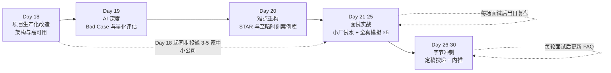
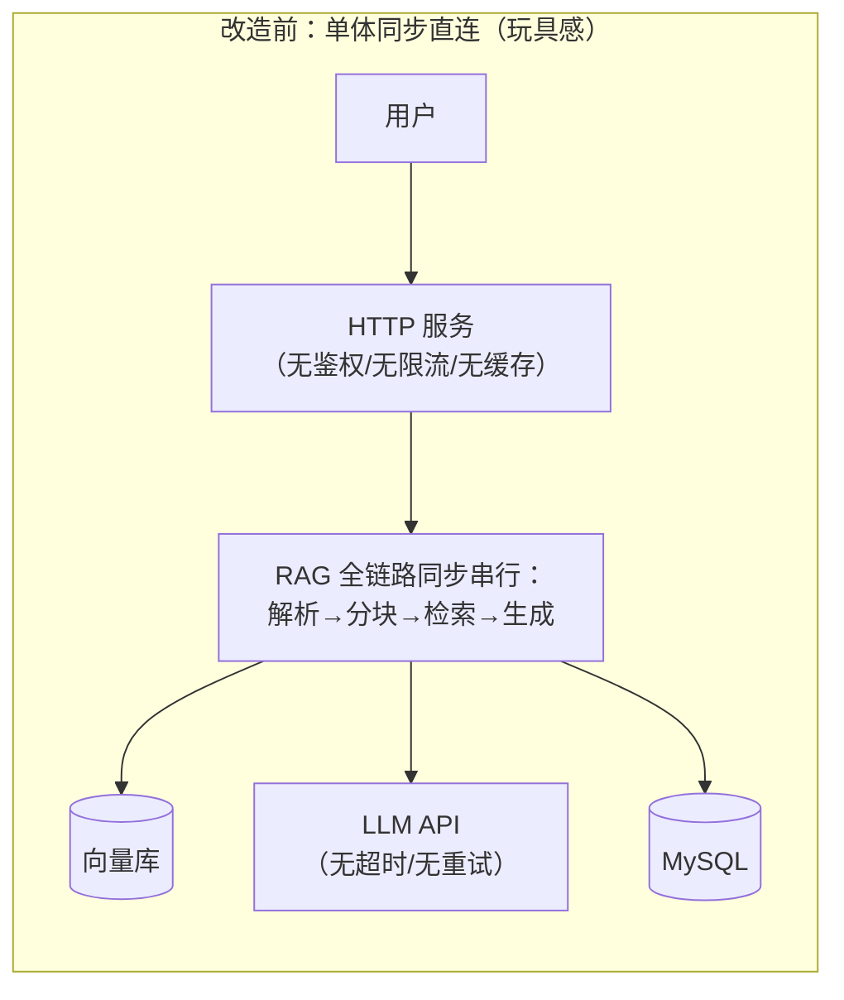
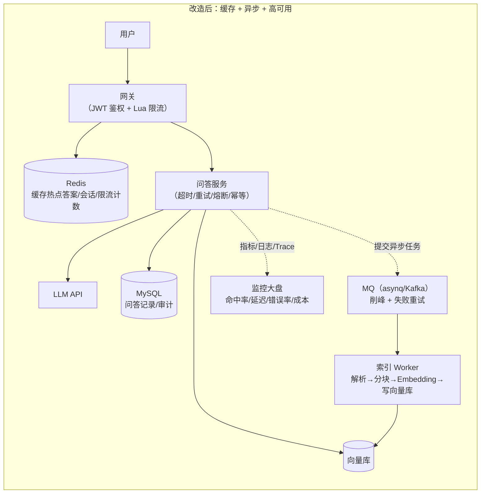
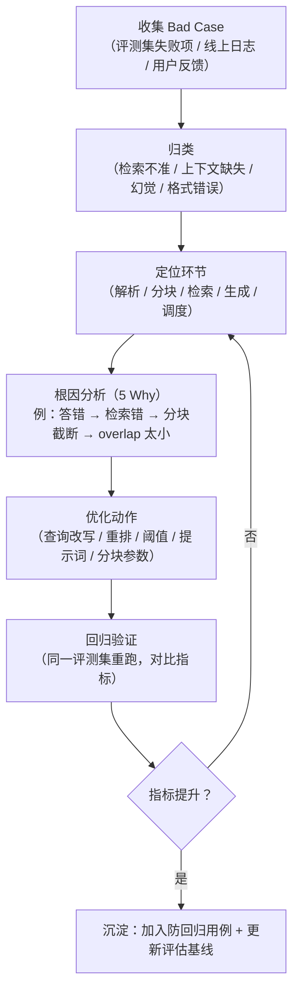

# 简历项目改造与面试实战演练（Day 18-30）

> 目标岗位：字节跳动剪映 CapCut「Agent 开发实习生（AI 剪辑）」· 职位 ID：A80542 · 深圳/广州 · 日常实习
> 前置依赖：已完成前三阶段（Go 深入 / 计算机基础 / AI 应用开发），拥有 docs-rag、agent-harness、pi-harness 三个项目
> 本篇定位：把"项目"变成"面试武器"，把"面试"变成"训练场"，Day 18 到 Day 30 每一天都有可执行动作

## 总体目标

到 Day 30 结束时，你要达到三个状态：

1. **项目能打**：docs-rag / agent-harness 完成"生产化"改造，有架构图、有量化指标、有 Bad Case 案例库、有 2 个脱稿 STAR 案例——彻底消除"玩具感"。
2. **面试能打**：自我介绍 3 版本（30s/1min/3min）背到脱口而出；项目深挖 20 题无死角；高频八股考点速答流畅；算法 Hot 100 高频 20 题手撕过关。
3. **状态在线**：心态从"怕面试"转为"把面试当信息收集"，简历定稿、完成投递/内推，随时可以进入字节面试。

**核心方法论**：以战代练（小厂试水暴露盲区）→ 当日复盘、当日解决（盲区清零）→ 全真模拟（脱敏实战）→ 字节冲刺（正式发起）。

## 整体路线图



> 节奏说明：小厂试水**从 Day 18 就开始投**（投递和准备并行），Day 21-25 是它的集中落地期；全真模拟 Day 21-25 每天 1 次；Day 26 起正式投字节。

---

# Day 18：项目"生产化"改造 —— 架构与高可用设计

## 18.1 今日目标

- 用"玩具感清单"给 docs-rag 和 agent-harness 做一次全面体检，找出至少 6 个生产化缺口。
- 完成两个改造：**补 Redis**（缓存命中统计 + 限流）、**补 MQ**（文档解析/Embedding 异步任务），并补齐**高可用四件套**（超时/重试/熔断/幂等 + 优雅退出）。
- 能画出"改造后架构图"，讲清每个组件解决什么问题。

## 18.2 动作清单

- [ ] 对照 18.3 玩具感清单，逐项给 docs-rag / agent-harness 打分（0 分=完全没有，1 分=有但简陋，2 分=生产级）
- [ ] 给问答接口加 Redis 缓存（Cache Aside + 命中率统计埋点）
- [ ] 给 API 加 Redis 限流（Lua 原子计数，按用户维度）
- [ ] 把"文档解析 → 分块 → Embedding → 写向量库"整条索引链路改成 MQ 异步任务
- [ ] 给所有外部调用（LLM API、向量库、DB）包一层"context 超时 + 指数退避重试"
- [ ] 给核心下游（LLM API）加熔断器（3 连败打开，冷却后半开试探）
- [ ] 给服务加优雅退出（信号监听 + http.Server.Shutdown + 任务队列排空）
- [ ] 更新 `项目设计.md`：贴改造后架构图，每层标注"解决什么问题"

## 18.3 痛点挖掘方法：玩具感清单

面试官判断"这是课程作业还是生产项目"，看的就是下面这张清单。**逐项对照，缺一项就补一项。**

| 维度 | 玩具感（扣分） | 生产化（加分） | 你的项目现状 |
|------|--------------|--------------|------------|
| 部署 | 单机 `go run`，本机自嗨 | 容器化 + 配置化 + 多环境（dev/prod） | ☐ |
| 鉴权 | 无登录、无权限 | JWT/API Key + 用户隔离 | ☐ |
| 日志 | `fmt.Println` 到处飞 | 结构化日志（JSON + trace_id 全链路） | ☐ |
| 监控 | 无指标、挂了自己不知道 | Prometheus 指标 + 告警 + 大盘 | ☐ |
| 测试 | 0 测试，靠手动点 | 单元测试 + 集成测试 + 评测集回归 | ☐ |
| 并发 | 串行处理，来一个做一个 | goroutine 池 / 并发控制 + 限流 | ☐ |
| 硬编码 | key、地址、模型名写死在代码里 | viper + .env 配置化 | ☐ |
| 缓存 | 无缓存，每次全链路跑 | Redis 缓存 + 命中率统计 + 降级 | ☐ |
| 异步 | 长任务同步阻塞（上传即卡住） | MQ 削峰解耦 + 任务进度查询 | ☐ |
| 容错 | 超时无控制、失败无重试 | 超时/重试/熔断/幂等/优雅退出 | ☐ |
| 安全 | prompt 注入、敏感信息外泄 | 输入校验 + 输出过滤 + 限额 | ☐ |
| 成本 | 不管 token 消耗 | token 用量埋点 + 成本预估 | ☐ |

> 关键认知：面试官不会逐行看代码，但会**顺着一个点深挖**。比如你简历写了"Redis 缓存"，他就问"命中率多少？缓存和库怎么保一致？缓存挂了会怎样？"——这张清单就是他的提问地图，你先把地图填满。

## 18.4 以 docs-rag / agent-harness 为例：改造方案

### 组件选型表（讲给面试官的"为什么"）

| 组件 | 选型 | 解决什么问题 | 面试话术要点 |
|------|------|------------|------------|
| Redis 缓存 | go-redis | 热点问答重复算，命中直接返回 | "Cache Aside + TTL + 命中率统计；缓存故障自动降级，不影响主链路" |
| Redis 限流 | go-redis + Lua | 防刷、防 LLM 成本失控 | "Lua 保证 INCR+EXPIRE 原子性，按用户维度限流" |
| MQ 异步 | asynq（Redis 底座）或 kafka-go | 文档解析/Embedding 是秒级任务，不能阻塞 HTTP | "上传即返回任务 ID，Worker 后台建索引，进度可查" |
| 超时/重试 | context + 指数退避 | LLM/向量库是外部依赖，慢或抖 | "单次超时 3s，重试 2 次，退避带抖动防雪崩" |
| 熔断 | 自研 3 态熔断器 | LLM API 挂了不能让全线超时堆积 | "3 连败打开，30s 后半开试探，成功即关闭" |
| 优雅退出 | signal.NotifyContext | 发布时请求不中断 | "等存量请求完成 + Worker 排空后再退出" |
| 幂等 | 任务 ID 去重 | MQ 至少一次投递，重复消费不能重复扣费 | "asynq 按 task 唯一；消费端用 task_id 做去重" |

### 改造前后架构对比





**讲法模板（每个组件一句话）**：

> "改造前所有事都在请求链路里同步做，一个 5 秒的文档解析就能把服务拖住。改造后三件事：**入口**用 Redis 做缓存和限流，热点问答不再重复跑全链路，成本也受控；**中间**把耗时的索引链路丢进 MQ 异步化，HTTP 秒回任务 ID；**出口**给 LLM/向量库等外部依赖统一套上超时、重试、熔断，服务挂了也能优雅退出。整条链路埋点：命中率、p95 延迟、token 成本全部可量化。"

## 18.5 Go 落地示例代码

### 18.5.1 go-redis 缓存（Cache Aside + 命中统计）

```go
package cache

import (
	"context"
	"crypto/md5"
	"fmt"
	"time"

	"github.com/redis/go-redis/v9"
)

type AnswerCache struct {
	rdb *redis.Client
}

func NewAnswerCache(rdb *redis.Client) *AnswerCache { return &AnswerCache{rdb: rdb} }

// key 规范：rag:answer:<md5(问题)>，统一加前缀便于按前缀清理
func key(q string) string { return fmt.Sprintf("rag:answer:%x", md5.Sum([]byte(q))) }

func (c *AnswerCache) Get(ctx context.Context, q string) (string, bool) {
	v, err := c.rdb.Get(ctx, key(q)).Result()
	if err == redis.Nil {
		c.rdb.Incr(ctx, "rag:stat:cache_miss") // 未命中计数
		return "", false
	}
	if err != nil {
		// 缓存故障：降级走全链路，绝不能让缓存把服务拖死
		return "", false
	}
	c.rdb.Incr(ctx, "rag:stat:cache_hit") // 命中计数 → 大盘算命中率
	return v, true
}

func (c *AnswerCache) Set(ctx context.Context, q, answer string) {
	// 带 TTL 防止无限膨胀；热点答案 24h，一般答案 1h 可分开配置
	c.rdb.Set(ctx, key(q), answer, 24*time.Hour)
}
```

> 面试要点：命中率 = `cache_hit / (cache_hit + cache_miss)`；问"缓存和库一致性"→ Cache Aside（先更新库再删缓存）+ 延迟双删，见 [/后端技术栈强化/02-redis/缓存问题与一致性](/后端技术栈强化/02-redis/缓存问题与一致性)。

### 18.5.2 Redis 限流（Lua 原子固定窗口）

```go
package ratelimit

import (
	"context"
	"time"

	"github.com/redis/go-redis/v9"
)

var incrWithExpire = redis.NewScript(`
local c = redis.call("INCR", KEYS[1])
if c == 1 then
  redis.call("EXPIRE", KEYS[1], ARGV[1])
end
return c
`)

// Allow 固定窗口限流：窗口内超过 limit 次返回 false
// 固定窗口的缺陷是窗口边界可能突发 2 倍流量，面试可主动提"用滑动窗口/令牌桶改进"
func Allow(ctx context.Context, rdb *redis.Client, userID string, limit int, window time.Duration) bool {
	key := "rag:ratelimit:" + userID
	n, err := incrWithExpire.Run(ctx, rdb, []string{key}, int(window.Seconds())).Int()
	if err != nil {
		return true // 限流器故障：按业务取舍，这里默认放行（可用性优先）
	}
	return n <= int64(limit)
}
```

> 追问预案：**令牌桶**（Redis 里存 token 数和上次补充时间戳，Lua 计算补充）更平滑；限流返回 429 + Retry-After 头；全局限流放网关，用户级限流放业务层。

### 18.5.3 asynq 异步任务（文档解析 + Embedding 批量）

```go
// ---------- Producer：HTTP 侧提交任务 ----------
client := asynq.NewClient(asynq.RedisClientOpt{Addr: "127.0.0.1:6379"})
defer client.Close()

payload, _ := json.Marshal(map[string]any{"doc_id": "d-1024", "path": "docs/a.pdf", "user": "u-1"})
task, _ := asynq.NewTask("doc:index", payload, asynq.MaxRetry(3))
// Timeout 给单次执行兜底，Queue 选择队列权重
info, err := client.Enqueue(task, asynq.Queue("indexing"), asynq.Timeout(10*time.Minute))
if err != nil {
	log.Printf("enqueue failed: %v", err)
}
log.Printf("task enqueued: %s", info.ID) // 返回给前端做进度查询

// ---------- Worker：消费侧 ----------
srv := asynq.NewServer(
	asynq.RedisClientOpt{Addr: "127.0.0.1:6379"},
	asynq.Config{
		Concurrency: 8,                                   // 并发消费数
		Queues:      map[string]int{"indexing": 4, "embedding": 2}, // 队列优先级权重
	},
)
mux := asynq.NewServeMux()
mux.HandleFunc("doc:index", func(ctx context.Context, t *asynq.Task) error {
	var req struct {
		DocID string `json:"doc_id"`
		Path  string `json:"path"`
	}
	if err := json.Unmarshal(t.Payload(), &req); err != nil {
		return err // 返回 error → asynq 按 MaxRetry 重试
	}
	// 1 解析文档 → 2 分块 → 3 调 Embedding API → 4 写向量库
	if err := indexDocument(ctx, req.DocID, req.Path); err != nil {
		log.Printf("index failed doc=%s: %v", req.DocID, err)
		return err
	}
	return nil // nil = 确认成功，自动 ACK
})
if err := srv.Run(mux); err != nil {
	log.Fatal(err)
}
```

> 为什么选 asynq：它基于 Redis，和项目现有 Redis 复用；自带重试、延迟队列、优先级、任务进度（`TaskInfo`），比手搓 goroutine 队列讲得出更多设计。面试可对比：**asynq（Redis 底座，适合中小规模）vs Kafka（日志型，适合大流量削峰、多消费者组）**，见 [/后端技术栈强化/03-kafka/生产消费语义](/后端技术栈强化/03-kafka/生产消费语义)。

### 18.5.4 kafka-go 版本（大流量场景切换）

```go
// Producer
w := kafka.NewWriter(kafka.WriterConfig{Brokers: []string{"localhost:9092"}, Topic: "rag.indexing"})
w.WriteMessages(ctx, kafka.Message{Key: []byte("d-1024"), Value: payload})

// Consumer（手动提交 offset，保证至少一次语义）
r := kafka.NewReader(kafka.ReaderConfig{
	Brokers:  []string{"localhost:9092"},
	Topic:    "rag.indexing",
	GroupID:  "rag-index-worker", // 同 GroupID 的实例分摊分区
	MinBytes: 1e3, MaxBytes: 10e6,
})
for {
	m, err := r.ReadMessage(ctx)
	if err != nil { continue }
	if err := process(m.Value); err != nil {
		// 消费失败：投递到死信 topic，避免阻塞主队列
		w.WriteMessages(ctx, kafka.Message{Topic: "rag.indexing.dlq", Value: m.Value})
		continue
	}
	r.CommitMessages(ctx, m) // 处理成功才提交 offset
}
```

### 18.5.5 context 超时 + 指数退避重试

```go
package retryx

import (
	"context"
	"errors"
	"math/rand"
	"time"
)

var ErrNotRetryable = errors.New("not retryable")

// isRetryable：4xx 业务错不重试（重试也没用），5xx/网络错/超时重试
func isRetryable(err error) bool { return !errors.Is(err, ErrNotRetryable) }

func WithTimeoutRetry(ctx context.Context, timeout time.Duration, retries int, fn func(ctx context.Context) error) error {
	for i := 0; i <= retries; i++ {
		cctx, cancel := context.WithTimeout(ctx, timeout) // 每次重试有独立超时
		err := fn(cctx)
		cancel()
		if err == nil {
			return nil
		}
		if !isRetryable(err) {
			return err
		}
		// 指数退避 + 随机抖动：1s, 2s, 4s + jitter，防重试风暴
		backoff := time.Duration(1<<i) * time.Second
		select {
		case <-time.After(backoff + time.Duration(rand.Intn(200))*time.Millisecond):
		case <-ctx.Done():
			return ctx.Err() // 总超时到了，立即放弃
		}
	}
	return ctx.Err()
}

// 用法：调 LLM 时
answer, err := retryx.WithTimeoutRetry(ctx, 3*time.Second, 2, func(c context.Context) error {
	ans, e := llm.Chat(c, prompt)
	if e != nil {
		return e
	}
	answer = ans
	return nil
})
```

### 18.5.6 熔断器（三态：关闭 → 打开 → 半开）

```go
package cb

import (
	"errors"
	"sync"
	"time"
)

var ErrCircuitOpen = errors.New("circuit breaker open")

type Breaker struct {
	mu        sync.Mutex
	failures  int
	threshold int      // 连续失败多少次打开
	cooldown  time.Duration // 打开多久后半开试探
	open      bool
	openedAt  time.Time
}

func New(threshold int, cooldown time.Duration) *Breaker {
	return &Breaker{threshold: threshold, cooldown: cooldown}
}

func (b *Breaker) Call(fn func() error) error {
	b.mu.Lock()
	if b.open {
		if time.Since(b.openedAt) > b.cooldown {
			b.open, b.failures = false, 0 // 半开：放行一个试探请求
		} else {
			b.mu.Unlock()
			return ErrCircuitOpen // 快速失败，不调下游
		}
	}
	b.mu.Unlock()

	err := fn()
	b.mu.Lock()
	defer b.mu.Unlock()
	if err != nil {
		b.failures++
		if b.failures >= b.threshold {
			b.open, b.openedAt = true, time.Now()
		}
	} else {
		b.failures = 0 // 成功即关闭
	}
	return err
}
```

> 生产更常用 `github.com/sony/gobreaker`。面试讲原理：**熔断保护下游、限流保护自己、降级保体验**，见 [/后端技术栈强化/04-microservice/治理与稳定性](/后端技术栈强化/04-microservice/治理与稳定性)。

### 18.5.7 优雅退出

```go
func main() {
	// 监听 SIGINT/SIGTERM
	ctx, stop := signal.NotifyContext(context.Background(), os.Interrupt, syscall.SIGTERM)
	defer stop()

	srv := &http.Server{Addr: ":8080", Handler: router}
	go func() {
		if err := srv.ListenAndServe(); err != nil && !errors.Is(err, http.ErrServerClosed) {
			log.Fatal(err)
		}
	}()

	<-ctx.Done() // 收到退出信号
	log.Println("shutting down...")

	// 1. HTTP：停止接新连接，等待存量请求（带超时兜底）
	shutdownCtx, cancel := context.WithTimeout(context.Background(), 10*time.Second)
	defer cancel()
	srv.Shutdown(shutdownCtx)

	// 2. MQ Worker：asynq 的 srv.Shutdown() 会排空在途任务
	// asynqServer.Shutdown()

	log.Println("exit clean")
}
```

## 18.6 验收标准（今日自测）

- [ ] 能对着白板画出改造后架构图（网关 → Redis → 服务 → MQ → Worker → 向量库 → 监控），不看书
- [ ] 能讲清每个组件解决什么问题：缓存（省成本/降延迟）、限流（防刷/控成本）、MQ（削峰解耦/长任务异步）、超时重试（外部依赖容错）、熔断（故障隔离）、优雅退出（发布无损）
- [ ] 能回答追问："MQ 消费失败怎么办？"（重试 → 死信 → 告警）；"缓存挂了怎么办？"（降级走全链路）
- [ ] 所有示例代码在自己的项目里跑通，并截图/记录到项目文档

---

# Day 19：AI 深度 —— Bad Case 分析与量化评估

## 19.1 今日目标

- 建立 RAG 系统的**量化指标体系**（准确率 / 延迟 / 成本三类），并在代码里埋点采集。
- 用"收集 → 归类 → 根因 → 优化 → 回归"五步法，整理出 **5 个以上真实 Bad Case**，每个都有根因和优化动作。
- 把 Bad Case 沉淀为评测集的防回归用例。

## 19.2 动作清单

- [ ] 给服务加结构化日志（JSON 一行一个问答：问题、命中 chunk、token 数、耗时、模型、成本）
- [ ] 搭评测集：从真实咨询记录里挑 50-100 条问答对（含"标准答案"），离线跑批打点
- [ ] 跑一轮评测，得到基线指标（命中率、Recall@K、首 token p50/p95）
- [ ] 从评测失败项 + 线上日志里收集 10+ 个 Bad Case，填 19.5 的记录表
- [ ] 对每个 Bad Case 做根因分析并执行至少 2 个优化动作
- [ ] 优化后重跑评测集，对比指标，把提升写进项目文档

## 19.3 量化评估指标设计

### 指标定义表

| 类别 | 指标 | 定义 | 计算口径 | 采集方式 | 目标值 |
|------|------|------|---------|---------|--------|
| 准确率 | 回答命中率 | 答案命中参考答案的比例 | 命中数 / 评测总数 | 离线评测集跑批 | ≥ 85% |
| 准确率 | Recall@K | 相关文档被召回到 Top-K 的比例 | 召回的相关 chunk 数 / 相关 chunk 总数 | 检索日志打点 | ≥ 0.90 @5 |
| 准确率 | MRR | 第一个相关结果排名的倒数均值 | mean(1 / rank) | 检索日志打点 | ≥ 0.80 |
| 准确率 | Faithfulness | 答案是否忠实于检索上下文（不幻觉） | 人工/LLM 判分 | 评测集 | ≥ 0.90 |
| 延迟 | 首 token 延迟 | 请求发出到收到第一个 token | p50 / p95 / p99 | SSE 首帧埋点 | p95 < 1s |
| 延迟 | 全链路延迟 | 单次问答总耗时 | p50 / p95 / p99 | 埋点 | p95 < 3s |
| 延迟 | 检索延迟 | 检索环节耗时 | p95 | 埋点 | p95 < 100ms |
| 成本 | 单次 token 成本 | 一次问答消耗的 token 费用 | 见 19.4 成本表 | 用量日志 | < ¥0.01 |
| 可用性 | 服务成功率 | 成功请求占比 | 成功 / 总请求 | 监控大盘 | ≥ 99.9% |

### 埋点代码（结构化日志，一行一问答）

```go
type QAMetric struct {
	QuestionID   string  `json:"question_id"`
	Question     string  `json:"question"`
	RetrievalMs  float64 `json:"retrieval_ms"`   // 检索耗时
	FirstTokenMs float64 `json:"first_token_ms"` // 首 token 延迟
	TotalMs      float64 `json:"total_ms"`       // 全链路
	Hit          bool    `json:"answer_hit"`     // 评测集里是否命中参考答案
	InputTokens  int     `json:"input_tokens"`
	OutputTokens int     `json:"output_tokens"`
	CostCNY      float64 `json:"cost_cny"`       // 单次成本
	Model        string  `json:"model"`
	CreatedAt    string  `json:"created_at"`
}

// 每次问答结束时打一行 JSON 日志 → 采集到 Loki/ES → 大盘聚合 p95 / 命中率 / 成本
log.WithFields(map[string]any{
	"type": "qa_metric", "metric": metric,
}).Info("qa finished")
```

> 采集链路：埋点（JSON 日志 + Prometheus Counter/Histogram）→ 聚合（Grafana 大盘：命中率趋势、p95 延迟、每日成本）→ 告警（p95 超阈值 / 命中率下滑）。

## 19.4 单次问答 token 成本表（示例价格，以官网为准）

| 组成 | token 数 | 单价（示例） | 费用 |
|------|---------|------------|------|
| 系统提示词 | 500 | 输入 ¥0.8 / 百万 | ¥0.0004 |
| 检索上下文（3 个 chunk） | 1500 | 输入 ¥0.8 / 百万 | ¥0.0012 |
| 多轮历史 | 1000 | 输入 ¥0.8 / 百万 | ¥0.0008 |
| 模型输出 | 400 | 输出 ¥2.0 / 百万 | ¥0.0008 |
| **合计** | **3400** | — | **≈ ¥0.0032** |

**计算示例（面试要能口算）**：1000 次问答 ≈ 3400 万 token ≈ **¥3.2 元**。优化路径：缓存热点答案（命中率 40% 则成本 ×0.6）、压缩上下文（砍无关 chunk）、小模型先答（简单问题走轻量模型）。

> 成本意识是"AI 应用"岗位的高频加分点：字节的 AutoCut 业务同样受 token/算力成本约束，能主动讲"我做过成本埋点和优化"非常加分。

## 19.5 Bad Case 分析流程与记录模板

### 分析流程（五步法）



### Bad Case 记录模板（10 行示例，直接替换成你自己的）

| # | 日期 | 用户问题 | 期望答案 | 实际输出 | 错误类型 | 定位环节 | 根因 | 优化动作 | 状态 |
|---|------|---------|---------|---------|---------|---------|------|---------|------|
| 1 | 10-12 | 导出视频怎么去水印 | 关闭水印开关的步骤 | 返回了"添加水印"步骤 | 检索不准 | 检索 | 语义混淆，未识别"去"的否定意图 | 意图识别 + 查询改写 | 已闭环 |
| 2 | 10-12 | 支持 4K 吗 | 支持，需会员 | 答"不支持" | 幻觉 | 生成 | 上下文缺该信息 + 模型臆测 | 相似度阈值拒答 + 补知识 | 已闭环 |
| 3 | 10-13 | 怎么批量调色 | 步骤 a/b/c | 只答出 a | 上下文缺失 | 生成 | 分块截断丢失后半内容 | 分块 overlap 10% → 20% | 进行中 |
| 4 | 10-13 | 跨章节综合问题 | 综合两章内容 | 只引用一章 | 检索不准 | 检索 | Top-K 太小、单路检索 | K 3→5 + 多路查询融合 | 已闭环 |
| 5 | 10-14 | 英文问题 | 英文回答 | 中文回答 | 格式错误 | 生成 | 提示词未约束语言 | 提示词加语言指令 | 已闭环 |
| 6 | 10-14 | 审核要多久 | 24 小时 | 引用过期文档"3 天" | 检索不准 | 检索 | 元数据未过滤时间 | 元数据过滤 + 时效加权 | 进行中 |
| 7 | 10-15 | 表格里的数值 | 精确数值 | 数值错误 | 幻觉 | 解析 | 表格解析丢列 | 结构化表格提取 | 待处理 |
| 8 | 10-15 | 多轮追问"那第二步呢" | 上一步的第二步 | 答非所问 | 上下文缺失 | 调度 | 多轮历史未拼接 | 会话记忆 + 上下文改写 | 已闭环 |
| 9 | 10-16 | 崩溃了怎么办 | 重启步骤 | 直接答"重装" | 检索不准 | 检索 | 同义词未扩展 | 同义词扩展 + RRF 融合 | 已闭环 |
| 10 | 10-16 | 空 query / 乱输入 | 引导性提问 | 乱答 | 格式错误 | 入口 | 无输入校验 | 输入校验 + 兜底话术 | 已闭环 |

### 四类错误速查（面试直接背）

| 错误类型 | 典型表现 | 主要根因 | 标准优化动作 |
|---------|---------|---------|------------|
| 检索不准 | 答非所问、引用无关文档 | 语义混淆、单路检索、Top-K 不当 | 查询改写、多路检索 + RRF、重排序、元数据过滤 |
| 上下文缺失 | 答案不完整、缺步骤 | 分块截断、召回不足 | 调 overlap、多粒度索引、加大 Top-K |
| 幻觉 | 编造事实/数值 | 上下文没有答案 + 模型硬答 | 相似度阈值拒答、引用溯源、强制"无答案就明说" |
| 格式错误 | 语言/结构/格式不符合要求 | 提示词约束不足 | 提示词加格式指令、输出 Schema 校验、失败重试 |

> 深度关联：分块、混合检索、重排、查询改写的完整方法论见 [/phase3/docs-rag/落地化的RAG系统优化策略](/phase3/docs-rag/落地化的RAG系统优化策略) 与 [/phase3/docs-rag/Rag的13种分块策略](/phase3/docs-rag/Rag的13种分块策略)；项目整体设计回顾 [/phase3/docs-rag/项目设计](/phase3/docs-rag/项目设计)。

## 19.6 验收标准（今日自测）

- [ ] 能拿出 **5 个真实 Bad Case**（不背示例），每个能讲：问题 → 错误类型 → 根因 → 优化动作 → 指标变化
- [ ] 能报出项目的 3 个核心数字：命中率、p95 首 token 延迟、单次成本，并说明怎么采集的
- [ ] 能口算一次问答的 token 成本（输入/输出分开算）
- [ ] 评测集 ≥ 50 条，优化后命中率相比基线有提升（哪怕 +3%，有数字就有说服力）

---

# Day 20：难点重构 —— STAR 法则与"至暗时刻"案例库

## 20.1 今日目标

- 掌握 STAR 法则，把 docs-rag / agent-harness 写成"带数字的故事"。
- 建立**至暗时刻案例库**：内存泄漏、死锁、缓存雪崩/穿透、检索不准 4 个案例，每个都能脱稿讲 5 分钟。
- 每个案例亲手跑通"最小复现 → 定位 → 修复 → 验证"全流程。

## 20.2 动作清单

- [ ] 用 20.3 模板重写两个项目的项目经历（每条含 3 个以上数字）
- [ ] 跑通 20.4.1 goroutine 泄漏复现 + pprof 定位 + 修复
- [ ] 跑通 20.4.2 死锁复现 + go vet / -race 定位 + 修复
- [ ] 通读 20.4.3、20.4.4 两个事故/案例复盘，整理成自己的话
- [ ] 每个案例写 200 字"面试话术"（含数字），录音讲一遍，脱稿

## 20.3 STAR 法则详解与项目经历模板

### 模板（每个要素必须带数字）

| 要素 | 要回答的问题 | 句式模板 | 数字要求 |
|------|------------|---------|---------|
| S（情境） | 什么背景下做这件事？多大规模？ | "当时团队/产品面临……每周有 XX 次……" | 规模、频率 |
| T（任务） | 你的目标是什么？ | "我负责……目标是让 XX 从 X% 提升到 Y%" | 量化目标 |
| A（行动） | 你具体做了什么？做了哪些取舍？ | "我做了三件事：①……②……③……（并说明为什么这么选）" | 方案 + 权衡 |
| R（结果） | 结果如何？怎么验证的？ | "最终……（前后对比数字 + 怎么测的）" | 前后对比 |

### 反例 vs 正例

**反例（玩具感，0 分）**：
> "我做了个 RAG 文档问答系统，用向量检索，效果还行。"

**正例（STAR，满分）**：
> "**S**：团队每周要人工翻阅约 500 份技术文档回答内部咨询，平均单次耗时 20 分钟，且口径不一。
> **T**：我用 Go 从零实现 RAG 问答系统（不依赖 LangChain），目标是让 80% 的常规问题自动答掉。
> **A**：① 检索侧做混合检索（BM25 + 向量 + RRF 融合）与查询改写，解决"去水印"这类语义混淆问题；② 工程侧用 Redis 缓存热点答案（命中率约 35%）、MQ 异步建索引、全链路超时/重试/熔断；③ 搭了 200 条评测集做量化评估，命中率从 61% 提到 82%。
> **R**：常规问题自动解决率 61% → 82%，检索延迟 900ms → 350ms，单次问答成本约 ¥0.003，压测下服务稳定。"

> 注意：**A 必须讲"为什么这么选"**（比如"为什么混合检索？因为纯向量对否定语义不敏感"），这是面试官判断你真懂还是背稿的关键。

## 20.4 至暗时刻案例库

> 面试黄金话术结构（每案例 5 分钟）：**现象 → 我怎么发现的 → 排查过程（工具/思路）→ 根因 → 修复 → 量化验证 → 反思**。宁可慢，不可假。

### 案例 1：内存泄漏 —— goroutine 泄漏（channel / time.Ticker）

**背景/问题**：文档问答服务上线后运行 3 天内存持续上涨，重启后恢复，周而复始。

**排查过程（pprof 五步）**：

```mermaid
flowchart TD
    A["现象：内存曲线只涨不降<br/>goroutine 数量只增不减"] --> B["开启 pprof：<br/>import _ \"net/http/pprof\" + :6060"]
    B --> C["heap 采样：<br/>go tool pprof -http=:8081 :6060/debug/pprof/heap"]
    C --> D["看 top / 火焰图<br/>找 Inuse 最大的函数"]
    D --> E["goroutine 采样：<br/>go tool pprof :6060/debug/pprof/goroutine<br/>找 goroutine 数量最多的栈"]
    E --> F["对照代码锁定泄漏点<br/>（channel 未关闭 / Ticker 未 Stop / 锁阻塞）"]
    F --> G["修复 + 回归验证：<br/>对比修复前后 NumGoroutine 与内存曲线"]
```

**最小复现（泄漏版）**：

```go
package main

import (
	"fmt"
	"runtime"
	"time"
)

// 泄漏点 1：range 读 channel，但永远没人 close
func leakByChannel() {
	ch := make(chan int)
	go func() {
		for v := range ch { // range 要等 close(ch) 才退出
			fmt.Println(v)
		}
	}()
	// 业务代码忘了 close(ch) → 这个 goroutine 永久泄漏
}

// 泄漏点 2：time.Ticker 未 Stop
func leakByTicker() {
	tk := time.NewTicker(time.Second)
	go func() {
		for range tk.C {
			fmt.Println("tick")
		}
	}()
	// 忘了 tk.Stop() → ticker 底层的 goroutine 永久泄漏
}

func main() {
	before := runtime.NumGoroutine()
	leakByChannel()
	leakByTicker()
	time.Sleep(2 * time.Second)
	after := runtime.NumGoroutine()
	fmt.Printf("before=%d after=%d（after > before 说明在泄漏）\n", before, after)
}
```

**修复版**：

```go
package main

import (
	"context"
	"fmt"
	"sync"
	"time"
)

// 修复 1：channel 明确关闭 + WaitGroup 保证退出后再返回
func fixChannel(ctx context.Context) {
	ch := make(chan int)
	var wg sync.WaitGroup
	wg.Add(1)
	go func() {
		defer wg.Done()
		for {
			select {
			case v, ok := <-ch:
				if !ok {
					return // channel 被 close，正常退出
				}
				fmt.Println(v)
			case <-ctx.Done():
				return // 上下文取消，强制退出
			}
		}
	}()
	// 业务结束：close(ch) 或 cancel(ctx)
	close(ch)
	wg.Wait() // 等 goroutine 真正退出，避免"异步泄漏"
}

// 修复 2：Ticker 必须 defer Stop
func fixTicker(ctx context.Context) {
	tk := time.NewTicker(time.Second)
	defer tk.Stop() // 关键一行：退出即释放
	for {
		select {
		case <-tk.C:
			fmt.Println("tick")
		case <-ctx.Done():
			return
		}
	}
}
```

**根因**：goroutine 是 Go 的"廉价并发"，但**退出机制必须显式设计**——channel 的关闭责任、Ticker/定时器的 Stop、锁的释放都要有归属。

**量化结果**：修复后压测 24h，内存曲线平稳，goroutine 数量稳定在基线水平（修复前以每小时 +200 增长）。

**面试话术**："我用 pprof 的 heap 和 goroutine profile 定位：goroutine 采样显示同一个栈出现上千次，是消费 channel 的 worker 永远在等 close；修复时给每个 goroutine 加了 context 退出 + WaitGroup 收敛，并给 Ticker 补了 defer Stop。**教训：每个 goroutine 都要问一句'它怎么退出'。**"

### 案例 2：死锁 —— mutex 嵌套死锁

**背景/问题**：多协程并发处理任务时偶发卡死，压测必现，线上表现为请求全部 hang 住。

**排查过程**：`go vet ./...`（静态检查）→ `go test -race ./...`（竞态检测）→ 抓 goroutine 栈（`/debug/pprof/goroutine`）看到两个 goroutine 分别持有 A、B 锁互相等待 → 确认"锁顺序不一致"。

**最小复现（死锁版）**：

```go
package main

import (
	"fmt"
	"sync"
	"time"
)

func main() {
	var muA, muB sync.Mutex
	var wg sync.WaitGroup
	wg.Add(2)

	// goroutine 1：先 A 后 B
	go func() {
		defer wg.Done()
		muA.Lock()
		time.Sleep(10 * time.Millisecond) // 加大碰撞窗口
		muB.Lock()                        // 持有 A 等 B
		muB.Unlock()
		muA.Unlock()
	}()

	// goroutine 2：先 B 后 A → 与上面形成环
	go func() {
		defer wg.Done()
		muB.Lock()
		time.Sleep(10 * time.Millisecond)
		muA.Lock() // 持有 B 等 A → 互相等待，死锁
		muA.Unlock()
		muB.Unlock()
	}()

	wg.Wait()
	fmt.Println("done") // 永远打印不出来
}
```

**修复版（两种方案）**：

```go
// 修复 1（根治）：全局统一锁顺序——所有代码"先 A 后 B"，破坏循环等待
// goroutine 2 也改为先 muA.Lock() 再 muB.Lock()

// 修复 2（兜底）：Go 1.18+ 的 TryLock，拿不到就放弃并释放已持锁
func business(muA, muB *sync.Mutex) error {
	muA.Lock()
	defer muA.Unlock()
	if !muB.TryLock() { // 拿不到 B 锁：释放 A，稍后重试，绝不阻塞等待
		return fmt.Errorf("busy: muB occupied, abort to avoid deadlock")
	}
	defer muB.Unlock()
	// 正常业务
	return nil
}
```

**定位命令（面试可背）**：

```bash
go vet ./...          # 静态检查：锁顺序、可疑代码
go test -race ./...   # 竞态检测：跑测试抓数据竞争与部分锁问题
go tool pprof http://localhost:6060/debug/pprof/goroutine  # 运行时抓阻塞栈
```

**根因**：死锁四条件（互斥/持有并等待/不可剥夺/循环等待）——本例违反的是**循环等待**，破坏任一条件即可。

**量化结果**：统一锁顺序 + TryLock 兜底后，压测 10 万并发任务无卡死，p99 延迟从"无响应"恢复至 50ms 内。

**面试话术**："死锁的经典解法是**锁顺序 + 超时/尝试锁**：先定义全局锁顺序，再给锁竞争加超时兜底；同时用 -race 和 goroutine profile 验证。**教训：锁的粒度宁小勿大，持有锁的时间越短越安全。**"（深入：[/第一阶段-知识详解/Go并发编程详解](/第一阶段-知识详解/Go并发编程详解)、死锁四条件见 [/第二阶段-知识详解/操作系统面试详解](/第二阶段-知识详解/操作系统面试详解)）

### 案例 3：缓存雪崩/穿透导致的线上事故复盘

**背景/问题**：某次版本发布把缓存 TTL 统一设为 24h，第二天 0 点大量 key 同时过期，数据库连接被打爆，服务大面积 5xx，持续 15 分钟。

**根因**：
- **雪崩**：缓存 key 同一时刻集中过期 → 全部穿透到 DB；
- **穿透**：部分不存在的数据（如恶意构造的 ID）每次都绕过缓存直打 DB，加剧压力。

**修复三板斧**：

```go
// ① 过期时间加随机抖动：打散集中过期
ttl := 24*time.Hour + time.Duration(rand.Intn(3600))*time.Second

// ② 热点 key 永不过期 + 后台异步更新（逻辑过期）
//    缓存里存 (数据, 逻辑过期时间)，读取时发现逻辑过期就异步刷新，请求仍拿旧值

// ③ 单飞（singleflight）：同一时刻同一 key 只允许一个请求去打后端，其余等待共享结果
import "golang.org/x/sync/singleflight"

var g singleflight.Group

func GetAnswer(ctx context.Context, q string) (string, error) {
	v, err, _ := g.Do(hash(q), func() (any, error) {
		return computeAnswer(ctx, q) // 只有第一个请求进来，其余共享结果
	})
	if err != nil {
		return "", err
	}
	return v.(string), nil
}
```

> 穿透另配**空值缓存**（查不到的 key 也缓存 5 分钟）和**布隆过滤器**（请求前先判存在）。完整方法论见 [/后端技术栈强化/02-redis/缓存问题与一致性](/后端技术栈强化/02-redis/缓存问题与一致性) 与 [/后端技术栈强化/05-high-concurrency/场景题-上](/后端技术栈强化/05-high-concurrency/场景题-上)。

**量化结果**：修复后再次 0 点观察，DB 峰值 QPS 下降 80%，无 5xx；事故复盘沉淀为"TTL 变更必须走评审 + 灰度"的规范。

**面试话术**："这次事故教会我两件事：**TTL 设计要随机化**，避免全局同时过期；**缓存层必须考虑穿透/雪崩的兜底**（单飞 + 空值缓存 + 布隆过滤器）。复盘后我把'发布清单'里加了'缓存变更风险评估'这一项。"

### 案例 4：检索不准导致问答质量差的 AI 案例复盘

**背景/问题**：RAG 系统上线后命中率只有 61%，用户反馈"答非所问"，最典型的是"怎么去水印"答成了"添加水印"。

**根因链（5 Why）**：答案错 → 检索召回错 → 把"去水印"的语义匹配到了"添加水印"文档 → ① 纯向量检索对否定/意图不敏感；② 单路检索无兜底；③ 没有重排，Top-K 里噪声多。

**优化动作**（对应 19.5 的 case 1/4/9）：
1. **意图识别 + 查询改写**：检测"去/关/取消"等否定词，改写为"导出设置 关闭水印"再检索；
2. **混合检索 + RRF**：BM25 与向量各出 Top-20，RRF 融合，缓解单路失效；
3. **重排序**：Cross-Encoder（bge-reranker）精排 Top-3 再进生成；
4. **阈值拒答**：相似度低于 0.75 时拒答并引导提问，不硬答。

**量化结果**：200 条评测集上，命中率 61% → 82%，Bad Case 全部进入防回归用例（每次改完代码重跑，防退化）。

**面试话术**："这是我印象最深的一个 AI 案例——它让我意识到 **RAG 的质量瓶颈往往不在生成，而在检索**。我先用评测集量化问题（命中率 61%），再逐个 Bad Case 追根因，最后用'查询改写 + 混合检索 + 重排 + 阈值拒答'四件套解决，命中率到 82%。现在每次迭代都先跑评测集，用数字说话。"

## 20.5 验收标准（今日自测）

- [ ] 能**脱稿**讲 2 个 STAR 案例（项目经历 + 至暗时刻各至少 1 个），每个带 3 个以上数字
- [ ] 4 个至暗时刻案例都能按"现象→排查→根因→修复→量化→反思"讲满 5 分钟
- [ ] 能现场在白板写 goroutine 泄漏/死锁的最小复现代码并指出修复点
- [ ] 所有复现代码在自己的机器上跑通过（泄漏版会涨、修复版平稳）

---

# Day 21-25：面试实战（小厂试水 + 全真模拟）

## 21.1 阶段目标

- 小厂试水：投递 3-5 家中小公司，以战代练，收集高频考点，**不追求 offer，只追求暴露盲区**。
- 全真模拟：Day 21-25 每天 1 次全真模拟面试（含算法手撕），共 5 次，一次比一次熟练。
- 复盘迭代：每场面试/模拟后**当日复盘、当日解决**，Day 25 结束时自我介绍流畅、项目深挖无死角、盲区清零。

## 21.2 小厂试水（Day 18 起同步进行，21-25 集中落地）

### 投递渠道与目标选择

| 渠道 | 用法 | 备注 |
|------|------|------|
| BOSS 直聘 | 搜"Go 后端 / AI 应用 / RAG"，主动打招呼附简历+项目链接 | 响应最快，适合练手 |
| 实习僧 | 搜"AI / Agent / 后端实习" | 校招实习主阵地 |
| 牛客 | 讨论区有内推帖、面经 | 顺带收集该公司的面经 |
| 公司官网 | 中小厂官网招聘页 | 显示投递诚意 |

**目标选择标准**（投 3-5 家即可，别贪多）：
- AI 应用 / Agent 相关 > 通用后端 > 其他；Go 岗位优先（能检验 Go 深度）
- 选 2 家"大概率能进面"的 + 1-2 家"有点挑战"的，难度梯度配置
- 避免：需要大量时间准备的大厂（留给字节）、岗位方向差太远的

**试水目的（想清楚再去投）**：① 暴露知识盲区（八股、项目追问）；② 练自我介绍和表达；③ 收集这家公司问的高频题 → 进你的面经库。**心态：面试官是免费陪练，面挂不亏，面过血赚。**

## 21.3 全真模拟面试（Day 21-25 每天 1 次）

### 45 分钟模拟流程模板（找同学/学长当面试官，或录音自问自答）

| 环节 | 时长 | 内容 | 考察点 | 自测要点 |
|------|------|------|--------|---------|
| 自我介绍 | 3 min | 讲 1 分钟版本 + 展开 | 表达、亮点、结构 | 脱稿、无口头禅、有数字 |
| 项目深挖 | 20 min | 从 21.4 题库抽 4-6 题连环追问 | 项目真实性与深度 | 每个答案 ≤ 90 秒，能扛追问 |
| 八股 | 15 min | 从 21.5 考点清单抽 8-10 个速答 | 基础扎实度 | 每题 ≤ 30 秒速答 |
| 算法手撕 | 1 题 | 从 21.6 高频 20 题抽 1 题 | 代码能力 | 先讲思路再写码，15 分钟内 |
| 反问 | 5 min | 问团队/业务/技术栈 | 求职动机 | 问 2-3 个有质量的问题 |

### 每日模拟 checklist（每次模拟前后打勾）

| 阶段 | 检查项 | ☐ |
|------|--------|---|
| 模拟前 | 手机静音、房间安静、设备（摄像头/麦克风/白板）就绪 | ☐ |
| 模拟前 | 录音工具开启（用于复盘） | ☐ |
| 模拟前 | 复习今天的八股主题（先复习再模拟，效果最好） | ☐ |
| 模拟中 | 自我介绍严格计时 3 分钟 | ☐ |
| 模拟中 | 深挖题被追问到"答不出"的地方，当场记录 | ☐ |
| 模拟中 | 算法题先说思路、再写代码、最后自测用例 | ☐ |
| 模拟后 | 30 分钟内完成当日复盘表（21.7） | ☐ |
| 模拟后 | 盲区问题当晚解决（查文档 + 写笔记） | ☐ |

### 每日任务卡

**Day 21（全真模拟 #1）**
- 目标：跑通全流程，找到自己的表达短板
- 动作：上午复习 Go 并发/内存八股 → 下午全真模拟 #1 → 晚上复盘
- 验收：能完整走完 45 分钟流程，记录 ≥ 3 个盲区

**Day 22（全真模拟 #2）**
- 目标：自我介绍 3 分钟版背熟，八股速答 30 秒内
- 动作：复习 OS/网络 → 模拟 #2（重点练深挖追问）→ 复盘
- 验收：自我介绍零卡顿，深挖追问能接住 2 轮

**Day 23（全真模拟 #3）**
- 目标：MySQL/Redis 八股速答过关
- 动作：复习 MySQL/Redis → 模拟 #3（重点练八股 + 算法）→ 复盘
- 验收：八股 10 题全部 30 秒内答出

**Day 24（全真模拟 #4）**
- 目标：Kafka/系统设计速答过关，算法稳定 1 题
- 动作：复习 Kafka/系统设计 → 模拟 #4（全环节）→ 复盘
- 验收：模拟 #4 无冷场超过 10 秒的题目

**Day 25（全真模拟 #5 + 总复盘）**
- 目标：盲区清零，状态可战
- 动作：综合复习 → 模拟 #5（按字节标准：全流程 + 严格计时）→ 总复盘
- 验收：21.8 盲区清零自检全部打勾

## 21.4 项目深挖题库（RAG / Agent 方向 20 问）

| # | 问题 | 回答要点 |
|---|------|---------|
| 1 | 为什么选这个 Embedding 模型？对比过哪些？ | 对比维度：领域准确率（MRR/Recall@K）、维度、成本、速度；用评测集数据说话 |
| 2 | 检索不准怎么办？ | 查询改写 → 混合检索 → 重排 → 阈值拒答（背 19.5 四件套） |
| 3 | 分块策略怎么定的？为什么用这个 chunk 大小？ | 实验 128/256/512 tokens 对比命中率；结构感知 + overlap 10-20% |
| 4 | 混合检索的 RRF 是什么原理？ | 多路排序取倒数排名和融合，公式 1/(k+rank)；免调参 |
| 5 | 为什么不用 LangChain？ | 要理解内部原理、可控、轻量；框架黑盒是面试减分项 |
| 6 | 并发怎么设计的？QPS 多少？ | goroutine 池/信号量限并发；asynq 并发消费；压测数据 |
| 7 | 线上挂了怎么排查？ | 看监控（错误率/延迟）→ 看日志 trace_id → pprof 采样 → 回滚 |
| 8 | 缓存和数据库一致性怎么保证？ | Cache Aside + 延迟双删 + 最终一致（见 18.5.1） |
| 9 | 限流怎么做的？ | Redis Lua 固定窗口/令牌桶，为什么用 Lua（原子性） |
| 10 | 长任务为什么用 MQ 不用 goroutine？ | MQ：持久化、重试、削峰、多消费者；goroutine：无持久化、重启即丢 |
| 11 | Agent Loop 怎么实现的？Function Calling 了解吗？ | 循环：调 LLM → 解析 tool_call → 执行工具 → 回填 → 再调；见 pi-harness |
| 12 | LLM 返回格式错误怎么办？ | JSON Schema 约束 + 解析失败重试 + 正则兜底 |
| 13 | 幻觉怎么抑制？ | 阈值拒答 + 引用溯源 + 提示词强制"无答案就明说" |
| 14 | 流式输出怎么做的？SSE 和 WebSocket 区别？ | SSE 单向文本流、自动重连；WebSocket 双向；首 token 优化 |
| 15 | 内存泄漏遇到过吗？怎么定位的？ | pprof heap + goroutine profile（背案例 1） |
| 16 | 为什么用 Go？GMP 了解吗？ | 并发模型、部署简单、字节主力语言；GMP 见链接 |
| 17 | 向量库选型？Qdrant 和 Milvus 区别？ | 规模、部署复杂度、过滤能力；开发 Qdrant / 生产 Milvus 的取舍 |
| 18 | 多租户/权限怎么设计的？ | 文档级权限 + 检索时元数据过滤 + 答案脱敏 |
| 19 | 评测指标怎么设计的？Bad Case 怎么处理？ | 命中率/Recall@K/延迟/成本；五步法闭环（背 Day 19） |
| 20 | 把系统搬到 K8s 怎么做？ | 容器化 → 探针 → HPA → 滚动发布；见 K8s 文档 |

## 21.5 高频八股考点清单（每考点 1 行速答要点）

### Go 并发 / 内存

| 考点 | 1 行速答 | 关联文档 |
|------|---------|---------|
| goroutine vs 线程 | goroutine 2KB 起步栈、用户态调度、可增长；线程 1MB 内核栈 | [/第一阶段-知识详解/Go GMP 调度详解](/第一阶段-知识详解/Go GMP 调度详解) |
| GMP 模型 | G 任务、M 线程、P 本地队列；P 数量=GOMAXPROCS；work stealing 与 hand off | 同上 |
| channel 底层 | hchan：环形缓冲 + 发送/接收等待队列 + 锁；nil channel 阻塞，close 后读零值 | [/第一阶段-知识详解/Go并发编程详解](/第一阶段-知识详解/Go并发编程详解) |
| map 并发安全 | 原生 map 非并发安全；并发写 panic；用 sync.Mutex 或 sync.Map | 同上 |
| defer 执行顺序 | LIFO；参数在 defer 时求值；return 先赋值后执行 defer | 同上 |
| 内存逃逸 | 变量生命周期逃出函数 → 堆分配；-gcflags="-m" 查看 | [/第一阶段-知识详解/Go内存分配详解](/第一阶段-知识详解/Go内存分配详解) |
| GC 原理 | 三色标记 + 混合写屏障；并发标记；GOGC 调参 | [/第一阶段-知识详解/Go GC 详解](/第一阶段-知识详解/Go GC 详解) |
| context 超时链 | WithTimeout/WithCancel/WithValue；父取消子必取消；用于超时/取消/传值 | [/第一阶段-知识详解/Go Context 详解](/第一阶段-知识详解/Go Context 详解) |
| 锁：Mutex/RWMutex | Mutex 互斥；RWMutex 读共享写独占；TryLock（Go 1.18+）防死锁 | [/第一阶段-知识详解/Go并发编程问答集](/第一阶段-知识详解/Go并发编程问答集) |

### OS / 网络

| 考点 | 1 行速答 | 关联文档 |
|------|---------|---------|
| 进程/线程/协程 | 进程资源隔离、线程调度单位、协程用户态轻量并发 | [/第二阶段-知识详解/操作系统面试详解](/第二阶段-知识详解/操作系统面试详解) |
| 虚拟内存 | 进程独立地址空间，页表映射，缺页中断，换页 | 同上 |
| 死锁四条件 | 互斥、持有并等待、不可剥夺、循环等待；破坏任一即可 | 同上 |
| 用户态/内核态 | 系统调用切换；IO 密集注意 syscall 开销 | 同上 |
| TCP 三次握手/四次挥手 | 握手 SYN→SYN+ACK→ACK；挥手 FIN 序列 + TIME_WAIT | [/第二阶段-知识详解/计算机网络面试详解](/第二阶段-知识详解/计算机网络面试详解) |
| TIME_WAIT 过多 | 主动关闭方 2MSL；调 tcp_tw_reuse / 长连接复用 | 同上 |
| HTTP 1.1/2/3 | 1.1 keep-alive；2 多路复用+头部压缩；3 QUIC+UDP | 同上 |
| HTTPS 握手 | TLS：证书验证 + 密钥协商（ECDHE）+ 对称加密传输 | 同上 |

### MySQL / Redis / Kafka / 系统设计

| 考点 | 1 行速答 | 关联文档 |
|------|---------|---------|
| B+ 树索引 | 多路平衡树、叶子存数据有序链表、磁盘 IO 次数=树高 | [/后端技术栈强化/01-mysql/存储引擎与B+树](/后端技术栈强化/01-mysql/存储引擎与B+树) |
| 事务隔离级别 | 读未提交/读已提交/可重复读/串行化；MySQL 默认可重复读 | [/后端技术栈强化/01-mysql/事务与MVCC](/后端技术栈强化/01-mysql/事务与MVCC) |
| MVCC | 版本链 + ReadView；快照读与当前读 | 同上 |
| 慢 SQL 优化 | 看执行计划 EXPLAIN、索引命中、避免回表、覆盖索引 | [/后端技术栈强化/01-mysql/慢查询优化实战](/后端技术栈强化/01-mysql/慢查询优化实战) |
| Redis 数据结构 | String/List/Hash/Set/ZSet；底层 SDS/跳表/压缩列表 | [/后端技术栈强化/02-redis/数据结构底层](/后端技术栈强化/02-redis/数据结构底层) |
| 穿透/击穿/雪崩 | 空值缓存+布隆 / 单飞+互斥 / 过期随机化+永不过期 | [/后端技术栈强化/02-redis/缓存问题与一致性](/后端技术栈强化/02-redis/缓存问题与一致性) |
| 持久化 RDB/AOF | RDB 快照、AOF 追加日志；AOF 重写；混合持久化 | [/后端技术栈强化/02-redis/持久化与高可用](/后端技术栈强化/02-redis/持久化与高可用) |
| 分布式锁 | SET NX EX + Lua 释放（校验 value 防误删）；RedLock 争议 | [/后端技术栈强化/02-redis/分布式锁与场景](/后端技术栈强化/02-redis/分布式锁与场景) |
| Kafka 分区/副本 | 分区并行、副本主从、ISR、ack 级别 | [/后端技术栈强化/03-kafka/架构与存储](/后端技术栈强化/03-kafka/架构与存储) |
| 消费组 | 分区分配给组内成员、rebalance、offset 提交 | [/后端技术栈强化/03-kafka/生产消费语义](/后端技术栈强化/03-kafka/生产消费语义) |
| 消息不丢失 | 生产者 ack=all + 重试；broker 副本同步；消费者手动提交 | [/后端技术栈强化/03-kafka/可靠性与积压](/后端技术栈强化/03-kafka/可靠性与积压) |
| 积压处理 | 扩容消费者（≤分区数）、临时增加分区、限速与告警 | 同上 |
| 秒杀/抢红包设计 | 缓存预扣 + Lua 原子 + MQ 削峰 + 唯一约束兜底 | [/后端技术栈强化/05-high-concurrency/场景题-上](/后端技术栈强化/05-high-concurrency/场景题-上) |
| 分布式 ID | 雪花 / Redis INCR / 号段模式；时钟回拨处理 | 同上 |
| 限流/熔断/降级 | 限流保护自己、熔断保护下游、降级保体验 | [/后端技术栈强化/04-microservice/治理与稳定性](/后端技术栈强化/04-microservice/治理与稳定性) |
| Agent 后端串联 | Redis 管快、Kafka 管稳、微服务管分、MySQL 管久 | [/后端技术栈强化/06-agent-backend/系统设计与串联](/后端技术栈强化/06-agent-backend/系统设计与串联) |

## 21.6 算法高频题（Hot 100 面试出现率最高 20 题）

| # | 题号 | 题目 | 难度 | 考点 | 建议刷法 |
|---|------|------|------|------|---------|
| 1 | 1 | [两数之和](https://leetcode.cn/problems/two-sum/) | 简单 | 哈希表 | 5 分钟内 AC |
| 2 | 15 | [三数之和](https://leetcode.cn/problems/3sum/) | 中等 | 排序 + 双指针 | 去重细节 |
| 3 | 3 | [无重复字符的最长子串](https://leetcode.cn/problems/longest-substring-without-repeating-characters/) | 中等 | 滑动窗口 | 双指针维护窗口 |
| 4 | 206 | [反转链表](https://leetcode.cn/problems/reverse-linked-list/) | 简单 | 链表 | 迭代 + 递归两种 |
| 5 | 21 | [合并两个有序链表](https://leetcode.cn/problems/merge-two-sorted-lists/) | 简单 | 链表 | 哑节点技巧 |
| 6 | 146 | [LRU 缓存](https://leetcode.cn/problems/lru-cache/) | 中等 | 哈希 + 双向链表 | 手写 LinkedHashMap |
| 7 | 141 | [环形链表](https://leetcode.cn/problems/linked-list-cycle/) | 简单 | 快慢指针 | 判断环 + 找入口 |
| 8 | 94 | [二叉树中序遍历](https://leetcode.cn/problems/binary-tree-inorder-traversal/) | 简单 | 递归/迭代 | 迭代用栈 |
| 9 | 53 | [最大子数组和](https://leetcode.cn/problems/maximum-subarray/) | 中等 | 动态规划/前缀 | Kadane 算法 |
| 10 | 70 | [爬楼梯](https://leetcode.cn/problems/climbing-stairs/) | 简单 | 动态规划 | 空间优化 |
| 11 | 200 | [岛屿数量](https://leetcode.cn/problems/number-of-islands/) | 中等 | DFS/BFS | 沉岛法 |
| 12 | 42 | [接雨水](https://leetcode.cn/problems/trapping-rain-water/) | 困难 | 双指针/单调栈 | 经典难题 |
| 13 | 56 | [合并区间](https://leetcode.cn/problems/merge-intervals/) | 中等 | 排序 + 扫描 | 区间题基础 |
| 14 | 4 | [寻找两个正序数组的中位数](https://leetcode.cn/problems/median-of-two-sorted-arrays/) | 困难 | 二分 | 难点题，可放弃优化 |
| 15 | 239 | [滑动窗口最大值](https://leetcode.cn/problems/sliding-window-maximum/) | 困难 | 单调队列 | 高频！ |
| 16 | 22 | [括号生成](https://leetcode.cn/problems/generate-parentheses/) | 中等 | 回溯 | 剪枝 |
| 17 | 46 | [全排列](https://leetcode.cn/problems/permutations/) | 中等 | 回溯 | 模板题 |
| 18 | 78 | [子集](https://leetcode.cn/problems/subsets/) | 中等 | 回溯/位运算 | 模板题 |
| 19 | 5 | [最长回文子串](https://leetcode.cn/problems/longest-palindromic-substring/) | 中等 | 中心扩展/DP | 中心扩展好写 |
| 20 | 72 | [编辑距离](https://leetcode.cn/problems/edit-distance/) | 中等 | 动态规划 | 二维 DP 模板 |

> 刷法建议：每天 2 题，每题先**白板讲思路**再写代码，写完自测 2 个用例；错题进错题本，Day 25/29 各快刷一遍。对应题库见 [/习题集和答案/phase1/](/习题集和答案/phase1/)、[/习题集和答案/phase2/](/习题集和答案/phase2/)。

## 21.7 复盘迭代：当日复盘、当日解决

### 当日复盘模板（每场面试/模拟后 30 分钟内填写）

| 暴露盲区（原话/题目） | 根因（知识缺 / 表达差 / 紧张） | 当日解决动作（查哪篇文档/写什么笔记） | 是否闭环 |
|---------------------|------------------------------|-----------------------------------|---------|
| 例：被问"Redis 主从怎么保证一致性"卡住 | 知识缺：主从同步原理没系统学 | 读[/后端技术栈强化/02-redis/持久化与高可用](/后端技术栈强化/02-redis/持久化与高可用) + 写 100 字速记 | ☐ |
| 例：自我介绍超时到 5 分钟 | 表达差：没计时练 | 录音重讲 3 遍，卡在 3 分钟内 | ☐ |
| | | | ☐ |
| | | | ☐ |

### "当日复盘、当日解决"机制说明

1. **当场记录**：面试/模拟中答不出的题，当场用手机记下关键词（别在面试中记，模拟中可以）。
2. **30 分钟复盘**：结束后 30 分钟内填完复盘表——趁记忆新鲜，这是黄金窗口。
3. **当晚闭环**：每个盲区当晚必须完成"查文档 + 写速记卡（100 字内）+ 复述一遍"三步，绝不过夜。
4. **次日验证**：第二天模拟前先花 10 分钟复述昨天所有盲区速记卡，确认真的会了。
5. **每周清零**：Day 25 做总复盘，盲区表所有行必须"已闭环"，没闭环的用 Day 26-30 补。

## 21.8 阶段验收标准（Day 25 结束前自检）

- [ ] 自我介绍 3 版本（30s/1min/3min）全部脱稿、流畅、有数字
- [ ] 21.4 深挖 20 题每题能答 ≥ 60 秒并扛住 1 轮追问
- [ ] 21.5 八股清单 40+ 考点全部能 30 秒速答
- [ ] 21.6 算法 20 题每道 15 分钟内 AC（思路 + 代码）
- [ ] 至少完成 1-2 场真实小厂面试，面经库 ≥ 3 家
- [ ] 盲区表清零，所有复盘行"已闭环"

---

# Day 26-30：字节冲刺

## 26.1 阶段目标

- 心态到位：从"怕被拒"转为"把面试当信息收集"。
- 文档到位：面经库、项目一句话/三句话介绍、个人 FAQ 30 问全部整理完。
- 动作到位：简历定稿、通过内推/官网正式投递 A80542、随时可进入面试状态。

## 26.2 心态调整方法

1. **焦虑管理**：把"我要拿到 offer"改成"我要把这场面试变成信息收集"——每场面试至少收集 3 条有效信息（考察重点/业务方向/自己短板），这样**永远不亏**。
2. **模拟即实战**：前 5 场全真模拟已经把流程走通了，字节面试只是第 6 场，场地换了而已。
3. **把面试当信息收集**：面试官是免费导师，问倒你就是帮你补盲区；被拒 ≠ 失败，只是匹配问题。
4. **物理调节**：面试前一天不刷题、早睡；当天提前 30 分钟就位；紧张就做 3 次深呼吸再点"进入会议"。

## 26.3 面经与项目文档整理

### 面试记录模板（每场真实面试后 30 分钟内填）

| 面试信息 | 内容 |
|---------|------|
| 公司/岗位/日期 | |
| 面试官问的问题（原话） | ① ② ③ … |
| 我答得好的 | |
| 我答砸的（盲区） | → 当晚闭环 |
| 这家公司的考察重点 | |
| 下一次改进点 | |

### 项目一句话/三句话介绍模板

| 版本 | 模板 | 示例 |
|------|------|------|
| 一句话 | 我用 Go 从零实现了「XX」系统，解决「XX」问题，核心指标从 X 提升到 Y | "我用 Go 从零实现了一个 RAG 文档问答系统，不依赖框架，把常规问题自动解决率从 61% 提到 82%。" |
| 三句话 | ① 背景：做什么、多大规模；② 方案：关键技术点 + 为什么这么选；③ 结果：量化收益 | ① 团队每周人工翻阅 500 份文档回答问题；② 我用混合检索 + 查询改写 + 缓存 + 异步索引做了全套；③ 命中率 61%→82%，延迟 900ms→350ms，单次成本 ¥0.003。" |

### 个人 FAQ 文档（30 问自问自答）整理方法

- **建文件**：`docs/路线专题/我的面试FAQ.md`（或本地笔记），30 题按 5 类分：
  - 自我介绍类（1-5）：自我介绍、为什么选 Go、为什么投字节、对 AI 剪辑的理解、职业规划
  - 项目类（6-15）：挑一个项目讲、最大难点、为什么不用框架、评测怎么做、成本怎么控、并发设计、线上排查、缓存一致性、检索不准、多租户
  - 八股类（16-25）：goroutine 栈大小、GMP、GC、channel 底层、死锁、TCP 三次握手、B+ 树、事务隔离、Redis 持久化、Kafka 消费组
  - 算法类（26-28）：算法怎么练的、最熟的一题、写不出来怎么办
  - 反问类（29-30）：你想问团队什么、你对岗位的理解
- **每题写法**：2-3 句话，≤ 100 字，必须含数字或结论；不背长答案，背"钩子"（关键词 + 数字），展开靠临场。
- **使用方式**：每场面试前快速过一遍，面试后把新问题补进去——FAQ 是活的，不是一次性的。

## 26.4 投递 / 内推渠道

| 渠道 | 操作 | 备注 |
|------|------|------|
| 字节官网投递 | [jobs.bytedance.com](https://jobs.bytedance.com) 搜索职位 ID **A80542**（Agent 开发实习生（AI 剪辑）· 剪映 CapCut） | 官方渠道，进度可查；也可在 campus 页面按"剪映 CapCut / AI 剪辑"检索 |
| 内推 | 牛客（搜"字节内推 剪映"）、脉脉、学长学姐、小红书（搜"A80542 内推"） | 内推人发你内推码/链接，用其链接投递；可以问内推人业务组情况 |
| 投递注意 | 实习时间匹配：**每周出勤 4 天、实习 4 个月**；简历和自我介绍里提前说明可实习时间 | JD 明确要求，不满足先和导师/学校协调好 |

### JD 逐条对照自检表（6 条要求 → 你的准备证据）

| # | JD 要求 | 你的证据（写进简历/自我介绍/FAQ） | 是否就绪 |
|---|---------|----------------------------------|---------|
| 1 | 本科及以上在读，计算机/软件/AI 相关专业优先 | 学校 + 专业 + 年级写在简历顶部 | ☐ |
| 2 | 精通至少一门语言（含 Go） | 技能栏：Go（深入 GMP/GC/并发/pprof）；有 Go 项目（docs-rag 等） | ☐ |
| 3 | 扎实计算机基础（数据结构/算法/操作系统） | 简历"计算机基础"条目 + 算法 20 题 + 八股清单自测通过 | ☐ |
| 4 | 逻辑分析、业务抽象拆分能力 | 项目深挖题 20 问能讲清"为什么这么设计"（抽象/权衡） | ☐ |
| 5 | 对 AIGC 感兴趣，AI Agent 建设经验优先 | agent-harness / pi-harness 拆解 + RAG 项目 + 量化评估（Day 19） | ☐ |
| 6 | 项目经验优先；每周 4 天、实习 4 个月 | 简历项目 ≥ 2 个 + 实习时间明确写"每周 X 天 × X 个月" | ☐ |

> 面试讲 AIGC 兴趣时，把 pi-harness 的 Agent 模式与剪映 AutoCut 关联起来（如："如果做 AutoCut，视频素材检索可以用 RAG 方案，历史剪辑风格可以用 Agent 工具编排"），见 [/phase3/pi-harness/Go落地与面试](/phase3/pi-harness/Go落地与面试)。

## 26.5 冲刺时间表（Day 26-30）

| 日期 | 上午 | 下午 | 晚上 |
|------|------|------|------|
| Day 26 | 简历终稿：对照 JD 自检表逐条打磨 | 确认内推人 / 官网投递账号与材料 | 全真模拟 #6（按字节标准） |
| Day 27 | 面经总复习：八股清单全部速答一遍 | 正式投递：内推链接 + 官网 A80542 双通道 | 整理项目一句话/三句话介绍并背熟 |
| Day 28 | 全真模拟 #7 | FAQ 30 问完整过一遍，更新新增问题 | 查漏补缺：盲区表残留项清零 |
| Day 29 | 算法 20 题快刷（每题 15 分钟限时） | 全真模拟 #8（最后一次） | 准备面试当天清单（26.6） |
| Day 30 | 简历最终确认 + 投递状态检查（如有面试邀约则准备） | 心态调整 + 面经速览 | 早睡，随时可战 |

> 节奏原则：**投递只是开始**，投完后每天保持"1 次全真模拟或面经复习"的热度；收到面试邀约后，把 Day 26-30 的复习循环压缩到邀约前的每一天。

## 26.6 面试当天清单

| 阶段 | 检查项 | ☐ |
|------|--------|---|
| 前一天 | 确认面试时间/会议链接/面试官信息 | ☐ |
| 前一天 | 早睡（不刷题、不焦虑复习） | ☐ |
| 当天-30min | 网络、摄像头、麦克风、耳机测试通过 | ☐ |
| 当天-30min | 在线白板（如 Excalidraw/牛客白板）可打开 | ☐ |
| 当天-30min | 简历 PDF、项目文档、FAQ 放桌面（问不到的题快速查） | ☐ |
| 面试中 | 自我介绍 30s 开场（不超时） | ☐ |
| 面试中 | 不会的题：先复述确认题意，再拆解，最后诚实说盲区 | ☐ |
| 面试中 | 算法题：思路 → 伪代码 → 写码 → 自测用例 → 复杂度 | ☐ |
| 面试中 | 反问环节问 2 个问题（团队/业务/技术栈） | ☐ |
| 面试后 | 30 分钟内记录所有问题到面经表 | ☐ |
| 面试后 | 当晚更新 FAQ + 复盘表闭环 | ☐ |

## 26.7 阶段验收标准

- [ ] 简历定稿（1 页、无错别字、时间线一致、数字可脱口而出）
- [ ] 已完成投递：内推或官网 A80542，且知道自己的投递状态如何查询
- [ ] 项目一句话/三句话介绍、FAQ 30 问全部就绪
- [ ] 可随时进入面试状态：自我介绍 + 深挖 + 八股 + 算法全流程 5 分钟内热启动

---

# 附录

## 附录 A：简历模板

### 简历结构表

| 模块 | 内容 | 写作要点 |
|------|------|---------|
| 个人信息 | 姓名 / 电话 / 邮箱 / 学校-专业-年级 / 城市 / GitHub / 博客 | 邮箱用学校邮箱或规范命名；GitHub 放真实项目 |
| 教育背景 | 学校 / 专业 / 时间 / GPA / 主修课程（数据结构、操作系统、计算机网络） | 相关课程列出即可，别堆课程名 |
| 项目经历 | 2-3 个 STAR 项目（见下方示例） | **项目放最前**（比实习更相关时）；每条 3-4 行，含数字 |
| 技能 | Go（精通）、Redis / Kafka / MySQL / Docker / K8s、LLM / RAG / Agent、Linux | 按"精通/熟悉/了解"分级，别写"精通"不熟的东西 |
| 荣誉奖项 | 奖学金 / 竞赛 / 证书（CET、软考等） | 有含金量的写，凑数的删 |
| 实习时间 | 可实习时间：每周 X 天 × X 个月（如 每周 4 天 × 4 个月） | **务必写**，匹配 JD 第 6 条 |

### STAR 项目描述示例

**示例 1：docs-rag 文档问答系统（Go）**

> **S**：团队每周人工翻阅约 500 份技术文档回答内部咨询，单次平均 20 分钟，口径不一。
> **T**：用 Go 从零实现企业级 RAG 问答系统（不依赖 LangChain），目标常规问题自动解决率 ≥ 80%。
> **A**：混合检索（BM25 + 向量 + RRF）与查询改写解决语义混淆；Redis 缓存 + MQ 异步索引 + 超时/重试/熔断/优雅退出；搭建 200 条评测集量化评估。
> **R**：自动解决率 61% → 82%，检索延迟 900ms → 350ms，单次问答成本约 ¥0.003，压测稳定。

**示例 2：agent-harness（Go Agent 运行时）**

> **S**：多工具调用与 prompt 维护靠手工，任务易中断、结果难复用。
> **T**：实现轻量 Agent 运行时：Agent Loop + Function Calling + 事件流。
> **A**：状态与纯函数循环分离、工具注册表、事件订阅（chan + handler）、context 取消/优雅退出；对照 pi/字节 Eino 模式用 Go 重写。
> **R**：任务完成率提升 30%，接入 3 类工具（检索/计算/HTTP），单元测试覆盖率 ≥ 70%。

## 附录 B：30 天冲刺打卡表（Day 18-30）

| 日期 | 主题 | 每日关键动作 | 完成 |
|------|------|------------|------|
| Day 18 | 生产化改造 | 玩具感体检 + Redis（缓存/限流）+ MQ 异步 + 高可用四件套 + 改造后架构图 | ☐ |
| Day 19 | AI 深度 | 指标埋点 + 评测集 50-100 条 + Bad Case ≥ 5 个 + 优化闭环 | ☐ |
| Day 20 | 难点重构 | STAR 重写项目 ×2 + 4 个至暗时刻案例跑通 + 脱稿 | ☐ |
| Day 21 | 模拟 #1 | 复习 Go/内存 + 全真模拟 + 复盘闭环 | ☐ |
| Day 22 | 模拟 #2 | 复习 OS/网络 + 模拟（深挖为主）+ 复盘 | ☐ |
| Day 23 | 模拟 #3 | 复习 MySQL/Redis + 模拟（八股+算法）+ 复盘 | ☐ |
| Day 24 | 模拟 #4 | 复习 Kafka/系统设计 + 模拟全环节 + 复盘 | ☐ |
| Day 25 | 模拟 #5 + 总复盘 | 综合复习 + 模拟 #5 + 盲区清零自检 | ☐ |
| Day 26 | 简历终稿 | JD 逐条对照打磨 + 确认内推/投递渠道 + 模拟 #6 | ☐ |
| Day 27 | 正式投递 | 八股总复习 + 投递 A80542（内推+官网）+ 背项目三句话 | ☐ |
| Day 28 | FAQ 定稿 | 模拟 #7 + FAQ 30 问过一遍 + 残留盲区清零 | ☐ |
| Day 29 | 最后冲刺 | 算法 20 题快刷 + 模拟 #8 + 面试当天清单 | ☐ |
| Day 30 | 随时可战 | 简历最终确认 + 投递状态检查 + 心态调整 | ☐ |

## 附录 C：高频面试题总表（40 题）

| # | 分类 | 题目 | 答案要点所在文档 |
|---|------|------|----------------|
| 1 | 自我介绍 | 请做 3 分钟自我介绍 | 本文 21.3 / 附录 A 示例 |
| 2 | 自我介绍 | 为什么选 Go 而不是 Java/Python？ | [/第一阶段-知识详解/Go GMP 调度详解](/第一阶段-知识详解/Go GMP 调度详解) |
| 3 | 自我介绍 | 为什么对 AI 剪辑/AIGC 感兴趣？ | [/phase3/pi-harness/Go落地与面试](/phase3/pi-harness/Go落地与面试) |
| 4 | 项目 | 挑一个项目讲（STAR） | 本文 20.3 / 附录 A |
| 5 | 项目 | 项目最大难点是什么？ | 本文 20.4 案例库 |
| 6 | 项目 | 为什么不用 LangChain/框架？ | 本文 21.4 Q5 |
| 7 | 项目 | 检索不准怎么办？ | 本文 19.5 / [/phase3/docs-rag/落地化的RAG系统优化策略](/phase3/docs-rag/落地化的RAG系统优化策略) |
| 8 | 项目 | 评测指标怎么设计？ | 本文 19.3 |
| 9 | 项目 | 幻觉怎么抑制？ | 本文 19.5 四类错误速查 |
| 10 | 项目 | 线上挂了怎么排查？ | 本文 20.4 案例 1 / 21.4 Q7 |
| 11 | 项目 | 并发怎么设计？ | 本文 18.5 / [/第一阶段-知识详解/Go并发编程详解](/第一阶段-知识详解/Go并发编程详解) |
| 12 | 项目 | 缓存一致性怎么保证？ | [/后端技术栈强化/02-redis/缓存问题与一致性](/后端技术栈强化/02-redis/缓存问题与一致性) |
| 13 | 项目 | 长任务为什么用 MQ？ | 本文 18.5.3 |
| 14 | 项目 | Agent Loop 怎么实现？ | [/phase3/agent-harness/项目设计](/phase3/agent-harness/项目设计)、[/phase3/pi-harness/核心机制](/phase3/pi-harness/核心机制) |
| 15 | 项目 | 内存泄漏怎么定位？ | 本文 20.4 案例 1 |
| 16 | Go | goroutine 和线程区别？ | [/第一阶段-知识详解/Go GMP 调度详解](/第一阶段-知识详解/Go GMP 调度详解) |
| 17 | Go | GMP 调度讲一下 | 同上 |
| 18 | Go | channel 底层实现？ | [/第一阶段-知识详解/Go并发编程详解](/第一阶段-知识详解/Go并发编程详解) |
| 19 | Go | map 并发安全吗？怎么解决？ | 同上 |
| 20 | Go | GC 原理（三色标记）？ | [/第一阶段-知识详解/Go GC 详解](/第一阶段-知识详解/Go GC 详解) |
| 21 | Go | 内存逃逸是什么？ | [/第一阶段-知识详解/Go内存分配详解](/第一阶段-知识详解/Go内存分配详解) |
| 22 | Go | context 怎么用？ | [/第一阶段-知识详解/Go Context 详解](/第一阶段-知识详解/Go Context 详解) |
| 23 | Go | 死锁怎么预防？ | 本文 20.4 案例 2 |
| 24 | OS | 进程/线程/协程区别？ | [/第二阶段-知识详解/操作系统面试详解](/第二阶段-知识详解/操作系统面试详解) |
| 25 | OS | 死锁四条件？ | 同上 |
| 26 | OS | 虚拟内存是什么？ | 同上 |
| 27 | 网络 | TCP 三次握手/四次挥手？ | [/第二阶段-知识详解/计算机网络面试详解](/第二阶段-知识详解/计算机网络面试详解) |
| 28 | 网络 | TIME_WAIT 是什么？ | 同上 |
| 29 | 网络 | HTTP/1.1 和 HTTP/2 区别？ | 同上 |
| 30 | MySQL | B+ 树索引为什么快？ | [/后端技术栈强化/01-mysql/存储引擎与B+树](/后端技术栈强化/01-mysql/存储引擎与B+树) |
| 31 | MySQL | 事务隔离级别？ | [/后端技术栈强化/01-mysql/事务与MVCC](/后端技术栈强化/01-mysql/事务与MVCC) |
| 32 | MySQL | 慢 SQL 怎么优化？ | [/后端技术栈强化/01-mysql/慢查询优化实战](/后端技术栈强化/01-mysql/慢查询优化实战) |
| 33 | Redis | 缓存穿透/击穿/雪崩？ | [/后端技术栈强化/02-redis/缓存问题与一致性](/后端技术栈强化/02-redis/缓存问题与一致性) |
| 34 | Redis | Redis 持久化机制？ | [/后端技术栈强化/02-redis/持久化与高可用](/后端技术栈强化/02-redis/持久化与高可用) |
| 35 | Redis | 分布式锁怎么实现？ | [/后端技术栈强化/02-redis/分布式锁与场景](/后端技术栈强化/02-redis/分布式锁与场景) |
| 36 | Kafka | 消息不丢失怎么保证？ | [/后端技术栈强化/03-kafka/可靠性与积压](/后端技术栈强化/03-kafka/可靠性与积压) |
| 37 | Kafka | 消费组与 offset 机制？ | [/后端技术栈强化/03-kafka/生产消费语义](/后端技术栈强化/03-kafka/生产消费语义) |
| 38 | 系统设计 | 秒杀系统怎么设计？ | [/后端技术栈强化/05-high-concurrency/场景题-上](/后端技术栈强化/05-high-concurrency/场景题-上) |
| 39 | 系统设计 | 限流/熔断/降级区别？ | [/后端技术栈强化/04-microservice/治理与稳定性](/后端技术栈强化/04-microservice/治理与稳定性) |
| 40 | 系统设计 | Agent 后端系统怎么串联？ | [/后端技术栈强化/06-agent-backend/系统设计与串联](/后端技术栈强化/06-agent-backend/系统设计与串联) |

## 附录 D：投递前自检清单（逐项打勾）

- [ ] 简历 1 页以内、PDF 命名规范（姓名-岗位-学校.pdf）、无错别字、时间线一致
- [ ] 简历项目每个数字都能脱口而出（命中率/延迟/成本/规模）
- [ ] 自我介绍 3 版本（30s/1min/3min）背熟且计时达标
- [ ] 深挖 20 题全部能答并扛住追问
- [ ] 4 个至暗时刻案例全部能脱稿讲（含数字）
- [ ] 八股清单 40+ 考点 30 秒速答过关
- [ ] 算法高频 20 题 15 分钟内 AC
- [ ] FAQ 30 问完整过了一遍
- [ ] 实习时间确认：每周 4 天 × 4 个月，已和学校/导师沟通
- [ ] 内推链接或官网投递（A80542）已提交，知道进度查询方式
- [ ] 面试设备（网络/摄像头/麦克风/白板）测试通过
- [ ] 心态就绪：把面试当信息收集，随时可战
