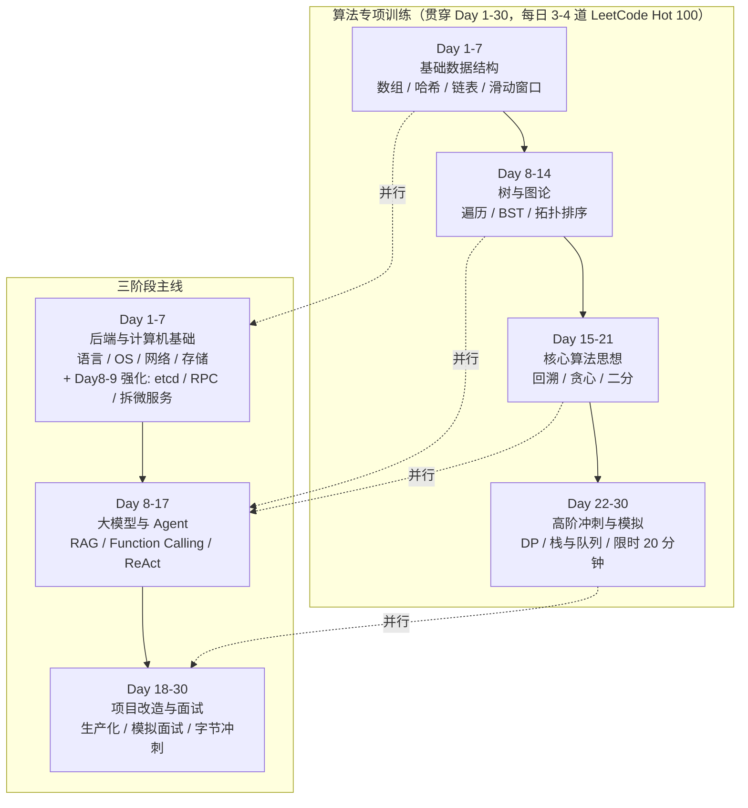

# 路线专题：30 天冲刺训练营

> 本专题将老师安排的 **30 天学习计划** 逐日拆解为可执行、细节到语法的训练营内容。
> 四大板块并行推进：**算法专项训练**贯穿全周期；**后端与计算机基础夯实**（Day 1-7 主线，Day 8-9 强化实战日弹性安排）、**大模型与 Agent 核心能力构建**（Day 8-17）、**简历项目改造与实战演练**（Day 18-30）三段主线接力。

## 计划全景

## 专题地图

| 文档 | 时间 | 内容 | 对应计划 |
|------|------|------|----------|
| [算法专项训练（Day 1-30）](./01-算法专项训练) | 全周期 | Hot 100 每日 3-4 题、四阶段拆解、Go 模板代码、限时模拟 | 计划「一」 |
| [后端与计算机基础夯实（Day 1-9）](./02-后端与计算机基础) | Day 1-7（+8/9 强化实战） | Go/Python 并发、OS/网络、MySQL/Redis/MQ/向量库；Day 8：etcd（Raft/Watch/Lease/分布式锁）+ RPC/gRPC（超时/重试/熔断）；Day 9：大厂单体拆微服务（边界/技巧/数据拆分）+ 生产级微服务骨架代码 | 计划「二」 |
| [大模型与 Agent 核心能力构建（Day 8-17）](./03-大模型与Agent核心能力) | Day 8-17 | LangChain、RAG 优化（Chunking/Rerank）、Function Calling、Token 监控 | 计划「三」 |
| [简历项目改造与面试实战演练（Day 18-30）](./04-简历项目改造与面试实战) | Day 18-30 | 项目生产化、STAR 至暗时刻、小厂试水、模拟面试、字节冲刺 | 计划「四」 |

## 30 天日历总表

| 日期 | 算法专项（并行） | 主线任务 | 关键交付物 |
|------|------------------|----------|------------|
| Day 1 | 数组 + 哈希表入门 | 后端基础：Go 并发 + Python asyncio 对照 | 并发任务池代码 |
| Day 2 | 哈希进阶 + 前缀和 | 操作系统：进程/线程/协程、GMP、epoll | GMP 讲解笔记 |
| Day 3 | 链表基础 | 网络：TCP 状态机、HTTP/HTTPS、WebSocket/SSE | Go SSE 服务 |
| Day 4 | 链表进阶 | MySQL：B+ 树、事务隔离、慢 SQL 优化 | 慢 SQL 优化 5 例 |
| Day 5 | 双指针入门 | Redis：数据结构、持久化、穿透/击穿/雪崩 | 防击穿缓存代码 |
| Day 6 | 滑动窗口进阶 | MQ + 向量数据库：异步解耦、Milvus/Pinecone | AI 剪辑异步架构图 |
| Day 7 | 链表综合 + LRU | 综合复习与自测（45 题，含 etcd/RPC/拆分强化 15 题） | 7 天复盘表 |
| Day 8 | 二叉树遍历 | LangChain / LlamaIndex 框架入门 | 最小 Chain 实现 |
| Day 9 | 递归进阶 | Prompt 工程 + 最小知识库问答 | 最小 RAG 链路 |
| Day 10 | BST 专题 | RAG：Chunking 策略 | 3 种切块对比 |
| Day 11 | 构造与路径 | RAG：Embedding 选型 | 选型对比表 |
| Day 12 | 图 + Trie | RAG：Rerank 重排序 | 检索对比实验 |
| Day 13 | 回溯入门 | Agent：Function Calling | 工具调用代码 |
| Day 14 | 回溯进阶 | Agent：ReAct + Multi-Agent | ReAct Agent |
| Day 15 | 贪心入门 | 工具落地：搜索 + 代码解释器 | 沙箱执行器 |
| Day 16 | 贪心进阶 | Token 监控 + 评估体系 | 评估集跑分 |
| Day 17 | 二分入门 | 项目整合 + 复盘 | 可演示项目 |
| Day 18 | 二分进阶 | 项目生产化改造（Redis/MQ） | 改造架构图 |
| Day 19 | 综合自测（限时） | Bad Case 分析 + 量化指标 | 5 个 Bad Case |
| Day 20 | DP 入门 | STAR 法则 + 至暗时刻案例库 | 2 个 STAR 案例 |
| Day 21 | DP 进阶 | 小厂试水：投递 3-5 家 | 试水复盘 |
| Day 22 | DP 背包/字符串 | 全真模拟面试（每日 1 次） | 模拟复盘表 |
| Day 23 | DP 困难/回文 | 全真模拟 + 自我介绍打磨 | 自我介绍 3 版 |
| Day 24 | 栈与队列 | 全真模拟 + 项目深挖 | 深挖题库 20 问 |
| Day 25 | 单调栈 + 堆 | 全真模拟 + 盲区清零 | 复盘闭环 |
| Day 26 | 冲刺模拟（限时） | 面经与项目文档整理 | 个人 FAQ 文档 |
| Day 27 | 冲刺模拟（限时） | 心态调整 + 模拟面试 ×2 | 面试清单 |
| Day 28 | 三轮刷法（错题） | 字节投递/内推准备 | JD 对照自检表 |
| Day 29 | 三轮刷法（错题） | 简历终稿 + 投递 | 简历定稿 |
| Day 30 | 三轮刷法（限时） | 正式发起投递/内推 | 冲刺完成 |

> 说明：算法专项每日 3-4 题固定执行；主线按天推进。若某天主线任务过重，算法题可减至 2 道，但**每天必须保持手感**。
>
> 强化日说明：**Day 8（etcd 与 RPC）**与 **Day 9（单体拆微服务 + 生产级微服务骨架）**是后端主线的弹性加练日，建议安排在首个休息日或与 AI 主线 Day 8-17 并行推进（每天 +1~1.5h）。Day 8 内容见 [02-后端与计算机基础](/路线专题/02-后端与计算机基础#day-8-强化日-etcd-与-rpc-分布式协调与远程调用)，Day 9 见 [同文 Day 9 章节](/路线专题/02-后端与计算机基础#day-9-综合实战日-单体拆微服务与生产级微服务骨架)。

## 每日时间分配建议

| 时段 | 内容 | 时长 |
|------|------|------|
| 上午 | 主线学习（后端 / AI / 项目改造） | 3h |
| 下午 | 算法刷题 3-4 道 + 错题复盘 | 2-3h |
| 晚上 | 实战练习 / 模拟面试 / 当日复盘 | 2h |

## 与既有文档的联动

本专题是"执行路线"，具体原理细节复用文档站已有内容：

- **Go 原理**：/第一阶段-知识详解/（GMP、GC、内存、Context、并发）
- **八股**：/第二阶段-知识详解/（OS、网络）、/后端技术栈强化/（MySQL、Redis、Kafka、微服务、高并发、K8s）
- **AI 项目**：/phase3/docs-rag/、/phase3/agent-harness/、/phase3/pi-harness/（简历项目改造的素材来源）
- **代码练习**：/练习指南、code/ 目录（Go 练习题）；Day 1-9 实战代码集见 `code/route/`（[习题集和答案/route](/习题集和答案/route/)，含 Day 8 etcd 分布式锁与 RPC 治理、Day 9 单体拆分与生产级微服务骨架）

## 使用方法

1. 打开对应日期的专题文档，按「知识点 → 代码练习 → 八股 → 验收标准」执行；
2. 算法题在 LeetCode 上完成，用 Go 作答，错题进入错题本模板；
3. 每天结束填写「复盘表」，做到当日复盘、当日解决；
4. Day 7 / 14 / 21 为阶段节点，完成自测后再进入下一段。
