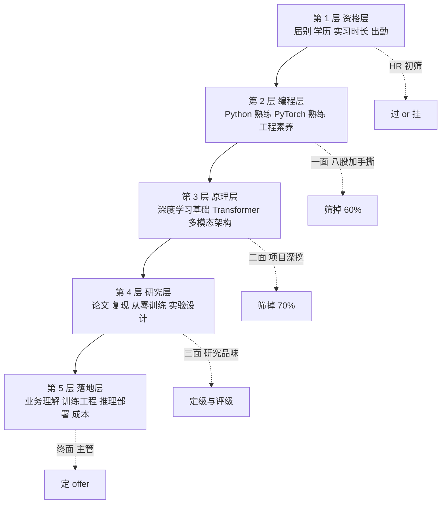
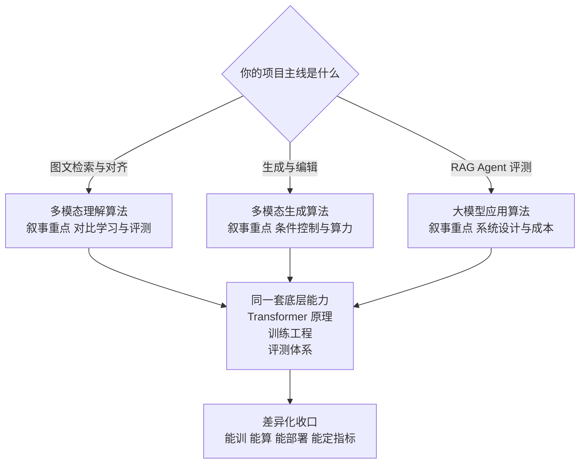
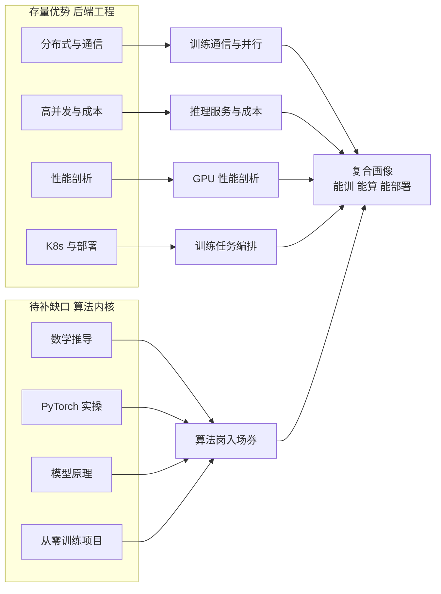
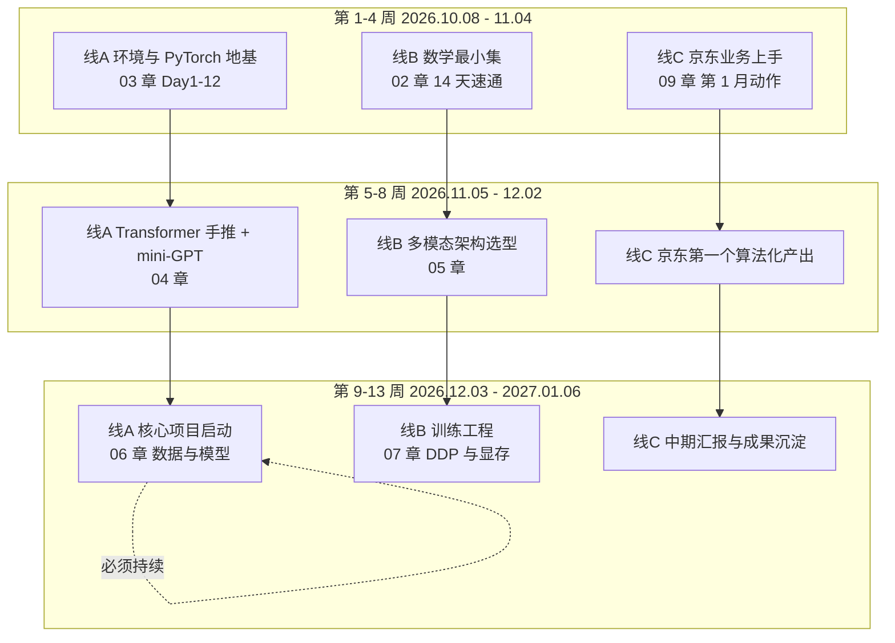

# 01 · 目标岗位分层与差距诊断

> 本章是整个转岗系列的**起点和标尺**。它做三件事：① 解剖"大模型算法岗"到底在要求什么；② 用一份可打分的自评表量化你缺什么、缺多少；③ 把 90 天的最小可行改造路径排出来。
> 读法：**先做第四节的评分，再看第三节的缺口映射表**——不知道自己在哪，后面 11 章的优先级都是猜的。
> 说明：下面对 JD 层的归纳，来自 2026-2027 年公开的大模型/多模态算法实习与校招岗位描述（例如百度昆仑芯的[大模型算法实习生](https://kunlunxin.zhiye.com/xiangqing?jobId=151153775)、[多模态大模型算法实习生](https://kunlunxin.zhiye.com/xiangqing?jobId=151154003)等），**不是某一家的原文**。投递时请用第一层的模板逐条拆解你真正要投的那个 JD。

## 本章学习目标

1. 能对着任意一份算法岗 JD，在 10 分钟内标出「硬门槛 / 可补齐 / 你的加分项」三类句子。
2. 完成一次 100 分制自评，得到一张明确的缺口清单与工时估算。
3. 想清楚一个必答题的答案：**"你是做后端的，为什么转算法？"**——并且这个答案要经得起三轮追问。
4. 定下你的主攻档位（B 档多模态 / C 档大模型应用算法）与保底档位。

---

## 一、大模型算法岗 JD 的解剖学：五层要求

算法岗 JD 看起来千差万别，但拆开永远是这五层。**面试流程也是按这五层逐层筛的**，越靠下越难伪造。

### 1.1 逐层拆解：JD 原句 → 面试官真正想验证什么

| JD 层 | 典型原句（归纳） | 面试官真正要验证的 | 你的应对 |
|-------|-----------------|------------------|---------|
| **资格层** | "2028 届硕士毕业生优先"、"每周出勤 4 天，实习 4 个月以上" | 你能待够吗？会不会随时走？ | 你 2028 届 + 愿意长实习，**这是纯优势**，面试时主动说清可实习窗口 |
| **编程层** | "熟练掌握 Python，熟悉 PyTorch 等深度学习框架" | 你敢不敢现场写？会不会只会改别人的脚本？ | 补[第 03 章](./03-PyTorch与训练工程地基)。**Python 不是你的短板（你是 Go 工程师），但"能读代码"和"能裸写训练循环"是两回事** |
| **原理层** | "深入理解 Transformer 架构、注意力机制、多模态对齐" | 你是背的，还是能推导？改一个模块你知道为什么吗？ | 补[第 04 章](./04-Transformer与LLM原理手推)、[第 05 章](./05-多模态原理与架构谱系) |
| **研究层** | "有顶会论文者优先"、"有大规模模型训练经验者优先"、"有较强的论文复现能力" | 你能不能独立提出假设、设计实验、验证结论？ | **没论文也能过**——用[第 06 章](./06-核心项目-多模态小模型从零训练)的从零训练项目 + [第 08 章](./08-评测体系与技术报告)的严谨评测替代。这是你最该下重注的地方 |
| **落地层** | "熟悉分布式训练、模型压缩与推理加速"、"有把模型落地到业务的经验" | 你训出来的东西能不能上生产？成本多少？ | **你的主场**。补[第 07 章](./07-训练与推理工程进阶)，把 GPU 问题讲成系统工程问题 |

> **关键判断**：五层里，**第 2、3 层是入场券（没有就直接挂），第 4 层是定级依据，第 5 层是你的差异化溢价**。所以学习时间的分配不能平均——第 2、3 层补到"够用且能过追问"就停手，把节省下来的时间投到第 4 层的项目与第 5 层的工程叙事上。

### 1.2 "有顶会论文者优先"这句话怎么读

这是最容易被吓退的一句。拆开看：

| 情况 | 他们真正想要的人 | 你能提供的替代证据 |
|------|----------------|------------------|
| 顶会一作 | 能独立做研究的信号 | ⚠️ 你没有，但不是硬门槛（JD 写的是"优先"，不是"必须"） |
| 大规模训练经验 | 见过真实训练现场：loss spike、NCCL 挂、数据脏、算力调度 | ✅ **可替代**：第 07 章的 DDP + 租云多卡 + 故障复现 |
| 论文复现能力 | 能读论文、能对齐细节、能解释指标差异 | ✅ **可替代**：把[第 05 章](./05-多模态原理与架构谱系)的某个开源自研工作复现到小规模，并写清"哪里对不齐、为什么" |
| 较强的编程与工程能力 | 能写能维护能部署 | ✅ **你本来就强**，且比绝大多数算法候选人强一个量级 |

**所以简历上不要写"无顶会论文"，而是要用两行把"复现能力 + 训练现场经验 + 工程闭环"立起来。** 这比一个勉强挂名的四作论文更有说服力。

---

## 二、三类目标岗位对照：投哪个、怎么讲

大模型算法岗内部差异极大，**同一个项目在不同岗位的面试里要被讲成不同的故事**。

| 维度 | ① 多模态理解算法 | ② 多模态生成算法 | ③ 大模型应用算法 |
|------|----------------|----------------|----------------|
| 典型工作 | 图文检索、VLM 训练与微调、文档/OCR 理解、视觉定位 | 图像/视频生成、可控生成、编辑与一致性、视频时序建模 | RAG 优化、Agent 策略、评测体系、推理优化、数据飞轮 |
| 核心考察 | CLIP/VLM 架构与对齐、数据配比、评测设计 | Diffusion/DiT 原理、条件控制、时序一致性、采样加速 | LLM 原理、检索与重排、评测、系统设计、成本 |
| 你的起点 | 中（需补 04/05/06） | 中低（需补 05 + 生成方向） | **高**（已有 RAG/Agent 实战） |
| 竞争激烈度 | 高 | 高 | 中 |
| 2028 届可达性 | ✅ 主攻 | ✅ 可作为第二叙事 | ✅ 保底与跳板 |
| 项目如何讲 | 讲对比学习、负样本、对齐、检索指标 | 讲加噪去噪、条件引导、一致性、算力预算 | 讲系统设计、成本与延迟、评测闭环、工程化 |
| 你的差异化话术 | "能算清显存预算并把它训完" | "能算清训练与采样的算力账" | "能把它做成满足 SLA 的服务" |

> **建议**：以**①多模态理解为项目主线**（第 06 章的 CLIP 式双塔），**③大模型应用算法为保底**，**②生成方向作为第二叙事**（把仓库已有的文生视频知识 + 一个小的扩散实验串起来）。三档同时准备，投递时按 JD 换叙事。

---

## 三、高频考点 → 你的缺口映射

这张表把"面试官会问什么"直接翻译成"你要补哪一章、大概多少小时"。

| 高频关键词 | JD 出现频次 | 你的现状 | 补齐章节 | 预估工时（标准档） |
|-----------|-----------|---------|---------|-----------------|
| Transformer / 注意力机制 | ★★★★★ | 概念级，不能推导 | [04](./04-Transformer与LLM原理手推) | 20h |
| PyTorch / 训练脚本 | ★★★★★ | **零基础** | [03](./03-PyTorch与训练工程地基) | 30h |
| 线性代数 / 概率 / 矩阵求导 | ★★★★☆ | 记得大概 | [02](./02-数学地基最小集) | 25h |
| 多模态对齐 / CLIP / VLM | ★★★★★ | 只听过名字 | [05](./05-多模态原理与架构谱系) | 25h |
| 从零训练 / 预训练 / 微调 | ★★★★★ | 无 | [06](./06-核心项目-多模态小模型从零训练) | 80h |
| 分布式训练 / DDP / DeepSpeed | ★★★★☆ | **概念可迁移，实操缺** | [07](./07-训练与推理工程进阶) | 25h |
| 模型压缩 / 量化 / 推理加速 | ★★★★☆ | 概念级（已知 KV Cache） | [07](./07-训练与推理工程进阶) | 15h |
| 评测指标 / 消融实验 | ★★★★☆ | 有跑分经验，缺体系 | [08](./08-评测体系与技术报告) | 20h |
| 论文阅读与复现 | ★★★★☆ | 弱 | [05](./05-多模态原理与架构谱系) + [12](./12-资源算力与弹性周计划) | 40h（长期） |
| 数据构造与清洗 | ★★★☆☆ | 无 | [06](./06-核心项目-多模态小模型从零训练) | 含在 80h 内 |
| 业务落地与成本 | ★★★☆☆ | **强** | [09](./09-京东实习期的算法筹码经营) | 0h（靠实习攒） |
| Python 工程化 | ★★★☆☆ | Go 强、Python 中等 | [03](./03-PyTorch与训练工程地基) | 含在 30h 内 |
| **后端 / 分布式 / 服务化** | ★★☆☆☆ | **远超要求** | [07](./07-训练与推理工程进阶)、[10](./10-大模型算法日常实习投递与面试) | 0h（存量优势） |
| **K8s / 性能剖析** | ★☆☆☆☆ | **远超要求** | [07](./07-训练与推理工程进阶) | 0h（存量优势） |

**注意最后两行。** 在算法岗的语境下，"分布式、服务化、性能剖析"是**稀缺技能**——大多数算法候选人只会写单机脚本。这两行是你唯一能"以高于岗位要求"的维度，务必在面试里主动亮出来。

### 总工时账（必须算清楚）

按上表：20 + 30 + 25 + 25 + 80 + 25 + 15 + 20 + 40 ≈ **280 小时**。

| 档位 | 每周投入 | 学完全部内容需要 | 到 2027-02-06 前总共能投入 |
|------|---------|----------------|--------------------------|
| 保底档 | 15h | 18.7 周 | 17 周（**差 1.7 周，需砍掉部分内容**） |
| 标准档 | 30h | 9.3 周 | 17 周（**从容，可留复盘余量**） |
| 冲刺档 | 50h | 5.6 周 | 17 周（**可加做论文复现与竞赛**） |

> **结论**：如果按**保底档 15h/周**推进，到 2027 春节前**学不完**全部内容。所以本章第六节给了"最小可行改造路径"——砍到 180 小时的核心集，把 100 小时的可选项（论文复现、生成方向、竞赛）挪到 P2 之后。

---

## 四、差距诊断自评表（现在就做，20 分钟）

**评分规则**：每项按"我能拿出什么证据"打分，不是按"我好像会"。**拿不出证据的，一律打 0。**

| # | 维度 | 分值 | 0 分标准 | 满分标准 |
|---|------|------|---------|---------|
| 1 | 数学推导 | 10 | 看到公式就跳过 | 能手推 softmax+交叉熵梯度、能解释 SVD 与低秩分解 |
| 2 | PyTorch 实操 | 15 | 没跑过训练 | 能裸写含验证/checkpoint/resume/混合精度的训练脚本 |
| 3 | Transformer 原理 | 15 | 只能说出"注意力就是加权求和" | 能手写 MHSA、能推 shape 变化、能解释 RoPE 与 Pre-LN 的必要性 |
| 4 | 训练工程 | 10 | 不知道显存怎么算 | 能算出给定模型的显存预算并给出优化优先级 |
| 5 | 多模态架构 | 10 | 只知道 CLIP 这个名字 | 能对比 CLIP / BLIP-2 / LLaVA 的连接方案优劣并说明选型理由 |
| 6 | 从零训练项目 | 20 | 无 | 有完整闭环：自建数据 + 自搭模型 + 训练 + 评测 + 消融 |
| 7 | 评测与实验设计 | 10 | 只会看别人给的指标 | 能自己设计评测集、识别捷径、完成消融与失败归因 |
| 8 | 研究素养 | 5 | 没读过论文 | 完整读过 10 篇相关论文并能复现其中 1 篇的关键结论 |
| 9 | 分布式与推理部署 | 5 | 无 | 跑过 DDP、部署过 vLLM 或做过量化对比 |
| — | **合计基础分** | **100** | — | — |
| 加分 | 后端工程 / 系统设计 | +10 | — | 有生产级系统经验（**你应拿满**） |
| 加分 | 性能剖析与成本优化 | +5 | — | 能用数据说明优化前后的成本差 |
| 加分 | 论文 / 竞赛 / 开源 | +10 | — | 顶会或 Kaggle/天池前列 |

### 你的预期得分（按当前状态）

| 维度 | 预期 | 说明 |
|------|------|------|
| 1 数学 | 2/10 | 记得大概 ≈ 拿不到分 |
| 2 PyTorch | 0/15 | 完全没写过 |
| 3 Transformer | 5/15 | 概念级，答不了追问 |
| 4 训练工程 | 2/10 | 能理解概念（KV Cache 那套），但没算过显存 |
| 5 多模态架构 | 2/10 | 名字级 |
| 6 项目 | 0/20 | **最大缺口** |
| 7 评测 | 3/10 | 有跑分经验，不成体系 |
| 8 研究素养 | 1/5 | — |
| 9 分布式部署 | 3/5 | 概念与工程直觉强，缺 GPU 实操 |
| **基础分** | **≈18/100** | — |
| 加分项 | **+10** | 后端工程 + 性能剖析应拿满 |
| **总分** | **≈28/110** | 算法岗面试的及格线大约在 **65 分** |

> **别被 28 分吓到。** 这个分数低，是因为 6 号（从零训练项目）20 分和 2 号（PyTorch）15 分**现在是 0**——它们恰好是最容易在 4 个月内从 0 变成满分的两项。**你的分数曲线会是"前 6 周慢、第 8-16 周陡升"**，因为项目一训起来，2/4/5/6/7/9 六项会同时上涨。这是典型的"项目驱动型成长"。

**每次自评都记下日期与分数**，这是你唯一客观的进度指标。建议每月 1 号和 15 号各评一次。

---

## 五、存量资产盘点：你手里已经有的牌

转岗最容易犯的错是只盯缺口。先把牌摊开——**下面每一条都能在算法岗面试里换到分数**。

| 存量资产 | 在算法岗面试里的用法 | 需要强化什么 |
|---------|-------------------|-------------|
| **Go + 后端/分布式工程** | 回答"训练卡在通信怎么办""怎么设计大模型推理服务"时直接降维 | 把知识从"服务"映射到"训练"（[第 07 章](./07-训练与推理工程进阶)） |
| **RAG / Agent 实战** | C 档岗位的主叙事；也是"数据飞轮""检索优化"的天然跳板 | 补 LLM 内部原理，把"调 API"升级成"懂模型"（[第 04 章](./04-Transformer与LLM原理手推)） |
| **Kafka / Redis / MySQL / etcd** | 训练数据管线、特征缓存、实验元数据管理、断点续训的状态机 | 类比迁移，写成"数据管线工程"经历 |
| **pprof / 性能剖析** | 直接对应 `torch.profiler` 与 GPU 利用率分析，**方法论完全一致** | 学一次 torch.profiler 即可复用整套排查直觉 |
| **K8s / 容器化** | 训练任务调度、多机多卡编排、推理服务弹性伸缩 | 了解 GPU 调度（device plugin、MIG、共享 GPU） |
| **写文档与量化归因的习惯** | 直接支撑[第 08 章](./08-评测体系与技术报告)的技术报告 | 把"工程复盘"的经验迁到"实验记录" |
| **京东 JoyAI 的 Agent 业务现场** | 第 09 章：把它变成算法化简历条目 | 主动争取算法相关需求 |

---

## 六、90 天最小可行改造路径

如果时间不够（保底档），**下面这 180 小时是不能再砍的核心**；砍掉的 100 小时是可选项（论文复现、生成方向、竞赛）。

### 6.1 三条并行线

### 6.2 逐周任务表（标准档 30h/周，括号内为保底档）

| 周 | 时间 | 主线（18h / 保底 10h） | 副线（8h / 保底 4h） | 交付物（可验证） |
|----|------|---------------------|-------------------|----------------|
| W1 | 10.08-10.14 | [03 章](./03-PyTorch与训练工程地基) Day1-5（保底 Day1-3） | [02 章](./02-数学地基最小集) 线代最小集 | 能训 MNIST > 98% |
| W2 | 10.15-10.21 | 03 章 Day6-12 | 02 章 概率+微积分 | 完整训练脚本模板（含 resume） |
| W3 | 10.22-10.28 | [04 章](./04-Transformer与LLM原理手推) 注意力手推 + 手写实现 | 02 章 手算习题 | 手写 MHSA 单测通过 |
| W4 | 10.29-11.04 | 04 章 mini-GPT | 02 章 复盘 + [01 章](#) 二次自评 | mini-GPT 生成通顺片段 |
| W5 | 11.05-11.11 | [05 章](./05-多模态原理与架构谱系) 谱系 + 选型 | 京东业务产出 | 项目选型决策记录 |
| W6 | 11.12-11.18 | 05 章 可复现性分级 + 定项目方案 | 京东业务产出 | [06 章](./06-核心项目-多模态小模型从零训练) 方案定稿 |
| W7 | 11.19-11.25 | 06 章 数据构造 | [07 章](./07-训练与推理工程进阶) 显存预算 | 数据集 v1（≥5 万图文对） |
| W8 | 11.26-12.02 | 06 章 模型实现 + 单卡跑通前 1000 步 | 07 章 混合精度与梯度累积 | 训练能跑通、loss 正常下降 |
| W9 | 12.03-12.09 | 06 章 完整训练 + 首次评测 | 07 章 DDP 跑通 | 第一版检索指标 |
| W10 | 12.10-12.16 | 06 章 数据集扩容与第一轮调参 | 07 章 torch.profiler | 指标提升记录 |
| W11 | 12.17-12.23 | [08 章](./08-评测体系与技术报告) 评测脚本与消融 | 07 章 量化对比实验 | 消融表 v1 |
| W12 | 12.24-12.30 | 08 章 报告初稿 + Bad case 分析 | [09 章](./09-京东实习期的算法筹码经营) 实习成果整理 | 报告初稿 |
| W13 | 12.31-01.06 | 08 章 报告定稿 + 项目讲解视频 | [10 章](./10-大模型算法日常实习投递与面试) 简历一版 | 报告 + 90 秒讲解 |
| W14-17 | 01.07-02.06 | 项目打磨 + 模拟面试 + 投递准备 | 京东实习收尾与交接 | G4 门禁达成 |

> **保底档怎么砍**：W1-W4 不砍（地基必须打）；W5 的谱系可以只看前三节；W6 的项目方案必须做；**W7-W12 只做"数据 + 模型 + 首评"三件事，把消融砍到 3 组**；W13 的报告从 30 页砍到 15 页。**但绝不能砍掉项目本身。**

---

## 七、算法岗面试的四轮结构与淘汰逻辑

知道流程才能分配准备精力。

| 轮次 | 时长 | 考察重点 | 淘汰原因 Top 3 | 你的准备 |
|------|------|---------|---------------|---------|
| 简历筛选 | — | 关键词命中、项目含金量 | 无算法项目、简历全是后端 | [第 11 章](./11-2028届秋招规划与简历转化) |
| 一面 | 45-60min | 八股 + 手撕 | 讲不清 Transformer；手写 attention 写错 shape；Python 不熟 | [04 章](./04-Transformer与LLM原理手推) + [03 章](./03-PyTorch与训练工程地基) |
| 二面 | 45-60min | 项目深挖 3 层 | 项目不是自己做的；说不出 baseline；指标提升无法归因 | [06 章](./06-核心项目-多模态小模型从零训练) + [08 章](./08-评测体系与技术报告) |
| 三面 | 45-60min | 研究品味 / 系统设计 | 没有假设-验证-结论的思维；只会调包 | [08 章](./08-评测体系与技术报告) + [07 章](./07-训练与推理工程进阶) |
| 主管面 | 30-45min | 动机、稳定性、能否落地 | **"你为什么要转"答不好**；"你能待多久"不清楚 | 见下节 |
| HR 面 | 20-30min | 出勤、时长、薪资 | 出勤天数谈不拢 | 提前算清可实习窗口 |

---

## 八、必答题：**"你是做后端的，为什么转算法？"**

这道题在三面与主管面必问，而且会被追问 2-3 层。**背一个"因为我对 AI 充满热情"的答案一定挂。** 需要一个"有事实、有转折、有指向"的答案。

### 8.1 答案结构：三段式

| 段 | 作用 | 示例骨架（按你自己改写） |
|----|------|------------------------|
| **1. 事实起点** | 说明你不是"干不下去才转" | "我在京东做 Agent 后端，做的是 JoyAI 相关的 xx 链路。做了三个月之后我发现，我们系统里最影响效果的那部分不在工程侧，而在检索质量/生成质量——工程只能把上限兑现，算法才决定上限在哪。" |
| **2. 主动转身** | 说明你已经动手了，不是空想 | "所以我从 10 月开始补齐了 PyTorch 与数学，自己在单卡上从零训了一个 CLIP 式双塔模型，做了 6 组消融；同时把训练系统当作分布式系统来研究，算过显存预算和通信量。" |
| **3. 指向未来** | 说明你要去哪、为什么是这里 | "我想做的是 xx 方向。我的判断是，这个方向很多问题最后是工程问题——数据管线、训练效率、推理成本。我希望把我在分布式系统上的积累用在算法侧，这也是我认为自己能比纯算法背景的同学多贡献一块的地方。" |

### 8.2 会被追问的三层及应对

| 追问 | 陷阱 | 应对原则 |
|------|------|---------|
| "那你后端的东西不是白学了？" | 不要贬低后端，那显得你轻率 | 强调**迁移价值**：分布式通信、性能剖析、服务化，在训练与推理侧同样是稀缺能力 |
| "你算法基础比科班的差，怎么补？" | 不要逞强也不要自贬 | 给**证据 + 时间表**："我知道差距在数学推导与训练经验上。我已经补了 X，预计 Y 月完成 Z，目前手推 attention 和 mini-GPT 都能独立完成。" |
| "如果这个岗位还是让你写后端你干吗？" | 这是稳定性测试 | 诚实且积极："我愿意先从工程侧切入，因为我对系统有优势；但我希望团队里有算法侧的成长路径，我的目标是 xx。" |

> **原则：不编造、不贬低、给证据。** 这条原则贯穿本系列全部章节——尤其参见[面试项目深挖](/面试项目深挖/)栏目里反复强调的"诚实边界：不能吹的点一个都别吹"。

---

## 九、常见误区

| 误区 | 为什么错 | 正确做法 |
|------|---------|---------|
| "先把数学全学完再碰代码" | 数学是无限的，你会在第 3 周就放弃 | 学**20% 支撑 80% 实践**的最小集（[02 章](./02-数学地基最小集)），边跑边补 |
| "我要从零复现一个 7B 模型" | 单卡 12GB 物理上做不到，注定烂尾 | 做**小模型 + 完整闭环**（[06 章](./06-核心项目-多模态小模型从零训练)） |
| "等有了算法实习再想项目" | 没有项目就拿不到算法实习——死循环 | **项目是入场券，实习是结果**，顺序不能反 |
| "京东这段实习反正要结束了，混混就行" | 浪费了唯一一段"真实业务 + 有收入 + 有时间"的窗口 | [第 09 章](./09-京东实习期的算法筹码经营)：主动争取算法相关需求 |
| "简历上把后端经历改写成算法经历" | 一问就穿，比没有更糟 | 保留真实边界，用**新项目**承担算法叙事（[11 章](./11-2028届秋招规划与简历转化)） |
| "指标不高就不敢写" | 面试官不要求你 SOTA，要求你说清"怎么证明有效" | 写清**baseline、对比条件、提升幅度、失败分析**（[08 章](./08-评测体系与技术报告)） |
| "面经背得多就能过" | 算法岗的追问深度远超背诵 | 每个知识点都要有"为什么这么设计 + 代价是什么" |

---

## 十、自测清单

- [ ] 我能对着任意一份算法岗 JD，在 10 分钟内标出「硬门槛 / 可补齐 / 我的加分项」
- [ ] 我完成了第 4 节的 100 分制自评，并记下了分数与日期
- [ ] 我能背出自己每一项的**证据**（不是"我会"，而是"我做过 X，结果是 Y"）
- [ ] 我算清了自己的总工时预算，知道保底档/标准档各能覆盖到哪一节
- [ ] 我选定了主攻档位（①多模态理解 / ②生成 / ③应用算法）与保底档位
- [ ] 我能用 90 秒讲清"为什么从后端转算法"，并且不怕三层追问
- [ ] 我知道算法岗面试有四轮，每轮淘汰的典型原因
- [ ] 我列出了自己 5 张以上"存量牌"，并能说出每张牌在算法面试里的用法
- [ ] 我已经知道到 2027-02-06 前要交付的四个东西（D1-D4）
- [ ] 我结束了"只盯缺口"的心态——我不仅有缺口，还有溢价

---

## 下一步

1. **今天**：做完第 4 节自评，把分数记在日历上。
2. **明天**：读[第 03 章](./03-PyTorch与训练工程地基)的 Day 1，把环境装好。
3. **本周内**：在[第 12 章](./12-资源算力与弹性周计划)里确定档位，把第 6.2 节的逐周表抄进你自己的日程。
4. **入职后第一周**：读[第 09 章](./09-京东实习期的算法筹码经营)，把"如何在京东攒算法筹码"落实到第一个需求上。
