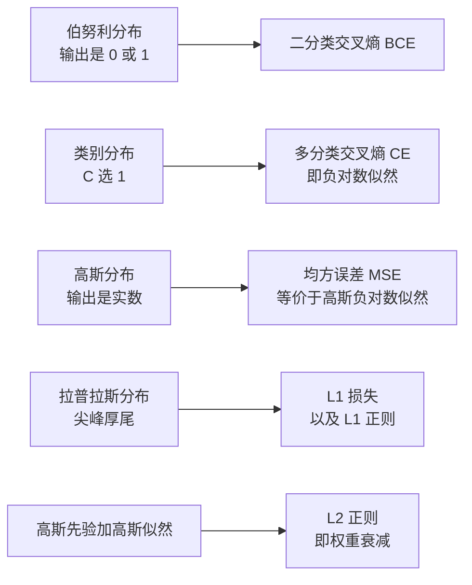
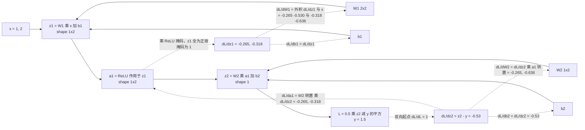

# 02 · 数学地基最小集

> 本章是「转岗大模型算法」系列第 02 章，前置为 [01 目标岗位分层与差距诊断](./01-目标岗位分层与差距诊断)，后续直接衔接 [03 PyTorch 与训练工程地基](./03-PyTorch与训练工程地基) 与 [04 Transformer 与 LLM 原理手推](./04-Transformer与LLM原理手推)，系列全貌见 [总览](./)。
> **本章要解决的问题**：把数学从「学过但忘了」补到「能读懂 Transformer / CLIP / 扩散模型论文里的每一个符号，能手推反向传播，能自己推导损失函数」的**最小集**。
> **本章不解决的问题**：不重修数学系课程。实分析、测度论、凸优化收敛性证明、数值线性代数的稳定性分析全部跳过——它们不构成你转岗的瓶颈。
> **读者画像**：Go/后端工程很强（分布式、MySQL、Redis、Kafka、K8s、pprof 都系统练过），PyTorch 零基础，数学只记得大概、公式推导生疏。所以本章每个数学概念都强制给出「它对应哪一行代码 / 哪个模型里的哪一步」，用工程师的语言讲数学，多给具体数字算例。
> **为什么放在这个阶段**：2026-10-08 入职京东实习（Go 后端 / AI 应用），实习期只做业务不补数学会越拖越贵；数学恰恰是唯一可以**纯离线、不需要 GPU** 补齐的短板。等 2027 年要投大模型算法日常实习时再补，就要和 Transformer 手推、PyTorch 工程挤在同一条时间线上，必崩。
## 本章学习目标

| 维度 | 目标 | 验收方式 |
|------|------|----------|
| 符号能力 | 打开 Attention Is All You Need / CLIP / DDPM，逐个符号能说出它的 shape、取值范围、对应哪一步计算 | 任选一篇论文的公式，逐项口头解释 |
| 手推能力 | 能在纸上推完 softmax+交叉熵梯度、2 层 MLP 反向传播、Attention 的 shape 流 | 限时 15 分钟白纸完成，不看笔记 |
| 推导能力 | 能从「假设输出服从什么分布」出发自己推出损失函数（MSE / BCE / CE / L1 全部来自 MLE） | 现场推导高斯→MSE、类别→CE |
| 判断能力 | 能回答「这个模块为什么这么设计」：sqrt(d_k) 缩放、低秩 LoRA、AdamW 解耦衰减、InfoNCE 温度 | 面试问答 12 题全部能答 |
| 工程衔接 | 每个数学概念能说出「不懂它会卡在哪一行代码 / 报什么错」 | 闭环映射表逐行自查 |
| 时间弹性 | 2 周 14 天完成，适配保底 15h / 标准 30h / 冲刺 50h 三档 | 14 天日程表带三档裁剪方案 |
## 核心知识点提炼

| 知识点 | 一句话结论 | 面试高频度 |
|--------|-----------|-----------|
| 内积与余弦相似度 | 内积是投影长度之积，余弦相似度去掉模长只留方向；CLIP 的 `logits = image_emb @ text_emb.T` 就是它 | ⭐⭐⭐ |
| 矩阵乘法三视角 | 行视角=每个输出行是输入行的线性组合；列视角=输出是若干列向量的加权和；元素视角=`C[i][j] = Σ_k A[i,k]B[k,j]` | ⭐⭐ |
| 批量矩阵乘 | Attention 的 `[B,h,L,d] @ [B,h,d,L] → [B,h,L,L]`，前两维是 batch 维不参与收缩 | ⭐⭐⭐ |
| 范数 L1/L2/Frobenius | L2 可导 → 权重衰减；L1 在 0 处不可导 → 稀疏解；Frobenius 就是矩阵展平后的 L2 → 梯度裁剪用它 | ⭐⭐⭐ |
| 特征分解与 SVD | SVD 把任意矩阵拆成旋转-缩放-旋转；只留最大的 r 个奇异值即最优低秩近似（Eckart–Young）→ LoRA / PCA / 压缩 | ⭐⭐⭐ |
| 矩阵求导与雅可比 | 标量对向量求导得梯度（同形），向量对向量求导得雅可比（矩阵），向量-雅可比积 VJP 才是反向传播的实现方式 | ⭐⭐⭐ |
| softmax 导数 | `∂p_i/∂z_j = p_i(δ_ij − p_j)`，配合交叉熵后塌缩成 `p − y` 这个极干净的形式 | ⭐⭐⭐ |
| 期望与方差 | 期望永远线性，方差只在独立时可加；`Var(aX+b) = a²Var(X)`；`Var(Wx) = fan_in·Var(w)·Var(x)` | ⭐⭐ |
| 条件概率与贝叶斯 | 后验 ∝ 似然 × 先验；正则项就是先验的对数，所以 L2 对应高斯先验、L1 对应拉普拉斯先验 | ⭐⭐⭐ |
| 分布 → 损失函数 | 伯努利→BCE，类别→CE，高斯→MSE，拉普拉斯→L1；**任何损失函数背后都有一个分布假设** | ⭐⭐⭐ |
| MLE = 最小化负对数似然 | 交叉熵不是凭空设计的，它是「输出服从类别分布时的负对数似然」 | ⭐⭐⭐⭐ |
| KL 散度与 JS 散度 | KL 非负、不对称、`KL(P‖Q) = 交叉熵 − 熵`；蒸馏 / DPO / 扩散的训练目标全是 KL | ⭐⭐⭐⭐ |
| 互信息与 InfoNCE | 互信息难以直接估，InfoNCE 是它的变分下界；对比学习本质是一个 N 分类问题 | ⭐⭐⭐ |
| 蒙特卡洛与重参数化 | 梯度与期望可交换，允许采样估梯度；但采样本身阻断梯度，重参数化 `z = μ + σε` 把随机性挪到无参数项上 | ⭐⭐⭐ |
| 温度系数 | `softmax(z/T)`，T↓ 分布更尖锐（难负样本主导），T↑ 更平滑（软标签蒸馏） | ⭐⭐⭐ |
| 链式法则与计算图 | 反向传播 = 在计算图上逆序做链式法则，每个节点只做「上游梯度 × 本地雅可比」，分叉处梯度相加 | ⭐⭐⭐⭐ |
| 梯度下降族 | SGD / Momentum / RMSProp / Adam / AdamW 五个更新式背到能默写，并知道各自解决什么问题 | ⭐⭐⭐⭐ |
| Hessian 与二阶方法 | 二阶收敛快，但 Hessian 是 `O(P²)` 存储、逆是 `O(P³)`，1750 亿参数下完全不可行；只剩对角近似（Adam 的 v） | ⭐⭐ |
## 知识点详解
### 线性代数最小集
#### 向量、内积与余弦相似度：CLIP 那一行代码

内积 `a·b = Σ a_i b_i = ‖a‖‖b‖cosθ`，同时编码模长与方向；余弦相似度把模长除掉：`cos(a,b) = (a·b) / (‖a‖₂‖b‖₂)`，取值范围 `[-1, 1]`。CLIP 的对比学习主干就一行：

```python
# image_emb: [N, d], text_emb: [N, d], 均已 L2 归一化
logits = image_emb @ text_emb.T            # [N, N]，对角线是正样本
labels = torch.arange(N)
loss = (F.cross_entropy(logits, labels) + F.cross_entropy(logits.T, labels)) / 2
```

工程直觉：归一化之后内积**就是**余弦相似度，`logits` 被限制在 `[-1,1]`；再除以温度 `τ = 0.07` 后 range 变成 `[-14.3, 14.3]`，softmax 才有足够陡的梯度。不懂余弦相似度，就看不懂为什么 CLIP 必须先 `F.normalize`。
#### 矩阵乘法的三种视角

给定 `A: [m,k]`、`B: [k,n]`、`C = AB: [m,n]`：

| 视角 | 表达式 | 工程含义 |
|------|--------|----------|
| 元素视角 | `C[i][j] = Σ_k A[i,k]·B[k,j]` | 三层循环，复杂度 `O(mkn)`；也是 GPU 上要 tiling 的原因 |
| 行视角 | `C[i,:] = Σ_k A[i,k]·B[k,:]` | 每个输出行是 B 各行的加权组合，权重来自 A 的行 |
| 列视角 | `C[:,j] = A @ B[:,j]` | 每个输出列是 A 的列向量的线性组合，系数来自 B 的列 |

**批量矩阵乘在 Attention 里长什么样**：前两维 `[B,h]` 是 batch 维，只有最后两维参与收缩。

```text
Q: [B, h, L, d_k]  @  Kᵀ: [B, h, d_k, L]  →  scores: [B, h, L, L]
scores @ V: [B, h, L, L] @ [B, h, L, d_v] →  out:    [B, h, L, d_v]
```

`L × L` 的中间矩阵就是 Attention 的计算与显存瓶颈：`B=1, h=32, L=4096` 时单个 FP32 scores 张量就是 `32 × 4096 × 4096 × 4B = 2.1 GB`。FlashAttention、KV Cache、长上下文显存问题全部源自这一步。
#### 范数：L1 / L2 / Frobenius

三个定义分别是 `‖w‖₁ = Σ|w_i|`、`‖w‖₂ = sqrt(Σ w_i²)`、`‖W‖_F = sqrt(Σ_i Σ_j W_ij²)`（矩阵展平后的 L2）。两个直接用途：**权重衰减**在损失里加 `(λ/2)‖w‖₂²`，梯度贡献是 `λw`，所以更新式里出现 `w ← w − lr·λ·w`；**梯度裁剪**用 `clip_grad_norm_` 算所有参数梯度拼成的大向量的全局 L2（即 Frobenius）范数，超阈值就整体乘 `max_norm / total_norm`——只缩长度，不改方向。

L1 稀疏、L2 不稀疏的数学原因：

```text
L1: ∂|w|/∂w = sign(w)，梯度是常数 λ（与 |w| 无关）
    只要数据梯度 |g| < λ，g + λ·sign(w) 就把 w 稳定推向 0 并精确停在 0
L2: ∂(w²/2)/∂w = w，梯度 λw 随 w→0 一起趋 0，只能无限逼近 0，不会等于 0
```
#### 特征值、特征分解与 SVD：理解 LoRA 的唯一钥匙

特征分解只对方阵（最好对称）可用：`A = QΛQ⁻¹`；对称实矩阵有 `A = QΛQᵀ`，`Q` 正交（旋转），`Λ` 对角（沿特殊方向的拉伸倍数）。SVD 对任意形状都成立：

```text
A = U Σ Vᵀ,   A: [m,n], U: [m,m], Σ: [m,n] 对角, V: [n,n]
A = Σ_{i=1}^{r} σ_i · u_i · v_iᵀ,        r = rank(A)
几何:  Vᵀ 旋转输入 → Σ 沿坐标轴缩放 → U 旋转输出
Eckart-Young: 秩不超过 k 的最优近似是 A_k = Σ_{i<=k} σ_i u_i v_iᵀ
              误差恰好是丢掉的奇异值平方和: ‖A − A_k‖_F² = Σ_{i>k} σ_i²
能量集中: 真实权重谱衰减极快，前 1% 奇异值常承担 90%+ 能量 —— 低秩压缩的前提
```

LoRA 的动机：微调量 `ΔW` 的内在秩很低，于是用 `ΔW = BA` 代替，`B: [d,r]`、`A: [r,k]`，`r ≪ min(d,k)`；`A` 高斯初始化、`B` 零初始化，保证训练起点 `ΔW = 0`，不破坏预训练权重。
#### 矩阵求导、雅可比与 VJP

约定分母布局：标量对向量求导得同形向量（梯度），向量 `y: [m]` 对向量 `x: [n]` 求导得矩阵 `[m,n]`（雅可比 `J_ij = ∂y_i/∂x_j`）。反向传播实际算的不是完整雅可比，而是**向量-雅可比积 VJP**：给定上游梯度 `v`（形状同 `y`），求 `vᵀJ`（形状同 `x`）。关键工程洞察：**雅可比可能是 `[1000, 1000000]` 的巨矩阵，但 VJP 只需一次 `O(参数量)` 的运算**，所以 PyTorch 从不显式构造雅可比。

```text
y = Wx          →  ∂L/∂x = Wᵀ(∂L/∂y)      ∂L/∂W = (∂L/∂y) xᵀ     ← 外积
y = f(x) 逐元素 →  ∂L/∂x = (∂L/∂y) ⊙ f'(x)                      ⊙ 是逐元素乘
L = 0.5‖Wx−y‖²  →  ∂L/∂W = (Wx − y) xᵀ
```
#### softmax 的导数：全章最重要的一个公式

```text
p = softmax(z),  p_i = exp(z_i) / Σ_j exp(z_j)
∂p_i/∂z_j = p_i (δ_ij − p_j)          矩阵形式: J = diag(p) − p pᵀ
三个性质: ① 每行和为 0  ② 对称  ③ p 接近 one-hot 时 J → 0（softmax 饱和）
配交叉熵后奇迹: L = −Σ_i y_i log p_i  →  ∂L/∂z = p − y
```

性质 ① 的原因：`Σ_i p_i ≡ 1` 是恒等式，任何方向的扰动都不能改变总和。性质 ③ 是「softmax 饱和导致梯度消失」的数学根源。而 `∂L/∂z = p − y` 干净得惊人——梯度里不含任何 `p_i p_j` 项，数值上极其稳定，这就是 softmax + 交叉熵这套组合被全行业选中的核心理由。
### 概率统计最小集
#### 随机变量、期望与方差（以及它与 BN 的关系）

`E[X] = Σ_x x·P(X=x)`，`Var(X) = E[(X−E[X])²] = E[X²] − E[X]²`。三条常考性质：

```text
E[aX + b] = a E[X] + b              永远成立
E[X + Y] = E[X] + E[Y]              永远成立，不需要独立
Var(aX + b) = a² Var(X)             常数不贡献方差
Var(X + Y) = Var(X) + Var(Y)        仅在独立时成立；否则要加 2Cov(X,Y)
```

**与 BN 的关系（最容易被搞混的一点）**：BN 做 `x̂ = (x − μ_B)/sqrt(σ_B² + ε)`，`μ_B`、`σ_B²` 是**当前 batch 的样本均值/方差**；训练用 batch 统计量（有噪声、起正则作用），推理用滑动平均的 `running_mean`/`running_var`，所以 eval 时必须 `model.eval()`，否则结果会飘。BN 有效的原因是把每层输入分布拉回均值 0 方差 1；而**方差的可加性只在独立时成立**这一条，既是「batch 均值是总体均值无偏估计」的依据，也是 batch size 太小（甚至 =1，方差为 0 导致除零）时 BN 失效的原因。
#### 条件概率、贝叶斯与「正则即先验」

`P(A|B) = P(A∩B)/P(B)`，贝叶斯 `P(θ|D) = P(D|θ)P(θ)/P(D)`，即**后验 ∝ 似然 × 先验**。取负对数：

```text
−log P(θ|D) = −log P(D|θ) − log P(θ) + const = 负对数似然 + 负对数先验
w ~ N(0, σ²)     →  −log P(w) = w²/(2σ²) + const   →  L2 正则，λ = 1/σ²
w ~ Laplace(0,b) →  −log P(w) = |w|/b + const      →  L1 正则，λ = 1/b
```

也就是说，**训练损失里的正则项，字面上就是「参数的负对数先验」**。拉普拉斯分布在 0 处有尖峰，天然鼓励稀疏，这从概率角度解释了 L1 为什么产生稀疏解。
#### 常见分布与损失函数的一一对应



这就是「能自己推导损失函数」的含义：

```text
y|x ~ N(f_θ(x), σ²)        → −log p = (y − f_θ(x))²/(2σ²) + ½log(2πσ²)   → 最小化它 = MSE
y|x ~ Bernoulli(p_θ(x))    → −log p = −[y log p + (1−y) log(1−p)]         → BCE
y|x ~ Categorical(p_θ(x))  → −log p = −Σ_c y_c log p_c                    → 交叉熵
```

**结论：没有「哪个损失更好」的问题，只有「你假设数据服从什么分布」的问题。** 回归任务用 MSE 是因为隐式假设了高斯噪声；数据有重尾离群点时就该换 L1（拉普拉斯假设，对异常值更鲁棒），而不是继续调学习率。
#### MLE → 交叉熵：它们字面上是同一个东西

```text
i.i.d. 样本的似然     L(θ) = Π_i p_θ(y_i|x_i)
取对数（单调变换不改最优点）  log L(θ) = Σ_i log p_θ(y_i|x_i)
最大化似然 = 最小化负对数似然  θ* = argmin_θ −Σ_i log p_θ(y_i|x_i)
除以 N 写成期望形式          = argmin_θ E_{x,y~data}[ −log p_θ(y|x) ]   ← 这就是交叉熵
```

所以被问「交叉熵的物理意义」，标准答案是：**它是用模型分布去编码真实标签所需的平均比特数，等价于在 i.i.d. 假设下做极大似然估计。** LLM 的 next-token prediction 就是在每个位置对词表做 C 分类交叉熵，`loss = −log p(正确 token)`。
#### KL 散度与 JS 散度：蒸馏、DPO、扩散的共同语言

```text
KL(P‖Q) = Σ_x P(x) log( P(x)/Q(x) ) = E_{x~P}[ log P(x) − log Q(x) ]
性质: KL ≥ 0（Jensen 不等式，−log 是凸函数），等号当且仅当 P = Q
KL 不对称！所以 KL(P‖Q) ≠ KL(Q‖P)，直接催生 forward / reverse KL 的不同行为
KL(P‖Q) = H(P,Q) − H(P)，即 交叉熵 = 熵 + KL（以 P 为目标时最小化 CE ⟺ 最小化 KL）
JS(P,Q) = ½KL(P‖M) + ½KL(Q‖M),  M = (P+Q)/2,  取值有界于 [0, log2]
```

两种方向的工程差异（非常常考）：**forward KL** `KL(P‖Q)` 在 P 有值处要求 Q 也有值，否则 `log(P/Q) → ∞`，称为 **zero-avoiding**，Q 会覆盖 P 的所有模式、倾向平均化与模糊；**reverse KL** `KL(Q‖P)` 在 Q 有值而 P 为 0 时惩罚极大，Q 会收缩到 P 的**某一个**模式，称为 **zero-forcing**，倾向模式坍缩。对应到模型：**知识蒸馏**用 forward KL（teacher 是固定目标，`L = KL(p_teacher‖p_student)`）；**变分推断 / VAE / 扩散**用 reverse KL（用简单分布逼近复杂后验）；**DPO** 的推导也建立在「KL 约束下的奖励最大化」上。JS 有界是 GAN 早期用它的原因，但 P、Q 支撑集不重叠时 JS 是常数、梯度为 0——这正是 WGAN 出现的动机。
#### 互信息与 InfoNCE：对比学习为什么有效

`I(X;Y) = KL(P(X,Y) ‖ P(X)P(Y)) = E[log P(x,y)/(P(x)P(y))]`，含义是「知道 Y 后关于 X 的不确定性减少了多少」。互信息是完美度量，但它需要对联合分布求期望，而高维下联合分布根本估不准。InfoNCE 用变分下界绕开：

```text
给定 anchor q、正样本 k⁺、N−1 个负样本:
L_InfoNCE = − log [ exp(sim(q,k⁺)/τ) / Σ_{j=1}^{N} exp(sim(q,k_j)/τ) ]
理论依据: I(q; k⁺) ≥ log N − L_InfoNCE  —— 最小化它即在最大化互信息下界
负样本越多，下界越紧 —— 这就是 SimCLR / CLIP 必须开大 batch 的原因
```

**核心洞察：这就是一个 N 分类交叉熵，正样本是正确类别。** MoCo 用队列（memory bank）扩负样本量，也是同一个道理的工程化。
#### 蒙特卡洛采样与重参数化技巧

蒙特卡洛用样本均值估期望：`E_{x~p}[f(x)] ≈ (1/N)Σ f(x_i)`，无偏，但标准误差只按 `1/sqrt(N)` 下降——**想让误差降一个数量级，样本量要乘 100**。关键性质是梯度与期望可交换：`∇_θ E_{x~p_θ}[f(x)] = E[∇_θ f(x)]`（正则条件下），这是随机梯度下降合法的理论基础。

VAE 里出现陷阱：`L = E_{z~q_φ(z|x)}[log p_θ(x|z)] − KL(q_φ(z|x)‖p(z))`，其中采样 `z` 这一步**不可导**。重参数化把它救回来：

```text
错误: z ~ N(μ_φ, σ_φ²)                    采样节点阻断梯度，无法对 φ 求导
正确: ε ~ N(0,1),  z = μ_φ + σ_φ ⊙ ε       随机性全在 ε 上，ε 不需要梯度
于是: ∂z/∂μ = 1,   ∂z/∂σ = ε
数值: μ=0, σ=1, ε=0.5 → z=0.5;  若 ∂L/∂z=2 则 ∂L/∂μ=2, ∂L/∂σ=1
VAE 的 KL 闭式: KL(N(μ,σ²)‖N(0,1)) = ½ Σ_d (σ_d² + μ_d² − 1 − log σ_d²)
  例: μ=0.5, σ=1 → ½(1+0.25−1−0) = 0.125;   σ=2 → ½(4+0.25−1−1.38629) = 0.93185
```

注意 `E[ε]=0`，所以 `∂L/∂σ` 的估计无偏但**方差大**，这是 VAE 训练不稳的部分来源。同一个技巧在扩散模型里以 `x_t = sqrt(ᾱ_t)x_0 + sqrt(1−ᾱ_t)ε` 的形式再次出现，网络只需预测 `ε`。
#### 温度系数与 softmax 采样

`p_i = exp(z_i/T) / Σ_j exp(z_j/T)`：`T → 0⁺` 趋近 argmax（确定、易重复），`T = 1` 是原始分布，`T → ∞` 趋近均匀（多样、易跑题）。三处用途：**① LLM 解码**调 T 控制多样性（常配 `top_p`/`top_k` 截断）；**② 对比学习**调 T 控制对难负样本的重视，CLIP 的 `τ = 0.07` 是可学习参数；**③ 知识蒸馏**用高温 `T>1` 让 teacher 的软标签带更多「类间相似度」这类暗知识，梯度量级变成 `1/T²`，所以代码里要乘 `T²` 补偿。
### 微积分最小集
#### 偏导、梯度与链式法则

偏导 `∂f/∂x_i` 是只动第 i 个变量看变化率；梯度 `∇f` 是全部偏导拼成的向量，方向是增长最快的方向，`−∇f` 是下降最快的方向，且 `∇f` 垂直于等高线。工程映射：`loss.backward()` 后 `param.grad` 就是 `∂L/∂param`，与 `param` **同 shape**——这是「梯度形状必须和参数形状一致」这条调试规则的数学来源。

多元链式法则（**注意那个求和号**）：

```text
z = f(y_1,...,y_m),  y_j = g_j(x)   →   ∂z/∂x = Σ_j (∂z/∂y_j)(∂y_j/∂x)
一个变量分叉到多条路径时，反向梯度必须【相加】—— 这是 autograd 累加的数学依据
也是必须 optimizer.zero_grad() 的原因：不清零则梯度跨 step 累积，训练直接崩
每个节点的反向操作: 上游梯度 ∂L/∂out  ×  本地雅可比  =  下游梯度 ∂L/∂in
```



关键观察：**反向的每一步都是矩阵乘或逐元素乘，没有一步需要求导符号**——这就是 autograd 只记录「前向做过什么运算」、反向调用对应 `backward` 函数即可的原因。
#### Jacobian、VJP 与 Hessian

`J_ij = ∂y_i/∂x_j`，形状 `[m,n]`。**VJP** 给定 `v` 算 `vᵀJ`，成本约等于一次前向，反向模式自动微分用这个；**JVP** 给定 `u` 算 `Ju`，前向模式用它。反向模式成为深度学习标配的原因：**损失是标量（输出维度 1），参数有几亿个（输入维度巨大）**，一次 VJP 拿到全部梯度；前向模式要跑几亿次。

```text
Hessian: H_ij = ∂²L/∂θ_i∂θ_j,  shape [P, P];  牛顿法: θ ← θ − H⁻¹∇L
为什么大模型绝对不用: P = 1e9 时 H 需存 1e18 个数（内存不可能），求逆 O(P³)
                      且深度网络 Hessian 有大量负特征值（鞍点），牛顿方向未必下降，需阻尼
唯一被保留的用法: 对角近似。Adam 的 v = E[g²] 相当于 Fisher 信息矩阵对角线的估计
                 （≈ Hessian 对角），用来做 per-parameter 自适应学习率 —— Adam 的数学解释
```
#### 梯度下降族：五个更新式，全部默写

记 `g_t = ∇_θ L_t(θ_{t-1})`，`lr` 为学习率，`β₁ = 0.9`，`β₂ = 0.999`，`ε = 1e-8`。

```text
1) SGD:        θ_t = θ_{t-1} − lr · g_t
               问题: 峡谷地形来回震荡，且所有参数共用一个 lr
2) Momentum:   v_t = β₁ v_{t-1} + g_t;   θ_t = θ_{t-1} − lr · v_t
               解决: 一致方向累积加速，震荡方向相互抵消
3) RMSProp:    s_t = β₂ s_{t-1} + (1−β₂) g_t²;   θ_t = θ_{t-1} − lr · g_t / (sqrt(s_t) + ε)
               解决: 每个参数有自己的有效学习率，梯度大的自动缩小步长
4) Adam:       m_t = β₁ m_{t-1} + (1−β₁) g_t
               v_t = β₂ v_{t-1} + (1−β₂) g_t²
               m̂_t = m_t / (1 − β₁ᵗ);   v̂_t = v_t / (1 − β₂ᵗ)      ← 偏差修正
               θ_t = θ_{t-1} − lr · m̂_t / (sqrt(v̂_t) + ε)
5) AdamW:      θ_t = θ_{t-1} − lr · [ m̂_t / (sqrt(v̂_t) + ε) + λ · θ_{t-1} ]
                                     ↑ 衰减项不进 m/v 统计，与梯度尺度解耦
```

**偏差修正为什么必要**：`m_0 = 0`，第一步 `m_1 = 0.1g_1` 只有真实梯度的 1/10，除以 `1−β₁¹ = 0.1` 后 `m̂_1 = g_1`，把冷启动偏差掰回来。`v` 更极端：`β₂ = 0.999` 时 `v_1 = 0.001g_1²`，不修正的话 `sqrt(v_1) = 0.0316|g_1|`，等效步长被放大 31.6 倍。

**Adam vs AdamW 的本质区别**：Adam 把 `λθ` 加进梯度 `g` 再走 `m/v` 统计，于是衰减项被 `sqrt(v̂)` 归一化——梯度大的参数衰减被削弱、梯度小的被过度衰减，衰减语义彻底乱掉。AdamW 把衰减从梯度里拿出来直接乘在参数上（解耦），衰减只与 `lr·λ` 有关，与梯度统计无关。**现在所有 LLM 预训练都用 AdamW，几乎是必考题。**
## 数学概念到代码的闭环映射

| 数学概念 | 出现在哪个模型 / 哪段代码 | 不懂它会卡在哪一步 |
|----------|---------------------------|---------------------|
| 内积、余弦相似度 | CLIP `logits = img_emb @ txt_emb.T`；RAG 向量检索的 cosine 打分 | 不懂为什么必须 `F.normalize`，检索结果忽好忽坏；不懂 `τ` 为什么能放大差异 |
| 矩阵乘法元素视角 | 估算 FLOPs、判断自定义算子是否访存瓶颈 | 写不出性能报告，说不出 `[4096,4096]@[4096,4096]` 是 137 GFLOP |
| 批量矩阵乘 + shape 推理 | Attention 的 `Q @ K.transpose(-2,-1)`；`einsum('bhd,bhe->bde')` | 报 shape mismatch 只能瞎试；看不懂 `[B,h,L,L]` 从哪来，无法定位显存爆炸 |
| L2 范数 / Frobenius | `clip_grad_norm_`、`F.normalize`、LayerNorm 的分母 | 梯度爆炸时不知道 clip 在 clip 什么；归一化层分母写错 |
| L1/L2 正则与先验 | `weight_decay`、`AdamW(weight_decay=0.1)`、稀疏特征学习 | 不知道 `weight_decay` 该设多少，为什么 LLM 用 0.1 而 CV 常用 1e-4 |
| 特征值 / SVD / 低秩 | LoRA 的 `A: [r,k]`、`B: [d,r]`；PCA 可视化；SVD 压缩 embedding 表 | 答不出「LoRA 为什么有效」「r 取多少」「为什么 rank-1 就能近似」 |
| 矩阵求导与 VJP | `loss.backward()`、自定义 `torch.autograd.Function` 的 `backward` | 手写算子反向公式推错，梯度对不上数值梯度，debug 梯度不流动 |
| softmax 雅可比 | Attention 的 softmax 反向、蒸馏温度缩放、focal loss | 看不懂 FlashAttention 论文里的 `dS` 推导；自定义 attention 梯度写错 |
| 期望 / 方差 / BN | `nn.BatchNorm2d`、`running_mean`、`track_running_stats` | eval 模式忘记 `model.eval()` 结果飘；不懂 batch=1 报错原因 |
| 条件概率 / 贝叶斯 | 分类头输出解释、扩散的 `q(x_t\|x_0)` 后验、贝叶斯超参 | 看不懂 DDPM 论文里的后验均值公式 |
| 分布 → 损失函数 | `nn.CrossEntropyLoss` / `nn.BCEWithLogitsLoss` / `nn.MSELoss` 选型 | 回归用 CE、分类用 MSE 而不自知；不懂为什么要用 `BCEWithLogits` 而非 `Sigmoid`+`BCE` |
| MLE = 负对数似然 | 所有 `loss = F.cross_entropy(logits, labels)` | 说不出交叉熵来历，面试必挂；不懂 perplexity 的定义 |
| KL / JS 散度 | 蒸馏的 `KLDivLoss(log_target=True)`、DPO 的 `β·log(π/π_ref)`、VAE 的 KL 项 | 蒸馏时 softmax 顺序写反；答不出 forward/reverse KL 的区别与后果 |
| 互信息 / InfoNCE | CLIP、SimCLR、MoCo 的对比损失；RAG 检索器训练 | 不懂负样本数为什么重要，无法解释「batch 开大效果好」 |
| 蒙特卡洛 / 重参数化 | VAE 的 `z = mu + sigma * eps`；扩散的 `x_t = √ᾱ x_0 + √(1−ᾱ) ε` | 写 VAE 时卡在「采样不可导」，只能抄代码不懂为什么这么写 |
| 温度系数 | LLM 的 `temperature`/`top_p` 解码；CLIP 的可学习 `logit_scale` | 生成崩坏时不知道调什么；蒸馏忘记乘 `T²` 导致梯度量级错 |
| 链式法则 / 计算图 | autograd 引擎、`zero_grad()`、梯度累积 | 忘记 `zero_grad` 解释不清原因；`retain_graph` 报错无法排查 |
| 梯度下降族 | `torch.optim.SGD/AdamW`、`betas`、`eps`、warmup + cosine 调度 | 只会抄 `lr=1e-4`，调不动 loss 不降；不懂 LLM 为什么必须 warmup |
| Hessian / 二阶 | Adam 的 `v` 作为 Fisher 对角近似；LoRA+ / Sophia 优化器 | 答不出「为什么不用牛顿法」；不理解 Adam 的 scale invariance |
## 14 天速通日程

每天 1.5–2 小时（标准档 ≈ 25–28h 总计）。时间固定分配为 **40% 读知识点 → 50% 手算 → 10% 口述复述**，绝不只看不算。

| 天 | 主题 | 具体要读的知识点（不是「看视频」） | 当天要算的题 | 当天验收标准 |
|----|------|-----------------------------------|--------------|--------------|
| D1 | 向量与相似度 | 内积、L1/L2 范数、余弦相似度、归一化为什么必要 | 习题 13（余弦相似度 + CLIP logits） | 能手算 2×3 相似度矩阵，说出 `τ=0.07` 后 range 变化 |
| D2 | 矩阵乘法三视角 | 元素/行/列视角、复杂度 `O(mkn)`、转置、批量矩阵乘 | 习题 4 前半（shape 表） | 白纸画出 `[B,h,L,d]` 到 `[B,h,L,L]` 的完整 shape 流 |
| D3 | 特征分解与 SVD | 对称阵特征分解、SVD 几何意义、Eckart–Young、低秩近似 | 习题 5（SVD 低秩近似）+ 习题 14（参数量） | 手算完 2×2 SVD，能报出误差 `‖A−A₁‖_F = sqrt(σ₂²)` |
| D4 | 矩阵求导与 softmax 导数 | 分母布局、`∂(Wx)/∂x`、外积规则、`∂p_i/∂z_j` | 习题 1（softmax 雅可比） | 5 分钟内写出 2×2 雅可比并验证行和为 0 |
| D5 | 期望、方差、条件概率 | 期望线性、方差非线性的边界、`Var(Σ)` 成立条件、贝叶斯 | 手算两组数据的 batch mean/var 与 BN 输出 | 说出 BN 训练/推理统计量差异，及 batch=1 为何报错 |
| D6 | 分布 → 损失函数 | 伯努利/类别/高斯/拉普拉斯、MLE 推导、交叉熵=负对数似然 | 习题 2（BCE 梯度）+ 习题 9（L1/L2 先验） | 现场从高斯假设推出 MSE，从类别假设推出 CE |
| D7 | KL / JS / 互信息 | KL 非负证明思路、不对称性、forward vs reverse KL、InfoNCE 下界 | 习题 7（KL 手算）+ 习题 8（InfoNCE） | 手算两组 KL 并指出差异，解释 zero-avoiding/zero-forcing |
| D8 | 采样、重参数化、温度 | 蒙特卡洛误差 `1/sqrt(N)`、重参数化、VAE 的 KL 闭式、温度三用途 | 手算 VAE KL（`σ=1` 与 `σ=2`）+ 温度对比 | 说清「采样为什么阻断梯度」并用 `z=μ+σε` 修复 |
| D9 | 偏导与链式法则 | 梯度方向性、多元链式法则的求和号、`zero_grad` 的数学原因 | 手画计算图并标注每个节点雅可比 | 解释「一个变量分叉到两条路径时梯度为什么要相加」 |
| D10 | 反向传播实操 | VJP vs JVP、反向模式为何适合深度学习、逐元素掩码 | 习题 3（2 层 MLP 完整反向传播） | 不看答案独立算完，每个梯度数值落在 ±5% 内 |
| D11 | Attention 数学与训练稳定性 | `sqrt(d_k)` 的方差推导、梯度裁剪、Hessian 为何不用 | 习题 6（缩放推导）+ 习题 4 后半（数值 attention）+ 习题 10（裁剪） | 能推导 `Var(q·k) = d_k`，说出 `d_k=64` 时 logit 幅度约 8 的后果 |
| D12 | 梯度下降族 | SGD→Momentum→RMSProp→Adam→AdamW 逐个更新式 + 偏差修正 | 习题 12（Adam/AdamW 手算一步） | 五个更新式全部默写，`β₁ᵗ` 修正的数值例子算对 |
| D13 | 闭环映射与面试 | 逐行过闭环映射表、12 道面试问答口述 | 习题 11（蒙特卡洛 + 重参数化） | 映射表每行都能讲 30 秒；答不出的面试题标记回炉 |
| D14 | 自测 + 衔接 | 自测清单全过、复习错题、起手 PyTorch 环境 | 随机抽 3 道手算题限时重做 | 15 条全打勾；能无缝进入 [03 PyTorch 与训练工程地基](./03-PyTorch与训练工程地基) |


**三档时间弹性的裁剪方案**（按每周可用小时数选档，不改顺序，只改深度）：

| 档位 | 周投入 | 只做什么 | 加做什么 | 预期结果 |
|------|--------|----------|----------|----------|
| 保底档 | 15h/周（≈2.2h/天，14 天完成） | D1–D14 主干全走；手算题**只做 1、2、3、4、6、7、8、12** 这 8 道核心题；mermaid 图只画计算图那张 | 无 | 能读懂论文符号、能推 softmax+CE 梯度与 2 层 MLP 反向传播、面试问答能答 8/12 |
| 标准档 | 30h/周（≈4.3h/天） | 全部 14 天日程 + 全部 14 道手算题 | 每题补一段 PyTorch `autograd` 数值校验（习题 14 的方法） | 全部验收标准达成，自测清单 15 条全过 |
| 冲刺档 | 50h/周（≈7h/天，可压到 9–10 天） | 标准档全部 | ① NumPy 手写 2 层 MLP 前向+反向并与 PyTorch 对齐梯度；② 读 Attention Is All You Need §3.2 与 CLIP 论文 §2.1 原文；③ 手推 DPO 损失函数；④ 用 `torch.autograd.gradcheck` 验证自定义 Function | 可直接开始 [04 Transformer 与 LLM 原理手推](./04-Transformer与LLM原理手推) 的手推部分，面试可主动深聊 |

> 实习期现实提醒：入职京东后前 2 周强度未知，**先按保底档排**。某天被加班吃掉，就用周末半天补当天手算题——**手算题绝对不能欠账**，因为「只看不算」是这一章唯一的失效模式。实习期如何把算法筹码攒起来见 [09 京东实习期的算法筹码经营](./09-京东实习期的算法筹码经营)。
## 手算习题与解答

> 全部题目先盖住答案白纸手算，允许用计算器算 `ln`、`exp`、`sqrt`。
### 习题 1：手算 2×2 softmax 及其雅可比

**题**：`z = [1, 2]`，求 `p = softmax(z)` 与雅可比 `J = ∂p/∂z`。
**解**：

```text
exp(1)=2.71828, exp(2)=7.38906, Σ=10.10734 → p = [0.26894, 0.73106]
J_ij = p_i(δ_ij − p_j) → J₁₁=+0.19661, J₁₂=−0.19661, J₂₁=−0.19661, J₂₂=+0.19661
J = [[+0.19661, −0.19661], [−0.19661, +0.19661]]
三个校验: ① 与 torch.autograd.functional.jacobian 对得上 ② 对称 ③ 每行和为 0
```
### 习题 2：二分类交叉熵对 logits 的梯度

**题**：`z = 0.5`，`y = 1`，`lr = 0.1`。求 `σ(z)`、`CE`、`∂CE/∂z`，并做一步 SGD 看 loss 变化。
**解**：

```text
σ(0.5) = 1/(1+exp(−0.5)) = 1/1.60653 = 0.62246
CE = −log σ(0.5) = 0.47408
推导: ∂CE/∂σ = −y/σ + (1−y)/(1−σ);  ∂σ/∂z = σ(1−σ)
      ∂CE/∂z = [−y/σ + (1−y)/(1−σ)]·σ(1−σ) = −y(1−σ) + (1−y)σ = σ − y
      = 0.62246 − 1 = −0.37754
更新: z ← 0.5 − 0.1×(−0.37754) = 0.53775;  新 loss = −log σ(0.53775) = −log 0.63132 = 0.45992 ↓
```

**结论**：梯度永远是 `σ(z) − y ∈ (−1,1)`，天然有界——这是交叉熵+Sigmoid 数值稳定的根本原因，也是 `BCEWithLogitsLoss` 存在的理由（把 sigmoid 与 log 融合，避免 `log(0)`）。
### 习题 3：2 层 MLP 反向传播全过程（本章最重要的一题）

**题**：`x = [1.0, 2.0]`，`W1 = [[0.1,0.2],[0.3,0.4]]`，`b1 = [0.0,0.1]`，`W2 = [[0.5,0.6]]`，`b2 = [0.0]`；隐藏层 ReLU，输出层线性，`L = 0.5(z2 − y)²`，`y = 1.5`。求全部前向值、全部梯度，并用 `lr = 0.1` 更新一次验证 loss 下降。
**解**：

```text
【前向】
z1 = W1 x + b1 = [0.1×1+0.2×2+0.0, 0.3×1+0.4×2+0.1] = [0.5, 1.2]
a1 = ReLU(z1) = [0.5, 1.2]                      两维都 >0，掩码 = [1, 1]
z2 = 0.5×0.5 + 0.6×1.2 + 0.0 = 0.97;   L = 0.5×(0.97−1.5)² = 0.14045

【反向】
dL/dz2 = z2 − y = −0.53
dL/dW2 = dL/dz2 · a1ᵀ = [−0.265, −0.636];        dL/db2 = −0.53
dL/da1 = W2ᵀ·dL/dz2 = [0.5×(−0.53), 0.6×(−0.53)] = [−0.265, −0.318]
dL/dz1 = dL/da1 ⊙ ReLU'(z1) = [−0.265, −0.318]
dL/dW1 = dL/dz1 ⊗ xᵀ = [[−0.265, −0.530], [−0.318, −0.636]]     ← 外积
dL/db1 = [−0.265, −0.318]

【一步 SGD，lr = 0.1，θ ← θ − lr·grad】
W2 ← [[0.5265, 0.6636]];  b2 ← [0.053]
W1 ← [[0.1265, 0.253], [0.3318, 0.4636]];  b1 ← [0.0265, 0.1318]

【验证】重新前向: z1 = [0.659, 1.3908] → a1 同 → z2 = 1.3229
        L_new = 0.5×(1.3229−1.5)² = 0.01568      0.14045 → 0.01568，降 89%
```

这题的完整价值在于「**梯度形状必须与参数形状一致**」：`dL/dW1` 是 `[2,2]`、`dL/db1` 是 `[2]`，与 `W1`、`b1` 完全同形。任何反向传播实现的 bug，第一步就是打印 shape 对比。
### 习题 4：单头 Attention 的中间张量 shape 变化

**题（前半）**：`B=32`、`L=64`、`d_model=512`、`h=8`。写出从 `X` 到输出的每个 shape，并算参数量与主要 FLOPs。

**解**：

| 步骤 | 计算 | Shape |
|------|------|-------|
| 输入 | `X` | `[32, 64, 512]` |
| 线性投影 | `Q = X W_Q`，`W_Q: [512,512]` | `[32, 64, 512]` |
| 同 K、V | `K = X W_K`、`V = X W_V` | 各 `[32, 64, 512]` |
| 拆头 | `view(B, L, h, d_k)`，`d_k = 512/8 = 64` | `[32, 64, 8, 64]` |
| 转置 | `transpose(1, 2)` | `[32, 8, 64, 64]` |
| 打分 | `Q @ K.transpose(-2,-1)` | `[32, 8, 64, 64]` |
| 缩放 | `/ sqrt(d_k) = / 8` | 同上 |
| softmax | 沿最后一维归一化，每行和 = 1 | 同上 |
| 加权求和 | `attn @ V` | `[32, 8, 64, 64]` |
| 合并头 | `transpose(1,2).reshape(B, L, d_model)` | `[32, 64, 512]` |
| 输出投影 | `@ W_O`，`W_O: [512,512]` | `[32, 64, 512]` |

```text
参数量: 4 × (512 × 512) = 1,048,576 ≈ 1.05M
FLOPs:  QKᵀ = 2BL²d = 2×32×4096×512 = 134,217,728;  attn@V 同 → 合计 ≈ 0.27 GFLOP
关键察觉: FLOPs 里是 L² 而不是 h（拆头不改变总计算量），显存里是 [B,h,L,L]
          L 翻倍 → 显存翻 4 倍，这就是长上下文的成本模型
```

**题（后半）数值算例**：`d_k = 2`，`q = [1,0]`，`k₁ = [1,0]`、`k₂ = [0,1]`，`v₁ = [1,2]`、`v₂ = [3,4]`。求缩放前后的 attention 输出。

**解**：

```text
未缩放: s = [q·k₁, q·k₂] = [1, 0]
  softmax([1,0]): exp(1)=2.71828, exp(0)=1, Σ=3.71828 → [0.73106, 0.26894]
  输出 = 0.73106×[1,2] + 0.26894×[3,4] = [1.53788, 2.53788]
缩放（除 sqrt(2)=1.41421）: s = [0.70711, 0]
  softmax: exp(0.70711)=2.02811, Σ=3.02811 → [0.66976, 0.33024]
  输出 = 0.66976×[1,2] + 0.33024×[3,4] = [1.66048, 2.66048]
→ 缩放后分布更平（0.731 → 0.670）；d_k 越大差距越悬殊，见习题 6
```
### 习题 5：SVD 低秩近似手算

**题**：`A = [[3,0],[4,5]]`。求 SVD、秩 1 最优近似 `A₁`、误差与相对误差。
**解**：

```text
AᵀA = [[25, 20], [20, 25]];  (25−λ)² − 400 = 0 → λ = 45 或 5
σ₁ = sqrt(45) = 6.70820,  σ₂ = sqrt(5) = 2.23607
右奇异向量: λ=45 → v₁ = [0.70711, 0.70711];   λ=5 → v₂ = [0.70711, −0.70711]
左奇异向量 u_i = A v_i / σ_i:
  u₁ = [2.12132, 6.36396]/6.70820 = [0.31623, 0.94868]   （即 1/√10, 3/√10）
  u₂ = [2.12132, −0.70711]/2.23607 = [0.94868, −0.31623]
  正交校验: 0.31623×0.94868 + 0.94868×(−0.31623) = 0 ✓
秩 1 近似: A₁ = σ₁u₁v₁ᵀ = 6.70820 × [[0.22361, 0.22361],[0.67082, 0.67082]]
                        = [[1.5, 1.5], [4.5, 4.5]]
误差: ‖A−A₁‖_F² = σ₂² = 5 → ‖A−A₁‖_F = 2.23607
      A−A₁ = [[1.5,−1.5],[−0.5,0.5]]，平方和 2.25+2.25+0.25+0.25 = 5 ✓
‖A‖_F = sqrt(9+0+16+25) = 7.07107 → 相对误差 31.6%，能量保留 45/50 = 90%
```

**对照 LoRA 真实数字**：`4096×4096` 权重有 `16,777,216` 参数；`r = 8` 的 LoRA 是 `4096×8 + 8×4096 = 65,536`，占 **0.39%**（约 1/256）。能这么干的前提是奇异值谱衰减快、且微调量的内在秩确实很低——这正是 LoRA 论文的核心论点。
### 习题 6：注意力里为什么除以 sqrt(d_k)

**题**：设 `q`、`k` 各维独立同分布，均值 0 方差 1，维度 `d_k`。求 `q·k` 的均值与方差，并说明 `d_k = 64` 时不缩放的后果。
**解**：

```text
E[q_i k_i] = E[q_i]E[k_i] = 0;  Var(q_i k_i) = E[q_i²]E[k_i²] − 0 = 1
q·k = Σ q_i k_i → E = 0;  Var = Σ Var(q_i k_i) = d_k  （独立可加）
标准差 = sqrt(d_k) → d_k = 64 时 σ = 8，logits 波动约 ±24
取 logits = [8, 0]: softmax = [exp(8), 1]/(2980.958+1) = [0.999665, 0.000335]
雅可比主导项 p(1−p) = 0.999665 × 0.000335 = 0.000335
对比分布平滑时（习题 1）该值为 0.19661 → 梯度小近 600 倍 → 训练初期梯度消失且无法恢复
除以 sqrt(d_k) 后方差归一为 1，logits 落在 ±3，softmax 工作在梯度最灵敏区
```

**深度理解**：这不是「防溢出」的技巧，而是**把 softmax 的输入尺度校准到梯度非饱和区**。同理，这也是初始化用 `1/sqrt(fan_in)`（Xavier/He）、LayerNorm 除以 `sqrt(var)` 的原因——全是同一个「保持方差为 O(1)」的思路。
### 习题 7：KL 散度手算（含不对称性验证）

**题**：`P = [0.7, 0.2, 0.1]`，`Q = [0.5, 0.3, 0.2]`。求 `KL(P‖Q)`、`KL(Q‖P)`、`H(P)`、`H(P,Q)`。
**解**：

```text
KL(P‖Q) = 0.7 ln1.4 + 0.2 ln(2/3) + 0.1 ln0.5
        = 0.7×0.336472 + 0.2×(−0.405465) + 0.1×(−0.693147)
        = 0.235530 − 0.081093 − 0.069315 = 0.085122 nats   （≈ 0.1228 bits）
KL(Q‖P) = 0.5 ln(5/7) + 0.3 ln1.5 + 0.2 ln2
        = −0.168236 + 0.121640 + 0.138629 = 0.092033 nats
→ 0.085122 ≠ 0.092033，不对称性验证 ✓
H(P)    = 0.249673 + 0.321888 + 0.230259 = 0.801820 nats
H(P,Q)  = 0.485203 + 0.240794 + 0.160944 = 0.886941 nats
恒等式校验: H(P) + KL(P‖Q) = 0.801820 + 0.085122 = 0.886942 ≈ H(P,Q) ✓
```

**面试延伸**：`H(P)` 是标签本身的不确定性（one-hot 标签恒为 0），`H(P,Q)` 是交叉熵，KL 是「模型比最优编码多花的信息量」。`P` 为 one-hot 时 `H(P) = 0`，所以**交叉熵 = KL**——这就是分类任务里两者常被混用的原因。而蒸馏里 teacher 是软标签（`H(P) > 0`），此时最小化 CE 只在差一个常数的意义下等价于最小化 `KL(P‖Q)`。
### 习题 8：对比学习 InfoNCE 的数值例子

**题**：`N = 3`，anchor 与三个 key 的 `sim/τ`（已除温度）为 `s = [2.0, 1.0, 0.5]`，第 1 个是正样本。求 loss、对 `s` 的梯度，并说明温度的影响。
**解**：

```text
exp = [7.389056, 2.718282, 1.648721], Σ = 11.756059
p = [0.628532, 0.231224, 0.140244]          （三者和 = 1 ✓）
L = −ln(0.628532) = 0.464540
梯度 = p − y, y = [1,0,0] → dL/ds = [−0.371468, +0.231224, +0.140244]  （和为 0 ✓）
还原温度: dL/d(sim) = (1/τ)(p − y)，τ=0.1 时 = [−3.71468, +2.31224, +1.40244]
```

温度对同一组原始 `sim = [0.2, 0.1, 0.05]` 的影响：

| τ | 缩放后 logits | p₁ | loss |
|---|---------------|-----|------|
| 1.0 | `[0.2, 0.1, 0.05]` | 0.3616 | 1.0169 |
| 0.1 | `[2.0, 1.0, 0.5]` | 0.6285 | 0.4645 |
| 0.01 | `[20, 10, 5]` | ≈ 1.0000 | ≈ 4.1e−5 |

随机猜测的基线是 `ln N = ln 3 = 1.0986`：τ=1 时 loss = 1.0169 几乎等于瞎猜（负样本没被推开）；τ 越小分布越尖锐、loss 越低。**但 τ 太小会让模型只盯着最难的负样本，训练不稳甚至崩塌**——CLIP 把 `τ` 做成可学习参数（初始 0.07），就是工程与数学的平衡点。
### 习题 9：L1 与 L2 正则的梯度与先验

**题**：`w = 0.1`，`∂L_data/∂w = 0.05`，`λ = 0.01`，`lr = 0.1`。分别算 L2 与 L1 下的梯度与更新量，并说明对应的先验。
**解**：

```text
L2: R = (λ/2)w² → ∂R/∂w = λw = 0.001;  总梯度 0.051;  更新量 0.0051
L1: R = λ|w|    → ∂R/∂w = λ sign(w) = 0.01（w>0）;  总梯度 0.06;  更新量 0.006
先验: 高斯 N(0,σ²) → −log P = w²/(2σ²) + const → L2，λ = 1/σ²
      拉普拉斯 Lap(0,b) → −log P = |w|/b + const → L1，λ = 1/b
```

**为什么 L1 稀疏而 L2 不稀疏**（面试追问点）：L1 的梯度是**常数** `λ`（与 `|w|` 无关），只要数据梯度小于 `λ`，`w` 就被稳定推向 0 并精确停在 0；L2 的梯度是 `λw`，随 `w→0` 一起趋 0，只能无限逼近 0。另外 L1 在 0 处不可导，工程上用 `sign(w)` 做次梯度，而 L2 处处可导——这就是框架里 `weight_decay` 默认走 L2 的原因。
### 习题 10：梯度裁剪与范数

**题**：梯度向量 `g = [3, 4]`，`max_norm = 1.0`。求裁剪后的梯度；若换成 L1 范数裁剪会怎样？
**解**：

```text
L2/Frobenius: ‖g‖₂ = sqrt(9+16) = 5 → 缩放系数 1/5 = 0.2 → g = [0.6, 0.8]
  方向不变（与 [3,4] 平行，夹角 0），长度恰为 1.0 ✓
L1: ‖g‖₁ = 3 + 4 = 7 → 系数 1/7 → [0.4286, 0.5714]，新 L1 范数 = 1.0
```

**工程含义**：`clip_grad_norm_` 默认 `norm_type=2`，算的是**所有参数梯度拼成一个大向量后的全局 L2 范数**，不是每个参数各自裁剪，所以它是「全局缩放」，只缩长度不改方向。LLM 训练常设 `max_norm = 1.0`；如果日志里 `grad_norm` 长期贴着 1.0，说明裁剪一直在生效，模型可能正被削掉真实学习信号（不一定是好事）。
### 习题 11：蒙特卡洛估计与重参数化技巧

**题**：① 用 4 个样本估计 `E_{x~N(0,1)}[exp(x)]`；② 说明 VAE 中采样为何阻断梯度并给出重参数化；③ 算 `KL(N(μ,σ²)‖N(0,1))`，`μ = 0.5`，分别取 `σ = 1` 与 `σ = 2`。
**解**：

```text
① 样本 x = [−1.0, −0.2, 0.5, 1.3] → exp(x) = [0.36788, 0.81873, 1.64872, 3.66930]
   样本均值 = 6.50463/4 = 1.62616;   真值 exp(0.5) = 1.64872 → 4 个样本误差约 1.4%
   标准误差 ∝ 1/sqrt(N)：想降 10 倍误差，样本量要 ×100
② z ~ N(μ,σ²) 是随机操作，autograd 无法穿过；改为 ε ~ N(0,1), z = μ + σ·ε
   → ∂z/∂μ = 1, ∂z/∂σ = ε;  例 μ=0,σ=1,ε=0.5 → z=0.5; 若 ∂L/∂z=2 则 ∂L/∂μ=2, ∂L/∂σ=1
③ KL = ½(σ² + μ² − 1 − ln σ²)
   σ=1: ½(1 + 0.25 − 1 − 0) = 0.125
   σ=2: ½(4 + 0.25 − 1 − 1.38629) = ½ × 1.86371 = 0.93185
```

注意 `σ = 1` 是唯一让 KL 只由 `μ` 贡献的点；`σ = 2` 时 `σ² = 4` 被二次惩罚——这就是 VAE 里「隐变量方差被压向 1」的数学来源。**没有重参数化技巧，VAE 根本无法用反向传播训练**，这是本章最典型的「不懂数学就写不出代码」的例子。
### 习题 12：Adam 与 AdamW 手算一步

**题**：`lr = 0.001`，`β₁ = 0.9`，`β₂ = 0.999`，`ε = 1e-8`，`λ = 0.01`，第 1 步梯度 `g₁ = 0.5`。分别算 Adam 与 AdamW 的更新；再算 `g₁ = 5.0` 时的 Adam 更新，观察差异。
**解**：

```text
t=1, m₀=v₀=0
m₁ = 0.1×0.5 = 0.05;   v₁ = 0.001×0.25 = 0.00025
m̂₁ = 0.05/(1−0.9) = 0.5;   v̂₁ = 0.00025/(1−0.999) = 0.25;   sqrt(v̂₁) = 0.5
自适应步长 = m̂₁/(sqrt(v̂₁)+ε) = 0.5/0.5 = 1.0
Adam:  θ ← θ − 0.001×1.0 = θ − 0.001
AdamW: θ ← θ − 0.001×1.0 − 0.001×0.01×θ = θ − 0.001 − 1e-5·θ

梯度放大 10 倍，g₁ = 5.0:
m₁ = 0.5 → m̂₁ = 5.0;   v₁ = 0.025 → v̂₁ = 25.0;   sqrt(v̂₁) = 5.0
自适应步长 = 5.0/5.0 = 1.0  ← 与 g=0.5 时完全相同！θ ← θ − 0.001
```

**这就是 Adam 的「尺度不变性」**：只要梯度方向不变、`m` 与 `sqrt(v)` 同步缩放，自适应步长恒等于 `lr`。好处是超参好调（几乎不用改 lr）；坏处是**丢掉了「梯度小就少走一点」的信号**——这解释了为什么 Adam 的泛化有时不如 SGD+Momentum。也解释了 AdamW 为什么必须解耦：若把 `λθ` 塞进 `g`，它会被 `sqrt(v̂)` 除掉，衰减力度随梯度大小漂移，语义被破坏。
### 习题 13：CLIP 相似度矩阵与温度

**题**：`a = [1,2]`，`b = [2,1]`，`c = [−1,0]`。算余弦相似度；再设两分类 logits 为 `[[3.0,0.5],[0.5,3.0]]`、`τ = 1`，算对称交叉熵损失。
**解**：

```text
a·b = 4, ‖a‖ = ‖b‖ = 2.23607 → cos(a,b) = 4/5 = 0.80000      （正相关）
a·c = −1, ‖c‖ = 1 → cos(a,c) = −1/2.23607 = −0.44721          （接近正交偏负）
行 1: softmax([3.0, 0.5]) → exp = [20.08554, 1.64872], Σ = 21.73426
      = [0.92414, 0.07586];   loss₁ = −ln(0.92414) = 0.07889
行 2 对称 → loss₂ = 0.07889;   对称损失 = 0.07889
τ=0.07 时 logits 变为 [42.857, 7.143]，softmax 极度尖锐、loss → 0
   注意 FP16 下 exp(42.857) ≈ 3.7e18 已接近溢出，该步必须用 FP32
```

**关键点**：CLIP 的 logits 是「缩放后的余弦相似度」；因为两路都做了 L2 归一化，`logits ∈ [−1/τ, 1/τ]`。`τ` 越小，正负样本 logit 差距被放得越大，softmax 越尖锐、梯度越集中在难样本上。这也是 CLIP 把 `logit_scale` 设为**可学习参数**并用 `exp` 参数化（保证正数）的原因。
### 习题 14：用数值梯度校验解析梯度

**题**：`f(w) = w²`，`w = 3`。用中心差分估算 `f'(3)`，并说明这个习惯为什么能救命。
**解**：

```text
解析梯度 f'(w) = 2w → f'(3) = 6
中心差分 h=0.001: (f(3.001) − f(2.999))/0.002 = (9.006001 − 8.994001)/0.002 = 6.00000 ✓
单侧差分对比: (f(3.001) − 9)/0.001 = 6.001
  截断误差: 单侧 O(h)，中心 O(h²) → 校验梯度必须用中心差分
```

**为什么这个习惯能救命**：你手写反向传播（习题 3）或自定义 `torch.autograd.Function` 时，唯一可靠的正确性验证就是**数值梯度对比**。工程做法是用双精度 `float64` 手算 `(f(θ+ε) − f(θ−ε))/(2ε)` 与 `param.grad` 比较，或用 `torch.autograd.gradcheck`。经验阈值：float64 下相对误差 `< 1e-5` 算通过，float32 下到 `1e-3` 说明公式基本正确。**这是把「我以为我推对了」变成「我知道我推对了」的唯一方法。**
## 常见误区

**误区 1：「得先把数学全学完才能开始写代码。」** 这是本章最想反对的一点。真相是 **20% 的数学支撑 80% 的大模型实践**，那 20% 是：内积/余弦相似度、矩阵乘法与 shape 推理、softmax 及其导数、交叉熵/KL、链式法则与反向传播、梯度下降族更新式。**这 6 块占本章 3/4 篇幅，也是唯一必须手算到肌肉记忆的东西。** 剩下的 SVD 细节证明、希尔伯特空间、测度论、凸优化收敛率，**实践中遇到再回补**——你不需要它们来读懂 Transformer 或跑通一次 LoRA 微调。判断标准很简单：**如果一个数学点不能映射到某一行代码或某个模型里的某一步，它现在就不该占用你的时间。** 闭环映射表就是这个判据的具体化。

**误区 2：「只看不算是假会。」** 读论文时觉得「这个公式我看懂了」和「我能白纸推出来」之间隔着一条鸿沟。区分方法：**盖住答案，白纸限时推**。典型症状是看完 KL 定义觉得理所当然，但被要求手算 `P=[0.7,0.2,0.1]`、`Q=[0.5,0.3,0.2]` 的 KL 时会算错符号、忘掉用 `ln` 还是 `log2`、把方向搞反。**面试官让你现场推公式时，只读过的脑子会立刻暴露。** 本章 14 道题必须至少独立完成一遍。

**误区 3：把「期望的线性」和「方差的线性」搞混，进而误解 BN。** `E[X+Y] = E[X]+E[Y]` 永远成立，但 `Var(X+Y) = Var(X)+Var(Y)` **只在独立时成立**，否则要加 `2Cov(X,Y)`。由此派生的三个常见错误：① 以为 BN 的 batch 方差可以直接相加（只有 batch 间样本独立才可加）；② 忘记 `Var(aX) = a²Var(X)`，于是把 `Wx+b` 的方差算成 `Var(x)` 而不是 `fan_in·Var(w)·Var(x)`——后者正是 Kaiming 初始化 `Var(w) = 2/fan_in` 的来源；③ `σ` 与 `σ²` 混用，导致 BN 分母该写 `sqrt(var)` 还是 `var` 都分不清。**记住一句话：方差对常数不敏感，对系数是平方敏感。**

**误区 4：以为「梯度裁剪解决了梯度爆炸的根因」。** 裁剪只是**保险丝**，它把异常大的梯度截断以防一步把权重打飞，但根因通常是学习率太大、初始化尺度不对（方差没保持 O(1)）、数据里有离群样本、或者没有 warmup。看到 `grad_norm` 长期贴住 `max_norm`，应该去查学习率和 warmup，而不是把 `max_norm` 调大。

**误区 5：把「交叉熵」和「KL 散度」当成两个可以随便换的东西。** 它们满足 `CE = H(P) + KL(P‖Q)`。**目标是 one-hot 标签时 `H(P)=0`，两者数值相等、梯度相同**，所以分类任务里混用无妨；但**蒸馏里 teacher 是软分布 `H(P)>0`**，此时优化 CE 与 KL 会差一个常数——如果代码里又叠加了别的项（比如特征对齐 loss），这个常数就会改变两项的相对权重，导致蒸馏强度不对。**能说清这个区别，就是「读懂损失函数」和「会抄损失函数」的分界线。**

**误区 6：以为 `weight_decay` 越大模型越「简单」。** `λ` 太大时模型欠拟合，但更隐蔽的问题是**在 Adam 里 `weight_decay` 的语义会被梯度统计污染**（见习题 12）。如果你在 Adam 上沿用 SGD 时代的 `weight_decay=1e-4`，实际衰减效果可能被放大或缩小一个数量级。**LLM 预训练的标准配方是 AdamW + `weight_decay=0.1`，且只对权重矩阵施加、不对 LayerNorm 和 bias 施加**（对 norm 参数做衰减会破坏其尺度自由性）。这个「分组设参」的写法在看别人训练脚本时经常出现，不懂数学就只会照抄。

**误区 7：一上来就啃《Deep Learning》花书或 3Blue1Brown 全套。** 花书是好书，但它的线代部分是「为理解而写的教材」，不是「为转岗而写的最小集」。**先花 2 周按本章最小集打通「数学 → 代码」的映射，再回头补理论**，效率差 5 倍以上。学习顺序上，「从模型出发倒推数学」永远优于「从数学出发正推模型」——你已经有工程直觉，缺的是符号连接。
## 面试问答

**Q1：为什么注意力要除以 `sqrt(d_k)`？**
A：假设 `q`、`k` 各维独立、均值 0 方差 1，则 `q·k = Σ q_i k_i` 的均值为 0、方差为 `d_k`（独立和的方差可加），点积标准差是 `sqrt(d_k)`。`d_k = 64` 时标准差 8，logits 幅度可达 ±24，softmax 饱和成近似 one-hot，雅可比 `p(1−p) ≈ 0.0003`，梯度几乎消失。除以 `sqrt(d_k)` 把方差归一为 1，让 softmax 工作在梯度最灵敏的区域。本质是**输入尺度校准**，与初始化用 `1/sqrt(fan_in)`、LayerNorm 除以 `sqrt(var)` 是同一个思想。

**Q2：交叉熵、KL 散度、负对数似然是什么关系？**
A：三者是同一件事的三个视角。`H(P,Q) = H(P) + KL(P‖Q)`。极大似然估计 `argmax Σ log p(y|x)` 等价于最小化负对数似然，而归一化后的负对数似然就是交叉熵 `E[−log p_θ(y|x)]`。目标 `P` 为 one-hot 时 `H(P)=0`，交叉熵 = KL，两者等价；`P` 是软分布（蒸馏）时差一个 `H(P)` 常数，最优解相同但梯度项的相对权重会受影响。物理意义上，交叉熵是「用模型分布编码真实标签所需的平均比特数」。

**Q3：L1 和 L2 正则分别对应什么先验？为什么 L1 稀疏？**
A：L2 对应高斯先验，`−log N(w;0,σ²) = w²/(2σ²) + const`，梯度是 `λw`，随 `w→0` 而趋 0；L1 对应拉普拉斯先验，`−log Lap(w;0,b) = |w|/b + const`，梯度是常数 `λ·sign(w)`。L1 稀疏的原因是次梯度在 0 处是一个区间 `[−1,1]`，只要数据梯度小于 `λ`，更新就会把 `w` 稳定推到 0 并精确停在那里，而 L2 只能渐近逼近 0。这也是框架默认 `weight_decay` 走 L2 的原因（处处可导、实现简单）。

**Q4：为什么 LoRA 是低秩的？低秩为什么够用？**
A：三个层面。① **经验事实**：微调量 `ΔW` 的「内在秩」远小于 `min(d,k)`，论文实测 `r = 1~8` 就能逼近全量微调效果。② **谱分析**：真实权重矩阵的奇异值谱衰减极快，少数大奇异值承担绝大部分能量，Eckart–Young 定理保证截断到前 `r` 个奇异值是最优 Frobenius 低秩近似，误差恰为 `Σ_{i>r} σ_i²`。③ **参数效率**：`4096×4096` 全量微调是 16.7M 参数，`r=8` 的 LoRA 只有 `4096×8×2 = 65,536` 参数（0.39%），且 `B` 初始化为 0 使训练起点与预训练权重完全一致，不破坏已有能力。这同时解释了 LoRA 的显存优势：不需要为主权重存梯度和优化器状态。

**Q5：Adam 和 AdamW 的区别是什么？**
A：Adam 把权重衰减并入梯度 `g_t ← g_t + λθ` 再走 `m/v` 统计。问题在于这个衰减项会被 `m̂/sqrt(v̂)` 归一化影响——梯度大的参数衰减被削弱、梯度小的被过度衰减，衰减语义被破坏。AdamW 把衰减**解耦**：`θ ← θ − lr·m̂/(sqrt(v̂)+ε) − lr·λ·θ`，衰减只与 `lr·λ` 有关，与梯度统计完全独立；并且衰减项不进 `m`、`v` 的滑动平均，不影响自适应学习率的估计。现在 LLM 预训练的标准配方是 AdamW + `weight_decay = 0.1`，且只作用于权重矩阵，不作用于 LayerNorm 与 bias。

**Q6：对比学习为什么用 InfoNCE 而不是 MSE？**
A：核心是**任务结构决定损失形式**。对比学习的监督信号是「正样本对相似度应高于负样本对」，本质是一个 **N 分类问题**（在 N−1 个负样本中挑出正样本），自然对应交叉熵。用 MSE 直接回归相似度有两个致命问题：① 需要显式设定目标值（正样本该多相似？1.0？负样本该多不相似？0.0？），而这对不同数据不可知；② 相似度的**绝对数值**无意义，只有**相对排序**有意义，MSE 会强迫模型拟合无意义的绝对尺度，浪费容量。InfoNCE 还有理论依据：`I(q;k⁺) ≥ log N − L_InfoNCE`，是互信息的变分下界，且**负样本越多下界越紧**——这解释了为什么 SimCLR/CLIP 要开大 batch、MoCo 要用队列扩负样本。

**Q7：梯度消失和梯度爆炸的数学原因是什么？怎么缓解？**
A：链式法则是连乘：`∂L/∂θ₁ = (∂L/∂h_L)·(∂h_L/∂h_{L−1})···(∂h_1/∂θ₁)`。若每层雅可比的谱半径小于 1，连乘 L 次后指数衰减（消失）；大于 1 则指数增长（爆炸）。缓解手段各有数学依据：**残差连接**让雅可比接近单位阵（`∂(x+F(x))/∂x = I + J_F`，恒等项保证梯度有通路）；**LayerNorm** 把每层激活方差拉回 O(1)，防止尺度逐层漂移；**合适初始化**（Xavier/He，`Var(w) = 2/fan_in`）让每层方差守恒；**门控（LSTM）** 给梯度一条近似线性的高速公路；**梯度裁剪**是最粗暴的保险丝，只截断模长不改方向。注意 Transformer 时代梯度爆炸比消失更常见（因为残差 + norm），所以 `clip_grad_norm_` 是标配。

**Q8：为什么大模型不用牛顿法等二阶方法？**
A：牛顿法更新是 `θ ← θ − H⁻¹∇L`，收敛是二次的，理论上步数远少于梯度下降。但代价不可接受：`H` 是 `[P,P]`，`P = 1e9` 时需存 `1e18` 个数（内存不可能）；求逆是 `O(P³)`；而且深度网络的 Hessian 有大量负特征值（鞍点），牛顿方向未必是下降方向，需要阻尼牛顿或信赖域。所以实践上只保留**对角近似**：Adam 的 `v = E[g²]` 相当于是 Fisher 信息矩阵对角线（≈ Hessian 对角）的估计，用来做 per-parameter 自适应学习率；K-FAC、Shampoo、Sophia 做块对角或分层近似，但在 LLM 规模下收益/代价比仍不划算。

**Q9：VAE 为什么需要重参数化技巧？**
A：VAE 的损失是 `L = E_{z~q_φ(z|x)}[log p_θ(x|z)] − KL(q_φ(z|x)‖p(z))`。第一项要对 `φ` 求梯度，但采样 `z ~ N(μ_φ, σ_φ²)` 本身是随机的、不携带参数梯度，直接求导没有解析路径（用 score function / REINFORCE 可以但方差极大，训练不动）。重参数化把随机性分离出来：`z = μ_φ + σ_φ ⊙ ε`，`ε ~ N(0,I)` 与参数无关，于是 `∂z/∂μ = 1`、`∂z/∂σ = ε`，梯度可以无偏地一路传回编码器，且方差远小于 REINFORCE。**同一个技巧在扩散模型里以 `x_t = sqrt(ᾱ_t)x_0 + sqrt(1−ᾱ_t)ε` 的形式再次出现**，网络只需回归 `ε`。

**Q10：扩散模型的训练目标为什么可以简化成一个 MSE？**
A：DDPM 的原始目标是变分下界（ELBO），本质是多个 KL 项的和。在**假设所有分布都是高斯、且前向加噪方差固定**的前提下，每个 KL 项展开后是「两个同方差高斯之间的 KL」，而它正比于均值差的平方；再通过重参数化 `x_t = sqrt(ᾱ_t)x_0 + sqrt(1−ᾱ_t)ε` 把均值差化简为 `‖ε − ε_θ(x_t,t)‖²`。论文进一步发现丢掉与 `t` 相关的时间权重系数（简化版目标）效果更好，最终就是 `L_simple = E[‖ε − ε_θ(sqrt(ᾱ_t)x_0 + sqrt(1−ᾱ_t)ε, t)‖²]`。**所以「扩散训练就是回归噪声」这个极简结论，背后是「高斯假设 + KL 展开 + 重参数化」三步数学。**

**Q11：温度系数 `τ` 在 softmax 里到底起了什么作用？**
A：`softmax(z/T)` 缩放 logits 尺度。从信息论看它控制分布的熵：`T→0` 熵→0（退化为 argmax），`T→∞` 熵→最大值（均匀分布）。三个场景：① **LLM 解码**：`T` 小则确定性强、易重复，`T` 大则多样但可能跑偏，通常配 `top_p`/`top_k` 截断。② **对比学习**：`τ` 控制对难负样本的惩罚强度，`τ` 越小梯度越大、越关注最难的负样本，但太小训练不稳；CLIP 把 `τ` 设为可学习参数（初始 0.07，用 `exp` 保证正）。③ **知识蒸馏**：`T>1` 让 teacher 的软标签更平滑，携带更多「类间相似度」这类暗知识；同时梯度量级变成 `1/T²`，所以代码里要乘 `T²` 补偿。

**Q12：LLM 预训练为什么用交叉熵而不是准确率或其他损失？**
A：因为 next-token prediction 在每个位置就是一个 **C 分类问题**（C = 词表大小），语言模型的输出显式是类别分布 `p(token|context)`。交叉熵正是「输出服从类别分布时的负对数似然」，与极大似然估计严格等价，且梯度 `p − y` 有界、数值稳定。准确率（argmax 命中率）不能用作损失有三个原因：① **不可导**，无法反向传播；② **丢梯度信息**，模型从 `p(正确)=0.4` 改到 `0.9`，准确率可能一直是 1（或一直是 0），而交叉熵能给出连续进步信号；③ 交叉熵的指数形式对应 **perplexity** `exp(loss)`，是可解释的语言建模指标，准确率没有对应的信息论含义。
## 自测清单

- [ ] 能在纸上 5 分钟内写出 2×2 softmax 的雅可比 `J = diag(p) − ppᵀ`，并说明每行和为 0 的原因
- [ ] 能手推 `∂/∂z [−Σ y_i log softmax(z)_i] = p − y`，并解释为什么结果如此干净
- [ ] 能默写 2 层 MLP 的反向传播公式（`dL/dW2`、`dL/da1`、ReLU 掩码、`dL/dW1` 是外积），并说出每个梯度的 shape
- [ ] 能白纸画出 `X: [B,L,d]` 到输出的完整 Attention shape 流，包括拆头后的 `[B,h,L,d_k]` 与 `[B,h,L,L]`
- [ ] 能推导「`q·k` 的方差是 `d_k`」，并用 `d_k = 64` 时的 softmax 饱和度说明为何要除以 `sqrt(d_k)`
- [ ] 能手算任意 2×2 矩阵的 SVD，并给出秩 1 最优近似与误差 `sqrt(Σ_{i>1} σ_i²)`
- [ ] 能说出 LoRA 的 `B: [d,r]`、`A: [r,k]` 参数计数，并算出 `4096×4096` 在 `r=8` 时的参数占比（0.39%）
- [ ] 能说出「正则项 = 负对数先验」，并现场从高斯/拉普拉斯先验推出 L2/L1
- [ ] 能分别从「高斯似然」推出 MSE、从「类别分布」推出交叉熵、从「伯努利」推出 BCE
- [ ] 能手算两对分布的 KL 散度并验证不对称性，能说出 forward KL 与 reverse KL 的工程差异
- [ ] 能写出 InfoNCE 公式并解释它为什么是 N 分类交叉熵、为什么负样本越多越好
- [ ] 能解释采样为何阻断梯度，并写出 `z = μ + σε` 及 `∂z/∂μ`、`∂z/∂σ`
- [ ] 能默写 SGD / Momentum / RMSProp / Adam / AdamW 五个更新式，并解释 `β₁ᵗ` 偏差修正的必要性
- [ ] 能说出 Adam vs AdamW 的本质区别，以及为什么 LLM 用 AdamW + `weight_decay=0.1` 且不衰减 norm/bias
- [ ] 能用中心差分手算数值梯度校验解析梯度，并说出相对误差的通过阈值
- [ ] 能回答「为什么不用牛顿法/二阶方法」，并用参数量级给出说明
- [ ] 能看着闭环映射表的任意一行，说出「不懂这个数学会卡在哪一行代码」

> 以上全部打勾后，直接进入 [03 PyTorch 与训练工程地基](./03-PyTorch与训练工程地基)；如果你在标准档/冲刺档还完成过「NumPy 手写 2 层 MLP 并做 gradcheck」，可以跳过 03 的自动求导章节，直接从 [04 Transformer 与 LLM 原理手推](./04-Transformer与LLM原理手推) 的手推部分开始。算力与弹性周计划的落地方式见 [12 资源算力与弹性周计划](./12-资源算力与弹性周计划)。
