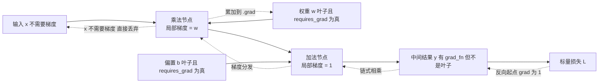
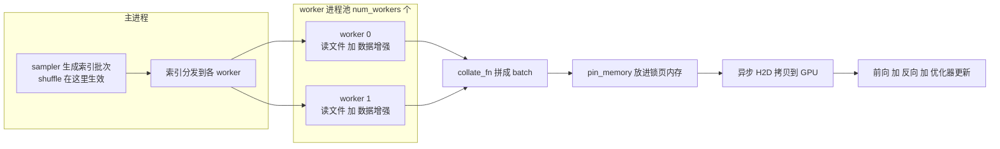
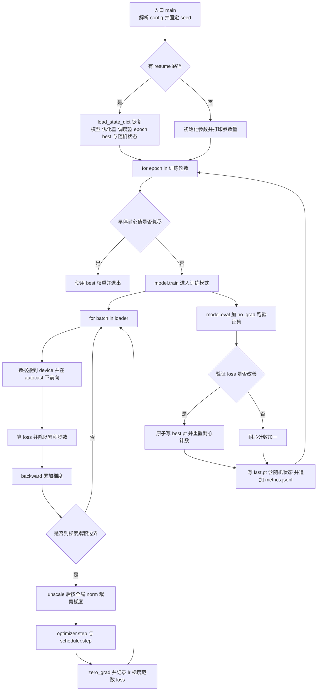
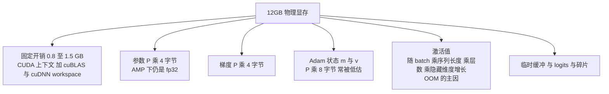

# 03 · PyTorch 与训练工程地基

> **本章定位**：这是「从工程到算法」的第二块地基。[02 数学地基最小集](./02-数学地基最小集) 补的是「看得懂公式」，本章补的是「写得出手」——把你从"一次都没跑过 PyTorch"变成"能独立写出一个完整、正确、显存可控、可复现的训练脚本"。
> **为什么现在学**：[本章节 index](./) 的 P0 预热窗口是 2026-09-26 → 10-07 这 12 天，门禁 G0 的标准就是「环境装好、跑通一个完整训练脚本、说清自己显卡的显存规格」。这是整条转岗链上唯一一段完全无外部干扰的时间，用来打 PyTorch 地基性价比最高。
> **你的优势要用足**：你不是零基础，你是**带着一整套后端直觉来换工具**。内存预算、生产者-消费者、断点续传、pprof 定位瓶颈——这些直觉在深度学习里全部有效，只是观测工具从 `pprof` 换成了 shape 打印、grad norm、`torch.profiler`、`nvidia-smi`。
> **和后续章节的关系**：本章产出能力与模板，[04 手推 Transformer](./04-Transformer与LLM原理手推) 用它推 Attention，[06 核心项目](./06-核心项目-多模态小模型从零训练) 直接复用训练脚本模板，[07 训练与推理工程进阶](./07-训练与推理工程进阶) 在本章显存预算之上加 DDP 与推理优化。

## 本章学习目标

完成本章后，你应该能：

1. 配好 PyTorch 环境（uv/conda + 正确的 CUDA wheel + 国内镜像），并用一条排查链把 `torch.cuda.is_available() == False` 修成 `True`。
2. 说清 Tensor 的 `dtype`/`device`/`shape` 三要素与广播规则，解释 `view`/`reshape`/`permute`/`contiguous` 的差别。
3. 讲清 autograd 动态图、`requires_grad`/叶子节点/`.detach()`/`torch.no_grad()`/`retain_graph` 的区别，并**手写一个标量版 mini-autograd 引擎**。
4. 用 `nn.Module` 组织模型，理解参数注册、`state_dict` 对账、`.train()`/`.eval()` 差异、参数初始化的必要性。
5. 写出**生产风格**的训练脚本：config dataclass、seed 固定、训练/验证循环、指标落盘、best checkpoint 原子写、断点续训、early stopping。
6. **在纸上算出**一个模型的显存预算（参数 + 梯度 + 优化器状态 + 激活值），判断它在 12GB 单卡上能跑多大。
7. 列出显存不够时的六个手段，说清每个「省了什么、代价是什么」。
8. 按清单排查 loss NaN、loss 不降、梯度爆炸、GPU 利用率不足 60% 四类故障。

> **学习方法建议**：本章不许只读。12 天日程每天都有一个可交付脚本，**任何一个训练日没产出 `.py` 文件，就等于这天没学**。工程出身的人学框架最快的路径永远是「先跑通 → 再改坏 → 再看懂报错」。

## 核心知识点提炼

| 知识点 | 一句话结论 | 面试高频度 |
| --- | --- | --- |
| Tensor 三要素 | 90% 的报错都是 dtype/device/shape 不一致，**先打印它们再改代码** | ⭐⭐⭐⭐⭐ |
| 广播规则 | 从右往左对齐，维度为 1 或缺失才广播；`(N,)` 与 `(N,1)` 会悄悄变成 `(N,N)` | ⭐⭐⭐⭐ |
| view/reshape/permute | 连续时 view 与 reshape 等价；不连续时 view 报错、reshape 默默拷贝；permute 只换 stride | ⭐⭐⭐ |
| autograd 动态图 | 每次前向新建一张图，反向用完即释放，这就是"动态"的全部含义 | ⭐⭐⭐⭐⭐ |
| detach vs no_grad | detach 只断一条支路；no_grad 全局关闭建图并省显存 | ⭐⭐⭐⭐ |
| retain_graph | 同一次前向要 backward 两次才需要，正常训练**不需要** | ⭐⭐⭐ |
| nn.Module | `__init__` 声明依赖，`forward` 定义计算，参数靠属性赋值自动注册 | ⭐⭐⭐⭐⭐ |
| train/eval | Dropout 与 BatchNorm 行为不同，验证忘了 `eval()` 指标会随机跳 | ⭐⭐⭐⭐⭐ |
| state_dict | 参数与缓存的字典；加载前先对账 key，DDP 会多 `module.` 前缀 | ⭐⭐⭐⭐ |
| DataLoader | 生产者-消费者流水线，`num_workers` 是消费者数量，不是越大越好 | ⭐⭐⭐⭐ |
| AdamW 显存 | 参数 + 梯度 + 一阶二阶矩 = **16 字节/参数**，0.1B 就要 1.6GB | ⭐⭐⭐⭐⭐ |
| 激活值显存 | 正比于 batch × 序列长度 × 层数 × 隐藏维度，是 OOM 的**主因** | ⭐⭐⭐⭐⭐ |
| 混合精度 AMP | 原生 AMP **不省**参数与优化器显存，只省激活与算力 | ⭐⭐⭐⭐⭐ |
| 梯度累积 | 梯度等价于大 batch，但 BatchNorm 统计量不等价 | ⭐⭐⭐⭐ |
| warmup + cosine | 前 5% 线性升温防早期发散，之后余弦退火到 5% | ⭐⭐⭐⭐ |
| 梯度裁剪 | 按全局 norm 裁到 1.0，是 LLM 训练的默认动作 | ⭐⭐⭐⭐⭐ |
| 可复现性 | seed + deterministic + config 快照，缺一个就复现不了 | ⭐⭐⭐ |
| torch.profiler | 先看 GPU 利用率，再看 data time 与 step time 的比值 | ⭐⭐⭐⭐ |

### 工程直觉映射表（先读这张表，能省你三天）

| 后端世界（你已经很强） | 深度学习世界（你要学） | 为什么这个类比成立 |
| --- | --- | --- |
| 接口 + 依赖注入 | `nn.Module` 的 `__init__` 与属性赋值 | 属性赋值即注册参数，等价于容器扫描并注入依赖 |
| 中间件链 / 洋葱模型 | autograd 的计算图 | 每个算子记住自己的局部梯度，反向按链式法则逐层回传 |
| 生产者-消费者队列 | `DataLoader` + 多个 worker | 主进程发索引、worker 并行取数、队列解耦、背压控制 |
| 内存预算与容量规划 | 显存预算 | 同一套加法：固定开销 + 常驻 + 峰值余量 |
| pprof / 火焰图 | `torch.profiler` / `nvidia-smi` | 都是先看资源利用率，再往下钻热点 |
| 类型宽度与整型溢出 | fp16/bf16 与 loss scaling | 窄类型更快更省，但要防溢出，溢出后要补偿 |
| 幂等与断点续传 | checkpoint / resume | 有状态任务要能从任意中断点恢复，而且要能对账 |
| 灰度发布与回滚 | best checkpoint + early stopping | 用验证集指标做发布门禁 |
| cgroup OOM Killer | CUDA OOM | 都是资源超限被拒，处理方式都是"先算预算再降配" |

## 知识点详解

### 0. 心态：你的调试直觉一行都不用扔

深度学习出问题时，后端工程师的三大杀器原样有效：

1. **打日志** → 深度学习里叫「打印 shape / dtype / device / min / max / isnan」。任何 shape 报错，第一反应永远是 `print(x.shape, x.dtype, x.device)`。
2. **二分定位** → loss 变 NaN？逐层打印找第一个出现 NaN 的层；把 lr 除以 10 再跑 100 步，就是最廉价的二分。
3. **看资源画像** → `nvidia-smi` 就是 `top`，`torch.profiler` 就是 `pprof`。「GPU 利用率 30% 但 CPU 满载」等价于你熟悉的「连接池打满、应用线程在等 IO」。

唯一真正新的是数学直觉，而数学在 [02 章](./02-数学地基最小集) 已划好"够用"的边界。所以本章的难度不在概念，在**动手量**。

### 1. 环境与工具链

| 方案 | 评价 |
| --- | --- |
| **uv** | ✅ 首选。Rust 实现，装 torch 这类大包比 pip 快 5-10 倍，`uv venv` + `uv pip install` 与 pip 语法兼容 |
| venv + pip | ✅ 可用，只是慢 |
| conda / mamba | ⚠️ 只在需要切 CUDA toolkit 或非 Python 依赖时用；`conda install pytorch` 镜像常滞后，优先 `pip install` 进 conda 环境 |
| Docker | ⚠️ 需 nvidia-container-toolkit；本地开发阶段不必要 |

```bash
uv venv --python 3.11 .venv && source .venv/bin/activate
export UV_DEFAULT_INDEX=https://pypi.tuna.tsinghua.edu.cn/simple   # 常规包走清华镜像
uv pip install numpy tqdm tensorboard
# torch 走官方 CUDA wheel 源，cu124 换成与你驱动匹配的版本
uv pip install torch torchvision --index-url https://download.pytorch.org/whl/cu124
```

> **国内加速三条路**：① 常规包用清华/阿里 PyPI 镜像；② torch 用 `download.pytorch.org/whl/cu1xx`，慢就换高校镜像（如上海交大 pytorch-wheels）；③ 再慢就 `pip download` 断点续传。**镜像地址会变，以镜像站首页为准，别照抄老教程。**

#### 驱动与 CUDA：只需要驱动够新，不需要装 CUDA Toolkit

- **PyTorch 的 pip wheel 自带 CUDA 运行时**（cuDNN、cuBLAS 全在里面），系统**不需要**装 CUDA Toolkit，也不用配 `CUDA_HOME`。
- `nvidia-smi` 右上角的 `CUDA Version: 12.4` 不是"你装的 CUDA 版本"，而是"这个驱动**最高**支持的 CUDA 运行时版本"。
- 兼容规则：**wheel 的 CUDA 版本必须 ≤ 驱动支持的版本**。驱动向下兼容，所以驱动新、wheel 旧永远能跑；反过来报 `CUDA driver version is insufficient`。

```bash
nvidia-smi     # 驱动版本 + CUDA 上限 + 显存 + 当前占用
python -c "import torch; print(torch.__version__, torch.version.cuda)"
```

#### `torch.cuda.is_available()` 为 False 的排查链（按顺序走，不要跳步）

```text
1. nvidia-smi 有没有输出？
   └─ 没有 → 驱动没装 / 显卡没被识别 / 容器里没加 --gpus all
2. print(torch.__version__) 是不是带 +cpu 的 CPU 版？
   └─ 是 → 先 pip uninstall torch torchvision torchaudio，再用官方 CUDA index-url 重装
3. print(torch.version.cuda) 是不是 None？
   └─ 是 → 装的不是 CUDA wheel，回到第 2 步
4. 驱动支持的 CUDA 上限 < wheel 的 CUDA 版本？
   └─ 是 → 升级驱动，或换更低版本的 wheel
5. 上面都正常但仍 False
   └─ CUDA_VISIBLE_DEVICES 被设成空串或 -1
   └─ 显存被别的进程占满（先 nvidia-smi 看）
6. 以上都排除 → 查 WSL / 容器 / 虚拟机是否做了显卡直通
```

#### 脚本还是 Jupyter：明确推荐**脚本化**

| 维度 | Jupyter | 脚本 + config |
| --- | --- | --- |
| 版本管理 | `.ipynb` 的 diff 是垃圾 | ✅ git diff 可读 |
| 复现性 | 单元格执行顺序就是隐藏状态 | ✅ 从入口到结尾一条确定路径 |
| 长任务 | 浏览器一断就废 | ✅ `nohup` / `tmux` 挂着跑 |
| 参数管理 | 散落在单元格里 | ✅ config 文件 + 命令行覆盖 |
| 适合场景 | **探索数据、试 API、画图** | **一切要跑超过 10 分钟的任务** |

**结论**：Jupyter 只用来"看一眼数据长什么样"和"试一个新算子的 shape"，**所有训练流程一律脚本化**。理由不是效率，是你的工程习惯——你已经习惯"配置进代码、状态进存储、任务可重启"，训练循环就是同一种东西。第 5 节的模板把这套习惯直接固化下来。

### 2. 张量与 autograd

#### 2.1 三要素：dtype / device / shape

Tensor 就是**带类型、带设备位置的多维数组**——把它想成 `[]float32` 加一个"这块内存在哪"的标签。

```python
import torch
x = torch.zeros(2, 3, dtype=torch.float32, device="cuda")   # 三要素显式指定最安全
print(x.shape, x.dtype, x.device)
y = x.to("cpu", dtype=torch.float16)    # 同时换设备与类型
z = x.float()                           # dtype 转换的语法糖；half() 是转 fp16
```

**规则**：两个 Tensor 做运算，dtype 与 device 必须一致，否则报错（见速查表第 2、3 条）。唯一例外是 Python 标量可自动提升，以及 `autocast` 区域内算子自动选精度。

#### 2.2 view / reshape / permute / contiguous

```text
一个 Tensor = 一块内存 + shape + stride（每个维度走一步跨几个元素）

view      : 只改 shape 和 stride，不搬内存 → 要求内存连续，否则报错
reshape   : 能 view 就 view，不能就悄悄拷贝 → 永远不报错，但你不知道它拷了
permute   : 只交换 stride（转置的本质），不搬内存 → 结果通常"不连续"
contiguous: 按当前 shape 把内存重排成连续 → 真拷贝，可能吃显存
```

```python
a = torch.randn(4, 6)
b = a.view(2, 12)             # ✅ a 连续
c = a.t()                     # 转置：只换 stride
# c.view(24)                  # ❌ RuntimeError: view size is not compatible ...
e = c.reshape(24)             # ✅ 内部自动拷贝
f = c.contiguous().view(24)   # ✅ 显式：先重排再 view，语义最清楚
```

**为什么要有 `contiguous()`**：很多底层 kernel（`view`、部分 cuDNN 卷积路径）要求内存连续，而 `permute` 之后的 stride 是乱的。**显式写 `contiguous()` 的价值是"你知道这里发生了一次拷贝、而且它可能吃显存"**——注意力实现里 `transpose` + 广播是常态，这个调用位置直接影响显存峰值。

#### 2.3 广播规则与常见陷阱

规则两条：**从最右边一维开始对齐；某一维要么相等，要么其中一个是 1，要么该维缺失。**

```python
a = torch.randn(8, 1, 128); b = torch.randn(1, 16, 128)
(a + b).shape                     # (8, 16, 128)

# 陷阱：形状错了但能广播，静默算出 (N, N) 的矩阵，不报错但语义全错
logits = torch.randn(32, 10); labels = torch.randn(32)      # 本意是 (32, 1)
loss = ((logits - labels) ** 2).mean()                      # labels 被广播成 (32, 10)
```

**防御手段**：关键位置写断言，`assert logits.shape == labels.shape, (logits.shape, labels.shape)`。在 loss 前后写 2-3 个 assert 的成本，远低于排查半天的成本——**这就是后端写 `if err != nil` 的习惯在深度学习的等价物。**

#### 2.4 requires_grad / 叶子节点 / detach / no_grad / retain_graph

autograd 的模型：**前向时每个算子记住"我当时怎么算的"并生成反向函数；反向时从 loss 出发沿计算图逆向调用它们，用链式法则把梯度累加到叶子张量上。**



| 概念 | 含义 | 典型用途 |
| --- | --- | --- |
| `requires_grad=True` | 需要被求梯度；**只有浮点类型**能设 True | 可训练参数 |
| 叶子节点 leaf | 由用户直接创建（不是算子算出来的）；**只有叶子默认保存 `.grad`** | 模型参数 |
| 中间节点 | 有 `grad_fn` 但不是叶子，默认不存 `.grad` | 想观测某层梯度用 `retain_grad()` |
| `.detach()` | 复制一份共享内存但断图的张量，反向不流过它 | 目标网络、EMA、把 loss 取出来记日志 |
| `torch.no_grad()` | 上下文管理器，区域内不建图，直接省激活显存并提速 | 验证、推理、指标统计 |
| `retain_graph=True` | 反向完不释放计算图 | 同一次前向 backward 两次（GAN、二阶梯度） |

```python
w = torch.randn(3, requires_grad=True)
((w ** 2).sum()).backward()      # 第一次：图被释放；梯度是累加，不会自动清零
# (w ** 2).sum().backward()      # ❌ Trying to backward through the graph a second time
w.grad.zero_()                   # optimizer.zero_grad() 干的就是这件事
```

**动态图两个要点**：① 图每次前向重新建，所以 `if`/`for` 可以随手写在 `forward` 里（静态图框架做不到）；② 图用完即释放，**显存峰值出现在 `backward` 期间**——因为反向时既要持有激活值算梯度，又要分配梯度缓冲。

#### 2.5 练习：手写一个 mini-autograd 引擎

**为什么这个练习一次性打通反向传播的直觉**：写完之后你会发现反向传播**根本不高深**，就是三件事——① 前向时每个算子把"局部怎么求导"记下来（那个 `_backward` 闭包）；② 反向时对计算图做拓扑排序，然后逆序调用；③ 每个节点把 `out.grad` 乘上局部梯度，**累加**给输入。

你也会立刻理解**为什么梯度是 `+=` 而不是 `=`**——一个张量可能被多条路径用到（如 `y = x * x`），梯度必须累加。这是初学者最容易搞错的一点，也是 `optimizer.zero_grad()` 存在的原因。

```python
"""mini_autograd.py —— 标量版自动微分引擎（micrograd 的核心思想，约 60 行）。"""
import math


class Value:
    """一个标量节点：前向值、梯度，以及「我自己怎么被反向」的闭包。"""

    def __init__(self, data, _children=(), _op=""):
        self.data, self.grad = float(data), 0.0
        self._prev, self._op = tuple(_children), _op
        self._backward = lambda: None            # 叶子节点是空操作

    def __add__(self, other):
        other = other if isinstance(other, Value) else Value(other)
        out = Value(self.data + other.data, (self, other), "+")

        def _backward():                         # 加法：梯度原样分发给两个输入
            self.grad += out.grad
            other.grad += out.grad
        out._backward = _backward
        return out

    def __mul__(self, other):
        other = other if isinstance(other, Value) else Value(other)
        out = Value(self.data * other.data, (self, other), "*")

        def _backward():                         # 乘法：局部梯度是「对方的值」
            self.grad += other.data * out.grad
            other.grad += self.data * out.grad
        out._backward = _backward
        return out

    def tanh(self):
        t = math.tanh(self.data)
        out = Value(t, (self,), "tanh")
        out._backward = lambda: setattr(self, "grad", self.grad + (1 - t * t) * out.grad)
        return out

    def relu(self):
        out = Value(max(0.0, self.data), (self,), "relu")
        out._backward = lambda: setattr(self, "grad", self.grad + (1.0 if out.data > 0 else 0.0) * out.grad)
        return out

    def __pow__(self, k):                        # 只支持常数指数
        out = Value(self.data ** k, (self,), f"**{k}")
        out._backward = lambda: setattr(self, "grad", self.grad + k * self.data ** (k - 1) * out.grad)
        return out

    # 语法糖：减法、除法、负数都归约到加法与乘法
    def __neg__(self): return self * -1.0
    def __sub__(self, other): return self + (-(other if isinstance(other, Value) else Value(other)))
    def __radd__(self, other): return self + other
    def __rmul__(self, other): return self * other
    def __truediv__(self, other): return self * (other ** -1)

    def backward(self):
        """先拓扑排序，再逆序调用每个节点的局部梯度函数，最后梯度从 loss 流回叶子。"""
        topo, seen = [], set()

        def build(v):
            if v not in seen:                    # 后序遍历：上游全部进栈后才轮到自己
                seen.add(v)
                for child in v._prev:
                    build(child)
                topo.append(v)

        build(self)
        self.grad = 1.0                          # dL/dL = 1
        for v in reversed(topo):                 # 逆拓扑序保证：用到某节点梯度时它已算完
            v._backward()


if __name__ == "__main__":
    xs, ys = [(0., 0.), (0., 1.), (1., 0.), (1., 1.)], [0., 1., 1., 0.]   # XOR：单层线性模型学不会
    W1 = [[Value(0.3), Value(-0.2), Value(0.1)], [Value(0.4), Value(0.2), Value(-0.3)]]  # 2 个隐藏神经元
    W2 = [Value(0.6), Value(-0.5), Value(0.2)]                                           # 输出层
    params, lr = [p for row in W1 for p in row] + W2, 0.5

    for step in range(300):
        loss = Value(0.0)
        for (x0, x1), y in zip(xs, ys):
            h = [(w[0] * x0 + w[1] * x1 + w[2]).tanh() for w in W1]
            loss = loss + ((W2[0] * h[0] + W2[1] * h[1] + W2[2]).tanh() - y) ** 2
        loss = loss * 0.25                       # MSE
        for p in params: p.grad = 0.0            # 手动 zero_grad：不清零就会累加
        loss.backward()
        for p in params: p.data -= lr * p.grad   # 手动 SGD：就是这一行
        if step % 50 == 0: print(f"step {step:3d} loss {loss.data:.5f}")
```

**跑通后的自检问题**（答不上来就是没懂）：① 把 `+=` 改成 `=` 会怎样？（XOR 训不动，两条路径的梯度互相覆盖）② 删掉 `p.grad = 0.0` 会怎样？（梯度累加 → 等效 lr 变大 → 通常直接发散）③ 为什么必须先拓扑排序？（`out.grad` 必须被下游填满才能往上乘）④ 真实 PyTorch 就是把 `Value` 换成 `Tensor`、把标量乘法换成广播的逐元素乘法，**其余一模一样**。

> **Day 8 加练**：把这个 60 行引擎扩到 200 行——加 Tensor 版广播、加 Adam、加一层 `nn.Module` 风格的封装。做完再看 `torch.autograd` 会像看自己的代码。

### 3. nn.Module 与模型定义

**类比：`nn.Module` 就是「接口 + 依赖注入容器」。** `__init__` 声明依赖哪些层，`forward` 定义数据怎么流动。

```python
import torch, torch.nn as nn


class MLP(nn.Module):
    def __init__(self, in_dim=784, hidden=256, out_dim=10, dropout=0.1):
        super().__init__()                        # 必须先调，否则参数注册机制没初始化
        self.fc1 = nn.Linear(in_dim, hidden)      # 属性赋值 = 自动注册参数
        self.ln, self.act, self.drop = nn.LayerNorm(hidden), nn.GELU(), nn.Dropout(dropout)
        self.fc2 = nn.Linear(hidden, out_dim)
        for m in self.modules():                  # 初始化：默认即可，Transformer 再按论文指定 std
            if isinstance(m, nn.Linear):
                nn.init.trunc_normal_(m.weight, std=0.02); nn.init.zeros_(m.bias)

    def forward(self, x):
        x = self.drop(self.act(self.ln(self.fc1(x.flatten(1)))))
        return self.fc2(x)                        # 返回 logits，不要在这里做 softmax
```

**四个必须记住的点**：

1. **参数注册靠属性赋值**。普通 Python list 里的层不会被注册，也不会被 `.to(device)`、`state_dict()`、优化器看到——要用 `nn.ModuleList`/`nn.ModuleDict`/`nn.Sequential`。
2. **`forward` 里不要 softmax**。`nn.CrossEntropyLoss` 内部自带 log-softmax，重复做会数值不稳定且 loss 无意义。
3. **`state_dict()` 只存参数和 buffer，不存结构**，所以加载前要先造出结构相同的模型，并对账 key：

```python
ckpt = torch.load("best.pt", map_location="cpu", weights_only=False)
missing, unexpected = model.load_state_dict(ckpt["model"], strict=False)   # 绝不静默加载
print("缺失:", missing, "多余:", unexpected)
# DDP 存的 key 会带 module. 前缀，单卡加载时要去掉：
state = {k.replace("module.", "", 1): v for k, v in ckpt["model"].items()}
```

4. **`.train()`/`.eval()` 只影响 Dropout 与 BatchNorm**：Dropout 训练时随机置零、验证时直通；BatchNorm 训练时用 batch 统计量并更新 running 均值方差、验证时用 running 统计量。**验证忘了 `eval()`，指标会随机跳，且 running 统计会被验证集污染——这是最隐蔽的一类 bug。**

```python
model.eval()                      # 验证三件套，缺一不可
with torch.no_grad():
    ...
model.train()                     # 训练段记得切回来
```

**为什么参数不能全零初始化**：如果权重全为 0，同一层每个神经元输出相同、反向算出的梯度也相同，于是它们**永远保持相同**——对称性无法打破，等价于这一层只有 1 个神经元。所以必须随机初始化以防"神经元坍缩"。

### 4. 数据管线：Dataset 与 DataLoader

**类比：`Dataset` 是"单条记录的读取器"，`DataLoader` 是一条生产者-消费者流水线。** 主进程按 sampler 发索引，多个 worker 并行执行 `__getitem__`，`collate_fn` 把多条记录拼成 batch，`pin_memory` 放进锁页内存，最后 H2D 拷到 GPU。



| 类 | 特点 | 什么时候用 |
| --- | --- | --- |
| `Dataset`（map-style） | 实现 `__len__` 与 `__getitem__`；支持 shuffle、sampler、随机访问 | ✅ 绝大多数情况；图文对数据集就用它 |
| `IterableDataset` | 只实现 `__iter__`；不支持 shuffle/sampler，每个 worker 各拿一份流 | 数据大到放不进索引、需顺序读流（日志、超大 tar） |

```python
from torch.utils.data import DataLoader, Dataset, TensorDataset
from PIL import Image


class ImageTextPairs(Dataset):
    def __init__(self, records, transform=None, tokenizer=None):
        self.records, self.transform, self.tokenizer = records, transform, tokenizer

    def __len__(self): return len(self.records)

    def __getitem__(self, i):
        img_path, text = self.records[i]
        image = Image.open(img_path).convert("RGB")     # ⚠️ 必须在 worker 里读，别在主进程预载进内存
        if self.transform:
            image = self.transform(image)               # 数据增强放这里 = 在 worker 里并行做
        return {"image": image, "text": self.tokenizer(text)}


def collate(batch):
    """变长文本必须自己 pad；默认 default_collate 遇到不等长会直接报错。"""
    images = torch.stack([b["image"] for b in batch])
    max_len = max(len(b["text"]) for b in batch)
    texts = torch.zeros(len(batch), max_len, dtype=torch.long)      # pad_id = 0
    for i, b in enumerate(batch):
        texts[i, :len(b["text"])] = torch.tensor(b["text"], dtype=torch.long)
    return {"image": images, "text": texts}


train_loader = DataLoader(
    dataset, batch_size=64, shuffle=True, num_workers=4,
    pin_memory=True,          # 有 GPU 就开：H2D 拷贝走异步
    drop_last=True,           # 训练集开：避免最后不完整 batch 让 BatchNorm 抖
    persistent_workers=True,  # 每 epoch 不重建进程，省 fork 开销（要求 num_workers > 0）
    prefetch_factor=4,        # 每个 worker 预取几个 batch（要求 num_workers > 0）
    collate_fn=collate,
)
```

| 现象 | 根因 | 处理 |
| --- | --- | --- |
| worker 越多越快？ | 超过 CPU 物理核数后，进程切换与拷贝反而变慢 | 从 `min(8, CPU 核数 // 2)` 起试，用 `torch.profiler` 看 DataLoader 占 step 的比例来调 |
| 训练一开始内存暴涨 | worker 是 `fork` 出来的，父进程里的大对象会被复制 | 父进程只存**路径**，真实数据在 `__getitem__` 里读 |
| 训练卡死不动 | worker 里异常被吞、数据集含不可 pickle 对象、worker 数 × 单样本内存打爆内存 | 先 `num_workers=0` 复现，能跑通再往上加 |
| macOS 上 `num_workers>0` 直接崩 | macOS 默认 `spawn` 而非 `fork` | 训练入口必须写在 `if __name__ == "__main__":` 里 |
| 每个 epoch 开头卡几秒 | worker 反复创建销毁 | `persistent_workers=True` |

**数据增强放 CPU 还是 GPU**：

- **CPU（worker 里）**：几何变换（RandomResizedCrop、翻转、旋转）、JPEG 解码、色彩抖动。这些操作在 worker 里天然并行，且不占显存与 GPU 算力。
- **GPU（batch 之后）**：轻量张量级操作——归一化、MixUp/CutMix、随机遮挡。省掉 CPU 与 PCIe 搬运；但**必须支持整批并行**，否则会串行化拖慢 step。
- **判据**：`torch.profiler` 显示 DataLoader 时间占 step 超过 20%，就把能搬的增强搬到 GPU；否则别动。

### 5. 训练循环的标准骨架

一个完整的训练循环有 **9 个动作**，缺任何一个都会在某个时刻咬你。



| # | 动作 | 缺失后果 |
| --- | --- | --- |
| 1 | 固定 seed 并开启确定性 | 结果无法复现，调参全靠运气 |
| 2 | 打印参数量与配置快照 | 事后不知道"当时跑的是哪一版" |
| 3 | `model.train()` / `model.eval()` 切换 | Dropout 与 BatchNorm 行为错乱 |
| 4 | `optimizer.zero_grad(set_to_none=True)` | 梯度累加，loss 直接爆 |
| 5 | `scaler.unscale_` 后再 `clip_grad_norm_` | 裁的是被放大的梯度，等于没裁 |
| 6 | 验证段 `torch.no_grad()` | 验证白吃一份激活显存，容易 OOM |
| 7 | 原子写 checkpoint（tmp + `os.replace`） | 中途断电留下半个文件，resume 直接崩 |
| 8 | 指标追加写 `metrics.jsonl` | 画不出曲线，写报告时没有数据 |
| 9 | best 跟踪 + early stopping | 过拟合了还在跑，浪费卡时 |

### 6. 优化器与调度

| 优化器 | 更新直觉 | 显存开销 | 什么时候用 |
| --- | --- | --- | --- |
| SGD | 沿梯度方向走，最朴素 | 8 字节/参数 | 理论干净、泛化好，但调 lr 极痛苦；几乎只用于复现论文 |
| SGD + Momentum | 加"惯性"，抑制震荡 | 12 字节/参数 | 传统 CV（ResNet 系列）的标准配置 |
| Adam | 每个参数维护一阶矩 m、二阶矩 v，自适应步长 | 16 字节/参数 | 收敛快、对 lr 不敏感；小模型/研究早期首选 |
| **AdamW** | Adam + **解耦的 weight decay** | 16 字节/参数 | ✅ **默认选择** |

**Adam 与 AdamW 的差别**：Adam 把 weight decay 混进梯度（等价于在 loss 上加 L2），在自适应学习率下这个惩罚会被二阶矩缩放，效果被扭曲。AdamW 把它拿出来直接衰减参数：

```text
AdamW 拆开就是两步：
  1. 用 Adam 的自适应步长更新参数
  2. 额外一步：p ← p - lr × weight_decay × p     ← 与梯度无关，独立生效
```

**weight decay 不该作用在 LayerNorm 与 Bias 上**：这些参数负责缩放/平移表示，把它们往 0 拉会破坏归一化层的表达能力。标准做法是分参数组：

```python
decay, no_decay = [], []
for name, p in model.named_parameters():
    if not p.requires_grad: continue
    if p.ndim == 1 or name.endswith(".bias"):   # 归一化层 weight/bias 与所有 bias 都是 1 维
        no_decay.append(p)
    else:
        decay.append(p)
optimizer = torch.optim.AdamW([{"params": decay, "weight_decay": 0.05},
                               {"params": no_decay, "weight_decay": 0.0}],
                              lr=3e-4, betas=(0.9, 0.95), eps=1e-8)
```

> 诚实的边界：这是社区惯例，消融显示它**通常**有小幅收益（尤其小数据），但不是决定性的。面试就答"惯例做法 + 原因是保护归一化层的表达能力 + 我的消融里收益在 xx 量级"。

**warmup + cosine decay 的标准写法与理由**：

```python
def build_scheduler(optimizer, total_steps, warmup_ratio=0.05, min_lr_ratio=0.05):
    warmup = max(1, int(total_steps * warmup_ratio))

    def lr_lambda(step):
        if step < warmup:                                     # 阶段 1：线性 warmup
            return (step + 1) / warmup
        progress = (step - warmup) / max(1, total_steps - warmup)
        cosine = 0.5 * (1.0 + math.cos(math.pi * progress))    # 阶段 2：余弦退火
        return min_lr_ratio + (1.0 - min_lr_ratio) * cosine

    return torch.optim.lr_scheduler.LambdaLR(optimizer, lr_lambda)
```

```text
lr 曲线：从 0 线性升到 base_lr（前 5%），再余弦退火到 base_lr × min_lr_ratio
  warmup 的理由：训练初期参数随机、梯度噪声极大，而 Adam 的二阶矩 v 在最初几步
                 估计极不准，此时的自适应步长会被放大成异常大的更新，直接震飞成 NaN。
                 warmup 给二阶矩留出稳定时间。大 batch、深层模型、fp16 训练时几乎必需。
  cosine 的理由：全程平滑衰减，中后期 lr 小到能精细收敛，且不需要手工设定降 lr 的时机。
                 它现在是 LLM 预训练的事实标准。
```

| 规则 | 公式 | 适用 |
| --- | --- | --- |
| 线性缩放 | `lr_new = lr_base × (bs_new / bs_base)` | batch 较小（< 几千）；SGD 训练 |
| 平方根缩放 | `lr_new = lr_base × sqrt(bs_new / bs_base)` | batch 很大；Adam 类优化器更接近这个 |

```text
例：base 是 bs=32, lr=1e-3（SGD）→ bs=256 时线性规则得 lr = 1e-3 × 8 = 8e-3
    Adam 下保守取平方根：lr = 1e-3 × sqrt(8) ≈ 2.8e-3
    实操：算出的值只当起点，再上下各试 3 倍（lr, lr/3, lr×3）做 3 点扫描，别信公式信曲线。
```

**梯度裁剪：按 norm 还是按 value**：

```python
# ✅ 首选：按全局 norm 裁剪。保留梯度方向，只整体缩短长度；返回值就是裁剪前的全局 norm
total_norm = torch.nn.utils.clip_grad_norm_(model.parameters(), max_norm=1.0)

# ⚠️ 少用：按 value 把每个分量单独 clip 到 [-c, c]，破坏梯度方向，是错误投影
torch.nn.utils.clip_grad_value_(model.parameters(), clip_value=0.1)
```

判据：`grad_norm` 长期稳定在 0.1-1 说明训练健康、裁剪几乎不起作用；频繁触到 `max_norm` 说明 lr 偏大或有异常样本。**LLM 训练的默认值是 1.0，CV 常用 5.0。**

### 7. 训练稳定与排错

#### loss 变 NaN 的排查清单（按"从便宜到贵"排序，前三步几乎必然命中）

```text
1. lr 太大 → 最廉价的二分：lr 除以 10 再跑 100 步
2. 除零 / log(0) / sqrt(负数) → 自己写的 loss 里有没有 x / (y + 1e-8)？
   一律换成数值稳定算子：F.cross_entropy、F.binary_cross_entropy_with_logits
3. exp / softmax 溢出 → 有没有手写 exp(scores)？先减 max 再 exp；温度系数是否为 0 或极大
4. bf16/fp16 溢出 → fp16 最大值只有 65504，注意力分数乘完温度容易超 → 换 bf16
   fp16 训练忘了 GradScaler → 小梯度下溢成 0 或上溢成 inf
5. 数据里有 nan/inf → 进模型前 assert torch.isfinite(batch).all()
   常见来源：除零算出的归一化特征、脏标注、padding mask 用 0 而不是 -inf
6. 以上都排除 → torch.autograd.set_detect_anomaly(True) 精确定位（慢，只用来定位）
```

#### loss 不降的排查清单

```text
1. 先做「过拟合 1 个 batch」测试：拿 batch_size=4 的同一批数据反复训练，loss 应该掉到接近 0。
   掉不下去 = 代码有 bug（梯度没传到 / loss 写错 / 标签对不上）；掉得下去 = 配置问题。
2. 标签对不对？打印 5 个 (输入, 标签) 人眼看一遍。
3. 梯度有没有传到？打印每层 grad 的 norm，看有没有恒为 0 的层。
4. loss 函数用对了吗？分类用 CrossEntropyLoss（吃 logits），不要自己先 softmax。
5. lr 太大（震荡/NaN）还是太小（几乎不动）？
6. 参数初始化是否太极端：全零，或 std 过大导致 sigmoid/tanh 饱和。
7. 优化器真的 step 了吗？scheduler 有没有把 lr 降到 0？
8. 输入归一化了吗？图像没除 255、文本没 pad，模型会觉得输入"很怪"。
```

#### 验证 loss 上升而训练 loss 下降：过拟合判断

| 现象 | 判断 | 对策 |
| --- | --- | --- |
| 训练 loss 持续降，验证 loss 先降后升且**gap 持续扩大** | ✅ 典型过拟合 | 加数据增强、weight decay、dropout、early stopping、减小模型 |
| 验证 loss 从第一步就很高且不降 | ⚠️ **不是过拟合**，是训练/验证预处理不一致（如验证集忘了 normalize） | 对齐两侧 transform |
| 验证 loss 抖动很大 | ⚠️ 验证集太小，或验证时忘了 `model.eval()` | 用完整验证集、开 eval 模式 |
| 训练 loss 比验证 loss 还高 | ⚠️ 训练开了强增强/dropout、验证关了——**这是正常的** | 对比"同口径"的 loss |

**量化标准**：记录 `gap = val_loss - train_loss` 随 epoch 的曲线，**gap 单调扩大 + val_loss 出现明确拐点**才是过拟合的确凿证据（就是技术报告里要放的那张图，见 [08 评测体系与技术报告](./08-评测体系与技术报告)）。

#### 梯度爆炸/消失的观测

```python
total_norm = torch.nn.utils.clip_grad_norm_(model.parameters(), 1.0)   # 全局 norm，每步都打
for name, p in model.named_parameters():                              # 逐层 norm，调试期用
    if p.grad is not None: print(f"{name:50s} grad_norm={p.grad.norm().item():.3e}")
```

```text
grad_norm 逐步升到 1e3 以上      → 爆炸，先降 lr，再开裁剪
靠输入的深层 grad_norm 趋于 0     → 消失，检查激活函数、加残差/归一化，或这批数据没信息量
grad_norm 恰好等于 max_norm       → 一直在被裁剪，训练实际是"限速跑"
```

**`torch.autograd.set_detect_anomaly`**：它给每个算子加 NaN/Inf 检查钩子，报错会精确到 `forward` 里哪一行并打印完整调用栈——**这就是深度学习版的"panic 时打印调用栈"**。全局打开会慢 2-5 倍，只在排查时开。

```python
with torch.autograd.set_detect_anomaly(True):
    loss = model(batch); loss.backward()
```

### 8. 可复现性

```python
import os
os.environ.setdefault("CUBLAS_WORKSPACE_CONFIG", ":4096:8")   # ⚠️ 必须在 import torch 之前

import random, numpy as np, torch


def set_seed(seed, deterministic=True):
    random.seed(seed); np.random.seed(seed)
    torch.manual_seed(seed); torch.cuda.manual_seed_all(seed)
    # cudnn.benchmark 与确定性是一对取舍：
    #   True  → 自动选最快的卷积算法，快，但每次选的算法可能不同（不可复现）
    #   False → 结果稳定可复现，略慢
    torch.backends.cudnn.benchmark = not deterministic
    torch.backends.cudnn.deterministic = deterministic
    if deterministic:
        torch.use_deterministic_algorithms(True, warn_only=True)   # warn_only：没确定性实现的算子只警告
```

| 要做的事 | 为什么 |
| --- | --- |
| 固定 Python / numpy / torch / cuda 四套 seed | 少一个都可能引入不可复现的随机性 |
| `pip freeze > requirements.lock.txt` + 记下驱动与 CUDA 版本 | 换机器后"同代码不同结果"九成是版本差异 |
| **配置快照**：config `asdict()` 后写进实验目录 | 三个月后你能知道当时跑的是哪一版超参 |
| checkpoint 里存 **RNG 状态**（python/numpy/torch/cuda） | 否则恢复后数据顺序与随机增强会变，结果对不上 |
| 每个实验一个独立目录 `runs/{时间戳}-{配置哈希}` | 避免互相覆盖 |
| 固定数据版本（文件列表与哈希） | 数据改了等于实验改了 |

```text
可复现性的分层现实（面试讲这个很加分）：
  L1 同机器同代码同 seed     → 必须 100% 一致，否则有隐藏随机源
  L2 同机器不同 GPU 型号      → 数值有微小差异，指标差异应在 0.1% 内
  L3 不同 torch/CUDA 版本    → 允许波动，但必须记录版本以便归因
  L4 换硬件（8GB 卡 → 24GB）  → 不算复现，算"重跑"，需要重新记录
```

### 9. 观测与性能：从 pprof 直觉迁移到 GPU

```bash
watch -n 1 nvidia-smi                      # 总览：盯 GPU-Util 与显存
nvidia-smi --query-gpu=utilization.gpu,memory.used,power.draw --format=csv -l 1   # 只打关键指标
nvtop                                      # 交互式，能按进程看，等价于 htop
```

```python
import time, torch
from torch.profiler import ProfilerActivity, profile, schedule

with profile(activities=[ProfilerActivity.CPU, ProfilerActivity.CUDA],
             schedule=schedule(wait=1, warmup=1, active=3),      # 跳过编译与预热那几步
             on_trace_ready=torch.profiler.tensorboard_trace_handler("./prof"),
             record_shapes=True, profile_memory=True) as prof:
    for step, batch in enumerate(loader):
        train_step(batch)
        prof.step()                                              # 必须调，schedule 才能推进
        if step >= 6: break
print(prof.key_averages().table(sort_by="cuda_time_total", row_limit=15))
# 看什么：① 哪个算子 cuda_time 最多 ② self_cpu_time_total 高的是不是 DataLoader/拷贝
# ③ 用 TensorBoard 打开 ./prof 看时间轴，直接看 GPU 有没有空洞

t0 = time.perf_counter(); batch = next(iter(loader)); t_data = time.perf_counter() - t0
t0 = time.perf_counter(); train_step(batch);          t_step = time.perf_counter() - t0
print(f"data {t_data * 1e3:.1f} ms  step {t_step * 1e3:.1f} ms")
```

| data / step 比值 | 结论 | 处理 |
| --- | --- | --- |
| < 5% | ✅ 算力 bound，GPU 是瓶颈 | 只能上更好的卡、混合精度、或减小模型 |
| 20% - 60% | ⚠️ 数据加载部分成为瓶颈 | 加 `num_workers`、开 `pin_memory`、增强搬 GPU、换更快的存储格式 |
| > 100% | ❌ 完全数据 bound，GPU 空转 | 先解决数据管线，别急着换卡 |

#### GPU 利用率不足 60% 的原因清单（抄下来）

```text
【数据侧】
1. num_workers 太小，worker 供不上数据
2. pin_memory=False，H2D 拷贝是同步的，GPU 在等
3. 数据增强太重且全在 CPU 串行（大分辨率解码 + 复杂几何变换）
4. 数据在机械硬盘/网络存储上，随机读小文件
5. 每个 epoch 重建 worker（没开 persistent_workers）

【计算侧】
6. 模型太小 → 每次 kernel 计算量不足，GPU 大部分时间在启动 kernel
   【关键洞察】这就是"小模型反而利用率低"的原因，对策是加大 batch 或融合算子
7. 循环里频繁 CPU-GPU 同步：调 .item()、.cpu()、print(tensor)
8. Python 侧开销大，GPU 在等 CPU 发指令

【配置侧】
9. batch size 太小（< 32），kernel 太小，算力吃不饱
10. 忘了开混合精度（bf16 的 tensor core 吞吐是 fp32 的数倍）
11. 显存已接近上限 → 分配器频繁 cudaMalloc 与碎片整理，util 忽高忽低
12. GPU 被别的进程占着（多用户服务器上先 nvidia-smi 看一眼）
```

> **和后端经验的对应**：你在 [架构师修炼 / 19-pprof 实战](/架构师修炼/) 建立的直觉——**先看资源利用率，再二分定位，最后才动手优化**——在 GPU 上完全一样。区别只是"CPU 利用率高但 QPS 上不去"变成了"GPU 利用率 30% 但 step 时间很长"，诊断路径同构。

## 完整训练脚本模板

这是本章的核心交付物，也是 [06 核心项目](./06-核心项目-多模态小模型从零训练) 的起手模板：config dataclass、seed 固定、训练/验证循环、指标 JSONL、best checkpoint **原子写**、断点续训（含 RNG 状态）、early stopping、梯度累积、bf16/fp16 混合精度。

```python
"""train.py —— 生产风格的 PyTorch 训练脚本模板：配置是输入，状态是输出。"""
import os
os.environ.setdefault("CUBLAS_WORKSPACE_CONFIG", ":4096:8")     # 必须在 import torch 之前

import argparse, json, math, random, time
from dataclasses import asdict, dataclass
from pathlib import Path

import numpy as np
import torch
import torch.nn as nn
from torch.utils.data import DataLoader, TensorDataset


@dataclass
class Config:
    seed: int = 42
    out_dir: str = "runs/mnist"
    device: str = "cuda"
    deterministic: bool = True
    dataset: str = "synthetic"        # synthetic 免下载；换成 "mnist" 需 torchvision
    num_workers: int = 4
    pin_memory: bool = True
    epochs: int = 10
    batch_size: int = 128
    grad_accum: int = 1               # 等效 batch = batch_size × grad_accum
    lr: float = 3e-4
    weight_decay: float = 0.05
    warmup_ratio: float = 0.05
    min_lr_ratio: float = 0.05
    grad_clip: float = 1.0
    amp: bool = True
    amp_dtype: str = "bfloat16"       # bf16 不需要 loss scaling；fp16 需要
    early_stop_patience: int = 3
    resume: str = ""                  # last.pt 路径，空串表示从头训练
    log_every: int = 50
    max_steps: int = 0                # > 0 时每 epoch 只跑这么多步（冒烟测试）


def parse_args() -> Config:
    ap = argparse.ArgumentParser()
    ap.add_argument("--config", default="")
    ap.add_argument("--set", nargs="*", default=[], metavar="KEY=VALUE", help="值按 JSON 解析")
    args = ap.parse_args()
    raw = json.loads(Path(args.config).read_text()) if args.config else {}
    for kv in args.set:
        key, value = kv.split("=", 1)
        raw[key] = json.loads(value)              # 字符串要带引号：out_dir="runs/x"
    cfg = Config()
    for key, value in raw.items():
        if not hasattr(cfg, key):
            raise SystemExit(f"未知配置项: {key}")
        setattr(cfg, key, value)
    return cfg


def build_loaders(cfg):
    if cfg.dataset == "mnist":
        from torchvision import datasets, transforms
        tf = transforms.Compose([transforms.ToTensor(), transforms.Normalize((0.1307,), (0.3081,))])
        tr = datasets.MNIST("./data", True, download=True, transform=tf)
        va = datasets.MNIST("./data", False, download=True, transform=tf)
    else:                                          # 玩具数据：每类一个原型图 + 噪声，保证有可学信号
        def make(n, seed):
            g = torch.Generator().manual_seed(seed)
            proto = torch.rand(10, 1, 28, 28, generator=g) * 2 - 1
            y = torch.randint(0, 10, (n,), generator=g)
            return TensorDataset(proto[y] + 0.6 * torch.randn(n, 1, 28, 28, generator=g), y)
        tr, va = make(8192, 0), make(2048, 1)

    common = dict(num_workers=cfg.num_workers, pin_memory=cfg.pin_memory,
                  persistent_workers=cfg.num_workers > 0,
                  prefetch_factor=4 if cfg.num_workers > 0 else None)
    return (DataLoader(tr, cfg.batch_size, shuffle=True, drop_last=True, **common),
            DataLoader(va, 256, shuffle=False, **common))


class SmallCNN(nn.Module):
    def __init__(self, num_classes=10, width=32, dropout=0.1):
        super().__init__()
        self.features = nn.Sequential(
            nn.Conv2d(1, width, 3, padding=1), nn.BatchNorm2d(width), nn.ReLU(True), nn.MaxPool2d(2),
            nn.Conv2d(width, width * 2, 3, padding=1), nn.BatchNorm2d(width * 2), nn.ReLU(True),
            nn.MaxPool2d(2))                                        # 28 -> 14 -> 7
        self.head = nn.Sequential(nn.Flatten(), nn.Dropout(dropout),
                                  nn.Linear(width * 2 * 7 * 7, 128), nn.ReLU(True),
                                  nn.Linear(128, num_classes))

    def forward(self, x):
        return self.head(self.features(x))


def build_optimizer(model, cfg):
    decay, no_decay = [], []
    for name, p in model.named_parameters():
        if not p.requires_grad:
            continue
        (no_decay if (p.ndim == 1 or name.endswith(".bias")) else decay).append(p)
    return torch.optim.AdamW([{"params": decay, "weight_decay": cfg.weight_decay},
                              {"params": no_decay, "weight_decay": 0.0}],
                             lr=cfg.lr, betas=(0.9, 0.95), eps=1e-8)


def build_scheduler(optimizer, total_steps, cfg):
    warmup = max(1, int(total_steps * cfg.warmup_ratio))

    def lr_lambda(step):
        if step < warmup:
            return (step + 1) / warmup
        progress = (step - warmup) / max(1, total_steps - warmup)
        return cfg.min_lr_ratio + (1 - cfg.min_lr_ratio) * 0.5 * (1 + math.cos(math.pi * progress))

    return torch.optim.lr_scheduler.LambdaLR(optimizer, lr_lambda)


def save_checkpoint(path: Path, payload: dict) -> None:
    """原子写：先写临时文件再 rename，训练被 kill 也不会留下半个 checkpoint。"""
    path.parent.mkdir(parents=True, exist_ok=True)
    tmp = path.with_suffix(path.suffix + ".tmp")
    torch.save(payload, tmp)
    os.replace(tmp, path)


def make_payload(model, opt, sched, epoch, best_val, patience, step, cfg, device, extra=None):
    return {"model": model.state_dict(), "optimizer": opt.state_dict(), "scheduler": sched.state_dict(),
            "epoch": epoch, "best_val": best_val, "patience": patience, "global_step": step,
            "config": asdict(cfg), "extra": extra or {},
            "rng": {"python": random.getstate(), "numpy": np.random.get_state(),
                    "torch": torch.get_rng_state(),
                    "cuda": torch.cuda.get_rng_state_all() if device.type == "cuda" else None}}


@torch.no_grad()
def evaluate(model, loader, device, loss_fn, amp_dtype):
    model.eval()                                   # 忘了这行：Dropout 生效、BN 统计被污染
    loss_sum, correct, n = 0.0, 0, 0
    for x, y in loader:
        x, y = x.to(device, non_blocking=True), y.to(device, non_blocking=True)
        with torch.autocast(device.type, dtype=amp_dtype or torch.bfloat16,
                            enabled=amp_dtype is not None):
            logits = model(x)
        loss_sum += loss_fn(logits, y).item() * y.size(0)
        correct += (logits.argmax(-1) == y).sum().item()
        n += y.size(0)
    return loss_sum / max(1, n), correct / max(1, n)


def train(cfg: Config) -> dict:
    out = Path(cfg.out_dir)
    out.mkdir(parents=True, exist_ok=True)
    (out / "config.json").write_text(json.dumps(asdict(cfg), indent=2, ensure_ascii=False))

    random.seed(cfg.seed); np.random.seed(cfg.seed)
    torch.manual_seed(cfg.seed); torch.cuda.manual_seed_all(cfg.seed)     # 见第 8 节 set_seed
    torch.backends.cudnn.benchmark = not cfg.deterministic
    if cfg.deterministic:
        torch.use_deterministic_algorithms(True, warn_only=True)

    device = torch.device("cuda" if cfg.device == "cuda" and torch.cuda.is_available() else "cpu")
    amp_dtype = {"bfloat16": torch.bfloat16, "float16": torch.float16}.get(cfg.amp_dtype) if cfg.amp else None
    train_loader, val_loader = build_loaders(cfg)
    model = SmallCNN().to(device)
    n_param = sum(p.numel() for p in model.parameters() if p.requires_grad)
    print(f"[init] device={device} amp={amp_dtype} params={n_param / 1e6:.3f}M")

    optimizer = build_optimizer(model, cfg)
    steps_per_epoch = max(1, math.ceil(len(train_loader) / cfg.grad_accum))
    scheduler = build_scheduler(optimizer, cfg.epochs * steps_per_epoch, cfg)
    loss_fn = nn.CrossEntropyLoss()
    scaler = torch.amp.GradScaler("cuda", enabled=(amp_dtype is torch.float16 and device.type == "cuda"))

    start_epoch, best_val, patience, global_step = 0, float("inf"), 0, 0
    if cfg.resume:
        ckpt = torch.load(cfg.resume, map_location="cpu", weights_only=False)
        model.load_state_dict(ckpt["model"]); optimizer.load_state_dict(ckpt["optimizer"])
        scheduler.load_state_dict(ckpt["scheduler"])
        start_epoch, best_val = ckpt["epoch"] + 1, ckpt["best_val"]
        patience, global_step = ckpt["patience"], ckpt["global_step"]
        random.setstate(ckpt["rng"]["python"]); np.random.set_state(ckpt["rng"]["numpy"])
        torch.set_rng_state(ckpt["rng"]["torch"])
        if device.type == "cuda" and ckpt["rng"]["cuda"] is not None:
            torch.cuda.set_rng_state_all(ckpt["rng"]["cuda"])
        print(f"[resume] 恢复到 epoch {start_epoch} best_val={best_val:.4f}")

    for epoch in range(start_epoch, cfg.epochs):
        model.train()
        t0, run_loss, run_n = time.time(), 0.0, 0
        optimizer.zero_grad(set_to_none=True)
        for it, (x, y) in enumerate(train_loader):
            x, y = x.to(device, non_blocking=True), y.to(device, non_blocking=True)
            with torch.autocast(device.type, dtype=amp_dtype or torch.bfloat16,
                                enabled=amp_dtype is not None):
                logits = model(x)
                assert logits.shape == (x.size(0), 10), logits.shape    # 关键位置写断言
                loss = loss_fn(logits, y) / cfg.grad_accum              # 除以累积步数，量纲才对
            scaler.scale(loss).backward()                               # backward 放在 autocast 外
            run_loss += loss.item() * cfg.grad_accum * y.size(0); run_n += y.size(0)

            if (it + 1) % cfg.grad_accum != 0 and (it + 1) != len(train_loader):
                continue
            scaler.unscale_(optimizer)                                  # 先还原梯度，裁剪才有意义
            grad_norm = torch.nn.utils.clip_grad_norm_(model.parameters(), cfg.grad_clip)
            scaler.step(optimizer); scaler.update()
            optimizer.zero_grad(set_to_none=True)                       # set_to_none 更省显存
            scheduler.step(); global_step += 1
            if cfg.log_every and global_step % cfg.log_every == 0:
                print(f"epoch {epoch} step {global_step} loss {run_loss / max(1, run_n):.4f} "
                      f"grad_norm {float(grad_norm):.3f} lr {scheduler.get_last_lr()[0]:.2e}")
            if cfg.max_steps and (it + 1) >= cfg.max_steps:
                print(f"[smoke] 达到 max_steps={cfg.max_steps}"); break

        train_loss = run_loss / max(1, run_n)
        val_loss, val_acc = evaluate(model, val_loader, device, loss_fn, amp_dtype)
        dt = time.time() - t0
        print(f"[epoch {epoch}] train_loss {train_loss:.4f} val_loss {val_loss:.4f} "
              f"val_acc {val_acc:.4f} lr {scheduler.get_last_lr()[0]:.2e} {dt:.1f}s")
        with (out / "metrics.jsonl").open("a", encoding="utf-8") as f:
            f.write(json.dumps({"epoch": epoch, "train_loss": train_loss, "val_loss": val_loss,
                                "val_acc": val_acc, "lr": scheduler.get_last_lr()[0],
                                "sec": round(dt, 2)}) + "\n")

        if val_loss < best_val - 1e-4:                                  # best 跟踪
            best_val, patience = val_loss, 0
            save_checkpoint(out / "best.pt", make_payload(model, optimizer, scheduler, epoch,
                                                          best_val, patience, global_step, cfg,
                                                          device, {"val_acc": val_acc}))
            print(f"[ckpt] best.pt 更新 val_loss={best_val:.4f} val_acc={val_acc:.4f}")
        else:
            patience += 1
            print(f"[early-stop] 未改善 {patience}/{cfg.early_stop_patience}")

        save_checkpoint(out / "last.pt", make_payload(model, optimizer, scheduler, epoch,
                                                      best_val, patience, global_step, cfg, device))
        if patience >= cfg.early_stop_patience:                          # early stopping
            print("[early-stop] 触发，使用 best.pt 作为最终权重"); break

    return {"best_val": best_val, "steps": global_step, "params": n_param}


if __name__ == "__main__":              # macOS/Windows 上 num_workers>0 走 spawn，必须放在守卫里
    print("[done]", json.dumps(train(parse_args()), ensure_ascii=False))
```

```bash
# 冒烟测试（每次改完脚本先跑这个，30 秒出结果）
python train.py --set dataset="synthetic" epochs=1 max_steps=50 num_workers=0 out_dir="runs/smoke"
python train.py --set epochs=10 num_workers=4 out_dir="runs/mnist"
python train.py --set resume="runs/mnist/last.pt" epochs=12 out_dir="runs/mnist"
```

## 显存预算与 12GB 单卡能力边界

**这是本章最值钱的一节，也是你相对纯算法背景候选人的差异化壁垒。** 面试里能当场把显存算清楚的人极少，而 [07 训练与推理工程进阶](./07-训练与推理工程进阶) 的 DDP 通信量估算、[12 资源算力与弹性周计划](./12-资源算力与弹性周计划) 的租卡决策，都建立在它之上。

### 三份开销量化

```text
总显存 = 固定开销 + 参数 + 梯度 + 优化器状态 + 激活值 + 临时缓冲
记 P 为参数量：参数 = P × 参数字节数；梯度 = P × 梯度字节数；优化器状态 = P × 状态字节数

【单位约定】本节一律按 1 GB = 10^9 字节（十进制）计算，与显存颗粒容量的标称口径一致。
而 nvidia-smi 与 torch.cuda.max_memory_allocated() 报的是 MiB/GiB（二进制），
1 GiB = 1.074 GB，所以实测读数会比本节的估算小约 7%，属于正常口径差，不是算错。
```

| 训练配置 | 参数 | 梯度 | 优化器状态 | **合计/参数** |
| --- | --- | --- | --- | --- |
| fp32 + 无动量 SGD | 4 | 4 | 0 | **8 字节** |
| fp32 + SGD Momentum | 4 | 4 | 4 | **12 字节** |
| **fp32 + Adam/AdamW** | 4 | 4 | 8（m 与 v 各 4） | **16 字节** |
| bf16/fp16 权重与梯度 + fp32 master + fp32 Adam | 2 | 2 | 4 + 8 | **16 字节** |
| 原生 AMP（autocast）+ AdamW | 4 | 4 | 8 | **16 字节** |
| 原生 AMP + 8-bit Adam | 4 | 4 | 2 | **10 字节** |

> **两个必须讲清的结论（面试高频）**：
> 1. **Adam/AdamW 的"3 倍"指的是「一份参数 + 两份状态」**；算上梯度就是**每参数 16 字节 = 参数量的 4 倍**。所以 0.1B 参数光权重、梯度、优化器就要 `1e8 × 16 = 1.6 GB`。
> 2. **原生 PyTorch AMP 并不省参数与优化器显存。** `torch.autocast` 只是让算子在计算时把输入临时转成 bf16，**参数存储始终是 fp32**，Adam 状态也是 fp32。所以"开 AMP 显存减半"只对激活值和部分临时缓冲成立。真正的混合精度训练（ZeRO 论文口径：bf16 权重与梯度 + fp32 master + fp32 Adam）合计仍是 16 字节/参数——**换来的收益是算力，不是显存**。

### 激活值显存

用 Megatron-LM 的 fp16 激活值经验公式（每个 Transformer 层）：

```text
单层激活 ≈ s × b × h × (34 + 5 × a × s / h)   字节
整网激活 ≈ L × 单层激活       s 序列长度  b batch  h 隐藏维度  a 注意力头数  L 层数

34 是线性层与归一化的中间结果系数；
5 × a × s / h 是注意力分数矩阵那项 —— 它随 s² 增长，这就是长序列爆显存的原因。
每个中间张量的元素数是 b × s × h，每元素 2 字节，每层要保留若干个用于反向，所以 L 再乘一次。
```

```text
算例 1（激活值）：h=768, L=12, a=12, s=512, b=8, 词表 V=50000
单层 = 512 × 8 × 768 × (34 + 5 × 12 × 512 / 768) = 3,145,728 × 74 ≈ 232.8 MB
整网 = 232.8 MB × 12 ≈ 2.79 GB
logits = b × s × V × 2 = 8 × 512 × 50000 × 2 ≈ 0.41 GB

算例 2（参数量）：Decoder-only 结构 参数量 ≈ 12 × h² × L + V × h
   （每层 4h² 注意力 + 8h² MLP；词表嵌入通常与输出层共享权重，只算一次）
h=768,  L=12, V=50000  → 12 × 768²  × 12 + 50000 × 768  ≈ 84.9M  + 38.4M ≈ 123M  （0.12B）
h=1024, L=24, V=50000  → 12 × 1024² × 24 + 50000 × 1024 ≈ 302M   + 51.2M ≈ 353M  （0.35B）
h=2048, L=24, V=150000 → 12 × 2048² × 24 + 150000 × 2048 ≈ 1.208B + 0.307B ≈ 1.51B（1.5B）
```

### 混合精度的真实收益与 loss scaling

```text
bf16：8 位指数 + 7 位尾数 —— 表示范围与 fp32 相同（不会溢出），精度较低
fp16：5 位指数 + 10 位尾数 —— 精度高，但最大值只有 65504，容易上溢；
                              最小正规格数约 6e-5，小梯度容易下溢成 0

loss scaling 的原理（fp16 训练必须）：
  1. 前向算出的 loss 先乘以一个大 scale（如 65536）
  2. 反向时整条链上的梯度被放大 → 原本会下溢成 0 的小梯度被推到可表示范围
  3. 优化器更新前把梯度除以同样的 scale 还原
  4. 某步梯度里出现 inf/nan → 说明 scale 太大，跳过该步并把 scale 减半
  5. 连续若干步没有溢出 → 把 scale 翻倍

结论：bf16 不需要 loss scaling（范围够大），fp16 需要（GradScaler 全自动做）。
     这就是本模板默认 bfloat16 的原因。
```

### 结论表：12GB 单卡在不同策略下能训多大

计算口径（**可复核**）：`固定开销 0.8GB + P × 16B + 激活值 × 1.3 + logits`。`×1.3` 是对公式理想下界的经验修正（碎片、注意力临时缓冲、非融合算子的额外中间量），固定开销覆盖 CUDA 上下文与 cuBLAS/cuDNN workspace。



| 场景 | 模型规模 | 策略 | 显存估算 | 12GB 可行性 |
| --- | --- | --- | --- | --- |
| 全参微调（小） | **0.12B**（h768/L12/V50k） | bf16 AMP + AdamW，b=8，s=512 | 0.8 + 1.97 + 3.63 + 0.41 ≈ **6.8 GB** | ✅ **舒适**，本章默认靶子 |
| 全参微调（小） | 同上 | b=16，s=512 | 0.8 + 1.97 + 7.25 + 0.82 ≈ **10.8 GB** | ⚠️ 极限，需开梯度检查点 |
| 全参微调（中） | **0.35B**（h1024/L24/V50k） | bf16 AMP + AdamW，b=2，s=512 | 0.8 + 5.65 + 2.42 + 0.10 ≈ **9.0 GB** | ⚠️ 可行但紧张，宜加梯度检查点 |
| 全参微调（大） | **0.5B** | 16 字节/参数已占 **8.0 GB** | 0.8 + 8.0 + 1.21 + 0.05 ≈ **10.1 GB** | ⚠️ 只能 b=1，极易 OOM，**不推荐** |
| 全参微调 | **1B 以上** | AdamW 状态本身就 > 16GB | **> 12 GB** | ❌ **必须改 LoRA / 8-bit / 多卡** |
| LoRA 微调 | **0.5B** | bf16 冻结基座 1.0GB + LoRA r=8 约 3M 可训练 + b=2，s=512 | 0.8 + 1.0 + 0.05 + 2.42 + 0.10 ≈ **4.4 GB** | ✅ 轻松，b=4 约 6.9GB，b=8 已接近上限 |
| LoRA 微调 | **1.5B**（h2048/L24/V150k） | bf16 冻结基座 3.02GB + LoRA r=8 约 9M 可训练 + b=2，s=512 | 0.8 + 3.02 + 0.14 + 3.54 + 0.31 ≈ **7.8 GB** | ✅ 可行；开梯度检查点后 b 可到 4-8 |
| QLoRA 微调 | **7B** | 4bit 基座约 3.5GB + LoRA + 梯度检查点 | ≈ **5-6 GB** | ⚠️ 能跑但慢（4bit 反量化开销大），属冲刺项 |
| **从零训练双塔** | **约 30M**（ViT-tiny 5.7M + 文本塔 22M + 投影头） | bf16 AMP，b=64 | 0.8 + 0.48 + 2.94 ≈ **4.2 GB** | ✅ **完全可行**，b=128 约 7.2GB |
| 从零训练双塔 | 同上 | b=256 + 梯度检查点 | ≈ **6-8 GB**（随检查点粒度变化） | ✅ 可行，是 [06 项目](./06-核心项目-多模态小模型从零训练) 的目标配置 |

**双塔模型的激活值明细（可复核）**：

```text
ViT-tiny 图像塔：12 层，h=192，头数 3，224 输入 / patch 16 → token 数 197
  单层 = 197 × 64 × 192 × (34 + 5 × 3 × 197 / 192) = 2,420,736 × 49.4 ≈ 119.6 MB
  整塔 = 119.6 MB × 12 ≈ 1.43 GB
文本塔：6 层，h=384，头数 6，s=128
  单层 = 128 × 64 × 384 × (34 + 5 × 6 × 128 / 384) = 3,145,728 × 44 ≈ 138.4 MB
  整塔 = 138.4 MB × 6 ≈ 0.83 GB
激活合计 ≈ 2.26 GB（对比学习的相似度矩阵只有 64×64，可忽略）；参数 30M × 16 字节 ≈ 0.48 GB
```

### 时间估算（同样基于 8-12GB 单卡）

经验有效吞吐：**bf16 训练下单卡有效算力约 15-30 TFLOPS**（3060 12GB 取 10-15，4060 8GB 取 12-18，4070 12GB 取 25-35，均按峰值的 20-30% 估）。

```text
每样本浮点量 ≈ 6 × P × tokens        （前向 2×，反向 4×）
  注意：只有当全部参数都作用在同样的 token 数上时，才能写成 6 × P × tokens。
        多塔结构必须「按塔分别算再相加」，否则会把小塔的参数乘上大塔的 token 数而高估。

① 双塔（ViT-tiny 5.7M × 197 token + 文本塔 22M × 128 token）b=64
   每样本 = 6 × (5.7e6 × 197 + 22e6 × 128) = 6 × 3.94e9 ≈ 23.6 GFLOPs
   每步 = 23.6 GFLOPs × 64 ≈ 1.51 TFLOPs；10 万样本 / 64 ≈ 1563 步/epoch
   每 epoch ≈ 2.36 PFLOPs → 按 20 TFLOPS 约 2 分钟（理想下限）
   实测含数据加载约 3-6 分钟/epoch → 50 个 epoch 约 3-5 小时
   【结论】12GB 单卡完全能训完第一版双塔 ✅
② LoRA 微调 1.5B，b=2，s=512：6 × 1.51e9 × 1024 ≈ 9.3 TFLOPs/step
   （前向仍要跑完整基座，所以按全参数量计）
   按 25 TFLOPS 约 0.37 秒/step → 1 万步约 1 小时 ✅
③ 全参微调 0.12B，b=8，s=512：6 × 1.23e8 × 4096 ≈ 3.0 TFLOPs/step
   按 25 TFLOPS 约 0.12 秒/step → 1 万步约 20 分钟（实测含开销 0.5-1.5 小时）✅
```

> **租云卡的替代路径**：只在两类场景租——① Day10 做"梯度检查点 + bf16 把 batch 做大"的对照实验；② [06 项目](./06-核心项目-多模态小模型从零训练) 的正式预训练（需要 24GB 才能上更大 batch）。4090 24GB 约 2-3 元/小时、A100 40GB 约 5-8 元/小时（价格随平台波动，下单前看实时价）。**每月 20-40 小时约 100 元级别**，比为了跑实验买卡划算得多。档位分配见 [12 资源算力与弹性周计划](./12-资源算力与弹性周计划)。

### 显存不够时的六个手段

| 手段 | 省了什么 | 代价是什么 | 典型收益 |
| --- | --- | --- | --- |
| **1. 减小 batch + 梯度累积** | 激活值（近似线性） | 训练变慢；BatchNorm 的 batch 统计量变小，指标可能变差 | batch 减半 → 激活减半，等效 batch 不变 |
| **2. 梯度检查点** | 激活值（只存每层边界，反向时重算中间值） | **多一次前向，慢 20-40%** | 激活降 60-80%，"用时间换显存"的首选 |
| **3. bf16 混合精度** | 激活值与临时缓冲减半，同时算力翻倍 | 数值精度略降；fp16 还要管 loss scaling | 激活减半、速度 1.5-2.5×，**几乎无脑开** |
| **4. LoRA / 冻结部分层** | **省掉冻结部分的梯度与优化器状态**，基座还能 bf16 存 | 表达能力受限；需选对 target module 与 rank | 1.5B 从 24GB 降到 **7.8GB**（见上表） |
| **5. CPU offload** | 优化器状态（甚至参数）挪到内存 | **PCIe 带宽成瓶颈，慢 2-5 倍**；需要足够的宿主内存 | 每参数省 8 字节；1.5B 省约 9GB |
| **6. 8-bit 优化器** | Adam 状态从 8 字节/参数降到 2 字节/参数 | 需 `bitsandbytes`；有极小精度损失 | 每参数省 6 字节；0.1B 省 0.6GB，1B 省 6GB |

```python
from torch.utils.checkpoint import checkpoint                     # 手段 2
for layer in self.layers:
    x = checkpoint(layer, x, use_reentrant=False)                  # 显存换时间
loss = loss_fn(model(x), y) / grad_accum                           # 手段 1：loss 必须除以累积步数
import bitsandbytes as bnb                                         # 手段 6
optimizer = bnb.optim.AdamW8bit(model.parameters(), lr=3e-4, weight_decay=0.05)
```

**选择顺序（记这一条就够）**：先开 bf16 → 再上梯度检查点 → 还不够上 LoRA/冻结 → 还不够才考虑 8-bit 与 offload（这两个慢得最明显，还引入额外依赖）。

## 12 天动手日程

**对齐 [本章节 index](./) 的 P0 预热窗口（2026-09-26 → 10-07，共 12 天）**。每行交付物都是一个**能跑的 `.py`**，产出放进 `pytorch-sprint/` 并推到 GitHub——12 天后它就是你能拿给面试官看的第一份"我真的写过 PyTorch"的证据。

| Day | 交付物（一个文件） | 关键 API / 概念 | 完成自检 |
| --- | --- | --- | --- |
| **Day 1** | `01_env_and_tensors.py`：环境装好 + 三要素实验 | `torch.cuda.is_available()`、dtype/device/shape、广播、view/reshape/permute/contiguous | 打印出显卡型号、显存、算力规格；能解释广播出的 `(N,N)` 陷阱 |
| **Day 2** | `02_autograd_basics.py`：手推 6 个算子的梯度并与 autograd 对比 | `requires_grad`、`backward`、`.grad`、`retain_graph`、`detach`、`no_grad` | 手算 `(w*x+b)²` 的梯度与 `w.grad` 完全一致 |
| **Day 3** | `03_linear_regression.py`：手写线性回归（不用 `nn.Linear`） | 手写参数、手写 MSE、手写 SGD 更新 | 拟合 `y = 3x + 2`，loss 降到 1e-4 以下 |
| **Day 4** | `04_mlp_mnist.py`：手写 MLP 训 MNIST | `nn.Module`、`CrossEntropyLoss`、`AdamW` | **测试集准确率 > 98%**（G0 门禁的硬指标） |
| **Day 5** | `05_dataloader_aug.py`：加 DataLoader 与数据增强 | `Dataset`、`DataLoader`、`num_workers`、`transform` | 用 `time.perf_counter` 对比 `num_workers=0/2/4` 的 epoch 时间并记录成表 |
| **Day 6** | `06_train_ckpt_resume.py`：加验证、checkpoint、resume | `state_dict`、原子写、RNG 状态 | **中断后续训，曲线能接上**，续训前后同一步的 loss 一致 |
| **Day 7** | `07_amp_accum.py`：加混合精度与梯度累积 | `autocast`、`GradScaler`、`clip_grad_norm_`、梯度累积 | 记录 fp32 / fp16 / bf16 三档的显存与 step 时间对比表 |
| **Day 8** | `08_mini_autograd.py`：手写 mini-autograd 引擎 | 拓扑排序、链式法则、梯度累加 | 用它训 XOR 收敛；能回答 2.5 节的 4 个自检问题 |
| **Day 9** | `09_cnn_baseline.py`：复现一个 CNN（ResNet 小变体） | 卷积、BatchNorm、残差连接、`state_dict` 对账 | 与 Day4 的 MLP 对比准确率与参数量，写 10 行结论 |
| **Day 10** | `10_bigbatch_ckpt.py`：用 bf16 + 梯度检查点把 batch 做大 | `torch.utils.checkpoint`、显存测量 | 用 `torch.cuda.max_memory_allocated()` 记录 batch 翻倍前后显存，验证"激活随 batch 线性" |
| **Day 11** | `11_profile.py` + `prof/` 目录：用 `torch.profiler` 找到瓶颈 | `torch.profiler`、`nvidia-smi`、data/step 计时 | 给出"算力 bound 还是数据 bound"的结论 + 一条优化前后对比 |
| **Day 12** | `12_template/`：把整条流水线抽成可复用模板 + README | 第 5 节模板 + config 化管理 | 换数据集只改 config；README 里写清显存预算表 |

### 三档弹性

| 档位 | 每周投入 | 12 天实际跨度 | 砍掉什么 | 加练什么 |
| --- | --- | --- | --- | --- |
| **保底档** | 15h（工作日 1h×5 + 周末 5h×2） | 摊到 **3 周** | Day 8 只读不做（理解代码）；Day 9 换成跑通现成 CNN；Day 11 的 profiler 只做最小示例 | 保住 Day 1-7 + Day 10 + Day 12，**这 9 天是不能再砍的底线** |
| **标准档** | 30h（工作日 2.5h×5 + 周末 8.75h×2） | **2 周**内完成 | 无 | Day 12 的模板加一个 `pytest` 冒烟测试 |
| **冲刺档** | 50h（工作日 3h×5 + 周末 17.5h×2） | **8-10 天** | 无 | ① Day 8 扩到 200 行的 Tensor 版引擎；② Day 10 加 CPU offload 与 8-bit 优化器对照；③ 租一次 4090 做 24GB 对照实验；④ Day 12 重构成 Python 包并加 CI |

> **无论哪一档，Day 1、Day 4、Day 6、Day 7、Day 12 一天都不能少**——它们分别对应环境、第一个能跑的模型、可恢复的有状态训练、显存与精度的权衡、可复用工程化。这五点构成"独立写出训练脚本"的最小闭环。

## 报错速查表

| # | 报错 | 根因 | 修法 |
| --- | --- | --- | --- |
| 1 | `CUDA out of memory. Tried to allocate X GiB` | 激活值/参数/优化器超预算，或碎片化 | 降 batch → 开 bf16 → 开梯度检查点 → 上 LoRA；用 `torch.cuda.max_memory_allocated()` 定位峰值；`empty_cache()` 只在排查时用 |
| 2 | `RuntimeError: Expected all tensors to be on the same device` | 模型在 cuda，输入或新建张量在 cpu | 统一 `.to(device)`；新建张量显式给 `device=`，别用裸 `torch.zeros(...)` |
| 3 | `RuntimeError: expected scalar type Half but found Float` | 手动 `.half()` 了模型但输入还是 float32 | 用 `torch.autocast` 代替手动 `.half()`，或两边都转 |
| 4 | `RuntimeError: element 0 of tensors does not require grad and does not have a grad_fn` | 反向链断了：参数被 `.detach()`、被 `no_grad` 包住、或用 numpy 重建了张量 | 检查 `requires_grad`；确认 loss 真的来自模型输出 |
| 5 | `RuntimeError: Trying to backward through the graph a second time` | 同一张图 backward 了两次 | 训练里通常是重复调了 `loss.backward()`；确实需要则 `retain_graph=True`（GAN/二阶梯度） |
| 6 | `RuntimeError: one of the variables needed for gradient computation has been modified by an inplace operation` | 原地操作覆盖了反向需要的中间值（`x += 1`、`relu(inplace=True)`） | 改成非原地写法 `x = x + 1`；残差连接处慎用 `inplace=True` |
| 7 | `RuntimeError: The size of tensor a (N) must match the size of tensor b (M)` | 广播不成立，形状真的不符 | `print(a.shape, b.shape)`；警惕 `(N,)` 与 `(N,1)` |
| 8 | `RuntimeError: mat1 and mat2 shapes cannot be multiplied` | `nn.Linear` 输入维度与上游输出不一致（最常见于展平后） | 在 `forward` 里逐层打印 shape；`flatten(1)` 后维度要等于 `in_features` |
| 9 | `RuntimeError: Given groups=1, weight of size [16,3,3,3], expected input to have 3 channels` | 灰度图送进 RGB 卷积（或反之） | 对齐 `in_channels`：MNIST 是 1，CIFAR 是 3；`ToTensor()` 不改通道数 |
| 10 | `ValueError: Expected more than 1 value per channel when training` | BatchNorm 收到 batch=1（或空间维为 1） | 训练集开 `drop_last=True`；或最后一个小 batch 跳过；或换 GroupNorm/LayerNorm |
| 11 | `DataLoader worker (pid xxx) is killed by signal: Killed` / `Bus error` | worker 被系统 OOM Killer 杀掉，或共享内存 `/dev/shm` 太小 | 降 `num_workers`；数据在 `__getitem__` 里读而不是父进程预载；Docker 加 `--shm-size=8g` |
| 12 | `RuntimeError: Cannot re-initialize CUDA in forked subprocess` | `num_workers>0` 时父进程已初始化过 CUDA，fork 出的 worker 又碰 CUDA | 在 Dataset 里**绝不碰** `.cuda()`；只在主进程搬数据到 GPU |
| 13 | `RuntimeError: stack expects each tensor to be equal size` | 变长序列交给了默认 `collate_fn` | 写自定义 `collate_fn` 做 padding，或用 `pad_sequence` |
| 14 | `cuDNN error: CUDNN_STATUS_NOT_INITIALIZED` / `CUDNN_STATUS_INTERNAL_ERROR` | 驱动/CUDA/cuDNN 版本不匹配；显存被占满；显卡进入异常态 | 先 `nvidia-smi` 看显存；重启进程；核对驱动与 wheel 版本；可用 `cudnn.enabled=False` 验证是否 cuDNN 问题 |
| 15 | `CUDA error: an illegal memory access was encountered` | kernel 越界，通常是索引写错或某层 shape 隐性不对；此后所有 CUDA 调用都会失败 | **必须重启进程**（CUDA 上下文已损坏）；设 `CUDA_LAUNCH_BLOCKING=1` 让报错定位到真实那一行 |
| 16 | `CUDA error: device-side assert triggered` | 标签越界（10 分类给了 label=10）、embedding 索引越界 | 打印 `labels.min(), labels.max()` 与类别数/词表大小对比；同样需要重启进程 |
| 17 | `torch.cuda.OutOfMemoryError` 只在 backward 时出现 | 前向只存激活，反向才同时持有激活与梯度缓冲 | 这是正常的峰值位置；用梯度检查点或降 batch；`torch.cuda.memory_summary()` 看碎片 |
| 18 | `NCCL error: unhandled system error` / `Address already in use` | 端口冲突、网卡不对（多卡才涉及） | 换 `MASTER_PORT`；设 `NCCL_SOCKET_IFNAME=eth0` 或 `NCCL_DEBUG=INFO` 看握手细节 |
| 19 | `UserWarning: Using a target size (torch.Size([32])) that is different to the input size (torch.Size([32, 1]))` | 广播悄悄生效，loss 语义已经错了 | **不要忽略这个 warning**：检查 `squeeze()`/`unsqueeze()` 的位置，必要时写 assert |
| 20 | `AssertionError: Torch not compiled with CUDA enabled` | 装的是 CPU 版 torch | `pip uninstall torch torchvision` 后用官方 CUDA index-url 重装 |
| 21 | 训练能跑但 GPU 利用率只有 20-40% | 数据加载 bound / batch 太小 / 频繁同步 | 逐条对照第 9 节的清单，先用 `torch.profiler` 判断是哪一类 |

## 面试问答

**Q1：现场手写一个训练循环。**
先报九件事再写代码：① 固定 seed；② `model.train()`；③ `zero_grad(set_to_none=True)`；④ 前向（在 autocast 内）；⑤ 算 loss 并**除以累积步数**；⑥ `scaler.scale(loss).backward()`；⑦ `unscale_` 后 `clip_grad_norm_`；⑧ `scaler.step` + `update` + `scheduler.step`；⑨ 每 epoch 切 `model.eval()` + `no_grad()` 跑验证。写完主动补一句："我会把 best 和 last 分开存，last 里带优化器状态与 RNG 状态以便断点续训。"面试官关心的不是语法，是你**知道每一步为什么存在**。

**Q2：为什么说 Adam/AdamW 的显存是参数的 3 倍？**
参数 4 字节 + 一阶矩 m 4 字节 + 二阶矩 v 4 字节 = 12 字节，正好 3 倍。主动补两点：① 算上梯度就是 16 字节/参数 = **4 倍**；② 换成混合精度后（bf16 权重与梯度 + fp32 master + fp32 Adam）合计**仍是 16 字节**，所以"开 AMP 省一半显存"是错的——AMP 省的是激活值与算力。能主动纠正这一点的人很少。

**Q3：BatchNorm 和 LayerNorm 在 NLP 里怎么选？**
BatchNorm 沿 batch 维归一化，依赖 batch 内其他样本的统计量；NLP 序列长度可变、padding 会让统计量失真、推理时 batch=1 直接报错，所以**基本不用**。LayerNorm 沿**特征维**归一化，对每个 token 独立计算，与 batch size、序列长度完全解耦，是 Transformer 的标准配置。注意反过来在 CV 里 LayerNorm 用得少——卷积特征的空间统计有更强的局部结构。另外 LLM 现在常用 RMSNorm：去掉均值中心化、只做方差归一化，更快且效果相当。

**Q4：梯度累积和增大 batch size 等价吗？**
梯度上**等价**（N 个 micro-batch 的梯度平均，与一次大 batch 的梯度数学相同，前提是 loss 已除以累积步数）。三个不等价之处：① **BatchNorm 的统计量按 micro-batch 算**，不是按等效大 batch 算（换 LayerNorm 就没这问题）；② 累积**不省激活峰值**——峰值取决于单个 micro-batch 的大小；③ 尾部 batch 与 `drop_last` 的边界行为不同。所以严格说：**梯度等价，统计量不等价**。

**Q5：混合精度为什么需要 loss scaling？**
fp16 只有 5 位指数，最小正规格数约 6e-5，反向传播中很多小梯度会**下溢成 0**，参数就永远得不到更新。loss scaling 先把 loss 乘一个大系数，让整条反向链上的梯度都放大到可表示范围，更新前再除回来；出现 inf/nan 就跳过该步并减半系数，稳定若干步后翻倍——`GradScaler` 全自动做这件事。**bf16 有 8 位指数、范围与 fp32 一致，所以不需要 loss scaling**，这也是我默认选 bf16 的原因。

**Q6：怎么判断模型过拟合了？**
三个层次：① **看曲线形态**——训练 loss 下降、验证 loss 出现明确拐点后上升，且 gap 持续扩大；② **看数据量级**——参数量与样本量的比值，样本少时几乎必然过拟合；③ **做对照**——加正则/增强后验证 loss 变好，就反向确认了。注意两个常见误判：验证 loss 一直在高位不降，多半是**预处理不一致**（验证集忘了 normalize）；训练 loss 比验证 loss 还高，是因为训练开了 dropout/强增强，**这不叫过拟合**。对策按性价比排序：加数据 > 加增强 > early stopping > weight decay/dropout > 减模型。

**Q7：view、reshape、permute 有什么区别？`contiguous()` 为什么存在？**
`view` 只改 shape 和 stride、不搬内存，因此要求内存连续；`reshape` 是"能 view 就 view，不能就拷贝"，永远成功但你看不见那次拷贝；`permute`/`transpose` 只交换 stride、不搬内存，结果是**非连续**的。底层很多 kernel 要求连续内存，所以 `permute` 之后要么 `reshape`（隐式拷）要么 `.contiguous()`（显式拷）。显式写的价值在于**你知道这里有一次拷贝、它可能吃显存**——注意力实现里这个位置直接影响显存峰值。

**Q8：`detach()` 和 `torch.no_grad()` 有什么区别？**
`detach()` 作用于**单个张量**，返回共享内存但不带计算图历史的张量，反向不流过它，其他分支照常建图；用于目标网络、EMA、把 loss 取出来做日志。`torch.no_grad()` 是**上下文管理器**，作用域内所有算子都不建图，直接省激活显存并提速；用于验证、推理、指标统计。一句话：**detach 断一条路，no_grad 关整个工厂**。

**Q9：12GB 单卡上想微调一个 1.5B 模型，怎么做？**
先算账：全参微调需要 1.5B × 16 字节 ≈ 24GB（参数+梯度+Adam 状态），加激活值远超 12GB，**必须放弃全参**。方案：bf16 加载冻结基座（3.0GB）+ LoRA r=8 挂 q/k/v/o 与 MLP（可训练约 9M，优化器开销 0.14GB）+ b=2、s=512 的激活 2.7GB + 固定开销，合计约 **7.8GB**，可行；还想加大 batch 就开梯度检查点，把激活压到 1GB 以内。补一句边界：要 7B 就得 QLoRA 4bit（基座 3.5GB）+ 梯度检查点 ≈ 5-6GB，能跑但慢。

**Q10：训练 loss 突然变成 NaN，你怎么查？**
按"从便宜到贵"：① **lr 除以 10 再跑 100 步**，最廉价的二分；② 检查有没有手写的除零、`log(0)`、未减 max 的 `exp`，一律换成 `F.cross_entropy` 这类数值稳定算子；③ fp16 溢出（最大值 65504）→ 换 bf16；④ 断言数据无 nan/inf：`assert torch.isfinite(batch).all()`；⑤ 打开 `torch.autograd.set_detect_anomaly(True)` 精确定位是哪个算子产出的 NaN（慢，只用于定位）。还要区分"一步就 NaN"（配置问题）和"跑很久才 NaN"（通常是坏样本或 lr 调度末期的数值问题）。

**Q11：`num_workers` 是不是越大越好？**
不是。worker 是独立进程，数量超过 CPU 物理核数后，进程切换、内存拷贝、IPC 开销超过收益；而且每个 worker 都会 fork 一份父进程内存（COW 只保护没被写过的页），父进程预载大数据集时会成倍膨胀内存，直接把机器打爆（表现为 `worker killed by signal: Killed`）。起点取 `min(8, CPU 核数 // 2)`，然后**用 `torch.profiler` 看 DataLoader 占 step 时间的比例**来调——降到 5% 以下就没必要再加。另外要开 `pin_memory=True` 与 `persistent_workers=True`。

**Q12：GPU 利用率只有 30%，你怎么定位？**
分两层：① **先量**——分别计时一个 batch 的取数时间与一步训练时间，比值 <5% 是算力 bound（利用率低是因为模型太小、kernel 启动开销占比高，对策是加大 batch 或融合算子）；>20% 就是数据加载 bound。② **再对照清单**——数据侧查 `num_workers`、`pin_memory`、增强是否太重、存储是否随机小文件；计算侧查循环里有没有 `.item()`/`.cpu()`/`print(tensor)` 造成频繁同步、batch 是否太小、是否忘了开 bf16、显存是否接近上限导致分配器抖动。这和我在后端用 pprof 定位"CPU 高但 QPS 上不去"是同一套方法：**先看资源画像，再量阶段耗时，最后才改代码**。

## 自测清单

- [ ] `torch.cuda.is_available()` 返回 True，我能报出自己显卡的型号、显存、CUDA 上限
- [ ] 我说得清 `nvidia-smi` 的 "CUDA Version" 与 `torch.version.cuda` 的区别，以及谁必须 ≤ 谁
- [ ] 我能解释 `view` / `reshape` / `permute` / `contiguous` 的差异，以及 `contiguous()` 存在的理由
- [ ] 我能举出一个"广播悄悄生效导致语义错误"的真实例子，并用 `assert` 防御
- [ ] 我手写过标量版 mini-autograd，能解释为什么梯度是 `+=`、为什么必须先拓扑排序
- [ ] 我能说清 `detach` 与 `no_grad` 的区别，以及 `retain_graph` 什么时候才需要
- [ ] 我能解释验证集忘了 `model.eval()` 会出什么问题（Dropout 与 BatchNorm 各是什么）
- [ ] 我能解释为什么参数不能全零初始化
- [ ] 我能写出带 `Dataset` / `collate_fn` / `pin_memory` / `persistent_workers` 的完整数据管线
- [ ] 我能不看模板写出训练循环的九个动作，并说出每个缺失的后果
- [ ] 我用测试集准确率 > 98% 跑通过 MNIST（G0 门禁）
- [ ] 我做过一次真正的断点续训：中断进程、从 `last.pt` 恢复、曲线接上且指标连续
- [ ] 我能在纸上算出一个模型的显存预算（参数 + 梯度 + 优化器 + 激活），判断 12GB 能不能跑
- [ ] 我能背出 AdamW 是每参数 16 字节，并解释"原生 AMP 不省参数与优化器显存"
- [ ] 我能列出显存不够时的六个手段，并说清每个省了什么、代价是什么
- [ ] 我做过 fp32 / fp16 / bf16 三档的显存与速度对照实验，有数据表
- [ ] 我能解释 bf16 为什么不需要 loss scaling 而 fp16 需要
- [ ] 我用 `torch.profiler` 找到过一次真实瓶颈，并给出优化前后的数据
- [ ] 我能背出 GPU 利用率不足 60% 的至少六条原因
- [ ] 我有一份可复用的训练脚本模板，换数据集只需要改 config
- [ ] 我已把 12 天的产出推到一个 GitHub 仓库，README 里有显存预算表

---

**下一步**：地基打完，去 [04 Transformer 与 LLM 原理手推](./04-Transformer与LLM原理手推) 把 Attention 手推一遍——本章学会的 shape 直觉、广播规则、显存预算，会让那章的推导变成"照着 shape 走"的机械操作。如果实习期间时间被压缩，先看 [12 资源算力与弹性周计划](./12-资源算力与弹性周计划) 选档位，再回到本章的三档弹性表决定砍哪些天。
