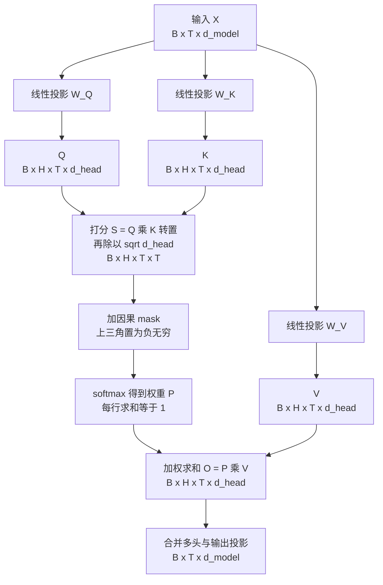
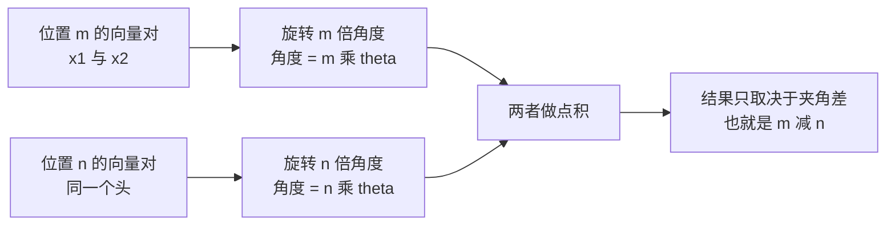
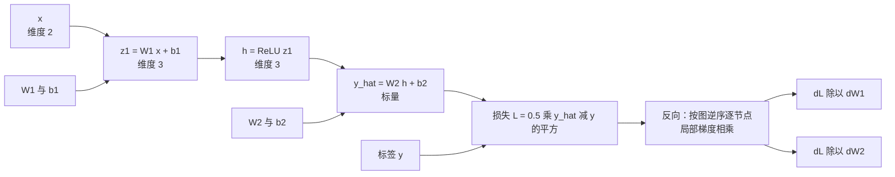
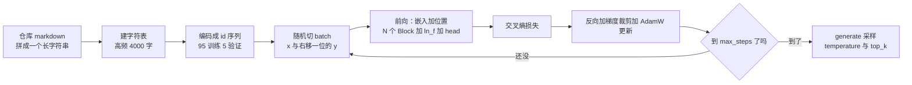

# 04 · Transformer 与 LLM 原理手推

> **本章定位**：你已经是"会调 LLM API 的工程师"——写过 RAG、搭过 Agent、天天数 token。但算法岗面试不问"怎么调接口"，而问"Attention 为什么除以 sqrt(d_k)""KV Cache 缓存了几份""RoPE 为什么能外推"。这一章的任务是把你的**概念级认知砸实到能推导、能手写、能回答"为什么这么设计"**。
>
> **为什么学**：2026-10-08 你入职京东 JoyAI 做 Agent 后端（Go + LLM API），2027 年春节后转投大模型算法日常实习，2027 秋招冲算法岗。算法岗与工程岗的分界线就在这里：**工程岗知道 Attention 是什么，算法岗能白板手推并说出每个设计选择的取舍**。[02 数学地基最小集](./02-数学地基最小集) 给你矩阵/概率/梯度的最小必要集，[03 PyTorch 与训练工程地基](./03-PyTorch与训练工程地基) 让你从 Go 思维切到张量思维——本章是两者的第一次合流。学完它，[05 多模态原理与架构谱系](./05-多模态原理与架构谱系) 里的 ViT 与跨模态 Attention 才有落脚点。
>
> **算力约束**：全章动手按 **8-12GB 单卡消费级显卡**设计，默认约 1.34M 参数，训练几分钟，不需要集群。

## 本章学习目标

1. **能手推**：白纸写出 `Attention(Q,K,V) = softmax(QK^T / sqrt(d_k)) V`，并给出逐操作的 shape 变化、方差推导与每个设计选择的理由。
2. **能手写**：不看源码写出带 batch / 多头 / mask / 缩放 / 残差的 MHSA，并训练一个能生成中文片段的 mini-GPT。
3. **能解释**：位置编码三代演进、LayerNorm vs RMSNorm、Pre-LN vs Post-LN、SwiGLU、采样策略、KV Cache 显存公式——每条都能说"为什么"而非"是什么"。
4. **能回答追问**：面对"你以为你懂了"式的 12 连问，每题给出 3-6 句有信息量的答案。

## 核心知识点提炼

| 知识点 | 一句话结论 | 面试高频度 |
|--------|-----------|-----------|
| Scaled Dot-Product Attention | 除以 `sqrt(d_k)` 是把点积方差从 `d_k` 拉回 1，防止 softmax 饱和导致梯度消失 | ⭐⭐⭐ |
| 多头注意力 | 不是"拆维省钱"，而是让不同头在不同子空间学不同模式，参数量与单头大 Attention 相同 | ⭐⭐⭐ |
| 因果 mask | 训练时用上三角 `-inf` 一次并行算全序列；推理 decode 由 KV Cache 天然保证因果 | ⭐⭐⭐ |
| 正弦位置编码 | 用不同频率 sin/cos，使位置 `m+k` 的编码可由位置 `m` 的编码经旋转线性得到 | ⭐⭐ |
| RoPE | 对 Q/K 做位置相关的二维旋转，点积只依赖相对位置 `m-n`；其外推难题靠 NTK/YaRN 缓解 | ⭐⭐⭐ |
| RMSNorm | 去掉减均值与 beta，只保留缩放，少一次 reduce，更快更稳，主流 LLM 标配 | ⭐⭐⭐ |
| Pre-LN vs Post-LN | Pre-LN 让残差成为恒等通路，深层可训；代价是表达力有争议，需 final norm | ⭐⭐⭐ |
| SwiGLU | 门控前馈把 `4d` 改成 `8/3 d`，参数量持平但效果更好 | ⭐⭐ |
| 采样策略 | greedy 稳但呆板，temperature 调熵，top-k/top-p 截尾，repetition penalty 治复读 | ⭐⭐⭐ |
| KV Cache | 缓存每层每头的 K/V（不含 Q），显存 `2 × layers × heads × head_dim × seq_len × batch × dtype_bytes` | ⭐⭐⭐ |
| 反向传播 | autograd = 链式法则 + 计算图拓扑逆序，无魔法 | ⭐⭐⭐ |
| 训练目标 | next-token prediction 就是每位置 one-hot 的交叉熵，梯度是 `p - y`；PPL = `exp(loss)`，不可跨 tokenizer 比较 | ⭐⭐⭐ |

## 知识点详解

### 1. Self-Attention 完整手推

#### 1.1 符号与出发点

输入 `X` 的 shape 是 `[B, T, d_model]`，三个可学习投影矩阵 `W_Q / W_K / W_V` 各为 `[d_model, d_model]`。为什么是 `Q K^T`？因为你要一个 `[T, T]` 矩阵：第 `i` 行第 `j` 列表示"位置 i 该给位置 j 多少注意力"。点积是最便宜的相似度度量，且一次矩阵乘法把全部 T×T 对算完——**这是 Transformer 相对 RNN 的核心优势：序列维度完全并行**，而 RNN 必须逐步递推。

```text
Q = X @ W_Q    K = X @ W_K    V = X @ W_V        形状均为 [B, T, d_model]
Attention(Q, K, V) = softmax( Q K^T / sqrt(d_k) ) V
```

#### 1.2 张量 shape 变化表（务必背下来）

以 `B=2, T=4, d_model=8, H=2`（故 `d_head = d_model / H = 4`）为例：

| 步骤 | 操作 | 表达式 | shape |
|------|------|--------|-------|
| 1 | 输入 | `X` | `[2, 4, 8]` |
| 2 | 线性投影 | `X @ W_Q` | `[2, 4, 8]` |
| 3 | 拆头 | `view(B, T, H, d_head)` | `[2, 4, 2, 4]` |
| 4 | 头维度前置 | `transpose(1, 2)` | `[2, 2, 4, 4]` = `[B, H, T, d_head]` |
| 5 | 打分 | `Q @ K.transpose(-2, -1)` | `[2, 2, 4, 4]` = `[B, H, T, T]` |
| 6 | 缩放 | `/ sqrt(d_head)` = `/ 2.0` | `[2, 2, 4, 4]` |
| 7 | 因果 mask | `masked_fill(mask == 0, -inf)` | `[2, 2, 4, 4]` |
| 8 | 归一化 | `softmax(dim=-1)` | `[2, 2, 4, 4]` |
| 9 | 加权求和 | `P @ V` | `[2, 2, 4, 4]` = `[B, H, T, d_head]` |
| 10 | 合并头 | `transpose(1,2).view(B, T, d_model)` | `[2, 4, 8]` |
| 11 | 输出投影 | `@ W_O` | `[2, 4, 8]` |



**最容易被抓住的一点**：第 5 步的 `attn` 是 `[B, H, T, T]`，显存是 `B × H × T²`。`B=1, H=32, T=4096` 时是 32 × 4096² ≈ 5.4 亿个元素，FP16 下约 1GB——**这就是长文本的显存瓶颈，也是 FlashAttention 存在的理由**（不实体化该矩阵，用分块 + 在线 softmax 把显存降到 `O(T)`）。

#### 1.3 为什么除以 `sqrt(d_k)`：方差角度推导

设 `q`、`k` 的每个分量独立同分布、均值 0、方差 1（初始化良好时的近似）：

```text
s = q · k = sum over i of q_i * k_i ,  i = 1..d_k
E[s] = 0
Var[s] = sum Var(q_i * k_i) = sum Var(q_i) * Var(k_i) = d_k      →  std[s] = sqrt(d_k)
```

**不缩放时打分的标准差就是 `sqrt(d_k)`**，`d_head = 64` 时 std = 8，打分轻松落在 ±20 到 ±30。softmax 对输入尺度极其敏感：输入小 → 接近均匀、区分度不足；输入大 → 接近 one-hot、**饱和**。softmax 的雅可比是 `diag(p) - p p^T`，当某个 `p_i → 1` 时所有偏导 `p_i(1 - p_i) → 0`，**梯度消失、训练学不动**。除以 `sqrt(d_k)` 后 `Var = d_k / d_k = 1`，打分回到 O(1)，softmax 落在既不过平也不过尖的区间。所以这不是"经验做法"，而是**一次显式的方差归一化**。那为什么不是除以 `d_k`？因为那样方差变成 `1/d_k`（`d_head=64` 时 std = 0.125），分布过于平坦，注意力几乎变成均匀平均，**模型丧失"选择性关注"的能力**。`sqrt` 是唯一能让方差恰好回到 1 的幂次。

#### 1.4 为什么多头：子空间视角

常见误解是"多头为了省算力"——**完全错误**。单头时 `W_Q` 是 `[d_model, d_model]`；H 头时每头 `[d_model, d_head]`，拼起来还是 `[d_model, d_model]`，**参数量与 FLOPs 完全一样**。多头的价值在于：

- **不同子空间学不同关系**：有的头学"上一个词是什么"（局部语法），有的学主谓一致（长距离依存），有的学指代消解。单头只能输出一个注意力分布，被迫在所有关系上取平均。
- **实验证据**：BERT/GPT 可视化里确实存在"位置头""句法头""稀有词头"，剪掉部分头几乎无损（存在冗余），但**换成单头大 Attention 会掉点**。
- **为什么"拆维做一次大 Attention"不等价**：那样只有一个 `[T,T]` 的 softmax，所有维度共享同一套权重；多头是**每头各自归一化**再拼接，函数族严格更大。

#### 1.5 为什么是 softmax，不是别的归一化

候选与问题：L1 归一化（除以绝对值之和）权重可正可负、不形成"竞争"；L2 归一化不保证非负、和不为 1、输出不是凸组合；sigmoid 逐元素各自独立、无法形成"总和为 1 的竞争"；sparsemax / entmax 更稀疏、可解释性更好但实现复杂。**softmax 同时做到非负、和为 1、处处可微、指数放大差异、温度可调、梯度形式干净**——关键就是"可微 + 指数放大差异"，它把"打分"平滑地转成"概率分配"，反向传播能顺畅穿过。

### 2. 从零手写 Multi-Head Self-Attention

```python
import math
import torch
import torch.nn as nn
import torch.nn.functional as F

class MultiHeadSelfAttention(nn.Module):
    """完整版 MHSA：含 batch、多头、因果 mask、缩放、dropout、输出投影。"""
    def __init__(self, d_model: int, n_head: int, block_size: int, dropout: float = 0.0):
        super().__init__()
        assert d_model % n_head == 0, "d_model 必须能被 n_head 整除"
        self.n_head = n_head
        self.d_head = d_model // n_head
        self.qkv = nn.Linear(d_model, 3 * d_model)   # 一次 GEMM 算完 QKV，比三次快
        self.proj = nn.Linear(d_model, d_model)
        self.dropout = nn.Dropout(dropout)
        mask = torch.tril(torch.ones(block_size, block_size))          # 下三角为 1
        self.register_buffer("mask", mask.view(1, 1, block_size, block_size))

    def forward(self, x):
        B, T, C = x.shape                                            # C == d_model
        q, k, v = self.qkv(x).split(C, dim=2)                         # 各 [B, T, C]
        q = q.view(B, T, self.n_head, self.d_head).transpose(1, 2)    # [B, H, T, Dh]
        k = k.view(B, T, self.n_head, self.d_head).transpose(1, 2)
        v = v.view(B, T, self.n_head, self.d_head).transpose(1, 2)
        att = (q @ k.transpose(-2, -1)) / math.sqrt(self.d_head)      # [B, H, T, T]
        att = att.masked_fill(self.mask[:, :, :T, :T] == 0, float("-inf"))
        att = self.dropout(F.softmax(att, dim=-1))
        y = (att @ v).transpose(1, 2).contiguous().view(B, T, C)      # 合并多头
        return self.proj(y)
```

**与 `nn.MultiheadAttention` 的差异**：手写版用一次 `Linear(d, 3d)` 合并 GEMM，天然 `[B, T, C]`；官方实现默认 `[T, B, C]`（必须 `batch_first=True`），且 `attn_mask` 默认是**加法** mask 而 `key_padding_mask` 是布尔 mask，语义不同、极易混用——这是最常见的踩坑点。官方版可走融合 kernel，小模型差距不大。**结论：面试验证理解时写手写版，生产用 `nn.MultiheadAttention` 或 `F.scaled_dot_product_attention`**（PyTorch 2.x 会在 FlashAttention / Memory-Efficient / 数学实现三种后端里自动选择）。

**四类最常见的实现错误**：

1. **mask 填错**：`masked_fill` 填了 `0` 而不是 `-inf`（softmax 后仍均匀，模型能"看到未来"），或 mask 取反（`mask == 1` 屏蔽下三角，只能看未来，loss 卡在 `ln(vocab)` 不降）。
2. **`d_head` 算错**：用 `d_model` 而不是 `d_model // n_head` 去 `sqrt`。`d_model=128, H=4` 时应用 `/11.3` 却用了 `/8`，**缩放不足**，训练前期不稳定。
3. **忘记 reshape 回 `seq_len`**：`att @ v` 后忘了 `transpose(1,2).contiguous().view(B, T, C)`，直接把 `[B,H,T,Dh]` 喂给 `proj`。
4. **头与序列维度搞混**：写成 `view(B, n_head, T, d_head)`——看着很像但是错的。`[B, T, C]` 的内存里 T 在前，必须先 `view(B, T, H, Dh)` 再 `transpose`；写成前者会把同一位置的相邻头当成时间步，模型永远学不会。

**自查技巧**：用 `d_model=8, H=2, T=4` 手工前向打印每步 shape，与 1.2 节表格逐行核对——这一步能抓住上面全部四类错误。

### 3. 位置编码三代演进

Attention 本身**对位置完全无感**（置换等变）：输入做任意重排，输出只是跟着重排。所以位置信息必须显式注入。

#### 3.1 第一代：正弦式绝对位置编码

无需训练、可外推到任意长度、不同频率覆盖不同尺度（`i=0` 波长 `2π`，`i=d/2-1` 波长约 62832）。**为什么 sin/cos 能表达相对位置**——三角恒等式表明：**位置 `m+k` 的编码可由位置 `m` 的编码经一个只与偏移 `k` 有关的旋转线性变换得到**，于是 `<PE(m+k), PE(m)>` 只取决于 `k`。代价是它**加性**注入 embedding、与词义纠缠，模型得自己分离两者。

```text
PE[pos, 2i]   = sin( pos / 10000^(2i/d_model) )
PE[pos, 2i+1] = cos( pos / 10000^(2i/d_model) )

sin( (m+k)w ) = sin(mw)cos(kw) + cos(mw)sin(kw)
cos( (m+k)w ) = cos(mw)cos(kw) - sin(mw)sin(kw)      ← 旋转的形式，所以相对位置可线性表达
```

#### 3.2 第二代：可学习绝对位置编码

`nn.Embedding(max_len, d_model)`，位置当索引查表（GPT-2 与本章 mini-GPT 的做法）。灵活，但**表长固定、超出直接报错**，外推能力差（没见过位置就是随机初始化的向量）。

#### 3.3 第三代：RoPE 旋转位置编码

RoPE 不在输入端加位置，而是**在 Q/K 上做旋转**。把 `d_head` 维两两配对成 `d_head/2` 个二维平面，第 `i` 对用频率 `theta_i = base^(-2i/d_head)`（base 通常 10000），位置 `m` 处的旋转为：

```text
[ x'_{2i}   ]   [ cos(m*theta_i)  -sin(m*theta_i) ]   [ x_{2i}   ]
[ x'_{2i+1} ] = [ sin(m*theta_i)   cos(m*theta_i) ] * [ x_{2i+1} ]
即 R(m, theta_i)：一个旋转角为 m * theta_i 的二维旋转矩阵

为什么天然编码相对位置（最漂亮的一步）：旋转矩阵满足 R(a)^T R(b) = R(b-a)，于是
< R(m*theta) q , R(n*theta) k > = q^T R(m*theta)^T R(n*theta) k
                               = q^T R( (n-m)*theta ) k     → 只依赖相对位置 (n - m)
```

**注意力打分里只出现相对位置差**，而且旋转作用在 Q/K 上而非 embedding 上，不污染语义通道。



**为什么不能简单外推**：各维度对的频率差异极大。`i=0` 时 `theta = 1`，波长 `2π ≈ 6.3` 个 token；`i=d_head/2-1` 时 `theta = 10000^-1`，波长约 62832 个 token。**高频维度在短距离内就转了好几圈**。推理长度超过训练长度时，高频维度发生**相位混叠**（`m` 与 `m+周期` 无法区分），注意力打分噪声化、输出崩坏。**根因不是"没位置信息"，而是"高频信息绕晕了"。**

#### 3.4 外推手段的直觉对比

| 方法 | 做法 | 直觉与代价 |
|------|------|-----------|
| 位置插值 PI | 推理时把位置压成 `m * L/L'` | 把所有位置塞回训练区间、"降分辨率"；高频被压缩，局部与短文本性能下降 |
| NTK-aware | 把 base 从 10000 调到 `10000 * s^(d/(d-2))` | **不同频率维度被不同程度拉伸**：高频几乎不动保住局部精度，低频被拉开覆盖更长范围；需少量微调才最好 |
| YaRN | NTK-by-parts + 注意力温度缩放 | 波长小于训练长度的维度不插值（外推），大于的才插值；再对 logits 乘 `1/sqrt(t)` 修正熵变。实现稍复杂，当前长文本扩展常用 |
| 长文本微调 | 用长文本继续训练 | 最直接、效果最好；需要长文本数据与算力 |

面试答法：**"RoPE 失效的根因是高频维度相位混叠；PI 是整体压缩（伤高频），NTK/YaRN 是分频率缩放（保高频、拉低频），本质都是在'外推'与'分辨率'之间做权衡。"**

### 4. 归一化与残差

#### 4.1 LayerNorm vs RMSNorm

RMSNorm **少一次 reduce 与一次广播减法**，kernel 更简单，实测有可观加速；少了 beta 与中心化，因为实验表明"减均值"对 Transformer 贡献很小，真正起作用的是尺度归一化；它对输入平移不敏感。LLaMA 系、PaLM、Qwen 等主流开源 LLM 全用 RMSNorm。

```text
LayerNorm(x) = gamma * (x - mean(x)) / sqrt( var(x) + eps ) + beta    # 减均值 + 除标准差 + 仿射
RMSNorm(x)   = gamma * x / sqrt( mean(x^2) + eps )                    # 只除均方根，无 beta
```

#### 4.2 LayerNorm 为什么在 NLP 里比 BatchNorm 好

| 维度 | BatchNorm | LayerNorm |
|------|-----------|-----------|
| 统计范围 | 跨 batch 的同一特征维，依赖 batch size | 单样本内所有特征维，与 batch 无关 |
| 变长序列 | pad 会污染统计 | 逐位置独立归一化，天然适配 |
| 训练/推理一致性 | 训练用 batch 统计、推理用滑动平均，不一致 | 完全一致 |
| 自回归生成与分布式 | 推理 batch=1 时统计不可用；训练需跨卡同步统计 | 推理无影响；训练无通信开销 |

一句话：**NLP 的序列长度可变、batch 语义弱、推理时 batch=1，三条把 BatchNorm 的假设全打破了。**

#### 4.3 残差连接与 Pre-LN / Post-LN

`x_{l+1} = x_l + F(x_l)` 的反向是 `dL/dx_l = dL/dx_{l+1} * ( 1 + dF/dx_l )`。那个 **`1`** 就是关键：梯度有一条"恒等高速公路"直通底层。没有残差时是纯连乘，几十层连乘必然指数衰减或爆炸；有了 `1`，即使 `dF/dx_l` 很小梯度也不会归零。同时每个 block 只需学"小修正量"而不是从零学完整变换，优化难度大幅下降。

```text
Post-LN（原始 Transformer）： x = LN( x + Attn(x) )    梯度必须穿过 LN
Pre-LN（GPT-2 之后主流）：    x = x + Attn( LN(x) )    残差是干净的恒等通路
```

- **Post-LN**：表达力更强，但**必须配 warmup**，否则深层梯度范数失控、训练发散（原始 BERT/ViT 都是 Post-LN + warmup）。
- **Pre-LN**：稳定得多，几乎不需 warmup 就能训几十层，**大模型时代的事实标准**（GPT-2/3、LLaMA 全是 Pre-LN）。代价是末端需要额外 `ln_f`，否则最后一层输出尺度不受控。
- **争议**：Pre-LN 的恒等残差让深层 block 贡献被稀释、等效深度不足，表达力可能不如精心调参的 Post-LN（对应 DeepNorm、Sandwich-LN 等改良）。**面试答法："Pre-LN 换稳定、Post-LN 换表达力，工程上选稳定 + 加 final norm。"**

#### 4.4 初始化：GPT-2 的 `1/sqrt(2N)` 缩放

GPT-2 把残差路径上的投影层（`attn.proj`、`mlp.proj`）权重初始化为 `std = 0.02 / sqrt(2 * n_layer)`。原因：**残差是累加的**，每层都往 `x` 上加东西（约 `2N` 个残差分支，含 Attn 与 MLP），输出方差随层数线性增长。把每个分支的初始化缩小 `sqrt(2N)` 倍，可让**残差流方差在深层保持恒定**，训练一开始就数值健康。

### 5. FFN 与前馈层

FFN 承担了 Transformer 里**大部分参数与"知识存储"**：注意力负责在 token 间搬运信息，FFN 负责对每个位置独立做非线性变换——MoE 就是把这一层换成多个专家。**为什么 `d_ff` 从 `4d` 变成 `8/3 d`**：让 SwiGLU 与标准 FFN 参数量持平，解 `3 * d_model * d_ff = 8 * d_model^2` 得 `d_ff = 8/3 * d_model ≈ 2.667 d_model`。LLaMA 取 `d_ff = 11008`（`8/3 × 4096 = 10922.7` 向上取到 256 的倍数以对齐硬件）。门控的价值是**逐样本的动态通道选择**，相当于一个软性特征选择器。

```text
标准 FFN： FFN(x) = W2 * act( W1 * x + b1 ) + b2
           W1: [d_model, 4*d_model]   W2: [4*d_model, d_model]
           参数量 = 2 * 4 * d_model^2 = 8 d_model^2    （是注意力的 4 d_model^2 的两倍）
SwiGLU：   FFN(x) = W2 * ( SiLU(W_gate * x) ⊙ (W_up * x) )
           W_gate, W_up: [d_model, d_ff]   W2: [d_ff, d_model]   参数量 = 3 * d_model * d_ff

激活函数演进： ReLU(x) = max(0, x)        负半轴梯度为 0，存在"死亡神经元"
               GELU(x) ≈ x * Phi(x)       平滑版 ReLU，BERT/GPT-2 用；涉及 erf，稍慢
               SiLU(x) = x * sigmoid(x)   又叫 Swish，平滑、非单调、负半轴有小负值；LLaMA 用
```

**非单调性**（SiLU 在 `x ≈ -1.28` 取极小值）被认为有助于表达力，是它优于 ReLU 的一种解释。

### 6. 解码与采样

流程：`logits [vocab] → 除以温度 T → 截断 top-k / top-p → softmax → 采样`。

| 策略 | 做法 | 适用场景 | 副作用 |
|------|------|---------|--------|
| Greedy | 每步 argmax | 代码、数学、结构化输出等确定性任务 | 呆板、易复读、陷入循环；每步最优不等于整句最优 |
| Beam Search | 保留 k 条路径按累计 log 概率择优 | 翻译、摘要等有标准答案的任务 | 输出保守"万金油"化；成本 k 倍；与采样不兼容 |
| Temperature | `logits / T`，T<1 更确定、T>1 更随机 | 通用旋钮 | 过高胡言乱语、过低复读；**不改排序，只改陡峭度** |
| Top-k | 只留概率最高的 k 个再归一化 | 通用，防采到长尾垃圾 | k 固定：分布平坦时太窄、尖锐时太宽 |
| Top-p（核采样） | 留累计概率达 p 的最小集合 | 通用，**自适应**（平坦时集合大、尖锐时集合小） | 需排序；p 过大失去截断意义 |
| Repetition penalty | 对已出现 token 的 logits 施加惩罚 | 治复读与循环 | 过强会破坏必要重复（代码括号、中文叠词） |
| 对比解码 / 典型采样 | 前者用"专家 logits − 业余 logits"放大差异；后者保留与分布熵最接近的 token | 提升事实性；长文本创作减少"四不像" | 前者需两个模型成本翻倍；后者需同时看概率与熵，实现复杂 |

温度的数值例子（原始 logits `[2.0, 1.0, 0.0]`，三个候选）：

```text
T = 0.5 ：logits/0.5 = [4.0, 2.0, 0.0] → exp = [54.60, 7.39, 1.00] 和 62.99 → 概率 [0.867, 0.117, 0.016]
T = 1.0 ：logits/1.0 = [2.0, 1.0, 0.0] → exp = [ 7.39, 2.72, 1.00] 和 11.11 → 概率 [0.665, 0.245, 0.090]
T = 2.0 ：logits/2.0 = [1.0, 0.5, 0.0] → exp = [ 2.72, 1.65, 1.00] 和  5.37 → 概率 [0.506, 0.307, 0.186]
```

**关键洞察**：温度不改变 logits 的相对顺序，只改变分布的熵。`T → 0` 退化为 greedy，`T → ∞` 退化为均匀分布。工程上常用 `T=0.7` 配 `top_p=0.9`。

### 7. KV Cache 与推理开销

生成第 `t` 个 token 时，Q 只有"当前这一个"，但要与**所有历史 token** 的 K/V 做注意力。历史 token 的 K/V 在自回归过程中**不再变化**，因此可缓存：**Prefill 阶段**把 prompt 的 T0 个位置的 K/V 一次算完写入缓存；**Decode 阶段**每次只算新 token 的 1 个 Q/K/V，把 K/V 追加进缓存，再用 Q 与全部缓存 K 做一次矩阵-向量乘。**为什么是 2 份**：`K` 用来算打分 `Q K^T`，`V` 用来加权求和 `P V`，二者由不同权重投影而来、数值上不可互相推导，缺一不可；**Q 不需缓存**，因为每个新 token 只用自己那一个 Q，用完即弃。

```text
KV Cache 字节数 = 2 × n_layer × n_head × head_dim × seq_len × batch_size × dtype_bytes
                 2=K和V两份  每层独立  多头独立   头向量维度   已缓存token数  并发数    FP16=2 INT8=1

算例 1（LLaMA-2 7B，FP16，单请求 4096 上下文）：
  n_layer=32, n_head=32, head_dim=128, seq_len=4096, batch=1, dtype_bytes=2
  每 token 每层每头 = 2 × 128 × 2 = 512 字节
  总 = 2 × 32 × 32 × 128 × 4096 × 1 × 2 = 2,147,483,648 字节 = 2.0 GiB   （恰好 2 GiB）
算例 2（本章 mini-GPT：4 层 / 4 头 / head_dim 32 / seq_len 256 / batch 32 / FP32）：
  总 = 2 × 4 × 4 × 32 × 256 × 32 × 4 = 33,554,432 字节 = 32 MiB   （微不足道）
```

对比 7B 模型权重：`7B × 2 字节 ≈ 14GB`。**并发 8 个 4096 上下文请求就要 16GB KV Cache，超过权重本身。** 对你的启示：8-12GB 显卡跑 7B，FP16 权重 14GB 放不下，必须 INT4 量化到约 4GB，剩下的 4-8GB 全给 KV Cache——**上下文长度与并发数只能二选一**，这就是推理优化的核心矛盾。

> 关于 PagedAttention、Continuous Batching、量化、投机解码等**工程层优化**，本章不重复，直接看 [LLM 推理优化](../导师学习路径/08-JD专题-LLM推理优化)：那章讲"怎么让推理更快更省"，本章讲"为什么会这样"，两章配合看，面试时既有原理又有方案。

### 8. 手推反向传播

以 2 层 MLP + MSE 为例，输入 `x` 维度 2、隐藏层 3、输出 1，前向为 `z1 = W1 x + b1`（`W1: [3,2]`）→ `h = ReLU(z1)` → `yh = W2 h + b2`（`W2: [1,3]`）→ `L = 0.5 (yh - y)^2`：



```text
【1】损失对输出： dL/dyh = yh - y                                      标量
【2】输出层 yh = W2 h + b2：
     dL/dW2 = dL/dyh * h^T            [1,3] = [1] 外积 [3]
     dL/db2 = dL/dyh                  [1]
     dL/dh  = W2^T * dL/dyh           [3] = [3,1] 乘 [1]
【3】ReLU：h = max(0, z1)：
     dL/dz1 = dL/dh ⊙ 1[z1 > 0]       逐元素乘，负半轴梯度被掐断
【4】隐藏层 z1 = W1 x + b1：
     dL/dW1 = dL/dz1 * x^T            [3,2] = [3] 外积 [2]
     dL/db1 = dL/dz1                  [3]
     dL/dx  = W1^T * dL/dz1           [2]，需要时继续往前传
【5】更新： W1 <- W1 - lr*dL/dW1    W2 <- W2 - lr*dL/dW2    b1、b2 同理

Attention 的反向是同一套规则、只是图更长：
     dL/dV = P^T @ dL/dO          dL/dP = dL/dO @ V^T
     dL/dS = P ⊙ ( dL/dP - sum(dL/dP ⊙ P, dim=-1, keepdim=True) )     # softmax 的雅可比
     dL/dQ = (dL/dS) @ K / sqrt(d_head)      dL/dK = (dL/dS)^T @ Q / sqrt(d_head)
```

三条"梯度形状法则"：**(1) 线性层权重梯度 = 输入的外积**（`dL/dW = dL/dy ⊗ x`，形状必然 `[out, in]`）；**(2) 偏置梯度 = 上游梯度在 batch 维求和**；**(3) 转置出现在往回传的路上**（`dL/dx = W^T dL/dy`）。注意上面 softmax 反向公式里的 `P ⊙ (...)`——当 `P` 接近 one-hot 时它趋近 0，**这就是 1.3 节要除以 `sqrt(d_k)` 的原因在反向传播里的具体体现**。**PyTorch 的 autograd 在做什么**：`loss = 0.5 * (yh - y).pow(2).sum(); loss.backward()` 时，框架把前向的每个运算记录成一个 Node，`backward()` 做三件事——**（1）把计算图按拓扑排序取逆序；（2）每个节点用局部导数乘下游传来的梯度（链式法则）；（3）把结果累加到叶子张量的 `.grad`。** 图中任何一环局部导数错了训练就错了，所以 4.3 节强调的残差 `+1`、1.5 节强调的 softmax 可微性，都是在保证这条链通畅。

### 9. 训练目标

给定 `x_1 ... x_T`，模型每步输出词表分布 `p_theta(· | x_<t)`，训练目标是最小化平均交叉熵。是不是很眼熟？这和第 8 节 MSE 的 `yh - y` 是同一形式——**"预测减真实"贯穿整个深度学习**，也是为什么 `F.cross_entropy(logits, targets)` 实现上是"log_softmax + NLL"融合算子：直接拿 `p - y` 更数值稳定。

```text
L = - (1/T) * sum over t of log p_theta( x_t | x_1 ... x_{t-1} )
  = 各位置 one-hot 标签与预测分布的交叉熵的平均
对 logits z 求导： dL/dz = p_theta - onehot(x_t)        形状 [vocab]

Perplexity： PPL = exp(L)，直觉是"模型平均在多少个等概率候选里犹豫"
  随机初始化、词表 4000： L ≈ ln(4000) ≈ 8.29 → PPL ≈ 3984（啥也没学到）
  L = 6.0 → PPL ≈ 403     L = 4.0 → PPL ≈ 55      L = 3.0 → PPL ≈ 20
  L = 2.0 → PPL ≈ 7.4     L = 1.0 → PPL ≈ 2.7（接近记忆/过拟合）
```

**为什么语言模型能学出语义**：这个目标看似只教"预测下一个词"，但要在海量文本上把 loss 压下去**没有捷径**——模型必须隐式学到**语法**（主谓一致、括号配对、中文量词搭配）、**事实**（`法国的首都是 ___` 需要记住知识）、**推理**（`A 比 B 大、B 比 C 大，则 A 比 C ___`）、**语用**（对话里下一句该是回答还是反问）。**"预测下一个词"是任务，但解决它的唯一办法是建模世界的规律**——这就是"压缩即智能"的具体含义。**Teacher Forcing**：训练时每个位置的真实输入都是语料里的真实 token，而不是模型上一步的输出（输入 `[我, 爱, 吃, 苹]` → 标签 `[爱, 吃, 苹, 果]`，整体右移一位），好处是所有位置**一次前向并行算完**，效率极高，且不会因早期预测错误导致后续全错。**PPL 越低越好，但只能在"同一 tokenizer + 同一验证集 + 同一分词粒度"下比较**：字符级模型的 PPL 天然比词级高（候选空间不同），跨 tokenizer 对比 PPL 是典型面试陷阱（见追问 12）。

## 动手：手写并训练一个 mini-GPT

**设定**：用**本仓库自己的 markdown 文档**当语料（几 MB 中文技术文本，非常有代入感），训练字符级 GPT，默认约 **1.34M 参数**，8-12GB 单卡几分钟就能看到 loss 明显下降。保存为 `mini_gpt.py` 放在仓库根目录执行 `python mini_gpt.py`。

```python
"""mini-GPT：字符级 GPT，语料 = 本仓库 markdown。8-12GB 单卡可跑。"""
import glob, math, os
from collections import Counter
import torch, torch.nn as nn, torch.nn.functional as F
class Cfg:
    data_root = "docs"; block_size = 256; n_layer = 4; n_head = 4
    n_embd = 128; dropout = 0.1; batch_size = 32; lr = 3e-4
    max_steps = 3000; eval_every = 250; vocab_cap = 4000; seed = 1337
    device = "cuda" if torch.cuda.is_available() else "cpu"
# ---------- 1. 数据：把仓库 markdown 读成一个长字符串 ----------
def load_corpus(root):
    paths = sorted(glob.glob(os.path.join(root, "**", "*.md"), recursive=True))
    return "\n\n".join(open(p, encoding="utf-8").read() for p in paths)
class CharVocab:
    def __init__(self, text, cap):
        self.itos = [c for c, _ in Counter(text).most_common(cap)] + ["<unk>"]
        self.stoi = {c: i for i, c in enumerate(self.itos)}
    def __len__(self): return len(self.itos)
    def encode(self, s):
        unk = self.stoi["<unk>"]; return [self.stoi.get(c, unk) for c in s]
    def decode(self, ids): return "".join(self.itos[i] for i in ids)
def get_batch(data, cfg):                                     # 随机切段，标签右移一位
    ix = torch.randint(len(data) - cfg.block_size - 1, (cfg.batch_size,))
    x = torch.stack([data[i:i + cfg.block_size] for i in ix])
    y = torch.stack([data[i + 1:i + 1 + cfg.block_size] for i in ix])
    return x.to(cfg.device), y.to(cfg.device)
# ---------- 2. 模型：MHSA + MLP + 残差 + LayerNorm + 位置编码 ----------
class CausalSelfAttention(nn.Module):
    def __init__(self, cfg):
        super().__init__()
        assert cfg.n_embd % cfg.n_head == 0
        self.n_head, self.d_head = cfg.n_head, cfg.n_embd // cfg.n_head
        self.qkv = nn.Linear(cfg.n_embd, 3 * cfg.n_embd)      # 一次 GEMM 算完 QKV
        self.proj = nn.Linear(cfg.n_embd, cfg.n_embd)
        self.dropout = nn.Dropout(cfg.dropout)
        m = torch.tril(torch.ones(cfg.block_size, cfg.block_size))
        self.register_buffer("mask", m.view(1, 1, cfg.block_size, cfg.block_size))
    def forward(self, x):
        B, T, C = x.shape
        q, k, v = self.qkv(x).split(C, dim=2)                         # 各 [B, T, C]
        q = q.view(B, T, self.n_head, self.d_head).transpose(1, 2)    # [B, H, T, Dh]
        k = k.view(B, T, self.n_head, self.d_head).transpose(1, 2)
        v = v.view(B, T, self.n_head, self.d_head).transpose(1, 2)
        att = (q @ k.transpose(-2, -1)) / math.sqrt(self.d_head)      # [B, H, T, T]
        att = att.masked_fill(self.mask[:, :, :T, :T] == 0, float("-inf"))
        att = self.dropout(F.softmax(att, dim=-1))
        return self.proj((att @ v).transpose(1, 2).contiguous().view(B, T, C))
class MLP(nn.Module):
    def __init__(self, cfg):
        super().__init__()
        self.fc = nn.Linear(cfg.n_embd, 4 * cfg.n_embd)       # 标准 FFN，中间层 4d
        self.proj = nn.Linear(4 * cfg.n_embd, cfg.n_embd)
        self.dropout = nn.Dropout(cfg.dropout)
    def forward(self, x):
        return self.dropout(self.proj(F.gelu(self.fc(x))))
class Block(nn.Module):
    """Pre-LN：x = x + Attn(LN(x))，再 x = x + MLP(LN(x))"""
    def __init__(self, cfg):
        super().__init__()
        self.ln1, self.attn = nn.LayerNorm(cfg.n_embd), CausalSelfAttention(cfg)
        self.ln2, self.mlp = nn.LayerNorm(cfg.n_embd), MLP(cfg)
    def forward(self, x):
        return x + self.mlp(self.ln2(x + self.attn(self.ln1(x))))
class MiniGPT(nn.Module):
    def __init__(self, vocab_size, cfg):
        super().__init__()
        self.cfg = cfg
        self.tok_emb = nn.Embedding(vocab_size, cfg.n_embd)
        self.pos_emb = nn.Embedding(cfg.block_size, cfg.n_embd)   # 可学习绝对位置编码
        self.drop = nn.Dropout(cfg.dropout)
        self.blocks = nn.Sequential(*[Block(cfg) for _ in range(cfg.n_layer)])
        self.ln_f = nn.LayerNorm(cfg.n_embd)                      # Pre-LN 必需的 final norm
        self.head = nn.Linear(cfg.n_embd, vocab_size, bias=False)
        self.head.weight = self.tok_emb.weight                    # weight tying，省参数
        self.apply(self._init)
        for name, p in self.named_parameters():                   # GPT-2 的 1/sqrt(2N) 缩放
            if name.endswith("proj.weight"):
                nn.init.normal_(p, 0.0, 0.02 / math.sqrt(2 * cfg.n_layer))
    @staticmethod
    def _init(m):
        if isinstance(m, (nn.Linear, nn.Embedding)):
            nn.init.normal_(m.weight, 0.0, 0.02)
            if isinstance(m, nn.Linear) and m.bias is not None:
                nn.init.zeros_(m.bias)
    def forward(self, idx, targets=None):
        pos = torch.arange(idx.shape[1], device=idx.device)
        x = self.drop(self.tok_emb(idx) + self.pos_emb(pos))      # [B, T, C]
        logits = self.head(self.ln_f(self.blocks(x)))             # [B, T, vocab]
        if targets is None:
            return logits, None
        return logits, F.cross_entropy(logits.view(-1, logits.size(-1)), targets.reshape(-1))
    @torch.no_grad()
    def generate(self, idx, max_new_tokens, temperature=1.0, top_k=None):
        self.eval()
        for _ in range(max_new_tokens):
            logits, _ = self(idx[:, -self.cfg.block_size:])       # 超长就裁掉最老的
            logits = logits[:, -1, :] / max(temperature, 1e-6)    # 只取最后一个位置的分布
            if top_k is not None:
                v, _ = torch.topk(logits, min(top_k, logits.size(-1)))
                logits[logits < v[:, [-1]]] = float("-inf")        # 长尾置为 -inf
            idx = torch.cat([idx, torch.multinomial(F.softmax(logits, dim=-1), 1)], dim=1)
        return idx
# ---------- 3. 训练循环 ----------
def main():
    torch.manual_seed(Cfg.seed)
    text = load_corpus(Cfg.data_root)
    vocab = CharVocab(text, Cfg.vocab_cap)
    data = torch.tensor(vocab.encode(text), dtype=torch.long)
    n = int(0.95 * len(data))
    train_data, val_data = data[:n], data[n:]
    model = MiniGPT(len(vocab), Cfg).to(Cfg.device)
    n_param = sum(p.numel() for p in model.parameters())
    print(f"语料 {len(text):,} 字符 | 词表 {len(vocab)} | 参数 {n_param/1e6:.2f}M | {Cfg.device}")
    opt = torch.optim.AdamW(model.parameters(), lr=Cfg.lr, betas=(0.9, 0.95), weight_decay=0.1)
    for step in range(1, Cfg.max_steps + 1):
        model.train()
        x, y = get_batch(train_data, Cfg)
        _, loss = model(x, y)
        opt.zero_grad(set_to_none=True)
        loss.backward()
        torch.nn.utils.clip_grad_norm_(model.parameters(), 1.0)   # 梯度裁剪，防炸
        opt.step()
        if step == 1 or step % Cfg.eval_every == 0:
            model.eval()
            with torch.no_grad():
                xv, yv = get_batch(val_data, Cfg)
                _, vloss = model(xv, yv)
            print(f"step {step:5d} | train {loss.item():.3f} | val {vloss.item():.3f} | ppl {math.exp(vloss.item()):.1f}")
    ctx = torch.tensor([vocab.encode("# 04 · Transformer")], dtype=torch.long, device=Cfg.device)
    for temp, k in [(0.5, None), (0.8, 40), (1.2, 40)]:
        out = model.generate(ctx, 200, temperature=temp, top_k=k)
        print(f"\n===== temperature={temp} top_k={k} =====\n{vocab.decode(out[0].tolist())}")
if __name__ == "__main__":
    main()
```



**参数量估算**（默认 `n_layer=4, n_head=4, n_embd=128, block_size=256, vocab=4000`，自己核对一遍）：

| 模块 | 计算 | 参数量 |
|------|------|--------|
| 词嵌入 | `4000 × 128` | 512,000 |
| 位置嵌入 | `256 × 128` | 32,768 |
| 每层 attn qkv | `128 × 384 + 384` | 49,536 |
| 每层 attn proj | `128 × 128 + 128` | 16,512 |
| 每层 MLP fc | `128 × 512 + 512` | 66,048 |
| 每层 MLP proj | `512 × 128 + 128` | 65,664 |
| 每层小计（含 2 个 LayerNorm 共 512） | `198,272 × 4 层` | 793,088 |
| final LayerNorm | `128 × 2` | 256 |
| 输出头 | weight tying，与词嵌入共享 | 0 |
| **总计** | | **1,338,112 ≈ 1.34M** |

**显存与耗时预期（8-12GB 单卡）**：

| 项目 | 默认配置 | 放大配置 `n_layer=6, n_head=6, n_embd=192` |
|------|---------|------------------------------------------|
| 参数量 | 1.34M | 3.49M |
| 参数 + 梯度 + Adam 状态 | `1.34M × 4B × 4 ≈ 21MB` | 约 56MB |
| 激活值（batch 32 × T 256） | 约 400MB | 约 1-1.5GB |
| **峰值显存** | **< 1GB** | **约 1.5-2GB** |
| 单步耗时 / 3000 步总时长 | 0.05-0.15s / **3-8 分钟**（M 系 Mac CPU：25-60 分钟） | 0.2-0.4s / 12-25 分钟 |

**8-12GB 显卡对这个任务是碾压级的富余**：可以把 `batch_size` 提到 64、`block_size` 提到 512，或者加到 `n_layer=8, n_embd=256`（约 7.4M 参数，峰值显存约 2-3GB；注意 `block_size` 与 `batch` 同时放大会让 `[B,H,T,T]` 矩阵线性增长）。这才是"单卡也能玩大模型原理"的意义。**能训出什么效果**（诚实预期，约 2-4MB 中文技术语料）：第 1 步 `loss ≈ 8.3`（`= ln 4000`）完全随机；500 步 loss 2.8-3.5，已学会 markdown 结构（会自己生成 `## `、`- [ ] `、代码围栏）与中文搭配；3000 步 loss 2.0-2.6、PPL 约 7-13，能生成**结构很像、局部通顺、整体语义漂移**的中文技术段落。1.34M 参数塞不下真正的知识，但足以让你亲眼看到 **Transformer 从随机噪声里长出语言结构**——这个观察本身比跑通一个大模型更有面试价值。

**三个进阶实验**：

- **A 改头数**：只改 `n_head`，跑 `H = 1, 2, 4, 8`（`n_embd=128` 固定，故 `d_head = 128, 64, 32, 16`）各训 1500 步。预期 `H=1` 明显更差（只有一种注意力模式），`H=4` 通常最好，`H=8` 时 `d_head=16` 偏小、单头表达力不足，与 `H=4` 打平或略差。**这是"头数不是越多越好、`d_head` 有下限"的直接证据**，面试讲这个实验比背结论有说服力得多。
- **B 去掉位置编码**：删掉 `forward` 里的 `+ self.pos_emb(pos)` 重训。预期 loss 仍能下降（字符统计规律还在），但生成结果变成**"词袋拼贴"**——高频字反复出现、顺序混乱、维持不住 `## 标题` 这类结构。这直观回答了"Attention 是置换等变的，位置信息必须显式注入"。
- **C 换成 RoPE**：在 `CausalSelfAttention.forward` 里对 `q, k` 各调一次 `apply_rope(q, self.d_head)` 与 `apply_rope(k, self.d_head)`（位置与频率在函数内部按当前 `T` 现算），并删掉 `pos_emb` 与 `forward` 里的位置加法。预期训练 loss 与可学习位置编码**基本持平甚至略好**。**进阶玩法**：训完 256 长度后把生成上下文推到 512，对比"可学习位置编码（直接报错）"与"RoPE（能跑但质量下降）"——亲手复现 RoPE 外推失效，再读 3.4 节的 NTK/YaRN 就有实感了。

```python
def apply_rope(x, d_head, base=10000.0):
    """x: [B, H, T, Dh]，返回按位置旋转后的张量，形状不变。"""
    half = d_head // 2
    theta = base ** (-torch.arange(half, device=x.device).float() / half)          # [Dh/2]
    ang = torch.outer(torch.arange(x.shape[-2], device=x.device).float(), theta)   # [T, Dh/2]
    c, s = ang.cos()[None, None], ang.sin()[None, None]      # 广播成 [1, 1, T, Dh/2]
    x1, x2 = x[..., 0::2], x[..., 1::2]                      # 偶数位 / 奇数位分量
    return torch.stack([x1 * c - x2 * s, x1 * s + x2 * c], dim=-1).flatten(-2)
```

## 12 个你以为你懂了的追问

### 追问 1：为什么 Attention 要除以 `sqrt(d_k)` 而不是 `d_k`？

点积的方差是 `d_k`、标准差是 `sqrt(d_k)`；除 `sqrt(d_k)` 后方差恰为 1，logits 落在 O(1) 量级，softmax 既不饱和也不过平。若除 `d_k`，方差变成 `1/d_k`（`d_head=64` 时 std = 0.125），分布过于平坦，注意力近似均匀平均，**模型丧失选择性关注能力**。`sqrt` 是唯一能让方差归一化的幂次。

### 追问 2：多头为什么不等于"把隐藏维拆开做一次大 Attention"？

因为 softmax 的**归一化范围不同**。多头是每头独立 softmax，得到 H 套互不干扰的注意力分布；拆维单次 Attention 是整套维度共享一个 `[T,T]` 权重矩阵，是前者的退化情形，函数族更小，无法表达"这个头关注上一词、那个头关注主谓"的多模式并行。二者参数量与 FLOPs 相同——**多头的收益全部来自"多个独立归一化分布"，不是省算力。**

### 追问 3：RoPE 为什么不能简单外推？

各维度对频率差异巨大：`theta=1` 的维度波长约 6.3 token，`theta=10000^-1` 的维度波长约 62832 token。超出训练长度时**高频维度相位混叠**（`m` 与 `m+周期` 不可区分），注意力打分噪声化。所以失效不是"没位置信息"，而是"高频信息绕晕了"。解法是降低高频分辨率（PI 整体压缩）或分频率处理（NTK/YaRN）。

### 追问 4：LayerNorm 为什么在 NLP 里比 BatchNorm 好？

BN 的统计量跨 batch、跨样本，假设"同一特征维在不同样本间分布一致"。NLP 里这个假设全面失效：**序列长度可变**（pad 污染统计）、**batch 语义弱且常很小**（统计噪声大）、**推理时 batch=1**（统计无法计算）、**训练/推理统计不一致**（滑动平均 vs batch 统计）。LN 逐样本逐位置独立归一化，训练推理一致、无跨卡通信，天然适配。而且自回归生成必须逐 token 前向，BN 更无从谈起。

### 追问 5：残差是不是越深越好？

不是。残差解决的是"梯度传不下去"，但深层还有别的问题：**Pre-LN 下深层 block 贡献被恒等通路稀释**（等效深度不足）；数据不足时深层参数学不到东西、更易过拟合；显存与延迟线性增长。而且有研究显示深层网络可以随机丢掉部分层而性能几乎不掉（层冗余）。所以正确答案是"**残差让深网络可训练，但不代表更深一定更好**"。

### 追问 6：为什么 decoder-only 取代了 encoder-decoder？

三点。**（1）统一训练目标**：只用"预测下一个 token"一个目标吃下所有任务，无需精心设计源/目标切分，也不存在双向编码器与自回归解码器表征不共享的问题。**（2）上下文学习能力**：decoder-only + 因果 mask 天然支持"左边全是上下文"，few-shot 示例直接拼进 prompt，无需改结构。**（3）工程与规模效率**：单一栈、KV Cache 复用、训练全序列并行、缩放律更平滑。BERT 类双向模型在需要理解整段的任务上仍占优（embedding、分类），但在"通用生成 + 通用能力"的赛场 decoder-only 赢了。

### 追问 7：KV Cache 到底缓存了什么、为什么是 2 份？

缓存**每一层、每一个头、每一个历史 token 的 K 向量与 V 向量**（不缓存 Q）。是 2 份因为 `K` 用于算打分 `Q K^T`、`V` 用于加权求和 `P V`，二者由不同权重投影而来、数值上不可互推，缺一不可。Q 不缓存是因为每个新 token 只用自己那一个 Q。显存公式：`2 × n_layer × n_head × head_dim × seq_len × batch × dtype_bytes`。

### 追问 8：teacher forcing 带来的 exposure bias 是什么？

训练时每步输入都是**真实 token**（teacher forcing），推理时输入却是**模型自己上一步生成的 token**。训练分布与推理分布错配：一旦生成一个稍有偏离的 token，后续输入就进入训练时从未见过的分布，**误差逐步累积**（典型现象：长文本后期"跑偏"）。缓解手段：scheduled sampling（训练时按概率混入模型自己的预测）、强化学习式微调、数据里覆盖更多中间状态。**要点：说清"训练看真值、推理看自己"这个错配，并举出长文本后期退化的现象。**

### 追问 9：Pre-LN 为什么训练更稳但表达力有争议？

稳：`x = x + F(LN(x))` 中残差是**未经归一化的恒等通路**，反向有干净的 `+1` 高速路，梯度范数不随深度指数变化，因此深层可训、不依赖 warmup。争议：正因这条恒等通路太强势，层数变深后残差流里原始输入占比越来越大，**深层 block 的增量贡献被稀释**，等效深度不足，被认为表达力不如精心调参的 Post-LN（对应 DeepNorm、Sandwich-LN、scaled init 等改良）。工程结论：选 Pre-LN 的稳定性，再加 `ln_f` 收尾。

### 追问 10：为什么现在主流用 RMSNorm？

RMSNorm 去掉了 LayerNorm 的"减均值 + beta"，只保留 `x / sqrt(mean(x^2) + eps) * gamma`。收益有三：**（1）更快**——少一次 reduce 与一次广播减法；**（2）更简单**——kernel 更易融合、显存访问更少；**（3）效果不亏**——中心化对 Transformer 贡献很小，真正起作用的是尺度归一化。所以 LLaMA 系、PaLM、Qwen 等主流开源 LLM 都换成了 RMSNorm。

### 追问 11：attention mask 在训练时和推理时有什么不同？

**训练时**一次并行前向整段序列，必须用**显式上三角 `-inf` mask** 阻止位置 `t` 看到 `t+1` 及以后，否则模型直接"抄答案"、loss 异常低但推理时完全崩坏；mask 形状 `[1,1,T,T]` 靠广播生效，还要额外处理 padding mask。**推理时**分两段：**Prefill** 处理 prompt，仍是整段并行，**仍需因果 mask**；**Decode** 逐 token 生成，**不需要显式 mask**——每次只有 1 个新 query，它天然只能看到缓存里已有的历史 K/V，"看不到未来"由自回归流程本身保证。一句话：**mask 是训练并行化的代价；推理时因果性由流程免费提供，但 prefill 仍需 mask。**

### 追问 12：perplexity 能不能跨 tokenizer 比较？

**不能。** PPL 是"每个 token 的平均不确定性"，单位是 token。不同 tokenizer 切分粒度不同：字符级模型每个 token 信息量小、PPL 天然偏大；BPE 词表越大、平均每 token 越长、PPL 数值越小。拿字符级 mini-GPT 的 PPL 和 LLaMA 比毫无意义。**唯一可比场景：同一 tokenizer + 同一验证集 + 同一预处理。** 跨 tokenizer 想比能力，应该用下游任务指标（准确率、BLEU、pass@k）或换算成**每字节 bits-per-byte**。

## 面试问答

### Q1：白板写一个带因果 mask 的 MHSA，并说明每一步的 shape。

照第 2 节写。顺序：`X [B,T,C]` → 一次 `Linear(C, 3C)` 得 QKV → `split` 成三个 `[B,T,C]` → `view(B,T,H,Dh).transpose(1,2)` 得 `[B,H,T,Dh]` → `Q@K^T / sqrt(Dh)` 得 `[B,H,T,T]` → `masked_fill` 上三角为 `-inf` → `softmax(dim=-1)` → `@V` 得 `[B,H,T,Dh]` → `transpose(1,2).contiguous().view(B,T,C)` → `proj`。**主动说出两个坑**：`sqrt` 用的是 `head_dim` 不是 `d_model`；mask 必须填 `-inf` 而不是 `0`。这两句能立刻区分"写过"和"抄过"。

### Q2：注意力复杂度是多少？长文本有哪些方案？

标准 Attention 时间/空间复杂度 `O(T² · d)`，瓶颈在 `[T,T]` 矩阵：

| 方案 | 定位 | 复杂度/收益 |
|------|------|------------|
| Sliding Window | 每个 token 只看邻近 W 个 | `O(T·W·d)` 线性，但丢长程依赖 |
| Sparse / Block | 按稀疏模式选部分位置参与 | 介于两者之间，模式需设计 |
| Linear Attention | 用核函数替代 softmax，改变结合律让 `K^T V` 先乘 | `O(T·d²)` 线性，但与标准 Attention 不等价、效果有损 |
| FlashAttention | **精确** Attention 的 IO 优化：分块 + 在线 softmax，不实体化 `[T,T]` | 计算量仍 `O(T²)`，显存降到 `O(T)`，实测快 2-4 倍 |
| MQA / GQA | 多个 query 头共享 K/V 头 | 主要省 KV Cache 显存，不减计算 |

**关键区分**：FlashAttention 是"工程加速、结果精确"，其余是"近似或改结构、牺牲部分表达力"。

### Q3：MoE 是什么？为什么能扩大参数量而几乎不增加计算量？

MoE 把 FFN 换成 N 个并行专家，每个 token 只激活 top-k（通常 k=1 或 2）个专家。效果是**总参数量 = N 倍 FFN，但每 token 的 FLOPs 只增加 k 倍**，因此能在固定推理成本下把容量做大（知识存储更强）。代价：**（1）显存必须放下全部专家**；**（2）负载不均衡**——热门专家被压垮，需 aux loss 或 capacity factor 均衡；**（3）训练不稳定**，路由是离散选择、梯度传播困难；**（4）通信开销**——专家并行时要跨卡 all-to-all。

### Q4：KV Cache 的显存怎么算？给一个 7B 模型的算例。

公式 `2 × n_layer × n_head × head_dim × seq_len × batch × dtype_bytes`。LLaMA-2 7B（32 层、32 头、head_dim 128、FP16）：单请求 4096 上下文 = `2×32×32×128×4096×1×2 ≈ 2.0 GiB`；并发 8 就是 16GB，超过 14GB 的权重本身。**这就是"上下文长度与并发数此消彼长"的量化依据**，也是 PagedAttention / GQA / KV 量化的动机。

### Q5：什么是 FlashAttention？它和"稀疏注意力"有什么本质区别？

FlashAttention 是**精确注意力**的 IO 感知实现：把 Q/K/V 分块加载进 SRAM，用**在线 softmax**（维护运行最大值与运行和）增量计算，从不把 `[T,T]` 矩阵写回 HBM。显存从 `O(T²)` 降到 `O(T)`、速度提升 2-4 倍，**数值结果与标准 Attention 完全一致**。稀疏注意力则改变了注意力的定义（只算一部分位置对），是**近似**、会损失表达力。一句话：**FlashAttention 优化"怎么算"，稀疏注意力改变"算哪些"。**

### Q6：训练和推理的 Attention 有什么工程差异？

训练：整段并行，用显式因果 mask，需要保存激活值用于反向（或用激活重计算省显存）。推理：分 prefill（并行处理 prompt，仍需 mask）与 decode（逐 token，用 KV Cache，天然因果无需 mask）；瓶颈从算力转向**显存带宽**（每生成一个 token 要把全部权重从显存搬进计算单元）。这解释了为什么推理优化关注量化与 KV Cache，训练优化关注激活重计算与并行策略。

### Q7：SwiGLU 相比标准 FFN 的优势？`d_ff` 为什么取 `8/3 d`？

SwiGLU 是门控前馈 `W2 ( SiLU(W_gate x) ⊙ (W_up x) )`，优势是**门控带来的动态特征选择**——不同输入可激活不同通道子集，等效于逐样本的软性专家选择。参数量 `3 · d_model · d_ff`，令其等于标准 FFN 的 `8 d_model²`，得 `d_ff = 8/3 · d_model`（LLaMA 实际取 11008 而非 10923，因为要向上取到 256 的倍数以对齐硬件）。

### Q8：多模态模型里的 Attention 有哪些变体？（为下一章铺垫）

三方向。**（1）交叉注意力**：`Q` 来自文本、`K/V` 来自图像，让文本"查询"视觉特征（Flamingo 的 gated cross-attention、Stable Diffusion UNet 的 cross-attn）。**（2）统一序列拼接**：用视觉编码器（ViT/CLIP）把图像 patch 编成"视觉 token"，与文本 token 拼成一条序列跑同一个自注意力（LLaVA、Qwen-VL 的主流做法，结构最简、复用度最高，缺点是视觉 token 吃掉大量上下文）。**（3）Q-Former / 重采样器**：用一组可学习 query 通过交叉注意力从图像特征里"抽取"固定数量的视觉 token（BLIP-2），压到 32-64 个，极大节省上下文。此外还有**任意分辨率与二维位置编码适配**（图像 patch 是二维的，RoPE 需改 2D 或做插值）。详见 [05 多模态原理与架构谱系](./05-多模态原理与架构谱系)。

## 自测清单

- [ ] 能白板写出 `Attention(Q,K,V) = softmax(QK^T/sqrt(d_k))V`，并从方差角度推导缩放因子
- [ ] 能默写 1.2 节的 shape 变化表，11 步全对（尤其第 3-4 步 `view` 与 `transpose` 的顺序）
- [ ] 能不看参考写出带 batch / 多头 / mask / 缩放 / 输出的 MHSA，并跑通一次前向
- [ ] 能说出多头与"拆维单次大 Attention"的数学差异，以及为什么参数量相同
- [ ] 能写出 RoPE 的二维旋转矩阵，并解释点积只依赖相对位置 `n-m`
- [ ] 能解释 RoPE 外推失效的根因是高频维度相位混叠，并说出 PI / NTK / YaRN 的差别
- [ ] 能写出 LayerNorm 与 RMSNorm 公式并说出 RMSNorm 的三条收益
- [ ] 能解释残差为什么让深层网络可训练（`1 + dF/dx` 的恒等通路）
- [ ] 能说清 Pre-LN 与 Post-LN 的取舍，以及为什么 Pre-LN 需要 `ln_f`
- [ ] 能手算 SwiGLU 的 `d_ff = 8/3 d_model` 推导
- [ ] 能给定 logits 手算 T=0.5 / 1.0 / 2.0 三组概率，并解释温度不改变排序
- [ ] 能用公式算出 7B 模型 4096 上下文的 KV Cache 显存（≈2.0 GiB），并解释为什么是 2 份
- [ ] 能手推 2 层 MLP 的完整反向传播，并说出"预测减真实"的通用梯度形式
- [ ] 能说清 teacher forcing 的分布错配与 exposure bias 的后果
- [ ] 能解释为什么 PPL 不能跨 tokenizer 比较，以及应该用什么替代指标
- [ ] 已跑通 `mini_gpt.py`，看到 loss 从约 8.3 降到 2.5 以下，并完成至少一个进阶实验（改头数 / 去位置编码 / 换 RoPE）

## 与既有文档联动

- [02 数学地基最小集](./02-数学地基最小集)：方差、链式法则、矩阵乘法的形状直觉是本章推导的前置
- [03 PyTorch 与训练工程地基](./03-PyTorch与训练工程地基)：本章 mini-GPT 的 PyTorch 写法、设备管理、训练循环模板都在那一章打底
- [05 多模态原理与架构谱系](./05-多模态原理与架构谱系)：本章的 Attention 与位置编码是理解 ViT、跨模态注意力、Q-Former 的前置
- [LLM 推理优化](../导师学习路径/08-JD专题-LLM推理优化)：本章第 7 节讲 KV Cache 原理与显存公式，那章接着讲 PagedAttention / Continuous Batching / 量化等工程优化
- [RAG 原理与 LLM 基础](../导师学习路径/01-RAG原理与LLM基础)：你已做过的 RAG 链路里，embedding、上下文长度、token 计费都与本章原理直接对应
