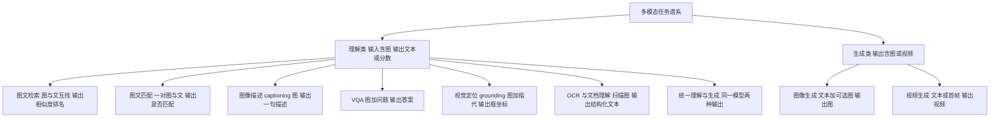
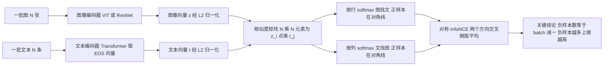
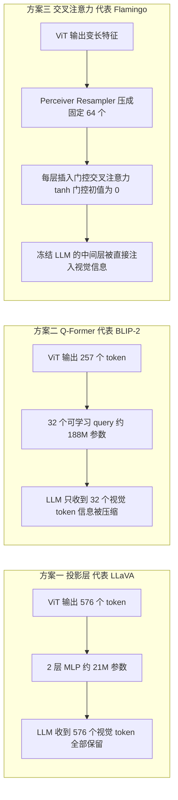
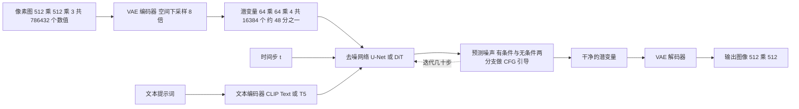
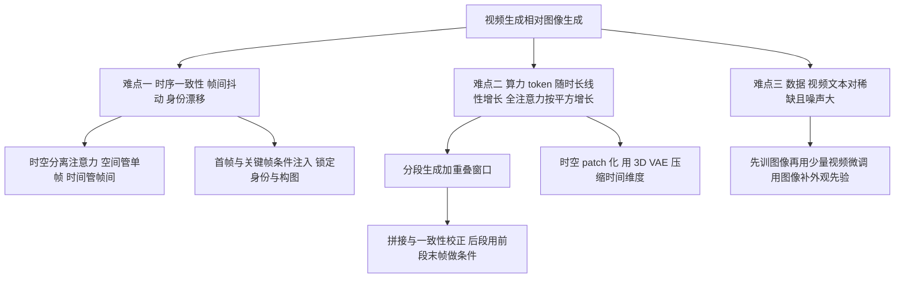
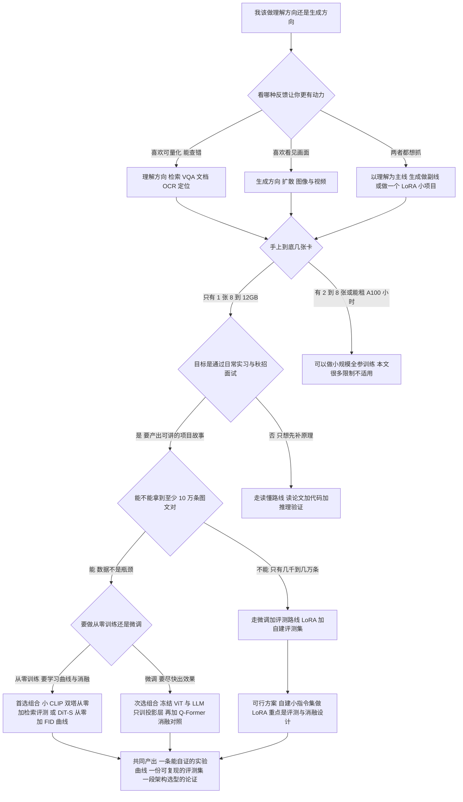

# 05 · 多模态原理与架构谱系

> **本章定位**：这是「大模型算法转岗」系列的第 05 章，夹在 [04 Transformer 与 LLM 原理手推](./04-Transformer与LLM原理手推) 和 [06 核心项目：多模态小模型从零训练](./06-核心项目-多模态小模型从零训练) 之间。
> **为什么要学**：04 章你把手推完了文本的注意力；06 章你要真的写训练代码。中间缺的是**判断力**——这个领域有哪几条路线、代表工作是什么、后一个工作为什么否定了前一个、单卡 8-12GB 到底该选哪条。没有这一章，06 章会变成"照着某个仓库抄一遍"，被追问一句"为什么不用 X 方案"就崩。
> **本章不是论文摘要合集**：每一节只回答三件事——**解决了什么问题、代价是什么、什么时候不该用**。
> **贯穿主线**：所有架构都标注**单卡可复现性**（✅ 可完整训练 / ⚠️ 只能小规模 / ❌ 只能读懂），这是本章最实用的产出。
> **与已有文档的分工**：[07 · 文生视频与 Diffusion 模型](../导师学习路径/07-JD专题-文生视频与Diffusion模型) 与 [11 · 生成原理零基础学习方案](../导师学习路径/11-JD专题-生成原理零基础学习方案) 负责把扩散**推导与口述**讲透；本章第 6 节只做**架构谱系与选型**视角的对照，不重复推导。
> **读法**：第一遍读「核心知识点提炼」表 + 第 8 节「可复现性分级」表 + 第 9 节「选型决策树」（30 分钟拿到选型结论）；第二遍按节精读补原理；面试前只刷第 10 节「面试问答」与第 11 节清单。

## 本章学习目标

1. **谱系层面**：说清「双塔对比学习 / 桥接融合 / 生成式 VLM / 扩散生成 / 统一模型」五条路线各自的赌注，以及后一条为什么会在某个场景取代前一条。
2. **视觉侧**：会算 ViT 的 token 数，说清分辨率翻倍时 token、attention 算力、显存各涨多少，以及 CLIP-ViT / SigLIP / DINOv2 / EVA 的选型依据。
3. **连接层面**：投影层 / Q-Former / cross-attention 三方案的 token 预算、参数量、训练难度与天花板，以及"我该选哪个"。
4. **生成侧**：VAE → GAN → Diffusion → Latent Diffusion → DiT 的动机链，视频生成多出来的难点为什么让"长视频"成为算力与架构的双重问题。
5. **工程层面（最重要）**：一张 8-12GB 单卡上，哪些方向能从零训出学习曲线、哪些只能 LoRA、哪些只能读懂——直接支撑 06 章选型。

## 核心知识点提炼

| 架构 / 概念 | 一句话结论 | 面试高频度 |
|------------|-----------|-----------|
| ViT patchify | 224 分辨率 patch16 得 196 个 token；边长翻倍 token 变 4 倍、attention 算力变 16 倍 | ⭐⭐⭐ |
| CLIP 双塔 | 两个编码器互不见面 + 对称 InfoNCE，拉近图文对、推远 batch 内其他样本 | ⭐⭐⭐ |
| 可学习温度 | 温度控制 softmax 锐度，可学习等于让模型自己决定"要多严格地区分" | ⭐⭐⭐ |
| 负样本数量决定上限 | 对比学习的效果上限由负样本数决定，所以 batch size 是超参里的超参 | ⭐⭐⭐ |
| CLIP 的失败模式 | 计数、空间关系、属性绑定、细粒度 OCR 都差，根因是池化丢掉了结构 | ⭐⭐⭐ |
| SigLIP sigmoid loss | 把 softmax 的全局归一化拆成逐对二分类，不再依赖巨大 batch | ⭐⭐ |
| BLIP 三损失 | ITC 对齐 + ITM 判定 + LM 生成，一个模型三种用法 | ⭐⭐ |
| BLIP-2 Q-Former | 32 个可学习 query 把视觉 token 压到定长，给冻结 LLM 省 context | ⭐⭐⭐ |
| Flamingo 门控 | 门控初值 0，训练起点等价于原 LLM，冻结大模型只训新增层 | ⭐⭐ |
| LLaVA 投影层 | CLIP 特征本身已"带语言性"，一个 2 层 MLP 就够翻译 | ⭐⭐⭐ |
| AnyRes / 动态分辨率 | 高分辨率靠切图换细节，代价是视觉 token 线性膨胀 | ⭐⭐⭐ |
| Latent Diffusion | 在 VAE 潜空间做扩散，数据量降约 48 倍，这是消费级显卡能跑 SD 的原因 | ⭐⭐⭐ |
| DiT | 用 Transformer 换掉 U-Net，换来可预测的 scaling 与和 LLM 统一的基础设施 | ⭐⭐⭐ |
| 视频生成额外难点 | 时序一致性、算力随时长平方级增长、视频文本对稀缺 | ⭐⭐⭐ |
| 早融合 vs 晚融合 | 统一模型优雅但工业界仍以专用模型加编排为主，成本与可控性是决定因素 | ⭐⭐ |

## 知识点详解

### 0. 三档时间怎么切这一章

| 节奏 | 路径 | 产出 |
|------|------|------|
| 保底 15h/周 | 核心表 + 第 8 节「可复现性分级」表 + 第 9 节「选型决策树」 + 第 10 节「面试问答」读 8 题 | 能说清五条路线与选型结论 |
| 标准 30h/周 | 上面 + 第 2、3、5 节精读 + 手算 ViT token 与显存 + 默画 3 张图 | 加一份自己的选型备忘 |
| 冲刺 50h/周 | 上面 + 第 4、6、7 节精读 + 跑一个 30 行的 InfoNCE 玩具实验 | 加一份"我为什么选这条路线"的三段论述 |

这一章**不要**复现论文级配置：目标是读得懂、比得清、选得准，动手留给 06 章。

### 1. 多模态任务谱系与评测方式



| 任务 | 输入 → 输出 | 主流评测指标 | 架构上真正考什么 |
|------|------------|-------------|---------------|
| 图文检索 | 图 ↔ 文 → 相似度排名 | Recall@1/5/10、mAP | 全局表征对齐，双塔就够，能离线建索引 |
| 图文匹配 | 一对图与文 → 匹配与否 | 准确率、F1 | 细粒度交叉验证，需要融合塔 |
| 图像描述 | 图 → 文本 | CIDEr、SPICE、METEOR、GPT 评分 | 语言生成能力；判别式指标与人感相关性差 |
| VQA | 图 + 问题 → 答案 | VQA accuracy | 读图上细节；短答案近似"开卷检索" |
| 视觉定位 | 图 + 指代 → 框坐标 | IoU@0.5、Acc@0.5 | 空间坐标怎么表示（文本化框 vs 专用头） |
| OCR / 文档理解 | 文档图 → 结构化文本 | 编辑距离、字段 F1、DocVQA ANLS | **分辨率**；细节在高层 token 里会被池化掉 |
| 图像生成 | 文本 → 图 | FID、CLIPScore、人工偏好 | 文本对齐与保真度常常互相打架 |
| 视频生成 | 文本 → 视频 | FVD、一致性评分、人工偏好 | 时序一致性 + 时长可扩展性 |
| 统一理解与生成 | 任意 → 任意 | 各任务指标之和 | 两种损失如何共存而不互相伤害 |

三个判断：**任务形态决定架构下限**——检索只要全局向量，双塔足够；VQA 与文档理解要求模型"看着图上的字回答"，池化会把字糊掉，必须让 LLM 直接看到细粒度视觉 token，这是 BLIP-2 与 LLaVA 分道扬镳的根本原因。**指标是选型的硬约束**——评测集是 Flickr30k 就优化全局对齐，是 TextVQA 就必须上高分辨率切图。**先定评测集，再选架构**，反过来必然返工（展开见 [08 评测体系与技术报告](./08-评测体系与技术报告)）。

### 2. 视觉编码器速通：ViT 与它的变体

#### 2.1 patchify 与 token 数

ViT 做的事极粗暴：切 patch → 拉平过一个线性层 → 加位置编码 → 当普通 token 喂进标准 Transformer。

```text
token 数 = (高 / patch) × (宽 / patch)   [可选再加 1 个 CLS]

224 patch16 → 14×14 = 196 个       224 patch14 → 16×16 = 256 个
224 patch32 →  7×7  =  49 个       336 patch14 → 24×24 = 576 个   ← LLaVA-1.5 默认
448 patch16 → 28×28 = 784 个       768 patch14 → 54×54 = 2916 个  ← 长上下文开始吃不消
```

#### 2.2 分辨率翻倍，代价涨多少

| 量 | 变化 | 224 → 448 的具体数字 |
|----|------|-------------------|
| token 数 | **4 倍** | 196 → 784 |
| attention 分数矩阵元素数 | **16 倍** | 38,416 → 614,656 |
| attention 部分算力 | **16 倍** | 12 层前向合计约 1.4 → 22.7 GFLOPs |
| MLP 部分算力 | 4 倍 | 与 token 数线性 |
| ViT 总算力 | 约 3-4 倍 | 84 → 约 330 GFLOPs 量级 |
| 注意力权重显存（朴素实现） | **16 倍** | 见下 |

```text
朴素 attention 要显存化 N×N 分数矩阵：大小 = batch × heads × N × N × 2 字节（fp16）
  224，N=196，batch 32，12 heads： 32×12×196×196×2 ≈  29 MB / 层
  448，N=784，batch 32，12 heads： 32×12×784×784×2 ≈ 472 MB / 层
  12 层全部保留中间结果用于反向 ≈ 5.7 GB   ← 8GB 卡直接 OOM
结论：FlashAttention 与梯度检查点不是优化项，而是单卡能不能跑的前提
```

三个可直接说出口的数字：**224 → 448，token 4 倍、attention 算力 16 倍、注意力显存 16 倍**；196 token 时 attention 只占 ViT 总算力**一成左右**（MLP 是大头），784 token 时升到**三成以上**，再往上 attention 彻底主导——这就是高分辨率"贵得不成比例"的算术解释；CLIP ViT-L/14 官方数字是 224 约 **80.6 GFLOPs**、336 约 **190 GFLOPs**。

#### 2.3 编码器选型，以及卷积主干为什么退场

| 编码器 | 训练目标 | 特征特点 | 用在哪 / 不用在哪 |
|-------|---------|---------|-----------------|
| CLIP-ViT（L/14、B/16） | 图文对比学习 | 特征**天生与语言对齐** | 接 LLM 做理解（LLaVA 默认）、零样本分类；不做密集预测 |
| SigLIP（SoViT-400m 等） | sigmoid 对比学习 | 同 CLIP 但更省 batch | 训练预算有限的自训双塔；不复现旧 CLIP 结果 |
| DINOv2 | 自监督（自蒸馏 + patch 级目标） | **不需要文本**，密集特征极好 | 分割、深度、检索、定位骨干；不直接接 LLM 做零样本理解 |
| EVA / EVA-02 | 掩码图像建模 + CLIP 蒸馏 | 语义强、细节略好于 CLIP | 想要更强骨干但不想砸大钱；参数大，算力太少时别选 |

三条选型判断：**要接 LLM 就用 CLIP 或 SigLIP**，它们与文本语义已耦合，投影层只需学坐标变换；用 DINOv2 接 LLM 则要投影层承担"重新对齐语言"的重活，只训投影层通常学不好。**要做密集预测优先 DINOv2**，它的 patch 级特征保留空间结构，CLIP 的 patch 特征被对比学习"洗"得只剩语义。**不要自己从零训视觉编码器**——CLIP 论文级配置是 4 亿图文对、32 epoch、256 张 V100 训 12 天量级，冻结预训练编码器才是正确姿势。

卷积主干（ResNet）退场三个原因：**不能与 Transformer 共享基础设施**（同构才能共用 FlashAttention、张量并行、FSDP、序列打包）；**感受野局部，长程依赖靠堆层换**，而 ViT 第一层就是全局注意力，处理文档理解更自然；**可变分辨率的成本并没有消失**，CNN 特征图 token 数同样随分辨率平方增长，只是被藏起来了——而 ViT 的 patch 化让"token 数"这个成本项**显式可控，这在工程上比"看起来免费"重要得多**。

**native resolution 与动态切图**。固定 224/336 对合同、截图、图表是灾难：2000×3000 缩到 336，字全糊。工业界两派：

- **固定网格切图（AnyRes / tiling）**：按预定义网格切成若干 336 或 448 子图，每块独立过 ViT，再加一张全局缩略图提供整图语义。LLaVA-NeXT 最多 4 子图 + 1 全局图 ≈ 2880 token；InternVL 扩到 1-12 个 448 图块 + 缩略图，并用 pixel unshuffle 把每块 token 压 4 倍。优点：复用现成 ViT、实现简单。缺点：token 线性膨胀、切缝处信息被切断、要额外学"多块怎么对应"。
- **原生动态分辨率**：Qwen2-VL 让 ViT 直接吃任意尺寸（配 2D-RoPE 表达二维位置），再用 MLP 合并相邻 2×2 token，面积线性增长但省 4 倍；Qwen2.5-VL 加了窗口注意力与绝对时间编码以处理长视频。优点：token 利用率与长宽比适应性最好。缺点：要改架构并重训，套不上现成 ViT。

**判断**：只做微调选 AnyRes（工程改动小）；要从零训小 VLM 选"固定分辨率 + 可变切图数"这个折中，别一上来做原生动态分辨率。

### 3. 对比学习路线：CLIP、ALIGN、SigLIP

#### 3.1 双塔结构与对称 InfoNCE

CLIP 的结构简单到近乎粗暴：一个图像编码器 + 一个文本编码器，**两者整个前向过程互不见面**（"双塔"的含义），只在最后算相似度时才交互。



```text
InfoNCE 的对称形式（N 为 batch 内图文对数）

z_i = 第 i 张图的归一化向量        t_j = 第 j 条文本的归一化向量
sim(i, j) = z_i · t_j             取值 [-1, 1]，越大越相似
s = exp(logit_scale)              缩放因子，初值约 1 / 0.07 ≈ 14.29，等价温度约 0.07

图到文：L_i  = -log( exp(s·sim(i,i)) / Σ_{j=1..N} exp(s·sim(i,j)) )
文到图：L'_j = -log( exp(s·sim(j,j)) / Σ_{i=1..N} exp(s·sim(i,j)) )
总损失 = (mean(L_i) + mean(L'_j)) / 2
```

读懂它的四层含义：**分子只有一项**，第 i 张图配对的那一条文本（矩阵对角线），即正样本；**分母是整个 batch**，除对角线外的 N-1 项全是负样本，模型被逼着推高正样本、压低其余全部；**softmax 就是批量内分类器**，任务被改写成"N 选 1 分类"，标签永远是第 i 个，所以对比学习本质是**拿 batch 当分类数据集**；**必须对称**，只做一个方向时梯度只优化一侧的"被当成什么"，两个方向互约束可避免单侧塌陷，同时把 batch 利用率翻倍（同一批产出 2N 个分类任务）。

#### 3.2 温度为什么可学习

温度控制 softmax 锐度：温度低（s 大）时分布尖锐，正负差一点就被重罚；温度高时模型偷懒，对谁都给相近概率。CLIP **不设固定温度，而是把 `logit_scale` 当可学习参数**：训练早期表征混乱需要宽容，后期需要严格，让梯度自动调这个旋钮比人肉调参稳。两个实现细节值得说出来：参数化用 `log(1/tau)`（即代码里的 `logit_scale`），前向时 `exp` 后乘在相似度上，既保证缩放因子恒正又让优化更平滑；代码里有 `logit_scale.clamp(max=log(100))` 这类上界，**不设上界会让温度发散、softmax 溢出，是实操里很容易踩的坑**。

#### 3.3 负采样假设与"负样本数量决定上限"

InfoNCE 可理解为互信息的一个下界估计，而这个下界**随负样本数变紧**：负样本越多越接近真实互信息。实践表现就是 **batch 越大表征越好**——CLIP 用 32768，ALIGN 直接上 18 亿对。这也是 batch size 成为"超参里的超参"、不能随便调小的原因。

但"batch 内负采样"有个**危险的隐含假设：除对角线外都不相关**，现实常常不成立。**假负样本**：`一只狗在草地上` 与 `一只小狗趴在草坪上` 语义几乎相同却被互相推开，batch 越大越容易撞上，直接污染梯度。**假正样本**：同一概念在图库多次出现，任意配对其实都该算正，但一对一目标只认对角线。三层缓解：用数据多样性稀释碰撞概率；像 ALIGN 那样主动接受噪声换规模；换损失函数（SigLIP 的 sigmoid、相似度截断）。

#### 3.4 zero-shot 为什么 work、五种失败模式，以及 ALIGN / SigLIP 两条改进路线

做法是把类别名写进模板（`a photo of a {class}`），用文本编码器编码成向量，**这些文本向量直接当分类器权重**，分类时取图像向量与各文本向量相似度最大者。有效的三层原因：对比学习把两个模态投到同一语义空间，分类被重新表述成"检索最匹配的描述"，而检索正是训练目标本身；类别名天然出现在训练语料的 caption 里，它的向量位置被目标明确约束过；模板工程是在补分布差异（训练文本是完整句子，推理若只喂单词就分布不一致，套模板能涨几个点）。

**天花板要记住**：CLIP 零样本大致相当于一个不错的线性探针，**弱于同等数据的有监督专用模型**，尤其细粒度分类与需要推理的任务。它的价值是零成本、可迁移、可组合，不是"超过一切"。

| 失败模式 | 表现 | 根因 |
|---------|------|------|
| 计数 | "两只狗"与"三只狗"相似度几乎相同 | 全局池化把数量平均掉了 |
| 空间关系 | 分不清"左边的猫"与"右边的猫" | 位置信息在池化后基本消失 |
| 属性绑定 | "红方块在蓝圆柱旁"匹配上"蓝方块在红圆柱旁" | 目标只要求全局匹配，词袋对了损失就低 |
| 细粒度 OCR | 原版 CLIP 读小字很差 | 分辨率低 + 训练语料长文本少 |
| 复杂推理 | "图里有没有被遮挡的那只动物" | 没有多步推理机制，只是匹配 |

根因一句话：**目标函数只关心"整张图与整句话是否匹配"，那么把图文都当词袋处理的模型就能拿到很低损失**。这不是训练不充分，而是目标的固有局限——也正是后续所有工作的动机：要么加融合塔做细粒度交叉验证（BLIP 的 ITM），要么让语言模型逐 token 地"读"视觉 token（LLaVA）。

**ALIGN：噪声数据换规模**。ALIGN 与 CLIP 反着来：不精挑细选，直接抓 **1.8B 互联网图文对几乎不清洗**，用规模覆盖噪声。结论很有价值：**规模足够大时，噪声数据训练的双塔在零样本 ImageNet 上能超过用干净数据的同类模型**——因为噪声给的梯度方向虽不精确，但大量样本平均后噪声互相抵消，语义方向被反复强化。**代价**：对个人不可用（1.8B 对 + 上千 TPU），且对长尾细粒度任务提升有限。它对你的价值是面试素材：被问"没算力没数据还做不做对比学习"，可以答"CLIP 与 ALIGN 是质量与规模两条路线，个人该走 SigLIP 的第三条路——改损失降低对 batch 的依赖"。

**SigLIP** 的判断是：逼你用大 batch 的元凶是 softmax 的**全局归一化**，那就把它拆掉，变成 N² 个独立二分类。

```text
对矩阵每个位置 (i, j)：z_ij = +1 若 i 等于 j（配对），否则 -1
    loss_ij = -log sigmoid( z_ij · ( s · sim(i,j) + b ) )
总损失 = 所有 N² 项平均；s 可学习缩放因子，b 可学习偏置且通常初始化为 -10
```

四个好处：**不再需要全局归一化**，每项梯度只和自己相关，**小 batch 也能好好训**（对只有一张卡的你是直接收益）；**可用偏置处理类别不平衡**，N² 项只有 N 个正样本，偏置初始化 -10 相当于提前告诉模型"先假设大部分不匹配"，避免初期被海量负样本淹没；**支持部分负样本**，分布式下所有设备样本都能当负样本用而不必把整个矩阵同步到一起，通信开销远低于 softmax 版本，因此论文能上到 3 万以上 batch；**实现简单**。论文关键结论是 sigmoid loss 在小 batch 下显著优于 softmax，大 batch 下也不落后。**什么时候不用**：任务本身就是"从 K 个候选选 1 个"（检索评估）时 softmax 形式更贴合；sigmoid 丢掉 batch 内竞争的相对性，某些严格排序任务可能略弱。总体上对个人开发者，**sigmoid 是更划算的默认选择**。

### 4. 融合路线：BLIP、BLIP-2、Flamingo

对比学习解决了"对齐"，没解决"细粒度理解"和"生成文本"。融合路线的核心问题变成：**两个塔怎么交互、交互多少**。

#### 4.1 BLIP：三损失一模型 + CapFilt 数据自举

BLIP 用一个混合编码器-解码器（靠注意力掩码切换功能）同时支持三种用途：

| 损失 | 作用 | 需要的结构 | 解决什么 |
|------|------|-----------|---------|
| ITC 图像文本对比 | 全局对齐 | 双塔、不交互 | 学到可检索的全局表征，并顺带提供难负样本 |
| ITM 图像文本匹配 | 二分类判断配对 | 融合塔、双向注意力 | 细粒度交叉验证，弥补 ITC 的全局局限 |
| LM 语言建模 | 生成描述 | 融合塔、因果注意力 | 图像描述能力 |

两个关键细节：**ITM 必须用难负样本**——随机挑张不相关的图当负样本，模型闭眼都能判对；BLIP 用 **ITC 的相似度排序取最像的几个当负样本**，因为 ITC 是双塔所以能快速算全库相似度，正好服务于 ITM 的难样本挖掘。**LM 用因果掩码、ITM 用双向掩码但共享同一套参数**，这是"一个模型打三份工"的关键，参数量没有翻三倍。

**CapFilt** 的影响力比三损失更大：网络上抓来的文本又短又噪声大，于是（1）用 **Captioner**（LM 头）给图片生成合成描述；（2）用 **Filter**（ITM 头）过滤掉不匹配的网络文本与合成文本；（3）用过滤后的数据重训。论文里这带来检索任务约 2.7% 的稳定提升，**思想价值远大于数字**：模型自己生成数据、自己当裁判过滤、再喂回自己——这是 2023 年后几乎所有 VLM 数据流水线的雏形。

#### 4.2 BLIP-2：Q-Former 为什么存在

问题设定变了：不再自己训语言模型，而是**借用冻结的现成 LLM**。核心问题于是变成"怎么把视觉信息塞进一个我不训练的 LLM 且不撑爆 context"。答案 Q-Former：**32 个可学习 query** 通过交叉注意力查询冻结视觉编码器的输出，最终输出固定 32 个向量，再经线性层投影到 LLM 词向量维度。

关键收益是**固定的 token 预算**：ViT-L/14 在 224 输出 257 个 token，Q-Former 无论输入分辨率多高都压到 32 个，**输入长度恒定、LLM 的 context 开销恒定**。这对单图配文不重要，对多图、视频帧、多轮对话是决定性的。

```text
阶段一 视觉-语言表征学习（冻结图像编码器 + 冻结文本编码器）
    用 ITC + ITM + ITG 训 Q-Former
    ITG = image-grounded text generation，让 query 生成图中内容的描述
    注意 ITC/ITM 要把 query 分别与正负文本配对，一次前向要跑多遍
    目的：让 query 学会提取"语言上有用的"视觉信息
阶段二 视觉到语言的生成学习（冻结 LLM）
    Q-Former 输出的 32 个向量经线性层送进 LLM，只用语言建模损失
    训练线性层（可选一起训 Q-Former）：让 LLM 学会"读"这 32 个向量
```

**为什么不用一个线性层**（面试高频）：线性层必须**保留全部** 257 个 token 才不丢信息，Q-Former 则是**主动压缩并筛选**。当 LLM 冻结、context 有限、要处理多张图时，压缩是必需能力而不是美化；此外 Q-Former 输出可当"视觉 soft prompt"复用，同一视觉编码器能配不同 LLM（论文验证过换 OPT 或 FlanT5 依然 work）。

**代价**：**信息瓶颈丢细节**，固定 32 个 token 装不下合同小字、密集表格、多个小物体，所以 BLIP-2 知识型 VQA 强而 OCR 弱；**阶段一很贵**，一张图要跑约 4 次 Q-Former（ITC 配 batch 内所有文本、ITM 正负各一次），吞吐只剩约四分之一；**LLM 冻结意味着不能适配**，指令跟随完全依赖 LLM 原有零样本能力。

#### 4.3 Flamingo：门控交叉注意力 + 冻结 LLM

Flamingo 的目标是**少样本多模态生成**，做法比 BLIP-2 更激进地"插入"信息：冻结视觉编码器 → Perceiver Resampler 把变长视觉特征压成固定 64 个（与 Q-Former 同源思路）；在**冻结 LLM 的每一层之间**插入新的门控交叉注意力层，让 LLM 每个中间表示都能直接"看"视觉特征；**门控初值为 0**（`输出 = tanh(alpha) × 新层输出 + 原层输出`，alpha 从 0 学起），因此**训练起点处整个模型精确等价于原 LLM**，新增层不会在初期破坏预训练知识，天然避免灾难性遗忘，随着训练推进门控自己"打开"。

**取舍**：优点是不改动 LLM 内部参数即可注入视觉信息、多图交错（interleaved）支持好、few-shot 突出；缺点是每层都要新增交叉注意力参数（数十亿量级），推理要同时跑视觉塔 + resampler + 加厚 LLM，**服务成本高**，且 LLM 自身表示无法被视觉信号重塑，上限受限。工业界后来大规模选 LLaVA 式的"直接塞 token"，很大程度是因为它在训练简单性与最终效果上更划算。

#### 4.4 三种连接方案对照（面试必答）



| 维度 | 投影层 | Q-Former | 交叉注意力 |
|------|-------|---------|-----------|
| 视觉 token 数 | 全部（576 起） | 固定 32 | 固定 64 + 逐层注入 |
| 新增参数量 | 约 20-40M | 约 188M | 数十亿 |
| 训练难度 | 最低 | 中（两阶段 + 多前向） | 高 |
| 细节保真 | 最好 | 最差 | 中 |
| 长上下文成本 | 高 | 最低 | 中 |
| LLM 可冻结吗 | 可，但效果打折 | 可以，这是设计前提 | 可以，这是设计前提 |
| 上限天花板 | 最高（LLM 一起训收益大） | 受瓶颈限制 | 受冻结 LLM 限制 |
| 单卡可复现性 | ✅ | ✅ 小规模 | ❌ |

**一句话判断**：**能承受长上下文和 LLM 微调就选投影层；LLM 必须冻结且要处理很多图就选 Q-Former；做多图少样本的 to-B 系统且不缺卡，才考虑 cross-attention。**

### 5. 生成式 VLM 路线：LLaVA 谱系与工业级做法

#### 5.1 LLaVA 的架构、两阶段训练，以及"为什么只训投影层有效"

结构简单到当时的人怀疑它能否 work：**冻结 CLIP 视觉编码器 + 一个投影（v1 是单层线性）+ 语言模型**。

```text
阶段一 特征对齐预训练（以 LLaVA-1.5 为例）
    冻结视觉编码器与 LLM，只训投影层
    数据：约 558K 图文对（CC3M / LAION / SBU 过滤而来）
    形式：包装成单轮指令  USER: <image>\n请描述这张图片。  ASSISTANT: <caption>
    配置：1 个 epoch，学习率约 1e-3，batch 256
阶段二 指令微调
    冻结视觉编码器，训练投影层 + LLM
    数据：约 665K 多模态指令数据（学术 VQA 数据集 + GPT 生成的对话）
    配置：1 个 epoch，学习率约 2e-5
```

**为什么只训投影层就有效**：CLIP 的训练目标就是"图向量靠近配对文本向量"，所以视觉特征空间**已经带着语言语义**——它已经是"视觉方言的语言表示"；LLM 缺的不是知识而是"视觉 token 长什么样"。于是投影层的任务不是教模型看图，而只是**做坐标变换：把 CLIP 的 1024 维视觉方言翻译成 LLM 的 4096 维词向量方言**。Idefics2 的《What matters when building vision-language models》给了更权威的验证，四条结论值得直接背下来：**连接模块的设计影响很小**（MLP、Perceiver、Q-Former 差别不大）；**是否完全自回归地把视觉 token 放进上下文影响很大**，自回归方式（LLaVA 式）优于交叉注意力（Flamingo 式），多图场景尤其明显；**视觉编码器应预训练好然后冻结**，解冻反而可能掉点；**图像分辨率与数据质量/数量才是决定性因素**。

对你最重要的推论是：**不需要发明新架构就能做出有价值的项目**，把精力投在数据、分辨率、评测上，回报率远高于改连接模块。

**缺点也要能说**：投影层容量太小，学不会视觉信息与复杂指令的绑定，推理与指令跟随明显弱于阶段二；完全受 CLIP 特征上限约束，CLIP 没编码的信息（小字、密集细节、精确位置）投影层变不出来；容易产生**语言先验驱动的幻觉**——用合理文字描述图里其实没有的东西，因为阶段一的训练目标就是"描述图"。

#### 5.2 LLaVA-1.5 / NeXT 的改进

| 改进 | 内容 | 收益 | 代价 |
|------|------|------|------|
| 线性 → **2 层 MLP** | 1024 → 4096 → 4096，GELU，约 21M | 涨点明显且几乎不加成本 | 几乎没有，性价比最高 |
| 分辨率 224 → **336** | token 257 → 576 | OCR、图表、小物体大幅提升 | 显存与算力上升，attention 部分涨更快 |
| **加入学术任务数据** | VQAv2、GQA、OCR-VQA、TextVQA、Visual Genome 混合对话数据 | 知识与 OCR 显著提升，不再只会闲聊 | 数据配比成了新的调参对象 |
| NeXT 的 **AnyRes** | 最多 4 子图 + 1 全局图 ≈ 2880 token | 高分辨率继续吃红利 | token 爆炸，训练显存与推理延迟上升 |

#### 5.3 Qwen-VL / InternVL 的工业级做法

| 环节 | Qwen-VL / Qwen2-VL / Qwen2.5-VL | InternVL 系列 |
|------|-------------------------------|--------------|
| 视觉编码器 | 448 分辨率 ViT；Qwen2-VL 起原生动态分辨率 + 2D-RoPE | 自研 InternViT，300M 到 6B，LAION-5B 对比预训练 |
| token 压缩 | MLP 合并相邻 2×2 视觉 token，省 4 倍 | pixel unshuffle，每块 1024 → 256 |
| 分辨率策略 | 原生动态 + 视频用绝对时间编码 | 动态切图 1-12 块 448 图块 + 缩略图 |
| 多图 / 视频 | 多图原生；视频用 M-RoPE 把时间编进位置 | 多图支持，视频按帧序列处理 |
| 定位能力 | 把框坐标当文本输出（`<box>` 形式的特殊 token），配专门定位数据训练 | 同类做法 |
| 训练阶段 | 三阶段：冻 LLM 训适配器 → 多任务预训练全解冻低 lr → 指令微调 | 同类三阶段 |

三条可迁移结论：**分辨率是理解能力的第一杠杆**，所有工业级 VLM 都在它上面砸钱，无一例外；**OCR/文档数据配比决定文档理解上限**，这类"小字细节"能力必须靠大规模文档数据专门喂，模型不会从自然图对里自己学会；**三阶段训练已是事实标准**——第一阶段防住"随机初始化的适配器用乱梯度破坏 LLM"，第二阶段让 LLM 真正学会使用视觉信息，第三阶段对齐指令格式。

#### 5.4 视觉 token 与文本 token 的比例

```text
一张 336 图 = 576 个视觉 token；一轮对话文本约 100-200 个 token
普通情况  视觉 : 文本 ≈ 3 : 1 到 5 : 1      ← 视觉占绝对多数
上 AnyRes 视觉 : 文本 ≈ 15 : 1 到 30 : 1    ← 文本几乎可忽略
```

四个后果，每个都有对策：**算力与延迟由视觉 token 主导**，注意力是 O(N²)，即使不看平方项，prefill 长度也被视觉 token 撑起来；**训练梯度被视觉 token 主导，可能损伤语言能力**，因为语言建模损失是逐 token 平均、视觉 token 上算的损失占大头，对策是混入 10-30% 纯文本数据或冻结部分 LLM 层；**"token 越多越好"是错的**，长上下文有注意力稀释（lost in the middle），大量视觉 token 是冗余的，**视觉 token 剪枝**（在中间层后丢掉注意力权重最低的视觉 token）能砍 50-90% 而精度几乎不掉，对单卡用户是免费加速；**比例是超参不是常数**，08 章做评测时要专门测"多图场景下 token 预算多少才够"，这类工程结论在简历上很值钱。

### 6. 图像与视频生成路线：从 VAE 到 DiT

> ⚠️ **分工声明**：扩散的前向加噪、逆向去噪完整推导、CFG 公式来源、DDPM 训练循环伪代码，[07 · 文生视频与 Diffusion 模型](../导师学习路径/07-JD专题-文生视频与Diffusion模型) 与 [11 · 生成原理零基础学习方案](../导师学习路径/11-JD专题-生成原理零基础学习方案) 已讲透。本节只做**谱系与选型视角**对照。若你对扩散还是零基础，先读 11 章的 Day 1-3。

#### 6.1 动机演进：VAE → GAN → Diffusion

| 代际 | 核心机制 | 解决前一代什么问题 | 自己的代价 | 什么时候不该用 |
|------|---------|-----------------|-----------|--------------|
| VAE | 编码到隐高斯 + 解码重建，重建损失 + KL | 让生成变成可求梯度的概率建模问题 | 输出模糊（逐像素 MSE 与高斯似然导致均值化） | 需要高清或严格条件控制时 |
| GAN | 生成器与判别器对抗，不显式建模似然 | 绕开 MSE，换来锐利图像（2014-2018 主流） | 训练不稳、模式崩塌、无似然、条件控制难 | 需要稳定训练与条件控制时 |
| Diffusion | 学"去噪"这个简单回归，采样时迭代去噪 | 训练目标简单稳定，条件控制天然（每步注入），2021 起 FID 超越 GAN | **采样慢**（原始 1000 步串行） | 需要极低延迟单步生成时（要用蒸馏版） |

**"训练极简、采样极慢"这个反差是后续十年的主线**：DDIM 把步数压到 20-50，DPM-Solver 继续压，一致性模型与蒸馏版本压到 1-4 步。记住这条线，问"扩散的实际缺点"就能答出层次。

#### 6.2 DDPM 的直觉与一张必画的对比图

```text
前向（无需模型，可直接算出任意 t 的加噪结果）
    x_t = sqrt(alpha_bar_t) · x_0 + sqrt(1 - alpha_bar_t) · eps
    eps 是标准高斯噪声；alpha_bar_t 随 t 递增衰减到接近 0
    t 接近 0 时 x_t 几乎等于原图，t 接近最大时几乎是纯噪声
训练损失    L = E[ || eps - eps_theta(x_t, t) ||^2 ]   即预测噪声逼近真实噪声
反向        从纯噪声出发，每步预测噪声并减去，迭代几十到几百步
```

**"不加噪 / 加噪"对比图的三步思路**（06 章可以低成本跑出来的第一个实验）：（1）取一张测试图 `x_0`，用上面第一行公式直接生成 `t = 0, 100, 400, 700, 1000` 五个快照，横排成"逐渐变成雪花"的序列（`t=100` 轻微噪声结构完整 → `t=400` 轮廓还在 → `t=700` 只剩色块 → `t=1000` 纯高斯噪声）——**这一步不需要任何模型**，十分钟就能跑出来，是理解扩散最快的路径；（2）竖排与"模型在对应时间步去噪一步后的结果"逐行对照，你会看到 `t` 小时去噪几乎不变、`t` 大时只是在噪声里隐约浮出结构；（3）关键的第三张：**故意把时间步喂错**（给 `t=700` 的噪声图喂 `t=100`），输出会崩坏成一团——这张图能让你彻底记住"模型必须知道当前噪声强度"，也是面试讲"时间步 Embedding 为什么必要"的最好素材。

#### 6.3 潜空间扩散：三个组件与 CFG

像素空间做扩散时 512×512 就是 512×512×3 的序列，算力/显存大致随空间尺寸平方增长。Stable Diffusion 的核心贡献是把扩散搬到 VAE 压缩后的潜空间。



| 组件 | 职责 | SD1.5 规格 | 不训它会怎样 |
|------|------|-----------|------------|
| VAE | 像素 ↔ 潜变量往返 | 约 83M，下采样 8 倍 | 潜空间不对齐，去噪网络学不到东西 |
| 去噪网络 | 预测噪声，"生成能力"的载体 | U-Net 约 860M | 什么也生成不出来，这是唯一必须训的部分 |
| 文本编码器 | 提示词 → 条件向量 | CLIP Text 约 123M | 变成无条件生成，文字失效 |

**"为什么在潜空间做"的一句话答案**：数据量降到约 1/48，同样显存能跑更高分辨率与更大 batch——这就是 8GB 卡能跑 SD 而绝对跑不动像素空间扩散的原因。代价是 VAE 的重建损失给细节设了上限（小字、纹理、手指容易糊），且这个误差无法被去噪网络修复。

**CFG 与负提示词**（推导见 07 章）：CFG 同时算有条件与无条件预测，再往有条件方向外推；负提示词的精妙在于**它替换掉了"无条件"那一支**——原来是不带文本的预测，现在变成"负提示词的预测"，于是外推方向从"不要乱画"变成"不要画出负提示词描述的东西"，这就是它真的有效而非玄学的原因。代价是权重太高会过饱和、出伪影、多样性下降，太低则文本控制力弱；SD1.5 的默认 7.5 就是折中。

#### 6.4 DiT 为什么取代 U-Net

DiT 把潜空间特征图切成 patch，直接用一个标准 Transformer（adaLN-Zero 做时间步与类别条件、交叉注意力接文本）当去噪网络，参数量从 DiT-S/2 的 33M 到 DiT-XL/2 的 675M。四个理由按重要性排列：**scaling 行为可预测**——Transformer 的"参数变大、数据变多、损失平滑下降"在语言模型上验证过无数次，而 U-Net 的对称编解码、跳连、每个分辨率的层数都是手工设计，给不出同样干净的曲线；DiT 论文的关键结果就是从 33M 到 675M 平滑涨点，最大模型在 ImageNet 256 上超过所有此前的 U-Net 扩散模型，**对要花大钱训练的公司来说"可预测"比"当前最好"更值钱**。**潜空间分辨率低，卷积的局部性归纳偏置不再必要**——64×64 或 32×32 的潜空间里 patch 化后序列很短，全局注意力完全跑得动。**与 LLM 基础设施统一**——FlashAttention、张量并行、FSDP、序列打包、混合精度可直接复用，**这是工程上最大的胜利**，意味着做视频生成不需要维护第二套训练框架。**对可变长、可变长宽比更友好**——视频的帧数、分辨率、长宽比都在变，位置编码天然支持变长序列，而 U-Net 的固定层级与卷积核很难优雅处理，这是 DiT 成为 Sora 基础的结构性原因。

**什么时候不该用**：极小规模实验里（比如 CIFAR-10 级从零训练）U-Net 的归纳偏置反而是优势、收敛更快；U-Net 在低步数采样的工程积累也更多。**对你而言两者都该跑一遍，因为"同样数据下收敛速度的差异"本身就是很值钱的实验结论。**

#### 6.5 视频生成的额外难点



```text
1 分钟 30fps = 1800 帧。即使 3D VAE 空间压 16 倍、时间压 4 倍：
    潜空间帧数 450，每帧按 32 乘 32 个 patch = 1024 个 token，总 token ≈ 460800
    全注意力分数矩阵元素数 ≈ 460800² ≈ 2.1 × 10^11
    fp16 存储需要 400 GB 以上，完全不可能
```

所以长视频**必须**靠分段（段内时空注意力、段间条件传递）或退化到分离式/窗口式注意力。这也解释了为什么视频生成产品的"时长"往往是最硬的限制参数：**不是模型不想生成更长，是注意力的平方项不允许**。这对你反而是机会——**"工程上怎么切段、怎么保证拼接不出戏"恰恰是后端工程能力能发力的地方**。

### 7. 统一理解与生成的探索

#### 7.1 早融合 vs 晚融合

**早融合**（Chameleon、Transfusion、Emu3）：图像与文本都变成 token 进同一个 Transformer，一套参数同时做理解与生成，赌注是模态之间能互相增强。**晚融合**（工业界主流）：理解模型与生成模型各自独立，上层编排层按任务路由，赌注是每个模态用最合适的架构、成本与可控性优先。

#### 7.2 Transfusion 与多模态 tokenizer 的连续/离散之争

**Transfusion**（Meta，2024）是早融合的代表作，设计极干净：一个 7B Transformer，文本用**下一 token 预测**损失，图像用 **diffusion 损失**；图像先经 VAE 编码成连续潜变量再 patch 化；文本 token 之间因果注意力，同一张图内部的 patch 之间双向注意力。两个值得记住的结论：**连续潜变量 + 扩散损失比离散图像 token + 下一 token 预测更省算力**——论文报告 7B 模型在 2T token 上训练就能达到或超过 Chameleon（后者用了接近 10T token 量级的数据），**同等效果省掉约 5 倍数据**，因为量化到离散空间会丢信息、逼模型做更难的预测；**模态冲突真实存在**——论文消融显示图文按 50:50 混合会掉语言能力，说明"同一套参数做两件事"不是免费的，配比本身就是必须调的超参。

| 多模态 tokenizer 方案 | 代表 | 好处 | 代价 |
|--------------------|------|------|------|
| 离散图像 token | Chameleon、Emu3 | 与语言模型目标函数完全统一，一套采样逻辑，直接复用 LLM 全部工程优化 | 量化丢信息（细节、小字、纹理差）；需要大码本并带来训练不稳定（Chameleon 报告过 logits 范数增长导致发散，需 QK-Norm 等压住） |
| 连续潜变量 | Transfusion | 保留细节，扩散头直接建模连续分布，生成质量更好 | 两种损失、两套采样逻辑混在一个模型里，工程复杂度高 |

**Emu3 的反驳值得知道**：它证明"纯下一 token 预测 + 离散 token"也能超过 SDXL 级生成质量，所以"离散一定差"不成立——决定成败的是**码本设计、数据规模与训练稳定性技巧**。

#### 7.3 为什么工业界仍以"专用模型 + 编排"为主

这是本章最需要独立判断的一节。统一模型在论文里越来越漂亮，但 2026 年的工业主线仍是专用模型 + 编排，六条原因都很实在：**每一环都想要当前最优**——理解用最好的 VLM、生成用最好的扩散模型，统一模型在两个方向都只能"还不错"；**成本可分摊、可独立迭代**——改生成模型不影响理解链路，统一模型升一次版本要重测所有能力，回归风险极高；**两种负载的延迟特征不同**——理解是单次前向、生成是几十步迭代，批处理与显存策略完全不同，混在一个模型里没法各自优化；**可评测可回滚**——专用模型失败模式好定位（生成模糊查扩散、答错数字查 OCR 链路），统一模型的错误难以归因，这在生产环境是致命的；**上下文成本**——统一模型常要求图像以 token 流进出，高分辨率生成在 token 流里是平方级开销，而专用扩散模型在潜空间里便宜得多；**能力成熟度不齐**——理解侧已相当可靠，生成侧的可控性与时序一致性仍在爬坡，绑在一起只会互相拖累。

**你要能自信地说**：统一模型很可能是终局，但**今天的工程最优解是"专用模型 + 编排"**，而"编排"恰恰是你已有的能力（Agent、RAG、服务治理）。**对你最现实的差异化定位是：懂多模态原理的算法工程师 + 能把它做成可靠服务的工程师**，而不是去和有大集群的团队拼统一模型的训练。

## 可复现性分级：单卡 12GB 能做什么

**估算前提**：单卡 8-12GB 消费级显卡，fp16 混合精度 + 梯度检查点 +（必要时）4bit 量化，有效算力按 10-20 TFLOPS 量级估；真实耗时通常是纯 FLOPs 理论值的 3-10 倍（受显存带宽、小 batch 利用率、数据加载影响）。数据规模与耗时都是**量级估算**，不是承诺值。
**分级含义**：✅ 可完整训练（能从随机初始化训到收敛，得到自己的学习曲线）｜⚠️ 只能小规模（能训但必须降分辨率/降模型/降数据，效果有折扣）｜❌ 只能读懂（跑不动训练，只能读论文与代码、用推理结果当证据）

| # | 架构方向 | 参数量级 | 12GB 单卡 | 需要的数据规模 | 预计耗时 | 复现价值 | 面试价值 |
|---|---------|---------|----------|--------------|---------|---------|---------|
| 1 | CLIP 双塔从零，论文级 | 视觉约 150M + 文本约 60M | ❌ 只能读懂（论文级是 4 亿对、256 张 V100 训 12 天量级） | 4 亿图文对 | 数周至数月 | 低 | 中 |
| 2 | CLIP 双塔从零，降级自训 | 30-60M（ViT-Small + 6 层文本塔） | ✅ 可完整训练 | 50 万-300 万对 | 10-40 h | 高 | 很高 |
| 3 | SigLIP 式 sigmoid 双塔 | 100-150M（ViT-B/16 级） | ⚠️ 只能小规模（224 分辨率、batch 512-2048） | 100 万-1000 万对 | 1-3 天 | 高 | 很高 |
| 4 | BLIP-2 式 Q-Former 桥接 | 可训练 60-190M（ViT-B 冻结 + 8 层 Q-Former） | ✅ 可完整训练 | 阶段一 10 万-100 万对 + 阶段二 5 万条指令 | 1-2 天 | 很高 | 很高 |
| 5 | LLaVA 式投影层对齐 | 可训练 20-40M（冻结 ViT + MLP + 0.5-1.5B 冻结 LLM） | ✅ 可完整训练 | 55 万-100 万图文对 | 6-20 h | 很高 | 很高 |
| 6 | LLaVA 式指令微调（含 LoRA） | 可训练 50-200M（0.5-2B LLM） | ⚠️ 只能小规模（336 分辨率、1 epoch、小 batch） | 15 万-60 万条指令 | 1-3 天 | 很高 | 很高 |
| 7 | 7B 级 VLM 微调 | 7B（QLoRA 可训练 100-300M） | ⚠️ QLoRA 勉强可训；❌ 全参微调只能读懂 | 1 万-10 万条 | 1-3 天（QLoRA） | 高 | 高 |
| 8 | DDPM 从零，小分辨率 | 10-35M 小型 U-Net | ✅ 可完整训练 | 5 万张级（CIFAR 或花卉 64 分辨率） | 3-10 h | 高 | 高 |
| 9 | DiT 从零，小分辨率 | 33M（DiT-S/2 级） | ✅ 可完整训练 | 5 万-20 万张 64 分辨率图 | 8-30 h | 很高 | 很高 |
| 10 | 潜空间扩散 LoRA 微调 | 冻结约 1B + 可训练 1-10M | ✅ 可完整训练 | 10-100 张（学主体）或 1 万-10 万张（学风格） | 30 min-6 h | 高 | 中 |
| 11 | 视频生成 | 从零数百 M 至 B；微调可训练 10-50M | ⚠️ 只能微调小规模（16 帧、256-512 分辨率）；❌ 从零只能读懂 | 微调需数百到数千条短视频 | 数小时-2 天 | 中 | 中 |
| 12 | 统一理解与生成 | 7B 以上 | ❌ 只能读懂 | 万亿 token 级 | — | 低 | 高（架构判断力的谈资） |

**从这张表推出的三条结论**（应成为 06 章选型的依据）：**能真正从零训练的只有三档**——小规模双塔对比学习（第 2 行）、DDPM/DiT 小分辨率（第 8、9 行）、以及"可训练参数很少、主干全冻结"的桥接结构（第 4 行），它们能给出真实学习曲线与消融，而"我调了别人的 LoRA"给不出。**价值最高的是第 4、5、6 行这条链**——冻结预训练主干 + 只训少量连接参数，是单卡用户在 VLM 方向唯一能拿到接近论文级结论的路径，而且天然把你的后端工程能力（数据流水线、吞吐优化、checkpoint 管理、评测自动化）变成简历上的差异化优势。**第 1、12 行不是"不能做"而是"不该做"**——读透它们的论文与代码得到的是判断力，成本为零，而判断力在面试里的折现率比"我跑过但没跑明白"高得多。

## 选型决策树



决策树的四个判断依据：**方向选择的唯一硬标准是"你能不能坚持做三个月"**——理解方向反馈密集（分数会动），生成方向反馈漂亮但主观，对你来说理解方向与后端/Agent 背景互补性更强（检索、评测、服务化都能复用）。**卡的数量决定"从零训练"这个选项存不存在**——单卡现实是只有参数量 100M 以下、数据 10 万级以内的从零训练可行，任何超过 1B 参数的"从零训练"都是自我安慰。**数据规模决定你是"训模型"还是"训适配器"**——只有几万条时要清醒：你不可能教模型学新概念，只能教它适配新格式/新任务，这类项目的价值在评测设计而不是模型效果。**无论选哪条路，产出物都一样**：一条能自证的实验曲线 + 一份可复现的评测集 + 一段架构选型的论证，缺一个就只是"跑通了别人的代码"。具体方案在 [06 章](./06-核心项目-多模态小模型从零训练) 定稿。

## 面试问答

> 每题按"结论 → 机制 → 代价/边界"三段组织，3-6 句，不要背稿。60 秒结构模板见 [11 · 生成原理零基础学习方案](../导师学习路径/11-JD专题-生成原理零基础学习方案)。

### Q1：CLIP 为什么用对称 InfoNCE 和可学习温度？

**结论**：对称让两个编码器互相约束并把每个 batch 的监督信号翻倍；可学习温度让模型自己调节"区分正负样本的严格程度"。
**机制**：InfoNCE 把对比学习变成 batch 内的 N 选 1 分类，对角线是正样本、其余全是负样本。只做图找文这一个方向，梯度只优化"图像编码器被文本当成什么"，文本侧缺少对称约束容易一侧退化；两个方向各做一次交叉熵再平均，等于每对样本产出两个监督任务。温度控制 softmax 锐度：温度低（缩放因子大）时分布尖锐，正负差一点就被重罚；温度高时模型偷懒。CLIP 把 `logit_scale` 设为可学习参数（`exp(logit_scale)` 乘在相似度上），是因为早期表征混乱需要宽容、后期需要严格，让梯度自动调这个旋钮比人工调参稳。
**边界**：`logit_scale` 必须设上界（代码里会 clamp），否则温度发散会导致 softmax 溢出；对称形式还意味着两个模态共享一个温度，若两者相似度尺度差异很大，共享未必最优。

### Q2：batch size 对对比学习的影响为什么这么大？

**结论**：因为 InfoNCE 的效果上限直接由负样本数量决定，而负样本数就是 batch 大小减一。
**机制**：InfoNCE 可理解为互信息的一个下界估计，负样本越多下界越紧、越接近真实互信息。batch 从 256 加到 32768，等于把每个正样本面对的"错误选项"从 255 个加到 32767 个，模型必须学出更细的判别边界才能压低损失。这是 CLIP 用 32768、ALIGN 直接上 18 亿对的根本原因——不是想用大 batch，而是目标函数逼的。
**代价与替代**：大 batch 的代价一是显存与通信（跨设备 all-gather 那个 N×N 矩阵），二是**假负样本变多**（"一只狗在草地上"与"一只小狗趴在草坪上"被互相推开，污染梯度）。所以后来的工作走"改损失而不是加 batch"：SigLIP 用 sigmoid loss 把全局归一化拆成逐对二分类，小 batch 也能训好；或用动量队列（MoCo 路线）在显存之外维护负样本池。**对单卡条件，SigLIP 路线更现实。**

### Q3：BLIP-2 为什么用 Q-Former 而不是一个线性层？

**结论**：因为它的 LLM 冻结、context 预算有限，需要**主动压缩并筛选**视觉信息，而线性层只能全量转发。
**机制**：线性层要不丢信息就必须把视觉编码器的全部 token（257 甚至 2880 个）都塞进 LLM，token 数随分辨率线性增长。Q-Former 用 32 个可学习 query 通过交叉注意力查询冻结视觉特征，输出固定 32 个向量——**无论输入多大，LLM 输入长度恒定**。附带两个好处：形成信息瓶颈，逼 query 只提取语言上有用的信息，相当于可训练的"视觉 soft prompt"；解耦，同一 Q-Former 输出能接不同 LLM（论文验证过换 OPT 或 FlanT5 依然 work）。
**代价**：固定 32 个 token 装不下细节，所以 BLIP-2 知识型 VQA 强而 OCR/文档理解弱；阶段一同时用三个损失，一张图要跑多遍 Q-Former，吞吐只剩四分之一。**后来 LLaVA 用最简单的线性层反而胜出，原因不是线性层更强，而是当 LLM 可微调、上下文变便宜后，"全量保留 token"的收益超过了压缩的损失。**

### Q4：LLaVA 只训投影层为什么有效？缺点是什么？

**结论**：CLIP 特征已经与语言对齐、LLM 已有语言与世界知识，投影层只需要学一个"坐标翻译"，不需要教它看图。
**机制**：CLIP 的训练目标就是让图向量靠近配对文本向量，所以视觉特征空间本身带语言语义——它已是"视觉方言的语言表示"。LLM 缺的不是知识而是"视觉 token 长什么样"，所以一个 2 层 MLP 把 1024 维视觉特征映射到 4096 维词向量空间就足够让它把图像当外语读。Idefics2 的消融给了权威支撑：连接模块的设计影响很小（MLP / Perceiver / Q-Former 差别不大），真正重要的是"是否完全自回归地把视觉 token 放进上下文"、视觉编码器是否预训练并冻结，以及**图像分辨率与数据质量**。
**缺点**：容量太小，学不会视觉信息与复杂指令的绑定，指令跟随与推理明显弱于阶段二；完全受 CLIP 特征上限约束，CLIP 没编码的信息（小字、密集细节、精确位置）变不出来；容易产生**语言先验驱动的幻觉**，因为阶段一的训练目标就是"描述图"。

### Q5：视觉 token 太多怎么办？

**结论**：四条路，按性价比是——降分辨率或增大 patch、token 合并、token 剪枝、换压缩型连接器。
**机制**：**从源头减**，用更大 patch 或更小输入，代价是细节损失；**合并**，Qwen2-VL 用 MLP 把相邻 2×2 视觉 token 合成一个（省 4 倍），InternVL 用 pixel unshuffle 做同类事，属于有意义的空间降采样，损失相对可控；**剪枝**，在 LLM 中间层之后按注意力权重丢掉不重要的视觉 token，实测能砍 50-90% 而精度几乎不掉，对延迟与显存都是免费收益；**换连接器**，用 Q-Former 这类把长度固定成 32 或 64。
**判断依据**：能微调 LLM 时剪枝与合并性价比最高（保细节 + 省算力）；LLM 必须冻结且要多图时 Q-Former 的定长输出更合适；任务本身是文档 OCR 时**千万不要靠降分辨率省 token**，那等于自杀，应该保留高分辨率再剪枝。

### Q6：多模态模型怎么做长视频？

**结论**：核心矛盾是注意力的平方项，所以解法一定是"分段 + 条件传递 + 时空因子化注意力"。
**机制**：先把时间与空间分开——空间注意力管单帧内内容，时间注意力管帧间对应关系，开销从"帧数乘 patch 数的平方"降到"帧数平方 + patch 数平方"，这是可接受的第一刀；再用 3D VAE 在时间维度也压（比如 4 倍）进一步缩短序列。超过单段上限就分段生成，段间用重叠窗口或"上一段末帧作为下一段首帧条件"保持连贯，再做一致性校正。理解侧的长视频则采样关键帧 + 时间戳编码（Qwen2.5-VL 用绝对时间编码），不必逐帧进模型。
**难点与边界**：**误差累积**——分段生成时后段依赖前段，前段偏差会被放大；**身份漂移**——长序列里人物外观会慢慢变化，需要显式身份条件（参考图、ID 嵌入）锁住；**评测很难**——视频一致性没有像 FID 那样公认的单一指标，人工偏好仍是主要依据。所以长视频目前更像工程问题而非纯架构问题，**这正是工程出身的人在这个方向上有优势的地方**。

### Q7：扩散模型的 CFG 是什么？为什么负提示词有效？

**结论**：CFG 同时算有条件与无条件的噪声预测，再把结果往"有条件"方向外推；负提示词把外推的起点从"无条件"换成"负提示词"，于是方向变成"远离负提示词描述的内容"。
**机制**：CFG 的直觉是"放大条件的影响"——无条件与有条件预测的差值就是"文本带来的方向"，沿这个方向多走几步，文本控制力被加强。SD1.5 默认 7.5 就是在控制力与画质之间取折中。负提示词的精妙在于替换掉了无条件那一支，外推方向随之变成"不要出现这些东西"，所以它不是玄学。
**代价**：CFG 越高，过饱和、伪影、多样性下降越明显（所有样本被推向同一方向），越低则文本不听话；工程上常配 CFG rescale 之类手段缓解。公式推导见 [07 章](../导师学习路径/07-JD专题-文生视频与Diffusion模型)。

### Q8：DiT 相比 U-Net 的优势？

**结论**：可预测的 scaling、与 LLM 基础设施统一、对可变长输入友好，三点合起来让 DiT 成为大模型时代的默认选择。
**机制**：**scaling 可预测**——Transformer 的"参数变大、数据变多、损失平滑下降"在语言模型上验证过无数次，而 U-Net 的对称结构、跳连、每个分辨率的层数都是手工设计，给不出同样干净的曲线；DiT 论文的关键结果就是从 33M 到 675M 平滑涨点，最大模型在 ImageNet 256 上超过所有此前 U-Net 扩散模型，对要花大钱训练的公司来说"可预测"比"当前最好"更值钱。**基础设施统一**——FlashAttention、张量并行、FSDP 可直接复用，不用维护第二套训练栈。**变长友好**——视频的帧数、分辨率、长宽比都在变，位置编码天然支持变长序列，U-Net 的固定卷积层级很难优雅处理，这是 DiT 成为 Sora 基础的结构性原因。此外潜空间分辨率低，卷积的局部性归纳偏置不再必要。
**边界**：极小规模实验里 U-Net 的归纳偏置反而是优势、收敛更快，且它在低步数采样的工程积累更多。所以我自己的计划是两个都跑一遍，把收敛速度的差异本身当成一个结论。

### Q9：为什么现在的 VLM 在计数和空间关系上还很差？

**结论**：因为主流训练目标（全局对比 + 下一 token 预测）都不直接惩罚"结构错误"，模型用词袋近似就能拿到很低损失。
**机制**：对比学习只问"整张图与整句话是否匹配"，那么把图当词袋的模型就能考高分——"两只狗"和"三只狗"的全局相似度几乎一样；全局池化后位置信息基本消失，所以"左边的猫"和"右边的猫"分不开；属性绑定同理，"红方块在蓝圆柱旁"与"蓝方块在红圆柱旁"词袋完全一致。生成式 VLM 虽然逐 token 读视觉 token，但训练数据里"需要精确计数与空间推理"的样本占比极低，模型自然学会用语言先验去猜而不是真的去数。
**改进方向**：数据侧专门构造计数、空间关系、属性绑定的样本（最直接有效）；表示侧保留二维位置信息（2D-RoPE、显式坐标）或用框坐标做文本化输出让模型有位置感；评测侧用 Winoground、ARO 这类专门测组合性的基准，而不是只看 VQA 总分。**把"我知道这个能力缺口、也知道主流解法是数据与表示而不是换架构"讲清楚，比背一个分数更有说服力。**

### Q10：多模态训练里图文对噪声怎么处理？

**结论**：三层——数据侧过滤、损失侧鲁棒、训练策略侧自举。
**机制**：数据侧最有效的是**用现成模型当裁判**：CLIP/SigLIP 算相似度，低分对直接丢；过滤文本长度异常、特殊符号、非目标语言的样本；再做去重（近重复样本会让对比学习产生假负样本）。损失侧可引入鲁棒损失、对相似度做截断（防止极端假负样本主导梯度）、或用 ITM 二分类头当质量门。训练策略侧就是 BLIP 的 CapFilt——**用模型自己生成数据、自己当裁判过滤、再喂回自己**，这个自举循环现在几乎是所有 VLM 数据流水线的标配。
**判断与边界**：CLIP 与 ALIGN 给出两条相反答案——CLIP 精挑细选 4 亿对，ALIGN 几乎不洗直接用 18 亿对，用规模把噪声平均掉。我的判断是：**在几百万对以下的规模，噪声会直接伤害效果，必须过滤；只有到十亿对量级，规模才能压过噪声。** 对单卡条件，过滤的投入产出比远高于堆数据。

### Q11：SigLIP 的 sigmoid loss 相比 softmax 好在哪？

**结论**：把"batch 内全局归一化的 N 选 1"拆成"N² 个独立二分类"，于是不再依赖巨大 batch，还能显式处理正负样本不平衡。
**机制**：softmax 版本的分母要跨整个 batch 求和，batch 越大负样本越多、效果越好，逼着训练用大 batch 并付出巨大的 all-gather 通信代价。sigmoid 版本对矩阵每个位置独立算一次二分类（对角为正、其余为负），每项梯度只与这一对相关，所以小 batch 也能好好训。另外正样本只占 N² 中的 N 个、正负比 1:N，sigmoid 用一个可学习偏置并把初值设为 -10 来抵消不平衡，避免初期被海量负样本淹没。论文关键结论是 sigmoid loss 在小 batch 下显著优于 softmax，大 batch 下也不落后。
**边界**：任务天然是"从 K 个候选选一个"（检索评估）时 softmax 更贴合；sigmoid 丢掉 batch 内竞争的相对性，某些严格排序任务可能略弱，损失的可解释性也差一点。**对个人开发者，sigmoid 是更划算的默认选择。**

### Q12：如果 ViT 的输入分辨率翻倍会发生什么？

**结论**：token 数变 4 倍，attention 部分算力与显存各变 16 倍，ViT 总算力涨约 3-4 倍，显存是单卡能不能跑的分水岭。
**机制**：patch 数按面积增长，所以边长翻倍是 4 倍 token（224 的 196 → 448 的 784）。MLP 与 token 数线性、涨 4 倍；attention 的分数矩阵是 N×N，元素数与算力都涨 16 倍。合起来 ViT 总算力涨 3-4 倍，同时 **attention 占总算力比例从一成左右升到三成以上**——这就是高分辨率"贵得不成比例"的算术来源。显存更狠：朴素实现要显存化 N×N 矩阵，batch 32、12 头、fp16 下 224 是每层 29MB、448 是每层 472MB，12 层全保留就是 5.7GB，8GB 卡直接 OOM。
**结论**：FlashAttention 与梯度检查点不是优化项而是前提条件；只做微调时**不要盲目拉高分辨率**，需要细节就用"可变数量的子图切块"把增长控制在可控范围，或上视觉 token 剪枝。

### Q13：投影层 / Q-Former / cross-attention 三种连接方案怎么选？

**结论**：能用长上下文且能微调 LLM 就选投影层；LLM 必须冻结、要处理多图就选 Q-Former；做多图少样本系统且不缺算力才考虑 cross-attention。
**机制**：三者的真正差别是"视觉信息在哪里被压缩"和"LLM 是否被改造"。投影层不压缩（保留 576 甚至 2880 个 token），新增参数只有 20-40M，训练最简单、细节保真最好，代价是上下文成本高、必须配合 LLM 微调才发挥上限。Q-Former 在进 LLM 前就压到固定 32 个，新增 188M，两阶段训练且阶段一要多跑几遍前向，好处是 token 预算恒定、适合冻结 LLM 与多图场景，代价是细节丢失。cross-attention 不改投影而是**往冻结 LLM 每一层插入门控交叉注意力**，门控初值 0 保证起点等价于原 LLM、天然防灾难性遗忘，但每层都加参数（数十亿）、推理要同时跑视觉塔与加厚 LLM，服务成本最高。
**判断**：Idefics2 的消融结论很实用——**连接模块的设计影响很小，真正重要的是视觉 token 是否完全自回归地进上下文、编码器是否冻结，以及分辨率与数据质量**。所以我的逻辑是：精力放在数据与分辨率上，连接方式用最简单的投影层起步（单卡友好、易迭代），只有 token 预算真的成为瓶颈时才引入压缩型连接器。

### Q14：为什么工业界还在用"专用模型 + 编排"而不是统一模型？

**结论**：因为统一模型在**单点最优、成本分摊、延迟优化、可归因、可回滚、上下文成本**这六件事上同时吃亏，而编排的工程代价远低于统一模型的不确定性。
**机制**：每类请求用当前最好的专用模型，效果能被单独拉满；改一个模型不影响其他链路，评测与回滚都是局部的；理解是单次前向、生成是几十步迭代，两种负载的批处理与显存策略完全不同；出了问题能定位到具体环节，这在生产环境是硬要求；统一模型要求图像以 token 流进出，高分辨率生成在 token 流里是平方级开销，而专用扩散模型在潜空间里便宜得多；理解侧已相当可靠、生成侧可控性还在爬坡，绑在一起只会互相拖累。
**边界与趋势**：统一模型大概率是终局，Transfusion 已证明"连续潜变量 + 扩散损失"能在同等效果下省掉数倍数据，模态冲突也可靠调配比缓解。但**今天的工程最优解仍是专用模型 + 编排**，而编排恰好是 Agent/RAG 工程能力的直接延伸。所以我的定位是：懂多模态原理的算法工程师 + 能把它做成可靠服务的工程师，而不是去和有大集群的团队拼统一模型的训练。

### Q15：只有一张 12GB 卡，你会怎么设计多模态项目？

**结论**：主线走"小规模对比学习从零 + 桥接层训练 + 自建评测"，副线做一个小扩散项目补齐生成侧，两条线都产出可自证的曲线与评测。
**机制**：第一步用 50 万-300 万对图文从零训一个 30-60M 的双塔（ViT-Small + 6 层文本塔），自建检索评测集，并把 batch size 从 256 到 2048 做一条消融曲线——因为"负样本数量决定对比学习上限"这个结论只有自己做出来才讲得动人。第二步冻结这个视觉塔，接一个 8 层 32 query 的 Q-Former，用 10 万对做阶段一、5 万条指令做阶段二，跑出 VQA 分数。第三步补一个 DiT-S/2 在 64 分辨率小数据集上从零训练，画 FID 随训练步数的曲线。全程把数据流水线、吞吐、checkpoint、评测自动化做成可复现脚本——这部分正是后端工程能力的直接迁移。
**为什么这样设计**：参数量都在 100M 以下、数据在百万级以内，全部落在第 8 节「可复现性分级」表第 2、4、9 行的"可完整训练"范围内。这三个实验分别证明三件事：**我理解对比学习的核心机制、我能实现视觉到语言的桥接、我能从零训练生成模型**，这比"我调过某个 7B 模型的 LoRA"可信度高得多；而且失败也是有效信息——如果 Q-Former 压到 32 个 token 后 OCR 分数崩了，那正好是我能讲的"信息瓶颈的代价"。（方案在 [06 章](./06-核心项目-多模态小模型从零训练) 定稿，评测集设计参考 [08 章](./08-评测体系与技术报告)。）

## 自测清单

- [ ] 能说出九类多模态任务，以及各自"架构上真正考的能力"
- [ ] 能手算 224/336/448 分辨率下 patch16 与 patch14 的 token 数，并说出分辨率翻倍时 token 4 倍、attention 算力与显存 16 倍、ViT 总算力 3-4 倍
- [ ] 能白板默写 InfoNCE 的对称形式，并解释分子分母各是什么
- [ ] 能说清"负样本数量决定对比学习上限"以及大 batch 的两个代价
- [ ] 能解释可学习温度为什么有用，以及为什么必须给 `logit_scale` 设上界
- [ ] 能列出 CLIP 的五类失败模式与共同根因，并说清 SigLIP 的 sigmoid loss 为什么对小 batch 友好
- [ ] 能默画 Q-Former vs 投影层 vs cross-attention 的对照图，并说出各自代价
- [ ] 能解释 LLaVA 只训投影层为什么有效，以及 Idefics2 消融的四条结论
- [ ] 能解释 LLaVA-1.5 的三处改进分别解决了什么问题、代价是什么
- [ ] 能算清视觉 token 与文本 token 的比例，并说出比例失衡的三个后果
- [ ] 能讲清 VAE → GAN → Diffusion 的动机演进，以及潜空间扩散三个组件各管什么、"省约 48 倍"怎么来的
- [ ] 能说出 DiT 取代 U-Net 的四个理由，并说出什么情况下 U-Net 更好
- [ ] 能估算 1 分钟视频的 token 数与注意力开销量级，并说出长视频的两类解法
- [ ] 能独立画出选型决策树并解释每个分叉的依据，并对着第 8 节「可复现性分级」表说出自己想做的方向落在哪一行、为什么
- [ ] 本章 15 道问答都能用"结论 → 机制 → 代价"三段式口述，不背稿

## 与既有文档联动

- [04 Transformer 与 LLM 原理手推](./04-Transformer与LLM原理手推)：**上一章**——本章的 attention 计算量、位置编码、序列长度与显存关系都建立在那里的手推结果上
- [06 核心项目：多模态小模型从零训练](./06-核心项目-多模态小模型从零训练)：**下一章**——第 8 节「可复现性分级」表与第 9 节「选型决策树」直接为它的项目选型服务
- [08 评测体系与技术报告](./08-评测体系与技术报告)：第 1 节的评测指标、第 5.4 节的 token 比例实验在那里展开成完整评测方案
- [03 PyTorch 与训练工程地基](./03-PyTorch与训练工程地基)：FlashAttention、梯度检查点、混合精度、LoRA 的实现细节；[12 资源算力与弹性周计划](./12-资源算力与弹性周计划)：第 8 节的耗时估算与三档时间安排在那里排进周计划
- [07 · 文生视频与 Diffusion 模型](../导师学习路径/07-JD专题-文生视频与Diffusion模型) 与 [11 · 生成原理零基础学习方案](../导师学习路径/11-JD专题-生成原理零基础学习方案)：扩散完整推导、CFG 公式、文生视频服务推理链路（07）与零基础入门版、7 天日程、12 题口述稿（11）；本章第 6 节只做选型视角对照，不重复推导
- [向量检索原理](/后端技术栈强化/10-milvus/01-向量检索原理)：CLIP 双塔产出的向量怎么进向量库、怎么做大规模检索
