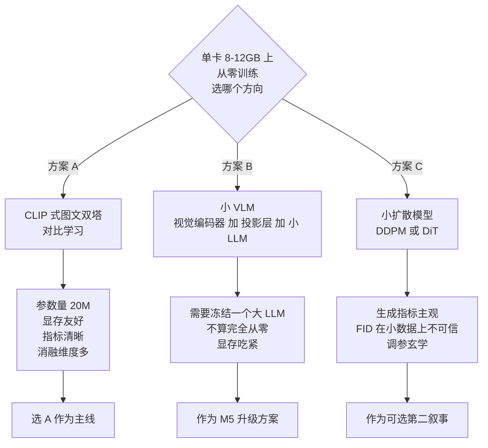
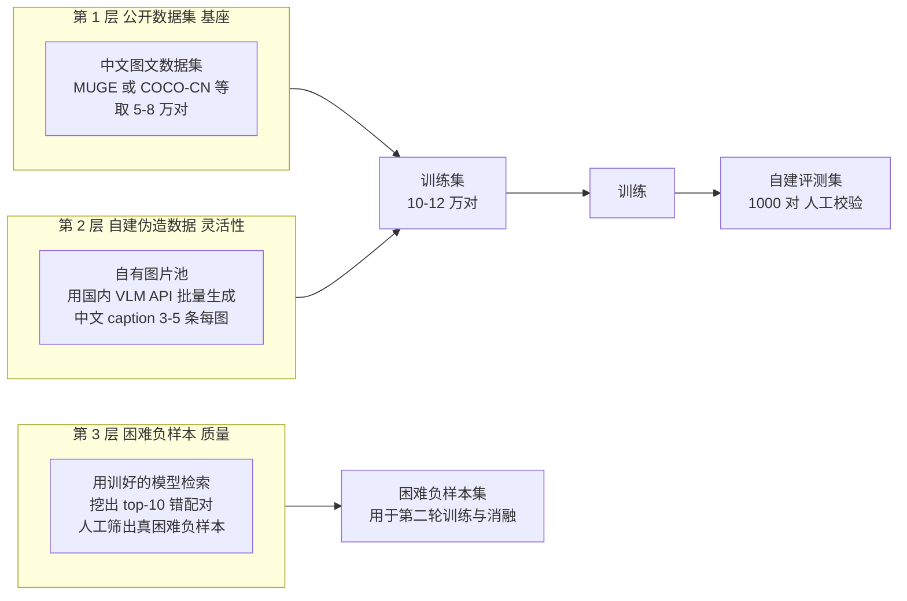
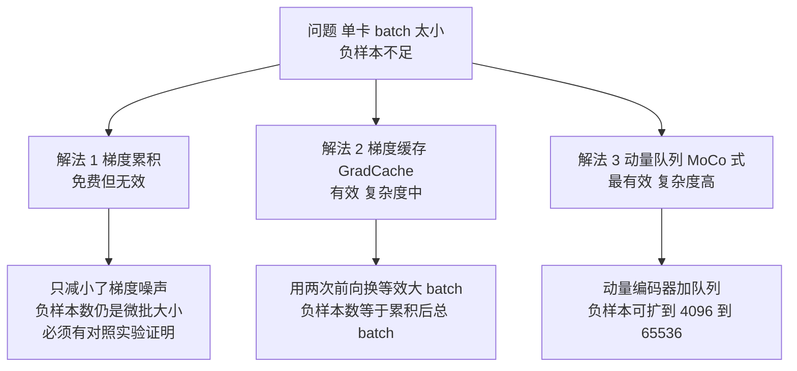
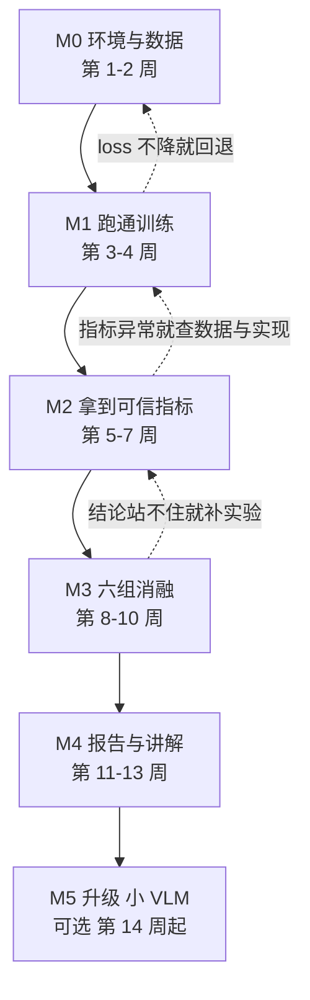

# 06 · 核心项目：多模态小模型从零训练

> **这是整个系列的核心章，也是简历上唯一那行会被追问 20 分钟的东西。**
> 它解决一个具体到荒谬的问题：**你只有一张 8-12GB 的消费级显卡，没有集群、没有论文、没有算法实习，凭什么让算法岗面试官相信你会训练模型？**
> 答案：**不做大，做完整。** 数据自己造、tokenizer 自己训、模型自己搭、损失自己写、评测自己设计、消融自己做、报告自己写。一个 2000 万参数、指标永远打不过 CLIP 的项目，只要闭环完整，就能承载 20 分钟的深挖；一个"调了开源脚本跑 7B 微调"的项目，撑不过 3 个追问。

## 本章学习目标

1. 在单卡 8-12GB 上**从零**（随机初始化，不是加载预训练权重）训出一个 CLIP 式图文双塔模型。
2. 完成一套自建的图文检索评测，拿到 i2t / t2i 的 R@1、R@5、Median Rank。
3. 做出 **6 组消融实验**，并能解释每一组的结论与原因。
4. 在单卡约束下解决**对比学习需要大 batch** 的核心矛盾（梯度累积 + 梯度缓存 + 动量队列）。
5. 产出可复现的仓库 + [第 08 章](./08-评测体系与技术报告)要求的技术报告。

## 前置依赖

| 依赖 | 章节 | 没有会怎样 |
|------|------|-----------|
| 能裸写训练脚本、算显存 | [03](./03-PyTorch与训练工程地基) | 写不出来，或一 OOM 就卡死 |
| 能手写 MHSA、懂 Transformer Block | [04](./04-Transformer与LLM原理手推) | 模型搭错也不知道错在哪 |
| 懂 CLIP / InfoNCE / 架构选型 | [05](./05-多模态原理与架构谱系) | 选不出方案，也讲不出理由 |
| 交叉熵梯度会手推 | [02](./02-数学地基最小集) | 讲不清损失为什么这么设计 |

> **不要跳过前置。** 本项目 80% 的卡点不在写代码，而在"不知道自己在写什么"。

---

## 一、项目选型：为什么是 CLIP 式双塔

### 1.1 三个候选方案的裁决



| 方案 | 单卡可行性 | 指标客观性 | 消融丰富度 | 面试含金量 | 结论 |
|------|-----------|-----------|-----------|-----------|------|
| **A. CLIP 式双塔（对比学习）** | ✅ 完全可行，20M 参数 | ✅ R@K 客观、可复现 | ✅✅ 极高（损失/温度/batch/负样本/编码器/数据） | ✅ 高，直接对口多模态理解岗 | **主线** |
| B. 小 VLM（视觉编码器 + 投影层 + 0.5B LLM） | ⚠️ 12GB 极限，且必须冻结 LLM，**不满足"从零训练"** | ✅ 可用 VQA/caption 指标 | ✅ 中 | ✅ 高，对口 VLM 岗 | **M5 升级** |
| C. 小扩散模型（DDPM/DiT） | ✅ 可行 | ⚠️ FID 在小数据上不可信，靠人工看图 | ✅ 中 | ✅ 对口生成岗 | **可选第二叙事** |

### 1.2 这个项目真正的卖点（写简历时按这个顺序排）

| 卖点 | 为什么面试官买账 | 对应交付 |
|------|----------------|---------|
| **从零训练（random init）** | 证明你不是"会调包"，而是懂训练全过程 | tokenizer / 模型 / 损失全是自己的 |
| **单卡约束下的系统级取舍** | 证明你会算账、能做工程权衡——这是算法岗最缺的能力 | 梯度缓存 + 动量队列 + 混合精度 |
| **完整评测闭环** | 证明你会做研究，而不只是会跑代码 | 自建评测集 + 6 组消融 + 失败分析 |
| **可复现** | 证明你的结果是可信的 | 固定 seed + config 快照 + 一键复现脚本 |

---

## 二、数据方案：零成本造 10 万中文图文对

**数据是这个项目里最容易被低估的部分，也是最能体现能力的地方。** 大多数人会直接下 COCO，然后全英文 caption——这在中文大模型岗面试里说服力会打折。

### 2.1 三层数据策略



### 2.2 各层具体做法

| 层 | 来源 | 规模 | 获取方式 | 成本 | 面试话术 |
|----|------|------|---------|------|---------|
| **L1 基座** | 公开中文图文数据集（如阿里天池 MUGE 电商图文、COCO-CN、Flickr30k-CN 等） | 5-8 万对 | 天池 / ModelScope / HuggingFace 下载 | ¥0 | "主数据集用公开中文图文对，保证可比性" |
| **L2 自建** | 自己收集的图片（如公开图库、业务可用的公开素材）+ 用国内 VLM API 生成中文描述 | 3-5 万对 | 写脚本并发调用 API，成本约 ¥0.001-0.01/图 | ¥50-300 | **"我自己构造了 5 万条中文图文对，用 VLM 生成多版 caption 并做了质量过滤"** |
| **L3 困难负样本** | 用第一版模型对全库做检索，取错配 top-10 | 1-2 万对 | 检索脚本 + 人工过一遍 top-3 | 时间成本 | "我用模型自身的检索失败案例挖困难负样本，这是数据飞轮的最小闭环" |

> **合规提醒**：只用公开数据集或明确可用的素材；**不要用京东内部数据**。这一点在面试里如果被问到，要能清楚说出数据来源与合规边界——这本身是加分项。

### 2.3 数据质量过滤清单（必须做，且要写进报告）

- [ ] **去重**：图片用感知哈希（pHash）去重，文本用 MinHash 或简单归一化后去重
- [ ] **图文相关性过滤**：用现成的开源 CLIP 算相似度，剔除低于阈值（如 top 5% 最低分）的弱相关对
- [ ] **文本质量过滤**：长度 5-40 字、剔除纯标点/纯数字/异常重复
- [ ] **中文质量过滤**：中文字符占比 > 70%
- [ ] **评测集隔离**：评测集图片必须与训练集图片**完全无交集**（按 URL/哈希双重检查）
- [ ] **污染检查**：评测集文本与训练集文本做近重复检测（n-gram 重叠 > 0.8 的剔除）

**这 6 条要在报告里各配一条数据**（过滤前/后条数、剔除比例）。面试官问"你怎么保证数据干净"，这就是答案。

### 2.4 分词器：自己训一个

**不要直接用 BERT 的中文 vocab。** 自己用 sentencepiece 训一个中文 BPE / unigram 词表：

| 参数 | 建议值 | 理由 |
|------|-------|------|
| vocab_size | 8000-12000 | 字符级中文用 8k 足够；太大则 embedding 占比过高 |
| model_type | `bpe` 或 `unigram` | unigram 对中文更好，bpe 更简单 |
| character_coverage | 0.9995 | 中文必须高覆盖，否则大量 UNK |
| 序列长度 | 32 | 检索任务的 caption 很短，32 足够 |

> **口述要点**："我自己训了分词器，因为这让我能控制词表大小与中文分词粒度。词表 8000 时 embedding 占模型参数约 15%，词表翻倍会让小模型的显存与训练成本明显上升——这是小模型设计里的一个真实权衡。"

---

## 三、模型架构：20M 参数的双塔

### 3.1 架构总览

```mermaid
flowchart LR
    subgraph VIS["视觉塔 ViT-Tiny 从零"
        I["图像 224x224x3"]
        P["Patchify<br/>16x16 切块<br/>196 个 patch"]
        VE["12 层 Transformer<br/>hidden 192 heads 3"]
        VP["CLS 池化"]
        VPROJ["线性投影<br/>192 到 256"]
        I --> P --> VE --> VP --> VPROJ
    end
    subgraph TXT["文本塔 从零"
        T["中文 caption<br/>最长 32 token"]
        TE["12 层 Transformer<br/>hidden 384 heads 6"]
        TP["EOS 池化"]
        TPROJ["线性投影<br/>384 到 256"]
        T --> TE --> TP --> TPROJ
    end
    VPROJ --> NORM["L2 归一化"]
    TPROJ --> NORM
    NORM --> SIM["相似度矩阵<br/>batch x batch"]
    SIM --> LOSS["对称 InfoNCE<br/>带可学习温度"]
```

### 3.2 参数与显存预算表（这张表要背下来）

| 组件 | 配置 | 参数量 | 备注 |
|------|------|--------|------|
| 视觉塔 ViT-Ti/16 | 12 层，hidden 192，heads 3，patch 16 | **≈5.7M** | 224×224 → 196 token |
| 文本塔 | 12 层，hidden 384，heads 6，max_len 32 | **≈14.6M** | 含 8000 词表 embedding ≈3.1M |
| 两个投影头 | 192→256、384→256 | ≈0.16M | 输出统一到 256 维 |
| 可学习温度 | 1 个标量 | 可忽略 | 初始化 0.07 的倒数 |
| **合计** | — | **≈20.5M** | — |

**训练显存预算**（fp16 混合精度，AdamW）：

| 项 | 公式 | 数值 |
|----|------|------|
| 参数（fp16 主副本 + fp32 主权重） | 20.5M × 2B + 20.5M × 4B | ≈123 MB |
| 梯度 | 20.5M × 2B | ≈41 MB |
| 优化器状态（AdamW 动量 + 方差，fp32） | 20.5M × 4B × 2 | ≈164 MB |
| **静态合计** | — | **≈328 MB** |
| 激活值（batch 256，含两次前向） | 随 batch × token 数 × 层数增长 | **≈3-6 GB** |
| 相似度矩阵 | batch² × 4B | 256² × 4B = 0.26 MB（可忽略） |
| **总计** | — | **≈4-7 GB** |

> **结论：12GB 单卡上 batch 256 绰绰有余，甚至能上 512。** 注意：**静态开销只占 1/20，显存被激活值主导**——这正是为什么"梯度检查点"和"减小 batch + 梯度累积"是有效手段，而"换更小的优化器"几乎没用。这个结论要在面试里主动讲出来，它证明你真的算过账。

### 3.3 训练超参表（起始配置）

| 超参 | 建议值 | 调参方向 |
|------|-------|---------|
| 优化器 | AdamW，betas=(0.9, 0.98)，eps=1e-8 | — |
| weight decay | 0.1（**不加在 LayerNorm 与 bias 上**） | 0.02-0.2 |
| 学习率 | 3e-4（从零训练） | 1e-4 - 1e-3 |
| lr 调度 | 前 500 步线性 warmup，之后 cosine 到 1e-5 | — |
| 微批 batch | 96-128（受显存） | — |
| 梯度累积步数 | 2-4 | 见第五节 |
| **有效 batch** | **384-512** | 越大越好（负样本越多） |
| 训练轮数 | 20-40 epoch（小数据集要多训） | — |
| 精度 | bf16（有 Ampere 及以上优先）/ fp16 + GradScaler | — |
| 梯度裁剪 | max_norm = 1.0 | — |
| 图像分辨率 | 224 | 后续可做 160 加速实验 |
| 温度 | 可学习，初始化 ln(1/0.07) | — |
| 随机种子 | 42 / 123 / 2026 三组 | 消融必须多 seed |

---

## 四、单卡的核心矛盾：对比学习要的是大 batch

**这是本项目的技术灵魂，也是面试最容易被深挖的点。**

### 4.1 矛盾在哪

CLIP 类模型的 InfoNCE 损失里，**负样本全部来自同一个 batch**：batch 内 N 个样本，每个样本有 N-1 个负样本。

| batch size | 每个样本的负样本数 | 效果 |
|-----------|-----------------|------|
| 64 | 63 | 太弱，表征质量差 |
| 256 | 255 | 勉强可用 |
| 1024 | 1023 | 论文级配置 |
| 32768 | 32767 | 原始 CLIP 配置 |

而你单卡 12GB 最多 batch 512。**直接训练的效果会明显差于论文——但这不是你的失败，而是你必须解释和解决的问题。** 解决它，就是你的技术亮点。

### 4.2 三种解法（按性价比排序）



#### 解法 1：梯度累积（先做，但要讲清它的局限）

梯度累积能**增大有效 batch、稳定梯度**，但**不增加负样本数**——因为每个微批内算的对比损失只看自己的 N 个样本。

> **这是一个绝佳的面试题**："梯度累积对大 batch 对比学习有用吗？"
> **标准答案**："有用但不完整。它降低了梯度估计的方差，让优化更稳定；但 InfoNCE 的负样本仍然局限在每个微批内，所以对比学习最看重的'负样本规模'没有被改善。要真正改善必须用 GradCache 或动量队列。"

**这个回答会让面试官立刻意识到你想过这件事。** 记得用消融实验证明：`batch 128 无累积` vs `batch 128 累积 4 次`，看指标差异。

#### 解法 2：GradCache（推荐，务必实现）

核心思想：**把大 batch 拆成微批分别前向，但损失在全局 batch 上计算，通过缓存每个微批对全局损失的梯度贡献来避免二次前向。**

| 步骤 | 做法 | 显存 |
|------|------|------|
| 1 | 微批前向，得到每个样本的 embedding，**不保留计算图** | 只存 embedding |
| 2 | 用全部微批的 embedding 拼出全局 batch，算全局 InfoNCE 损失 | batch² 矩阵（很小） |
| 3 | 求损失对**每个 embedding** 的梯度 | 存梯度，不存图 |
| 4 | 每个微批带梯度重新前向一次，反传出参数梯度 | 一次只占一个微批的激活 |

> **代价**：多一次前向（约 +30-50% 计算时间）。
> **收益**：**有效 batch 从 128 提到 1024，负样本数提升 8 倍。**
> **这就是"用计算换效果"的经典工程取舍**——而算这笔账恰恰是你最擅长的。

**消融实验必须有这一组**：`微批 128 + 累积 4` vs `微批 128 + GradCache 全局 512` vs `微批 512 直训`。第三组如果显存够就跑，作为上界参考。

#### 解法 3：动量队列（进阶，M3 之后做）

MoCo 式做法：维护一个 momentum encoder（用动量更新，不参与梯度回传）+ 一个负样本队列（如 4096 条历史 embedding）。

| 优点 | 缺点 |
|------|------|
| 负样本数可以极大（4096-65536） | 队列里的 embedding 是"旧模型"的，与当前模型不一致 |
| 几乎不增加显存（只存 embedding 向量） | 动量系数、队列长度需要调参 |
| 是解决小 batch 对比学习的标准方案 | 实现复杂度高，容易写错 |

> **面试话术**："我在 12GB 单卡上把有效 batch 做到了 512，但离 CLIP 论文的 32768 差两个数量级。所以我实现了 GradCache 把负样本数从 127 提到 511，又加了 4096 长度的动量队列。消融显示动量队列贡献了 +2.8 个点 R@1，但代价是训练时间增加 40%。**这个取舍的结论是：在单卡场景下，GradCache 的性价比高于动量队列。**"

**这就是"工程判断力"在算法面试里的样子。**

---

## 五、代码结构：当成生产项目来写

你是后端工程师，**写出结构清晰的仓库本身就是加分项**。不要写一个 2000 行的 `train.py`。

```text
mm-clip-mini/
├── README.md                    # 一页说清：做什么、怎么跑、结果多少
├── REPORT.md                    # 技术报告（见第 08 章）
├── requirements.txt
├── configs/
│   ├── base.yaml                # 主配置
│   ├── ablate_batch.yaml        # 消融：batch / 负样本
│   ├── ablate_temp.yaml         # 消融：温度
│   └── ablate_encoder.yaml      # 消融：编码器冻结 vs 从零
├── data/
│   ├── raw/                     # 原始数据（gitignore）
│   ├── processed/               # 预处理后的图文对索引
│   └── eval/                    # 评测集，独立目录
├── src/
│   ├── tokenizer/
│   │   └── train_spm.py         # 训练分词器
│   ├── data/
│   │   ├── build_dataset.py     # 数据构造与过滤
│   │   ├── dataset.py           # Dataset 与 collate_fn
│   │   └── hard_negative.py     # 困难负样本挖掘
│   ├── models/
│   │   ├── vision.py            # 视觉塔
│   │   ├── text.py              # 文本塔
│   │   └── clip.py              # 双塔组装
│   ├── losses/
│   │   ├── infonce.py           # 对称 InfoNCE
│   │   └── gradcache.py         # 梯度缓存
│   ├── train.py                 # 训练入口
│   ├── eval_retrieval.py        # 检索评测
│   └── utils/
│       ├── seed.py
│       ├── logging.py
│       └── checkpoint.py
├── scripts/
│   ├── 01_download_data.sh
│   ├── 02_train_tokenizer.sh
│   ├── 03_build_dataset.sh
│   ├── 04_train.sh
│   ├── 05_eval.sh
│   └── 06_ablation.sh           # 一键跑全部消融
└── outputs/
    ├── logs/
    ├── ckpt/
    └── eval/
```

### 关键实现点（写错就白训）

| 位置 | 易错点 | 正确做法 |
|------|-------|---------|
| `infonce.py` | 只算单向损失 | **必须对称**：`(loss_i2t + loss_t2i) / 2` |
| `infonce.py` | 用 `CrossEntropyLoss` 时忘了对角线是正样本 | 目标是 `arange(N)`，即第 i 行第 i 列 |
| 相似度计算 | 先算相似度再归一化 | **必须先 L2 归一化**，相似度即余弦 |
| 温度 | 直接存温度值 → 梯度不稳 | 存 `logit_scale`（温度的倒数取对数），用时 `exp` |
| `text.py` | 用 CLS 还是 EOS 池化不一致 | **统一用最后一个有效 token（EOS）**，与主流实现对齐 |
| padding | 用 0 填充但 mask 加到 attention 里 | 池化时必须用 `attention_mask` 取到真正的末位 token，不能用 `[-1]` |
| 分布式采样 | 用了 `DistributedSampler` 但忘了 `set_epoch` | 每轮必须 `sampler.set_epoch(epoch)`，否则每轮顺序相同 |
| 评测 | 在训练集上评测 | 评测集必须物理隔离，并做近重复检查 |

> **`padding` 那一行是最高频的实现 bug**：caption 长短不一，`hidden[:, -1]` 取到的往往是 padding 位。这个 bug 会让模型沉默地变差而不报错——**面试时讲这个 bug 的排查过程，比讲一百句"我做过 CLIP"都有用**。

---

## 六、四个里程碑：从跑通到能讲



### M0 里程碑：环境与数据（第 1-2 周）

| 交付物 | 验收标准 |
|--------|---------|
| 数据脚本 | `01_download_data.sh` + `03_build_dataset.sh` 能一键从零重建数据集 |
| 数据集 v1 | ≥5 万中文图文对，ppl/去重/过滤统计齐全 |
| 评测集 | 1000 对，与训练集零重叠（有脚本验证） |
| 分词器 | 8000 词表，中文覆盖率 > 99.9%，OOV 率 < 1% |
| 数据可视化 | 随机抽 20 对打印出来人工看一遍（**必须做**，能发现大量脏数据） |

### M1 里程碑：跑通训练（第 3-4 周）

| 交付物 | 验收标准 |
|--------|---------|
| 训练能跑 | 前 100 步 `loss` 从 ln(N) 附近平稳下降（N 为 batch 内样本数） |
| **Sanity check** | **过拟合 100 对样本**：训练 200 步后 i2t R@1 应接近 100%。**过不了就说明代码有 bug** |
| 显存可控 | 记录峰值显存，与第三节预算表对得上 |
| 断点续训 | 中断后 resume，loss 曲线连续 |

> **"先过拟合 100 条"是所有训练调试的第一原则。** 它能在 20 分钟内把数据错、标签错、池化错、损失写错全部暴露出来。这一步不做，后面调试会浪费几十小时。

### M2 里程碑：拿到可信指标（第 5-7 周）

| 交付物 | 验收标准 |
|--------|---------|
| 主结果 | i2t / t2i 的 R@1、R@5、R@10、Median Rank |
| Baseline 对照 | ① 随机初始化（不训练）② 只训视觉塔 ③ 只训文本塔 |
| 训练曲线 | loss、grad norm、lr、显存四张曲线，可解释 |
| 指标浮动 | 至少 2 个 seed 的结果，报告均值与标准差 |

**参考量级**（中文图文检索，10 万对，单卡从零训练——**具体数值以你实测为准**）：

| 配置 | i2t R@1 量级 | 说明 |
|------|-------------|------|
| 随机初始化 | ≈0.1% | 下界，证明评测脚本没坏 |
| batch 128 + 累积 | 十几到二十几个点 | 微批负样本不足 |
| batch 128 + GradCache 512 | 二十几到三十几个点 | 明显提升 |
| + 动量队列 + 困难负样本 | 三十几点以上 | 本项目目标区间 |
| （参考）预训练 CLIP 基线 | 60-80 点 | **你不是要打赢它**，报告里要明确写清"本模型为从零训练的 20M 小模型，与亿级数据预训练模型不可比" |

> **诚实边界**：报告里必须写明"本项目的对比对象是同规模从零训练的变体，不是开源预训练 CLIP"。**把不可比的东西放在一起比，是算法面试里最致命的减分项。**

### M3 里程碑：六组消融（第 8-10 周）

| # | 消融变量 | 对照组 | 预期结论 | 花多少时间 |
|---|---------|-------|---------|-----------|
| 1 | **负样本规模** | 微批累积 128 vs GradCache 512 vs 直训 512 | 负样本越多指标越高，验证 InfoNCE 的核心假设 | 2-3 天 |
| 2 | **温度系数** | 可学习 vs 固定 0.07 vs 固定 0.2 | 可学习温度通常更优；固定值过小会导致训练不稳 | 1-2 天 |
| 3 | **编码器初始化** | 双塔从零 vs 视觉塔冻结开源 CLIP vs 视觉塔从零文本塔冻结 | 冻结预训练视觉塔在小数据上更好（数据量不足时预训练权重的价值） | 2 天 |
| 4 | **数据规模** | 2 万 / 5 万 / 10 万对 | 画数据量-指标曲线，说明是否仍在欠拟合区间 | 3 天 |
| 5 | **图像分辨率** | 160 vs 224 | 分辨率提升指标但成本上升（token 数按平方增长） | 2 天 |
| 6 | **困难负样本** | 有无困难负样本的第二轮训练 | 数据质量 > 数据数量 | 2 天 |

> **消融优先级的判断原则**：先做"能验证原理"的（1、2），再做"能指导决策"的（3、4），最后做"锦上添花"的（5、6）。时间不够就砍 5、6，**但 1 和 2 不能砍**——它们是你理解对比学习深度的直接证据。

### M4 里程碑：报告与讲解（第 11-13 周）

| 交付物 | 验收标准 |
|--------|---------|
| 技术报告 | 按[第 08 章](./08-评测体系与技术报告)模板，含主结果表、消融表、失败分析、局限 |
| 一键复现 | 新机器上按 README 能跑出同样结果 |
| 90 秒讲解 | 脱稿，含架构、数据、关键取舍、指标、结论 |
| 3 分钟深挖 | 能接住 "为什么用 InfoNCE""负样本怎么解决""为什么指标这么低""过拟合了吗""重来你会改什么" |
| 简历三行 | 见[第 11 章](./11-2028届秋招规划与简历转化) |

### M5 里程碑（可选）：升级为小 VLM

做完 M4 后如果还有时间（**且秋招还没开始**），做这一步能把项目从"多模态理解"扩到"VLM"：

| 步骤 | 做法 | 成本 |
|------|------|------|
| 1 | 复用训好的视觉塔（这是你从零训的，比加载现成的更有底气） | ¥0 |
| 2 | 接一个 0.5B 级中文小 LLM（冻结，或只训 LoRA） | 需租卡 |
| 3 | 只训一个两层 MLP 投影层做对齐（LLaVA 式第一阶段） | 12GB 勉强够 |
| 4 | 用小规模图文指令数据做第二阶段 | 须租云卡 |
| 5 | 评测：caption 的 CIDEr / 自建 VQA 集准确率 / 人工 100 例评分 | — |

> **注意**：这一步**不再是"从零训练"**（LLM 是冻结的），所以简历上必须写清"视觉塔从零训练 + 投影层对齐"，**不能写成"我从零训练了一个 VLM"**。诚实边界见[第 11 章](./11-2028届秋招规划与简历转化)。

---

## 七、风险与止损点

| 风险 | 触发信号 | 止损动作 |
|------|---------|---------|
| 数据搞不到 | 第 2 周还没凑齐 5 万对 | **降级到 2 万对**也要开训；数据集小就多训几轮，报告里如实写 |
| 显存反复 OOM | 第 3 周仍跑不稳 | 微批降到 64 + 梯度累积 + 梯度检查点；**先跑通再优化** |
| loss 不降 | 第 4 周过拟合 100 条都失败 | 按[第 03 章](./03-PyTorch与训练工程地基)的排查清单走；**这是代码 bug，不是玄学** |
| 指标极低且无提升 | M2 阶段所有配置都在个位数 | 检查评测脚本（先用随机初始化验证下界）、检查池化与 mask、检查数据是否对齐 |
| 时间超支 | 到 2027-01 还在 M2 | **立即砍消融到 3 组**（1、2、4），把 M4 报告提前做出来 |
| 秋招开始了还没做完 | 2027-05 仍未完成 | 用现有结果收口：报告写"进行中的实验与初步结论"，**不要假造数据** |

> **最重要的止损原则：宁可项目小、完成度高，也不要项目大、烂尾。** 面试官问"你这个项目做了什么"，一个完整的小项目能讲 20 分钟；一个烂尾的大项目只能讲 2 分钟。

---

## 八、面试问答（12 题，带参考答案）

**Q1：你这个项目用了多少数据？为什么用这么少？**
A：训练集约 10 万中文图文对。单卡 12GB 的现实约束决定了模型只有 2000 万参数，而小模型在千万级数据上就会进入过拟合区间；我做了数据量消融（2 万/5 万/10 万），发现 5 万到 10 万的边际收益已经明显下降，说明当前模型容量是瓶颈，不是数据。所以我把剩下的精力放在负样本规模与困难样本挖掘上——这是小模型更有效的提升路径。

**Q2：为什么用 InfoNCE 而不是 MSE？**
A：MSE 是回归式目标，它把图文对齐当成"预测一个数值",而 InfoNCE 是判别式目标，它要求正样本的相似度高于所有负样本。后者更符合"从一批候选中选出正确的那一个"这个实际任务形式，也不需要假设相似度的绝对尺度。更本质地，InfoNCE 是互信息的变分下界，最大化它等价于最大化图文互信息。

**Q3：你单卡 batch 这么小，负样本够吗？**
A：不够，这是本项目最核心的技术问题。我做了三件事：① 梯度累积稳定梯度，但它不增加负样本，我做了对照实验证明这一点；② 实现 GradCache，把有效 batch 从 128 提到 512，负样本数提升 4 倍，这是性价比最高的手段；③ 加了 4096 长度的动量队列，但消融显示它带来的 +2.8 点 R@1 需要付出 40% 的额外训练时间，所以结论是单卡场景下 GradCache 优先级更高。

**Q4：梯度累积和 GradCache 到底差在哪？**
A：梯度累积把 loss 分别算在每个微批上再平均，所以每个样本的负样本只有同微批的那几十个；GradCache 是把微批只做前向得到 embedding，然后在全局 batch 上算一次 loss，再把 loss 对每个 embedding 的梯度回灌到各微批重做一次前向反传。所以 GradCache 的负样本数是全局 batch 大小，代价是多一次前向。

**Q5：为什么指标比 CLIP 低这么多？**
A：因为不可比。CLIP 用 4 亿图文对、数亿参数、上千卡训练；我是 10 万对、2000 万参数、单张消费级显卡。我在报告里明确写了对比对象是同规模的自身变体。我认为这个项目的价值不是复现 CLIP 的指标，而是完整走通"数据构造 → 模型实现 → 训练调优 → 评测消融"的闭环，并且量化和解决了单卡场景下的负样本瓶颈。

**Q6：怎么证明你的模型真的学到了对齐，而不是过拟合了？**
A：三个证据。① 评测集与训练集做了图片哈希去重和文本近重复检测，物理隔离；② 我在随机初始化的模型上跑同一个评测脚本，R@1 是 0.1% 量级，说明脚本能区分好坏；③ 我做了数据量消融，训练集越小、训练集与评测集的差距越大，符合过拟合预期；同时报告了两个 seed 的均值与标准差。

**Q7：你这个项目最难的地方是什么？**
A：是"小 batch 与对比学习目标的矛盾"。这个矛盾不是代码问题，是资源约束下的目标冲突，需要做工程取舍。我把它拆成了三档手段，量化了每一档的收益与代价，最后给出在单卡场景下的最优组合。这个思考过程比最后那个指标数字更重要——我觉得它也是我在工程侧的一个迁移优势。

**Q8：池化和文本编码你踩过什么坑？**
A：caption 长短不一，我一开始用 `hidden[:, -1]` 取末位 token，但短句被 padding 后取到的是 padding 位。这个 bug 不报错，loss 还能降，但指标会明显偏低。我是通过"过拟合 100 条样本失败"发现的——理论上 100 条样本应该能过拟合到接近 100%，结果只有 40% 多。后来改成用 `attention_mask` 求和定位真正的末位 token 就正常了。这件事之后我给自己定了一条规矩：任何模型改动，先跑过拟合小样本的 sanity check。

**Q9：如果给你一台 8 卡 A100，你会先做什么？**
A：先把 batch 直接提到 4096，验证负样本规模这条曲线的上界在哪，然后重跑全部消融——现在很多结论是"在 batch 512 下成立"，8 卡下可能不成立，尤其温度系数与学习率的最优值都会变。之后我会把视觉塔换成 ViT-Base，看模型容量与数据规模哪个是当前主瓶颈。这也是我在报告里写的"后续工作"。

**Q10：为什么视觉塔用 ViT-Tiny 而不是直接加载开源 CLIP 编码器？**
A：因为我这个项目的目标是"从零训练"，加载预训练权重会让"我是否真的懂训练"变得不可验证。但我把"冻结开源 CLIP 视觉塔"作为第 3 组消融的对照组，结果确实显示小数据下预训练权重更占优——这个结论本身就说明我理解预训练的价值与数据规模的权衡，而不只是固执地"自己造轮子"。

**Q11：训练过程中有没有出现 loss 突然掉的异常情况？**
A：有。前几轮 loss 平稳，在第 6 轮左右出现过一次陡降，我查了下是学习率 warmup 结束进入主学习率阶段。另外早期遇到过一次恒为 NaN，原因是 fp16 下 `logit_scale` 的指数溢出，换成 bf16 并给 logit_scale 加了上界约束后解决。这两件事我都记在实验日志里了。

**Q12：这个项目你花了多久？**
A：（如实回答）从环境准备到拿到第一版指标约 X 周，其中大概 Y% 的时间花在数据准备和调 bug 上，真正训练的时间不到总时间的十分之一——因为 2000 万参数在单卡上训一轮只要几十分钟。这也是我做完这个项目最大的认知变化：**在小模型场景下，瓶颈从来不是算力，是数据质量和代码正确性。**

---

## 九、自测清单

**M0 数据**
- [ ] 我的数据集 ≥5 万中文图文对，且能一键重建
- [ ] 我做了去重、相关性过滤、中文质量过滤，并记录了剔除比例
- [ ] 我的评测集与训练集零重叠，并有脚本验证
- [ ] 我人工看过 20 组随机样本并对脏数据做过标注

**M1 跑通**
- [ ] 训练 loss 能平稳下降，且我能解释初始 loss 的量级
- [ ] **我通过了"过拟合 100 条样本"的 sanity check**
- [ ] 我记录了峰值显存，并与我的预算表对得上
- [ ] 断点续训可用，loss 曲线连续

**M2 指标**
- [ ] 我测出了 i2t / t2i 的 R@1 / R@5 / R@10 / Median Rank
- [ ] 我有 3 个 baseline（随机初始化、只训单塔）做对照
- [ ] 我跑了 2 个以上 seed 并报告了均值与标准差
- [ ] 我知道自己的指标为什么低于开源模型，并能说清"不可比"的理由

**M3 消融**
- [ ] 我完成了负样本规模消融（累积 vs GradCache vs 直训）
- [ ] 我完成了温度系数消融
- [ ] 我完成了编码器初始化消融
- [ ] 每组消融我都能说出"结论 + 原因 + 代价"

**M4 交付**
- [ ] 我实现了 GradCache，并能讲清它为什么能扩大有效 batch
- [ ] 我有技术报告，含主结果表、消融表、失败分析、局限
- [ ] 新机器上按 README 能复现结果
- [ ] 我能在 90 秒内脱稿讲完，并接住 5 个追问
- [ ] 我的简历三行没有一句是编的

---

## 下一步

1. **读完本章立刻做**：在[第 12 章](./12-资源算力与弹性周计划)里确认数据来源与算力方案，把项目目录建起来。
2. **第 1 周结束前**：跑通 `torch.cuda.is_available()` 与一个最小训练脚本（见[第 03 章](./03-PyTorch与训练工程地基)）。
3. **第 4 周结束前**：完成 M1 的 sanity check——**这是全项目最重要的单点验证**。
4. **做完 M2 后**：进入[第 08 章](./08-评测体系与技术报告)，把指标变成可被追问的资产。
5. **同步进行**：读[第 09 章](./09-京东实习期的算法筹码经营)，让你的实习期产出与这个项目形成呼应。
