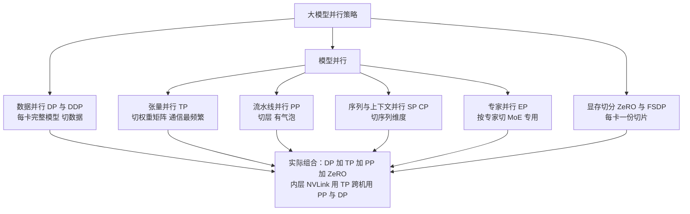
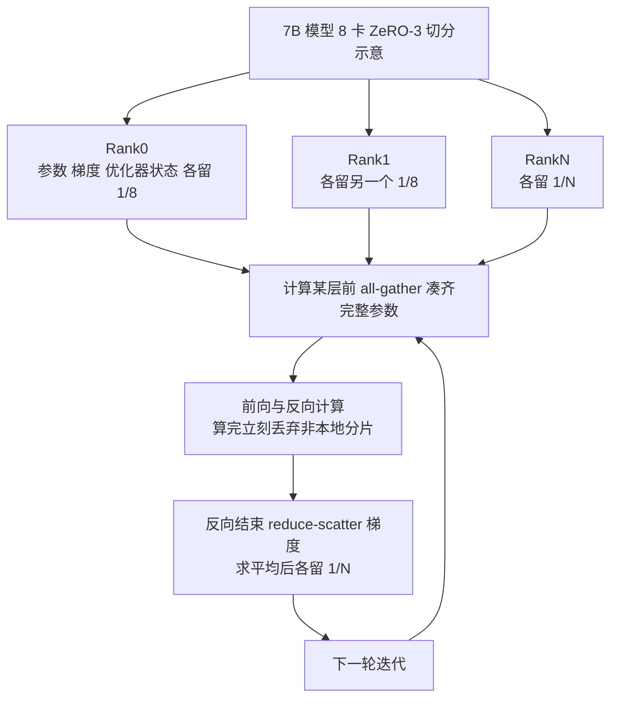
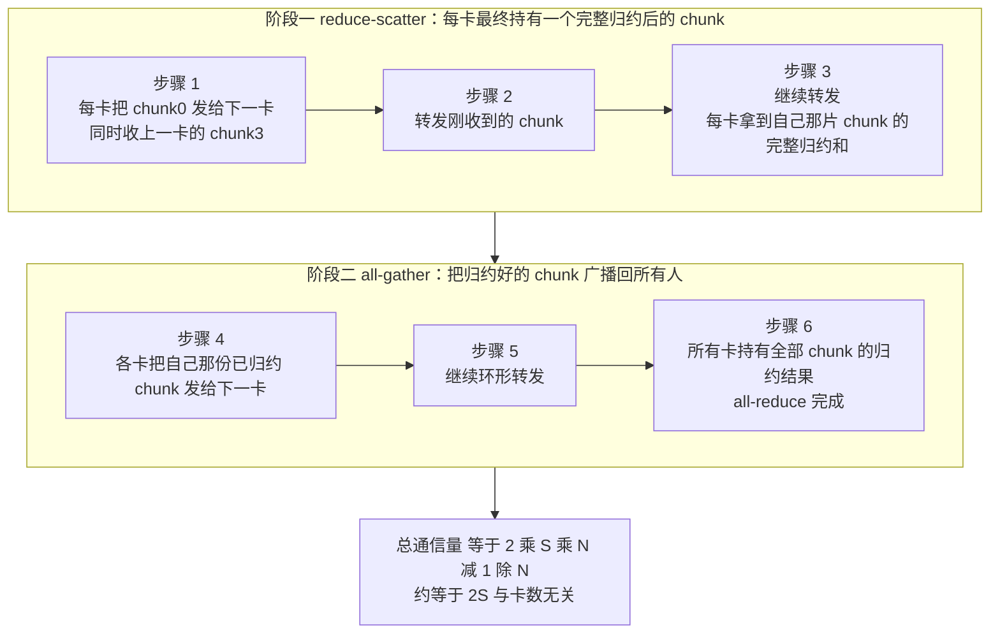
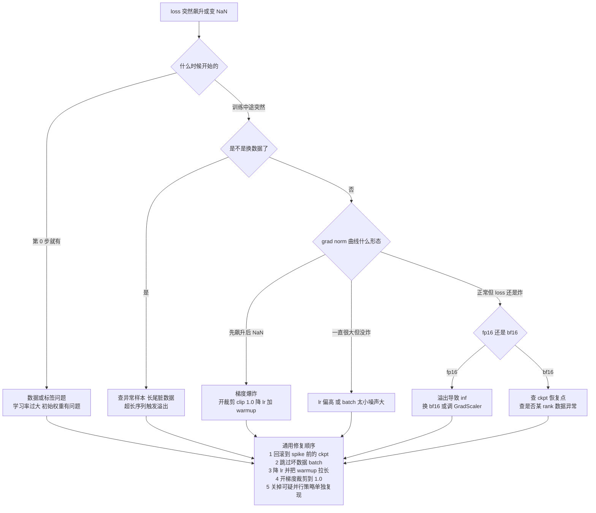
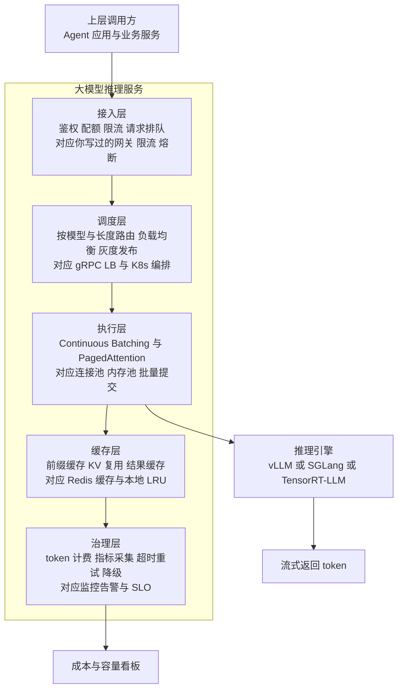

# 07 · 训练与推理工程进阶

> **本章定位：这是你唯一能对纯算法背景候选人形成降维打击的一章。**
>
> 算法岗候选人里，数学好、会训模型的一抓一大把；**懂分布式通信、懂吞吐与延迟的权衡、懂显存与带宽的关系、会做性能剖析、懂服务化部署的，极少**。而这五件事你全会——你系统练过 Kafka 削峰与可靠投递、Redis 高可用、MySQL 分库分表、etcd/Raft 选主、gRPC 负载均衡、限流熔断降级、pprof 火焰图定位、K8s 手写 Controller。
>
> **本章只做一件事：把你知道的那套分布式系统工程方法论，整体平移到 GPU 上。** 从"Go 服务的 QPS / 内存 / GC / 火焰图"，换成"GPU 的 TFLOPS / 显存 / 带宽 / profiler trace"。ring all-reduce 就是你已经熟透的分布式一致性消息模式；ZeRO 切优化器状态就是分库分表；梯度累积就是 Kafka 攒批再提交；CPU offload 就是冷热数据分层；推理 batching 与 PagedAttention 就是你写过的限流、连接池和内存池；`torch.profiler` 就是 pprof。
>
> **面试时把 GPU 训练讲成分布式系统工程问题，是你的独特优势。** 别人背"ZeRO-3 切参数"，你要能接着说"它把 all-reduce 变成 all-gather 加 reduce-scatter，通信量从 2S 涨到 3S，所以只在我算过账、确认带宽扛得住的时候才用"——这一句话的差距就是你和别人的差距。
>
> **为什么现在学**：本章属于第三阶段。你 2026-10-08 入职京东做 Agent 后端，2027 年春节前后转投大模型算法日常实习，2027 秋招冲 2028 届算法岗。本章必须在**投算法实习之前**落地，因为它是你面试的主火力，也是实习期做性能与架构类需求的直接武器。
>
> **前置**：[03 PyTorch 与训练工程地基](./03-PyTorch与训练工程地基) 让你会写训练循环，[04 Transformer与LLM原理手推](./04-Transformer与LLM原理手推) 让你知道层里在算什么。推理部分与 [../导师学习路径/08-JD专题-LLM推理优化](../导师学习路径/08-JD专题-LLM推理优化) 互补：**那里讲原理，这里讲怎么组装成一个服务**。

## 本章学习目标

1. **为什么单卡训不了大模型**——不是算力不够，是显存不够；能当场写出显存四份开销的公式并算例。
2. **五大并行策略各解决什么、代价是什么、什么规模才值得上**——能画全景图并说清组合逻辑。
3. **显存优化的六个手段**——每个都能给出"省了多少 / 代价是什么"的定量回答。
4. **从零租卡跑通一次真实多卡训练**——有命令清单、成本估算、省钱清单，2027 年初前至少做过一次。
5. **把大模型推理服务当成一道系统设计题来答**——这是你面试最容易出彩、也最像老本行的地方。

## 核心知识点提炼

| 知识点 | 一句话结论 | 面试高频度 |
|--------|-----------|-----------|
| 显存四份开销 | 参数 + 梯度 + 优化器状态 + 激活值；混合精度 Adam 每参数约 16 bytes | ⭐⭐⭐ |
| "训不了"的真相 | 7B 全量训练要 112GB 状态显存，不是 A100 算不动，是 80GB 装不下 | ⭐⭐⭐ |
| DDP | 每卡一份完整模型，反向算完做梯度 all-reduce，通信量约 2S 且与卡数无关 | ⭐⭐⭐ |
| 梯度分桶与重叠 | 算完一个 bucket 就通信一个，把通信藏在计算后面 | ⭐⭐⭐ |
| 张量并行 TP | 切权重矩阵，每层都要通信，必须放在 NVLink 同机内 | ⭐⭐⭐ |
| 流水线并行 PP | 切层，用 micro-batch 填流水线，气泡率 `(P-1)/(M+P-1)` | ⭐⭐ |
| 序列并行 SP / CP | 切序列维度，解决长序列激活值爆炸 | ⭐⭐ |
| 专家并行 EP | MoE 场景按专家切分，通信是 all-to-all | ⭐ |
| ZeRO-1/2/3 | 依次切优化器状态 / 梯度 / 参数；ZeRO-3 通信量涨到 3S | ⭐⭐⭐ |
| FSDP | ZeRO-3 的 PyTorch 原生版，按 module all-gather 再 reduce-scatter | ⭐⭐⭐ |
| 混合精度 | bf16 指数位 8 位与 fp32 相同，不需要 loss scaling，训练更安全 | ⭐⭐⭐ |
| 梯度检查点 | 用约 30% 额外计算换激活值显存，激活值降到 `O(√L)` | ⭐⭐⭐ |
| 梯度累积 | 小显存模拟大 batch，但 lr 缩放与 BatchNorm 要额外处理 | ⭐⭐⭐ |
| FlashAttention | 分块算 Attention，显存从 `O(n²)` 降到 `O(n)`，速度还更快 | ⭐⭐⭐ |
| ring all-reduce | reduce-scatter 加 all-gather 两阶段，通信量约 `2S×(N-1)/N` | ⭐⭐⭐ |
| 通信瓶颈判断 | 用"通信时间与计算时间的比值"定量定位瓶颈 | ⭐⭐⭐ |
| TTFT / TPOT | 首 token 延迟与单 token 延迟，是两个独立的优化目标 | ⭐⭐⭐ |
| Continuous Batching | 迭代级调度，完成立刻换新请求进来，吞吐提升 2-10 倍 | ⭐⭐⭐ |
| PagedAttention | KV Cache 分页管理，显存利用率从 40%-60% 提到 90%+ | ⭐⭐⭐ |
| 推理服务五层设计 | 接入 / 调度 / 执行 / 缓存 / 治理，这就是你的系统设计题 | ⭐⭐⭐ |
| torch.profiler | GPU 版 pprof，回答"时间花在哪个 kernel、卡间在等谁" | ⭐⭐⭐ |

## 知识点详解

### 1. 为什么需要并行：显存四份开销

训练时显存里躺着四样东西，缺一不可：

```text
训练显存 = 参数 + 梯度 + 优化器状态 + 激活值
```

- **参数**：模型权重本身。
- **梯度**：每个参数对应的梯度，反向传播时算出。
- **优化器状态**：Adam 要为每个参数存一阶动量 m 和二阶动量 v，**是参数数量的 2 倍**——最容易被忽略、也最贵的一份。
- **激活值**：前向传播每层的中间输出，反向求梯度时要用，必须留着。

关键点：**前三份只和参数量有关，与 batch size 无关；只有激活值随 batch × 序列长度增长。**

以主流**混合精度 Adam 训练**为例，每个参数的显存开销：

| 项目 | 精度 | 字节/参数 |
|------|------|----------|
| 参数 | bf16 | 2 |
| 梯度 | bf16 | 2 |
| 优化器状态 m 与 v | fp32 | 8 |
| fp32 master weights | fp32 | 4 |
| **合计** | | **16** |

```text
模型状态显存 ≈ 16 bytes × 参数量
激活值显存 ≈ 与 batch × seq_len × 层数 成正比，大 batch 长序列时可达数十 GB

1B 参数：  16 × 1e9  = 16 GB   → 消费级 24GB 卡勉强能跑
7B 参数：  16 × 7e9  = 112 GB  → 单张 A100 80GB 装不下
70B 参数： 16 × 70e9 = 1120 GB → 至少 16 张 80GB 卡做切分

你自己的卡：
  8GB：  留给模型状态约 6GB  → 上限约 375M 参数
  12GB： 留给模型状态约 9GB  → 上限约 560M 参数
```

**结论：单卡训不了大模型，不是因为算力不够，是因为显存不够。** 一块 A100 的算力足够在合理时间训 7B，但 80GB 装不下 7B 的训练状态。这个结论推出后面所有内容——并行的本质是**把显存开销切到多张卡上，顺便（而非主要）把算力摊开**。

> **类比**：就像线上单机 Redis 内存装不下热数据。你不会说"CPU 不够"，你会说"内存不够，得上集群加分片"。大模型并行是同一个判断。

### 2. 并行策略全景



#### 2.1 数据并行 DP / DDP

**解决什么**：单卡 batch 太小、训得太慢，想用多卡堆吞吐。**怎么做**：每卡放一份**完整模型副本**，把大 batch 平均切给各卡，各自独立前向反向算梯度，然后**同步梯度**求平均，保证各卡模型始终一致。

**通信量**：一次迭代约 `2S`（S 为梯度总字节数），**与卡数基本无关**（ring 下是 `2S×(N-1)/N`，N 越大越接近 2S）。这是 DDP 最漂亮的性质：加卡不显著增加通信量。

```text
7B 模型，bf16 梯度 S = 14 GB
ring all-reduce 通信量 ≈ 2 × 14 GB = 28 GB
PCIe Gen4 x16 有效带宽 20-25 GB/s → 约 1.2-1.4 秒
A100 NVLink 300+ GB/s              → 约 0.1-0.2 秒
```

**为什么 DDP 比 DP 快**：`DataParallel`（DP）是单进程多线程驱动多卡，受 **GIL 限制**，还要频繁 scatter 输入、gather 输出回主卡，主卡成为瓶颈且负载不均。`DistributedDataParallel`（DDP）是**一进程一卡**，绕开 GIL，核心两个优化：**梯度分桶**（按 25MB 分组，一个 bucket 内梯度齐了就立刻启动 all-reduce）+ **通信与计算重叠**（bucket 的通信走异步流，计算流继续算后面的层）。

> **类比**：这就是你写过的"异步刷盘 + 批量提交"。DDP 不做"全算完统一提交"，而是"算完一批提交一批，提交同时继续算"——和用 Kafka producer 的 `linger.ms` 配批量发送压 P99 是同一个工程直觉。

```python
import os, torch, torch.distributed as dist
from torch.nn.parallel import DistributedDataParallel as DDP
from torch.utils.data.distributed import DistributedSampler

def main():
    dist.init_process_group(backend="nccl")          # 一进程一卡
    local = int(os.environ["LOCAL_RANK"])
    torch.cuda.set_device(local)                     # 每进程绑定自己的卡
    model = DDP(MyModel().to(local), device_ids=[local])   # 自动做梯度 all-reduce

    sampler = DistributedSampler(MyDataset(), shuffle=True)  # 每卡只看自己那份
    dl = torch.utils.data.DataLoader(MyDataset(), batch_size=32, sampler=sampler,
                                     num_workers=8, pin_memory=True)
    for epoch in range(10):
        sampler.set_epoch(epoch)                     # 不写这句每 epoch 打乱结果一样
        for x, y in dl:
            x, y = x.to(local, non_blocking=True), y.to(local, non_blocking=True)
            loss = model(x, y)
            loss.backward()                          # 反向后梯度已自动 all-reduce
            optimizer.step(); optimizer.zero_grad(set_to_none=True)
    dist.destroy_process_group()
```

#### 2.2 张量并行 TP

**解决什么**：单层权重就大到一张卡放不下。**怎么做**：把权重矩阵本身切开，两个方向——**列并行**按输出维度切 W，每卡算一部分输出列，结果拼接即可（前向不需要通信）；**行并行**按输入维度切 W，每卡算一个部分和，需要一次 **all-reduce** 求和。

Transformer 一层里通常做"列并行 → 行并行"配对，于是**前向 1 次 all-reduce，反向 2 次**，通信量是 `batch × seq_len × hidden × 2 bytes` 量级，**层级、层内**——80 层的模型一轮迭代几百次集合通信。

**代价与门槛**：通信次数极多、单次数据量小 → **延迟敏感型**。所以 TP 必须放在 **NVLink 同机内**（同机 8 卡），跨 PCIe 或跨机做 TP 会把 GPU 利用率打到 20% 以下。实践中 TP ≤ 8，通常 2 或 4。

#### 2.3 流水线并行 PP

**解决什么**：模型深到单卡放不下若干层，且想跨机扩展（跨机带宽弱，适合传激活值这种小数据量）。**怎么做**：按层切成 P 段，每卡负责一段；把 batch 切成 M 个 **micro-batch**，像流水线一样依次流过各段。

```text
气泡率 ≈ (P - 1) / (M + P - 1)      ← 1F1B 调度下
P=4, M=4   → 3/7  ≈ 43%   ← 太亏
P=4, M=16  → 3/19 ≈ 16%
P=4, M=32  → 3/35 ≈ 9%
```

**micro-batch 越多气泡越小**，但 micro-batch 越小、矩阵乘尺寸越小、GPU 效率越低——显存、效率、气泡率的三方权衡。**1F1B 调度**让每卡交替执行一个 micro-batch 的前向与另一个的反向，把在飞的 micro-batch 压到 P 个，显存从 `O(M)` 降到 `O(P)`。

> **类比**：PP 就是流水线车间，气泡率就是你的**链路利用率**，M 就是**在途请求数**。Kafka 顺序消费的多阶段处理链路同样有"第一段打满、最后一段空转"的启动排空期。

#### 2.4 序列并行 / 上下文并行 SP / CP

**解决什么**：**长序列**。激活值显存与序列长度成正比甚至平方相关，`seq_len` 从 4K 拉到 128K 可以直接爆掉。**怎么做**：不切模型不切数据，**切序列维度**——把一条序列的 token 分段放到不同卡上，Attention 用 ring 方式两两交换 KV 块、逐轮累积注意力结果。

**代价**：Attention 通信量与序列分段数成正比，层数越多通信越多。**值得上的规模**：`seq_len ≥ 32K` 且激活值已成瓶颈时；普通 2K-4K 序列根本不需要。

#### 2.5 专家并行 EP

**解决什么**：MoE 总参数量巨大（几百 B）但每 token 只激活少数专家（如 top-2 of 64）。**EP 把不同专家放到不同卡**，天然契合稀疏性——总参数可远超单卡显存，计算量只与激活的专家数相关。**代价**：通信模式是 **all-to-all**（token 按路由结果发到目标专家所在卡，算完发回），对拓扑极度敏感，容易出现负载不均。**只有 MoE 才用**，Dense 模型用不到。

#### 2.6 组合逻辑与选择顺序

```text
同机 8 卡 NVLink 内  → TP = 8 或 4
跨机器              → PP 切层，DP 再往外扩
再叠加              → ZeRO-1 切优化器状态，几乎零额外通信成本
典型 70B 配置       → TP=8, PP=8, DP=8, ZeRO-1  → 共 512 卡
```

**选择顺序（可直接背）**：先用 ZeRO 把模型状态切到能放下 → 放不下就上 TP（同机内） → 还放不下上 PP（跨机） → 长序列再加 SP/CP → MoE 才用 EP。

### 3. ZeRO 三级与 FSDP

#### 3.1 在切什么

ZeRO 的思路极直白：**DDP 里每张卡都存了一份完整的参数、梯度、优化器状态，这是巨大冗余。把它们切开，每卡只存 1/N，需要时再临时凑齐。**

| 级别 | 切什么 | 每参数显存（N=8） | 通信量 | 类比 |
|------|--------|------------------|--------|------|
| DDP | 都不切 | 16 bytes | 2S | 每个节点都存一份全量数据 |
| ZeRO-1 | 只切优化器状态 | 2+2+12/8 = 5.5 | 2S 不变 | 只把最占空间的大表分片 |
| ZeRO-2 | 再切梯度 | 2+0.25+1.5 = 3.75 | 2S 不变 | 大表加索引一起分片 |
| ZeRO-3 | 再切参数 | 0.25+0.25+1.5 = 2.0 | 3S 涨 50% | 全量分片，跨分片查询 |

7B 模型 8 卡的对照：`DDP 112GB / ZeRO-1 约 39GB / ZeRO-2 约 26GB / ZeRO-3 约 14GB`（每卡模型状态）。

**最漂亮的一点：ZeRO-1 和 ZeRO-2 通信量不变。** 因为 ring all-reduce 本来就是"reduce-scatter + all-gather"两步，ZeRO 只是把中间结果留在本地不广播回去——**白赚的显存节省，没有任何通信代价**。这就是实践中几乎无脑开 ZeRO-1 的原因。

> **类比**：这就是**分库分表**。DDP = 每个从库都冗余全量；ZeRO-1 = 只把最大的表（优化器状态占 12/16 = 75%）分片，其他不动；ZeRO-2 = 大表加索引一起分片；ZeRO-3 = 完全分片，任何查询都要跨分片聚合（这就是 3S 的来源，也是你熟悉的"跨分片 join 变贵"）。面试时可以说："ZeRO-1 相当于只分片最大的那张表，查询路径没变，所以通信量不变；ZeRO-3 是完全分片，每次用都要跨分片取，通信量必然上涨。"——纯算法背景的人很难讲出这个视角。

#### 3.2 FSDP：ZeRO-3 的原生实现

FSDP 是 PyTorch 官方对 ZeRO-3 的实现，**以 module 为单位**分片——细粒度分片让通信更容易与计算重叠。一个 FSDP 单元的执行循环：

```text
1. all-gather：把本层完整参数临时凑齐到每张卡
2. 前向计算：用凑齐的参数算，算完立刻丢弃非本地分片
3. 反向前：再次 all-gather 本层参数
4. 反向计算：算梯度
5. reduce-scatter：梯度求平均并只保留本地分片
→ 每个参数一轮迭代被 all-gather 两次、梯度被 reduce-scatter 一次，通信量 3S
```

```python
from torch.distributed.fsdp import FullyShardedDataParallel as FSDP, ShardingStrategy
# FULL_SHARD 对应 ZeRO-3，SHARD_GRAD_OP 对应 ZeRO-2
model = FSDP(MyModel().cuda(), sharding_strategy=ShardingStrategy.FULL_SHARD,
             device_id=torch.cuda.current_device(), use_orig_params=True)
```



#### 3.3 多大模型用哪一级

| 模型规模 | 推荐方案 | 说明 |
|---------|---------|------|
| ≤ 0.5B | 不用 ZeRO，纯 DDP | 切分开销大于收益 |
| 1B - 3B | DDP + ZeRO-1 | 白赚显存，零通信代价 |
| 3B - 13B | ZeRO-2 | 梯度也切，通信仍不变 |
| 13B - 70B | ZeRO-3 / FSDP | 接受 3S 通信量 |
| > 70B 或长序列 | FSDP + TP + PP 组合 | 分层组合，不混用不同带宽的互联 |
| MoE | EP + FSDP | all-to-all 是主要矛盾 |

**一句话决策法**：先算 `16 bytes × 参数量`，若**小于单卡显存的 40%** 就直接 DDP；**能靠切优化器状态解决**就用 ZeRO-1；**切了还放不下**才动参数（ZeRO-3），因为动参数要付 50% 通信代价。

### 4. 显存优化的六个手段

#### 4.1 混合精度：fp16 vs bf16

**省多少**：参数与梯度从 fp32 的 4 bytes 降到 2 bytes，模型状态减半；tensor core 在 fp16/bf16 上算力是 fp32 的 4-8 倍。

| 格式 | 符号位 | 指数位 | 尾数位 | 训练友好度 |
|------|-------|-------|-------|-----------|
| fp32 | 1 | 8 | 23 | 基准 |
| fp16 | 1 | 5 | 10 | 动态范围窄，必须配 loss scaling |
| bf16 | 1 | **8** | 7 | 动态范围同 fp32，**不需要 loss scaling** |

**为什么 bf16 对训练更安全**：指数位决定**动态范围**，尾数位决定**精度**。bf16 保留了和 fp32 一样的 8 位指数，数值范围与 fp32 一致，梯度极小时不下溢、极大时不易上溢。代价是尾数只剩 7 位、精度较差，但训练对精度不敏感（随机梯度噪声远大于量化误差），所以 **训练用 bf16、推理量化用 fp8/int8** 是主流实践。**只要有 bf16（Ampere 及以上）就无脑用 bf16**，只有 V100 等老卡才用 fp16 + GradScaler。

```python
scaler = torch.cuda.amp.GradScaler(enabled=(dtype == torch.float16))  # fp16 才需要
with torch.autocast(device_type="cuda", dtype=torch.bfloat16):
    loss = model(x, y)
scaler.scale(loss).backward(); scaler.step(optimizer); scaler.update()
```

#### 4.2 梯度检查点

**省多少**：不保存每层激活值，只保存少数检查点层的激活值，反向时**重新计算**中间层前向。激活值显存从 `O(L)` 降到 `O(√L)`（经典实现）或 `O(1)`（整段重算）。**代价**：**多约 30% 计算量**（等于多做一遍前向），是"用算力换显存"最典型的手段。

```python
from torch.utils.checkpoint import checkpoint
out = checkpoint(self._block, x, use_reentrant=False) if self.training else self._block(x)
```

**什么时候用**：激活值是主要瓶颈时（大 batch、长序列）。**什么时候别用**：模型状态本身是瓶颈时——检查点省不了参数和优化器状态那 16 bytes/参数，这时该上 ZeRO。

#### 4.3 梯度累积

**省多少**：把 N 个 micro-batch 的梯度累加后再更新，**显存与单 micro-batch 相同，有效 batch size 变成 N 倍**。这是消费级单卡唯一能把 batch 做大的办法。**代价**：① 有效 batch 变大后**学习率要缩放**，线性规则 `lr_new = lr_base × (bs_new / bs_base)`，大 batch 初期不稳定需配几百到上千步 warmup，或改平方根缩放；② **BatchNorm 会失效**（累积梯度不等于累积统计量），所以大模型都用 LayerNorm/RMSNorm——这也解释了 Transformer 时代 BatchNorm 为什么消失。

```python
accum = 8                                  # 有效 batch = 32 × 8 × world_size
for i, (x, y) in enumerate(dl):
    with torch.autocast("cuda", dtype=torch.bfloat16):
        loss = model(x, y) / accum          # 先除，保证梯度是平均
    loss.backward()
    if (i + 1) % accum == 0:
        torch.nn.utils.clip_grad_norm_(model.parameters(), 1.0)   # 累积后再裁剪
        optimizer.step(); optimizer.zero_grad(set_to_none=True)
```

> **类比**：这就是 **Kafka 攒批再提交**。逐条提交吞吐低，攒 100 条提交一次吞吐高，但延迟变长、而且"提交时机"的语义变了——对应训练里就是"学习率缩放要重算"。你削峰填谷踩过的坑在这里原样复现。

#### 4.4 8-bit 优化器与 CPU offload

**8-bit 优化器（bitsandbytes）**：把 m、v 从 fp32 压到 int8，优化器状态从 12 bytes/参数降到约 6，总体从 16 降到约 10 bytes/参数，**省约 37%**（7B 上省约 42GB）。代价是轻微精度损失，实践中用 block-wise 量化（每 2048 个元素共享 scale）控制误差，收敛曲线基本一致。

```python
import bitsandbytes as bnb
optimizer = bnb.optim.Adam8bit(model.parameters(), lr=2e-4, min_8bit_size=4096)
```

**CPU offload（DeepSpeed ZeRO-Offload）**：把优化器状态与梯度搬到**主机内存**，GPU 每参数只需 2-4 bytes，7B 可在**单张 24GB 卡**上训（只要主机有 100GB+ 内存）。**代价**：**慢 1.5-3 倍**（优化器计算搬到 CPU，梯度经 PCIe 下去、参数经 PCIe 上来），PCIe 成为新瓶颈。

> **类比**：**冷热数据分层**。热数据（激活值、当前层参数）留显存，冷数据（优化器状态、master weights）下沉内存。和你在 Redis 做冷热分离、在 MySQL 做归档表是同一种权衡：**牺牲延迟换容量**，判断标准也一样——看访问频率和搬运成本。

#### 4.5 FlashAttention

**省多少**：标准 Attention 要显式构造 `n × n` 注意力矩阵，显存 `O(n²)`——`seq_len = 8K` 时单头单层就要 `8K × 8K × 2 bytes = 128MB`，乘上头数层数直接爆。FlashAttention 用**分块计算 + 在线 softmax**，从不把完整矩阵写回显存，显存降到 `O(n)`。**代价**：几乎没有，它是 **IO 感知**优化，反而更快（`n = 2K` 时通常快 2-4 倍），因为省掉大量显存读写。**训练和推理都默认应该用**（`F.scaled_dot_product_attention` 已内置）。

#### 4.6 汇总表与优化优先级

| 手段 | 省了什么 | 量级 | 代价 | 优先级 |
|------|---------|------|------|-------|
| 混合精度 bf16 | 参数 + 梯度显存 | 状态减半，算力 4-8 倍 | 几乎无 | ⭐ 第一优先 |
| 梯度检查点 | 激活值 | `O(L)` → `O(√L)` | 多约 30% 计算 | ⭐⭐ 激活瓶颈首选 |
| 梯度累积 | 不省显存，满足大 batch 诉求 | 有效 batch 乘 N | lr 缩放 + BatchNorm 失效 | ⭐⭐⭐ 必备 |
| 8-bit 优化器 | 优化器状态 | 16 → 10 bytes/参数 | 轻微精度损失 | ⭐⭐ 显存吃紧时 |
| CPU offload | 优化器状态搬出显存 | GPU 每参数 2-4 bytes | 慢 1.5-3 倍 | ⭐ 最后手段 |
| FlashAttention | Attention 中间矩阵 | `O(n²)` → `O(n)` | 无，还更快 | ⭐ 无脑开 |

**显存不够时的优化优先级顺序（面试高频）**：

```text
1. 开 bf16 混合精度          —— 免费，先做
2. batch 降到 1 并开梯度累积   —— 免费，先做
3. 开 FlashAttention         —— 免费，还变快
4. 开梯度检查点               —— 付 30% 计算
5. 上 ZeRO-1 然后 ZeRO-2      —— 通信量不变
6. 上 8-bit 优化器            —— 省 37% 状态显存
7. 降序列长度 或 上 SP/CP      —— 激活值瓶颈
8. 上 ZeRO-3 / FSDP          —— 付 50% 通信
9. CPU offload               —— 付 1.5-3 倍时间，最后手段
```

### 5. 通信原语速通

#### 5.1 六个原语的语义

| 原语 | 语义 | 一句话记忆 | 典型用途 |
|------|------|-----------|---------|
| broadcast | 一个 rank 发给所有人 | 一传多 | 初始化参数，广播超参 |
| reduce | 所有人数据归约到一个 rank | 多归一 | 汇聚统计量 |
| all-reduce | 归约后**所有人都有**结果 | 多归多 | **DDP 梯度同步** |
| all-gather | 各人分片拼起来，**所有人都有全量** | 拼齐全量 | FSDP 临时凑齐参数 |
| reduce-scatter | 归约后**各人只留一份分片** | 归约并分片 | FSDP 梯度落盘、ZeRO |
| all-to-all | 每个人给每个人发不同数据 | 全交换 | **MoE 的 EP** |

**最重要的一个关系：`ring all-reduce ≡ reduce-scatter + all-gather`。** 这是理解 ZeRO 通信量为何不变的钥匙——all-reduce 本来就在内部做了 reduce-scatter，ZeRO 只是"不再 gather 回来"。

#### 5.2 4 卡 ring all-reduce 分步



```text
ring all-reduce 总通信量 = 2 × S × (N-1)/N  bytes     S = 梯度字节数，N = 卡数
7B bf16 梯度 S = 14 GB
N = 8  → 2 × 14 × 7/8  = 24.5 GB
N = 64 → 2 × 14 × 63/64 = 27.6 GB      ← 只涨 12%
```

**这就是 DDP 可扩展性的来源：通信量对卡数几乎不敏感。**

#### 5.3 通信瓶颈判断

| 互联 | 典型带宽 | 何时用 |
|------|---------|-------|
| NVLink 同机 | 300-900 GB/s 聚合 | **TP 必须在同机内**（通信频繁、数据量小，只吃延迟） |
| PCIe Gen4 x16 | 实测 20-25 GB/s | DP 梯度的最低要求；单机 TP 走 PCIe 是灾难 |
| PCIe Gen5 x16 | 实测 45-55 GB/s | 新平台 |
| InfiniBand HDR / NDR | 25 / 50 GB/s | 跨机 DP、PP（跨机不要做 TP） |
| 以太网 100G | 约 12 GB/s | 小规模可接受，跨机 DP 会明显拖慢 |

```text
理论通信时间 = 通信量 / 有效带宽        有效带宽取标称的 60%-70%

7B, N=8, PCIe 有效 18GB/s：通信 24.5GB / 18GB/s ≈ 1.36 s
计算：迭代 FLOPs ≈ 6 × 参数量 × token 数
      batch_tokens = 8 卡 × 4 × 2048 = 65536
      = 6 × 7e9 × 65536 = 2.75e15 FLOPs
      8 卡有效 2400 TFLOPs/s → 约 1.15 s
→ 通信 1.36s > 计算 1.15s → 通信主导，加卡几乎不加速
```

**结论：通信时间 ≥ 计算时间时，加卡是负收益。** 这就是"数据并行到一定程度就不 scale 了"的定量答案。

#### 5.4 NCCL 环境变量与 hang 排查

```bash
export NCCL_DEBUG=INFO              # 排查时开，确认走 NVLink / PCIe / IB；日常设 WARN
export NCCL_SOCKET_IFNAME=eth0      # 明确指定网卡，避免选中 docker0 —— 最常见的跨机 hang 原因
export NCCL_IB_DISABLE=1            # 没有 InfiniBand 时禁用 IB，强制走 TCP/PCIe
export NCCL_P2P_DISABLE=1           # 单机 P2P 有问题时降级
export TORCH_NCCL_ASYNC_ERROR_HANDLING=1     # 某 rank 崩了不再全体静默挂死，直接报错
export TORCH_NCCL_HEARTBEAT_TIMEOUT_SEC=1800 # 看门狗超时
export TORCH_NCCL_BLOCKING_WAIT=1   # 让集合通信变同步阻塞，精确定位挂在哪行；仅 debug 用
```

| 现象 | 最可能原因 | 处理 |
|------|-----------|------|
| 单机能跑、多机挂 | 网卡选错 / 防火墙 / 端口不通 | `NCCL_SOCKET_IFNAME` + 打通 29500 |
| 训练中途全卡静默挂死 | 某 rank OOM 崩了，其余卡卡在 all-reduce | 开 `TORCH_NCCL_ASYNC_ERROR_HANDLING` |
| 初始化就挂 | 各卡可见 GPU 集合不一致 / `MASTER_ADDR` 错 | 检查 `CUDA_VISIBLE_DEVICES` 与 `--nproc_per_node` |
| 偶发挂死无报错 | 通信超时太短 | `init_process_group(timeout=timedelta(minutes=30))` |
| 某卡一直 100% 其余 0% | 数据加载不均 / PP 气泡 / rank 逻辑分叉 | 见第 9.4 节 8 个原因 |
| 显存慢慢涨到 OOM | 有 rank 的 loss 没参与 backward，参数没梯度 | DDP 下所有参数都必须参与前向 |

### 6. 租卡实操

#### 6.1 平台对比

价格是 2026 年量级，用于估算预算，实际以平台页面为准。汇率按 7.1 估。

| 平台 | 常用卡型 | 小时价区间 | 优势 | 注意 |
|------|---------|-----------|------|------|
| **AutoDL** | RTX 4090 24G | 1.5-2.5 元 | 最便宜、中文、镜像多、有无卡模式 | 单机多卡选择少 |
| AutoDL | A100 40G / 80G | 5-8 / 8-12 元 | 学生认证有折扣 | 数据盘另计费 |
| 阿里云 PAI-DSW | A100 80G | 15-25 元 | 企业级、生态全 | 贵，适合正式实验 |
| 腾讯云 GN 系列 | V100 / A100 | 10-30 元 | 有竞价实例 | 竞价可能被回收 |
| **RunPod** | 4090 / A100 80G / H100 | $0.4-0.7 / $1.6-2.2 / $2.5-3.5 | 按秒计费、多卡方便 | 需信用卡，国内访问偏慢 |
| Lambda Labs | A100 80G / H100 | $1.3-2.0 / $2.5-3.3 | 稳定、多卡集群好 | 需排队、要信用卡 |

**选型建议**：日常练习用 **AutoDL 4090**（便宜、有无卡模式改代码）；跑真实多卡实验优先 **RunPod 多卡 4090**（2×4090 约 $1.0/h ≈ 7 元/h，PCIe 通信弱但足够跑通 DDP）；需要真实 NVLink 时再上 **A100 8 卡实例**（约 60-100 元/h，跑 2-3 小时验证即可）。

#### 6.2 从零到跑通多卡训练：完整命令清单

```bash
# ── 第 0 步：本地写好脚本再上传，不要在租的机器上在线调试 ──
# project/{train.py, requirements.txt, run.sh, data/}

# ── 第 1 步：控制台租实例 ──
# 1. 选卡：先选 1 张 4090 做 debug
# 2. 镜像：PyTorch 2.x + CUDA 12.x + Python 3.10（自带 torch 与 nccl）
# 3. 数据盘：挂 50GB，checkpoint 与数据集都放这里
#    ← 数据盘关机后仍然计费，不用了要删除

# ── 第 2 步：进实例确认底座 ──
nvidia-smi
python -c "import torch; print(torch.__version__, torch.version.cuda, torch.cuda.device_count())"
pip install -i https://pypi.tuna.tsinghua.edu.cn/simple \
    transformers datasets accelerate deepspeed bitsandbytes nvitop
python -c "import torch.distributed as d; print(d.is_nccl_available())"
nvidia-smi topo -m            # 看卡间是 NVLink 还是 PCIe，决定能不能上 TP

# ── 第 3 步：数据准备 ──
# 方式一：ModelScope（国内快）
pip install modelscope
python -c "from modelscope import snapshot_download; snapshot_download('Qwen/Qwen2.5-0.5B', cache_dir='/root/autodl-tmp/models')"
# 方式二：HuggingFace 走国内镜像
export HF_ENDPOINT=https://hf-mirror.com
huggingface-cli download --resume-download --local-dir /root/autodl-tmp/data tatsu-lab/alpaca
# 方式三：本地打包上传（小数据最省事）
# 本地执行：scp -P 端口 -r ./data root@region.autodl.com:/root/autodl-tmp/

# ── 第 4 步：先单卡跑通，再上多卡 ──
python train.py --model Qwen/Qwen2.5-0.5B --max_steps 20 --batch_size 2 --bf16
torchrun --nproc_per_node=2 --master_port=29500 train.py \
    --model Qwen/Qwen2.5-0.5B --max_steps 100 --batch_size 2 --bf16 \
    --grad_accum 4 --grad_checkpoint
NCCL_DEBUG=INFO torchrun --nproc_per_node=2 train.py ... 2>&1 | grep -i "nvlink\|via P2P\|via NET"

# ── 第 5 步：监控（tmux 让进程和日志都活着）──
tmux new -s train            # Ctrl+B 再按 D 脱离；tmux attach -t train 回来
nvitop -m                    # 另一个终端看利用率、显存、进程
torchrun --nproc_per_node=2 train.py ... 2>&1 | tee train.log
nohup torchrun --nproc_per_node=2 train.py ... > train.log 2>&1 &   # 长跑用这个
tail -f train.log

# ── 第 6 步：回传结果 ──
# 脚本里定期存到数据盘：torch.save({...}, "/root/autodl-tmp/ckpt/step_{step}.pt")
huggingface-cli upload my-user/my-run /root/autodl-tmp/ckpt --repo-type model
# 或直接从平台面板下载；本地：scp -P 端口 -r root@region.autodl.com:/root/autodl-tmp/ckpt ./

# ── 第 7 步：关机 —— 最容易亏钱的一步 ──
ps aux | grep -E "python|torchrun"     # 确认没有后台进程还在跑
# 平台面板关机，并在账单页确认状态是"已关机"（不是"运行中"）
# 不打算再用了 → 释放实例 + 删除数据盘（关机后仍按 GB 计费）
```

#### 6.3 租卡省钱清单

1. **先单卡小规模 debug 再上多卡。** 90% 的 bug（显存、shape、路径、依赖）单卡就能暴露，用 2 元/h 的卡改完再上 10 元/h 的。
2. **用"无卡模式"改代码。** AutoDL 无卡模式约 0.1 元/h 就能进容器改脚本、装环境、下数据。
3. **提前写好脚本，不要在线调试。** 在 GPU 小时内敲代码等于用最贵的 IDE 写代码。
4. **用 tmux 或 nohup，别用前台。** SSH 一断训练就没了，重跑一次就是几十块钱。
5. **先跑 `--max_steps 20` 的 smoke test**，确认能跑通、能存 ckpt、loss 在降，再放开跑全量。
6. **注意关机不彻底还在计费**：确认进程真停了、平台显示"已关机"、数据盘删掉了。
7. **数据提前下好放数据盘**，训练时不要边下边训——数据加载瓶颈会让 GPU 利用率掉到 10%，等于烧钱空转。
8. **checkpoint 放数据盘不放系统盘**（系统盘空间小且可能被清理）。
9. **加自动关机兜底**：脚本里判断跑满 N 小时就 `shutdown`，防止忘关过夜。
10. **记录每次实验的"卡时成本"**：这次 2×A100 跑 6 小时 = 约 120 元，换来什么结论？面试时这是极强的成本意识证据。

#### 6.4 一次典型实验的成本估算

```text
目标：2×A100 80G 跑 8 小时的对比实验（有/无梯度检查点的吞吐与显存）
AutoDL A100 80G  10 元/小时/卡 × 2 卡 × 8 小时 = 160 元
RunPod A100 80G  $1.9/小时/卡 × 2 卡 × 8 小时 = $30.4 ≈ 216 元
AutoDL 2×4090    2 元/小时/卡 × 2 卡 × 8 小时 = 32 元   ← 便宜 5 倍

结论：验证"流程是否正确"用 4090；只有需要 80GB 显存放更大模型、
      或需要真实 NVLink 验证 TP 性能时，才值得上 A100。

预算分配建议（总计 1000-2000 元）：
  400 元 → 4-5 次 4090 单卡/双卡练习，每次 4-8 小时，把脚本调稳
  400 元 → 2 次 A100 8 卡实例，每次 2-3 小时，跑真实 TP+DP 组合
  300 元 → 1 次较大规模对比实验，产出可写进简历的数据
  200 元 → 备用（重跑、调参、意外超时）
```

### 7. 训练稳定性与故障处理

#### 7.1 分布式系统故障 vs 大模型训练故障

**这张表是本章最值钱的东西之一**：把两套完全不同的名词，映射到你已经内化的同一套故障处理方法论上。

| 分布式系统故障 | 大模型训练对应现象 | 共同的方法论 |
|--------------|-----------------|-------------|
| 服务 P99 尖刺、雪崩 | **loss spike** | 先看是否单点引起连锁反应；隔离变量、二分定位 |
| 内存泄漏、OOM Kill | **CUDA OOM** | 算容量水位、看增长趋势、定位分配点 |
| 线程池打满、请求堆积 | **dataloader 跟不上，GPU 空转** | 先加观测再优化，扩容消费者 |
| 脑裂、节点失联 | **NCCL timeout、rank 挂死** | 心跳 + 超时 + 让失败显式暴露 |
| 主从延迟、数据不一致 | **各 rank 梯度不同步** | 检查"同步点"是否真的同步 |
| GC 停顿 | **集合通信阻塞主路径** | 把同步移出关键路径（对应 DDP 重叠） |
| 限流触发、请求被拒 | **梯度裁剪 clip_grad_norm** | 主动熔断保护，防雪崩 |
| 幂等与重试 | **checkpoint 断点续训** | 状态可持久化 + 从任意点恢复 |
| 灰度发布与回滚 | **保存多个 ckpt，能回退到 spike 前** | 必须有回滚能力 |
| 熔断降级 | **跳过坏 batch / 降 lr / 重启** | 牺牲局部保整体 |
| 全链路追踪 | **torch.profiler trace** | 定位"时间花在哪、在等谁" |

> **面试话术**："我把大模型训练当成一个分布式系统来运维。loss spike 像线上 P99 尖刺，我先看是不是某个 rank 或某个 batch 引入的；NCCL hang 像脑裂，我用心跳超时让失败显式暴露；checkpoint 像幂等重试的基础设施，让我能从任意点恢复。"——这段话一出，你和只会调 lr 的候选人已经不在一个层级。

#### 7.2 loss spike 的排查



**必看的四条曲线**：`loss`、`grad_norm`、`lr`、`吞吐`。**grad norm 是训练的"错误率监控"**——正常应稳定在某个量级小幅波动，突然飙到 10 倍以上就是爆炸前兆，立刻裁剪（`clip_grad_norm_(params, 1.0)`，1.0 是主流默认值）。**梯度消失**则看各层 grad norm 是否随层数指数衰减（靠近输入的层远小于靠近输出的层），对应解法是残差连接、LayerNorm 位置、合适的初始化。

```text
loss spike 五步 SOP：
1. 止损：立刻回滚到 spike 之前的 checkpoint，而不是硬扛或重头来
2. 隔离：固定随机种子重跑，判断是数据问题还是优化问题
3. 定位：若是某几个 step 触发，捞那批数据看——通常是超长序列、乱码、标签错
4. 修复：跳过坏数据 / 降 lr / 加 warmup / 开裁剪到 1.0
5. 防护：加异常 batch 自动检测跳过 + loss 与 grad norm 告警，让它不再发生
```

#### 7.3 bf16 溢出与数值稳定性

```python
print(next(model.parameters()).dtype)      # 排查一：确认 dtype 是 torch.bfloat16
with torch.autograd.set_detect_anomaly(True):   # 排查二：定位第一个产生 nan 的反向节点（慢，仅 debug）
    loss = model(x, y); loss.backward()
# 排查三：softmax 与 layernorm 用 fp32 算，避免中间溢出；F.scaled_dot_product_attention 已内置保护
# 常见真凶：学习率过大、分母为零、log 负数、梯度爆炸到 inf
```

**bf16 与 fp16 溢出的本质区别**：bf16 指数位和 fp32 一样，**几乎不会因为"数值太大装不下"而溢出**，它的问题是尾数只有 7 位、精度低，连续累加大量小数时丢有效位；所以 bf16 下的 nan 通常来自**真实的数学错误**而非格式本身。fp16 相反，动态范围窄，梯度小到 `1e-8` 就下溢成 0、大到 `65504` 就溢出，所以才需要 GradScaler 把 loss 放大。

#### 7.4 NCCL timeout、掉卡与 checkpoint 恢复

```python
from datetime import timedelta
dist.init_process_group(backend="nccl", timeout=timedelta(minutes=30))  # 别用默认 10 分钟
```

**掉卡 / 硬件问题**（多卡实例上单卡 ECC 错误或散热问题会导致进程被 kill）：

```bash
nvidia-smi -q | grep -i "ecc\|retired\|throttle"          # 硬件错误与降频
dmesg | grep -i "xid\|nvrm"                               # XID 错误码，驱动层报错
nvidia-smi --query-gpu=index,temperature.gpu,clocks_throttle_reasons.active --format=csv
```

```python
CKPT = "/root/autodl-tmp/ckpt/latest.pt"

def save_ckpt(path, model, optimizer, step, epoch):
    if dist.get_rank() == 0:                       # 只在 rank 0 存，避免多卡同时写同一文件
        tmp = path + ".tmp"
        torch.save({"model": model.state_dict(), "optimizer": optimizer.state_dict(),
                    "step": step, "epoch": epoch, "rng": torch.get_rng_state()}, tmp)
        os.replace(tmp, path)                      # 原子写：先写 tmp 再 rename

def load_ckpt(path, model, optimizer):
    if not os.path.exists(path):
        return 0, 0
    ckpt = torch.load(path, map_location="cpu")
    model.load_state_dict(ckpt["model"]); optimizer.load_state_dict(ckpt["optimizer"])
    torch.set_rng_state(ckpt["rng"])
    return ckpt["step"], ckpt["epoch"]
```

**恢复时的三个坑**：① **数据 sampler 的 epoch 必须对齐**，否则重复训练或漏数据（`sampler.set_epoch(epoch)`）；② **随机种子要恢复**，否则 dropout 与数据顺序变了，曲线出现台阶；③ **checkpoint 写要原子化**（先写 tmp 再 rename），否则写一半崩了文件损坏，几百块钱的实验成果报废——这就是你熟悉的**写日志先写 tmp 再 rename**。

### 8. 推理侧工程：把它当一道系统设计题

> 本节与 [../导师学习路径/08-JD专题-LLM推理优化](../导师学习路径/08-JD专题-LLM推理优化) 互补：**那里讲原理**（KV Cache 为何存在、PagedAttention 怎么分页、量化怎么省显存），**这里讲怎么把它们组装成一个服务**。请先读那一章。

#### 8.1 吞吐 vs 延迟：两个独立目标

| 指标 | 含义 | 谁在乎 |
|------|------|-------|
| **TTFT** | Time To First Token，从发请求到收到第一个 token | 用户感知的"响应快不快" |
| **TPOT** | Time Per Output Token，之后每 token 的平均耗时 | 用户感知的"打字流不流畅" |
| **吞吐** | 单位时间全系统产出的 token 数 | 老板和账单在乎 |

**核心权衡：吞吐和延迟是敌人。** batch 开大 → 吞吐上去、单请求延迟变差。所以推理服务的核心工程问题是：**在满足 P99 延迟 SLA 的前提下把吞吐做到最大**。这句话你太熟了——就是你在网关做过的"在 P99 达标前提下把 QPS 顶到最高"，**"并发度 vs 延迟"曲线的拐点、以及过了拐点加并发只会让所有人变慢，你在压测里见过无数次。**

```text
TTFT 由 Prefill 决定 → Prefill 是算力瓶颈 → 优化：并行、算子融合、前缀缓存
TPOT 由 Decode 决定  → Decode 是访存瓶颈 → 优化：量化、batching、投机解码
两个阶段瓶颈不同，优化手段完全不同，必须分开看
```

#### 8.2 静态 batching vs continuous batching

| 维度 | 静态 batching | Continuous Batching |
|------|--------------|-------------------|
| 调度粒度 | 请求级：凑够一批一起跑完 | **迭代级**：每个 decode 步都能进出 |
| 短请求 | 要等最长的那个跑完才能释放 | 一完成立刻释放，立刻插入新请求 |
| GPU 空转 | 严重（长尾请求拖死整批） | 极少 |
| 吞吐 | 基准 | **提升 2-10 倍**，实测常见 2-5 倍 |
| 实现复杂度 | 低 | 高（要配合 PagedAttention 管理不规则显存） |

> **类比**：静态 batching = 固定线程池 + 一次提交一批任务，**一批里有一个慢任务全部线程都空等**（像 `invokeAll` 等整批返回）。Continuous Batching = **工作窃取 + 迭代级调度**，谁先干完谁立刻领新任务，绝不让 worker 空转。

#### 8.3 把推理服务画成一道系统设计题

**这道题面试大概率会遇到**（例如"设计一个支撑内部 Agent 平台的大模型推理服务"）。用五层来答，每层都对应一个你写过的后端组件。



每一层要能展开讲：

- **接入层**：按应用配额、令牌桶限流、超长请求拦截、排队与 429。参照 [../架构师修炼/12-限流熔断降级与背压](../架构师修炼/12-限流熔断降级与背压)。
- **调度层**：按模型名路由到副本池；按 prompt 长度做亲和调度（长请求不要和短请求混在同一 batch，避免互相拖累）；版本灰度与热切换。
- **执行层**：Continuous Batching + PagedAttention + 权重量化 + 投机解码。要能说清**哪些参数对应哪个权衡**（`max_num_seqs`、`gpu_memory_utilization`、`max_model_len`）。
- **缓存层**：**前缀缓存是收益最高的一层**——Agent 场景下 system prompt 与工具定义往往几 K token 且完全重复，命中缓存能让 TTFT 降数倍。
- **治理层**：token 计费（成本可观测）、TTFT/TPOT/吞吐指标、超时重试、过载降级（降 `max_tokens` 或切小模型）。

**一句话总结这道题**："推理服务的本质是**在延迟 SLA 约束下最大化 GPU 利用率**：接入层挡掉坏流量、调度层减少排队、执行层提批处理效率、缓存层减少重复计算、治理层让成本与容量可见。"骨架一次交付。

#### 8.4 量化路线

| 方案 | 类型 | 显存 | 精度损失 | 加速来源 | 适用 |
|------|------|------|---------|---------|------|
| FP16 / BF16 | 基准 | 2 bytes/参数 | — | — | 基线 |
| FP8 | 训练与推理均可 | 1 byte | 极小 | tensor core 原生支持 | H100 及以上 |
| INT8 PTQ | 训练后量化 | 1 byte | 小 | 访存减半 | 通用，成熟 |
| **AWQ** | 训练后量化 | 0.5 byte | 小 | 4 倍访存减少 | 指令模型效果好，当下推荐 |
| **GPTQ** | 训练后量化 | 0.5 byte | 中 | 4 倍访存减少 | 单卡部署主流 |
| bitsandbytes 4bit | NF4，训练后量化 | 0.5 byte | 中 | 主要配 QLoRA 训练 | 微调场景，推理慢 |
| QAT | 量化感知训练 | 任意 | 最小 | 同 PTQ | 有训练预算、追求极致精度 |

```text
70B 模型权重显存：
  FP16 = 140 GB → 需要 2×80GB 卡
  INT8 =  70 GB → 1 张 80GB 卡刚好
  INT4 =  35 GB → 1 张 48GB 卡即可
  INT4 + 4K 上下文 KV Cache ≈ 35 + 5 = 40 GB → 1 张 A100 80G 留足余量
```

**关键判断（面试加分）**：**量化加速的本质是减少显存带宽压力，不是减少计算量。** Decode 阶段是带宽 bound，所以权重量化能带来 1.5-3 倍吞吐提升；Prefill 阶段是算力 bound，量化加速有限。**"量化帮助最大的是 decode 阶段"这句话说出来，说明你真懂瓶颈在哪。**

#### 8.5 投机解码、KV 复用与引擎选型

- **投机解码**：小模型 draft 一次猜 k 个 token，大模型 target 一次并行验证，接受最长的正确前缀。**质量完全不变**（每个被接受的 token 都是大模型自己算的），速度 2-3 倍；但会挤占 batch 空间，高并发下反而降吞吐，适合延迟敏感、并发低的场景。
- **前缀缓存与 KV 复用**：相同前缀只算一次。Agent 场景收益巨大——system prompt、工具 schema、few-shot 示例在所有请求里都一样；多轮对话里整个历史都是前缀，每轮都能复用。vLLM 的 `--enable-prefix-caching`、SGLang 的 RadixAttention 都在做这件事。**这是 Agent 应用最该做的优化，也是你在京东做 Agent 后端时可以直接落地的。**

| 引擎 | 核心优势 | 最适合 | 代价 |
|------|---------|-------|------|
| **vLLM** | PagedAttention + Continuous Batching，生态最大、上手最快 | 通用高吞吐服务、快速验证 | 极致延迟不如 TRT-LLM |
| **SGLang** | RadixAttention 前缀树缓存，结构化输出约束解码极快 | **多轮对话、Agent、大量共享前缀** | 生态比 vLLM 小 |
| **TensorRT-LLM** | NVIDIA 官方，算子融合最狠，延迟最低 | 生产环境固定模型、极致延迟 | 需编译 engine，部署重 |
| llama.cpp / Ollama | CPU 与消费级 GPU 可跑，量化友好 | 本地开发、边缘部署 | 吞吐低 |

**选型话术**："快速验证与通用场景用 vLLM；Agent 场景前缀重复率高就用 SGLang；模型固定、延迟要求极致、愿意承担编译成本就上 TensorRT-LLM。"

### 9. 性能剖析

#### 9.1 nvidia-smi / nvitop 与 torch.profiler

```bash
nvidia-smi                                   # 利用率、显存、温度、功耗
nvidia-smi --query-gpu=timestamp,utilization.gpu,memory.used,power.draw --format=csv -l 1
nvidia-smi topo -m                           # 卡间拓扑：NV# 是 NVLink，PIX/PXB 走 PCIe，SYS 走主板最慢
nvidia-smi --query-compute-apps=pid,process_name,used_memory --format=csv
pip install nvitop && nvitop -m              # 交互式看每卡利用率、显存、进程、历史曲线
```

**读 `nvidia-smi topo -m`**：卡间全是 `SYS` 就不要做 TP。

```python
from torch.profiler import profile, ProfilerActivity, schedule, tensorboard_trace_handler

with profile(activities=[ProfilerActivity.CPU, ProfilerActivity.CUDA],
             schedule=schedule(wait=2, warmup=2, active=5, repeat=1),   # 先热身，别把初始化算进去
             on_trace_ready=tensorboard_trace_handler("./prof"),
             record_shapes=True, profile_memory=True, with_stack=True) as prof:
    for step, batch in enumerate(dl):
        if step >= 15: break
        train_step(batch); prof.step()

print(prof.key_averages().table(sort_by="cuda_time_total", row_limit=20))
print(prof.key_averages().table(sort_by="self_cuda_memory_usage", row_limit=15))
```

```bash
tensorboard --logdir ./prof --port 6006    # 看 Chrome Trace：
# CPU 行在发 kernel，GPU 行在算，中间的空隙就是 GPU 在等 —— 最有信息量的一张图
```

#### 9.2 pprof → torch.profiler 方法论映射

| Go / 后端侧 | GPU 训练侧 | 共同点 |
|------------|-----------|-------|
| `go tool pprof` CPU profile | `torch.profiler` 的 CUDA 时间 | 都找"时间花在哪" |
| `pprof -http` 火焰图 | TensorBoard Chrome Trace | 都做可视化归因 |
| 火焰图宽平顶 = 热点函数 | Trace 中 GPU 行大段空隙 = 空转等待 | 一个找热点，一个找空洞 |
| `runtime/pprof` 内存 profile | `profile_memory=True` | 找显存分配热点 |
| `go tool trace` 看 goroutine 阻塞 | Trace 看 CPU 等 GPU、卡间等通信 | 都找"在等谁" |
| `GODEBUG=gctrace=1` | `torch.cuda.memory_summary()` | 都看内存动态 |
| 定位热点后改算法或加缓存 | 定位 kernel 后换 FlashAttention 与融合算子 | 优化动作 |
| 减少锁竞争 | 减少 host-device 同步、去掉 `.item()` | 都在减少不必要的同步 |
| 连接池复用 | 显存池复用、PagedAttention | 都在减少分配开销 |

> **这段类比的价值**：面试官问"你怎么优化训练速度"，别人答"我试了几个 batch size"，你答"我**先用 profiler 采样定位瓶颈在 dataloader 还是通信，再针对性优化**——这套方法论我在 Go 服务上用 pprof 做过几十次"。**这就是降维打击。**

#### 9.3 判断三种 bound

```text
算力 bound：GPU 利用率高（90%+），显存充足，加 batch 变慢 → 优化算子、上 FlashAttention
带宽 bound：利用率中等，显存带宽打满，加 batch 提升明显 → 量化、减少访存、加大 batch
数据加载 bound：利用率剧烈锯齿，周期掉到 0 → num_workers、pin_memory、预处理离线化
通信 bound：多 rank 利用率同步出现规律性低谷，且与集合通信时间吻合 → 减少通信量或提带宽
```

#### 9.4 GPU 利用率低的 8 个常见原因

| # | 原因 | 症状 | 修复 |
|---|------|------|------|
| 1 | **dataloader 拖后腿** | 锯齿、周期掉 0 | `num_workers=8+`、`pin_memory=True`、`persistent_workers=True`、预处理离线化 |
| 2 | **batch 太小** | 稳定但只有 30-50% | 开梯度累积，或加大 micro batch 到显存上限 |
| 3 | **同步点过多** | 利用率频繁掉坑 | 去掉循环里的 `.item()`、`print(loss)`、`loss.cpu()`；日志每 N 步打一次 |
| 4 | **NCCL 通信等待** | 多 rank 同步出现低谷 | 看 `nvidia-smi topo -m`；检查是否误用跨 PCIe 的 TP |
| 5 | **CPU 侧 Python 开销大** | GPU 空转、CPU 100% | `torch.compile`、减少主机端逻辑、用 DataLoader worker |
| 6 | **频繁 host-device 拷贝** | 利用率不稳 | 数据常驻 GPU、`non_blocking=True`、避免 GPU 上做循环 |
| 7 | **PP 气泡 / TP 负载不均** | 部分卡高部分卡低 | 增大 micro-batch 数降气泡；检查层切分是否均衡 |
| 8 | **checkpoint 写盘阻塞** | 周期性长低谷 | 异步保存、换更快的盘、降频率、只在 rank 0 保存 |

**排查顺序（可背）**：先看 `nvitop` 曲线形态 → 锯齿就是数据加载（#1）；稳定偏低就是 batch 小或没喂满（#2/#5）；周期性长低谷是 checkpoint 或同步（#3/#8）；多卡同步低谷是通信（#4）；卡间不均就是并行策略问题（#7）。**这和 Go 侧"P99 高 → 看火焰图 → 找热点 → 优化 → 复测"是同一个闭环。**

## 后端工程经验到 GPU 训练的类比映射表

**这张表是你面试前要默写一遍的。** 每个类比都可以在面试里直接说出来。

| 你已经会的东西 | GPU 训练与推理里的对应物 | 一句话点破 |
|---------------|---------------------|-----------|
| etcd/Raft 选主与环形消息模式 | ring all-reduce | 都是环形通信 + 分轮传递 + 最终一致 |
| 分库分表 | ZeRO 切分优化器状态与梯度 | 只分最大的表，查询路径不变 |
| 跨分片 join 变贵 | ZeRO-3 通信量从 2S 涨到 3S | 完全分片的必然代价 |
| Kafka 攒批再提交 | 梯度累积 | 小批量攒成大 batch 再更新，延迟换吞吐 |
| Kafka 幂等与可靠投递 | checkpoint 断点续训 | 状态可持久化、可重放、可恢复 |
| Redis 冷热分层 | CPU offload / ZeRO-Offload | 牺牲延迟换容量，按访问频率分层 |
| 连接池 / 内存池 | PagedAttention 的 block 管理 | 预分配 + 复用 + 池化，避免碎片 |
| 限流、令牌桶、背压 | 推理 batching 与请求排队 | 延迟约束下最大化吞吐，过载要能降级 |
| 线程池 + 工作窃取 | Continuous Batching | 迭代级调度，worker 绝不空转 |
| pprof 火焰图 | torch.profiler trace | 采样 → 归因 → 定位热点或空洞 |
| 内存泄漏排查 | 显存 OOM 排查 | 算水位、看增长趋势、定位分配点 |
| GC 停顿 | 集合通信阻塞关键路径 | 把同步移出主路径 |
| 熔断降级 | 梯度裁剪、跳过坏 batch | 主动止损，防局部拖垮整体 |
| 主从延迟、数据不一致 | 各 rank 梯度不同步 | 检查同步点是否真的同步 |
| 脑裂、节点失联 | NCCL timeout、rank 挂死 | 心跳 + 超时 + 显式失败 |
| 全链路追踪 | profiler + 训练指标看板 | 只有可观测才能优化 |
| 容量规划与压测 | 显存与带宽的容量计算 | 先用公式估算，再留 20%-30% 余量 |
| gRPC 负载均衡 | 并行策略选择与组合 | 按带宽与延迟特征选互联方式 |
| K8s 编排与 Controller | torchrun 的 rendezvous 与 rank 编排 | 声明式启动 + 状态协调 |
| 灰度发布与回滚 | 保存多个 checkpoint | 一定要能回到 spike 之前 |

**面试时的用法**：不要一上来就背类比，那会显得炫技。正确用法是——**答完技术方案后，用一句话点出你的工程直觉来源**。比如答完 ZeRO 的通信量分析，加一句："ZeRO-1 通信量为什么不变，本质和分库分表只分最大那张表、查询路径不用改是一个道理，所以我判断它几乎是无脑该开的。"面试官记住的会是这句话。

## 12 天动手日程

前提：大部分时间你只有**单卡 8-12GB**，第 7 天租一次云 GPU 做真实多卡。

| Day | 任务 | 产出 |
|-----|------|------|
| **1** | 混合精度 + 梯度累积：跑三组对照（fp32 bs8 / bf16 bs8 / bf16 bs2×accum4），画 loss 与显存曲线 | 三张曲线 + 显存对比表，写清"有效 batch 相同时曲线是否一致" |
| **2** | 梯度检查点开关对比：记录显存峰值与 step 耗时 | 一张"省了多少显存 / 慢了多少"的量化表 |
| **3** | 单机多进程 DDP：本机 `torchrun --nproc_per_node=2` 跑通（CPU gloo 或一张卡 2 进程），理解 dist 初始化与 DistributedSampler | 能跑通的 DDP 脚本 + "卡住排查"笔记 |
| **4** | 手写 ring all-reduce 概念模拟：用 Python 列表模拟 4 个 rank，纯 CPU 实现 reduce-scatter + all-gather，打印每步数据状态 | 50 行模拟脚本 + 分步图 + 验证 `2S(N-1)/N` |
| **5** | torch.profiler 找瓶颈：故意做一个 dataloader 慢的版本，用 profiler 定位并修复 | 修复前后 GPU 利用率对比 + trace 截图 |
| **6** | 复现一个训练故障并修复：把 lr 设成 10 倍制造 loss spike，观察 grad norm，再用裁剪 + warmup + ckpt 回滚修好 | 故障曲线 + 按 7.2 的 SOP 写的排查笔记 |
| **7** | **租卡跑真实多卡训练**：2×4090 或 2×A100，跑通 `torchrun --nproc_per_node=2`，记录吞吐与显存 | 训练日志 + 成本记录 + 与单卡的加速比 |
| **8** | 改成可断点续训：手工 kill 再恢复，验证 loss 曲线无缝衔接 | 支持 resume 的脚本 + 一次完整 kill/恢复验证 |
| **9** | 部署 vLLM 并压测：测 TTFT / TPOT / 吞吐随并发的变化 | 压测表 + 拐点分析 |
| **10** | 写 continuous batching 小模拟：模拟请求随机到达，对比静态批处理 vs 迭代级调度的总完成时间 | 模拟脚本 + 吞吐对比数字 |
| **11** | 量化前后对比：同一模型 FP16 / INT8 / INT4 对比显存、吞吐与简单评测集上的质量 | 对比表 + 精度损失结论 |
| **12** | 输出《训练系统技术总结》 | 3000-5000 字文档：显存公式、并行决策表、故障 SOP、成本账、五层推理服务设计 |

**三档弹性**：

- **保底档（15h/周，约 2 周）**：砍掉 Day 4、Day 10、Day 11，Day 7 从 A100 降级为 2×4090。**但 Day 3（DDP 跑通）、Day 7（真实多卡）、Day 9（vLLM 部署）、Day 12（总结）绝不能砍**——这四个是面试硬通货。
- **标准档（30h/周，约 1.5 周）**：完整 12 天按表执行。
- **冲刺档（50h/周，1 周）**：Day 7 加做 A100 8 卡的 TP=4+DP=2 并与 TP=2 对比；Day 9 加做 SGLang 与 vLLM 的 Agent 场景对比；Day 11 加做 QLoRA 微调并对比全参数微调；再加一篇"profiler 定位过程"技术博客。

**时间锚点**：建议排在 **2026 年 12 月到 2027 年 1 月**（京东实习期的周末与晚上），确保**2027 年春节前后投大模型算法日常实习时，你已经有过一次真实多卡训练经历**。有了这一次，简历上就能写"在多卡环境完成 DDP/ZeRO 对比实验并做过性能剖析"，而不是"了解分布式训练"。

## 面试问答

### Q1：DDP 和 DP 的区别？为什么 DDP 快？

DP 是 `DataParallel`，单进程多线程驱动多卡，受 Python GIL 限制，每步还要 scatter 输入、gather 输出回主卡，主卡显存与计算成为瓶颈，负载也不均衡。DDP 是一进程一卡，绕开 GIL；关键是它做了两件事：**梯度分桶**——按 25MB 分组，一个 bucket 凑齐就立刻启动 all-reduce；**通信与计算重叠**——bucket 通信走异步流，计算流同时继续算后面的层。所以除了首尾 bucket，通信基本藏在计算后面，用户感知的额外开销接近零。

### Q2：ZeRO-3 和 FSDP 什么关系？

FSDP 是 PyTorch 官方对 **ZeRO-3** 的实现，思路一致：参数、梯度、优化器状态都切成 N 份，每卡只留 1/N，用到时才临时凑齐。差别在粒度——FSDP 以 **module** 为单位分片，前向用到某层时 all-gather 这层的完整参数，算完立刻丢弃，反向再 all-gather 一次，最后 reduce-scatter 梯度；**细粒度分片让通信更容易与计算重叠**，这是它比早期整模型粒度的 ZeRO-3 实现更实用的原因。代价很明确：每个参数一轮迭代被 all-gather 两次加 reduce-scatter 一次，**通信量是 DDP 的 1.5 倍即 3S**，所以我的判断是能不用就不用，先用 ZeRO-1。

### Q3：为什么梯度检查点能省显存？代价是什么？

反向求梯度需要用到前向的中间激活值，默认全部保留，显存随层数线性增长。梯度检查点只在少数层保存激活值，反向走到中间时**重新做一遍前向**把需要的激活值算出来，用完即丢，激活值显存从 `O(L)` 降到 `O(√L)`。代价是**多约 30% 的计算量**。要注意它只省激活值，省不了参数和优化器状态那 16 bytes/参数——如果瓶颈是模型状态而不是激活值，该做的是 ZeRO 而不是检查点。这个区分能答出来很加分。

### Q4：bf16 和 fp16 训练该选哪个？

选 bf16。因为**指数位决定动态范围，尾数位决定精度**：bf16 有 8 位指数、和 fp32 一致，能表示的数值范围就是 fp32 的范围，梯度再小也不下溢、再大也不易上溢；代价是尾数只有 7 位、精度较差，但训练对精度不敏感（随机梯度噪声比量化误差大得多），这个代价可以忽略。fp16 只有 5 位指数，梯度小到 `1e-8` 就变 0、大到 65504 就溢出，必须配 GradScaler 做 loss scaling。结论：**只要卡支持 bf16（Ampere 及以上）就无脑用 bf16**；`V100` 这类老卡才用 fp16 + scaler；推理量化则走 fp8/int8 另一条路。

### Q5：all-reduce 的通信量怎么估算？

ring all-reduce 分 reduce-scatter 与 all-gather 两阶段，每阶段 `S×(N-1)/N`，总计 `2S×(N-1)/N`，N 大时约等于 2S。**关键结论是它与卡数几乎无关**——N 从 8 到 64 通信量只涨 12%，这就是 DDP 可扩展性的来源。算例：7B 模型 bf16 梯度 14GB，8 卡通信量约 24.5GB；走 PCIe Gen4 有效带宽 18GB/s 约 1.36 秒。还要补一个工程细节：all-reduce 本质就是 reduce-scatter 加 all-gather，**理解这点才能明白为什么 ZeRO-1 切了优化器状态通信量却不变**——它只是不再 gather 回去而已。

### Q6：怎么判断训练是算力瓶颈还是通信瓶颈？

做定量对比：**通信时间 = 通信量 / 有效带宽**（有效带宽取标称的 60%-70%），**计算时间 = 迭代 FLOPs / 有效算力**，FLOPs 约等于 `6 × 参数量 × token 数`，两者一比就有答案——通信时间接近或超过计算时间时，加卡是负收益。工程上还有两个快速判断：看 profiler trace 里 GPU 行是否有规律空隙且与集合通信时间吻合；看多个 rank 的利用率是否**同步**出现低谷。还要区分通信类型——TP 通信频繁、单次数据量小，属于**延迟敏感**，必须 NVLink 同机；DP 通信次数少、单次数据量大，PCIe 也能接受。

### Q7：vLLM 为什么快？

三个原因叠加。第一是 **PagedAttention**：KV Cache 切成固定大小 block 用页表管理，逻辑连续物理分散，解决"必须找连续大块显存"的碎片问题，显存利用率从 40%-60% 提到 90% 以上，而且相同前缀可共享同一份物理 block。第二是 **Continuous Batching**：调度粒度降到迭代级，请求生成完立刻释放并插入新请求，GPU 不再空转，吞吐提升 2-10 倍。第三是算子层面的优化：权重量化、FlashAttention、CUDA Graph。核心其实是前两个——**一个省显存，一个省空转**。

### Q8：PagedAttention 解决什么问题？

解决 KV Cache 的**显存碎片**。传统实现要求每个请求的 KV Cache 在显存里连续存放，但请求长度完全不规则，还要预留 `max_len` 空间——预留太多浪费、太少要重启，显存利用率只有 40%-60%，新请求经常"总空间够但找不到连续大块"。PagedAttention 借鉴操作系统分页：KV 切成固定大小 block，用页表记录逻辑块到物理块的映射，块可散落在显存任意位置，按需分配、用完即还。**这直接类比 Go 内存分配器从"连续大块分配"进化到 span 与 size class 管理**——消除外部碎片，提高利用率。

### Q9：连续批处理相比静态批处理提升了什么？

静态批处理是请求级的：一批必须一起开始一起结束，短请求要等最长的那个跑完才能释放资源，这段时间 GPU 在为"已不需要生成但还占着位置"的请求空转；真实 trace 里请求长度差异很大，空转非常严重。连续批处理把粒度降到**迭代级**——每个 decode 步结束后检查，完成的请求立刻退出，等待队列的请求立刻插入，GPU 始终有活干。吞吐提升 2-10 倍，长尾延迟也显著改善。类比：静态批处理像 `invokeAll` 等整批返回，连续批处理像工作窃取式线程池，谁干完谁领新活。

### Q10：大模型推理服务怎么设计才能既省钱又低延迟？

我分五层设计。**接入层**做鉴权和按应用配额限流，挡掉坏流量与超长请求；**调度层**按模型名路由到副本池，按 prompt 长度做亲和调度避免长短请求互相拖累，支持版本灰度；**执行层**用 Continuous Batching 加 PagedAttention 提高批处理效率，权重做 INT4/INT8 量化降低显存与带宽压力，延迟敏感实例开投机解码；**缓存层**做前缀缓存——Agent 场景下 system prompt 与工具定义完全重复，命中缓存能让 TTFT 降数倍，这是性价比最高的一层；**治理层**做 token 计费让成本可见，采集 TTFT/TPOT/吞吐，配超时重试与过载降级。**一句话：在延迟 SLA 约束下最大化 GPU 利用率。** 再补一层判断——按流量分层：在线低延迟请求走大模型加小 batch，离线批量任务走量化模型加大 batch 跑便宜的机器，成本还能再降一大截。

### Q11：显存不够时你的优化优先级顺序是什么？

按"收益除以代价"排序。**第一步做免费的三件事**：开 bf16 混合精度（参数状态减半，还有 4-8 倍 tensor core 加速）、batch 降到 1 并开梯度累积、开 FlashAttention（显存 `O(n²)` 降到 `O(n)` 而且更快）。**第二步付一点代价**：开梯度检查点，多约 30% 计算换激活值显存；上 ZeRO-1 再到 ZeRO-2，这两级通信量不变，是白赚的显存。**第三步继续压**：8-bit 优化器省约 37% 状态显存；缩短序列长度或用序列并行。**最后才动重的**：ZeRO-3/FSDP 付 50% 通信代价，CPU offload 付 1.5-3 倍时间。判断标准是**看瓶颈在模型状态还是激活值**——16 bytes/参数是状态、只随参数量变，激活值随 batch 与序列长度变，两者解法完全不同。

### Q12：ZeRO-1、ZeRO-2、ZeRO-3 分别切什么？为什么 ZeRO-1 通信量不变？

ZeRO-1 切优化器状态，ZeRO-2 再切梯度，ZeRO-3 连参数也切。以 bf16 加 fp32 优化器为例，每参数从 16 bytes 依次降到 5.5、3.75、2.0 bytes（8 卡）。**ZeRO-1 和 ZeRO-2 通信量不变的关键**：ring all-reduce 本身就是 reduce-scatter 加 all-gather 两步，reduce-scatter 阶段每个 rank 已拿到自己那片梯度的归约结果，DDP 之所以还要 all-gather 回去是因为每卡都要一份完整梯度；ZeRO 把优化器状态切了以后每卡只需自己那片梯度，**all-gather 那一步直接省掉**——通信量还是 2S，显存却省了 75%，卡越多省得越多。**这和分库分表里"只分片最大的那张表、查询路径完全不用改"是一个道理。**

### Q13：为什么张量并行必须放在 NVLink 同机内？

因为 TP 的通信特征是**次数极多、单次数据量小**。切了权重矩阵后，Transformer 每层前向要做一次 all-reduce、反向要做两次左右，80 层模型一轮迭代就是几百次集合通信，每次数据量只是 `batch × seq_len × hidden × 2 bytes` 量级。这类通信**完全由延迟决定，跟带宽关系不大**。NVLink 单跳延迟是微秒级，PCIe 要经主板与交换机，延迟高一个量级，集合通信还要绕 CPU 内存中转。所以跨 PCIe 或跨机做 TP，通信时间会远超计算时间，GPU 利用率能掉到 20% 以下。实践中 TP 不超过 8，通常 2 或 4，其余维度用 PP 与 DP 跨机扩展——**这就是"内层用高带宽互联做通信密集的事，外层用低带宽互联做通信稀疏的事"**，和我做微服务时把高频调用放同机房、低频批处理跨机房是同一个决策逻辑。

### Q14：训到一半 loss 突然炸了，你怎么处理？

五步。**止损**：立刻回滚到 spike 之前的 checkpoint 继续跑，而不是硬扛或重头来——这就是要有 checkpoint 的意义，跟线上服务要能回滚上个版本一样。**隔离**：固定随机种子重跑，判断是数据问题还是优化问题。**定位**：若是某几个 step 触发，把那批数据捞出来看，通常是超长序列、乱码或标签错误；同时看 grad norm，先飙升再 NaN 就是典型梯度爆炸。**修复**：跳过坏数据、降学习率、拉长 warmup、开梯度裁剪到 1.0。**防护**：加异常 batch 自动检测跳过与 loss/ grad norm 告警，让它不再发生。**整个流程和线上排查 P99 尖刺完全一样**：先止损再归因，最后一定补上防护，不然修完还会再来一次。

### Q15：你说你会分布式系统，那大模型训练的"分布式"和你以前做的有什么不同？

相同的是**问题结构**：都要处理同步与一致、都要算通信量与带宽账、都要做故障隔离与恢复、都要靠可观测性定位瓶颈。ring all-reduce 的消息模式和我熟悉的 Raft 环形消息传递结构上是一回事；ZeRO 切分本质是分库分表的冗余消除；DDP 的梯度分桶重叠就是我写过的异步批量提交；NCCL hang 的排查思路与脑裂、节点失联完全一致。不同的是**约束条件**：分布式训练的通信量极大且对延迟极敏感，所以拓扑成了硬约束——NVLink、PCIe、IB 的带宽差异直接锁死了并行策略的选择空间，这在普通后端服务里很少遇到；另外训练**状态是连续演化的**，一次 loss spike 可能毁掉几天的计算，所以 checkpoint 与数值稳定性是硬需求，而不只是"锦上添花的可靠性优化"。**我的优势是这些系统问题早就内化成了本能，现在只需要把方法论换到 GPU 这个新对象上。**

## 自测清单

- [ ] 能默写训练显存四份开销的公式，并当场算出 7B 全量训练需要 112GB、单张 A100 80G 装不下
- [ ] 能说清"单卡训不了不是因为算力不够而是显存不够"，并推导出并行的本质是切显存
- [ ] 能画出并行策略全景图，说清 DP / TP / PP / SP-CP / EP 各解决什么、代价是什么
- [ ] 能解释 DDP 为什么比 DP 快，说出"梯度分桶"与"通信计算重叠"两个机制
- [ ] 能写出 ring all-reduce 的通信量公式 `2S×(N-1)/N`，并算出 7B bf16 在 8 卡下的通信量
- [ ] 能说出 ZeRO-1/2/3 各切什么、每参数显存降到多少，并解释 ZeRO-1 为什么通信量不变
- [ ] 能讲清 FSDP 的 all-gather 与 reduce-scatter 循环，说出通信量是 DDP 的 1.5 倍
- [ ] 能背出"显存不够时的优化优先级顺序"9 条，并说明为什么 bf16 排第一
- [ ] 能说清 bf16 与 fp16 在指数位上的差异，以及为什么 bf16 训练更安全
- [ ] 能给出梯度检查点的量化代价，以及"何时用检查点、何时用 ZeRO"的判断标准
- [ ] 能在租的机器上从零跑通 `torchrun --nproc_per_node=2`，并写出完整的租卡省钱清单
- [ ] 能估算一次实验成本，说出 2×A100 跑 8 小时大约多少钱、以及为什么先用 4090 验证
- [ ] 能说出 loss spike 的五步处理 SOP，以及该盯哪四条曲线
- [ ] 能用五层结构回答"设计一个大模型推理服务"，说清 Continuous Batching 与 PagedAttention 各解决什么
- [ ] 能用 profiler 定位一次真实的 GPU 利用率低问题，并说出 8 个常见原因里的至少 5 个
- [ ] 能对着"后端工程经验到 GPU 训练的类比映射表"逐条口头展开，每条一句话讲透

## 与既有文档联动

- [03 PyTorch 与训练工程地基](./03-PyTorch与训练工程地基)：本章假设你已经会写训练循环、会用 Dataset 与 DataLoader、会跑单卡训练
- [04 Transformer与LLM原理手推](./04-Transformer与LLM原理手推)：TP 切的是这里的权重矩阵，FlashAttention 优化的是这里的 Attention
- [06 核心项目：多模态小模型从零训练](./06-核心项目-多模态小模型从零训练)：这是你执行"12 天日程"的载体，训练系统能力在这个项目上学最扎实
- [08 评测体系与技术报告](./08-评测体系与技术报告)：量化与推理优化的效果最终要靠评测说话，吞吐与精度要一起报
- [12 资源算力与弹性周计划](./12-资源算力与弹性周计划)：本章的租卡预算与三档时间弹性在那里做整体统筹
- [../导师学习路径/08-JD专题-LLM推理优化](../导师学习路径/08-JD专题-LLM推理优化)：KV Cache、PagedAttention、量化的**原理**在那里，本章第 8 节讲**如何把它们组装成一个服务**
- [../架构师修炼/12-限流熔断降级与背压](../架构师修炼/12-限流熔断降级与背压)：推理服务接入层的限流、排队与降级直接复用这一章的设计
- [../架构师修炼/19-pprof实战/01-观测体系与pprof原理](../架构师修炼/19-pprof实战/01-观测体系与pprof原理)：本章第 9 节的 profiler 方法论就是这套观测体系换到 GPU 上
