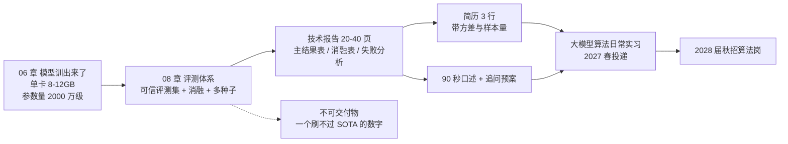
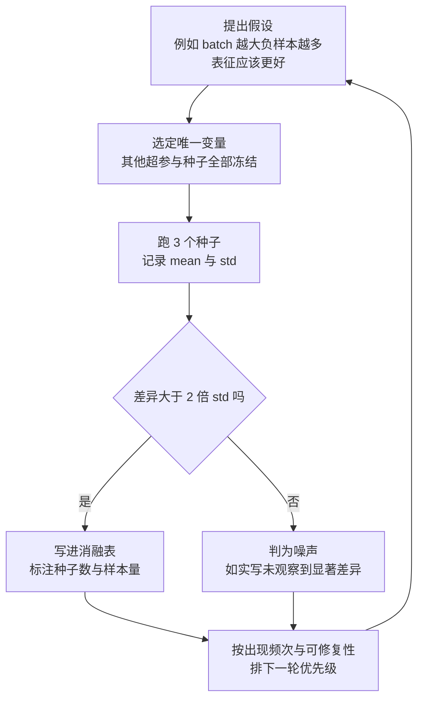
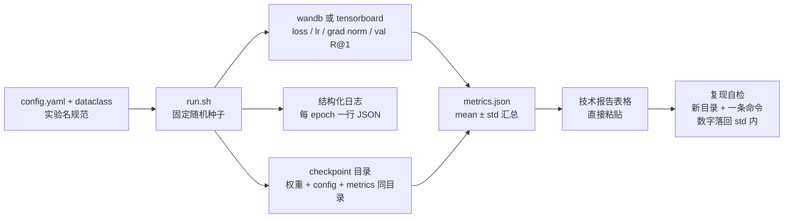

# 08 · 评测体系与技术报告

> **本章定位**：这是「转岗大模型算法」系列的**收口章节**。06 章你把 CLIP 式双塔小模型从零训出来了，07 章你把训练与推理工程补齐了——但它现在还只是一个"能跑的东西"，**还不是简历上能被追问、能被验证、能让面试官记住的东西**。中间差的那一步就是本章，对应总纲里的**交付物 D2**（技术报告）与**门禁 G4**（2027-03-15 报告初稿完成，90 秒讲清项目并接住 5 个追问）。
> **核心论点，先记住这一句**：一个单卡、参数几千万、指标不可能打败任何 SOTA 的项目，**唯一的出路是把评测与实验设计做得比谁都严谨**。面试官不会因为你 R@1 差 3 个点否决你，但一定会因为你说不清"你怎么证明这个改动有效"而否决你。
> **为什么现在学**：2026-10-08 你入职京东做 Agent 后端实习，2027-02 前后转投大模型算法日常实习，2027 秋招冲 2028 届算法岗。这条路上，**技术报告是唯一一件能脱离你的口才、独立替你说话**的资产。
> **别被算力困住**：你没有集群，**也不需要刷 SOTA**。你要交的不是更高的数字，而是一套别人挑不出毛病的实验方法论——这恰好是你最强能力的迁移：后端做性能优化时从不说"我觉得快了"，而是控制变量、pprof、p99 压测。

## 本章学习目标

1. 能说清"刷点"和"做研究"的分界，接住面试官四连问：baseline 是什么 / 怎么知道是 A 不是 B 起作用 / 过拟合了吗 / 波动多大算显著。
2. 能默写六类多模态指标的定义、计算方式与局限：检索、描述生成、分类匹配、VQA、生成质量、LLM-as-judge。
3. 能独立造出可信的小评测集：抽样 → 去污染 → 协议固定 → 难度分层 → hard negative → shortcut 检测，并说清每步为什么必要。
4. 能设计并执行消融：一次一个变量、单变量一张表、多种子报 `mean ± std`、算力不够时按什么优先级砍。
5. 能搭起"三个月后还能复现"的实验记录体系：config 规范、记录项清单、checkpoint 与结果绑定、种子与确定性。
6. 能写出 20-40 页技术报告，并把它压缩成简历 3 行与 90 秒口述。

## 核心知识点提炼

| 知识点 | 一句话结论 | 面试高频度 |
|--------|-----------|-----------|
| 评测是分水岭 | 决定你是"调包的人"还是"做研究的人" | ⭐⭐⭐⭐⭐ |
| 四连追问 | baseline / 归因 / 过拟合 / 显著性，缺一条都致命 | ⭐⭐⭐⭐⭐ |
| i2t 与 t2i 分开报 | t2i 一对多天然更低，合并报会掩盖单向缺陷 | ⭐⭐⭐⭐⭐ |
| CIDEr 为何适合 captioning | TF-IDF 加权 + 多参考共识，压常见词、奖信息词 | ⭐⭐⭐⭐☆ |
| FID 的著名误用 | 对预处理与样本数极敏感，跨 pipeline 比较等于耍流氓 | ⭐⭐⭐⭐⭐ |
| VQA 的捷径 | 只答 yes 或只答高频答案就能拿到很高准确率 | ⭐⭐⭐⭐☆ |
| LLM-as-judge | 有位置 / 长度 / 自我偏好三种偏见，必须交换顺序 | ⭐⭐⭐⭐⭐ |
| 去污染 | 不做近重复检测指标就是假的，且必须报剔除条数 | ⭐⭐⭐⭐⭐ |
| shortcut 检测 | 造"只用元数据"的弱 baseline，赢不过它就没学到东西 | ⭐⭐⭐⭐⭐ |
| 控制变量法与方差 | 一次只改一个变量；小数据上单次 0.5 个点的差异基本是噪声 | ⭐⭐⭐⭐⭐ |
| 可复现 | 一条命令 + 固定种子 + 数据版本，数字落在 std 内 | ⭐⭐⭐⭐⭐ |
| 报告即资产 | 有表有图有失败分析的报告，是小项目唯一能赢的东西 | ⭐⭐⭐⭐⭐ |

## 知识点详解

### 8.1 为什么评测是算法岗的分水岭

**刷点**是让排行榜数字变大：换更大模型、更多数据、更长训练、多试超参、报最好的那次。**做研究**是建立因果解释：改了什么 → 为什么理论上该有效 → 用什么对照排除了其他解释 → 效果多大、稳不稳。两者产出物长得一样，面试官三个问题就能分辨：

| 面试官问 | 刷点的人 | 做研究的人 |
|---|---|---|
| baseline 是什么 | "官方权重" | "同参数量、同数据、同步数的自训版本，3 个种子" |
| 为什么是 A 起作用 | "我改了两三处，一起涨了" | "只改 A 涨 2.1 点；只改 B 涨 0.3 点且在噪声内" |
| 过拟合了吗 | "我看了 val 指标" | "train loss 还降但 val 第 12 epoch 走平，按 val 早停，test 只跑一次" |

**四连追问为什么致命**：① 没有 baseline 就没有结论，且 baseline 必须**同预算**——拿 1.5 亿参数的官方 CLIP 比你的 2800 万模型，那是"上界参考"，表格里要分开标注；② 一次改多个变量，涨了也不知为什么涨，万一 A 有效 B 有害反而会得出"方案没用"的反向结论；③ 用 test 调超参再报 test 指标叫**测试集泄漏**，数字全废；④ 小评测集上 R@1 标准差有 1-2 个点，不报方差就报 0.5 个点提升，是在噪声里捞结论。这和你做后端性能优化完全同构：你从不会把"加缓存 + 换序列化 + 调 GC"一起上线然后说"快了 40%"，而是逐个上、逐个压测、算清每个改动的贡献——算法实验唯一的差别是**噪声更大**，所以要更多重复。



**结论**：你拿不到 SOTA，所以你的分**只能从"可信度"里拿**。评测做得好，2800 万参数也能讲 20 分钟；评测做得差，就算真训出好模型面试官也不信。

### 8.2 多模态任务指标全解

#### 8.2.1 检索：R@K / MedR / mAP

```text
R@K  = 命中正样本的查询数 / 查询总数        # 常用 K=1/5/10
MedR = median( 正样本在排序列表中的位置 )    # 越小越好
AP   = Σ_k [ P@k × rel(k) ] / 正样本数
mAP  = mean( AP over queries )
```

| 指标 | 定义 | 局限 |
|---|---|---|
| R@K | 前 K 位里有没有正样本 | **必须同时报 gallery 大小**，1K 与 30K gallery 的 R@K 不可比；对"排第 2"和"排第 500"一视同仁 |
| MedR | 正样本排名的中位数 | 对异常值鲁棒，但不看最差的那批样本，可能 MedR 好而 R@1 差 |
| mAP | 利用完整排序，比 R@K 敏感 | 单正样本与多正样本含义不同，要说明每个查询有几条正样本 |

**i2t 与 t2i 为什么必须分开报（必背）**：i2t 是以图查文，gallery 是全部文本，一张图通常只有一条语义集中的描述、区分度高，所以偏易；t2i 是以文查图，一条文本对应多张语义相近的图，本身就是一对多、正样本不唯一，所以偏难。合并成一个平均分会**掩盖单向缺陷**：i2t 好而 t2i 差，平均分看着还行，说明模型只学会"图找最像的句子"，没学会"句子找所有合适的图"。所以两个方向各给 R@1 / R@5 / MedR，汇总口径用 `R@1_sum = i2t R@1 + t2i R@1`（CLIP 论文的常用口径）。

#### 8.2.2 描述生成：BLEU / METEOR / ROUGE-L / CIDEr / SPICE

其中 `BLEU-n = BP × exp( Σ_n w_n × log p_n )`，`BP = min(1, exp(1 - r/c))`；`CIDEr(c, R) = (1/M) × Σ_m cos( TF-IDF(c), TF-IDF(r_m) )`。

| 指标 | 机制 | 适合 | 核心局限 |
|---|---|---|---|
| BLEU | n-gram **精确率** + 简短惩罚 | 机器翻译 | 只惩罚"生成了参考里没有的词"，对漏掉关键内容不敏感；同义改写全判错 |
| METEOR | 词级匹配含同义词与词干 + 召回 | 需要语义宽容 | 依赖 WordNet 等资源，中文支持弱 |
| ROUGE-L | 最长公共子序列的精确率与召回 | 摘要（召回导向） | 只看序列顺序，对语义等价无感 |
| CIDEr | TF-IDF 加权 n-gram 余弦，对多条参考取平均 | **captioning 标准指标** | 需要足够大的参考语料算 IDF；小样本上不稳定 |
| SPICE | 解析成场景图，算物体 / 属性 / 关系元组 F1 | 关心语义正确性 | 依赖解析器，解析失败即判错，中文解析器不成熟 |

**为什么 CIDEr 更适合 captioning**：一张图有多条人工描述，每条说法不同但都对。BLEU 会因为你用了参考里没出现但同样正确的词而扣分；CIDEr 用 TF-IDF 把"a / the / of"这类词权重压到近零、把"滑板 / 斑马 / 消防栓"这类信息词权重抬高，再对**多条参考**求共识——它衡量的是"你有没有说出这几条描述都提到的关键信息"。这是**指标设计要匹配任务结构**的经典例子，可以直接讲这层因果。**为什么现在更看 LLM-as-judge**：CIDEr 仍是 n-gram 统计，判断不了"白狗"与"黑狗"哪个更对，也读不懂否定和关系。现在主流做法是给多模态 LLM 图像 + 候选描述 + 参考描述，按**相关性 / 准确性 / 流畅性 / 有无幻觉**打分并给理由；代价是成本、可复现性下降，以及引入新偏见（见 8.2.6）。

#### 8.2.3 分类与匹配

- **zero-shot 准确率**：用固定 prompt 模板集合（如 80 个 `a photo of a {class}`）编码类名，与图像向量算余弦后取 `argmax`，即 `pred = argmax_c cos(v_img, v_txt_c)`。**关键细节**：模板选择能带来好几个点差距，**必须固定模板集合并把模板列表贴进报告**；80 个模板集成还是 1 个模板，数字完全不可比——这是 zero-shot 评测最常见的不可复现来源。
- **AUC**：随机取一正一负，模型给正样本打分更高的概率。**与阈值无关**，适合类别不平衡（正样本占 2% 时准确率会骗人，全猜多数类就能到 98%，AUC 不会）。
- **top-1 / top-5**：top-1 最严，top-5 反映候选召回能力。二者差距大（如 top-1 30%、top-5 80%）说明模型**知道大致方向但分不清细节**，该看混淆矩阵与相似类别。

#### 8.2.4 VQA：accuracy 的计算细节与多数类捷径

官方 VQA v2 每个问题有 10 位标注者，准确率是软分数：`acc(答案 a) = min(1, 与答案 a 相同的标注人数 / 3)`。只要有 3 人给出同一答案这条就算满分，只有 1 人这么答就是 0.33。这比"与唯一标准答案精确匹配"更宽容，也更符合"一个问题可以有多种合理答案"的现实。**中文场景没有官方标注者集合**，常用两种替代：精确匹配（严格但对同义答案不宽容）、LLM 判断语义是否一致（宽容但引入 judge 偏见）——**报告里必须写清用哪一种**，否则数字没法比。

**多数类捷径（必讲）**：VQA v2 里 yes/no 问题占比很高且答案分布严重倾斜，一个**恒答 yes** 的模型在 yes/no 子集上准确率远超随机，一个**恒答 top-1 高频答案**的模型也能拿到可观总体准确率。因此必须做三件事：报 per-question-type 拆分（yes/no、number、other）；报**恒答最高频答案的多数类 baseline** 作为下限；报按答案类型分层的准确率。"我的模型 62%、多数类 baseline 54%"这种写法比单报 62% 有说服力得多。

#### 8.2.5 生成质量：FID / IS / CLIPScore

公式：`FID = ||mu_r - mu_g||² + Tr(Σ_r + Σ_g - 2 × sqrt(Σ_r Σ_g))`，`IS = exp(E_x[KL(p(y|x) || p(y))])`，`CLIPScore = 2.5 × max(cos(v_img, v_txt), 0)`。

| 指标 | 原理 | 局限 |
|---|---|---|
| IS | Inception 分类器算条件分布与边缘分布的 KL，对样本取期望 | **完全不看真实数据分布**，只奖励"单张清晰 + 整体多样"，与"像不像真实图片"无关 |
| FID | Inception 特征拟合真实集与生成集两个高斯，算 Fréchet 距离 | 对预处理、样本数、Inception 权重极敏感；**越低越好，是距离不是分数** |
| CLIPScore | 图文余弦相似度线性放大 | 无需参考图像，衡量对齐而非真实感；继承 CLIP 偏见（长文本、复杂关系、否定不敏感） |

**FID 的著名误用（面试必考）**：① **跨设定比较**——不同 resize / crop 策略、不同 Inception 权重、不同张数的 FID 不可比，FID 只在**同一套 pipeline 内部**有意义；② **样本数不固定**——FID 是有偏估计、样本越少越乐观，用 1K 张算出的 FID"胜过"论文 50K 张是常见误区；③ **当作绝对质量门槛**——FID 低不代表图好（可能只是分布矩接近、细节全糊）；④ **刷 FID 而伤下游**——生成更平滑单调的图能改善 FID，却伤害可用性。**放到你的项目里**：06 章项目是检索对齐类，主指标就是 R@K 系列；FID / IS 属于"懂原理、懂误用、能说清为什么不当主指标"的层次；CLIPScore 与你高度相关（就是你双塔的相似度），可作**辅助无参考指标**。

#### 8.2.6 LLM-as-judge 与人工评估

**提示设计五要点**：① 明确评分维度并给 1-5 分**锚点定义**（1 分什么样子、5 分什么样子），不要只说"打 1-5 分"；② 要求**先给理由再给分数**，反过来会让模型先定分再编理由；③ 固定 JSON 输出并统计**解析失败率**；④ `temperature=0` + 固定 seed，保证可复现；⑤ 判分模型不能是被测模型自己，最好比它更强。

| 偏见 | 现象 | 对策 |
|---|---|---|
| 位置偏见 | 放在前面的候选更容易赢 | **交换 A/B 顺序各跑一次**，不一致判平局，并报不一致率 |
| 长度偏见 | 更长的回答更容易得高分 | 控制候选长度，或把长度作为独立维度而非混进总分 |
| 自我偏好 | 模型偏爱自己生成的答案 | 用第三方模型判分，生成与判分不同源 |

**人工评估协议（小项目也要有）**：至少 2-3 位评审；**盲评**；候选顺序随机化；给打分细则卡片；算**评审间一致性**（百分一致率，严格些用 Cohen's kappa）；结论写"3 位评审在 60 条样本上一致率 0.72"。**样本量小时人工评估的作用是发现 bad case 类型，不是给出精确百分点**——这点要主动说清楚。

### 8.3 评测集设计（重点）

拿现成 benchmark 跑一遍谁都会，**自己造一个可信的小评测集才是能力证明**。六步流水线：① 抽样 → ② 去污染 → ③ 协议固定 → ④ 难度分层 → ⑤ hard negative 挖掘 → ⑥ shortcut 检测，最后输出 `eval_protocol.md` + 固定 gallery + 数据集版本号。

**① 来源与规模**：这里有两个档位可选——**如果做英文方向**，用 COCO val2017 抽 held-out 子集（1K 图 × 5 文本 = 5000 查询），再用 Flickr30k test 验证泛化；**如果做中文方向（本系列 [06 章](./06-核心项目-多模态小模型从零训练) 的选择）**，从公开中文图文对里抽 **1000 对 held-out**，并用 COCO-CN / Flickr30k-CN 之类的重写版本做交叉验证。分类可用 ImageNet 按类抽样（50 类 × 20 图）；VQA 抽 500-1000 题并覆盖 yes/no、number、other 三类。**规模原则**：不是越大越好，而是在"统计上有意义"与"手工能看完 bad case"之间取平衡——**1000-5000 个查询足以把标准差压到 1 个点量级**，同时抽 200 个看 bad case 也在人力范围内。**注意 1000 对是下限而不是舒适区**：样本越小，同样的标准差就越难支撑"显著提升"的结论，所以本文后续的填充示例里我把判据写成"差 > 2 倍标准差才值得讨论"，并额外声明样本量限制。**"我能逐条看完全部评测样本"是很值得炫耀的事**，用 benchmark 的人做不到。

**② 去污染（不是可选项）**：评测样本若与训练集近重复，模型是背过答案的，指标全假。

| 模态 | 方法 | 阈值建议 |
|---|---|---|
| 文本 | 13-gram 重叠率、MinHash + LSH | `重叠率 >= 0.8` 判重 |
| 图像 | pHash / dHash 感知哈希汉明距离 | `汉明距离 <= 5` 判重 |
| 图文对 | CLIP 特征语义相似度复查 | `余弦 >= 0.98` 人工复查 |
| 交叉 | 与**全部**训练数据交叉检查 | 不要只比"看起来相关"的那部分 |

**必须报告两个数字**：检查了多少条、**剔除多少条**（如"5000 条剔除 43 条，占 0.86%"）。不报剔除数的去污染等于没做。

**③ 难度分层**：easy 是单物体、短文本、常见概念；hard 是多物体、含关系与否定、长尾词、需空间推理；long-tail 是训练集中出现次数低于阈值的概念。**在 easy 上所有模型都差不多，hard 才有区分度**。报告写法：主结果表给全集，另附分层表，并主动说"我在 hard 上 R@1 只有 34%，比全集低 7.7 个点，说明模型处理不了多物体关系"。** **④ shortcut 检测（最容易被忽略、也最加分）**：模型可能没学会图文对齐，只学会了"有人的照片通常配含 person 的句子"。三种手段分别是**弱 baseline 对照**（只用元数据）、**打乱配对对照**、**按"有没有捷径可用"分组**看模型在有捷径子集上领先是否异常大。

| 预测器 | i2t R@1 |
|---|---|
| 常量 baseline（永远返回同一张图） | 0.1 |
| 仅用"图里有没有人"的元数据 | 2.3 |
| 仅用图像主色调直方图 | 4.1 |
| 打乱配对后训练的对照模型 | 7.6 |
| 本文完整模型 | 39.4 |

**打乱配对对照最有价值**：把训练集的图像与文本随机错配照常训练，理论上应掉到随机水平。我在例表里故意写 **7.6** 而不是 0——这是真实实验常见结果，也是最好的面试素材：它说明 39.4 里有约 7.6 个点是"非配对的边缘统计"（如文本长度与图像复杂度的相关性），不全是真正的跨模态对齐。**主动承认这一点，比藏着不说强得多。**

**⑤ hard negative 挖掘**：用训好的模型检索，取 top-K 里非正样本的作为 hard negative 候选，构造 hard 子集。**诚实提醒**：hard 子集上指标会掉得很惨（R@1 可能腰斩），不要因此不敢报——它的价值是展示评测有区分度，并直接指出下一步方向。

**⑥ 多语言 / 中文的特殊性**：中文 caption 译自英文后 token 数常变 20-40%，**文本最大长度、温度、池化方式都要重新调**，不能套英文超参；中文没有空格分词，n-gram 类指标要先分词，**分词器不同结果就不同，报告里必须写清用的哪个**；成语、量词、文化特定概念适合单独做"中文难例"子集；翻译腔会让人工评估的"流畅性"维度失真，要单列为观察项；**中英文结果分开报**，不要合成一个平均数。

**⑦ 协议固定**（写成仓库里的 `docs/eval_protocol.md`，报告里引用并贴出关键项）。同一套评测在不同协议下数字能差 5 个点以上，因此必须固定：

| 类别 | 必须固定 |
|---|---|
| 文本侧 | prompt 模板集合全文、是否模板集成、最大长度、分词器版本 |
| 视觉侧 | resize 尺寸、是否 center-crop、归一化均值方差、插值方式 |
| 检索侧 | gallery 大小与来源、是否 L2 归一化、点积还是余弦 |
| 生成侧 | greedy / beam 宽度、temperature、top-p、长度惩罚、最大长度 |
| 评测侧 | 指标实现版本、随机种子、脚本文件哈希 |

**被问"你怎么保证两次实验可比"，答出这张表就是满分。**

### 8.4 消融实验设计

规则只有三条，但大多数人做不到：**一次只改一个变量**（其他全部冻结，含种子与数据顺序）；**有一个明确的 baseline 配置**（它就是完整配置去掉这个变量，所有变体和它比）；**每个变体至少 3 个种子**，报 `mean ± std`。**一张表 = 一个变量**，行是变体、列是各指标；把多个变量塞进一张表，读者分不清差异来自哪一行。



**什么算"必要消融"**（按对你的项目的重要性排序）：

| 优先级 | 变量 | 为什么必要 | 取值 |
|---|---|---|---|
| P0 | **负样本规模** | 对比学习负样本数 = 有效 batch - 1，直接决定表征质量（InfoNCE 核心） | 微批直训 / 梯度累积 / GradCache / 动量队列 |
| P0 | **温度系数 tau** | 控制 softmax 尖锐程度，InfoNCE 最敏感超参 | 0.01 / 0.07 / 0.1 / 0.2 |
| P0 | **是否冻结视觉编码器** | 决定"迁移 vs 端到端"路线，也是显存预算的关键 | 冻结 / 只训后 4 层 / 全量 |
| P1 | **损失函数** | 证明选 InfoNCE 不是随意的 | InfoNCE / Triplet / Sigmoid |
| P1 | **有无 hard negative** | 证明难负样本的价值 | 随机负样本 / hard negative |
| P2 | **数据量** | 展示 scaling 趋势，说明"再加数据还有收益" | 25% / 50% / 100% |
| P2 | **分辨率** | 展示收益与显存的权衡 | 160 / 224 / 256 |

**优先级原则**：先做**"假设的生死判定"型消融**（P0，决定你的方法成不成立），后做**"趋势展示"型消融**（P2，数据量 / 分辨率 / 规模用 1 个种子跑 3 个点连成线即可，不必每点 3 种子）。报告格式与判据：`i2t R@1 = 39.4 ± 0.7  # n=3 seeds，评测集 1000 对`，而 **`|Δ| > 2 × std` 才值得讨论，否则视为噪声**。三条注意：**小数据上不要吹 0.5 个点**（若 std 是 0.7，0.5 个点的差异完全可能是种子抽签）；`n=3` **只是最低门槛**，报告里要写"3 个种子的结果只能作为参考，不构成统计显著性结论"——**主动限定比假装严谨更可信**；想做严格些可用配对检验或对评测集 bootstrap 重采样算置信区间，但**别用 5 条样本的 p 值下结论**。最实用的做法是把方差直接写进表格，`39.4 ± 0.7` 比 `39.4` 专业十倍。**算力预算下怎么排**：单卡 8-12GB、一次完整训练 6-9 GPU·小时，30h/周的节奏大约能跑 20-40 次训练，所以：① 消融优先在小规模设定上做（如 20% 数据 + 5 epoch）确认趋势，再在完整设定上复跑关键结论；② 每 200 步就在小子集上评测一次 val，不等 epoch 结束；③ 温度先跑 3 个点找量级，找到区间再加密；④ 冻结编码器的消融直接复用主实验视觉塔权重，省一半算力；⑤ **"因算力不足未做"的实验要写进报告局限，不要假装做过**。**"如果给你更多算力你会先做什么"的答案顺序**（面试常问）：先补全 5 个种子把方差压下来 → 再补数据量曲线的点 → 再试更大视觉塔 → 最后才是分辨率与超参细调。**顺序体现判断力，比"我想训个 7B"强一百倍。**

### 8.5 实验记录与可复现



**config 管理与实验名规范**：用 dataclass 定义结构、yaml 存取值，**不要在代码里散落 magic number**；实验名规范 `{任务}-{模型}-{关键变量}-{种子}-{日期}`（如 `retr-vitT-b256-t007-s0-0912`）——名字里带关键变量和种子，**光看目录名就知道这次和上次差在哪**，这是省时间最多的一个约定。

```python
@dataclass
class Config:
    data_version: str = "coco-train2017-v1"; eval_set: str = "coco-val2017-heldout-1k"
    image_size: int = 224; proj_dim: int = 512; batch_size: int = 256
    lr: float = 3e-4; epochs: int = 20
    temperature: float = 0.07      # InfoNCE 的学习温度
    freeze_vision: bool = False; loss: str = "infonce"
    use_hard_negatives: bool = True; seed: int = 0

def seed_everything(seed=0):
    random.seed(seed); np.random.seed(seed)
    torch.manual_seed(seed); torch.cuda.manual_seed_all(seed)
    torch.backends.cudnn.benchmark = False       # 关闭自动算法选择
    torch.backends.cudnn.deterministic = True    # 用确定性卷积实现
    os.environ["PYTHONHASHSEED"] = str(seed)

def worker_init_fn(wid):                          # 多 worker 必须显式派生种子
    s = torch.initial_seed() % 2**32
    np.random.seed(s + wid); random.seed(s + wid)
# DataLoader 还要传 generator=torch.Generator().manual_seed(seed)
```

**记录什么**：标量记 train / val loss、lr、grad norm、每 epoch 的 val i2t R@1 与 t2i R@1（判断收敛、发现梯度爆炸、看是否过拟合）；记完整 config（事后回溯的唯一依据）；记代码目录文件哈希（**自己算哈希，不依赖 git 命令**）以绑定代码版本；把检索样例（query 图 + top-5 文本）以表格 / 图片存盘，训练中途就能肉眼看到模型在学什么；记显存峰值、每步耗时与吞吐——这是 8-12GB 卡上你最关心的东西，也支撑 07 章的工程叙事。⚠️ 涉及[京东实习](./09-京东实习期的算法筹码经营)相关的数据或代码**不要上传 wandb 公有云**，用本地 tensorboard 或自建服务。**日志、checkpoint 与结果绑定**：每个 epoch 打一行 JSON（`{"epoch":3,"train_loss":1.83,"val_i2t_r1":28.4,"val_t2i_r1":17.9,"lr":2.7e-4,"sec":412}`），之后用脚本直接解析成表格，不用回头翻屏幕。目录结构固定为 `runs/{实验名}/` 下并列 `config.yaml`、`metrics.json`（含 mean 与 std）、`train.log`、`samples/`、`ckpt/`（`step_20000.pt`、`best_val_r1.pt`）。**反面教材**：一个裸的 `best_model.pt` 躺在下载目录，三个月后你不知道它对应哪个配置——发生一次，你的消融表就废了。

**一条命令复现**：`run.sh` 读 config、显式传 seed 与 data-version、跑训练再跑评测，中间不需要口头补充任何信息；`requirements.txt` **锁定版本**（`torch==2.x.x` 而非 `torch>=2`，PyTorch 版本变化会改数值）；数据用导出日期或内容哈希命名（`coco-train2017-v1`）并在 `docs/data_card.md` 写清来源、抽样规则与去污染结果——面试官问"数据哪来的、干净吗"，直接指这份文件。** **随机性的常见坑**：① 忘了 `num_workers > 0` 时 DataLoader 随机性独立于主进程；② 忘了 `PYTHONHASHSEED`，导致 set / dict 迭代顺序变化；③ 开了 `cudnn.benchmark` 后同输入结果会漂。注意完全确定性会变慢，小项目值得，大训练通常只在评测阶段强制。**"三个月后还能复现"的自检五步**（不靠感觉，靠动作）：① clone 到你从没打开过的新目录；② 只读 README，不看任何旧终端历史；③ `bash run.sh` 从头跑到评测结束，中途不需要口头补充信息；④ 结果落在原记录的 `mean ± std` 区间内；⑤ `requirements.txt` 能装成功，不需要手动补装忘了记的包。**任何一步失败都不是"我记性好"能补的。**

### 8.6 Bad case 分析与失败归因

| 类别 | 表现 | 怎么确认 | 能修吗 |
|---|---|---|---|
| **数据问题** | 训练集几乎没有这类样本（长尾概念、中文特有表达） | 统计该类在训练集的频次 | 能：补数据 / 重采样 |
| **标注噪声** | 参考描述漏掉关键物体，或五条参考互相矛盾 | 人工抽查参考文本质量 | 部分能：清洗、多参考下放宽指标 |
| **架构限制** | 双塔无交叉注意力，无法细粒度区域对齐；池化丢空间信息 | 同类错误在不同数据量下都稳定出现 | 难：要换架构或加交互层 |
| **训练不足** | 训练 loss 仍在降、val 曲线未走平 | 看 loss 曲线与更长训练结果 | 能：加 epoch / 调 lr |
| **评测缺陷** | gallery 太小、指标选错、有泄漏、捷径可走 | 换 gallery 大小复算，跑 shortcut 对照 | 能，**且要最优先修** |

**最常见的错误是把"评测缺陷"当"模型问题"**：花两周改架构，结果发现是评测集里 30% 的查询与训练集近重复。**所以 bad case 分析第一步永远是先排除评测缺陷。** **抽样与可视化**：**分层抽样**——先按指标取最差的一批（如 rank 在后 10% 的 500 条），再按查询类型分层（短查询 / 多物体 / 含否定 / 中文成语 / 稀有概念），每类抽 20-30 条人工看；只随机抽 100 条会被 easy 样本淹没。**相似度矩阵热力图**——一个 batch（如 64 图 × 64 文本）的相似度矩阵画成热力图，对角线应最亮，**非对角线的亮点就是"模型分不清的样本对"，直接告诉你 hard negative 从哪来**。**检索错误配对展示**——每行一条错误样例：查询图 → top-5 结果（高亮正确项真实排名）→ 正确文本，附一句判断；20 行这样的图比 20 页分析文字更有力。t-SNE / UMAP 可以画，但必须标注"仅用于观察聚类结构，不作为定量结论"，**不要用降维图论证模型好坏**。

**从 bad case 反推优先级**：做一张"频次 × 可修复性 × 修复成本"排序表（如：中文长句检索失败占错误 38%、可修复性高、成本低 → P0；多物体关系错误占 31%、需改架构 → P1 列为后续工作）。**这张表本身就是报告"后续工作"一节的骨架**，也是"如果给你更多时间你会做什么"的答案。** **把 bad case 讲成面试故事的六段式模板**：

```text
现象 → 我在 hard 子集上 R@1 只有 34%，比全集低 7.7 个点
定位 → 分层抽样 60 条，发现 38% 的错误是中文长句被截断
假设 → 文本最大长度 32 token 对中文不够，中文 caption 平均长 22%
验证 → 把最大长度提到 48 重跑，R@1 从 34.1 提到 36.8，波动 ±0.6
结论 → 确认是超参适配问题，不是架构问题
边界 → 剩下 31% 是多物体关系错误，双塔架构解决不了，这是我明确的局限
```

**这六段式的价值在于证明你会"用实验回答问题"，而不只是"看现象猜原因"。** 最后那句主动划边界是整段话里最加分的一句。

## 技术报告模板与填充示例

### 报告结构模板（20-40 页 / 正文 8000-12000 字）

```markdown
# {项目名}：单卡多模态双塔模型的训练与评测
## 摘要（200-300 字）  做了什么 / 关键设置 / 3 个最重要数字 / 一句局限
## 1 动机与问题定义（500-800 字）  为什么做 / 把问题形式化成一句话 / 明确"不追求 SOTA，追求可信归因"
## 2 相关工作一句话对照（300-500 字）  表：方法 | 核心思想 | 与本文的差异（3-5 行，每行一句话）
## 3 方法（1000-1500 字）  3.1 架构图（必须自画一张）；3.2 关键设计决策表：决策 | 备选 |
   选了什么 | 为什么（3-5 条，理由不能写"业界惯例"）；3.3 损失函数与目标（写清 InfoNCE 与温度）
## 4 实验设置（500-800 字）  4.1 数据：来源 / 规模 / 预处理 / 去污染剔除条数；4.2 评测集：抽样规则 /
   规模 / gallery 大小 / 难度分层；4.3 协议：prompt 模板、解码参数、预处理（引用协议文档）；
   4.4 超参表 + 算力：单卡型号、显存峰值、总 GPU·小时
## 5 主结果表  1 张表（含 baseline、本文配置、上界参考，指标带 ± std）+ 1 张训练曲线图
## 6 消融实验  4-6 张表（batch / 温度 / 冻结 / 损失 / 数据量 / 分辨率与显存），每张表下方
   一句话结论并标注种子数
## 7 失败分析与局限（600-900 字）  分层结果表 + 五类失败归因表 + 热力图 + 错误配对图 + 局限
## 8 可复现清单（1 页）  环境 / 数据版本 / 一条命令 / 种子 / 预期数字与波动范围 + 自检五步
## 9 后续工作（300-500 字）  按"频次 × 可修复性 × 成本"排序的改进清单 + 给更多算力时的顺序
```

**硬要求**：主结果表 1 张、消融表至少 4 张、分层表 1 张、失败归因表 1 张；架构图 1 张、训练曲线 1 张、相似度热力图 1 张、错误样例图 1 张。**没有表的报告不是技术报告，是读书笔记。**

### 填充示例：以 06 章的 CLIP 式双塔小模型为例

> ⚠️ **以下数值全部是"填充格式示例"**，不是真实结果。你要做的是把跑出来的数字填进同样的表头——**先有表头再跑实验**，这样你才知道该记录什么。设定与 [06 章](./06-核心项目-多模态小模型从零训练) 的选型完全一致：视觉塔 ViT-Tiny 风格（patch 16 / 宽度 192 / 12 层 / 5.7M）+ 文本塔（宽度 384 / 6 层 / **自训 8000 词表中文分词器** / 14.6M），投影 256 维，参数量约 **2050 万**（其中文本词嵌入 8000×384≈307 万）；训练数据为**自建的 10 万中文图文对**；评测集为**自建 1000 对 held-out**（pHash 图片去重 + 文本近重复检测，剔除 43 条占 4.3%），gallery 为 1000 图 / 1000 文本；硬件为**单卡 12GB 消费级显卡**。以下全部 `n=3 seeds`。

**表 1 主结果**

| 模型 | 参数量 | i2t R@1 | i2t R@5 | i2t MedR | t2i R@1 | t2i R@5 | t2i MedR | 训练算力 |
|---|---|---|---|---|---|---|---|---|
| 随机初始化（下限对照） | 20.5M | 0.1 | 0.4 | 500 | 0.1 | 0.5 | 499 | — |
| 本文 · 微批 128 直训（负样本 127） | 20.5M | 32.4 ± 0.9 | 58.1 ± 0.8 | 16 | 20.8 ± 1.1 | 42.3 ± 0.9 | 29 | 6.5 GPU·h |
| **本文 · 完整配置（GradCache + 动量队列）** | 20.5M | **39.4 ± 0.7** | **64.9 ± 0.6** | **9** | **25.9 ± 0.9** | **47.4 ± 0.7** | **21** | 9.2 GPU·h |
| 开源中文 CLIP 权重 zero-shot（上界参考，非同预算） | 188M | 52.4 | 76.1 | 2 | 46.9 | 71.2 | 3 | — |

表下必写：`n=3 seeds；gallery 为 1000 图 / 1000 文本；上界参考为不同参数量与数据规模的公开权重，仅作量级参照，不构成对比基线。`

**表 2 消融 · 负样本规模（对比学习最关键的变量，也是本项目解决的核心矛盾）**

| 设定 | 有效 batch | 负样本数 | i2t R@1 | t2i R@1 | 显存峰值 | 每 epoch |
|---|---|---|---|---|---|---|
| 微批 128，无累积 | 128 | 127 | 32.4 ± 0.9 | 20.8 ± 1.1 | 7.4 GB | 4.0 min |
| 微批 128 + 梯度累积 4 | 128 | 127 | 33.1 ± 0.8 | 21.5 ± 1.0 | 7.4 GB | 4.1 min |
| 微批 128 + **GradCache** | **512** | **511** | 38.6 ± 0.7 | 25.1 ± 0.9 | 7.9 GB | 5.6 min |
| 微批 128 + GradCache + 动量队列 4096 | 512 + 4096 | 4096+ | **39.4 ± 0.7** | **25.9 ± 0.9** | 8.1 GB | 7.8 min |

> **结论**：这张表是整个项目最有价值的一组数据。`L = -log( exp(s_ii/tau) / Σ_j exp(s_ij/tau) )` 的分母是 batch 内全部负样本，负样本数从 127 涨到 511 让区分难度实质提高，**GradCache 一步带来 6.2 个点**。而**梯度累积只涨 0.7 个点（在 1 倍标准差内）**——因为它降低了梯度方差，却完全没有增加负样本数。**这个"看似该有用、实际用处很小"的对照，正是[06 章](./06-核心项目-多模态小模型从零训练)要重点讲的判断。** 动量队列再加 0.8 个点，但训练时间多 39%，性价比低于 GradCache。

**表 3 消融 · 温度系数 tau**

| tau | i2t R@1 | t2i R@1 | 现象 |
|---|---|---|---|
| 0.01 | 35.2 ± 0.8 | 22.8 ± 0.9 | 梯度过尖锐，后期 loss 抖动明显 |
| **0.07** | **39.4 ± 0.7** | **25.9 ± 0.9** | 最优 |
| 0.10 | 38.9 ± 0.8 | 25.4 ± 1.0 | 与 0.07 差异在 1 倍 std 内，视为等价 |
| 0.20 | 36.1 ± 0.9 | 23.2 ± 1.1 | 过平滑，正负样本区分不足 |

> **结论**：温度在 0.07-0.10 区间差异不显著，说明该超参在本设定下不敏感——**这本身是可报告的发现，比硬编造一个"最佳温度"更可信**。

**表 4 消融 · 训练配置：表内分两组，每组只动一个变量，共同的 baseline 都是「全量训练 + InfoNCE」**

| 变量组 | 设定 | 可训练参数 | i2t R@1 | 显存峰值 | 训练算力 |
|---|---|---|---|---|---|
| 冻结策略 | 完全冻结视觉塔 | 14.8M | 31.7 ± 0.6 | 5.4 GB | 4.8 GPU·h |
| 冻结策略 | 只训练视觉塔后 4 层 | 16.7M | 37.2 ± 0.8 | 6.8 GB | 7.6 GPU·h |
| 冻结策略 | **视觉塔从零全量训练（baseline）** | 20.5M | **39.4 ± 0.7** | 8.1 GB | 9.2 GPU·h |
| 损失函数 | Triplet loss（margin 0.2） | 20.5M | 32.1 ± 1.0 | 8.1 GB | 9.2 GPU·h |
| 损失函数 | Sigmoid pairwise | 20.5M | 34.0 ± 0.9 | 8.1 GB | 9.2 GPU·h |
| 损失函数 | InfoNCE（baseline） | 20.5M | **39.4 ± 0.7** | 8.1 GB | 9.2 GPU·h |
| 负样本 | 打乱配对训练（shortcut 对照） | 20.5M | 7.6 | 8.1 GB | 9.2 GPU·h |

> **结论**：视觉塔从零全量训练比完全冻结高 7.7 个点——**注意这与"小数据下冻结预训练编码器更优"的常见结论相反，因为本项目的视觉塔本来就是随机初始化的，冻结它等于放弃一半表征学习能力**；如果换成加载开源 CLIP 权重再冻结，结论通常会反过来，这本身值得在报告里单独讨论。只训后 4 层能拿到 94% 的收益、76% 的算力，是显存紧张时的最优档位。InfoNCE 比 Triplet 高 7.3 个点，因为 Triplet 只用单个负样本、缺少 batch 内归一化竞争。**这种"权衡表述"是工程背景候选人的天然优势。**

**表 5 消融 · 数据量与分辨率（趋势型，n=1 seed）** 与**表 6 shortcut 检测 / 分层结果**

| 数据量 | i2t R@1 | | 分辨率 | i2t R@1 | 显存峰值 | | 预测器 | i2t R@1 |
|---|---|---|---|---|---|---|---|---|
| 25% | 28.6 | | 160 | 38.1 | 5.2 GB | | 常量 baseline | 0.1 |
| 50% | 34.8 | | 224 | 39.4 | 8.1 GB | | 仅用"图里有没有人" | 2.3 |
| 100% | **39.4** | | 256 | 40.1 ± 1.0 | 11.6 GB | | 打乱配对后训练 | 7.6 |
| | | | | | | | 本文完整模型 | **39.4** |

> **结论（写法示范）**：数据仍有明显 scaling 空间（25%→100% 涨 10.8 个点，且曲线未饱和），说明**当前模型容量不是瓶颈、数据是**——这条结论直接指向"扩数据"而不是"加参数"的下一步动作。分辨率 224→256 只涨 0.7 个点，**小于 2 倍标准差，而显存 11.6GB 已贴着我 12GB 显卡的上限**，所以 224 是实际可用的最优点，**要主动说明"我不认为分辨率带来了可靠提升"——不吹这 0.7 个点**。shortcut 上模型显著高于一切对照，但打乱配对仍拿 7.6（非随机水平），说明约 7.6 个点来自非配对的边缘统计相关性，**真正归因于跨模态对齐的收益约 31.8 个点**；分层结果 easy 55.2 / hard 32.1 / long-tail 21.4，hard 比全集低 7.3 个点——**分层表是把"平均分"拆开看的第一步，它证明了模型在困难样本上仍有很大空间**。

### 如何把这份报告改写成简历上的 3 行

```text
1. 在单卡 12GB 消费级显卡上从零训练 CLIP 式双塔模型（2050 万参数、自训 8000 词表
   中文分词器），自建 10 万中文图文对数据集与 1000 对 held-out 评测集
   （pHash + 文本近重复去污染、剔除 43 条），完成 6 组消融实验，
   i2t R@1 39.4 ± 0.7（3 seeds），较梯度累积等价配置提升 6.3 个点。
2. 针对单卡 batch 受限导致负样本不足的核心矛盾，实现 GradCache 梯度缓存将有效
   batch 从 128 提升至 512，并以消融证明梯度累积在此无效（+0.7 点，1 倍 std 内）、
   动量队列性价比低于 GradCache；另修复 padding 定位错误的分层池化实现。
3. 设计完整评测协议：难度分层（easy 55.2 / hard 32.1 / long-tail 21.4）、hard
   negative 挖掘、shortcut 对照（打乱配对仅 7.6 分），量化出真正归因于跨模态对齐的
   收益约 31.8 个点；产出 30 页技术报告 + 一条 run.sh 一键复现全部实验。
```

**三条纪律**：① 每个数字都带来源限定（样本量、种子数、gallery 大小）；② 提升必须对比**同预算** baseline，不要对比官方大模型；③ 不写"效果显著提升"这种空话，写清提升了几个点、波动多少。

### 如何在面试里 90 秒讲完

| 时间 | 内容 | 要点 |
|---|---|---|
| 0-25s | 定位与约束 | "我在一张 12GB 消费级显卡上从零训了一个 2050 万参数的图文双塔，并自建了一套评测体系。算力只有一张消费卡，所以我明确不追 SOTA，把全部精力放在**实验设计可信**上。" |
| 25-45s | 方法 | "标准双塔 + InfoNCE，关键决策是温度 0.07、用 GradCache 把有效 batch 从 128 提到 512——这两条都单独做了消融。" |
| 45-60s | 主结果 | "i2t R@1 39.4、t2i 25.9，三种子标准差 0.7；开源中文 CLIP 是 52.4，那是 1.88 亿参数、亿级数据，只作上界参考。" |
| 60-80s | **最想让你记住的一点** | "我做了两组别人一般不会做的对照：梯度累积在这个设定下只涨 0.7 个点，因为它不增加负样本；shortcut 检测显示打乱训练配对后模型还能拿 7.6 分，说明 39.4 里有 7.6 个点不是真对齐。两条我都写进报告了。" |
| 80-90s | 边界与下一步 | "明确没做的是多物体关系推理，双塔架构解决不了；数据量曲线还没饱和，所以下一步我会先扩数据而不是加参数。" |

**为什么第 60-80 秒要放 shortcut 检测**：这是 90 秒里唯一"别人讲不出来"的东西。所有候选人都会报指标，只有做过严谨实验的人才会主动扣自己的分——**主动扣分是建立可信度最快的方式**（注意：shortcut 对照也要写进消融表，见上面表 4 最后一行）。

## 从评测到面试话术

结论翻译句式模板（一句话同时交付控制变量、量化、方差、归因、理论支撑，面试官听完不用追问就知道你会做实验）：

```text
我把 {变量} 从 {A} 改成 {B}，{指标} 从 {m1} 提到 {m2}，波动 ±{s}，
因为 {机制解释}，这与 {理论或论文} 的预期一致。
```

照抄改数字：

| 实验结论 | 面试句式 |
|---|---|
| 有效 batch 128 → 512，R@1 提升 6.2 | "对比学习里负样本数等于 batch 减一，InfoNCE 的分母就是 batch 内所有负样本，负样本规模直接决定表征的细粒度——这印证了 CLIP 那篇里'负样本规模决定表征质量'的结论。我实现 GradCache 就是为了在 12GB 单卡上把这个数从 127 提到 511。" |
| 梯度累积只涨 0.7 点（不显著） | "梯度累积降低了梯度方差，但不增加负样本数，所以在这里几乎没用——**这是我最想讲的一组对照，因为它区分了'看起来该有用'和'实际有用'。**" |
| 温度 0.07 与 0.10 差异不显著 | "两者差异只有 0.5 个点、小于我的标准差，所以我认为这个区间内不敏感。我只报最优值，但不宣称 0.07 一定比 0.10 好。" |
| 分辨率 224 → 256 只涨 0.7 点且显存贴顶 | "只涨 0.7 个点、小于 2 倍标准差，而且显存峰值 11.6GB 已经贴着我 12GB 显卡的上限，所以我停在 224——**我不认为这是个真实提升，所以没写进结论**。" |
| 冻结 vs 全量训练差 7.7 个点 | "视觉塔从零全量训练比冻结高 7.7 个点；如果换成加载开源 CLIP 权重再冻结，结论通常会反过来，这一条我在报告里单独讨论了。只训后 4 层能拿到 94% 的收益、76% 的算力，是显存紧张时的性价比档位。" |
| 打乱配对仍有 7.6 分 | "打乱配对的对照里模型还拿到 7.6 分，说明 39.4 里约 7.6 个点来自非配对的边缘统计相关性，不是真正的跨模态对齐。**这是我主动在报告里扣掉的分。**" |
| hard 子集掉 23 个点 | "easy 55.2、hard 32.1，掉 23 个点。说明问题不在训练不充分，而在双塔架构对多物体关系建模的先天限制——这是我明确的局限。" |
| 评测集自建 | "评测集是我自己建的：1000 对 held-out 中文图文对，pHash 做图像去重、13-gram MinHash 做文本近重复检测，剔除 43 条占 4.3%，并用脚本验证与训练集零交集。我报剔除数，是因为**不报剔除数的去污染等于没做**。" |

**三条纪律（比句式更重要）**：① **不报没有方差的点估计**，任何时候报指标都带样本量与种子数；② **主动限定样本量**——"这个结论基于 1000 对查询、3 个种子，是趋势不是定论"；③ **主动说没做什么**——没做人工评估、没做大模型对比、没做多卡扩展，这些不是弱点，是可信度来源。

## 14 天日程

假设你已有训好的双塔模型（06 章产出）。以下 14 天全部是**评测与报告**工作，不含从零调通训练的时间。

| Day | 任务 | 交付物 | 保底 15h | 标准 30h | 冲刺 50h |
|---|---|---|---|---|---|
| 1 | 实现检索评测脚本：i2t / t2i 双方向，R@1 / R@5 / R@10 / MedR / mAP | `eval/eval_retrieval.py` | 拆 2 天 | ✓ | 合并 1-2 |
| 2 | 指标核对与单测：手工构造 5 条样本，手算与脚本对拍 | `tests/test_metrics.py` | 拆 2 天 | ✓ | 合并 1-2 |
| 3 | 构造干净评测子集：抽 1K 图 × 5 文本 + 去污染 | `eval_set/` + 剔除报告 | ✓ | ✓ | ✓ |
| 4 | 难度分层 + shortcut 检测（元数据 baseline + 打乱配对对照） | 分层划分 + shortcut 表 | 只做分层 | ✓ | 加 3 类弱 baseline |
| 5 | 协议固定 + baseline 复现：写 `eval_protocol.md` 并跑出 baseline | 协议文档 + baseline 数字 | 拆 2 天 | ✓ | ✓ |
| 6 | 主结果跑批：完整配置 × 3 种子 + 上界参考 | 主结果表初稿 | ✓ | ✓ | 扩到 5 种子 |
| 7 | 消融一：batch size（64 / 128 / 256） | 消融表 1 | 只跑 2 点 | ✓ | 加显存与耗时列 |
| 8 | 消融二：温度（0.01 / 0.07 / 0.1 / 0.2） | 消融表 2 | ✓ | ✓ | ✓ |
| 9 | 消融三：冻结 / 微调后 4 层 / 全量微调，多种子补方差 | 消融表 3 + 方差汇总 | 拆 2 天 | ✓ | 加损失函数消融 |
| 10 | Bad case 分类与可视化：分层抽样 60 条 + 热力图 + 错误配对图 | 失败分析素材 | ✓ | ✓ | 加 200 条统计 |
| 11 | 补关键实验：hard negative 对照、分辨率与显存权衡、数据量曲线 | 消融表 4-5 | 只做 hard negative | ✓ | 全做 |
| 12 | 消融汇总与显著性判断：算 2 倍 std，剔除噪声结论，每表一句结论 | 全部消融表定稿 | ✓ | ✓ | ✓ |
| 13 | 写报告：按模板填 9 节，含可复现清单与局限 | 20-40 页报告初稿 | 拆 3 天 | ✓ | ✓ |
| 14 | 收口：简历 3 行 + 90 秒讲稿 + 录 3 分钟讲解视频 + 自问自答 12 题 | 讲稿 + 视频 + 追问预案 | 拆 2 天 | ✓ | 加模拟面试 |

| 档位 | 每周 | 总时长 | 砍掉什么 | 交付底线 |
|---|---|---|---|---|
| **保底 15h** | 15h | **约 3 周 21 天** | 砍掉分辨率与数据量曲线；mAP / MedR 可用开源实现；消融只做 batch、温度、冻结三组 | 主结果表 + 3 张消融表 + 失败分析 + 报告 15 页 |
| **标准 30h** | 30h | **14 天** | 不做人工评估与 LLM-as-judge 打分 | 全部 14 天交付物 |
| **冲刺 50h** | 50h | **10 天** | 不砍，反而加做 5 种子、损失函数消融、LLM-as-judge 辅助评测、视频精剪 | 报告 30 页 + 视频 + 追问预案 |

**保底档的合并规则（照抄）**：Day1+Day2 合并成一天慢跑；Day3、4、6、7、8、10、12 保留；Day5 拆两天、Day9 拆两天、Day13 拆三天、Day14 拆两天。**底线是 Day 12 之前必须有一张完整主结果表和至少三张消融表**——没有表，报告写不下去，面试也没得讲。**与总纲门禁对齐**：这套日程在你 2027-02 从京东收尾后执行，正好落在 P2 转岗冲刺期，产出物 D2 就是 2027-03-15 门禁 G4 要交的东西。

## 面试问答

**Q1：你的项目指标多少？有没有超过 baseline？**

> "i2t R@1 是 39.4 ± 0.7、t2i R@1 是 25.9 ± 0.9，三个种子，评测集 1000 对、gallery 是 1000 图。**我没有超过任何 SOTA，也不打算声称超过**——开源中文 CLIP 是 52.4，但那是 1.88 亿参数、亿级图文对训出来的，和我 2050 万参数、10 万对的预算不是一个量级，所以我在报告里把它标成'上界参考'而不是 baseline。我要比的是**同预算 baseline**：同参数量、同数据、同步数的自训版本。梯度累积那种配置是 33.1，我的完整配置 39.4，提升 6.3 个点，远超 2 倍标准差——这才是我的对比结论。"

**Q2：你怎么证明你的改动有效？**

> "靠控制变量法：一次只改一个变量，其他全部冻结，包括种子和数据顺序。我改了两类变量——负样本规模和温度，每个都单独一组消融，每组三个种子报均值和标准差。最有意思的一组是负样本：**梯度累积只涨 0.7 个点，在 1 倍标准差内，等于无效**；但换成 GradCache 把有效 batch 从 128 提到 512，立刻涨 6.2 个点。这两个设定的差别在于前者不增加负样本数、后者增加了 4 倍，正好验证了 InfoNCE 里'负样本规模决定表征质量'这个假设。还有一个反例：温度 0.07 和 0.10 差 0.5 个点、小于标准差，我就明确写'这个区间内不敏感'，不宣称 0.07 更优。能说出哪条结论不成立，才说明整套方法论可信。"

**Q3：小数据集上的提升可信吗？波动多大算显著？**

> "不可信，除非报方差。我的评测集 1000 对、三种子标准差在 0.7 到 1.1 之间，所以我把判据写死在报告里：**差异要大于约 2 倍标准差才值得讨论**，1.5 到 2 个点以下的一律当噪声。报告里专门有一处写了'未观察到显著差异'：分辨率 224→256 涨 0.7 个点，我判它在噪声内，只在'局限'里提一句。我也交代了这条判据的边界：`n=3` 只是最低门槛、不是严格 p 值，要更严格应该做配对检验或对评测集 bootstrap 重采样算置信区间——**我没做，这是我算力不足的欠账**。况且我的评测集只有 1000 对，样本量本身也限制了显著性判定的能力，这一点我也写进局限了。"

**Q4：FID 能不能用来比较两个不同的模型？**

> "要看情况，而且**大多数人的用法是错的**。FID 用 Inception 特征拟合真实集与生成集两个高斯，`FID = ||mu_r - mu_g||² + Tr(Σ_r + Σ_g - 2·sqrt(Σ_r Σ_g))`，它对三件事极敏感：预处理的 resize 与 crop 策略、用哪份 Inception 权重、样本数量。FID 还是有偏估计、样本越少越乐观，所以拿 1K 张算的 FID 去比论文里 50K 张算的，一定虚高。**跨 pipeline 比较基本没意义，只有同一套预处理、同一份权重、同样样本数下的同团队 A/B 才可信。** 另外 FID 低也不代表图好看，可能只是分布矩接近、细节全糊。我自己的项目是检索对齐类，主指标是 R@K，我不拿 FID 论证模型好——这是我刻意的边界。"

**Q5：你为什么报 i2t 和 t2i 两个方向，不报一个平均分？**

> "因为两个方向难度结构完全不同。i2t 是以图查文，一张图通常只有一条语义集中的描述，区分度高；t2i 是以文查图，一条文本对应多张语义相近的图，本身就是一对多、正样本不唯一，所以天然更低。合并成平均分最大的问题是**掩盖单向缺陷**：i2t 好而 t2i 差，平均分看着还行，实际上它只学会了'图找最像的句子'，没学会'句子找所有合适的图'。所以我两个方向各给 R@1 / R@5 / MedR，汇总用 `R@1_sum = i2t R@1 + t2i R@1`，这是 CLIP 论文的常用口径。"

**Q6：评测集是你自己造的吗？会不会有偏？**

> "是我自己造的，而且**一定会有偏，我把偏在哪些地方写清楚了**。做法是从公开中文图文对里抽取，构造 **1000 对 held-out 中文图文对**，与训练用的 10 万对完全隔离（图片按 pHash、文本按 13-gram MinHash 双重检查零交集）。已知的偏有三处：① 数据以日常与电商场景为主，缺文档、图表、工业图像这类域，所以我的指标不代表模型在专业域的表现；② 标注风格偏短句加多物体，让多物体关系难例占比偏高，我的 hard 子集占比比真实分布重；③ 我用 13-gram MinHash 做文本去污染、pHash 做图像去污染，剔除 43 条占 4.3%，但**近重复检测只能挡机械重复、挡不住语义重复**——我用模型相似度大于 0.98 复查过一遍，可这条阈值也是经验值。我主动报这些，是因为**评测集没有偏是不可能的，说不出来才有问题**。"

**Q7：LLM-as-judge 靠谱吗？**

> "可用，但必须承认三种已知偏见并设计对策。**位置偏见**：成对比较时放前面的更容易赢，对策是交换 A/B 顺序各跑一次、不一致判平局、并把不一致率报出来；**长度偏见**：更长回答容易得高分，对策是控制候选长度或把长度作为独立维度；**自我偏好**：模型偏爱自己的输出，对策是判分与生成不同源、或用更强的模型判。提示设计上我会做四件事：明确维度并给 1-5 分锚点定义、要求先给理由再给分数、固定 JSON 输出并统计解析失败率、`temperature=0`。在我的项目里 judge 主要用于**辅助评测和 bad case 发现**，不替代主指标——R@K 完全客观可复现，我没必要引入带偏见的判断器替代它。**能用客观指标的地方就不要用 judge，这是原则。**"

**Q8：如果给你更多算力，你会先做什么实验？**

> "顺序很明确，不先训更大的模型。第一，把主结果种子从 3 个补到 5 个、把标准差压下来——**方差是我现在所有结论的天花板**，方差不清，涨 1 个点都不敢下结论；第二，把数据量曲线从 3 点补到 4-5 点，看 scaling 是否还在线性区，这决定'再加数据还有没有收益'；第三，把视觉塔放大一档做规模消融，看参数量与指标的拐点；第四，才是分辨率与超参细调，因为那一层的收益我验证过是 1 个点量级且在噪声内。理由是我优先补**能改变结论的实验**，而不是能提升数字的实验。多训一个大模型只是让数字好看一点，补种子和补数据量曲线是让结论从'疑似'变成'成立'。"

**Q9：你怎么知道模型不是在走捷径？**

> "我做了三种 shortcut 检测。第一种弱 baseline 对照：只用元数据去猜——只用'图里有没有人'是 2.3 分、只用主色调直方图是 4.1 分、常量 baseline 是 0.1 分，我的模型 39.4 远高于它们。第二种也是关键的一种：**打乱配对后训练的对照**，把训练集图像与文本随机错配后照常训完、再在原评测集上评测，它拿到 7.6 分、不是随机水平。这个结果我一开始也不喜欢，但我写进报告了：**说明 39.4 里约 7.6 个点来自非配对的边缘统计相关性，真正归因于跨模态对齐的收益约 31.8 个点。** 第三种是按'有没有捷径可用'分层，看模型在有捷径的子集上领先是否异常大。**主动扣自己 7.6 分，比多报 7.6 分更能证明实验可信。**"

**Q10：什么叫过拟合？你怎么判断？**

> "过拟合是训练集表现继续变好、但在没见过的数据上不再变好。我靠三条曲线加一条纪律判断：train loss 持续下降、val R@1 从某个 epoch 起走平或下降、两者差距开始拉大；我的实验里 val R@1 在第 12 个 epoch 左右走平，我按 val 早停取最优 checkpoint。**一条纪律是：测试集只跑一次**——不用 test 选超参、选 checkpoint、选模型。一旦这么做了，报出来的测试集指标就是虚的，这叫测试集泄漏；超参全在 val 上选，最后一次才在 test 上跑。我认为这条纪律比'过拟合判断'本身更重要，因为调参调出来的过拟合比训练出来的过拟合隐蔽得多。"

**Q11：三个月之后你还能复现这些实验吗？**

> "能，而且我用一个动作验证过，不是靠记性。仓里有 `run.sh`、锁版本的 `requirements.txt`、数据版本号、`docs/eval_protocol.md`，checkpoint 目录里权重、config、metrics 三件套放在一起。自检五步：clone 到新目录、只读 README、执行一条命令、看结果是否落在原记录的 `mean ± std` 区间内、确认环境不用手动补装包。种子方面我固定了 Python、NumPy、PyTorch、CUDA 四个种子，还处理了 DataLoader 多 worker 的种子派生、`PYTHONHASHSEED` 并关掉 `cudnn.benchmark`——这三个是最常漏掉的随机性来源。这套东西对我其实不难：我写 Go 项目时就在用 spec / plan / task / checklist 管理工程状态，**把同样的纪律搬到实验上，是国内算法候选人普遍缺、而我天然有的东西**。"

**Q12：你的指标这么低，这个项目有什么意义？**

> "**意义不在数字，在闭环完整性。** 我这张卡只有 12GB，不可能训出有竞争性的指标；如果我硬追数字，只能调别人开源的脚本跑个 7B 微调，那种项目面试官一问'你具体改了什么、怎么验证的'就崩了。我这个项目从数据构造、架构搭建、训练调参、评测集设计、消融实验到报告，每一环都是我自己做的、能讲清理由的：我能告诉你为什么梯度累积在这里几乎无效而 GradCache 涨 6.2 个点、为什么打乱配对还能拿 7.6 分、为什么 256 分辨率我不采纳——**这些'为什么'是 39.4 这个数字换不来的能力证明**。而且我相信面试官判断候选人看的不是他手上这张卡的实力，而是他有没有形成正确的实验方法论，因为方法论可以迁移到你们 8 卡、80 卡的场景里，只会在开源脚本上改参数的人不能。"

## 自测清单

- [ ] 我能一句话说清"刷点"和"做研究"的区别，并说出面试官四连追问每一条为什么致命。
- [ ] 我能默写 R@K、MedR、mAP 的定义式，说出各自局限，以及"必须同时报 gallery 大小"的原因。
- [ ] 我能说清 i2t 与 t2i 的分工，并解释为什么合并报平均分会掩盖单向缺陷。
- [ ] 我能对比 BLEU / METEOR / ROUGE-L / CIDEr / SPICE 的机制差异，并说清 CIDEr 为什么适合 captioning。
- [ ] 我能列出 FID 的至少三种误用，并说清"FID 只在同一 pipeline 内可比"。
- [ ] 我能解释 VQA accuracy 的软分数算法，并说出多数类捷径的检测方式。
- [ ] 我能描述 LLM-as-judge 的三种偏见与反制手段，并说清我为什么不让它替代客观指标。
- [ ] 我能完整走一遍评测集六步流水线，报出自己评测集的规模、去污染方法与**剔除条数**。
- [ ] 我能列出 shortcut 检测的三种手段，并解释"打乱配对对照"为什么最有价值。
- [ ] 我能设计一组消融：一次一个变量、单变量一张表、3 种子报 `mean ± std`、按 2 倍 std 判显著性。
- [ ] 我的每次实验都有独立目录，权重 / config / metrics 三件套在一起，实验名里带关键变量与种子。
- [ ] 我能说出随机性的常见来源（Python / NumPy / PyTorch-CUDA / DataLoader worker / cuDNN）并知道怎么固定。
- [ ] 我做过"新目录 + 只读 README + 一条命令"的复现自检，且数字落回标准差区间。
- [ ] 我完成了 20-40 页技术报告（含主结果表、至少 4 张消融表、分层表与失败归因表），并能把它压成简历 3 行与含主动扣分的 90 秒口述。
- [ ] 本章 12 道面试问答我能脱稿回答，每题都能举出自己项目里的具体数字。

## 与既有文档联动

- 上一章 训练与推理工程进阶（显存预算、通信量、量化与部署，本章算力估算的基础）：[07 训练与推理工程进阶](./07-训练与推理工程进阶)
- 本章评测的对象，模型与训练来自这一章：[06 核心项目：多模态小模型从零训练](./06-核心项目-多模态小模型从零训练)
- 架构选型决定你能消融什么、局限在哪：[05 多模态原理与架构谱系](./05-多模态原理与架构谱系)；训练脚本的正确性与确定性基础：[03 PyTorch 与训练工程地基](./03-PyTorch与训练工程地基)
- 把实习期工作翻译成算法筹码（含"实习数据不上传公有云"的纪律）：[09 京东实习期的算法筹码经营](./09-京东实习期的算法筹码经营)
- 带着这份报告去投递与面试：[10 大模型算法日常实习投递与面试](./10-大模型算法日常实习投递与面试)
- 报告如何改造成秋招简历的三版叙事：[11 2028 届秋招规划与简历转化](./11-2028届秋招规划与简历转化)
- 单卡算力下的实验排期与资源获取：[12 资源算力与弹性周计划](./12-资源算力与弹性周计划)
- 总纲里的交付物 D2 与门禁 G4：[转岗大模型算法总纲](./index)
- 仓库既有的"不编数字"纪律与压力面量化答法：[BinRag 08 压力面 · 量化指标与反问](../面试项目深挖/BinRag/08-压力面-量化指标与反问)；RAG 评测体系的参照实现（RAGAS 四指标、LLM-as-Judge）：[BinRag 07 工程化部署与评估深挖问答](../面试项目深挖/BinRag/07-工程化部署与评估深挖问答)
