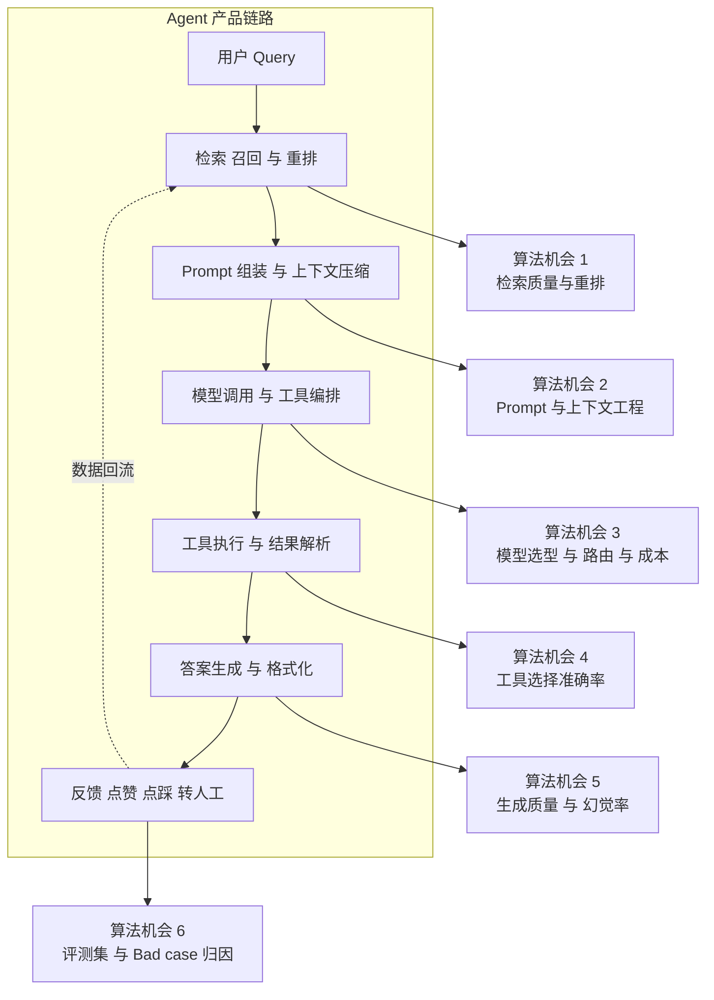
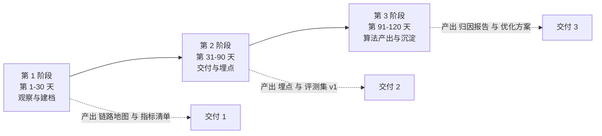
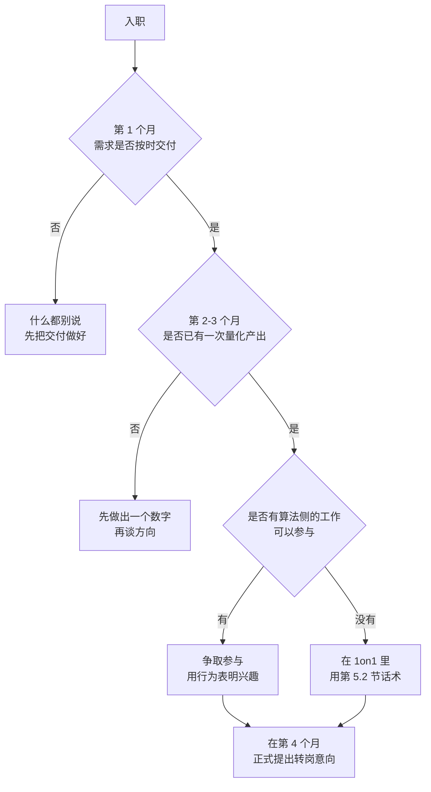

# 09 · 京东实习期的算法筹码经营

> **这一章讲的是你最容易浪费掉的四个月。**
> 2026-10-08 到 2027-02 底，你在京东科技-变色龙业务部-JoyAI产品部做 Agent 后端开发。四个月后你要去投大模型算法岗，面试官会问："你在京东做了什么？"
> 如果你的回答是"写了一些接口、接了一些第三方服务、优化了一些性能"，那这四个月在算法面试里的价值接近于零。
> 但如果你的回答是"我负责的检索链路把首答准确率从 A 提到 B""我做了 300 例 Bad case 归因，发现 62% 的错误来自分块策略并据此改进"——**这四个月就是你算法简历的第二条主线。**
> 这一章给你一套把工程工时转化成算法筹码的方法。

## 本章学习目标

1. 入职第 1 周就能识别出：哪些需求是"纯工程工时"，哪些能变成"算法产出"。
2. 掌握"工程问题 → 算法问题"的翻译方法，并能主动设计埋点与评测。
3. 建立一套周报/汇报写法，让 Mentor 与主管明确知道你在做效果优化，而不只是功能开发。
4. 在 2027-01 之前，攒出 1-2 个能写进算法简历的量化产出。
5. 体面地完成实习交接，拿到推荐信 / 内推资格 / 真实评价。

---

## 一、先把底线立清楚：业务交付不能出问题

**这是所有策略的前提。** 一个连需求都交付不了的实习生，没有任何筹码去谈"我想做算法相关的事"。

| 优先级 | 事项 | 说明 |
|-------|------|------|
| P0 | 分内需求按时按质交付 | 这是你获得信任与自由的唯一途径 |
| P0 | 线上不出事故 | 你写的代码是真实的业务链路 |
| P1 | 主动补埋点与日志 | 这是把工程活变成算法证据的**唯一手段** |
| P2 | 主动做 Bad case 归因 | 这是算法岗最认的能力 |
| P3 | 主动提效果优化方案 | 这是从"执行者"变"贡献者"的标志 |

> **顺序不能反。** 前 30 天不要急着讲"我想做算法"，先把第一个需求干净利落地交付掉，让 Mentor 觉得"这个人靠谱"。**信任是筹码，不是前提。**

---

## 二、机会地图：Agent 产品部里藏着的算法问题

JoyAI 这类 Agent 产品部的日常里，**到处是算法问题，只是它们平时被当成工程问题处理掉了**。下面这张表是你未来四个月的"挖矿地图"。

### 2.1 六个机会点：从工程动作到算法产出的翻译表

| # | 链路环节 | 典型工程需求 | **算法化改造后的产出** | 需要的埋点/数据 | 量化指标 |
|---|---------|------------|---------------------|---------------|---------|
| 1 | **检索召回与重排** | "把检索接口接到向量库" | 做召回策略对比（纯向量 / 混合检索 / RRF 融合 / Cross-encoder 重排），产出对比表与选型结论 | query、召回候选、排序分、最终采用 | Recall@K、MRR、NDCG、无答案率 |
| 2 | **分块与索引** | "把文档切块入库" | 做分块策略消融（固定长度 / 按标题层级 / 语义分块 / 重叠比例），产出分块-效果曲线 | 文档长度分布、块命中率、回溯率 | 命中块排名、平均召回块数 |
| 3 | **Prompt 与上下文** | "把 Prompt 调一下" | 做 Prompt 版本 A/B 实验，量化版本差异；做上下文压缩对效果与 token 成本的影响 | Prompt 版本号、输入输出 token、耗时 | 准确率、单请求成本、P95 延迟 |
| 4 | **模型选型与路由** | "接一个新模型" | 做模型选型矩阵（效果 × 成本 × 延迟），设计"简单问题走小模型、困难问题走大模型"的路由策略 | 问题难度标注、各模型输出、耗时、计费 | 准确率、¥/千次、P99 延迟 |
| 5 | **工具选择** | "给 Agent 加个工具" | 统计工具误选率、做工具描述优化实验、做工具数量的边际收益分析 | 每轮的工具选择、参数、执行结果 | 工具选择准确率、多轮完成率 |
| 6 | **评测与归因** | "用户反馈有点差" | **自建评测集 + Bad case 分类法 + 归因报告**，定位主要错误来源并排优先级 | 用户反馈、会话日志、人工标注 | 各类错误占比、Top 3 错误源 |

> **注意第 6 行。** 这是**性价比最高的一项**：它几乎不需要额外算力、不需要改代码，只需要你有耐心去读几百条真实会话并做分类。它产出的东西恰好是算法岗面试官最想听的（"你怎么发现问题、怎么定位、怎么排优先级"）。

### 2.2 哪些是"纯工程工时"（不要投入额外精力）

| 类型 | 例子 | 处理方式 |
|------|------|---------|
| 接口开发与联调 | 新增 CRUD 接口、对接第三方 SDK | 按时交付，不投入额外精力 |
| 运维与配置 | 改配置、加监控、修告警 | 按时交付 |
| 前端/后端约定 | 参数格式、错误码 | 按时交付 |
| 一次性脚本 | 数据订正、导表 | 交付，但**留下可复用版本**（体现工程素养） |

**判断标准**：这件事做完之后，能不能回答"它让什么指标变好了多少"？不能 → 纯工时；能 → 算法筹码。

---

## 三、四个月的三阶段经营法

### 3.1 第 1-30 天：观察与建档（**不要急着提方案**）

| 周 | 动作 | 交付物 |
|----|------|--------|
| W1 | 把负责链路的端到端流程画出来；跑通本地环境；读一遍核心代码 | 一张完整的链路图（含所有外部依赖） |
| W2 | 认全链路上下游负责人；问清"这个链路现在有什么效果问题" | 一份"待解问题清单"（≥10 条，来自真实同事反馈） |
| W3 | 捞 100-200 条真实会话日志，逐条读，做第一版 Bad case 分类 | **Bad case 分类 v1**（分类维度 + 各维度占比） |
| W4 | 找 Mentor 做一次 30 分钟对齐：我的初步观察 + 我想深入的方向 | 一份 1 页的观察笔记 |

**第 3 周那 200 条日志是整章的起点。** 大多数人这一步不做，于是永远只能"感觉效果不好"；你做了，就能说出"62% 的错误来自检索召回不足，其中又有 40% 是分块把表格切断了"——**这就是算法岗的语言。**

> **口径提示**：使用日志与数据前，**先确认合规边界**（哪些数据可以拉、能否导出、是否需要脱敏）。这个动作本身就体现专业度，也可以在面试里作为"数据合规意识"的例证。

### 3.2 第 31-90 天：交付与埋点（**关键动作是"加观测"**）

这一阶段的核心任务只有一个：**让你负责的链路变得可度量。**

| 动作 | 具体做法 | 为什么重要 |
|------|---------|-----------|
| **补埋点** | 在检索、重排、Prompt 组装、模型调用、工具执行五个环节各打一个结构化的日志事件 | 没有埋点，后面所有优化都无法归因 |
| **记 token 与成本** | 每次模型调用记录 input/output token、耗时、模型名 | 成本优化是算法岗的硬通货 |
| **建最小评测集** | 从真实会话里挑 100-300 条，人工标注"期望答案要点"，形成固定评测集 | **评测集是算法工作与工程工作的分水岭** |
| **做可复现的对比脚本** | 写一个能对同一批评测样本跑 A/B 的脚本 | 让别人能重复你的结论 |
| **跑第一次 A/B** | 例如两种分块策略、两种重排模型、两个 Prompt 版本 | 产出第一份量化对比表 |

> **"建评测集"这件事，无论团队有没有安排，你都要自己偷偷做一份。** 它对团队有价值（你会被认可），对你个人更是刚需——**面试时你说"我为这条链路建了 200 条真实场景评测集"，比说"我优化了 Prompt"强十倍。**

### 3.3 第 91-120 天：算法产出与沉淀

| 动作 | 交付物 | 面试用法 |
|------|-------|---------|
| 完成 1-2 个完整的"问题 → 归因 → 方案 → 验证"闭环 | 归因报告 + 优化前后对比表 | 项目深挖的主素材 |
| 写一份团队可复用的方法论文档 | 《xx 链路效果优化手册》 | 体现方法论沉淀能力 |
| 主动申请参与算法侧的工作 | 参与评测、数据标注、模型对比 | 争取到真实算法经历的背书 |
| 完成交接文档与代码 | 交接清单 + 复现脚本 | 拿到好评价与推荐 |

> **目标：到 2027-01 底，你手里至少有 1 个数字。** 哪怕只是"无答案率从 18% 降到 11%"——**一个真实的数字，胜过十句描述性的形容词。**

---

## 四、如何"合法地"从工程侧切进算法侧

直接说"我想做算法，不想写后端"是职场大忌。正确的路径是**用工程语言提出一个效果问题，然后主动承担它**。

### 4.1 三段式提案话术

| 段 | 话术模板 | 要点 |
|----|---------|------|
| **陈述现象** | "我在读会话日志时发现，xx 类的请求里有相当比例返回了空结果，我看了一下好像是召回阶段的策略问题。" | 用**观察**开场，不用**诉求**开场 |
| **给出假设** | "我的假设是分块策略把表格切断了导致召回不到，我想捞一批样本对比一下两种分块方式，大概需要 X 天。" | 有假设、有方法、有权衡 |
| **只求资源** | "我不需要额外人力，只需要能拉这批日志的权限，以及 X 天时间做对比。" | **降低对方决策成本**——这是关键 |

> **核心技巧：不要请求"做算法"，请求"做一次对比实验"。** 前者是身份变更（难批），后者是工作任务（好批）。做完对比实验，你就已经有一只脚在算法侧了。

### 4.2 让 Mentor 记住你在做效果

| 场合 | 正确说法 | 错误说法 |
|------|---------|---------|
| 周报 | "完成检索埋点；读完 200 条会话，初步结论：62% 错误在召回侧" | "继续开发检索模块" |
| 站会 | "对比了两种分块策略，按标题分块的无答案率低 6 个点，建议切换" | "分块改完了" |
| 汇报 | "我把这条链路的评测集建起来了，以后每次改动都能量化收益" | "做了点测试" |

**同一个工作，说法不同，在别人记忆里的价值差一个量级。** 这不是包装，这是**信息压缩**——把过程压缩成结论，把工时压缩成指标。

---

## 五、向上管理：什么时候、怎么说出"我想转算法"

### 5.1 时机判断

**最佳时机：第 3 个月末的 1on1。** 太早（还没证明自己）显得轻浮；太晚（马上要走）显得功利。

### 5.2 1on1 话术模板

> "我想跟你同步一下我的想法，也想听听你的建议。
> 这三个月我主要在做 xx 链路，交付上没问题。我自己额外做了 xx 的归因分析，发现效果主要卡在 xx 环节。在这个过程中我越来越确定，我更想往算法/效果优化的方向走。
> 我不是想不做工程——我发现我很多优势恰好在这里，比如我懂分布式、会做性能剖析，我觉得在训练和推理侧能用上。
> 所以我想问两个问题：① 团队里有没有相关的项目我可以参与？② 从你角度看，我应该在哪些方面再补一补？"

| 要素 | 作用 |
|------|------|
| 先讲交付 | 证明你不是逃避当前工作 |
| 再讲观察 | 证明你的兴趣是"做出来的"，不是"想出来的" |
| 主动承认工程价值 | 避免被理解成"嫌弃现在的活" |
| **以提问结尾** | 把对话变成"求建议"而不是"提要求"，对方更愿意投入 |

> **如果团队确实没有算法侧机会**：那就在内部争取"参与评测/数据/模型对比"这类边缘算法工作，同时把主要精力放在[第 06 章](./06-核心项目-多模态小模型从零训练)的自研项目上。**不要因为没有内部机会就放弃，也不要因此消极怠工。**

### 5.3 离职与交接（2027-02）

| 时间 | 动作 |
|------|------|
| 离职前 4 周 | 与主管沟通结束时间，给出明确日期 |
| 离职前 3 周 | 写交接文档：链路图、模块说明、待办清单、已知问题、复现脚本 |
| 离职前 2 周 | 交接代码与权限，做一次正式讲解 |
| 离职前 1 周 | 收尾所有未完成项，留下清晰的下一步建议 |
| 离职时 | **礼貌地要一句评价 / 推荐**："如果之后我投其他岗位，方便跟你做个背景沟通吗？" |

> **一句来自大厂的正向评价，在后续算法岗背调与内推里价值很高。** 而且京东的实习经历本身是你 2027 春投算法岗时的"大厂背书"——**背景调查会核实你的实习内容，所以千万不能夸大**（见[第 11 章](./11-2028届秋招规划与简历转化)的诚实边界）。

---

## 六、简历条目转换模板

把实习经历改成算法语言，用这个四段式：

| 段 | 内容 | 例子 |
|----|------|------|
| **场景** | 什么业务、什么链路、多大流量 | "JoyAI 对话链路的检索环节，日均 xx 次请求" |
| **发现** | 你观察到的问题 + 归因方法 | "通过 200 例会话归因，发现 62% 错误源于召回不足" |
| **动作** | 你做了什么可复现的实验/改造 | "建立 200 条真实场景评测集；对比 3 种分块策略与 2 种重排模型" |
| **结果** | 量化结果 + 诚实边界 | "无答案率从 18% 降至 11%；未做线上全量验证，仅离线评测集口径" |

**示例（虚位以待，你入职后填真实数字）**：

> **京东科技 · JoyAI 产品部 · Agent 后端开发实习（2026.10 - 2027.02）**
> - 负责 xx 对话链路的检索与编排模块，日均处理 xx 次请求
> - 通过 200 例真实会话 Bad case 归因，定位检索召回为主要错误来源（占 62%），建立 200 条固定评测集
> - 对比 3 种分块策略与 2 种重排方案，离线评测下无答案率由 18% 降至 11%
> - 补充检索链路结构化埋点，使效果改动可量化归因

**注意最后一条**——它写的是"让效果可度量"，这是**方法论贡献**，比一个具体数字更让面试官认可。

---

## 七、常见误区

| 误区 | 后果 | 正确做法 |
|------|------|---------|
| "反正要走了，混过去就行" | 浪费唯一一段"真实业务 + 有收入 + 有时间"的窗口 | 主动挖算法问题，攒数字 |
| "我要做算法，所以不想写业务代码" | 快速失去信任，什么都拿不到 | 先把交付做好，再争取 |
| "没有埋点就没法量化" | 等别人加埋点，等到离职 | **自己加**（在不破坏线上稳定的前提下） |
| "我把 Prompt 调好了就算算法产出" | 面试被追问时就穿帮 | 必须有评测集与量化对比 |
| "多拉数据总没坏处" | 合规风险 | 先确认合规边界 |
| "离职前不用交接" | 拿不到评价，也可能进黑名单 | 交接文档是给自己攒口碑 |
| "简历上把工程经历写成算法经历" | 背调或追问时穿帮，比没有更糟 | 保留真实边界，用新项目承担算法叙事 |

---

## 八、面试问答（8 题，带参考答案）

**Q1：你在京东实习做的是后端，为什么简历上看起来在做算法？**
A：我做的确实是 Agent 后端开发，这一点我不会美化。但在这四个月里，我主动把我负责链路的"效果问题"当成我的工作：我读了 200 多例真实会话做 Bad case 归因，发现 62% 的错误来自召回环节；我建了一条 200 例的固定评测集，这样每次改动都能量化；我对比了三种分块策略和两种重排方案，把无答案率从 18% 降到 11%。所以我的准确表述是：**我在后端岗位上承担了效果优化的职责**，而不是我做了算法岗。

**Q2：你那个 11% 的结论可靠吗？**
A：有三个限制我要说清楚：① 它是离线评测集口径，不是线上 A/B；② 评测集只有 200 例，人工标注的期望答案有一定主观性；③ 我只跑了一次，没有做多次采样的方差。所以我的结论是"在这套评测口径下，新策略明显更优"，而不是"线上一定提升 7 个点"。要严格验证需要做线上 A/B 与更大规模的评测集。

**Q3：你怎么做 Bad case 归因的？分类维度怎么定的？**
A：我先不带预设地读了前 100 条，用开放编码归纳出错误类型，最后收敛到 5 类：召回不足、召回错误、上下文超长被截断、模型幻觉、工具参数错误。分类时定了一条规则：**每条案例必须归到唯一一类**，如果归不进去就说明分类维度还不够。分类完成后我做了两次自标注的一致性检查，不一致的部分重新定义边界。

**Q4：你提的优化方案，团队成员认可吗？**
A：我用的方法是把方案拆成"可验证的小实验"再提，而不是直接提一个大改造。比如我没有说"我们应该重构检索"，而是说"我想花两天对比两种分块方式，用现成的评测集出个数"。这样决策成本很低。结果出来后，团队的接受度就高很多。

**Q5：你加了哪些埋点？为什么加这些？**
A：在五个环节各加一个结构化事件：检索、重排、Prompt 组装、模型调用、工具执行。每个事件记录输入摘要、候选数量、耗时、token 数、输出版本号。加这些是因为我发现当时**任何效果问题都只能靠"感觉"讨论**——没人能回答"上周改的那版 Prompt 到底让准确率变化了多少"。有了埋点之后，效果改动第一次变得可归因。

**Q6：如果团队不让你做这些额外的事呢？**
A：那我就在自己的时间里做。我确实有一份自己维护的评测集和对比脚本，没有依赖团队资源。我认为"想清楚一个问题"这件事不需要授权，需要的是数据和耐心。而且做完之后有结论，再去讨论就容易被接受。

**Q7：这四个月你最大的收获是什么？**
A：我原本以为算法岗的门槛是数学和框架。做完这段实习我发现，**真实业务里最难的是"定义问题"**——把一个模糊的"效果不好"拆成可测量、可归因、可验证的子问题。这件事我在工程侧做过很多次（性能剖析、故障归因），迁移过来后适应得很快。这也是我愿意转算法的原因之一。

**Q8：你在京东有拿到算法相关的工作吗？**
A：（诚实回答）有/没有。有的话讲具体做了什么；没有的话说清楚：我在后端岗位上做了效果优化的工作，但确实没有直接训练模型的经验——**这也是我在业余时间自己从零训了一个多模态小模型的原因。** 我不回避这个边界。

---

## 九、自测清单

**第 1 个月**
- [ ] 我能画出我负责链路的完整端到端图，含所有外部依赖
- [ ] 我读完并分类了至少 100 条真实会话日志
- [ ] 我有一份"待解问题清单"，≥10 条，来自真实反馈而不是我的猜测
- [ ] 我确认过日志与数据的合规使用边界
- [ ] 我的第一个需求按时交付，没有被返工

**第 2-3 个月**
- [ ] 我在关键环节补齐了结构化埋点
- [ ] 我建了一份 ≥100 例的固定评测集
- [ ] 我有一份可复现的 A/B 对比脚本
- [ ] 我至少完成了一次量化对比实验，产出了数字
- [ ] 我的周报里出现过"指标/占比/提升"这类词

**第 4 个月**
- [ ] 我有一个完整的"问题 → 归因 → 方案 → 验证"闭环
- [ ] 我的简历条目里至少有一个真实数字，且能说清它的口径与局限
- [ ] 我在 1on1 里表达过方向意向，并得到了具体建议
- [ ] 我写了交接文档，并做了正式讲解
- [ ] 我拿到了主管或 Mentor 的正向评价 / 推荐意愿

---

## 下一步

1. **入职第 1 周**：完成第 3.1 节的 W1 动作，把链路图贴在自己的笔记里。
2. **入职第 3 周前**：读完 200 条会话日志——**这一步是整章的起点，越早越好**。
3. **入职第 4 周**：用第 4.1 节的三段式话术，向 Mentor 提一个"两天能做完的对比实验"。
4. **同步进行**：把[第 06 章](./06-核心项目-多模态小模型从零训练)的项目当作主业之外的第二主线，晚上推进，不要因为实习忙就断掉。
5. **离职前**：按第 5.3 节完成交接，并读[第 10 章](./10-大模型算法日常实习投递与面试)开始投递。
