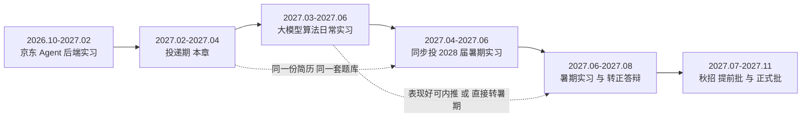
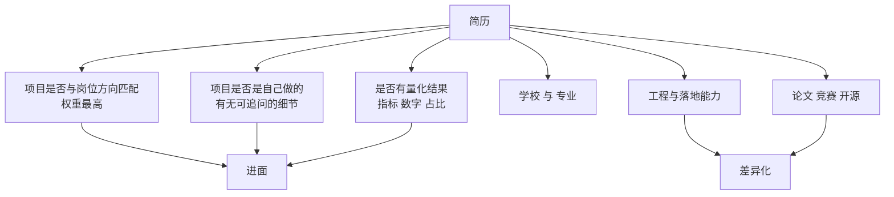
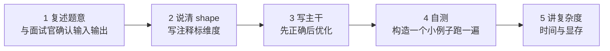
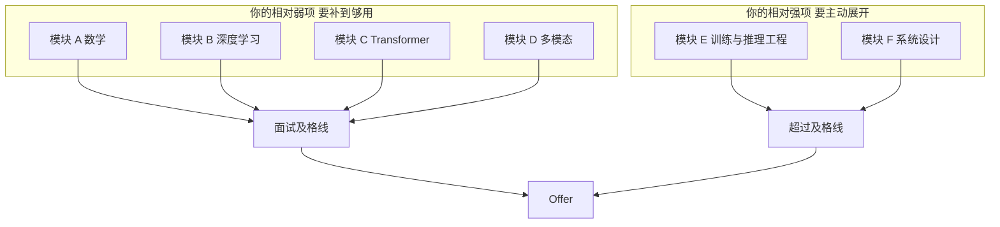
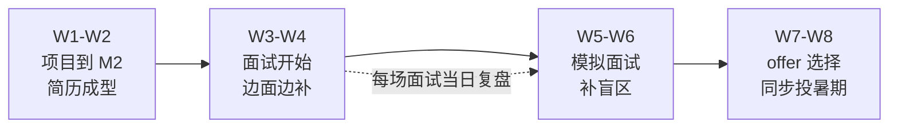

# 10 · 大模型算法日常实习投递与面试

> **本章解决 2027 年 2-4 月那场仗怎么打。**
> 时间点：2027-02-06 前后你从京东离职，目标是拿到一个「大模型相关算法」的日常实习。
> 这场仗和 2026 年那场（找 Agent 后端实习）有三个本质区别：
> ① **门槛更高**——算法岗要考推导、要考手撕、要深挖项目，八股背不动；
> ② **你更被动**——你的项目只有 M1-M2 的进度，指标不好看；
> ③ **它是跳板**——这个实习的质量直接决定你 2027 秋招的天花板。
> 所以本章不教你"怎么海投"，而教你"**用最小可交付的项目换取最大概率的入场券**"，以及面试现场怎么把"单卡小项目"讲成"我懂训练"。

## 本章学习目标

1. 明确 2027 春的投递窗口、目标公司与岗位分层，排出一份 8 周作战表。
2. 掌握算法岗简历的筛选逻辑，把你的项目改写成能过筛的形态。
3. 掌握算法岗**特有的手撕题清单**，并能在白板/共享编辑器里 20 分钟写完。
4. 准备一份覆盖数学、深度学习、Transformer、多模态、训练工程、系统设计的**六模块题库**。
5. 能在面试里用"项目不足 + 工程优势"的组合完成反杀，并做出正确的 offer 选择。

## 前置依赖

| 依赖 | 说明 |
|------|------|
| [06 章](./06-核心项目-多模态小模型从零训练) 至少完成 M2 | 没有可讲的算法项目，投递算法岗是**纯送人头** |
| [08 章](./08-评测体系与技术报告) 报告初稿 | 项目深挖的弹药 |
| [09 章](./09-京东实习期的算法筹码经营) 的量化产出 | 简历第一条主线 |
| [04 章](./04-Transformer与LLM原理手推)、[03 章](./03-PyTorch与训练工程地基) | 手撕与八股的基础 |

> **硬门槛**：如果到 2027-02 你的项目还是"数据没跑通"，那么**先花 3 周补到 M2，再投递**。3 月投比 2 月投晚，但比 2 月投出去被挂进系统的黑名单要好。

---

## 一、先把战场看清楚：日常实习、暑期实习、秋招的关系



| 名称 | 时间窗口 | 转正/转化可能 | 你的策略 |
|------|---------|-------------|---------|
| **日常实习** | 全年滚动，**2-4 月是春节后高峰** | 看团队；好的团队有转正名额 | **主攻**。这是本章重点 |
| **暑期实习** | 3-5 月投递，6-8 月入职 | ✅ **最正规的转正通道** | **必投**。哪怕已有日常实习，也要投暑期 |
| **秋招提前批** | 7-8 月 | — | 暑期实习期间同步投 |
| **秋招正式批** | 8-11 月 | — | 见[第 11 章](./11-2028届秋招规划与简历转化) |

> **一个关键判断：不要为了"先有个日常实习"而放弃暑期实习投递。** 很多人 3 月拿到一个日常实习就安心了，结果 5 月发现暑期实习是转正主通道，而自己因为"在实习没时间准备"错过了投递。**正确做法：3 月拿日常实习，4 月同步投暑期实习，两个都进行。**

---

## 二、目标岗位分层与投递清单

### 2.1 岗位分层（按你的可达性排序）

| 层级 | 岗位类型 | 典型要求 | 你的可达性 | 投递优先级 |
|------|---------|---------|-----------|-----------|
| **第一梯队** | 大厂多模态/VLM 算法实习 | 有训练经验、顶会优先 | ⚠️ 低概率但值得投 | ★★★☆☆ 投 2-3 家，博概率 |
| **第二梯队** | 大厂大模型应用算法实习（RAG/Agent 算法/评测/推理优化） | 懂 LLM + 有线上经验 | ✅ **命中率最高** | ★★★★★ 主力 |
| **第三梯队** | 中厂 / AI 创业公司 多模态算法实习 | 会 PyTorch + 有项目即可 | ✅ 高 | ★★★★★ 主力，也是拿 offer 保底的核心 |
| **第四梯队** | 科研院所 / 实验室 算法实习 | 看重研究潜力 | ✅ 中 | ★★★☆☆ 可作为过渡 |

> **投递结构建议**：第一梯队 2-3 家 + 第二梯队 6-8 家 + 第三梯队 8-10 家。**总量 20 家左右**，用"低概率高上限 + 高概率保底"的组合覆盖。

### 2.2 投递渠道

| 渠道 | 适用 | 注意 |
|------|------|------|
| 公司招聘官网 / 校招系统 | 所有大厂 | 一次只能投 1-2 个岗位，**岗位选择要慎重** |
| **内推** | 首选 | 京东的同事、师兄师姐、社群；内推能查进度、有时能免简历筛选 |
| 牛客 / 实习僧 / Boss 直聘 | 中厂与创业公司 | 响应快，适合走量 |
| 实验室 / 导师推荐 | 科研院所、部分大厂 | 有导师资源务必用 |
| 开源社区 / 论文作者 | 顶尖团队 | 给论文作者发自荐邮件，**附上你的复现报告**，命中率意外地高 |

> **一个高杠杆动作**：把[第 06 章](./06-核心项目-多模态小模型从零训练)的项目写成一篇**技术报告**，公开在 GitHub 上，然后给相关论文的作者/团队发自荐邮件，附报告链接。这在多模态方向上成功率不低，而且**完全不需要你有顶会论文**。

---

## 三、简历：算法岗的筛选逻辑

### 3.1 算法岗简历筛选看什么（按权重）



**结论：项目匹配度 > 项目真实性 > 量化结果 > 学校 > 论文。** 所以你第一件要做的事是把[06 章](./06-核心项目-多模态小模型从零训练)的项目**按目标岗位方向重命名与重描述**。

### 3.2 一份算法岗简历的结构（一页）

| 板块 | 篇幅 | 内容 |
|------|------|------|
| 基本信息 | 3 行 | 姓名、2028 届硕士、学校专业、可实习时间、GitHub |
| **算法项目** | **40%** | 06 章的从零训练项目（主）+ 一个衍生实验（辅） |
| 实习经历 | 25% | 京东的量化产出（[09 章](./09-京东实习期的算法筹码经营)） |
| **工程能力** | **15%** | 分布式/服务化/性能剖析——**这是你的差异化，必须单列** |
| 技能清单 | 10% | PyTorch、Python、Go、分布式训练、量化、vLLM |
| 其他 | 10% | 竞赛、开源、论文（有就写） |

> **一个反常识建议：把"工程能力"单列成一块。** 大多数算法候选人没有这一块，而招聘方看到"懂分布式 + 会做性能剖析 + 有生产经验"会明显加分——尤其在做大模型训练/推理的团队眼里。

### 3.3 项目描述模板（三行法）

> **多模态图文检索模型从零训练（单卡 12GB）**　[GitHub 链接]
> - 在单张消费级显卡上从零（随机初始化）训练 2000 万参数 CLIP 式双塔模型：自训 8000 词表中文分词器，自建 10 万中文图文对数据集（含去重/相关性/质量三层过滤）
> - 针对单卡 batch 受限导致负样本不足的核心问题，实现 GradCache 梯度缓存将有效 batch 从 128 提升至 512，并对比动量队列方案；实现分层注意力池化修复 padding 取值错误
> - 建成 1000 对隔离评测集，完成 6 组消融（负样本规模/温度系数/编码器初始化/数据规模/分辨率/困难负样本）；i2t R@1 从随机初始化的 0.1% 提升至 xx%，双 seed 报告均值与标准差

**三行的分工**：第一行讲**做了什么**，第二行讲**解决了什么技术难题**（这是最值钱的一行），第三行讲**怎么证明有效**。

### 3.4 绝对不能写的三句话

| 不能写 | 为什么 | 改写成 |
|-------|-------|-------|
| "从零训练了一个多模态大模型" | 20M 参数不叫大模型，一问就穿 | "从零训练 2000 万参数多模态双塔模型" |
| "指标达到 SOTA" | 不可能，且面试官会当场要求对比条件 | "在同规模从零训练变体中取得最优配置" |
| "熟悉大规模分布式训练" | 你只在云上跑过 2 卡，说"熟悉"必被追问穿 | "完成单机多卡 DDP 实验与通信量估算，理解 ZeRO/FSDP 切分原理" |

> **诚实边界原则**（沿用[面试项目深挖](/面试项目深挖/)栏目的做法）：**不能吹的点一个都别吹。** 算法岗面试官的追问深度足够把任何夸大挖出来，而被挖出来的代价是"不诚信"标签，比"经验不足"严重得多。

---

## 四、算法岗特有的手撕题清单

**这是和后端面试最大的差异。** 后端面试手撕算法题（LeetCode），算法岗还要手撕**模型相关的代码**。以下是高频清单，**每一题都要练到 20 分钟内能在白板或共享编辑器写完**。

| # | 题目 | 考察点 | 常见失分 |
|---|------|-------|---------|
| 1 | **手写 Multi-Head Self-Attention** | shape 变换、mask、缩放 | head_dim 算错；忘记 reshape 回 seq_len；mask 填 -inf 位置错 |
| 2 | 手写 LayerNorm / RMSNorm | 归一化维度、eps 位置 | 归一化维度搞错（要在最后一维） |
| 3 | 手写对称 InfoNCE 损失 | 相似度矩阵、对角线正样本、温度 | 只算单向；忘记 L2 归一化；目标标签写错 |
| 4 | 手写 top-k / top-p 采样 | 排序、阈值、重归一化 | top-p 的累积概率边界处理 |
| 5 | 手写卷积 / 池化（不调库） | 索引、padding、stride | 边界索引越界 |
| 6 | 手写一个完整训练循环 | 梯度清零、反传、更新、验证 | **忘记 `optimizer.zero_grad()`** |
| 7 | 手写带 mask 的 CrossEntropyLoss | 忽略 padding 位 | `ignore_index` 用错 |
| 8 | 手写 RoPE 位置编码 | 旋转矩阵构造 | 把相邻两维配对搞错（应成对旋转） |
| 9 | 手写 KV Cache 的增量推理 | 拼接与复用 | 每步重算全部 KV |
| 10 | 手写 DDP 的训练入口 | dist init、sampler、all_reduce | 忘记 `set_epoch`；只 rank0 打印 |
| 11 | 实现梯度累积 | loss 缩放 | 忘记除以累积步数 |
| 12 | 实现 GradCache | 两阶段前向、梯度回灌 | 忘记 `detach` 导致显存爆炸 |

### 4.1 手撕题的通用应答结构



> **面试官最看重的不是"一次写对"，而是"你有没有自己的验证习惯"。** 写完主动说"我用 batch=2、seq=3、dim=4 的输入走一遍"，比闷头写 20 分钟强得多。这也是工程背景的人天然的优势——**你的调试直觉在这里是溢价的**。

### 4.2 练习方法

| 阶段 | 做法 | 达标 |
|------|------|------|
| 第 1 遍 | 对着参考实现抄一遍，理解每一行 | 能解释每行作用 |
| 第 2 遍 | 合上参考，在 IDE 里写，跑单测 | 通过 shape 与数值断言 |
| 第 3 遍 | 在白板/纸/纯文本编辑器里写，**不运行** | 20 分钟内写完，无语法错误 |
| 第 4 遍 | 边写边讲（录音回听） | 讲与写同步，不卡壳 |

---

## 五、六模块题库

按模块准备，**每个模块的输出是一份"能脱稿讲 60 秒 + 接住 2 层追问"的答案**。

### 模块 A：数学（对应[第 02 章](./02-数学地基最小集)）

- 为什么注意力要除以 sqrt(d_k)？
- 交叉熵与 KL 散度、极大似然估计的关系？
- L1/L2 正则分别对应什么先验？为什么 L1 稀疏？
- Adam 和 AdamW 的区别？为什么 weight decay 不该作用在 LayerNorm 上？
- 为什么 LoRA 可以做低秩分解？秩怎么选？
- 手推 softmax + 交叉熵的梯度。

### 模块 B：深度学习基础

- BN / LN / RMSNorm 的区别与适用场景？BN 为什么在 NLP 里不好用？
- Dropout 在训练/推理时的差异？为什么能防过拟合？
- 梯度消失/爆炸的成因与解法？
- 学习率 warmup 为什么有用？
- batch size 与学习率的关系？
- 混合精度训练为什么要 loss scaling？bf16 为什么不需要？
- 过拟合怎么判断、怎么缓解？

### 模块 C：Transformer / LLM（对应[第 04 章](./04-Transformer与LLM原理手推)）

- 手推 Self-Attention 的 shape 变化。
- 位置编码三代演进，RoPE 为什么能编码相对位置？
- Pre-LN vs Post-LN？
- 为什么 decoder-only 成为主流？
- KV Cache 缓存了什么、显存怎么算？
- 解码策略有哪些、各自副作用？
- 长文本有哪些方案？（稀疏/滑窗/线性注意力/FlashAttention）
- MoE 是什么、优缺点？

### 模块 D：多模态（对应[第 05 章](./05-多模态原理与架构谱系)）

- CLIP 的对称 InfoNCE 与可学习温度？为什么 batch 越大越好？
- SigLIP 的 sigmoid loss 解决了什么问题？
- BLIP-2 的 Q-Former 为什么存在？和线性投影比优劣？
- LLaVA 只训投影层为什么有效？缺点是什么？
- 视觉 token 太多怎么处理？（池化/重采样/动态分辨率）
- 扩散模型的前向加噪与反向去噪？CFG 是什么？
- DiT 相比 U-Net 的优势？

### 模块 E：训练与推理工程（**你的主场**，对应[第 07 章](./07-训练与推理工程进阶)）

- 训练显存由哪几部分组成？1B 参数全参训练需要多少显存？
- DDP 和 DP 的区别？all-reduce 通信量怎么估算？
- ZeRO 三级分别切什么？FSDP 和 ZeRO-3 什么关系？
- 梯度检查点为什么省显存、代价是什么？
- 怎么判断训练瓶颈是算力还是通信？
- vLLM 为什么快？PagedAttention 解决什么问题？
- 量化方案怎么选？PTQ 和 QAT 的区别？
- **显存不够时你的优化优先级顺序是什么？**

### 模块 F：系统设计与业务落地（**你的主场**）

- 设计一个大模型推理服务，如何同时满足延迟与成本约束？
- 一个 RAG 系统效果不好，你怎么定位问题、怎么排优先级？
- 怎么为一条对话链路建评测集？评测集怎么保证不污染？
- 训练数据管线怎么设计？怎么保证可复现？
- 训练任务在 K8s 上怎么调度？GPU 怎么共享？

> **E、F 两个模块是你唯一能"以高于岗位要求"作答的地方。** 面试官问到这里时，要主动展开、给出数字、给出取舍——**这是你从"合格的算法候选人"变成"想要的算法候选人"的地方。**



---

## 六、项目深挖：20 个必问题

面试官挖项目一定按"**是什么 → 为什么这么做 → 怎么证明有效 → 如果重来**"四层推进。先把 20 个问题自己答一遍，录音回听。

| 层 | 问题 |
|----|------|
| **是什么** | 1. 一句话讲清你的项目做了什么？<br/>2. 数据从哪来、多少、怎么处理？<br/>3. 模型结构是什么、多少参数、为什么这么设计？<br/>4. 训练配置是什么（lr/batch/epoch/精度）？<br/>5. 最终指标是多少、怎么测的？ |
| **为什么** | 6. 为什么选 CLIP 式双塔而不是 VLM？<br/>7. 为什么用 InfoNCE 而不是 MSE？<br/>8. 为什么用可学习温度？<br/>9. 为什么视觉塔从零训练，不加载预训练权重？<br/>10. 为什么 batch 这么小、怎么解决的？<br/>11. 为什么用这个池化方式？<br/>12. 为什么分数低还能说明你学到了东西？ |
| **怎么证明** | 13. baseline 是什么？<br/>14. 怎么证明提升是方案带来的而不是运气？<br/>15. 评测集会不会有偏？怎么保证不污染？<br/>16. 过拟合了吗？<br/>17. 你有几组消融、结论分别是什么？<br/>18. 训练中遇到过什么故障、怎么排查的？ |
| **如果重来** | 19. 给你 8 卡 A100，你会先做什么？<br/>20. 这个项目最大的不足是什么？如果重做你会改什么？ |

> **第 20 题是关键题。** 面试官靠它判断你是否有"研究品味"——**能准确说出自己项目弱点的人，比能把项目吹上天的人可信得多。** 准备一个真诚、具体、有技术含量的答案，例如："我把主要精力放在了负样本规模的工程解法上，但对数据质量的处理偏浅。如果重来，我会先做一轮更严格的图文相关性过滤并量化它对最终指标的影响，因为消融里困难负样本那一组带来的提升说明数据质量可能是更主要的瓶颈。"

---

## 七、8 周作战表

| 周 | 时间 | 简历与项目 | 刷题与八股 | 投递与面试 |
|----|------|-----------|-----------|-----------|
| W1 | 02.07-02.13 | 项目补到 M2；整理代码与报告初稿 | 手撕 1-6 题 | 整理投递清单（20 家） |
| W2 | 02.14-02.20 | 报告初稿；简历第一版 | 手撕 7-12 题；模块 C、D | **开始投递第一批（8 家）** |
| W3 | 02.21-02.27 | GitHub 仓库整理成可展示形态 | 模块 A、B | 第一批面试；投第二批（6 家） |
| W4 | 02.28-03.06 | 20 个必问题自答录音 | 模块 E、F | 面试 + 复盘 |
| W5 | 03.07-03.13 | 按面试反馈补项目短板 | **模拟面试 3 场** | 投第三批（6 家） |
| W6 | 03.14-03.20 | 报告定稿；项目讲解视频 | 手撕复习 + 追问演练 | 面试密集期 |
| W7 | 03.21-03.27 | **同步投递 2028 届暑期实习** | 面经复盘与盲区清零 | 面试 + offer 谈判 |
| W8 | 03.28-04.03 | offer 比较与决定 | — | **入职准备** |



> **节奏原则：不要等"准备好"再投。** 算法岗的面试本身就是最好的练习。**第一批投 8 家作为试水**，被挂掉的反馈（问到了什么、卡在哪）比你自己闷头准备一周都有用。

---

## 八、每场面试后的复盘模板

**当场记录，不要等晚上。** 面试后 10 分钟内的记忆是最完整的。

```text
【公司/岗位】：
【轮次】：一面 / 二面 / 三面 / HR
【时长】：
【被问到的问题（按顺序，尽量原话）】：
  1.
  2.
  3.
【我答得好的】：
【我卡住的】：
【我答错的 / 不知道的】：
【下次要补的三个点】：
【对公司/团队的判断】：
```

> 每 3 场面试做一次汇总，找出**重复被问到的题**——那就是你的高频盲区，优先级最高。

---

## 九、Offer 选择的判断标准

日常实习的选择逻辑和后端岗不同：**算法含量 > 直属 mentor > 公司名气 > 薪资**。

| 维度 | 权重 | 判断方法 |
|------|------|---------|
| **算法含量** | ★★★★★ | 问清楚："我具体做什么？是训模型、做数据、做评测，还是又要写业务后端？" ——**如果回答偏向后端，慎重** |
| **Mentor 的水平与带人意愿** | ★★★★★ | 问："之前带过实习生吗？实习生一般产出什么？" |
| **是否有转正 / 内推机会** | ★★★★☆ | 问："团队有转正名额吗？实习表现好能推秋招吗？" |
| 公司名气 | ★★★☆☆ | 有品牌背书更好，但不是第一位 |
| 薪资 | ★★☆☆☆ | 日常实习薪资差异不大，不要为几百块放弃算法含量 |
| 通勤与出勤 | ★★★☆☆ | 你还在读书，出勤天数要谈清楚 |

> **一个反直觉的建议**：如果一家中厂/创业公司能给你**真正的算法工作 + 一个愿意带你的 mentor**，而一家大厂只能让你"接着写后端"，**选中厂**。你这次实习的目的是攒算法经历，不是刷简历上的公司名——公司名你在京东已经有了。

---

## 十、面试问答（8 题，带参考答案）

**Q1：你没有顶会论文，也没有大模型训练经验，为什么我们要招你？**
A：两个理由。第一，我确实没有论文和大规模训练经验，这是我的短板，我不会美化。但我用一个可验证的方式补了一部分：我在单卡上从零训了一个多模态双塔模型，走了完整的"数据构造 → 实现 → 训练 → 评测 → 消融"闭环，并且量化解决了单卡下负样本不足这个核心矛盾。这说明我理解训练过程中的真实问题，而不只是会调包。
第二，我有大多数算法候选人不具备的工程深度：我会算显存预算、知道怎么判断训练瓶颈是算力还是通信、做过生产系统的性能剖析和部署。我认为在训练和推理的效率问题上，我的起点比纯算法背景的同学更高。

**Q2：你的项目指标这么低，有什么价值？**
A：它的价值不在指标，在于过程的可验证性。我在报告里明确写了不可比：我是 10 万数据、2000 万参数、单卡从零训练，和亿级数据预训练模型不是同一件事。真正的价值是我解决了一个真实约束下的目标冲突——对比学习要靠大 batch 提供负样本，但我只有 12GB 显存。我把解法拆成梯度累积、GradCache、动量队列三档，量化了每档的收益和代价，最后给出单卡场景下的最优组合。这个"识别冲突 → 拆解手段 → 量化权衡 → 给结论"的过程，我觉得比一个指标数字更能说明问题。

**Q3：你这些实验跑了多久？算力从哪来？**
A：本地一张消费级显卡，加上偶尔按小时租云卡跑多卡实验。总的训练时间其实不多——2000 万参数在单卡上训一轮只要几十分钟。我大概 80% 的时间花在数据准备、代码调试和评测脚本上。这也是我做这个项目最大的认知变化：小模型场景下瓶颈不是算力，是数据质量和实现正确性。

**Q4：如果让你现在就上手我们的项目，你觉得你最大的障碍是什么？**
A：规模。我现在所有的经验都是单卡、千万参数量级。真实的业务模型可能是几十上百亿参数、多机多卡，我理解 DDP、ZeRO、张量并行的原理，也在云上跑过 2 卡实验，但没有真正排查过大集群的通信与稳定性问题。这个只能在实际项目里补。我的优势是我对分布式系统的理解比较扎实，进入这个场景的适应成本应该不高。

**Q5：你说你懂分布式，能说下 all-reduce 的通信量怎么估吗？**
A：（按[第 07 章](./07-训练与推理工程进阶)作答）以 N 卡数据并行为例，梯度 all-reduce 通信量与参数规模成正比，使用 ring all-reduce 时每张卡的通信量约为 `2 × (N-1)/N × 参数量 × 字节数`。以 1B 参数、bf16 为例，每张卡的通信量大约在 GB 量级；这也是为什么梯度累积和梯度压缩能在大规模训练里显著受益。另外 ring all-reduce 的耗时还受带宽与延迟影响，所以在同机 NVLink 和跨机 IB 上表现差别很大——这跟分布式一致性协议里的消息模式其实是同一类问题。

**Q6：为什么从京东离职来投算法岗？京东不是大厂吗？**
A：京东那段经历对我价值很大，我在那儿第一次接触到真实的 Agent 业务链路。但它是一个 Agent 后端开发岗，我在里面做的是效果优化而不是训练模型。我想做的是算法方向，所以需要一段真正的算法实习。这不是对京东的不满，是我对自己方向的确认。

**Q7：如果实习期间我们发现你算法能力不够，你会怎么办？**
A：我会承认短期内确实有差距，但我有一个已经验证过的学习方式：遇到不懂的先跑通、再用实验反推原理。我补 PyTorch 和数学就是这个路径——先让训练跑起来，再回来补推导。另外我希望能在入职前跟 mentor 确认一下要补的前置知识，我会在入职前补掉。

**Q8：你还有什么问题问我们？**
A：（准备 3 个真问题，不要问薪资福利）
- "我如果来，前两个月大概会做哪部分工作？"
- "团队现在最想解决的技术问题是什么？"
- "对实习生有什么期待？什么样的表现算好？"

---

## 十一、自测清单

**投递前**
- [ ] 我的项目至少完成了 M2（有可信指标与 baseline 对照）
- [ ] 我的简历有一个专门的"算法项目"板块，占 40% 篇幅
- [ ] 我的简历里**没有**任何夸大表述（见第 3.4 节三条禁令）
- [ ] 我的 GitHub 仓库能一键复现，README 一页说清
- [ ] 我的投递清单 ≥20 家，分四个梯队

**面试前**
- [ ] 手撕清单 12 题，每题都能 20 分钟内在纯文本编辑器写完
- [ ] 六模块题库我都能脱稿讲 60 秒
- [ ] 20 个项目必问题逐题答过并录音
- [ ] 我能讲清"为什么转算法"并接住三层追问
- [ ] 我准备了 3 个反问

**面试后**
- [ ] 每场面试当日填了复盘模板
- [ ] 每 3 场做一次高频盲区汇总
- [ ] 我把新学到的知识点补进了题库
- [ ] 被挂掉时我记录了原因，而不是只记住"被拒了"

**决策**
- [ ] 我用第 9 节的标准比较 offer，而不是只看公司名或薪资
- [ ] 我问清了"具体做什么"和"有没有转正机会"
- [ ] 我同步投递了暑期实习，没有因为已有日常实习而放弃

---

## 下一步

1. **2027-02-07 开始第一周**：把项目补到 M2，**同时**开始准备简历——不要串行。
2. **第二周开始投递**：第一批 8 家试水，接受"被挂是常态"。
3. **全程同步**：读[第 11 章](./11-2028届秋招规划与简历转化)，因为秋招的简历和题库与本章高度复用——**你现在准备的每一样东西，秋招都能用**。
4. **拿到 offer 后**：读[第 12 章](./12-资源算力与弹性周计划)，规划实习期间的并行节奏。
