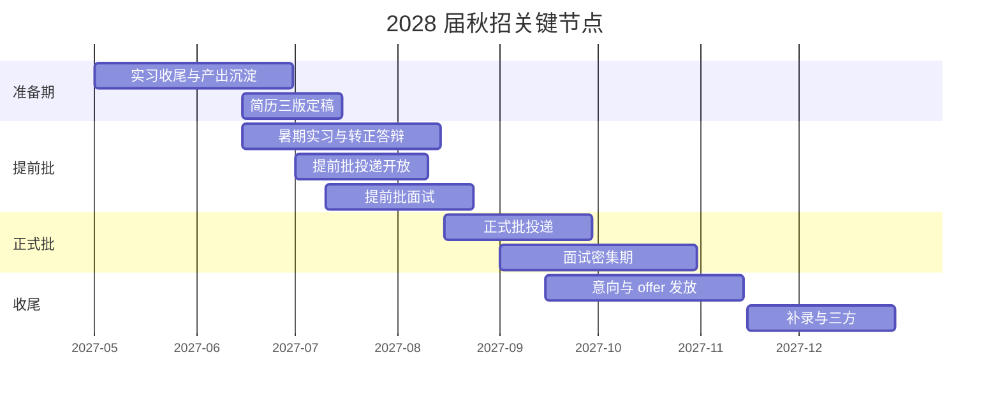
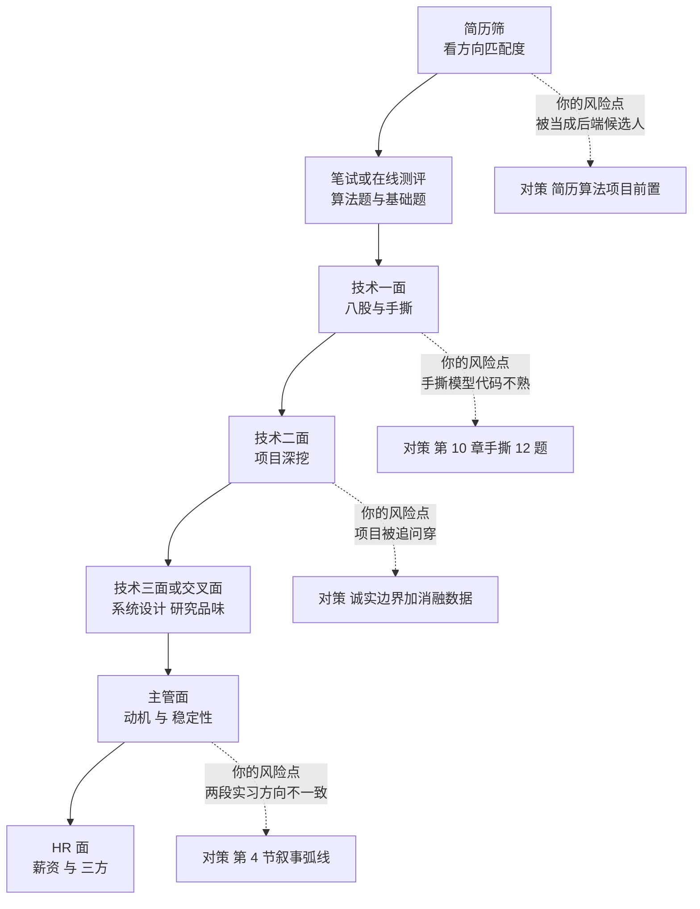
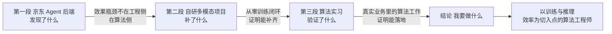

# 11 · 2028 届秋招规划与简历转化

> **这是整个系列的终点兑现章。** 前面 10 章的所有准备——数学、PyTorch、多模态项目、训练工程、算法实习、京东的量化产出——最终都要压缩成**一页简历 + 四轮面试**。
> 时间：2027 年 7 月提前批开跑，11 月正式批收尾。你届时手里应该有三样东西：**一段大厂工程实习、一段算法实习、一个从零训练的算法项目**。
> 本章解决的核心问题是：**如何把"工程强、算法相对弱"的复合画像，翻译成算法岗招聘方想要的那个叙事**，以及秋招期间最容易被忽略的节奏与坑。

## 本章学习目标

1. 掌握 2028 届秋招的完整时间轴与每个节点的动作，不错过任何一次机会窗口。
2. 产出**三个版本的简历**，并按目标岗位切换投递。
3. 讲清"两段实习 + 一个项目"的叙事弧线，接住"你到底算什么背景"这类压力问题。
4. 明确提前批、正式批、补录三轮的投递策略与保底/冲刺配比。
5. 完成 offer 比较与谈薪，并知道算法岗 offer 与后端岗 offer 的评估差异。

---

## 一、2028 届秋招时间轴



| 节点 | 时间 | 你的动作 | 注意 |
|------|------|---------|------|
| **实习产出沉淀** | 2027-05 → 06 | 把算法实习的成果整理成可量化条目 | 别等离职才整理，边做边记 |
| **简历三版定稿** | 2027-06 → 07 | 算法版 / 应用算法版 / 工程版 | 见第 3 节 |
| **暑期实习转正答辩** | 2027-06 → 08 | 全力准备答辩，这是最稳的 offer 通道 | **优先级高于一切投递** |
| **提前批投递** | 2027-07 起 | 投"高上限"岗位（大厂算法团队） | 提前批通常不影响正式批 |
| **提前批面试** | 2027-07 → 08 | 用第 10 章题库 | 提前批的面试是最真实的演练 |
| **正式批投递** | 2027-08 中 → 09 | 广投，含保底岗 | 注意各家的投递数量限制 |
| **面试密集期** | 2027-09 → 10 | 每周 2-4 场 | 保留复盘时间，不要排太满 |
| **offer 与三方** | 2027-09 → 11 | 比较、谈薪、签三方 | 见第 7 节 |

> **一个必须提前想清楚的问题**：如果你在暑期实习的团队拿到转正 offer，还要不要继续投秋招？**答案是：要。** 转正 offer 是你的保底，不是你的终点。**先用转正 offer 消除焦虑，再带着"已有保底"的松弛感去面更好的岗位**——这在面试现场的表现差异非常明显。

---

## 二、秋招的淘汰逻辑与你的应对



**秋招与日常实习面试的三个差异**：

| 差异 | 日常实习 | 秋招 |
|------|---------|------|
| 竞争强度 | 中 | **高**，同届顶尖候选人同场 |
| 考察深度 | 两级追问 | **三到四级追问**，必问"如果重来" |
| 对稳定性要求 | 低 | **高**，会问"你确定要做算法吗" |
| 加分项权重 | 项目 > 论文 | **论文 > 项目**（但有工程深度可部分抵消） |

> **你的核心策略不变**：不去和"有顶会论文的候选人"比论文，而是用"**能训 + 能算 + 能部署**"的复合画像打差异化。这个策略在秋招里比在实习面试里更有效，因为秋招面试官更关心"这个人能不能把方案落地"。

---

## 三、简历三版：一份素材，三种叙事

**不要用一份简历投所有岗位。** 你手里有三类素材（工程实习、算法实习、自研项目），不同岗位的排序完全不同。

| 版本 | 目标岗位 | 板块顺序 | 关键词侧重 |
|------|---------|---------|-----------|
| **算法版** | 多模态/VLM 算法岗 | 算法项目 → 算法实习 → 工程实习 → 工程能力 | 从零训练、对比学习、消融实验、指标 |
| **应用算法版** | 大模型应用算法 / RAG / Agent 算法 | 算法实习 → 算法项目 → 工程实习 | 检索优化、评测体系、Prompt 与成本、效果归因 |
| **工程版** | 大模型工程 / 训练框架 / 推理平台 | 工程实习 → 工程能力 → 算法实习 → 算法项目 | 分布式、性能剖析、服务化、GPU 利用率 |

### 3.1 算法版简历结构（重点展示）

```text
姓名 | 2028 届硕士 · 学校 · 专业 | GitHub | 可实习/入职时间

【算法项目】
  多模态图文检索模型从零训练（单卡 12GB）        [GitHub]
  · 三行法描述（见第 10 章 3.3 节）

  衍生实验：小 VLM 投影层对齐（可选）
  · 三行法描述

【算法相关实习】
  xx 公司 · 算法实习生（2027.04 - 2027.06）
  · 量化产出 3-4 条

【工程实习】
  京东科技 · JoyAI 产品部 · Agent 后端开发实习（2026.10 - 2027.02）
  · 效果优化量化产出 3 条

【工程能力】（你的差异化，单列）
  · 分布式训练：单机多卡 DDP、ZeRO/FSDP 切分原理、通信量估算
  · 推理部署：vLLM 部署与压测、量化对比（PTQ）
  · 性能剖析：torch.profiler、GPU 利用率瓶颈定位
  · 后端底座：K8s、Kafka、Redis、etcd、Go

【技能】
  Python / PyTorch / Go / CUDA 基础 / 分布式训练 / 量化与推理加速
```

> **注意"工程能力"这个板块的位置**：放在实习之后、技能之前。**它是你与纯算法候选人拉开差距的唯一板块，不能藏在技能清单里的几个词里。**

### 3.2 简历的五个自检项

- [ ] 每一行都能引出至少一个追问，且我能答
- [ ] 每个数字都有口径说明（离线评测集 / 线上 A/B / 单次实验）
- [ ] 没有"熟悉/精通"这类无法验证的词——改成"做过 X，结果是 Y"
- [ ] 全篇没有一句是编的（背调会核实实习内容）
- [ ] 一页，无错别字，PDF 格式，文件名规范（`姓名-学校-算法-2028届.pdf`）

---

## 四、叙事弧线：两段实习 + 一个项目怎么串

**这是秋招面试里最容易被问穿、也最容易出彩的地方。**

面试官看到你的简历会有一个疑问：**"这个人的实习一段是 Agent 后端，一段是算法，中间还有个自研项目——他到底是什么背景？"** 你要主动给出一个清晰的弧线，而不是让面试官自己拼。

### 4.1 三段式叙事



| 段 | 一句话 | 支撑素材 | 面试时讲多久 |
|----|-------|---------|------------|
| **起点** | "我在京东做 Agent 后端时，发现效果瓶颈不在工程侧，而在检索与生成质量。" | 京东的 Bad case 归因数据（[09 章](./09-京东实习期的算法筹码经营)） | 30 秒 |
| **转身** | "所以我用一张消费级显卡从零训了一个多模态模型，把数据、训练、评测、消融整条链路走了一遍。" | [06 章](./06-核心项目-多模态小模型从零训练)项目 + [08 章](./08-评测体系与技术报告)报告 | 60 秒 |
| **验证** | "之后我在 xx 做算法实习，在真实业务里做了 xx，量化结果是 xx。" | 算法实习产出 | 60 秒 |
| **落点** | "我想做的是以训练与推理效率为切入点的算法工作——因为很多算法方案最后卡在算力与成本上，而这恰好是我的起点比较高的地方。" | [07 章](./07-训练与推理工程进阶)工程能力 | 30 秒 |

### 4.2 一定会被问的三个压力问题

| 问题 | 陷阱 | 应对 |
|------|------|------|
| **"你的两段实习方向不一致，是不是没有定力？"** | 不要辩解，不要贬低第一段 | "第一段让我确认了方向，第二段让我验证了能力，这是一个有意的过程而不是摇摆。我在京东期间就自己开始了算法项目，时间是重叠的。" |
| **"你的算法实习只有 3 个月，能做出什么？"** | 不要夸大产出 | 如实说清产出规模与边界，强调"我完整走完了一个小闭环"而非"我做了大项目" |
| **"如果给你一个预训练项目，你觉得自己能胜任吗？"** | 不要逞强 | "小规模的我能独立做，包括数据管线、训练脚本、显存预算和故障排查。但千卡级集群的稳定性问题我没有经验，这部分需要在团队里学。我不想说自己能做我没做过的事。" |

> **诚实边界的价值在秋招尤其高。** 秋招面试官阅人无数，夸大一定会被识别；而**准确地描述自己的能力边界，本身就是"研究品味"的一部分**。

---

## 五、三轮投递策略

| 轮次 | 时间 | 投什么 | 配比 | 目标 |
|------|------|-------|------|------|
| **提前批** | 2027-07 → 08 | 高上限岗位（大厂算法团队、明星业务） | 冲刺 100% | 博上限；提前批通常不影响正式批 |
| **正式批** | 2027-08 → 10 | 冲刺 + 稳妥混合 | 冲刺 40% / 稳妥 60% | 保底为主，确保有 offer |
| **补录与捡漏** | 2027-10 → 11 | 剩余名额、被鸽的岗位 | 全部 | 补齐与升级 |

**配比原则**：
- **保底 offer 要在 9 月前拿到**。有了保底你才能在后面的面试里放松，而放松是面试表现的最强变量。
- **不要在提前批就投保底岗**。提前批的失败不影响正式批，先把上限试出来。
- **不要海投同一家公司的多个岗位**。

---

## 六、秋招期间的节奏与坑

### 6.1 每周节奏模板

| 时段 | 内容 |
|------|------|
| 周一 | 复盘上周面试，更新题库与简历 |
| 周二-周四 | 面试 + 项目/实习工作 |
| 周五 | 投递本批次岗位；整理下周面试安排 |
| 周末 | 集中补盲区；模拟面试 1 场 |

### 6.2 六个必须避开的坑

| 坑 | 后果 | 正确做法 |
|----|------|---------|
| **秋招期间还在全职实习，没时间准备** | 面试仓促、发挥失常 | 提前跟 mentor 沟通，争取每周 1-2 天准备时间；或把面试集中在特定周 |
| **只投大厂算法岗，不投保底** | 11 月手里空 | 必须配 40% 稳妥岗位 |
| **拿到一个 offer 就停止投递** | 失去议价空间与升级机会 | 保底拿到后继续冲 2-3 家 |
| **论文/毕业压力被忽略** | 秋招后期被毕业论文打断 | 提前和导师沟通，把开题与小论文往前排 |
| **简历只有一版** | 方向不匹配被筛掉 | 三版简历，按岗位切换 |
| **面试排太满不做复盘** | 同一个错误犯 5 次 | 每周留 1 天复盘，填写[第 10 章](./10-大模型算法日常实习投递与面试)的复盘模板 |

### 6.3 与导师/学校的协调

这是 2028 届硕士独有的问题，必须提前规划：

| 事项 | 时间 | 动作 |
|------|------|------|
| 毕业论文开题 | 尽早（2027 春） | 尽量把选题与多模态项目挂钩，**一鱼两吃** |
| 小论文投稿 | 2027 上半年 | 如果项目做出新东西，可以考虑投稿（哪怕不是顶会） |
| 导师沟通 | 2027-05 前 | 说清秋招期间的时间安排，争取支持 |
| 答辩 | 2028 春 | — |

> **"一鱼两吃"是个高杠杆动作**：把你的多模态项目写成毕业设计/小论文，能同时解决"毕业要求"和"简历素材"两个问题。如果导师方向接近，主动争取指导——**一篇有导师署名的论文，哪怕会议层次不高，对算法岗简历的价值也远高于零**。

---

## 七、Offer 比较与谈薪

### 7.1 算法岗 offer 的评估维度

| 维度 | 权重 | 说明 |
|------|------|------|
| **岗位内容** | ★★★★★ | 是做预训练、后训练、多模态、应用算法，还是"算法岗的活但内容是业务开发"？**入职前必须问清** |
| **团队技术积累** | ★★★★☆ | 有没有真实的大模型训练/落地项目 |
| **直属主管** | ★★★★☆ | 面试时他的提问深度就是团队水平的信号 |
| **成长路径** | ★★★★☆ | 一年后我能独立负责什么 |
| **薪资总包** | ★★★☆☆ | 见 7.2 |
| 城市 | ★★★☆☆ | 生活成本与长期规划 |

### 7.2 谈薪的两个原则

1. **有第二个 offer 才有议价权。** 这就是为什么要"保底拿到后继续冲 2-3 家"。
2. **算法岗的薪资结构通常比后端岗简单**（月薪 × 月数 + 签字费 + 期权/股票）。谈的时候重点问：**月数是否保底、股票是现金还是期权、签字费是否分期**。

> **不要为了 2-3 万的差距放弃一个内容明显更好的岗位。** 你 2028 年入职后的第一年成长速度，对三年后的薪资影响远大于入职时的 5% 差异。

### 7.3 需要问清的 5 个问题

1. 我入职后具体做哪条线？前半年会做什么？
2. 团队现在有多少人、算力资源大概什么规模？
3. 转正/绩效评估的标准是什么？
4. offer 里的月数是保底还是浮动？
5. 如果我同时有另一个方向的 offer，团队怎么看我的匹配度？

---

## 八、面试问答（8 题，带参考答案）

**Q1：用一句话介绍你自己。**
A：我是 2028 届硕士，背景是后端工程转算法。我在京东做过 Agent 后端的实习，在做效果优化的过程中确认了自己想做算法，所以用一张消费级显卡从零训了一个多模态双塔模型，完整走了数据、训练、评测、消融的闭环，之后在一家 xx 做算法实习。我的特点是既能训模型、也能算清显存和通信的账、还能把它部署成一个满足成本约束的服务。

**Q2：你觉得自己相比科班算法同学的优势和劣势是什么？**
A：劣势很清楚：数学推导的熟练度、训练规模的量级、论文阅读的深度，我都不如科班的同学，这些我还在补。优势是我有他们普遍缺的工程深度——我会算显存预算、知道怎么判断训练瓶颈、做过生产系统的性能剖析和部署。我发现很多算法方案最后不是败在想法上，是败在算力成本、训练效率和落地工程上。所以我更愿意把自己定位成"能把算法方案真正跑起来"的那种人。

**Q3：你为什么不继续做后端？后端薪资也不低。**
A：因为我在京东那段时间意识到，我最想做的是"决定上限"的那部分工作。工程能把上限兑现，但上限由算法决定。这个过程我花了几个月验证，不是一时冲动——我在实习期间就自己开始补 PyTorch 和数学、做项目，做完之后确认我对这件事是有持续兴趣的。

**Q4：你说你会算显存预算，能现场算一下吗？**
A：（按[第 03 章](./03-PyTorch与训练工程地基)、[第 07 章](./07-训练与推理工程进阶)作答）以 1B 参数、AdamW、混合精度全参训练为例：参数本身 fp16 存 2GB，fp32 主权重 4GB，梯度 2GB，优化器状态是参数的两倍即 8GB，静态部分约 16GB；再叠加激活值，激活值随 batch × seq_len × 层数线性增长，是波动最大的一项。所以 1B 全参训练至少需要 40GB 以上的显存，单卡 24GB 是训不了的，必须上 ZeRO-2 或 ZeRO-3 做切分。

**Q5：给你一个全新的算法任务，你的推进步骤是什么？**
A：五步。① 定义清楚可量化的成功标准，并且确认这个标准是现有数据能测的；② 建立 baseline 和评测集，没有 baseline 后面所有改动都无法判断；③ 做数据探查，我大概率会先怀疑数据而不是模型；④ 在最小可运行配置上跑通并做过拟合小样本的 sanity check；⑤ 做单变量消融找瓶颈，再决定是加数据、加容量还是改结构。我在多模态项目里就是按这个顺序走的。

**Q6：过去一年你最大的技术成长是什么？**
A：是对"约束下的取舍"的理解。我原本以为训练模型的难点在算法本身，做完之后发现难点是在资源约束下做工程取舍：对比学习需要大 batch，我只有 12GB，所以我要把手段拆成梯度累积、GradCache、动量队列，量化每一档的收益和代价。这种"识别冲突—拆解手段—量化权衡"的思路，和我做后端性能优化时的方法论是一致的，只是对象从 CPU 和内存变成了 GPU 和显存。

**Q7：你未来三年的规划是什么？**
A：第一年把训练规模这一课补上，我希望能在真实的几十亿参数级别项目里做数据、训练和评测的全流程。第二年在某个细分方向（我倾向多模态理解与训练效率）形成自己的判断力，能独立提出并验证优化方案。第三年我希望能在训练效率或者多模态这两个交叉点上做出有实际业务价值的东西——这是我的差异化所在。

**Q8：如果我们和另一家公司同时给你 offer，你怎么选？**
A：我会优先看岗位内容与团队的真实技术积累，其次看直属主管。我不太会把薪资作为第一判断标准，因为入职第一年的成长速度对三年后的影响更大。如果两边内容接近，我会选那个能让我更早接触到完整训练流程的团队。

---

## 九、自测清单

**准备期（2027-06 → 07）**
- [ ] 我把算法实习的产出整理成了 3-4 条带数字的简历条目
- [ ] 我做出了三个版本的简历，且都控制在一页
- [ ] 我的简历里有一个专门的"工程能力"板块
- [ ] 我能用 3 分钟讲清"两段实习 + 一个项目"的叙事弧线
- [ ] 我已经和导师沟通过秋招期间的时间安排

**投递期（2027-07 → 09）**
- [ ] 我在提前批投了高上限岗位，且知道它不影响正式批
- [ ] 我的正式批投递里有 ≥40% 的稳妥岗位
- [ ] 我在 9 月前拿到了至少一个保底 offer
- [ ] 我没有海投同一家公司的多个岗位

**面试期（2027-07 → 10）**
- [ ] 我手撕清单的 12 题在秋招前又过了一遍
- [ ] 六模块题库我都做过一次全真模拟
- [ ] 我能接住"两段实习方向不一致"这类压力问题
- [ ] 我每周留了一天做复盘，同一类错误没有重复犯
- [ ] 我的面试安排没有排满，留出了准备时间

**收尾期（2027-09 → 11）**
- [ ] 我用第 7 节的标准比较 offer，而不是只看薪资
- [ ] 我问清了"入职后具体做什么"
- [ ] 我了解 offer 的月数、股票、签字费结构
- [ ] 我在拿到保底后继续冲了 2-3 家

---

## 结语：这套规划的胜负手在哪

回看你从 2026-09-26 到 2027-11 的整条路径，**真正决定结果的是三件事**：

1. **2026-10 到 2027-02 那四个月**——白天在京东攒量化产出，晚上把 PyTorch 与数学补完、把项目跑起来。**这四个月决定了你 2027 春能不能拿到算法实习。**
2. **2027-02 到 2027-04 那八周**——把项目做成可被追问的资产，把技术报告写出来。**这八周决定了你 2027 秋招的简历能不能过筛。**
3. **2027 全年持续的"诚实边界"**——不吹、不编、讲清局限。**这一条决定了你会不会在最后一轮被翻盘。**

其余的一切——数学的细节、论文的数量、指标的绝对值——都可以有折扣。**但上面三件事没有替代品。**

---

## 下一步

1. **今天**：把[第 01 章](./01-目标岗位分层与差距诊断)的自评表打一次分，记下日期。
2. **入职前 12 天**：完成[第 03 章](./03-PyTorch与训练工程地基)的 Day 1-3，把环境跑通。
3. **入职后第 1 周**：按[第 09 章](./09-京东实习期的算法筹码经营)开始读会话日志，同时启动[第 06 章](./06-核心项目-多模态小模型从零训练)的数据准备。
4. **随时查阅**：[第 12 章](./12-资源算力与弹性周计划)的弹性周计划表与资源清单。
