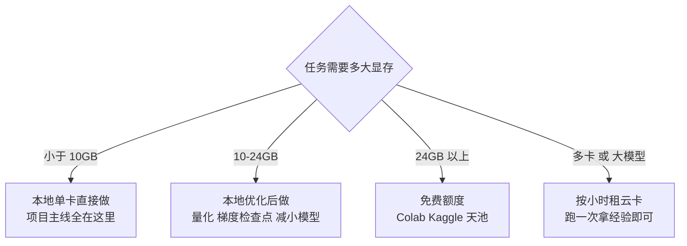
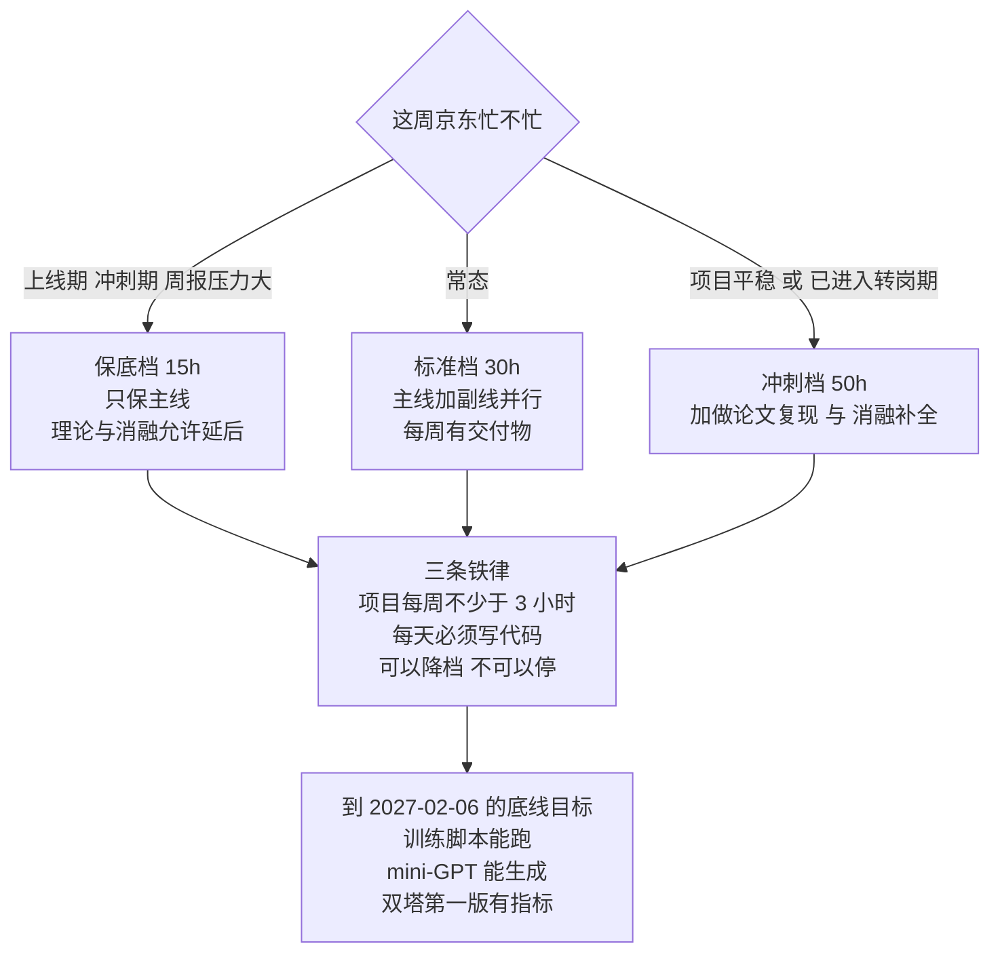

# 12 · 资源、算力与弹性周计划

> **这是本系列的"工具箱"章节，随用随查，不需要通读。**
> 它回答三个具体问题：① 我该看哪些课程、书、论文、代码库？② 我只有一张消费级显卡，算力问题怎么解？③ 三档弹性（保底 15h / 标准 30h / 冲刺 50h）到底每天该干什么？
> 用法：**先读第三节选定档位，把它抄进你的日程，然后其余内容当作查阅手册。**

## 本章学习目标

1. 建立一份按优先级排序的资源清单，避免在"学什么"上反复纠结。
2. 明确你的本地单卡能做什么、不能做什么，并知道缺口怎么用免费额度与租卡补上。
3. 把三档弹性计划落到具体的周与日，形成可执行的日程。
4. 建立每周复盘与反拖延机制，让 18 个月的长跑不中断。

---

## 一、学习资源总清单

### 1.1 优先级说明

| 优先级 | 含义 | 处理方式 |
|-------|------|---------|
| **P0 必学** | 不看就做不了项目 / 答不了面试 | 排进周计划，按顺序推进 |
| **P1 应学** | 明显提升面试表现，但可以排在项目之后 | 项目间隙穿插 |
| **P2 选学** | 加分项，时间充裕再看 | 冲刺档或 P4 阶段 |

---

### 1.2 课程与视频（P0/P1）

| 资源 | 类型 | 优先级 | 怎么用 | 注意 |
|------|------|-------|-------|------|
| **李沐《动手学深度学习》（D2L）** | 书 + 视频 | **P0** | **配合[第 03 章](./03-PyTorch与训练工程地基)一起看**，只挑"线性回归→MLP→CNN→注意力→Transformer"这条主线 | 中文生态最友好，但内容偏基础，**不要从头到尾看完**，按需跳读 |
| **Karpathy《Neural Networks: Zero to Hero》** | 视频 | **P0** | 配合[第 04 章](./04-Transformer与LLM原理手推) | **最推荐的路径**：从手写反向传播到手写 GPT，与你的"mini-GPT"练习完全对应 |
| **Karpathy 的 nanoGPT 代码** | 代码 | **P0** | 作为[第 04 章](./04-Transformer与LLM原理手推)项目的参考实现 | 只有几百行，是最适合"从零手写"的参照 |
| **Stanford CS231n（视觉）** | 公开课 | P1 | 只看 CNN、训练技巧、注意力几节 | 作业太重，不要做全部 |
| **Stanford CS224n（NLP）** | 公开课 | P1 | 只看词向量、Transformer、预训练几节 | 同上 |
| **李宏毅机器学习系列** | 视频（中文） | P1 | 中文解释力强，适合补概念直觉 | 内容广，按主题挑 |
| **HuggingFace Course / Transformers 文档** | 文档 | **P0** | 学 `transformers` / `datasets` / `accelerate` 时查阅 | 工程向，与你的技能栈契合 |
| **HuggingFace `diffusers` 文档** | 文档 | P1 | 做生成方向时看 | — |
| **fast.ai** | 公开课 | P2 | 自上而下的教学法，工程背景的人会喜欢 | 时间紧可跳过 |

> **一个重要建议：不要"刷课"。** 你的学习模式应该是**"以项目为纲，缺什么补什么"**。D2L 和 Karpathy 的视频是工具书，不是通关游戏。**看完 30% 但项目跑起来了，远胜看完 100% 但一行代码没写。**

---

### 1.3 论文必读清单

**读法**：每篇按"读摘要 → 看架构图 → 读方法与损失 → 看实验表 → 记下 3 个我能讲的设计理由"的顺序，**不要逐字读**。每篇写一张 A4 卡片（方法、关键设计、结论、我能问出的问题）。

#### P0：面试必问，至少要能画图讲清

| # | 论文 | arXiv | 只读什么 | 对应章节 |
|---|------|-------|---------|---------|
| 1 | **Attention Is All You Need**（Transformer） | `1706.03762` | 整个架构 + 注意力公式 + 位置编码 | [04](./04-Transformer与LLM原理手推) |
| 2 | **An Image is Worth 16x16 Words**（ViT） | `2010.11929` | patchify、架构、与 CNN 的对比 | [05](./05-多模态原理与架构谱系) |
| 3 | **CLIP**（Learning Transferable Visual Models） | `2103.00020` | 双塔结构、对称 InfoNCE、温度系数、zero-shot | [05](./05-多模态原理与架构谱系)、[06](./06-核心项目-多模态小模型从零训练) |
| 4 | **LoRA** | `2106.09685` | 低秩分解的动机、A/B 矩阵、秩的影响 | [04](./04-Transformer与LLM原理手推) |
| 5 | **ZeRO**（Memory Optimizations） | `1910.02054` | 三级切分分别切什么 | [07](./07-训练与推理工程进阶) |
| 6 | **vLLM / PagedAttention** | `2309.06180` | KV Cache 分页管理的动机与收益 | [07](./07-训练与推理工程进阶) |

#### P1：方向相关，做完项目再精读

| # | 论文 | arXiv | 为什么读 |
|---|------|-------|---------|
| 7 | **SigLIP** | `2303.15343` | 对比学习损失的改进，能讲清"softmax vs sigmoid"的取舍 |
| 8 | **BLIP-2**（Q-Former） | `2301.12597` | 视觉与语言连接方案的代表，面试常问 |
| 9 | **LLaVA** | `2304.08485` | 投影层对齐范式，最容易被追问 |
| 10 | **DDPM** | `2006.11239` | 扩散模型基础，生成方向必读 |
| 11 | **Latent Diffusion / Stable Diffusion** | `2112.10752` | 潜空间扩散与 CFG |
| 12 | **DiT** | `2212.09748` | 视频生成的基础架构 |
| 13 | **FlashAttention** | `2205.14135` | 显存与速度优化的经典，面试高频 |
| 14 | **DINOv2** | `2304.07193` | 自监督视觉表征，选型时会用到 |
| 15 | **DPO** | `2305.18290` | 对齐方向的核心方法 |

#### P2：加分与前沿

| 论文/方向 | 为什么 |
|----------|-------|
| MoCo（`1911.05722`） | 动量队列的来源——你在[第 06 章](./06-核心项目-多模态小模型从零训练)用了它的思想 |
| GradCache（`2101.06983`） | 你在项目里实现了它，**读它比读十篇综述都值** |
| 多模态综述类论文 | 建立谱系，配合[第 05 章](./05-多模态原理与架构谱系) |
| 长上下文 / 稀疏注意力系列 | 面试加分项 |
| 你目标岗位团队近两年的工作 | **最高性价比**：面试时说出来直接建立好感 |

> **读论文的最短路径**：不要从 P0 第 1 篇开始按顺序读。**先做项目，遇到卡点再回头读对应论文**——这样每篇论文你都是带着问题读的，吸收率完全不同。

---

### 1.4 代码库清单

| 库 | 用途 | 读法 | 优先级 |
|----|------|------|-------|
| **nanoGPT** | 最小 GPT 实现 | 逐行读，作为 mini-GPT 的参照 | P0 |
| **timm** | 视觉模型库 | 看 ViT 的实现，学怎么组织模型代码 | P0 |
| **open_clip** | CLIP 开源实现 | **读它的 InfoNCE 与温度实现**，与你的实现对照 | P0 |
| **transformers** | HF 模型库 | 查 API、看 Trainer | P0 |
| **accelerate** | 分布式训练封装 | 理解 DDP/FSDP 的封装层次 | P1 |
| **LLaVA** | VLM 参考实现 | 看投影层与两阶段训练 | P1 |
| **diffusers** | 扩散模型库 | 生成方向用 | P1 |
| **vLLM** | 推理引擎 | 看 PagedAttention 与调度 | P1 |
| **lit-gpt** | 训练框架 | 看训练脚本的工程组织 | P2 |
| **lm-evaluation-harness** | 评测框架 | 学评测设计 | P2 |

> **读开源库的正确姿势**：**不要通读**。先只看你要用的那个模块（例如 `open_clip` 里的 `loss.py`），把它和你的实现逐行对照，找出差异。**差异就是知识点。**

---

### 1.5 数据集与数据源

| 数据集 | 类型 | 语言 | 规模 | 用途 |
|-------|------|------|------|------|
| **MUGE**（阿里天池） | 电商图文对 | 中文 | 十万到百万级 | [06 章](./06-核心项目-多模态小模型从零训练)主数据集候选 |
| **Wukong**（华为） | 图文对 | 中文 | 亿级 | 取子集，太大 |
| **COCO-CN / Flickr30k-CN** | 图文对 | 中文 | 万级 | 评测集来源 |
| **COCO Captions** | 图文对 | 英文 | 12 万图 | 可用 VLM 翻译成中文 |
| **ImageNet**（子集） | 分类 | — | — | 视觉塔预训练/消融 |
| **自建数据集** | 图文对 | 中文 | 3-5 万 | **必做**，体现数据构造能力 |
| **ModelScope 数据集** | 混合 | 中文 | — | 找中文数据的首选入口 |

> **数据获取的现实提醒**：数据集的可下载性会变，**以你实际能拿到的为准**。如果某个数据集下不到了，换一个，不要卡在这里超过 3 天。**"数据不够"从来不是拖延的理由——2 万对也能开训。**

---

### 1.6 工具链

| 工具 | 用途 | 什么时候上手 |
|------|------|-------------|
| **wandb**（或 tensorboard） | 实验记录与曲线对比 | [06 章](./06-核心项目-多模态小模型从零训练) M1 阶段就要用 |
| **sentencepiece** | 训练中文分词器 | [06 章](./06-核心项目-多模态小模型从零训练) M0 |
| **HF datasets** | 数据集加载与缓存 | M0 |
| **nvitop / nvidia-smi** | GPU 监控 | M1 |
| **torch.profiler** | 性能剖析 | [07 章](./07-训练与推理工程进阶) |
| **hydra / omegaconf** | 配置管理 | 做消融时（强烈推荐） |
| **tmux / nohup** | 长任务后台运行 | 训练时必用 |
| **Docker** | 环境固化 | 你已经会 |

---

## 二、算力方案

### 2.1 你的本地单卡能做什么（能力边界）

以 **8-12GB 消费级显卡**（3060 / 4060 / 4070 级别）为准：

| 任务 | 可行性 | 说明 |
|------|-------|------|
| 训 MNIST / CIFAR 的 CNN、ViT | ✅ 完全可行 | 几分钟到几十分钟 |
| 手写 mini-GPT（1-10M 参数）字符级语言模型 | ✅ 完全可行 | 十几分钟到几小时 |
| **从零训 CLIP 式双塔（20M 参数）** | ✅ **完全可行**，这是你的主项目 | 每轮几十分钟 |
| 从零训 ViT-Small 甚至 Base | ✅ 可行 | 需要更多数据与时间 |
| LoRA 微调 0.5B-1.5B LLM | ✅ 大体可行 | 需要 4-bit 量化 + 梯度检查点 |
| 全参微调 1B 模型 | ⚠️ 极限，需 ZeRO-offload | 会很慢，不建议 |
| 全参微调 7B | ❌ 不可行 | 需要多卡或 80GB 卡 |
| 从零训扩散模型（小规模） | ✅ 可行 | CIFAR / 小分辨率 |
| 跑 vLLM 部署 7B（4-bit 量化） | ⚠️ 勉强 | 12GB 可跑量化版 |
| 多机多卡训练 | ❌ 需租云卡 | 见 2.3 |



### 2.2 免费额度方案

| 平台 | 典型资源 | 限制 | 适合什么 |
|------|---------|------|---------|
| **Google Colab** | 免费 T4 16GB / 部分时段更高 | 单次时长限制、会断线、需重新装环境 | 快速实验、跑 notebook |
| **Kaggle Notebooks** | 每周固定额度 GPU 时长 | 环境固定、无持久化 | 周赛、实验 |
| **阿里云天池 / ModelScope 创空间** | 中文生态，偶有免费算力 | 额度有限 | 中文数据集相关实验 |
| **各大模型平台的免费额度** | API 额度 | — | 用 VLM 生成中文 caption（[06 章](./06-核心项目-多模态小模型从零训练)数据构造） |

> **免费额度的正确用法**：**跑"验证性小实验"，不要跑长训练。** 因为你永远不知道什么时候断线，长任务会浪费大量时间在重跑上。

### 2.3 租卡实操

| 平台类型 | 代表 | 卡型 | 价格量级 | 特点 |
|---------|------|------|---------|------|
| 国内按量租卡平台 | AutoDL 等 | 3090 / 4090 / A100 | 每小时几元到几十元 | 国内网络好、镜像方便，**首选** |
| 海外平台 | RunPod / Lambda 等 | A100 / H100 | 每小时十几元到上百元 | 卡新但网络与支付麻烦 |
| 云厂商 | 阿里云 / 腾讯云 / 华为云 | V100 / A100 | 按量或包时 | 稳定但贵，适合跑长任务 |

**你的租卡需求只有两类**：
1. **跑一次真实的多卡训练**（2-4 卡，几小时）——目的是拿到"我跑过 DDP/多卡"的真实经验，成本约 **几十到几百元**。
2. **小 VLM 投影层对齐实验**（[06 章](./06-核心项目-多模态小模型从零训练) M5）——如果要做，成本约 **几百元**。

#### 租卡省钱 12 条

- [ ] **先在本地用小规模 debug 到能跑通**，再上云——云端调试是烧钱
- [ ] 提前把脚本、配置、数据准备流程全部写好并本地验证过
- [ ] 用 `tmux` 或 `nohup` 跑，避免 SSH 断线丢任务
- [ ] **确认关机后不再计费**（有些平台的"停止"仍计费，必须"释放"）
- [ ] 数据提前打包上传到数据盘，避免每次从公网下载
- [ ] 用 `torchrun` 而不是自己写 `mp.spawn`，减少调试时间
- [ ] 训练脚本必须支持**断点续训**——租卡的机器可能被回收
- [ ] 开启自动保存 checkpoint 到持久化存储
- [ ] 设置 `nvidia-smi` 轮询与超时告警
- [ ] 用较小规模先跑通一个 epoch，确认 loss 正常再跑全程
- [ ] 记录每次实验的卡型、时长、花费，形成"算力账本"
- [ ] **不要在云上读论文、写代码、想方案**——那是最贵的学习方式

> **算力账本建议格式**（面试时能说出"我知道训练一个大模型要多少钱"是加分项）：

```text
【日期】2027-03-15
【任务】2×A100 跑通 DDP 多卡训练
【卡型与数量】2 × A100 40G
【时长】6.5 小时
【花费】¥xxx
【产出】多卡训练跑通；记录 all-reduce 通信耗时占比 18%
【结论】通信不是当前瓶颈，算力是。若扩到 8 卡需重新评估
```

---

## 三、三档弹性周计划

### 3.1 先算总账

| 档位 | 每周投入 | 到 2027-02-06 前（17 周）累计 | 能覆盖到哪 |
|------|---------|---------------------------|-----------|
| **保底档** | 15h | 255h | [02](./02-数学地基最小集)-[04](./04-Transformer与LLM原理手推) + [06](./06-核心项目-多模态小模型从零训练) 到 M1 |
| **标准档** | 30h | 510h | [02](./02-数学地基最小集)-[08](./08-评测体系与技术报告) 全覆盖，[06](./06-核心项目-多模态小模型从零训练) 到 M3 |
| **冲刺档** | 50h | 850h | 全部覆盖 + M5 升级 + 论文复现 |

> **建议：按标准档排计划，按保底档执行，有余力时按冲刺档加量。** 计划的容错空间要留给自己。



> **注意这张图的用法**：档位是**每周重选**的，不是一开始定死。周一花 2 分钟判断"这周是什么节奏"，然后选一档。**主动降档不丢人，被动掉档才致命。**

### 3.2 每日时间模板

#### 保底档（工作日 1h + 周末 5h）

| 时段 | 内容 | 时长 |
|------|------|------|
| 通勤/午休 | 看论文或视频（**不写代码**） | 30min × 5 |
| 睡前 | 写代码 / 做题 | 30min × 5 |
| 周六 | **项目主线**（唯一不能砍的） | 5h |
| 周日 | 补课 + 复盘 | 5h |

#### 标准档（工作日 2.5h + 周末 8.75h）

| 时段 | 内容 | 时长 |
|------|------|------|
| 早 | 论文/视频/阅读 | 1h × 5 |
| 晚 | **写代码 / 做题 / 项目** | 1.5h × 5 |
| 周六 | 项目主线（训练、调参、消融） | 8h |
| 周日 | 理论补课 + 复盘 + 下周计划 | 8h |

#### 冲刺档（工作日 3h + 周末 17.5h）

在工作日 3h 基础上，周末每天 8-9h：上午项目、下午理论、晚上复盘。**不建议连续超过 3 周**，容易崩。

> **一条铁律：每天必须有"写代码"的时间，哪怕只有 30 分钟。** 只看不写是转岗失败最常见的原因。

### 3.3 标准档 17 周计划表

| 周 | 主线（18h） | 副线（12h） | 交付物 |
|----|-----------|-----------|-------|
| 1 | [03 章](./03-PyTorch与训练工程地基) Day1-5 | [02 章](./02-数学地基最小集) 线代 | 能训 MNIST > 98% |
| 2 | 03 章 Day6-12 | 02 章 概率 | 训练脚本模板（含 resume） |
| 3 | [04 章](./04-Transformer与LLM原理手推) 注意力手推 + 手写 | 02 章 微积分 | 手写 MHSA 单测通过 |
| 4 | 04 章 mini-GPT | 02 章 手算题 | mini-GPT 生成通顺片段 |
| 5 | [05 章](./05-多模态原理与架构谱系) 谱系 + 选型 | [09 章](./09-京东实习期的算法筹码经营) 业务产出 | 项目选型决策记录 |
| 6 | 05 章 可复现分级 + 定方案 | 09 章 业务产出 | [06 章](./06-核心项目-多模态小模型从零训练) 方案定稿 |
| 7 | 06 章 数据构造 | [07 章](./07-训练与推理工程进阶) 显存预算 | 数据集 v1（≥5 万对） |
| 8 | 06 章 模型实现 + 跑通 1000 步 | 07 章 混合精度 | **过拟合 100 条 sanity check 通过** |
| 9 | 06 章 完整训练 + 首评 | 07 章 DDP | 第一版检索指标 |
| 10 | 06 章 数据扩容 + 调参 | 07 章 torch.profiler | 指标提升记录 |
| 11 | [08 章](./08-评测体系与技术报告) 评测脚本 + 消融 | 07 章 量化对比 | 消融表 v1 |
| 12 | 08 章 报告初稿 + Bad case | 09 章 实习成果整理 | 报告初稿 |
| 13 | 08 章 报告定稿 + 讲解视频 | [10 章](./10-大模型算法日常实习投递与面试) 简历一版 | 报告 + 90 秒讲解 |
| 14 | 06 章 M3 消融补全 | [10 章](./10-大模型算法日常实习投递与面试) 手撕题 | 6 组消融完成 |
| 15 | 模拟面试 ×2 | 10 章 题库 | 六模块能脱稿 |
| 16 | 项目整体打磨 + GitHub 整理 | 10 章 投递准备 | 仓库可展示 |
| 17 | 京东实习收尾与交接 | 复盘全年 | G4 门禁达成 |

**保底档怎么砍**：每天只保留主线的一半进度；第 5、12、14、15 周的内容可压缩；**但第 8 周的 sanity check 和第 11 周的评测脚本不能砍。**

---

## 四、每周复盘模板

每周日花 30 分钟填，**不许跳过**。

```text
【第 X 周 / 日期区间】
【档位】保底 / 标准 / 冲刺

1. 本周实际投入：__ 小时（计划 __ 小时）
2. 本周完成的三件事：
   - 
   - 
   - 
3. 本周的交付物（可验证的东西）：
4. 卡住的地方（技术 + 非技术）：
5. 下周要补的盲区（最多 3 个）：
6. 项目进度：M0 / M1 / M2 / M3 / M4
7. 自评分（0-10）：
8. 需要调整的地方：
```

**每 4 周做一次月度复盘**，并重做[第 01 章](./01-目标岗位分层与差距诊断)的 100 分自评，记录分数曲线。

---

## 五、反拖延与可持续机制

| 机制 | 做法 | 为什么有效 |
|------|------|-----------|
| **固定时段** | 把学习时间写进日历，当成会议 | 减少"今天要不要学"的决策消耗 |
| **最小启动动作** | 状态差时只做"打开编辑器 + 跑一条命令" | 启动成本低，往往就顺势做下去了 |
| **项目优先** | 时间不够时砍理论，不砍项目 | 项目有状态，断了要重来 |
| **公开承诺** | 在 GitHub 上开仓库、写进度 | 社交压力是最便宜的约束 |
| **交付物导向** | 每周必须有一个"别人能看见的东西" | 对抗"学了很多但说不出来" |
| **允许走低档** | 实习攻坚期降到保底档，不要停 | 长期持续 > 短期爆发 |
| **物理隔离** | 学习时手机放远 | 老生常谈但有效 |

> **一条重要心态**：18 个月的规划，**你一定会掉队几次**。掉队不是失败，**停掉才是失败**。所以整套计划都设计成"可以降档但不能停"——保底档存在的唯一意义就是让你在最忙的三周里还能继续。

---

## 六、常见误区

| 误区 | 后果 | 正确做法 |
|------|------|---------|
| 先刷完课再做项目 | 3 个月后还没写过训练脚本 | **项目优先，缺什么补什么** |
| 论文从第一篇开始按顺序读 | 读到第 5 篇就放弃 | 先做项目，带着问题回头读 |
| 追求"完备"的数据集 | 卡在数据获取上一个月 | 2 万对也能开训，先跑通再扩 |
| 本地跑得动就绝不租卡 | 拿不到多卡经验 | 花几百元跑一次多卡，性价比极高 |
| 每天靠意志力硬扛 | 3 周后崩 | 固定时段 + 降档机制 |
| 只学不写、只写不记 | 面试讲不出来 | 每周留交付物 + 复盘 |
| 三档都按冲刺档排 | 做不到就开始自责，然后放弃 | **按标准排，按保底执行** |

---

## 七、自测清单

**资源**
- [ ] 我知道 P0 的 6 篇论文是哪 6 篇，并且读过至少 3 篇
- [ ] 我读过 `open_clip` 的损失实现，并与自己的实现对照过
- [ ] 我确定了自己的数据来源，并且能下载
- [ ] 我用 wandb 或 tensorboard 记录实验

**算力**
- [ ] 我知道自己的显卡型号、显存、算力
- [ ] 我清楚本地单卡的能力边界（见 2.1 表）
- [ ] 我注册了至少一个免费算力平台
- [ ] 我知道租卡的平台、价格量级与省钱清单
- [ ] 我有一份"算力账本"记录

**计划**
- [ ] 我选定了档位（保底 / 标准 / 冲刺）
- [ ] 我把周计划抄进了自己的日程工具
- [ ] 我知道"保底档可以砍什么、绝对不能砍什么"
- [ ] 我建立了每周复盘模板并填过一次
- [ ] 我重做过[第 01 章](./01-目标岗位分层与差距诊断)的自评分并记录了日期

---

## 最后的提醒

这套规划一共 12 章、上万字，但**真正决定结果的，只有三件事**：

1. **从今天开始，每天写代码。** 哪怕 30 分钟。
2. **项目不能停。** 它是你唯一不能被别人替代的证据。
3. **把每个结论都变成数字。** 没有数字的经历，在算法岗面试里等于没发生。

回到[总览](./)去确认你的第一个动作。
