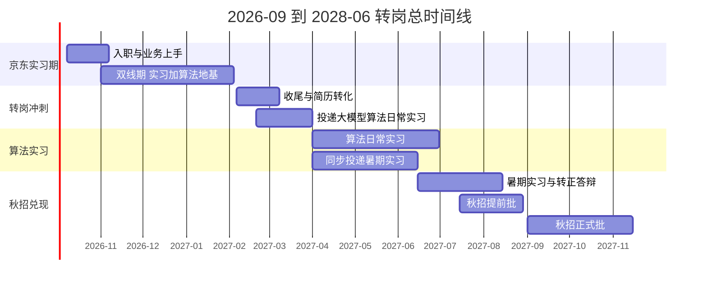
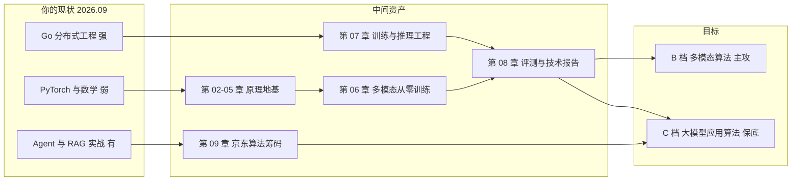
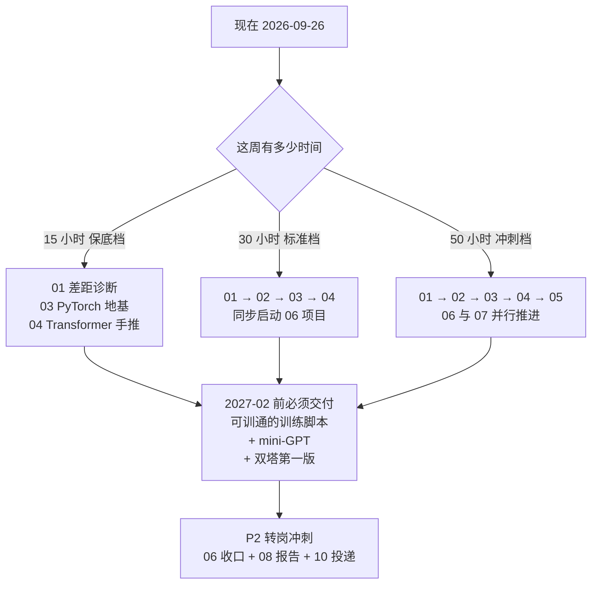
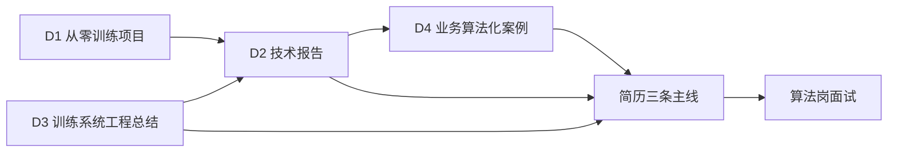

# 转岗大模型算法：从 Agent 后端到算法岗的 18 个月作战地图

> **本章节系列的定位**：你已经拿到京东（京东科技-变色龙业务部-JoyAI产品部）Agent 后端开发实习，2026-10-08 入职。这套文档不解决"怎么找工作"，而解决一个更硬的问题：**如何在 2026.10 → 2028.06 这 18 个月里，把一个"Go 后端很强、PyTorch 零基础"的画像，改造成一个"能独立完成多模态模型从零训练 + 完整评测、并且懂训练系统工程"的大模型算法岗候选人。**
> **本章节不重复教 Agent 与 RAG**——那些你已经会，见[导师学习路径](/导师学习路径/)；本章只补**从工程到算法的缺口**。

## 一、先把坐标钉死：四个时间锚点

一切规划都建立在这四个锚点上，写错一个，后面全错。

| 锚点 | 日期 | 含义 | 对你的意义 |
|------|------|------|-----------|
| 起点 | **2026-09-26** | 今天 | 距入职还有 12 天，先完成环境与知识预热 |
| 入职 | **2026-10-08** | 京东 Agent 后端实习开始 | 进入"边实习边补算法"的双线期 |
| 春节 | **2027-02-06** | 京东实习期满 4 个月，你计划收尾 | 转岗的**第一个硬 deadline** |
| 秋招 | **2027-07 → 2027-11** | 2028 届秋招（提前批 7-8 月，正式批 8-11 月） | 三年积累的**最终兑现窗口** |
| 毕业 | **2028-06** | 硕士毕业 | — |

### 全周期甘特图

### 每个阶段的一句话目标

| 阶段 | 时间 | 一句话目标 | 毕业标准 |
|------|------|-----------|---------|
| **P0 预热** | 09-26 → 10-07（12 天） | 装上环境，跑通第一个训练脚本 | 能在自己显卡上训出 MNIST > 98% |
| **P1 双线期** | 10-08 → 2027-02-06（4 个月） | 白天在京东把工程故事做实，晚上把算法地基补齐 | 手写 mini-GPT 能生成通顺片段 + CLIP 式双塔在单卡训完第一版 |
| **P2 转岗冲刺** | 2027-02-06 → 2027-03-31（8 周） | 把项目做成"可被追问的资产"，拿到算法实习 offer | 技术报告完成 + 至少 1 个算法实习 offer |
| **P3 算法实习** | 2027-04 → 2027-06（3 个月） | 在真实算法团队里做出可量化的产出 | 有 1 个能写进简历的量化结果 |
| **P4 秋招兑现** | 2027-07 → 2027-11（4 个月） | 用"算法经历 + 工程能力"的复合画像拿下算法岗 | 拿到大模型算法岗 offer |

> **P1 是整条链的胜负手。** 这 4 个月你白天上班、晚上学习，是唯一一段"有收入、有真实业务、又有大量可支配学习时间"的窗口。P1 结束后如果地基没打完，P2 会变成"边改简历边补课"，几乎必输。

## 二、转岗的本质：你不是在补课，是在换叙事

先破一个误区：**很多人以为转算法岗是"把数学和 PyTorch 补上"。错。** 你真正要做的是把简历上的主语从"我实现了什么系统"换成"我训练/优化了什么模型，并用什么证据证明它变好了"。

### 2.1 两类候选人的真实差距

| 维度 | 纯算法背景候选人（你的竞争者） | 你 |
|------|------------------------------|-----|
| 数学推导 | 强，论文公式无障碍 | **弱**，需补（第 02 章） |
| PyTorch 熟练度 | 强，写过多个训练项目 | **零基础**，需补（第 03 章） |
| 模型原理 | 强，能讲清每个模块为什么这么设计 | **概念级**，需砸实（第 04、05 章） |
| 从零训练经验 | 有，但多数是大作业规模 | **无**，需自己造（第 06 章） |
| 评测与实验设计 | 中等，常被面试官问穿 | **可迁移**：你有压测与量化归因的经验（第 08 章） |
| **分布式与训练工程** | **弱**——很多算法同学说不清 all-reduce 通信量、说不出显存预算怎么算 | **强**，会 Go 分布式、Kafka、etcd、pprof（第 07 章） |
| **服务化与推理部署** | **弱**——模型训出来就交给工程团队 | **强**，你写过生产级服务与高并发链路（第 07、10 章） |
| 复杂业务抽象 | 中等 | **强**，你在做过任务编排、状态机、多供应商一致性 |

**结论：你的胜负手不是"数学追平他们"，而是"用工程深度做差异化"。** 一句能在面试里立刻建立优势的话是：

> "我不仅能训练模型，还能算清楚它在 12GB 单卡上的显存预算、能判断训练瓶颈是算力还是通信、能把它部署成一个满足延迟与成本约束的推理服务。我发现很多模型方案不是败在算法，是败在这三件事没人算。"

这句话的每一半，都由本系列的某一章背书。

### 2.2 大模型算法岗的三档分层（先认清哪些门你能推）

| 档位 | 岗位类型 | 典型要求 | 你的可达性 | 策略 |
|------|---------|---------|-----------|------|
| **A 档** | 基座预训练 / 后训练（Pretrain、RLHF 算法） | 顶会一作、千卡级训练经验 | ⚠️ 单人几乎不可达，**除非**你的算法实习恰好进预训练/后训练团队 | 当作机会窗口而非目标：SFT/DPO 小规模实验可以做，但别把简历押在"我做过预训练"上 |
| **B 档** | 多模态理解/生成算法、对齐算法、数据算法、Agent 算法 | 有从零训练或完整微调 + 评测的闭环项目；懂架构选型 | ✅ **主攻方向**，靠第 05、06、08 章拿下 | 这是你项目的锚点，也是面试的主战场 |
| **C 档** | 大模型应用算法（RAG 优化、评测体系、推理优化、大模型工程） | 懂 LLM 原理 + 有线上系统经验 | ✅ **你已经踩在门口**，靠存量经验 + 第 04、07 章强化 | 保底与跳板：先拿 C 档 offer 保命，同时用 B 档项目冲更高 |

**投递策略：B + C 双投，B 为主攻叙事，C 为保底与保命。** 不要在 A 档上浪费投递次数——那是给已经拿到预训练实习的人准备的。

## 三、章节地图：12 章怎么用

| 章 | 标题 | 解决什么 | 什么时候读 | 权重 |
|----|------|---------|-----------|------|
| [01](./01-目标岗位分层与差距诊断) | 目标岗位分层与差距诊断 | 拆解真实算法岗 JD 在问什么，量化你缺什么 | **现在就做**，P0 第一天 | ★★★★★ |
| [02](./02-数学地基最小集) | 数学地基最小集 | 线代/概率/微积分补到"能读懂论文符号、能手推反传" | P0 → P1 前 3 周 | ★★★★☆ |
| [03](./03-PyTorch与训练工程地基) | PyTorch 与训练工程地基 | 从零到"能独立写出正确、省显存、可复现的训练脚本" | P0 → P1 前 4 周 | ★★★★★ |
| [04](./04-Transformer与LLM原理手推) | Transformer 与 LLM 原理手推 | 把概念级认知砸实到能推导、能手写、能答"为什么" | P1 第 1-4 周 | ★★★★★ |
| [05](./05-多模态原理与架构谱系) | 多模态原理与架构谱系 | 建立架构选型判断力，决定项目做哪条路线 | P1 第 3-6 周 | ★★★★★ |
| [06](./06-核心项目-多模态小模型从零训练) | **核心项目：多模态小模型从零训练** | 单卡 8-12GB 上从零训出一个多模态模型并完成评测 | P1 第 5 周 → P2 结束 | ★★★★★ **全书核心** |
| [07](./07-训练与推理工程进阶) | 训练与推理工程进阶 | DDP/ZeRO、通信、量化、vLLM——**你的差异化优势章** | P1 第 8-16 周，可与 06 并行 | ★★★★★ |
| [08](./08-评测体系与技术报告) | 评测体系与技术报告 | 把项目变成可验证、可追问、可写进简历的资产 | P2 全程 | ★★★★★ |
| [09](./09-京东实习期的算法筹码经营) | 京东实习期的算法筹码经营 | 白天在 Agent 后端岗上，怎么攒算法岗的筹码 | 入职第 1 周起，全程 | ★★★★☆ |
| [10](./10-大模型算法日常实习投递与面试) | 大模型算法日常实习投递与面试 | 2027 春投递清单、面试题库、算法面八股 | P2 全程 | ★★★★★ |
| [11](./11-2028届秋招规划与简历转化) | 2028 届秋招规划与简历转化 | 时间轴、简历三版、叙事改造、避坑 | P3 → P4 | ★★★★★ |
| [12](./12-资源算力与弹性周计划) | 资源、算力与弹性周计划 | 课程/论文/数据集/算力获取 + 三档周计划表 | **随时查阅** | ★★★★☆ |

### 阅读路径（按你的时间档位选一条）

## 四、三档弹性：先定档，再谈计划

你说了实习强度未知，所以整本书的任务量都按三档标注。**先按保底档设计，有余力再往上加**——反过来（按冲刺档排、做不到就崩）是转岗计划最常见的死法。

| 档位 | 每周投入 | 构成 | 适合什么时候 | 12 周能推进到哪 |
|------|---------|------|-------------|----------------|
| **保底档** | 15h | 工作日 1h × 5 + 周末各 5h | 京东项目攻坚期、上线期、双周报压力大 | 02+03+04 学完，06 项目启动 |
| **标准档** | 30h | 工作日 2.5h × 5 + 周末各 8.75h | 常态 | 02→06 全部推进，双塔训完第一版 |
| **冲刺档** | 50h | 工作日 3h × 5 + 周末各 17.5h | 项目平稳期、提前请假冲刺、P2 转岗期 | 02→08 全部完成，报告成稿 |

> **每周最少底线**：不管哪一档，**每周必须有 ≥3 小时花在 06 项目上**。知识可以补，项目断了就废了——训练任务有状态，学习没有。

## 五、贯穿全程的四个交付物（简历上真正会写的东西）

转岗是否成功，最终只看这四个东西做出来没有。所有章节都是为它们服务的。

| # | 交付物 | 形态 | 由谁支撑 | 简历上的写法 |
|---|--------|------|---------|-------------|
| **D1** | **多模态小模型从零训练项目** | GitHub 仓库（代码 + 训练脚本 + 权重量化对比） | 第 03、05、06 章 | "在单卡 12GB 上从零训练 CLIP 式双塔模型，自建 12 万图文对数据集，i2t R@1 达 xx%" |
| **D2** | **技术报告 / 实验记录** | 20-40 页 Markdown/PDF，含主结果表 + 消融表 + 失败分析 | 第 08 章 | "产出完整实验报告，含 6 组消融实验与失败归因" |
| **D3** | **训练/推理系统工程总结** | 一篇长文：显存预算、通信量估算、vLLM 压测、量化对比 | 第 07 章 | "完成单机多卡 DDP 与 vLLM 部署压测，量化后显存下降 xx%、吞吐提升 xx%" |
| **D4** | **京东实习期的算法化业务产出** | 1-2 个把业务问题抽象成算法问题并量化的案例 | 第 09 章 | "在 JoyAI 业务中主导 xx 策略优化，指标提升 xx%" |

## 六、门禁：什么时候可以往下走

不要靠"感觉学完了"推进。每个阶段设一道门禁，**过不了就补，不要硬上**。

| 门禁 | 时间点 | 通过标准（全部可验证） |
|------|--------|----------------------|
| **G0** | 2026-10-07 | 环境装好；能跑通一个完整训练脚本；能说清自己显卡的显存与算力规格 |
| **G1** | 2026-11-30 | 手推单头 Attention 的 shape 与梯度；能手写训练循环；loss 不收敛时能按清单排查 |
| **G2** | 2027-01-15 | 手写 mini-GPT 能生成通顺片段；能在纸上算出一个模型训练需要多少显存 |
| **G3** | 2027-02-06 | 双塔模型训完第一版并跑出检索指标；能讲清 CLIP 的 InfoNCE 与温度系数 |
| **G4** | 2027-03-15 | 技术报告初稿完成；能在 90 秒内讲清项目并接住 5 个追问 |
| **G5** | 2027-03-31 | 至少 1 个算法实习 offer 在手 |
| **G6** | 2027-07-01 | 暑期实习/算法实习有量化产出；简历三版定稿 |
| **G7** | 2027-11-30 | 至少 1 个大模型算法岗 offer |

## 七、三条必须现在就想清楚的原则

### 原则一：项目要"小而完整"，不要"大而半途"

单卡 8-12GB 的现实下，你**永远打不过任何人**的指标。所以项目的价值不在 SOTA，在**闭环完整性**：数据自己造 → 模型自己搭 → 训练自己调 → 评测自己设计 → 消融自己做 → 报告自己写。一个 3000 万参数、指标平庸但闭环完美的项目，远胜一个"调了别人的开源脚本跑了个 7B 微调"的项目。

### 原则二：京东这段实习的定位是"算法筹码"，不是"过渡"

很多人在非目标方向的实习里摆烂，这是最大的浪费。京东 JoyAI 是 Agent 产品部，你**每天都会接触到真实的算法问题**——检索质量、多轮改写、工具选择、成本与延迟权衡、Bad case 归因。第 09 章会给你一套方法，把这些"顺手做掉的工程活"翻译成 algorithm-flavored 简历条目。

### 原则三：数学和 PyTorch 补到"够用"就停手

第 02 章会明确划出"20% 支撑 80% 实践"的边界。**不要陷入"数学全学完再动手"的陷阱**——你是工程出身，你的学习方式是"先跑通再理解"，这在本领域完全可行，但必须配一条"跑通后回头补推导"的纪律。

## 八、和仓库其他栏目的关系

| 已有栏目 | 与本章节的关系 |
|---------|--------------|
| [导师学习路径](/导师学习路径/) | **前置**。你的 Agent/RAG/推理优化知识在这里，本系列不重复，只在第 04、05、07 章做互链 |
| [路线专题](/路线专题/) | 30 天冲刺执行路线，面向"找工作"，本系列面向"转岗"，可参考其日程组织方式 |
| [架构师修炼](/架构师修炼/) | 第 07 章的分布式基础在这里（etcd/Raft/Kafka/限流），训练系统的通信与容错是它的 GPU 版 |
| [面试项目深挖](/面试项目深挖/) | 第 10、11 章改造简历时，沿用这里的"诚实边界"原则：**不能吹的点一个都别吹** |
| [主流 Agent 拆解](/主流agent拆解/) | 第 09 章的素材来源：理解主流 Agent 架构才能在京东业务里提出算法级优化 |

---

## 现在立刻做三件事

1. **读[第 01 章](./01-目标岗位分层与差距诊断)**，花 1 小时做完差距自评表——这是唯一一件"今天做今天就有收益"的事。
2. **读[第 03 章](./03-PyTorch与训练工程地基)的 Day 1**，今天就把环境装好、把 `torch.cuda.is_available()` 跑成 `True`。**12 天的预热窗口不要浪费**，入职后第一个月你会感谢现在的自己。
3. **在[第 12 章](./12-资源算力与弹性周计划)里选定你的档位**（保底/标准/冲刺），并把周计划复制到自己的日程工具里。计划不落到日程上，等于没有计划。
