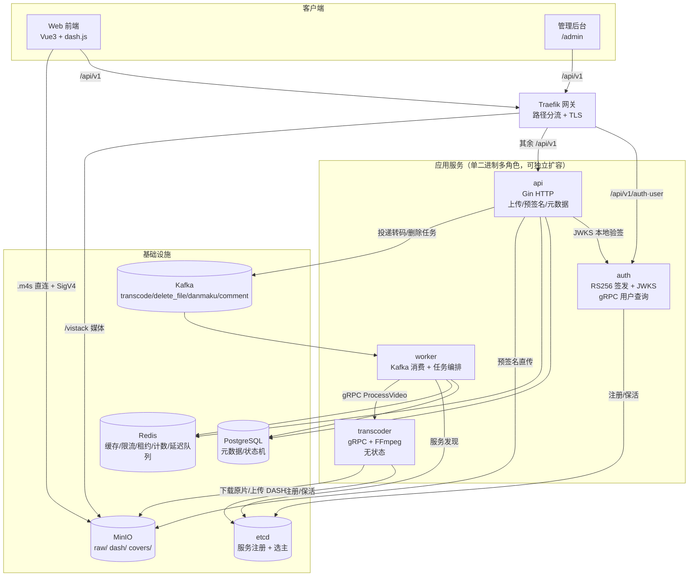
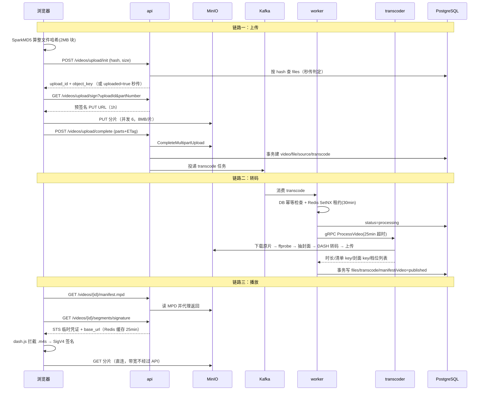

# 01 · 项目全景与三版口述稿

> 一句话定位：一个 Go 写的云原生分布式流媒体系统，单二进制拆四角色，Kafka 解耦、gRPC + etcd 远程转码、MinIO 分片直传与 DASH 分发。
>
> 涉及代码：`cmd/vistack/main.go`、`internal/role/*.go`、`internal/routers/router.go`、`internal/core/*`、`internal/transcoder/*`、`compose.yml`、`Dockerfile`、`deploy/`

---

## 一、先建全局认知：系统长什么样

### 1.1 架构图（必须能徒手画）

**口述要点**：这张图有 4 个"分离点"，讲的时候一个一个点出来——① HTTP 接入与异步执行分离（api/worker）；② 控制面与计算面分离（worker/transcoder）；③ 认证与业务分离（auth/api）；④ 数据面与元数据分离（MinIO 存字节，PG 存状态）。

### 1.2 四角色职责边界表

| 角色 | 启动入口 | 依赖的中间件 | 明确不做什么 | 扩容方式 |
|------|---------|-------------|-------------|---------|
| `api` | `role.RunAPI` | PG / Redis / MinIO / Kafka(生产) / auth(JWKS + gRPC) | 不消费 Kafka、不跑 FFmpeg、**不持 JWT 私钥** | 无状态，直接加副本，前面挂网关 |
| `worker` | `role.RunWorker` | PG / Redis / MinIO / Kafka(消费) / etcd / transcoder(gRPC) | 不暴露 HTTP、不跑 FFmpeg | 加副本；单例任务由 etcd 选主 |
| `transcoder` | `role.RunTranscoder` | **只有 MinIO + etcd** | 不连 PG、不连 Redis、不连 Kafka | `docker compose up --scale transcoder=3` 即扩容 |
| `auth` | `role.RunAuth` | PG / MinIO / etcd | 不处理视频业务 | 加副本，etcd 注册 |

> `transcoder` 只依赖 MinIO + etcd 是设计亮点：**它拿不到数据库凭证**，一台被攻破的转码机偷不到用户数据。面试可以主动说这一点（最小权限）。

### 1.3 三条主链路（面试必须能逐跳讲）

---

## 二、口述稿 A：1 分钟版（自我介绍里的项目段 / HR 面）

> **【背这段】**
>
> "Vistack 是我从零做的一个分布式视频平台，Go 技术栈，核心目标是**打通上传、转码、播放这条完整链路，并且做到可以水平扩容**。
>
> 架构上我做了一件事：把一个单体拆成四个独立角色——`api` 负责 HTTP 接入和预签名下发，`worker` 负责消费 Kafka 编排转码任务，`transcoder` 是一个独立的 gRPC 服务，把 FFmpeg 关在单独容器里，只依赖对象存储；`auth` 单独管认证签发。
>
> 技术上最核心的三点：一是**上传走 MinIO 分片直传 + 预签名 URL**，服务端不碰字节流，支持秒传和断点续传；二是**转码走 gRPC + etcd 服务发现**，无状态、可以 `scale` 到多副本；三是**播放用 DASH 自适应码率**，FFmpeg 按源分辨率产出 240p 到 4K 的多档切片，前端 dash.js 无缝切换。
>
> 另外我还补了一套高并发能力：缓存三件套、Redis 滑动窗口限流、点赞收藏的 Redis 计数加异步落库。"

**🔍 备注（为什么这么说）**
- 第一句给"体量 + 目标"，不要说"我用 Go 做了个视频网站"——那听起来像课程作业。
- 第二句是**架构分层的钩子**：面试官如果不追问，你就赚了；如果追问，你已经有 `01/04/05` 三篇的准备。
- 第三句是**技术亮点**，每条都带实现手段（分片直传 / gRPC+etcd / DASH ABR），不空谈。
- 最后一句是**主动加餐**：把简历上没写的缓存/限流/计数抛出来，把面试官的注意力引到你准备最充分的 `06`。

---

## 三、口述稿 B：3 分钟版（技术面主答）

> **【背这段，语速放慢，每段之间停顿 1 秒】**
>
> **① 背景与目标（20 秒）**
> "这个项目的出发点是我想完整走一遍'视频从上传到可播放'的全链路，并且把分布式里最典型的几个问题——任务解耦、幂等、服务发现、水平扩容——都亲手落一遍。最终做成了一个支持 VOD 的分布式流媒体系统。"
>
> **② 架构（40 秒）**
> "整体是单二进制多角色：`VISTACK_ROLE` 决定进程是 api、worker、transcoder 还是 auth，四个角色独立部署、独立扩容。
> `api` 是 Gin 的 HTTP 层，负责上传初始化、预签名下发、视频元数据和播放签名；`worker` 消费 Kafka 的任务消息，负责状态机编排、幂等、重试和看门狗；`transcoder` 是独立的 gRPC 服务，封装 ffprobe 和 ffmpeg，启动时向 etcd 注册自己、用租约保活，worker 通过 etcd 动态发现它并做 round_robin 负载均衡；`auth` 负责 RS256 签发 JWT 和暴露 JWKS，api 侧只做本地验签、不持私钥。"
>
> **③ 关键链路（60 秒）**
> "上传链路：前端先用 SparkMD5 分块算出整文件哈希，带哈希调 `upload/init`；后端先按哈希查库做**秒传**判定，命中就直接建个新的视频记录复用同一个底层文件、引用计数加一；没命中就走 MinIO 的 Multipart Upload——后端只返回一个 `upload_id`，分片是前端拿着后端签发的**预签名 URL 直传 MinIO** 的，8 MB 一片、6 个并发，服务端完全不碰字节流；断了以后重新 init 会用 `ListObjectParts` 对比已经传上去的分片，只补缺的那些，这就是断点续传。
> 转码链路：`complete` 之后在事务里建好 video / file / source / transcode 四条记录，然后投一条 Kafka 消息。worker 消费到之后先做三重幂等——查 DB 状态、抢一个 Redis 租约、再置成 processing，然后通过 gRPC 调 transcoder；transcoder 从 MinIO 下载原片、ffprobe 探测分辨率、抽封面帧、按源分辨率选 ABR 档位做 DASH 转码，产物直接写回 MinIO；worker 拿到结果后在事务里写清单、封面、时长，把视频置成 published。失败会按指数退避重投，最多 7 次，处理中超时由看门狗兜底。
> 播放链路：`manifest.mpd` 是 API 代理返回的，分片则是前端先拿一组 **STS 临时凭证**，由 dash.js 拦截 `.m4s` 请求、用 SigV4 在前端签名后直连 MinIO，这样带宽和鉴权都从 API 上卸掉了。"
>
> **④ 高并发能力（30 秒）**
> "除了主链路，我还做了几个高并发场景：视频详情和推荐列表走 Cache-Aside 缓存，用空值缓存加布隆过滤器防穿透、singleflight 加 Redis 互斥锁防击穿、随机 TTL 防雪崩；登录后接口用 Redis Lua 的滑动窗口限流，返回 429 和 `Retry-After`，Redis 挂了是 fail-open 放行；点赞收藏用 Lua 做原子 toggle、Redis Set 去重计数，事件写队列、后台每 5 秒批量 200 条异步落库，保证幂等。"
>
> **⑤ 不足与改进（30 秒，加分项）**
> "这个项目我最清楚的问题是**可观测性**：目前只有 zap 结构化日志，没有 Prometheus 指标和链路追踪，出问题只能靠日志串；另外消息重试 7 次之后是直接丢的，没有死信队列；转码和消息投递之间也没有 Outbox，是靠'投递失败就标失败并进重试队列'兜的。如果继续做，我优先级最高的是补指 标 + 链路追踪 + 死信队列。"

**🔍 备注**
- ③ 是主战场，**必须能脱离稿子讲**：面试官会在这一段随时打断追问，打断后你还要能接回主线。
- ⑤ 主动认不足是**反套路加分**：字节面试官很吃"知道自己系统边界"的人；但只认"我已经想好怎么改"的不足（有方案 = 有深度，没方案 = 没想过）。
- 全程避免"我们团队"这种话——这是个人项目，主语用"我"。

---

## 四、口述稿 C：8 分钟版（深度技术面 / 被要求"详细讲讲"）

在 3 分钟版的基础上，按下面顺序展开，每块 1–2 分钟：

| 顺序 | 展开内容 | 参考文档 |
|------|---------|---------|
| 1 | 为什么拆角色：转码是 CPU 密集 + 依赖 FFmpeg 二进制，混在 API 进程里会互相拖累；拆开后 API 能按 QPS 扩容、transcoder 按队列深度扩容 | `04` |
| 2 | 为什么用 Kafka 而不是直接同步调：上传接口必须秒回，转码是分钟级任务；Kafka 提供持久化、多消费者组、可重放 | `05` |
| 3 | 远程转码契约设计：`ProcessVideo(bucket, object_key, output_prefix, cover_object_key, cover_time_seconds, quality_heights)` → 返回时长/清单/封面/档位；**输入输出全走对象存储，所以 transcoder 无状态** | `04` |
| 4 | 幂等三件套：DB 状态机（completed 直接返回）、Redis `SetNX` 租约 30 分钟（防多副本重复处理）、结果写入放在一个事务里（保证不会写一半） | `05` |
| 5 | 失败处理：25 分钟调用超时 → 标 failed + `INCR` 重试计数 → 进 Redis ZSet 延迟队列（2^(n-1) 分钟 + 抖动，上限 8 小时）→ 单独 dispatcher 每 5 秒扫到期任务重投 Kafka；再加一个 watch dog 每分钟扫"卡在 processing 超 15 分钟且租约已释放"的任务兜底 | `05` |
| 6 | 多副本正确性：dispatcher 和 watchdog 这类单例任务用 **etcd 领导选举**包一层，只有 leader 跑，避免多实例重复投递 | `05` |
| 7 | DASH 转码细节：为什么 `seg_duration 4` 要和 `-g 120`（@30fps = 4 秒）对齐、`-sc_threshold 0` 关掉场景切换保证切片边界固定、CRF 与 maxrate 同时给的原因 | `03` |
| 8 | 播放鉴权：STS AssumeRole 下发限定到 `dash/{video_id}/*` 前缀的只读临时凭证 + dash.js 请求拦截 + 前端 SigV4，带宽从 API 卸载 | `07` |
| 9 | 高并发三板斧：缓存三件套 / 限流 / 计数异步落库 | `06` |
| 10 | 已知不足与演进路线：可观测性、DLQ、Outbox、etcd/Kafka 高可用、gRPC mTLS | `09`、`11` |

**🔍 备注**：8 分钟版不是让你一口气背完，而是**当面试官说"你挑一个最有挑战的点讲讲"时，你能从这张表里挑一个讲深**。建议主推 **第 4+5 点（幂等与失败处理）** 和 **第 7 点（DASH 参数）**——前者体现分布式正确性意识，后者体现音视频领域理解，都是字节面试官眼里的"硬货"。

---

## 五、不同面试官角色的应对策略

| 面试官类型 | 他真正想验证的 | 你的重心 |
|-----------|--------------|---------|
| 后端基建方向 | 分布式正确性、中间件原理、故障兜底 | 讲幂等/租约/领导选举/重试与 watchdog/优雅停机（`05`） |
| 音视频方向 | 编码参数、ABR 原理、切片与协议 | 讲 DASH vs HLS、GOP 与切片对齐、档位选择、dash.js ABR（`03`） |
| 业务后端方向 | 一致性、缓存、限流、接口设计 | 讲秒传与引用计数、缓存三件套、限流算法、计数落库（`02`/`06`） |
| 架构/HC 面 | 边界感、取舍、演进能力 | 讲四角色边界、已知缺口与演进路线（`09`/`11`） |

---

## 六、口述时的 8 条纪律（血泪教训）

1. **先结论后细节**：问什么先给一句结论，再说原因，最后补细节。别一上来就讲实现。
2. **每句话带数字**：8 MB、6 并发、25 分钟、30 分钟租约、7 次重试、4 秒切片。
3. **主动说取舍**："我选 A 不选 B，因为……，代价是……"。这是从"会用"到"懂"的分水岭。
4. **不确定就说不确定**："这块当时是按 X 做的，具体数值我要回去看下代码" 远好过编造。
5. **别背代码**：说"我在 worker 里先查 DB 状态、再抢 Redis 租约"就够了，不要背变量名。
6. **被打断先接住**：面试官插问 = 他对这里感兴趣，答完主动问"需要我继续往下讲原来的链路吗"。
7. **承认 AI 辅助写代码但要突出自己的判断**：见 `09` 第 3 节。
8. **不要连续自夸超过 3 句**：每讲 2–3 个亮点插一个"这里也有个坑"。

---

## 自测清单

- [ ] 能不看资料画出架构图，并标出 4 个"分离点"
- [ ] 能说出 4 个角色各自"依赖什么、明确不做什么"
- [ ] 能逐跳讲完上传链路（含秒传与断点续传的判定时机）
- [ ] 能逐跳讲完转码链路（含幂等、超时、重试、看门狗）
- [ ] 能逐跳讲完播放链路（含 manifest 代理与分片 STS 签名）
- [ ] 1 分钟版能脱口而出，不超时
- [ ] 3 分钟版能讲到 ⑤ 的"不足与改进"而不被自己绕晕
- [ ] 被问到"你最有挑战的点"时，能从 10 个展开点里挑 2 个讲深
- [ ] 能主动说出 3 个已知不足 + 对应改进方向

## 背诵卡

- 一句话：Go 云原生流媒体系统，单二进制四角色，Kafka 解耦 + gRPC 远程转码 + MinIO 分片直传 + DASH ABR。
- 四角色：api 接入 / worker 编排 / transcoder 转码 / auth 认证，独立部署独立扩容。
- transcoder 只依赖 MinIO + etcd，不持 DB 凭证 → 最小权限。
- 上传：预签名 URL 直传，服务端不碰字节流，哈希秒传 + ListObjectParts 断点续传。
- 转码：Kafka 投递 → 三重幂等 → gRPC ProcessVideo（25 分钟超时）→ 事务落库 → published。
- 重试：Redis ZSet 延迟队列，2^(n-1) 分钟指数退避 + 抖动，上限 8 小时，最多 7 次。
- 兜底：看门狗每分钟扫 processing 超 15 分钟且租约已释放的任务。
- 单例：dispatcher + watchdog 用 etcd 领导选举，多副本只跑一个。
- 播放：manifest 由 API 代理，分片用 STS 临时凭证 + 前端 SigV4 直连 MinIO。
- 高并发：缓存三件套 / Redis 滑动窗口限流 / Redis 计数 + 异步批量落库。
- 已知不足：无指标与链路追踪、无死信队列、无 Outbox、gRPC 明文。
- 讲法纪律：先结论、带数字、讲取舍、认不足、别背代码。
