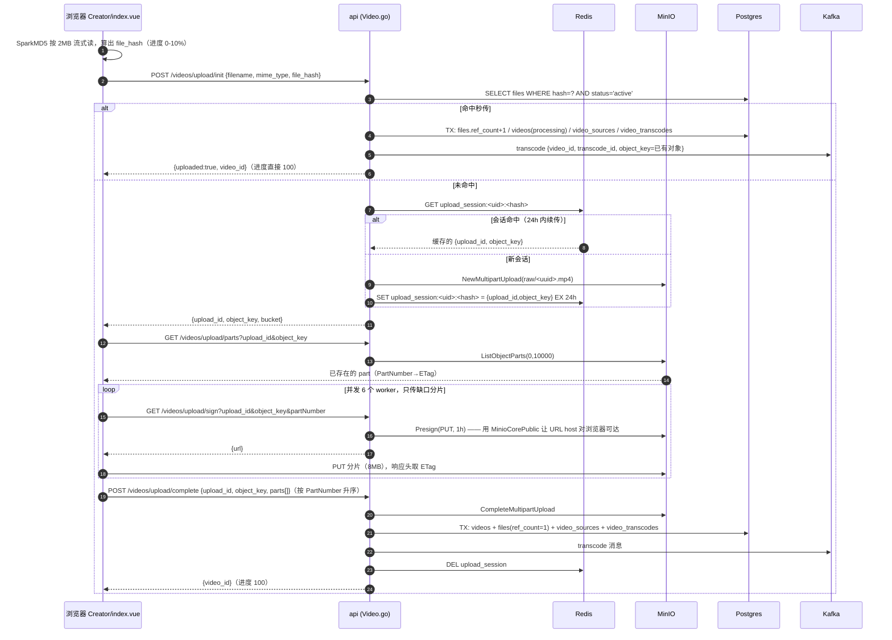
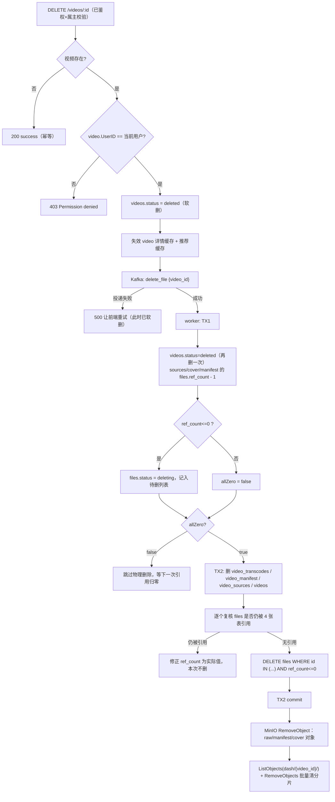

# 02 · 上传链路与对象存储（MinIO / 分片 / 秒传 / 引用计数删除）

> 一句话定位：Vistack 的视频上传是"浏览器算指纹 → 后端只发预签名 URL → 浏览器直传 MinIO 分片 → 后端 Complete 落库投 Kafka 转码"，删除是"软删 + 引用计数 + 两段事务 + 异步清对象"，DB 是唯一事实源，对象存储只是它的影子。

> 涉及代码
> - `internal/api/v1/Video.go`（InitVideoUpload / GetUploadPartURL / ListUploadedParts / CompleteVideoUpload / DeleteVideo / GetVideoMdp / GetVideoSegmentsSignature）
> - `internal/routers/api/v1/video.go`、`internal/routers/router.go`（公开组 vs 私有组）
> - `internal/core/minio.go`（Minio / MinioCore / MinioCorePublic 三个 client、桶策略、lifecycle）
> - `internal/core/message_queue/video/delete_video_worker.go`（两段事务删除）
> - `internal/core/message_queue/transcode/worker.go`（转码产物落库，dash/{id} 前缀来源）
> - `internal/model/entity/file/file.go`、`internal/model/entity/video/{video,transcode,manifest}.go`
> - `web/web-client/src/views/Creator/index.vue`（SparkMD5 2MB 哈希、8MB 分片、并发 6、断点续传、进度映射）
> - `web/web-client/src/lib/s3-signer.ts`、`web/web-client/src/components/player-dash/useDashPlayer.ts`
> - `pkg/storage/minio.go`（头像/评论图上传、`MarkObjectAsReplaced`）
> - `conf/app.toml`、`db/init.sql`、`migrations/migrate.go`

---

## 0. 全景：一次上传到底发生了什么



### 关键参数对照表（面试可以直接报数字）

| 参数 | 值 | 代码位置 | 为什么是这个值 |
| --- | --- | --- | --- |
| 前端哈希读块 | 2 MB | `Creator/index.vue:86` | MD5 是主线程 CPU 活，块小 + `setTimeout(0)` 让出事件循环，UI 不卡 |
| 上传分片 | 8 MB | `Creator/index.vue:38` | 网络 IO 为主；≥S3 最小 5MB，8MB 让 10000 分片上限能撑到约 80GB |
| 上传并发 | 6 | `Creator/index.vue:192` | 对齐浏览器 HTTP/1.1 单域 6 连接；6×8MB≈48MB 在途内存可接受 |
| 预签名有效期 | 1 小时 | `Video.go:250` | 覆盖单分片重试窗口，又不太长以免 URL 变成长期写凭证 |
| 上传会话 TTL | 24 小时 | `Video.go:220` | 断点续传的"第二天再传"边界 |
| 已传分片列举上限 | 10000 | `Video.go:298` | S3 multipart 分片数硬上限 |
| 进度区间 | 0-10 哈希 / 10-95 上传 / 98 合并 / 100 完成 | `Creator/index.vue:103,234,254,268` | 让用户看到的进度与真实阶段对应 |
| 秒传命中后的视频状态 | `processing` | `Video.go:116` | 复用物理文件但转码任务每个视频独立，仍需转码 |
| files.ref_count 初值 | 1 | `Video.go:374` | 上传即被 video_sources 引用一次 |

---

## 1. 为什么用 MinIO multipart 直传，而不是后端中转？

### Q：你为什么不让前端把文件传给后端，后端再写 MinIO？多简单。

**🎤 口述（可直接背）**：后端中转等于把整个视频流量压到 api 进程上——一个 2GB 视频要经过 api 的网络、内存和 goroutine，10 个人同时上传就能把 api 打满，而且上传中途断网要整包重来。我们改成后端只发预签名 URL，字节直接从浏览器进 MinIO，api 每个分片只做一次 200 毫秒的签名调用。代价是安全校验前移到了"签 URL"这一步，以及多了 CORS、断点续传、孤立对象这些运维问题——我认为这个交换是值的，因为带宽和可扩展性是我们真正的瓶颈。

**🔍 讲解/备注**：
- 代码依据：`InitVideoUpload`（`Video.go:202`）只调用 `NewMultipartUpload` 拿 uploadId，不落任何字节；真正的 PUT 由浏览器发给 MinIO（`Creator/index.vue:215-218`）。
- 后端中转的成本：api 需要临时磁盘或内存缓冲；`Content-Length` 大文件会长时间占用连接；api 副本扩容也无法拆分单个上传流。
- 直传的代价（要主动说出来才算懂）：
  1. api 无法在传输过程中校验字节（不能边传边算哈希、不能拦恶意内容），只能靠"完成后的对象"再做处理；
  2. 需要 MinIO 对浏览器可达（所以才有 `MinioCorePublic`，见 `internal/core/minio.go:87-108`）；
  3. 需要 CORS 配置（`conf/app.toml` 的 `[cors]`）与分片/续传/合并三套客户端逻辑；
  4. 半途放弃的上传会在 MinIO 里留下未完成的分片（本项目的 lifecycle 只有 `tag=replaced`，**没有** `AbortIncompleteMultipartUpload` 规则，属已知缺口）。

**⚠️ 追问预案**：
- 为什么不直接在浏览器用 MinIO 的静态 AK/SK？→ 那等于把 bucket 全权限发到客户端，必须换成 STS 或预签名。
- 为什么按分片签名而不是一次签整个对象？→ 分片可独立重试、可并发、可续传；整签 PUT 断了要从头上传。
- 秒传/分片这些复杂度值不值？→ 视频平均几百 MB，重传成本远高于多写 100 行前端逻辑。

---

## 2. 预签名 URL 的安全边界（1 小时、能不能越权写别的 key、怎么缓解）

### Q：预签名 URL 是不是就等于把写权限给了客户端？客户端能拿它写别的 key 吗？

**🎤 口述（可直接背）**：签名是对"方法 + 路径 + query + 时间 + AK"整体的 HMAC，客户端能改的只有时间戳——而时间戳在签名头里，改了就签名不匹配。所以 URL 锁死了三件事：bucket、object_key、`uploadId+partNumber`，它只能往这一个对象的这一个分片里写，不能改 key，也不能换成 DeleteObject。它的真实风险不是越权改路径，而是"URL 本身就是凭证"——1 小时内谁拿到这个 URL 谁都能 PUT。所以缓解手段是：有效期压短、签名前校验 uploadId/objectKey 属于当前用户、给 bucket 配 CORS 白名单、以及把 key 设计成不可猜。

**🔍 讲解/备注**：
- 代码依据：`GetUploadPartURL`（`Video.go:238-274`）把 `uploadId` / `partNumber` 塞进 `reqParams` 后用 `core.MinioCorePublic.Presign(ctx, "PUT", bucket, objectKey, time.Hour, reqParams)` 生成 URL（`Video.go:259-264`）。
- 为什么不能越权：S3/SigV4 的签名串包含 canonical URI（`/bucket/objectKey`）与 canonical query（`uploadId`、`partNumber` 按字典序）。改任何一项都得到不同签名串 → MinIO 返回 `SignatureDoesNotMatch`。
- 能不能换 key？不能。但**能拿别人的 uploadId 去签**：`GetUploadPartURL` 的 `object_key`、`upload_id` 都来自客户端 query（`Video.go:228-231`），服务端没有校验这个 uploadId 属于当前登录用户。objectKey 是 `raw/<uuid>`（`Video.go:197-198`）不可猜，uploadId 也不可猜，所以是"低概率但零防护"，正确做法是在 Redis/DB 里存一份 upload_session 归属记录并在签名前比对用户 ID。
- 1 小时这个数字的取舍：太短会让"慢网传 8MB"频繁 403；太长会让泄出的 URL 变成 1 小时的写入窗口。生产上更稳的是 15 分钟 + 过期自动重新签名（前端每个分片是独立签名调用，天然支持）。
- 其他缓解手段（能说出来加分）：
  - 用 POST Policy 代替 PUT 预签名，带 `content-length-range` 限制单分片大小；
  - 要求分片校验和（`x-amz-checksum-sha256` / `x-amz-checksum-crc32`）；
  - bucket 只对需要的来源配 CORS（当前 `allow_origins` 是 localhost 开发值，`conf/app.toml:84`）；
  - 后台用 `ListMultipartUploads` 清理超过 N 小时未完成的 uploadId。

**⚠️ 追问预案**：
- 预签名 URL 和 STS 有什么区别？→ 预签名是"一个 URL 一个动作"，STS 是"一段时间一组 AK/SK"，后者能给前缀级读权限、能按请求重新签名，播放场景更合适（详见 07 篇）。
- 预签名 URL 泄出最坏后果？→ 别人能往你的 `raw/<uuid>` 里灌垃圾数据；上传完成后我们的 `CompleteVideoUpload` 会把这个对象记成你的视频源，等于被塞了脏文件（属于"信任客户端声明"的通用缺陷）。
- 你怎么防重放？→ SigV4 签名含 `x-amz-date`，MinIO 有 15 分钟时钟偏移窗口，1 小时有效期内的重放是允许的，这是预签名的固有性质，无法在 URL 层面完全消除。

---

## 3. MD5 秒传的完整流程与风险

### Q：秒传是怎么实现的？你觉得有什么风险？

**🎤 口述（可直接背）**：前端用 SparkMD5 按 2MB 流式读出整个文件的 MD5，init 接口带上这个 `file_hash`；后端查 `files` 表里 `hash` 相同且 `status='active'` 的行，命中就完全不传字节，只在一个事务里把 `ref_count+1`、建新的 `videos(processing)`、建 `video_sources` 指向同一个 `file_id`、建 `video_transcodes`，然后照样发一条转码消息，返回 `uploaded=true`。风险有三个：一是 MD5 本身可构造碰撞，理论上能"用别人的内容换自己的秒传"；二是秒传本质是"存在性预言机"，能探测某个文件在不在库里；三是物理文件共享了，但转码产物不共享，存储没有真正省下来。

**🔍 讲解/备注**：
- 代码依据（`Video.go:97-179`）：
  - 查重：`core.DB.Where("hash = ? AND status = ?", req.FileHash, mFile.FileStatusActive).First(&existingFile)`（`Video.go:100`）；
  - 事务四步：`ref_count + 1`（`:105`，`UpdateColumn` 用数据库表达式自增，避免读改写丢更新）→ `videos`（`:113`，`Status: processing`）→ `video_sources`（`:127`，`FileID: existingFile.ID`）→ `video_transcodes`（`:139`）；
  - commit（`:149`）→ 布隆过滤器（`:152`）→ Kafka 转码消息（`:155-161`）→ 返回 `Uploaded:true, VideoID`（`:174-177`）。
- 前端逻辑：`Creator/index.vue:146-159`，`if (initResp.uploaded)` 直接把进度打到 100% 并提示"极速秒传成功"。
- 风险清单：
  1. **撞哈希 / 伪造哈希**：`files.hash` 注释写的是 SHA-256（`file/file.go:40`），但前端实际送的是 **MD5**（`SparkMD5`）。MD5 已有实用的 chosen-prefix 碰撞，攻击者构造出一个 MD5 与热门视频相同的文件，就能拿到"引用该文件"的 video 记录，进而让转码器去处理别人的原始文件。修法：改 SHA-256 并保留 `size` 一起做 key。
  2. **存在性预言机（dedup side channel）**：任意登录用户拿一个 hash 打一次 init，就能判断这个文件在不在系统里（`uploaded:true/false`）。这是所有"全局去重"系统的通病，缓解手段是把去重范围限定在"同一用户"或同一可见性域内。
  3. **越权取内容**：秒传建立的是 `video_sources.file_id → 别人的 files 行`。转码 worker 会把这个对象下载并切成分片放进 `dash/<自己的video_id>/`，等于绕过"上传"拿到内容。同样的逻辑天然只对"已在库里的文件"成立，所以哈希必须不可猜 + 服务端加内容校验。
  4. **存储节省被夸大**：只共享了 `raw/` 原始文件，每个视频仍然产出自己的一份 `dash/<video_id>/` 分片（`transcode/worker.go:75` 的 `OutputPrefix: dash/{id}`），N 个用户秒传同一文件 → 转码产物 N 份。
  5. `files.size` **没有落库**：`CompleteVideoUpload` 里 `rawFile` 没填 `Size`（`Video.go:367-375`），秒传路径也不校验大小，所以 `size` 恒为 0，等于少了一个防碰撞/防篡改的维度。

**⚠️ 追问预案**：
- 秒传要不要"校验客户端真的持有文件"？→ 要，工业做法是让客户端提交分片哈希列表或抽 1 个随机分片字节范围做挑战，服务端比对；本项目没做。
- `hash` 有索引吗？→ 有单列索引（`file/file.go:40` 的 `gorm:"index"`），但查询是 `hash=? AND status=?`，没有联合索引，回表过滤 status；数据量大时建议 `(hash, status)`。
- 为什么不用内容定义分块（CDC / 类似 restic）做细粒度去重？→ 视频是已压缩格式，CDC 收益低、复杂度高，整文件去重性价比更高。

---

## 4. 并发秒传同一文件 + ref_count 一致性

### Q：两个人同时秒传同一个文件，或者同时首次上传同一个文件，会怎样？

**🎤 口述（可直接背）**：已经存在的文件行被并发秒传是安全的，因为 `ref_count + 1` 走的是 `set ref_count = ref_count + 1` 这种数据库原子表达式，不是"读出来加一写回去"，所以不会丢更新，最终 ref_count 精确等于引用它的事务条数。真正的问题在"谁都不是秒传、双方都没查到"的窗口：两个请求都 miss，各自起了一个 multipart upload、各自插一行 `files`，库里就有两条相同 hash 的 active 行，存储翻倍，之后 `First` 查重只会命中其中一条，引用计数被劈成两半。

**🔍 讲解/备注**：
- 原子性依据：`UpdateColumn("ref_count", gorm.Expr("ref_count + ?", 1))`（`Video.go:105`）与删除侧的 `gorm.Expr("ref_count - 1")`（`delete_video_worker.go:102`）都下推到 SQL，行级锁保证串行。
- 缺的约束：`files` 表对 `hash` 只有普通索引、没有唯一约束，`migrate.go` 也没有加；所以"相同 hash 只能有一行 active"只是应用层约定。
- 工业修法（可以直接报）：
  1. `files` 上建部分唯一索引 `UNIQUE (hash) WHERE status='active'`，插入冲突时回退到"复用已存在行"；
  2. 或用 Redis 分布式锁 `lock:dedup:<hash>`（`conf/app.toml` 里 `[cache] lock_ttl/lock_wait_ms` 已有这套机制）包住"查→建"临界区；
  3. 或者用 `INSERT ... ON CONFLICT DO UPDATE SET ref_count = files.ref_count + 1 RETURNING id` 一步到位。
- ref_count 的语义边界：`files` 行只由 `video_sources` / `video_manifest` / `videos.cover_file_id` / `video_transcodes.manifest_file_id` 引用；转码产出的 manifest/cover 行**没有**设 `RefCount`（`transcode/worker.go` persistTranscodeResult 里只填 Bucket/ObjectKey/Status/RefType/MimeType/Size），初值为 0，删除时先 `-1` 变负，再走"≤0 就删"的分支——逻辑能工作，但说明"初值 1"的约定没有全链路统一，属于可挑的点。

**⚠️ 追问预案**：
- 两个上传都完成了会怎样？→ 两条 files 行都是 active，秒传以后台 `First` 的任意一条为准，另一条要等它自己的 ref_count 归零才被删（可能长期滞留，需要 GC 巡检）。
- 悲观锁会不会更简单？→ 单机可以，多副本必须靠 DB 唯一约束或 Redis 锁，否则锁不住。
- 怎么发现"hash 重复"？→ 定时任务 `SELECT hash, count(*) FROM files WHERE status='active' GROUP BY hash HAVING count(*)>1`。

---

## 5. 断点续传：Redis upload_session + ListObjectParts

### Q：断点续传怎么做的？为什么两边都要记状态？

**🎤 口述（可直接背）**：分两层。第一层是"这次上传的会话"：init 时用 `upload_session:<user_id>:<file_hash>` 在 Redis 存 24 小时的 `upload_id + object_key`，同一个用户 24 小时内重新 init 同一个文件，直接拿回同一个 uploadId，不会重复开一个 multipart。第二层是"真实已传了哪些分片"：前端调 `/videos/upload/parts`，服务端用 `ListObjectParts` 从 MinIO 拿权威结果（PartNumber → ETag），前端只补缺口分片。关键点是**权威状态只在 MinIO**，Redis 里的会话只是一张"地图"，不能替代 ListObjectParts——因为分片是浏览器直连 MinIO 传的，后端根本没经手，只有 MinIO 知道谁传完了。

**🔍 讲解/备注**：
- 代码依据：
  - 会话 key：`fmt.Sprintf("upload_session:%d:%s", userID, req.FileHash)`（`Video.go:184`），命中就 `json.Unmarshal` 后原样返回（`:186-193`）；
  - 写入：`core.Redis.Set(ctx, sessionKey, ..., 24*time.Hour)`（`:220`）；完成后 `core.Redis.Del`（`:438-441`）；
  - 权威列举：`core.MinioCore.ListObjectParts(ctx, bucket, objectKey, uploadID, 0, 10000)`（`:298`）；
  - 前端差集：`Creator/index.vue:169-183`，`uploadedMap` 装已传分片，`for (i=1..totalParts) if (!uploadedMap.has(i)) partsToUpload.push(i)`。
- 为什么要 redis 兜底而不用本地存储：换浏览器/换设备也能续传；且它顺带解决了"用户重复点击上传"的幂等问题。
- 已知缺口：会话命中时代码**没有**去 MinIO 验证 uploadId 是否还活着（注释自己写了 "Verify if the upload is still valid in MinIO (optional, but good practice)"）。MinIO 侧如果 abort 了（或运维清理了未完成上传），前端会拿到一个死 uploadId，`ListObjectParts` 报错或 Complete 失败 → 用户体验是"点了上传直接 500"。修法：会话命中时先 `ListObjectParts` 探活，失败就 `Del` 会话重新 init。
- 续传的正确性细节（容易漏）：已传分片的 ETag 必须用**服务端列举出来的**那份，不能用前端缓存的本地记录——因为分片被重传后 ETag 会变，用旧 ETag 去 Complete 会 `InvalidPart`。本项目前端就是把 `uploadedMap`（来自服务端）直接灌进 `completedParts`（`Creator/index.vue:188-190`），这点做对了。

**⚠️ 追问预案**：
- 会话 TTL 为什么 24 小时？→ 覆盖"断了第二天再传"，同时限制 Redis 里死会话堆积；TTL 到期后 uploadId 仍能用（只要 MinIO 没清），只是会新开一个 multipart。
- 分片顺序要不要保证？→ 上传不要求顺序（并发 6），Complete 要求升序（见下一节）。
- 断点续传需要服务端记住什么？→ 只需要 `uploadId + objectKey`，其余以 MinIO 为准，所以后端是无状态的、可水平扩容。

---

## 6. 分片 8MB vs 哈希块 2MB、并发为什么是 6

### Q：为什么哈希按 2MB 分块、上传按 8MB 分片？为什么要开 6 个并发？

**🎤 口述（可直接背）**：哈希块和上传分片是两件完全无关的事，只是"大小"这个数字容易被混在一起。哈希是本地 CPU 密集型的，MD5 几百 MB 要算好几秒，2MB 一块加上 `setTimeout(0)` 让出主线程，进度条才动得起来；而且哈希块多大不影响最终摘要，纯粹是调度粒度。上传是网络密集型的，8MB 是兼顾"≥S3 最小的 5MB"和"10000 分片上限能覆盖约 80GB 文件"，块太小会请求数爆炸、块太大单分片重传代价高。并发 6 是因为浏览器对同域 HTTP/1.1 就是 6 条并发连接，开到 12 只会在浏览器队列里排队，还白白多占 6×8MB 的在途内存。

**🔍 讲解/备注**：
- 代码依据：
  - 哈希：`calculateHash` 用 `new SparkMD5.ArrayBuffer()` + `FileReader` 逐块 `append`（`Creator/index.vue:83-119`），块大小 2MB（`:86`），`setTimeout(loadNext, 0)` 让出 UI（`:97-98`），进度映射到 0-10%（`:103`）；
  - 上传：`const chunkSize = 8 * 1024 * 1024`（`:38`），切片 `currentFile.slice(start, end)`（`:204`），并发 `const concurrency = 6`（`:192`），worker 池 `Array(concurrency).fill(null).map(() => uploadWorker())`（`:249`）。
- S3 multipart 的硬约束（背下来）：单分片最小 5MB（**最后一片可以小于 5MB**）、最大 5GB、最多 10000 片、单对象最大 5TB。按 8MB 算：8MB × 10000 ≈ 78GB，对视频业务够用。
- 并发数还可以怎么讲：6 是 HTTP/1.1 的经验值；HTTP/2 下可以更高但要考虑 MinIO 单节点带宽与服务端连接数；真正的调优依据是"在途内存 ≤ 50MB、单位时间吞吐最大、失败重试风暴可控"。
- 一个可挑的缺陷：每个分片都要先调一次 `/videos/upload/sign`，N 个分片就是 N 次 API 往返，等于把 RTT 成本加了一倍。优化方向是 init 时一次性返回**全部分片**的预签名 URL（或返回一个批量签名接口），前端直接传。
- 另一个可挑的缺陷：失败重试是 `partsToUpload.push(partNumber)` + 固定 `setTimeout(2000)`（`Creator/index.vue:237-244`），**没有最大重试次数**（注释自己承认 "In production, should have max retry count"），网络长期不可用时会无限循环。应改成指数退避 + 上限 + 最终报错回流给用户。

**⚠️ 追问预案**：
- 8MB 分片改成 5MB 会怎样？→ 请求数 +60%，元数据与小分片写放大变多，吞吐一般更差。
- 为什么不用 Web Worker 算哈希？→ 那是更好的方案（完全不阻塞主线程），当前实现是折中。
- 进度为什么要留 10% 和 5%？→ 哈希和合并也是真实耗时阶段，不给区间用户会以为卡住了。

---

## 7. ETag：为什么 Complete 必须带 PartNumber + ETag 且要排序

### Q：ETag 是什么？为什么 Complete 一定要前端回传 ETag？排序是必须的吗？

**🎤 口述（可直接背）**：ETag 是这一片内容的服务端指纹，MinIO 在 PUT 的响应头里返回，通常带引号。Complete 的时候 MinIO 要求提交一个"分片清单"，每项是 PartNumber + ETag，它会拿这个清单去核对自己手里已暂存的分片：对不上就不合并，这就是防止"客户端以为传了、其实没传完"的一致性校验。排序是 S3 协议的硬性要求，必须严格按 PartNumber 升序，否则直接 `InvalidPartOrder`；MinIO 也靠这个顺序拼装最终对象，顺序错了内容就错。ETag 必须原样回传（含引号），我们自己拼一个改过的值会被判 `InvalidPart`。

**🔍 讲解/备注**：
- 代码依据：
  - 请求体：`Parts []minio.CompletePart`（`Video.go:320`），前端 `completedParts.sort((a, b) => a.PartNumber - b.PartNumber)`（`Creator/index.vue:257`）后再提交（`:259-265`）；
  - 服务端：`core.MinioCore.CompleteMultipartUpload(ctx, bucket, objectKey, uploadID, req.Parts, ...)`（`Video.go:343`）；
  - ETag 采集：`const etag = uploadResp.headers.get('ETag')`（`Creator/index.vue:225`），缺失即抛错（`:226-228`）。
- ETag 的值：单分片 PUT 的 ETag 是该分片内容的 MD5（hex，带引号）；多分片合并后的对象 ETag 是 `md5(各分片MD5的二进制拼接)-N`，**不是**整文件的 MD5——所以不能用最终对象的 ETag 去和前端算的文件 MD5 比对，这也是"服务端无法在此校验 file_hash"的原因。
- 边界情况（会被追问）：
  - 同一分片重传覆盖：旧 ETag 立刻失效，必须用最新一次列举/响应的值；
  - 提交清单里少一片 → `InvalidPart`；多提交一个不存在的片 → 也失败；
  - 最后一片小于 5MB 是合法的，中间片小于 5MB 会在上传时就报 `EntityTooSmall`；
  - Complete 本身可能因为网络超时而失败，但服务端其实已经合并成功——重试 Complete 会返回 `NoSuchUpload`，这时应该去 `StatObject` 确认对象是否已存在（本项目没有做这层补偿）。
- 服务端校验的缺口：`CompleteVideoUpload` 只用 `ShouldBindJSON` 校验了 `parts` 非空（`Video.go:333`），**没有**校验分片数量与总大小是否与 `file_size` 一致，也没有把 `req.FileHash` 拿去和对象内容对一遍（`FileSize`/`ChunkSize` 字段前端根本没送，`Video.go:64-70` 的 `binding:"required"` 还拼错成了 `bingding`，等于完全没校验）。

**⚠️ 追问预案**：
- 能不能不传 ETag 让服务端自己去列举？→ 可以，`ListObjectParts` 的结果正好是 CompletePart 需要的形状，服务端完全可以自己组装，反而更安全（前端少一个可篡改输入）；当前设计是为省一次调用。
- ETag 能当内容哈希用吗？→ 单分片可以，多分片对象不行（见上）。
- 幂等性？→ Complete 本身不是幂等的，重试要有"先 StatObject 判断"的补偿逻辑。

---

## 8. 上传成功后 DB 事务写了哪些表？一致性怎么保证？

### Q：Complete 之后你们往数据库写了什么？对象存储和数据库的一致性靠什么？

**🎤 口述（可直接背）**：一个事务四张表：`videos`（status=processing）、`files`（raw 视频，ref_count=1，带 hash/object_key/bucket）、`video_sources`（把 video 和 file 关联起来，这是引用计数的唯一依据）、`video_transcodes`（pending 的转码任务）；commit 之后才做三件外部副作用：刷布隆过滤器、发 Kafka 转码消息、删 Redis 上传会话。一致性的策略是"DB 优先、对象存储跟随"：上传方向是对象先存在、DB 后写，所以失败只会留下没人引用的孤儿对象；删除方向是 DB 先 commit、再删对象，所以失败只会留下没人引用的孤儿对象——两个方向都选择了"宁可留孤儿对象，也不能出现 DB 指向不存在的对象"，因为前者只浪费存储，后者是用户可见的 500。

**🔍 讲解/备注**：
- 代码依据（`Video.go:329-447`）：`tx := core.DB.Begin()`（`:351`）→ `tx.Create(&video)`（`:359`）→ `tx.Create(&rawFile)`（`:376`，`RefCount: 1`）→ `tx.Create(&source)`（`:389`）→ `tx.Create(&transcodeTask)`（`:401`）→ `tx.Commit()`（`:408`）；随后 `addVideoBloom`（`:411`）、`SendKafkaMessage`（`:423`）、`Redis.Del`（`:440`）。
- Kafka 投递失败的处理（`:423-435`）：把 `video_transcodes.status` 改成 `failed`，再往重试队列塞一条 `TranscodeRetryMessage`，返回 500 让前端重试。注意 `core.SendKafkaMessage` 在 Kafka 未初始化时**返回 nil**（`internal/core/kafka.go:51-56`），所以"Kafka 没起"这种情况不会被判为失败，任务会永久 pending——一个真实的地雷。
- 三处**跨系统不原子**的地方（必须诚实说）：
  1. MinIO Complete 成功、DB 事务失败 → 对象成孤儿（无 GC 任务回收）；
  2. DB commit 成功、Kafka 投递失败 → 有重试兜底，但重试队列本身依赖 Kafka，Kafka 全挂时任务停在 pending，需要巡检任务扫 `status=pending AND updated_at < now()-15min`；
  3. DB commit 成功、Redis Del 失败 → 只是会话残留，下一次 init 会命中旧会话但 MinIO 拒绝（`NoSuchUpload`），属于良性。
- 一致性兜底建议（面试加分）：把 `files` 表当"对象清单"，跑一个对账任务：`ListObjects` 得到的 key 集合 与 `files WHERE status='active'` 做差集，孤儿对象直接删（或先打 `status=orphan` 标签走 lifecycle），这个任务的成本很低、收益很高。

**⚠️ 追问预案**：
- 为什么不用外发消息表（outbox）保证"DB 与 Kafka 一致"？→ 这是正确解：在同一个事务里写 outbox 表，再由独立 relay 投递，能消除"commit 成功但消息丢"。当前实现是"直接发 + 重试队列"，属于简化版。
- 事务里为什么不用 `Save` 而用 `Create`？→ 主键是雪花算法（`BeforeCreate` 钩子里 `snowflake.GenID()`），避免自增依赖与分库冲突。
- 为什么 raw 文件行 mime 写死 `video/mp4`？→ 简化；真实做法是取 `req.mime_type` 或探测。

---

## 9. 删除链路：软删 → 引用计数 → 两段事务 → 清对象



### Q：为什么删除要"先软删再异步"？为什么不直接在接口里删干净？

**🎤 口述（可直接背）**：删除是一次扇出很大的操作——要动四张表、要递减多个文件的引用计数、要删一个对象的原始文件和整个 `dash/<id>/` 前缀下几百个分片。放在请求里做，接口耗时会随分片数线性增长，MinIO 一抖动用户就看到删除失败；而用户对删除的期待只是"它从我的列表里消失了"。所以我们接口里只做一件确定快的事：把 `videos.status` 改成 `deleted` 并失效缓存，然后发一条 Kafka 消息交给 delete worker 慢慢清。这样做还天然带来重试能力——Kafka 是 at-least-once 的，worker 挂了消息还在。代价是"最终一致"：DB 里行还在、对象还在，所有读接口必须自己过滤 `status != deleted`。

**🔍 讲解/备注**：
- 代码依据：
  - `DeleteVideo`（`Video.go:450-500`）：不存在也返回 200（`:466-470`，幂等）；属主校验 `video.UserID != userID` → 403（`:473-476`）；软删 `Update("status", VideoStatusDeleted)`（`:479`）；缓存失效 `deleteCache(..., videoInfoCacheKey, cacheKeyVideoRecommend)`（`:486`）；发 `VideoDeleteMessage{VideoID}` 到 `delete_file`（`:489-497`）。
  - 消费者：`handleVideoDeleteMessage`（`delete_video_worker.go:27`），key 用 video id 保证同视频消息落在同一分区、顺序处理（`Video.go:493`）。
- 为什么要"先软删"：读路径立即过滤掉（`GetSelfVideoPage` 的 `status IN (...)` 白名单，`Video.go:601-605`），用户视角秒级生效；同时给"误删恢复/宽限期"留了数据基础。
- 缓存的坑：推荐缓存 `cacheKeyVideoRecommend` 是全局 key，任何一次删除/编辑都全量失效，热点场景下容易被击穿；更好的做法是版本号或局部失效。

### Q：为什么删 MinIO 对象要放在 commit 之后？顺序反过来会怎样？

**🎤 口述（可直接背）**：因为删对象不可回滚，而 DB 事务可以。如果先删对象、再提交事务，事务一回滚就出现"DB 里文件还在、对象已经没了"——用户点播放就是 404/500，而且是脏数据。反过来先 commit 再删对象，最坏情况是对象没删掉，变成没人引用的孤儿，只浪费存储、不影响任何请求。所以我们统一遵守一条规则：数据库是事实源，对象存储永远跟随，失败方向必须是"留孤儿"而不是"留悬空引用"。代码里也是一一对应的：`tx.Commit()` 在 `delete_video_worker.go:268`，`RemoveObject` 在 `:274-283`。

**🔍 讲解/备注**：
- 顺序依据：TX2 commit（`:268`）→ `for _, f := range filesToDelete { core.Minio.RemoveObject(...) }`（`:274-283`）→ dash 前缀清理（`:286-314`）。注释也写明了 "成功提交后再删除 MinIO 对象，避免 DB 回滚导致只删存储"（`:273`）。
- 失败处理是**只记日志不重试**（`:276-282`）：对象删失败就永久留在 bucket 里，没有补偿任务。建议：失败时把 `files.status` 回写成 `deleted_pending` 或用专门的 `delete_task` 表落一条重试任务。
- `RemoveObjects` 那段的写法值得注意：用 goroutine 把 `ListObjects` 结果灌进 channel（`:292-308`），主协程消费错误 channel（`:309-314`）。这里是"边列边删"的流式模式，内存占用是 O(1) 而不是把整棵前缀读进内存——大目录场景这是正确选择。

**⚠️ 追问预案**：
- 删除失败用户会看到什么？→ 列表已经看不到（status 过滤），但对象还在；对用户无影响，对成本有影响。
- 需要宽限期/回收站吗？→ 现在 `status=deleted` 的行还能查到，具备实现回收站的基础，但没做恢复接口。
- 删除接口为什么要幂等？→ DELETE 语义要求幂等，且客户端重试很常见（网络超时后重发）。

---

## 10. 引用计数：为什么需要、怎么修正、哪里有洞

### Q：引用计数到底解决什么问题？`files` 行什么时候能物理删？

**🎤 口述（可直接背）**：因为秒传让多个视频共享同一个物理文件，一个视频被删时不能直接删对象——别的视频还在用它。所以每个 `files` 行带 `ref_count`，删除一个视频就把它的 source、封面、manifest 对应的文件各减一，只有减到 0 才真正删对象和行。真正的难点是"计数可能不准"：Kafka 至少一次投递会重复消费、用户重复点删除会重复触发。所以我们在 TX2 里做了一次**以引用表为准的复核**：拿这个 file_id 去 `video_sources`、`video_manifest`、`video_transcodes.manifest_file_id`、`videos.cover_file_id` 四张表数真实引用，如果还有人用，就把 `ref_count` 直接改成真实值并放弃本次删除。

**🔍 讲解/备注**：
- 递减与判定：`processFile`（`delete_video_worker.go:99-121`）先 `ref_count - 1`（`:102`），再回读该行（`:107`），`RefCount <= 0` 就把 `status` 置为 `deleting` 并加入待删列表（`:111-115`）。调用点覆盖三类：`video_sources`（`:124-133`）、`videos.cover_file_id`（`:136-145`）、`video_manifest.file_id`（`:148-167`）。
- TX2 的复核与修正（`:204-256`）：对每个候选 file 在四张表里 `Count`，`totalRefs > 0` 就打 warn、`Update("ref_count", totalRefs)` 修正后跳过（`:240-252`）；否则收集进 `safeFileIDsToDelete`，最后 `Delete` 时还额外带 `AND ref_count <= 0` 兜底（`:262`）。
- 真正的洞（面试官最爱追的"重复消费"）：
  1. **重复删除会重复减计数**。`DeleteVideo` 不检查视频是否已经是 `deleted`（`Video.go:466-490` 只查存在性和属主），用户第二次点删除 → 再软删一次 → 再发一条消息 → worker TX1 又对同一批 source 减一次 ref_count。Kafka 重复投递同理。当该 file 还被别的视频引用（`allZero=false`）时，TX2 根本不会执行，也就没有"复核修正"这次机会，ref_count 被永久少计 → 未来可能提前删除仍被引用的对象。
  2. **`allZero` 是全局开关**：只要有一个 file 的 ref_count > 0，整批 file 都不物理删（`:180-185`），连已经 ≤0 的那些也被跳过，它们的 `status` 停在 `deleting`，`files` 行永久滞留。
  3. 修法（说出来就是加分项）：TX1 的第一条语句改成带条件的 `UPDATE videos SET status='deleted' WHERE id=? AND status <> 'deleted'`，用 `RowsAffected==0` 判断"这条删除已经处理过"直接返回；或引入 `delete_task` 表对 `video_id` 建唯一索引做真正的幂等键；同时对 `files` 加巡检任务按四张表重算 ref_count。
- 与 `eventsourcing` 无关，这就是标准的引用计数 + 巡检对账模式，跟 refcounting GC 的思路一致。

**⚠️ 追问预案**：
- 为什么 count 语义上允许负数？→ 因为转码产物文件的初值是 0，减一是 -1，判定用 `<= 0`，能工作但语义不干净，应该统一"有引用才算引用计数"或改成引用表 join 计数。
- 不能直接删 files 行让对象成孤儿吗？→ 那会让"谁在引用"永久不可查，删对象就无从下手。
- 巡检任务怎么写？→ `files LEFT JOIN video_sources ... GROUP BY file_id` 重算 ref_count 并修正，再把差异打点报警。

---

## 11. dash/{video_id}/ 前缀怎么清理？为什么单独清？

### Q：转码出来的 DASH 分片不在 files 表里吗？怎么删？

**🎤 口述（可直接背）**：分片是按前缀批量删的。`dash/<video_id>/` 下面的 `init-stream*.m4s`、`chunk-stream*-*.m4s` 数量随视频长度增长，一个 10 分钟视频可能几百个，我们不可能给每个分片都建一行 files 记录。约定是"一个视频一个前缀"，所以删除时用 `ListObjects(prefix="dash/<video_id>/", recursive=true)` 流式列出、再 `RemoveObjects` 批量删，这样对象存储侧只需要一次前缀扫描，DB 侧零成本。只把真正的"一等对象"——原始视频、MPD 清单、封面——记进 files 表，用引用计数管。

**🔍 讲解/备注**：
- 代码依据：`dashPrefix := fmt.Sprintf("dash/%d/", video.ID)`（`delete_video_worker.go:286`）→ `ListObjects`（`:295-298`，`Recursive: true`）→ goroutine 灌 channel（`:293-308`）→ `RemoveObjects`（`:309-314`）。
- 前缀的产出方：转码 worker 把 `OutputPrefix` 设为 `dash/{video_id}`（`transcode/worker.go:75`），转码器按这个前缀写 MPD 与 m4s；因此"前缀 = video_id"是删除侧能一刀切的前提，属于跨服务的隐式契约（改前缀命名必须同步两处，代码里没有常量收敛，是个可说的改进点）。
- 清单文件是例外：`manifest.mpd` 本身在 files 表里（`video_manifest.file_id`，`transcode/worker.go` persistTranscodeResult），所以走 ref_count 流程删；而 m4s 走前缀删。这个划分要能讲清楚——面试官常问"你们到底哪些对象有 DB 记录"。
- 缺口：前缀删除是 best-effort，`RemoveObjects` 的错误只记日志（`:310-313`）；另外如果删除消息重复消费，会因为对象已不存在而报 `NoSuchKey`，属良性噪音。

**⚠️ 追问预案**：
- 为什么不给分片建 DB 记录？→ 行数是视频数 × 数百，DB 写入与巡检成本远大于收益，且分片不参与去重与共享。
- 为什么是 `dash/<id>/` 而不是 `<id>/dash/`？→ 前缀设计让"按视频批量操作"和"按类型批量操作"都能用前缀表达；STS 策略也是按这个前缀下发的（`Video.go:796`）。
- ListObjects 会不会慢？→ 单前缀一次列举即可，分成多个并发列举可按时间戳分段优化，当前规模不需要。

---

## 12. 桶策略为什么只公开 avatars + covers？lifecycle tag=replaced 干什么？

### Q：MinIO 桶策略、lifecycle 你们怎么配的？为什么不全公开？

**🎤 口述（可直接背）**：桶策略只给 `avatars/*` 和 `covers/*` 开了匿名只读，别的前缀一律私有。判断标准很简单：只能在 `` 里直连、又拿不到签名头的东西才需要公开——头像和封面就是这种；而视频分片可以每次请求带 SigV4 签名，原始视频根本不该给任何人读，所以它们保持私有。lifecycle 那条规则是按 tag 的：对象被打上 `status=replaced` 标记后 1 天自动过期删除，用在"用户换头像"这个场景——旧头像不是立刻删，而是先打标签、交给 MinIO 在 1 天后回收，这样既不会出现"换了头像立刻 404"的竞态，也不用我们写同步删除逻辑。

**🔍 讲解/备注**：
- 桶策略（`internal/core/minio.go:139-159`）：
  ```json
  {"Effect":"Allow","Principal":"*","Action":["s3:GetObject"],
   "Resource":["arn:aws:s3:::vistack/avatars/*","arn:aws:s3:::vistack/covers/*"]}
  ```
  每次启动都会 `SetBucketPolicy`（幂等覆盖），失败只记日志不阻塞启动（`:151-158`）。
- lifecycle（`:162-186`）：`ID=expire-replaced-objects`，`RuleFilter.Tag = {status: replaced}`，`Expiration.Days = 1`。打标签的入口是 `storage.MarkObjectAsReplaced`（`pkg/storage/minio.go:77-90`，`PutObjectTagging`），调用点是修改资料换头像之后（`internal/auth/handler.go:344-354`，一个 5 秒超时的 goroutine，best-effort）。
- 三个可挑的点：
  1. **`comments/` 前缀不在公开策略里**：评论图上传到 `comments/`（`internal/api/v1/File.go` CommentImageUpload），但桶策略只有 avatars/covers —— 前端如果直接 `` 引用评论图会 403，需要补进策略或改成签名访问。
  2. lifecycle **只有这一条规则**，没有 `AbortIncompleteMultipartUpload`：用户放弃的上传会永久留下分片垃圾；MinIO 支持在规则里加 `AbortIncompleteMultipartUpload{ DaysAfterInitiation: 7 }`。
  3. DB 里旧头像的 `status` 被写成字符串 `"replaced"`（`handler.go:332`），但 Go 侧的 `FileStatus` 常量只有 `active / deleting / deleted`（`file/file.go:14-18`）——DB 状态机与代码枚举不一致，容易被误判为"未知状态"。
- 顺带一个"只公开必要前缀"的收益：公开前缀天然是 CDN 可以缓存的，私有前缀必须走签名，这决定了后面播放链路的架构（MPD 走 API 代理、分片走 STS 直连，详见 07 篇）。

**⚠️ 追问预案**：
- 匿名只读会不会被刷流量？→ 会，公开前缀应配 CDN + 限速/防盗链（Referer/签名 URL）策略，本项目只做到 bucket 级别。
- 为什么不给「封面」也用签名？→ 列表页一次几十张图，逐张签名会把播放列表的延迟堆起来，收益远小于成本。
- 打 tag 失败会怎样？→ 旧对象永远不被回收（标签是 lifecycle 的判定依据），属于静默存储泄漏。

---

## 13. 三个 MinIO client 为什么要分开？

### Q：你们为什么初始化了 Minio、MinioCore、MinioCorePublic 三个客户端？

**🎤 口述（可直接背）**：三个 client 解决两类问题：功能层次不同、网络可达性不同。`Minio` 是常规客户端，做 PutObject/GetObject/RemoveObject/桶策略这些高层操作；`MinioCore` 是低层客户端，因为 multipart 的 `NewMultipartUpload`、`ListObjectParts`、`CompleteMultipartUpload`、`Presign` 都在 core 层；`MinioCorePublic` 关键点在于它用的是**公网 endpoint**，因为预签名 URL 的 host 是从 client 的 endpoint 拼出来的，如果用内网地址 `minio:9000` 签，浏览器根本访问不到。另外我们把 region 固定成 `us-east-1`，避免 SDK 为了确定 region 额外发一次 `?location` 探测请求。

**🔍 讲解/备注**：
- 代码依据（`internal/core/minio.go`）：三个包级变量在 `:15-18`；`Minio` 在 `:56-71`；`MinioCore` 在 `:74-85`；`MinioCorePublic` 在 `:87-108`（`PublicEndpoint` 优先，初始化失败时 fallback 到 internal core，见 `:104-105`）；region 固定见 `:59,77,98`。
- `getSecure`（`:39-50`）：endpoint 写了 `http://` / `https://` 前缀就强制覆盖 `secure` 配置，避免"配置写 false 但 endpoint 是 https"这类不一致。
- 可达性是最容易被追问的点：预签名 URL 的签名串包含 `Host` 头，所以**必须**用最终访问者看到的 host 生成 URL；这也是 `GetPublicBaseURL`（`:196-219`）在做的事——返回给前端的 base_url 也走同一个公务 endpoint。
- 启动期检查：`BucketExists` 失败直接 panic（`:117-123`），bucket 不存在则创建（`:126-136`）。这是"启动即失败"的取舍：宁可 pod 起不来，也不要带着坏配置对外服务。

**⚠️ 追问预案**：
- 为什么不用两个就够了？→ 可以把 core 与普通客户端合并，但 `Minio` 的高层 API 不支持 multipart 与自定义 Presign，必须用 core 层。
- 公网 endpoint 配错会怎样？→ 签名成功但 URL 不可达，前端表现为上传/播放超时；所以 `conf/app.toml` 里 `endpoint` 与 `public_endpoint` 是两个独立配置（`:2-3`）。
- 为什么 fallback 到 internal？→ 少一个硬失败点，但会让"URL 不可达"变成更难排查的隐式错误，属于可争议设计。

---

## 14. 这个上传链路还有哪些坑？（主动交底）

### Q：你觉得这套上传/存储设计还有什么问题？

**🎤 口述（可直接背）**：我按影响排序说五个。第一，秒传用 MD5 且服务端不校验内容，理论上可以被伪造哈希拿到别人的内容，应该换 SHA-256 并加"hold 有文件"的挑战；第二，删除链路的幂等性有洞——重复 DELETE 或 Kafka 重复消费会重复递减 ref_count，而在"文件仍被共享"的场景下没有复核机会，会永久少计，需要在 TX1 用条件更新做幂等；第三，`files.size` 没落库、`FileSize/ChunkSize` 前端根本没传、`binding` 标签还拼错了，等于服务端完全信任客户端声明；第四，未完成的分片上传没有 lifecycle 回收，也没有 DB 与对象存储的对账任务，孤儿对象只增不减；第五，删除后的 MinIO 失败只记日志不重试，缺一个补偿/重试机制。

**🔍 讲解/备注**：以上每条都能在代码里指出处——MD5 见 `Creator/index.vue:88` + `file/file.go:40` 的注释矛盾；幂等洞见 `Video.go:466-497` 与 `delete_video_worker.go:69-102`；未落库 size 见 `Video.go:367-375`；lifecycle 缺口见 `internal/core/minio.go:162-186`；删除失败不重试见 `delete_video_worker.go:274-283`。
另外两个"设计层"的改进方向：
- **对象 key 里没有用户维度**：`raw/<uuid>.mp4`（`Video.go:198`）不带 `user_id`，导致无法用前缀级策略做用户隔离（对比 STS 播放用的 `dash/<video_id>/` 前缀策略是可行的）。改成 `raw/<user_id>/<uuid>` 之后，审计、清理、限额都更好做。
- **秒传的存储收益被转码放大**：原始文件去重了，但每个视频都产出一份完整 DASH 产物；如果目标是省存储，应该在秒传命中时直接复用同一份 `dash/` 产物（用 video_id 之外的稳定前缀），代价是引用计数要覆盖前缀级对象。

**⚠️ 追问预案**：
- 让你重构，第一步做什么？→ 先给 `files.hash` 加唯一约束 + 换 SHA-256（一次性解决碰撞与重复物理文件两个问题），再给删除 TX1 加条件更新做幂等。
- 怎么证明你的修复有效？→ 并发压测 init 接口断言 files 行数 = 去重后数量；对同一视频连发两次 DELETE 断言 ref_count 只减一次；随机 kill worker 后断言 DB 无 `deleting` 滞留行。

---

## 自测清单

- [ ] 能画出 init → 分片 → complete 的完整时序，并说清每一步谁在调谁
- [ ] 能解释预签名 URL 为什么改不了 key（签名串包含哪些部分）
- [ ] 能说清秒传的四张表事务与返回 `uploaded:true` 的语义
- [ ] 能说出 MD5 秒传的三个风险（撞哈希 / 存在性探测 / 越权取内容）与缓解方向
- [ ] 能解释断点续传为什么必须用 `ListObjectParts` 而不是前端本地记录
- [ ] 能说清 2MB 哈希块与 8MB 分片各自约束的来源，以及并发 6 的由来
- [ ] 能解释 Complete 为什么必须 PartNumber + ETag + 升序排序
- [ ] 能复述删除的两段事务、allZero 开关、四表复核修正 ref_count 的顺序理由
- [ ] 能指出重复删除/重复消费导致 ref_count 少计的具体代码路径
- [ ] 能解释桶策略只公开 avatars + covers 的判据，以及 `comments/` 的漏洞
- [ ] 能说明 lifecycle `tag=replaced` 的作用与"没有 AbortIncompleteMultipartUpload"的代价
- [ ] 能一口气列出五条已知缺陷并给出修法

## 背诵卡

- 后端只发签名，字节直连 MinIO，api 不碰流量
- 秒传 = hash 命中复用 file + ref_count+1 + 建转码任务
- ref_count 用 SQL 表达式自增，不读改写防丢更新
- 权威分片状态只在 MinIO，Redis 只存 uploadId 地图 24h
- 哈希 2MB 让出主线程，分片 8MB 卡 S3 最小 5MB
- 并发 6 = 浏览器同域连接数上限
- ETag 是分片指纹，Complete 必须按 PartNumber 升序
- 多分片对象 ETag 不是整文件 MD5，不能当哈希用
- 上传方向对象先存在，DB 后写，失败留孤儿
- 删除方向 DB 先 commit，对象后删，失败留孤儿
- 孤儿对象便宜，悬空引用是用户可见故障
- 引用归零才删对象，删前用四张表复核修正 ref_count
- dash/{video_id}/ 按前缀批量删，分片不进 DB
- 桶策略只公开 avatars 与 covers，其余靠签名
- lifecycle 按 tag=replaced 次日回收旧头像
