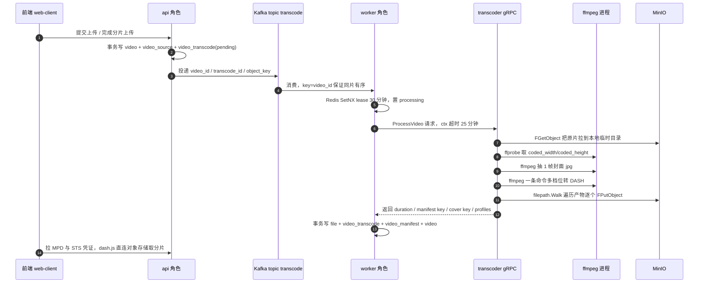
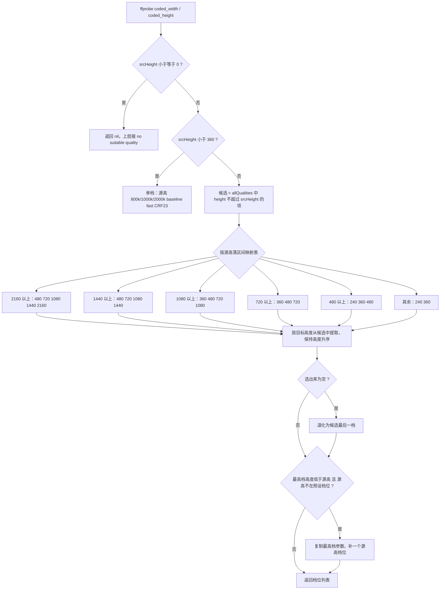

# 03 · DASH 转码与 ABR 自适应码率

> 一句话定位：Vistack 用**一条 ffmpeg 命令、一次解码、多份 `-map 0:v:0` 副本**，把原片按源分辨率自动选出 1~5 个档位转成 **MPEG-DASH**（`manifest.mpd` + `init-*.m4s` + `chunk-*.m4s`），前端 dash.js 依吞吐与 buffer 水位在这些 Representation 之间无缝切档。
> 涉及代码：
> - `internal/transcoder/ffmpeg.go`（七档参数表、`SelectAdaptiveQualities`、`TranscodeToDASH` 全量参数）
> - `internal/transcoder/service.go`（`ProcessVideo`：临时目录 / 下载 / ffprobe / 抽封面 / 转码 / 遍历上传）
> - `internal/core/message_queue/transcode/worker.go`（输出前缀 `dash/{video_id}`、封面 `covers/{video_id}.jpg`）
> - `web/web-client/src/components/player-dash/useDashPlayer.ts`（dash.js ABR、手动切档、请求拦截器）
> - `internal/api/v1/Video.go`（`GetVideoMdp` 下发 MPD、`GetVideoSegmentsSignature` 下发 STS 凭证）
> - `docs/specs/ffmpeg-docker/spec.md`（设计目标 / 验收标准 / 不做的事）

---

## 0. 先把这条链路讲清楚（30 秒版本）

一句话记忆链路：**Kafka 解耦 → worker 编排 → gRPC 远程转码 → MinIO 存产物 → dash.js 自适应播放**。
其中「转码」这一段是本篇重点：产物形态决定播放器能不能切档，参数写错就是能播/不能切/糊三种结局。

---

## 1. 为什么需要 ABR（自适应码率）

### Q：这个项目为什么一定要做 ABR？单码率不行吗？

**🎤 口述（可直接背）**：单码率只能二选一：按 1080p 8Mbps 出，弱网用户就无限转圈；按 480p 1Mbps 出，大屏用户就糊。ABR 的思路是**同一份内容转成多个码率档位，让播放器按实时网络自己挑**，这样 4G、家宽、WiFi 各取所需。我们代码里最高给到 2160p 35Mbps、最低 240p 500k，跨度接近 70 倍，覆盖了手机弱网到大屏 4K。代价是转码 CPU 和存储成倍增加——我们 4K 源要出 5 档，等于一次转码 5 份产物。

**🔍 讲解/备注**：ABR 的三要素是「多档位 + 分片对齐 + 客户端决策」。前两者是服务端责任，落在 `allQualities`（`internal/transcoder/ffmpeg.go:39-47`）与 `-seg_duration 4`、`-g 120` 这些参数上；后者由 dash.js 承担（`useDashPlayer.ts:68`）。服务端如果只给一个档位，`autoSwitchBitrate` 打开也没得切；如果档位之间 GOP/分片不对齐，切档时会出现花屏或卡顿——这是本项目把 GOP 写死 120 帧的真正原因，而不是为了编码效率。

**⚠️ 追问预案**：
- 档位越多越好吗？不是，档位多=CPU 线性增长，我们按源高给 1~5 档而不是固定七档。
- 最低档怎么定？看目标用户最差网络，我们最低 240p/500k。
- ABR 和「多清晰度手动切换」是一回事吗？同一套 Representation，ABR 是自动选，手动是覆盖它。

### Q：为什么是「按源分辨率出档位」而不是「永远出七档」？

**🎤 口述（可直接背）**：因为我们不做放大。源片是 720p，你转出 1080p、4K 只是把像素拉大，画质不会变好，但 CPU 和存储白烧。所以 `SelectAdaptiveQualities` 的逻辑是**只从 `q.Height <= srcHeight` 的档位里挑**（`ffmpeg.go:170-174`），再按区间映射表选目标档位。480p 源出 3 档（240/360/480），1080p 源出 4 档，4K 源出 5 档。这样档位数量随源片质量自然伸缩，成本可控。

**🔍 讲解/备注**：这条原则在代码里有三处体现：候选过滤（`ffmpeg.go:170-174`）、缩放条件 `if q.Height < srcHeight` 才加 `scale`（`ffmpeg.go:318`）、以及等于源高时直接 `setsar=1,setdar=16/9` 不做缩放（`ffmpeg.go:327-328`）。严格说「不放大」是产品取舍：真实平台常见做法是**允许轻微放大**（例如 720p 源也出个 1080p 档位），因为部分设备的解码器/HDMI 协商偏好 1080p，而且多一档不至于伤画质太多。我们选择了「不放大、档位更少、CPU 更省」，代价是极端设备上顶档就是源高。

**⚠️ 追问预案**：
- 那用户上传 240p 烂片呢？走 `srcHeight < 360` 分支，只出一档，档位高=源高。
- 源是 900p 这种非标准档位？会在最高档后面补一个 900p 档（`ffmpeg.go:204-224`）。

---

## 2. DASH vs HLS 选型

### Q：DASH 和 HLS 的区别是什么？为什么选 DASH？

**🎤 口述（可直接背）**：两者都是「清单 + 分片」的流媒体协议，核心差别在标准化程度和分片容器。HLS 是 Apple 主导、用 `.m3u8` 文本清单 + TS 或 fMP4 分片，iOS/Safari 原生支持，生态成熟；DASH 是 MPEG 标准（ISO/IEC 23009-1），清单是 XML 的 MPD，分片是 fMP4，**不依赖任何厂商**，码率适配的表达能力更强（SegmentTimeline、多 Period、多 AdaptationSet）。我们选 DASH 的理由很实际：项目基于 fMP4 + `dash.js`，浏览器端 Chrome/Firefox 都靠 MSE 播，DASH 在这个场景没有任何劣势；而且我不想同时维护两套清单和两套分片，所以 spec 里明确写了「不做 HLS 兼容输出」（`docs/specs/ffmpeg-docker/spec.md:55`）。

**🔍 讲解/备注**：诚实地说，HLS 在 2024 年之后已经通过 fMP4 + LL-HLS 补上了大部分短板，**工程上「只出 HLS 也能覆盖全端」是更省事的选择**（Safari 原生播 HLS，Android ExoPlayer 也支持，iPhone 上 MSE 受限但原生 HLS 可用）。DASH 的独特价值在于：标准中立、清单表达力强、和 `dash.js` 配合调试体验好。如果面试官追问「为什么不用 HLS」，最好的答法是承认这是取舍而非技术优劣：我们的目标是「浏览器内统一用 MSE + 一套自适应逻辑」，DASH 更契合；换成 HLS 我会用 hls.js + 同样的 ABR 思路，服务端只需换 `-f hls` 与 `-hls_time 4`。

| 维度 | MPEG-DASH | HLS |
|---|---|---|
| 主导方 | MPEG / ISO 标准 | Apple |
| 清单格式 | XML（`manifest.mpd`） | 文本（`.m3u8`） |
| 分片容器 | fMP4（`init.m4s` + `chunk-*.m4s`） | TS 或 fMP4 |
| 分片定址 | `SegmentTemplate` 占位符 + `SegmentTimeline` | 显式 URI 列表 / 变体列表 |
| 浏览器播放 | MSE + `dash.js` | MSE + `hls.js`，Safari 原生 |
| 本项目 ffmpeg 形态 | `-f dash -seg_duration 4 -use_template 1 -use_timeline 1` | 对应 `-f hls -hls_time 4` |
| 选它的理由 | 标准中立、清单表达力强、与 dash.js 配合紧 | 苹果生态零成本、生态最广 |

**⚠️ 追问预案**：
- 移动端原生播放怎么办？iOS 走 Safari 原生 HLS 或 App 内自研播放器，属于未来要补的端。
- LL-DASH / CMAF 低延迟？我们现在是 VOD，延迟不敏感，没有做。
- 分片为什么用 fMP4 不用 TS？fMP4 可复用 init 段、便于切档、和 CMAF 一致。

---

## 3. MPD 里的名词都指什么

### Q：MPD、AdaptationSet、Representation、init.m4s、chunk.m4s 分别是什么？

**🎤 口述（可直接背）**：`manifest.mpd` 是整份清单，里面按 AdaptationSet 分组，**一个 AdaptationSet 就是一「组可互相切换的流」**——我们把所有视频档位塞进一个 `id=0` 的视频组，音频单独 `id=1`。组里每个 Representation 是一个具体档位（240p、360p…），播放器就在同组 Representation 之间切。`init-0.m4s` 是初始化段，装的是 moov，告诉解码器这个档位的编码参数、分辨率、timescale；`chunk-0-00001.m4s` 是媒体段，装 moof+mdat，就是实际画面。切档时播放器先取新 Representation 的 init 段，再从下一个分片边界接着播。

**🔍 讲解/备注**：这些名字全部由 `TranscodeToDASH` 的参数生成（`ffmpeg.go:358-368`）：`-init_seg_name init-$RepresentationID$.m4s`、`-media_seg_name chunk-$RepresentationID$-$Number%05d$.m4s`。注意 `$RepresentationID$` 是 **ffmpeg dashenc 自己的占位符**（默认取流的索引，0/1/2…），不是分辨率也不是我们表里的档位名，所以文件名是 `init-0.m4s`、`chunk-0-00001.m4s`，而不是 `init-720p.m4s`。`-adaptation_sets "id=0,streams=v id=1,streams=a"`（`ffmpeg.go:365`）是**最关键的一行**：如果不显式写它，dashenc 会按每个输出流各建一个 AdaptationSet，结果是「每个档位各自一组」，播放器眼里没有可切换的组，ABR 直接失效——MPD 照样能播，但只能播默认那一个档位。

**⚠️ 追问预案**：
- 为什么视频和音频要分开组？音频只有一份，和视频档位数量不等，不能放同一组。
- 切档为什么必须重新取 init？编码参数/SPS-PPS 变了，解码器状态要重置。
- `chunk-*-00001` 编号从 1 开始？是的，`%05d` 五位补零，纯 ffmpeg 行为。

---

## 4. ffmpeg 参数逐条拆解（本篇核心）

### 4.0 七档参数表（背诵用）

| 档位 | 输出分辨率 | Bitrate（仅日志/展示） | MaxRate | BufSize | Profile | Preset | CRF |
|---|---|---|---|---|---|---|---|
| 240p | 426×240 | 500k | 600k | 1200k | baseline | fast | 23 |
| 360p | 640×360 | 1000k | 1200k | 2400k | main | medium | 22 |
| 480p | 854×480 | 2000k | 2500k | 4000k | main | medium | 21 |
| 720p | 1280×720 | 4000k | 5000k | 8000k | high | medium | 20 |
| 1080p | 1920×1080 | 8000k | 10000k | 16000k | high | slow | 18 |
| 1440p | 2560×1440 | 16000k | 20000k | 32000k | high | slow | 17 |
| 2160p | 3840×2160 | 35000k | 45000k | 70000k | high | slow | 16 |

> 表格来自 `internal/transcoder/ffmpeg.go:39-47`，宽度来自 `standard169Resolutions`（`ffmpeg.go:29-37`，480p 取 854 而非严格 SAR=1 的 852）。

### Q：`-use_template 1` 和 `-use_timeline 1` 是干什么的？为什么两个都要开？

**🎤 口述（可直接背）**：`-use_template 1` 让 MPD 用 `SegmentTemplate` + 占位符描述分片，而不是把每个分片 URL 都列出来。一条 2 小时的片子按 4 秒切片是 1800 个分片，5 个档位就是 9000 条 URL，全列出来清单会膨胀到几 MB；用模板后清单只有几百字节到几 KB 量级。`-use_timeline 1` 是额外附上 `SegmentTimeline`，显式列出每个分片的起始时间和时长，而不是让播放器靠 `@duration` 和启动时间自己算。两个一起开的好处是**清单小 + 时间轴精确**：模板负责「怎么拼 URL」，时间轴负责「每个分片精确从哪到哪」。

**🔍 讲解/备注**：代码在 `ffmpeg.go:361-362`。`SegmentTimeline` 的代价是清单略微变大，收益是容错：真实编码里分片时长不可能严格等于 4.000 秒（首片、尾片、帧数取整都会偏），靠 `@duration` 推算容易出现累计漂移，dash.js 用 timeline 直接读 `t/d/r` 更稳。VOD + template + timeline 是 dashenc 最常见的稳态组合。补充一点：`$Number%05d$` 这种格式化占位符也是模板机制的产物，播放器按索引 n 直接拼出 URL，不需要服务端做任何路由。

**⚠️ 追问预案**：
- 关掉 template 会怎样？MPD 里出现巨量 `SegmentURL`，清单体积与分片数成正比。
- 关掉 timeline 呢？播放器用 `@duration` 外推，遇到非整分片容易算错位置。
- 这也算「静态清单」吗？算，VOD 的分片全部生成完了才上传，所以是静态 MPD，不做动态更新。

### Q：`-seg_duration 4` 为什么是 4 秒？和 `-g 120`、`-r 30` 什么关系？

**🎤 口述（可直接背）**：这三个数是绑死的：输出固定 30fps，GOP 写死 120 帧，120 / 30 正好 4 秒，所以每个分片刚好一个完整 GOP，**每个分片都从 IDR 关键帧开始，可以独立解码**。这是 ABR 能无缝切档的物理前提——播放器在分片边界换档，新档位的第一帧就是关键帧，不需要向前回溯参考帧。4 秒这个值本身是平衡：分片太长（10 秒）切档迟钝、起播慢、seek 粒度粗；太短（2 秒）请求数翻倍、HTTP 开销和清单体积都上去。4 秒是工业界最常见的中间值。

```mermaid
gantt
    title 时间轴对齐：30fps 下 120 帧 GOP = 4s = 1 个分片
    dateFormat X
    axisFormat %s
    section 720p 档
    分片1 GOP0-119 关键帧起 :a1, 0, 4
    分片2 GOP120-239 关键帧起 :a2, 4, 4
    分片3 GOP240-359 关键帧起 :a3, 8, 4
    section 1080p 档
    分片1 同边界 :b1, 0, 4
    分片2 同边界 :b2, 4, 4
    分片3 同边界 :b3, 8, 4
```

**🔍 讲解/备注**：参数在 `ffmpeg.go:344-348`（`-r 30 -vsync cfr -g 120 -keyint_min 120 -sc_threshold 0`）与 `ffmpeg.go:360`（`-seg_duration 4`）。这里有个容易踩的点：`-g`、`-keyint_min`、`-sc_threshold` **没有 `:i` 后缀**，是全局输出选项，对所有视频输出流生效——这正是我们想要的「所有档位 GOP 一致」。如果写成 `-g:v:0 120` 只给第一档，那第二档 GOP 就按默认 250 帧走，分片边界与第一档错开，切档必然出问题。反过来，这一条也说明**为什么我们能用一条 ffmpeg 命令转多档**：同一个进程、同一个输入时间轴、同一套全局 GOP 参数，天然保证各档位分片边界严格对齐；换成 5 个独立 ffmpeg 进程，就需要额外用 `-force_key_frames` 或 `-g` 精确控制每一路，还得自己保证边界一致。

**⚠️ 追问预案**：
- 源是 25fps 呢？`-r 30` 会做帧率转换（复制/丢帧）到 30fps，GOP 仍然 120 帧 = 4 秒。
- 尾片不足 4 秒？会是短分片，timeline 里如实记录。
- 为什么不用 `-force_key_frames`？`-g 120` + `-keyint_min 120` + `-sc_threshold 0` 已经等价于固定间隔关键帧，命令更简单。

### Q：`-sc_threshold 0` 为什么要关掉场景切换检测？

**🎤 口述（可直接背）**：默认 x264 检测到场景切换就插一个关键帧，这对单码率点播是好事——画面突变处给个 I 帧能显著提升质量。但对 DASH 是灾难：分片时长变成不确定，`SegmentTimeline` 里每个分片长短不一，更糟的是**多档位之间可能出现只在某一档触发的插入点**，导致各档位边界错位、切档花屏。所以我们干脆关掉场景检测（`-sc_threshold 0`），换来「关键帧严格每 120 帧一个」的确定性。代价是突变场景处的画质略降，这是刻意付出的成本。

**🔍 讲解/备注**：`ffmpeg.go:348`。三个参数组合起来的效果是：`-g 120` 最大间隔 120 帧、`-keyint_min 120` **最小间隔也是 120 帧**（x264 默认 keyint_min 是 keyint/10 左右，会有更短的关键帧间隔）、`-sc_threshold 0` 不因场景切换插帧。三者叠加 = 关键帧恰好出现在第 0、120、240… 帧。这是「一段 = 一个 GOP = 4 秒」的唯一保证。另一个可替代方案是 `-force_key_frames "expr:gte(t,n_forced*4)"`，语义更直白，但我们选择与 dashenc 的 `-seg_duration` 天然对齐的写法。

**⚠️ 追问预案**：
- 关掉场景检测会不会质量明显变差？突变镜头（切镜、闪白）会略糊，但 CRF 会补偿码率。
- 关键帧多了有什么坏处？码率峰值变高、分片边界不齐，这两个都是我们不要的。

### Q：`-crf` 和 `-maxrate`/`-bufsize` 为什么同时给？不是重复了吗？

**🎤 口述（可直接背）**：它们管的是两件事。CRF 是「恒定质量」——编码器按复杂度自己决定每帧用多少码率，静态画面省、运动画面花，画质稳定；但**CRF 不封顶**，遇到极端复杂的画面（爆炸、雨雪）瞬时码率可以冲到很高，弱网用户直接卡死。所以再加 `-maxrate` 限峰值、`-bufsize` 给 VBV 缓冲窗口，把码率曲线压进可网络承载的范围。这套组合就是常说的「capped CRF」：保质量的基础上加一个天花板。我们的值也体现了档位哲学——低档位 CRF 23、高档位 CRF 16，档次越高越苛求质量。

**🔍 讲解/备注**：参数在 `ffmpeg.go:336-338`（`-crf:v:i` / `-maxrate:v:i` / `-bufsize:v:i`）。要指出一个**本项目里的真实缺陷**：`DashQuality.Bitrate` 字段（500k/1000k…）**并没有传进 ffmpeg 命令**，它只出现在 `ffmpeg.go:290` 那行日志里。也就是说我们实际是纯 CRF + maxrate 封顶，MPD 里 `Representation@bandwidth` 也不是由这个表决定的（`-b:v` 未设置）。这带来两个后果：一是档位展示的「标称码率」与实际码率不严格对应；二是 dash.js 拿到的 `bandwidth` 属性可能不准，它的吞吐排序会受影响（我们在前端是先按高度再按带宽排序，缓解了这个影响，见 `useDashPlayer.ts:85`）。更规范的写法是同时给 `-b:v:i` 目标码率，或把 Bitrate 从结构体里删掉避免误导。

**⚠️ 追问预案**：
- CRF 和两遍编码怎么选？两遍 VBR 码率控制更精确但要跑两遍，CPU 翻倍，点播平台常用，我们是单遍 capped CRF。
- bufsize 给多少合适？经验值是 maxrate 的 1.5~2 倍，表里就是这个比例。
- 那 CRF 23 和 maxrate 600k 冲突吗？不冲突，VBV 只会削峰，不会拉高静态画面的质量下限。

### Q：profile 和 preset 怎么取舍？

**🎤 口述（可直接背）**：`profile` 决定「解码器要支持什么特性」，是兼容性问题：baseline 最保守（无 B 帧、无 CABAC），老设备和低端芯片都能解；main 加了 CABAC 和 B 帧；high 支持 8x8 变换、更多参考帧，压缩效率最高。我们的策略是**低档位求兼容、高档位求效率**：240p 用 baseline（可能是老设备弱网），360p/480p/720p 用 main，1080p 及以上用 high。`preset` 决定「编码器花多少 CPU 换多少压缩率」，从 ultrafast 到 veryslow：我们的 240p 用 fast、中间档用 medium、1080p 以上用 slow——因为高档位用户对画质敏感，多花 CPU 值得。

**🔍 讲解/备注**：`ffmpeg.go:334-335` 输出 `-profile:v:i` 与 `-preset:v:i`。CPU 成本的量级要能说清楚：以 x264 同一素材为例，`fast → medium` 大约多 20%~40% CPU、省 5%~10% 码率；`medium → slow` 再多 50%~100% CPU、再省 5% 左右。也就是说 preset 的边际收益递减、成本递增，所以「全档位都用 slow」是典型的错误优化——我们只在 1080p+ 用 slow。另一个成本点是**所有档位在同一个 ffmpeg 进程里编码**，虽然 x264 各自多线程，但总线程数会互相争抢 CPU，容器如果不设 CPU limit 会打满整机。这也是 k8s 清单里应当补 `resources.requests/limits` 的原因（当前 `deploy/k8s/transcoder.yaml` 未设置）。同时这张表还说明：**profile 越高、兼容性越差**，所以「全档位 high」也不对。

**⚠️ 追问预案**：
- 为什么 240p 用 baseline 而不是 main？兼容老设备/软解，且 240p 不需要 B 帧省码率。
- 有 B 帧会影响分片吗？不会，B 帧在 GOP 内部，关键帧边界仍然由 `-g` 决定。
- 更现代的编码呢？HEVC/AV1 能省 30%~50% 码率，但浏览器兼容与授权成本高，我们只出 H.264 + AAC。

### Q：`scale=...:flags=lanczos,setsar=1,setdar=16/9` 为什么这么写？

**🎤 口述（可直接背）**：三个动作。`scale` 把画面缩到目标分辨率，`flags=lanczos` 指定缩放算法——lanczos 是高质量的重采样核，比默认 bicubic 锐利、细节保留好，代价是 CPU 略高（缩放本身相对编码开销可以忽略，所以这里没必要省）。`setsar=1` 把像素宽高比强制成 1:1，`setdar=16/9` 把显示宽高比声明成 16:9——因为源片可能带非方形像素（比如 DV 的 720x576 SAR 16:15）或者带黑边，如果不归一会导致播放时被拉伸。归一到方形像素 + 16:9 之后，前端可以用一套 CSS/容器尺寸适配所有档位。

**🔍 讲解/备注**：`ffmpeg.go:317-329`。宽度来源有两条路：优先查 `standard169Resolutions`（`ffmpeg.go:29-37`，例如 720→1280、480→854）；查不到（比如补出来的 900p 档）就按 `height*16/9` 四舍五入并**向上取偶**（`ffmpeg.go:321-324`）——取偶是因为 H.264 在 `yuv420p` 下色度是 2x2 下采样，宽高为奇数会导致部分编码器/播放器出错。注意 `setdar=16/9` 是「声明」而非「裁切」：如果源片是 4:3，缩放后仍会被声明为 16:9，看起来会被拉宽——这是本项目的一个真实粗糙点（没有做黑边检测或 keep-aspect 补边）。更稳的做法是 `scale=w:h:force_original_aspect_ratio=decrease` + `pad` 补黑边，或干脆按源 DAR 决定目标 DAR。

**⚠️ 追问预案**：
- lanczos 比 bicubic 慢多少？缩放阶段大约慢 2~3 倍，但只占总耗时很小比例。
- 源是竖屏短视频怎么办？当前会被强制成 16:9 拉伸，这是缺陷，需要按源 DAR 分支。
- 为什么不用 `-vf` 而用 `-filter:v:i`？多输出流时必须逐流指定滤镜，`-vf` 只能作用于单流。

### Q：`-map 0:v:0` 重复多份、`-map 0:a:0?` 那个问号是什么意思？

**🎤 口述（可直接背）**：`-map` 是给每个输出流指定来源。DASH 每个档位在 ffmpeg 眼里是一个独立的输出视频流，所以我们**按档位数量重复 `-map 0:v:0` 若干次**（`ffmpeg.go:311-313`），每个副本接一条自己的 `-filter:v:i` 缩放链和编码参数，一个输入被解码一次、分发到 N 个编码器——这比跑 N 个进程各解码一次省得多，而且天然保证时间轴对齐。音频只映射一次 `-map 0:a:0?`。末尾那个问号是 ffmpeg 的「可选映射」语法：如果源片没有音轨，带 `?` 就不会因为这个映射失败而让整条命令报错退出。

**🔍 讲解/备注**：`-map 0:v:0` 里的 `0` 是输入序号、`v` 是视频、`:0` 是第一路；重复 N 次就得到 N 路输出。必须逐流指定音频编码参数用的是不带 `:i` 的 `-c:a aac -b:a 192k -ar 48000 -ac 2`（`ffmpeg.go:351-356`）——因为输出里只有一路音频。要注意的边界：如果源片确实没有音轨，`?` 让命令继续执行，但我们仍然声明了 `-adaptation_sets "id=1,streams=a"`，此时音频组为空，MPD 里可能没有音频 Representation（也可能伴随 dashenc 告警）——**这个分支我没有实测过，属于已知的未验证边界**；安全做法是先 ffprobe 判断有无音轨，再决定是否带 `-adaptation_sets` 的音频部分或补一路静音音轨。

**⚠️ 追问预案**：
- 多档位共用一个解码结果会不会互相拖累？会，编码器是串行/并发混合调度，高 preset 档位会拖慢整体吞吐。
- 为什么不分别跑 5 个 ffmpeg 并行？那样每路都要重新解码，且要额外保证 GOP 边界一致。
- 多个音轨（多语言）怎么处理？现在不支持，需要 `-map 0:a:0 -map 0:a:1` 加多语言 AdaptationSet。

### Q：为什么输出固定 `-r 30`？副作用是什么？

**🎤 口述（可直接背）**：`-r 30` 把输出强制成恒定 30fps，好处是**帧率和 GOP 关系确定**：120 帧 / 30fps = 正好 4 秒，一个分片一个 GOP，这条数学关系是整个切档逻辑的地基。副作用必须诚实说：60fps 的源会被砍成 30fps，**丢掉的是一半真实帧**，快速运动镜头会有轻微抖动感，弹幕/游戏录屏这类源尤其明显。另一个副作用是 25fps 的源会被转换（重复帧或丢帧）到 30fps，属于无用功。改进方向是按源帧率分档：对 60fps 源输出 60fps，GOP 相应改成 `-g 240`，保持「4 秒一个 GOP」不变，让分片时长与帧率解耦。

**🔍 讲解/备注**：`ffmpeg.go:344-345`。顺带一个可以主动提出的「代码味」问题：`-vsync cfr` 在 ffmpeg 5.1+ 已经废弃，正确写法是 `-fps_mode cfr`，运行时会打 deprecated 警告（功能仍等价于 cfr）。既然已经有了 `-r 30`，其实 `-vsync cfr`/`-fps_mode cfr` 是重复的，可以直接删掉减少噪音。这段「已知废弃参数」是很好的自我批评素材——说明我真的跑过、看过 stderr，而不是只背参数表。

**⚠️ 追问预案**：
- 为什么不 `-r 60`？源多数是 30fps，转 60 是插帧浪费；且 GOP 要跟着改成 240。
- 源是 24fps 电影呢？会被转成 30fps，出现 3:2 类不均匀帧，属于取舍。
- `-r` 和 `-vsync` 谁生效？两者都是输出帧率控制，重复设置时行为仍为 CFR。

---

## 5. 档位选择算法

### Q：你的档位选择算法具体怎么写的？

**🎤 口述（可直接背）**：五步。第一步 ffprobe 拿 **coded_width/coded_height**（优先编码分辨率而不是显示分辨率，`ffmpeg.go:91-93`）。第二步，源高 ≤ 0 返回 nil；源高 < 360 直接给**单档**（档位高=源高，800k/1000k/2000k/baseline/medium/CRF23）。第三步，从七档表里筛出 `height <= srcHeight` 的候选。第四步，按源高落到一个区间映射表，得到目标档位列表：4K 源出 480/720/1080/1440/2160 五档，1440p 源出 480/720/1080/1440 四档，1080p 源出 360/480/720/1080，720p 源出 360/480/720，480p 源出 240/360/480，其余（360~479）出 240/360。第五步，如果最高档仍低于源高、且源高不在预设档位里，就**照最高档的参数补一个「源高」档**，比如 900p 源补一个 900p 档。

**🔍 讲解/备注**：代码在 `ffmpeg.go:158-227`（主逻辑）、`ffmpeg.go:230-241`（`filterQualities`）、`ffmpeg.go:244-261`（`ResolveQualities`）。几个值得主动说的边界与缺陷：

1. **`len(candidates) == 0` 分支（`ffmpeg.go:176-180`）实际不可达**：能进入这行说明源高 ≥ 360（否则被上面的分支截住），那么 240p 档必然满足 `240 <= srcHeight`，候选至少有一个。属于防御性死代码。
2. **补档继承的是「最高档」的全部参数**，包括 CRF 和 preset（`ffmpeg.go:213-222`）。所以 900p 档拿的是 720p 的 5000k maxrate + CRF 20，对 900p 来说略偏紧——更合理是按高度线性插值，或者干脆把常见非标准分辨率也纳入表里。
3. **4K 档位从 480p 起步，没有 240p/360p**（`ffmpeg.go:185`）。好处是省 CPU，坏处是弱网移动端只能降到 480p（≈2.5Mbps 峰值），比 720p 源的用户能降到的 360p 还高——**这是 4K 片源在弱网下更容易卡的一个设计不均**，改进是让最低档跟用户网络能力挂钩，而不是跟源高挂钩。
4. **`SelectAdaptiveQualities` 只看高度，不看宽度和 DAR**。竖屏 1080x1920 的源会被判定为 1080 档位并按 16:9 处理，视觉上就是被拉伸（配合上面 `setdar=16/9` 的问题）。
5. `ResolveQualities(0, 0, ...)` 在 `service.go:87` 传入的是 `0, 0`，源尺寸是假的——因为请求里 `quality_heights` 为空时它直接返回 nil，真正的自动选择发生在 `TranscodeToDASH` 内部重新 ffprobe 之后（`ffmpeg.go:274-282`）。**参数传递是无意义的**，属于可清理的坏味道（要么在 service 层探测后显式选档，要么把签名里的宽高删掉）。

**⚠️ 追问预案**：
- 为什么按高度而不是按码率选档？高度是用户可感知的清晰度维度，也是设备和带宽协商的实际抓手。
- 映射表是拍脑袋定的吗？是经验值 + 覆盖主流档位（240/360/480/720/1080/1440/2160），保证每档之间 1.5~2 倍码率间隔，切档视觉过渡自然。
- 表里为什么没有 144p？太低没有意义，反而多一份 CPU。

---

## 6. 播放端：dash.js 的 ABR 与手动切档

### Q：dash.js 是怎么做 ABR 的？你代码里控制了什么？

**🎤 口述（可直接背）**：dash.js 的 ABR 是**吞吐估算 + buffer 水位**两路信号的混合决策。吞吐这一路：它在下载每个分片时统计实际下载速率，做指数加权移动平均，再按下一档的码率判断「能不能在剩余 buffer 耗尽前下完」；buffer 这一路：看当前已缓冲的秒数，buffer 富余时敢升档，buffer 见底时立刻降档。代码里我显式打开的是 `streaming.abr.autoSwitchBitrate.video = true`（`useDashPlayer.ts:68`），其余 ABR 规则用 dash.js 默认的 `abrDynamic` 策略。手动切档时我反过来把 autoSwitch 关掉，再调 `setRepresentationForTypeByIndex('video', index, true)` 强制立即换档（`useDashPlayer.ts:110-112`），第三个参数 `true` 表示不等 buffer 消化、立刻替换后续分片来源。

**🔍 讲解/备注**：`useDashPlayer.ts` 里和 ABR 相关的三处：
- **档位列表来源**：监听 `streamInitialized`，用 `getRepresentationsByType('video')` 读出全部 Representation 的 `index/height/bandwidth`，按高度降序、同高按带宽降序排成 UI 列表（`useDashPlayer.ts:82-88`）。
- **自动/手动互斥**：`setQuality('auto')` 打开 autoSwitch；`setQuality(index)` 关掉 autoSwitch 再强制指定档位（`useDashPlayer.ts:103-113`）。这里有个产品层面的取舍：**手动选档后就不再自动降档**，弱网时用户会卡在所选档位——更完善的做法是「手动设定上限，允许向下自适应」，dash.js 可以通过 `setAutoSwitchQualityFor` 或自定义 ABR 规则实现。
- **请求拦截器**：`addRequestInterceptor` 把 `.m4s` 请求改写到 CDN/对象存储的 `segmentsBaseUrl`，并用 STS 临时凭证做 SigV4 签名（`useDashPlayer.ts:69-81`）。注意它只改写 `.m4s`，MPD 仍然走业务 API（`GetVideoMdp`，`internal/api/v1/Video.go:721-778`），分片则直连对象存储（`GetVideoSegmentsSignature` 下发的凭证策略被限制在 `dash/{video_id}/` 前缀内）——即**清单走业务侧、流量走对象存储**，这是典型的分层。

**⚠️ 追问预案**：
- ABR 会不会误判？会，突发带宽抖动会引起频繁切换，dash.js 有 SwitchHistoryRule 抑制抖动。
- 起播为什么从低档开始？dash.js 默认保守起播（低档快速出画），随后升档。
- 你怎么验证切档真的生效？看 MPD 里的 Representation 数、抓 `chunk-<id>-*` 的请求序列，或在 UI 上显示当前档位。

### Q：怎么证明「无缝切换」不是嘴上说的？

**🎤 口述（可直接背）**：要有四个前提，我们在服务端全部满足：一，同组 Representation 共享 `SegmentTimeline` 的绝对时间轴，分片起止时刻一一对应；二，每档的关键帧严格落在分片边界（GOP 120 / 30fps / 4 秒）；三，所有档位在同一条 ffmpeg 命令里编码，时间轴同源；四，切档由播放器在分片边界执行并重新加载 init 段。验证方式也很朴素：抓包看播放中切档后 `init-<新id>.m4s` 是否被请求，画面是否没有长时间黑屏/花屏，`video.currentTime` 是否连续。

**🔍 讲解/备注**：反过来说，**任何一个前提被破坏都会退化成「能播但不能切」或「切了就花」**：`-adaptation_sets` 写错 → 没有可切组；`-g` 只作用于单档 → 边界错位；`-sc_threshold` 没关 → 分片长短不一。这三条正好对应本篇的三个「关键行」。另外要注意，无缝的前提是**编码器关闭 open-GOP**（x264 默认就是 closed GOP，没有设置 `-x264opts open-gop=1`），open-GOP 会让首帧依赖前一 GOP，破坏独立解码。

**⚠️ 追问预案**：
- 音频要不要跟着对齐？要，音频分片也是 4 秒，只是音频没有 GOP 概念，切档不涉及音频。
- seek 到任意位置呢？播放器用 timeline 定位到包含该时刻的分片，从该分片的关键帧开始解码。

---

## 7. 转码成本与优化方向

### Q：一次转码的成本有多高？会怎么优化？

**🎤 口述（可直接背）**：成本主要是三块。CPU：一条命令同时编 1~5 档，1080p 源跑 4 档、其中两档 preset slow，一台普通服务器基本是满载跑，一条 10 分钟片子的转码时间通常在数分钟量级（倍数取决于机器核数）。存储：同样的内容存多份，4K 源 5 档的产物总体积可以是原始文件的 1.5~3 倍。网络：原片要完整下载到转码机、产物要逐个上传，一次转码相当于把视频搬运两遍以上。优化方向我按性价比排：**① 分片并行**——现在的实现是「整片转完再上传」，改成分片边转边传（ffmpeg 支持 dash 分片实时落盘，我们的上传循环 `service.go:111-136` 是串行的，可先并发上传）；**② 按需转码**——只为被点播的档位转码（ladder 懒加载），长尾视频省一大半；**③ 硬件加速**——NVENC/QSV 能把速度提几倍，代价是码率效率略降；**④ 只转热门档位**——统计真实播放分布，砍掉从未被选的档位；**⑤ 分片级并行编码**——按 GOP 切片分发到多机，收益最大但工程复杂度最高（要处理切片对齐和合并）。

**🔍 讲解/备注**：代码依据在 `service.go:30-39`（下载到本地临时目录 `transcode-*`，`defer os.RemoveAll` 清理）、`service.go:94-136`（`filepath.Walk` 收集所有产物，然后**同步 for 循环逐个 FPutObject**）、`service.go:111-114`（对象 key 用 `output_prefix + "/" + 相对路径`，`output_prefix` 来自 worker 的 `dash/{video_id}`）。几个具体缺陷值得主动说：**一，上传串行**——一条 1 小时视频 4 秒切片是 900 片、5 档约 4500 个对象，串行上传的 RTT 累积非常可观，这是最低成本的优化点（改为 errgroup 并发 8~16 路）。**二，整片转完才上传**——一旦超时/失败，已完成的编码全部丢弃（临时目录被 `defer` 删掉），重试要从头再来；如果边转边传，失败也能续传。**三，失败产物不清理**——上传中途失败时 MinIO 里会残留部分对象（`service.go:126-128` 直接 return err），没有回滚/清理逻辑，长期运行会积累孤儿对象（删除链路 `dash/{video_id}` 前缀能兜住一部分）。**四，本地磁盘压力**——原片 + 全部产物同时落在容器临时盘上，4K 长视频很容易打满容器存储（`emptyDir` 或 overlay 层），需要给 transcoder 挂独立卷或做磁盘水位保护。

**⚠️ 追问预案**：
- 为什么不一上传就转码？我们现在就是上传完成即投递 Kafka，属于即时转码。
- 为什么不边转边播（co-located VOD）？需要播放在转码未完成时就能播，属于演进方向。
- 转码机要不要缓存原片？重复上传/重试会重复下载，可用本地 LRU 或对象存储近端节点缓解。

### Q：如果 ffmpeg 参数写错了，会看到什么现象？

**🎤 口述（可直接背）**：分三类。**能出产物但播放器不可用**：`-adaptation_sets` 写错或漏写，MPD 里每档各成一个组，能播但不能切档，这是最阴的一类——转码成功、DB 置 completed、前端能播，只是清晰度切换菜单只有一个档。**切档花屏**：GOP 不对齐（`-g` 写成逐流参数、`-sc_threshold` 没关），边界错位，切换瞬间解码器拿到没有参考帧的帧。**直接失败**：`-map 0:a:0` 不带 `?` 遇到无音轨源会让 ffmpeg 非零退出，`service.go:89-91` 把 stderr 包进错误返回，worker 侧 `markFailed` 计入重试（`worker.go:92-103`），最多 7 次后丢弃。另一类是**只报警告不出错**：`-vsync cfr` 已废弃，ffmpeg 会打 deprecated 警告但仍照常工作——这也是为什么必须看 stderr 全文，不能只看退出码。

**🔍 讲解/备注**：错误信息在 `ffmpeg.go:381-387`（把 stderr 拼进 error）与 `service.go:126-128`（上传失败带相对路径）。这里能延伸出一个工程点：目前 transcoder 的 ffmpeg 告警**只流向日志，不会回传给 worker**，所以「警告级参数问题」在生产里基本无人发现。改进是把 stderr 的关键行（如 `deprecated`、`Non-monotonous`）抽出来，作为响应里的 warning 字段或单独指标上报。另外要注意 `service.go:38` 下载失败、`service.go:42-48` ffprobe 失败（**这条只 Warn 并把 duration 置 0**，不中断转码）——后者是一个刻意的降级：时长探测失败不该让整个任务失败，代价是 DB 里 duration 记为 0。而 `GetVideoResolution` 失败会直接终止（`ffmpeg.go:274-277`），因为档位选择必须要分辨率。

**⚠️ 追问预案**：
- 怎么快速定位转码失败原因？看 worker/transcoder 结构化日志里带 stderr 的 error，以及 DB 里 `video_transcodes.status=failed`。
- 有没有转码失败的告警？目前没有，只有日志与重试计数，是可观测性缺口。
- 参数变更怎么防回退？应把 ffmpeg 命令快照与产物校验（Representation 数量、分片数）纳入验收测试。

---

## 自测清单

- [ ] 能一句话说清 `manifest.mpd` / `AdaptationSet` / `Representation` / `init.m4s` / `chunk.m4s` 各自角色
- [ ] 能背出七档参数表的关键列（高度、maxrate、bufsize、profile、preset、CRF）
- [ ] 能解释 `4 秒 = 120 帧 / 30fps` 这条等式，以及它为什么是切档的前提
- [ ] 能说明 `-sc_threshold 0` 与 `-keyint_min 120` 各自解决什么问题
- [ ] 能解释 `-use_template 1` + `-use_timeline 1` 的组合收益与代价
- [ ] 能说清 capped CRF 的含义，并指出本项目 `Bitrate` 字段未传入 ffmpeg 这个缺陷
- [ ] 能手绘档位选择流程图（<360 单档 / 五段映射表 / 补源高档）
- [ ] 能解释 `-map 0:v:0` 重复多次 + `-map 0:a:0?` 问号的含义
- [ ] 能诚实说明 `-r 30` 对 60fps 源的影响，并给出按源帧率分档的改法
- [ ] 能描述 dash.js ABR 的两路信号（吞吐 + buffer）与手动切档的实现方式
- [ ] 能列出至少 4 个转码优化方向并排优先级（并发上传、按需转码、GPU、砍冷门档位）
- [ ] 能说出 3 类「参数写错」的表现差异（不能切 / 切了花 / 直接失败）

## 背诵卡

- ABR：一源多档，播放器按网速挑
- 不放大：只出不超过源高的档位
- 30fps × 120 帧 = 4 秒一片
- GOP 120 帧，各档分片边界齐
- 关场景检测：-sc_threshold 0
- adaptation_sets 决定能否切档
- 模板拼 URL，时间轴定起止
- CRF 保质量，maxrate 封峰值
- Bitrate 字段没传给 ffmpeg
- preset 越高越慢越省码率
- -map 多份：一次解码 N 次编码
- 0:a:0? 问号＝无音轨也不失败
- -r 30：60fps 源丢一半帧
- 上传串行，4500 个对象是瓶颈
- 清单走 API，分片走对象存储
