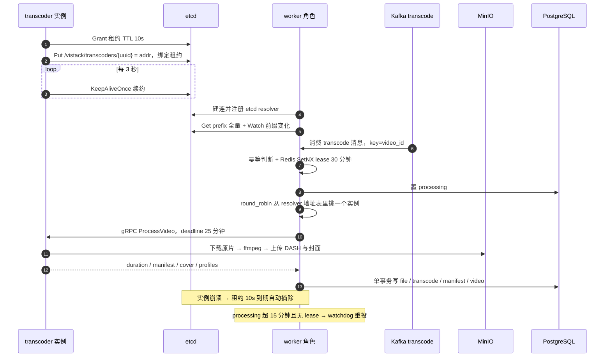
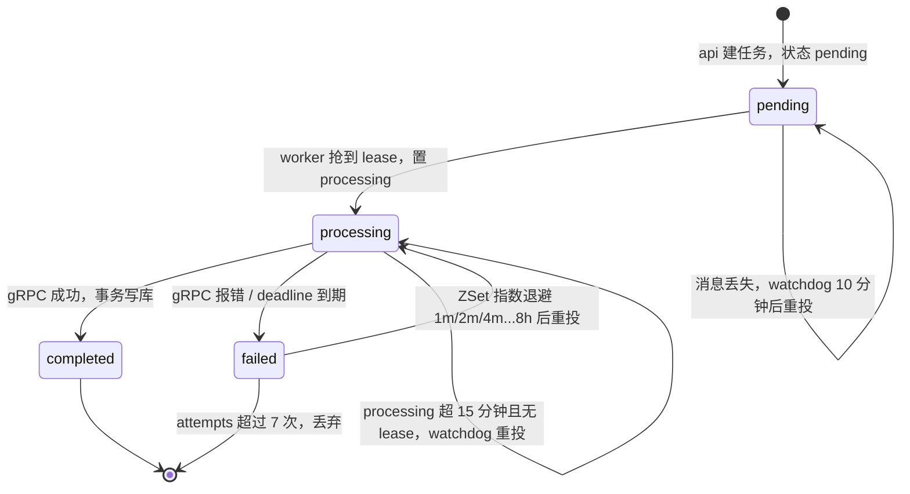

# 04 · gRPC 远程转码与 etcd 服务发现

> 一句话定位：Vistack 把 FFmpeg 从主进程里**拆成一个独立的 gRPC 转码服务**（无状态、不连数据库、输入输出全走 MinIO），实例启动时向 **etcd 注册**（`/vistack/transcoders/{uuid}` + 10s 租约、3s 续约），worker 侧用**自研 gRPC resolver + round_robin** 动态发现并负载均衡，编排与状态机全部留在 worker。
> 涉及代码：
> - `proto/transcoder/v1/transcoder.proto`（`TranscoderService.ProcessVideo` 契约）
> - `internal/transcoder/server.go`（gRPC 注册、`advertiseAddr` 的 POD_IP 逻辑）
> - `internal/transcoder/service.go` / `ffmpeg.go`（服务实现与 ffmpeg 封装）
> - `internal/transcoder/registry/etcd.go`（租约 TTL 10s、3s `KeepAliveOnce`、失败重新 Grant）
> - `internal/discovery/etcd.go`（scheme=`etcd` 的自定义 resolver + watch 前缀）
> - `internal/transcoder/client.go`（etcd 发现或静态地址、`round_robin`）
> - `internal/core/message_queue/transcode/worker.go` / `watchdog.go` / `retry.go`（25 分钟调用超时、15 分钟看护、指数退避）
> - `internal/role/worker.go` / `role/transcoder.go`（角色初始化边界、领导选举）
> - `docs/specs/ffmpeg-docker/spec.md`、`Dockerfile`、`compose.yml`、`deploy/k8s/transcoder.yaml`

---

## 0. 全链路一图流

一句话记忆链路：**Kafka 解耦任务 → worker 持有状态机 → etcd 管实例上下线 → gRPC 干活 → MinIO 存数据**。

---

## 1. 为什么把 FFmpeg 拆成独立服务

### Q：为什么要把 FFmpeg 从主程序里拆出去，单独做成一个容器 / 角色？

**🎤 口述（可直接背）**：四个理由。**一，依赖隔离**：FFmpeg 是几百 MB 的系统依赖，装在主镜像里等于所有角色都背上它；拆开后 `Dockerfile` 用双 target——`vistack` 镜像给 api/worker/auth（只有 alpine + 二进制），`vistack-transcoder` 才装 ffmpeg，两个镜像都跑在非 root 的 uid 10001 上。**二，崩溃隔离**：ffmpeg 遇到畸形输入会段错误或吃光内存，放在主进程里等于把 API 一起带走；独立容器炸了只影响一个转码任务。**三，资源画像不同**：转码是 CPU 密集型、长耗时，API 是 IO 密集、低延迟，混在一起会导致「转码把 CPU 打满、API 请求 P99 飙高」。**四，独立扩容 + 最小权限**：转码忙就 `--scale transcoder=3`，而且转码机**不持有数据库凭证**，只能读写 MinIO，攻击面小得多。

**🔍 讲解/备注**：这条拆分在 spec 里被写成非功能需求 N1/N5（`docs/specs/ffmpeg-docker/spec.md:41,45`）与验收 AC1（`spec.md:60`：transcoder 模式不建立 DB 连接、不启动 HTTP）。代码印证：`internal/role/transcoder.go:17-18` 只调 `core.InitMinioClient(cfg)`，注释直接写「不初始化 DB / Redis / Kafka」；而 `role/worker.go:30-36` 初始化 DB/MinIO/Redis/雪花/Kafka。部署印证：`compose.yml:141-154` 的 transcoder 服务 `target: vistack-transcoder`，并注明 `docker compose up --scale transcoder=3`；`Dockerfile:54-65` 的 transcoder target 里 `apk add ffmpeg`，且**没有** COPY 前端产物。**代价也要说清楚**：多了一层网络调用（序列化、连接管理、超时与重试都要自己兜），多了一个必须运维的中间件（etcd），而且现在只有一条 unary RPC，跨进程的收益主要体现在隔离与扩容上，不是吞吐。

**⚠️ 追问预案**：
- 拆开是不是过度设计？对单机小项目是，对这个「要能水平扩容到 k8s」的目标不是。
- 为什么不用 Serverless/队列 + 容器作业（如 K8s Job）？任务粒度是「一次长转码」，用 gRPC 常驻服务更好控制超时与并发；Job 模式适合批处理。
- 拆开后 QPS 会不会下降？多一跳内网 gRPC，相对分钟级转码耗时可忽略。

### Q：为什么把 FFmpeg 当远程服务而不是本地 `exec`？改了执行位置要注意什么？

**🎤 口述（可直接背）**：拆分前 worker 直接 `os/exec` 本机 ffmpeg，导致「能转码的机器」和「能编排的机器」绑死，无法横向扩容，也无法把转码机放到有 GPU 或大磁盘的机型上。改成远程服务后，**worker 只负责编排，ffmpeg 在哪台机器上是运行时决定的**。但换位置要保住行为不变：spec 明确要求「FFmpeg 参数、ABR 档位、封面时间点、分片命名、DB 字段全部与旧实现等价」（`spec.md:29,43`），也就是这次重构是**搬迁不是重写**——这是能被验收的前提（AC4，`spec.md:63`）。

**🔍 讲解/备注**：搬迁带来的隐式变化值得主动提：**一，文件位置变了**——原来 worker 和 ffmpeg 在同一台机器、共享本地临时目录；现在输入必须先从 MinIO 下载到转码机本地（`service.go:30-39`），临时目录用 `os.MkdirTemp` + `defer os.RemoveAll`，所以容器需要足够的临时磁盘空间。**二，超时语义变了**——本地 exec 是可以 `CommandContext` 杀进程的，而 `ffmpeg.go:370` 用的是 `exec.Command`，**不接收 ctx**：worker 侧 25 分钟 deadline 到期只取消 gRPC 调用，转码机上的 ffmpeg 进程**不会被杀**，会继续跑完，然后因为上传用的 ctx 已取消而在写回 MinIO 时失败。这是一个真实的缺陷：正确的做法是 `exec.CommandContext` 或超时后显式 `Process.Kill`，并清理半成品对象。**三，错误边界变了**——本地 exec 的 stderr 直接进日志，现在 stderr 要经过 gRPC 错误消息回传（`ffmpeg.go:381-387` 把 stderr 拼进 error），需要注意 gRPC 默认 4MB 消息上限和错误信息长度。

**⚠️ 追问预案**：
- 转码机本地磁盘满了怎么办？会在下载或编码写盘时失败，返回错误后由 worker 重试，但没有专门的磁盘水位保护。
- 需要共享存储吗？不需要，MinIO 就是共享存储，机器之间零共享状态。
- 能换成 Job 吗？可以，把 `ProcessVideo` 变成一个 Job 模板参数即可，契约不用改。

---

## 2. 为什么用 gRPC 而不是 HTTP + JSON

### Q：这里为什么选 gRPC？HTTP+JSON 不行吗？

**🎤 口述（可直接背）**：四个理由。**一，强契约**：proto 定义消息和服务，`buf lint` 进 CI，字段加错、类型不匹配在编译期就报错；HTTP+JSON 是运行时才发现字段拼错。**二，代码生成**：proto 一次定义，Go 服务端和客户端 stub 都是生成的，不需要手写 URL 拼接、状态码处理和 JSON 反序列化。**三，为流式留口子**：现在是一条 unary RPC，但转码天然需要进度上报，proto 加一个 `server streaming` 方法就能演进（spec 明确把进度流式列入「不做的事」，`spec.md:50`）。**四，内部调用成本低**：HTTP/2 多路复用 + protobuf 二进制，比 JSON 更省带宽和 CPU，长连接也避免了每次调用的握手开销。

**🔍 讲解/备注**：要诚实承认**在这里 gRPC 的收益是「工程规范性 > 性能」**：一条分钟级转码调用，JSON 的序列化开销可以忽略，真正的收益是契约与演进空间。契约本身很简单（`proto/transcoder/v1/transcoder.proto:8-11`）：只有一个 `ProcessVideo`。要能说出代价：浏览器不能直接调（需要 gRPC-Web + 代理）、调试不如 curl 直观（要 grpcurl 并且我们**没有注册 server reflection**，所以必须带 proto 文件）、负载均衡不像 HTTP 那样有 L7 网关直接支持（这也是我们要自己写 resolver + round_robin 的原因）。

| 维度 | gRPC（本项目） | HTTP + JSON |
|---|---|---|
| 契约 | proto，编译期校验，`buf lint` 进 CI | OpenAPI/口头约定，运行时才发现 |
| 代码生成 | 生成 client/server stub，零手写传输层 | 手写路由/DTO/反序列化 |
| 流式 | 原生支持，进度上报天然适配 | 需 SSE/WebSocket 另行设计 |
| 负载均衡 | 需自定义 resolver 或 L7 代理（本项目的 resolver） | 网关/K8s Service 天然支持 |
| 调试 | grpcurl + proto（未开 reflection） | curl 直接看 |
| 浏览器直连 | 需要 gRPC-Web + 代理 | 直接可用 |
| 性能 | HTTP/2 多路复用 + 二进制，序列化开销低 | 文本协议，开销略高 |
| 本项目适用性 | 内部服务调用，契约与演进优先 | 更适合对外 API |

**⚠️ 追问预案**：
- 为什么没上 gRPC-Web？内部调用不需要，前端只调 REST。
- 为什么不开 reflection？安全考虑与依赖最小化，代价是调试要带 proto。
- 消息太大了会怎样？gRPC 默认 4MB 收发上限，我们现在只回传元数据（key/大小/档位），没有大消息风险。

---

## 3. ProcessVideo 契约设计

### Q：`ProcessVideo` 的入参出参为什么这么设计？为什么不让转码机直连数据库？

**🎤 口述（可直接背）**：入参是「数据在哪」，出参是「结果在哪」，**没有任何业务实体**。入参有六个：bucket、object_key（原片）、output_prefix（产物前缀）、cover_object_key（封面对象 key）、cover_time_seconds（抽帧时间点，0 表示自动）、quality_heights（档位，空表示自动选）。出参是 duration、manifest object key + size、cover object key + size、实际档位列表。**为什么不让它连数据库**：一，最小权限，转码机只拿 MinIO 凭证，泄露也拿不到用户数据；二，事务边界清晰，所有写库都在 worker 侧一个事务里完成（`worker.go:106-192`），转码机没有机会写出不一致状态；三，转码机不依赖 schema，改表不影响它；四，连接数可控，转码实例随意扩容不会打爆数据库连接池。

**🔍 讲解/备注**：契约定义在 `proto/transcoder/v1/transcoder.proto:18-34`，注释里明确写了「无状态、读写 MinIO、不持有数据库连接」（`proto:7`）。注意 transcoder **完全不知道 video_id 这个概念**——worker 传的是 `output_prefix = "dash/{video_id}"`（`worker.go:75`）和 `cover_object_key = "covers/{video_id}.jpg"`（`worker.go:76`），路径语义由调用方决定，这是很干净的解耦：转码服务不知道自己服务于「视频」这个业务。**缺陷也要说**：`service.go:114` 直接 `fmt.Sprintf("%s/%s", req.GetOutputPrefix(), rel)` 拼对象 key，**没有校验前缀**（比如应该断言必须以 `dash/` 开头），配合明文无鉴权的 gRPC，任何能访问 50051 的进程都能把产物写到桶里任意前缀。另外 `cover_time_seconds` 传 0 时由转码机自己决定抽帧时间（`service.go:51-59`：默认 1 秒；时长 > 10 秒取 5 秒；2~10 秒取中点），**这个策略放在转码机而不是 worker**，好处是不用回传时长再调一次，坏处是策略被下移到无状态服务里，将来做「智能封面」时改动点会分散。

**⚠️ 追问预案**：
- 为什么要返回 `manifest_size`/`cover_size`？worker 要建 `file` 记录（`worker.go:110-117`、`156-170`），落库需要 size。
- `profiles` 有什么用？写进 `video_transcodes.resolution`（`worker.go:133`，逗号拼接）与 `video_manifests.profiles`（`worker.go:142-149`），前端据此展示档位。
- 为什么失败用 gRPC error 而不是响应里带 code？Go 的 error 语义直接，worker 侧统一进 `markFailed`；代价是结构化错误码（如「源文件损坏」vs「磁盘满」）现在区分不出来。

### Q：无状态具体体现在哪？无状态带来什么好处？

**🎤 口述（可直接背）**：无状态指三件事都不落地：**输入不落地**（原片从 MinIO 现拉，临时目录用完即删）、**输出不落地**（产物写回 MinIO）、**状态不落地**（不连 DB/Redis/Kafka，没有本地缓存）。好处是**任意副本可以接任意任务**，所以扩容就是加容器，不需要会话粘滞、不需要分片路由、不需要数据迁移；某个实例挂掉，任务重试落到别的实例上继续跑。这在 spec 里被列为 N1（`spec.md:41`），也是 AC3 验收「关掉一个实例后 worker 后续只调用存活实例」的基础（`spec.md:62`）。

**🔍 讲解/备注**：代价是**每次任务都要重新下载原片**：重试一次就多下载一次整个视频（`service.go:37`），这也是「重试成本高」的根源，如果加上本地 LRU 缓存就能省掉大部分重复下载，但会引入「缓存一致性 + 磁盘水位」两个新问题——这正是无状态换来的简单性。另外要注意无状态 ≠ 无幂等：转码任务是**非幂等写**（同名 key 覆盖上传），如果同一任务被两个 worker 并发执行（lease 保护失效），产物会被覆盖成两份结果中的任意一份，但因为每次转码参数一致，内容等价，所以覆盖是可接受的——这就是「幂等靠确定性」而不是靠锁。真正需要防重复的是 DB 侧的写入，worker 用 Redis `SetNX` 租约（`worker.go:57-62`）+ 状态检查（`worker.go:50-55`）来兜。

**⚠️ 追问预案**：
- 无状态服务怎么做灰度/滚动发布？天然支持，滚动替换即可，见第 9 节的任务中断问题。
- 临时文件真的清干净了吗？`defer os.RemoveAll(tempDir)`（`service.go:34`），但进程被 SIGKILL 时不会执行，容器重建才清理。
- 要不要做转码结果缓存？同一个原片重复提交会产生相同产物，可以用 input hash 做去重（现在没有）。

---

## 4. etcd 注册与保活

### Q：etcd 注册发现的原理是什么？为什么用租约？

**🎤 口述（可直接背）**：分三步。**注册**：transcoder 启动时向 etcd `Grant` 一个 TTL 10 秒的租约，然后用 `Put /vistack/transcoders/{uuid} = 实例地址` 并把这个 key 绑到租约上——key 的生死就交给租约了。**保活**：后台协程每 3 秒调一次 `KeepAliveOnce` 续约，租约窗口一直被刷新。**发现**：worker 侧对前缀做一次全量 `Get`，再 `Watch` 前缀，任何增删都触发重新拉取并更新 gRPC 地址列表。用租约的核心价值是**「崩溃自动摘除」不依赖优雅下线**：进程被 `kill -9`、网络分区、机器掉电，都没机会删 key，但只要停止续约，10 秒后 etcd 自己把 key 清掉，发现方立刻看不到它。

**🔍 讲解/备注**：常量在 `registry/etcd.go:11-14`（`leaseTTL = 10`、`keepAliveInterval = 3s`），注册流程在 `registry/etcd.go:26-40`：`Grant` → `Put(WithLease)`，`Put` 失败会 `Revoke` 回滚租约（避免悬挂租约）。key 形如 `/vistack/transcoders/{uuid}`（`server.go:31` 拼 key、`server.go:47` 用 `uuid.New().String()` 生成实例 id），value 是 `advertiseAddr` 算出的 `host:port`。前缀默认值 `defaultTranscoderPrefix = "/vistack/transcoders"`（`server.go:20`），配置里 `[etcd] prefix` 可覆盖（`conf/app.docker.toml`）。**TTL 与续约间隔的配比要能解释**：3 秒续约 / 10 秒 TTL 意味着容许 **3 次连续续约失败**（约 9 秒）才掉线——TTL 太小会因网络抖动误摘除（引发无谓的地址抖动），太大则故障发现变慢（最长 TTL 秒数内仍在被派发任务）。10/3 是「抖动容忍」与「摘除速度」的折中。

**⚠️ 追问预案**：
- 为什么不用固定 key + 心跳时间戳？固定 key 无法表达「同一实例重启后是新实例」，也会让多实例互相覆盖。
- 为什么 key 用 uuid 而不是 IP？IP 复用（Pod 重建拿到同 IP）会撞车，uuid 每次启动都新。
- etcd 挂了会怎样？见第 8/11 节的失败模式分析。

### Q：保活用的是 `KeepAliveOnce`，这有什么问题？

**🎤 口述（可直接背）**：`KeepAliveOnce` 是**每次发送一个 unary 的续约请求**，而不是 etcd 官方推荐的 `KeepAlive` 长连接流式续约。我们的保活协程每 3 秒发一次，每次带 3 秒超时（`registry/etcd.go:51-52`），失败就尝试重新 `Grant` 一个租约并把 key 重新 `Put`（`registry/etcd.go:53-56`）。问题有两个：**一，效率与精度都差**——官方 `KeepAlive` 由 etcd 客户端自动按 TTL/3 节流续约并有流式错误回调，自己写 ticker 容易出现「客户端时钟慢/GC 停顿导致续约迟到」而被误摘除；**二，重新 Grant 的分支有隐患**——代码里 `Put` 的错误被显式丢弃（`_, _ = r.client.Put(...)`），如果这次 `Put` 失败，新租约已经生效，下一个周期的 `KeepAliveOnce` 会针对**新租约**成功，于是**再也不会重新 Put**，而 key 仍绑定在旧租约上已经过期——实例从发现列表里永久消失，只能靠重启恢复。

**🔍 讲解/备注**：这是我在读自己代码时发现的真实缺陷，面试时主动讲出来比被追问出来好得多。修法很清楚：改用 `client.KeepAlive(ctx, leaseID)` 返回的 channel 持续消费（`<-ka` 拿到 `*LeaseKeepAliveResponse`，通道关闭即租约失效需要重新注册），或者至少在重新 `Grant` 后**必须成功 Put**、失败则重试到成功。另一个层次的问题是**注册与就绪没有解耦**：`server.go:46-51` 是「先注册再 `Serve`」的顺序（`gs.Serve(lis)` 在 `server.go:64` 的 goroutine 里），所以注册瞬间实例可能还没开始接流量；正确做法是先在 `registry.Register` 前完成监听、或者延后注册到服务真正就绪，否则 worker 有可能把任务派给一个刚启动、还在初始化的实例（虽然 `net.Listen` 已经完成，连接会被内核排队，影响有限）。

**⚠️ 追问预案**：
- 有没有可能「僵尸实例」长期占位？可能，就是上面那个 Put 失败的场景：地址在 etcd 里消失了，但实例还在跑。
- 反向的漏摘除呢？TTL 10s 内仍可能被派发任务，最坏情况是任务失败后靠重试兜底。
- 需要健康检查吗？需要，gRPC 有标准的 health check 协议，我们没注册，round_robin 也就不具备健康感知。

### Q：etcd 之外还有别的选型吗？

| 方案 | 下线感知 | 实现成本 | 额外依赖 | 本项目适用性 |
|---|---|---|---|---|
| 静态地址（`transcoder.addr`） | 无，靠人工改配置 | 最低 | 无 | 本地开发与单实例兜底，代码里保留（`client.go:47-54`） |
| etcd 租约注册 + 自研 resolver | 秒级（TTL 10s） | 中，需自己写 resolver/保活 | etcd | **本项目采用**，与 k8s/云原生叙事一致 |
| K8s Service + Headless DNS | 秒级（由 kubelet 探针驱动） | 低，但只在 k8s 有效 | 无（k8s 自带） | 更省事的备选；缺点是 compose/裸机场景不通用 |
| 服务网格 / L7 代理 | 秒级 | 高，需引入 mesh | Istio/Envoy 等 | 过重，收益主要是 mTLS 与可观测 |
| Nacos / Consul | 秒级 | 中 | 各自组件 | 能力类似，选型看团队熟悉度与生态 |

**🔍 讲解/备注**：选 etcd 的额外理由是这个仓库里 etcd **已经在用了**：worker 的 retry dispatcher 与 watchdog 用 etcd 领导选举保证全局单例（`role/worker.go:79-122`，key `/vistack/leaders/worker-singleton`，TTL 由 `etcd.leader_ttl` 给，默认 10），auth 服务也复用同一套 `registry` 包做注册（`role/auth.go:70`，前缀 `/vistack/auth`）。也就是**一套中间件承担了三种职责：服务发现、领导选举、配置（前缀）**，这是复用带来的运维简化。要能说出反面：如果本地开发不想起 etcd，可以把 `transcoder.use_etcd` 置 false 走静态地址，但那样就失去了多实例负载均衡。

**⚠️ 追问预案**：
- 三节点 etcd 集群做了吗？没有，spec 明确写「本次单节点 etcd，集群模式留后续」（`spec.md:53`），这是单点。
- etcd 会不会成为性能瓶颈？发现路径是低频（实例增删才触发），QPS 极低，不是瓶颈；风险是可用性而非性能。

---

## 5. 自定义 gRPC resolver 与 round_robin

### Q：为什么要自己写 resolver？gRPC 默认的不好用吗？

**🎤 口述（可直接背）**：gRPC 默认的 DNS resolver 只认 `host:port`，而且默认的负载均衡策略是 **pick_first**——它只挑一个可用地址，然后把所有请求都发到那一个，**扩容出来的第二、第三个 transcoder 根本收不到任务**，这也和「`--scale transcoder=3` 之后任务被分发到多个实例」的验收目标（`docs/specs/ffmpeg-docker/checklist.md` 场景 2）直接冲突。所以我自己实现了 scheme 为 `etcd` 的 resolver：`Build` 时先做一次全量拉取，再起一个 goroutine `Watch` 前缀，任何变化都重新 `Get` 全量并调 `UpdateState` 把地址列表交给 gRPC，gRPC 再按 round_robin 在这些地址间轮流派发。

**🔍 讲解/备注**：实现只有 82 行（`internal/discovery/etcd.go`）：`Scheme()` 返回 `"etcd"`（`:22`），`Build` 里 `r.update()` + `go r.watch()`（`:31-32`），`watch` 用 `Watch(ctx, prefix, WithPrefix())`（`:47`）并在通道收到事件时重新 `update`（`:52-57`），`update` 做全量 `Get` 后 `cc.UpdateState(resolver.State{Addresses: ...})`（`:61-76`），`ResolveNow` 直接触发一次 `update`（`:78`）。客户端用法在 `client.go:34-39`：`grpc.NewClient("etcd:///"+prefix, grpc.WithResolvers(discovery.NewEtcdBuilder(cli, prefix)), grpc.WithDefaultServiceConfig('{"loadBalancingPolicy":"round_robin"}'), grpc.WithTransportCredentials(insecure.NewCredentials()))`。**要能指出三个缺陷**：**一，watch 失效不重连**——`watch()` 里若 channel 被关闭就 `return`（`:53-55`），此后实例变化不再被感知，地址表静默变陈旧；正确做法是检测 `ch != nil && ch.Closed` 后重建 watch。**二，`update` 出错时静默返回**（`:65-67`），保留旧地址（这算是「保守」的选择，但会残留已下线实例）。**三，target 的 path 被忽略**——resolver 用的是 builder 里的 `prefix`，而不是 `target.Endpoint`，两处不一致时会有隐性 bug（`client.go:35` 传的 `prefix` 与 `NewEtcdBuilder(cli, prefix)` 恰好一致，所以现在没暴露）。

**⚠️ 追问预案**：
- 为什么不用恩voy/xDS？体量不匹配，self-resolver 82 行解决问题。
- pick_first 真的不用吗？单实例部署其实够用，但多实例就是错的。
- resolver 变更时正在飞的请求会怎样？gRPC 会关闭旧 subConn，在途请求可能失败，需要重试策略配合（我们没配）。

### Q：round_robin 在 gRPC 里具体怎么生效？

**🎤 口述（可直接背）**：gRPC 的负载均衡是**客户端侧**的，分两层：resolver 负责「有哪些地址」，balancer 负责「这次请求发给谁」。round_robin 的实现会给每个地址建一个 subchannel，逐个轮流 pick；它要求 resolver 至少返回多个地址，**只有一个地址时它退化成单点**。项目里 worker 配了 `loadBalancingPolicy: round_robin`（`client.go:37`），所以 3 个 transcoder 实例会轮流接任务，Kafka 侧并发 4 个消费者（`conf/app.docker.toml` 的 `concurrency = 4`）也自然把请求摊开。

**🔍 讲解/备注**：这里必须说清一个**关键限制**：round_robin 是「按请求数轮询」，**不是按负载/容量轮询**。转码任务的耗时差异极大（10 分钟 720p vs 2 小时 4K），按请求数轮询会导致有的实例排 5 个长任务、有的闲着——真正的解法是按「实例当前在跑的任务数 / 剩余 CPU」派发，也就是把调度从客户端轮询改成**服务端感知的队列派发**（见第 12 节演进）。另一个限制是**没有健康检查**：子通道处于 TRANSIENT_FAILURE 时 round_robin 会跳过它，但地址仍在列表里，新的调用可能仍然选中刚死的实例并快速失败；而我们的 service config 里没有配置重试策略，失败会直接冒泡到 worker 的 `markFailed`，走 Redis ZSet 指数退避重试。从工程角度，这不算错（有兜底），但「一次瞬时失败就让整个任务等 1 分钟起步的重试」体验偏差。

**⚠️ 追问预案**：
- 为什么不用服务端负载均衡（代理）？多一跳、要多运维一个组件；客户端 LB 是 gRPC 生态的常规做法。
- 轮询会不会造成长尾？会，长任务场景下轮询不是好策略。
- 加加权轮询呢？gRPC 内置没有，需要自定义 balancer，成本比「按容量派发」更高。

---

## 6. worker 侧完整调用链路

### Q：一条转码消息从 Kafka 到写库，完整链路是什么？

**🎤 口述（可直接背）**：七步。**一**，api 上传完成后在事务里写好 video / video_source / video_transcode（状态 pending），然后投递 Kafka 消息，key 用 `video_id` 保证同一视频的后续消息落在同一分区（`internal/api/v1/Video.go:161`、`:423`）。**二**，worker 消费到消息，先做幂等判断：如果这条 transcode 已经是 completed 就直接返回（`worker.go:50-55`）。**三**，用 Redis `SetNX lease:transcode:{id}` 抢 30 分钟租约，抢不到说明别的实例在跑，直接返回（`worker.go:57-62`）。**四**，把状态置为 processing（`worker.go:64-66`）。**五**，构造 `ProcessVideoRequest`（bucket、object_key、`dash/{video_id}` 前缀、`covers/{video_id}.jpg`、封面时间 0、档位留空自动选），带 **25 分钟** ctx 超时调用 gRPC（`worker.go:72-83`）。**六**，成功后在一个**数据库事务**里写 file（manifest）、更新 transcode 为 completed 与分辨率、建 video_manifest、写封面 file、把 video 置 published 并回填时长（`worker.go:106-192`）。**七**，失败则 `markFailed`：置 failed、`attempts` 计数 +1，未超过 7 次就丢进 Redis ZSet 延迟队列，**并返回 nil 让 Kafka 提交位点**（`worker.go:92-103`）。

**🔍 讲解/备注**：几个设计点值得逐一说。**① 为什么 markFailed 返回 nil**：Kafka 侧 `CommitInterval: 0`，只有 handler 返回 nil 才提交位点（`internal/core/kafka.go:205-215`）。如果返回 error，这条消息会因为不提交而反复重投，**变成毒丸阻塞整个分区**（同一 video_id 的后续消息也排队在后面）；返回 nil + 自己维护 Redis 延迟队列，等于把重试策略从 Kafka 手里拿回来，换取更精细的退避控制（`retry.go:23-34`：基数 1 分钟、`1<<(attempt-1)` 翻倍、上限 8 小时、再加 20% 抖动防雪崩）。**② 为什么用 Redis 租约而不是 Kafka 分区独占**：Kafka 只能保证「同一分区同一时刻一个消费者」，但 worker 并发消费 4 条、且重试队列会重新投递消息，所以需要应用层租约防重。**③ 事务的粒度**：4 张表的写入在一个事务里（`worker.go:108-188`），保证「manifest 记录存在 ⇒ video 为 published」，不会出现「视频发布了但没有清单」的中间态。失败则整体 rollback。**④ 幂等顺序的瑕疵**：`SetNX` 抢锁在 `status=processing` 之前（`worker.go:57-66`），如果抢锁后进程崩溃，lease 会在 30 分钟后自然过期，任务回到可被 watchdog 重投的状态——这个 30 分钟正好等于调用超时上限，是有意设计的容错窗口（见下节）。

**⚠️ 追问预案**：
- 同一视频重复上传会怎样？生成新的 video 记录与新的 transcode 任务，`dash/{video_id}` 前缀不同，互不覆盖。
- 事务失败会怎样？返回 error → handler 返回 error → 位点不提交 → 消息会被重新消费（可能重复执行），因此依赖前面的幂等判断兜底。
- 有没有做「取消转码」？没有，用户删除视频时靠删除 Worker 清理产物。

---

## 7. 超时、租约、看护三个时间常数

### Q：25 分钟的调用超时是怎么定的？有什么风险？

**🎤 口述（可直接背）**：25 分钟是「长视频 + 慢机器」的经验上限（`worker.go:20` 的 `transcodeCallTimeout`）。它必须和另外两个数配合：Redis 租约 TTL 是 **30 分钟**（`worker.go:58`），故意比调用超时大 5 分钟，这样「正在跑的任务」的租约一定在有效期内，watchdog 不会误判重投；watchdog 的判定阈值是「processing 状态超过 **15 分钟**且 Redis 里查不到 lease」（`watchdog.go:23,32-34`）。风险是真实的：**4K、两小时以上的片子，或者机器被别的任务挤占时，25 分钟可能不够**，deadline 一到 gRPC 返回 `DeadlineExceeded`，worker 记失败并重试——但转码机上的 ffmpeg **还在跑**（前面说过 `exec.Command` 不吃 ctx），于是会出现「旧任务还在烧 CPU，新任务又开始转同一个视频」的资源浪费。

**🔍 讲解/备注**：三个常数的配合关系可以画成一条时间轴，这也是最能体现「想清楚了」的部分：

| 常数 | 值 | 位置 | 作用与理由 |
|---|---|---|---|
| 单次 gRPC 调用超时 | 25 分钟 | `transcode/worker.go:20` | 上限兜底，防 RPC 永久悬挂；取长视频经验值 |
| Redis 任务租约 | 30 分钟 | `transcode/worker.go:58` | 防并发重复执行；**必须 > 调用超时**，否则活跃任务会被误判为僵尸 |
| watchdog 阈值 | processing 超 15 分钟 **且** 无 lease | `watchdog.go:23,32` | 崩溃后重新调度；用「无 lease」判活，避免误杀在跑的任务 |
| watchdog 扫描周期 | 1 分钟 | `watchdog.go:15` | 发现延迟上界约 16 分钟 |
| pending 兜底阈值 | 10 分钟 | `watchdog.go:54` | 消息投递丢失时把 pending 任务重新推进 |
| 重试上限 | 7 次，退避 1m→8h | `worker.go:99`、`retry.go:23-34` | 防无限重试烧资源 |
| 优雅停机排空 | 30 秒 | `role/worker.go:25` | 与 k8s `terminationGracePeriodSeconds` 对齐 |

**要主动指出一个不一致**：watchdog 用「processing 超过 15 分钟」判僵尸，但正常情况下一个合法长任务的 processing 状态**从置位后就不再更新 `updated_at`**（`worker.go:64` 设置后直到成功才更新 `worker.go:137`），所以「15 分钟」实际是「任务开始后 15 分钟」而不是「15 分钟没动静」。当前靠「lease 存在就跳过」来避免误杀（`watchdog.go:32-34`），逻辑上够用；但如果某天有人把 lease TTL 缩短到 15 分钟以下，watchdog 就会开始重复投递正在跑的长任务。更健壮的做法是让 worker 定期心跳续期 lease，并把 watchdog 的判据统一改成「lease 缺失/过期」。

```mermaid
gantt
    title 三个时间常数的时间轴关系
    dateFormat X
    axisFormat %s
    section 正在转码的任务
    gRPC 调用窗口 0-25 分钟 :a1, 0, 25
    Redis lease 0-30 分钟 :a2, 0, 30
    section watchdog 视角
    15 分钟后开始检查 但有 lease 所以跳过 :b1, 15, 15
    lease 过期后才允许重投 :b2, 30, 5
```

**⚠️ 追问预案**：
- 25 分钟是配置项吗？不是，是代码常量，属于应该外置的配置（不同规格机器差异很大）。
- 超时后任务状态是什么？`failed`（`worker.go:94`），并且进入重试队列，最多 7 次。
- 能不能给用户看到进度？现在不行，只有日志；进度上报需要 server-streaming（见第 12 节）。

### Q：watchdog 具体怎么工作？为什么它必须单例？

**🎤 口述（可直接背）**：watchdog 每分钟扫一次数据库，找两类卡住的任务。第一类：状态是 processing、`updated_at` 早于 15 分钟前、**且 Redis 里查不到对应 lease**——说明执行者已经死了，就把它丢进重试队列（`watchdog.go:22-50`）。第二类：状态还是 pending 且超过 10 分钟——说明 Kafka 消息丢了或消费失败，把它重投，同时先「触碰」`updated_at` 防止下个周期重复投递（`watchdog.go:53-69`）。**为什么必须单例**：两个实例同时扫、同时投递，同一个任务会被重复推进，虽然下游有 lease 和幂等兜底，但会产生无谓的重复计算。所以它和重试派发器一起被放在 etcd 领导选举里，只有 leader 运行（`role/worker.go:79-122`）。

**🔍 讲解/备注**：watchdog 的重试计数和 `markFailed` 共用同一个 Redis key `attempts:transcode:{id}`（`watchdog.go:43-48`、`worker.go:96-98`），超过 7 次就静默丢弃（`watchdog.go:46-48`，注释写的「重试 cnt 次后抛弃该任务」）——**丢弃后没有任何告警**，视频永久停在 failed 状态，需要人工发现，这是可观测性上的缺口。另外领导选举的实现是 etcd concurrency 包的 `Election` + `Session`（`internal/core/leader`），TTL 用 `etcd.leader_ttl`（默认 10）——注意这和注册用的 `registry` 包**是两套独立的租约机制**（一个是官方 session，一个是手写 `KeepAliveOnce`），维护成本与语义不一致算个小瑕疵。降级路径值得夸一下：etcd 没配或连不上时，单例任务会**直接在本地跑并打警告**（`role/worker.go:86-101`），适合单实例部署；多实例时会重复执行，代码里明确写了「multi-replica unsafe」。

**⚠️ 追问预案**：
- watchdog 会不会重复投递正在跑的任务？靠 lease 判活，lease 未过期就跳过。
- 领导选举失败会怎样？选举循环重试（退避 3 秒），期间单例任务不运行，卡住的任务要等新 leader 上台。
- 为什么不用分布式锁包住整个任务？租约粒度锁已经是这个思路，watchdog 是它的兜底。

---

## 8. 实例下线、滚动发布与全挂

### Q：滚动发布时正在转码的任务怎么办？

**🎤 口述（可直接背）**：**没有优雅迁移，只有事后重试，这点必须诚实说**。当前的做法是：Pod 收到 SIGTERM 后 `RunServer` 走到 `gs.GracefulStop()`（`server.go:67-69`）想等在途 RPC 完成，但 k8s 默认 `terminationGracePeriodSeconds` 只有 30 秒，一条转码动辄几分钟，所以进程会被 SIGKILL，**ffmpeg 被强行杀掉，产物不完整，gRPC 调用返回失败**。任务回到 worker：状态置 failed，进指数退避重试队列（第一次约 1 分钟），重试时会重新下载原片、从头转码——也就是**发布一次可能浪费若干条任务的全部计算**。更完整的设计应该是：收到 SIGTERM 后先从 etcd 摘除注册（停止接新任务）、等待在途任务跑完或把任务主动「退回」给 Kafka（不提交位点/重新投递），并给转码 Pod 更长的 grace period。

**🔍 讲解/备注**：要实现「不接新任务」其实已经有现成钩子：`registrar.Close()` 会 `Revoke` 租约（`registry/etcd.go:64-70`），调用后实例会立刻从发现列表消失。当前顺序是 `defer registrar.Close()`（`server.go:52`）在进程退出时才执行，所以**摘除动作发生在 GracefulStop 之后**，语义刚好反了——正确顺序应该是「先 Revoke 摘除 → 再 GracefulStop 等在途」。另外 `gs.GracefulStop()` 在 `ctx.Done()` 分支里调用，而 `ctx` 来自 `signal.NotifyContext(SIGINT/SIGTERM)`（`role/transcoder.go:20`），所以信号路径是通的，只是时间不够。还有一个更彻底的方向：转码任务拆成「分片级子任务」，让中断只损失一个分片的计算量，而不是整片重来。

**⚠️ 追问预案**：
- 能不能让转码支持断点续传？可以，产物按分片写、worker 记录已完成分片，属于演进方向。
- 摘除注册前新任务还会被派过来吗？会，取决于 resolver 的 watch 延迟（毫秒级到秒级），窗口内的任务就是失败重试。
- PodDisruptionBudget 加了吗？没有，`deploy/k8s/transcoder.yaml` 也没有 readiness/liveness 探针，滚动更新时无法保证至少一个实例可用。

### Q：`advertiseAddr` 是怎么算的？容器网络里有什么坑？

**🎤 口述（可直接背）**：注册到 etcd 的地址**不能是 `0.0.0.0:50051`**，因为发现方要拿这个地址去连接，必须是一个能路由到的具体地址。所以 `advertiseAddr` 按优先级取：先读环境变量 `POD_IP`（k8s 里通过 `fieldRef: status.podIP` 注入，`deploy/k8s/transcoder.yaml:25-28`），没有就取第一个非回环 IPv4，再没有就用 hostname，最后兜底 localhost；端口用监听的端口，解析不到就默认 50051（`server.go:75-98`、`localIP` 在 `server.go:100-112`）。坑有几个：**compose 环境没有 `POD_IP`**，会退化成容器内网 IP（比如 172.x.x.x），这个地址只在 Docker 网络内部可路由，**如果 worker 也在同一个 compose 网络里就没问题，跨网络/跨主机就会连不上**；多网卡机器上 `localIP()` 取的是「第一个非回环 IP」，不保证是对外可路由的那张网卡；k8s 里如果 worker 与 transcoder 不在同一网络平面（比如不同命名空间 + NetworkPolicy），Pod IP 也可能不通。

**🔍 讲解/备注**：为什么用 Pod IP 直连而不用 Service？因为 worker 侧是**客户端侧负载均衡**：如果注册的是 Service 的 ClusterIP，round_robin 拿到的就只有一个地址，等于回到单点（Service 内部会做一次负载均衡，但客户端无法感知实例增减）。用 Pod IP 才能让 round_robin 真正分散到各实例——代价是**绑定了「Pod 网络必须可达」这个前提**，并且失去了 Service 的优雅下线语义。另一种更「云原生」的做法是注册**无头 Service（headless service）的 DNS 名**并让 k8s 维护 endpoints，但那样就回到依赖 k8s 的路子，与「compose 与 k8s 共用同一套配置」（spec N6，`spec.md:46`）的目标不符。顺带说明 compose 场景的写法：`conf/app.docker.toml` 里 `addr = "transcoder:50051"` 作为静态兜底（用 compose 服务名），`use_etcd = true` 时走发现。

**⚠️ 追问预案**：
- 为什么不像 auth 一样用固定地址？auth 只有注册发现一侧需要，worker 调 transcoder 需要多实例分摊。
- IPv6 环境呢？`localIP()` 只返回 `To4() != nil` 的地址，纯 IPv6 环境下会拿不到本机 IP 而退化成 hostname。
- 注册的地址错了会怎样？worker 会连到一个不可达地址，调用失败快速返回，任务进重试——错误是可恢复的但会浪费重试次数。

### Q：如果 transcoder 全部挂掉，系统会怎么表现？

**🎤 口述（可直接背）**：分阶段退化。**第一步**，etcd 里的实例 key 在 10 秒内陆续过期，resolver 的 watch 触发 `UpdateState` 把地址表清空。**第二步**，worker 的下一次 gRPC 调用会因为没有可用地址而**快速失败**（Unavailable，不是超时挂住）。**第三步**，任务被 `markFailed` 置 failed 并进 ZSet 延迟队列，第 1 分钟、第 2 分钟、第 4 分钟… 最多 7 次。**第四步**，转码机恢复后，重试投递的消息会被新实例接住，任务继续完成——**所以系统是最终可恢复的，但会有一批视频在恢复前的几十分钟里显示转码失败**。如果 7 次重试都耗尽（大约需要几小时），任务被永久丢弃且**没有任何告警**，只能人工重新触发。这属于「可用性设计中可用、可观测性设计不足」的典型。

**🔍 讲解/备注**：为什么是「快速失败」而不是「挂住」：`grpc.NewClient` 是惰性建连（`client.go:34`、`:50`），没有配 `WaitForReady`，所以地址表为空时调用立即返回 `Unavailable: no addresses / produced zero addresses`，不会占用 worker 的并发槽位。这一点很重要：如果配了 WaitForReady，4 个 Kafka 消费者 goroutine 会被 4 个悬挂的调用全部占住，**worker 连删除视频、弹幕等其他消费逻辑都会停**。反过来，如果怕「快速失败」造成无意义的 7 次重试浪费，可以加退避与熔断，或干脆在 worker 里检查「发现列表为空则暂缓消费」，但这需要重新设计消费节奏。还要提一句启动期风险：`role/worker.go:39-43` 里如果 etcd 配置了但连不上，**worker 会直接 panic 退出**（不像单例任务那样优雅降级），而 `role/transcoder.go:23-28` 注册失败也是 panic——两个角色在 etcd 不可用时都起不来，这是「强依赖 etcd」的代价，spec 里也承认不做 etcd 高可用（`spec.md:53`）。

**⚠️ 追问预案**：
- 为什么配 7 次？1m+2m+4m+8m+16m+32m+64m，覆盖几小时的故障窗口。
- 熔断有没有？没有，可以加「发现列表为空 → 暂停消费 30 秒」的简易熔断。
- 怎么监控？目前只能看日志与 DB 里 failed 计数，应当补 metrics 与告警。

---

## 9. 安全边界（必须主动说的短板）

### Q：这套 gRPC 调用的安全性如何？缺什么？

**🎤 口述（可直接背）**：**目前是明文 + 无鉴权，这是明确的短板，spec 里也写了不做 mTLS**（`spec.md:54`）。服务端就是裸的 `grpc.NewServer()`（`server.go:29`），客户端用 `insecure.NewCredentials()`（`client.go:38`、`:50`），没有 TLS、没有拦截器、没有 token。也就是说**任何能连到 50051 端口的进程都可以调用 `ProcessVideo`，让转码机把任意桶里任意前缀的结果写出来**，配合前面提到的「`output_prefix` 不做校验」，这是一个可被滥用的写入通道。缓解因素是目前它只在内部网络暴露、compose 里没有把 50051 映射到宿主机（只 expose，不 ports），但 k8s 里如果没有 NetworkPolicy 就是集群内全可达。改进路径按性价比排：**①** 加 NetworkPolicy / 安全组，只允许 worker 访问 50051；**②** 加一个共享密钥的 unary interceptor（改动最小）；**③** 上 mTLS（`credentials.NewTLS` + cert-manager/spiffe），顺带获得身份与加密；**④** 在 `ProcessVideo` 里校验 `output_prefix` 必须是允许的前缀（例如 `dash/`），避免任意路径写入。

**🔍 讲解/备注**：这个话题是最好的「主动暴露短板」素材，因为它同时体现了三件事：知道 spec 的取舍（`spec.md:48-56` 的「不做的事」是一份很有价值的自我约束清单）、知道风险具体在哪（明文 + 无输入校验 + 无网络策略）、知道分层缓解方案（网络层 → 认证层 → 应用层校验）。另外还有两个相关的安全点可以连带说：**一**，转码机持有 MinIO 凭证（`role/transcoder.go:17` 只初始化 MinIO），凭证权限是**桶级读写**，也就是它既能读所有原片也能覆盖别人的产物，理想做法是用 STS 临时凭证 + 前缀限定（api 侧 `GetVideoSegmentsSignature` 已经用了这个思路，但转码机还没用）；**二**，容器虽然跑在非 root（`Dockerfile:57` 的 uid 10001），但没有设置只读文件系统、seccomp、capability drop，属于可以顺手加固的部分。

**⚠️ 追问预案**：
- 为什么 spec 不做 mTLS？当时目标是先跑通拆分与发现，安全作为独立子项目推进，属于有意识的欠债。
- 明文会不会被窃听？同一集群网络内风险较低，跨地域部署就必须上 TLS。
- 有没有审计日志？有结构化 zap 日志，记录了调用与结果但没有调用方身份。

---

## 10. 未来演进

### Q：这套架构接下来会怎么演进？

**🎤 口述（可直接背）**：四个方向，按优先级。**一，进度上报**：把 `ProcessVideo` 从 unary 扩成「unary 提交 + server-streaming 进度」，让前端能看到转码百分比；ffmpeg 本身能输出 `-progress` 管道，把解析后的进度通过 stream 推回去即可，spec 已经把这条列为暂缓项（`spec.md:50`）。**二，按容量派发**：现在的 round_robin 是按请求数轮询，长任务场景下不公平；正确做法是 transcoder 上报「当前在跑任务数 / CPU 水位」，worker 按负载选实例，或者引入一个轻量任务队列（Redis/Kafka 分区）由 transcoder 主动拉取。**三，GPU 池**：把转码机分成 CPU 池和 GPU 池（NVENC/QSV），用 etcd 的 value 里带上能力标签（比如 `addr|cap=nvenc`），resolver 按标签分组，这样「热门内容走高画质 GPU、长尾走 CPU」就变得可能——这也是当前「value 只放地址」这个设计的第一个演进点。**四，可观测性与韧性**：补 Prometheus 指标（转码时长、成功率、各档位耗时）、加转码失败告警、K8s 加探针与资源限额、etcd 上三节点集群、gRPC mTLS。

**🔍 讲解/备注**：这套系统的成熟度可以这样自评：**架构叙事完整（角色拆分 + 服务发现 + 客户端 LB + 状态机 + 看护 + 重试 + 部署双形态），但生产级细节有明确缺口**——进度不可见、没有 metrics/告警、超时是硬编码常量、无 mTLS、无资源限制、无 PDB、etcd 单点。面试时这个自评比吹「架构完善」可信得多。另外可以提一个**结构性演进**：把「一次转码」拆成「分片级子任务 + 并发执行 + 结果合并」，收益是并行度和中断粒度（只损失一个分片），成本是要自己处理 init 段与时间轴的合并，以及产物上传的并发控制——这是从「能转码」到「高效转码」的分水岭。

**⚠️ 追问预案**：
- 为什么不直接上 K8s Job + 队列做分片并行？Job 适合长任务但缺少常驻服务的连接复用与 LB，可以混合：常驻服务做编排，Job 做分片。
- 转码优先级队列要做吗？要，付费/热门内容优先，用 Kafka 多 topic 或 Redis ZSet score 表达优先级。
- 会不会引入消息队列重复投递的问题？已经有了，靠 lease + 幂等 + watchdog 共同兜。

---

## 自测清单

- [ ] 能用一句话说清「为什么要拆、拆完谁负责什么」：worker 管状态机，transcoder 管算力和 IO
- [ ] 能说出拆分的四个理由，并指出多了一跳网络调用与 etcd 依赖这两个代价
- [ ] 能对比 gRPC 与 HTTP+JSON 的四个差异，并诚实说明这里是规范收益大于性能收益
- [ ] 能背 `ProcessVideo` 的六个入参和五个出参，并解释为什么不让转码机连 DB
- [ ] 能说明「无状态」的三层含义（输入/输出/状态都不落地）以及它的代价
- [ ] 能画出注册 → 保活 → 发现 → watch → UpdateState 的完整流程
- [ ] 能解释 10s TTL / 3s 续约的配比理由，并说出 `KeepAliveOnce` 的缺陷与修法
- [ ] 能说明为什么必须自定义 resolver + round_robin，pick_first 会怎样
- [ ] 能背出 25 分钟 / 30 分钟 / 15 分钟三个常数的配合关系与依据
- [ ] 能描述 worker 的七步调用链路，并解释 markFailed 为什么返回 nil
- [ ] 能诚实说明滚动发布时在途任务会丢失，并给出正确顺序（先摘注册再优雅停机）
- [ ] 能说出 transcoder 全挂时的分阶段退化过程，以及「无告警」这个缺口

## 背诵卡

- 拆分：依赖、崩溃、资源都隔离
- transcoder 只连 MinIO，不连库
- 契约只传数据位置，不传实体
- 无状态：任意副本可接任意任务
- 注册：Grant 租约＋Put 绑定 10s
- 保活 3s 一次，TTL 10s
- 重新 Grant 后 Put 失败＝丢注册
- 改用官方 KeepAlive 长连接更好
- 自研 resolver：Watch 前缀更新
- pick_first 只打一个实例
- round_robin 轮询不等于按负载
- 25 分调用 / 30 分租约 / 15 分看护
- 失败不返 Kafka error，防毒丸
- 下线先 Revoke 摘注册再停机
- 明文无鉴权，需补 mTLS
