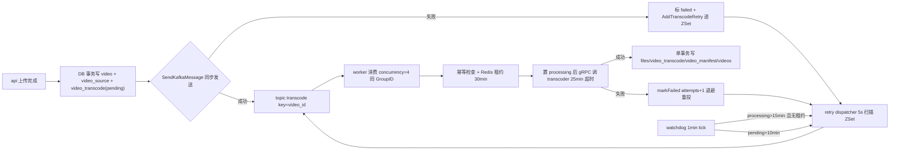
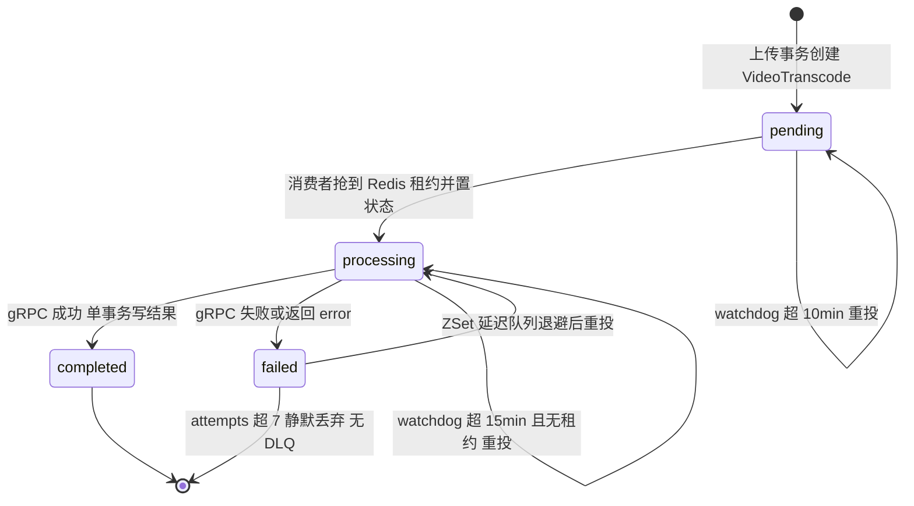
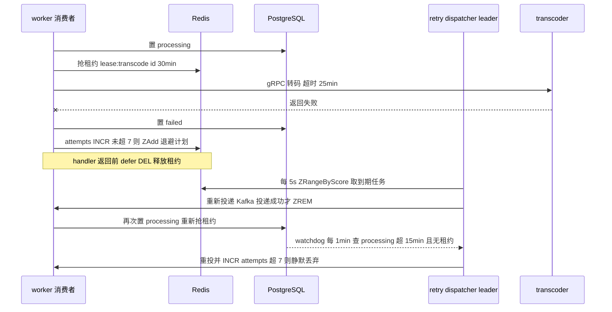

# 05 · Kafka 异步编排与任务可靠性

> 一句话定位：**用 Kafka 把「上传」和「转码」解耦成异步流水线，再叠加「DB 状态机 + Redis 租约 + ZSet 延迟重试 + Watchdog 兜底 + etcd 领导选举」四层防护，把 at-least-once 的重复投递收敛成"至少执行一次、结果只生效一次"的可靠任务系统。**
>
> 涉及代码（全部为真实实现，可当场打开）：
> - `internal/core/kafka.go` —— Writer / StartKafkaConsumer / CommitInterval=0 / EnsureTopic / WaitKafkaConsumers
> - `internal/core/message_queue/transcode/worker.go` —— 幂等三件套 + 事务写结果 + markFailed
> - `internal/core/message_queue/transcode/retry.go` —— Redis ZSet 延迟队列 + 指数退避+抖动
> - `internal/core/message_queue/transcode/watchdog.go` —— 超时兜底（processing 15 min / pending 10 min）
> - `internal/core/message_queue/video/delete_video_worker.go`、`danmaku/worker.go`、`comment/worker.go` —— 其余三个 topic 的消费者
> - `internal/role/worker.go`、`internal/core/leader/leader.go` —— worker 角色装配、etcd 领导选举、30 s 优雅排空
> - `internal/consts/Kafka.go`、`internal/api/v1/Video.go`、`conf/app.toml`、`docs/specs/distributed-architecture.md`

---

## 0. 先给面试官画这张图（一条链路的全貌）

一句话念出来：**"上传接口只做三件事——写 DB、发 Kafka、返回；转码全过程在 worker 里跑，失败走 Redis 延迟队列重试，卡死由 watchdog 捞回来，调度类任务用 etcd 选举保证全局只有一个实例在跑。"**

---

## 1. 为什么要 Kafka：为什么不用 goroutine / 不用 HTTP 直接调

### Q：转码任务为什么一定要走 Kafka？起个 goroutine 或者 HTTP 调用 transcoder 不行吗？

**🎤 口述（可直接背）**：可以，但会在四个点上崩。第一是**削峰**：上传是突发的，转码是重 CPU 的，一个转码任务要跑几分钟，直接在请求里做会把 API 的 goroutine 和 CPU 吃满；第二是**解耦**：API 不应该知道 FFmpeg 的存在，我只发一条 JSON，谁消费、什么时候消费、消费几次都跟它无关；第三是**持久化**：goroutine 和内存队列在进程重启时全丢，Kafka 的日志落盘 + 消费位点能保证服务重启后任务还在；第四是**水平扩展和多消费者组**：同一份消息，转码组、统计组可以各自用不同 GroupID 消费一遍。

**🔍 讲解/备注**：
- 代码依据：`internal/api/v1/Video.go:423` 是唯一的生产者入口，`core.SendKafkaMessage`（`internal/core/kafka.go:50`）把 CPU 密集的转码彻底推给 worker 角色。
- 关键差异是**进程边界**：`api` 角色和 `worker` 角色是同一个二进制按 `VISTACK_ROLE` 拆开的两个进程（`cmd/vistack/main.go`），Kafka 是它们之间唯一的异步边界，所以 API 可以无限扩容而不需要扩容 CPU。
- goroutine 方案的致命点不是性能而是**可靠性**：进程被 SIGKILL、Pod 被驱逐、节点宕机，内存里的任务就永久消失了，用户看到视频一直"转码中"。Kafka 方案下最坏情况是重复消费一次，而不是任务丢失。
- HTTP 直调方案的致命点是**背压和超时**：转码要几分钟，HTTP 长连接会被 LB/网关掐断，而且 AI 侧的 `transcodeCallTimeout = 25 * time.Minute`（`worker.go:20`）根本不适合放在同步请求里。

**⚠️ 追问预案**
- "为什么不用 RabbitMQ / NSQ？" → 团队已有的 Kafka 更熟；且我们要的是分区有序 + 可重放 + 消息堆积能力，Kafka 这三项最强；RabbitMQ 更适合低延迟路由。
- "Kafka 会不会成为新单点？" → 会，当前是单 broker KRaft，我自己在 `docs/specs/distributed-architecture.md` 里把它列成 P1，生产要做 3 broker + 副本因子 ≥ 2。
- "能不用 MQ 吗？" → 可以用 Postgres 当队列（SKIP LOCKED 轮询），但要做分区有序和堆积消费，Kafka 更省事。

---

## 2. Topic 设计：一个 topic 一件事，key 用 video_id

### Q：你有几个 topic？怎么分的？为什么 key 用 video_id？

**🎤 口述（可直接背）**：四个 topic，**一个 topic 只干一件事**：`transcode` 转码、`delete_file` 文件与分片清理、`danmaku` 弹幕落库、`comment_moderation` 评论图片审核（`internal/consts/Kafka.go:6-9`）。所有消息的 key 都是 `video_id`（`strconv.FormatInt(video.ID, 10)`），因为 Kafka 按 key 哈希分区，**同一个视频的消息一定落在同一个分区**，分区内严格有序，所以"删除通知"不会跑到"转码完成"前面，同一视频也不会被两个消费者同时处理。

**🔍 讲解/备注**：
- 代码依据：`internal/api/v1/Video.go:161`、`:423`（transcode，key = video_id）、`:493`（delete_file，key = video_id）、`retry.go:72`（重投时也带同样的 key，保持分区一致）。
- **按业务能力分 topic** 而不是按消息类型分：好处是每个 topic 的消费者独立扩缩、消费滞后和重试策略可以各配一套；坏处是 topic 数量会随功能膨胀（我自己的演进文档里提到要做 `JobHandler` 抽象：`Topic() + Handle()`，新增任务只注册 handler，见 `distributed-architecture.md` §3.3）。
- **有序性范围要说清楚**：Kafka 只保证**分区内**有序，不保证 topic 全局有序。我们只需要"同一视频内部有序"，所以 key 选 video_id 是最小代价的方案；如果 key 选 user_id，同一用户跨视频串行会无谓降低并发。
- 边界：`EnsureTopic`（`kafka.go:98`）只在 danmaku / comment_moderation 两个 topic 里被调用，而且固定 **1 分区 1 副本**（`kafka.go:108-112`）；`transcode` 和 `delete_file` 依赖 broker 的 `auto.create.topics.enable` 或人工建，这是个隐患（见第 12 节）。

**⚠️ 追问预案**
- "为什么每个 topic 只建 1 个分区？" → 开发环境图省事，同时保证"顺序消费"最简单；生产必须按吞吐调分区，文档里写的是 transcode 建议 8~16 分区。
- "改分区数会影响 key 顺序吗？" → 会！分区数变了以后 `hash(key) % partitions` 的结果整体改变，同一 key 在切换窗口内可能落到不同分区，所以扩分区要选低峰并接受短时乱序。
- "消息体里为什么不带 partition 信息？" → 不需要，key 由生产者指定，Kafka 自己算。

---

## 3. 消费组与并发：Concurrency=4 到底并发几路

### Q：`StartKafkaConsumer` 起多个 reader、又是同一个 GroupID，这算什么模型？实际并发是多少？

**🎤 口述（可直接背）**：我在 `StartKafkaConsumer`（`kafka.go:123`）里按 `Kafka.Concurrency`（配置 4）起 **4 个 goroutine**，每个都是一个独立的 `kafka.Reader`，**共用同一个 GroupID**。Kafka 的规则是"一个分区在同一个消费组里只能被一个 reader 持有"，所以：**同一分区仍然串行，并发上限 = min(concurrency, 分区数)**；按当前 topic 建 1 个分区算，实际并发就是 1，另外 3 个 reader 是空转的。这也是我文档里 P0 的吞吐瓶颈，解法是**加分区**（同时保持 key=video_id 的有序性）。

**🔍 讲解/备注**：
- 代码依据：`kafka.go:131-139`（循环起 goroutine）、`kafka.go:146-153`（每个 reader 都是 `GroupID: KafkaConfig.Kafka.GroupID`）、`kafka.go:119-121` 的注释就是这句话的原话。
- **要主动说出的强结论**：因为每个 topic 只有 1 个分区，**整个集群里同一 topic 同时只有一个消费者在干活**——不是"每个 worker 副本一路"，而是"全集群一路"。横向扩 worker 副本数**不会**提升转码吞吐，只会提升可用性（一个副本挂了另一个接手）。真正的解法是把 `transcode` 扩到 8~16 分区。
- 多 topic × 多 reader：4 个 topic × 4 个 reader = 16 个 goroutine，但每个 topic 只有 1 个分区有意义，其余是"抢不到分区所以空转"的 reader，`ReadMessage` 会阻塞等待再平衡。这部分开销小但确实是浪费。
- 进阶方案（我在演进文档 §3.3 写的）：**fetch 一批 → 按 key 哈希分发到有界 worker pool → 全部处理完再统一提交 offset**，把并发度从"分区数"解绑。代价是要自己维护 offset 提交和错误聚合，如果未来做，我会先扩分区、不够再上 worker pool。

**⚠️ 追问预案**
- "consumer 数超过分区数会怎样？" → 多出来的 reader 拿不到分区，空转（rebalance 后闲置），不会报错。
- "怎么提高并发？" → 短期加分区 + key 保持 video_id；长期做 worker pool 消费。
- "同一视频并发转码会不会冲突？" → 不会，key 相同必落同分区，同分区串行；另外还有 Redis 租约二次兜底。

---

## 4. CommitInterval=0：手动提交与 at-least-once

### Q：`CommitInterval: 0` 是什么意思？为什么关掉自动提交？

**🎤 口述（可直接背）**：`CommitInterval: 0` 表示**关掉 kafka-go 的周期自动提交**（`kafka.go:152`），改成手动：handler 返回 nil 我才调 `CommitMessages`（`kafka.go:201`）；**handler 返回 error 就不提交，只打日志**（`kafka.go:192-199`）。这样语义是 **at-least-once**：消息可能在失败后被重复消费，但不会"没处理就被标成已处理"。代价是必须自己做幂等。

**🔍 讲解/备注**：
- 代码依据：`kafka.go:192-210` 是核心 12 行——`if err := handler(...); err != nil { 只记日志 } else { r.CommitMessages(ctx, m) }`。
- **at-least-once vs at-most-once vs exactly-once**：自动提交是 at-most-once 风险（提交了但处理失败=丢），我们的手动提交是 at-least-once（处理失败=重放）。Kafka 的 exactly-once 需要事务 + 幂等生产者 + 只读已提交事务，涉及下游 DB 时做不到端到端 exactly-once，所以工业界的正解就是 **at-least-once + 消费端幂等**，这也是我文档里"幂等三件套"的由来。
- **不提交 offset 的隐藏行为**：进程活着时 reader 会继续读下一条，未提交的 offset 只在**再均衡或重启**后才会被重放。所以"返回 error 不提交"实际上把重放时机交给了 rebalance/重启——如果这个 worker 一直不重启，那条消息就永远不会被重试。这是"Kafka 层不做业务重试"的取舍，业务重试我交给了 ZSet 延迟队列。
- 边界/缺陷：JSON 反序列化失败这种**毒丸消息**会永远返回 error、永远不提交，每次 rebalance 或重启都被重放一次，没有 DLQ 就只能靠日志。这是我承认的 P0 缺口。

**⚠️ 追问预案**
- "为什么 handler 返回 error 只记日志不重试？" → 因为业务重试要走"退避 + 上限 + 可观测"的延迟队列，Kafka 层立即重试会造成热循环；markFailed 里刻意 `return nil` 也是这个原因（`worker.go:91` 注释写了）。
- "会不会丢消息？" → at-least-once 不丢，会重复；重复由幂等三件套挡掉。
- "offset 提交失败呢？" → 只记日志（`kafka.go:203`），下一轮 rebalance 会重放，仍然是 at-least-once。

---

## 5. 转码任务的完整状态机

### Q：一个转码任务从生到死，状态怎么流转？

**🎤 口述（可直接背）**：四个状态：`pending → processing → completed / failed`，`failed` 不是终点，它会被重试队列拉回 `processing`（`internal/model/entity/video/transcode.go:14-17`）。`pending` 由上传接口在事务里创建；消费到消息时先把状态检查一遍（已完成直接返回），然后抢 Redis 租约、置 `processing`、发起 25 分钟超时的 gRPC 转码；成功就在**一个事务**里写 `files` / `video_transcodes` / `video_manifest` / `videos` 四张表；失败就置 `failed` + 进重试队列，attempts 超过 7 就放弃。

**🔍 讲解/备注**：
- 代码依据：状态常量在 `internal/model/entity/video/transcode.go:14-17`；`pending` 创建于 `internal/api/v1/Video.go:139-147`（秒传路径）与 `:397-406`（普通路径）；`processing` 在 `worker.go:64`；`completed` 在 `worker.go:130-136`；`failed` 在 `worker.go:94`。
- **状态机是"最后一道幂等闸门"**：`worker.go:50-55` 先 `First(&tc, msg.TranscodeID)`，`Status == completed` 直接 `return nil`，所以重复投递对已完成的视频是零成本的。
- 注意 `completed` 的写入是**事务内**的（`worker.go:108-188`），而 `processing` 是事务外的单条 Update（`worker.go:64`）——这是刻意的：`processing` 只是个"我占住了"的标记，不需要和业务数据同生共死。
- 边界：状态机**没有 `cancelled` 状态**，视频被删除后转码任务仍在跑；也没有 `pending → failed`（投递失败的兜底是在 API 侧直接写 `failed`，`Video.go:426`）。

**⚠️ 追问预案**
- "processing 的语义是'正在跑'还是'有人认领'？" → 是"有人认领"，真正的存活信号是 Redis 租约，DB 状态只用于粗筛。
- "为什么不做 canceled？" → 当前删除走"软删 + delete worker"，没做转码中断，是缺口。
- "completed 之后重复消费会重复写 files 吗？" → 不会，状态检查在租约之前就挡住了。

---

## 6. 幂等三件套：为什么一层不够

### Q：Kafka 至少一次，你怎么保证不重复转码？

**🎤 口述（可直接背）**：三层，缺一不可。**第一层 DB 状态检查**（`worker.go:50-55`）：已 `completed` 直接返回；**第二层 Redis 租约**（`worker.go:57-62`）：`SetNX lease:transcode:{id} 30min` 抢不到就返回，抢到才继续，handler 结束时 `defer Del` 释放；**第三层事务写结果**（`worker.go:106-192`）：四张表的写入放在一个事务里，要么全成要么全滚。三层分别防的是"重复消费"、"并发重复消费"、"写一半崩了留下脏数据"。

**🔍 讲解/备注**：
- 每层的必要性：只有 DB 状态检查挡不住"两个消费者同时读到 pending"的竞态（都检查通过、都去转码）；只有租约挡不住"上一次已经成功但 offset 没提交"的重复（会被再次执行，只是不会并发执行）；只有事务挡不住重复执行导致的重复 File/Manifest 行。
- 代码依据：`SetNX` 的返回值 `ok` 决定是否继续（`worker.go:58-61`），`defer core.Redis.Del(ctx, leaseKey)`（`worker.go:62`）保证正常路径立刻释放、不占满 30 分钟。
- **租约挡不住"非并发"的重复**：这是要主动承认的——如果任务 A 执行成功但 `persistTranscodeResult` 里 `tx.Commit()` 之前进程挂了，重投后状态还是 `processing`、租约也已释放，于是**会重新转码一次**。靠事务保证了 DB 不脏，但会白跑一次 FFmpeg。真要收敛得加"转码结果按 transcode_id 唯一索引 + 幂等 upsert"。
- 边界：`First(&tc, msg.TranscodeID)` 查询出错（记录不存在）时不会 return，代码会继续往下走；`worker.go:64` 的 Update 影响 0 行也不报错，于是会"无主任务也去转码"。属于健壮性瑕疵。

**⚠️ 追问预案**
- "租约为什么要 30 分钟？" → 见下一题，和 gRPC 25 分钟超时配套。
- "租约是锁吗？和分布式锁区别？" → 语义上是带 TTL 的互斥锁，但没有"释放校验 token"，因为它是按 transcode_id 天然唯一的 key，不存在误删别人锁的问题。
- "为什么不用数据库唯一索引做幂等？" → 可以做（我提到该补），但跨四张表 + FFmpeg 副作用（已生成的切片文件）没法靠唯一索引回滚。

---

## 7. 三个时间阈值：15 / 25 / 30 分钟的关系与冲突

### Q：租约 30 分钟、gRPC 超时 25 分钟、Watchdog 阈值 15 分钟，为什么这么设计？15 分钟的 watchdog 会不会误判正在转码的任务？

**🎤 口述（可直接背）**：这三个数字是一套**嵌套的超时预算**：gRPC 25 分钟 < 租约 30 分钟，保证"handler 一定在租约到期之前拿到结果或超时"，所以租约到期只可能是**进程死了**，绝不会因为"转码太慢"而误释放；watchdog 的 15 分钟只是 DB 侧的**粗筛**，它**必须同时满足"状态是 processing 且 updated_at 超 15 分钟"和"Redis 里没有租约"**两个条件才会重投（`watchdog.go:32-34`），所以在跑的任务有租约、会被跳过，**不会误判**。

**🔍 讲解/备注**：
- 代码依据：`transcodeCallTimeout = 25 * time.Minute`（`worker.go:20`）；`SetNX(... 30*time.Minute)`（`worker.go:58`）；watchdog `threshold := time.Now().Add(-15 * time.Minute)` + `core.Redis.Get(ctx, leaseKey)` 命中就 `continue`（`watchdog.go:23`、`:32-34`）。
- 用一张表把关系和失效模式讲死：

| 阈值 | 值 | 代码位置 | 作用 | 谁触发 | 失效后果 |
|------|----|---------|------|--------|---------|
| gRPC 调用超时 | 25 min | `worker.go:20` | 单次转码硬上限 | `context.WithTimeout` | 超时→markFailed→重试 |
| Redis 租约 TTL | 30 min | `worker.go:58` | 防并发重复处理 | SetNX | 过期→可能被重投 |
| watchdog processing 粗筛 | 15 min | `watchdog.go:23` | 找"卡住"的任务 | 每分钟 tick | 误判→重复转码 |
| watchdog pending 兜底 | 10 min | `watchdog.go:54` | 找"消息丢了"的任务 | 每分钟 tick | 重复投递（幂等挡） |
| etcd leader 租约 | 10 s | `leader.go:15` | 单例调度器选主 | concurrency session | 无主窗口≈10 s |
| worker 排空上限 | 30 s | `role/worker.go:25` | 优雅停机 | WaitKafkaConsumers | 超时强退 exit(1) |

- **为什么 watchdog 阈值 15 < gRPC 25 也安全**：因为判活信号不是 DB 时间而是 Redis 租约。lease 存在 = 有活着的 handler 占着它（`defer Del` 只在 handler 返回时执行），所以 15 分钟的"陈旧"只是个必要条件，不是充分条件。我一般这么讲："**DB 时间是粗筛，Redis 租约是判活，两者与（AND）才重投。**"
- **两个真实缺陷（主动说，加分）**：
  1. watchdog 判租约用的是 `_, err := core.Redis.Get(...).Result(); err == nil → continue`。这句把 **Redis 连接错误也当成"没有租约"**（只有 `err == nil` 才跳过），所以 Redis 抖动/重启（key 丢失）时，watchdog 会对**正在转码的任务**重投，配合租约一起丢失 → 可能并发跑两次转码。正确写法是区分 `redis.Nil` 和连接错误，连接错误应当"保守跳过本轮"。
  2. watchdog 的 processing 分支**只 INCR attempts、不 touch updated_at**（对比 pending 分支在 `watchdog.go:66` 才有的"触碰 updated_at 避免下个周期重复投递"）。所以只要重投后消息一直消费不掉（例如 worker 全挂），**每分钟都会 INCR 一次**，7 分钟就把重试预算烧完、任务被静默丢弃；而且 attempts key 是 `attempts:transcode:{id}`，由 `markFailed`（`worker.go:96-98`）和 watchdog（`watchdog.go:43-45`）**共享**，两边会互相消耗预算。

**⚠️ 追问预案**
- "为什么不把三个值设成一样？" → 一样就没有余量了：如果租约 = gRPC 超时，网络抖动导致 handler 晚退出 1 秒，租约已释放、watchdog 立刻重投，直接并发重复。
- "gRPC 太慢能不能超过 25 分钟？" → 长视频 + 240p~4K 七档有可能，那就要把 25/30 一起往上调，或者把转码拆成"按档位分任务"。
- "怎么监控这三个阈值？" → 缺 metrics，我只在演进文档里列了 Prometheus + Kafka lag + 转码时长/成功率，是 P1。

---

## 8. 重试为什么用 Redis ZSet，而不是 Kafka 重试 topic

### Q：Kafka 本身就能重试，为什么要自己拿 Redis ZSet 造一个延迟队列？

**🎤 口述（可直接背）**：因为我要的是**延迟 + 可查 + 可改**的重试。Kafka 做延迟重试要么 sleep 阻塞分区（把有序的整条分区堵住），要么建一堆 `retry-1min / retry-5min` 分级 topic 再写转发逻辑，很笨重；Redis ZSet 用 score 存"下次可执行的时间戳"，`ZRangeByScore` 直接捞出到期任务，天然就是延迟队列，而且延迟时间、重试次数、剩余量都能直接看到、能手动改。**代价是引入 Redis 依赖**，Redis 丢数据 = 重试计划丢失。

**🔍 讲解/备注**：
- 代码依据：key `transcode:retry:zset`（`retry.go:17`）；入队 `ZAdd score=now+delay`（`retry.go:41`）；dispatcher 5 秒 tick 一次、每次取最多 100 条到期任务（`retry.go:47`、`:55-60`）。
- **投递成功才删除**（`retry.go:72-76`）：`SendKafkaMessage` 失败就 `continue`，成员留在 ZSet 下个周期再来——这是"至少一次投递"的实现，也是为什么消费端必须幂等。JSON 解析失败的成员会立刻 `ZRem` 丢弃（`retry.go:66-69`），避免毒丸卡住队列。
- **对比表**：

| 维度 | Redis ZSet 延迟队列（现方案） | Kafka 重试 topic | 进程内 sleep 重试 |
|------|------------------|------------------|------------------|
| 延迟精度 | 秒级（5 s 扫描） | 秒级但要维护多级 topic | 精确但阻塞 |
| 是否阻塞正常消费 | 不阻塞 | 不阻塞 | **阻塞整个分区** |
| 运维/实现成本 | 低（一个 key + 一个循环） | 高（多 topic + 转发消费者 + 计数） | 低 |
| 持久性 | Redis 单点，重启可能丢 | Kafka 副本，最可靠 | 进程死即丢 |
| 可观测/可干预 | 直接 ZRANGE 看、能手动改 | 差 | 无 |
| 结论 | 现阶段最优，改 DLQ 时仍可复用 | 生产级方案，需配 DLQ | 不可用 |

- 边界：dispatcher 是**全局单例**（下一节），这里如果没做领导选举，多 worker 会重复投递同一批任务——这正是我文档 §2.1① 里 P0 的第一条，现在已用 etcd 选举解决。
- 另一个细节：ZSet 成员是完整 JSON（含 `attempt`），所以**同一任务的不同 attempt 是不同成员**，不会被去重成一条，可能出现"多个待执行副本"。

**⚠️ 追问预案**
- "为什么 5 秒扫一次、一次 100 条？" → 5 秒 = 延迟精度与 Redis QPS 的折中；100 条防止单轮阻塞 ticker，扫不完下轮继续。
- "能不能用 Redis 的 keyspace notification？" → 不可靠（通知是 fire-and-forget，客户端断连就丢），不用于关键任务。
- "Redis 挂了重试全丢怎么办？" → 承认：靠 watchdog 从 DB 状态重建（processing 超时 / pending 超时），这是我们的第二道保险；生产应该开 AOF + Sentinel。

---

## 9. 指数退避 + 抖动 + 7 次上限

### Q：退避算法怎么写的？为什么要加抖动？为什么是 7 次？

**🎤 口述（可直接背）**：延迟是 `1 << (attempt-1)` 分钟，也就是 1、2、4、8、16、32…分钟，**上限截断到 8 小时**，再叠加**最多 20% 的随机抖动**（`retry.go:23-34`）。加抖动是因为如果一批任务同时失败、退避时间完全一样，它们会在同一个时刻集体重投，形成"重试风暴"（惊群）；随机化把重投时刻打散。7 次上限是经验值：1+2+4+8+16+32+64 分钟 ≈ 2 小时出头，已经覆盖绝大多数瞬时故障（转码进程重启、MinIO 抖动），再往后基本是数据/编码本身有问题，重试无意义。

**🔍 讲解/备注**：
- 代码依据：`d := time.Duration(1<<uint(attempt-1)) * base`、`if d > 8*time.Hour { d = 8*time.Hour }`、`j := time.Duration(rand.Int63n(int64(d / 5)))`（5 分之 1 = 20% 抖动）。注意这里是**等长抖动**（`rand[0, d/5)`）而不是 `rand[-d/5, +d/5]`，方向只会变大，属于简化实现。
- `markFailed` 里的计数器：`INCR attempts:transcode:{id}`，`Expire 24h`，`cnt <= 7` 才入重试队列（`worker.go:96-101`）；成功后 `persistTranscodeResult` 会 `Del` 掉这个 key（`worker.go:190`），避免长期占内存。
- **7 次超限"静默丢弃"是明确的缺陷**（`watchdog.go:46-48` 与 `worker.go:99`）：没有死信 topic、没有告警、没有工单，任务永远停在 `failed`，用户只看到"转码失败"。
  - 正确做法（我文档 §5 P0-2 写了）：超限消息投到 `transcode-dlq` topic + 指标打点 + 告警，提供"人工重放"接口（把 DLQ 消息重新投回 `transcode` 并把 attempts 清零）。
- 抖动还有一个作用：**避免 ZSet 成员 score 完全一致**，让 `ZRangeByScore` 每次返回的批次更均匀。

**⚠️ 追问预案**
- "8 小时上限怎么来的？" → 保证一天内至少还能试 3 次，同时不让策略退化成"永不停歇"；配合 7 次上限，总时长大约 2 小时 + 尾部封顶。
- "attempt 从哪来？" → 消息体里的 `attempt` 字段（`worker.go:26`），由 markFailed/watchdog 传进去，是显式的重试代数。
- "幂等重试会不会把成功任务重跑？" → 不会，重试前一样过 DB 状态检查 + 租约。

---

## 10. Watchdog：兜底那些"没人管"的任务

### Q：如果消息根本没进 Kafka、或者消费者根本没收到，重试队列也救不了吧？

**🎤 口述（可直接背）**：对，所以我有 watchdog：**每分钟扫一次 DB**，做两件事。一是找 `status = processing` 且 `updated_at` 超过 15 分钟、并且 Redis 里**没有租约**的任务，重新投进重试队列（`watchdog.go:23-50`）；二是找 `status = pending` 且超 10 分钟的任务——这对应"Kafka 消息丢了/生产失败"，重新投一遍，并且**先触碰 updated_at 防止下个周期重复投递**（`watchdog.go:53-68`）。它的本质是**用 DB 的事实状态重建消息**，弥补 MQ 投递和 Redis 队列的不可靠。

**🔍 讲解/备注**：
- 代码依据：`time.NewTicker(1 * time.Minute)`（`watchdog.go:15`）；processing 分支还要回查 `video_sources` + `files` 才能拿到 `object_key`（`watchdog.go:35-42`），所以它其实是个"DB 反查补消息"的循环。
- **它和重试队列的分工**：重试队列负责"已知失败"的退避重试；watchdog 负责"未知状态"（消息丢了、进程崩了、状态卡住）的捞回。两条路径最终都汇入同一个 ZSet 延迟队列，复用同一套退避和上限。
- 边界（前面提过，可再强调一次）：
  - processing 分支**不 touch updated_at**，会每个周期重复 INCR attempts；
  - 它把"Redis 连接错误"当成"无租约"，Redis 抖动时会误重投；
  - 捞回后**不改状态**，所以任务会一直显示 `processing`，用户侧无法感知；理想做法是重投时置回 `pending` 并记录一次 watchdog 干预计数。
- 索引：代码里留了注释 `CREATE INDEX idx_transcode_status_update_at ON video_transcodes (status, updated_at, video_id)`（`watchdog.go:28`），否则每分钟两次全表扫会是慢查询——面试官如果问"这个循环会不会拖垮 DB"，就答"靠这个复合索引把扫描收敛到走索引区间"。

**⚠️ 追问预案**
- "watchdog 自己挂了怎么办？" → 它跑在 leader 上，leader 挂了 etcd 租约过期后另一个 worker 接任，无主窗口 ≈ TTL 10 秒（`leader.go:15`）。
- "能不能不用 watchdog，改成定时对账任务？" → 本质上它就是轻量对账；规模更大时应该抽成独立 scheduler 服务（我文档里的拆分候选②）。
- "会不会重复投递？" → pending 分支刻意 touch updated_at 防重复；processing 分支靠租约防；即使重复，消费端三件套兜底。

---

## 11. 故障场景矩阵（面试官最爱考的"如果……会怎样"）

### Q：worker 崩了 / transcoder 崩了 / Redis 挂 / Kafka 挂 / DB 挂，分别会怎样？

**🎤 口述（可直接背）**：我按"影响面 + 自愈路径"逐一过一遍：**worker 崩**——在途消息未提交 offset，重启或 rebalance 后重放，租约 TTL 到期后 watchdog 也能捞；**transcoder 崩**——gRPC 报错，走 markFailed 退避重试，etcd 里注册的实例消失后 round_robin 自动避开它；**Redis 挂**——最严重，租约、重试队列、限流、计数全在 Redis 上，租约会失效导致重复转码、重试计划丢失，只能靠 watchdog；**Kafka 挂**——API 投递失败会走"标 failed + 进重试队列"的兜底并且给用户返回错误；**DB 挂**——`worker.go:64` 的 Update 失败会返回 error、offset 不提交，等 DB 恢复后重放，是最安全的失败方式。

**🔍 讲解/备注**：
- 逐场景对照表（这张表建议直接背下来，面试官会顺着追问）：

| 故障 | 直接后果 | 自愈/兜底路径 | 代码依据 | 残余风险 |
|------|---------|--------------|---------|---------|
| worker 进程崩 | 在途消息 offset 未提交 | rebalance/重启重放；租约到期后 watchdog 捞回 | `kafka.go:201`、`watchdog.go:23-50` | Redis 也崩时租约不清，watchdog 被跳过，任务卡 `processing` |
| transcoder 崩 | gRPC error → markFailed | 指数退避重试；etcd 实例摘除后流量转移 | `worker.go:83-86`、`retry.go:23-34` | 7 次后静默丢弃（无 DLQ） |
| Redis 挂 | 租约/重试队列/限流/计数全失效 | watchdog 从 DB 状态重建；限流 fail-open；计数读回退 DB 列 | `watchdog.go`、`ratelimit.go:65-71`、`social.go:134` | 重试计划丢失、可能重复转码、计数短暂不可用 |
| Kafka 挂 | API 投递失败 | 标 `failed` + 进 ZSet 重试，API 返回 500 让用户重试 | `Video.go:161-172`、`:423-435` | 若 Redis 也挂，任务真丢，只剩 watchdog 的 pending 兜底 |
| DB 挂 | 状态读写失败 | handler 返回 error → 不提交 offset → 恢复后重放 | `worker.go:64`、`kafka.go:192-199` | DB 长时间不可用 → 消费停滞、消息堆积 |
| etcd 挂 | 领导选举会话中断 | leader 停止单例任务，其他副本接任；不可用时降级本地直跑 | `leader.go:66-87`、`role/worker.go:86-100` | 降级模式下多副本会重复投递（代码里有 warn 日志） |
| MinIO 挂 | 转码产物写不进去 | transcoder 报错 → markFailed → 重试 | `worker.go:83-92` | 与 Kafka 无关，重试可自愈 |

- **etcd 挂的降级行为要点**：`runSingletonJobs`（`role/worker.go:79-122`）在没有配置 etcd 或连接失败时**直接本地启动** dispatcher + watchdog，并打 warn 日志 `"multi-replica unsafe"`。这是"可用性优先"的取舍：宁可多副本重复投递（幂等能兜），也不要单例任务整体停摆。
- **Redis 是当前架构最脆的一环**：它同时承担缓存、限流、租约、重试队列、计数、榜单六个职责，而且都是单实例。我在演进文档 §2.2 里把它列成 P1，方案是 Sentinel 或 Cluster。

**⚠️ 追问预案**
- "最怕哪个组件挂？" → Redis，因为它是"可靠性外挂"的载体而不是普通缓存；其次是 Kafka，因为投递失败后只剩重试队列和 watchdog 两条路。
- "怎么验证这些兜底真的有效？" → 我们写过 miniredis 的单测覆盖计数与事件、watchdog 与 retry 主要靠集成测试 + 手工 kill 进程验证；老实说端到端的故障注入还没做，这是要补的。
- "Kafka 挂了为什么不直接同步转码？" → 那等于把重 CPU 任务放回 API 进程，回到第一个问题的答案。

---

## 12. 单例任务：为什么必须用 etcd 领导选举

### Q：dispatcher 和 watchdog 每个 worker 副本都跑会怎样？领导选举怎么做的？

**🎤 口述（可直接背）**：会重复投递。两个 dispatcher 同时扫同一个 ZSet，同一批任务会被投两次；两个 watchdog 同时扫 DB，会重复打 updated_at、重复入队——Redis 租约只防了"转码任务本身"的重复执行，**防不了调度器的重复**，这就是我文档里 P0 的第一条。现在用 etcd 领导选举把这两个循环包起来：只有 leader 跑（`role/worker.go:57`、`:112-117`），租约 TTL 10 秒，leader 挂了其他副本自动接任，无主窗口约等于 TTL。

**🔍 讲解/备注**：
- 代码依据：`leader.Elector.Run`（`leader.go:43-88`）——`concurrency.NewSession(TTL)` + `NewElection(key).Campaign(id)`，选上后把 `leadCtx` 交给回调；`sess.Done()` 触发 `cancel()`，所以**失去领导权时单例任务会被自动取消**（`leader.go:66-75`），这是最容易写错的地方。
- key 是 `/vistack/leaders/worker-singleton`（`leader.go:12`），实例 ID 优先取 `POD_IP`、回退 hostname（`role/worker.go:125-133`）。
- **选举失败后的重试**：Campaign 失败会关 session 后 `continue`（`leader.go:58-64`），竞争失败的副本就阻塞在 Campaign 上等待，不会空转打爆 etcd。
- 边界/缺陷：
  - **无主窗口 ≈ 10 秒 TTL**：这 10 秒里没有 dispatcher 扫队列，重试延迟会多 10 秒，可接受。
  - 如果 leader 进程没死但 **etcd 网络分区**，session 过期 → 任务被取消 → 它会重新竞选；此时可能出现新旧 leader 短暂并存 → 重复投递（幂等兜底）。
  - 单例任务和消费者在同一进程里，如果 leader 被驱逐，消费者不受影响（消费者本来就是多副本共享组）。

**⚠️ 追问预案**
- "为什么不用 Redis 分布式锁做单例？" → 可以做（`SetNX + TTL` + 续约），但 etcd 的 session 语义、watch、租约自动过期更贴合选主，而且我们本来就为服务发现部署了 etcd。
- "选举会不会脑裂？" → etcd 的 Election 基于租约 + revision 比较，`Campaign` 返回后即持有最小 revision，理论上不会有两个 leader（除非 TTL 内旧 leader 的 session 尚未被探活到，即上面说的短暂并存）。
- "怎么测多副本安全？" → `--scale worker=3` 跑起来看日志只有一份 "became leader, starting singleton jobs"（这是我文档里的验收标准）。

---

## 13. 优雅停机：滚动发布不丢在途任务

### Q：你提到 worker 有优雅停机，具体怎么做的？

**🎤 口述（可直接背）**：`signal.NotifyContext` 监听 SIGINT/SIGTERM（`role/worker.go:48`），收到信号后 ctx 取消：**消费者循环里 `ReadMessage` 返回 error 且 ctx 已取消就直接退出**（`kafka.go:172-175`），已经进入 handler 的消息会继续跑完；然后主流程用 `WaitKafkaConsumers(30s)` 等所有消费者 goroutine 结束（`role/worker.go:66`），30 秒内排空就干净退出，超时就打 warn 日志并 `os.Exit(1)` 强退。

**🔍 讲解/备注**：
- 代码依据：`consumerWG` 在 `StartKafkaConsumer` 里 `Add(1)`、在 `runConsumer` 里 `defer Done()`（`kafka.go:137`、`:144`），`WaitKafkaConsumers` 用 channel + select 做带超时的等待（`kafka.go:216-228`）。
- 为什么是 30 秒：K8s 的 `terminationGracePeriodSeconds` 默认 30 秒，排空窗口不能超过它，否则 SIGKILL 会硬杀。**这也意味着转码任务（几分钟）不可能在 30 秒内跑完**——这是设计上的取舍：graceful 只保证"消息不会被腰斩在半路"，剩余任务由重放 + 幂等兜底。如果要真正跑完，要么把 grace period 调到 > gRPC 超时（25 分钟，不现实），要么把转码做成"可中断 + 断点续跑"。
- 对照我文档 §2.1④ 的原始问题：以前 worker 结尾是 `select {}`，不监听信号，滚动发布会直接 SIGTERM 杀死 → rebalance → 重复/延迟；现在已修好。**这段"发现缺陷→列出方案→落地修复"的叙事本身就是很好的面试素材。**
- API 侧同样是 `http.Server` + `Shutdown`（`role/api.go` 里 `apiShutdownTimeout = 30 * time.Second`）。

**⚠️ 追问预案**
- "排空超时为什么 exit(1) 而不是 exit(0)？" → 用非零码让编排系统知道"这次不是干净退出"，方便告警；副作用是可能触发重启风暴，更温和的做法是只上报事件。
- "停机时正在跑的转码怎么办？" → gRPC 的 ctx 会随外层取消而取消，转码容器侧要么中断要么跑完；消息未提交 offset，但 `processing` 状态 + 租约会阻止立即重投，等租约过期（最长 30 分钟）watchdog 再捞。
- "消费者退出前要不要手动 commit？" → 不需要，已完成的 handler 都已 `CommitMessages`；未完成的本来就不该提交。

---

## 14. Outbox 与消息版本：DB 事务和消息投递的原子性

### Q：DB 事务提交成功、但 Kafka 发送失败，这个不一致怎么办？消息格式怎么演进？

**🎤 口述（可直接背）**：现在是"**先事务、后发送，发送失败用手工补偿**"：`Video.go:408` 提交事务，`:423` 发 Kafka，失败就把 `VideoTranscode` 标成 `failed` 并塞进重试队列，同时给用户返回"投递失败，请重试"（`:426-434`）。这能跑，但严格来说不是原子操作——如果进程在 `tx.Commit()` 之后、发送之前崩溃，就留下了"DB 有 pending 任务但没人消费"的孤儿，只能靠 watchdog 10 分钟兜底。真正的解法是 **Outbox 模式**：在同一个事务里往 `outbox` 表插一条待发消息，另一个进程/goroutine 扫表发送成功再标记已发，保证"DB 变更与消息投递"同生共死。消息格式方面，Kafka 里是裸 JSON、**没有版本字段**，跨版本发布时新老消费者解析会失败，我在文档里写了解法：加 `"v": 1` + 兼容解析，量大以后上 Schema Registry。

**🔍 讲解/备注**：
- 代码依据：发送失败兜底在 `Video.go:161-172`（秒传路径）和 `:423-435`（普通路径），两处逻辑一模一样；`docs/specs/distributed-architecture.md` §2.5 明确列了"无 Outbox / 无 DLQ / 消息契约无版本 / snowflake node_id 碰撞"四条 P4 缺口。
- **Outbox 的代价**：多一张表、一个投递循环、一次清理（已发消息保留 N 天后归档）；换来的是"不会出现 DB 与 MQ 不一致"的硬保证。对我们最痛的是秒传路径：`ref_count +1` 已提交但消息没发出去，用户看到视频卡在转码。
- 消息版本化的具体风险：`transcode.TranscodeMessage` 现在有 4 个字段（`video_id / transcode_id / object_key / attempt`）。如果我把 `object_key` 重命名或改成数组，**滚动发布期间**老 worker 和新 API 会同时在线，老 worker 反序列化后字段为空 → 转码失败。加版本号 + 反序列化兼容（缺字段取默认）就能平滑。
- 另一个相关的诚实点：snowflake 的 `node_id` 是 `FNV32(POD_IP) % 1024` 派生的（`internal/core/snowflake.go:39-41`），**理论上会碰撞**，碰撞时两个实例可能生成重复 ID → 事件主键冲突（靠 `OnConflict DoNothing` 兜住）。文档里的解法是用 etcd CAS 分配 node_id。

**⚠️ 追问预案**
- "秒传路径的 ref_count 会不会因为补偿逻辑重复加？" → API 侧的补偿只改状态和入队，不动 ref_count，所以不会；真正要小心的是用户重试上传导致重复 ref_count +1，那是上传链路的话题（见 `02`）。
- "Outbox 用 DB 还是 Redis 实现？" → 必须在同一个 DB 事务里，所以是 DB 表；Redis 做不到和 PG 事务原子。
- "为什么不干脆只用 Kafka 事务？" → Kafka 事务只管 Kafka 内部，无法把 PG 的写入拉进来。

---

## 15. 已知不足清单（作者自述，背下来主动抛）

### Q：这套异步编排还有什么问题？

**🎤 口述（可直接背）**：我自己列了五条：**没有 DLQ**，重试 7 次后静默丢弃；**没有 Outbox**，DB 事务与消息投递不是原子的；**消息没有版本号**，跨版本发布会解析失败；**Kafka 单 broker、topic 只有 1 分区**，是单点也是吞吐瓶颈；**snowflake 的 node_id 靠哈希派生**，理论上会碰撞。这些我都写进了 `docs/specs/distributed-architecture.md`，并按 P0/P1 排了优先级。

**🔍 讲解/备注**：
- 文档 §2.1（P0 正确性）里列的 5 条：单例无领导选举、AutoMigrate 多副本竞争、Kafka 消费并发=1、worker 无优雅停机、API 无优雅停机——**注意其中 ①③④⑤ 在当前代码里已经修完**（领导选举 `role/worker.go`、并发消费者 `kafka.go:136`、优雅停机两处都有）。面试时这么讲最有说服力："我在文档里列了 P0 清单，然后把其中四条落地了，还剩 AutoMigrate 拆独立任务和分区扩容。"
- 文档 §2.2（P1 高可用）：PG / Redis / Kafka / MinIO / etcd **五个中间件全是单实例**。
- 文档 §2.3（P2 可观测）：**没有 Prometheus metrics、没有 OpenTelemetry**，Kafka lag、队列深度、转码成功率全都没有指标；`/health` 恒返回 200 且不区分 readiness/liveness。
- 另外自己补充两条代码级瑕疵（前面各节提过，这里集中列）：
  1. watchdog 把 Redis 连接错误当"无租约"，且 processing 分支不 touch updated_at；
  2. `transcode` / `delete_file` 两个 topic 没有 `EnsureTopic` 调用（只有 danmaku/comment 有），依赖 broker 自动建 topic，生产上 `auto.create.topics.enable=false` 时首次投递会直接失败。

**⚠️ 追问预案**
- "如果给你两周，你先做什么？" → 第一周：DLQ + 告警 + `transcode` 扩到 8 分区（正确性和吞吐都是最痛）；第二周：Prometheus 指标 + readiness/liveness，把"看不见"的问题先变成"看得见"。
- "为什么不做 Outbox 优先？" → 因为我们已经用"补偿 + watchdog"把不一致窗口压到 10 分钟内，而 DLQ 缺失是**信息丢失**（连补救的机会都没有），优先级更高。

---

## 16. 其余三个 topic 的消费者（顺带一问的考点）

### Q：除了转码，其他 topic 的消费者也是这套逻辑吗？

**🎤 口述（可直接背）**：都在 `worker` 角色里启动（`role/worker.go:52-55`），但幂等策略各按业务选：**弹幕**用"弹幕 ID 主键 + `OnConflict DoNothing`"落库，重复消费天然去重（`danmaku/worker.go:19-25`）；**评论图片审核**是消费 `comment_moderation` 后调审核服务 `ProcessModeration`（`comment/worker.go:30-44`），失败返回 error 让 offset 不提交；**delete_file** 最重，收到消息后软删视频 → 逐个文件 `ref_count - 1` → 为 0 的置 `deleting` → 第二个事务删 DB 行 → **提交成功后才删 MinIO 对象和 `dash/{video_id}/` 目录**（`delete_video_worker.go:169-314`）。

**🔍 讲解/备注**：
- delete worker 的核心设计：**先 DB 后对象存储**，注释写得很清楚——"成功提交后再删除 MinIO 对象，避免 DB 回滚导致只删存储"（`delete_video_worker.go:273`）。对象存储的删除是不可回滚的，所以必须放在最后，且失败只记日志（残留对象由未来的 GC 任务清理）。
- 它还有一层**引用计数自愈**：删除前逐个反查 VideoSource/VideoManifest/VideoTranscode/Video 四张表统计真实引用，如果 `totalRefs > 0` 就把 `ref_count` **修正回真实值**并跳过删除（`delete_video_worker.go:204-256`）——这是对秒传场景下 ref_count 并发漂移的兜底。
- 幂等：delete worker 的证据是"视频不存在就 `return nil`"（`:48-54`），重复消息第二次就因为软删/物理删而不产生副作用（虽然会重复扫一遍引用）。
- 边界：整个 delete 流程没有租约保护，两条重复消息可能并发跑 TX1，靠 `ref_count - 1` 的原子 SQL 和最终的引用反查自愈；`dash/` 目录是 ListObjects + RemoveObjects 流式删除，中途失败会残留部分分片。

**⚠️ 追问预案**
- "为什么三个消费者的幂等策略不一样？" → 按"业务主键是否天然唯一"选：弹幕有全局唯一 ID，转码有状态机 + 租约，删除有终态幂等。没有银弹，只有按语义选最小成本方案。
- "delete 能不能也做成状态机？" → 应该，现在 `VideoStatusDeleted` + `files.status = deleting` 已经是个隐式状态机，但没有 watchdog 兜底，删一半崩了没人接手——这是我知道的缺口。

---

## 自测清单

- [ ] 我能一句话说清"为什么用 Kafka 而不是 goroutine/HTTP 直调"，并给出削峰/解耦/持久化/多消费组四个理由
- [ ] 我能报出四个 topic 名字、各自职责，并说出 key 用 video_id 是为了"同视频同分区有序"
- [ ] 我能解释 `CommitInterval = 0` + handler 返回 error 不提交 offset 的 at-least-once 语义及其代价
- [ ] 我能指出"topic 只有 1 个分区 ⇒ 全集群同一 topic 只有一路消费者"，所以扩 worker 副本不提升转码吞吐
- [ ] 我能画出 pending → processing → completed/failed → 重试 的状态机，并标注每步的幂等手段
- [ ] 我能说清幂等三件套分别防的是什么（重复消费 / 并发重复 / 半成品数据）
- [ ] 我能解释 15 / 25 / 30 分钟三个阈值的嵌套关系，以及"DB 粗筛 AND Redis 判活"为什么不会误判
- [ ] 我能说出 watchdog 的两个真实缺陷（Redis 错误当无租约、processing 分支不 touch updated_at 会烧掉 attempts 预算）
- [ ] 我能解释为什么用 Redis ZSet 做延迟队列而不是 Kafka 重试 topic，并说出退避公式 `1<<(attempt-1)` 分钟、8 小时封顶、20% 抖动防重试风暴
- [ ] 我能过一遍七种故障（worker/transcoder/Redis/Kafka/DB/etcd/MinIO）的影响与自愈路径
- [ ] 我能解释 leader 选举为什么必要、`sess.Done()` 触发 cancel 的坑、etcd 不可用时的降级行为，以及优雅停机 30 秒与 K8s grace period 的关系
- [ ] 我能主动抛出五条已知不足（无 DLQ / 无 Outbox / 无版本 / 单 broker 单分区 / node_id 碰撞）

---

## 背诵卡

- Kafka 解耦上传与转码
- 四 topic：转码 删文件 弹幕 评论审核
- key 用 video_id，同视频落同分区
- 并发上限 = min(并发度, 分区数)
- 1 分区 ⇒ 全集群只有一路消费者
- 手动提交 offset，至少一次语义
- 幂等三件套：状态 租约 事务
- 租约 30min 包住 gRPC 25min
- watchdog 15min 粗筛 + 租约判活
- 重试队列用 ZSet 存到期时间戳
- 退避 2^(n-1) 分钟 + 20% 抖动
- 重试 7 次丢弃：没有 DLQ 是缺陷
- 调度器与看门狗必须 etcd 选主
- 停机 30 秒排空在途消息
- 已知不足：Outbox DLQ 消息版本
