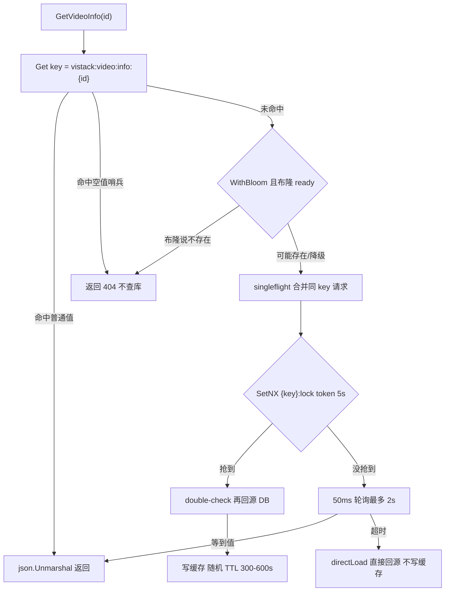
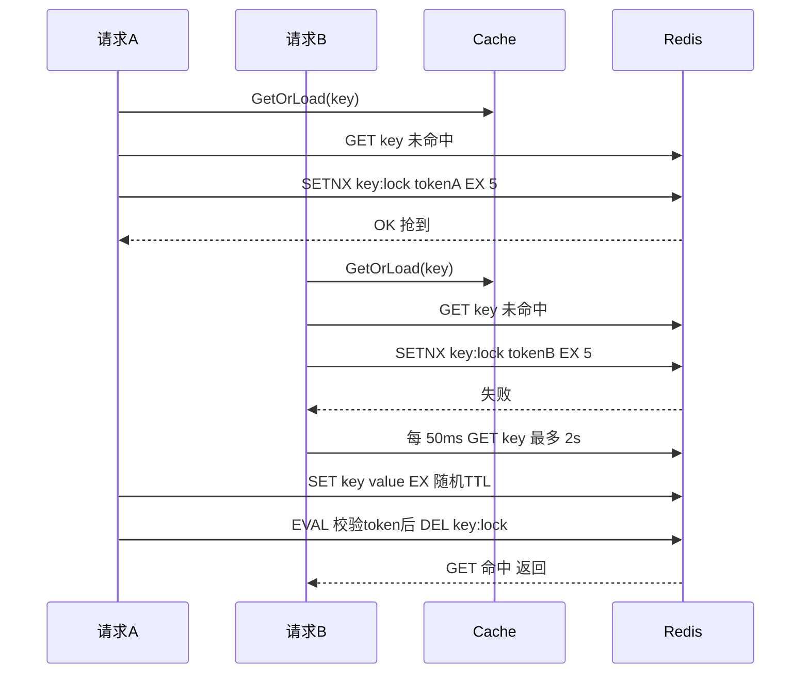
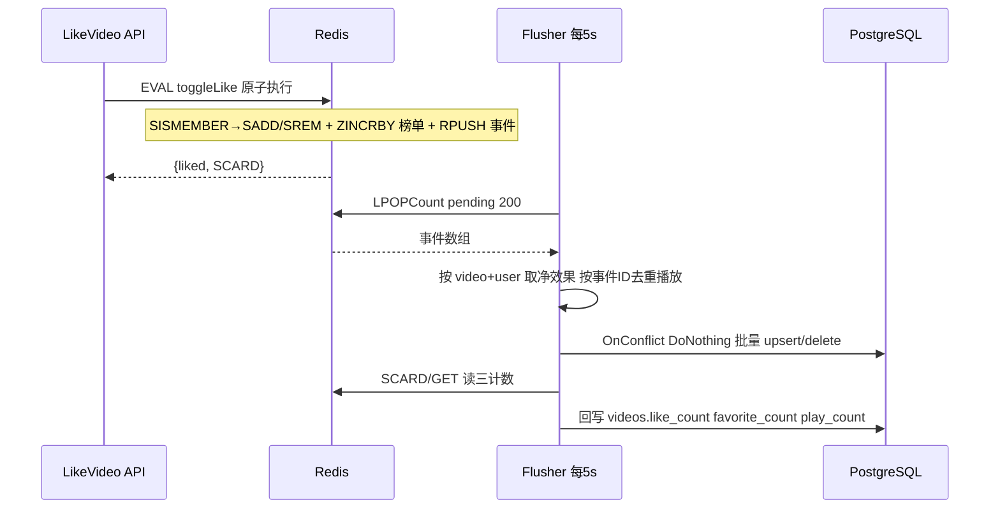

# 06 · 缓存、限流与高并发计数

> 一句话定位：**在 API 读多写少路径上做了一层"通用 Cache-Aside 组件"（空值哨兵防穿透、singleflight + Redis 互斥锁防击穿、随机 TTL 防雪崩、布隆过滤器提前拦截不存在的 ID），再用"进程内令牌桶 / Redis Lua 滑动窗口"做用户级限流，最后把点赞、收藏、播放量三个高频计数整体放进 Redis（Lua 原子写 + List 事件队列 + 定时批量落库 + ZSet 榜单），用异步换吞吐。**
>
> 涉及代码（全部为真实实现）：
> - `internal/core/cache/cache.go`、`internal/core/cache/bloom.go` —— 缓存组件与布隆过滤器
> - `internal/core/cache.go` —— 配置默认值（TTL 300~600 s、空值 60 s、锁 5 s、等待 2000 ms、布隆 1000 万位 7 哈希）
> - `internal/api/v1/video_cache.go`、`internal/api/v1/Video.go`、`internal/api/v1/social.go` —— 缓存调用点、写路径失效、计数填充
> - `internal/middlewares/ratelimit.go`、`internal/middlewares/ratelimit/{limiter,token_bucket,sliding_window}.go`
> - `internal/interaction/{interaction,flusher,keys,leaderboard}.go`
> - `internal/routers/router.go`、`internal/role/api.go`、`conf/app.toml`、`internal/interaction/interaction_test.go`

---

## 0. 先画三条路径（读缓存 / 抢锁回源 / 点赞写路径）

---

## 1. 缓存三件套分别落在哪几行代码

### Q：缓存穿透、击穿、雪崩，你项目里各是怎么做的？

**🎤 口述（可直接背）**：**穿透**用两道：查不到的 ID 写一个空值哨兵 `\x00NULL\x00`（TTL 60 秒），下次直接返回 404 不查库；再往前还有布隆过滤器（1000 万位、7 个哈希），判断"一定不存在"就短路，连空值都不用写。**击穿**（热点 key 过期瞬间大量请求打到 DB）用 `singleflight` 合并同进程的同 key 请求，再用 Redis `SetNX` 互斥锁挡住**跨实例**的重复回源，没抢到锁的请求轮询 2 秒等别人填好缓存。**雪崩**用**随机 TTL**：普通缓存 300~600 秒之间随机，不让一批 key 同时过期。

**🔍 讲解/备注**：
- 三件套对照表（背这张表就够答第一问）：

| 问题 | 现象 | 本项目实现 | 代码位置 | 代价 |
|------|------|-----------|---------|------|
| 穿透 | 查不存在的 ID，缓存永远不命中 | 空值哨兵 `\x00NULL\x00` TTL 60 s + 布隆过滤器 | `cache.go:16`、`:183-188`、`bloom.go:83` | 空值占内存；布隆有假阳性；**漏加会假阴性** |
| 击穿 | 热点 key 过期瞬间打穿 DB | singleflight（进程内）+ Redis SetNX 锁（跨实例）+ 50 ms 轮询 2 s | `cache.go:116`、`:226-234`、`:215-224` | 锁 TTL 5 s 短于慢回源会重复回源；等锁超时后退化为直连 DB |
| 雪崩 | 大量 key 同时过期 / Redis 宕机 | 随机 TTL 300~600 s；空值 60 s；推荐位固定 300 s | `cache.go:243-247`、`timeutil/rand.go`、`core/cache.go:23-40` | Redis 全挂时仍会全量回源，没有本地缓存兜底 |

- 默认值来源 `core/cache.go:22-46`：`DefaultTTLMin=300 / Max=600`、`NullTTL=60`、`LockTTL=5`、`LockWaitMS=2000`、`RecommendTTL=300`、`BloomBits=10_000_000`、`BloomHashes=7`，全部可由 `conf/app.toml [cache]` 覆盖，零值时才套默认。
- **调用点**：只有两个 key 走这套组件——视频详情 `vistack:video:info:{id}`（`Video.go:513`，带 `cache.WithBloom()`）和推荐列表 `vistack:video:recommend`（`Video.go:882`，带 `cache.WithTTL(ttl, ttl)` 固定 TTL）。**没走缓存的热点读还有**：`GetVideoStats` 每次都查 Redis 计数、热门榜单每次都查 DB（`social.go:200`），这也是可优化点。

**⚠️ 追问预案**
- "为什么只有详情和推荐用缓存？" → 按收益/复杂度排序先做这两个读多写少、key 单一的接口；列表分页缓存命中率低且失效复杂，故意没做。
- "击穿为什么不用逻辑过期？" → 逻辑过期需要额外线程异步重建，我选了更简单的"互斥锁 + 等待"，代价是等待期有延迟尖刺。
- "怎么验证缓存真的生效？" → 缺 Prometheus 命中率指标（我文档里 P1 项）；目前靠日志和压测观察 DB QPS。

---

## 2. singleflight 之后为什么还要 Redis 锁

### Q：`singleflight` 已经是进程内合并了，为什么还要抢 Redis 锁？

**🎤 口述（可直接背）**：`singleflight` 只能合并**同一个进程**里的同 key 请求，我们 API 是多副本部署，每个实例各有一个 `singleflight.Group`，热点 key 过期那一刻 N 个实例会**各派一个**请求去查 DB——合并后仍然是 N 次查询，N 随副本数放大。加一层 Redis `SetNX` 锁就是把互斥范围从"进程内"抬到"集群内"：抢到锁的那个实例去回源，其他实例轮询等它把缓存填好。

**🔍 讲解/备注**：
- 代码依据：`sf singleflight.Group` 字段（`cache.go:85`）、`c.sf.Do(key, ...)`（`cache.go:116`）、`acquireLock`（`cache.go:226-234`）。
- 层次关系要说清楚：`singleflight` 是**第一层**（零网络开销，挡住进程内惊群），Redis 锁是**第二层**（挡住跨进程惊群）。两层缺一不可：只有 singleflight → 副本数倍的 DB 查询；只有 Redis 锁 → 同进程内几十个 goroutine 一起去抢锁，全是无效 Redis 往返。
- **锁的粒度**是"每个缓存 key 一把锁"（`lockKey := key + ":lock"`，`cache.go:227`），所以不同视频互不阻塞。
- 边界：
  - 锁 TTL 只有 5 秒，如果回源（DB 查询 + 调 auth 服务补作者信息 + 读 Redis 计数）超过 5 秒，**锁会提前过期**，第二个实例抢到锁又查一次 DB → 退化成"重复回源"，但不会死锁。
  - 没有"锁续约"（watchdog）机制，这是刻意的：缓存回源本身应该是毫秒级，慢到 5 秒说明源有问题，让它过期比续约更安全。

**⚠️ 追问预案**
- "为什么不用 Redlock？" → 单实例 Redis 下 Redlock 没有意义（多实例才能体现价值），且 Redlock 的争论点是正确性而非性能；我们只需要"降低并发"，不需要严格互斥，所以 SetNX + TTL 足够。
- "抢不到锁的请求会不会打爆 Redis？" → 会有一批 50 ms 轮询的 GET，但轮询是纯内存操作且只在 key 缺失时发生，量级可控；更优解是加指数退避或 pub/sub 通知。
- "锁丢了会不会数据错乱？" → 不会，锁只影响"谁来查"，不影响"写什么"；即使重复回源，写进去的值是一样的。

---

## 3. 锁为什么要带 token + Lua 释放

### Q：`SetNX` 加锁为什么值要放一个 uuid？解锁为什么要用 Lua？

**🎤 口述（可直接背）**：因为存在"**误删别人的锁**"的问题：A 拿到锁，5 秒 TTL 到期锁自动释放，B 抢到锁开始回源；这时 A 回源结束，如果直接 `DEL lock`，删掉的是 **B 的锁**，于是 C 又能抢进来 —— 互斥就失效了。所以加锁时把值设为本次请求的 uuid（`uuid.NewString()`），释放时用一段 Lua 先 `GET` 比对值是否等于自己的 token，相等才 `DEL`。

**🔍 讲解/备注**：
- 代码依据：`token = uuid.NewString()`（`cache.go:228`）、脚本 `releaseLockScript`（`cache.go:27-32`）——`if redis.call("get", KEYS[1]) == ARGV[1] then return redis.call("del", KEYS[1]) else return 0 end`。
- **为什么必须原子**：`GET` 和 `DEL` 是两条命令，如果在两条命令之间锁过期并被别人拿走，就回到了误删问题。Lua 在 Redis 里是**单线程串行执行**的，脚本期间不会有其他命令插进来，所以"比对 + 删除"是一个原子决策。这也是"Redis 分布式锁的正确姿势"的标准答案。
- 释放时机：`defer c.releaseLock(ctx, key, token)`（`cache.go:169`），无论回源成功失败都会释放。
- 边界/缺陷：
  - 释放脚本用 `Run` 而不是 `EvalSha` 缓存脚本（go-redis 的 `NewScript` 内部会先 `EVALSHA` 失败再 `EVAL`），第一次会有一次额外往返，可忽略。
  - 写路径上的 `Cache.Delete`（`cache.go:127-132`）是**直接 `DEL`、不带 token**——这是对的，失效缓存不需要互斥语义。
  - 严格正确性还缺"Fencing token"（锁过期后旧持有者的写入要被拒绝），对缓存场景没必要。

**⚠️ 追问预案**
- "锁 TTL 到了但业务没跑完怎么办？" → 会重复回源，不是正确性问题；要杜绝就得做锁续约，但代价大于收益。
- "Lua 脚本会不会阻塞 Redis？" → 这段脚本只有一次 GET + 一次 DEL，O(1)，不会有长阻塞；要避免的是在 Lua 里做大量循环（我们的滑动窗口限流脚本里 `ZREMRANGEBYSCORE` 是范围删除，量级是窗口内请求数，可控）。
- "为什么不用 Sentinel/Redisson 那套？" → Go 生态里这是最常见的手写实现；跨语言/复杂场景才值得上框架。

---

## 4. 没抢到锁的请求为什么先轮询 2 秒再回源

### Q：没抢到锁的请求为什么不直接查库？2 秒是怎么定的？

**🎤 口述（可直接背）**：直接查库就等于让 N 个请求同时打 DB，锁白加了。所以让它们以 **50 毫秒**为间隔轮询 Redis，最多等 **2 秒**（`LockWaitMS`），等到别人填好的缓存就读走；**2 秒还没等到才退化为直接回源**——这是"宁可慢一点也要保住 DB"的取舍：正常情况下锁持有者的回源是几十毫秒，2 秒足够；只有源真的慢/挂了才走到降级分支。

**🔍 讲解/备注**：
- 代码依据：`waitAndRead(ctx, key, loader, c.opts.LockWait)`（`cache.go:175`）、`for time.Now().Before(deadline) { readCache; sleep 50ms }`、最后 `return c.directLoad(ctx, loader)`（`cache.go:215-224`）。
- **降级顺序很讲究**：`directLoad`（`cache.go:200-213`）只回源、**不写缓存**。为什么不写？因为它大概率没拿锁，贸然写会覆盖别人刚写进去的新值（尤其是写路径刚 `DEL` 过缓存的场景）。这是"读不到就慢一点，但绝不写错"的思路。
- 1 个真实缺陷：2 秒后的降级是**所有等待者同时触发** `directLoad`——它们几乎在同一时刻超时，于是又形成一次小规模惊群。更稳的做法是"等待时间加随机抖动"或"超时后重新去抢锁"。
- 另外锁获取失败（Redis 报错）时也是直接 `directLoad` 并打 error 日志（`cache.go:161-167`），这正是"缓存不可用时不能拖垮业务"的体现。

**⚠️ 追问预案**
- "2 秒等待对接口延迟影响多大？" → 只在缓存缺失的冷启动/失效瞬间发生，P99 会尖刺到 2 秒；如果业务不能接受，应该改成"返回旧值 + 异步刷新"。
- "轮询 50 次会不会浪费 Redis 连接？" → 是 40 次左右 GET（2s/50ms），都在同一个连接池里；量级远小于直接打 DB。
- "能不能用 Redis pub/sub 通知？" → 可以更优雅（避免轮询），但订阅连接维护成本高，对一个 2 秒的小窗口不划算。

---

## 5. 空值哨兵：为什么不用空字符串

### Q：空值缓存为什么用一个奇怪的 `\x00NULL\x00` 而不用空字符串 `""`？

**🎤 口述（可直接背）**：因为读缓存要区分三种情况——**命中真值、命中"确认不存在"、根本没缓存**。`GET` 到空字符串时无法判断这是"我们故意写的空值"还是"别人写了一个空 JSON"；更关键的是反序列化流程会把 `""` 交给 `json.Unmarshal` 直接报错。用一个不可能出现在正常 JSON 里的哨兵（`\x00NULL\x00`，含 NUL 字节，正常业务数据不会这样）就能明确表达"这个 ID 查过了，不存在"，命中它直接返回 not found，不查库也不反序列化。

**🔍 讲解/备注**：
- 代码依据：常量 `nullSentinel = "\x00NULL\x00"`（`cache.go:16`）；读路径 `if val == nullSentinel { return false, "", true }`（`cache.go:139-141`）——注意第三个返回值 `hit=true`，表示"这是一个有效的缓存决定"；写路径 `Set(key, nullSentinel, NullTTL)`（`cache.go:184`）。
- `GetOrLoad` 的返回值语义：`(found bool, err error)`，`found=false && err=nil` 表示"源里没有"→ 上层返回 404（`Video.go:549-552`）。所以哨兵的存在让"不存在的 ID"也有缓存命中，把穿透流量挡在 DB 之外。
- **三种 TTL 的取舍**：真值 300~600 秒随机、空值固定 60 秒。空值 TTL 更短是因为"不存在"可能是暂时的（视频刚上传还没提交、审核中），60 秒后自动重查一次，避免"数据来了但缓存还说没有"。
- 边界：
  - **写路径必须删空值 key**：用户创建视频后如果没删 `vistack:video:info:{id}`（此刻是空值哨兵），就会在 60 秒内一直 404。我们的写路径（更新/删除）确实调了 `deleteCache`（`Video.go:486`、`:715`），但**"新建视频后"没有删 key**——因为新建时 ID 是新生成的、缓存里本来就没有空值，所以没暴露问题。这是个需要小心维护的隐性契约。
  - null 哨兵不是合法 JSON，所以如果有人手工往这个 key 里塞 `""`，读路径会走 `decode` → `json.Unmarshal` 失败 → 返回 error，上层打 500。属于"污染缓存即报错"的严格策略。

**⚠️ 追问预案**
- "空值缓存会不会被恶意利用？" → 攻击者用随机 ID 刷接口，每个不存在的 ID 都会写一个 60 秒的哨兵 key → **内存放大攻击**。缓解手段正是布隆过滤器（下一节）：先布隆拦截，就不写空值 key 了；再配合限流。
- "会不会把'DB 报错'也缓存成空值？" → 不会，loader 返回 err 时 `loadAndWrite` 直接 `return loadResult{}, err`（`cache.go:180-182`），只有 `found=false` 才写哨兵。

---

## 6. 布隆过滤器：参数、误判率与降级

### Q：布隆过滤器怎么实现的？参数怎么选的？误判率多少？

**🎤 口述（可直接背）**：用 Redis 的 bitmap 自己实现：1000 万位（`bits = 10_000_000`，约 1.25 MB）、7 个哈希（`hashes = 7`）。哈希用 **FNV-1a 双哈希**构造：`h1 = fnv1a(item)`、`h2 = fnv1a(item + "\x00")`，第 i 个位置是 `(h1 + i*h2) % bits`——这样只需要两次哈希计算就能得到 7 个位置，是标准优化。按公式 `(1 - e^{-kn/m})^k` 算：100 万元素时误判率约 **0.8%**，10 万时基本为 0，**200 万时涨到 14%、1000 万时已经接近失效**，所以它的设计容量是"百万级视频"。

**🔍 讲解/备注**：
- 代码依据：`NewBloom`（`bloom.go:21-29`，零值兜底也还是 10M/7）、`positions`（`bloom.go:34-42`）、`fnv1a64`（`bloom.go:44-48`）、写入用 `TxPipeline + SetBit`（`bloom.go:51-64`）、查询用管道 `GetBit` 后任一为 0 即"不存在"（`bloom.go:94-107`）。
- 误判率表（由 m=10⁷ 位、k=7 按标准公式计算，可作为面试时的量化回答）：

| 已插入元素 n | 误判率 | 说明 |
|------------|--------|------|
| 10 万 | ≈ 6×10⁻⁷ | 基本无误判 |
| 100 万 | ≈ 0.8% | 设计工作点 |
| 200 万 | ≈ 14% | 明显劣化，拦截效率下降 |
| 500 万 | ≈ 81% | 几乎失效，等于每次都要回源 |
| 1000 万 | ≈ 99% | 过滤器已无意义 |

- **元素是什么很关键**：布隆里存的是**缓存 key 字符串** `vistack:video:info:{id}`，不是裸视频 ID（`video_cache.go:56-63`、`:75-78`），所以写入侧（`addVideoBloom`）和查询侧（`GetOrLoad` 传的 key）必须严格一致，改 key 格式等于清空过滤器。
- **`ready` 标志位**（`bloom.go:31`、`:84-93`）：`Build` 先 `DEL` 位图、`DEL ready`、批量 `SetBit`，**全部完成后才 `SET ready 1`**。查询时先看 `ready`，不是 "1" 就直接返回"可能存在"。为什么需要？因为全量重建期间位图是"残缺"的——如果这时用残缺位图判断，会出现大量**假阴性**（把真实存在的视频判成不存在）→ 用户看到 404。`ready` 就是把"重建窗口"隔离掉。
- **降级返回 true**：未构建（`ready` 不存在）、`ready != 1`、Redis 报错，三种情况都返回 `(true, nil)` ——"可能存在"，让请求继续走后面的缓存/DB 路径。**布隆是优化，不是正确性依赖**：宁可多查一次 DB，也不能因为过滤器不可用而误判 404。
- 构建时机：API 角色启动时异步全量构建（`role/api.go:69` 的 `go v1.BuildVideoBloom(...)`），从 `videos` 表 `Pluck("id")` 拿全量 ID；新增走 `addVideoBloom`（best-effort，失败只记日志）。
- **两个真实缺陷（主动说）**：
  1. **假阴性风险**：`addVideoBloom` 是 best-effort，如果它在"事务提交后、`SetBit` 之前"崩溃或 Redis 短暂不可用，而位图 `ready` 已经是 1，那么这个**真实存在**的视频会被布隆判成"一定不存在" → 详情接口**直接 404 且不查库**，直到下次 API 重启触发全量重建。修复：把"加入布隆"做成可靠步骤（或写 DB 标记 + 后台补齐），并在 key 缺失时不要直接返回 404（可加"空值哨兵只写缓存、不做 404 短路"的开关）。
  2. **删除只增不减**：布隆删不掉单个元素（标准布隆的位是共享的，清位会连带影响别的元素）。所以删视频后位图仍然是 1 → 只是**假阳性**（回源查 DB 得到 not found，然后写空值哨兵），不影响正确性；但如果"被删 ID 被复用"或长期不重建，误判率会持续升高。工程上的解法：定期按当前 `videos` 表全量重建（我们目前只在启动时重建），或改用 Counting Bloom / Cuckoo Filter 支持删除。

**⚠️ 追问预案**
- "为什么不用 Redis 的 `BF.ADD`（RedisBloom 模块）？" → 需要装模块，而 bitmap 用原生 `SetBit/GetBit` 零依赖就能实现，也让我们能把参数（位数、哈希数）放进配置。
- "为什么 7 个哈希不是最优值？" → 严格按 `k = (m/n)·ln2` 算，m/n=10（100 万元素）时最优 k≈6.9，取 7 正好是**接近最优**的选择，也说明这套参数确实是照着"100 万 key"设计的。
- "全量重建期间位图被清空的影响？" → 清空瞬间 `ready` 也是 `DEL` 掉的，所以查询会走降级（可能存在），不会误判；代价是这段时间布隆不起作用。
- "10 万个视频的 `Pluck` + 70 万次 `SetBit` 会不会阻塞？" → 用 `TxPipeline` 批量提交，且是在独立 goroutine 里做的；但确实是"把 70 万条命令一次性攒在 pipeline 里"，内存和单次 RTT 都不小，更大规模应该分批（比如每 10 万次一批）。

---

## 7. Cache-Aside 与写路径失效：一致性风险

### Q：为什么用 Cache-Aside？更新/删除时怎么保证缓存和 DB 一致？

**🎤 口述（可直接背）**：读路径是标准 Cache-Aside：先读缓存，未命中回源 DB 再写缓存。写路径用的是"**先改库、再删缓存**"：更新视频（`Video.go:708-715`）和删除视频（`:479-486`）都是先落 DB 再 `deleteCache(videoInfoCacheKey(id), cacheKeyVideoRecommend)`，两个 key 一起删，下次读自然回源拿新值。

**🔍 讲解/备注**：
- 为什么是**删除**而不是**更新**缓存：更新缓存要处理并发写覆盖（A 先写库、B 后写库，但缓存可能被 A 最后写入）且热点 key 可能根本没被读过（白写）；删除更简单，属于"惰性重建"。
- 为什么是**先更库再删缓存**：如果反过来（先删缓存再更库），在"删完"到"更库完成"之间有个窗口，读请求会把**旧值**重新加载进缓存，导致长期脏数据。
- **仍然存在的不一致窗口**（要主动承认）：
  1. 读请求在"DB 查询完成"与"写缓存"之间被写请求插入：读拿到旧值，写更新了 DB 并删了缓存，读又把旧值写回缓存 → **脏数据一直存在到 TTL 到期**（最长 600 秒）。
  2. 进程在"更库成功、删缓存失败"之间崩溃 → 旧缓存留存到 TTL 到期。`deleteCache` 只返回 error 不重试（`video_cache.go:49-53`）。
  3. **没有延迟双删**（更新后延迟几百毫秒再删一次），也没有 binlog/Canal 之类的最终一致方案。
- 一致性等级要老实说：这是**最终一致**，不一致窗口上界 = 缓存 TTL（300~600 秒）或下一次写操作。对视频详情这种读多写少、对一致性要求弱的场景可以接受；对"点赞数实时性"我们干脆绕开了缓存，直接读 Redis（见第 12 节）。
- 补充一个真实细节：删除视频时删的是"详情 key + 推荐 key"，**推荐列表 key 是全局单 key**，所以任何一个视频的更新/删除都会让整个推荐缓存失效——这是"简单粗暴但正确"的取舍，代价是失效频繁（见下一节）。

**⚠️ 追问预案**
- "为什么不用 Write-Through / Write-Behind？" → 写穿透会增加写延迟且对未读 key 做无用写；写回（异步）会在 Redis 挂时丢写，不适合视频元数据这种"必须有"的数据。
- "怎么改进一致性？" → 三步走：① 删除失败重试（本地重试 + 兜底延迟双删）；② 给缓存值加版本号/更新时间戳，回源时校验；③ 引入 binlog 订阅做统一失效。
- "会不会有缓存和 DB 都为空的情况？" → 会，就是"DB 有、缓存空值哨兵"的错配，靠 TTL 60 秒自愈 + 写路径删 key。

---

## 8. 推荐列表缓存 TTL 300 秒的取舍

### Q：推荐缓存为什么固定 300 秒，而不是也做随机 TTL？

**🎤 口述（可直接背）**：推荐位是**全局单 key**（`vistack:video:recommend`），只有一个 key，不存在"同时过期雪崩"的问题，所以随机 TTL 没意义；固定 300 秒是"新鲜度 vs DB 压力"的折中：推荐内容是"按创建时间倒序取前 20 条公开已发布视频"，5 分钟内不刷新，用户基本感知不到；同时它把最贵的查询（列表 + 预加载封面 + 批量补作者信息 + 补计数）压到 5 分钟一次。

**🔍 讲解/备注**：
- 代码依据：`cacheKeyVideoRecommend`（`video_cache.go:16`）、`recommendCacheTTL()` 带默认值兜底（`video_cache.go:24-30`）、`cache.WithTTL(ttl, ttl)` 把 min/max 设成同一个值（`Video.go:918`）→ `randomTTL` 里 `min >= max` 直接返回 `min`（`cache.go:243-246`）。
- 为什么全局单 key 也是缺点：任何视频的发布/更新/删除都会 `deleteCache(..., cacheKeyVideoRecommend)`（`Video.go:486`、`:715`），高写入场景下这个 key 会被反复删掉 → 缓存命中率暴跌。**改进方向**：按 `visibility`/分页/用户维度拆 key，或者用"短 TTL + 异步刷新"。
- 注意它**没有用 `WithBloom`**：布隆的语义是"这个按 ID 查的 key 存不存在"，对列表 key 不适用；`GetOrLoad` 里布隆检查是 `co.useBloom` 开关控制的（`cache.go:110-114`）。
- 另一个"顺带加分点"：推荐列表的 loader 里调用了 `enrichCounts`（`Video.go:916`）——它会去 Redis 批量读三计数。也就是说**推荐列表的缓存里存的是"某一时刻的计数快照"**，5 分钟内的点赞数变化在推荐位上是看不到的（详情页则每次实时读 Redis）。这是一个容易被面试官抓住的"一致性不一致"点，主动说反而显得清醒。

**⚠️ 追问预案**
- "为什么不给推荐做个性化？" → 当前 v1 就是"最新 20 条"，代码注释写了 `v1: 查询前20条按照时间desc的视频`（`Video.go:877`）；个性化需要用户画像和召回，属于演进项。
- "5 分钟够不够新？" → 对"最新视频"这种场景偏慢，所以真实产品会用短 TTL + 主动失效（发布成功时只删推荐 key，而不是等它过期）。

---

## 9. 限流为什么按 user_id 而不是 IP

### Q：限流为什么挂在登录后的路由组、按 user_id 限流？

**🎤 口述（可直接背）**：因为限流的是"**登录用户的资源消耗**"。第一，登录后接口（上传、删视频、点赞）都是**有身份**的操作，用 user_id 做 key 就精确对应"一个账号"，不会误伤同一个 NAT/公司出口后面的其他人；第二，IP 可以被改（换代理、秒拨），而且我们的入口在网关注册层已经有一道 IP 级防护，应用层再做 IP 限流收益低；第三，未登录请求（`userID == 0`）直接放行——公开的只读接口不参与这套限流。

**🔍 讲解/备注**：
- 代码依据：`router.go:32-34`——`AuthApiGroup` 先 `AuthMiddleware` 再 `RateLimit(limiter)`；`ratelimit.go:57-61` 取 `auth.GetUserID(c)`，为 0 就 `c.Next()` 放行；key 就是 `strconv.FormatInt(userID, 10)`（`ratelimit.go:63`）。
- **顺序很重要**：限流在鉴权之后，所以能拿到 user_id；如果放在鉴权之前就只能按 IP。
- **两类 key 的取舍表**：

| 维度 | 按 user_id（现方案） | 按 IP |
|------|-------------------|-------|
| 精准度 | 精确到账号，天然防盗刷 | 受 NAT/代理影响，误伤或漏放 |
| 未登录请求 | 不覆盖（直接放行） | 可覆盖 |
| 绕过成本 | 要换账号（成本高） | 换 IP 即可 |
| 与网关的分工 | 应用层做用户级 | 网关层做 IP 级（推荐） |
| 我们只做了 | ✅ 用户级 | ❌ 未实现 |

- 边界：**公开路由完全没有应用层限流**——`PlayVideo`（播放上报）在 `PublicApiGroup` 里（`router.go:26`），任何人可以无鉴权地刷播放量。这是计数正确性的一个真实风险，配合"播放量 INCR 无去重"就是"可被刷量"（见第 14 节）。
- 另一个边界：限流是**按接口组统一阈值**（60 秒 100 次），没有做"上传接口更严、读接口更松"的差异化配额。真实产品会按接口分级。

**⚠️ 追问预案**
- "怎么防止一个用户换账号刷？" → 应用层只能到账号级；设备指纹/IP/风控是网关或风控服务的活。
- "限流只加在写接口吗？" → 不，整个 `AuthApiGroup`（含读取的私有接口）都加了，阈值统一。
- "怎么给不同接口不同阈值？" → 把 `RateLimit(limiter)` 换成按路由参数化（`RateLimit(limiter, limit, window)`），或者 middleware 里按 path 分流；现在没做。

---

## 10. 令牌桶 vs Redis Lua 滑动窗口

### Q：你实现了两种限流算法，说说区别和选型。

**🎤 口述（可直接背）**：**令牌桶是进程内的**，`map[key]*bucket` + 一把互斥锁，按 `elapsed * rate` 补充令牌、桶容量是 burst，支持突发流量（桶里攒着令牌就能一次放行一串），但**只在单实例内有效**，多副本部署等于每个副本各 10 QPS，总量是副本数的倍数。**滑动窗口是 Redis Lua 的**：用 ZSet 存每次请求的时间戳（member 是 uuid，避免同毫秒多条被去重），脚本里 `ZREMRANGEBYSCORE` 清掉窗口外的记录、`ZCARD` 数当前窗口内的请求数、没超限才 `ZADD` 并 `PEXPIRE`，整个"清理-判断-写入"是**原子的**，而且窗口是**跨实例共享**的。我们线上配置选的是 `sliding_window`：60 秒 100 次。

**🔍 讲解/备注**：
- 代码依据：`token_bucket.go:39-73`（`tb.mu.Lock()` 全表一把锁、`math.Min(burst, tokens+elapsed*rate)`、`resetIn = max(0,(1-tokens)/rate)`）；`sliding_window.go:16-36`（Lua）、`:57-85`（`member := uuid.NewString()`、返回 `{allowed, remaining, reset_ms}`）；`BuildLimiter` 按 `rl.Algorithm` 选实现（`ratelimit.go:29-48`），默认分支就是滑动窗口；配置 `conf/app.toml` 里是 `algorithm = "sliding_window"`、`window = 60`、`limit = 100`。
- **Lua 脚本逐行解释（面试官常要求）**：
  1. `ZREMRANGEBYSCORE KEYS[1] 0 now-window` —— 把窗口外的旧记录删掉（相当于"滑出窗口"），保证 ZSet 只保留最近 60 秒；
  2. `count = ZCARD` —— 当前窗口内的请求数；
  3. `count < limit` 才 `ZADD now member` + `PEXPIRE window` —— **被拒绝的请求不记录**（不惩罚性延长窗口）；
  4. 返回 `resetAt = 最早记录的时间 + window`（取 `ZRANGE 0 0 WITHSCORES`），没超限时直接 `now + window` —— 这是给 `Retry-After` 用的"多久后能再放行一个"。
- **对比表**（必备）：

| 维度 | 令牌桶（进程内） | 滑动窗口（Redis Lua） |
|------|----------------|---------------------|
| 状态位置 | 进程内存 map | Redis ZSet |
| 分布式一致性 | ❌ 每副本独立配额 | ✅ 全集群共享一份配额 |
| 突发流量 | ✅ 支持 burst | ❌ 严格平滑（窗口内均匀） |
| 精度 | 令牌连续补充，很平滑 | 精确滑动，无边界的"双倍突发"问题 |
| 内存/性能 | 极快（无网络） | 每请求一次 Lua 往返 |
| 阻塞风险 | 单把互斥锁，key 多时是热点 | Redis 单线程，热 key 同样有压力 |
| 选型结论 | 适合单机保护 / 本地兜底 | ✅ 多副本部署的正确选择（现配置） |

- **令牌桶的真实缺陷要点**：`tb.mu` 是**一把全局锁**，所有 key 的判定都串行；`buckets` map **永不清理**（没有过期回收），用户量大了就是内存泄漏——两个都是"玩具级实现"必须承认的地方。改进：按 key 分片加锁（`sync.Map` + 每桶独立锁）或用 `golang.org/x/time/rate` 的 `Limiter`（LRU 淘汰）。
- **滑动窗口的真实缺陷要点**：每个请求都要写一条 ZSet 记录，一个用户 100 次/分钟就是 100 个成员（`member` 是 uuid 占几十字节），所以**热用户 = 大 key**；而且它把"每次请求"都变成一次 Lua 写操作，比令牌桶的纯内存判定贵得多。
- 为什么"返回 remaining"能对上：令牌桶返回 `int(b.tokens)`，滑动窗口返回 `limit - count - 1`（`sliding_window.go:27`），两者都用于 `X-RateLimit-Remaining`。

**⚠️ 追问预案**
- "为什么不做漏桶？" → 漏桶强制恒定速率，不允许突发；我们的写接口更希望"允许短突发、长期平滑"，滑动窗口+桶都能满足，而滑动窗口天然分布式。
- "Redis 挂了滑动窗口怎么办？" → 见下一题：fail-open 放行。
- "窗口内被拒的请求不计数，会不会被绕过？" → 不会，被拒的请求本来就没被处理；反过来不记录他们能避免"越拒越久"的惩罚性锁定。
- "为什么 member 用 uuid？" → ZSet 用 member 去重，如果用时间戳做 member，同一个毫秒内的多个请求会被合并成一条 → 少计数 → 限流被绕过。uuid 保证每条请求都独立计数（这是我实现时特意加的，注释也写了）。

---

## 11. 限流为什么要 fail-open，以及响应头语义

### Q：Redis 挂了限流怎么办？响应头为什么要带这些字段？

**🎤 口述（可直接背）**：**限流器报错就放行（fail-open）**：`limiter.Allow` 返回 error 时打一条 error 日志然后 `c.Next()`。理由是限流的定位是"保护后端不被少数用户打爆"，而 Redis 故障是全局故障——这时如果 fail-closed（全部拒绝），等于**因为限流组件故障让整个站点不可用**，把可用性事故放大成全局事故。反过来在真正需要保命的场景（比如支付），就该 fail-closed，这是业务语义决定的。响应头方面：**超限返回 429 + `Retry-After`（还有几秒可以重试）+ `X-RateLimit-Limit/Remaining/Reset`**，让客户端能自适应退避，而不是无脑重试。

**🔍 讲解/备注**：
- 代码依据：`ratelimit.go:65-71`（err → log + `c.Next()`）；正常放行时无条件写三个头（`:73-75`）；超限时 `retryAfter := int(time.Until(res.ResetAt).Seconds())`，**最小 1 秒**（`:78-82`），然后 `c.JSON(429, ...)` + `c.Abort()`（`:86-87`）。
- 头语义对齐 RFC 6585（429）与 `Retry-After`：`Retry-After` 支持秒数或 HTTP 日期，我们用秒数（整数）；`X-RateLimit-*` 是事实标准（GitHub/Twitter 风格），`Reset` 用 **Unix 秒**（`res.ResetAt.Unix()`），不是"剩余秒数"——面试时要说清这个单位，容易搞混。
- **fail-open 的代价**：Redis 故障期间限流失效 → 后端可能被打爆；所以它必须配合"网关层的 IP 限流 + 连接数限制"这类不依赖 Redis 的防线。我们目前只有应用层这一套，所以要老实说"网关限流还没上"。
- **令牌桶的 `ResetAt` 语义与滑动窗口不同**：令牌桶返回的是"下一次能拿到令牌的时间"（`(1-tokens)/rate`，`token_bucket.go:55`），滑动窗口返回的是"最早那条记录过期的时间"（可以再放行一个）。两者都映射到 `Retry-After`，语义上都是"多久后再试"，但要能解释区别。
- 边界：`X-RateLimit-Reset` 在放行时也返回——令牌桶放行时 `ResetAt = now + resetIn`（`token_bucket.go:63`），此时 `resetIn` 可能接近 0，表示"还有令牌，随时可用"。这个语义其实有点模糊（更规范的做法是返回"窗口重置时间"），属于可以承认的小瑕疵。

**⚠️ 追问预案**
- "能不能 fail-closed 但用本地令牌桶兜底？" → 这是最优解（Redis 挂了降级到进程内令牌桶，配额按副本数折算），代码里有 `Limiter` 接口（`limiter.go:17-19`）和两种实现，扩展成"组合限流器"很自然，但目前没做。
- "超限请求为什么要 Abort？" → 不加 `Abort` 会继续走后面的 handler，等于没限流。
- "为什么错误信息是中文？" → 前端直出，和项目其他接口一致；国际化是后话。

---

## 12. 点赞/收藏/播放量：为什么放 Redis，怎么保证最终落库

### Q：点赞数、播放量为什么用 Redis？数据丢了怎么办？

**🎤 口述（可直接背）**：因为这些操作是**超高频写 + 只需要近似实时读**：一条点赞如果每次直接 `INSERT` + `UPDATE videos.like_count`，DB 会被行锁和写放大打爆。放进 Redis 后：点赞/取消用 **Set**（`SADD`/`SREM`，天然去重，`SCARD` 拿计数）、播放量用 **INCR**、榜单用 **ZSet**（`ZINCRBY`），全部 O(1)。落库是异步的：每次操作往 Redis **List** 里 `RPUSH` 一个事件，后台 flusher **每 5 秒** `LPOP` 最多 **200 条**批量写 DB（明细表 + 以 Redis 为准回写 `videos` 的冗余计数列）。

**🔍 讲解/备注**：
- 代码依据：三个 Lua 脚本 `toggleLikeScript`（`interaction.go:74-85`）、`toggleFavScript`（`:88-97`）、`playScript`（`:100-105`）；事件结构 `Event{ID snowflake, Type, VideoID, UserID, At}`（`:28-34`）；pending key `vistack:interaction:pending`（`keys.go:8`）；flusher `LPOPCount` 批量 + 5 秒 ticker（`flusher.go:23-46`、`:156-178`）；落库 `applyEvents`（`:49-101`）；回写 `syncCounts`（`:104-133`）。
- **Lua 原子的真正意义**（这是本节的考点）：一次点赞要同时改**三个数据结构**——Set（谁赞的 + 计数）、ZSet（热门榜分数）、List（待落库事件）。如果分三条命令发，可能出现"Set 加了但 ZINCRBY 没加"（榜单少 1）、"操作成功但事件没入队"（DB 永久少一条明细）。更关键的是**并发双击**：`SISMEMBER` 判断和 `SADD` 之间存在竞态，两个并发请求可能都判定"未赞" → 都执行 `ZINCRBY +1`，于是**点赞数是 1，榜单分数是 2**。放进一个 Lua 脚本后，Redis 单线程串行执行，判断与写入不可分割。Set 本身是幂等的，**不幂等的是 ZINCRBY 和 RPUSH**，所以原子性必须由脚本保证。
- **幂等四要素**（面试官必问）：
  1. **事件 ID 用 snowflake**（`newEvent` → `snowflake.GenID()`，`interaction.go:107-109`）：全局唯一，播放日志表用它做主键；
  2. **`OnConflict{DoNothing: true}`**（`flusher.go:71`、`:84`、`:96`）：重复落库不报错、不重复插；
  3. **同 video+user 净效果去重**（`likeNet`/`favNet` 两个 `map[pairKey]bool`，`:50-67`）：同一批事件里"点赞→取消→再点赞"只保留最后一次结果，避免中间态写库；
  4. **表复合主键**（`video_likes`/`video_favorites` 的 `(video_id, user_id)` 是联合主键，`internal/model/entity/social/like.go:14-15`）：物理上禁止重复行。
- **为什么"以 Redis 为准"回写**：`syncOneCount` 用 `SCARD`/`GET` 读出当前计数，直接 `Updates` 覆盖 `videos` 的三个冗余列（`flusher.go:114-133`）。这样保证了"**同一时刻的 Redis 计数 == DB 冗余列**"，天然自愈（不是 `+1` 累加，不需要对账）。
  - 但这也意味着**Redis 是计数的唯一真相源**：Redis 丢数据（compose 里是 `redis:7-alpine`，只挂 data 卷、**没开 `appendonly yes`**，默认只有 RDB 快照）→ 计数可能回退甚至归零，然后又被"以 Redis 为准"写进 DB，**把 DB 里正确的值覆盖成错的**。这是当前实现最该修的一致性问题：正确做法是明细表（`video_likes`）作为唯一真相源，`SCARD` 只做加速，Redis 恢复后用 `COUNT(*)` 重建。
  - 另外 `video_likes` 明细表能不能反映"全部历史"要看 flusher 是否吃过事件——它是 `LPOP`，**弹出的那一刻事件就没了**：如果 `applyEvents` 失败（DB 抖动），事件既不会重试也不回队，直接丢失（`FlushPending` 只返回 error，`flusher.go:136-153`）。要修就得用 `LMOVE` 到 processing list + ack，或者直接上 Redis Stream（`XADD`/`XREADGROUP`/`XACK`）。

**⚠️ 追问预案**
- "为什么不同步写 DB、异步只做统计？" → 点赞是典型的"用户要立刻看到自己的状态"，所以 Redis 立即返回；DB 只是持久化副本，晚 5 秒无感。
- "flusher 只有一个吗？" → 每个 API 副本各起一个 flusher（`role/api.go:100-102`）。因为用的是 `LPOP`（原子出队），多副本天然不重复消费、自动分片——**这一点和 dispatcher/watchdog 必须选主恰好相反**，是我在架构里比较得意的一个对比。
- "为什么是 5 秒 200 条？" → 吞吐 = 40 条/秒/副本；量再大就调批量而不是调频率（减少 DB 往返）；配置在 `conf/app.toml [social]`。
- "播放量为什么没有去重？" → 现状确实没有按用户去重（`RecordPlay` 只传 videoID，`interaction.go:158-169`），公开路由也没有限流，所以**可以被刷**。这是要主动承认的缺口，改进方案是"用户 ID + 时间窗去重"（Redis Set/HLL）或"播放时长 ≥ N 秒才计数"。

---

## 13. Redis 计数 vs DB 计数，以及榜单怎么用

### Q：读计数时以谁为准？榜单用什么结构？

**🎤 口述（可直接背）**：**读路径优先 Redis**：详情页/推荐列表批量读时用 pipeline 一次 `SCARD`/`SCARD`/`GET` 拿到三计数填进响应（`Counts`）；只有 Redis 报错时才回退到 `videos` 表的冗余列。**榜单用 ZSet**：点赞时 `ZINCRBY vistack:hot:like 1 video_id`，播放时 `ZINCRBY vistack:hot:play`，读的时候 `ZREVRANGE 0 N-1` 拿 ID 列表，再回 DB 用 `WHERE id IN (...)` 补标题封面——**先拿 ID 再查库**，避免把整个视频对象塞进 Redis。

**🔍 讲解/备注**：
- 代码依据：`Counts`（`interaction.go:172-206`，pipeline 批量）；`enrichCounts`（`social.go:242-261`，失败则保持 0，不报错）；`GetVideoStats` 的回退（`social.go:120-143`）；`Hot`（`leaderboard.go:9-30`）；榜单 key `vistack:hot:play` / `vistack:hot:like`（`keys.go:6-7`）。
- 三种"计数来源"的职责表（必备对照表）：

| 维度 | Redis 计数 | DB 冗余列（`videos.like_count` 等） | DB 明细表（`video_likes` / `video_play_logs`） |
|------|-----------|-----------------------------------|--------------------------------|
| 角色 | **权威源（现状）** | 只读副本/回退用 | 理论上应该是权威源 |
| 写入时机 | 同步（Lua 脚本内） | 异步（flusher 每 5 s 回写） | 异步（flusher 批量落库） |
| 读路径 | 详情/推荐/榜单实时读 | Redis 报错时兜底 | 未用于读接口 |
| 一致性 | 实时 | 最多滞后 5 s，且可能被 Redis 覆盖成错值 | 取决于事件是否丢 |
| 容量风险 | 大 key、内存、无 TTL | 无 | 只增表 |
| 位置 | `likeKey/favKey/playKey` | `syncOneCount` | `applyEvents` |

- **榜单的两级读取**（`social.go:199-210`）：`ZREVRANGE` 拿 top N 的 ID → `WHERE id IN ?` 一次查库 → 用 map 按榜单顺序重排（而不是用 DB 返回的顺序）→ 再批量补计数。这里面有个正确性细节：**DB 里查不到的 ID（已删除视频）会被 `continue` 跳过**（`social.go:215-218`），所以榜单天然容忍脏 ID。
- 边界/缺陷：
  - `vistack:hot:play` / `hot:like` 两个 ZSet **永不过期、也不做裁剪**：视频越多、被播放过的 ID 越多，ZSet 无限增长（`leaderboard_size=50` 只限制读，不限制写）。应该定期 `ZREMRANGEBYRANK` 或按时间窗滚动（`hot:play:{yyyyMMdd}`）。
  - 榜单是**全站累计榜**，没有时间窗口，所以"热门"其实是"历史总播放量"，新品永远上不去。真实产品需要"近 1 小时/近 24 小时"的滑动榜单。
  - 取消点赞时 `ZINCRBY -1` 是**允许分数变负**的（`interaction.go:77`），如果 Redis 计数被部分污染，榜单分数可能与 `SCARD` 不一致（没有对账机制）。

**⚠️ 追问预案**
- "为什么读不用 DB 冗余列？" → 冗余列有 5 秒滞后，而且点赞后用户立刻要看到自己那 +1；Redis 读是 O(1)，成本更低。
- "回退 DB 列时数值可能是旧的，用户会不会觉得数字跳变？" → 会（Redis 挂的时候可能看到旧值），这是可用性优先的取舍；可以在响应里加 `stale` 标记。
- "ZSet 分数能不能直接当点赞数？" → 技术上可以，但我们用 Set 的 `SCARD` 做权威计数、ZSet 只做排序，避免"分数被 ZINCRBY 漂移污染"导致计数错误——**单一真相源**原则。

---

## 14. 高并发下还有什么问题（主动抛缺陷）

### Q：这套 Redis 方案在高并发下还有什么隐患？

**🎤 口述（可直接背）**：五个。① **大 key**：`vistack:like:{video_id}` 是一个 Set，热门视频百万点赞就是单个几十 MB 的 key，删除/迁移/主从同步都会卡；② **热 key**：爆款视频的所有点赞都打同一个 Redis 分片，单分片 CPU 打满，且这些 key 是 `CLUSTER` 下无法自动打散的（同一个 key 只能在一个 slot）；③ **计数可能丢**：Redis 默认 RDB 快照，宕机可能丢最近写入，而"以 Redis 为准"回写会把错值写进 DB；④ **事件可能丢**：flusher 用 `LPOP`，弹出后 DB 写失败就永久丢事件；⑤ **限流与播放在公开路由上没有防护**，播放量可被刷。修法和优先级我在自己的演进文档里也排了。

**🔍 讲解/备注**：
- 逐个给"现象 → 根因 → 修法"（面试时这样讲最有说服力）：

| 隐患 | 现象 | 根因（代码） | 修法 |
|------|------|-------------|------|
| Set 大 key | 单 key 数十 MB，删除阻塞、同步延迟 | `likeKey(videoID)` 单 Set 存所有用户（`keys.go:11`） | 按 user_id 分片（`like:{id}:{uid%16}`）、`SCAN`+分批清理、或改用 HLL（近似）/位图 |
| 热 key | 单分片 CPU 打满 | 爆款视频所有操作打同一 slot | 本地缓存计数 + 异步合并、读写分离从副本读、请求合批（如 100ms 批量 `INCRBY`） |
| 计数丢失 | 重启后计数回退/归零并被写回 DB | Redis 无 AOF（`compose.yml` 只挂 data 卷）、`syncCounts` 以 Redis 为准 | 明细表做真相源、开启 AOF everysec + Sentinel、恢复后用 `COUNT(*)` 重建 |
| 事件丢失 | DB 明细与 Redis 计数长期不一致 | `LPOP` 无 ack（`flusher.go:27`），`applyEvents` 失败不重试 | 用 `LMOVE` 到 processing list + ack，或 Redis Stream + XACK |
| 播放可刷 | 播放量虚高 | 公开路由无限流（`router.go:26`）、无用户去重（`interaction.go:158`） | 网关 IP 限流 + 用户级时间窗去重 + 播放时长门槛 |
| 榜单无限增长 | ZSet 内存持续上涨 | 无裁剪/无时间窗（`leaderboard.go`） | 滚动 key（按天/小时）+ `ZREMRANGEBYRANK` |
| 缓存 Key 数量 | 空值哨兵被随机 ID 刷爆 | 未命中就写 60 s 空值（`cache.go:184`） | 布隆前置拦截 + 限流 + 空值 TTL 再短一些 |

- **另一个容易被问到的点：Redis 单线程 + Lua 的阻塞风险**。我们的 Lua 都很短（`SISMEMBER`/`SADD`/`INCR`/`ZINCRBY`/`RPUSH` 全是 O(1)；滑动窗口的 `ZREMRANGEBYSCORE` 与窗口内请求数同阶），所以是安全的；但要警惕"在 Lua 里做 `SCARD` 大 Set 或大 ZSet 范围操作"这类会放大的命令。
- **有没有降级路径**：写路径（点赞/收藏/播放）在 Redis 故障时是 **fail-fast**——直接返回 500（`social.go:60-64`）；读路径（`GetVideoStats`）回退 DB 冗余列；限流是 fail-open。**三种降级策略不同是刻意的，能讲出"为什么不同"就是加分项**：写必须正确、读可以陈旧、限流优先可用。

**⚠️ 追问预案**
- "怎么定位大 key？" → `redis-cli --bigkeys` / `MEMORY USAGE key` / 慢日志；线上要做采样巡检。
- "为什么点赞用 Set 不用 HyperLogLog？" → HLL 只能估基数、不支持 `SISMEMBER`（判断"我有没有赞过"），而"我的点赞状态"是必须精确的。所以 Set 是"精确判断 + 精确计数"的唯一低成本选择。
- "为什么不用数据库的唯一索引 + 幂等插入 + 定时 COUNT？" → 那就是同步写 DB，正是我们要避免的路径；但**明细表 + 定时 COUNT 重建**确实应该作为 Redis 的兜底（就是我说的真相源修正）。
- "还有什么必须承认的？" → 缓存命中率、Redis 内存、大 key 数、限流拒绝率**全都没有指标**，只有日志；这是我文档里 P2 可观测性的缺口。

---

## 自测清单

- [ ] 我能把穿透/击穿/雪崩三件套各自映射到具体代码行，并说出每种的代价
- [ ] 我能解释 singleflight 只解决进程内合并，为什么还要 Redis 锁（多副本 × N 次回源）
- [ ] 我能说清"锁 TTL 过期后误删别人锁"的问题，以及 token + Lua 的原子比较删除
- [ ] 我能解释为什么没抢到锁的请求轮询 2 秒后走 `directLoad`（不写缓存）而不是直接打 DB
- [ ] 我能说明空值哨兵 `\x00NULL\x00` 相对空字符串的必要性，以及它防不住"随机 ID 刷缓存"
- [ ] 我能报出布隆参数（1000 万位、7 哈希、FNV-1a 双哈希）并给出 100 万 key ≈ 0.8% 误判率的量化结论
- [ ] 我能解释 `ready` 标志位为什么必需（重建期间避免**假阴性**），以及"best-effort 加布隆可能让真实视频被 404"这个风险
- [ ] 我能说清 Cache-Aside 先更库再删缓存的理由，以及仍然存在的不一致窗口上界 = TTL
- [ ] 我能对比令牌桶与 Redis Lua 滑动窗口，并说出滑动窗口 member 用 uuid 是为了防同毫秒去重
- [ ] 我能解释限流为什么按 user_id、为什么 fail-open，以及 `X-RateLimit-Reset` 是 Unix 秒
- [ ] 我能背出三个 Lua 计数脚本的原子性意义（Set/ZSet/List 三写不可分割，ZINCRBY 不幂等）与幂等四要素
- [ ] 我能说出"以 Redis 为权威回写 DB"的自愈优点和"Redis 丢数据会覆盖 DB 正确值"的致命缺点，并列出五个高并发隐患及修法

---

## 背诵卡

- 穿透：空值哨兵 60s + 布隆
- 击穿：singleflight + Redis 锁
- 雪崩：随机 TTL 300-600s
- 锁值放 uuid，Lua 比对后再删
- 没抢到锁轮询 2s 才回源
- 空值哨兵区分未命中与不存在
- 布隆 1000 万位 7 个哈希
- 布隆 ready 防重建期假阴性
- 布隆删不掉，删除只产生假阳性
- Cache-Aside 先更库再删缓存
- 限流按 user_id，未登录放行
- 令牌桶单机，滑动窗口全集群
- 滑动窗口 member 必须是 uuid
- 点赞 Lua 一次改 Set ZSet List
- flusher 每 5s 批量 200 条落库
