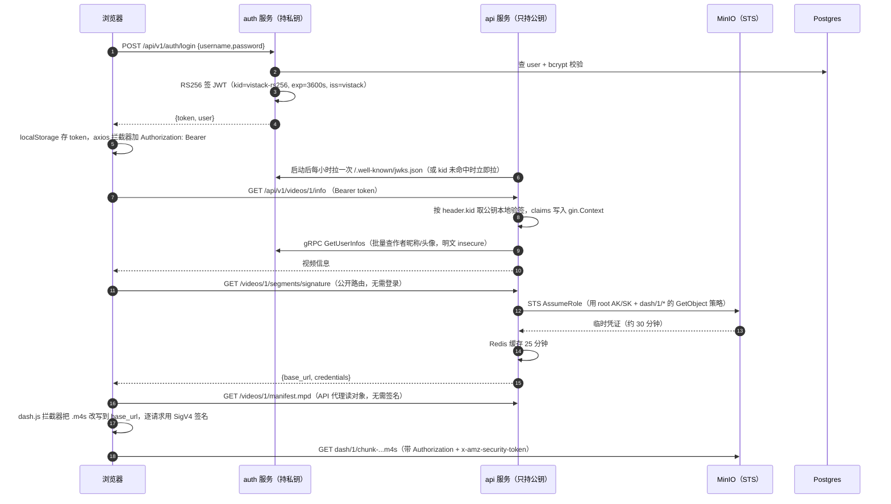
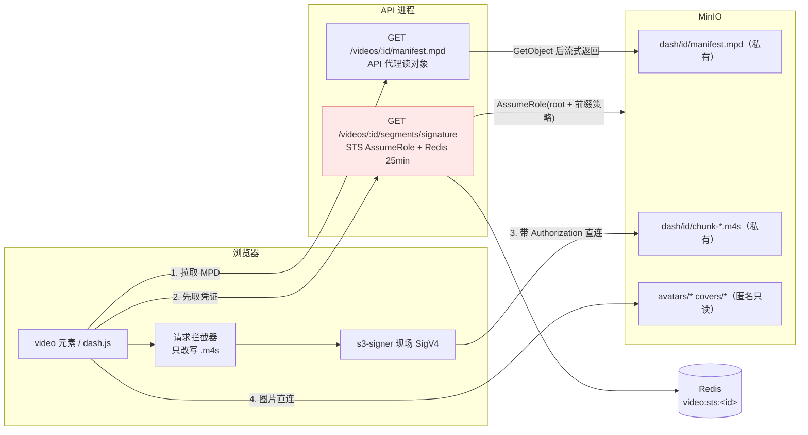

# 07 · 鉴权与安全防线（JWT / JWKS / RBAC / STS 防盗链 / 已知缺口）

> 一句话定位：Vistack 把"签发"收拢到独立 auth 服务持有 RSA 私钥，业务 api 只靠 JWKS 公钥本地验签、不回调、不持密钥；播放侧用 MinIO STS 临时凭证 + 前端 SigV4 逐请求签名把 DASH 分片保护起来；RBAC 的权限表建了但只用到角色，多处基础设施（transcoder gRPC / etcd / Kafka）仍是明文无鉴权，属于必须诚实交底的现实。

> 涉及代码
> - `pkg/auth/token_manager.go`（RS256 签发 + JWKS 生成）、`pkg/auth/verifier.go`（JWKS 本地验签 + 定时刷新）、`pkg/auth/claim.go`（Claims / GetUserID）
> - `internal/auth/handler.go`（注册/登录/资料/改密/JWKS）、`internal/auth/service.go`（gRPC 批量查用户）、`internal/authclient/client.go`
> - `internal/role/auth.go`（auth 角色启动、私钥加载）、`internal/role/api.go`（api 角色验签器与 JWKS URL）
> - `internal/middlewares/auth.go`、`internal/middlewares/ratelimit.go`、`internal/routers/router.go`（公开组 / 鉴权组）
> - `internal/api/v1/Video.go`（GetVideoMdp / GetVideoSegmentsSignature STS）、`web/web-client/src/lib/s3-signer.ts`、`web/web-client/src/components/player-dash/useDashPlayer.ts`、`web/web-client/src/views/VideoPlayer/index.vue`
> - `internal/model/entity/user/{user,role,authority,role_authority,user_authority}.go`、`db/init.sql`、`migrations/migrate.go`
> - `proto/auth/v1/auth.proto`、`conf/app.toml`、`compose.yml`、`web/ui/src/api/axios.ts`

---

## 0. 全景：一次登录到一次播放，凭证怎么流动

### 关键设计取舍对照表

| 维度 | 当前选择 | 备选方案 | 为什么这么选 / 代价 |
| --- | --- | --- | --- |
| JWT 算法 | RS256（`token_manager.go:53`） | HS256 共享密钥 | 只有 auth 持私钥，api 泄漏也签不出 token；代价是 RSA 验签比 HMAC 慢约一个量级（可忽略） |
| 验签方式 | JWKS 本地验签 + 每小时刷新（`role/api.go:49-50`） | 每次请求回调 auth 校验 | 无网络往返、auth 挂了业务还能验已签发 token；代价是撤销延迟最长 1 小时 |
| 服务拆分 | auth 独占私钥与用户表，api 通过 gRPC 查用户（`proto/auth/v1/auth.proto:8-11`） | 单体型 | 密钥半径最小、可独立扩容；代价是多一跳 gRPC + etcd 发现 + 明文传输 |
| 播放鉴权 | STS 临时凭证 + 前端 SigV4 逐请求签名（`Video.go:811-844`） | 每个分片后端预签名 / 全公开 | 凭证短命、可按前缀授权、URL 不可外传；代价是前端要实现签名算法、凭证要刷新 |
| MPD 访问 | API 代理读对象（`Video.go:748-768`） | 直连 MinIO 签名 | manifest 是入口，走 API 可控可审计可加缓存头；代价是 API 承担一份流量 |
| 令牌生命周期 | 单 access token，1 小时，无 refresh、无撤销（`conf/app.toml:27`） | access+refresh+denylist | 简单、无状态；代价是登出/改密后旧 token 仍有效（诚实说明） |

---

## 1. 为什么用 RS256 而不是 HS256？

### Q：JWT 为什么选 RS256？HS256 不是更快更简单吗？

**🎤 口述（可直接背）**：因为验签方比签发方多得多。HS256 是对称的，谁验签谁就得知道签名密钥，一旦 api、worker、transcoder 都要验 token，这个密钥就散布在十几个进程和配置文件里，任何一处泄漏都能伪造任意用户身份；RS256 是非对称的，只有 auth 服务持私钥，其他服务从 JWKS 拿公钥，公钥泄漏无所谓、而且不能用来签发。性能上 RSA 验签确实比 HMAC 慢，单次大约几十微秒量级，相对一次数据库查询和网络往返完全可以忽略。另外代码里显式限制了 `WithValidMethods(["RS256"])`，这是防 `alg: none` 和"把 RS256 降级成 HS256、用公钥当 HMAC 密钥"这类经典攻击的必要动作。

**🔍 讲解/备注**：
- 签发：`jwt.NewWithClaims(jwt.SigningMethodRS256, claims)`，并把 `kid` 写进 header（`pkg/auth/token_manager.go:53-55`）。
- 验签（auth 内部）：`ValidateToken` 用私钥对应公钥直接验，并检查方法族是 RSA、再限制 `RS256`（`token_manager.go:61-66`）。
- 验签（api 侧）：`TokenVerifier.ValidateToken` 同样先 `t.Method.(*jwt.SigningMethodRSA)` 再 `jwt.WithValidMethods([]string{"RS256"})`（`verifier.go:71-86`）——两道校验。
- 密钥加载：`loadOrGeneratePrivateKey` 优先环境变量 `VISTACK_AUTH_RSA_PRIVATE_KEY`，其次文件路径，最后**开发模式生成临时密钥**（`internal/role/auth.go:121-140`，打 warn 日志）。临时密钥意味着重启即换密钥、所有 token 失效，这在生产是事故，必须靠环境变量注入。
- 私钥支持的格式：PKCS1 与 PKCS8（`token_manager.go:97-112`），解析失败直接 fail fast。

**⚠️ 追问预案**：
- RSA 还是 ES256/EdDSA？→ ES256 签名更短、验签更快，是更现代的选择；当前用 RSA 2048 是为了生态兼容（JWKS 通用、库支持广）。
- 密钥轮换怎么做？→ 生成新 kid 发布 JWKS（多把公钥并存）→ 新 token 用新 kid 签 → 老 token 自然过期后下线老密钥；当前实现已经按 kid 存公钥表，具备多密钥能力。
- 为什么 claims 里不放角色？→ 放了就会有"角色变更后旧 token 仍带旧角色"的过期窗口；当前放 DB 查询（`auth/service.go:42-44` 实时读 Role），正确性优先。

---

## 2. JWKS 本地验签：不持私钥、不回调、轮换与刷新

### Q：业务服务怎么验 token？每次都要问 auth 服务吗？

**🎤 口述（可直接背）**：不问。api 启动时构造一个 TokenVerifier，指向 auth 的 `/.well-known/jwks.json`，把公钥按 kid 缓存在内存里，之后每个请求就是纯粹的本地 RSA 验签，零网络调用、零 auth 依赖。刷新有两级：后台 `StartAutoRefresh` 每小时拉一次兜底；更关键的是按 kid 未命中会**立即刷新一次**再验，这样密钥轮换后第一个请求不会失败，也不会有"等一个小时才能用新密钥"的窗口。用接口注入验签器是刻意的：api 传 TokenVerifier（公钥），auth 服务自己传 TokenManager（私钥），同一套中间件两种实现。

**🔍 讲解/备注**：
- 接口抽象：`TokenValidator interface { ValidateToken(string) (Claims, error) }`（`verifier.go:19-22`），由 `TokenManager` 与 `TokenVerifier` 两个实现满足（注释明确写了这一点）。
- 中间件：`AuthMiddleware(v auth.TokenValidator)`（`internal/middlewares/auth.go:13`）——取 `Authorization` 头、大小写不敏感地剥 `Bearer `、验签失败 401、成功把 claims 写进 `c.Set("claims", claims)`。
- 刷新逻辑：`StartAutoRefresh(ctx, time.Hour)`（`verifier.go:49-65`，interval ≤0 兜底 1 小时）；kid 未命中时 `refreshKeys` 一次（`:77-81`）；缓存是 `map[kid]*rsa.PublicKey` + `sync.RWMutex`（`:27-29,97-101`），刷新时**整体替换** map（`:150-152`）。
- JWKS 生产：`PublicJWKS` 输出 `{kty:RSA, kid, use:sig, alg:RS256, n, e}`（`token_manager.go:77-94`），`n`/`e` 用 base64url（无 padding）；对外路由 `r.GET("/.well-known/jwks.json", h.JWKS)`（`internal/auth/handler.go:48`）。
- 客户端解析（`verifier.go:127-148`）：跳过非 RSA 或空 kid，手工把 `n`/`e` 还原成 `rsa.PublicKey`；`e` 是逐字节移位拼出来的整数。
- api 侧的 JWKS 地址解析：优先 `auth_service.jwks_url`，否则用 `defaultJWKSURL` 从 `auth_service.http_addr` 的端口 + `auth.jwks_path` 拼 `http://127.0.0.1:<port>/.well-known/jwks.json`（`internal/role/api.go:44-50,156-171`，`conf/app.toml:99-102`）。生产多副本时这是明显的单点假设，应改成走 Service/DNS 名。
- 权衡（要主动讲）：本地验签换来低延迟与高可用，代价是**撤销延迟**——被踢下线的密钥要等缓存刷新（≤1 小时）才失效；换成回调式校验能立刻撤销，但每次请求多一跳、auth 成为硬依赖。

**⚠️ 追问预案**：
- 刷新失败怎么办？→ 当前只在函数里返回 error 被忽略（`StartAutoRefresh` 里 `_ = tv.refreshKeys(ctx)`），保留旧公钥继续服务——这是对的降级方向，但缺告警。
- 缓存击穿会不会打爆 auth？→ kid 未命中才刷新，攻击者伪造随机 kid 可以触发刷新风暴，应加最小刷新间隔或熔断（当前没有）。
- JWKS 传输要不要 TLS？→ 要。公钥被篡改等于可以伪造签名，所以 JWKS 必须走 HTTPS 或内网可信通道。

---

## 3. auth 服务拆分：动机与代价

### Q：为什么要拆一个 auth 服务？拆分带来了什么麻烦？

**🎤 口述（可直接背）**：核心动机是**密钥半径**。签名私钥只能有一个地方持有，如果它和视频、评论、弹幕这些业务接口在同一个进程里，任何一次业务代码的路径穿越或者日志泄漏都可能连带私钥；拆出去之后 api 进程里连私钥的影子都没有，只有公钥。第二个动机是职责边界：用户、角色、密码、头像这些表和逻辑归 auth，业务服务不应该直接读写用户表，只能通过 gRPC 批量查询。代价我也认：多了一跳网络、需要 etcd 服务发现、gRPC 目前是明文，还多了"查作者信息要跨服务"这种分布式查询问题——我们用的办法是批量接口加去重：一页视频先收集 user_id 去重，再一次性 `GetUserInfos`。

**🔍 讲解/备注**：
- 已迁移的路由：`/api/v1/auth/register|login` 与 `/api/v1/user/info|profile|password`（`internal/auth/handler.go:33-49`），以及公开的 `/.well-known/jwks.json`。api 侧 `RegisterRoutes` 的注释明确写了"认证与用户资料路由已迁至 auth 服务，此处不再注册"（`internal/routers/router.go:14`）。
- 两个进程的启动差异：auth 角色持有 `TokenManager`（私钥）并注册 gRPC 服务 + etcd（`internal/role/auth.go:37-86`）；api 角色只建 `TokenVerifier`（公钥）和 `UserClient`（`internal/role/api.go:44-61`）。
- 跨服务查询：`authclient.UserClient.GetUserInfos`（`internal/authclient/client.go:56-66`）→ `Service.GetUserInfos`（`internal/auth/service.go:18-35`，`Preload("Role").Preload("Profile").Preload("Profile.Avatar")`）→ proto 只暴露 `id/username/nickname/avatar_url/role`（`proto/auth/v1/auth.proto:17-23`），**不返回 email、password_hash**——这是最小暴露面，值得强调。
- api 侧的封装：`resolveAuthor`（单个，`internal/api/v1/authclient.go:23-36`）与 `resolveAuthors`（批量去重，`:39-67`）。视频详情走单个，推荐列表走批量，避免 N+1。
- 代价清单（诚实）：
  1. gRPC 用 `insecure.NewCredentials()`（`internal/authclient/client.go:35,48`），内网明文、无 mTLS、无调用方鉴权——能拿到内网入口的人可以任意枚举用户公开信息；
  2. etcd 发现 + round_robin（`:31-40`），多了 etcd 这个依赖和"服务注册不上就 panic"的启动耦合；
  3. 本地开发要同时起两个进程两个端口（`:8081` / `:50052`）；
  4. 没有缓存层：推荐列表每次缓存未命中都要打一次 gRPC。

**⚠️ 追问预案**：
- 拆分粒度还能更小吗？→ 用户资料（profile/avatar）与凭证（password/token）其实可以再拆，但当前规模没必要，反而增加跨服务事务。
- 怎么防"业务服务随便查用户"？→ 现在防不住，应该给 gRPC 加 mTLS 或 service token，并在 proto 层继续限制字段。
- 拆分后事务怎么办？→ 涉及用户的写操作全部落在 auth 内（如 `UpdateProfileDirect` 里头像文件与 profile 的更新在同一个 DB 事务，`handler.go:240-342`）。

---

## 4. claims 里到底有什么？

### Q：你们的 JWT 里放了什么？为什么不放角色和权限？

**🎤 口述（可直接背）**：只有三样：`user_id`、`exp`、`iss`，header 里带 `kid`。不放角色、不放权限，理由是不想让 token 变成一份会过期的权限快照——如果把 `role=admin` 写进 claims，用户被降权之后旧 token 在剩余有效期里依然是 admin，这个窗口我们不想有。所以权限相关的信息一律回源：gRPC 实时查 `users.role`。代价是每个需要角色的接口都要多一次查询或缓存，我认为这个交换是值的。默认有效期 1 小时，`iss` 是 `vistack`，`kid` 是 `vistack-rs256`，都是配置项。

**🔍 讲解/备注**：
- Claims 定义：``type Claims struct { UserID int64 `json:"user_id"`; jwt.RegisteredClaims }``（`pkg/auth/claim.go:12-15`）；签发时设置 `ExpiresAt` 与 `Issuer`（`token_manager.go:46-52`），`iss` 默认 `vistack`、`kid` 默认 `vistack-rs256`（`:32-37`，配置见 `conf/app.toml:24-28`）。
- 提取：`GetUserID(ctx)` 从 `c.Get("claims")` 取值，取不到返回 **0**（`claim.go:37-42`）；因此各 handler 都要显式判 `userID == 0`（如 `Video.go:459-462,573-577,676-680`）——这是"鉴权中间件 + handler 双保险"的写法，漏判就会变成"匿名用户以 0 号身份操作"。
- 前端存储：token 进 `localStorage['token']`（`web/ui/src/api/axios.ts:12-22`），axios 请求拦截器补 `Authorization: Bearer`（`:37-43`），401 时清 token（`:55-57`）。**localStorage 意味着任何 XSS 都能直接读走 token**，更安全的是 HttpOnly+Secure+SameSite 的 Cookie（代价是要处理 CSRF）。
- 可挑的点：`iss` 只签不验——`jwt/v5` 的 `ParseWithClaims` 没有传 `jwt.WithIssuer(...)`，多服务多租户场景下应该校验；`aud` 也没有。
- 为什么 `user_id` 用 int64 而不是 UUID：主键是雪花算法（`internal/model/entity/user/user.go` 的 `BeforeCreate`），全链路一致。

**⚠️ 追问预案**：
- `exp` 谁校验？→ `jwt/v5` 自动校验 `exp`，`parsed.Valid == false` 即拒绝（`verifier.go:87-93`）。
- 要不要放 `iat`/`nbf`？→ 现在没放；要做"签发时间早于改密时间就拒绝"这类策略时需要 `iat`。
- claims 的 user_id 会被人改吗？→ 改不了，任何字段变化都会让签名不匹配（RS256 签名覆盖 header.payload）。

---

## 5. 没有 refresh token、没有令牌撤销，怎么办？（诚实说明）

### Q：登出、改密、封禁之后旧 token 还能用吗？你们怎么处理？

**🎤 口述（可直接背）**：说实话，不能，这就是我们当前最大的认证短板。登出只是前端把 localStorage 里的 token 删掉，服务端完全无感知；改密码只更新 `password_hash`，已经签发的 token 在剩余有效期内照样能过验签；封禁用户也一样，`status=banned` 没有任何地方在读。本质原因是 JWT 是无状态的，验签只看签名和 `exp`，要做到"立即失效"就必须引入服务端状态。三条可行的修法我都评估过：给 `users` 加 `token_version` 并在验签后比对、给 token 加 `jti` 配 Redis 黑名单、或者短 TTL + refresh token 轮换。我倾向版本号方案，因为它不需要额外存每张 token，撤销是一次自增，成本是一次缓存查询。

**🔍 讲解/备注**：
- 现状证据：
  - 没有 logout 路由（`internal/auth/handler.go:33-49` 里只有 register/login/user/info/profile/password/jwks）；
  - `UpdateUserPassword`（`handler.go:364-402`）改完 hash 就返回，不做任何 token 失效；
  - `UserStatusBanned` 定义了（`internal/model/entity/user/user.go:14-17`）但全链路没有消费点；
  - 中间件只验签（`internal/middlewares/auth.go:36-45`），不查用户状态。
- 三种修法的对比（能讲清取舍才算懂）：

| 方案 | 撤销粒度 | 每次请求成本 | 复杂度 | 适用 |
| --- | --- | --- | --- | --- |
| `token_version` + claims 比对 | 按用户（全部设备） | 一次缓存读（Redis/本地） | 低，只加一列一比较 | 改密、封禁必须立即生效 |
| `jti` + Redis 黑名单 | 单张 token | 一次 Redis 查（未命中即放行） | 中，要写黑名单并设 TTL=剩余 exp | 精细踢单个会话 |
| 短 TTL + refresh token 轮换 | 短窗口（如 5 分钟） | 刷新时一次写入 | 高，要存 refresh 与轮换检测 | 兼顾体验与安全 |

- 还有两个必须提的配套缺口：
  1. **登录没有限流**：`/auth/login` 只挂了 `binding` 校验，无限流、无失败计数（`handler.go:159-199`）；api 侧的 `RateLimit` 按用户 ID 限流且 `userID==0` 直接放行（`internal/middlewares/ratelimit.go:46-60`），保护不了登录接口。暴力破解的门槛就是密码强度本身。
  2. **改密不校验强度上限**：`NewPassword` 只有 `min=6`（`handler.go:80`），没有黑名单/复杂度要求。

**⚠️ 追问预案**：
- 无状态 JWT 能不能做到立即踢人？→ 不能，必须引入服务端状态，区别只在"查什么、查多频繁"。
- 加了版本号是不是就变成有状态了？→ 是"轻状态"：只存一个整数，且可以放 Redis + 本地缓存，可用性影响远小于"每次回调 auth"。
- 封禁用户现在怎么落地？→ 只能等他 token 过期（≤1 小时），或删用户行（会让 `GetUserInfos` 查不到、作者信息降级）；两条都不体面，所以要修。

---

## 6. RBAC 表结构长什么样？

### Q：说一下你们的权限表设计。

**🎤 口述（可直接背）**：标准四表 RBAC。`users.role_id` 是用户到角色的绑定，一个用户一个角色；`authorities` 存的是资源级权限，字段是 `resource_method` + `resource_uri`，也就是"GET /videos/{id}"这种粒度；`role_authority` 是角色到权限的多对多；`user_authority` 是给单个用户的额外授权或权限申请，带 `grant_status` 表示是否批准、`remark` 记录授权原因。迁移统一走 `migrations.AutoMigrate`，顺序按外键依赖排：Role → User → UserProfile → Authority → RoleAuthority → UserAuthority。这样设计的好处是权限点可以按 URI 模板批量配，不需要改代码；代价是纯 RBAC 表达不了"只能改自己那条数据"这种数据级权限，那部分必须靠属主判断。

**🔍 讲解/备注**：
- 表与实体：
  - `Role{ID,Name,Description}`（`internal/model/entity/user/role.go`），`Name` 上有唯一索引；
  - `Authority{ResourceMethod, ResourceURI}`（`authority.go`）；
  - `RoleAuthority{RoleID, AuthorityID}`（`role_authority.go`）；
  - `UserAuthority{UserID, AuthorityID, GrantStatus, Remark}`（`user_authority.go`，列名拼成了 `grand_status`，属历史拼写债务）；
  - 迁移顺序见 `migrations/migrate.go` 的 `AutoMigrate` 调用块。
- 一个可以当加分的细节：`db/init.sql` 里 `role_authority` / `user_authority` 的外键写的是 `REFERENCES authority(id)`，而真实表名是 `authorities`（`db/init.sql:36-38`）——这份 SQL 直接执行会报错，说明 hand-written DDL 与 GORM AutoMigrate 已经漂移，实际以迁移为准。面试时主动说出来，比被追问出来好。
- 为什么不直接用 Casbin/OPA？→ 当前权限点很少（角色本质只有 user/admin），引入策略引擎的收益不抵运维成本；等权限点上百、需要按资源实例授权时再上 ABAC 引擎（如 Casbin 的 RBAC with resource roles）。
- 角色与权限的缓存策略（落地时要考虑）：`authorities` 全量读内存（几 KB），`role_authority` 按 role_id 聚合；变更时通过版本号让各副本重载，避免每次请求查库。

**⚠️ 追问预案**：
- 一个用户能有多个角色吗？→ 当前 `users.role_id` 是单值，模型上是"用户-角色多对一"；真要多角色得加 `user_role` 中间表，`user_authority` 只是额外权限的补充。
- `user_authority.grand_status` 是干什么的？→ 设计意图是"用户申请权限、管理员审批"的流程字段，但当前没有任何代码写这张表，属于建好未用的表。
- 权限点会不会和路由重复？→ 会，所以 authority 表本质是"路由的授权副本"，需要保证两边同步，通常做法是启动时用代码里注册的路由做校验/自动补全。

---

## 7. 细粒度鉴权落地了吗？（现状与事实鉴权）

### Q：那你们的接口权限实际靠什么保证？做了细粒度鉴权吗？

**🎤 口述（可直接背）**：没有做。我会明确说：权限模型建好了、表就位了，但没有任何中间件去校验 `authorities`，`role_authority`、`user_authority` 三张表目前是只建不读。实际保护接口的是两层：第一层是 `AuthMiddleware`，只回答"你是谁"，不合法就 401；第二层是每个 handler 内部自己写的属主校验，比如删除视频要判 `video.UserID == 当前用户`、改视频信息同理。这套做法能防住绝大多数越权，但坏处是没有统一收敛点——每个新接口都得记得手写一遍校验，漏一个就是一个越权洞。所以我的下一步是把"属主校验"抽象成可复用的 helper 或策略函数，而不是继续散在 handler 里。

**🔍 讲解/备注**：
- 现有"事实鉴权"的分布（要能逐条说清机制）：
  1. 认证：`AuthMiddleware`（`internal/middlewares/auth.go:13-46`），把 claims 注入 gin 上下文；
  2. 限流：`RateLimit`（`internal/routers/router.go:34`）按用户 ID 限流，`userID == 0` 直接放行、依赖不可用 fail-open（`ratelimit.go:46-60`）；
  3. 属主：`DeleteVideo` 的 `video.UserID != userID → 403`（`Video.go:473-476`）、`PutVideoInfo` 同样（`Video.go:688-691`）；
  4. **没有属主校验的公开读接口**：`GetVideoMdp` 与 `GetVideoSegmentsSignature` 都只查"视频存在"，不判 `visibility`、不判 `status`（`Video.go:729-740,780-784`），这是两处真实的越权面（详见第 8 节）。
- 也没有管理员接口：`web-admin` 只是前端工程，服务端没有 admin 专属路由或用例，所以"管理员能做什么"目前没有实现层面的答案——被问到要承认。
- 可选的落地路径（说得出就给分）：
  - 加 `AuthorityMiddleware`：按 `role_id` 取授权集合，匹配 `method + URI 模板`，不通过 403；
  - 属主类校验统一成 `CanEditVideo(ctx, videoID)` 这类领域函数，避免每个 handler 重写；
  - 对"资源级"权限（私有视频、未发布视频）建立统一的可见性判定函数，读路径全部走它。

**⚠️ 追问预案**：
- RBAC 和 ABAC 怎么配合？→ 粗粒度（能不能进视频编辑接口）用 RBAC，细粒度（能不能动这条视频）用属主/属性判断，两者叠加。
- 为什么不干脆全用中间件？→ 属主判断依赖资源行，必须在 handler 查库后做；除非引入策略引擎并允许中间件加载资源。
- 怎么证明不会越权？→ 要有针对性的集成测试：用 A 的 token 打 B 的视频删除/编辑接口断言 403；用匿名请求打私有视频的 manifest/signature 断言被拒（现在会失败，正好用来驱动修复）。

---

## 8. 路由分组：哪些接口公开、哪些要鉴权？

### Q：你们的路由怎么分公开和私有？有没有把不该公开的接口放出去了？

**🎤 口述（可直接背）**：两棵树。公开组 `/api/v1` 挂的是"不需要登录就能看"的接口：视频信息、推荐、MPD 清单、分片签名、弹幕查询、评论查询、互动统计；私有组也是 `/api/v1`，但套了 `AuthMiddleware` + 用户级 `RateLimit`，挂的是上传三件套、视频增删改、自己的视频列表、点赞收藏、发弹幕、发评论、文件上传。设计原则是"上传/写操作必须登录，观看尽量免登录"。但要说清楚：`/segments/signature` 和 `/manifest.mpd` 放在公开组是有代价的，它们没有任何可见性校验，等于"知道 video_id 就能看"，这在做权限视频/未发布视频之前必须补校验。

**🔍 讲解/备注**：
- 代码依据：`internal/routers/router.go:23-41` 定义 `PublicApiGroup`（无中间件）与 `AuthApiGroup`（`Use(AuthMiddleware)` + `Use(RateLimit)`）；`internal/routers/api/v1/video.go:10-26` 是私有视频路由，`:28-43` 是公开视频路由。
- 逐条核对公开面的风险（这是审代码时会问的重点）：
  - `GET /videos/:id/manifest.mpd`：任何 video_id 可取 MPD，`status=deleted` 的视频在 worker 清完之前也还能取（`Video.go:729-740` 只查 `videos` 行存在 + manifest ready）；
  - `GET /videos/:id/segments/signature`：任何 video_id 可换到 30 分钟的 `dash/<id>/*` 读凭证（`Video.go:780-784` 同样只查存在），公开且无限流，可被用来批量刷 STS 调用；
  - `GET /videos/:id/info`：走缓存 + 布隆过滤器（`Video.go:513-543`），但对 `visibility=private` 的视频没有做调用者身份判断，返回内容里含标题/作者，属信息泄漏面。
- 反过来说，私有组里也有"越权防护做对了"的样板：上传四件套的 `object_key/upload_id` 虽然来自客户端，但成对校验由 MinIO 兜底；删除/编辑有属主校验。可以对比着讲，显得你真的读过自己的代码。
- 改进建议：把"资源可见性"抽成 `CanViewVideo(video, userID)`，公开读接口统一调用；对 `segments/signature` 加用户级/IP 级限流（Redis 滑动窗口已有实现，`conf/app.toml:49-55`）。

**⚠️ 追问预案**：
- 未登录用户的限流在哪里？→ 没有，`RateLimit` 是按 user_id 的；要防匿名刷需要在网关或加 IP 维度限流。
- 为什么不把 MPD 也放到私有组？→ 免登录播放是产品需求；正确解法不是改分组，而是在 handler 内做可见性判定。
- CORS 白名单会不会挡住非法来源？→ 只能挡浏览器跨域读响应，挡不住直接 curl；不算安全边界，真正的边界是 token 与凭证。

---

## 9. 注册/登录本身做了哪些防护？

### Q：登录注册的安全细节讲一下，密码怎么存、有没有防爆破？

**🎤 口述（可直接背）**：密码用 bcrypt 哈希（走 `pkg/hashutil`），不存明文也不存可逆加密；注册时校验用户名、昵称唯一，默认分配 `user` 角色，查不到角色直接 500 拒绝注册——角色是硬依赖，不允许"没角色的用户"存在。登录流程是"查用户 → bcrypt 比对 → 签 RS256 token → 回用户信息"，用户名不存在和密码错误返回同一个 `Invalid username or password`，避免账号枚举。**但防爆破我们没做**：登录接口没有限流、没有失败次数锁定，这是明确缺口，应该加"账号+IP 双维度滑动窗口"，仓库里已经有滑动窗口限流实现可以直接复用。

**🔍 讲解/备注**：
- 密码用 bcrypt：`bcrypt.GenerateFromPassword(..., bcrypt.DefaultCost)`（`pkg/hashutil/bcrypt.go:8`，DefaultCost 即 10），验证走 `CompareHashAndPassword`（`:13`）。登录/注册（`internal/auth/handler.go:88-156`）：用户名查重（`:95-104`）→ 昵称查重（`:111-120`）→ `hashutil.HashPassword`（`:122-127`）→ 取默认角色（`:129-134`，失败 500）→ `Create(&newUser)`，`Profile` 用 GORM 关联一次写入（`:136-153`）。
- 登录（`handler.go:159-199`）：`First` 查用户 → `hashutil.CheckPasswordHash` → `GenerateToken` → `Preload("Role","Profile","Profile.Avatar")` 后 `buildUserInfo` 返回。
- 密码相关的边界：
  - 注册/改密的长度约束只有 `min=6`（`:53,80`），没有复杂度、没有弱密码黑名单、没有"新密码不能与旧密码相同"；
  - `UpdateUserPassword` 要求旧密码正确（`:383-386`），这是对的；
  - 头像与资料更新 `UpdateProfileDirect` 限制 5MB（`:235-238`），且把"更新 profile"和"上传头像文件"放在同一个 DB 事务里（`:240-342`），事务提交后再异步给旧对象打 `replaced` 标签（`:344-354`）——凭据变更与文件元数据的一致性处理是这段代码的亮点。
- 值得主动指出的三个小问题：
  1. 昵称查重是"先查后写"，没有唯一索引兜底（`user_profiles.nickname` 在 `db/init.sql` 里没有 UNIQUE），并发注册同昵称会双写成功；正确做法是加唯一索引 + 捕获冲突。
  2. `UpdateProfileDirect` 里 `defer` 的 `recover()` 只回滚事务、不返回 500（`:241-245`），panic 后会继续走"成功"分支，响应对不上事务状态。
  3. 登录成功后 `Preload` 失败会返回 500（`:189-193`），但 token 已经签发——客户端拿不到 token，属于无副作用失败，可接受但会污染错误率统计。

**⚠️ 追问预案**：
- bcrypt 的 cost 是多少？→ 用的 `bcrypt.DefaultCost`（10，`pkg/hashutil/bcrypt.go:8`）；bcrypt 刻意慢，本身就是抗爆破手段之一，但会吃掉登录接口的 CPU，压测时要注意。
- 要不要加验证码/邮件验证？→ 有 email 字段（`RegisterRequest.Email`）但完全没有验证流程，属于"字段预留、功能未做"。
- 防爆破怎么做最省事？→ 直接在 auth 服务的 login 路由前挂一个 IP 维度滑动窗口 + 账号维度失败计数（5 次锁 10 分钟）。

---

## 10. STS 临时凭证 + 前端 SigV4：为什么这么设计？

### Q：播放分片是怎么防盗链的？为什么不用预签名 URL？

**🎤 口述（可直接背）**：分片数量太多，一个视频几百个 m4s，如果每个都发预签名 URL，一次播放就是几百次签名调用；而且预签名 URL 本身就是 bearer 凭证，复制出去就能播到过期，没法区分"是谁在播"。所以我们改用 STS：后端用 AssumeRole 拿一组临时 AK/SK/session token，策略里只允许 `dash/<video_id>/*` 的 GetObject，有效期约 30 分钟；前端拿着这组凭证，在 dash.js 的请求拦截器里把 m4s 地址改写到 MinIO，并对**每个请求**现场算 SigV4 签名。这样服务端只签一次凭证，前端零额外往返；凭证短命且绑定前缀；URL 不带凭证，复制单个分片 URL 出去没用。后端还用 Redis 缓存这份凭证 25 分钟，避免同一视频的并发播放反复打 STS。

**🔍 讲解/备注**：
- 后端（`internal/api/v1/Video.go:772-871`）：
  - 缓存 key `video:sts:<video_id>`（`:786`），命中直接返回（`:791-793`）；
  - 策略按前缀下发：`Resource: arn:aws:s3:::<bucket>/dash/<video_id>/*`，`Action: s3:GetObject`（`:796-807`）；
  - `credentials.NewSTSAssumeRole(stsEndpoint, stsOpts)`，`stsOpts` 用的是配置里的 **root AK/SK**（`:811-815`），STS endpoint 走**内网**地址 `core.GetInternalBaseURL()`（`:821`）；
  - `expiration := time.Now().Add(30 * time.Minute)`（`:837`），Redis TTL 25 分钟（`:847`）；
  - 返回 `base_url = <公网>/<bucket>/dash/<video_id>/` 与 `credentials`（`:865-870`）。
- 前端：
  - `s3-signer.ts:68-111` 手写 SigV4：canonical request 用 `UNSIGNED-PAYLOAD`（`:76`），签名头为 `host`、`x-amz-content-sha256`、`x-amz-date`，有 session token 时再加 `x-amz-security-token`（`:77-82`），最后拼 `AWS4-HMAC-SHA256 Credential=.../SignedHeaders=.../Signature=...`（`:101`）；region 固定 `us-east-1`（`useDashPlayer.ts:25`），与后端 client 的 region 一致（`internal/core/minio.go:59`）；
  - dash.js 拦截器：只改写 `.m4s`（`useDashPlayer.ts:48-61`），每个请求重新算一次签名并塞进 `req.headers`（`:69-81`）；
  - 凭证刷新：用后端返回的 `expiration` 提前 2 分钟刷新（`VideoPlayer/index.vue:206-221`，`loadSignature` 拿到新凭证后 `updateStsConfig` 通过 watch 生效，`useDashPlayer.ts:175-187`）。
- 这段代码里的三个真实问题（说出来是加分项，不是减分项）：
  1. `redisTTL := time.Until(time.Now().Add(25 * time.Minute))`（`:847`）——这个表达式恒等于 25 分钟，后面的 `if redisTTL <= 0` 是死代码；作者本意应该是"距凭证过期还有多久"，也就是要基于 `v.Expiration` 算，现在等于硬编码。
  2. 本地 `Expiration` 是自己写死的 `now+30min`，**不是** STS 返回的真实过期时间；如果 MinIO 实际发的是 1 小时凭证，前端会按 28 分钟刷新（偏保守，无害），但语义上是在猜。
  3. 接口挂在**公开路由组**（`internal/routers/api/v1/video.go:34`），且 handler 里只查视频存在、**不校验 visibility、不校验是否已删除**（`Video.go:780-784`）。也就是任何知道 video_id 的人都能拿到 30 分钟的 `dash/<id>/*` 读凭证——防盗链只做到了"不可枚举 URL"，没做到"授权访问"。
- STS 用 root 凭证的取舍：MinIO 要求调用方权限覆盖请求的策略，用 root 最省事，但等于把"最高权限密钥"配置在 api 进程里做 STS 调用；更干净的做法是建一个只能 AssumeRole 的专用 IAM 用户（策略限定可下发的 policy），把 root 钥匙收进密钥管理。

**⚠️ 追问预案**：
- 为什么不给 MPD 也用 STS？→ 可以，但 MPD 是播放入口，走 API 代理能顺便做可见性校验、统计和缓存头（`Video.go:757-759` 设了 `application/dash+xml` 与 `Cache-Control: public, max-age=3600`）；代价是 API 要多传一份流量。注意缓存头对私有视频是不合适的，会与可见性校验目标冲突。
- 分片签名会不会有性能问题？→ 前端每次 GET 要算 3 次 SHA-256 + 4 次 HMAC，单次亚毫秒级，相对网络时间可忽略；服务端零成本是最大优势。
- 凭证泄漏的损失边界？→ 泄漏的是一组 30 分钟内只能读 `dash/<单个视频>/*` 的凭证，不能写、不能读别的视频、不能读 `raw/`，风险被策略前缀圈住了——这正是 STS 比"发 root 或发公共 URL"好的地方。
- 播放中断怎么办？→ `scheduleRefresh` 提前 2 分钟拿新凭证，`updateStsConfig` 更新 `currentCredentials`，后续请求用新凭证签（`useDashPlayer.ts:35-46`）。

---

## 11. 预签名 URL vs STS：两种播放鉴权的取舍

### Q：既然上传能用预签名 URL，播放为什么不也用预签名 URL？

**🎤 口述（可直接背）**：因为播放是"一次授权、几百次请求"，上传是"一次授权、一个分片"。预签名 URL 是"一个 URL 对应一个动作"，每个分片都要单独签一次，一个视频几百片就是几百次 API 调用；而且它把凭证放进 URL 里，URL 本身就是 bearer token，用户复制这一条链接就能给任何人播到过期，我们无法区分是谁在播、也没法按人限速。STS 是"一段时间、一个前缀、一组凭证"，后端只签一次，前端拿着凭证对每个请求现场算签名——URL 里不带凭证，单独复制一个分片地址毫无用处，而且策略被限制在 `dash/<video_id>/*` 的只读，泄漏的损失边界很清晰。代价是前端要实现 SigV4、要处理凭证刷新，这部分复杂度是真的存在。

**🔍 讲解/备注**：
- 对照表（这张表能直接答"两者怎么选"）：

| 维度 | 预签名 URL | STS 临时凭证 |
| --- | --- | --- |
| 授权单元 | 单个对象 + 单个动作（`Video.go:259-264`） | 一组操作 + 资源前缀（`Video.go:798-815`） |
| 请求签名位置 | 服务端一次（每次操作都要签） | 浏览器逐请求现场签（`s3-signer.ts:68-111`） |
| URL 是否含凭证 | 含（`X-Amz-Signature`），复制即可用 | 不含，复制 URL 无意义 |
| 有效期语义 | 每个 URL 各自过期（本项目 1 小时） | 整组凭证同时过期（约 30 分钟） |
| 能否定位到用户 | 不能 | 能（凭证可按用户维度下发/审计，当前按视频维度） |
| 授权粒度 | 单 key，最精确 | 前缀级，覆盖一次播放的所有分片 |
| 前端复杂度 | 低（直接 PUT/GET） | 高（要实现 SigV4 + 刷新） |
| 适用场景 | 上传分片、一次性下载（`Video.go:264`） | 播放分片、批量只读（`Video.go:809`） |
| 服务端成本 | 每个操作一次签名调用 | 每次播放一次 AssumeRole（Redis 缓存 25 分钟） |

- STS 为什么能覆盖"一次播放的所有分片"：DASH 的分片都落在 `dash/<video_id>/` 下，所以一条前缀策略就够；如果分片按时间戳散落在多个前缀，就必须发多条策略 —— 这也解释了为什么 `dash/<id>/` 这个命名约定是**安全设计的一部分**，不只是目录习惯。
- 后端缓存策略的取舍：`video:sts:<video_id>` 缓存 25 分钟（`Video.go:786-793,847`），让"同一视频的高并发播放"只打一次 STS；代价是同一视频的所有观众共享一组凭证，一旦泄漏，别人可以拿它在有效期内读这个视频——安全上不如"每用户一组凭证"，属于用可用性换成本。
- 更严格的做法（能说出来加分）：凭证按"用户 + 视频"下发（缓存 key 带上 user_id），顺便解决匿名刷凭证的问题；或直接给 MinIO 配多用户/服务账号 + 短期 credential。

**⚠️ 追问预案**：
- 为什么 STS 用 root AK/SK？→ 因为 MinIO 要求调用方权限覆盖要下发的策略，用 root 最省事；正确做法是建一个只能 AssumeRole 的专用用户并限制可下发策略。
- 预签名可以限制 IP 吗？→ SigV4 预签名可以带 `x-amz-*` 自定义头参与签名（例如绑定 `x-amz-` 前缀头），但浏览器直连场景难落地；更实用的是缩短 TTL。
- 两种能不能混用？→ 现实中就是混用的：上传用预签名（离散、可重试），播放用 STS（批量、连续）。
- 前端签名失败最可能的原因？→ region 不匹配（MinIO 常见坑，两边都固定了 `us-east-1`）、`host` 头与实际访问域名不一致、session token 没参与签名。

---

## 12. 防盗链完整链路：MPD 走 API，分片走 MinIO

### Q：为什么 manifest 走 API、分片直连？两者边界怎么划？

**🎤 口述（可直接背）**：边界就是"入口要控、体量大要散"。MPD 是播放的入口，只有几 KB，放 API 代理能做三件事：校验视频状态、统一设置 Content-Type 和缓存头、不用把 MinIO 的地址暴露成播放入口；而 m4s 分片是几百个小对象、占 99% 的流量，走 API 代理等于让 api 变成视频 CDN，所以必须让浏览器直连 MinIO，靠 STS 凭证 + 逐请求签名保护。这套组合的前提是"桶只对 avatars 和 covers 匿名开放，dash/、raw/ 一律私有"，也就是桶策略和播放架构是配套设计的，不能单独改一处。

**🔍 讲解/备注**：
- MPD 代理实现（`internal/api/v1/Video.go:721-769`）：查 `video_manifest`（`protocol='dash' AND status='ready'`，`:737`）→ `GetObject`（`:748`）→ `Stat` 判断存在（`:762-767`）→ `DataFromReader(..., "application/dash+xml", ...)` 流式回给客户端（`:768`），全程不把对象读进内存。
- 路径来源：两者都挂在公开路由组（`internal/routers/api/v1/video.go:33-34`），即**播放不需要登录**，这符合"公开视频免登录播放"的产品需求，但代价是私密/未发布视频也能被同样访问（只在 `GetVideoInfo` 那类接口做了展示层过滤，MDP/签名接口没有）。
- 已知不一致：MPD 响应带 `Cache-Control: public, max-age=3600`（`:759`），对私有视频会让 CDN/浏览器缓存一份不该缓存的清单；应按 `visibility` 决定 `public/private`。
- 另有一处可以提的实现瑕疵：`object.Stat()` 被调了两次（`:762,767`），第二次的错误被忽略，`stat` 为 nil 时会 panic；属于"能跑但不够严谨"。

**⚠️ 追问预案**：
- MPD 里是相对路径还是绝对路径？→ 转码产物里是相对引用，前端拦截器负责把 `.m4s` 解析/改写到 `base_url`（`useDashPlayer.ts:48-61`），所以换 CDN 域只要改 `base_url`。
- 为什么不给 MPD 也签名、彻底不经过 API？→ 可以，但入口校验和缓存策略就落在前端了，且播放入口的可见性判断（未来要做权限视频）只能靠 API。
- 流量成本谁承担？→ 分片直连直接吃 MinIO/前面的网关带宽，API 只承担入口流量，这是这套设计最实际的收益。

---

## 13. 已知安全缺口（必须诚实、要能讲清影响面与修法）

### Q：这套系统现在有哪些安全风险？你打算怎么排优先级？

**🎤 口述（可直接背）**：我按"影响面 × 被利用难度"排，先说明三个最危险的：第一，Kafka 是 PLAINTEXT 且没有 ACL，任何能连上 broker 的人都能往 `delete_file` 主题发一条 `{"video_id":N}`，我们的消费者完全信任这条消息，等于可以删任意用户的视频——这是我最想先修的一个；第二，STS 用的是 MinIO 的 root 凭证，且 `conf/app.toml` 里那份密钥是提交进仓库的开发密钥，泄漏就是整个 bucket 的读写权限，应该换成专用 AssumeRole 用户并走密钥管理；第三，transcoder 的 gRPC 是明文且无鉴权，`ProcessVideo` 直接接受调用方传来的 bucket/object_key，等于给内网一个"处理任意对象"的入口。剩下的像 etcd 无 TLS、auth 的 gRPC 明文、CORS 还是 localhost 白名单、token 存 localStorage、没有登录限流，属于第二批。

**🔍 讲解/备注**：
- 逐条给出处与修法：
  1. **Kafka 无 ACL + 消费者盲信消息**：`compose.yml:46-57` 全是 `PLAINTEXT`；`StartVideoDeleteWorker`（`delete_video_worker.go:23-25`）只反序列化 `video_id`、不校验消息来源与调用者身份。修法：启用 SASL/TLS + ACL，或给消息加签名/HMAC，或让消费者只处理同一服务写出的内部消息（用独立内部 topic + 网络隔离）。
  2. **MinIO root 凭证用于 STS**：`Video.go:811-815` 直接从 `global.AppConfig.MinIO.AccessKey/SecretKey` 取；`conf/app.toml:4-5` 里写死了 `minioadmin` 与一长串密钥（该文件在 git 里）。修法：新建只能 AssumeRole 的最小权限用户、密钥走环境变量/Secret、轮换现有密钥。
  3. **transcoder gRPC 明文无鉴权**：`internal/transcoder/client.go:38,50` 是 `insecure.NewCredentials()`；服务端 `ProcessVideo`（`internal/transcoder/service.go:25-39`）不校验调用者，参数含 ObjectKey 且直接 `FGetObject`。修法：mTLS + 调用方身份校验 + 只允许 `raw/` 前缀。
  4. **etcd 无 TLS/认证**：`compose.yml:63-74` 与 `conf/app.toml:89-92` 都是裸 http，服务注册信息可被篡改（把 api 指向恶意 auth 的 JWKS = 可伪造登录）。修法：etcd TLS + 客户端证书，JWKS URL 走固定内网地址而不是配置注入。
  5. **登录没有限流/防爆破**：auth 的 `RegisterRoutes` 只给 `/user/*` 挂了 `AuthMiddleware`，`/auth/login` 无任何限流（`internal/auth/handler.go:33-46`）；api 侧的 `RateLimit` 按用户 ID 限流且未登录直接放行（`ratelimit.go:46-60`）。修法：按 IP+账号的滑动窗口 + 失败计数锁定（`rate_limit` 配置已有滑动窗口实现，可直接复用）。
  6. **令牌在 localStorage**：`web/ui/src/api/axios.ts:18-22`。修法：HttpOnly Cookie + CSRF token，或缩短 TTL + refresh。
  7. **CORS 白名单是开发值**：`conf/app.toml:84` 只有两个 localhost 源，`allow_credentials = true`（`:87`）。注意当前配置是白名单匹配（`internal/middlewares/cors.go` 逐项 `EqualFold` 比较，命中才回写 `Access-Control-Allow-Origin`），不是 `*` 通配，所以并不宽松；但生产必须改成正式域名，并注意配合 STS 直连 MinIO 时 MinIO 自身的 CORS 规则。
  8. **`.env.example` 与实现漂移**：里面还在讲 `VISTACK_AUTH_JWT_SECRET`（HS256 时代遗留），而代码用的是 `VISTACK_AUTH_RSA_PRIVATE_KEY`（`internal/role/auth.go:123`）——文档层面的坑，容易让部署同学配错密钥导致 token 全失效。
  9. **STS 接口无可见性校验**（`Video.go:780-784`，公开路由）：任何 video_id 都能换到读凭证。修法：加 `visibility`/`status` 判断 + 对私有视频要求登录与授权，并给该接口加 IP/用户级限流（否则可被用来"批量刷凭证"打 STS）。
  10. **秒传 hash 可伪造**（与 02 篇呼应）：MD5 + 服务端不校验内容，等于内容层面的越权读取入口。修法：SHA-256 + 持有性挑战。

**⚠️ 追问预案**：
- 如果有人现在就能进内网，最坏能做什么？→ 发 Kafka 删视频消息（破坏数据）、篡改 etcd 服务发现（劫持流量）、直接调 transcoder 处理任意对象（DoS/信息探测）、用 root 凭证全量读写 bucket（数据泄漏）。
- 哪条是"上了公网立刻会出事"的？→ Kafka 与 etcd 必须网络隔离，STS/MinIO 必须有独立最小权限凭证；这两个前提不满足，其他加固意义都不大。
- 你怎么验证修好了？→ 用"攻击者视角"的集成测试：从非授权网段尝试发布 Kafka 消息、用错误来源尝试 AssumeRole、不带 token 打 `/segments/signature` 断言被拒。

---

## 自测清单

- [ ] 能说清 RS256 vs HS256 的取舍，以及为什么必须限制 `WithValidMethods`
- [ ] 能讲出 JWKS 本地验签的两级刷新（每小时 + kid 未命中立即刷）与轮换步骤
- [ ] 能说出 auth 拆分的两个动机与四条代价（含 gRPC 明文、无缓存、etcd 依赖）
- [ ] 能准确说出 claims 里的三个字段，并解释为什么不放角色
- [ ] 能诚实说出没有 refresh token / 撤销的具体后果，并给出三条修法
- [ ] 能背出 RBAC 四张表的关系，并承认细粒度鉴权未落地
- [ ] 能说出公开组 / 鉴权组各挂了哪些中间件，以及两处缺可见性校验的接口
- [ ] 能说清登录注册的防护现状（bcrypt、同文案报错、无防爆破、昵称无唯一索引）
- [ ] 能用对照表说出预签名 URL 与 STS 在授权单元、凭证位置、粒度上的差异
- [ ] 能解释 30 分钟凭证 / 25 分钟缓存 / 提前 2 分钟刷新三者的关系
- [ ] 能画出"MPD 走 API 代理 + 分片走 MinIO 直连"的链路并说明边界理由
- [ ] 能列出至少五条已知安全缺口并给出优先级与修法

## 背诵卡

- 私钥只在 auth，api 只有公钥，验签限 RS256 防降级
- JWKS 本地验签：零回调、低延迟，代价是撤销慢
- kid 未命中立即刷新一次，轮换不留空窗
- claims 只有 user_id / exp / iss，权限回源查库
- 无 refresh、无撤销、改密不失效 token，是已知短板
- token 存 localStorage，XSS 可直接读走
- RBAC 四表建好了，但只用角色，无 authority 中间件
- 权限实际靠中间件认证 + handler 属主校验
- manifest 与分片签名接口无可见性校验，是越权面
- STS：一次 AssumeRole 换 30 分钟前缀读权限
- 预签名 URL 自带凭证可外传，STS 逐请求签 URL 不带凭证
- 分片走 MinIO 直连，MPD 走 API 代理便于校验
- Kafka 明文无 ACL → 可伪造消息删任意视频
- MinIO root 凭证做 STS，仓库里还带着开发密钥
- transcoder gRPC 明文无鉴权，参数可指定任意对象
