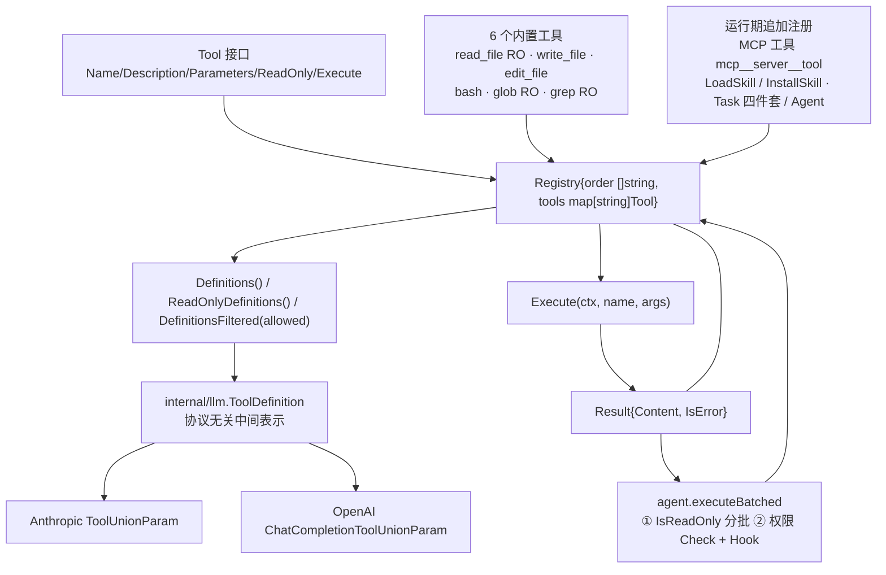

# 04 · 工具系统与执行编排

> 源码：`mewcode/internal/tool/` —— `tool.go`（59 行）、`registry.go`（144）、`read_file.go`（83）、`write_file.go`（68）、`edit_file.go`（103）、`bash.go`（143）、`glob.go`（160）、`grep.go`（195）、`filter.go`（122）、`load_skill.go`（76）、`install_skill.go`（104），共 11 个文件 1257 行（另有 `tool_test.go` 405 行）
> 一句话点题：**工具层是 Agent 的「手」——它把模型的意图变成确定性代码的执行，并且把一切失败都收敛成可回灌给模型的结构化观察值，而不是异常。**

---

## 一、这一章要回答什么

| 面试问题 | 本节位置 |
|---|---|
| Agent 的工具抽象长什么样？为什么是这五个方法？ | §3.1 / §3.2 |
| 工具失败了为什么不用 Go 的 `error`？错误怎么给模型看？ | §3.1 |
| 一个 `ReadOnly()` 怎么同时驱动「并发分组」和「Plan Mode 裁剪」？ | §3.3 |
| 一套工具定义怎么同时喂给 Anthropic 和 OpenAI？ | §3.7 |
| 六个内置工具的 schema、常量、错误文案分别是什么？ | §3.8–§3.13 |
| `edit_file` 为什么坚持「必须唯一匹配」而不是「替换第一处」？ | §3.10 |
| 工具输出爆了怎么办？谁负责截断？ | §3.14 |
| 子 Agent 怎么限制能看见哪些工具？Skill 怎么暴露给模型？ | §3.15 |
| 工具是串行还是并发？结果怎么回到模型？ | §3.16 |
| 这套工具层有哪些真实缺陷？面试官会从哪打？ | §4 |

---

## 二、项目在做什么

### 2.1 问题本质

LLM 本身只会**输出 token**。要让它「操作电脑」，工程上只需要回答三个问题：

1. **模型怎么知道有哪些工具？** → 把工具的 `name / description / JSON Schema` 转成 provider 协议里的 `tools` 字段。
2. **模型说「调 `read_file`」时，谁来执行？** → 一个按名查找的注册中心 + 一个执行入口。
3. **执行结果是成功还是失败、怎么让模型看见？** → 一个带 `IsError` 标记的结果对象，回灌进对话历史。

`internal/tool` 就是回答这三个问题的包。它的取舍是：**把「失败」当成数据而不是控制流**。

```go
// tool.go:1-3 —— 包注释即契约
// Package tool 提供统一的工具抽象与六个核心工具实现。
// 所有工具执行失败均以 Result{IsError:true} 返回，绝不 panic。
package tool
```

这一行注释定了整章 1257 行的基调：`internal/tool` 对外**不抛 Go error、不 panic**，所有失败路径都走同一个工厂函数 `errorResult`。

### 2.2 包内职责分区与依赖方向

| 文件 | 角色 | 关键导出 |
|---|---|---|
| `tool.go` | 契约层：接口 + 结果类型 + 截断工具 + 系统工具探测 | `Tool`、`Result`、`SystemTool`、`IsSystemTool` |
| `registry.go` | 注册中心：登记 / 查找 / 导出定义 / 执行 / 超时常量 | `Registry`、`NewDefaultRegistry`、`DefaultTimeout` |
| `read_file.go` `write_file.go` `edit_file.go` `bash.go` `glob.go` `grep.go` | 六个内置工具（全部是**无字段空结构体**） | 各自仅实现 `Tool` |
| `filter.go` | 子 Agent 的工具名过滤**策略 + 纯函数**（不是工具） | `ApplyAgentToolFilter`、三个白/黑名单常量 |
| `load_skill.go` `install_skill.go` | Skill 系统在工具面的两个入口（有状态工具） | `LoadSkillTool`、`InstallSkillTool` |

依赖方向（面试时值得主动说）：

- 只 import **标准库** + `internal/llm`（仅为了 `ToolDefinition` 这一个类型）+ `internal/skills`（仅两个 Skill 工具）。
- **不 import 任何 SDK**。Anthropic / OpenAI 的协议适配全在 `internal/llm` 完成，工具层对协议零感知。

### 2.3 工具全景



**注册中心是可扩展的**：`NewDefaultRegistry()` 只注册 6 个内置工具（`registry.go:135-143`），MCP 工具（`cmd/mewcode/main.go:79-81`）、Task 四件套与 Agent 工具（`internal/tui/tui.go:258-273`）、Skill 两件套（`internal/tui/tui.go:230-238`）都是**运行期在启动阶段追加注册**。

### 2.4 一次工具调用的完整生命周期

```
streamOnce 收到 []llm.ToolCall
  └─① executeBatched: registry.IsReadOnly(name) 分批（连续只读 → 并发批）
  └─② dispatchHook(PreToolUse)  → 可 Block（被拒项预填错误结果，不进 goroutine）
  └─③ permission.Engine.Check(mode, call, readOnly) → Allow / Ask / Deny
        └─ Ask → 人在回路：阻塞等 TUI 回传 DenyOnce/AllowOnce/AllowForever
  └─④ registry.Execute(ctx+30s, name, rawArgs) → 具体工具 t.Execute
  └─⑤ 工具返回 Result{Content, IsError} → 包装成 llm.ToolResult 写回 results[idx]
  └─⑥ dispatchHook(PostToolUse) → 按原始顺序 emit Start/End 事件
  └─⑦ conv.AddToolResults（保序、含被拒项）→ 下一轮模型看到 role:tool 消息
```

---

## 三、核心设计逐项拆解

### 3.1 结果类型：错误是观察值，不是异常

```go
// tool.go:12-16
// Result 工具执行结果——永远以值类型返回，从不返回 Go error。
type Result struct {
	Content string // 回灌给模型的文本（已截断/带行号等）
	IsError bool   // true 表示结构化错误，Content 即错误描述
}
```

- `Content` 直接成为 `llm.ToolResult.Content`（`agent/agent.go:883-887`、`agent.go:934-938`），最终进入 provider 的 tool_result 块。契约要求它**已经过面向模型可读性的预处理**（截断、带行号），不是原始 stdout。
- `IsError` 映射到 `llm.ToolResult.IsError`（`llm/provider.go:30-34`）。

统一工厂（**所有**错误路径都走它，1257 行里没有第二个构造错误的地方）：

```go
// tool.go:53-58
func errorResult(format string, args ...interface{}) Result {
	return Result{
		Content: fmt.Sprintf(format, args...),
		IsError: true,
	}
}
```

**同一份错误语义在两种协议下表达力不对等**：

| 协议 | 落点 | 后果 |
|---|---|---|
| Anthropic | `anthropic.NewToolResultBlock(tr.ToolCallID, tr.Content, tr.IsError)`（`anthropic.go:82`）→ SDK 的 `is_error` 字段 | 模型能明确区分「工具故障」与「工具正常返回失败信息」 |
| OpenAI | `toOpenAIMessages` 只传 `tr.Content`（`openai.go:84-87`），chat 协议没有对应字段 | 只能靠文案表达，`IsError` 信息丢失 |

> **面试官追问点**：为什么不用 Go 的 `(string, error)`？
> **答**：因为工具失败几乎都是**预期的业务失败**（文件不存在、正则非法、命令非零退出），必须原样回灌给模型让它自我纠错。Go 的 `error` 语义会诱导调用方 early-return、把错误抛给用户，直接破坏 ReAct 环。改成 `Result` 后，6 个工具各写一遍错误包装的重复代码也省掉了——统一走 `errorResult`。这与包注释「绝不 panic」（`tool.go:1-3`）是同一个设计意图。

### 3.2 Tool 接口：五个方法

```go
// tool.go:18-26
// Tool 统一工具抽象（F1）。
// 每个工具暴露名称、给模型看的描述、参数 Schema、执行入口、只读标记。
type Tool interface {
	Name() string               // 模型看到的工具名，如 "read_file"
	Description() string        // 给模型的用途说明
	Parameters() map[string]any // 手写 JSON Schema（type/properties/required/description）
	ReadOnly() bool             // true=只读工具（可并发执行 & Plan Mode 放行）
	Execute(ctx context.Context, args json.RawMessage) Result
}
```

| 方法 | 谁消费 | 设计要点 |
|---|---|---|
| `Name()` | 模型 + 注册中心 key（`registry.go:26-30`） | 6 个内置工具用 snake_case，`LoadSkillTool`/`InstallSkillTool` 用 PascalCase（`load_skill.go:23`、`install_skill.go:31`）——**这个不一致后来引发了一个真实缺陷**（§3.15） |
| `Description()` | 模型（进工具定义） | **工具选择率的第一抓手**。`edit_file` 与 `bash` 的 description 末尾都做了「行为约束式强化」：前者要求先 `read_file`（`edit_file.go:26-29`），后者要求优先用专用工具（`bash.go:31-34`） |
| `Parameters()` | 模型（进 JSON Schema） | **手写 map**，不用反射/代码生成。注释明确要求包含 `type/properties/required/description` |
| `ReadOnly()` | Agent 分批 + Plan Mode + 权限分类 | 双语义，见 §3.3 |
| `Execute()` | `Registry.Execute` | `args` 是模型原始参数串；所有实现都先把空 args 归一化为 `{}`（如 `read_file.go:40-42`），保证 nil 输入不炸 |

### 3.3 ReadOnly()：一个标志、两个正交需求

```go
// 6 个内置工具的取值
read_file = true    // read_file.go:20
write_file = false  // write_file.go:21
edit_file = false   // edit_file.go:22
bash = false        // bash.go:27
glob = true         // glob.go:23
grep = true         // grep.go:34
```

它同时服务两件语义上完全重合的事（「无副作用」）：**并发执行分组** + **Plan Mode 工具集裁剪**（外加第三件：权限分类）。真实调用方：

| 调用点 | 位置 | 用途 |
|---|---|---|
| `Registry.IsReadOnly(name)` | `registry.go:75-78` | 未知工具返回 `false`（保守） |
| `executeBatched` 分批 | `agent.go:537`、`agent.go:540` | 吃入「连续只读区间」并发跑；遇到 `false` 立即中断区间转串行 |
| `ReadOnlyDefinitions()` | `registry.go:59-72` | Plan Mode 只导出只读工具 |
| Agent Plan Mode 取工具集 | `agent.go:207-211` | `mode == ModePlan` → 只读定义集 |
| 子 Agent Plan Mode | `run_to_completion.go:82-88` | 同上（优先级高于白名单） |
| `/compact` 手动压缩 | `tui/commands.go:98-103` | 传给 `RunForceCompact`，保持与请求一致的工具定义 |
| 权限分类 | `permission/engine.go:101-102` → `settings.go:89-102` | `categorize(internal, readOnly)`：`readOnly==true` → `CategoryRead`，直接 Allow |

扩展工具同规则：`LoadSkillTool = true`（`load_skill.go:45`）、`InstallSkillTool = false`（`install_skill.go:53`，因为写盘 + 联网）、MCP 工具取 `annotations.readOnlyHint`（`mcp/tool.go:49,136`）、`TaskListTool/TaskGetTool = true`、`TaskStopTool/SendMessageTool/AgentTool = false`（`task/tools.go:22,69,134,177`、`agent_tool.go:131`）。

> **面试官追问**：一个 `bool` 够吗？
> **答**：现在够，因为三个判断的语义都是「无副作用」。不够的地方是**无法表达细分能力**——比如「只读但是远程调用，并发是否安全无法声明」（MCP 只读工具只能直接照抄 `readOnlyHint`）、「可并发但不幂等」、「只读但很慢」。企业级做法是用能力位 `Capabilities() ToolCaps`（ReadOnly / Idempotent / Destructive / Network）。本项目把它压成一个 bool 的收益是：实现者只需写一行，漏写的概率低；代价是表达力上限。

### 3.4 SystemTool：用可选接口做能力探测

```go
// tool.go:41-51
// SystemTool 可选接口：实现此接口的工具标记为系统工具。
// 系统工具在工具过滤时总是可见，不受白名单约束。
type SystemTool interface {
	IsSystem() bool
}

// IsSystemTool 检测一个工具是否为系统工具。
func IsSystemTool(t Tool) bool {
	st, ok := t.(SystemTool)
	return ok && st.IsSystem()
}
```

用**类型断言**而不是给 `Tool` 接口加第六个方法——只有极少数实现关心这件事，接口保持最小。唯一实现是 `LoadSkillTool`（`load_skill.go:47-48`），唯一消费点是 `DefinitionsFiltered`（`registry.go:108`）。

这个设计的代价在 §4 会讲：豁免逻辑只存在于「定义导出」这一层，而子 Agent 走的是「名字列表」过滤，导致豁免在子 Agent 路径上失效。

### 3.5 truncate：行数 + 字节数双闸门

```go
// tool.go:28-39
// truncate 对字符串做行数和字符数双重截断，超出尾部加 [truncated] 标注。
func truncate(s string, maxLines, maxChars int) string {
	lines := strings.Split(s, "\n")
	if len(lines) > maxLines {
		lines = lines[:maxLines]
		s = strings.Join(lines, "\n") + "\n[truncated]"
	}
	if len(s) > maxChars {
		s = s[:maxChars] + "\n[truncated]"
	}
	return s
}
```

两个必须记住的细节：

1. 用的是 `len(s)`（**字节**）而不是 rune 数 → 切片可能落在多字节字符中间，**产出非法 UTF-8**（§4 会展开）。
2. 若先触发行截断、再触发字节截断，第一个 `[truncated]` 会被第二次切片连同尾部一起切掉——语义上没问题，但「标记数」不固定。

全包只有 **2 个调用点**：`read_file.go:80`、`bash.go:116`。

### 3.6 注册中心：稳定顺序 + 无锁

```go
// registry.go:12-13
// DefaultTimeout 单个工具执行的默认超时（N1，不可配）。
const DefaultTimeout = 30 * time.Second

// registry.go:15-19
// Registry 集中登记工具、按名查找、导出定义、按名执行。
type Registry struct {
	order []string // 保持注册顺序，导出稳定
	tools map[string]Tool
}

// registry.go:21-31
// Register 注册一个工具。同名后注册覆盖先注册。
func (r *Registry) Register(t Tool) {
	if r.tools == nil { r.tools = make(map[string]Tool) }
	name := t.Name()
	if _, exists := r.tools[name]; !exists {   // 首次见到才追加 → 覆盖不改变导出顺序
		r.order = append(r.order, name)
	}
	r.tools[name] = t
}
```

- **惰性初始化 map**：零值 `Registry{}` 可直接用（`if r.tools == nil` 那三行）。
- `order` 只在**首次**见到该名字时追加 → **同名覆盖不改变导出顺序**。导出的工具定义序列在整个进程生命周期内稳定。这不是洁癖：**Anthropic 的 prompt 前缀缓存**要求前缀逐字节一致，而 `cache_control` 打在 system 块上（`anthropic.go:123-137`），工具定义紧随其后——顺序一抖动，缓存前缀就废了。
- 查询与导出：`Count()` / `Get()`（`registry.go:34-42`）、`Definitions()`（`registry.go:45-56`）、`ReadOnlyDefinitions()`（`registry.go:59-72`）、`DefinitionsFiltered(allowed)`（`registry.go:94-125`）、`Names()`（`registry.go:128-132`，拷贝一份给 `ApplyAgentToolFilter` 的 `All` 入参用，`agent_tool.go:173`）。

`DefinitionsFiltered` 的过滤语义（子 Agent 走这条）：

```go
// registry.go:94-125（摘要）
func (r *Registry) DefinitionsFiltered(allowed []string) []llm.ToolDefinition {
	if len(allowed) == 0 {
		return r.Definitions()      // 空 = 不收窄
	}
	for _, name := range r.order {
		t := r.tools[name]
		if IsSystemTool(t) || allowedSet[t.Name()] {   // 系统工具豁免：无条件放行
			defs = append(defs, llm.ToolDefinition{Name: t.Name(), Description: t.Description(), InputSchema: t.Parameters()})
		}
	}
	return defs
}
```

**有没有锁：没有。** 整个 `registry.go` 无 `sync` import。它之所以在运行期安全，依赖两条前提：

1. **注册只发生在启动期**（`main.go` 装配 + `tui.go` 构造），此后 `tools`/`order` 只读；
2. 读侧只有 map 查找与 slice 遍历，无写。

结论：**`Registry` 本身不是并发安全的类型，但「启动期写 + 运行期读」的用法是并发安全的**。若将来支持运行期热注册（例如 MCP server 动态上线新工具），必须自己加锁——源码未体现。

`Execute` 作为方法无共享状态，并发调用安全：

```go
// registry.go:80-90
// Execute 按名查找工具并执行。未知工具兜底为 IsError。
func (r *Registry) Execute(ctx context.Context, name string, args json.RawMessage) Result {
	t, ok := r.Get(name)
	if !ok {
		return Result{
			Content: fmt.Sprintf("未知工具: %s", name),
			IsError: true,
		}
	}
	return t.Execute(ctx, args)
}
```

注意：这只是**第一道**未知工具防线。Agent 层还有「连续整轮未知工具」熔断（`maxUnknownRun = 3`，`agent.go:372-376`、`agent.go:394-400`；子 Agent 为 2，`run_to_completion.go:20`），依赖 `allUnknown`（`agent.go:1024-1035`）判定。

### 3.7 Definitions：一份定义喂两家协议

协议无关的中间表示只有三个字段：

```go
// llm/provider.go:36-41（摘要）
type ToolDefinition struct {
	Name        string
	Description string
	InputSchema map[string]any
}
```

导出发生在 `registry.go:49-53`：`Name` / `Description` / `InputSchema: t.Parameters()` 原样搬运。

**Anthropic 路径**（`llm/anthropic.go:16-31`）：

```go
func toAnthropicTools(tools []ToolDefinition) []anthropic.ToolUnionParam {
	result := make([]anthropic.ToolUnionParam, 0, len(tools))
	for _, t := range tools {
		schema := anthropic.ToolInputSchemaParam{
			Properties: t.InputSchema["properties"],          // 只取 properties
			Required:   toStrings(t.InputSchema["required"]), // 只取 required
		}
		tool := anthropic.ToolParam{Name: t.Name, Description: anthropic.String(t.Description), InputSchema: schema}
		result = append(result, anthropic.ToolUnionParam{OfTool: &tool})
	}
	return result
}
```

关键点：Anthropic SDK 的 `ToolInputSchemaParam` 结构是「`Type` 固定 object + `Properties` + `Required`」，所以**顶层只取 `properties` 与 `required` 两个 key**，`"type":"object"` 由 SDK 自己补。

`toStrings`（`anthropic.go:33-54`）同时兼容 `[]string` 与 `[]interface{}`——因为手写 schema 给的是 `[]string{"path"}`（`read_file.go:34`），而经过 JSON 反序列化的 schema 会是 `[]interface{}`，两种形态都要吃得下。

**OpenAI 路径**（`llm/openai.go:18-28`）：

```go
func toOpenAITools(tools []ToolDefinition) []openai.ChatCompletionToolUnionParam {
	result := make([]openai.ChatCompletionToolUnionParam, 0, len(tools))
	for _, t := range tools {
		result = append(result, openai.ChatCompletionFunctionTool(shared.FunctionDefinitionParam{
			Name:        t.Name,
			Description: openai.String(t.Description),
			Parameters:  shared.FunctionParameters(t.InputSchema), // 整块 map 透传
		}))
	}
	return result
}
```

**差异结论**：目前 6 个工具只用了 `type/properties/required/description` 四个关键字，两条路径**等价**。一旦将来在 `Parameters()` 里加顶层关键字（`additionalProperties`、顶层 `oneOf`、`$ref`），**OpenAI 会生效、Anthropic 会被静默丢弃**——源码未体现任何兼容处理或告警。

这个风险不是假想的：MCP 工具的 schema 是**透传**的（`mcp/tool.go:127-128` 直接 `json.Marshal(t.InputSchema)`），可能包含本项目从未测试过的关键字。

### 3.8 read_file：行号 + 双闸门截断

**参数 schema（`read_file.go:25-36`）**：`path: string`（required，描述「要读取的文件路径」）——**只有 `path` 一个参数**。

没有 `offset` / `limit` 分页，也没有 `max_lines` 逃生口——这是与 Claude Code `Read` 最大的能力差（详见 §6）。

**实现要点**

```go
// read_file.go:52-62 三种失败分流
info, err := os.Stat(a.Path)
if err != nil {
	if os.IsNotExist(err) {
		return errorResult("文件不存在: %s", a.Path)
	}
	return errorResult("无法读取文件: %v", err)
}
if info.IsDir() {
	return errorResult("路径是目录而非文件: %s", a.Path)
}
```

```go
// read_file.go:64-80 读 → 加行号 → 截断
data, err := os.ReadFile(a.Path)
...
lines := strings.Split(string(data), "\n")
for i := range lines {
	lines[i] = fmt.Sprintf("%6d\t%s", i+1, lines[i])
}
content := strings.Join(lines, "\n")

const maxLines = 2000
const maxChars = 256 * 1024
content = truncate(content, maxLines, maxChars)
```

- `os.Stat` 先行 → 区分「不存在」「是目录」「其它」三种，错误文案对模型是**可执行信息**（而不是「an error occurred」）。
- 行号格式 `%6d\t`（cat -n 风格）：宽度不足 6 位时左侧补空格。它存在的意义是给 `edit_file` 的 `old_string` 定位提供共同锚点，并让模型能在回答里引用行号。
- **先全量读入内存再截断**：`os.ReadFile` 没有上限，256KB 上限只作用于「已加行号的字符串」，所以读一个 2GB 文件的内存峰值就是 2GB。源码未体现 `io.LimitReader` 或 `os.Stat().Size()` 预检。
- `strings.Split(s, "\n")`：文件以换行结尾时会产生尾部空元素 → **多出一行带行号的空行**（`tool_test.go:89-94` 就是按这个断言行号的）。

| 项 | 值 |
|---|---|
| `ReadOnly()` | `true`（`read_file.go:20`） |
| 硬编码常量 | `maxLines = 2000`、`maxChars = 256*1024`（`read_file.go:78-79`） |
| 成功返回 | 带行号文本（`IsError` 零值 false） |
| 错误文案 | `参数 path 不能为空` / `参数解析失败: %v` / `文件不存在: %s` / `路径是目录而非文件: %s` / `无法读取文件: %v` / `读取文件失败: %v` |

### 3.9 write_file：无条件覆盖 + 自动建目录

**参数 schema（`write_file.go:26-41`）**：`path: string` + `content: string`，`required: ["path","content"]`。

```go
// write_file.go:56-67
// 创建父目录
dir := filepath.Dir(a.Path)
if err := os.MkdirAll(dir, 0o755); err != nil {
	return errorResult("创建父目录失败: %v", err)
}

// 写入文件
if err := os.WriteFile(a.Path, []byte(a.Content), 0o644); err != nil {
	return errorResult("写入文件失败: %v", err)
}

return Result{Content: fmt.Sprintf("已写入 %s（%d 字节）", a.Path, len(a.Content))}
```

四个设计事实，面试时都能展开：

1. **覆盖语义**：无条件整文件覆盖。没有「文件已存在则先读」的检查、没有备份、没有 diff 预览，也不进 `RecoveryState`（对比 `read_file` 会进，§3.16）。
2. **父目录自动创建**（`MkdirAll` 0755，`tool_test.go:157-172` 覆盖嵌套路径场景）。副作用是**模型写错一层目录也会静默创建出目录树**，而不是报错让模型重想。
3. **权限位固定 0644**——与 `edit_file` 保留原权限（`edit_file.go:92-97`）**不一致**。覆盖一个原本 0600 的敏感文件会把它放宽到 0644（还受 umask 影响）。源码未体现权限保留或显式 `O_CREATE|O_TRUNC` 控制。
4. 成功文案里的 `%d 字节` 是 `len(a.Content)`（**UTF-8 字节数**），中文内容会显示约 3 倍字符数的值。

没有内容大小上限：模型一次能写多大，实际上限来自 provider 的 `MaxTokens: 4096`（`anthropic.go:172`）。

### 3.10 edit_file：唯一匹配替换原语（本章最该讲透的一节）

**参数 schema（`edit_file.go:31-50`）**

```go
"properties": map[string]any{
	"file_path":  map[string]any{"type": "string", "description": "要编辑的文件路径"},
	"old_string": map[string]any{"type": "string", "description": "要在文件中定位并替换的文本"},
	"new_string": map[string]any{"type": "string", "description": "替换为新文本"},
},
"required": []string{"file_path", "old_string", "new_string"},
```

注意 `file_path` 与其它工具的 `path` **命名不一致**（刻意对齐 Claude Code 风格）。这个不一致在权限层引发了一个跨模块缺陷，§4 详述。

**核心原语：`Count` 判定 + 唯一时才替换**

```go
// edit_file.go:68-90
// 安全检查: 路径不能包含 .. 越界
if strings.Contains(a.FilePath, "..") {
	return errorResult("安全限制: file_path 不支持路径穿越")
}
content, err := os.ReadFile(a.FilePath)
...
text := string(content)

// 检查 old_string 唯一性
count := strings.Count(text, a.OldStr)
if count == 0 {
	return errorResult("未找到匹配: old_string 在文件中不存在")
}
if count > 1 {
	return errorResult("old_string 在文件中不唯一: 出现 %d 次——请用 read_file 查看文件，选择唯一匹配片段", count)
}

// 执行替换（仅第一处——唯一时等价于唯一替换）
newText := strings.Replace(text, a.OldStr, a.NewStr, 1)
```

```go
// edit_file.go:92-100 保留文件权限写回
info, _ := os.Stat(a.FilePath)
perm := os.FileMode(0644)
if info != nil {
	perm = info.Mode().Perm()
}
if err := os.WriteFile(a.FilePath, []byte(newText), perm); err != nil {
	return errorResult("写入文件失败: %v", err)
}
```

逐条拆解这个原语的设计意图：

| 设计点 | 说明 |
|---|---|
| **唯一性强制** | `count > 1` 不是「替换第一处」，而是**报错并要求模型缩小范围**——把「如何消歧」的决策推回给模型 |
| **错误文案即修复指令** | `请用 read_file 查看文件，选择唯一匹配片段`（`edit_file.go:86`）。这是「工具设计承担纠错教学」的典型：错误信息不描述问题，而规定下一步动作 |
| **为何 `Replace(..., 1)`** | 唯一时「替换全部」与「替换一处」等价，用 1 更直观（源码注释明写） |
| **权限保留** | `os.Stat` 取原 mode，失败则回退 0644；`info, _ :=` 刻意忽略错误 |
| **完全字节匹配** | `old_string` 必须与文件字节一致（含 `\r\n`、缩进、尾随空格）。无 CRLF 归一化、无空白宽松匹配、无 fuzzy 匹配、无 `replace_all` 参数 |
| **`new_string` 可为空串** | 只校验了 `file_path` 与 `old_string` 非空（`edit_file.go:61-66`）→ 可以纯删除 |
| **成功文案极简** | 固定 `文件 %s 已编辑: 1 处替换`（`edit_file.go:102`）——**不返回 diff、不返回改动后的上下文**。模型要复核必须再 `read_file`，多一轮往返 |

**读-改-写非原子**：`os.ReadFile` → 内存替换 → `os.WriteFile`，中间没有锁、没有 mtime/哈希校验。两个后果：① 外部进程在窗口期内改文件会被**静默覆盖**；② 同一轮里两个并发 `edit_file` 打同一文件会丢更新。不过 agent 层把非只读工具串行化了（`agent.go:657+`），同轮不会并发；**跨轮 / 跨进程仍无保护**。

**工具层唯一的路径校验**是那行 `strings.Contains(a.FilePath, "..")`，它有两个问题（§4 展开）：子串判断而非路径分段判断（`pkg/a..go` 这类合法文件名被误杀），以及给 `edit_file` 一种「已设防」的错觉——`read_file`/`write_file` 完全没有同类检查。

| 项 | 值 |
|---|---|
| `ReadOnly()` | `false`（`edit_file.go:22`） |
| 错误文案（7 条） | `参数 file_path 不能为空` / `参数 old_string 不能为空` / `参数解析失败: %v` / `安全限制: file_path 不支持路径穿越` / `未找到匹配: old_string 在文件中不存在` / `old_string 在文件中不唯一: 出现 %d 次——请用 read_file 查看文件，选择唯一匹配片段` / `读取文件失败: %v` / `写入文件失败: %v` |
| 对应测试 | `tool_test.go:196-250` |

> **面试官追问**：为什么坚持唯一匹配，不怕多花 token 吗？
> **答**：怕，但更怕静默的错编辑。重复样板代码里「替换第一处」会改错地方且**没有任何信号**——模型以为成功了，下一轮读到的却是别处的代码，错误会级联。唯一性报错的代价是「模型要多构造几个字符的上下文」，收益是「错编辑的概率被压到接近零」。这是把**正确性放在 token 成本之前**的取舍，和 Aider 的 fuzzy 策略是相反的取向（§6）。

### 3.11 bash：整个工具包风险最集中的地方

**参数 schema（`bash.go:36-59`）**：`command: string`（required）+ `description: string`（「命令用途说明」）+ `timeout: integer`（描述写「超时(毫秒)，默认 120000」）+ `workdir: string`。

`description` 字段被声明但**执行时完全未使用**——`Execute` 只读 `Command/Timeout/Workdir`（`bash.go:66-90`）。源码未体现它进入 `ToolEvent.Args`（`argPreview` 只 prefer `path/command/pattern/old_string`，`agent.go:1068`）。这是一个**schema 里的死参数**：让模型为一个不生效的字段分配注意力。

**实现要点**

```go
// bash.go:74-98
timeout := time.Duration(a.Timeout) * time.Millisecond
if a.Timeout <= 0 {
	timeout = 120 * time.Second
}

ctx, cancel := context.WithTimeout(ctx, timeout)
defer cancel()

// 安全检查: workdir 不能使用绝对路径或路径穿越
if a.Workdir != "" {
	if filepath.IsAbs(a.Workdir) || strings.Contains(a.Workdir, "..") {
		return errorResult("安全限制: workdir 不支持绝对路径或路径穿越")
	}
}

cmd := exec.CommandContext(ctx, "sh", "-c", a.Command)
cmd.Dir = a.Workdir

// 不继承环境变量（N5: 密钥不泄漏）
cmd.Env = []string{
	"HOME=" + os.Getenv("HOME"),
	"PATH=" + os.Getenv("PATH"),
	"USER=" + os.Getenv("USER"),
	"TERM=" + os.Getenv("TERM"),
}
```

```go
// bash.go:100-142 输出合并 → 截断 → 分层错误语义
var stdout, stderr bytes.Buffer
err := cmd.Run()

output := stdout.String()
if stderr.Len() > 0 {
	if output != "" { output += "\n" }
	output += stderr.String()
}

output = strings.TrimSpace(output)
output = truncate(output, 200, 8000)

if err != nil {
	if ctx.Err() == context.DeadlineExceeded {
		return errorResult("命令超时: %s", err)          // IsError = true
	}
	exitCode := -1
	if exitErr, ok := err.(*exec.ExitError); ok { exitCode = exitErr.ExitCode() }
	return Result{Content: fmt.Sprintf("exit_code: %d\n%s", exitCode, output), IsError: false}
}
if output == "" { output = "(无输出)" }
return Result{Content: "exit_code: 0\n" + output}
```

**硬编码常量**：内置默认超时 `120 * time.Second`；截断 `truncate(output, 200, 8000)` → **200 行 / 8000 字节**（`bash.go:116`）；固定 `sh -c`（不是 `bash -c`，也不是用户的 `$SHELL`）；env 白名单固定 4 个变量。

**错误语义分层（刻意不同，这是本章最能体现「工具即观察」的地方）**：

| 情形 | `IsError` | Content 形态 | 为什么 |
|---|---|---|---|
| 超时（`DeadlineExceeded`） | **true** | `命令超时: %s` | 超时意味着「没拿到有效观察」，需要模型改变策略（拆命令/换命令） |
| 非零退出码 | **false** | `exit_code: 1\n<output>` | 编译错误、测试失败、`grep` 没匹配（返回 1）都是**模型正常工作输入**，不是工具故障 |
| 拿不到退出码（如 `cmd.Dir` 不存在导致 fork 失败） | **false** | `exit_code: -1\n命令执行失败: %v` | 同上 |
| 成功 | false | `exit_code: 0\n<output>` | — |

`tool_test.go:289-304` 对这个语义做了「两种都接受」的宽松断言——说明作者自己也知道这是权衡点。

**超时双轨（重要坑）**：agent 每次执行都先套 `context.WithTimeout(ctx, tool.DefaultTimeout)`（30s，`agent.go:608`、`agent.go:879`、`agent.go:930`、`agent.go:1004`），bash 内部再派生（120s）。`context` 的语义是**取最紧的 deadline**：

```
实际生效上限 = min(30s, 模型给的 timeout) = 30s
```

**模型把 `timeout` 调到 60000 或更大不会生效**，而 schema 描述里仍写着「默认 120000」→ 文档与行为不一致。只有绕过 agent 直接调 `Execute` 才能吃到 120s（`tool_test.go:256-272` 就是直接调）。

**其它输出语义细节**：

- stdout 与 stderr **合并**（stdout 在前，空行分隔）→ 模型无法区分两者；截断发生在合并之后 → 输出爆长时**被切掉的总是 stderr 尾部**。
- `strings.TrimSpace` 吃掉首尾空白（对 `xxd`、`od` 这类依赖前导对齐的输出有损）。
- 用户取消（`context.Canceled`）**不**等于 `DeadlineExceeded` → 落入非零退出分支，`exit_code: -1`、`IsError=false`；不过 agent 在批处理层面会先把结果替换为 `noticeCancelled` 并终止循环（`agent.go:523-535`、`agent.go:965-976`），所以这个细节通常不外显。

**安全考量**：

1. **无命令注入防护，也不需要**：`command` 本身就是交给 `sh -c` 的任意程序（`bash.go:89`），不存在「把用户输入拼进命令模板」的二次注入面。真正的防护在权限层：命令串黑名单（`permission/blacklist.go:10-40`，10 条正则：`rm -rf /`、`dd of=/dev/sd*`、fork 炸弹、`mkfs.`、`> /dev/sd*`、`chmod -R 777 /etc` 等）+ 三段规则引擎 + 模式矩阵。
2. **黑名单有前提**：仅在 `cat == CategoryExec && target != ""` 时生效（`engine.go:106-109`）——`extractTarget` 解析不出 command 时 `target=""`，黑名单被完全跳过（`settings.go:148-158`）。绕过黑名单的常规手法（base64 解码执行、变量拼接、`python -c`）源码层完全没覆盖（黑名单自陈「启发式、非完备」）。
3. **环境变量白名单**：只传 `HOME/PATH/USER/TERM` → 兑现「密钥不泄漏」（N5）。代价：`GOPROXY`/`HTTP_PROXY`/`JAVA_HOME`/`NODE_OPTIONS`/`GOPATH` 全部丢失，模型跑 `go build`/`npm install` 的行为可能和用户终端不一致（离线/内网环境尤其明显），且报错信息对模型来说是「莫名网络失败」。
4. **无沙箱**：无容器、无 namespace、无 seccomp、无 rlimit、无网络隔离。命令以当前用户身份全权限运行，唯一约束是黑名单 + 审批 + 30s 超时。
5. **超时后子进程可能残留**：`exec.CommandContext` 杀的是直接子进程（`sh`），源码未体现 `SysProcAttr.Setpgid` + 进程组 Kill → `sh -c "sleep 100 &"` 或后台服务的孙子进程可能继续存活。
6. **`workdir` 校验不对称**：只校验 `IsAbs` 与子串 `..`，**不校验「是否在项目根内」**（权限层 `extractTarget` 覆盖 bash 时取的是 `command` 而非 `workdir`）。且 `workdir` 是相对**当前进程 cwd** 解析的，不是相对项目根。

### 3.12 glob：自实现 `**` 的分段递归 DP

**参数 schema（`glob.go:28-43`）**：`pattern: string`（required）+ `path: string`（搜索起始路径，默认 `.`）。

```go
// glob.go:64-96 遍历（WalkDir 回调，摘要）
err := filepath.WalkDir(root, func(path string, d fs.DirEntry, err error) error {
	select {                                  // 每个目录项都检查 ctx 取消
	case <-ctx.Done(): return ctx.Err()
	default:
	}
	if err != nil { return nil }              // 跳过无法访问的路径

	if d.IsDir() && strings.HasPrefix(d.Name(), ".") && d.Name() != "." {
		return fs.SkipDir                     // 跳过隐藏目录
	}
	if d.IsDir() { return nil }

	relPath, err := filepath.Rel(root, path)  // 匹配对象是「相对 root 的路径」
	if err != nil { relPath = path }

	if matchGlob(a.Pattern, relPath) { matches = append(matches, relPath) }
	return nil
})
```

```go
// glob.go:102-113 无匹配 / 排序 / 截断
if len(matches) == 0 {
	return Result{Content: fmt.Sprintf("无匹配到模式 %s 的文件", a.Pattern)}   // 无匹配不是错误
}
sort.Strings(matches)
if len(matches) > 100 {
	matches = matches[:100]
	matches = append(matches, "[truncated]")
}
return Result{Content: strings.Join(matches, "\n")}
```

**`**` 匹配为什么必须自己写**：标准库 `filepath.Match` 不支持 `**`。

```go
// glob.go:118-159
func matchGlob(pattern, path string) bool {
	pattern = filepath.ToSlash(pattern)   // Windows 兼容归一
	path = filepath.ToSlash(path)
	return matchSegments(strings.Split(pattern, "/"), strings.Split(path, "/"))
}

func matchSegments(pat, path []string) bool {
	if len(pat) == 0 { return len(path) == 0 }
	if len(pat) == 1 && pat[0] == "**" { return true }    // 剪枝 1
	if len(path) == 0 { /* pat 只剩 ** 则 true */ }        // 剪枝 2
	if pat[0] == "**" {
		// ** 匹配 0 层（跳过 **）或 1+ 层（跳过 path 首段）
		return matchSegments(pat[1:], path) || matchSegments(pat, path[1:])
	}
	matched, _ := filepath.Match(pat[0], path[0])         // error 被 _ 吞掉
	return matched && matchSegments(pat[1:], path[1:])
}
```

- 逐段递归展开，`**` 有两种分支（吃掉 0 段 / 吃掉 1 段），单段交给 `filepath.Match`。**不支持 `{a,b}` 花括号展开**，且 `filepath.Match` 的 error 被丢弃（`matched, _ :=`）→ `[` 未闭合这类非法 pattern **静默匹配失败而不是报错**。
- 匹配对象是**相对 root 的路径**：`*.go` 只匹根层、`**/*.go` 才能递归——与用户直觉常不符，description 里给了例子。
- 结果上限 **100** + 追加 `[truncated]` 元素；跳过 `.` 开头的**目录**（注意只跳目录，`.gitignore` 这类隐藏**文件**仍会出现在 `**/*` 结果里）；无 `maxDepth`、无结果大小上限（只限条数）。
- **无匹配不是错误**：返回普通 `Result`，`tool_test.go:339-352` 明确断言 `IsError == false`。
- 遍历出错（唯一来源是 ctx 取消 → `ctx.Err()`）→ `遍历文件失败: %v`（`IsError=true`，`glob.go:98-100`）。单个路径访问错误被静默吞掉（`return nil`，`glob.go:72-74`）。
- 安全：`filepath.WalkDir` 使用 `Lstat` 语义，**不跟随目录符号链接** → 不会因链接逃出 root。但 `path` 参数本身可以是任意目录（含绝对路径 `"/"`），**工具层没有任何 root 约束**，只有权限层 `sandboxOK`（`extractTarget` 对 glob/grep 的 `path` 做文件类校验，`settings.go:134-146`，空值默认 `"."`）。

### 3.13 grep：RE2 + 三层限额 + 提前退出

**参数 schema（`grep.go:39-58`）**：`pattern: string`（「搜索的正则表达式（RE2 语法）」，required）+ `path: string` + `glob: string`（文件名过滤，如 `*.go`）。

```go
// grep.go:73-86 编译 + 限额
re, err := regexp.Compile(a.Pattern)
if err != nil { return errorResult("正则表达式无效: %v", err) }
root := a.Path
if root == "" { root = "." }

var matches []grepMatch
maxResults := 100
longLineWarned := false
```

```go
// grep.go:99-126 遍历 + 过滤 + 提前退出
if d.IsDir() && strings.HasPrefix(d.Name(), ".") && d.Name() != "." {
	return fs.SkipDir
}
if d.IsDir() { return nil }

if a.Glob != "" {                                 // 文件名过滤
	matched, _ := filepath.Match(a.Glob, d.Name())
	if !matched { return nil }
}

if len(matches) >= maxResults {                    // 够了就停，不是先收集再截断
	return fs.SkipAll
}

relPath, _ := filepath.Rel(root, path)
fileMatches := grepFile(re, path, relPath, &longLineWarned, maxResults-len(matches))
matches = append(matches, fileMatches...)
```

```go
// grep.go:160-192 单文件扫描
scanner := bufio.NewScanner(f)
// 设置 1MB 缓冲区限制，超出则标注
scanner.Buffer(make([]byte, 0, 64*1024), 1*1024*1024)

lineNum := 0
for scanner.Scan() {
	lineNum++
	line := scanner.Text()
	if re.MatchString(line) {
		if len(line) > 500 {          // 截断超长行
			line = line[:500] + "..."
		}
		matches = append(matches, grepMatch{relPath, lineNum, line})
		if len(matches) >= max { return matches }
	}
}
if scanner.Err() != nil && !*longLineWarned {
	*longLineWarned = true
}
```

```go
// grep.go:137-156 渲染（排序 → 前缀标注 → 去尾换行）
sort.Slice(matches, func(i, j int) bool {          // 文件名字典序 + 行号升序
	if matches[i].file != matches[j].file { return matches[i].file < matches[j].file }
	return matches[i].lineNum < matches[j].lineNum
})
for _, m := range matches {
	fmt.Fprintf(&out, "%s:%d: %s\n", m.file, m.lineNum, m.content)
}
if len(matches) >= maxResults { out.WriteString("[truncated]\n") }               // 假阳性见 §4.10
if longLineWarned { out.WriteString("[warning: 部分超长行被跳过，搜索结果可能不完整]\n") }
return Result{Content: strings.TrimRight(out.String(), "\n")}
```

| 项 | 值 |
|---|---|
| `maxResults` | 100（`grep.go:85`） |
| 单行截断 | `> 500` → 前 500 + `"..."`（`grep.go:179-181`） |
| scanner 缓冲 | 初始 64KB，行长上限 1MB（`grep.go:171`） |
| 排序 | 文件名**字典序** + 行号升序（**未按相关性排序**，命中多的文件不会靠前） |
| 无命中 | 不是错误：`未找到匹配 %s 的内容`（`tool_test.go:378-392`） |
| 非法正则 | `正则表达式无效: %v`（`IsError=true`，`tool_test.go:394-404`） |

**语义陷阱与安全考量**：

- 正则引擎是 Go 的 `regexp`（**RE2**，线性时间、无回溯）→ 天然免疫 ReDoS（模型可以随便写恶意正则），代价是不支持反向引用与 lookaround。description 里明确告诉模型「RE2 语法」，减少无效调用。
- **二进制文件无跳过**：源码未体现 NUL 字节检测或扩展名黑名单 → 扫到二进制会产出乱码行，污染上下文。
- **`[truncated]` 可能是假阳性**：条件写的是 `len(matches) >= maxResults`（`grep.go:149`），当命中数**恰好=100 且全库再无其它命中**时也会打标记；与 glob 的 `> 100` 严格判断不一致。
- 超长行警告的置位条件是「`scanner.Err() != nil`」（`grep.go:190-192`）——**任何** scanner 错误（含读取中途 I/O 错误、1MB 行长溢出）都置位同一句文案，精度有限。
- 逐行匹配（`re.MatchString(line)`）→ **不支持跨行正则**，也没有 `-i`、`-w`、`-A/-B/-C` 上下文行、`-v` 反选。
- ctx 检查同样在目录项粒度（`grep.go:89-93`）；文件句柄靠 `defer f.Close()`（`grep.go:167`），串行遍历下任一时刻只开一个。

### 3.14 输出截断策略：两道闸门，五种口径

截断不是一个函数，而是**一套分层的 token 预算工程**。工具层管「单次观察的卫生」，`compact` 层管「历史累积的卫生」：

| 层 | 位置 | 常量 | 行为与动机 |
|---|---|---|---|
| 通用 | `tool.go:29-39` | 调用方给 `maxLines`、`maxChars` | 先按行、再按字节；尾部追加 `\n[truncated]` |
| read_file | `read_file.go:78-80` | `2000` 行 / `256*1024` 字节 | 2000 行是「整文件编辑器视图」的惯例上限；256KB 兜底防单行巨长文件 |
| bash | `bash.go:115-116` | `truncate(output, 200, 8000)` | 命令输出极易爆炸（`cat` 大文件、日志、`go test ./...`）；200 行/8KB 保留「够判断成败的上下文」 |
| glob | `glob.go:106-111` | `>100` → 截前 100 + `[truncated]` | 条数上限；先 `sort.Strings` → 截断结果**确定可复现**（对测试与缓存友好） |
| grep | `grep.go:85,117-119,149-151` | `maxResults=100` | 条数上限；配合 `fs.SkipAll` **提前终止遍历**（不是先收集再截） |
| grep 行内 | `grep.go:179-181` | `>500` → 前 500 + `"..."` | minify 的 JS、一行超长 JSON 会让「一行命中」吃掉整个预算 |
| grep 行长 | `grep.go:171,190-192` | 1MB（初始 64KB） | 防单行撑爆内存；超限置位并输出 `[warning: 部分超长行被跳过，搜索结果可能不完整]` |
| glob/grep 目录 | `glob.go:77-79`、`grep.go:100-102` | 跳过 `.` 开头目录 | 不是截断但属于「裁剪」：不进入 `.git`/`.cache` |
| agent 事件摘要 | `agent.go:1072-1074` | 60 字符 | `argPreview` 只给 TUI 显示 `● tool(args)` |
| agent 结果摘要 | `agent.go:1089-1096` | 8 行 + `...` | `truncateLines` 作用在 `ToolEvent.Result` 上——**只影响 UI，不影响回灌给模型的 Content**（容易看错） |
| compact 单条 | `compact/const.go:7,9` | 50000 字节 / 聚合 200000 字节 | 超阈值 → 落盘 `SpillDir/<tool_use_id>`，用 `[content offloaded] original size: %d bytes` + `[saved to] <path>` + 前 20 行/2048 字节预览替换（`layer1.go:24-45`） |
| compact 预览 | `compact/const.go:44-45` | 20 行 / 2048 字节 | `headPreview`（`layer1.go:23-34`） |
| compact 恢复段 | `compact/const.go:24-25` | 最近 5 个文件 × 5000 token | 摘要后重挂「最近读过的文件」+ 当前工具列表（`recovery.go:19-45`） |

**为什么这么设计（可讲的逻辑链）**：

1. **两道闸门分工**：工具层不知道全局 token 总量（没有全局视野），compact 层不知道单次语义（只按字节切）。所以工具层负责「别让单次观察炸掉窗口」，compact 层负责「别让历史累积炸掉窗口」。
2. **行数优先、字节兜底**：行数保证结构可读（模型靠行号定位），字节数防「一行 10MB」。两者组合覆盖最常见的两种爆炸形态。
3. **截断即告知**：`[truncated]`、`[warning: ...]`、`[content offloaded]` 三处都显式声明，compact 的预览文案甚至带行动指令（`如需查看请用文件读取工具读取该路径，不要凭头部预览猜测全文`，`layer1.go:43`）——防止模型把「部分」当「全部」。
4. **已知瑕疵**：`truncate` 用字节切片 → 可能产出非法 UTF-8；`[truncated]` 位置在不同工具不一致（glob 是切片末元素、read/bash/grep 是文本后缀）；glob 的 `>100` 与 grep 的 `>=100` 不一致；**工具层截断不给落盘路径**（而 compact 层给了）→ 模型看到 `[truncated]` 只能重读或换命令，拿不到被截掉的部分。

### 3.15 filter.go 与 Skill 两件套

#### filter.go：子 Agent 的工具名过滤策略

它**不是工具实现**，而是「策略常量 + 纯函数」，服务于子 Agent 在启动时计算自己的工具白名单。

```go
// filter.go:3-19
// ALL_AGENT_DISALLOWED_TOOLS 是任何子 Agent 永远不能用的工具名列表（spec F26）。
// 本期最小列表：Agent。后续可扩展 AskUserQuestion / TaskStop 等。
var ALL_AGENT_DISALLOWED_TOOLS = []string{"Agent"}

// CUSTOM_AGENT_DISALLOWED_TOOLS 是自定义(user/project/plugin 来源)Agent 比内置 Agent 多禁用的工具（spec F27）。
// 本期为空，接口预留。
var CUSTOM_AGENT_DISALLOWED_TOOLS = []string{}

// ASYNC_AGENT_ALLOWED_TOOLS 是后台 Agent 工具白名单（spec F28）。
var ASYNC_AGENT_ALLOWED_TOOLS = []string{
	"read_file", "write_file", "edit_file",
	"glob", "grep",
	"bash",
	"load_skill", "install_skill",
}
```

五层过滤流水线（`filter.go:38-62`）：

```go
func ApplyAgentToolFilter(p FilterParams) []string {
	// 1. 起点：全部工具副本
	result := make([]string, len(p.All)); copy(result, p.All)
	// 2. 去掉 ALL_AGENT_DISALLOWED_TOOLS
	result = removeTools(result, ALL_AGENT_DISALLOWED_TOOLS)
	// 3. 如果是后台 → 与 ASYNC_AGENT_ALLOWED_TOOLS + MCP/Skill 取交集
	if p.Background { result = intersectAsyncTools(result) }
	// 4. 去掉定义的 disallowedTools 黑名单
	if len(p.Disallowed) > 0 { result = removeTools(result, p.Disallowed) }
	// 5. 如果定义了 tools 白名单 → 取交集
	if len(p.Allowed) > 0 { result = intersectTools(result, p.Allowed) }
	return result
}
```

顺序语义：**「先砍永远不能用的（递归 Agent）→ 再收窄后台能力 → 再应用 Agent 自定义黑白名单」**，**deny 在 allow 之前**。

两个必须知道的实现事实：

- `FilterParams.Source`（`filter.go:24`）被声明但**函数体内完全未使用** → `CUSTOM_AGENT_DISALLOWED_TOOLS` 也没有消费点，是纯接口预留（源码注释已自陈「本期为空，接口预留」）。
- 动态放行只认 `mcp__` 前缀：`isAsyncAllowed`（`filter.go:115-122`）`if len(name) >= 5 && name[:5] == "mcp__" { return true }`，其余一律 false。
- **真实缺陷（务必主动讲，见 §4）**：白名单里写的是 `"load_skill"`/`"install_skill"`（snake_case），但注册中心里的名字是 `"LoadSkill"`/`"InstallSkill"`（`load_skill.go:23`、`install_skill.go:31`）→ 两个 Skill 工具在后台子 Agent 里被**静默剔除**。

#### load_skill.go：把 Skill SOP 钉进环境上下文

`LoadSkillTool` 是**有状态工具**（持有 `*skills.Executor`），不走 `NewDefaultRegistry()`，由 TUI 构造期注入（`tui.go:229-231`）。

```go
// load_skill.go:13-15
type LoadSkillTool struct {
	executor *skills.Executor
}

// load_skill.go:23 / 45 / 48
func (t *LoadSkillTool) Name() string { return "LoadSkill" }
func (t *LoadSkillTool) ReadOnly() bool { return true }   // LoadSkill 无外部副作用
func (t *LoadSkillTool) IsSystem() bool { return true }   // 系统工具，不受白名单约束
```

```go
// load_skill.go:66-75
if t.executor == nil {
	return errorResult("Skill 执行器未初始化")
}
_, err := t.executor.RenderAndActivate(a.Name, "")
if err != nil {
	return errorResult("激活 Skill 失败: %v", err)
}
return Result{Content: fmt.Sprintf("Skill %s 已激活，SOP 已钉到环境上下文。", a.Name)}
```

- 参数只有 `name`（无 `args`）→ `RenderAndActivate(name, "")` 把参数渲染为空串（`skills/executor.go:116-124`：`RenderBody(skill, args)` → `host.ActivateSkill(name, body)` → Agent 侧实现为 `runtime.ActiveSkills.Activate`，`agent.go:133-139`）。
- 返回值**刻意极简**（一句话）：真正的 SOP 正文是通过 `ActiveSkills` 在每轮重建的 env 段注入（`agent.go:266-277` `prompt.RenderActiveSkillsBlock`）。工具结果不含正文 → **正文不会在历史里重复一份**（省 token）。
- `ReadOnly=true` + `IsSystem=true` 的组合语义是「只读但要始终可见」：既能进 Plan Mode 工具集，也不会因白名单收窄而消失（在 `DefinitionsFiltered` 路径上）。
- 它是 Skill 的**渐进式披露第二级**：系统提示先给 Skill 目录（`prompt/modules.go:80` 的 skills-catalog，`agent.go:185-192`），模型按需 `LoadSkill` 拉全文。

#### install_skill.go：从 URL 远程安装

```go
// install_skill.go:15-19
type InstallSkillTool struct {
	workDir     string
	catalog     *skills.Catalog
	onInstalled func(name string) // 安装后回调（注册命令）
}

// install_skill.go:53
// ReadOnly 返回 false——InstallSkill 有写盘 + 网络副作用。
func (t *InstallSkillTool) ReadOnly() bool { return false }
```

```go
// install_skill.go:71-98
name, apiURL, err := skills.ParseSkillURL(a.URL)
if err != nil { return errorResult("URL 解析失败: %v", err) }

home, err := os.UserHomeDir()
if err != nil { return errorResult("获取用户目录失败: %v", err) }
installRoot := filepath.Join(home, ".mewcode", "skills")

report, err := skills.Install(name, apiURL, installRoot)
if err != nil { return errorResult("安装失败: %v", err) }

if t.catalog != nil { t.catalog.Reload(t.workDir) }
if t.onInstalled != nil { t.onInstalled(name) }
```

- 与 `load_skill` 的对照：`InstallSkill` 是**普通工具**（ReadOnly=false，写盘 + 联网需要审批），`LoadSkill` 是系统工具（只读、始终可见）——**「读便宜、写昂贵」的权限分级**。
- 安装限额在 `internal/skills/install.go:16-22`：单文件 **1 MiB**、总量 **8 MiB**、文件数 **64**、目录深度 **4**、HTTP 超时 **60s**；流程是下载到 staging temp dir → 校验必须含 `SKILL.md`（`install.go:96-100`）→ `os.Rename` 原子落位到 `~/.mewcode/skills/<name>`（`install.go:102-111`）。
- 支持三种 URL（`ParseSkillURL`，`install.go:36-75`）：`skills.sh/<org>/<name>/<version>`、`github.com/<owner>/<repo>/tree/<ref>/<path>`、`raw.githubusercontent.com/...`；未知 host 直接报错。`skills.sh` 与 `github.com` 实际都转成 GitHub Contents API → **隐含依赖 GitHub 可用性**（403 会报 rate limit）。
- 安装成功后重载 Catalog 并回调注册 `/<name>` 命令（`tui.go:234-237`），实现「装完即可用」。

#### 三者与 Skill 系统的关系

```
系统提示中的 Skill 目录（prompt/modules.go:80 / agent.go:185-192）
        │  模型看到 name + description
        ▼
LoadSkill(name)  ──► skills.Executor.RenderAndActivate ──► Agent.ActivateSkill
（工具入口，系统工具）                                        └─► runtime.ActiveSkills
                                                              └─► 每轮 env 段注入 SOP 正文
InstallSkill(url) ──► skills.ParseSkillURL → skills.Install（限额 + staging + 原子 rename）
（工具入口，普通工具）      └─► catalog.Reload(workDir) + onInstalled → 注册 /<name> 命令
filter.go（ASYNC_AGENT_ALLOWED_TOOLS）──► 决定后台子 Agent 能否看见这两个工具（当前有命名 bug）
```

### 3.16 与 Agent 执行链的衔接

工具层本身不含并发逻辑——**真正编排在 `agent.executeBatched`（`agent.go:518-979`）**：

```go
// agent.go:537-543 吃入连续只读区间 [i, j)
if a.registry.IsReadOnly(calls[i].Name) {
	j := i
	for j < len(calls) && a.registry.IsReadOnly(calls[j].Name) { j++ }

// agent.go:599-618 并发执行未被拒的只读工具
var wg sync.WaitGroup
for k := i; k < j; k++ {
	if _, denied := preDenied[k]; denied { continue }        // 被拒项不进 goroutine
	wg.Add(1)
	go func(idx int) {
		defer wg.Done()
		tctx, cancel := context.WithTimeout(ctx, tool.DefaultTimeout)   // 每工具独立 30s
		defer cancel()
		r := a.registry.Execute(tctx, calls[idx].Name, calls[idx].Input)
		results[idx] = llm.ToolResult{...}                  // 按 idx 写回，天然保序
	}(k)
}
wg.Wait()
```

语义总结：**「保序分批并发」**——

- 只读连续段并发；每次 `Execute` 各自套一层 `tool.DefaultTimeout`（30s）。
- 写工具逐个串行，并夹权限判定与人在回路。
- 结果按 `idx` 写回**预分配切片**（不同索引写入 + `WaitGroup` 同步）→ 无数据竞争，且**回灌顺序与模型请求顺序一致**。
- 被拒（hook 拦截 / 权限 Deny）的调用**不进入 goroutine**，而是预填错误结果（`agent.go:589-597`）——UI 上仍然会看到这一行工具，用户不会疑惑「模型说要用这个工具，怎么没了」。
- `Execute` 的未知工具兜底不是唯一防线，agent 还有「连续整轮未知工具」熔断（§3.6）。

**工具并发安全性取决于工具实例**：6 个内置工具全是空结构体（`type readFileTool struct{}` 等），无字段、无缓存 → 并发执行安全。文件系统层面的并发风险（`edit_file` 读-改-写非原子）由「写工具串行化」规避。

**结果回灌链路**（`read_file` 有特殊处理，值得单独记）：

```
executeBatched 产出 []llm.ToolResult（agent.go:610-615）
  → recordFileReads（agent.go:379-382）
  → conv.AddToolResults（agent.go:385）
  → 下一轮 streamOnce（agent.go:280）
  → provider 的 tool_result 块
     · Anthropic：放在 user 消息里（anthropic.go:78-85）
     · OpenAI：单独的 role:tool 消息（openai.go:84-87）
```

`read_file` 的特殊点是 `recordFileReads`：它把 `read_file` 成功调用的路径**重新读一遍纯净内容**（不带行号）存进 `RecoveryState`（`agent.go:448-478`，`os.ReadFile` 在 `agent.go:472-476`），以便上下文压缩后重挂「最近读过的文件」（`compact/recovery.go:19-45`，上限 5 个文件 × 5000 token）。**这是「行号展示」与「纯净内容复用」解耦的代价：多一次磁盘读。**

---

## 四、边界与已知缺陷

这一节是面试的**加分区**：主动说出自己代码的边界，比被问出来强得多。以下每一条都在源码里可静态验证。

### 4.1 没有 panic 兜底（最高优先级）

包注释承诺「绝不 panic」（`tool.go:1-3`），**但没有任何 `recover`**。`Registry.Execute`（`registry.go:81-90`）直接调 `t.Execute`，agent 的并发批也是裸 `go func` → 任何工具实现里的 panic（切片越界、nil map 写、第三方库内部 panic）会**打穿 agent goroutine，直接崩掉整个进程**。

修复方向：在 `Registry.Execute` 外层包一层 `defer func(){ if r := recover(); r != nil { ... } }()`，把 panic 转成 `Result{IsError:true, Content:"工具内部错误: ..."}`。**放注册中心比放每个工具好**——一处兜住所有工具（包括 MCP 工具）。

### 4.2 `edit_file` 在权限主路径上一律 Deny（跨模块缺陷）

权限层的 `extractTarget` 对文件类工具**统一读 `m["path"]`**：

```go
// permission/settings.go:122-133
switch call.Name {
case "read_file", "write_file", "edit_file":
	v, exists := m["path"]
	if !exists {
		return "", true, false
	}
	...
```

而 `edit_file` 的参数里**没有 `path` 键**——`edit_file.go:13` 的结构体 tag 明确是 `json:"file_path"`。于是 `exists == false` → 返回 `("", true, false)` → `Engine.Check` 里：

```go
// permission/engine.go:113-115
if !e.sandboxOK(target) { ... }
```

上游是 `if isFile { if !ok { return Deny, "无法解析文件路径参数，安全拒绝" } }` → **`edit_file` 走权限引擎主路径时被一律 Deny**。

这是「工具层 key 与权限层 key 不一致」导致的静默功能失效，**源码未体现任何兼容/映射逻辑**。同类检查：`grep`/`glob` 读 `m["path"]` 与 schema 一致，`bash` 读 `m["command"]` 一致——只有 `edit_file` 对不上。

**教训**：分层架构必须配一个**显式的契约测试**（例如「对每个注册工具，用其 schema 的 required 字段构造最小参数，断言 `extractTarget` 返回 `ok=true`」）。

### 4.3 `filter.go` 白名单命名不一致 → 后台子 Agent 拿不到 Skill 工具

`ASYNC_AGENT_ALLOWED_TOOLS` 里写的是 `"load_skill"`/`"install_skill"`（`filter.go:18`），而注册中心里的名字是 `"LoadSkill"`/`"InstallSkill"`（`load_skill.go:23`、`install_skill.go:31`，`tui.go:230-238` 注册的就是这两个实例）。`intersectAsyncTools` 用 `All = registry.Names()`（`agent_tool.go:172-178`）逐名匹配 → **两个 Skill 工具在后台 Agent 里被静默剔除**。

更微妙的是第二层：`LoadSkillTool` 虽然是系统工具，但 `ApplyAgentToolFilter` 只输出**名字列表**，而豁免逻辑只在 `Registry.DefinitionsFiltered`（`registry.go:107-115`）里生效——而 `run_to_completion.go:84-86` 只在「非 Plan 且 `allowedTools` 非空」时才走 `DefinitionsFiltered`。**「系统工具豁免」在子 Agent 路径上实际失效**（后台子 Agent 拿不到 LoadSkill）。

修复方向：把系统工具的豁免上提到「名字过滤」也能表达的位置（过滤后再并集系统工具名），或统一命名规范并加守护测试。

### 4.4 bash 超时双轨：文档与行为不一致

schema 描述「默认 120000 毫秒」（`bash.go:50`）、内部实现也是 120s（`bash.go:76`），但 agent 外层统一套 `DefaultTimeout = 30s`（`registry.go:13`，注释写「不可配」）。`context` 取最紧 deadline → **经 agent 路径的实际上限是 30s**，模型把 `timeout` 写大无效。

两个后果：① 模型据 schema 的说明做出错误预期；② 外层超时的文案统一是「命令超时: context deadline exceeded」，模型**无法区分是哪一层掐的**。

修复方向：要么让 `DefaultTimeout` 可配 / 让 bash 把外层 deadline 视为可协商，要么在 schema 描述里如实写「实际上限 30 秒」。

### 4.5 bash 超时后孙进程可能残留

`exec.CommandContext` + `sh -c`（`bash.go:89`）在 ctx 到期时 Kill 的是直接子进程（`sh`）。源码未体现 `SysProcAttr.Setpgid` + 进程组 `Kill(-pgid, SIGKILL)` → `sh -c "长期任务 &"`、dev server、watch 类命令的孙子进程会继续存活并占用端口。

修复方向：`Setpgid: true` + 超时后 `syscall.Kill(-pgid, SIGKILL)`，必要时递归清理进程树；更彻底是把命令放进容器 / worktree。

### 4.6 `truncate` 用字节切片 → 可能产出非法 UTF-8

```go
// tool.go:35-37
if len(s) > maxChars {
	s = s[:maxChars] + "\n[truncated]"     // 可能落在多字节字符中间
}
```

中文/emoji 内容会被切成非法 UTF-8。**问题会被掩盖**：Go 的 `json.Marshal` 会把非法 UTF-8 静默替换为 `\ufffd`，不报错。另外 `read_file` 的 256KB 上限作用在「已加行号的文本」上 → 实际能读到的原始字节少于 256KB。

修复方向：按 rune 边界回退（`utf8.RuneCountInString` / `utf8.DecodeLastRuneInString`），或在截断后用 `strings.ToValidUTF8` 清洗。

### 4.7 `read_file` 的容量缺口（最痛的体验缺口）

- **无 `offset`/`limit`**：只能读前 2000 行。大文件读不到中段，模型只能反复 `grep` 猜行号——而它连「跳到某行」的能力都没有。
- **先全量读入内存再截断**：`os.ReadFile` 无上限，256KB 只作用于结果字符串 → 读大文件的内存峰值等于文件大小。源码未体现 `io.LimitReader` 或 `Size()` 预检。

### 4.8 工具层路径校验不成体系

- `edit_file` 有 `strings.Contains(FilePath, "..")`（`edit_file.go:69-71`），`read_file`/`write_file` **完全没有**同类检查。
- 那行检查是**子串**判断而非路径分段判断 → 合法文件名被误杀，例如 `pkg/a..go`、`internal/foo..bar/baz.go`。
- 它还给 `edit_file` 一种「有防护」的错觉。真正的边界在权限层 `sandboxOK`（`engine.go:112-119` → `sandbox.go:54-73`：`filepath.Clean` → `evalSymlinksOrAncestor` → 前缀比对项目根）。
- **绕过 `Engine.Check` 直接 `registry.Execute` 的调用方（测试、自定义代码、hook 路径）没有任何文件边界。**

### 4.9 glob / grep 不遵守 `.gitignore`，也不跳二进制

只跳 `.` 开头的**目录**（`glob.go:77-79`、`grep.go:100-102`）。`node_modules`、`vendor`、`dist`、`target` **完全不处理**（源码未体现）→ 在大前端仓库里，`grep` 的 100 条上限很容易被 `node_modules` 噪声吃满，**真正的命中被挤出结果**。二进制文件也没有 NUL 检测（源码未体现）→ 乱码行污染上下文。

后果的严重性在于：**限额 + 噪声叠加会让模型得到「搜到了但没用」的结论**，比搜不到更糟。

### 4.10 grep 的 `[truncated]` 假阳性与警告精度

- 判断条件是 `len(matches) >= maxResults`（`grep.go:149`）→ 命中恰好 100 且全库再无其它命中时也会打 `[truncated]`；glob 用的是 `> 100`，两者**不一致**。
- 超长行警告只看 `scanner.Err() != nil`（`grep.go:190-192`）→ 任何 scanner 错误（I/O 错误、行长超限）共用同一句文案，精度有限。

### 4.11 工具层截断不给落盘路径

`[truncated]`（`tool.go:33,36`、`glob.go:110`、`grep.go:150`）之后**没有任何恢复手段**：模型既看不到全文，也拿不到全文在哪里。而 `compact` 层已经实现了完整的落盘预览（`compact/layer1.go:13-45`：`SpillDir/<tool_use_id>` + `[content offloaded]` + `[saved to]` + 20 行/2048 字节头部 + 「不要凭预览猜全文」的指令）。

修复方向：把「落盘 + 回填路径」从 `compact` 下沉到 `tool`，并把散落 5 处的阈值常量收敛到一处。

### 4.12 其它真实但不致命的问题

| # | 问题 | 位置 |
|---|---|---|
| 1 | `write_file` 固定 0644 覆盖，会把原本 0600 的文件放宽（`edit_file` 却保留了原权限） | `write_file.go:63` vs `edit_file.go:92-97` |
| 2 | `write_file` 父目录静默 `MkdirAll` → 模型写错一层目录也会建出目录树，而不是被告知 | `write_file.go:57-60` |
| 3 | `edit_file` 读-改-写非原子，无 mtime/哈希校验 → 外部进程改文件会被静默覆盖 | `edit_file.go:73-100` |
| 4 | `edit_file` 每次只改一处、成功文案不给 diff → 一组改动要 N 轮往返 | `edit_file.go:102` |
| 5 | `bash` 的 `description` 参数是死参数（声明但无人消费） | `bash.go:17-20,44-47` |
| 6 | `bash` 的 `workdir` 不校验「是否在项目根内」，且相对**进程 cwd** 而非项目根 | `bash.go:82-87` |
| 7 | `glob` 无 `{a,b}` 展开；`filepath.Match` 的 error 被 `_` 吞 → 非法 pattern 静默不匹配 | `glob.go:155`、`grep.go:110` |
| 8 | `glob`/`grep` 遍历中单个路径错误被静默吞（`return nil`），模型无法知道「有些目录没看」 | `glob.go:72-74`、`grep.go:95-97` |
| 9 | `grep` 结果按字典序，不按相关性 → 重要文件无法靠前 | `grep.go:138-143` |
| 10 | `FilterParams.Source` 声明未使用，`CUSTOM_AGENT_DISALLOWED_TOOLS` 无消费点 | `filter.go:9,24` |
| 11 | 无 telemetry：工具成功率 / 参数解析失败率 / 重复调用率都没有落盘（而「连续未知工具」信号已经有了） | 源码未体现 |
| 12 | MCP 工具 schema 透传，可能含 Anthropic 路径不支持的关键字，转换时静默丢失 | `mcp/tool.go:127-128` + `anthropic.go:19-22` |

---

## 五、面试官可能追问（Q&A）

### L1 基础理解

**Q1：Agent 的工具抽象是怎么设计的？为什么是这五个方法？**
> **A**：`Tool` 接口五个方法（`tool.go:18-26`）：`Name/Description/Parameters/ReadOnly/Execute`。它们正好对应「让模型知道有这个工具（Name+Description+Parameters）→ 让调度器知道能不能并发（ReadOnly）→ 真正执行（Execute）」这条链路。`Parameters` 返回**手写的 `map[string]any` JSON Schema**（不是反射生成），因为 `description` 文案是工具选择率的抓手，需要逐字推敲——例如 `edit_file` 用一整句阻止「未读就改」（`edit_file.go:26-29`）。测试也直接断言 schema 非空（`tool_test.go:33-41`）。

**Q2：为什么工具执行不返回 Go 的 `error`？**
> **A**：`Result` 只有 `Content/IsError` 两个字段（`tool.go:12-16`），包注释明确「永远以值类型返回，从不返回 Go error」（`tool.go:1-3`）。核心理由是**错误是给模型的观察值**：`IsError` 会映射到 `llm.ToolResult.IsError`（`agent.go:883-887`）并在 Anthropic 侧落到 SDK 的 `is_error` 字段（`anthropic.go:82`），于是模型能区分「工具坏了/参数错了」与「工具正常返回了失败信息」——后者如 `bash` 的非零退出，刻意保持 `IsError=false`（`bash.go:133-136`）。统一由 `errorResult`（`tool.go:53-58`）构造文案。

**Q3：`ReadOnly()` 被谁用？为什么一个 bool 够？**
> **A**：三类调用方：① `executeBatched` 的 `IsReadOnly`（`agent.go:537,540`）做并发分组；② `ReadOnlyDefinitions()`（`registry.go:59-72`）供 Plan Mode（`agent.go:207-211`、`run_to_completion.go:82-88`、`tui/commands.go:98-103`）；③ 作为 `Engine.Check` 的 `readOnly` 入参，在 `categorize` 里优先判为 `CategoryRead` 直接 Allow（`engine.go:101-102`、`settings.go:89-102`）。够用的原因是三个判断的语义一致（都是「无副作用」）。不够的地方是无法表达「只读但远程/慢/不可并发」。

**Q4：`Registry` 是并发安全的吗？有锁吗？**
> **A**：**没有锁**——整个 `registry.go` 无 `sync` 引用，就是 `order []string + tools map[string]Tool`（`registry.go:15-19`）。安全性来自使用约束：`Register` 只在启动期调用（`main.go:73-81`、`tui.go:230-273`），运行期只发生 `Get`/遍历。`Execute`（`registry.go:81-90`）除一次 map 读之外无共享状态，所以并发调用安全。要支持运行期热注册必须自己加锁——源码未体现。

**Q5：一次回复里模型请求了 5 个 `read_file`，执行耗时多少？**
> **A**：约等于**单个** `read_file` 的耗时（最慢的那个）。连续的只读调用被 `executeBatched` 合并成一个并发批（`agent.go:537-543` 吃入连续只读区间），用 `sync.WaitGroup` 并发执行；每个工具仍然各套一层 `context.WithTimeout(ctx, tool.DefaultTimeout)`（`agent.go:608`），所以总耗时上限是 30s 而不是 150s。

**Q6：工具结果怎么回到模型？**
> **A**：`executeBatched` 产出 `[]llm.ToolResult`（`agent.go:610-615`）→ `recordFileReads`（`agent.go:379-382`）→ `conv.AddToolResults`（`agent.go:385`）→ 下一轮 `streamOnce`（`agent.go:280`）→ provider 的 tool_result 块（Anthropic 要求放在 user 消息里，`anthropic.go:78-85`；OpenAI 用单独的 `role: tool` 消息，`openai.go:84-87`）。MewCode 的 `llm.ToolResult` 是协议无关中间表示，差异全被 `internal/llm` 吸收。

### L2 深挖实现

**Q7：一套工具定义怎么同时喂给 Anthropic 和 OpenAI？**
> **A**：中间层是 `llm.ToolDefinition{Name, Description, InputSchema map[string]any}`（`llm/provider.go:36-41`），由 `Registry.Definitions()` 按 `order` 导出（`registry.go:49-53`）。Anthropic 侧只取 `properties` 与 `required`（`anthropic.go:16-31`，顶层 `type` 由 SDK 补），并用 `toStrings` 同时兼容 `[]string` 与 `[]interface{}`（`anthropic.go:33-54`）；OpenAI 侧整块 map 透传（`openai.go:18-28`）。目前四个关键字等价；加了顶层关键字后 Anthropic 会静默丢失——没有兼容层、没有告警（源码未体现）。

**Q8：`edit_file` 为什么要求 `old_string` 唯一？**
> **A**：`count > 1 → errorResult`（`edit_file.go:85-87`）把消歧责任交回模型，错误文案自带修复指令「请用 read_file 查看文件，选择唯一匹配片段」。若改成「替换第一处」，会出现静默的、难以察觉的错误编辑——尤其在重复样板代码里。代价是需要更多上下文 token 构造唯一片段。

**Q9：`edit_file` 的匹配有哪些坑？**
> **A**：① **完全字节匹配**：`\r\n` vs `\n`、Tab vs 空格、尾随空格都必须一致，无归一化、无 fuzzy（`strings.Count`，`edit_file.go:81`）；② 没有「必须先读」的**硬门禁**——只在 Description（`edit_file.go:27-28`）和系统提示（`prompt/modules.go:51`）里软约束，工具不校验是否读过、不做 mtime 漂移检测；③ 每次只改一处，一组改动要 N 轮往返；④ 成功结果只有一句 `文件 X 已编辑: 1 处替换`（`edit_file.go:102`），不给 diff。

**Q10：`read_file` 的行号是什么格式？为什么要带行号？**
> **A**：`fmt.Sprintf("%6d\t%s", i+1, lines[i])`（`read_file.go:73`），cat -n 风格。带行号是为了让 `edit_file` 的 `old_string` 有共同锚点、并让模型能在回答里引用行号。代价是：行号本身占 token，且 `RecoveryState.RecordFile` 必须**重新读一遍纯净内容**来抵消行号（`agent.go:471-476` 二次 `os.ReadFile`）——这是行号设计带来的一处额外 I/O。

**Q11：`glob` 的 `*.go` 为什么匹配不到子目录文件？`**` 是怎么实现的？**
> **A**：匹配对象是**相对 root 的路径**，逐段递归 DP（`matchSegments`，`glob.go:130-159`）：单段交给 `filepath.Match`，`**` 跨段。`*.go` 只有一段模式，所以只匹根层文件——要递归必须写 `**/*.go`。`**` 有两个分支：**吃掉 0 段**（跳过 `**` 自己）或**吃掉 1 段**（跳过 path 首段）——`return matchSegments(pat[1:], path) || matchSegments(pat, path[1:])`，另有两条剪枝（pattern 只剩 `**` 直接 true；path 耗尽时检查剩余 pattern 是否全是 `**`）。`matchGlob` 先 `filepath.ToSlash` 归一（Windows 兼容），不支持 `{a,b}`，且 `filepath.Match` 的 error 被 `_` 吞掉 → 非法 pattern 静默不匹配。

**Q12：`grep` 的结果什么时候会不完整？如何告知模型？**
> **A**：四个限制叠加：`maxResults=100` 达上限时 `fs.SkipAll` **提前终止遍历**（`grep.go:117-119`）；单文件扫描按剩余额度截断（`grep.go:123` 传 `maxResults-len(matches)`）；scanner 1MB 行长上限触发 `Err` → 该文件剩余行丢失并置位（`grep.go:171,190-192`）；单行超 500 字符被截断加 `"..."`（`grep.go:179-181`）。告知方式：命中达上限输出 `[truncated]`，长行问题输出 `[warning: 部分超长行被跳过，搜索结果可能不完整]`——**显式声明不完整**比静默截断重要得多。

**Q13：`bash` 工具自己的 `timeout` 参数有效期是多少？**
> **A**：schema 写「默认 120000 毫秒」，实现也是 `120 * time.Second`（`bash.go:74-77`），但 agent 每次执行前套一层 `context.WithTimeout(ctx, tool.DefaultTimeout)`，而 `DefaultTimeout = 30 * time.Second`（`registry.go:12-13`，注释写「不可配」；调用点 `agent.go:608/879/930/1004`）。context 取最紧 deadline → **经 agent 路径的实际上限是 30s，模型把 `timeout` 写到 60000 以上无效**；只有绕过 agent 直接调 `Execute` 才能吃到 120s（`tool_test.go:256-272` 就是直接调）。

**Q14：`LoadSkill` 工具的结果为什么不返回 SOP 正文？**
> **A**：因为正文是通过 `ActiveSkills` 在**每轮重建的 env 段**里注入的（`agent.go:266-277` `prompt.RenderActiveSkillsBlock`）。工具结果里再放一份会让正文在历史中**重复出现**，白白烧 token。所以 `Execute` 只返回一句 `Skill %s 已激活，SOP 已钉到环境上下文。`（`load_skill.go:75`）。参数也只有 `name`（无 `args`），`RenderAndActivate(name, "")` 把参数渲染为空串（`skills/executor.go:116-124`）。

### L3 故障与边界

**Q15：工具 panic 了会怎样？**
> **A**：**会崩进程**。包注释承诺「绝不 panic」（`tool.go:1-3`），但 `Registry.Execute`（`registry.go:81-90`）里**没有 recover**，agent 的并发批也是裸 `go func`（`agent.go:608-618`）→ 工具实现里的 panic 会打穿 agent goroutine。修复是在 `Execute` 外层包一层 `defer recover()`，转成 `Result{IsError:true, Content:"工具内部错误: ..."}`。放在注册中心的好处是一处兜住所有工具（含 MCP）。

**Q16：`edit_file` 在权限路径上会被拒？**
> **A**：会，而且是**一律 Deny**。权限层 `extractTarget` 对 `read_file/write_file/edit_file` 统一读 `m["path"]`（`permission/settings.go:122-128`），而 `edit_file` 的参数名是 `file_path`（`edit_file.go:13`）→ `exists == false` → 返回 `("", true, false)` → `Engine.Check` 里 `if !ok { return Deny, "无法解析文件路径参数，安全拒绝" }`（`engine.go:113-115`）。这是跨模块 key 不一致导致的静默失效，源码未体现任何兼容逻辑。教训是**分层必须有契约测试**。

**Q17：命令注入怎么防的？**
> **A**：**不防注入，因为不存在拼接面**——`command` 整串交给 `sh -c`（`bash.go:89`），没有把用户输入拼进模板的代码；工具层只对 `workdir` 做了 `IsAbs`/`..` 校验（`bash.go:82-87`）。真实防线在权限层：黑名单正则（`blacklist.go:10-40`）仅对 `cat == CategoryExec && target != ""` 生效（`engine.go:106-109`）、三段规则引擎（`rule.go:235-251`，deny 优先）、模式矩阵（`engine.go:142-157`）+ 人在回路。黑名单自陈「启发式、非完备」，对 `base64 -d | sh`、变量拼接、`python -c` 无效；且 `extractTarget` 解析不出 `command` 时 target 为空 → 黑名单被完全跳过（`settings.go:148-158`）。

**Q18：`bash` 超时后子进程真的都死了吗？**
> **A**：**不一定**。`exec.CommandContext` 杀的是直接子进程（`sh`），源码未体现 `SysProcAttr.Setpgid` 与进程组 `Kill(-pgid, SIGKILL)` → `sh -c "长期任务 &"` 或后台服务可能残留。工程上应补 Setpgid + 进程组杀 + 必要时的进程树清理，或干脆放进容器/worktree 执行。

**Q19：`glob`/`grep` 在大仓库里会怎样？**
> **A**：只跳 `.` 开头的目录（`glob.go:77-79`、`grep.go:100-102`），`node_modules`/`vendor`/`dist` 完全不处理（源码未体现 `.gitignore` 解析）→ `grep` 的 100 条上限很容易被噪声吃满，**真正的命中被挤出结果**。而且没有二进制跳过（无 NUL 检测）→ 乱码行污染上下文。补齐点：解析 `.gitignore` 或改调 `rg`、内置默认排除目录、结果按「是否在源码目录」加权。

**Q20：`truncate` 会带来什么正确性问题？**
> **A**：用 `len(s)` 字节切片（`tool.go:35-37`）→ 可能切断多字节 UTF-8 字符（中文/emoji），产生非法 UTF-8。Go 的 `json.Marshal` 会**静默替换为 `\ufffd`**，所以问题不易暴露。另外 `read_file` 的 256KB 上限作用在「已加行号的文本」上，实际能读到的原始字节更少；`bash` 的 8KB 上限在 stdout+stderr 合并后施加（`bash.go:106-116`）→ 被切掉的总是尾部（通常是 stderr）。修复方向：按 rune 边界对齐 + 截断时给出完整内容落盘路径。

### L4 设计与权衡

**Q21：为什么用轮数/条数上限而不是 token 预算？**
> **A**：工具层的限额是**条数/行数/字节数**（glob/grep 100 条、read 2000 行/256KB、bash 200 行/8KB、compact 50000/200000 字节），没有一处按 token 算。原因是工具层拿不到 tokenizer（也不该依赖它），所以用「字符数 ≈ token × 3.5」的粗近似（`compact/const.go:47` `estimateCharsPerToken`）。更好的做法是让工具层截断时给出落盘路径、由上层按 token 预算决定要不要回读——这正是 Claude Code 的做法（§6）。

**Q22：为什么 `glob`/`grep` 自己实现，不用 ripgrep？**
> **A**：三个理由：① 跨平台（不假设用户装了 `rg`）；② 结果结构可控（`file:line:content` 格式由自己保证，不依赖外部版本）；③ 无子进程注入面，且 Go `regexp` 是 RE2（线性时间）→ 免疫 ReDoS，模型可以随便写正则。代价就是性能（`rg` 通常快 5–20×）与缺 `.gitignore`/二进制跳过/并行遍历。

**Q23：`bash` 只继承 4 个环境变量，代价是什么？**
> **A**：`cmd.Env = []string{HOME, PATH, USER, TERM}`（`bash.go:93-98`），注释直指 N5「密钥不泄漏」——白名单策略（未知变量默认不传）比黑名单安全。代价是 `GOPROXY/HTTP_PROXY/JAVA_HOME/NODE_OPTIONS/GOPATH/SSH_AUTH_SOCK` 全丢 → 模型跑 `go mod download`、`npm install` 会与用户终端行为不一致（离线/内网尤其明显），且报错对模型是「莫名网络失败」。补齐方向：显式允许列表 + 容器内执行 + 只读挂载。

**Q24：`SystemTool` 用可选接口而不是接口方法，值吗？**
> **A**：值，但**必须承认代价**。收益：只有 1/N 个工具需要这个能力，避免所有实现写样板；断言失败即「非系统工具」（保守，`tool.go:48-51`）。代价：豁免语义只落在 `Registry.DefinitionsFiltered` 一处，而 `ApplyAgentToolFilter`（名字列表层）不感知它 → **系统工具在子 Agent 路径上被白名单剔除**（`LoadSkill` 就是受害者，`filter.go:18` 写的是 `load_skill`）。修法：把豁免上提到名字过滤也能表达的位置（过滤后再并集系统工具名）。

**Q25：`write_file` 和 `edit_file` 的权限位处理为什么不一致？**
> **A**：`write_file` 固定 `0o644`（`write_file.go:63`），`edit_file` 用 `os.Stat` 取原 mode、失败回退 0644（`edit_file.go:92-97`）。语义上「编辑」应该保留原权限（用户已经决定了这个文件的权限），「新建」用默认权限合理——但 `write_file` 是**覆盖**语义，覆盖一个 0600 的敏感文件会把它放宽到 0644。这是不一致，正确做法是两者都「存在则保留 mode」。

**Q26：如果让你重新设计工具层，你会改什么？**
> **A**：五点，按性价比排序：① **`Execute` 加 panic 兜底**（`recover` → 结构化错误，一处兜住全部工具）；② **修 `edit_file` 的 `file_path`/`path` 不一致**并补一个「schema ↔ 权限层」的契约测试；③ **给 `read_file` 加 `offset`/`limit`**，并用 `io.LimitReader` 替代「全量读入再截断」；④ **工具层截断落盘 + 回填路径**（把 `compact/layer1.go` 已有的能力下沉），统一散落的 5 处阈值常量；⑤ **`bash` 加进程组 kill + 可选沙箱后端**，并把环境变量策略从「硬编码 4 个」改成「显式允许列表 + 配置文件」。

---

## 六、企业级方案对照

### 6.1 对照总表

| 维度 | MewCode 的做法 | 企业级做法 | 差距与补齐 |
|---|---|---|---|
| **Tool 抽象** | `Tool` 接口 5 方法，`Result{Content, IsError}` | 工具注册中心 + 能力声明（ReadOnly/Idempotent/Destructive/Network）+ 元数据（超时、重试、SLA、成本） | 用 `Capabilities() ToolCaps` 替代单个 `ReadOnly()` bool |
| **协议适配** | 一份 `ToolDefinition`，Anthropic 取 `properties/required`，OpenAI 整块透传 | 用 JSON Schema 校验器做**入口规范**（顶层关键字白名单 + 注册时告警 + 参数预校验） | 工具注册时做一次协议兼容性检查；把 `ToolInputSchemaParam.Type` 显式带上 |
| **参数校验** | 手写 schema 交给 provider，**本地不校验**（工具内部只查必填） | 注册时按 schema 校验入参（`jsonschema` 校验器）→ 参数错误在工具执行**前**就被拦成结构化错误 | 加一层本地 schema 校验，把「模型参数填错」的错误文案标准化 |
| **编辑原语** | `edit_file` 唯一匹配、单处、完全字节匹配、不给 diff | **apply_patch / MultiEdit**：一次多文件多 hunk；Aider 的 search/replace + fuzzy + git 自动提交 | 见 §6.2 |
| **代码检索** | 自研 `glob`（分段 DP）+ `grep`（RE2 逐行，100 条上限，无 .gitignore） | 五层：`rg` 文本层 → ast-grep 结构层 → LSP 符号层 → SCIP/AST 索引层 → embedding 语义层 | 先换 `rg` + `.gitignore`，再按相关性排序，再引符号检索 |
| **沙箱执行** | 无 OS 级隔离：4 个 env 白名单 + 10 条黑名单正则 + 30s 超时 | bubblewrap / sandbox-exec / Docker + seccomp + cgroup + 默认断网 | 见 §4.5、§4.11；最小集=进程组 kill + 流式截断 + 可选容器后端 |
| **输出管理** | 工具层只给 `[truncated]`（无路径）；compact 层有完整落盘预览 | **超限即落盘并回填路径**，模型按需回读；阈值集中配置 | 把 `compact/layer1.go` 的落盘能力下沉到 `tool` |
| **并发调度** | 连续只读区间并发 + 写操作串行（保序分批） | 工具调度器 + 优先级队列 + 租户配额 + 工具级超时分级 + 熔断 | 目前无跨工具优先级、无配额、无熔断 |
| **可观测** | 无 telemetry（源码未体现）；只有「连续未知工具」熔断信号 | 每个 tool call 一个 OTEL span + 成功率/参数失败率/重复调用率/未知工具率指标 | 埋点四个指标 + 定义 `tool.call` span 语义 |
| **权限** | 五层流水线 + 人在回路（`DenyOnce/AllowOnce/AllowForever`） | 目录级写白名单 + 只读文件系统 + 审计日志 | 见 ch05（权限与安全护栏） |
| **扩展生态** | MCP 工具并入同一注册中心（`mcp__` 前缀） | MCP + 工具搜索（按需召回，避免几十个工具全塞进上下文） | 工具超过 ~20 个时引入 ToolSearch |

### 6.2 重点讲一个：从 `edit_file` 到 apply_patch —— 编辑原语的演进

**为什么挑这个讲**：编辑是 Coding Agent 最核心、最容易出静默错误的动作。三种主流原语的差别不是「谁更先进」，而是**「把失败成本放在哪一侧」**。

| 方案 | 提交单位 | 定位方式 | 失败处理 | 容错 |
|---|---|---|---|---|
| **MewCode `edit_file`** | 单文件单处 | `old_string` 必须**全文件唯一**（`strings.Count`，`edit_file.go:81-87`） | 报错 + 教学文案（`请用 read_file 查看文件，选择唯一匹配片段`） | 无 fuzzy、无 `replace_all`、无 diff 回显 |
| **Aider** | 多块 search/replace | 块内上下文匹配 | 失败重试 + lint 回灌 | 有 fuzzy、有 git 自动提交（可 `git revert`） |
| **OpenAI apply_patch（V4A）** | 一次多文件多 hunk | `*** Begin Patch / *** Update File / @@ 上下文 / +/- 行` | 解析器容忍上下文漂移 | 模型只需给足够上下文，**不必保证唯一性** |

**三类原语的语义差别**：

1. **唯一的收益**是「不可能改错地方」。`count > 1` 直接拒绝，把消歧推回模型。这在**重复样板代码**（一堆相同的 `if err != nil { return err }`）里是救命的——Aider 的 fuzzy 或 apply_patch 的上下文漂移在这种场景下都可能落到错误位置。
2. **唯一的代价**是「模型必须构造足够长的上下文」，而且**每次只能改一处**。一次重构（重命名一个函数 + 改 8 处调用点）在 MewCode 里是 9 次工具调用、9 轮往返；在 apply_patch 里是 1 次调用。
3. **apply_patch 的前提是解析器要强**：模型给的是「带上下文的 +/- 行」，解析器需要容忍缩进/空白的小漂移，并在无法定位时给出精确反馈。这比自己实现 `strings.Count` 难得多，但换来了**一个数量级的轮次节省**。

**我在项目里的取舍与补齐路径**：

- **现在这样做的理由是「正确性 > token 与轮次」**：一个静默的错编辑会让模型基于错误代码继续推理，错误级联且难发现。所以宁可多花轮次。
- **补齐路径（按性价比排序）**：
  1. 成功结果返回**统一 diff** 而不是 `文件 X 已编辑: 1 处替换`（`edit_file.go:102`）——让模型自检、也让用户能审阅。这是最低成本、最高收益的一步。
  2. 增加**批量编辑**（`edits: [{old_string, new_string}]`，同文件一次提交、原子写回），把「9 轮往返」压成 1 轮。
  3. 增加可选 `replace_all` 参数（模型显式声明「我知道有多处，全改」），把「不唯一」从错误变成**需要显式确认的模式**。
  4. 引 **git 快照**（改动前临时 commit / stash）实现可回滚——这是 Aider 的核心优势，也是任何企业级方案的底线：**Agent 的写操作必须是可撤销的**。
  5. 最后才考虑模糊匹配回退（缩进/行尾空白宽容匹配），且**回退命中时必须在结果里显式告知「模糊匹配命中」**——不能让模型以为自己是精确匹配。

**一句话总结可讲的观点**：编辑原语不是「谁的算法好」，而是**「你愿意把不确定性放在哪一侧」**——MewCode 把不确定性放在「模型要多给上下文」，Aider/apply_patch 把不确定性放在「解析器要能容忍漂移」。前者实现简单、错误率低、轮次多；后者轮次少、需要更强的解析与回滚基建。

---

## 七、本章速记卡（面试前 5 分钟看）

```
核心文件     internal/tool/{tool,registry}.go + 6 个 *_tool + filter + 2 个 skill 工具
            共 11 文件 1257 行（+ tool_test.go 405 行）

契约         Tool{Name, Description, Parameters, ReadOnly, Execute}
             Result{Content string; IsError bool} —— 绝不 panic（tool.go:1-3）
             errorResult 是唯一错误工厂（tool.go:53-58）

接口方法     Name=模型名+注册key / Description=选择率抓手 / Parameters=手写 map[string]any
             ReadOnly=并发分组+Plan裁剪+权限分类 三合一
             SystemTool 可选接口（类型断言探测）→ 唯一实现 LoadSkillTool

超时         tool.DefaultTimeout = 30s（不可配，registry.go:12-13）
             bash 内层 120s 被外层 30s 覆盖 → 模型调 timeout 无效（坑）

注册中心     Registry{order []string, tools map[string]Tool} —— 无锁
             Register 同名覆盖不改 order → 工具定义顺序稳定（Prompt Cache）
             Execute 未知工具 → "未知工具: %s" + IsError

协议导出     llm.ToolDefinition{Name, Description, InputSchema}
             Anthropic 只取 properties/required（Type 由 SDK 补，anthropic.go:16-31）
             OpenAI 整块 map 透传（openai.go:18-28）
             → 加顶层关键字时 Anthropic 静默丢失（源码未体现兼容）

六个内置工具  read_file  RO  2000 行 / 256KB；行号 "%6d\t"；无 offset/limit；全量读入内存
             write_file --  MkdirAll 0755 + WriteFile 0644；无条件覆盖；无备份
             edit_file  --  old_string 必须唯一（count>1 报错）；字节级匹配；Replace(...,1)
                             保留原 mode；成功只回 "已编辑: 1 处替换"（无 diff）
             bash       --  sh -c；env 白名单 HOME/PATH/USER/TERM；truncate(200, 8000)
                             非零退出 IsError=false，超时 IsError=true（分层错误语义）
             glob       RO  WalkDir；跳过 . 开头目录；自实现 ** 分段 DP；>100 截断 + [truncated]
             grep       RO  RE2 逐行；maxResults=100 + fs.SkipAll 提前退出；单行 >500 截断
                             行长上限 1MB → [warning: 搜索结果可能不完整]

编辑原语     strings.Count==0 → 未找到匹配；>1 → 报错并教学；==1 → Replace 一次
             错误文案即修复指令（工具承担纠错教学）

截断         tool.truncate：先按行、再按字节（len(s)，可能切坏 UTF-8）
             read_file 2000/256KB · bash 200/8000 · glob 100 条 · grep 100 条/500 字符/1MB
             compact：50000 单条 / 200000 聚合 → 落盘 [saved to] + 20 行预览

filter.go    五层：全量 → 去 ALL_AGENT_DISALLOWED_TOOLS(["Agent"]) → 后台取交集
             → 去 disallowedTools → 交 tools 白名单（deny 优先于 allow）
             mcp__ 前缀动态放行；Source 字段未使用

已知缺陷（讲这些加分）
             ① Execute 无 panic recover → 工具 panic 崩进程
             ② edit_file 参数 file_path ≠ 权限层读的 m.path → 主路径一律 Deny
             ③ filter.go 白名单写 "load_skill"，实际名字是 "LoadSkill" → 后台子 Agent 被静默剔除
             ④ bash 超时双轨（30s 生效 / 120s 文档）；无进程组 kill → 孙进程残留
             ⑤ truncate 字节切片 → 非法 UTF-8（被 json.Marshal 静默掩盖）
             ⑥ 无 .gitignore / 二进制跳过 → grep 100 条被 node_modules 噪声吃满
             ⑦ 工具层不校验路径（edit_file 那行 ".." 子串检查是孤例且会误杀 a..go）
             ⑧ 截断不给落盘路径（compact 层已经给了，可下沉）

一句话定位   工具层是 Agent 的手：协议无关的定义导出 + 错误即观察 + 保序分批执行
```

---

- [上一篇：Agent 内核与 ReAct 循环](/项目实战/mewcode/03-Agent内核与ReAct循环)
- [下一篇：权限与安全护栏](/项目实战/mewcode/05-权限与安全护栏)
