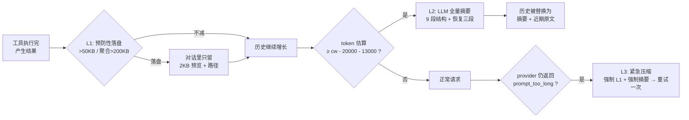

# 06 · 上下文工程与压缩

> 源码：`mewcode/internal/compact/`（8 个文件）、`internal/agent/agent.go` 的上下文管理段
> **这一章最能体现深度。**「你调 API 有什么难的」这个疑问，答案就在这里。

---

## 一、这一章要回答什么

| 问题 | 本节位置 |
|---|---|
| 长会话上下文爆了怎么办？ | §3 全景 |
| 为什么不能简单「截断前 N 条」？ | §3.1 |
| 工具结果占了 80-90% token，怎么治？ | §4 L1 |
| 压缩后模型「失忆」了怎么办？ | §5.3 恢复三段 |
| 压缩本身也可能失败，怎么办？ | §6 |
| 怎么在不调 tokenizer 的前提下估算 token？ | §4.5 |

---

## 二、问题的本质

### 2.1 Agent 是无状态的

MewCode 每轮请求都要把**完整对话历史**打包发给模型。历史随轮次单调增长：

```
第 1 轮：  user(50) + system(2K) + tools(1K)               ≈ 3K tokens
第 3 轮：  + assistant + tool_result(读了一个文件 8K)        ≈ 12K
第 8 轮：  + 5 个文件 + 3 次 grep 结果                       ≈ 60K
第 15 轮： + ...                                            ≈ 150K
第 20 轮： 撞上 200K 上限 → provider 返回 prompt_too_long   → 会话崩溃
```

### 2.2 谁在吃 token

MewCode 的 spec（ch08）里有一句实测结论：

> **工具结果（特别是 ReadFile、Bash、Grep 的输出）占整轮请求的 80%~90%。**

这意味着：**优化上下文 = 优化工具结果**。摘要是兜底，落盘才是主战场。

### 2.3 三层防御体系



| 层 | 时机 | 手段 | 成本 | 角色 |
|---|---|---|---|---|
| **L1** | 工具结果产生瞬间 | 确定性字符串替换（落盘） | 零 LLM 成本 | **预防** |
| **L2** | 每轮请求前 | LLM 摘要 | 一次 LLM 调用 | **急救** |
| **L3** | provider 撞墙后 | 强制 L1 + 强制 L2 + 重试 | 一次 LLM 调用 | **兜底** |

---

## 三、L1：工具结果预防性压缩

### 3.1 为什么不能简单截断

最朴素的做法是「保留最近 N 条消息」或「保留最近 X token」。它有三个致命问题：

1. **切碎 tool_use / tool_result 配对** → 协议 400
2. **丢失用户原始需求** → 模型忘了要干什么
3. **不可逆** → 被丢掉的代码内容再也拿不回来

MewCode 的 L1 方案解决了这三点：**不是丢弃，而是搬家**——把大结果写进磁盘，对话里留下「预览 + 路径 + 重读提示」。模型需要时可以用 `read_file` 读回来。

### 3.2 阈值与判定

```go
// compact/const.go:5
const (
    singleResultLimit     = 50000   // 单条工具结果 > 50KB → 落盘
    messageAggregateLimit = 200000  // 单条 RoleTool 消息内聚合 > 200KB → 从大到小依次落盘
)
```

**为什么区分单条与聚合**：模型可能一次请求 10 个 `read_file`，每个 30KB——单条都不超标，但聚合 300KB。所以需要二级判定。

**为什么聚合用「从大到小依次落盘」而不是「全部落盘」**：用一个例子说明。

```
原状态： [A: 90KB] [B: 60KB] [C: 50KB] [D: 20KB]   聚合 220KB > 200KB

按大小倒序处理：
  处理 A(90KB)：remaining=220 > 200 → 落盘 A，remaining = 130
  处理 B(60KB)：remaining=130 ≤ 200 → 保留原样 ✅
  处理 C(50KB)：remaining=130 ≤ 200 → 保留原样 ✅
  处理 D(20KB)：remaining=130 ≤ 200 → 保留原样 ✅
结果：只落盘了 1 个（A），保留了 B/C/D 的完整内容
```

如果换成「全部落盘」，会白白损失 B/C/D 的完整上下文。**贪心按大小倒序 = 用最少的落盘次数换最大的 token 收益**。

### 3.3 落盘与幂等

```go
// compact/layer1.go:15
func spillSingle(session *SessionContext, toolUseID, content string) error {
    path := filepath.Join(session.SpillDir, toolUseID)
    if _, err := os.Stat(path); err == nil {
        return nil                          // 已存在 → 幂等跳过
    }
    return os.WriteFile(path, []byte(content), 0o644)
}
```

- **文件名 = `tool_use_id`**：天然唯一，且和对话里的 tool_result 一一对应，方便人工排查。
- **目录**：`<workspace>/.mewcode/sessions/<sessionID>/tool-results/`

### 3.4 替换体格式

```go
// compact/layer1.go:37
func buildPreview(originalBytes int, head, spillPath string) string {
    // [content offloaded] original size: 123456 bytes
    // [saved to] /path/to/tool-results/toolu_01ABC...
    // [head preview]
    // <前 20 行或前 2048 字节，取较短者>
    //
    // 完整内容已保存到上述路径，如需查看请用文件读取工具读取该路径，不要凭头部预览猜测全文
}
```

四个信息缺一不可：

| 信息 | 作用 |
|---|---|
| 原始字节数 | 让模型知道「丢了多大」——判断是否值得重读 |
| 落盘路径 | 提供重读入口 |
| 头部预览 | 多数场景足够（文件头部通常是 import/package 声明） |
| 重读提示 | **显式禁止猜测**——这是 prompt 工程，不是注释 |

> 最后一句「不要凭头部预览猜测全文」是刻意的行为约束。没有它，模型会看到预览就以为读完了整个文件，然后基于不完整信息改代码。

### 3.5 决策冻结账本（**本节最重要**）

```go
// compact/state.go:94
type ContentReplacementState struct {
    mu           sync.Mutex
    seenIds      map[string]struct{}  // 已决策的 tool_use_id
    replacements map[string]string     // 决定替换的 id → 预览字符串
}

// DecideOnce 在持锁状态下完成「查账本 → 决策 → 写账本」的原子操作
func (s *ContentReplacementState) DecideOnce(id, original string, decide func() (string, string)) string {
    s.mu.Lock()
    defer s.mu.Unlock()

    if _, seen := s.seenIds[id]; seen {
        if replaced, ok := s.replacements[id]; ok {
            return replaced           // ← 关键：返回账本里那份**同一个 string**
        }
        return original
    }

    decision, preview := decide()
    switch decision {
    case "replaced":
        s.seenIds[id] = struct{}{}
        s.replacements[id] = preview
        return preview
    case "kept":
        s.seenIds[id] = struct{}{}    // 保留了也记账，永不再翻转
        return original
    default: // "skip"（落盘失败）
        return original               // 不记账，下轮重试
    }
}
```

**为什么必须冻结？三个原因：**

**① Prompt Cache 的硬要求。** provider 的前缀缓存（Anthropic `cache_control` / OpenAI 自动前缀缓存）要求**逐字节一致**。如果同一个 tool_result 每轮渲染出略有不同的字符串（比如预览里带了时间戳、或者重新构造导致 map 迭代顺序变化），缓存全量失效——成本立刻上一个量级。

**② 决策不可逆带来一致性。** 一旦决定「保留原文」，就永远保留；一旦决定「替换」，就永远替换。避免「这轮替换了、下轮又还原」造成的语义漂移。

**③ `skip` 分支的可恢复性。** 落盘失败（磁盘满、权限问题）时**不写账本**，下一轮重新评估。这是「失败可重试」与「成功不可翻转」的精确区分。

> **面试官会追问**：`decide()` 回调在**持锁状态**下执行，里面还做了磁盘 IO（`spillSingle`），这不就把锁持有时间拉长了吗？
> **答**：是的，这是当前的取舍。持锁做 IO 会阻塞其他 goroutine 访问账本，但由于：① 只读批的并发执行在同一轮内已经结束；② 落盘只在**首次**遇到大结果时发生（后续 `IsSeen` 短路）；③ 单条最大 50KB 量级的写入是毫秒级——实际影响很小。更严谨的做法是「先锁外落盘 → 再锁内只做账本写入（CAS 语义）」，这样锁内只有 map 操作。这是一个可以主动提出的优化点。

### 3.6 账本与磁盘的一致性

设计约束（来自 spec F2a）：

> **落盘 → 改写 Content → 写入账本三个动作必须按固定顺序串行执行，任一步失败则三件都不发生（保持原文 + 不写账本）。**

这是典型的「先做副作用、再改状态」顺序，保证任何一个中间失败点都不会让状态与磁盘不一致。

---

## 四、Token 估算

### 4.1 为什么不用 tokenizer

精确计数需要加载模型的 BPE 词表（tiktoken / sentencepiece），会带来：
- 几十 MB 的二进制体积（违背「单二进制」目标）
- 每次请求前对全部历史跑一遍分词（CPU 开销）
- 多模型要带多份词表

### 4.2 锚点 + 增量估算

```go
// compact/token.go:40
func EstimateTokens(anchor int64, allMsgs []llm.Message, anchorMsgLen int) int64 {
    if anchorMsgLen < 0 { anchorMsgLen = 0 }
    var tail []llm.Message
    if anchorMsgLen < len(allMsgs) {
        tail = allMsgs[anchorMsgLen:]      // 只算新增的部分
    }
    chars := messageChars(tail)
    return anchor + int64(math.Ceil(float64(chars)/estimateCharsPerToken))  // 3.5
}
```

**核心思想**：用 provider 返回的**真实 usage** 做锚点，只对锚点之后新增的消息做字符估算。

```go
// compact/token.go:11 —— 锚点怎么来
func UsageAnchor(u *llm.Usage) int64 {
    return u.InputTokens + u.OutputTokens + u.CacheWrite + u.CacheRead
}
```

```go
// agent.go:331 —— 每轮请求成功后更新锚点
if usage != nil {
    a.runtime.UpdateAnchor(compact.UsageAnchor(usage), conv.Len())
}
```

**为什么锚点要加 `CacheWrite + CacheRead`**：Anthropic 的 `input_tokens` **不包含**缓存命中的部分。如果只取 `InputTokens`，一旦缓存命中，锚点会严重偏低，导致压缩永远不触发。这是很容易踩的坑——面试时讲出来会显得你真的读过 API 文档。

**误差量级**：`chars / 3.5`。中文约 1.5-2 字符/token，英文约 4 字符/token，代码介于两者之间。3.5 是一个偏保守（高估）的经验值。**误差可能有 20-30%**，所以自动触发阈值里专门留了 13000 的安全余量来吸收它。

> **诚实边界**：本项目没有做过 token 估算误差的标定实验。生产做法是「估算 + 周期性用真实 usage 校准」（本项目已经通过锚点机制部分做到了）。

### 4.3 阈值公式

```go
// compact.go:109
threshold := in.ContextWindow - SummaryReserve - AutoSafetyMargin
//          200000         - 20000          - 13000         = 167000
```

| 常量 | 值 | 含义 |
|---|---|---|
| `SummaryReserve` | 20000 | 给**摘要请求自己**的输出预留的空间 |
| `AutoSafetyMargin` | 13000 | 估算误差 + 单轮波动的安全余量 |
| `ManualSafetyMargin` | 3000 | 手动/紧急压缩时只用这个（因为不担心"下一刻就爆"） |

> **面试官追问**：为什么自动要 13000 的余量，手动只要 3000？
> **答**：自动路径是**预防性**的——它必须在「还没爆」的时候提前动手，所以要覆盖「估算误差 + 这一轮可能新增的量」。手动 `/compact` 是用户主动触发的，只要保证**摘要请求本身**能塞下就行，不需要前瞻余量。

---

## 五、L2：LLM 全量摘要

### 5.1 摘要的两阶段结构

```go
// compact/summary_prompt.go 的内容结构（spec F9/F10）
// Phase 1: Analysis (will be discarded)     ← 让模型先写分析草稿
// Phase 2: Formal Summary (will be kept)    ← 正式摘要
//   1 主要请求和意图
//   2 关键技术概念
//   3 文件和代码段
//   4 错误和修复
//   5 问题解决过程
//   6 所有用户消息原文（逐条保留）
//   7 待办任务
//   8 当前工作（最详细）
//   9 可能的下一步
```

**为什么要两阶段（analysis / summary）**：这是 Chain-of-Thought 在摘要任务上的应用。直接让模型输出摘要，它会走捷径、丢细节；先让它把分析过程写出来（这块内容最后被丢弃），再基于分析写正式摘要，召回率明显更高。

**为什么第 6 条要「用户消息原文逐条保留」**：用户消息是**意图的唯一来源**，一旦被摘要改写成二手描述，模型很容易偏离原始需求。这是硬约束：**宁可占 token，也要保原文**。

**为什么第 8 条要「最详细」**：恢复会话后模型需要知道「我刚才停在哪一步」。这一条直接决定恢复后的续作质量。

### 5.2 摘要请求的特殊约束

```go
// compact/layer2.go:101
func summarizeOnce(ctx context.Context, in ManageInput, msgs []llm.Message) (string, error) {
    req := llm.Request{
        Messages: BuildSummaryPrompt(msgs),
        Tools:    nil,               // ← 摘要不传工具（spec F8）
    }
    ...
    return ExtractSummary(b.String()), nil
}
```

**不传工具定义**是一个容易被忽略但很重要的细节：如果传了工具，模型很可能不去摘要，而是尝试调工具去「验证」某些信息——摘要任务就失败了。

### 5.3 摘要后重建历史：三段拼接

```go
// compact/layer2.go:182
func runSummary(ctx context.Context, in ManageInput) ([]llm.Message, error) {
    oldMsgs := in.Conv.Messages()
    recoverySnapshot := in.Recovery.Snapshot()      // ← 入口拍快照，全流程用这一份

    summaryText, err := summarizeOnce(ctx, in, oldMsgs)
    if err != nil {
        summaryText, err = ptlRetry(ctx, in, oldMsgs)   // 摘要自身撞墙 → 丢消息组重试
        if err != nil { return nil, err }
    }

    recoveryText := BuildRecoveryAttachment(recoverySnapshot, in.ToolDefs)
    combinedContent := "## 历史会话摘要\n" + summaryText + "\n\n" + recoveryText
    summaryAndRecovery := llm.Message{Role: llm.RoleUser, Content: combinedContent}

    recentTail := pickRecentTail(oldMsgs)
    return joinAfterSummary(summaryAndRecovery, recentTail), nil
}
```

最终历史结构：

```
[user] ## 历史会话摘要
       <9 段摘要>

       ## 最近读过的文件          ← 恢复段 1
       ### /path/a.go
       [read at] 2026-...
       <文件内容，最多 5000 token>

       ## 当前可用工具            ← 恢复段 2
       - read_file: ...
         schema: {...}

       ## 重要提示                ← 恢复段 3
       请注意：以上摘要仅用于提供上下文脉络。如果你需要获取文件的完整内容、
       确切的错误信息、或用户的原始措辞，请使用文件读取工具重新读取对应路径。
       不要依据摘要中的描述做代码推断或猜测。

[assistant] （已加载上下文摘要与恢复信息。请继续。）   ← 角色衔接占位

[user] <近期原文最后 N 条>...
```

### 5.4 恢复三段各自的职责

| 段 | 内容 | 解决什么问题 |
|---|---|---|
| **最近读过的文件** | 最多 **5** 个文件，按最后读取时间倒序，每个截断到 **5000 token** | 摘要是**有损**的，代码细节必然丢失。把最近读的文件原文直接塞回来，让模型「不用重读」 |
| **当前可用工具** | 工具名 + 描述 + JSON Schema | 摘要后模型可能忘了自己有什么工具；且**必须与下一次请求的 tools 参数严格一致**（spec F17） |
| **边界提示** | 固定文案 | 显式告诉模型「摘要可能不准，要原文就去读」——**防止模型基于摘要猜测代码** |

**文件快照的数据来源**（一个精妙的埋点）：

```go
// agent.go:449 —— 在工具结果回灌前，用「纯净字节」重新记录文件
func (a *Agent) recordFileReads(calls []llm.ToolCall, results []llm.ToolResult) {
    for i := range calls {
        if calls[i].Name != "read_file" { continue }
        if i >= len(results) || results[i].IsError { continue }
        // ... 解析 path
        b, err := os.ReadFile(absPath)          // ← 重新从磁盘读，而不是用工具结果
        a.runtime.Recovery.RecordFile(absPath, string(b))
    }
}
```

**为什么不直接用工具返回的内容**：`read_file` 工具返回的内容**带行号前缀**（`1  package main`）。如果把带行号的版本存进快照，模型恢复后会看到错位的行号。所以这里**重新读一遍原始文件**，取纯净字节。这是一个很小但很关键的细节。

**为什么要在 `AddToolResults` 之前同步调用**（spec F19a）：保证下一轮的 `ManageContext` 能观察到本轮的文件记录。

### 5.5 近期原文保留：择宽语义

```go
// compact/layer2.go:13
func pickRecentTail(msgs []llm.Message) []llm.Message {
    totalChars, count := 0, 0
    startIdx := len(msgs)

    for i := len(msgs) - 1; i >= 0; i-- {
        totalChars += len(msgs[i].Content)
        for _, tc := range msgs[i].ToolCalls { totalChars += len(tc.Input) }
        for _, tr := range msgs[i].ToolResults { totalChars += len(tr.Content) }
        count++
        startIdx = i

        estTokens := int64(math.Ceil(float64(totalChars) / estimateCharsPerToken))
        if estTokens >= recentKeepTokens && count >= recentKeepMessages {
            break                       // ← 两个下界都要满足
        }
    }

    // 配对修正：截断点不能夹在 tool_use / tool_result 中间
    if startIdx < len(msgs) && msgs[startIdx].Role == llm.RoleTool {
        for startIdx > 0 {
            startIdx--
            if msgs[startIdx].Role == llm.RoleAssistant && len(msgs[startIdx].ToolCalls) > 0 {
                break
            }
        }
    }
    ...
}
```

两个常量：`recentKeepTokens = 10000`、`recentKeepMessages = 5`。

**「择宽」是什么意思**：`&&` 而不是 `||`。两个下界都满足才停手 → 保留范围**更大**。如果用 `||`（任一满足即停），当最近 2 条消息就有 10000 token 时会立刻停手，只保留 2 条——比设计意图窄。

**配对修正**：如果算出来的截断点正好落在一对 `tool_use`/`tool_result` 中间，就往前推到 `tool_use` 所在的 assistant 消息之前。否则恢复后的历史第一个消息是孤立的 `role:tool` → 400。

### 5.6 角色衔接

```go
// compact/layer2.go:56
func joinAfterSummary(summaryAndRecovery llm.Message, recent []llm.Message) []llm.Message {
    // 防御 1：近期原文首条是 tool → 丢弃（理论上已被配对修正处理，双保险）
    for len(recent) > 0 && recent[0].Role == llm.RoleTool {
        recent = recent[1:]
    }

    // 防御 2：近期原文以 user 开头 → 插入 assistant 占位
    if recent[0].Role == llm.RoleUser {
        placeholder := llm.Message{Role: llm.RoleAssistant, Content: "（已加载上下文摘要与恢复信息。请继续。）"}
        return append([]llm.Message{summaryAndRecovery, placeholder}, recent...)
    }
    return append([]llm.Message{summaryAndRecovery}, recent...)
}
```

摘要本身是一条 `user` 消息。如果近期原文也以 `user` 开头，就会出现「连续两条 user」——Anthropic 会 400。所以插一条 assistant 占位打破它。

> **面试官追问**：这条占位 assistant 消息是「假」的，会不会污染模型对历史的认知？
> **答**：会有轻微影响，但比 400 好得多。文案设计成「（已加载上下文摘要与恢复信息。请继续。）」，语义上是在描述系统状态而不是编造模型说的话。更干净的做法是把摘要放进 `system` 而不是 `user`，但那样就无法利用「摘要作为普通消息」的灵活性（比如 Anthropic 的 system 缓存断点结构）。

---

## 六、失败处理与熔断

### 6.1 三种触发路径

```go
// compact/compact.go:53
switch in.Trigger {
case TriggerManual:    return manageManual(ctx, in, out)     // /compact
case TriggerEmergency: return manageEmergency(ctx, in, out)  // provider 撞墙
default:               return manageAuto(ctx, in, out)       // 每轮自动检查
}
```

| 路径 | 跳过什么 | 执行什么 | 触发条件 |
|---|---|---|---|
| **Auto** | — | L1 → 重估 → 阈值判断 → 可能 L2 | `est >= cw - 20000 - 13000` |
| **Manual** | L1、阈值、熔断 | 无条件 L2 | 用户输入 `/compact` |
| **Emergency** | 阈值、熔断 | **强制 L1 + 强制 L2** | provider 返回 `ErrPromptTooLong` |

### 6.2 Auto 路径的完整逻辑

```go
// compact/compact.go:93
func manageAuto(ctx, in, out) (ManageOutput, error) {
    // a. 先跑 L1
    layer1Out, _ := OffloadAndSnip(in.Conv.Messages(), in.Replacement, in.Session)
    in.Conv.ReplaceMessages(layer1Out)

    // b. 用 L1 之后的消息重算 token（关键：L1 省下的 token 必须反映在阈值判断里）
    estTokens := EstimateTokens(in.UsageAnchor, layer1Out, in.AnchorMsgLen)

    // c. sanity check
    if in.ContextWindow <= SummaryReserve+AutoSafetyMargin {
        log.Printf("[compact] ContextWindow=%d 过小，跳过自动 layer2", in.ContextWindow)
        return out, nil
    }

    threshold := in.ContextWindow - SummaryReserve - AutoSafetyMargin

    // d. 未达阈值 或 熔断中 → 只有 L1 生效
    if estTokens < int64(threshold) || in.AutoTracking.Tripped() {
        out.AfterTokens = estTokens
        return out, nil
    }

    // e. 触发 L2
    newMsgs, _, afterTok, err := AutoCompact(ctx, in)
    ...
}
```

**顺序很关键**：先 L1 再判断。因为 L1 可能已经把 150K token 削到 60K，根本不需要启动昂贵的 LLM 摘要。**这是一个重要的成本优化**——先做免费的确定性优化，再评估是否需要花钱的 LLM 操作。

**`sanity check` 的意义**：如果用户配了 `context_window: 30000`（小于 33000 的保留空间），阈值会变成负数，每轮都会触发摘要，形成死循环。所以直接跳过。

### 6.3 熔断器

```go
// compact/state.go:149
type AutoCompactTrackingState struct {
    mu                  sync.Mutex
    ConsecutiveFailures int
}

func (a *AutoCompactTrackingState) RecordSuccess() { a.ConsecutiveFailures = 0 }
func (a *AutoCompactTrackingState) RecordFailure() { a.ConsecutiveFailures++ }
func (a *AutoCompactTrackingState) Tripped() bool {
    return a.ConsecutiveFailures >= maxConsecutiveAutoCompactFailures  // 3
}
```

**为什么需要熔断**：如果摘要持续失败（网络问题、模型服务异常），每轮都会重新尝试摘要——每轮多花一次 LLM 调用的钱，任务却毫无进展。连续 3 次失败后熔断，之后只做 L1，靠 L1 硬撑（虽然最终还是会撞墙，但至少不会每轮烧钱）。

**手动/紧急路径不走熔断**：

```go
// compact/layer2.go:225
func ForceCompact(...) {
    newMsgs, err := runSummary(ctx, in)   // 失败也不 RecordFailure
    ...
}
```

**为什么**：用户主动按了 `/compact`，就应该真的尝试一次，而不是因为「之前自动压缩失败过 3 次」就拒绝服务。

### 6.4 摘要请求自身撞墙（PTL 重试）

一个递归的困境：**摘要请求本身也可能超长**——你把 190K token 的历史打包给模型做摘要，模型说「你的输入太长了」。

```go
// compact/layer2.go:128
func ptlRetry(ctx context.Context, in ManageInput, msgs []llm.Message) (string, error) {
    groups := groupByUserTurn(msgs)     // 按「用户消息 → 后续往返」分组

    // 前 3 次：每次丢最旧 1 组
    for retry := 0; retry < ptlRetryLimit && len(groups) > 1; retry++ {
        groups = groups[1:]
        if summary, err := summarizeOnce(ctx, in, flattenGroups(groups)); err == nil {
            return summary, nil
        }
    }

    // 超过 3 次后：按 20% 比例丢（至少 1 组）
    for len(groups) > 1 {
        drop := int(math.Ceil(float64(len(groups)) * ptlDropPercentage))  // 0.2
        if drop < 1 { drop = 1 }
        groups = groups[drop:]
        if summary, err := summarizeOnce(ctx, in, flattenGroups(groups)); err == nil {
            return summary, nil
        }
    }

    return "", context.DeadlineExceeded    // 全部丢光
}
```

**为什么分组而不是按条丢**：一条 user 消息后面往往跟着 assistant + tool 往返，单独丢掉 user 会留下无主的 assistant/tool 消息 → 400。按「用户轮次」分组丢弃保证结构完整。

**为什么前 3 次只丢 1 组**：精细调整阶段。如果一上来就丢 20%，会损失太多上下文，摘要质量下降。

**为什么之后改成 20% 比例**：如果历史有 100 组，一次丢 1 组要丢 100 次才能有效果。改成比例丢弃可以在对数级次数内收敛。

### 6.5 紧急压缩（provider 撞墙）

```go
// agent.go:283
if sErr != nil && errors.Is(sErr, llm.ErrPromptTooLong) && !emergencyRetried {
    out2, fErr := compact.ManageContext(ctx, compact.ManageInput{
        ...
        Trigger: compact.TriggerEmergency,     // 强制 L1 + 强制 L2
    })
    if fErr != nil { emit(Event{Err: fErr}); ensureAssistantTail(...); return }

    a.runtime.ResetAnchor()                    // ← 锚点作废，因为历史被彻底重写了
    est2 := compact.EstimateTokens(0, conv.Messages(), 0)

    if est2 >= int64(cw-compact.ManualSafetyMargin) {
        emit(Event{Err: sErr})                 // 压缩后还是太大 → 放弃
        return
    }
    emergencyRetried = true
    text, calls, usage, sErr = streamOnce(...)  // 重试一次（只一次）
}
```

**为什么 `ResetAnchor()`**：紧急压缩把历史整个替换了，旧的锚点（对应旧历史的 usage）已经毫无意义，必须清零重新估算。

**为什么只重试一次**：如果压缩后仍然撞墙，说明有某种病态情况（比如单条工具结果就超过整个窗口）。继续重试是浪费。

**`ErrPromptTooLong` 是怎么被识别的**（适配层，靠**错误文本子串**）：

```go
// anthropic.go:274 匹配 "prompt is too long" / "context_length" / "too many tokens"
// openai.go:218   匹配 "context_length_exceeded" / "maximum context length" / "too long" / ("token" && "exceed")
// 统一包装：fmt.Errorf("%w: %v", ErrPromptTooLong, err)
```

脆弱但对多端点最兼容——不同兼容厂商的错误消息格式不统一，也是没办法的事。

### 6.6 如何避免无限压缩

| 机制 | 作用 |
|---|---|
| 熔断器（3 次） | 连续失败后停止自动压缩 |
| `emergencyRetried` 标志 | 紧急压缩重试只做一次 |
| `sanity check`（`cw > 33000`） | 防止阈值变负数导致每轮都压缩 |
| `ptlRetry` 最终返回 sentinel | 摘要请求全丢光后明确失败，不会无限循环 |
| `ManageContext` 的 nil 降级 | 状态对象为 nil 时跳过压缩（不 panic） |

---

## 七、面试官可能追问（Q&A）

### L1 基础

**Q1：为什么不做「保留最近 N 条消息」这种简单截断？**
> A：三个问题：① 会切碎 `tool_use`/`tool_result` 配对导致 400；② 丢失用户原始需求（用户消息可能在很前面）；③ 不可逆——被丢掉的代码内容拿不回来。MewCode 的 L1 是「搬家而非丢弃」，L2 是「摘要 + 保留用户原文」，两者都保证可回溯。

**Q2：为什么工具结果落盘阈值是 50KB？**
> A：50KB ≈ 14K token（按 3.5 字符/token）。选择依据是「单条结果超过这个量级，就值得用一次磁盘 IO + 一次潜在的重读来换上下文空间」。同时它显著大于典型的文件读取量（普通源文件 5-20KB），避免对小文件做无意义的落盘。这个值是可调的，spec 里明确写了是字节口径而非字符口径（因为实现用 `len()`）。

**Q3：模型怎么知道被落盘的文件在哪？**
> A：替换体里写了完整路径，并且编辑了明确的行为指令：「完整内容已保存到上述路径，如需查看请用文件读取工具读取该路径，不要凭头部预览猜测全文」。模型下一轮如果要看全文，就调 `read_file`。**注意这里有个闭环**：重读的文件内容会再次经过 L1 判定，如果还是超 50KB，会再次落盘——但 `tool_use_id` 不同（新的调用），所以会生成新文件而不是死循环。

**Q4：如果模型反复重读同一个大文件会怎样？**
> A：每次重读都是一次新的 `tool_use_id`，会各自落盘一份。这确实会造成磁盘重复写入。**改进方向**：按文件内容 hash 去重（`spillSingle` 改成 `sha256(content)` 命名 + 内容相同则复用），或者在替换体里提示模型「该文件已落盘，路径为 X，无需重复读取」。

### L2 深挖

**Q5：Token 估算用「字符数 / 3.5」，误差多大？为什么不用 tiktoken？**
> A：误差量级 20-30%，因为中文（约 1.5-2 字符/token）、英文（约 4 字符/token）、代码（约 3-3.5）差异很大。不用 tiktoken 的原因：① 会引入几十 MB 词表，破坏单二进制；② 每个模型词表不同，要带多份；③ 每轮对全量历史分词有 CPU 开销。缓解手段是**锚点机制**——每轮用 provider 返回的真实 usage 校准，误差只在锚点之后的部分累积，而且只累积一轮（下一轮又校准回来了）。

**Q6：锚点为什么要包含 `CacheRead` 和 `CacheWrite`？**
> A：这是 Anthropic API 的一个坑：缓存命中的部分**不计入 `input_tokens`**，而是单独的 `cache_read_input_tokens`。如果锚点只取 `InputTokens`，一旦缓存命中（命中率通常很高），锚点会严重偏低，导致 token 估算永远不超标、压缩永远不触发，最后直接撞墙。所以 `UsageAnchor` 要把四项加起来。

**Q7：摘要为什么要先写 `<analysis>` 再写 `<summary>`？**
> A：这是 CoT 在摘要任务上的应用。直接要摘要，模型会走捷径丢细节；先让它把「哪些信息重要、哪些是用户明确要求的」分析一遍，再基于分析写正式摘要，信息召回率明显更高。分析部分最后被 `ExtractSummary` 丢弃，只为质量付费、不为 token 付费——只不过这部分 token 还是付了（在输出侧）。

**Q8：摘要后为什么还要「恢复三段」？摘要不是已经包含文件信息了吗？**
> A：摘要是有损压缩，代码细节必然丢失。三个恢复段各解决一个问题：① **文件快照**——让模型不用重读最近改过的文件（这是最常见的上下文需求）；② **工具列表**——摘要后模型可能忘了有什么工具可用，而且必须与本次请求的 tools 参数严格一致；③ **边界提示**——显式告诉模型「摘要可能不准，要原文就重读」，**防止它基于二手描述去改代码**。第三点是最容易出事的地方。

**Q9：`pickRecentTail` 为什么用 `&&` 不用 `||`？**
> A：`&&` 是「两个下界都满足才停手」，保留范围**更大**（择宽）。如果改成 `||`，在「最近 2 条消息恰好有 10000 token」的场景会立刻停手，只保留 2 条——比设计意图窄，恢复质量下降。spec 里专门澄清了这个语义，因为第一版实现容易写反。

**Q10：`recordFileReads` 为什么要重新读磁盘，而不是用工具返回的内容？**
> A：因为 `read_file` 工具返回的内容**带行号前缀**（`1  package main`）。如果把带行号的内容存进文件快照，模型恢复后看到的代码行号是错位的，很可能基于错误的行号做修改。重新 `os.ReadFile` 拿纯净字节，多一次 IO 换正确性。

**Q11：如果摘要之后模型还是觉得上下文不够，会怎样？**
> A：会进入下一次 L1/L2 循环。压缩后的历史（摘要 + 恢复段 + 近期原文）如果继续增长到阈值，会再次触发摘要——**对摘要做摘要**。这是可接受的（摘要本身很短），但会造成信息逐层衰减。更好做法是设「最多压缩 N 次」或者保留一份「原始用户消息全集」永不摘要。

### L3 故障与边界

**Q12：摘要请求本身超长怎么办？**
> A：`ptlRetry` 分级处理：按用户轮次分组，前 3 次每组丢 1 个最旧的组，之后按 20% 比例丢。全部丢光还不行就返回 `context.DeadlineExceeded` 作为 sentinel，上层报错。分组丢弃而不是按条丢，是为了保证 `tool_use` 配对完整。

**Q13：连续摘要失败会怎样？**
> A：熔断器计数（`maxConsecutiveAutoCompactFailures = 3`）。连续 3 次失败后 `Tripped()` 返回 true，自动路径只做 L1，不再尝试 LLM 摘要。这样避免「每轮多花一次 LLM 调用却毫无进展」的烧钱循环。成功一次即清零。手动 `/compact` 和紧急压缩不受熔断影响。

**Q14：压缩后如果 `Esc` 取消会怎样？**
> A：压缩本身不是通过 ctx 取消感知的用户交互，它会跑完。但摘要请求的 `provider.Stream(ctx, ...)` 会感知 ctx——如果用户在压缩中按 ESC，摘要请求会被取消，`manageAuto` 返回 error，`Run` emit `Event{Err}` 并结束本轮。**此时历史没有被替换**（`ReplaceMessages` 在 Compress 成功之后才调用），所以状态是一致的。

**Q15：`ManageContext` 里状态对象为 nil 时直接跳过压缩，这样安全吗？**
> A：安全但不理想。`main.go` 在启动时初始化了全部四个状态对象（`Replacement` / `Recovery` / `AutoTracking` / `Session`），nil 只会在测试或异常装配路径出现。跳过压缩的后果是「退化为无压缩」，也就是 ch08 之前的行为——会撞墙，但不会崩。这是「降级优先于崩溃」的设计。

**Q16：落盘的工具结果会被清理吗？**
> A：会的，随会话目录一起。`main.go` 启动时后台 goroutine 跑 `session.CleanExpired(sessionsDir, 30*24*time.Hour)`，30 天前的整个会话目录（含 `tool-results/`）被 `os.RemoveAll`。**已知局限**：只认新格式的 session ID（旧格式目录永远不会被清理，成为无主垃圾）；没有「保留最近 N 个会话」或总体积上限策略。

### L4 设计与权衡

**Q17：为什么 L1 和 L2 不合并成一个「智能压缩」？**
> A：因为成本和确定性差异巨大。L1 是**零成本、确定性、纯函数**的字符串替换——每轮都可以跑，结果可预测。L2 是**一次 LLM 调用**（花钱、有延迟、结果不确定）。分离后可以先做免费的，只有当免费手段不够时才花那个钱。合并成一个会失去这个「先便宜后贵」的优化机会。

**Q18：为什么用一个 `ManageContext` 入口而不是让 Agent 直接调 L1/L2？**
> A：① 单一入口便于保证**顺序**（L1 一定先于 L2）；② 三条触发路径（auto/manual/emergency）的行为差异集中在一处维护；③ Agent 主循环只需要构造 `ManageInput`，不必知道压缩内部细节。代价是 `ManageInput` 字段很多（11 个），有「参数对象膨胀」的味道。

**Q19：如果让你重做这个模块，你会改什么？**
> A：四点：① **`DecideOnce` 锁内不做 IO**——改成「锁外落盘 → 锁内 CAS 写账本」；② **账本持久化**——现在 `ContentReplacementState` 不落盘，`/resume` 恢复后账本为空，需要重新决策（虽然结果可复现，但浪费了一次扫描）；③ **token 估算标定**——用真实 tokenizer 做一次离线标定，把 3.5 换成按内容类型分段的动态系数；④ **压缩次数上限**——防止「对摘要做摘要」导致的信息逐层衰减。

---

## 八、企业级方案对照

### 8.1 与 Claude Code 的对比

| 维度 | MewCode | Claude Code |
|---|---|---|
| 工具结果处理 | 落盘 + 预览替换（50KB/200KB 阈值） | 类似机制（超长输出截断 + 提示用 Read 工具重读） |
| 自动压缩 | 阈值触发 + 熔断 | auto-compact（接近窗口时提示并自动摘要） |
| 手动压缩 | `/compact` | `/compact`（可带指令，如 `/compact 保留 API 设计决策`） |
| 摘要结构 | 9 段固定结构 | 8 段（含 "Pending Tasks"、"Current Work"） |
| 恢复机制 | 三段（文件快照 + 工具列表 + 边界提示） | 类似（重新注入关键文件与工具上下文） |

**可以借鉴的**：Claude Code 的 `/compact` 支持**带自定义指令**——用户可以告诉摘要器「重点保留 API 设计决策」。这是很实用的产品化细节，MewCode 的 `/compact` 是无参的。

### 8.2 企业级上下文管理的关键差异

| 问题 | MewCode | 企业级做法 |
|---|---|---|
| **Token 计数** | 字符 / 3.5 粗估 | 精确 tokenizer（tiktoken / 各厂商 count_tokens API）+ 定期标定 |
| **记忆分层** | 摘要 + 文件快照（进程内） | **三级记忆**：工作记忆（当前窗口）→ 情景记忆（向量库检索历史对话）→ 语义记忆（结构化知识图谱） |
| **检索式上下文** | 无 | 按需检索：`context = 检索(相关历史片段)` 而不是全量摘要。**这是当前最主流的方向** |
| **压缩策略** | 固定阈值 | 自适应：按任务类型、模型窗口、成本预算动态调整；分级压缩（先丢工具输出 → 再摘要 → 最后丢用户消息） |
| **压缩质量评估** | 无 | 用「压缩后任务完成率」做 A/B；维护压缩质量回归测试集 |
| **缓存友好** | 冻结替换决策 | 断点规划（system → tools → 早期消息分层打断点）+ cache hit rate 监控告警 |
| **多模态** | 不支持 | 图片/音频 token 单独计费与压缩策略（图片降采样、视频抽帧） |

### 8.3 重点讲一个：为什么「检索式上下文」是更优解

MewCode 的摘要是**有损的、不可逆的、被动的**：

```
完整历史 (190K) --摘要--> 摘要 (5K) + 恢复段 (10K) + 近期原文 (10K)
                            ↑ 丢了 165K，且再也拿不回来（除非落盘过）
```

企业级方案更倾向 **RAG 式上下文**：

```
完整历史 --> 分块 --> 向量化 --> 向量库
                                    ↓
每次请求 --> 用当前任务检索 --> 相关历史片段 (按需 5-20K)
```

**优势**：
1. **无损**——原始对话完整保留在向量库
2. **按需**——只检索当前相关的，而不是无差别摘要
3. **可演进**——新增历史自动可检索，不需要重新摘要

**劣势**：
1. 检索可能漏（召回率问题）——**用「摘要做骨架 + 检索做补充」的混合方案**缓解
2. 需要额外的向量库与 embedding 成本
3. 检索延迟增加首 token 时间

**企业级常见架构**：

```
┌─────────────────────────────────────────────┐
│  System Prompt (稳定前缀，缓存)              │
├─────────────────────────────────────────────┤
│  会话摘要骨架 (滚动更新，每 N 轮重算)         │
├─────────────────────────────────────────────┤
│  检索到的相关历史片段 (每轮重新检索 Top-K)     │
├─────────────────────────────────────────────┤
│  最近 N 轮原文 (精确，不压缩)                 │
├─────────────────────────────────────────────┤
│  当前用户消息                                │
└─────────────────────────────────────────────┘
```

MewCode 实现了其中的「摘要骨架 + 最近 N 轮原文 + 文件快照」，**缺的是检索层**。这是一个很好的「我知道差距在哪」的答案。

---

## 九、本章速记卡

```
问题本质     工具结果占 token 80-90%，历史单调增长直到撞窗口
三层防御     L1 预防性落盘（零成本）→ L2 LLM 摘要（花钱）→ L3 紧急压缩（兜底）

L1 阈值      singleResultLimit=50000 字节 / messageAggregateLimit=200000 字节
L1 策略      按字节倒序贪心落盘，聚合回落到阈值内即停
L1 预览      原始大小 + 落盘路径 + 前20行/前2048字节 + "不要凭预览猜测" 
L1 账本      ContentReplacementState：seenIds + replacements，冻结不可翻转
             冻结原因 = Prompt Cache 要求逐字节一致

Token 估算   锚点(真实 usage 四项和) + 新增字符/3.5
             锚点必须含 CacheRead + CacheWrite（缓存命中不计入 input_tokens）

L2 阈值      ContextWindow - SummaryReserve(20000) - AutoSafetyMargin(13000)
L2 结构      两阶段（analysis 丢弃 / summary 保留）+ 9 段固定结构
L2 不传工具  避免模型去调工具而不是摘要
L2 恢复三段  最近 5 个文件快照(每个≤5000 token) + 当前工具列表 + 边界提示
L2 近期原文  recentKeepTokens=10000 && recentKeepMessages=5（择宽）
             配对修正：截断点不夹在 tool_use/tool_result 中间
L2 角色衔接  近期原文以 user 开头 → 插 assistant 占位

失败处理     熔断 maxConsecutiveAutoCompactFailures=3（手动/紧急不熔断）
             摘要自身撞墙 → ptlRetry（前3次丢1组，之后丢20%）
             provider 撞墙 → 紧急压缩 + 重试一次 + ResetAnchor
```

---

- [上一篇：权限与安全护栏](/项目实战/mewcode/05-权限与安全护栏)
- [下一篇：记忆、会话与项目指令](/项目实战/mewcode/07-记忆会话与项目指令)
