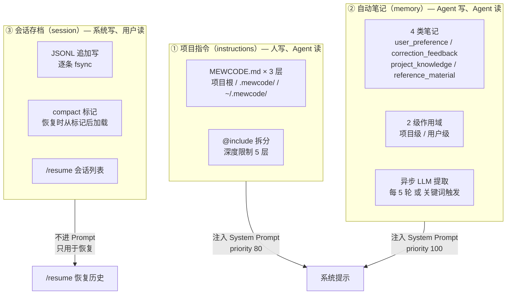
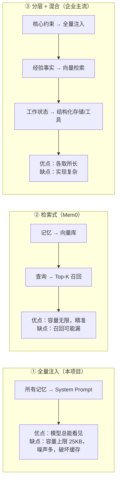

# 07 · 记忆、会话与项目指令

> 源码：`internal/instructions/loader.go`、`internal/memory/`（4 文件）、`internal/session/`（4 文件）
> 一句话：**Agent 的「长期记忆」不是一个东西，而是三层不同生命周期、不同写入方式、不同注入位置的机制。**

---

## 一、这一章要回答什么

| 问题 | 本节位置 |
|---|---|
| Agent 怎么知道项目的编码规范？ | §3 项目指令文件 |
| Agent 怎么记住用户偏好，跨会话生效？ | §4 自动笔记 |
| 进程退出了，对话历史去哪了？ | §5 JSONL 会话存档 |
| `/resume` 恢复会话时怎么保证不出错？ | §5.4 |
| 这三层记忆分别注入到 Prompt 的哪里？ | §6 注入位置全景 |

---

## 二、三层记忆的分工



| 层 | 谁写 | 生命周期 | 注入位置 | 本质 |
|---|---|---|---|---|
| 项目指令 | **人**（手写 Markdown） | 永久（随项目） | System Prompt，priority 80 | **声明式约束** |
| 自动笔记 | **Agent**（LLM 提取） | 永久（跨会话） | System Prompt，priority 100 | **经验沉淀** |
| 会话存档 | **系统**（每次追加） | 30 天 | 不进 Prompt | **状态持久化** |

---

## 三、项目指令文件（instructions）

### 3.1 三层加载

```go
// instructions/loader.go —— 加载顺序即优先级（高优先级在前）
paths := []struct{ path, boundary string }{
    {filepath.Join(l.projectRoot, "MEWCODE.md"),                l.projectRoot},
    {filepath.Join(l.projectRoot, ".mewcode", "MEWCODE.md"),    l.projectRoot},
}
if l.userHome != "" {
    paths = append(paths, ...{filepath.Join(l.userHome, ".mewcode", "MEWCODE.md"), filepath.Join(l.userHome, ".mewcode")})
}
// 拼接：strings.Join(parts, "\n\n")  —— 高优先级在前，模型优先遵循
```

**为什么「高优先级排前面」**：LLM 对 Prompt 前部的指令遵循度更高（recency 效应是双向的，但显式约束放前面更稳）。这也和 Claude Code 的 CLAUDE.md 体系一致：越靠近项目的约定越靠前。

**与 `CLAUDE.md` 的关系**：本项目自己的仓库里同时有 `CLAUDE.md`（给 Claude Code 看）和 MEWCODE.md 体系（给 MewCode 看）。**设计上的对标意义**在这里——`MEWCODE.md` 就是「Claude Code 的 CLAUDE.md」的等价物。

### 3.2 `@include` 的四道防护

```go
// instructions/loader.go —— loadFile 的四道检查
func (l *Loader) loadFile(path string, depth int, visited map[string]struct{}, boundary string) (string, error) {
    absPath, _ := filepath.Abs(path)

    // ① 环路检测
    if _, ok := visited[absPath]; ok {
        return fmt.Sprintf("<!-- @include 检测到环路，已跳过: %s -->", path), nil
    }
    visited[absPath] = struct{}{}

    // ② 深度限制（maxIncludeDepth = 5）
    if depth > maxIncludeDepth {
        return fmt.Sprintf("<!-- @include 超过最大嵌套深度，已跳过: %s -->", path), nil
    }

    // ③ 路径逃逸检测
    if !strings.HasPrefix(absPath, boundary) {
        return fmt.Sprintf("<!-- @include 路径超出允许范围，已跳过: %s -->", path), nil
    }

    data, err := os.ReadFile(absPath)
    ...

    // ④ 二进制检测（前 512 字节含 \x00）
    checkLen := min(len(data), 512)
    for _, b := range data[:checkLen] {
        if b == 0 {
            return fmt.Sprintf("<!-- @include 文件为二进制格式，已跳过: %s -->", path), nil
        }
    }
    ...
}
```

**降级风格值得注意**：所有防护失败都**不报错**，而是替换成一行 HTML 注释。注释在 Markdown 渲染时不可见（用户看不到），但模型能看到——属于「可观测的降级」：**既不让 Agent 因为一个 include 失败而拒绝服务，也不静默吞掉问题。**

### 3.3 已知缺陷（诚实清单）

| 缺陷 | 位置 | 影响 | 修法 |
|---|---|---|---|
| **路径逃逸用字符串前缀比较** | `!strings.HasPrefix(absPath, boundary)` | `boundary = /work/proj` 时，`/work/proj-evil/secret.md` 也会通过 | 改 `filepath.Rel` + 检查结果不以 `..` 开头 |
| **菱形包含被误报为环路** | `visited` 标记在读取前 | A→B、A→C、B→D、C→D 时 D 被跳过 | 区分「正在展开的栈」与「已展开集合」 |
| **`@include` 只在行首识别** | `strings.HasPrefix(trimmed, "@include ")` | 代码块内的 `@include` 不会触发（可能是好事） | 按需加「忽略代码块」逻辑 |
| **带引号的路径不去引号** | 同上 | `@include "a b.md"` 找不到文件 | 增加引号剥离 |
| **顶层 `MEWCODE.md` 不做二进制检测** | 只有 include 目标检测 | 误把二进制文件当指令读入 | 统一入口做检测 |

---

## 四、自动笔记（memory）

### 4.1 四类笔记

```go
// memory/types.go
const (
    TypeUserPreference     NoteType = "user_preference"      // 跨项目的个人偏好
    TypeCorrectionFeedback NoteType = "correction_feedback"  // 用户的负反馈 → 未来的行为约束
    TypeProjectKnowledge   NoteType = "project_knowledge"    // 本仓库技术栈/架构约定
    TypeReferenceMaterial  NoteType = "reference_material"   // 外部链接/文档
)
```

**分类依据是「信息的可复用范围与来源」，而不是主题。** 这个切分很关键：
- `user_preference` → 应该存在**用户级**目录（跨项目生效）
- `project_knowledge` → 应该存在**项目级**目录（换项目失效）
- `correction_feedback` → 本质是「未来行为的约束」，价值最高
- 分类直接决定了**存储位置**（level 字段）

### 4.2 触发时机

```go
// agent.go:350 —— 只在「无工具调用的自然结束」分支
if len(calls) == 0 {
    final := ensureFinal(ch, text)
    conv.AddAssistant(final)

    if a.memMgr != nil && a.runtime != nil {
        turnCount := a.runtime.IncTurn()
        recentMsgs := extractRecentTurn(conv)
        if turnCount%5 == 0 || hasMemorySignal(recentMsgs) {
            a.memMgr.UpdateAsync(ctx, recentMsgs)
        }
    }
    ...
}

// agent.go:1113
var memorySignalKeywords = []string{"记住", "记忆", "别忘", "remember", "memo"}
```

**两路触发**：
1. **周期性**（每 5 轮）——兜底，保证长会话总有沉淀
2. **显式信号**（关键词）——用户说「记住我用 Go 写」时立即触发，不用等到第 5 轮

**为什么只在自然结束触发**：工具循环中途结束的轮次里，对话还没形成完整语义（模型正在做事），提取出来的笔记质量低。

**`extractRecentTurn` 的边界**：从最后一条 `user` 消息到结尾。如果找不到 user 消息（异常历史），`startIdx` 保持 0，会提取整段历史——这可能超长。这是一个潜在的性能问题。

### 4.3 异步更新

```go
// memory/manager.go
func (m *Manager) UpdateAsync(ctx context.Context, recentMsgs []llm.Message) {
    go func() {
        m.mu.Lock()
        defer m.mu.Unlock()
        if m.provider == nil { return }

        indexText := m.LoadIndex()                     // 现有索引全量注入
        sysPrompt := buildMemoryUpdatePrompt(indexText)

        req := llm.Request{
            Messages: msgs,                            // 最近一轮序列化成一条 user 消息
            System:   llm.System{Stable: sysPrompt},
            // 不传工具定义（F38）—— 纯文本决策任务
        }
        stream := m.provider.Stream(ctx, req)
        // ... 收集文本
        text = extractJSON(text)
        var actions []UpdateAction
        json.Unmarshal([]byte(text), &actions)

        for _, a := range actions {
            switch a.Level {
            case "project": m.projectStore.Apply([]UpdateAction{a})
            case "user":    m.userStore.Apply([]UpdateAction{a})
            }
        }
    }()
}
```

**四个工程要点**：

1. **不传工具**（spec F38 明文要求）——传了工具模型会去调工具而不是输出 JSON。
2. **`m.mu` 覆盖整个 goroutine**，包括网络流式读取——保证更新严格串行，避免两个并发更新把 `MEMORY.md` 写花。代价：新触发会**排队等待**而不是合并。
3. **`extractJSON` 是朴素括号裁剪**（找第一个 `[` 和最后一个 `]`）——注释说「可能被 markdown 代码块包裹」，但实现对「正文含 `[`」的响应不鲁棒。
4. **解析失败只打 stderr，不重试、不反馈给模型**——静默失败。
5. **没有 panic recover**——异步旁路 goroutine 内 panic 会杀掉整个进程。

> **面试官追问**：为什么用「LLM 直接输出 JSON 数组」而不是 function calling？
> **答**：这是刻意的选择——记忆更新是一个**决策任务**（创建/更新/删除哪些笔记），不是工具调用。用 function calling 需要定义 `create_memory`/`update_memory`/`delete_memory` 三个工具并支持数组参数，schema 更复杂，而且模型可能只调用一个工具就停了。让模型输出一个 JSON 数组可以一次表达多个动作。**代价是解析脆弱**——需要在 Prompt 里强调「只输出 JSON」，并在代码里做容错提取。更稳的做法是用 structured output（OpenAI 的 `response_format: json_schema`）或 Anthropic 的 tool use 强制输出格式。

### 4.4 去重靠 Prompt 而不是代码

```
// memory/prompt.go 的操作规则
5. 去重：如果多个笔记涵盖相同主题，优先合并而非创建新笔记
```

并且把**现有索引全文注入**（`if existingIndex != "" { prompt += "\n\n## 现有笔记索引\n" + existingIndex }`），让模型在「知道已有什么」的前提下做 create/update/delete 决策。

代码层只有两个弱保障：
- `updateIndexLine`：`strings.Contains(line, filename)` 命中则替换（**取首个命中**）
- `removeIndexLine`：过滤掉所有命中行

**真实缺口**：`Store.create` 是 `os.WriteFile`（覆盖）+ `appendIndex`（无条件追加），**没有「文件已存在则退化为 update」的保护**。如果模型对同一主题换了 slug，会出现「文件被覆盖 + `MEMORY.md` 重复行」。

### 4.5 索引格式与注入

```go
// memory/store.go —— 每行格式
line := fmt.Sprintf("- [%s] %s — %s\n", noteType, title, desc)
// desc = extractOneLine(content)，正文首个非空行，超 80 字节截断为前 77 + "..."
```

```go
// memory/manager.go —— LoadIndex 的体积封顶
const maxIndexSize = 25 * 1024    // 25600 字节
if len(result) > maxIndexSize {
    result = result[:maxIndexSize]
    if lastNL := strings.LastIndexByte(result, '\n'); lastNL > 0 {
        result = result[:lastNL]     // 切到最后一个换行，不切碎一行
    }
    result += "\n(index truncated)"
}
```

**顺序是项目级在前、用户级在后**（就近优先）。截断后追加 `(index truncated)` 让模型知道索引不完整——又是一个「可观测的降级」。

**注入位置**：`OptionalModules` 的 `长期记忆`，**priority 100（最后）**。为什么排最后？因为它是**稳定性最低**的部分（每次会话可能不同），放在稳定前缀之后有利于缓存。

> **重要限制**：`memoryText` 在**进程启动时读取一次**，之后 `UpdateAsync` 新写入的笔记**要重启进程才会进入系统提示**。这是「写了但立刻用不上」的可见缺口。修法：在下一轮 `BuildSystemPrompt` 时重新调 `LoadIndex()`（代价是每次重建 Prompt 都要读磁盘，且会打破 Prompt Cache 的稳定性——所以需要折中，比如每 N 轮刷新一次）。

---

## 五、会话存档（session）

### 5.1 JSONL 格式

```go
// session/writer.go:14
type Entry struct {
    Type        string           `json:"type,omitempty"`         // "compact" 或空
    Role        string           `json:"role,omitempty"`         // user / assistant / tool
    Content     string           `json:"content,omitempty"`
    ToolCalls   []llm.ToolCall   `json:"tool_calls,omitempty"`
    ToolResults []llm.ToolResult `json:"tool_results,omitempty"`
    Timestamp   int64            `json:"ts"`
    Model       string           `json:"model,omitempty"`        // 仅首条消息
}
```

**一行一条 JSON**。`json.Encoder.Encode` 自带换行且会转义内容里的 `\n`，所以**每条消息严格占一行**——这是「坏行跳过」策略成立的前提。

存储路径：`<workspace>/.mewcode/sessions/<YYYYMMDD-HHMMSS-xxxx>/conversation.jsonl`
工具结果落盘：`.../tool-results/<tool_use_id>`

### 5.2 fsync 策略

```go
// session/writer.go:86
if err := w.enc.Encode(entry); err != nil { ... }
return w.file.Sync()      // ← 逐条 fsync
```

**逐条 fsync 的取舍**：
- ✅ 强保证：崩溃/断电后 JSONL 仍可完整解析，且外部进程 `tail -f` 实时可见
- ❌ 代价：每条消息一次磁盘同步（毫秒级），在高频写入场景是明显瓶颈

**生产做法**：批量 fsync（每 N 条或每 T 毫秒一次）+ WAL 保证崩溃一致性，把「持久性」与「吞吐」解耦。

### 5.3 坏行处理与 compact 标记

```go
// session/load.go —— 加载逻辑
dec := json.NewDecoder(f)
for dec.More() {
    var entry Entry
    if err := dec.Decode(&entry); err != nil {
        continue                     // 跳过坏行
    }
    if entry.Type == "compact" {
        entries = nil                // ← 遇到 compact 标记，清空，从标记之后重新开始
        continue
    }
    entries = append(entries, entry)
}
```

注释里的契约是：**「从最后一个 compact 标记之后加载，跳过坏行，截断孤立工具调用」**。

**为什么从 compact 标记之后加载**：`OnReplace` 的顺序是「先写标记，再写整份历史」，所以标记之后的第一条永远是压缩后的完整历史。恢复时天然拿到**压缩后的视角**，且不需要重放或重算压缩决策。

**一个真实边界**：用的是流式 `json.Decoder` + `dec.More()`，而**不是** `bufio.Scanner` 逐行解析。单条消息损坏后，Decoder 的错误恢复点是「下一个能解析出值的字节」，可能吞掉紧随其后的一条记录。要严格按行容错应改成 Scanner + `json.Unmarshal`。

### 5.4 孤立工具调用截断

```go
// session/load.go
last := msgs[len(msgs)-1]
if last.Role == llm.RoleAssistant && len(last.ToolCalls) > 0 {
    return msgs[:len(msgs)-1]     // 截断
}
```

处理的是「崩溃在工具执行中」的场景：assistant 已落盘、tool 结果未落盘。**只截断最后一条**——历史中间出现孤立调用（理论上不该发生，因为写入顺序受控）源码未处理。

### 5.5 `/resume` 恢复流程

```
用户输入 /resume
  → ListSessions()        扫描目录，只返回「新格式 ID + 存在 conversation.jsonl」的会话
                          按 mtime 倒序，readFirstUser 提取标题和 model
  → 列表 UI（上下键选择 / 输入过滤 / Enter 确认 / Esc 取消）
  → LoadSession()         从最后一个 compact 标记后加载 + 跳过坏行 + 截断孤立调用
  → 估算 token，若 est > cw - 8000  → 先跑 RunForceCompact（在临时 Conversation 上）
  → 检查时间跨度，> 6h 追加提醒
  → 重建 conv / writer / sessionCtx，清空所有 compact 子状态
```

**「先压缩再恢复」的意义**：避免「刚恢复就立刻撞 PTL」。这是一个很贴心的设计——用户恢复一个 3 天前的大会话，不应该立刻就爆。

**时间跨度提醒**：

```go
if elapsed := time.Since(info.ModifiedAt); elapsed > 6*time.Hour {
    reminder := fmt.Sprintf("[系统提示] 本会话已暂停 %s。部分上下文可能已过时，如需最新信息请重新读取相关文件。", formatDuration(elapsed))
    msgs = append(msgs, llm.Message{Role: llm.RoleUser, Content: reminder})
}
```

**为什么要提醒**：Agent 对「时间流逝」没有感知。恢复一个隔夜会话时，代码可能已经被别人改过、依赖可能升级过。一条显式提醒让模型知道「你的认知可能过期了」。

### 5.6 30 天清理

```go
// cmd/mewcode/main.go:118 —— 后台 goroutine，不阻塞启动
go func() {
    if err := session.CleanExpired(sessionsDir, 30*24*time.Hour); err != nil {
        fmt.Fprintf(os.Stderr, "[session] 过期会话清理失败: %v\n", err)
    }
}()
```

**三个已知局限**：
1. 只认新格式 session ID（`compact.ParseSessionTime` 失败即 `continue`）→ **旧格式目录永远不被清理**
2. 只有时间维度，没有「保留最近 N 个」或「总体积上限」策略
3. `os.RemoveAll` 直删，无回收站/软删除

---

## 六、⚠️ 一个必须知道的性能缺陷（面试加分项）

**`Conversation.ReplaceMessages` 无条件触发 `onReplace`，而 `manageAuto` 每轮都会调用它。**

追踪调用链：

```go
// compact/compact.go:93 manageAuto —— 每一轮 Agent Loop 都会走到这里
func manageAuto(ctx, in, out) (ManageOutput, error) {
    layer1Out, _ := OffloadAndSnip(in.Conv.Messages(), in.Replacement, in.Session)
    in.Conv.ReplaceMessages(layer1Out)      // ← 无条件替换（即使 L1 什么都没改）
    ...
}

// conversation/conversation.go:157
func (c *Conversation) ReplaceMessages(msgs []llm.Message) {
    ...
    c.mu.Unlock()
    if c.onReplace != nil {
        c.onReplace(msgs)                   // ← 无条件回调
    }
}

// session/writer.go:135
func (w *Writer) OnReplace() func([]llm.Message) {
    return func(msgs []llm.Message) {
        _ = w.WriteCompactMarker()          // 写一条 compact 标记
        _ = w.AppendAll(msgs)               // 把**整份历史**逐条重写一遍（每条一次 fsync！）
    }
}
```

**后果**：假设历史有 100 条消息、Agent 跑了 10 轮：
- 写入量 ≈ `10 × 100 = 1000` 条记录（而不是应然的 ~110 条）
- fsync 次数 ≈ 1000 次
- **写放大是「轮数 × 历史长度」，随会话推移呈二次增长**

**正确性没问题**（从最后一个标记之后加载得到的仍是完整正确的历史），但代价很大。

**修法（三选一）**：
1. `ReplaceMessages` 增加「内容未变化则跳过回调」的判断（比较切片引用或版本号）
2. `manageAuto` 只在 L1 **实际发生替换**时才调 `ReplaceMessages`
3. `OnReplace` 改为「只写标记，不重写全量」（因为增量 Append 已经写过了）

> **面试时怎么讲**：主动提出这个发现，说明「我读过自己的持久化链路，并且理解『回调无条件触发』这个设计决定在性能上的代价」。这比背诵功能列表强得多。

---

## 七、面试官可能追问（Q&A）

### L1 基础

**Q1：Agent 的记忆系统你是怎么设计的？**
> A：分三层，按**生命周期和写入方**切分：① **项目指令**（人写的 MEWCODE.md，三层加载，声明式约束）；② **自动笔记**（Agent 自己异步提取的四类经验，跨会话持久化）；③ **会话存档**（JSONL 全量对话，用于 `/resume` 恢复，不进 Prompt）。三层分别注入 System Prompt 的 priority 80 / 100 / 不注入。

**Q2：为什么笔记要分四类？**
> A：分类依据是**信息的可复用范围**而不是主题。`user_preference`（跨项目偏好）和 `project_knowledge`（本仓库约定）的存储位置不同——前者进用户级目录，后者进项目级目录。分类直接决定了 `level` 字段，进而决定写到哪个 Store。

**Q3：什么时候触发记忆提取？**
> A：两路：每 5 轮周期性触发（`turnCount % 5 == 0`），或者检测到关键词（`记住 / 记忆 / 别忘 / remember / memo`）立即触发。且只在**模型无工具调用的自然结束**分支触发——工具循环中途对话语义不完整，提取质量差。

### L2 深挖

**Q4：记忆提取为什么是异步的？会不会丢？**
> A：异步是因为它要发一次完整的 LLM 请求（几百毫秒到几秒），同步做会阻塞用户。不会丢的前提是 `m.mu` 覆盖整个 goroutine，保证串行。**但确实有一个真实风险**：用的是触发点的 `ctx`（来自当次 Run），如果用户此时按 ESC 取消，`ctx` 被 cancel，记忆更新会被一起取消。正确做法是用 `context.WithoutCancel(ctx)` 或独立的超时 ctx。

**Q5：Markdown frontmatter 解析是自己写的还是用库？**
> 项目里没有引入 frontmatter 库。`subagent/parser.go` 和 `skills/parser.go` 都是手写解析：按 `---` 分割，中间的 YAML 用 `yaml.v3` 反序列化到结构体。手写的原因是不想为两处解析引入额外依赖，且需要精确控制「缺字段时的默认值」语义（比如 `model` 缺省 `inherit`、`maxTurns` 缺省继承全局）。

**Q6：`@include` 的环路检测为什么用 `visited` map？有什么问题？**
> 用绝对路径做 key，命中即跳过。**问题**：`visited` 的语义是「已展开的文件」，而不是「当前展开栈上的文件」。这导致**菱形包含**（A→B、A→C、B→D、C→D）里的 D 被误判为环路。正确做法是维护一个「正在展开的栈」用于环检测，另用一个「已展开集合」用于去重。

**Q7：为什么 `/resume` 恢复时要先压缩？**
> 避免「刚恢复就立刻撞 PTL」。恢复的历史可能已经是 190K token（用户之前是在接近上限时退出的），如果直接接上，下一次请求就会失败。所以在临时 `Conversation` 上先跑一次 `RunForceCompact`，成功后再作为恢复内容。临时 Conversation 不挂 writer，所以这次压缩不会污染原 JSONL。

**Q8：JSONL 坏行怎么处理？**
> 用 `json.Decoder` 流式解码，`Decode` 出错就 `continue`。**真实局限**：Decoder 的错误恢复点是「下一个能解析出值的字节」，可能吞掉紧随其后的记录。更严格的方案是 `bufio.Scanner` 逐行 + `json.Unmarshal`。选目前方案的理由是「一条消息内容里的 `\n` 已被 encoder 转义，所以行边界是可靠的」——但那是对**写入**的保证，对**损坏**场景的保证要弱一些。

### L3 故障与边界

**Q9：如果 JSONL 文件被外部程序截断了一半，恢复会怎样？**
> 最后一条完整记录之后的内容被 `Decode` 拒绝并跳过。如果截断正好发生在某条记录中间，Decoder 会尝试从下一个能解析的位置恢复——可能会丢 1-2 条记录。**然后 `TruncateOrphanedToolCalls` 会截掉末尾悬空的 `assistant(tool_calls)`**，保证历史合法可继续。整体是「尽力恢复而不是报错拒绝」。

**Q10：会话会无限增长吗？磁盘爆了怎么办？**
> 30 天前的会话目录会被后台清理。**三个缺口**：① 旧格式 session ID 目录永远不会被清理；② 没有总体积上限（如果一个会话特别长、工具结果落盘特别多，30 天内可能占几个 GB）；③ 没有进度提示。生产做法应该是「按总配额 LRU 淘汰 + 用户可见的存储占用面板」。

**Q11：记忆笔记写坏了会怎样？**
> `Store.Apply` 的失败只打 stderr，不影响主流程——这是刻意的「旁路不阻塞主链路」。但有两个真实风险：① 如果模型对同一主题换了 slug，会**覆盖已有文件**并让 `MEMORY.md` 出现重复行；② `extractJSON` 的朴素括号裁剪在「模型先解释一句再给数组」时会解析失败，静默丢弃这次更新。

**Q12：多进程同时打开同一个项目会怎样？**
> 会冲突。JSONL Writer 用 `O_APPEND`，每次写入在 POSIX 下是原子的（小于 PIPE_BUF 时），所以**不会互相踩坏行**。但 `MEMORY.md` 的读-改-写没有文件锁，两个进程同时更新会丢失更新。会话目录倒是隔离的（session ID 含时间戳 + 4 字符随机十六进制）。**改进方向**：项目级加文件锁（`flock`）或改用 SQLite。

### L4 设计与权衡

**Q13：为什么用 JSONL 而不是 SQLite？**
> 三个理由：① **追加写**——崩溃最多丢最后一行，不需要事务；② **可观测**——`tail -f` 就能看到 Agent 在干什么，调试体验极好；③ **零依赖**——不引入 CGO 或数据库驱动，符合单二进制目标。**代价**：查询能力弱（`ListSessions` 要扫描目录 + 逐文件读第一行）、没有索引、没有并发写保护。会话数量上千时应该换 SQLite。

**Q14：为什么 `Model` 字段只在第一条消息上写？**
> 因为会话的模型是固定的（启动时选定 provider），重复写没意义。`readFirstUser` 读第一行就能拿到标题和 model，用于会话列表展示。这是一个「用存储结构编码业务不变量」的小设计。

**Q15：三层记忆会不会互相冲突？**
> 会有潜在冲突，比如项目指令说「用 tabs 缩进」而用户笔记说「用户偏好 spaces」。**当前的解决方式是「靠位置和措辞」**：项目指令 priority 80、笔记 priority 100（排在后面），且笔记本身是「经验记录」的语气而非「强制约束」。更严谨的做法是在笔记的 Prompt 里明确「这些是历史经验，与项目指令冲突时以项目指令为准」。

**Q16：如果让你重做记忆系统，你会怎么改？**
> 四点：① **索引热更新**——现在新笔记要重启才生效；② **create 转 update 保护**——避免覆盖 + 索引重复；③ **检索式而非注入式**——笔记多了以后（现在全量注入上限 25KB），应该用 embedding 检索 Top-K 相关笔记，而不是全塞进 System Prompt；④ **笔记质量反馈**——记录「哪些笔记被用到了」，淘汰无用笔记。

---

## 八、企业级方案对照

### 8.1 与本项目对标的几个记忆系统

| 系统 | 核心抽象 | 与本项目的差异 |
|---|---|---|
| **Claude Code** | CLAUDE.md（项目指令）+ auto-memory（会话笔记） | 本项目几乎 1:1 对标，差异在本项目是显式三层 + 四分类 |
| **LangChain / LangGraph** | `BaseMemory` / `Checkpointer`（状态持久化） | LangGraph 的 checkpointer 是**事件溯源**式的（可从任意检查点重放），本项目是「最新快照」式 |
| **Mem0** | 自动抽取 + 向量存储 + 图关系 | Mem0 用向量检索**按需召回**，本项目是全量注入 System Prompt |
| **Zep / Graphiti** | 时序知识图谱（temporal KG） | 支持「事实在什么时间点成立」，本项目完全没有时间维度（只有笔记的 created/updated） |
| **Letta (MemGPT)** | 把上下文当「虚拟内存」，Agent 自主分页 | Agent 自己决定何时把信息换入换出，本项目是固定策略 |

### 8.2 三种记忆架构的取舍



### 8.3 重点讲一个：为什么企业级必须做「记忆的检索化」

本项目的记忆索引上限是 **25KB**，全量注入 System Prompt。这在小规模下没问题，但：

```
25KB ≈ 7000 token 的固定开销
→ 每轮请求都要付这 7000 token
→ 命中 Prompt Cache 后成本降低，但依然占容量
→ 更重要：7000 token 的「无关记忆」本身就是噪声，会稀释模型的注意力
```

企业级方案（Mem0 / Zep / 自建）的做法：

```python
# 伪代码
memories = vector_store.search(query=current_user_message, top_k=5)
system_prompt = f"""
## 相关记忆（与当前任务相关）
{format_memories(memories)}
"""
```

**收益**：① 容量无限（10 万条笔记也只用召回 5 条）；② 信噪比高（只注入相关的）；③ 不占固定 token 预算。

**代价与缓解**：
- 召回可能漏 → **用「核心约束全量 + 经验事实检索」的混合方案**
- 增加检索延迟 → 与 LLM 调用并行化
- 需要 embedding 成本 → 本地小模型（bge-m3 等）

**企业级记忆系统的关键能力清单**（本项目缺失的）：

| 能力 | 说明 |
|---|---|
| 记忆去重与冲突消解 | 同一事实的多次写入要合并；矛盾时按时间或置信度裁决 |
| 记忆时效性 | 事实随时间失效（`valid_from` / `valid_to`）——Zep 的 temporal KG 核心 |
| 记忆遗忘 | LRU / 重要性衰减，避免无限膨胀 |
| 记忆溯源 | 每条记忆能回溯到「哪次对话产生的」——审计必需 |
| 多租户隔离 | 用户 A 的记忆绝不能被用户 B 检索到（安全红线） |
| 效果评估 | 有记忆 vs 无记忆的任务完成率对比 |

---

## 九、本章速记卡

```
三层记忆     项目指令(人写) / 自动笔记(Agent写) / 会话存档(系统写)
注入位置     System Prompt priority 80 / 100 / 不进 Prompt

instructions  三层：项目根 MEWCODE.md > .mewcode/MEWCODE.md > ~/.mewcode/MEWCODE.md
              @include 四道防护：环路 / 深度(maxIncludeDepth=5) / 逃逸 / 二进制(前512字节\x00)
              降级方式：替换成 HTML 注释（不可见但模型可见）
              缺陷：逃逸检测是字符串前缀比较（/proj-evil 可绕过）

memory       四类：user_preference / correction_feedback / project_knowledge / reference_material
             两级：<workspace>/.mewcode/memory/ + ~/.mewcode/memory/
             触发：每 5 轮 或 关键词(记住/记忆/别忘/remember/memo)，仅自然结束分支
             异步：goroutine + m.mu 全段串行；不传工具（避免模型去调工具）
             去重：靠 Prompt 注入现有索引，代码层无 create→update 保护
             索引：MEMORY.md，maxIndexSize = 25600 字节，超限按行截断 + "(index truncated)"
             限制：memoryText 启动读一次，新笔记重启才生效

session      JSONL：<workspace>/.mewcode/sessions/<YYYYMMDD-HHMMSS-xxxx>/conversation.jsonl
             一条消息一行，逐条 fsync（强持久性 + 写放大）
             compact 标记：OnReplace 先写标记再写全量历史 → 恢复时从最后标记后加载
             坏行：json.Decoder 出错 continue（可能吞掉后续记录）
             孤立工具调用：只截断末尾悬空的 assistant(tool_calls)
             /resume：列表(mtime 倒序) → 加载 → est > cw-8000 先压缩 → >6h 加时间提醒
             清理：30 天，后台 goroutine，只认新格式 ID

⚠️ 已知缺陷   manageAuto 每轮无条件 ReplaceMessages → onReplace 写标记 + 重写全量历史
             → 写放大 = 轮数 × 历史长度（二次增长），正确性无损但代价高
```

---

- [上一篇：上下文工程与压缩](/项目实战/mewcode/06-上下文工程与压缩)
- [下一篇：扩展机制：MCP / Skill / Hook](/项目实战/mewcode/08-扩展机制-MCP-Skill-Hook)
