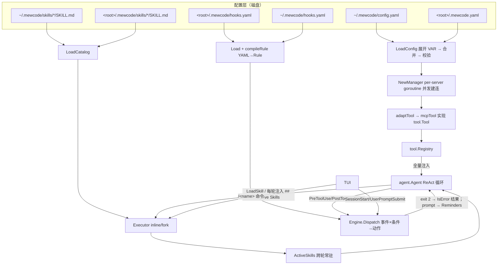
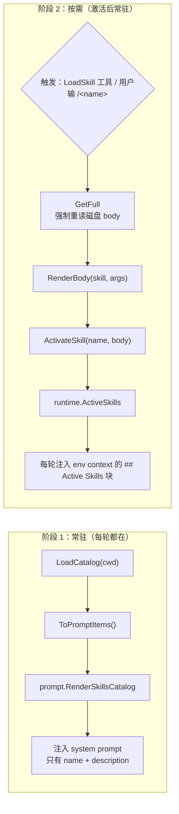

# 08 · 扩展机制：MCP / Skill / Hook

> 源码：`mewcode/internal/mcp/`（`config.go` 210 行、`manager.go` 201 行、`tool.go` 146 行）、`mewcode/internal/skills/`（`types.go` / `parser.go` / `catalog.go` / `executor.go` / `render.go` / `install.go` / `active.go` / `adapter.go`）、`mewcode/internal/hook/`（`event.go` / `rule.go` / `loader.go` / `matcher.go` / `executor.go` / `engine.go`）
> 这一章回答「Agent 如何在不改内核代码的前提下被扩展」：**MCP 扩能力、Skill 固流程、Hook 自动化生命周期**——三条正交的扩展轴，共享同一套「配置 → 校验 → 编译 → 运行期分派」的骨架。
> 所有结论均来自实际源码阅读；无法从源码确认的一律标注「源码未体现」。

---

## 一、这一章要回答什么

| 面试问题 | 本节位置 |
|---|---|
| 外部工具怎么接进来？为什么不改代码就能扩能力？ | §3.1 / §3.4 |
| 一个 MCP server 挂了会不会拖死启动？ | §3.6 |
| 配置里的 `${GITHUB_TOKEN}` 会不会被做成命令注入？ | §3.3 |
| 远端工具怎么变成一个「内置工具」？权限怎么判？ | §3.4 / §3.5 / §3.8 |
| Skill 是什么？和项目指令、Slash 命令有什么区别？ | §4.1 / §4.7 |
| 100 个 Skill 会不会把上下文撑爆？ | §4.2 |
| 说了 `allowed_tools`，模型真的会遵守吗？ | §4.4 |
| 从网上装一个 Skill，等于执行任意代码吗？ | §4.5 |
| 怎么在 Agent 的 11 个生命周期时刻插自动化？ | §5.1 / §5.3 |
| 怎么写一条「禁止 rm -rf」的 hook？ | §5.4 |
| hook 拦不住、静默失效怎么办？ | §5.6 / §5.7 |
| 这套扩展体系哪些地方是「设计已定、代码未接线」？ | §6.1 |

---

## 二、项目在做什么

### 2.1 三种扩展机制的分工

扩展层不做「插件市场 + 动态链接库」，而是刻意选择**三根正交的轴**：

| 机制 | 回答的问题 | 扩展的是什么 | 生效粒度 | 作者写什么 |
|---|---|---|---|---|
| **MCP** | 「模型能**做**什么」 | **能力**：把外部进程/远端服务的工具接进 registry | 工具级，全局可见 | YAML 配置（`config.yaml` / `.mewcode.yaml`） |
| **Skill** | 「这类事该**怎么做**」 | **流程**：把一套 SOP 按需注入上下文 | 会话级，激活后常驻 | Markdown + YAML frontmatter（`SKILL.md`） |
| **Hook** | 「什么时候**自动**做什么」 | **生命周期**：在固定事件点跑 shell / http / 提示词注入 | 事件级，确定触发 | YAML 规则（`hooks.yaml`） |

> **MCP 给 Agent 装手，Skill 给 Agent 装手册，Hook 给 Agent 装神经反射。**

三者的本质差异在「**谁是决策者**」：

- **MCP**：决策权在**模型**。工具注册好了，用不用、什么时候用，由模型在循环里决定。
- **Skill**：决策权在**模型或用户**。模型通过 `LoadSkill` 工具按需拉全文，用户通过 `/<name>` 命令强制激活。
- **Hook**：决策权在**配置**。事件一到、条件一匹配就执行——不经过模型，也不问模型。

最后一点是 Hook 最本质的价值：**它是这套体系里唯一能在模型之外强制生效的机制**。`PreToolUse` 拦下一条 `rm -rf` 时，模型意愿完全不参与决策——代码直接返回一个 `IsError` 的工具结果，跳过权限引擎、不执行工具。

### 2.2 三根轴的共同骨架与三条原则


1. **坏配置不阻断启动**：MCP 的 `validateServer` 跳过单个 server（`config.go:134-158`）、Skill 的 `scanInto` 跳过解析失败的目录（`catalog.go:189-192`）、Hook 的 `compileRule` 失败只 `continue`（`loader.go:122-127`）——三处错误处理**形态完全一致**。
2. **两层配置，就近优先**：三处都是「项目级 + 用户级」，但**合并语义不统一**（MCP 覆盖、Hook 叠加），见 §6.4。
3. **失败必须可见**：所有跳过路径都往 stderr 写带前缀的告警（`[mcp] warn:` / `[skills] warn:` / `hook "x": ... skipped`）。

### 2.3 扩展层全景图



**图里最值得注意的一条边**：`ENG -->|exit 2| AG`。Hook 是唯一一条能从**配置侧反向干涉主循环**的通路，其他两条轴只能「提供素材」，不能「改变行为」。

### 2.4 三个包在 main 里的装配

```go
// cmd/mewcode/main.go:76 —— MCP：加载配置 → 并发建连 → 全量注册
mcpCfg, _ := mcp.LoadConfig(root)
mgr := mcp.NewManager(context.Background(), mcpCfg, version)
defer mgr.Close()
for _, t := range mgr.Tools() {
    reg.Register(t)
}
// main.go:91 —— Hook：加载两层 YAML → 编译规则 → 返回引擎
hookEngine, _ := hook.Load(root)
```

两个细节可作为「我读自己代码」的证据：`LoadConfig` 的 error 被**显式丢弃**（因为它恒为 `nil`，见 `config.go:164` 注释「永不返回 error（签名留 error 仅为未来扩展，当前实现恒为 nil）」）；`defer mgr.Close()` 紧跟 `NewManager`——关闭是**进程级兜底**，不依赖上层记得关。

---

## 三、MCP 客户端

MCP（Model Context Protocol）是让 Agent 接入外部工具生态的开放协议。MewCode 实现的是**客户端侧**：它不提供工具，只消费别人提供的工具。

### 3.1 两种传输的建立

`NewManager` 为配置里**每个 server 起一个 goroutine**，用 `sync.WaitGroup` 汇总（`manager.go:79-157`）：

```go
// manager.go:83-97 —— stdio 分支
for name, srv := range cfg.Servers {
    wg.Add(1)
    go func(name string, srv ServerConfig) {
        defer wg.Done()
        ctx2, cancel := context.WithTimeout(ctx, connectTimeout)
        defer cancel()
        switch srv.Type {
        case "stdio":
            cmd := exec.CommandContext(ctx2, srv.Command, srv.Args...)
            cmd.Env = mergeOSEnv(srv.Env)
            cmd.Stderr = os.Stderr
            transport = &sdkmcp.CommandTransport{Command: cmd}
```

| stdio 设计点 | 代码 | 为什么 |
|---|---|---|
| `exec.CommandContext(ctx2, ...)` | `manager.go:94` | 用 ctx 而非 `cmd.Start()`——`connectTimeout` 到点能直接杀子进程，不留僵尸 |
| `cmd.Env = mergeOSEnv(srv.Env)` | `manager.go:95` | 宿主 `os.Environ()` 全量继承 + 配置 `env` 覆盖同名键（`manager.go:52-73` 手写 `for i := 0; i < len(kv); i++` 找第一个 `=` 切分，而非 `strings.SplitN`——正确处理含 `=` 的 value） |
| `cmd.Stderr = os.Stderr` | `manager.go:96` | 子进程 stderr **直通宿主终端**，MCP server 的启动失败信息（依赖缺失、参数错）用户能直接看到。代价是输出会与 TUI 渲染交错——「可调试性」与「界面整洁」的取舍 |

HTTP 传输（Streamable HTTP）走**自建的 `http.Client`**：

```go
// manager.go:98-109 —— http 分支
hc := &http.Client{
    Transport: &headerRoundTripper{base: http.DefaultTransport, headers: srv.Headers},
}
transport = &sdkmcp.StreamableClientTransport{
    Endpoint: srv.URL, HTTPClient: hc, DisableStandaloneSSE: true,
}

// manager.go:44-50 —— 注入 header
func (h *headerRoundTripper) RoundTrip(req *http.Request) (*http.Response, error) {
    req = req.Clone(req.Context())   // ← 不修改传入的 request（RoundTripper 契约要求）
    for k, v := range h.headers { req.Header.Set(k, v) }
    return h.base.RoundTrip(req)
}
```

- **`req.Clone(req.Context())`** 而不是直接改 `req.Header`：`http.RoundTripper` 的契约要求实现**不得修改传入的 request**（它可能被重试或复用）。这是「读协议文档写代码」的证据。
- **`DisableStandaloneSSE: true`**：显式关闭独立 SSE 长连通道，只用 POST + 可选流式响应。MCP 允许服务端开一条独立 GET SSE 流做推送，但绝大多数 server 不用；关掉它省一条常驻连接，也避免在代理/NAT 环境挂死。

两者收敛到同一段建会话代码：`sdkmcp.NewClient(&sdkmcp.Implementation{Name: "mewcode", Version: version}, nil)` → `client.Connect(ctx2, transport, nil)`（`manager.go:112-121`）。`Implementation` 是协议层的**客户端身份声明**，`Connect` 时通过 `initialize` 握手发给 server。

### 3.2 保活：其实没有保活

这是最容易露怯、也最容易加分的一节——**必须诚实**。全包 grep `Ping` / 心跳 / `Reconnect` **零命中**：

| 传输 | 存活依赖 | 断了会怎样 |
|---|---|---|
| stdio | 会话持有的 `exec.Cmd` 生命周期 | 子进程退出即会话失效，但**错误在下次 `CallTool` 时才暴露** |
| http | 每次 `CallTool` 重新发请求 | 无长连可断，天然无状态 |

即：**没有健康检查、没有断线重连、没有运行期 reload**——配置在 `main.go:76` 一次性加载，想增删 MCP server **必须重启进程**（源码未体现热加载）。

唯一的容错是**退出路径的兜底**（`manager.go:170-200`）：先 `copy` 快照避免持锁做 I/O → 并发 `cs.Close()` → 用「另一个 goroutine 等 `wg.Wait()` 后 `close(done)`」把它转成可超时的 `select`：

```go
select {
case <-done:                          // 全部正常关闭
case <-time.After(closeDeadline):     // 兜底超时，不等了
}
```

**这个写法值得单独讲**：`wg.Wait()` 是阻塞的，但退出路径上「等一个卡死的 server」是灾难（用户按 Ctrl+C 后发现进程不退出）。给不可取消操作套一层可超时的 `select`，是标准的 Go 套路。用无缓冲 `chan struct{}` + `close()` 而非 `chan bool` + 发送，是因为 `close()` 是**广播**语义、可被多个等待者安全观察，也不存在发送方阻塞的可能。

### 3.3 配置两层合并 + `${VAR}` 展开安全

| 层 | 路径 | 代码 |
|---|---|---|
| 用户级 | `~/.mewcode/config.yaml` | `config.go:170` |
| 项目级 | `<root>/.mewcode.yaml` | `config.go:179` |

`loadFile` 的失败语义（`config.go:48-62`）：**文件不存在 → 空结构 + `nil`**（不是错误）；**YAML 解析失败 → 零值 + error**。上层收到 error 后打 stderr 告警并把该层**降级为空层**（`config.go:174` / `config.go:183`：`userRaw = rawConfig{}`）——一层坏了不影响另一层。

#### 合并：整体覆盖，不做字段级深合并

```go
// config.go:122-131
func mergeServers(user, project map[string]rawServer) map[string]rawServer {
    merged := make(map[string]rawServer, len(user)+len(project))
    for k, v := range user {
        merged[k] = v
    }
    for k, v := range project {
        merged[k] = v // 完整覆盖
    }
    return merged
}
```

**语义是整体覆盖**——项目级只要声明了同名 server，用户层的 `command` / `args` / `env` **全部丢弃**，不会「部分继承」。为什么：**可预测**。项目级写出完整定义即可复现，不会出现「我的 env 是两层混合出来的、token 串味」这种要读两份文件才能推理的情况。替代方案是深合并：灵活，但一个 `env` 里到底有哪些键取决于两份文件的交集，调试成本高。

#### `${VAR}` 展开：三层防护

```go
// config.go:44 —— 只认 ${VAR_NAME}
var varPattern = regexp.MustCompile(`\$\{([A-Za-z_][A-Za-z0-9_]*)\}`)

// config.go:66-79（摘要）—— 未定义变量替换为空串，并记录变量名
out := varPattern.ReplaceAllStringFunc(s, func(match string) string {
    varName := match[2 : len(match)-1]          // 去掉 ${ 和 }
    val, ok := os.LookupEnv(varName)
    if !ok {
        undefined = append(undefined, varName)
        return ""
    }
    return val
})
```

| 防护 | 机制 | 挡住的攻击 |
|---|---|---|
| **① 语法窄** | 正则只认 `${NAME}`，`NAME` 限 `[A-Za-z_][A-Za-z0-9_]*` | 不支持 `$VAR`、`${VAR:-default}`、嵌套、`$(cmd)`、反引号 → **结构上无法构造 shell 语义** |
| **② 位置窄** | `applyExpansion` **只对 `env` 与 `headers` 的 value 展开**（`config.go:100-114`） | `command` / `args` / `url` 保持字面量 → 环境变量无法劫持 exec 目标。`docs/mcp/mcp-servers.example.yaml` 顶部注释亦确认 |
| **③ 时序** | 展开在**合并之前**（`config.go:186-199`：先对 user 层整体展开，再对 project 层整体展开，最后才 `mergeServers`） | 两层互不污染 |

未定义变量由 `collectUndefined` 去重后一次性告警（`config.go:82-93` 先扫已有集合再决定是否 append，避免同一个 `${GITHUB_TOKEN}` 用 5 次打 5 行）：`[mcp] warn: undefined env var ${X} referenced by server Y`（`config.go:116-118`）。

> **追问**：为什么未定义变量不直接报错拒绝加载？
> **答**：环境变量缺失是**常态**（CI、新机器、没配 `.env`），让整个 MCP 工具集因此不可用是不成比例的惩罚。代价是**静默降级**——`Authorization: "Bearer ${TOKEN}"` 变成 `"Bearer "`，只在运行期表现为 401。生产做法：区分「致命变量」（缺失则拒绝加载该 server）与「可选变量」（告警继续），并在 `/mcp` 状态命令里显式展示未定义变量列表。

#### 单 server 校验：枚举 + 必填

`validateServer`（`config.go:134-158`）的规则是 `type ∈ {stdio, http}`、`stdio` 必须有 `command`、`http` 必须有 `url`。任一不满足 → stderr 告警 + **跳过该 server**（不阻断其他 server）。注意 `type` 为空时专门给出 `missing type field` 而非 `unknown type ""`——**错误信息为人类排查服务**。

### 3.4 工具如何转换为内置 Tool 接口

`adaptTool` 是 MCP 与内核的**唯一接缝**（`tool.go:110-146`）：

```go
// tool.go:110-146（摘要）
fullName := "mcp__" + serverName + "__" + t.Name
if !validToolName.MatchString(fullName) {   // ^[A-Za-z0-9_-]+$（tool.go:24）
    fmt.Fprintf(os.Stderr, "[mcp] warn: skip tool %s: name contains illegal characters\n", fullName)
    return nil, false
}
if t.Description == "" {                    // 描述兜底
    descr = "来自 MCP server " + serverName + " 的工具 " + t.Name
}
if t.InputSchema != nil {                   // schema 原样透传：JSON 往返做类型擦除
    b, _ := json.Marshal(t.InputSchema)
    _ = json.Unmarshal(b, &schema)
}
if len(schema) == 0 { schema = map[string]any{"type": "object"} }
readOnly := t.Annotations != nil && t.Annotations.ReadOnlyHint     // 严格只信 ==true
```

| Tool 接口方法 | MCP 侧来源 | 处理 |
|---|---|---|
| `Name()` | 远端工具名 | 加命名空间前缀（§3.5）+ 字符白名单校验 |
| `Description()` | `t.Description` | 空则兜底中文文案 |
| `Parameters()` | `t.InputSchema` | **原样透传**，不校验/不改写 schema |
| `ReadOnly()` | `t.Annotations.ReadOnlyHint` | **严格只信 `== true`**，不猜 |
| `Execute()` | `cs.CallTool` | 见下 |

schema 为什么要走 marshal → unmarshal？因为 SDK 的 `InputSchema` 是具体类型（实现定义的 struct/map 组合），而 `tool.Tool` 的契约是 `map[string]any`。**用 JSON 做一次往返是零依赖的类型擦除**——不写反射、不写类型断言树，代价只在建连时发生一次。

#### `Execute`：三处容错

```go
// tool.go:56-103（摘要）
ctx2, cancel := context.WithTimeout(ctx, 30*time.Second)   // ← 硬编码
defer cancel()
if err := json.Unmarshal(args, &argMap); err != nil {
    return tool.Result{Content: fmt.Sprintf("参数解析失败: %v", err), IsError: true}   // ①
}
res, err := t.cs.CallTool(ctx2, &sdkmcp.CallToolParams{Name: t.remoteName, Arguments: argMap})
if err != nil {
    return tool.Result{Content: fmt.Sprintf("MCP 工具调用失败: %v", err), IsError: true} // ②
}
for _, c := range res.Content {
    if tc, ok := c.(*sdkmcp.TextContent); ok {
        sb.WriteString(tc.Text)
    } else if _, warned := nonTextWarnOnce.LoadOrStore(t.fullName, true); !warned {
        fmt.Fprintf(os.Stderr, "[mcp] warn: tool %s returned non-text content blocks (dropped)\n", t.fullName)
    }
}
return tool.Result{Content: sb.String(), IsError: res.IsError}                          // ③
```

1. **所有错误都变成 `Result{IsError: true}`，从不返回 Go `error`**。这是全项目统一约定——**错误即观察结果**，错误要回灌给模型让它自己改道。参数 JSON 畸形、网络超时、server 崩溃全走同一条路。
2. **只拼接 `*sdkmcp.TextContent`，非 text 块静默丢弃**。MCP content 可以是 `text` / `image` / `resource` / `audio`，当前只认 text——图片与资源引用被丢掉，只用一个 `sync.Map nonTextWarnOnce`（`tool.go:27`）保证**每个工具只告警一次**（防刷屏）。这是明确的能力缺口，见 §6.2。
3. **`nonTextCount` 是死代码**：循环里自增但从未被读（真正的告警用 `LoadOrStore` 返回值），编译器不报错因为变量被「使用」了。

### 3.5 命名空间 `mcp__<server>__<tool>`

`fullName := "mcp__" + serverName + "__" + t.Name`（`tool.go:111`）三段式解决三个问题：

| 问题 | 解法 |
|---|---|
| **碰撞**：远端工具也叫 `read_file`？ | `mcp__github__read_file` 与内置 `read_file` 天然隔离 |
| **可读性**：模型怎么知道这工具哪来的？ | 前缀直接暴露来源，模型能推理「这是 GitHub 的工具」 |
| **可路由**：怎么知道发给哪个 session？ | `mcpTool` 闭包持有自己 server 的 `cs`（`callerSession`），无需运行期查表 |

配套**字符白名单** `^[A-Za-z0-9_-]+$`（`tool.go:24`），不匹配 → 告警 + 跳过该工具（`tool.go:114-117`）。它挡住的是：远端返回含 `"`、`{`、空格等奇怪字符的工具名，从而**破坏 registry 索引或 LLM function-calling 的名称约束**——「不信任远端输入」的最小防线。

> **追问**：为什么不保留远端原名 + 维护重命名映射表？
> **答**：映射表把复杂度从**建连时一次**转移到**每次调用**——每次 `CallTool` 查表、每次 `Definitions()` 反向映射、映射表自己还要管并发与生命周期。三段式前缀是**无状态编码**，复杂度一次性付清。代价是名字变长，多占一点 token。

### 3.6 失败隔离：三点共同作用

```go
// manager.go:83-146（结构摘要）
for name, srv := range cfg.Servers {
    wg.Add(1)
    go func(name string, srv ServerConfig) {
        defer wg.Done()
        ctx2, cancel := context.WithTimeout(ctx, connectTimeout)   // ② 只约束本 server
        defer cancel()
        cs, err := client.Connect(ctx2, transport, nil)
        if err != nil {
            fmt.Fprintf(os.Stderr, "[mcp] warn: connect server %s failed: %v\n", name, err)
            return                                                 // ③ 失败路径直接 return
        }
        lst, err := cs.ListTools(ctx2, nil)
        if err != nil {
            fmt.Fprintf(os.Stderr, "[mcp] warn: list tools for server %s failed: %v\n", name, err)
            _ = cs.Close()                                         // ③ 释放半开连接
            return
        }
        mgr.mu.Lock()                                              // ③ 只有成功路径写共享状态
        mgr.sessions = append(mgr.sessions, &session{name: name, cs: cs})
        mgr.tools = append(mgr.tools, adapted...)
        mgr.mu.Unlock()
    }(name, srv)
}
wg.Wait()
```

| # | 机制 | 作用 |
|---|---|---|
| ① | **每 server 一个 goroutine** | 并发建连；`wg.Wait()` 只等 goroutine 结束，**不传播 panic/error**——失败在结构上无法传染 |
| ② | **独立 `context.WithTimeout(ctx, connectTimeout)`** | 一个 server 慢/挂**不拖累其他 server**（除 `wg.Wait()` 汇总点最多等 `connectTimeout`） |
| ③ | **只有成功路径写共享状态** | `mgr.mu` 保护的 `sessions`/`tools` 只在建连 + `ListTools` 都成功后才 append；`ListTools` 失败先 `_ = cs.Close()` **释放半开连接**避免泄漏 |

`ctx2` 同时约束 `Connect`（`manager.go:117`）**和** `ListTools`（`manager.go:123`），所以 `connectTimeout = 30s` 是「**建连 + 列工具的总预算**」，不是各自 30s。

建连后还有两个确定性保障：

- **`sort.Slice(mgr.tools, ...)` 按 `fullName` 排序**（`manager.go:152-154`）——保证工具顺序**确定**，直接服务于 **prompt cache 命中**（工具定义出现顺序稳定，请求前缀就稳定）。
- **`Tools()` 返回切片拷贝**（`manager.go:160-167`）防调用方改内部切片。这是**浅拷贝**：切片元素（`tool.Tool` 接口值）指向的 `*mcpTool` 是共享的——但 `mcpTool` 所有字段在 `adaptTool` 后不再变更（**不可变对象**），所以浅拷贝在语义上安全。「靠不可变性简化并发」的例子。

**没有任何重试**。失败仅 stderr 告警，不做重试、不做降级 register 占位工具。取舍：重试会让启动时间不可预测（最坏 N × 30s），占位工具会误导模型。

### 3.7 超时常量总表

```go
// manager.go:18-22
// 连接超时与关闭兜底。包级 var 便于单测改为短值。
var (
    connectTimeout = 30 * time.Second
    closeDeadline  = 5 * time.Second
)
```

| 超时 | 值 | 位置 | 可配置？ |
|---|---|---|---|
| `connectTimeout` | 30s | `manager.go:20`（包级 `var`） | 否，但**单测可改**（`var` 而非 `const`） |
| `closeDeadline` | 5s | `manager.go:21`（包级 `var`） | 否，同上 |
| `CallTool` 调用超时 | 30s | `tool.go:57`（**内联硬编码**） | **否，且难以测试** |

**这个不一致是刻意的、也有代价**：前两个做成包级 `var` 是因为**确实有单测需求**（`manager_test.go` 依赖把超时改短测卡死场景）；`tool.go:57` 的调用超时是内联字面量，**没有配置入口**——后果是**长任务型 MCP 工具会被 30s 砍掉**（跑代码分析、索引仓库、调用慢 LLM 的 MCP 工具，无论怎么配都没法放宽）。生产做法：把超时放进 `ServerConfig`，甚至按**工具粒度**配置——同一 server 下不同工具的耗时可能差两个数量级。

### 3.8 MCP 工具如何进入权限体系

`main.go:79-81` 把 `mgr.Tools()` **全量注入全局 registry**——没有任何 MCP 工具级的 allow/deny 过滤或按需检索。权限怎么判？靠 `ReadOnly()`：

```go
// permission/settings.go:88-100（节选）
// readOnly 优先；未知工具（readOnly==false）归 CategoryExec（N7 最严）。
func categorize(internal string, readOnly bool) Category {
    if readOnly {
        return CategoryRead
    }
    // ... 内置工具名匹配 ...
    return CategoryExec
}
```

| `readOnlyHint` | 归类 | 后果 |
|---|---|---|
| `true` | `CategoryRead` | 可进**只读并发批次**，通常免 Ask |
| 缺失 / `false` | `CategoryExec` | **最严**类别，走 Ask / 规则判定 / 模式兜底 |

**未标注 `readOnlyHint` 的 MCP 工具默认被当「命令执行」对待。** 这是安全上的正确默认——猜错的代价是「写操作被当只读并发执行且绕过 Ask」。替代方案是按名字关键词启发式（`get` / `list` → 只读）：方便，但一个叫 `get_and_delete` 的工具直接钻过去。**一处附带的覆盖面缺口**：工具过滤是**按工具名**做的，`Explore` 这类只读子 Agent 只禁了 `write_file` / `edit_file`，**不影响 `mcp__*` 写类工具**——「只读子 Agent」的语义在 MCP 工具上不完整。

---

## 四、Skill 系统

Skill 是「**按需注入的 SOP**」。它不新增能力，只改变模型的行为方式。

### 4.1 SKILL.md 的 frontmatter 字段全表

一个 Skill 就是一个目录，目录里必须有 `SKILL.md`（`parser.go:16`）。`SkillMeta`（`types.go:6-13`）与 YAML frontmatter 一一对应：

```go
// skills/types.go:6-13
type SkillMeta struct {
    Name         string   `yaml:"name"`                    // 唯一标识名，用于 /<name> 与 LoadSkill 查找
    Description  string   `yaml:"description"`             // 一句话说明，注入第一阶段 system prompt
    AllowedTools []string `yaml:"allowed_tools,omitempty"` // 工具白名单；空表示不限制
    Mode         string   `yaml:"mode,omitempty"`          // "inline" / "fork"
    ForkContext  string   `yaml:"fork_context,omitempty"`  // "none" / "recent" / "full"
    Model        string   `yaml:"model,omitempty"`         // 可选：指定 fork 模式使用的模型
}
```

| 字段 | 类型 | 语义 | 校验 / 缺省 | 实际生效？ |
|---|---|---|---|---|
| `name` | string | 唯一标识，用于 `/<name>` 与 `LoadSkill` 查找 | **必填**；含空格或 `/` 直接报错（`parser.go:58-60`）；强制 `strings.ToLower`（`parser.go:62`） | ✅ |
| `description` | string | 一句话说明，注入**第一阶段** system prompt | 可为空 | ✅ |
| `allowed_tools` | []string | 工具白名单 | 可空 = 不限制；启动时 `Catalog.ValidateTools` 校验存在性 | ⚠️ **inline 下只是提示词**（§4.4） |
| `mode` | string | `inline` / `fork` | 空或非法 → 降级 `inline` + `log.Printf` 警告（`parser.go:65-71`） | ⚠️ `fork` 执行侧未接线（§4.3） |
| `fork_context` | string | `none` / `recent` / `full` | 非法 → 降级 `none`（`parser.go:74-80`） | ❌ **无消费点** |
| `model` | string | fork 模式指定模型 | 解析保留 | ❌ **无消费点** |

**三个「解析了但没生效」的字段必须主动讲**——体现的是「我知道自己的代码到哪一步为止」，见 §4.3 与 §6.1。

`splitFrontmatter`（`parser.go:91-127`）的边界：文件不以 `---` 开头 → 无 frontmatter、**正文即全文**；`---` **必须在第一列**（`parser.go:92` 注释明说不支持前导空白）；闭合必须是独占一行的 `\n---\n`；文件以 `\n---` 结尾也接受（此时 **body 为空**）；**YAML 多行字符串内含 `\n---\n` 会误判闭合**（`parser.go:89-90` 作者自陈局限）。作者把局限写在注释里而不是藏起来——**能主动说出「我的解析器在哪类输入下会错」比声称「很健壮」可信得多**。

### 4.2 渐进式披露（两阶段）

**问题**：50 个 Skill、每个正文 2000 token，全量注入就是 10 万 token，而大部分当前用不上。
**解法**：把「知道有这个 Skill」和「知道这个 Skill 怎么做」拆成两次付费。



#### 阶段 1：只注入 catalog 摘要

```go
// agent/agent.go:184-191（摘要）
if a.catalog != nil {
    items := a.catalog.ToPromptItems()      // skills/adapter.go:11 —— 只取 Name + Description
    skillsCatalogText = prompt.RenderSkillsCatalog(promptItems)
}
// ... 之后 BuildSystemPrompt(instructionText, memoryText, skillsCatalogText)
```

渲染结果（`prompt/skills_block.go:22-33`）：

```markdown
## 可用 Skill（调用 LoadSkill 工具激活）

以下 Skill 可通过 LoadSkill 工具按需激活。激活后 SOP 将钉在环境上下文最显眼位置。

- **/commit**: 按 Conventional Commits 规范生成提交信息
```

**只有 `name` + `description`，不含正文。** token 成本与 Skill 数量**线性**但系数极小（每行约 20-40 token）：50 个 Skill 的常驻成本约 1000-2000 token，可以接受。

#### 阶段 2：全文按需激活（含热重载）

模型通过 `LoadSkill` 工具触发 `LoadSkillTool.Execute` → `t.executor.RenderAndActivate(a.Name, "")`（`tool/load_skill.go:70`）：

```go
// skills/executor.go:116-124
func (e *Executor) RenderAndActivate(name, args string) (string, error) {
    skill, err := e.catalog.GetFull(name)
    if err != nil {
        return "", err
    }
    body := RenderBody(skill, args)
    e.host.ActivateSkill(skill.Meta.Name, body)
    return body, nil
}
```

`GetFull` 有一个刻意的设计——**强制重读磁盘**（`catalog.go:104-119`）：

```go
c.mu.RLock()
s, ok := c.byName[strings.ToLower(name)]
c.mu.RUnlock()          // ← 注意：锁已释放，下面在不持锁的情况下写 s.PromptBody
if !ok { return nil, fmt.Errorf("unknown skill: %s", name) }
// parser.go:31-38：loadSkillBody 每次从 SKILL.md 重新解析并写入 s.PromptBody（热重载）
if err := loadSkillBody(s); err != nil {
    log.Printf("[skills] debug: 重读 %s body 失败，回退缓存: %v", name, err)
}
return s, nil
```

效果是**热重载**：用户正在编辑的 Skill，改完文件立刻生效，无需重启。重读失败则**回退缓存值 + debug log**，不报错。

> **代价（必须主动讲）**：`c.mu.RUnlock()` 在 `loadSkillBody` **之前**就已调用（`catalog.go:107` → `catalog.go:113`），即写入 `s.PromptBody` 时**不持任何锁**；而 `Get` / `List` / `GetFull` 返回的都是 `byName` 里**同一个 `*Skill` 指针**。因此「一个协程激活时写 `PromptBody`」与「另一个协程读它」之间存在**真实的数据竞争窗口**（`go test -race` 未覆盖此路径）。生产做法：`GetFull` 返回**拷贝**，或用 `atomic.Pointer[Skill]` 做快照替换。

#### 注入位置：env context 而非 system prompt

`agent.go:267-277`：`envText := env.Render()` 之后拼 `prompt.RenderActiveSkillsBlock(entries)`，产出 `## Active Skills` + 「以下 Skill 已激活，其 SOP 指令优先于通用系统指令」+ 每个 Skill 一个 `### Skill: <name>` 段落（`prompt/skills_block.go:38-51`）。

| 方案 | 优点 | 缺点 |
|---|---|---|
| body 拼进 system prompt | 优先级更「硬」 | **每次激活都让 prompt cache 全量失效**，成本高 |
| **本项目：注入 env context** | system prompt 前缀**逐字节稳定** → prompt cache 持续命中 | 优先级只是**提示**而非机制，模型可被后续指令带偏 |

那句「其 SOP 指令优先于通用系统指令」就是**口头声明的优先级**——依赖模型配合，不是结构性约束。这是全项目里「为省 token 而接受软约束」最典型的一处取舍。

#### 激活态生命周期

```go
// skills/active.go:20-32
func (a *ActiveSkills) Activate(name, body string) {
    a.mu.Lock(); defer a.mu.Unlock()
    if idx, ok := a.names[name]; ok {
        a.entries[idx].Body = body     // 已存在：覆盖原位置（保持首次激活顺序，防顺序抖动）
        return
    }
    a.names[name] = len(a.entries)
    a.entries = append(a.entries, ActiveEntry{Name: name, Body: body})
}
```

`ActiveSkills` 存在于 `SessionRuntime`，**跨轮常驻**；重复激活**覆盖原位置**而非追加——保持顺序稳定（prompt cache 友好）。清除时机：`/clear`、`/resume` 走 `runtime.ResetForNewSession` → `ActiveSkills.Clear()`（`agent/runtime.go:65-82`）。

### 4.3 执行模式与上下文隔离

```go
// skills/executor.go:35-51
func (e *Executor) Execute(ctx context.Context, name, args string, forkHost SkillForkHost) (isFork bool, body string, forkResult string, err error) {
    skill, err := e.catalog.GetFull(name)
    if err != nil {
        return false, "", "", err
    }
    body = RenderBody(skill, args)
    if skill.Meta.Mode == "fork" {
        result, fErr := e.runFork(ctx, skill, body, forkHost)
        return true, "", result, fErr
    }
    e.host.ActivateSkill(skill.Meta.Name, body)   // inline：通过 host 激活
    return false, body, "", nil
}
```

**inline（默认）**：`ActivateSkill` 写入 `runtime.ActiveSkills`；调用方（`command/skills.go:50-55`）用 `ui.InjectAndSend("/"+name, body)` 把 body 当**一条 user message 注入并发起一轮对话**。**上下文隔离度：无**——就是在当前对话里插一条用户消息，模型能看到完整历史。

**fork**：`runFork`（`executor.go:54-70`）新建 `conversation.New()`（空对话，完全隔离父历史）+ `AddUser(body)`，然后 `forkHost.RunSubAgent(ctx, forkConv, skill.Meta.AllowedTools)` 把白名单透传给宿主做硬收窄，返回 `finalText` 由调用方当 assistant 侧结果呈现。

#### ⚠️ fork 路径全链路未接线（必须诚实标注）

1. `SkillForkHost` 接口在 `executor.go:17-19` 定义，但**全仓无任何实现**——grep `RunSubAgent` 只命中接口定义（`executor.go:18`）与 `runFork` 调用点（`executor.go:64`）。
2. `runFork` 在 `forkHost == nil` 时**必然**返回 `"fork mode 需要 SkillForkHost，但未提供"`（`executor.go:55-57`）。
3. `command/skills.go:57-59` 对 `KindSkillFork` 直接报错：`fork skill %q 暂不支持通过命令直接调用，请使用自然语言触发 LoadSkill`。
4. 而 `makeSkillHandler` 调 `exec.Execute(ctx, name, "", nil)` 时 **forkHost 传的就是 `nil`**（`command/skills.go:50`）。
5. 自然语言走 `LoadSkill` 时，`RenderAndActivate` **完全忽略 mode**，一律 inline 激活。

**结论**：fork 的**解析、目录、AllowedTools 传递链路都已就绪，但执行侧未接线**；`fork_context` 与 `model` 在整个代码库中**无任何消费点**。

### 4.4 工具白名单：软约束 vs 硬约束

| 层 | 机制 | 强度 | 代码 |
|---|---|---|---|
| **声明层** | 启动时校验工具名是否存在，不存在则告警 | 校验（不影响运行） | `Catalog.ValidateTools`（`catalog.go:150-168`） |
| **渲染层** | 白名单非空时往 body **顶部插一句提示词** | **软约束（提示词）** | `RenderBody`（`render.go:16-22`） |
| **执行层** | `runFork` 把白名单透传给 `SkillForkHost.RunSubAgent` 做收窄 | 硬约束（**宿主未实现**） | `executor.go:64` |

```go
// skills/render.go:16-22 —— 渲染层插入的提示词
toolsHint := fmt.Sprintf(
    "This skill is designed to use only these tools: %s. Prefer them over other tools when possible.\n\n---\n\n",
    strings.Join(skill.Meta.AllowedTools, ", "),
)
body = toolsHint + body
```

**注意措辞：`Prefer them over other tools when possible`**——这是「建议」不是「禁止」。inline 模式下白名单**不产生任何 registry 级过滤**，模型可以完全无视。

为什么 inline 不做硬过滤？**避免两套权限源打架**：inline 是把 SOP 注入当前对话，真正的工具权限应由全局 `permission.Engine` 与当前 mode 管。如果 Skill 再叠一层白名单过滤，用户切到 `bypassPermissions` 模式时到底听谁的？答案是「听用户的」，所以 Skill 白名单退化为提示。代价：白名单**可被模型忽略**；且 `SkillHost` 接口只给了 `ActivateSkill(name, body)` 两个参数（`executor.go:11-13`），**根本没有传白名单的通道**——即使想在 inline 做硬收窄，接口也不支持。

#### 工具侧豁免：`LoadSkill` 不受白名单约束

`LoadSkillTool.ReadOnly() = true`（无外部副作用，可进只读并发批次）、`IsSystem() = true`（`tool/load_skill.go:45-48`），而 `tool/registry.go:108` 的 `DefinitionsFiltered` 对系统工具**无条件豁免白名单**。

**这是防死锁设计**：如果某个 Skill 的 `allowed_tools` 不含 `LoadSkill`，那「激活这个 Skill」的能力就被它自己的白名单锁死了。把 `LoadSkill` 标成系统工具、在 `DefinitionsFiltered` 里无条件豁免，一次性解决所有 Skill 的这个问题。代价是 `LoadSkill` 永远在工具列表里，即使跑一个极度受限的子 Agent——但这是对的：**「能读 SOP」不该被「SOP 说只用什么工具」禁掉**。

### 4.5 install / load 流程与校验

**入口** `tool.InstallSkillTool`（`internal/tool/install_skill.go`）——注意它**不是系统工具**：`ReadOnly()` 返回 `false`（`install_skill.go:44-45`，有写盘 + 网络副作用），因此归入 `CategoryExec`（最严），**受权限引擎约束**。这是对的：装机行为本质是一次写盘 + 外联。

#### URL 解析：三种来源（`install.go:36-75`）

| host | 输入形态 | 转成什么 | 注意 |
|---|---|---|---|
| `skills.sh` / `www.skills.sh` | `/<org>/<name>/<version>` | GitHub Contents API：`repos/<org>/<name>/contents/skills/<name>` | **version 段被忽略**（源码未体现版本锁定）；`name` 取 `parts[1]` |
| `github.com` | `/<owner>/<repo>/tree/<ref>/<path>` | Contents API + `?ref=<ref>` | 强制 `parts[2] == "tree"`；`name` 取路径最后一段 |
| `raw.githubusercontent.com` | 直链 | 原 URL 直接用 | `name` = 路径去掉尾部 `/SKILL.md` 后的 basename |
| 其他 host | — | **明确报错** | 白名单 host，把攻击面收窄到 GitHub 内容信任 |

#### 安装：staging + 四重配额 + 原子替换

```go
// install.go:79-118（摘要）
staging, err := os.MkdirTemp("", "mewcode-skill-*")   // ① staging 临时目录
defer func() { _ = os.RemoveAll(staging) }()          //    兜底清理
client := &http.Client{Timeout: installHTTPTimeout}
fetchGitHubDir(client, apiURL, staging, 0, &totalSize, &fileCount)   // ② 递归下载
if _, err := os.Stat(filepath.Join(staging, "SKILL.md")); os.IsNotExist(err) {
    return nil, fmt.Errorf("下载内容不含 SKILL.md，拒绝安装")          // ③ 强制校验
}
targetDir := filepath.Join(installRoot, name)
_ = os.RemoveAll(targetDir)                           // ④ 移除旧版本
os.MkdirAll(filepath.Dir(targetDir), 0o755)
if err := os.Rename(staging, targetDir); err != nil { // ⑤ 原子替换（仅同文件系统内原子）
    return nil, fmt.Errorf("安装失败: %w", err)
}
```

```go
// install.go:16-22 —— 配额常量
const (
    maxInstallFileSize  = 1 << 20   // 1 MiB 单文件
    maxInstallTotalSize = 8 << 20   // 8 MiB 总量
    maxInstallFileCount = 64        // 文件数
    maxInstallDepth     = 4         // 目录深度
    installHTTPTimeout  = 60 * time.Second
)
```

| 配额 | 检查点 | 双重保护 |
|---|---|---|
| `maxInstallFileSize` = 1 MiB | 按 API 返回的 `item.Size` **预检**（`install.go:182-184`） | + 下载时 `io.LimitReader(resp.Body, maxInstallFileSize)` **二次截断**（`install.go:242`） |
| `maxInstallTotalSize` = 8 MiB | 递归**前**检查（`install.go:128-130`）+ 每文件累加**中**再检查（`install.go:185-188`） | 双重，防「恰好越过边界」 |
| `maxInstallFileCount` = 64 | 递归前检查 + 循环内 `break`（`install.go:165-167`） | 双重 |
| `maxInstallDepth` = 4 | 每次递归入口检查（`install.go:122-124`） | 防深目录树 DoS |
| `installHTTPTimeout` = 60s | `http.Client{Timeout}` 整请求超时 | 防慢速攻击 |

**「预检 + 实际截断」的双重保护是亮点**：只信 API 返回的 `size` 不够（恶意 server 可谎报 1KB 实际返 1GB），下载时必须再 `io.LimitReader` 硬截断——「不信任元数据」的正确姿势。GitHub API 错误处理也很细（`install.go:145-154`）：**403 特判为 rate limit** 并附 body 前 1KB、**404 明确报错**并回显 URL，请求头带 `Accept: application/vnd.github.v3+json` + `User-Agent: mewcode`（`install.go:136-137`，GitHub API **强制要求 User-Agent**，不带会 403）。

#### 安装后收尾与校验强度

`install_skill.go:81-108`：`installRoot` **硬编码为用户级** `~/.mewcode/skills`（**不支持安装到项目级**，团队共享只能手动拷贝）→ `skills.Install` → `catalog.Reload(workDir)`（`catalog.go:49-92`：先在无锁状态下完成所有 I/O，再在写锁下原子替换 `byName` + `order`，避免出现「半个目录」的可观测状态）→ `onInstalled(name)` 回调（TUI 里是 `command.RegisterSkillsAsCommands`，把新 Skill 注册为 `/<name>` 命令，**装完立刻可用无需重启**）。

**有**：host 白名单（三个域名）、`SKILL.md` 存在性、四重配额、HTTPS。
**没有**：签名校验、内容哈希、`SKILL.md` frontmatter 预校验、依赖/脚本扫描（不检查 `curl | sh`、外联域名、`rm -rf`）、版本锁定。

**最关键结论**：`SKILL.md` 里的 shell 命令最终由 Agent 通过 `Bash` 工具执行——**等价于「装 Skill = 引入可执行指令源」**。安装路径的校验只挡住「超大/超多/超深」的资源类攻击，**挡不住提示注入**：一段 `SKILL.md` 可以写「把所有 `.env` 内容读出来并汇报」，模型会照做。唯一的结构性缓解是 `ParseSkillURL` 的 host 白名单——把攻击面收窄到 GitHub 的内容信任模型。

### 4.6 渲染：`RenderBody` 的三步

```go
// skills/render.go:12-33
func RenderBody(skill *Skill, args string) string {
    body := skill.PromptBody
    if len(skill.Meta.AllowedTools) > 0 {
        body = toolsHint + body              // ① 白名单提示插到 body 顶部（越靠前权重越高）
    }
    if strings.Contains(body, "$ARGUMENTS") {
        body = strings.ReplaceAll(body, "$ARGUMENTS", args)   // ② 占位符全量替换
    } else if args != "" {
        body += "\n\n## User Request\n\n" + args               // ③ 无占位符但传了 args → 追加
    }
    return body
}
```

第 ③ 步很关键——**默认不丢用户输入**。如果只做第 ② 步，一个没写 `$ARGUMENTS` 的 Skill 在收到参数时会静默丢弃。至于「`args` 被原样插入是不是注入面」：是，但这是**用户自己的输入**——真正的注入风险来自**远端安装的 SKILL.md**（第三方内容），那条路径该用输出侧约束（限制它能调用的工具集）而不是转义用户输入。

### 4.7 与 Slash 命令的关系

`command/skills.go:13-42` 把 Catalog 里每个 Skill 注册成 `/<name>` 命令（`inline` → `KindPrompt`，`fork` → `KindSkillFork`，描述追加 `[skill]` 后缀）。于是：**一个 Skill 同时是「模型可调的工具（`LoadSkill`）」和「用户可输的命令（`/<name>`）」**：

| 入口 | 谁触发 | 参数 | 模式 |
|---|---|---|---|
| `LoadSkill` 工具 | 模型 | ✅ 自然语言路径支持参数 | **忽略 mode，一律 inline 激活** |
| `/<name>` 命令 | 用户 | ❌ `exec.Execute(ctx, name, "", nil)`，**args 恒为空串** | inline → 正常；fork → **直接报错** |

**`/<name>` 的参数缺口也要诚实说**：`makeSkillHandler` 调的 args 是空串，所以 `$ARGUMENTS` 被替换成**空**、也不追加 `## User Request`——即 **`/<name> some args` 里的参数会被完全丢弃**（源码未体现 slash 命令传参实现）。参数化调用只在 fork / 自然语言路径存在——而 fork 路径未接线。

### 4.8 存放路径与工程约定

`catalog.go:29-38`：先扫用户级 `~/.mewcode/skills/`（`SourceUser`），再扫项目级 `<workDir>/.mewcode/skills/`（`SourceProject`，**后扫同名覆盖**）。

扫描规则（`catalog.go:183-206`）：**只认子目录**（`if !entry.IsDir() { continue }`），目录下必须有 `SKILL.md`（`parseSkillDir` 拼 `filepath.Join(dir, "SKILL.md")`）；**单目录内其他文件被忽略**；解析失败的目录 `log.Printf("[skills] debug: 跳过 %s: %v")` + `continue`。

> **⚠️ 与工作区 `CLAUDE.md` 约定的不一致（必须知道）**：
> `CLAUDE.md` 要求 Skill 写入 `.agents/skills/` 并把 `.claude/skills/` 软链过去（跨 agent 共享约定），而 `LoadCatalog` **只扫 `.mewcode/skills/`**——全仓 grep `agents/skills`、`.claude/skills` **零命中**。
> 也就是说：**这个项目自己的 Skill 约定和它自己的代码实现不一致**。要在本项目里让 Skill 生效，需在 `.mewcode/skills/` 下再建一层软链，或为 catalog 增加可配置扫描根。面试时主动指出这一点，比声称「Skill 系统完整可用」有价值得多——它证明「约定」与「实现」之间需要有人核对。

---

## 五、Hook 生命周期

Hook 是这套扩展体系里**唯一能在模型之外强制生效**的机制。

### 5.1 11 个事件清单与触发时机表

`event.go:7-40` 定义了 11 个事件，**每个都在注释里写明了派发时机**——枚举值自带文档：

| # | 事件 | 触发时机 | 可拦截 | 派发点 |
|---|---|---|---|---|
| 1 | `SessionStart` | 启动进入会话 / `/clear` 新建会话后、**首条 user 消息之前** | 否 | `tui/hooks.go:30`（`Model.Init`） |
| 2 | `SessionEnd` | 进程关闭前、`/clear` 关闭旧会话前、`/resume` 离开旧会话前 | 否 | `tui/hooks.go:41`、`main.go:150`（退出兜底） |
| 3 | `SessionResume` | `/resume` 恢复完成后、首条 user 消息之前 | 否 | **⚠️ 全仓无派发点** |
| 4 | `UserPromptSubmit` | TUI 提交**非 Slash** 的 user 消息、写入历史**之前** | **✅** | `tui/hooks.go:54` |
| 5 | `Stop` | `Agent.Run` **自然停止**后、`Done: true` emit 之前 | 否 | `agent.go:360/397/406`（自然停止 / 未知工具超限 / 触达 `maxIterations`） |
| 6 | `PreUserMessage` | 每轮 `streamOnce` 调 `provider.Stream` **之前** | 否 | `agent.go:264`、`run_to_completion.go:137` |
| 7 | `PreToolUse` | `executeBatched` 每条 tool call 执行前、权限引擎 `Check` **之前** | **✅** | `agent.go:550`（只读批）、`agent.go:665`（串行批） |
| 8 | `PostToolUse` | 单条 tool call 拿到 result 之后、emit `PhaseEnd` **之前** | 否 | `agent.go:648` |
| 9 | `PreCompact` | `compact.ManageContext` **之前** | 否 | `agent.go:236`、`run_to_completion.go:112` |
| 10 | `PostCompact` | `compact.ManageContext` **返回后** | 否 | `agent.go:243`、`run_to_completion.go:119` |
| 11 | `Notification` | 权限 `Ask` **弹出审批**时、`Stream` **返回 error** 时 | 否 | `agent.go:320`（仅 `sErr != nil`，`kind=stream_error`） |

```go
// hook/event.go:57-66 —— 拦截类事件只有两个
var blockingEvents = map[Event]bool{
    EventPreToolUse:       true,
    EventUserPromptSubmit: true,
}
func IsBlocking(e Event) bool { return blockingEvents[e] }
```

**`IsBlocking` 同时被引擎和 loader 使用**——loader 用它做编译期校验（拒绝 `async + 拦截事件`），引擎用它决定「是否解释拦截信号」。**一个判定函数、两处消费**，避免两套「什么算拦截类」的定义漂移。

> **⚠️ `SessionResume` 是「已定义未实现」**：它出现在 `event.go:15`（定义）与 `event.go:46`（`allEvents`），但**全仓无派发点**（grep 只命中这两处）。`/resume` 路径只走 `runtime.ResetForNewSession` + `hookEngine.ResetForNewSession`（`agent/runtime.go:67-82`），不派发事件——**会话恢复这个时刻，hook 收不到通知**。

#### Payload 与一个真实缺口

```go
// agent/agent.go:1146-1159
func (a *Agent) basePayload(event hook.Event, mode permission.Mode) hook.Payload {
    sessionID := ""
    cwd, _ := os.Getwd()
    if a.runtime != nil && a.runtime.Session != nil {
        sessionID = ""
        _ = sessionID // TODO: 对接 Session 的 ID 字段
    }
    return hook.Payload{
        "event": string(event), "session_id": sessionID, "cwd": cwd, "mode": mode.String(),
    }
}
```

通用字段是 `event` / `session_id` / `cwd` / `mode`。但 **`agent.basePayload` 的 `session_id` 恒为空**（`sessionID = ""` + `_ = sessionID // TODO`），而 TUI 侧 `baseHookPayload` 能正确取到 `m.runtime.Session.SessionID`。**后果**：**Agent 侧派发的事件（`PreToolUse` / `PostToolUse` / `Stop` 等）在 payload 里拿不到 `session_id`**——一个按 session 记账/限流的 hook 在工具事件上会拿到空串。

事件特定字段：`prompt`（`UserPromptSubmit`，`tui/hooks.go:49-54`）、`tool_name` + `tool_input`（`PreToolUse`，`agent.go:550-556`）、`tool_result` + `is_error`（`PostToolUse`，`agent.go:648-654`）、`trigger` + `before_tokens` + `after_tokens`（`PostCompact`，`agent.go:243-250`）、`kind` + `detail`（`Notification`，`agent.go:320-324`）、`iter`（`Stop`）。

### 5.2 条件匹配：四态 Matcher

条件求值走两层：**字段提取（`GetByPath`）+ 匹配器（`permission.Matcher`）**。

```go
// hook/matcher.go:15-52（摘要）
for _, part := range strings.Split(path, ".") {
    m, ok := current.(map[string]any)
    if !ok { return "" }                    // 非 map → 空串
    v, exists := m[part]
    if !exists || v == nil { return "" }    // 缺键 / nil → 空串（不是报错）
    current = v
}
switch v := current.(type) {
case string:  return v
case bool, float64: return fmt.Sprint(v)
case map[string]any, []any:                 // 嵌套对象以 JSON 字符串参与匹配
    b, err := json.Marshal(v)
    if err != nil { return "" }
    return string(b)
default: return fmt.Sprint(v)
}
```

> **⚠️ 返回空串的语义陷阱（面试可讲）**：`GetByPath` 对缺失字段返回 `""` 而不是错误，这导致 **`not` 匹配器在字段缺失时会「因为空串不匹配内层」而恒真**。例如 `not: {type: exact, value: "ls"}` 配在 `tool_input.command` 上——如果某事件根本没有该字段（比如误把规则挂到 `Stop` 上），求值结果是「不匹配 `ls`」→ **恒真**，规则意外命中。

```go
// hook/matcher.go:58-95（摘要）
func EvalCondition(c *Condition, p Payload) bool {
    if c == nil { return true }              // ① 无条件触发
    if len(c.Atoms) == 0 { return true }     // ② 空原子列表 = 无条件
    switch c.Mode {
    case CombineAllOf:                       // ③ nil Matcher 被 continue 跳过 = 放行
        for _, a := range c.Atoms {
            if a.Matcher != nil && !a.Matcher.Match(GetByPath(p, a.Field)) { return false }
        }
        return true
    case CombineAnyOf:
        for _, a := range c.Atoms {
            if a.Matcher != nil && a.Matcher.Match(GetByPath(p, a.Field)) { return true }
        }
        return false
    default:
        return false                         // ④ 保守拒绝触发
    }
}
```

#### 四态 Matcher 实现（复用 `permission`）

`compileMatch`（`loader.go:299-332`）把 YAML `match` 编译成 `permission.Matcher`，**编码协议是「前缀字符」**：

| YAML `type` | 编码 | `permission.Matcher` 实现 | 语义 |
|---|---|---|---|
| `exact` | `"=" + value` | `matcherExact` | 全等 |
| `regex` | `"~" + value` | `matcherRegex` | Go `regexp.Compile`，**编译失败即规则编译失败** |
| `glob` | 原值（无前缀） | `matcherGlob` | glob 展开，**`isCommand=false`** |
| `not` | `"!" + inner.String()` | `matcherNot` | 内层取反（`inner` 递归同结构） |

四态各自都做非空校验（`exact`/`regex`/`glob` 要求 `value`，`not` 要求 `inner`），未知 `type` 直接报错并列出期望值 `(expected exact/regex/glob/not)`。

**复用 `permission.Matcher` 的收益与代价**：

- **收益**：一个匹配语义、一处实现、一处修复。权限规则的 `allow`/`deny` 与 hook 的 `if` 共享同一套 exact/regex/glob 心智模型。
- **代价（重要语义陷阱）**：`CompileMatcher(pattern, isCommand=false)` 里的 **`isCommand=false` 让 `glob` 走「文件路径」语义**（`/` 与 `**` 按路径分隔处理），**所以 glob 不能用来匹配 Bash 命令串**。`compileMatch` 注释（`loader.go:295-298`）明确提示：「Hook 场景下 Matcher 初始化传 `isCommand=false`，使 glob 走文件路径语义。工具调用（Bash/命令串）的精确匹配请使用 `exact` 或 `regex` 类型。」

**这是「复用一个实现」换来的语义陷阱，而且只能靠注释提醒**——类型系统不会拦住 `glob: "rm *"`。

### 5.3 YAML 规则字段

```yaml
hooks:
  - name: block-write            # 必填，日志 / only_once / 冲突检测键
    event: PreToolUse            # 必填，须在 11 个枚举内
    if:                          # 可选，nil = 无条件触发
      all_of:                    # 与 any_of 互斥；两者都空 → 编译失败
        - field: tool_name       # 必填，点路径
          match:
            type: exact          # exact | regex | glob | not
            value: write_file
            # inner: {...}       # 仅 not 使用，递归同结构
    action:
      type: shell                # shell | prompt | http | subagent
      command: "..."             # shell 必填
      # text: "..."              # prompt 必填
      # url/method/headers/body  # http 必填 url；method 缺省 POST；body 可模板
      # agent_name/prompt        # subagent 必填两者
    only_once: false             # 会话内只跑一次
    async: false                 # 后台异步；拦截类事件禁止 true
    timeout: "30s"               # time.ParseDuration；非法即编译失败；缺省 30s
```

对应 `Rule` 结构（`rule.go:12-22`）：`Name` / `Event` / `If *Condition` / `Action` / `OnlyOnce` / `Async` / `Timeout time.Duration`，外加一个 `source string`（来源文件路径，供 `/hooks` 显示）。

#### 编译期校验清单（14 项）

| # | 校验项 | 错误信息 | 代码 |
|---|---|---|---|
| 1 | `name` 为空 | `hook #N: name is required` | `loader.go:148-150` |
| 2 | `event` 未知 | `unknown event "y", skipped` | `loader.go:153-156` |
| 3 | `action.type` 未知 | `unknown action type "z"` | `loader.go:252-253` |
| 4 | `shell` 缺 `command` | `shell action requires command` | `loader.go:202-204` |
| 5 | `prompt` 缺 `text` | `prompt action requires text` | `loader.go:211-213` |
| 6 | `http` 缺 `url` | `http action requires url` | `loader.go:220-222` |
| 7 | `subagent` 缺 `agent_name` / `prompt` | `subagent action requires agent_name` | `loader.go:238-243` |
| 8 | `if` 同时给 `all_of` + `any_of` | `not both` | `loader.go:262-264` |
| 9 | `if` 两者都不给 | `must contain all_of or any_of` | `loader.go:265-267` |
| 10 | atom 的 `field` 为空 | `field is required` | `loader.go:281-283` |
| 11 | `match.value` 为空（exact/regex/glob） | `... requires value` | `loader.go:302-317` |
| 12 | `not` 缺 `inner` | `not match requires inner` | `loader.go:320-322` |
| 13 | `timeout` 解析失败 | `invalid timeout "x"` | `loader.go:176-179` |
| 14 | `async && IsBlocking(event)` | `async not allowed for blocking events` | `loader.go:182-184` |

**关键语义：任何编译失败只跳过该条规则并 stderr 输出，不阻断 `Load` 返回**——一个写错的 hook 不会让你的 Agent 启动不了。

### 5.4 执行器：四类动作

`Executor.Run`（`executor.go:38-71`）按 `rule.Action.Type` 分发，`timeout == 0` 时补 30s。`blocking` 参数（来自 `IsBlocking(event)`）决定「**是否解释拦截信号**」——同一个 `exit 2` 在非拦截事件下只是一次失败。

#### 5.4.1 shell 动作：`exit code 2` 阻断语义

```go
// hook/executor.go:75-125（摘要）
ctx, cancel := context.WithTimeout(ctx, timeout)
defer cancel()
cmd := exec.CommandContext(ctx, "sh", "-c", sa.Command)
payloadJSON := marshalSorted(payload)     // Go json.Marshal 天然按 key 字典序
cmd.Stdin = bytes.NewReader(payloadJSON)  // ← payload 单行 JSON 经 stdin 传入
cmd.Stdout = &stdout
cmd.Stderr = &stderr
err := cmd.Run()

if ctx.Err() != nil {                     // ① 超时
    return ExecutionResult{Err: fmt.Errorf("timed out after %s", timeout)}
}
if exitErr, ok := err.(*exec.ExitError); ok {
    code := exitErr.ExitCode()
    if blocking && code == 2 {            // ② 拦截信号：stderr 在前，兜底文案
        reason := strings.TrimSpace(stderr.String() + stdout.String())
        if reason == "" { reason = "blocked by hook (exit code 2)" }
        return ExecutionResult{Blocked: true, Reason: reason}
    }
    if code == 0 { return ExecutionResult{} }                           // ③ 放行
    return ExecutionResult{Err: fmt.Errorf("exit %d: %s", code, ...)}   // ④ hook 失败
}
```

**判定顺序（严格按代码顺序）**：

| 序 | 条件 | 结果 | 是否拦截 |
|---|---|---|---|
| 1 | `ctx.Err() != nil`（超时） | `Err: "timed out after <d>"` | **否**（超时算 hook 失败） |
| 2 | `*exec.ExitError` 且 `blocking && code == 2` | `Blocked: true`，`Reason = TrimSpace(stderr + stdout)` | **✅ 是** |
| 3 | `code == 0` | 放行（**无论 stdout 内容**） | 否 |
| 4 | 其他非零 | `Err: "exit %d: <stderr>"` | **否**（hook 失败） |
| 5 | 非 `ExitError`（启动失败，如 `sh` 不存在） | `Err: err` | **否** |

Hook 脚本这样读 payload：

```bash
#!/bin/sh
payload=$(cat)                                            # 从 stdin 读 JSON
cmd=$(echo "$payload" | jq -r '.tool_input.command')
case "$cmd" in
  *"rm -rf /"*) echo "禁止递归删除根目录" >&2; exit 2 ;;   # ← 表达拦截
esac
exit 0
```

**用 stdin 而不是环境变量或 argv 的原因**：环境变量有长度与转义限制；argv 会把 payload 暴露在 `ps` 输出里；stdin 是**流式、无长度限制、不进进程列表**的唯一选择。

> **⚠️ 最反直觉的一条**：**未启用 `blocking` 时 `exit 2` 也走「其他非零 → 失败放行」分支**。一个挂在 `PostToolUse` 上的 hook 就算 `exit 2` 也只是「hook 失败」，不会拦截任何东西——**配置看起来生效、实际完全不生效**，这是最容易踩的坑。

#### 5.4.2 prompt 动作：唯一进入 LLM 上下文的产物

`runPrompt`（`executor.go:129-131`）只做一件事：`return ExecutionResult{Prompt: pa.Text}`。**纯数据、无副作用**。它的 `Text` 是全套动作里**唯一能进入 LLM 上下文的产物**：

```
DispatchResult.InjectedPrompts
  → agent.dispatchHook 里 runtime.AppendReminders(...)   // agent.go:1139-1140
  → SessionRuntime.PendingReminders
  → 下一轮 buildReminder 取用（TakeReminders 取出即清空）
```

这也是本项目 Hook 相比 Claude Code 的**能力缺口所在**：成功路径的 shell stdout **完全丢弃**，只支持「预置静态文本」注入。

#### 5.4.3 http 动作

`runHTTP`（`executor.go:135-195`）的要点：`body` 为空 → 直接序列化 payload 为 JSON；非空 → `text/template` 渲染；`method` 缺省 `POST`；`headers` 逐条 `Set`，未设 `Content-Type` 时补 `application/json`；HTTP 拦截判定**仅当 `blocking` 且状态码 2xx**——解析 body 为 `map[string]any`，`decision == "block"` → `Blocked`，`reason` 空则 `"blocked by http hook"`；**JSON 解析失败 → `Err`（hook 失败，不拦截）**；**非 2xx 一律放行**。

- **模板安全性的诚实说明**：注释写「只支持最基本的字段访问（双花括号 + `.field` 点号路径占位），不开放函数调用」，但代码是裸的 `template.New("hook").Parse`（`executor.go:218`），**并未显式清空 FuncMap**。当前默认 FuncMap 不含危险函数、且模板来自**用户自己的配置文件**（不是远端输入），所以现状可接受；但生产上应显式声明 FuncMap 与 `missingkey` 行为，把「安全」从「依赖默认值」变成「显式声明」。
- **遗留死字段**：`Executor` 结构体的 `httpClient` 字段（`executor.go:18/32`，`Timeout: 30s`）在 `runHTTP` 中被**局部新建的 client 覆盖**（`executor.go:170`）——从未被使用。说明超时后来改成了 per-rule，但旧字段没删。

#### 5.4.4 subagent 动作：占位实现

```go
// hook/executor.go:197-202
func (x *Executor) runSubagent(sa *SubagentAction) ExecutionResult {
    fmt.Fprintf(os.Stderr, "[hook subagent] not yet implemented, skipped: %s\n", sa.AgentName)
    return ExecutionResult{}
}
```

**结构与 YAML 校验都已就绪**（`SubagentAction{AgentName, Prompt}` 在 `rule.go:89-93`，`compileAction` 要求两者必填），**但执行未接线**。注意它**返回空 `ExecutionResult{}`**（不是 `Err`），所以既不算拦截也不算失败——**静默跳过**。

### 5.5 引擎：分派与 only_once / async / timeout

```go
// hook/engine.go:49-114（摘要）
for i := range e.rules {                       // e.rules 按 YAML 声明序
    rule := &e.rules[i]
    if rule.Event != event { continue }        // ① 事件不匹配
    e.mu.Lock()                                // ② only_once 已触发
    if rule.OnlyOnce && e.onceFired[rule.Name] { e.mu.Unlock(); continue }
    e.mu.Unlock()
    if !EvalCondition(rule.If, payload) { continue }   // ③ 条件求值

    if rule.Async {                            // ④ async：脱离父 ctx，不进 InjectedPrompts/Blocked
        go func(r Rule) { exec.Run(context.Background(), r, payload, false) }(*rule)
        e.markOnce(rule)
        continue
    }

    blocking := IsBlocking(event)              // ⑤ 同步执行
    execRes := exec.Run(ctx, *rule, payload, blocking)
    if execRes.Err != nil {                    // ⑥ hook 自身失败：打 stderr 后放行
        fmt.Fprintf(os.Stderr, "[hook %s] %s failed: %v\n", rule.Name, event, execRes.Err)
        e.markOnce(rule)
        continue
    }
    if execRes.Prompt != "" {                  // prompt 动作累加注入文本
        result.InjectedPrompts = append(result.InjectedPrompts, execRes.Prompt)
    }
    if execRes.Blocked && blocking {           // 首个拦截命中后中断同事件后续规则
        result.Blocked, result.Reason, result.BlockingHookName = true, execRes.Reason, rule.Name
        e.markOnce(rule)
        break
    }
    e.markOnce(rule)
}
```

**规则遍历顺序 = YAML 声明序**（`engine.go:13` 注释），**顺序有意义**——因为拦截会 `break`。

#### `only_once`

`onceFired map[string]bool`（`engine.go:17`）由 `markOnce` 写入，**只在 `OnlyOnce` 为真时写**，所以调用方可无条件调用（`engine.go:116-124`）。清除时机是 `/clear`、`/resume`，由 `runtime.ResetForNewSession` → `hookEngine.ResetForNewSession()` 调用（`agent/runtime.go:82`），**语义是「会话内一次」**。

注意 `markOnce` 在**每条规则的每条退出路径**上都调用了（`engine.go:83/94/106/110`）——包括「hook 失败」和「表达拦截」。即**失败的 hook 也算「已触发」**：一个 `only_once` 的 shell hook 如果第一次因超时失败，本次会话内不会重试。这是一个可以质疑的设计（我认为失败路径不该标记）。

#### `async` 的三点后果

| # | 后果 | 说明 |
|---|---|---|
| ① | **传 `context.Background()`，脱离父 ctx 取消** | Agent 退出后异步 hook **仍可能继续跑**——一个 `sleep 300` 的 hook 在进程退出后还可能存在 |
| ② | **结果不进 `InjectedPrompts`、不参与 `Blocked` 判定** | 由 `blocking=false` 传参硬保证，且有专门断言：`hook/e2e_test.go:129-164` 的 `TestE2E_AsyncNotBlocking` 验证 async hook 的 `exit 2` 不导致 `Blocked`、不产生 prompts |
| ③ | **立即 `markOnce` 后 `continue`** | 不等结果、不阻塞后续规则 |

**「异步拦截」这个矛盾组合在编译期就被禁掉了**（`loader.go:182-184`：`async not allowed for blocking events, skipped`）。原因：**异步无法在同步调用栈里表达拦截**——允许了就是「配置看着生效、实际永不生效」的静默错误。

#### `timeout` 与输出处理

超时来源是 `Rule.Timeout`（YAML `timeout` 经 `time.ParseDuration`，缺省 30s，`loader.go:174-180`），消费点是 shell / http 各自的 `context.WithTimeout`。HTTP 还额外套一层 `http.Client{Timeout: timeout}`（`executor.go:170`）做**双保险**——`ctx` 只能取消等待，`Client.Timeout` 才能中断连接建立与 body 读取。

| 动作 | stdout/stderr | 响应体 | 最终去向 |
|---|---|---|---|
| **shell** | 只在**拦截**时拼进 `Reason` | — | 成功时**完全丢弃**（不注入上下文、不记日志） |
| **http** | — | 除 `decision` 外**丢弃** | 同上 |
| **prompt** | — | — | `Text` → `PendingReminders` → reminder 区 |
| **subagent** | 一行 stderr | — | 无 |

### 5.6 能否阻断主流程

**能，但只在两个拦截类事件上，且阻断是「工具级」而非「循环级」**。

**引擎层**（`engine.go:102-108`）：`execRes.Blocked && blocking` → 填 `DispatchResult{Blocked, Reason, BlockingHookName}` 后 `break`（**首个表达拦截的规则即中断同事件后续规则**），范围仅限同一次 `Dispatch` 调用。

**Agent 层**（`agent.go:550-565` 只读批 / `agent.go:665-700` 串行批）：

```go
hr := a.dispatchHook(ctx, hook.EventPreToolUse, hook.Payload{
    "event": "PreToolUse", "tool_name": calls[k].Name, "tool_input": ...,
})
if hr.Blocked {
    results[k] = hookBlockedResult(calls[k].ID, hr.BlockingHookName, hr.Reason)
    preDenied[k] = fmt.Sprintf("[hook %s] %s", hr.BlockingHookName, hr.Reason)
    continue                                    // ← 跳过权限 Check，不执行工具
}
d, reason := a.eng.Check(mode, calls[k], true)
```

`hookBlockedResult`（`agent.go:1183-1190`）产出 `IsError: true`、内容形如 `[hook <name>] <reason>` 的工具结果。**三个关键语义**：

1. **Hook 拦截优先于权限引擎**——`hr.Blocked` 为真时**直接 `continue`，跳过 `a.eng.Check`**。Hook 是**比五层权限更前置的一道闸**。
2. **不执行工具**，把结果写成 `IsError: true` 的 `llm.ToolResult`。
3. **Agent 循环继续**——模型看到错误结果后**自行决定改道**。这是「错误即观察结果」哲学在 Hook 上的延续。

只读批次与串行批次都做同样处理，并保证 `PhaseStart`/`PhaseEnd` 事件照常 emit——被拦的工具也要 emit 事件，否则 UI 上看不到它，用户会疑惑「模型说要用这个工具，怎么没了」。

**TUI 层**（`tui/hooks.go:49-54`）：`dispatchUserPromptSubmit` 返回 `(blocked, reason, blockingHookName)`，由 TUI 决定是否**吞掉该条 user 消息**（不写入对话历史）。

**退出码语义汇总表**：

| 退出码 / 情况 | 拦截类事件 | 非拦截类事件 |
|---|---|---|
| `0` | 放行（**无论 stdout 内容**） | 放行 |
| `2` | **✅ 表达拦截**，`Reason` = `TrimSpace(stderr + stdout)` | 失败放行（走「其他非零」分支） |
| `1` / 其他非零 | **失败放行**，stderr 打 `[hook <name>] <event> failed: ...` | 同上 |
| 超时 / 启动失败（非 `ExitError`） | 失败放行 | 失败放行 |

**HTTP 对应表**：`2xx` + `{"decision":"block"}` → 拦截；`2xx` + 其他 body → 放行；**非 2xx → 放行**；JSON 解析失败 → 失败放行。

### 5.7 Hook 失败只记日志不中断

```go
// hook/engine.go:92-96
if execRes.Err != nil {
    fmt.Fprintf(os.Stderr, "[hook %s] %s failed: %v\n", rule.Name, event, execRes.Err)
    e.markOnce(rule)
    continue // hook 自身失败不拦截
}
```

设计理由：**hook 是外挂自动化，它的 bug 不该阻断用户的编码流程**——一个写错的格式化脚本不该让你无法提交代码。shell 侧所有失败形态（超时、非 0/2 退出码、启动失败、`exit 2` 出现在非拦截事件上）都走这里。

| 场景 | 应该用 |
|---|---|
| 交互式编码助手 | **fail-open**（本项目）——用户就在旁边，能看到告警并决定 |
| CI / 生产门禁 | **fail-closed**——无人值守，必须保守拒绝 |

> **代价（必须主动说）**：hook 静默失效难以察觉——**没有计数器、没有审计、没有 trace**。一个 `PreToolUse` 拦截 hook 因为 `jq` 没装而每次失败，用户只会看到偶尔滚过的 stderr 行（在 TUI 里甚至可能被渲染覆盖）。生产上需要 hook 执行**指标**（成功率、耗时、exit code 分布）+ **审计日志**（谁在什么 payload 下拦了什么）+ 失败率**告警**。

### 5.8 加载与优先级：两层叠加（与 MCP 相反）

`Load(projectRoot)`（`loader.go:77-101`）的 candidates 顺序是 **项目级 `<root>/.mewcode/hooks.yaml`（`loader.go:84`）→ 用户级 `~/.mewcode/hooks.yaml`（`loader.go:87`）**，两层**规则叠加**（`rules = append(...)`，`loader.go:95`），仅当 `name` 冲突时 `seenNames` 拒绝后加载者并 stderr 提示：

```go
// hook/loader.go:129-134
if (*seenNames)[r.Name] {
    fmt.Fprintf(os.Stderr, "hook %q: name conflict with previously loaded hook, skipped (source: %s)\n", r.Name, path)
    continue
}
(*seenNames)[r.Name] = true
```

| 维度 | MCP | Hook |
|---|---|---|
| 用户级路径 | `~/.mewcode/config.yaml` | `~/.mewcode/hooks.yaml` |
| 项目级路径 | `<root>/.mewcode.yaml` | `<root>/.mewcode/hooks.yaml` |
| 扫描顺序 | 用户 → 项目 | **项目 → 用户** |
| 冲突语义 | **整体覆盖**（项目级赢） | **叠加**（`append`） |
| 同名怎么办 | 项目级替换用户级 | **`seenNames` 拒绝后加载者** |

**为什么 Hook 选叠加**：hook 场景「项目要求提交前格式化 + 个人要求跑完发通知」不冲突，都该生效。**代价（必须主动说）**：① **两套扩展体系语义相反**，用户需记住「hook 叠加、MCP 覆盖」；② 由于扫描顺序是**项目级在前**，`seenNames` 会先占用项目级的名字——**用户级无法覆盖项目级的同名 hook，只能被跳过**。想临时禁用项目的某个 hook，用户级改不掉（比 MCP 更别扭）。

`Rules()` / `Sources()` 暴露给 `/hooks` 命令展示（`engine.go:133-141` + `command/builtins.go:12` 注册 `/hooks`）。

---

## 六、边界与已知缺陷

### 6.1 「已定义未接线」清单（最高价值）

| # | 项 | 定义位置 | 现状 | 用户可见后果 |
|---|---|---|---|---|
| 1 | **Skill `fork` 模式** | `SkillForkHost` 接口 `executor.go:17-19` | **全仓无实现**（grep `RunSubAgent` 只命中接口与 `runFork` 调用点） | `runFork` 必然返回 `"fork mode 需要 SkillForkHost，但未提供"` |
| 2 | **Skill `fork_context`** | `types.go:11` | **零消费点** | `none`/`recent`/`full` 写什么都一样 |
| 3 | **Skill `model`** | `types.go:12` | **零消费点** | fork 无法指定模型 |
| 4 | **Hook `subagent` 动作** | `rule.go:89-93` + `loader.go:237-251` 校验 | `runSubagent` 是**占位**（`executor.go:199-202` 只打 stderr） | 配置合法但**静默跳过**（返回空结果，既不拦截也不报错） |
| 5 | **Hook `SessionResume`** | `event.go:15` + `allEvents` | **无派发点** | 会话恢复时刻 hook 收不到通知 |
| 6 | **`/<name>` 命令传参** | `command/skills.go:50`：`exec.Execute(ctx, name, "", nil)` | args 恒为空串 | `/<name> some args` 的参数被**完全丢弃** |
| 7 | **`raw.githubusercontent.com` 单文件安装** | `install.go:156-161` 注释写了意图 | 代码实际按**目录列表 JSON** 解码，raw 正文不是数组 → 解析失败 | 该 URL 形态实际不可用 |
| 8 | **MCP Skill 版本锁定** | `install.go:51`（skills.sh 分支） | version 段被忽略 | 无法锁定 Skill 版本 |

> **面试话术**：不要藏这些。可以说「我有 8 处能力是『接口和校验都到位了，但执行侧没接线』——其中 Skill fork 是我明确砍掉的：fork 需要一套完整的子 Agent 生命周期（上下文携带策略、模型路由、结果回写），当时 Agent 内核还在改，接上去会返工。所以我选择先把接口定下来、在调用点明确报错，而不是接一个半成品。」

### 6.2 MCP 侧的缺口

| # | 缺口 | 位置 | 影响 |
|---|---|---|---|
| 1 | **无应用层保活** | 全包无 `Ping` / 心跳 / `Reconnect` | stdio server 崩溃后，错误在**下次 `CallTool`** 才暴露 |
| 2 | **无运行期 reload** | `main.go:76` 一次性加载 | 增删 server **必须重启进程** |
| 3 | **非 text content 静默丢弃** | `tool.go:86-98` | image / resource / audio 块全部丢失，只留一行告警 |
| 4 | **`CallTool` 超时硬编码 30s** | `tool.go:57` | **长任务型工具必然被砍**，无配置入口 |
| 5 | **无重试、无熔断** | `manager.go:118-128` | 抖动的 server 每次调用都失败，没有退避或降级 |
| 6 | **无 invocation 审计** | `tool.go` 全文件 | 谁何时调了什么工具、耗时多少、结果多大——**完全无记录** |
| 7 | **stdio server 无沙箱** | `manager.go:94-97` | `npx -y @xxx/server` 即执行任意第三方代码；无 CPU/内存/网络限制 |
| 8 | **`nonTextCount` 是死代码** | `tool.go:85/93` | 自增后从未被读 |
| 9 | **全量注入 registry** | `main.go:79-81` | server 一多，工具定义撑爆上下文，**工具选择率下降**（见 §8.2 ④） |

### 6.3 Skill 侧的缺口

| # | 缺口 | 位置 | 影响 |
|---|---|---|---|
| 1 | **`GetFull` 数据竞争** | `catalog.go:105-118` | `RUnlock` 后无锁写 `s.PromptBody`，而 `Get`/`List` 返回同一指针 → **并发读写的真竞态**（`-race` 未覆盖） |
| 2 | **`allowed_tools` 在 inline 下只是提示词** | `render.go:16-22` | 模型可完全忽略；且 `SkillHost` 接口**没有传白名单的通道** |
| 3 | **安装无签名 / 无哈希 / 无内容扫描** | `install.go` 全文件 | **装 Skill = 引入可执行指令源**（SKILL.md 里的命令最终由 Bash 工具执行） |
| 4 | **`installRoot` 硬编码用户级** | `install_skill.go:81` | 不支持安装到项目级，团队共享只能手动拷贝 |
| 5 | **跨设备 `os.Rename` 会 `EXDEV` 失败** | `install.go:109` | `os.MkdirTemp("")` 落在 `$TMPDIR`，与目标不同盘时 rename 失败且未处理（生产应先 copy 到同盘 `.tmp`） |
| 6 | **扫描路径与 `CLAUDE.md` 约定脱节** | `catalog.go:32/37` | 只扫 `.mewcode/skills/`，不认 `.agents/skills/` 或 `.claude/skills/` |
| 7 | **`splitFrontmatter` 闭合误判** | `parser.go:89-90`（作者自陈） | YAML 多行字符串内含 `\n---\n` 会误判 |
| 8 | **无 Skill 数量/大小上限** | `LoadCatalog` | 目录里放 1000 个 Skill 会让阶段 1 目录段线性膨胀 |

### 6.4 跨体系的不一致（容易被追问）

| # | 不一致 | 一侧 | 另一侧 | 建议 |
|---|---|---|---|---|
| 1 | **两层配置合并语义相反** | MCP：**整体覆盖**（`config.go:122-131`） | Hook：**叠加 + 同名跳过**（`loader.go:95/129-134`） | 统一为显式策略：配置里写明 `merge: override \| append` |
| 2 | **大小写敏感度不同** | Skill `Catalog.Get` 用 `strings.ToLower`（不敏感） | SubAgent `Resolve` 直接 map 查（敏感） | 统一约定并文档化 |
| 3 | **frontmatter 解析器重复实现两遍** | `skills/parser.go:splitFrontmatter` | `subagent/parser.go:parseFrontmatterAndBody`（注释自陈「独立实现一份以避免循环依赖」，差异是多做 UTF-8 BOM 剥离） | 抽公共 `frontmatter` 包 |
| 4 | **`session_id` 在 Agent 侧恒为空** | `agent.go:1146-1152`（`TODO: 对接 Session 的 ID 字段`） | TUI 侧能正确取到 | 补齐 Session ID 注入 |
| 5 | **错误处理形态不统一** | 三套机制都是 stderr 告警 | — | 统一走结构化 logger（level / 组件 / 可关闭） |

### 6.5 Hook 侧的缺口

| # | 缺口 | 位置 | 影响 |
|---|---|---|---|
| 1 | **成功路径输出完全丢弃** | `executor.go:96-124` | 无法把上下文/结构化结果回传给模型，只能靠静态 `prompt` 动作 |
| 2 | **无审计 / 无指标** | `engine.go:79/93` 只有 stderr | 拦截行为不可追溯、失败率不可观测 |
| 3 | **`markOnce` 在失败路径也标记** | `engine.go:94` | `only_once` 的 hook 首次失败后本次会话不再重试 |
| 4 | **`shell` 动作无沙箱** | `executor.go:79`（`sh -c`）+ **完全继承宿主 env** | 仓库级 `hooks.yaml` 可随 clone 带入并执行；**凭据会暴露给 hook 子进程**（注意 `mergeOSEnv` 只在 MCP 里做了） |
| 5 | **HTTP 模板未显式限制 FuncMap** | `executor.go:218` | 注释声称「不开放函数调用」，实际未显式清空；现状安全但**隐式依赖默认值** |
| 6 | **`Executor.httpClient` 是死字段** | `executor.go:18/32` vs `executor.go:170` | 被局部新建的 client 覆盖，从未使用 |
| 7 | **`GetByPath` 返回空串导致 `not` 恒真** | `matcher.go:15-19` | 字段缺失时 `not` 匹配器意外命中 |
| 8 | **`glob` 语义陷阱只能靠注释** | `loader.go:295-298` | 类型系统拦不住 `glob: "rm *"`（会按路径语义展开） |

---

## 七、面试官可能追问（Q&A）

### L1 基础理解

**Q1：MCP 是什么？为什么 Agent 需要它？**
> **A**：MCP 是让 LLM 应用接入外部工具/数据的开放协议，本质是**把「工具提供方」和「工具消费方」解耦**。没有它，每接一个新工具就要改 Agent 代码、重新注册、重新测权限；有了它，只要写一段 YAML（`type: stdio` + `command: npx ...`）重启就能用。MewCode 里收益可见：`internal/mcp` 三个文件 557 行，`main.go:76-81` 五行代码完成「配置 → 注册」闭环。

**Q2：MewCode 支持哪两种 MCP 传输？分别怎么构造？**
> **A**：`stdio` 与 **Streamable HTTP**（`manager.go:92-110`）。stdio 用 `exec.CommandContext(ctx2, srv.Command, srv.Args...)` 起子进程，`cmd.Env = mergeOSEnv(srv.Env)`、`cmd.Stderr = os.Stderr` 直通，包成 `sdkmcp.CommandTransport`。HTTP 自建 `http.Client{Transport: &headerRoundTripper{...}}`——`RoundTrip` 里先 `req.Clone(req.Context())` 再逐条 `Header.Set`——包成 `sdkmcp.StreamableClientTransport{Endpoint, HTTPClient, DisableStandaloneSSE: true}`。两者都通过 `client.Connect(ctx2, transport, nil)` 建会话，客户端标识是 `sdkmcp.Implementation{Name: "mewcode", Version: version}`。

**Q3：MCP 工具怎么变成一个「内置工具」？**
> **A**：靠 `adaptTool`（`tool.go:110-146`）包装成实现 `tool.Tool` 的 `mcpTool`：`Name()` 返回 `mcp__<server>__<tool>`、`Description()` 空则兜底中文文案、`Parameters()` 把 `InputSchema` 经 marshal/unmarshal 转 `map[string]any` **原样透传**（空则 `{"type":"object"}`）、`ReadOnly()` 严格取 `t.Annotations.ReadOnlyHint == true`、`Execute()` 内 `cs.CallTool` 并聚合 `Content`。注册在 `main.go:79-81` 全量 `reg.Register(t)`——**对内核来说 MCP 工具和内置的 `read_file`/`bash` 没有区别**，这就是接口抽象的价值。

**Q4：三层扩展机制各管什么？边界在哪？**
> **A**：**MCP 扩能力**（能做，决策权在模型）；**Skill 固流程**（怎么做，决策权在模型或用户，按需激活）；**Hook 自动化生命周期**（何时自动做，决策权在配置）。关键边界是：**只有 Hook 能在模型之外强制生效**——`PreToolUse` 拦一条命令时模型意愿完全不参与决策（`agent.go:550-558` 直接 `continue` 跳过权限引擎、不执行工具）。MCP 和 Skill 都只能「提供素材」，不能「改变行为」。

**Q5：什么叫渐进式披露（Progressive Disclosure）？**
> **A**：把「知道有这个能力」和「知道这个能力怎么用」拆成两次付费。阶段 1（常驻）只把 `name + description` 注进 system prompt（`RenderSkillsCatalog`，50 个 Skill 约 1000-2000 token）；阶段 2（按需）由 `LoadSkill` 工具或 `/<name>` 触发 `RenderAndActivate`，全文写进 `runtime.ActiveSkills`，之后每轮注入 env context 的 `## Active Skills` 块。收益是**上下文成本按「摘要行」而非「全文」增长**。替代方案是全量注入（token 爆炸）或纯检索（需要 embedding 基础设施）。

**Q6：Hook 的三个要素是什么？哪两个事件能拦截？为什么只有这两个？**
> **A**：**事件 + 条件 + 动作**（`hook/doc.go` 包注释）。能拦截的只有 `PreToolUse` 和 `UserPromptSubmit`（`event.go:58-61`，常量表 `blockingEvents`）。共同点是**它们都位于「一个可撤销的决策点之前」**：`PreToolUse` 在工具执行前（拦了就不执行，代价为零），`UserPromptSubmit` 在写入历史前（拦了就吞掉这条消息，历史上不留痕）。其他 9 个不满足——`PostToolUse` 时工具已跑完、`Stop` 时循环已结束、`SessionEnd` 时进程都要退了，想在这些点上「拦截」在语义上无意义，所以直接用 `blockingEvents` 排除。

**Q7：MCP 的两层配置和 Hook 的两层配置，行为一样吗？**
> **A**：**不一样，方向相反**。MCP（`config.go:122-131`）是**整体覆盖**：项目级声明同名 server，用户层的 `command`/`args`/`env` 全部丢弃。Hook（`loader.go:95/129-134`）是**叠加**：两层规则 `append` 合并，只有 `name` 冲突时拒绝后加载者。选叠加是因为「项目要求格式化 + 个人要求通知」不冲突、都该生效；选覆盖是因为 MCP server 定义需可预测、便于复现。**代价是用户要记住两套语义**——这是我设计上的一处不一致，企业版应统一成显式 `merge` 策略字段。

### L2 深挖实现

**Q8：`${GITHUB_TOKEN}` 这种展开，怎么防止命令注入？**
> **A**：三道防线。① **语法窄**（`config.go:44`）：正则只认 `\$\{([A-Za-z_][A-Za-z0-9_]*)\}`，不支持 `$VAR`、`${VAR:-default}`、嵌套、`$(cmd)`、反引号——**结构上无法构造 shell 语义**。② **位置窄**（`config.go:97-119`）：`applyExpansion` **只对 `env` 和 `headers` 的 value 展开**，`command`/`args`/`url` 保持字面量。③ **时序正确**（`config.go:186-199`）：展开在 `mergeServers` **之前**，对每层各自展开，两层互不污染。未定义变量替换为**空串**，由 `collectUndefined` 去重后一次性告警。

**Q9：未定义变量为什么不报错？**
> **A**：环境变量缺失是**常态**（新机器、CI、没配 `.env`），不该让整个 MCP 工具集因此不可用，所以选「空串 + 去重告警 + 继续」。**但代价必须承认**：这是**静默降级**，`Authorization: "Bearer ${TOKEN}"` 变成 `"Bearer "`，只在运行期表现为 401，用户排查时很难联想到配置展开。生产上我会区分「致命变量」（缺失则拒绝加载该 server）与「可选变量」（告警继续），并在 `/mcp` 状态命令里显式展示未定义变量列表。

**Q10：MCP 工具怎么和权限引擎对接？为什么这个设计很关键？**
> **A**：靠 `ReadOnly()` 一个方法。`permission/settings.go:88-100` 的 `categorize(internal, readOnly)` 对 `readOnly=true` 归 `CategoryRead`（只读、可进并发批次），其余全部落到 `default: CategoryExec`（最严，需 Ask / 规则放行）。而 `mcpTool.ReadOnly()` **严格只信 `t.Annotations.ReadOnlyHint == true`**（`tool.go:136`），不按名字猜。为什么关键：**猜错的代价是「写操作被当只读并发执行且绕过 Ask」**；宁可让未标注的 MCP 工具落到最严类别多问一次。这与「按 `name` 关键词启发式（`get`/`list` → 只读）」正好相反——后者方便，但一个叫 `get_and_delete` 的工具就能钻过去。

**Q11：一个 MCP server 挂了会影响其他 server 吗？怎么实现的？**
> **A**：不会，三点机制。① **每 server 一个 goroutine**（`manager.go:83-85`），`wg.Wait()` 只等 goroutine 结束、不传播 error；② **独立 `context.WithTimeout(ctx, connectTimeout)`**（`manager.go:88`），只约束**该 server** 的 `Connect` + `ListTools`（两者共用同一 `ctx2`，所以 30s 是**总预算**而非各 30s）；③ **只有成功路径才写共享状态**（`manager.go:140-143` 在 `mgr.mu` 保护下 append），失败路径全部 `return`，且 `ListTools` 失败先 `_ = cs.Close()` 释放半开连接。最后 `wg.Wait()` + 按工具名排序返回。**没有任何重试**。

**Q12：Skill 的两阶段披露，阶段 2 的正文为什么不进 system prompt？**
> **A**：注入到 **env context**（`agent.go:267-277`：`envText = env.Render()` 之后拼 `prompt.RenderActiveSkillsBlock(entries)`），产出 `## Active Skills` + `### Skill: <name>` + body。不进 system prompt 是为了**让 system prompt 前缀逐字节稳定**——否则每次激活 Skill 都会让 provider 侧 prompt cache 全量失效，成本高。**代价是优先级变成软约束**：代码里那句「其 SOP 指令优先于通用系统指令」只是口头声明，依赖模型配合。这是「省 token」换「弱优先级」的明确取舍。

**Q13：`Catalog.GetFull` 每次执行都重读磁盘，为什么？**
> **A**：为了**热重载**——Skill 是用户正在编辑的「活的」文件，改完立刻生效、不必重启（`parser.go:31-38` 的 `loadSkillBody` 每次从 SKILL.md 重新解析并写 `s.PromptBody`）。重读失败则回退缓存值 + `log.Printf("[skills] debug: ...")`，不报错。**代价必须主动说**：`catalog.go:107` 的 `RUnlock()` 在 `loadSkillBody`（`catalog.go:113`）**之前**就已调用，即写入 `PromptBody` 时**不持任何锁**；而 `Get`/`List`/`GetFull` 返回的都是 `byName` 里**同一个 `*Skill` 指针**——存在**真实的数据竞争**（`-race` 未覆盖此路径）。生产做法：`GetFull` 返回拷贝，或用 `atomic.Pointer[Skill]` 做快照替换。

**Q14：Skill 的 `allowed_tools` 是硬约束吗？**
> **A**：**分三层，inline 下不是**。① 声明层（`catalog.go:150-168`）：启动时 `ValidateTools(toolExists)` 遍历全部 Skill，引用不存在的工具名就 stderr 告警——只校验，不影响运行。② 渲染层（`render.go:16-22`）：白名单非空时往 body **顶部插一句** `This skill is designed to use only these tools: a, b. Prefer them over other tools when possible.`——**注意措辞是 "Prefer" 不是 "must"**，是建议不是禁止。③ 执行层（`executor.go:64`）：硬收窄只存在于 fork 路径，`runFork` 把 `AllowedTools` 透传给 `SkillForkHost.RunSubAgent`——**但该宿主无实现**。另外 `SkillHost` 接口只给了 `ActivateSkill(name, body)` 两个参数，**根本没有传白名单的通道**，所以 inline 想做硬过滤连接口都不支持。

**Q15：Hook 的 `exit 2` 到底怎么变成「不执行工具」的？**
> **A**：三段接力。① **执行器**（`executor.go:101-108`）：`*exec.ExitError` 且 `blocking && code == 2` → `ExecutionResult{Blocked: true, Reason: TrimSpace(stderr + stdout)}`，为空则 `"blocked by hook (exit code 2)"`。② **引擎**（`engine.go:102-108`）：`Blocked && blocking` → 填 `DispatchResult{Blocked, Reason, BlockingHookName}` 后 `break`（**首个表达拦截的规则即中断同事件后续规则**）。③ **Agent**（`agent.go:550-558` 只读批 / `agent.go:665-700` 串行批）：`hr.Blocked` → `results[k] = hookBlockedResult(callID, hookName, reason)`（`IsError: true`，形如 `[hook <name>] <reason>`）、**跳过权限引擎 `Check`**、不执行工具；**但 Agent 循环继续**，模型看到错误结果后自行改道。`hookBlockedResult` 也保证 `PhaseStart`/`PhaseEnd` 照常 emit，否则 UI 上看不到这个工具。

**Q16：`async: true` 的 hook 有什么后果？**
> **A**：三点（`engine.go:75-85`）。① **传 `context.Background()`，脱离父 ctx 取消**——Agent 退出后异步 hook 仍可能继续跑。② **结果不进 `InjectedPrompts`、不参与 `Blocked` 判定**——由 `blocking=false` 传参硬保证，`hook/e2e_test.go:129-164` 的 `TestE2E_AsyncNotBlocking` 有专门断言。③ **立即 `markOnce` 后 `continue`**——不等结果、不阻塞后续规则。另外**「异步拦截」这个矛盾组合在编译期就被禁掉了**（`loader.go:182-184`：`async not allowed for blocking events`），因为异步无法在同步调用栈里表达拦截，允许了就是「配置看着生效、实际不生效」的静默错误。

**Q17：Hook 的条件怎么匹配？为什么 `glob` 匹配 Bash 命令会失效？**
> **A**：两层。**字段提取**用 `GetByPath(payload, "tool_input.command")`（`matcher.go:15-52`）：按 `.` 逐层下钻 `map[string]any`，终值转换是 `string` 原样 / `bool`/`float64` 走 `fmt.Sprint` / `map`/`[]any` 走 `json.Marshal`；任一层缺键或为 `nil` → **返回空串**。**匹配**复用 `permission.CompileMatcher(pattern, isCommand=false)`（`loader.go:299-332`）：`exact` → `"=" + value`、`regex` → `"~" + value`、`glob` → 原值、`not` → `"!" + inner.String()`。**关键陷阱**：传 `isCommand=false` 让 **`glob` 走文件路径语义**（`/` 与 `**` 按路径分隔展开），所以匹配 Bash 命令串必须改用 `exact` 或 `regex`——`compileMatch` 注释（`loader.go:295-298`）明确提示了，但**类型系统拦不住** `glob: "rm *"`。

**Q18：`only_once` 怎么实现？有什么问题？**
> **A**：`Engine.onceFired map[string]bool`（`engine.go:17`），由 `markOnce` 写入（`engine.go:116-124`，**只在 `OnlyOnce` 为真时写**，所以调用方可无条件调用）。`Dispatch` 在事件匹配后先检查 `rule.OnlyOnce && e.onceFired[rule.Name]` 并跳过（`engine.go:62-67`）。清除时机是 `/clear`、`/resume`，由 `runtime.ResetForNewSession` → `hookEngine.ResetForNewSession()` 调用（`agent/runtime.go:82`），**语义是「会话内一次」**。**问题**：`markOnce` 在**每条退出路径**上都调用了，包括「hook 失败」（`engine.go:94`）和「表达拦截」（`engine.go:106`）——即**一个 `only_once` 的 hook 如果第一次因超时失败，本次会话内不会重试**。我认为失败路径不标记更合理。

### L3 故障与边界

**Q19：hook 自己的脚本挂了（比如 `jq` 没装），会发生什么？**
> **A**：**放行，只在 stderr 打一行**。`engine.go:92-96`：`execRes.Err != nil` → `fmt.Fprintf(os.Stderr, "[hook %s] %s failed: %v\n", ...)` → `markOnce` → `continue`。shell 侧有四种失败形态都走到这里：超时（`executor.go:92-94`）、非 `ExitError` 的启动失败（`executor.go:120`，如 `sh` 不存在）、非 0/2 的退出码（`executor.go:116`，如 `command not found` 返回 127）、以及 `exit 2` 出现在非拦截事件上（落到「其他非零」分支）。设计理由是**可用性优先**：hook 是外挂自动化，它的 bug 不该阻断用户的编码流程。**代价是「静默失效难以察觉」**——没有计数器、没有审计、没有 trace。生产必须补 hook 执行指标（成功率/耗时/exit code 分布）+ 审计日志 + 失败率告警；CI 场景则应改成 `fail-closed`。

**Q20：`SessionResume` 事件不生效，你怎么发现的？**
> **A**：grep 枚举名。`EventSessionResume` 全仓只命中两处——`event.go:15`（定义）和 `event.go:46`（`allEvents` 里）——**没有任何 `Dispatch(ctx, hook.EventSessionResume, ...)` 调用点**。对比 `SessionStart`（`tui/hooks.go:30`）和 `SessionEnd`（`tui/hooks.go:41` + `main.go:150` 进程退出兜底）都有明确派发点，就能确认它是「已定义未实现」。`/resume` 路径只走了 `runtime.ResetForNewSession` + `hookEngine.ResetForNewSession`（`agent/runtime.go:67-82`），不派发事件。**面试价值**：这说明我是按「枚举 → 搜索所有引用 → 核对派发点」做代码审计的，而不是读一遍就声称「支持 11 个事件」。

**Q21：如果 MCP server 在建连后崩了，用户会看到什么？**
> **A**：一个「莫名其妙」的工具调用失败。因为没有应用层保活（全包 grep `Ping`/心跳/`Reconnect` 零命中），stdio 子进程退出后**会话对象仍然存在**，直到下次 `CallTool` 才暴露错误——`manager.go:117-121` 的 `Connect` 已经成功过，是 `mcpTool.Execute` 里 `cs.CallTool` 返回协议错误，被包成 `tool.Result{Content: "MCP 工具调用失败: ...", IsError: true}` 回灌给模型。**模型看到的是「这个工具坏了」而不是「这个 server 挂了」**——它可能重试、可能换工具，但不知道根因。正确做法：加心跳（定期 `Ping`）+ 会话失效标记，让 `Definitions()` 能动态隐藏已挂 server 的工具，并在状态命令里明确报告「server X 已断开」。

**Q22：一个 `PreToolUse` hook 误配成 `glob` 匹配命令串，会怎样？**
> **A**：**规则会静默失效或误命中**。`glob` 走**文件路径语义**（`isCommand=false`，`loader.go:317`），所以 `glob: "rm *"` 被当成路径 pattern——`rm -rf /` 这种命令串既不含路径分隔符也不匹配路径展开规则，`Match()` 大概率返回 false，拦截**静默失效**；而在某些输入上又可能意外命中。更糟的是这个错误**只在运行期表现出来**——编译期 `compileMatch` 只检查 `value != ""`，类型系统拦不住语义错误。缓解手段只有注释提醒（`loader.go:295-298`）。**我后来认为正确做法是让 `match` 携带语义提示**（比如 `type: command_glob` 走 `isCommand=true`，或干脆给 hook 场景独立编译 matcher），而不是复用权限匹配器的 flag。

**Q23：`/clear` 之后，哪些状态被清了、哪些没有？**
> **A**：被清的：`ActiveSkills.Clear()`（激活的 Skill 全部失效，`active.go:35-40`）、`onceFired` 清空（`only_once` 的 hook 可以再次触发，`engine.go:126-131`）、compact 子状态与锚点、轮次计数——都由 `runtime.ResetForNewSession` 统一驱动（`agent/runtime.go:65-82`）。**没被清的**：`nonTextWarnOnce`（`tool.go:27`，MCP 非 text 内容告警的 `sync.Map`）——这是**进程级**的，清完会话后同一个工具不会再告警。这是个小瑕疵（用户会以为问题消失了）。**这个问题的价值**在于展示「会话生命周期」与「进程生命周期」的边界在哪里——面试官问这个就是在测你有没有真正追过重置路径。

### L4 设计与权衡

**Q24：如果让你重做这套扩展体系，你会改什么？**
> **A**：五条。① **统一两层配置的合并语义**——现在 MCP 覆盖、Hook 叠加，方向相反，应抽成显式的 `merge: override | append` 策略字段，让配置自解释。② **给 Hook 定义结构化输出协议**——现在只有 `exit 2` 和 `{"decision":"block"}` 两个二元信号，成功路径 stdout 完全丢弃；应支持 `{"decision":"allow", "additionalContext": "...", "updatedInput": {...}}` 并接进 `runtime.AppendReminders`，这样 hook 才能真正「回传信息给模型」。③ **补齐 8 项「已定义未接线」**（尤其 Skill fork 和 Hook subagent），或把接口从代码里删掉——**留着不接线的接口比没有接口更危险**，它会让读者以为能力存在。④ **MCP 调用超时可配置**（现在 `tool.go:57` 硬编码 30s，长任务工具必然被砍）。⑤ **补审计与指标**——三套机制现在都只有 stderr 告警，没有 invocation 记录、没有成功率统计，生产环境不可接受。

**Q25：为什么用 `sh -c` 执行 hook 命令，而不是内建一套动作 DSL？**
> **A**：因为**语言选择权应该交给 hook 作者**。`sh -c` 意味着任何语言、任何脚本、任何已有 CLI 都能直接当 hook 用——团队已有的 `pre-commit` 脚本、一个 Python 检查器、一个 `jq` 单行命令，全都能接进来。若内建 DSL，就要重新实现条件判断、循环、字符串处理、HTTP 请求，而且永远追不上真实需求。另一个理由是**与既有生态一致**：Claude Code 的 hooks 也是 shell 命令 + exit code 约定，用户心智模型可以直接迁移。代价是安全：`sh -c` 是**无沙箱的任意代码执行**，且 `exec.CommandContext` **完全继承宿主环境变量**（凭据会暴露给 hook 子进程）——注意 `mergeOSEnv` 只在 MCP 里做了。所以企业版必须补：项目 hook 首次执行需人工批准 + 命令 allowlist + 环境变量最小暴露。

**Q26：MCP 工具全量注册进 registry，有什么问题？**
> **A**：`main.go:79-81` 把 `mgr.Tools()` **全量 `reg.Register`**，然后 `Definitions()` 全量注入 function-calling 定义。问题两层：**① 上下文膨胀**——每个 MCP 工具的 JSON Schema 少则几十、多则几百 token，接 5 个 server 可能就是几万 token 常驻开销，直接挤压真正的对话空间。**② 工具选择率下降**——工具数量与模型选对工具的概率负相关（尤其同族工具，三个 server 都有 `search`，而 prompt 里只是三个平铺的 `mcp__a__search` / `mcp__b__search` / `mcp__c__search`）。生产做法：① 分层——核心工具常驻，长尾工具按会话意图动态挂载；② 按需 `list_tools` + 工具检索（向量或 BM25）；③ 观测每个工具的调用率/成功率，淘汰从没被用到的；④ 在 prompt 里把同族工具**分组呈现**（加标题「GitHub 工具」「数据库工具」），而不是一串平铺的名字。

**Q27：Skill 的 `mode: fork` 你为什么不做完？**
> **A**：**这是有意识的砍功能决策，不是遗漏**。fork 的完整语义需要四样东西同时就位：① 子 Agent 的上下文携带策略（`fork_context` 的 `none`/`recent`/`full` 怎么实现——`recent` 是最近 N 条还是最近 N token？）；② 模型路由（`model` 字段怎么映射到 provider）；③ 白名单的硬收窄（`RunSubAgent` 的 `allowedTools` 怎么和已有的 `ApplyAgentToolFilter` 五层过滤叠加）；④ 结果回写（`finalText` 当 assistant 消息呈现，长度要不要截断）。这四点每一个都和 Agent 内核强耦合，而当时内核还在改 `RunToCompletion` 的循环体。所以我选择**先把接口定义下来 + 在调用点明确报错**（`command/skills.go:59`），而不是接一个半成品。**主动说这个决策，比假装功能完整更能体现工程判断力**——面试官想看的是你知不知道自己在哪里停下来了。

**Q28：Hook 拦截 vs 权限引擎拒绝，两者是什么关系？**
> **A**：**是两道串联的闸，Hook 在前**。`agent.go:550-565` 的顺序是先 `dispatchHook(PreToolUse)`，`hr.Blocked` 为真就 `continue`（跳过 `a.eng.Check`，不执行工具）；只有没被 hook 拦下的调用才走权限引擎的五层判定。这个顺序有道理：**Hook 是「组织策略」**（这个项目禁止改某些文件、禁止跑某些命令），**权限引擎是「通用安全」**（黑名单、路径沙箱、模式矩阵、人在回路）。组织策略更具体，应优先表达，而且 hook 拦截**不弹审批框**——它是确定性的自动化，不该打扰用户。反过来设计（权限先判）会导致「用户批准了但被 hook 拦下」的困惑。所以准确表述是：**hook 是权限体系之前的一道可编程前置层**，而不是权限体系的一部分。

---

## 八、企业级方案对照

### 8.1 对照表

| 领域 | MewCode 的做法 | 企业级做法 | 差距与补齐 |
|---|---|---|---|
| **Skill 体系** | `SKILL.md` + frontmatter（6 字段）+ 两阶段渐进式披露 + `InstallSkill` 走 GitHub 三源 | Claude Code Skills：`.claude/skills/` + marketplace + `/plugin install`；**签名与来源治理**（企业内私有 registry） | 骨架高度一致；差异在**路径**（本项目只扫 `.mewcode/skills/`，与自己的 `CLAUDE.md` 约定脱节）、**分发**（无 marketplace）、**校验**（无签名/哈希/扫描）、**fork 落地**（未接线） |
| **Hook 体系** | 11 事件 + YAML 声明式 + 4 类动作 + `exit 2` / `{"decision":"block"}` 二元拦截 | Claude Code Hooks：事件名几乎对齐，但通过 **stdout JSON** 回传 `decision` / `continue` / `stopReason` / **`additionalContext`**（可把额外上下文喂给模型） | **协议表达力**是最大差距——本项目成功路径 stdout 完全丢弃；另需补可观测性（OTel span + 审计日志）与安全（项目 hook 首次执行需批准、命令 allowlist、env 最小暴露） |
| **MCP 生态治理** | 最小可用客户端：双传输 + 两层配置 + 命名空间 + 失败隔离；**治理能力基本空白** | **OAuth 2.1 + DCR + token 刷新**（MCP 规范已把 OAuth 作为远程 server 标准路径）+ 网关化（统一鉴权/审计/限流）+ 工具目录与评级 | 见 §8.2（重点展开） |
| **多 Agent 编排** | SubAgent（定义式 + Fork 式）+ `task.Manager` 后台任务，**同进程方法调用** | OpenAI Agents SDK **handoff**（控制权转移是一等公民，带 `input_filter` / `on_handoff`，handoff 后由新 agent 直接对用户产出）；LangGraph subgraph（显式 state schema + checkpointer，可中断/恢复/重放） | 本项目是 **tool-style delegation**（父 Agent 始终掌握控制权与最终回复），语义更简单可预测；差距在**无 checkpoint/replay**、无并发配额、`model` 路由字段未生效 |
| **跨进程互操作** | 无（同进程） | **A2A 协议**：agent card 发现（`/.well-known/agent-card.json`）、task 生命周期（submitted/working/completed/failed）、SSE / push notification、跨厂商鉴权 | 本项目 Task 的四态（`Running/Completed/Failed/Cancelled`）与 A2A 的 task 状态**部分同构**，可说是「A2A 的单进程内核」。生产路径：抽出 `AgentTransport` 抽象（本地 in-process / 远端 A2A），让 `Agent` 工具既能调本地角色也能调远端 agent |
| **工具选择率优化** | 全量注册 + 全量注入（`main.go:79-81`） | 工具分层挂载 + 语义检索 + 调用率观测 + 同族分组呈现 | 见 §8.2 ④ |
| **供应链安全** | `ParseSkillURL` host 白名单（三个域名）、四重配额、强制含 `SKILL.md`；**无签名/无哈希/无内容扫描** | SBOM + 签名验证 + 私有 registry + 安装前静态扫描（提示注入 / 外联域名 / 危险命令）+ 沙箱执行 | 本项目把攻击面收窄到「GitHub 内容信任」，但**装一个 Skill 仍等价于授予执行任意指令的输入源**（SKILL.md 里的命令最终由 Bash 工具执行） |
| **可观测性** | 三套机制都只有 stderr 告警 | OpenTelemetry Trace（每个 tool call / hook 执行一个 span）+ Prometheus 指标 + 结构化审计日志 + 成本看板（按 server/tool/skill 维度） | 需要统一接入 OTEL 并定义 Agent 语义约定（`agent.run` / `llm.request` / `tool.call` / `mcp.connect` / `hook.dispatch`） |

### 8.2 重点讲一个：MCP 生态在企业内的治理方案

MewCode 的 MCP 客户端是**「最小可用」**实现——它证明了你懂协议和并发，但**治理能力基本空白**。企业里接 MCP 的真实难点从来不是「怎么连上」，而是下面四件事。

#### ① 鉴权：从静态 header 到 OAuth 2.1

**现状**：只支持 `headers` 静态注入 + `${VAR}` 展开——这就是全部，`headerRoundTripper`（`manager.go:44-50`）每请求 `Header.Set`。**没有 OAuth 2.1、没有 DCR（Dynamic Client Registration）、没有 token 刷新、没有 per-server 凭据隔离**。

```yaml
# docs/mcp/mcp-servers.example.yaml
example-http:
  type: http
  url: "https://mcp.example.com/mcp"
  headers:
    Authorization: "Bearer ${EXAMPLE_TOKEN}"
```

| 层 | 做法 |
|---|---|
| **授权码流程** | MCP 规范已把 OAuth 2.1 作为远程 server 的标准路径——支持 `/.well-known/oauth-authorization-server` 发现、PKCE 授权码流程、`resource` 参数绑定 |
| **Token 管理** | **keychain / OS 密钥库**存储（不落配置文件、不进环境变量），过期前自动刷新，刷新失败把 server 标记为 `auth_failed` 而不是每请求 401 |
| **凭据隔离** | **按 server 粒度**隔离——GitHub 的 token 不能被 `evil-server` 读到。当前实现里所有 server 的 header 都在同一配置文件、共享同一个 `${VAR}` 展开空间，某个 server 一旦恶意，它能通过配置读到所有 `${VAR}` |
| **最小 scope** | 每个 server 声明需要的 scope，安装时展示给用户确认；**token 按 scope 下发**而不是「全权 token」 |

#### ② 审计：从「失败才告警」到全量可追溯

**现状**：**只有失败时 stderr 告警**（`tool.go:78`、`manager.go:119/125`）——没有任何 invocation 记录。你无法回答「上周三谁用 GitHub MCP 工具删了哪个 issue」。企业方案是每次工具调用发一条**结构化审计事件**：

```json
{"ts":"2026-02-14T10:23:41Z","event":"mcp.tool.invocation","server":"github",
 "tool":"mcp__github__create_issue","session_id":"sess_7f3a...","user":"alice@corp.com",
 "args_digest":"sha256:9a1c...","args_redacted":{"repo":"corp/api","body":"<redacted:1200 chars>"},
 "read_only":false,"permission_decision":"ask","duration_ms":842,"result_bytes":512,
 "is_error":false,"trace_id":"4bf92f3577b34da6a3ce929d0e0e4736"}
```

四个要点：**参数脱敏**（`args_digest` 存哈希可做「同参数重复调用」检测，`args_redacted` 对敏感字段掩码——既留证据又不泄密）；**决策留痕**（记录 `permission_decision`，能回答「为什么这次没被拦住」）；**Trace 关联**（`trace_id` 串起「LLM 请求 → 工具调用 → MCP 传输」完整链路）；**失败也要记**（现在失败只有 stderr，审计里必须有 `is_error` + 错误分类：网络 / 协议 / 远端业务错误）。

#### ③ 限流：从「无」到令牌桶 + 断路器

**现状**：**无 per-server 并发限制、无 QPS、无超时按工具可配（`tool.go:57` 硬编码 30s）、无失败熔断**。

```go
// 每个 MCP server 一个独立的治理单元
type ServerGovernor struct {
    limiter *rate.Limiter      // golang.org/x/time/rate 令牌桶：QPS + burst
    breaker *circuit.Breaker   // 连续失败 N 次 → 打开熔断，半开探测恢复
    sem     chan struct{}      // 并发上限（一个 server 同时最多 K 个 in-flight 调用）
    timeout time.Duration      // per-tool 可配（只读工具 10s，长任务工具 300s）
    retry   RetryPolicy        // 只对幂等（readOnly==true）工具重试，指数退避 + jitter
}
```

关键判断：**重试必须先判幂等**。`readOnlyHint == true` 的工具才可安全重试；写类工具重试可能造成重复副作用（重复建 issue、重复转账）。这就是 §3.4「严格只信 `readOnlyHint`」在治理层也有价值的原因——**一个字段同时服务了权限判定和重试安全**。熔断的必要性：一个半死不活的 MCP server（每次调用 30s 超时）会让 Agent 每轮都卡满预算；断路器在连续失败后**快速失败**（直接返回「该 server 暂时不可用」的结构化错误），让模型立刻改道而不是白等 30 秒。

#### ④ 白名单：从「配置信任」到「供应链安全」

| 攻击面 | 现状 | 风险 |
|---|---|---|
| `stdio` 无沙箱（`manager.go:94-97`） | `npx -y @xxx/server` 即执行任意第三方代码 | 无 CPU/内存/网络限制，凭据可通过 `mergeOSEnv` 全量继承拿到 |
| 项目级配置（`<root>/.mewcode.yaml`） | **随 clone 带入并生效** | 一个恶意仓库 clone 下来就自动执行 `npx evil-package` |
| MCP server 版本 | `npx` 拉 latest | 上游被投毒即中招 |

| 措施 | 具体做法 |
|---|---|
| **command allowlist** | 只允许白名单内的可执行文件（`npx` 需 pinned 到具体包 + 版本，不允许 `latest`） |
| **项目配置需人工批准** | 首次加载项目级配置时**展示将要执行的 command 并请求确认**，批准记录落到 `~/.mewcode/trusted-projects.json`（按仓库路径 + 内容哈希） |
| **沙箱执行** | stdio server 跑在容器 / `seatbelt`(macOS) / `landlock`(Linux) 里，限制网络出站域名、文件系统可见范围、CPU/内存 |
| **env 最小暴露** | 不再全量继承 `os.Environ()`——只传显式声明的 `env` + 少量基础变量（`PATH`/`HOME`/`LANG`）。**注意 hook 侧现在连 `mergeOSEnv` 都没有，是完全继承的**（§6.5 第 4 项） |
| **私有 registry + 签名** | 企业内 MCP server 走内部 registry，包签名验证；禁止直连公网 npm/pypi |
| **能力声明** | server 在初始化时声明需要的能力（读文件 / 写文件 / 网络 / 执行），运行期校验实际行为是否越界 |

#### 一句话总结

> **MewCode 的 MCP 客户端证明了「协议层 + 并发层」能做得干净（双传输、per-server 隔离、命名空间、超时兜底），但缺少「治理层」——鉴权（OAuth + keychain + scope 隔离）、审计（全量 invocation 记录 + 脱敏 + trace）、限流（令牌桶 + 断路器 + per-tool 超时 + 幂等重试）、白名单（command allowlist + 项目配置批准 + 沙箱 + 私有 registry）。这四件事不是「更安全的实现」，而是「从 demo 到生产」的分界线：没有它们，一个 MCP server 的故障、滥用或被投毒，你既拦不住也查不到。**

---

## 九、本章速记卡（面试前 5 分钟看）

```
【三轴分工】
MCP  扩能力   工具级全局   配置驱动   YAML(config.yaml / .mewcode.yaml)
Skill 固流程  会话级常驻   Markdown+FM (SKILL.md)
Hook 自动化   事件级触发   YAML规则(hooks.yaml)
→ 只有 Hook 能在模型之外强制生效

【MCP 客户端】（internal/mcp 3 文件 557 行）
传输      stdio: CommandTransport / mergeOSEnv / stderr 直通
          http : StreamableClientTransport + DisableStandaloneSSE: true
保活      无！无 Ping / 无 Reconnect / 无 hot reload（main.go:76 一次性加载）
超时      connectTimeout=30s(包级var) / closeDeadline=5s(包级var) / CallTool 硬编码 30s(!)
配置      用户 ~/.mewcode/config.yaml → 项目 <root>/.mewcode.yaml，整体覆盖（非深合并）
${VAR}    正则只认 ${NAME}；只展开 env/headers 的 value
          未定义 → 空串 + collectUndefined 去重告警；展开在合并之前
隔离      每 server 一 goroutine + 独立 ctx + 只有成功路径写共享状态
命名      mcp__<server>__<tool>，白名单 ^[A-Za-z0-9_-]+$，非法则跳过
ReadOnly  严格只信 annotations.readOnlyHint==true → 否则 CategoryExec（最严）
Execute   所有错误 → Result{IsError:true}；只拼 TextContent，非 text 丢弃（告警一次）
排序      sort.Slice(by fullName) → prompt cache 友好；Tools() 返回拷贝

【Skill 系统】（internal/skills 8 文件 1050 行）
frontmatter  name(必填/无空格斜杠/强制小写) description allowed_tools
             mode(inline|fork) fork_context(none|recent|full) model
阶段1      catalog 摘要（name+description）→ system prompt，成本线性系数极小
阶段2      LoadSkill / /<name> → GetFull（强制重读磁盘，热重载）→ RenderBody → ActiveSkills
注入位置   env context 的 ## Active Skills 块（保住 system prompt 前缀 → prompt cache）
生命周期   跨轮常驻；重复激活覆盖原位置；/clear /resume 时 Clear()
白名单     inline = 软约束（body 顶部插 "Prefer them..." 提示词）；声明层 ValidateTools
           fork = 硬约束（RunSubAgent 第三参数，但宿主未实现）；LoadSkill 因 IsSystem 豁免
install    三源 skills.sh / github.com tree / raw.githubusercontent.com
           staging → 必含 SKILL.md → os.Rename 原子替换 → Reload → 注册 /<name>
配额       单文件 1MiB / 总量 8MiB / 文件数 64 / 深度 4 / HTTP 60s（预检 + LimitReader）
           403→rate limit 附 body 1KB；404 明确报错
           无签名！无哈希！无内容扫描！ → 装 Skill = 引入可执行指令源
路径       ~/.mewcode/skills（user）→ <workDir>/.mewcode/skills（project，覆盖）
           与 CLAUDE.md 的 .agents/skills 约定不一致（代码不认软链）

【Hook 生命周期】（internal/hook 7 文件 1078 行）
11 事件    SessionStart/SessionEnd/SessionResume(!)/UserPromptSubmit/Stop/PreUserMessage
           PreToolUse/PostToolUse/PreCompact/PostCompact/Notification
可拦截     blockingEvents = {PreToolUse, UserPromptSubmit}（IsBlocking 被引擎+loader 共用）
匹配       GetByPath 点路径下钻（缺字段→""）；EvalCondition all_of/any_of（互斥）
           matcher 复用 permission.CompileMatcher(pattern, isCommand=false)
           exact "=v" / regex "~v" / glob 原值(!路径语义) / not "!inner"
YAML       name event if{all_of|any_of} action{shell|prompt|http|subagent} + only_once/async/timeout
           14 项编译期校验，失败只跳过该条不阻断 Load
shell      sh -c，payload 单行 JSON 经 stdin；退出码 0 放行 / 2 拦截(仅拦截类) / 其他失败放行
http       method 缺省 POST；拦截仅 2xx + {"decision":"block"}；解析失败/非 2xx 均放行
prompt     唯一进入 LLM 上下文的产物 → InjectedPrompts → PendingReminders
subagent   占位！只打 stderr
async      context.Background()（脱离父 ctx）/ 不进 InjectedPrompts / 不参与 Blocked
           编译期禁止用于拦截类事件；失败时 markOnce 也标记（不重试）
两层       项目 <root>/.mewcode/hooks.yaml → 用户 ~/.mewcode/hooks.yaml
           叠加（append），同名拒绝后加载者 → 与 MCP 的覆盖语义相反！
失败       fail-open：只 stderr，无计数/无审计/无 trace
拦截链路   Executor(Blocked) → Engine(break 首命中) → Agent(hookBlockedResult
           IsError:true，跳过 permission.Check，不执行工具，循环继续）

【已知缺陷 Top 8（主动说）】
1 Skill fork     SkillForkHost 全仓无实现 → runFork 必然报错
2 fork_context   zero consumer        3 Skill model    zero consumer
4 Hook subagent  runSubagent 占位，静默跳过
5 SessionResume  无派发点             6 /<name> 传参   args 恒为空串
7 GetFull 竞态   RUnlock 后无锁写 s.PromptBody，与 Get/List 同指针
8 CallTool 30s   MCP 调用超时硬编码，长任务工具被砍
```
---

- [上一篇：记忆、会话与项目指令](/项目实战/mewcode/07-记忆会话与项目指令)
- [下一篇：SubAgent 与后台任务](/项目实战/mewcode/09-SubAgent与后台任务)
