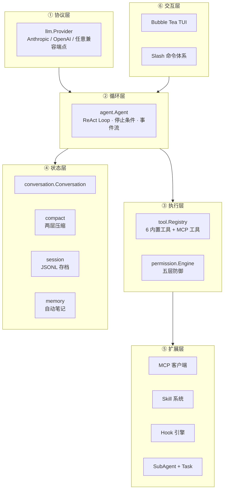

# MewCode — 从零手写的终端 AI Agent（面试主讲项目）

> 源码：[Bin-hy/EasyCoding](https://github.com/Bin-hy/EasyCoding) → 已作为 submodule 挂载在 `projects/EasyCoding`
> 规模：**13 个功能章节 / 115 个 Go 文件 / 约 1.78 万行 Go**，全部手写，无 Agent 框架兜底

---

## 一、一句话定位

**MewCode 是一个用 Go 从零实现的终端 Coding Agent（对标 Claude Code）：单二进制、双协议（Anthropic + OpenAI）、五层权限护栏、两层上下文压缩、MCP 工具生态、Skill/Hook/SubAgent 三级扩展。**

面试时的开场定位建议这样说：

> 我没有用 LangChain / Eino 这类框架，而是从零手写了 Agent 的完整运行时——因为它能让我把「Agent 到底是什么」这件事讲到字节级别：ReAct 循环怎么收敛、工具结果怎么回灌、上下文什么时候爆、权限在哪一层拦、多 Agent 怎么隔离上下文。
> 这个项目在架构上刻意对标 Claude Code，同时把它的隐式设计显式化成可验证的工程约束（每个能力都有 spec + checklist + 单测）。

---

## 二、为什么这个项目适合讲 Agent 岗位

Agent 岗位面试官真正想听的不是「我调过 API」，而是这几件事：

| 面试官想验证的能力 | 本项目的对应证据 |
|---|---|
| 你懂 ReAct 循环的**收敛与停止条件** | 25 轮迭代上限、连续 3 轮幻觉工具检测、历史一致性兜底（`ensureAssistantTail`） |
| 你懂**工具调用的并发与顺序语义** | 保序分批并发：连续只读并发、有副作用串行、结果按原始顺序回灌 |
| 你懂**上下文工程** | 两层压缩：工具结果落盘替换（50000/200000 字节阈值）+ LLM 摘要（9 段结构 + 恢复三段 + 熔断） |
| 你懂**Agent 安全** | 五层权限：黑名单 → 沙箱 → 规则引擎 → 模式兜底 → 人在回路 |
| 你懂**工具生态** | MCP 客户端（stdio + Streamable HTTP），配置驱动零改码接入，命名空间隔离 |
| 你懂**多 Agent 编排** | SubAgent（定义式 + Fork 式）、后台任务管理、三层权限升级链、五层工具过滤 |
| 你懂**协议抽象** | `llm.Provider` 接口屏蔽 Anthropic/OpenAI 差异，上层零感知；Prompt Cache 通道分离 |
| 你懂**工程化** | Spec 驱动开发（prompt→spec→plan→task→checklist）、`go test -race`、冒烟测试 |

---

## 三、能力地图（13 章 = 13 个可讲的深度点）



| 章节 | 主题 | 面试可讲的核心设计点 |
|---|---|---|
| ch02 | 多协议对话引擎 | Provider 接口、SSE 流式解析、工具调用增量参数拼接 |
| ch03 | 工具系统 | Tool 接口（含 `ReadOnly`）、注册中心、六个内置工具、错误即结果 |
| ch04 | **Agent Loop** | 多轮 ReAct、五类停止条件、保序分批并发、历史一致性 |
| ch05 | 系统提示工程化 | 7 模块按 priority 装配、缓存通道分离（stable / environment / reminder） |
| ch06 | **五层权限防御** | 黑名单、路径沙箱、三层规则引擎、四档模式矩阵、人在回路 |
| ch07 | MCP 客户端 | 双传输、两层配置合并、`mcp__server__tool` 命名空间、失败隔离 |
| ch08 | **上下文管理** | 工具结果落盘替换、token 锚点估算、两层摘要、熔断、紧急压缩重试 |
| ch09 | 记忆与会话 | MEWCODE.md 三层指令、JSONL 追加写、`/resume` 恢复、异步自动笔记 |
| ch10 | Slash 命令体系 | 命令注册表、Local/Prompt/UI/Skill 四类命令、补全 |
| ch11 | Skill 系统 | SKILL.md frontmatter、渐进式披露、工具白名单、install/load |
| ch12 | Hook 生命周期 | 11 个事件、条件匹配四态（exact/not/regex/glob）、`exit code 2` 阻断 |
| ch13 | **SubAgent 机制** | 定义式 / Fork 式、上下文隔离、后台任务、权限升级链、嵌套熔断 |

---

## 四、技术栈

| 领域 | 选型 | 说明 |
|---|---|---|
| 语言 | Go 1.25+ | 无 CGO，单二进制分发 |
| TUI | Bubble Tea v2 + Lip Gloss + Glamour | Elm 架构（Model/Update/View） |
| LLM SDK | `anthropic-sdk-go` / `openai-go` v3 | 双协议原生适配 |
| MCP | `modelcontextprotocol/go-sdk` | 官方 Go SDK |
| 配置 | YAML（`gopkg.in/yaml.v3`） | 两层/三层合并 |
| 并发 | goroutine + channel + `sync.Mutex` + `atomic` | `go test -race` 守护 |

---

## 五、项目结构（面试时画得出来的那种）

```
EasyCoding/
├── docs/ch02…ch13/          # 13 章 Spec 驱动文档（spec/plan/task/checklist）
└── mewcode/
    ├── cmd/mewcode/         # 入口：装配所有组件 → 启动 TUI
    ├── cmd/smoke/           # 非交互式冒烟测试
    └── internal/
        ├── llm/             # 协议抽象（provider / anthropic / openai）
        ├── config/          # YAML 配置
        ├── conversation/    # 对话历史（含持久化回调）
        ├── agent/           # ★ ReAct 内核（agent.go 1190 行）
        ├── tool/            # 工具抽象 + 注册中心 + 6 内置工具
        ├── permission/      # ★ 五层权限防御
        ├── compact/         # ★ 两层上下文压缩
        ├── prompt/          # 系统提示模块化装配
        ├── instructions/    # MEWCODE.md 三层加载 + @include
        ├── session/         # JSONL 会话存档
        ├── memory/          # 自动笔记（四类）
        ├── mcp/             # MCP 客户端
        ├── skills/          # Skill 目录 / 解析 / 执行 / 安装
        ├── hook/            # Hook 引擎（11 事件）
        ├── subagent/        # SubAgent 定义（内置 embed）
        ├── task/            # 后台任务管理器 + 4 个任务工具
        ├── command/         # Slash 命令注册表
        └── tui/             # Bubble Tea 界面
```

---

## 六、怎么跑起来

```bash
cd projects/EasyCoding/mewcode

# 1. 配置
cp .mewcode/config.yaml.example .mewcode/config.yaml
# 填入 api_key（Anthropic 或任意 OpenAI-compatible 端点）

# 2. 启动
go run ./cmd/mewcode

# 3. 测试
go test ./...
go test -race ./internal/agent/... ./internal/mcp/... ./internal/tui/...
```

---

## 七、阅读顺序建议（按面试准备节奏）

**第一遍（建立全景，约 1 小时）**
1. [项目全景与面试开场](/项目实战/mewcode/01-项目全景与面试开场) — 三档自我介绍 + 简历写法
2. [架构分层与依赖设计](/项目实战/mewcode/02-架构分层与依赖设计) — 一张图讲清全部模块

**第二遍（吃透内核，约 3 小时）**
3. [Agent 内核：ReAct 循环](/项目实战/mewcode/03-Agent内核与ReAct循环) — 面试最高频
4. [工具系统与执行编排](/项目实战/mewcode/04-工具系统与执行编排)
5. [权限与安全护栏](/项目实战/mewcode/05-权限与安全护栏)

**第三遍（拉开差距，约 4 小时）**
6. [上下文工程与压缩](/项目实战/mewcode/06-上下文工程与压缩) — 最能体现深度
7. [记忆、会话与项目指令](/项目实战/mewcode/07-记忆会话与项目指令)
8. [扩展机制：MCP / Skill / Hook](/项目实战/mewcode/08-扩展机制-MCP-Skill-Hook)
9. [SubAgent 与后台任务](/项目实战/mewcode/09-SubAgent与后台任务)
10. [多协议抽象与提示工程](/项目实战/mewcode/10-多协议抽象与提示工程)
11. [TUI 与 Go 并发模型](/项目实战/mewcode/11-TUI与Go并发模型)

**冲刺（面试前 1 天）**
12. [面试追问题库（120 问）](/项目实战/mewcode/12-面试追问题库)
13. [企业级 Agent 平台方案](/项目实战/mewcode/13-企业级Agent平台方案)

**随时查阅**
- [项目设计（ADR 决策记录）](/项目实战/mewcode/项目设计)

---

## 八、与其他两个项目的关系

| 项目 | 定位 | 关系 |
|---|---|---|
| RAG 文档问答系统 | 知识与检索能力 | RAG 可作为 MewCode 的一个 Tool 接入 |
| AI Agent Harness | 设计蓝图 / 视频剪辑场景 | MewCode 是该蓝图的**已落地实现**，且更完整 |
| **MewCode** | **可运行的 Agent 内核** | 面试主讲项目：能被追问、能被验证、能现场跑 |

> 讲项目时的推荐叙事：**「我先是照着 Claude Code 的形态设计了一个 Harness 蓝图（agent-harness 项目），然后意识到不亲手写一遍永远不会真正理解，于是用 Go 把它完整实现了一遍（MewCode）——13 章、1.7 万行、每章都有 spec 和 checklist。」**
